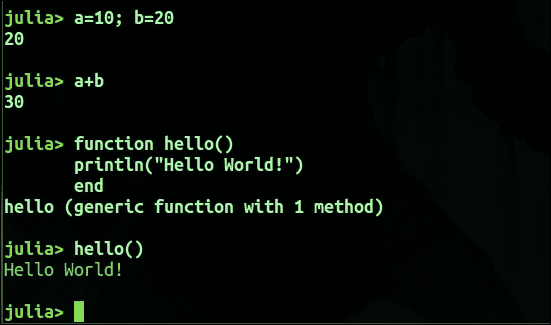

# 第一章. 基础工作——Julia 的环境

Julia 是一门相对年轻的编程语言。2009 年，三位开发者（Stefan Karpinski、Jeff Bezanson 和 Viral Shah）在麻省理工学院（MIT）应用计算组，在 Alan Edelman 教授的指导下，开始了一个项目，最终演变为 Julia。2012 年 2 月，Julia 公开发布并开源。源代码可以在 GitHub 上找到（[`github.com/JuliaLang/julia`](https://github.com/JuliaLang/julia)）。已注册包的源代码也可以在 GitHub 上找到。目前，最初的四位创始人以及来自世界各地的开发者都在积极为 Julia 做出贡献。

### 注意

当前版本为 0.4，距离 1.0 版本候选发布还有一段距离。

基于稳固的原则，它在科学计算、数据科学和高性能计算领域的受欢迎程度正在稳步上升。

本章将引导你完成所有必要的 Julia 组件的下载和安装。本章涵盖以下主题：

+   Julia 有什么不同？

+   设置 Julia 环境。

+   使用 Julia 的 Shell 和 REPL。

+   使用 Jupyter 笔记本

+   包管理

+   并行计算

+   多重分派

+   语言互操作性

传统上，科学界使用较慢的动态语言来构建应用程序，尽管这些应用程序需要最高的计算性能。有编程经验但并非经验丰富的开发者的领域专家总是更倾向于使用动态语言而非静态类型语言。

# Julia 与众不同

随着编译器技术和语言设计的进步，随着时间的推移，性能与动态原型之间的权衡已经可以被消除。因此，科学计算所需的就是像 Python 这样的良好动态语言，同时又有像 C 一样的性能。然后，Julia 诞生了，这是一种根据科学和技术计算需求设计的通用编程语言，提供了与 C/C++相当的性能，并且其环境足够高效，适合像 Python 那样的高层次动态语言进行原型设计。Julia 性能的关键在于它的设计和基于**低级虚拟机**（LLVM）的即时编译器，使得它能够接近 C 和 Fortran 的性能。

Julia 提供的主要特点是：

+   一种设计为在数值和科学计算中有效的通用高层次动态编程语言

+   一个基于**低级虚拟机**（**LLVM**）的**即时编译**（**JIT**）编译器，使得 Julia 能够接近像 C/C++这类静态编译语言的性能

以下引用来自 Julia 开发团队——Jeff Bezanson、Stefan Karpinski、Viral Shah 和 Alan Edelman：

### 注意

**我们是贪婪的：我们想要更多。**

我们需要一种开源的语言，具有宽松的许可证。我们希望它能具备 C 的速度和 Ruby 的动态性。我们希望它是一种自同构的语言，拥有类似 Lisp 的真正宏功能，但又能像 Matlab 一样具有明显且熟悉的数学符号。我们希望它在通用编程中和 Python 一样易用，在统计分析中和 R 一样方便，在字符串处理上和 Perl 一样自然，在线性代数上和 Matlab 一样强大，在将程序结合在一起上和 Shell 一样优秀。我们希望它简单易学，同时也能满足最严苛黑客的需求。我们希望它是交互式的，并且是编译型的。

（我们是不是提到过它应该和 C 一样快？）

它常常与 Python、R、MATLAB 和 Octave 进行比较。这些语言已经存在了相当长的时间，Julia 受它们的影响很大，尤其是在数值和科学计算方面。虽然 Julia 在这方面表现非常出色，但它并不限于科学计算，它也可以用于 Web 开发和通用编程。

Julia 的开发团队旨在创建一种前所未有的强大与高效结合，同时不妥协易用性的语言。Julia 的核心大部分是用 C/C++ 实现的，Julia 的解析器是用 Scheme 编写的。Julia 高效且跨平台的 I/O 由 Node.js 的 libuv 提供支持。

Julia 的特点和优势可以总结如下：

+   它设计用于分布式和并行计算。

+   Julia 提供了大量的数学函数库，具有出色的数值精度。

+   Julia 提供了多重调度功能。多重调度是指使用多种参数类型组合来定义函数行为。

+   Pycall 包使 Julia 可以在代码中调用 Python 函数，并使用 Matlab.jl 调用 Matlab 包。用 C 编写的函数和库也可以直接调用，无需任何 API 或包装器。

+   Julia 提供了强大的类 Unix Shell 功能，用于管理系统中的其他进程。

+   与其他语言不同，Julia 中的用户定义类型既紧凑又非常快速，堪比内建类型。

+   数据分析大量使用矢量化代码来提高性能。Julia 消除了为了提升性能而进行代码矢量化的需求。用 Julia 编写的非矢量化代码可以和矢量化代码一样快。

+   它使用轻量级的“绿色”线程，也称为任务或协程、协作多任务处理或一次性延续。

+   Julia 拥有强大的类型系统。提供的转换既优雅又可扩展。

+   它对 Unicode 提供高效支持。

+   它具有元编程和类似 Lisp 的宏功能。

+   它内置了包管理器（Pkg）。

+   Julia 提供了高效、专业化的代码生成，能够针对不同的参数类型进行自动化处理。

+   它是免费的，开源的，并且使用 MIT 许可证。

# 环境设置

Julia 是免费的，可以从其官方网站下载，网址为：[`julialang.org/downloads/`](http://julialang.org/downloads/)。该网站还提供了详尽的文档、示例以及教程和社区的链接。文档可以以流行格式下载。

## 安装 Julia（Linux）

Ubuntu/Linux Mint 是最著名的 Linux 发行版之一，它们也提供了 Julia 的 deb 包。这些包同时支持 32 位和 64 位版本。

要安装 Julia，请添加 **PPA**（**个人软件包档案**）。Ubuntu 用户有特权使用 PPA，它被视为一个 apt 仓库，用来构建和发布 Ubuntu 源包。在终端中输入以下命令：

```py
sudo apt-get add-repository ppa:staticfloat/juliareleases 
sudo apt-get update 

```

这会添加 PPA 并更新仓库中的软件包索引。

现在安装 Julia：

```py
sudo apt-get install Julia 

```

安装完成。要检查安装是否成功，请在终端中输入以下命令：

```py
julia --version 

```

这会显示已安装的 Julia 版本。


要打开 Julia 的交互式 shell，在终端中输入 `julia`。要卸载 Julia，只需使用 `apt` 删除它：

```py
sudo apt-get remove julia 

```

对于 Fedora/RHEL/CentOS 或基于它们的发行版，请启用你所在版本的 EPEL 仓库。然后，点击提供的链接。使用以下命令启用 Julia 的仓库：

```py
dnf copr enable nalimilan/julia

```

或者复制相关的 `.repo` 文件，下载方式如下：

```py
/etc/yum.repos.d/

```

最后，在终端中输入以下命令：

```py
yum install julia

```

## 安装 Julia（Mac）

使用 Mac OS X 的用户需要点击下载的 `.dmg` 文件来运行磁盘映像。然后，将应用程序图标拖到 **Applications** 文件夹中。系统可能会提示你是否继续，因为该源来自互联网，因此被认为不安全。如果是从 Julia 官方网站下载的，可以点击继续。

也可以通过 homebrew 在 Mac 上安装 Julia，如下所示：

```py
brew update 
brew tap staticfloat/julia 
brew install julia 

```

安装完成。要检查安装是否成功，请在终端中输入以下命令：

```py
julia --version 

```

这会显示已安装的 Julia 版本。

## 安装 Julia（Windows）

根据你的系统配置（32 位/64 位），下载下载页面提供的 `.exe` 文件。通过运行下载的 `.exe` 文件来安装 Julia，这将把 Julia 解压到一个文件夹中。在该文件夹内有一个批处理文件 `julia.bat`，可以用来启动 Julia 控制台。

要卸载，请删除 `Julia` 文件夹。

## 探索源代码

对于爱好者，Julia 的源代码是开放的，鼓励用户通过添加功能或修复漏洞来贡献代码。以下是目录结构：

| `base/` | Julia 标准库的源代码 |
| --- | --- |
| `contrib/` | Julia 源代码的编辑器支持，杂项脚本 |
| `deps/` | 外部依赖项 |
| `doc/manual` | 用户手册的源代码 |
| `doc/stdlib` | 标准库功能帮助文本的源代码 |
| `examples/` | Julia 示例程序 |
| `src/` | Julia 语言核心的源代码 |
| `test/` | 测试套件 |
| `test/perf` | 基准测试套件 |
| `ui/` | 各种前端的源代码 |
| `usr/` | Julia 标准库加载的二进制文件和共享库 |

# 使用 REPL

Read-Eval-Print-Loop 是一个交互式 shell，或者称为语言 shell，提供了测试代码片段的功能。Julia 提供了一个带有即时编译器（Just-in-Time compiler）的交互式 shell。我们可以在一行中输入内容，系统会进行编译和评估，结果会在下一行显示。



使用 REPL 的好处是我们可以测试代码是否有错误。此外，它还是初学者的一个很好的环境。我们可以输入表达式并按 *Enter* 键进行评估。

可以通过 `include` 将一个 Julia 库或自定义编写的 Julia 程序包含到 REPL 中。例如，我有一个名为 `hello.jl` 的文件，我可以通过以下方式将其包含到 REPL 中：

```py
julia> include ("hello.jl") 

```

Julia 还会将所有在 REPL 中输入的命令保存在 `.julia_history` 文件中。该文件位于 Ubuntu 的 `/home/$USER`、Windows 的 `C:\Users\username` 或 macOS 的 `~/.julia_history`。

与 Linux 终端类似，我们可以在 Julia 的 shell 中使用 *Ctrl* + *R* 进行反向搜索。这是一个非常好的功能，因为我们可以回顾已经输入的命令历史。

在语言 shell 中输入 `?` 将会将提示符更改为：

```py
help?> 

```


要清除屏幕，按 *Ctrl* + *L*。要退出 REPL，按 *Ctrl* + *D* 或输入以下命令：

```py
julia> exit(). 

```

# 使用 Jupyter Notebook

数据科学和科学计算有幸拥有一个令人惊叹的交互式工具——Jupyter Notebook。使用 Jupyter Notebook，你可以在一个互动的网页环境中编写和运行代码，它还支持可视化、图片和视频等功能。它让方程的测试和原型设计变得更加轻松。它支持超过 40 种编程语言，并且完全开源。

GitHub 支持 Jupyter 笔记本。包含计算记录的笔记本可以通过 Jupyter 笔记本查看器或其他云存储分享。Jupyter 笔记本广泛用于编写机器学习算法、统计建模、数值模拟和数据清洗。

Jupyter Notebook 是用 Python 实现的，但你可以运行任何 40 种语言的代码，只要你安装了相应的内核。你可以通过在终端中输入以下命令来检查是否已安装 Python：

```py
python -version 

```

这将返回系统中 Python 的版本信息。如果系统中安装了 Python，最好是版本 2.7.x 或 3.5.x 或更高版本。

如果没有安装 Python，你可以通过从官方网站下载并安装（适用于 Windows）。对于 Linux，输入以下命令应该可以安装：

```py
sudo apt-get install python 

```

如果您是 Python 和数据科学的新手，强烈建议安装 Anaconda。数据科学、数值和科学计算中常用的包，包括 Jupyter 笔记本，都与 Anaconda 捆绑在一起，这使得它成为设置环境的首选方式。安装说明可以在[`www.continuum.io/downloads`](https://www.continuum.io/downloads)上找到。

Jupyter 存在于 Anaconda 包中，但您可以通过键入以下命令检查 Jupyter 包是否是最新的：

```py
conda install jupyter 

```

安装 Jupyter 的另一种方法是使用`pip`：

```py
pip install jupyter 

```

要检查 Jupyter 是否正确安装，请在终端中键入以下命令：

```py
jupyter -version 

```

如果 Jupyter 已安装，它应该会显示版本号。

现在，要在 Jupyter 中使用 Julia，我们需要`IJulia`包。可以使用 Julia 的包管理器安装该包。

安装 IJulia 后，我们可以在 Jupyter 中通过选择**笔记本**部分下的 Julia 来创建新的笔记本。


要获取所有包的最新版本，在 Julia 的 Shell 中键入以下命令：

```py
julia> Pkg.update() 

```

之后，通过键入以下命令添加 IJulia 包：

```py
julia> Pkg.add("IJulia") 

```

在 Linux 中，您可能会遇到一些警告，因此最好构建该包：

```py
julia> Pkg.build("IJulia") 

```

安装 IJulia 后，返回终端并启动 Jupyter 笔记本：

```py
jupyter notebook 

```

一个浏览器窗口将会打开。在**新建**选项下，您将找到已安装内核的选项来创建新笔记本。由于我们想要启动一个 Julia 笔记本，因此选择**Julia 0.4.2**。这将启动一个新的 Julia 笔记本。您可以尝试一个简单的示例。

在这个示例中，我们正在创建一个随机数的直方图。这只是一个示例，我们将在接下来的章节中详细研究使用的组件。


流行的编辑器如 Atom 和 Sublime 都有 Julia 插件。Atom 有语言—julia，Sublime 有 Sublime—IJulia，二者都可以从它们的包管理器下载。

# 包管理

Julia 提供了内置的包管理器。使用 Pkg，我们可以安装用 Julia 编写的库。对于外部库，我们还可以从源代码进行编译，或使用操作系统的标准包管理器。注册包的列表可在[`pkg.julialang.org`](http://pkg.julialang.org)上找到。

Pkg 在基础安装中提供。Pkg 模块包含所有包管理命令。

## Pkg.status() – 包状态

`Pkg.status()`是一个函数，打印出当前已安装包的列表及其摘要。当您需要知道要使用的包是否已安装时，这非常方便。

当第一次运行`Pkg`命令时，包目录会自动创建。该命令要求`Pkg.status()`返回已安装包的有效列表。由`Pkg.status()`提供的包列表是由 Pkg 管理的已注册版本。

`Pkg.installed()`也可以用来返回所有已安装包及其版本的列表。


## Pkg.add() – 添加包

Julia 的包管理器是声明式的且智能的。你只需要告诉它你想要什么，它会计算出需要安装的版本，并在有依赖关系时进行解决。因此，我们只需添加所需的包列表，它会自动解决需要安装的包及其版本。

`~/.julia/v0.4/REQUIRE`文件包含包的需求。我们可以使用文本编辑器如 vi 或 atom 打开它，或在 Julia 的 shell 中使用`Pkg.edit()`来编辑这个文件。编辑完文件后，运行`Pkg.resolve()`来安装或删除包。

我们还可以使用`Pkg.add(package_name)`来添加包，使用`Pkg.rm(package_name)`来删除包。之前，我们使用`Pkg.add("IJulia")`来安装 IJulia 包。

当我们不再想在系统中安装某个包时，可以使用`Pkg.rm()`从`REQUIRE`文件中删除该包的需求。与`Pkg.add()`类似，`Pkg.rm()`首先从`REQUIRE`文件中移除包的需求，然后通过运行`Pkg.resolve()`来更新已安装包的列表以匹配。

## 使用未注册包

我们经常希望能够使用我们团队成员创建的或有人在 Git 上发布的包，但它们不在 Pkg 的注册包中。Julia 通过使用克隆来支持这种情况。Julia 包托管在 Git 仓库中，并可以使用 Git 支持的机制进行克隆。注册包的索引保存在`METADATA.jl`中。对于非官方包，我们可以使用以下命令：

```py
Pkg.clone("git://example.com/path/unofficialPackage/Package.jl.git") 

```

有时，未注册的包可能有依赖关系，在使用之前需要满足。如果是这种情况，那么在未注册包的源代码树顶部需要一个`REQUIRE`文件。该`REQUIRE`文件确定了未注册包对已注册包的依赖关系。当我们运行`Pkg.clone(url)`时，这些依赖关系会被自动安装。

### Pkg.update() – 包更新

拥有更新的包是非常好的。Julia 作为一个活跃开发的项目，它的包经常更新并添加新的功能。

要更新所有包，请键入以下命令：

```py
Pkg.update() 

```

在后台，新的更改被拉入位于`~/.julia/v0.4/`目录下的 METADATA 文件，并且检查自上次更新以来是否有任何新的注册包版本发布。如果有新的注册包版本，`Pkg.update()`将尝试更新那些未被修改且已签出的包。这一更新过程通过计算要安装的最优包版本集来满足顶级需求。必须安装的特定版本包在 Julia 的`~/.julia/v0.4/`目录中的 REQUIRE 文件中定义。

## METADATA 仓库

注册的包会使用官方的 `METADATA.jl` 仓库进行下载和安装。如果需要，也可以提供不同的 `METADATA` 仓库位置：

```py
julia> Pkg.init("https://julia.customrepo.com/METADATA.jl.git", "branch") 

```

## 开发包

Julia 允许我们查看源代码，并且由于它是由 Git 跟踪的，所有已安装包的完整开发历史都可用。我们还可以进行所需的修改并提交到我们自己的仓库，或者进行 bug 修复并将增强功能贡献到上游。

你也可能想在某个时候创建自己的包并发布它们。Julia 的包管理器也允许你这样做。

系统上必须安装 Git，并且开发者需要在其选择的托管提供商（如 GitHub、Bitbucket 等）上拥有一个账户。最好能通过 SSH 进行通信—为了实现这一点，上传你的公钥到托管提供商。

## 创建新包

最好在包的仓库中包含 `REQUIRE` 文件。这个文件应该至少包含关于 Julia 版本的基本描述。

例如，如果我们想创建一个新的 Julia 包，名为 `HelloWorld`，我们将有如下内容：

```py
Pkg.generate("HelloWorld", "MIT") 

```

在这里，`HelloWorld` 是我们要创建的包，`MIT` 是我们的包将使用的许可证。许可证应该为包生成器所知。

这将创建一个目录，如下所示：`~/.julia/v0.4/HelloWorld`。创建的目录会初始化为一个 Git 仓库。同时，包所需的所有文件都保存在这个目录中。这个目录随后会被提交到仓库中。

现在可以将其推送到远程仓库，供全世界使用。

# 使用 Julia 进行并行计算

现代计算的发展导致系统中出现多核 CPU，有时这些系统会被组合成一个集群，能够执行单一系统可能无法独立完成的任务，或者即使完成了，所需时间也不可接受。Julia 的并行处理环境基于消息传递。允许多个进程在独立的内存域中运行程序。

在 Julia 中，消息传递的实现方式与其他流行环境（如 MPI）不同。Julia 提供了单向通信，因此程序员只需显式地管理两个进程操作中的一个进程。

Julia 的并行编程范式基于以下内容：

+   远程引用

+   远程调用

在另一个进程上运行函数的请求称为远程调用。通过特定进程上的另一个对象对对象的引用称为远程引用。远程引用是大多数分布式对象系统中使用的构造。因此，通过某些特定的参数，由不同进程的对象发出的调用，通常会返回对远程对象的引用，这个引用被称为远程引用。

远程调用返回一个指向其结果的远程引用。远程调用会立即返回。发出调用的进程继续执行下一操作。与此同时，远程调用在其他地方发生。对其远程引用调用`wait()`会等待远程调用完成。可以使用`fetch()`获得结果的完整值，`put!()`用于将结果存储到远程引用中。

Julia 使用单进程作为默认设置。要以多个处理器启动 Julia，请使用以下命令：

```py
julia -p n

```

其中 n 是工作进程的数量。或者，也可以通过使用`addproc(n)`从运行中的系统创建额外的处理器。建议将 n 设置为系统中 CPU 核心的数量。

`pmap`和`@parallel`是最常用且最有用的两个函数。

Julia 提供了一个*并行 for 循环*，用于并行运行多个进程。它的使用方式如下。


*并行 for 循环*通过将多个进程分配给不同的迭代，然后对结果进行归约（在这个案例中是(+)）来工作。它与 map-reduce 概念有些相似。迭代将在不同的进程上独立执行，最终这些进程得到的结果会被组合在一起（就像 map-reduce）。一个循环的结果也可以成为另一个循环的输入。答案是这个整个并行循环的结果。

它与普通的迭代循环非常不同，因为迭代不按照特定的顺序发生。由于迭代在不同的进程上运行，任何对变量或数组的写入在全局范围内是不可见的。所使用的变量会被复制并广播到每个并行 for 循环的进程中。

例如：

```py
arr = zeros(500000) 
@parallel for i=1:500000 
  arr[i] = i 
end 

```

这不会得到预期的结果，因为每个进程都会获得自己独立的`arr`副本。向量不会按预期填充`i`。我们必须避免使用这种*并行 for 循环*。

`pmap`指的是并行映射。例如：


这段代码解决了当我们有多个大型随机矩阵，并且需要并行地获取其奇异值的问题。

Julia 的`pmap()`设计得不同。它非常适合每次函数调用处理大量工作量的情况，而`@parallel`适用于涉及众多小迭代的情形。`pmap()`和`@parallel`都利用工作节点进行并行计算。然而，在`@parallel`中，调用进程发源的节点会进行最终的归约。

# Julia 的关键特性——多重分派

函数是一个对象，它使用某些表达式将参数元组映射到返回值。当这个函数对象无法返回值时，它会抛出异常。对于不同类型的参数，同一个概念函数可以有不同的实现。例如，我们可以有一个函数来加两个浮点数，另一个函数来加两个整数。但从概念上讲，我们只是在加两个数字。Julia 提供了一种功能，使得同一概念的不同实现能够轻松实现。这些函数不需要一次性定义。它们是通过小的抽象来定义的。这些小抽象对应不同的参数类型组合，并具有与之相关的不同行为。定义这些行为之一的过程叫做方法（method）。

方法定义接受的参数类型和数量通过其签名的注释来表示。因此，每当使用一组特定的参数调用函数时，都会应用最合适的方法。在函数调用时应用一个方法被称为派发（dispatch）。传统的面向对象语言只考虑派发中的第一个参数。而 Julia 有所不同，它会考虑所有函数的参数（不仅仅是第一个），然后选择应该调用的方法。这被称为多重派发（multiple dispatch）。

多重派发对于数学和科学代码特别有用。我们不应该认为操作只属于某一个参数，而不属于其他参数。实现数学运算符时，会考虑所有的参数类型。多重派发不仅限于数学表达式，它可以应用于众多现实世界的场景，并且是一种强大的程序结构设计范式。

## 多重派发中的方法

`+` 是一个使用多重派发的 Julia 函数。Julia 的所有标准函数和操作符都使用多重派发。对于各种可能的参数类型和数量的组合，每种组合都有许多方法来定义它们的行为。使用`::`类型断言操作符，方法限制只能接受某些类型的参数：

```py
julia> f(x::Float64, y::Float64) = x + y 

```

该函数定义仅适用于`x`和`y`都为`Float64`类型的值时的调用：

```py
julia> f(10.0, 14.0) 
24.0 

```

如果我们尝试将这个定义应用到其他类型的参数，它将会给出方法错误。


参数必须与函数定义中精确指定的类型相同。

函数对象在第一个方法定义时创建。新的方法定义会为现有的函数对象添加新的行为。当函数被调用时，会匹配参数的数量和类型，并执行最具体的匹配方法定义。

以下示例创建了一个具有两个方法的函数。第一个方法定义接受两个`Float64`类型的参数并将其相加。第二个方法定义接受两个`Number`类型的参数，将其乘以 2 并相加。当我们用`Float64`类型的参数调用该函数时，第一个方法定义会被应用；而当我们用整数类型的参数调用该函数时，第二个方法定义会被应用，因为数字可以接受任何数值。在以下示例中，我们通过多重派发来操作浮点数和整数。


在 Julia 中，所有值都是抽象类型"Any"的实例。当没有使用`::`进行类型声明时，表示该参数类型没有明确指定，因此`Any`是方法参数的默认类型，它没有限制可以接受任何类型的值。通常，一个方法定义是为了应用于某些没有其他方法定义适用的参数。它是 Julia 语言最强大的功能之一。

利用 Julia 的多重派发和灵活的参数化类型系统，可以高效地生成专门的代码并实现复杂的算法，而无需过多关注底层实现，且表达能力非常强。

## 歧义 – 方法定义

有时，函数的行为定义方式可能导致对于某些参数集没有唯一的方法可应用。在这种情况下，Julia 会抛出关于这种歧义的警告，但会继续执行并随机选择一个方法。为了避免这种歧义，我们应该定义一个方法来处理这种情况。

在下面的示例中，我们定义了一个方法定义，具有一个类型为`Any`的参数和一个类型为`Float64`的参数。在第二个方法定义中，我们只是改变了参数的顺序，但这并没有将其与第一个定义区分开。在这种情况下，Julia 会发出歧义的方法定义警告，但仍然允许我们继续执行。


# 促进语言互操作性

尽管 Julia 可以用来编写大多数类型的代码，但我们希望利用一些成熟的数值计算和科学计算库。这些库可能是用 C、Fortran 或 Python 编写的。Julia 允许轻松使用现有的 Python、C 或 Fortran 代码。通过让 Julia 调用简单且高效的 C、Fortran 或 Python 函数，可以轻松实现这一目标。

C/Fortran 库应当可以供 Julia 使用。通过`ccall`进行常规但有效的调用。这种调用方式只有在代码作为共享库时才可行。Julia 的 JIT 会生成与本地 C 调用相同的机器指令，因此与通过 C 代码调用没有什么不同，且开销极小。

导入 Python 代码在数据科学中非常有用，甚至是必需的，因为 Python 已经有了一个完整的机器学习和统计函数库。例如，它包含了 scikit-learn 和 pandas。要在 Julia 中使用 Python，我们需要 `PyCall.jl`。添加 `PyCall.jl` 的方法如下：

```py
Pkg.add("PyCall") 

```


PyCall 提供了一个宏 `@pyimport`，可以简化导入 Python 包的过程，并为其中的所有函数和常量提供 Julia 封装，包括自动转换 Julia 与 Python 之间的类型。

PyCall 还提供了对 Python 对象的低级操作功能，包括一个用于不透明 Python 对象的 PyObject 类型。它还提供了一个 `pycall` 函数（类似于 Julia 的 `ccall` 函数），可以在 Julia 中调用 Python 函数并进行类型转换。PyCall 不使用 Python 程序，而是直接链接到 `libpython` 库。在 `Pkg.build` 过程中，它通过调用 Python 查找 `libpython` 的位置。

## 在 Julia 中调用 Python 代码

`@pyimport` 宏在大多数情况下会根据 Python 对象的运行时检查自动进行适当的类型转换为 Julia 类型。通过使用低级函数，它能更好地控制这些类型转换。在返回类型已知的情况下使用 PyCall，可以帮助提升性能，既可以消除运行时类型推断的开销，又可以为 Julia 编译器提供更多的类型信息：

+   `pycall(function::PyObject, returntype::Type, args...)`：此函数调用给定的 Python 函数（通常从模块中查找），并传入给定的 `args...`（这些参数是标准的 Julia 类型，如果可能的话，会自动转换为相应的 Python 类型），并将返回值转换为 `returntype`（如果要返回未转换的 Python 对象引用，请使用 `returntype` 为 PyObject，或使用 PyAny 来请求自动转换）。

+   `pyimport(s)`：此函数导入 Python 模块（可以是字符串或符号），并返回一个指向该模块的指针（一个 PyObject）。然后，可以通过 s[name] 查找模块中的函数或其他符号，其中 name 可以是字符串（用于原始 PyObject）或符号（用于自动类型转换）。与 `@pyimport` 宏不同，它不会定义一个 Julia 模块，成员不能通过 `s.name` 访问。

# 总结

在本章中，我们了解了 Julia 的不同之处，以及基于 LLVM 的 JIT 编译器如何使 Julia 接近 C/C++ 的性能。我们介绍了如何下载、安装和从源代码构建 Julia。我们发现的显著特点是，这种语言优雅、简洁、强大，并且在数值计算和科学计算方面具有惊人的能力。

我们通过命令行（REPL）进行了一些使用 Julia 的示例，并看到了这个语言的外壳功能丰富。所发现的功能包括自动补全、反向搜索和帮助功能。我们还讨论了为什么要使用 Jupyter Notebook，并继续设置了带有 IJulia 包的 Jupyter。我们用一个简单的例子演示了如何使用 Jupyter Notebook 和 Julia 的可视化包 Gadfly。

此外，我们学习了 Julia 强大的内置包管理功能，以及如何添加、更新和删除模块。同时，我们也学习了如何创建自己的包并发布到社区。我们还向你介绍了 Julia 的一个强大特性——多重派发，并通过一些基本示例演示了如何创建方法定义来实现多重派发。

此外，我们向你介绍了并行计算，解释了它与传统的消息传递方式有何不同，以及如何利用所有可用的计算资源。我们还学习了 Julia 的语言互操作性特性，了解了如何从 Julia 程序中调用 Python 模块或库。

# 参考文献

+   [`julialang.org/`](http://julialang.org/)

+   [`github.com/JuliaLang`](https://github.com/JuliaLang)

+   [`github.com/JuliaStats`](https://github.com/JuliaStats)
