# 第二章 数据清洗

据说数据科学家的大约 50%的时间都用于将原始数据转换为可用格式。原始数据可以是任何格式或大小。它可以是像关系数据库管理系统（RDBMS）这样的结构化数据，像 CSV 这样的半结构化数据，或像普通文本文件这样的非结构化数据。这些数据包含一些有价值的信息。为了提取这些信息，必须将其转换为一种数据结构或可用格式，供算法从中发现有价值的见解。因此，可用格式指的是可以在数据科学过程中被使用的模型中的数据。这种可用格式根据使用案例的不同而有所不同。

本章将指导你完成数据清洗过程，或者说是数据准备过程。内容包括以下主题：

+   什么是数据清洗？

+   DataFrames.jl

+   从文件上传数据

+   查找所需数据

+   联接和索引

+   分割-应用-合并策略

+   数据重塑

+   公式（ModelFrame 和 ModelMatrix）

+   PooledDataArray

+   网络抓取

# 什么是数据清洗？

数据清洗一词来源于“munge”一词，该词由美国麻省理工学院（MIT）的一些学生创造。它被认为是数据科学过程中最基本的部分之一；它涉及收集、聚合、清理和组织数据，以供设计好的算法进行发现或创建模型。这包括多个步骤，其中包括从数据源提取数据，然后将数据解析或转换为预定义的数据结构。数据清洗也被称为数据整理。

## 数据清洗过程

那么，什么是数据清洗过程呢？如前所述，数据可以是任何格式，且数据科学过程可能需要来自多个来源的数据。这个数据聚合阶段包括从网站抓取数据、下载成千上万的`.txt`或`.log`文件，或从关系数据库管理系统（RDBMS）或 NoSQL 数据存储中收集数据。

很少能找到可以直接用于数据科学过程的数据格式。收到的数据通常是不适合建模和分析的格式。通常，算法需要数据以表格格式或矩阵形式存储。将收集到的原始数据转换为所需格式的阶段可能非常复杂且耗时。但这个阶段为现在可以进行的复杂数据分析打下了基础。

提前定义将输入到算法中的数据结构是很好的做法。这个数据结构是根据问题的性质定义的。你设计或将要设计的算法不仅要能够接受这种格式的数据，还应该能够轻松识别模式，找到异常值，做出发现，或满足任何所需的结果。

在定义数据的结构之后，您需要定义实现该结构的过程。这就像一个管道，接受某些形式的数据，并以预定义的格式输出有意义的数据。这个阶段包含多个步骤。这些步骤包括将数据从一种形式转换为另一种形式，这可能需要也可能不需要字符串操作或正则表达式，并且需要找到缺失值和异常值。

通常，数据科学问题涉及两种类型的数据。这两种数据将是分类数据或数值数据。分类数据带有标签。这些标签由一组值组成。例如，我们可以将天气视为具有分类特征的数据。天气可以是晴天、多云、下雨、雾霾或雪天。当底层值与数据中的某一组（属于一个标签）关联时，就会形成这些标签。这些标签具有一些独特的特性，我们可能无法对它们进行算术运算。

数值数据更为常见，例如温度。温度将以浮动点数表示，我们当然可以对其应用数学运算。每个值都可以与数据集中的其他值进行比较，因此我们可以说它们彼此之间有直接的关系。

# 什么是 DataFrame？

DataFrame 是一种数据结构，具有标签化的列，每一列可能具有不同的数据类型。像 SQL 表格或电子表格一样，它具有二维结构。它也可以被看作是一个字典的列表，但从根本上讲，它是不同的。

DataFrames 是进行统计分析时推荐的数据结构。Julia 提供了一个名为 `DataFrames.jl` 的包，它包含了所有必要的函数来处理 DataFrame。

Julia 的 DataFrames 包提供了三种数据类型：

+   `NA`：在 Julia 中，缺失值通过一个特定的数据类型 `NA` 表示。

+   `DataArray`：在标准 Julia 库中定义的数组类型，尽管它具有许多功能，但并未提供任何专门用于数据分析的功能。`DataFrames.jl` 中提供的 DataArray 提供了这些功能（例如，如果我们需要在数组中存储缺失值）。

+   `DataFrame`：DataFrame 是一个二维数据结构，像电子表格一样。它非常类似于 R 或 pandas 的 DataFrame，提供了许多功能来表示和分析数据。

## NA 数据类型及其重要性

在现实世界中，我们常常遇到带有缺失值的数据。这是非常常见的，但 Julia 默认情况下并不提供这一功能。这个功能是通过 `DataFrames.jl` 包来添加的。DataFrames 包带来了 DataArray 包，它提供了 NA 数据类型。多重派发是 Julia 最强大的特性之一，NA 就是一个例子。Julia 有 NA 类型，提供了一个单例对象 NA，我们用它来表示缺失值。

为什么需要 NA 数据类型？

假设我们有一个包含浮动点数的数据集：

```py
julia> x = [1.1, 2.2, 3.3, 4.4, 5.5, 6.6]

```

这将创建一个六元素的 `Array{Float64,1}`。

现在，假设这个数据集在位置[1]处有一个缺失值。这意味着，1.1 的位置没有值。这不能通过 Julia 的数组类型表示。当我们尝试分配一个 NA 值时，会出现这个错误：

```py
julia> x[1] = NA 
LoadError: UndefVarError: NA not defined 
while loading In[2], in expression starting on line 1 

```

因此，目前我们无法将`NA`值添加到我们创建的数组中。

所以，为了将数据加载到包含`NA`值的数组中，我们使用`DataArray`。这使我们能够在数据集中包含 NA 值：

```py
julia> using DataArrays 
julia> x = DataArray([1.1, 2.2, 3.3, 4.4, 5.5, 6.6]) 

```

这将创建一个六元素的`DataArrays.DataArray{Float64,1}`。

所以，当我们尝试包含`NA`值时，它会返回：

```py
julia> X[1] = NA 
NA 
julia> x 
6-element DataArrays.DataArray{Float64,1}: 
 1.1 
 2.2 
 3.3 
 4.4 
 5.5 
 6.6 

```

因此，通过使用 DataArrays，我们可以处理缺失数据。另一个提供的功能是，NA 值并不总是影响应用于特定数据集的函数。因此，那些不涉及 NA 值或不受其影响的方法可以应用于数据集。如果涉及 NA 值，那么结果将是 NA。

在以下示例中，我们正在应用均值函数和`true || x`。由于涉及 NA 值，均值函数无法正常工作，而`true || x`则按预期工作：

```py
julia> true || x 
True 

julia> true && x[1] 
NA 

julia> mean(x) 
NA 

julia> mean(x[2:6]) 
4.4 

```

## DataArray – 类似系列的数据结构

在前一部分中，我们讨论了如何使用 DataArrays 来存储包含缺失（NA）值的数据集，因为 Julia 的标准数组类型无法做到这一点。

还有一些与 Julia 的数组类型类似的特性。DataArray 提供了 Vector（一维数组类型）和 Matrix（二维数组类型）的类型别名，分别是 DataVector 和 DataMatrix。

创建一个一维 DataArray 类似于创建一个数组：

```py
julia> using DataArrays
julia> dvector = data([10,20,30,40,50])
5-element DataArrays.DataArray{Int64,1}:
10
20
30
40
50

```

在这里，我们有 NA 值，不像数组中那样。类似地，我们可以创建一个二维 DataArray，它将是一个 DataMatrix。

```py
julia> dmatrix = data([10 20 30; 40 50 60])
2x3 DataArrays.DataArray{Int64,2}:
10 20 30
40 50 60
julia> dmatrix[2,3]
60

```

在前面的例子中，我们通过切片来计算均值。这并不是一个方便的方式来在应用函数时忽略或排除 NA 值。一个更好的方法是使用`dropna`：

```py
julia> dropna(x)
5-element Array{Float64,1}:
2.2
3.3
4.4
5.5
6.6

```

## DataFrames – 表格数据结构

可以说，这在统计计算中是最重要且最常用的数据类型，无论是在 R（data.frame）中，还是在 Python（Pandas）中。这是因为所有现实世界中的数据大多数以表格或类似电子表格的格式存在。这个格式不能仅通过简单的 DataArray 表示：

```py
julia> df = DataFrame(Name = ["Ajava Rhodiumhi", "Las Hushjoin"],
            Count = [14.04, 17.3],
            OS = ["Ubuntu", "Mint"])
```

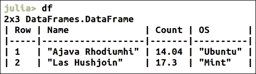

例如，这个数据集不能通过 DataArray 表示。给定的数据集具有以下特征，因此无法由 DataArray 表示：

+   这个数据集在不同的列中包含不同类型的数据。不同列中的不同数据类型无法通过矩阵表示。矩阵只能包含一种类型的值。

+   它是一个表格数据结构，记录与同一行中不同列的其他记录有关。因此，所有列必须具有相同的长度。不能使用向量，因为它们无法强制确保列的长度相同。因此，DataFrame 中的一列由 DataArray 表示。

+   在前面的例子中，我们可以看到列已被标记。这个标记帮助我们轻松熟悉数据并在无需记住精确位置的情况下访问它。因此，可以通过数字索引以及列标签来访问这些列。

因此，出于这些原因，使用了 DataFrames 包。DataFrames 用于表示具有 DataArrays 作为列的表格数据。

在给定的例子中，我们通过以下方式构建了一个 DataFrame：

```py
julia> df = DataFrame(Name = ["Ajava Rhodiumhi", "Las Hushjoin"], 
Count = [14.04, 17.3], 
OS = ["Ubuntu", "Mint"]) 

```

使用关键字参数，可以定义列名称。

让我们通过构建一个新的 DataFrame 来举个例子：

```py
julia> df2 = DataFrame() 

julia> df2[:X] = 1:10 

julia> df2[:Y] = ["Head", "Tail", 
"Head", "Head", 
"Tail", "Head", 
"Tail", "Tail", 
"Head", "Tail"] 
julia> df2 

```

要查看创建的 DataFrame 的大小，我们使用 size 函数：

```py
julia> size(df2) 
(10, 2) 

```

这里，`10`指的是行数，`2`指的是列数。

要查看数据集的前几行，我们使用`head()`，要查看最后几行，我们使用`tail()`函数：

```py
Julia> head(df2) 

```

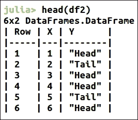

由于我们已为 DataFrame 的列命名，因此可以通过这些名称来访问它们。

例如：

```py
julia> df2[:X] 
10-element DataArrays.DataArray{Int64,1}: 
 1 
 2 
 3 
 4 
 5 
 6 
... 

```

这简化了对列的访问，因为我们可以为具有多个列的现实世界数据集赋予有意义的名称，而无需记住它们的数字索引。

如果需要，我们还可以使用`rename`函数通过这些列来重命名：

```py
Julia> rename!(df2, :X,  :newX) 

```

如果需要重命名多个列，可以使用以下方法：

```py
julia> rename!(df2, {:X => :newX, :Y => :newY}) 

```

但现在，为了方便起见，我们仍然使用旧的列名。

Julia 还提供了一个名为`describe()`的函数，可以概述整个数据集。对于包含许多列的数据集，它会非常有用：

```py
julia> describe(df2) X
Min 1.0
1st Qu. 3.25
Median 5.5
Mean 5.5
3rd Qu. 7.75
Max 10.0
NAs 0
NA% 0.0%

Y
Length 10
Type ASCIIString
NAs 0
NA% 0.0%
Unique 2

```

## 安装并使用 DataFrames.jl

安装非常简单，因为它是一个注册的 Julia 包：

```py
Julia> Pkg.update() 
julia> Pkg.add("DataFrames") 

```

这将所有必需的包添加到当前命名空间。要使用`DataFrames`包：

```py
julia> using DataFrames 

```

还应该有一些常用于学习的经典数据集。这些数据集可以在`RDatasets`包中找到：

```py
Julia> Pkg.add("RDatasets") 

```

可用的 R 包列表可以通过以下方式找到：

```py
julia> Rdatasets.packages() 

```

这里，你可以看到这个：

```py
datasets - The R Datasets Package 

```

它包含了可供 R 使用的数据集。要使用这个`dataset`，只需使用以下代码：

```py
using RDatasets 
iris_dataset = dataset("datasets", "iris") 

```

这里，`dataset`是一个接受两个参数的函数。

第一个参数是包的名称，第二个参数是我们要加载的数据集的名称。

在以下例子中，我们将著名的鸢尾花数据集加载到内存中。你可以看到`dataset()`函数返回了一个 DataFrame。该数据集包含五列：`SepalLength`、`SepalWidth`、`PetalLength`、`PetalWidth`和`Species`。数据非常容易理解。每个物种都有大量的样本，且测量了萼片和花瓣的长度和宽度，这些数据可以用于后续区分物种：

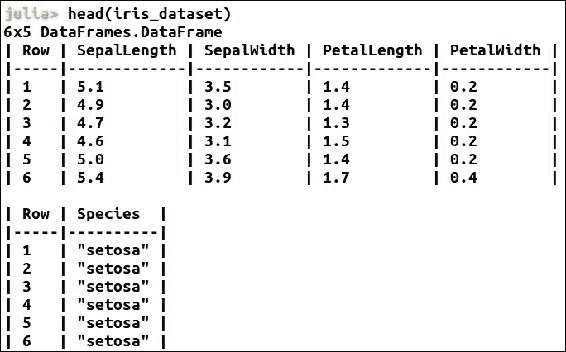

实际的数据科学问题通常不会处理人工随机生成的数据或通过命令行读取的数据。而是处理从文件或任何其他外部来源加载的数据。这些文件可以包含任何格式的数据，我们可能需要在加载到数据框之前对其进行处理。

Julia 提供了一个 `readtable()` 函数，可以用来读取数据框中的表格文件。通常，我们会遇到逗号分隔或制表符分隔的格式（CSV 或 TSV）。`readtable()` 能很好地处理这些格式。

我们可以将文件的位置作为 UTF8String 和分隔符类型作为参数传递给 `readtable()` 函数。默认的分隔符类型是逗号（','）用于 CSV，制表符（'\t'）用于 TSV，空格（' '）用于 WSV。

在下面的示例中，我们使用 `readtable()` 函数将示例 iris 数据集加载到数据框中。

尽管 iris 数据集可以在 RDatasets 包中找到，但我们将下载 CSV 文件以处理外部数据集。可以从 [`github.com/scikit-learn/scikit-learn/blob/master/sklearn/datasets/data/iris.csv`](https://github.com/scikit-learn/scikit-learn/blob/master/sklearn/datasets/data/iris.csv) 下载 iris CSV。

请记住将下载的 CSV 文件放入当前工作目录（即从 REPL 启动的目录—通常是 `~/home/<username>` 目录）：

```py
julia> using DataFramesjulia> df_iris_sample =
  readtable("iris_sample.csv",
  separator = ',')
julia> df_iris_sample

```

这是我们在前一个示例中使用的相同数据集，但现在我们是从 CSV 文件加载数据。

对于其他基于文本的数据集，如 TSV、WSV 或 TXT，`readtable()` 也以类似的方式使用。假设相同的 iris 数据集在 TSV、WSV 或 TXT 格式中，它的使用方式是类似的：

```py
julia> df_iris_sample = readtable("iris_dataset.tsv", 
separator='\t') 

```

举例来说，如果我们有一个没有头部且以 `;` 分隔的数据集，我们可以如下使用 `readtable()`：

```py
julia> df_random_dataset = readtable("random_dataset.txt",                                                                    header=false, separator=';') 

```

`readtable()` 利用了 Julia 的多重分派功能，并已根据不同的方法行为进行实现：

```py
julia> methods(readtable)
3 methods for generic function readtable:
readtable(io::IO) at /home/anshul/.julia/v0.4/DataFrames/src/dataframe/io.jl:820
readtable(io::IO, nbytes::Integer) at /home/anshul/.julia/v0.4/DataFrames/src/dataframe/io.jl:820
readtable(pathname::AbstractString) at /home/anshul/.julia/v0.4/DataFrames/src/dataframe/io.jl:930

```

我们可以看到 `readtable()` 函数有三种方法。

这些方法实现了一些高级选项，以简化加载并支持各种数据格式：

+   `header::Bool`：在我们使用的 iris 示例中，数据集包含如花萼长度、花萼宽度等头部信息，这使得描述数据更加容易。但数据集并不总是有头部信息。`header` 的默认值是 `true`；因此，当没有头部信息时，我们将该参数设置为 false。

+   `separator::Char`：文件中的数据必须按照一定的方式组织，以形成表格结构。这通常是通过使用 `,`、`\t`、`;` 或这些符号的组合来实现的。`readtable()` 根据文件扩展名猜测分隔符类型，但手动提供分隔符是一个好习惯。

+   `nastrings::Vector{ASCIIString}`：假设存在缺失值或其他值，我们希望用 NA 替换它们。通过 nastrings 可以实现这一点。默认情况下，它会将空记录替换为 NA。

+   `truestrings::Vector{ASCIIString}`: 这将字符串转换为布尔值 true。当我们希望数据集中一组字符串被视为 true 时使用。默认情况下，如果没有参数指定，`True`、`true`、`T` 和 `t` 会被转换为 true。

    +   `falsestrings::Vector{ASCIIString}`: 这与 truestrings 类似，但将字符串转换为布尔值 false。默认情况下，如果没有传递参数，`False`、`false`、`F` 和 `f` 会被转换为 false。

+   `nrows::Int`: 如果我们只想由 `readtable()` 读取特定数量的行，则使用 nrows 作为参数。默认情况下为 `-1`，这意味着 `readtable()` 将读取整个文件。

+   `names::Vector{Symbol}`: 如果我们希望为列指定特定名称，而不使用文件头中提到的名称，则使用 names。在这里，我们传递一个包含要使用的列名称的向量。默认情况下，它是 `[]`，这意味着如果存在文件头，则应使用其中的名称；否则必须使用数值索引。

+   `eltypes::Vector{DataType}`: 我们可以通过传递一个向量来指定列的类型，使用 eltypes。如果没有传递任何内容，默认情况下它是一个空向量（`[]`）。

+   `allowcomments::Bool`: 在数据集中，可能会有带有注释的记录。这些注释可以被忽略。默认情况下为 `false`。

+   `commentmark::Char`: 如果我们使用 allowcomments，还必须指定注释开始的字符（符号）。默认情况下为 `#`。

+   `ignorepadding::Bool`: 我们的数据集可能不如我们希望的那样完美。记录可能包含左右两侧的空白字符。可以使用 ignorepadding 忽略这些空白。默认情况下为 true。

+   `skipstart::Int`: 我们的数据集可能包含一些描述数据的行，而我们可能不需要或者只想跳过开头的几行。通过 skipstart 指定要跳过的行数来实现这一点。默认情况下为 0，将读取整个文件。

+   `skiprows::Vector{Int}`: 如果想要跳过数据中的特定行，则使用 skiprows。我们只需在一个向量中指定要跳过的行的索引。默认情况下为 `[]`，将读取整个文件。

+   `skipblanks::Bool`: 正如前面提到的，我们的数据集可能不完美。如果我们从网页上抓取数据或从其他来源提取数据，可能会有一些空白行。我们可以使用 skipblanks 跳过这些空白行。默认情况下为 true，但如果不想要，则可以选择其他设置。

+   `encoding::Symbol`: 如果文件的编码不是 UTF8，我们可以指定文件的编码。

### 将数据写入文件

我们也许希望输出结果或转换数据集并将其存储到文件中。在 Julia 中，我们使用 `writetable()` 函数来实现这一点。它与我们在上一节讨论的 `readtable()` 函数非常相似。

例如，我们想将 `df_iris_sample` 数据框写入 CSV 文件：

```py
julia> writetable("output_df_iris.csv", df_iris_sample)

```

这是一种使用默认参数集写入文件的方式。一个明显的区别是，我们传递了我们想要写入的文件名以及数据框（dataframe）。

`writetable()`同样接受各种参数，类似于`readtable()`。

我们也可以像这样定义分隔符来编写之前的语句：

```py
julia> writetable("output_df_iris.csv", df_iris_sample, separator = ',')

```

同样，我们也可以在参数中设置标题和引号。

## 使用 DataFrames

我们将遵循或继承一些传统的数据操作策略。在本节中，我们将讨论这些策略和方法，并探讨它们在数据科学中的重要性。

### 理解 DataFrames 连接

在处理多个数据集时，我们通常需要以特定的方式合并数据集，以便更容易进行分析或与特定的函数配合使用。

我们将使用由英国交通部发布的*道路安全数据*，该数据开放，适用 OGL-开放政府许可。

数据集可以在这里找到：[`data.gov.uk/dataset/road-accidents-safety-data`](https://data.gov.uk/dataset/road-accidents-safety-data)。

我们将使用两个数据集：

+   道路安全：2015 年事故数据

+   道路安全：2015 年车辆数据

### 注意

`DfTRoadSafety_Accidents_2015`包含的列有`Accident_Index`、`Location_Easting_OSGR`、`Location_Northing_OSGR`、`Longitude`、`Latitude`、`Police_Force`、`Accident_Severity`、`Number_of_Vehicles`、`Number_of_Casualties`、`Date`、`Day_of_Week`、`Time`等。`DfTRoadSafety_Vehicles_2015`包含的列有`Accident_Index`、`Vehicle_Reference`、`Vehicle_Type`、`Towing_and_Articulation`、`Vehicle_Manoeuvre`、`Vehicle_Location-Restricted_Lane`、`Junction_Location`、`Skidding_and_Overturning`、`Hit_Object_in_Carriageway`等。

我们可以看到`Accident_Index`是一个共同的字段，并且是唯一的。它被用作数据集的索引。

首先，我们将使 DataFrames 包可用，然后加载数据。我们使用之前讨论过的`readtable`函数将数据加载到两个不同的数据框中：

```py
julia> using DataFrames 

julia> DfTRoadSafety_Accidents_2015 = readtable("DfTRoadSafety_Accidents_2015.csv") 

julia> head(DfTRoadSafety_Accidents_2015) 

```

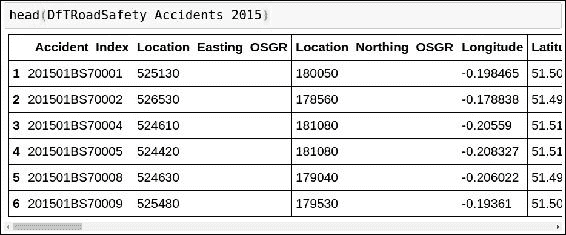

第一个数据集已经加载到 DataFrame 中，我们尝试使用`head`获取数据集的信息。它会显示一些起始的列。

如果我们更关心列的名称，可以使用`names`函数：

```py
julia> names(DfTRoadSafety_Accidents_2015) 
32-element Array{Symbol,1}: 
 :_Accident_Index                             
 :Location_Easting_OSGR                       
 :Location_Northing_OSGR                      
 :Longitude                                   
 :Latitude                                    
 :Police_Force                                
 :Accident_Severity                           
 :Number_of_Vehicles                          
 :Number_of_Casualties                        
 :Date                                        
 :Day_of_Week                                 
 :Time                                        
 :Local_Authority_District_                   

 :x2nd_Road_Class                             
 :x2nd_Road_Number                            
 :Pedestrian_Crossing_Human_Control           
 :Pedestrian_Crossing_Physical_Facilities     
 :Light_Conditions                            
 :Weather_Conditions                          
 :Road_Surface_Conditions                     
 :Special_Conditions_at_Site                  
 :Carriageway_Hazards                         
 :Urban_or_Rural_Area                         
 :Did_Police_Officer_Attend_Scene_of_Accident 
 :LSOA_of_Accident_Location 

```

同样，我们将在一个数据框中加载第二个数据集：

```py
julia> DfTRoadSafety_Vehicles_2015 = readtable("DfTRoadSafety_Vehicles_2015.csv") 

```

第二个数据集已经加载到内存中。

稍后我们将深入探讨，但现在我们先进行两个数据集的全连接操作。对这两个数据集进行连接将告诉我们哪起事故涉及了哪些车辆：

```py
julia> DfTRoadSafety_Vehicles_2015 = readtable("DfTRoadSafety_Vehicles_2015.csv") 

julia> full_DfTRoadSafety_2015 = 
join(DfTRoadSafety_Accidents_2015, 
DfTRoadSafety_Vehicles_2015, 
on = :_Accident_Index)

```

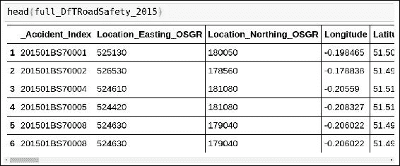

我们可以看到全连接（full join）已经成功执行。现在我们得到了数据，可以告诉我们事故发生的时间、车辆的位置以及更多细节。

这个好处是，连接操作非常简单，甚至在处理大数据集时也非常快速。

我们已经了解了关系数据库中其他可用的连接类型。Julia 的 DataFrames 包也提供了这些连接：

+   **内连接**：输出的 DataFrame 仅包含在两个 DataFrame 中都存在的键对应的行。

+   **左连接**：输出的 DataFrame 包含第一个（左）DataFrame 中存在的键的行，无论这些键是否存在于第二个（右）DataFrame 中。

+   **右连接**：输出的 DataFrame 包含第二个（右）DataFrame 中存在的键的行，无论这些键是否存在于第一个（左）DataFrame 中。

+   **外连接**：输出的 DataFrame 包含第一个或第二个 DataFrame 中存在的键的行，这些键是我们要连接的。

+   **半连接**：输出的 DataFrame 仅包含在第一个（左）DataFrame 中的那些键，且这些键在第一个（左）和第二个（右）DataFrame 中都存在。输出只包含来自第一个 DataFrame 的行。

+   **反连接**：输出的 DataFrame 包含第一个（左）DataFrame 中存在的键的行，但这些键在第二个（右）DataFrame 中没有对应的行。输出仅包含来自第一个 DataFrame 的行。

+   **交叉连接**：输出的 DataFrame 包含来自第一个 DataFrame（左）和第二个 DataFrame（右）的行的笛卡尔积。

交叉连接不涉及键；因此它的使用方式如下：

```py
julia> cross_DfTRoadSafety_2014 = join(DfTRoadSafety_Accidents_2014, DfTRoadSafety_Vehicles_2014, kind = :cross) 

```

在这里，我们使用 `kind` 参数传递我们想要的连接类型。其他连接也是通过这个参数来完成的。

我们想要使用的连接类型是通过 `kind` 参数来指定的。

让我们通过一个更简单的数据集来理解这一点。我们将创建一个 DataFrame，并在其上应用不同的连接：

```py
julia> left_DfTRoadSafety_2014 = join(DfTRoadSafety_Accidents_2014, DfTRoadSafety_Vehicles_2014, on = :_Accident_Index, kind = :left) 

```

对于左连接，我们可以使用：

```py
julia> Cities = ["Delhi","Amsterdam","Hamburg"][rand(1:3, 10)] 

julia> df1 = DataFrame(Any[[1:10], Cities, 
        rand(10)], [:ID, :City, :RandomValue1]) 

julia> df2 = DataFrame(ID = 1:10, City = Cities, 
        RandomValue2 = rand(100:110, 10))  

```

这创建了两个具有 10 行的 DataFrame。第一个 DataFrame df1 有三列：`ID`、`City` 和 `RandomValue1`。第二个 DataFrame df2 也有三列：`ID`、`City` 和 `RandomValue2`。

应用全连接时，我们可以使用：

```py
julia> full_df1_df2 = join(df1,df2, 
                on = [:ID, :City]) 

```

我们使用了两列来应用连接。

这将生成：

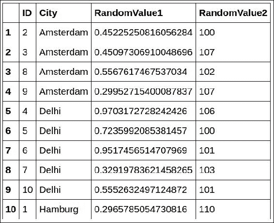

其他连接也可以通过 `kind` 参数应用。让我们回顾一下我们之前的事故和车辆数据集。

使用 `kind` 的不同连接是：

```py
julia> right_DfTRoadSafety_2014 = join(DfTRoadSafety_Accidents_2014, DfTRoadSafety_Vehicles_2014, on = :_Accident_Index, kind = :right) 

julia> inner_DfTRoadSafety_2014 = join(DfTRoadSafety_Accidents_2014, DfTRoadSafety_Vehicles_2014, on = :_Accident_Index, kind = :inner) 

julia> outer_DfTRoadSafety_2014 = join(DfTRoadSafety_Accidents_2014, DfTRoadSafety_Vehicles_2014, on = :_Accident_Index, kind = :outer) 

julia> semi_DfTRoadSafety_2014 = join(DfTRoadSafety_Accidents_2014, DfTRoadSafety_Vehicles_2014, on = :_Accident_Index, kind = :semi) 

julia> anti_DfTRoadSafety_2014 = join(DfTRoadSafety_Accidents_2014, DfTRoadSafety_Vehicles_2014, on = :_Accident_Index, kind = :anti) 

```

## 分割-应用-合并策略

Hadley Wickham 发表了一篇论文（Wickham, Hadley. "The split-apply-combine strategy for data analysis." *Journal of Statistical Software* 40.1 (2011): 1-29），定义了数据分析的分割-应用-合并策略。在这篇论文中，他解释了为什么将一个大问题分解成易于管理的小部分，独立地对每个部分进行操作，获取所需结果，然后再将所有部分组合起来是好的。

当数据集包含大量列时，并且在某些操作中并不需要所有列时，就需要这样做。最好是将数据集拆分，然后应用必要的函数；我们可以随时将数据集重新合并。

这是通过 `by` 函数完成的，`by` 接受三个参数：

+   DataFrame（这是我们将要分割的 DataFrame）

+   用于分割 DataFrame 的列名（或数值索引）

+   可以应用于 DataFrame 每个子集的函数

让我们尝试将 `by` 应用到我们的相同数据集：

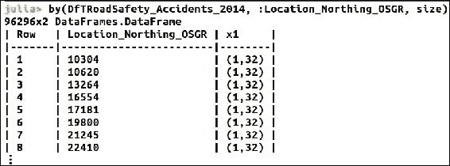

`aggregate()` 函数提供了一种替代方法来应用 Split-Apply-Combine 策略。`aggregate()` 函数使用相同的三个参数：

+   DataFrame（这是我们将要分割的 DataFrame）

+   用于分割 DataFrame 的列名（或数值索引）

+   可以应用于 DataFrame 每个子集的函数

第三个参数中提供的函数会应用于每一列，所有未用于分割 DataFrame 的列都会应用该函数。

## 重塑数据

使用案例可能要求数据以不同于当前的形状存在。为了方便这一点，Julia 提供了数据的重塑功能。

让我们使用相同的数据集，但在此之前先检查一下数据集的大小：

```py
julia> size(DfTRoadSafety_Accidents_2014) 
(146322,32) 

```

我们可以看到数据行数大于 100,000。尽管我们可以处理这些数据，但为了便于理解，我们将使用一个较小的数据集。

RDataset 提供的数据集总是很好的起点。我们将使用经过验证的 iris 数据集。

我们将导入 `RDatasets` 和 `DataFrames`（如果我们开始了一个新的终端会话）：

```py
julia> using RDatasets, DataFrames 

```

然后，我们将加载 iris 数据集到 `DataFrame` 中。我们可以看到数据集有 150 行和 5 列：

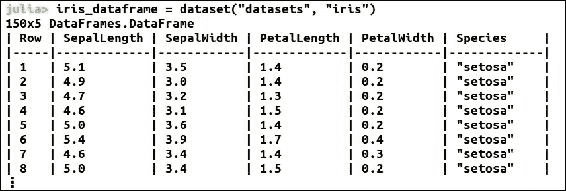

现在我们使用 `stack()` 函数来重塑数据集。让我们只传递 DataFrame 作为唯一参数来使用它。

`stack` 通过为分类变量创建一个逐项包含所有信息的 DataFrame 来工作：

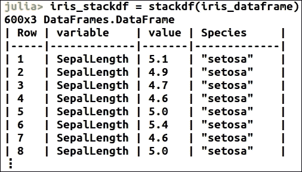

我们可以看到我们的数据集已经堆叠。这里我们已经堆叠了所有的列。我们还可以提供特定的列进行堆叠：

```py
Julia> iris_dataframe [:id] = 1:size(iris_dataframe, 1)  
# create a new column to track the id of the row 

Julia> iris_stack = (iris_dataframe,  [1:4]) 

```

第二个参数表示我们想要堆叠的列。我们可以在结果中看到第 1 到第 4 列已被堆叠，这意味着我们已经将数据集重塑为一个新的 DataFrame：

```py
Julia> iris_stack = stack(iris_dataframe,  [1:4]) 

Julia> size(iris_stack) 
(600,4) 
Julia> head(iris_stack) 

```

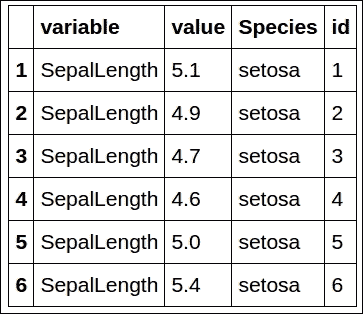

我们可以看到有一个新的列`:id`，这是堆叠数据框的标识符。它的值是按行重复的次数。

由于所有列都包含在结果 DataFrame 中，因此某些列会重复。这些列实际上是此 DataFrame 的标识符，用列(`id`)表示。除了标识符列(`:id`)，还有两列，`:variable` 和 `:values`。这些列实际上包含了堆叠的值。

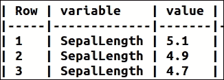

我们还可以提供第三个参数（可选）。这是值会重复的列。通过这个参数，我们可以指定要包括哪些列，哪些列不包括。

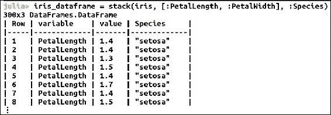

`melt()` 函数类似于 stack 函数，但具有一些特殊功能。在这里，我们需要指定标识符列，其余的列会被堆叠：

```py
Julia> iris_melt = stack(iris_dataframe, [1:4]) 

```

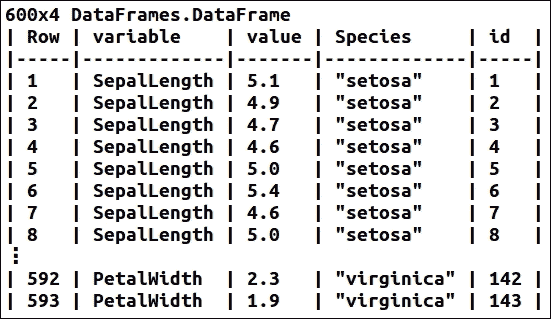

剩余的列假设包含已测量的变量，并被堆叠。

与 stack 和 melt 相反的是 unstack，它用于将数据从长格式转换为宽格式。我们需要指定标识符列和变量/值列给 unstack 函数：

```py
julia> unstack(iris_melt, :id, :variable, :value) 

```

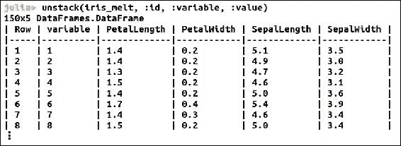

如果 unstack 函数的其余列是唯一的，可以省略参数中的 `:id`（标识符）：

```py
julia> unstack(iris_melt, :variable, :value) 

```

`meltdf` 和 `stackdf` 是两个附加函数，它们的作用类似于 melt 和 stack，但同时也提供了对原始宽格式 DataFrame 的视图：

```py
Julia> iris_stackdf = stackdf(iris_dataframe) 

```

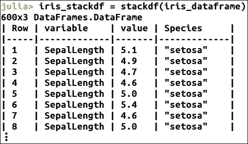

这看起来和 stack 函数非常相似，但通过查看它们的存储表示，我们可以看到区别。

要查看存储表示，可以使用 dump。让我们将其应用于 stack 函数：

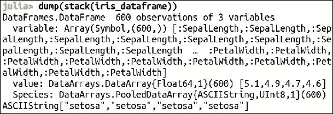

+   在这里，我们可以看到 `:variable` 的类型为 `Array(Symbol,(600,))`

+   `:value` 的类型为 `DataArrays.DataArray{Float64,1}(600)`

+   标识符（`:Species`）的类型为 `DataArrays.PooledDataArray{ASCIIString,UInt8,1}(600)`

现在，我们将查看 `stackdf` 的存储表示：

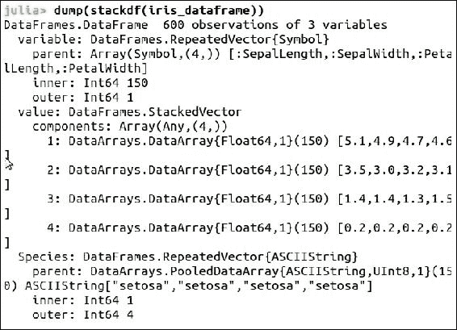

在这里，我们可以看到：

+   `:variable` 的类型为 `DataFrames.RepeatedVector{Symbol}`。变量被重复 n 次，其中 n 是原始 `AbstractDataFrame` 中的行数。

+   `:value` 的类型为 `DataFrames.StackedVector`。这便于查看原始 DataFrame 中堆叠在一起的列。

+   标识符（`:Species`）的类型为 `Species: DataFrames.RepeatedVector{ASCIIString}`。原始列被重复 n 次，其中 n 是堆叠的列数。

使用这些 AbstractVectors，我们现在能够创建视图，从而通过这种实现节省内存。

重塑函数不提供执行聚合的功能。因此，为了进行聚合，需要将拆分-应用-合并（Split-Apply-Combine）策略与重塑结合使用。

我们将使用 `iris_stack`：

```py
julia> iris_stack = stack(iris_dataframe) 

```

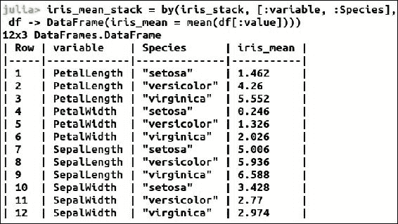

在这里，我们创建了一个新的列，根据物种计算各列的均值。现在我们可以对其进行反转。

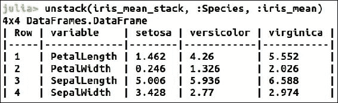

## 排序数据集

排序是数据分析中最常用的技术之一。排序在 Julia 中通过调用 `sort` 或 `sort!` 函数来实现。

`sort` 和 `sort!` 的区别在于，`sort!` 是就地排序，它直接对原始数组进行排序，而不是创建副本。

让我们在鸢尾花数据集上使用 `sort!` 函数：

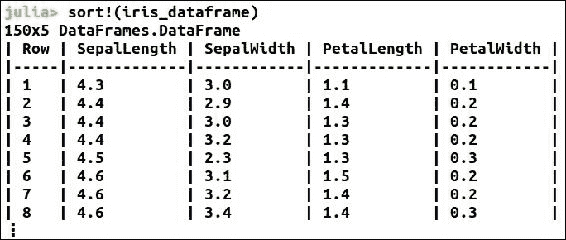

我们可以看到这些列并不是按照 `[:SepalLength, :SepalWidth, :PetalLength, :PetalWidth]` 排序的，但它们实际上是按 :Species 列排序的。

排序函数接受一些参数，并提供一些功能。例如，要反向排序，我们可以：

```py
julia> sort!(iris_dataframe, rev = true) 

```

要对某些特定列进行排序，我们可以：

```py
julia> sort!(iris_dataframe, cols = [:SepalLength, :PetalLength]) 

```

我们还可以使用 `sort!` 的 by 函数，在 DataFrame 或单个列上应用其他函数。

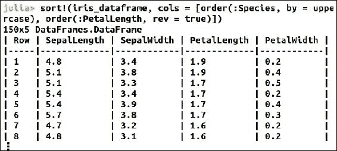

`order` 用于指定在一组列中对特定列进行排序。

## 公式 - 数学表达式的特殊数据类型

数据科学涉及使用各种统计公式从数据中提取洞察。这些公式的创建和应用是数据科学的核心过程之一。它将输入变量通过某些函数和数学表达式映射到输出。

Julia 通过在 `DataFrame` 包中提供一种公式类型来简化这一过程，它与符号 `~` 一起使用。`~` 是一个二元操作符。例如：

```py
julia> formulaX = A ~ B + C

```

对于统计建模，建议使用 ModelMatrix，它构建一个 Matrix{Float64}，使其更适合于统计模型的拟合。Formula 也可以用来从 DataFrame 转换为 ModelFrame 对象，这是它的包装器，满足统计建模的需求。

创建一个包含随机值的数据框：

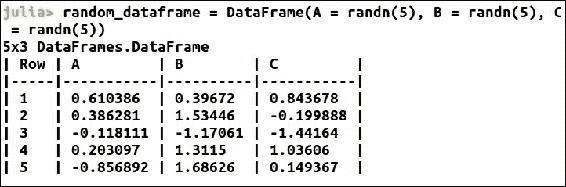

使用公式将其转换为 `ModelFrame` 对象：

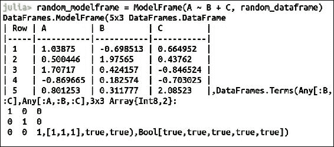

从 `ModelFrame` 创建 `ModelMatrix` 很容易：

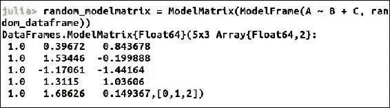

还有一列仅包含 `value = 1.0`。它用于回归模型中拟合截距项。

## 汇总数据

为了高效地分析庞大的数据集，使用 PooledDataArray。DataArray 使用一种编码方式，为向量的每个条目表示一个完整的字符串。这种方式效率较低，特别是在处理大数据集和内存密集型算法时。

我们的使用案例更常涉及包含少量水平的因子：

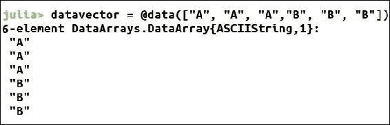

`PooledDataArray` 使用一个较小的水平池中的索引，而不是使用字符串来高效地表示数据。

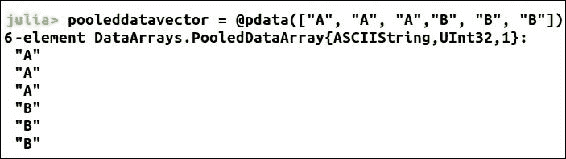

`PooledDataArray` 还提供了一个功能，可以使用 levels 函数来查找因子的水平：

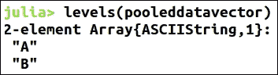

`PooledDataArray` 甚至提供了一个紧凑型函数来高效使用内存：

```py
Julia> pooleddatavector = compact (pooleddatavector) 

```

然后，它提供了一个池函数，用于在因子未在 `PooledDataArray` 列中编码，而是在 DataArray 或 DataFrame 中编码时转换单列数据：

```py
Julia>  pooleddatavector = pool(datavector) 

```

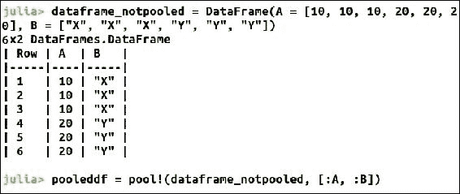

`PooledDataArray` 促进了类别数据的分析，因为 ModelMatrix 中的列被当作 0-1 指示符列。PooledDataArray 的每个水平都与一列相关联。

## 网络抓取

现实世界的使用案例还包括从网络抓取数据进行分析。让我们构建一个小型的网页抓取器来获取 Reddit 帖子。

为此，我们将需要 JSON 和 Requests 包：

```py
julia> Pkg.add("JSON") 
julia> Pkg.add("Requests") 

# import the required libraries 
julia> using JSON, Requests 

# Use the reddit URL to fetch the data from 
julia> reddit_url = https://www.reddit.com/r/Julia/ 

# fetch the data and store it in a variable 
julia> response = get("$(reddit_url)/.json") 
Response(200 OK, 21 headers, 55426 bytes in body) 

# Parse the data received using JSON.parse 
julia> dataReceived = JSON.parse(Requests.text(response)) 
# Create the required objects 
julia> nextRecord = dataReceived["data"]["after"] 
julia> counter = length(dataReceived["data"]["children"]) 

```

这里，我们定义了一个 URL，从这个 URL 中抓取数据。我们从 Reddit 上的 Julia 部分进行抓取。

接下来，我们使用 Requests 包中的 get 函数从定义的 URL 获取内容。我们可以看到已经得到了响应 200 OK，并获得了数据：

```py
julia> statuscode(response) 
200 

julia> HttpCommon.STATUS_CODES[200] 
"OK" 

```

然后，我们使用 Julia 的 JSON 包提供的 JSON 解析器来解析接收到的 JSON 数据。现在我们可以开始读取记录了。

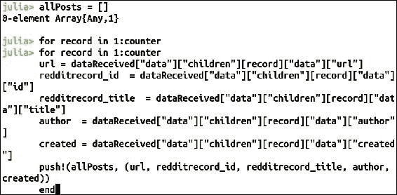

我们可以将接收到的数据存储在数组或数据框（DataFrame）中（具体取决于使用场景和易用性）。在这里，我们使用数组来存储解析后的数据。我们可以检查存储在数组中的数据。

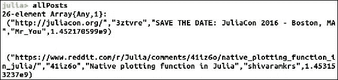

假设我们只需要查看这些帖子的标题并知道我们抓取了什么；我们只需要知道它们在哪一列。

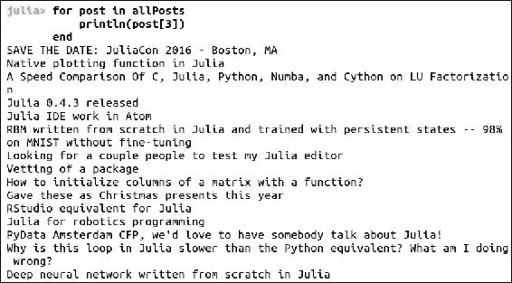

现在我们可以看到 Reddit 帖子的标题。但如果我们有太多列，或者存在缺失值怎么办？使用 DataFrames 会是更好的选择。

# 总结

在本章中，我们学习了数据清洗（data munging）是什么，以及为什么它对于数据科学是必要的。Julia 提供了通过 DataFrames.jl 包来简化数据清洗的功能，其中包括以下特点：

+   `NA`：Julia 中的缺失值由一种特定的数据类型表示，即 NA。

+   `DataArray`：`DataFrames.jl` 提供的 DataArray 特性，如允许我们在数组中存储缺失值。

+   `DataFrame`：DataFrame 是一种二维数据结构，类似于电子表格。它与 R 或 pandas 的数据框类似，并提供了许多功能来表示和分析数据。DataFrames 拥有许多非常适合数据分析和统计建模的特性。

+   一个数据集可以在不同的列中包含不同类型的数据。

+   记录与同一行中不同列的其他记录有关系，并且它们的长度相同。

+   列可以被标记。标记可以帮助我们轻松地熟悉数据，并且无需记住列的数字索引就能访问它们。

我们学习了如何使用 `readtable()` 函数从文件导入数据并将数据导出到文件。`readtable()` 函数在使用多个参数时提供了灵活性。

我们还探讨了数据集的连接，如 RDBMS 表。Julia 提供了多种连接方式，我们可以根据实际需求加以利用。

我们讨论了数据科学家广泛使用的 Split-Apply-Combine 策略，以及为什么它是必要的。我们通过 stack 和 melt（stackdf、meltdf）函数探讨了数据的重塑或旋转，并探索了其中的各种可能性。我们还介绍了 `PooledDataArray`，并学习了它在内存管理中的重要性。

我们学习了网页抓取技术，这对于数据科学家来说，有时是收集数据的必要手段。我们还使用了 Requests 包来获取 HTTP 响应。

# 参考文献

+   [`julia.readthedocs.org/en/latest/manual/`](http://julia.readthedocs.org/en/latest/manual/)

+   [`dataframesjl.readthedocs.io/en/latest/`](http://dataframesjl.readthedocs.io/en/latest/)

+   [`data.gov.uk/dataset/road-accidents-safety-data`](https://data.gov.uk/dataset/road-accidents-safety-data)

+   Wickham, Hadley. "数据分析的分割-应用-合并策略。" *《统计软件杂志》* 40.1 (2011): 1-29
