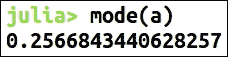
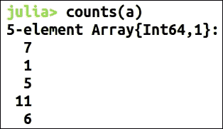

# 第三章 数据探索

当我们第一次接收到一个数据集时，大多数时候我们只知道它与什么相关——这种概述不足以开始应用算法或创建模型。数据探索在数据科学中至关重要。它是创建模型之前必不可少的过程，因为它展示了数据集的关键特点，并且明确了我们达成目标的路径。数据探索使数据科学家熟悉数据，并帮助我们知道可以从数据集中推导出什么一般性假设。因此，我们可以说它是从数据集中提取信息的过程，而我们事先并不知道要寻找什么。

在这一章中，我们将研究：

+   抽样、总体和权重向量

+   推断列类型

+   数据集概述

+   标量统计

+   变异度量

+   使用可视化进行数据探索

数据探索涉及描述性统计。描述性统计是数据分析领域，通过有意义地总结数据来发现模式。虽然这可能不会直接得出我们预期的结果或模型，但它肯定有助于理解数据。假设新德里有 1000 万人，如果我们随机抽取 1000 人并计算他们的身高平均值，这个平均值可能不会代表新德里所有人的平均身高，但它肯定能给我们一个大概的概念。

Julia 可以有效地用于数据探索。Julia 提供了一个名为`StatsBase.jl`的包，其中包含了统计所需的功能。我们假设在整章中，你已经添加了这个包：

```py
julia> Pkg.update() 
julia> Pkg.add("StatsBase") 

```

# 抽样

在前面的例子中，我们讨论了如何计算从 1000 万人中随机挑选的 1000 人身高的平均值。假设在收集这 1000 万人的数据时，我们从特定的年龄段或社区开始，或者按某种顺序排列数据。现在，如果我们从数据集中选择 1000 个连续的人，这些人很有可能会有某些相似之处。这种相似性不会给我们展示数据集的实际特征，反而可能影响我们想要获得的洞察。因此，从数据集中抽取一小段连续的数据点，无法为我们提供有价值的信息。为了克服这个问题，我们使用抽样。

抽样是一种从给定数据集中随机选择数据的技术，使得这些数据点彼此不相关，因此我们可以将从这些数据上生成的结果推广到整个数据集。抽样是在总体上进行的。

## 总体

统计学中的总体是指数据集中所有数据点的集合，这些数据点至少具有一个共同的属性。在前面的例子中，这些人具有相同的地理区域属性。

让我们以鸢尾花数据集为例。尽管它只有 150 条记录，但它能给我们一个关于如何从数据集中抽取样本的概念：

```py
julia> using RDatasets 

julia> iris_dataframe = dataset("datasets", "iris") 

```

我们将使用包含鸢尾花数据集的 RDatasets 包，并将其加载到 DataFrame 中。因此，这个 DataFrame 包含了“总体”，我们希望从中抽取一个样本：

```py
julia> sample(iris_dataframe[:SepalLength]) 
6.6 

julia> sample(iris_dataframe[:SepalLength], 5) 
5-element Array{Float64,1}: 
 4.8 
 5.4 
 5.0 
 5.2 
 4.3 

```

`sample()`函数可用于从数据集或数组中返回一个随机值，或者返回一组随机选择的值：

```py
Julia> sample(x, num_of_elements[; replace=true, ordered=false]) 

```

`replace`和`ordered`参数在特定情况下使用：

+   `replace`：当返回相同的值时执行替换操作时使用（`默认值=true`）

+   `ordered`：当返回的值按升序排列时使用（`默认值=false`）

理想情况下，从给定数据集中采样的数据应当代表整个总体。但大多数情况下，数据集中的许多群体要么被低估，要么被高估。我们来看之前的例子，如果我们无法收集到 50-70 岁年龄段以及社区 X 的完整数据怎么办？因此，我们的数据集并不能完全代表实际的总体。必须对观察到的数据集进行一些调整。

权重调整是非常常见的一种修正技术。在此技术中，会为每条记录分配一个调整权重。我们认为被低估的记录或群体会获得大于 1 的权重，而我们认为被高估的记录或群体会获得小于 1 的权重。

## 权重向量

Julia 有一种类型`WeightVec`，用于表示权重向量，以便为样本分配权重。之所以需要专门的权重向量数据类型，是因为：

+   显式区分该向量与其他数据向量的角色

+   通过存储权重总和并避免重复计算权重总和，从而节省计算周期

权重向量可以这样构建：

```py
julia> wv = WeightVec([1., 2., 3.], 6.) 
StatsBase.WeightVec{Float64,Array{Float64,1}}([1.0,2.0,3.0],6.0) 

```

我们已将权重总和作为第二个参数提供。它是可选的，目的是为了节省计算时间。

为了简化，`WeightVec`支持一些常见方法。假设`wv`的类型是`WeightVec`：

```py
julia> eltype(wv) 
Float64 

```

`eltype`用于获取`WeightVec`中值的类型：

```py
julia> length(wv) 
3 

julia> isempty(wv) 
false 

julia> values(wv) 
3-element Array{Float64,1}: 
 1.0 
 2.0 
 3.0 

julia> sum(wv) 
6.0 

# Applying eltypes to iris_dataframe 
# this method is of DataFrames.jl 
julia> eltypes(iris_dataframe)   
5-element Array{Type{T},1}: 
 Float64                       
 Float64                       
 Float64                       
 Float64                       
 Union{ASCIIString,UTF8String} 

```

其他方法不言自明。由于`WeightVec`已经存储了总和，因此它可以立即返回，而无需进行任何计算。

# 推断列类型

要理解数据集并继续处理，我们需要首先了解我们拥有的数据类型。由于我们的数据是按列存储的，在执行任何操作之前，我们应该知道它们的类型。这也叫做创建数据字典：

```py
julia> typeof(iris_dataframe[1,:SepalLength]) 
Float64 

julia> typeof(iris_dataframe[1,:Species]) 
ASCIIString 

```

我们在这里使用了经典的鸢尾花数据集。我们已经知道这些列中数据的类型。我们可以将相同的函数应用于任何类似的数据集。假设我们只给定了没有标签的列，那么就很难确定这些列中数据的类型。有时，数据集看起来像是包含数字，但它们的数据类型却是`ASCIIString`。这些可能会在后续步骤中引发错误。幸运的是，这些错误是可以避免的。

# 基本统计汇总

尽管我们目前使用的是 RDatasets，这些数据集有充分的细节和文档支持，但这些方法和技术也可以扩展到其他数据集。

我们使用一个不同的数据集：


我们正在使用来自 RDatasets 包的另一个数据集。这些数据是来自伦敦内区的考试成绩。为了获取数据集的一些信息，我们将使用`describe()`函数，这个函数我们在之前的章节中已经讨论过：


各列的描述如下：

+   `Length`指的是记录（行）的数量。

+   `Type`指的是列的数据类型。因此，`School`的类型是`Pooled ASCIIString`。

+   `NA`和`NA%`分别指的是列中`NA`值的数量和百分比。这非常有用，因为你现在不需要手动检查缺失的记录了。

+   `Unique`指的是列中唯一记录的数量。

+   `Min`和`Max`是列中的最小值和最大值（这不适用于`ASCIIStrings`类型的列）。这些是数据点的 0%和 100%的值。`Min`和`Max`定义了数据的范围。

+   第一四分位数和第三四分位数分别指的是数据点的 25%和 75%的值。同样，中位数指的是数据点的 50%的值。

## 计算数组或数据框的均值

Julia 提供了不同种类的均值函数，每种函数都有其特定的使用场景：

+   `geomean(arr)`：这是计算`arr`的几何均值：


+   `harmmean(arr)`：这是计算`arr`的调和均值：


+   `trimmean(arr, fraction)`：用于计算裁剪数据集的均值。第二个参数用于提供裁剪数据集的比例。例如，如果`fraction`的值为 0.3，均值将通过忽略顶部 30%和底部 30%的值来计算。通常用于去除异常值：


均值函数也有扩展。它可以接受一个加权向量作为参数来计算加权均值：


# 标量统计

Julia 的包提供了各种函数来计算不同的统计数据。这些函数用于根据需要以不同的方式描述数据。

## 标准差和方差

我们之前计算的均值和中位数（在`describe()`函数中）是集中趋势的度量。均值指的是在应用加权后计算出的中心，中位数指的是数据列表的中心。

这只是其中一条信息，我们还希望了解更多有关数据集的信息。了解数据点在数据集中的分布是很有帮助的。我们不能仅仅使用最小值和最大值函数，因为数据集中可能会有异常值。因此，这些最小值和最大值函数会导致错误的结果。

方差是衡量数据集数据点分布程度的指标。它是通过计算数字与均值之间的距离来计算的。方差衡量数据集中每个数值与均值的偏离程度。

以下是方差的公式：


我们还可以沿特定维度计算方差，这对于 DataFrame 非常有用：


这里，第二个参数是我们希望计算方差的维度。

标准差是衡量数据集值的分散度或离散度的指标。它是方差的平方根。如果它接近 0，这意味着数据集的分散程度非常小，接近均值。而较大的值则定义了数据点从均值的高分散度。标准差与方差不同，因为它的单位与均值相同：


我们还可以像方差一样沿某个维度计算标准差。

Julia 提供了一个函数来计算均值和方差，也可以同时计算均值和标准差：


统计分析包括基于偏度和峰度的数据特征化。偏度是衡量数据集或分布中心点对称性缺失的度量。因此，分布可以向左偏或向右偏。

峰度是分布或数据集相对于正态分布的平坦程度的度量。因此，具有在中心（均值）处具有高峰并且两侧急剧下降的分布被称为具有高峰度，而均值处具有平坦峰的分布则被称为具有低峰度：


统计中的矩是：

+   0 阶矩是总概率

+   1 阶矩是均值

+   2 阶中心矩是方差

+   3 阶矩是偏度

+   4 阶矩是峰度（带移位和标准化）


这里我们正在计算第 k 阶中心矩。它定义为：

```py
(a - mean(a)).^k 

```

# 变化度量

了解数据集中的值的变化情况是很有帮助的。各种统计函数能够提供：

+   `span(arr)`：span 用于计算数据集的总分布范围，即 `maximum(arr)` 到 `minimum(arr)`：


+   `variation(arr)`：也称为变异系数。它是标准差与数据集均值的比率。相对于总体的均值，CV 表示变异性的程度。它的优点是它是一个无量纲的数字，可以用来比较不同的数据集。


均值的标准误差：我们对从总体中抽取的不同样本进行工作。我们计算这些样本的均值，并称之为样本均值。对于不同的样本，我们不会得到相同的样本均值，而是一个样本均值的分布。这些样本均值分布的标准差称为均值的标准误差。

在 Julia 中，我们可以使用`sem(arr)`计算均值的标准误差。

平均绝对偏差是一个稳健的集中趋势度量。稳健性是指不受离群值的影响。


我们可以将中心值作为第二个参数提供。

## Z 分数

z 分数指的是与分数均值的关系。它通过一个元素距离均值多少个标准差来计算。0 的 z 分数意味着它与均值相同。

它由公式 *z = (X - μ) / σ* 给出：

```py
julia> a = [12,23,45,68,99,72,61,39,21,71] 

```

在这个数据集上，我们可以像这样计算 z 分数：


均值和标准差是自我计算的。

## 熵

熵是数据集中无序的度量，提供了系统随机性的近似度量。它随着随机性增加而增大。

让我们创建一个概率向量：


我们创建了一个相当小的数组：


概率向量元素的总和为 1\。它趋近于 1。现在我们计算熵：


熵计算是使用自然对数进行的。如果需要，我们也可以提供对数的底数。


我们提供的第二个参数是对数的底数。我们还可以计算交叉熵，它被认为是平方误差的有效替代：

```py
Julia> crossentropy(ProbabilityVector1, ProbabilityVector2) 

```

## 分位数

为了更好地理解数据集，我们想要知道数据集中的最低点和最高点。我们可以使用 min 和 max 函数来实现。所以，我们也可以说最小和最大数据点分别位于 0% 和 100%。如果我们想要找出数据集中的任意数据点在 n% 的位置，我们使用 `quantile` 函数。

在存在离群值的情况下，分位数非常有用。例如，对于 `a` 我们正在分析多个浏览器在网站上的响应时间：98% 的流量来自桌面，且能在不到一秒的时间内加载页面；剩余 2% 的流量来自手机，加载页面需要 5 秒。在这种情况下，如果使用场景允许，我们可能想忽略这 2%（以便分析网站的实际流量）。


现在，来计算分位数：


这里，我们得到了五个值。这五个值代表数据集在 0%、25%、50%、75%和 100%位置的数值。

四分位距是衡量数据变异性的一种方法，它通过上四分位数和下四分位数的差值计算，即 Q3-Q1。其计算公式为：


百分位数是统计学中常用的术语，用于表示数据点在数据集中的位置。其计算公式为：


我们使用了相同的数据集，并计算了 0.5 在数据集中的位置。

还有一个重要的函数，`nquantile`。它用于创建由我们定义的分位数向量：


## 众数

在探索数据集时，我们可能希望知道哪些数据在数据集中经常重复。这是最有可能出现在样本中的值。Julia 提供了一个计算众数的函数：



我们在与前述示例相同的数据集上计算了众数。因此，`0.2566`在数据集中出现的频率最高。

## 数据集摘要

之前我们讨论过`describe()`函数，它打印数据集的摘要。Julia 还提供了另一个函数，`summarystats()`。

使用`summarystats(a)`函数在前述示例的同一数据集上，我们得到如下结果。因此，我们现在无需单独计算它们，且可以大致了解数据集的类型。


# 散点矩阵和协方差

协方差常被数据科学家用来找出两个有序数据集是否朝相同方向变化。它可以轻松地定义变量之间是否相关。为了更好地表示这种行为，我们创建了协方差矩阵。协方差矩阵的未归一化版本即为散点矩阵。

要创建散点矩阵，我们使用`scattermat(arr)`函数。

默认行为是将每行视为一个观测值，每列视为一个变量。通过提供关键词参数`vardim`和`mean`，可以改变这一行为：

+   `Vardim`：`vardim=1（默认）`表示每列是一个变量，每行是一个观测值。`vardim=2`则为反向操作。

+   `mean`：均值由`scattermat`计算得出。我们可以使用预定义的均值来节省计算周期。

我们还可以使用`cov`函数创建加权协方差矩阵。它同样接受`vardim`和`mean`作为可选参数，目的相同。

# 计算偏差

StatsBase.jl 提供了多种计算两个数据集之间偏差的函数。虽然也可以使用其他函数来计算，但为了简便和高效，StatsBase 提供了这些高效实现的函数：

+   **平均绝对偏差**：对于两个数据集`a`和`b`，它的计算方式为`meanad(x,y)`，该函数是`mean(abs(x-y))`的封装。

+   **最大绝对偏差**：对于两个数据集 `a` 和 `b`，它的计算方法是 `maxad(x,y)`，该方法是 `maximum(abs(x-y))` 的封装。

+   **均方偏差**：对于两个数据集 `a` 和 `b`，它的计算方法是 `msd(x,y)`，该方法是 `mean(abs2(x-y))` 的封装。

+   **均方根偏差**：对于两个数据集 `a` 和 `b`，它的计算方法是 `rmsd(a,b)`，该方法是 `sqrt(msd(a, b))` 的封装。

# 排名

当数据集按升序排序时，会为每个值分配一个排名。排名是一种过程，其中数据集被转换，值被替换为它们的排名。Julia 提供了用于各种类型排名的函数。

在序数排名中，数据集中的所有项都被分配了一个独特的值。具有相同值的项被任意分配排名。在 Julia 中，这是通过 `ordinalrank` 函数实现的。


假设这是我们的数据集，我们想要进行序数排名：


使用 `ordinalrank(arr)` 函数，我们得到了序数排名。同样，StatsBase 也提供了用于查找其他类型排名的函数，如 `competerank()`、`denserank()` 和 `tiedrank()`。

# 计数函数

在数据探索中，通常会对一个范围进行计数。这有助于找出出现次数最多/最少的值。Julia 提供了 `counts` 函数来对一个范围进行计数。假设我们有一个值的数组。为了方便，我们现在使用 `random` 函数来创建一个数组：


我们创建了一个包含 30 个值的数组，值的范围从 1 到 5。现在我们想知道它们在数据集中出现了多少次：



使用 `count` 函数，我们发现 1（`7`）、2（`1`）、3（`5`）、4（`11`）和 5（`6`）。计数函数根据不同的参数进行调整以适应使用场景。

`proportions()` 函数用于计算数据集中值的比例，Julia 提供了该函数：


我们对与之前示例相同的数据集计算了比例。它显示数据集中值 1 的比例为 `0.23333`。这也可以看作是在数据集中找到该值的概率。

其他计数函数包括：

+   `countmap(arr)`：这是一个映射函数，将值映射到数据集中出现的次数（或总权重）：


+   `proportionmap(arr)`：这是一个类似于 `countmap(arr)` 的映射函数，但它将值映射到它们的比例：


将 `countmap` 和 `proportionmap` 应用到我们的数据集上，得到了这些值。两个函数都返回一个字典。

# 直方图

在对数据有了基本理解之后，也可以借助可视化进行数据探索。绘制直方图是通过可视化进行数据探索的最常见方式之一。直方图用于将数据在实际平面上分成规律间隔并进行统计。

使用 fit 方法可以创建直方图：

```py
julia> fit(Histogram, data[, weight][, edges]) 

```

`fit`接受以下参数：

+   `data`：数据以向量形式传递给`fit`函数，可以是一维的或 n 维的（由相同长度的向量组成的元组）。

+   `weight`：这是一个可选参数。如果值具有不同的权重，可以传递一个`WeightVec`类型的参数。默认的权重值为 1。

+   `edges`：这是一个向量，用于指定每个维度上的分箱边缘。

它还接受一个关键字参数`nbins`，用于定义直方图在每个维度上使用的分箱数量：


在这个例子中，我们使用了两个随机值生成器和`nbins`来定义直方图的分箱数量。我们在随机生成的数据上创建了直方图。接下来我们在来自`RDatasets`包的数据集上尝试一下。这个包可以在这里找到：[`stat.ethz.ch/R-manual/R-devel/library/datasets/html/sleep.html`](https://stat.ethz.ch/R-manual/R-devel/library/datasets/html/sleep.html)。


我们正在使用一个名为`sleepstudy`的数据集，来自`RDatasets`包。它包含三列数据：`Reaction (Float64)`、`Days (Integer)` 和 `Subject (Integer)`。我们将基于此数据创建一个直方图。


我们现在可以意识到，通过可视化数据更容易理解数据。可视化是数据探索的重要部分。要能够有效地可视化数据，必须进行必要的数据整理，并对变量有一定的理解。在这次可视化中，我们可以观察到哪些区域更密集，以及反应时间的分布。

我们之前讨论了散点矩阵。我们可以创建一个散点图，看看它是否能帮助我们。


我们可以清晰地观察到，受试者的反应时间随着天数的增加而逐渐增大。我们能够很快得出这个结论；否则，可能需要花费相当长的时间。

让我们更深入地分析这个数据集。假设我们想了解每个受试者的表现。由于所有受试者并不相同，有些受试者的表现可能与其他人有很大不同。

在大型数据集上，我们可以进行分组或聚类；但是在这里，由于数据集较小，我们可以单独分析各个受试者。


很明显，即使被剥夺了多日的睡眠，`309`号受试者的反应时间仍然非常低。这些是我们在通过可视化分析数据集时，常常忽略的小细节。

我们将在第五章中详细讨论可视化，*使用可视化理解数据*。我们将探索 Julia 中可用于可视化的各种包，并且如果需要，也会介绍如何调用 R 和 Python 的包进行可视化。我们还会介绍一些基本的 D3.js 示例。

在 Julia 中创建基本图形非常容易，例如：


现在让我们对鸢尾花数据集尝试一些可视化：

```py
julia> x=:SepalLength, y=:SepalWidth, color=:Species) 

```

尽管现在它不完全可见，但我们可以看到有明显的簇存在。也许，我们可以通过这些簇区分不同的物种。因此，可视化在发现这些洞察方面非常有用。

# 相关性分析

Julia 提供了一些函数来简化相关性分析。相关性和依赖性是统计学中常见的术语。依赖性指的是一个变量与另一个变量之间具有统计关系，而相关性指的是一个变量与另一个变量之间可能存在更广泛的关系，这其中也可能包括依赖性。

`autocov(x)` 函数用于计算 `x` 的自协方差。它返回与 `x` 大小相同的向量。


这是我们生成的数据集。我们可以对该数据集应用 `autocov`：


要计算自相关，我们使用 `autocor` 函数：


同样，我们也可以计算交叉协方差和交叉相关性。为此，我们将生成另一个相同大小的随机数组：


2 个长度为 6 的数组的交叉协方差和交叉相关性结果是长度为 11 的数组。

# 总结

在本章中，我们讨论了数据探索为何重要，以及如何对数据集进行探索性分析。

这些是我们讨论的各种重要技术和概念：

+   抽样是一种从给定数据集中随机选择无关数据的技术，以便我们可以将基于选定数据生成的结果推广到整个数据集。

+   权重向量在我们拥有或收集的数据集无法代表实际数据时非常重要。

+   为什么了解列的类型非常必要，以及如何通过汇总函数帮助我们获取数据集的要点。

+   均值、中位数、众数、标准差、方差和标量统计，以及它们在 Julia 中的实现。

+   测量数据集的变化非常重要，z-分数和熵在此过程中非常有用。

+   在进行一些基本的数据清理和理解之后，可视化可以非常有益并提供洞察。

# 参考文献

+   [`julia.readthedocs.io/en/latest/manual/`](http://julia.readthedocs.io/en/latest/manual/)

+   [`dataframesjl.readthedocs.io/en/latest/`](https://dataframesjl.readthedocs.io/en/latest/)

+   [`github.com/JuliaStats/StatsBase.jl`](https://github.com/JuliaStats/StatsBase.jl)

+   [`dcjones.github.io/Gadfly.jl/`](http://dcjones.github.io/Gadfly.jl/)
