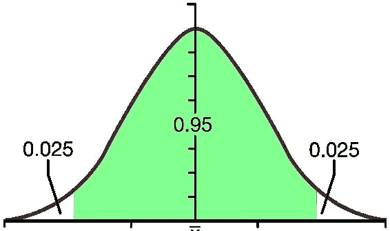

# 第四章 深入了解推断统计

我们的世界是一个大数据生成机器。这些日常活动由随机且复杂的事件组成，这些事件可以帮助我们更好地理解单变量分布：正态分布、伽马分布、二项分布等世界。为此，我们将尝试更深入地理解这些过程。

**推断统计** 是基于从样本数据中获得的证据和推理来得出一个结论，并将该结论推广到总体。推断统计考虑到存在一定的抽样误差，这意味着我们从总体中抽取的样本可能无法完美地代表总体。

推断统计包括：

+   估计

+   假设检验

样本和总体之间有什么区别？总体是我们希望获得知识的所有事件或观察的集合。但总体的大小可能非常庞大，以至于分析每个事件或观察并不方便或可行。在这种情况下，我们会选择一个子集，它能够很好地定义我们希望分析的总体。我们称这个子集为总体的样本。

在上一章中，我们讨论了描述性统计。尽管推断统计和描述性统计都可以基于同一组数据进行，但它们是截然不同的。我们可能只对样本数据应用描述性统计，但推断统计利用这些样本数据以及其他数据来进行推广，从而得出适用于更大总体的结论。

因此，描述性统计提供了数据的数值或图形摘要。它仅帮助我们理解现有的数据，但我们无法使用这些结果得出可以推广到整个总体的结论。

通过推断统计，我们试图建立适用于整个总体的结论。但是，推断统计受到两个主要条件的限制：

+   我们的样本数据是否真正代表了总体

+   我们形成的假设，是否正确地使得样本数据能够代表总体

样本数据可能无法完美代表总体，因此我们总是面临一定程度的不确定性。因此，我们做出一些估计或假设来应对这种不确定性，这可能会对我们生成的结果产生影响。

在 Julia 中，我们有多种包用于推断统计。`Distributions.jl` 就是其中之一，提供与概率分布相关的函数。`Distributions.jl` 涵盖了以下统计方法：

+   分布的特性——均值、方差、偏度、峰度（矩）和熵

+   概率密度/质量函数

+   特征函数

+   最大似然估计

+   **最大后验估计（MAP）** 概率估计

# 安装

`Distributions.jl` 是一个注册的 Julia 包，可以通过以下命令进行添加：

```py
julia> Pkg.add("Distributions") 

```

后续章节需要安装该包。所以我们假设您现在已经安装了该包。

# 理解抽样分布

抽样分布是从一个随机抽取的样本中收集每个可能统计量的可能性。通过抽样分布，可以在不了解完整总体的情况下推导出有用信息。假设我们正在计算样本均值，但我们不知道总体情况。即便如此，我们仍可以假设样本均值在总体均值的某个标准差范围内。

# 理解正态分布

正态分布是推理统计的核心。它就像一个钟形曲线（也叫高斯曲线）。大多数复杂的过程可以通过正态分布来定义。

让我们看看正态分布是什么样子。首先，我们将导入必要的包。现在我们包括 RDatasets，但稍后才会使用它：


我们首先设置种子，然后探索正态函数：


根据给出的警告，我们也可以使用`fieldnames`代替`names`。建议仅在 Julia 的新版中使用`fieldnames`。

在这里，我们可以看到 Normal 函数在 Distributions 包中，并且具有 Univariate 和 Continuous 特性。`normal()`函数的构造器接受两个参数：

+   均值 (μ)

+   标准差 (σ)

让我们实例化一个正态分布。我们将均值 (μ) 设置为 1.0，标准差 (σ) 设置为`3.0`：


我们可以检查我们保留的均值和标准差：


使用这个正态分布对象，我们现在可以通过随机函数创建一个分布：


为了更好地理解该函数，让我们使用 Gadfly 绘制一个直方图：


## 参数估计

这用于找出它最适合用哪种分布来描述。我们可以使用`fit`函数来实现：


我们使用了`[1.0, 3.0]`来创建`x`，我们可以看到估计值相当接近。

# `Distributions.jl`中的类型层次结构

`Distributions.jl`中提供的函数遵循一个层级结构。我们来了解一下它，以便理解该包的功能。

## 理解 Sampleable

Sampleable 是一个抽象类型，包含了可以抽取样本的采样器和分布。其定义如下：


可以抽取的样本类型由两个参数类型定义：

+   VariateForm：

    +   Univariate: 标量数值

    +   Multivariate: 数值向量

    +   Matrixvariate: 数值矩阵

+   ValueSupport：

    +   离散型：整数

    +   连续型：Float64

我们可以提取 Sampleable 对象生成的样本信息。根据变量形式，数组可以包含多个样本。我们可以使用各种函数获取这些信息（假设`sampobj`是 Sampleable 对象）：

+   `length(sampobj)`：顾名思义，返回样本的长度，当对象为单变量时，值为 1

+   `size(sampobj)`：返回样本的形状

+   `nsamples(sampobj, X)`：返回 X 中的样本数量

+   `eltype(sampobj)`：返回样本中元素的默认类型

+   `rand(sampobj, x)`：返回从样本中抽取的 x 个样本：

    +   对于`sampobj=univariate`，返回长度为 x 的向量

    +   对于`sampobj=multivariate`，返回一个 x 列的矩阵

    +   对于`sampobj=matrix-variate`，返回一个样本矩阵的数组

### 表示概率分布

为了更好地表示概率分布，使用`Distribution`（它是`Sampleable`的子类型）：


为了方便使用，我们通常为常用分布定义`typealias`：

```py
julia> typealias UnivariateDistribution{S<:ValueSupport}   Distribution{Univariate,S} 

julia> typealias MultivariateDistribution{S<:ValueSupport} Distribution{Multivariate,S} 

julia> typealias MatrixDistribution{S<:ValueSupport}       Distribution{Matrixvariate,S} 

```

# 单变量分布

每个样本是标量的分布是单变量分布。我们可以根据它们支持的值进一步将其分类为两种分布：

+   单变量连续分布

+   单变量离散分布

抽象类型：

```py
julia> typealias UnivariateDistribution{S<:ValueSupport} Distribution{Univariate,S} 

julia> typealias DiscreteUnivariateDistribution   Distribution{Univariate, Discrete} 
julia> typealias ContinuousUnivariateDistribution Distribution{Univariate, Continuous} 

```

在包中为单变量分布实现了多种方法，提供了必要的功能。

## 检索参数

+   `params(distributionX)`：返回一个参数元组

+   `succprob(distributionX)`：返回成功的概率

+   `failprob(distributionX)`：返回失败的概率

+   `dof(distributionX)`：返回自由度

+   `ncategories(distributionX)`：返回类别的数量

+   `ntrials(distributionX)`：返回试验的次数

## 统计函数

常见的统计函数，如`mean()`、`median()`、`mode()`、`std()`、`var()`等，适用于这些分布。

## 概率评估

除了各种统计函数外，Julia 还提供了用于评估概率的函数：

+   `pdf(distributionX)`：`pdf`指的是概率密度函数。它返回`distributionX`的概率向量。函数的第二个参数还可以提供一个值范围，形式为`a:b`。

+   `cdf(distributionX)`：`cdf`指的是累积分布函数。

+   `insupport(distributionX,x)`：该支持函数返回`distributionX, x`是否在支持范围内。

## 单变量分布中的采样

我们之前讨论过随机数生成。它也可以用来从分布中抽取样本：

```py
julia> rand(distributionX)

```

这将从`distributionX`中抽取一个样本。它使用多重分派，并且我们可以根据需要提供其他参数：

```py
Julia> rand(distributionX,n) 

```

这将从`distributionX`返回一个由 n 个独立样本组成的向量。

## 理解离散单变量分布及其类型

离散单变量分布是这些分布的超类，从这些分布中抽取的样本是整数类型。

### 伯努利分布

伯努利分布是一个离散分布。它有两个可能的结果，假设它们是*n=0*和*n=1*。在这里，如果我们将*n=1*视为成功，并将其概率记为*p*，则*n=0*为失败，其概率为*q=1-p*，其中*0<p<1*。

在 Julia 中，伯努利分布的实现方式如下：

```py
julia> Bernoulli(p) 

```

这里，`p` 是成功率（概率）。

### 二项分布

二项分布是另一种离散概率分布。它由*Pp*给出，表示从 N 次伯努利试验中获得 n 次成功。在一系列独立试验之后，获得的成功次数服从二项分布：


这是一个试验次数为 1，成功率为`p=0.5`的二项分布：


这里我们已指定了`trials=5`。成功率保持默认值：


我们还可以定义成功率。因此，这将返回一个分布，试验次数为 5，成功率为`p=0.3`。

## 连续分布

连续单变量分布是所有连续单变量分布的超类，每个从连续单变量分布中抽取的样本类型为`Float64`。

### 柯西分布

柯西分布也叫做洛伦兹分布。它是一种描述共振行为的连续分布：


这给出了标准的柯西分布（位置 = 0.0，尺度 = 1.0）：


我们可以传递参数。这个将给我们具有位置`u`和尺度`s`的柯西分布。

### 卡方分布

具有*k*自由度的卡方分布是由卡方随机变量的平方根形成的分布，卡方随机变量是由*k*个独立且服从正态分布的变量的平方和构成的。

在 Julia 中，它的实现方式如下：

```py
julia> Chi(k) 

```

这将形成一个具有`k`自由度的卡方分布。

它用于通过除以卡方分布的均值来获得正态分布标准差的无偏估计的修正因子。

### 卡方分布

具有*k*自由度的卡方分布是*k*个独立标准正态随机变量的平方和的分布。

在 Julia 中，卡方分布的实现方式如下：

```py
julia> Chisq(k) 

```

这里，`k` 是自由度。

卡方分布在卡方检验中的重要性在于：

+   它用于检验观测分布的拟合优度

+   对于正态分布，它用于根据样本标准差获取总体标准差的置信区间估计。

+   它也用于获得定性数据的分类标准独立性

# 截断分布

有时需要将一个分布限制在特定的领域或范围内，限制后的分布称为截断分布。这在我们只能记录在特定范围内的事件，或当给定了一个阈值时非常有用：


这是当截断分布限制在两个常数之间时的情况。在 Julia 中，它的实现如下：


1.  非截断情况：−∞ = a，b = +∞。

1.  下截断情况：−∞ < a，b = +∞。

1.  上截断情况：−∞ = a，b < +∞。

1.  双重截断情况：−∞ < a，b < +∞


.

然而，一些可用于单变量分布的统计函数也可以用于一般截断分布。之所以无法使用这些函数，是因为由于截断，计算变得复杂。

## 截断正态分布

这是一个特殊类型的分布，其中截断分布形成了正态分布。

它可以通过专用构造函数`TruncatedNormal`来实现，或者通过将 Normal 构造函数作为参数传递给 Truncated 构造函数：

```py
Julia> TruncatedNormal(mu, sigma, l, u) 

```

由于这是正态分布，因此一些通常不适用于一般截断分布的统计函数可以在截断正态分布中使用。

# 理解多元分布

多元概率分布是包含多个随机变量的分布。这些随机变量之间可能存在也可能不存在相关性。从该分布中抽取的样本是一个向量。`Distributions.jl` 提供了常用的多元函数实现——*多项分布*、*多元正态分布*和*狄利克雷分布*。它们的实现如下：


它的类型别名如下所示：

```py
julia> typealias MultivariateDistribution{S<:ValueSupport} Distribution{Multivariate,S} 

julia> typealias DiscreteMultivariateDistribution   Distribution{Multivariate, Discrete} 
julia> typealias ContinuousMultivariateDistribution Distribution{Multivariate, Continuous} 

```

大多数适用于单变量分布的方法也适用于多元分布。

## 多项分布

这是二项分布的推广。假设在一个大小为 k 的类别分布的有限集合上，我们进行 *n* 次独立抽样。

让我们将其表示为：*X = X[1], X[2], ............ X[k]*。

然后，这个 *X* 表示一个多项式分布，其每个样本都是一个 k 维整数向量，且其总和为 *n*。

在 Julia 中，它的实现如下：

```py
julia> Multinomial(n, p) 

```

这里，p 代表概率向量，我们正在通过 n 次试验创建该分布。

## 多元正态分布

这是正态分布的多维推广：


多变量正态分布的重要性原因：

+   **数学简洁性**：使用这种分布更容易进行处理

+   **中心极限定理的多变量版本**：如果我们有一组独立且同分布的随机向量 *X[1], X[2],…, X[n]*，那么对于大样本，样本均值向量 `x¯x¯` 将近似于多变量正态分布

+   它被广泛应用于许多自然现象的建模


实现了三种类型的协方差矩阵：

+   完全协方差。

+   对角协方差。

+   各向同性协方差。

```py
julia> typealias FullNormal MvNormal{PDMat,    Vector{Float64}} 
julia> typealias DiagNormal MvNormal{PDiagMat, Vector{Float64}} 
julia> typealias IsoNormal  MvNormal{ScalMat,  Vector{Float64}} 

julia> typealias ZeroMeanFullNormal MvNormal{PDMat,    ZeroVector{Float64}} 
julia> typealias ZeroMeanDiagNormal MvNormal{PDiagMat, ZeroVector{Float64}} 
julia> typealias ZeroMeanIsoNormal  MvNormal{ScalMat,  ZeroVector{Float64}} 

```

均值向量可以是`Vector{Float64}`类型的实例，或者`ZeroVector{Float64}`，`ZeroVector{Float64}`是一个填充零的向量。

多变量正态分布的构建方式如下：

+   `MvNormal(mu, sig)`：`mu`指的是均值，`sig`指的是协方差

+   `MvNormal(sig)`：我们没有传递均值，因此均值将为零

+   `MvNormal(d, sig)`：这里`d`指的是维度

## 狄利克雷分布

狄利克雷分布表示多项分布的共轭先验。这意味着，如果多项分布的先验分布是狄利克雷分布，那么后验分布也将是狄利克雷分布：


这告诉我们，狄利克雷分布是多变量家族的一部分，并且是一个连续分布：


狄利克雷方法接受的参数。这些被用作：

```py
julia> Dirichlet(alpha) 

```

这里，alpha 是一个向量：

```py
julia> Dirichlet(k, a) 

```

在这里，`a`是一个正标量。

# 理解矩阵变分分布

这是一种从中抽取的样本类型为矩阵的分布。许多可以应用于单变量和多变量分布的方法也可以用于矩阵变分分布。

## 威萨特分布

这是一种矩阵变分分布，是卡方分布向两个或多个变量的推广。它是通过加总独立且同分布、均值为零的多变量正态随机向量的内积来构建的。它作为多变量正态随机数据样本协方差矩阵的分布模型，在根据样本大小进行缩放之后：

```py
julia> Wishart(v, S) 

```

这里，`v`指的是自由度，`S`是基础矩阵。

## 逆威萨特分布

这是多变量正态分布协方差矩阵的共轭先验。在 Julia 中，使用以下方式实现：

```py
julia> InverseWishart(v, P) 

```

这表示具有`v`自由度和基础矩阵`P`的逆威萨特分布。

# 分布拟合

分布拟合是将一个概率分布拟合到一系列数据中，以预测在某一特定区间内变量现象的概率。我们可以从拟合的分布中得到良好的预测，这与数据的拟合度较高。根据分布和现象的特征，有些分布可以与数据拟合得更好：

```py
julia> d = fit(Distribution_type, dataset) 

```

这将类型为`Distribution_type`的分布拟合到给定的数据集；`dataset.x`是数组类型，包含所有样本。拟合函数会找到最适合拟合该分布的方法。

## 分布选择

分布是通过数据相对于均值的对称性或偏斜性来选择的。

### 对称分布

对于倾向于呈钟形曲线的对称分布，正态分布和逻辑斯蒂分布最为适合。当峰度较高时，值会远离中心，这时也可以使用学生 t 分布。

### 偏斜分布向右

也称为正偏斜，这是指较大值与均值的距离大于较小值与均值的距离。在这些情况下，对数正态分布和对数逻辑斯蒂分布最为适合。同时，指数分布、韦布尔分布、帕累托分布和甘布尔分布也可以适用于一些此类情况。

### 偏斜分布向左

负偏斜或向左的偏斜是指较小值与均值的距离大于较大值与均值的距离。对于此类数据，平方正态分布、Gompertz 分布和倒置或镜像甘布尔分布较为适用。

## 最大似然估计

**最大似然估计**（**MLE**）是一种估计给定统计量参数的过程，它使给定的分布最大化。这是一种解析最大化过程。

例如，我们从一个总体中抽取了样本，但由于某些原因，我们无法测量整个总体。我们希望了解该总体的一些统计数据；这可以通过最大似然估计来完成，前提是数据服从正态分布。MLE 会根据我们所拥有的数据和给定的模型，给出具有最高概率的参数值。

MLE 的样本性质：

+   无偏最小方差估计量（大样本量）

+   可以通过计算近似的正态分布和近似样本方差来生成置信区间

+   可用于检验关于模型和参数的假设

最大似然估计的缺点：

+   最大似然估计（MLE）可能会受到少量失败的影响（大样本量无法克服这一点）

+   计算 MLE 需要解决复杂的非线性方程

MLE 通过选择统计模型和给定数据集的模型参数值集合来最大化似然函数。在样本量很大的情况下（趋向无穷大），MLE 具有以下特点：

+   **效率**：MLE 的渐近均方误差是所有一致估计量中最低的。

+   **渐近正态性**：随着样本量的增加，MLE 分布趋向于高斯分布。

+   **一致性**：序列的概率会收敛到估计值。

+   经过偏差修正后，它具有二阶效率。

在 Julia 中，我们有一个用于最大似然估计的函数`fit_mle`。它使用多重分发：

```py
julia> fit_mle(Distribution, dataset) 

```

+   `dataset` 可以是单变量分布的数组。

+   `dataset` 是多变量分布的矩阵：

```py
 julia> fit_mle(Distribution, weights, dataset)

```

+   这包括一个附加参数`weights`，它是一个长度为`n`的数组。`n`等于数据集中包含的样本数。

在撰写本文时，`fit_mle` 已经为以下最常用的分布实现：

+   **单变量分布**：正态分布、伽玛分布、二项分布、伯努利分布、类别分布、均匀分布、拉普拉斯分布、指数分布、几何分布等。

+   **多变量分布**：多项分布、多元正态分布和狄利克雷分布。

如前所述，`fit_mle` 使用多重分发。某些分布的实现与其他分布有所不同。

关于二项分布：

+   `fit_mle(BinomialDistribution, numOfTrials, dataset, weights)`：试验次数是一个附加参数，表示每个实验的试验次数。`weights` 是一个可选参数。

关于类别分布：

+   `fit_mle(CategoricalDistribution, spaceSize, dataset, weights)`：`spaceSize` 是一个附加参数，表示不同值的数量。`weights` 是一个可选参数。

## 充分统计量

Julia 提供了一个可以用来生成估计值并应用最大似然估计（`fit_mle`）的函数。

使用方法：

```py
julia> gensuffstats = suffstats(Distribution, dataset, weights) 

```

这里，`weights` 是一个可选参数。这将生成数据集的充分统计量，现在我们可以应用 `fit_mle`：

```py
julia>  fit_mle(Distribution, gensuffstats) 

```

使用充分统计量函数的原因是它更高效。

## 最大后验估计

这也被称为能量最小化。待估计的参数，虽然是未知的，但被认为是固定的，不同于 MLE，它被认为是一个随机变量。

在贝叶斯分析中，对于我们想要估计的物理过程参数，可能有先验信息，这些信息可能来自经验证据或其他科学知识。此类信息可以通过**概率分布函数**（**pdf**）编码在待估计的参数上：

```py
julia> posterior(priori, suffst) 

```

这将返回后验分布，后验分布基于由充分统计量提供的数据，并且与先验分布（先验分布）属于相同类型。

你可以通过以下方式生成最大后验估计：

```py
julia> fit_map(priori, G, dataset[, weights]) 

```

这里`G`是似然模型（或分布）。

你可以通过以下方式生成完整的分布：

```py
julia> complete(priori, G, params) 

```

这将根据给定的参数`param`和似然模型`G`计算出完整的分布。

# 置信区间

这描述了与未知总体参数相关的不确定性，该参数位于总体值的估计范围内。



## 解释置信区间

假设已知总体均值大于 100 且小于 300，置信区间为 95%。

一般认为总体均值落在 100 到 300 之间的概率是 95%。这是错误的，因为总体均值不是一个随机变量，而是一个常数，它不会变化，其落在任何指定范围内的概率是 0 到 1 之间。

与抽样方法相关的不确定性水平由置信水平描述。假设选择不同的样本，并对每个样本计算不同的区间估计，我们使用相同的抽样方法。真实的总体参数会出现在一些这些区间估计中，但不是每一个。

因此，95%的置信水平意味着总体参数出现在 95%的区间估计中。

这里是构造置信区间的步骤：

+   确定样本统计量

+   选择置信水平

+   计算误差范围：

    *误差范围 = 统计量的标准差（误差）× 临界值*

+   描述置信水平：

    *置信区间 = 误差范围 + 样本统计量*

在 Julia 中，置信区间是通过`ci`函数计算的。`ci`通用函数有 12 种方法：

```py
ci(x::HypothesisTests.Btest) 
ci(x::HypothesisTests.BTest, alpha::Float64)

ci(x::HypothesisTests.BinomialTest) 
ci(x::HypothesisTests.BinomialTest, alpha::Float64)

ci(x::HypothesisTests.SignTest) 
ci(x::HypothesisTests.SignTest, alpha::Float64)

ci(x::HypothesisTests.FisherExactTest) 
ci(x::HypothesisTests.FisherExactTest, alpha::Float64)
ci(x::HypothesisTests.TTest) 
ci(x::HypothesisTests.TTest, alpha::Float64)

ci(x::HypothesisTests.PowerDivergenceTest) 
ci(x::HypothesisTests.PowerDivergenceTest, alpha::Float64) 

```

### 使用方法

要获得二项比例的置信区间，可通过以下方式使用：

```py
julia> ci(test::BinomialTest,alpha=0.05; tail=:both,method=:clopper_pearson) 

```

这将计算置信区间，该区间的覆盖率为 1-alpha。所用方法是 Clopper Pearson。

也可以使用其他方法：

+   Wald 区间（`:wald`）

+   Wilson 得分区间（`:wilson`）

+   Jeffreys 区间（`:jeffrey`）

+   Agresti Coull 区间（`:agresti_coull`）

要获得多项式比例的置信区间，可通过以下方式使用：

```py
julia> ci(test::PowerDivergenceTest, alpha=0.05; tail=:both, method=:sison_glaz) 

```

除`sison_glaz`外的其他方法：

+   自助法区间（`:bootstrap`）

+   Quesenberry, Hurst 区间（`:quesenberry_hurst`）

+   Gold 区间（`:gold`）

# 理解 Z 分数

Z 分数指的是元素距离均值的标准差。

通过以下公式给出：


这里`X`表示元素的值，σ是标准差，μ是总体均值。

## 解释 Z 分数

+   `z-score<0`：元素小于均值

+   `z-score>0`：元素大于均值

+   `z-score=0`：元素等于均值

+   `z-score=0.5`：元素比均值大 0.5 个标准差

在 Julia 中，它是通过以下方式实现的：

```py
julia> zscore(X,  μ, σ) 

```

μ和σ是可选的，因为它们可以通过函数计算。

# 理解 P 值的重要性

即使零假设被证明为真，拒绝零假设的概率即为 p 值。当两个测量之间没有差异时，假设被称为零假设。

例如，如果有一个假设，认为在足球比赛中，每个踢满 90 分钟的球员都会进球，那么零假设将是，比赛时间与进球数之间没有关系。

另一个例子是，假设 A 型血的人会比 B 型血的人有更高的血压。在零假设中，血型和血压之间没有差异，也就是说，二者之间没有关系。

显著性水平由(α)给出，如果 p 值小于或等于显著性水平，则声明零假设不一致或无效。此类假设将被拒绝。

## 单尾检验和双尾检验

以下图示表示了在假设检验中使用双尾检验。


在 Julia 中，它的计算方法如下：

```py
julia> pvalue(test::HypothesisTest; tail=:both) 

```

这将返回双尾检验的 p 值。要获取单尾检验的 p 值，请使用`tail=:left`或`tail=:right`。

# 总结

在本章中，我们深入探讨了推论统计学，学习了在 Julia 中处理不同数据集的各种概念和方法。我们从理解正态分布开始，这是处理统计数据时必须了解的内容。与此同时，我们开始探索 Distributions.jl 以及 Julia 提供的各种方法。接着我们研究了一元分布，了解它们为何如此重要。我们还探讨了一些其他分布，例如卡方分布、卡方检验和柯西分布。后来，我们研究了 z 分数、p 值、单尾检验和双尾检验的概念。在学习本章内容后，我们应该能够理解数据集，并应用推论统计学获取洞察力，同时使用 z 分数和 p 值来接受或拒绝我们的假设。

# 参考文献

+   [`docs.julialang.org/en/release-0.4/manual/`](http://docs.julialang.org/en/release-0.4/manual/)

+   [`github.com/JuliaStats/Distributions.jl`](https://github.com/JuliaStats/Distributions.jl)

+   [`people.sc.fsu.edu/~jburkardt/presentations/truncated_normal.pdf`](https://people.sc.fsu.edu/~jburkardt/presentations/truncated_normal.pdf)

+   [`onlinecourses.science.psu.edu/`](https://onlinecourses.science.psu.edu/)
