# 第五章：通过可视化理解数据

Julia 的核心系统中没有可视化/图形包。因此，在没有添加和加载包的情况下，无法对数据集创建所需的可视化。

Julia 通过不包含可视化包，使核心系统保持干净，这样不同类型的后端（如不同操作系统上的 Qt 和 GTK）就不会干扰构建过程。

在这一章，我们将学习如何通过可视化数据，以及如何通过可视化帮助我们一眼理解数据。我们将涵盖以下包：

+   PyPlot

+   Unicodeplots

+   Vega

+   Gadfly

`plot`函数是绘制图形时常用的函数。当我们加载了多个绘图库时，哪个`plot`函数会被使用？

# 使用和`importall`的区别

假设我们想要扩展`Foo`包中的`bar`函数。当我们使用时，我们也需要包含包名：

```py
julia> using Foo
julia> function Foo.bar(...)

```

但是当我们通过`importall`来实现时，不需要包含包名：

```py
julia> importall Foo
julia> function bar(...)

```

当我们使用`importall`时，`function bar(...)`和`function Foo.bar(...)`是等价的。

这可以防止我们不小心扩展了一个我们不想扩展或不知道的函数，同时避免可能破坏未来`Foo`实现的情况。

# Pyplot for Julia

这个包由 Steven G. Johnson 制作，将 Python 著名的`matplotlib`库提供给 Julia。如果你已经使用过`matplotlib`，你会对其`pyplot`模块非常熟悉。

我们在第一章中学习了 Julia 的 Pycall 包，PyPlot 通过相同的包直接调用 matplotlib 绘图库。这种调用几乎没有（或者根本没有）开销，数组也直接传递而不需要复制。

## 多媒体 I/O

基本的 Julia 运行时只提供纯文本显示。通过加载外部模块或使用如`Jupyter`笔记本等图形环境，可以提供丰富的多媒体输出。Julia 有一个标准化的机制来显示丰富的多媒体输出（如图像、音频和视频）。这一机制由以下提供：

+   `display(x)`是 Julia 对象的最丰富多媒体显示方式

+   任意的多媒体表示可以通过重载用户定义类型的`writemime`来实现

+   通过子类化一个通用的显示类型，可以使用不同的多媒体支持的后端

PyPlot 利用 Julia 的多媒体 I/O API 进行绘图，支持任何 Julia 图形后端，包括 IJulia。

## 安装

使用`matplotlib`时，必须安装 Python 和 Matplotlib。推荐的方式是从任何科学 Python 的完整包中获取。

流行的工具有 Anaconda（由 Continuum analytics 提供）和 Canopy（由 Enthought 提供）。

你也可以使用 pip 安装`matplotlib`：

```py
$ pip install matplotlib

```

在安装`matplotlib`之前，你需要先安装必要的依赖项。

安装`matplotlib`成功后，我们可以在 Julia 中添加 Pyplot 包：

```py
julia> Pkg.update()
julia> Pkg.add("PyPlot")

```

它会自动添加依赖项。我们将在示例中使用 IJulia 进行内联绘图。

## 基本绘图

现在我们已经将该包添加到系统中，可以开始使用它了。我们将在示例中使用 IJulia（jupyter notebook）：

```py
using PyPlot 
PyPlot.svg(true) 

```

第二行，`Pyplot.svg(true)`，将允许我们获得生成的图表和可视化的 SVG。**可缩放矢量图形**（**SVG**）是一种基于 XML 的标记语言，用于二维图形的矢量图像格式，支持互动性和动画：

```py
x = [1:100]
y = [i² for i in x]
p = plot(x,y)
xlabel("X")
ylabel("Y")
title("Basic plot")
grid("on")

```

+   第一行和第二行定义了我们要生成图表的`x`和`y`的值。

+   第三行，`plot(x,y)`，实际上生成了图表。

+   对于我们生成的图表，我们提供标签并改变美学设置。通过`xlabel`和`ylabel`，我们为*x*轴和*y*轴提供了标签。在接下来的章节中，我们将探索`plot`函数的其他选项。

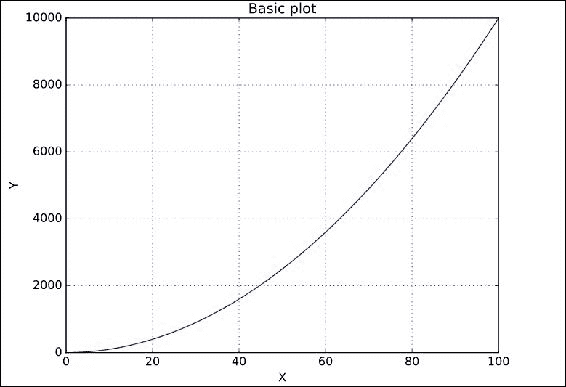

它已生成一个指数图。

### 使用正弦和余弦绘图

在以下代码中，我们使用函数初始化`x`和`y`：

```py
x = linspace(0, 3pi, 1000) 
y = cos(2*x + 3*sin(3*x)); 
plot(x, y, color="orange", linewidth=2.0, linestyle="--"); 
title("Another plot using sine and cosine"); 

```

让我们简要理解一下前面的代码：

+   在`plot`函数中，我们传递了用于生成特定图表的参数。

+   我们可以通过传递参数来更改线条的样式、宽度和颜色。

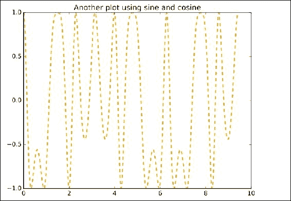

在这里，我们可以看到线条样式与第一幅图的线条样式有很大不同。默认颜色是蓝色，但我们已指定该图表使用橙色线条。

# Unicode 图表

Unicode 图表在我们需要在 REPL 中绘图时非常有用。它们极其轻量。

## 安装

没有依赖项，因此可以轻松安装：

```py
Pkg.add("UnicodePlots") 
using UnicodePlots 

```

## 示例

让我们了解一下使用`UnicodePlots`轻松制作的基本图表。

### 生成 Unicode 散点图

散点图用于确定两个变量之间的相关性，也就是说，一个变量如何受另一个变量的影响：

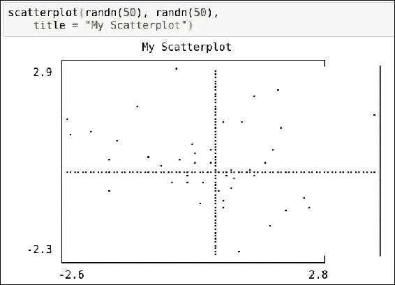

### 生成 Unicode 线图

线性图以一系列数据点显示数据集：

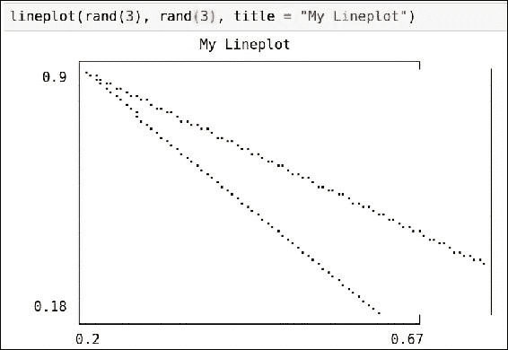

# 使用 Vega 进行可视化

Vega 是由 John Myles White 提供的美丽可视化库。它作为一个注册的 Julia 包提供，因此可以轻松安装。

它建立在 D3.js 之上，使用 JSON 来创建美观的可视化。每当我们需要生成图表时，它都需要互联网连接，因为它不会存储所需的 JavaScript 库的本地副本。

## 安装

要安装 Vega，请使用以下命令：

```py
Pkg.add("Vega")
using Vega

```

## 示例

让我们通过 Vega 走一遍各种可视化示例。

### 散点图

以下是散点图的参数：

+   `x`和`y`：AbstractVector

+   组：AbstractVector

散点图用于确定两个变量之间的相关性，即一个如何受到另一个的影响：

```py
scatterplot(x=rand(100), y=rand(100))

```

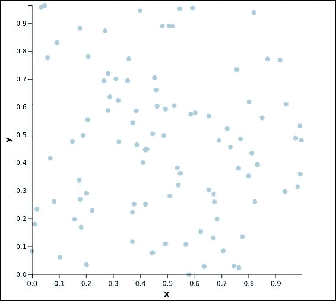

现在我们可以开始构建一个复杂的散点图：

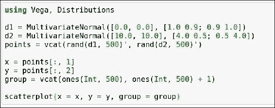

这将生成以下散点图。我们可以清楚地看到 Vega 生成的两个聚类。这些是 `d1` 和 `d2`：

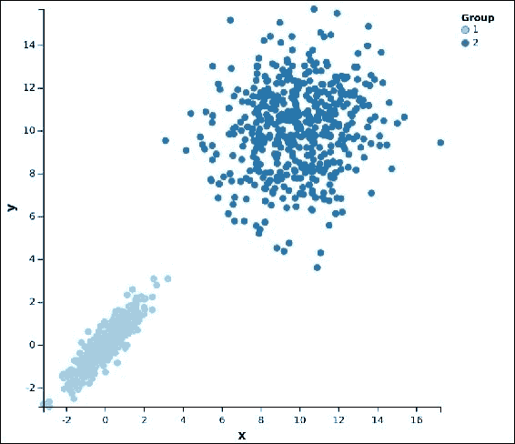

在这个特定的例子中，我们将数据分组并使用不同的颜色来可视化这些分组。

## Vega 中的热图

Vega 中的热图易于生成。这帮助我们轻松地可视化数据点的密度。参数如下：

+   `x` 和 `y`

+   颜色

```py
x = Array(Int, 900) 
y = Array(Int, 900) 
color = Array(Float64, 900) 
tmp = 0 
for counter in 1:30 
    for counter2 in 1:30 
        tmp += 1 
        x[tmp] = counter 
        y[tmp] = counter2 
        color[tmp] = rand() 
    end 
end 
hm = heatmap(x = x, y = y, color = color) 

```

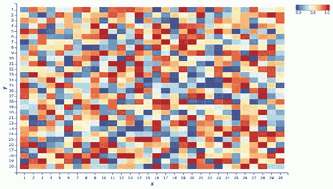

# 使用 Gadfly 进行数据可视化

Gadfly 是一个由 Daniel Jones 使用 Julia 编写的全面的绘图和数据可视化包。它基于 Leland Wilkinson 的书籍《*图形语法*》。它在很大程度上受到 R 语言中 `ggplot2` 包的启发，后者是另一个出色的绘图和可视化工具。

## 安装 Gadfly

安装过程很简单，因为它是一个注册的 Julia 包：

```py
Julia> Pkg.update()
Julia> Pkg.add("Gadfly")

```

这也会安装 Gadfly 所需的其他一些包。

要使用 Gadfly，请运行以下命令：

```py
Julia> using Gadfly

```

在我们的示例中，我们将使用 IJulia（jupyter notebook）。

Gadfly 具有渲染高质量图形和可视化的能力，支持 PNG、SVG、Postscript 和 PDF 格式。SVG 后端使用嵌入的 JavaScript，实现与图形的交互功能，如缩放、平移和切换。

安装 Cairo 会比较好，因为 PNG、PostScript 和 PDF 需要它：

```py
Julia> Pkg.add("Cairo")

```

假设我们创建了一个 `exampleplot`。为了在后端绘制它，我们使用 draw 函数：

```py
julia> exampleplot = plot(....)

```

+   对于 SVG：

```py
julia> draw(SVG("plotinFile.svg', 4inch, 4inch), exampleplot)

```

+   对于嵌入 JavaScript 的 SVG：

```py
julia> draw(SVGJS("plotinFile.svg', 4inch, 4inch), exampleplot)

```

+   对于 PNG：

```py
julia> draw(PNG("plotinFile.png', 4inch, 4inch), exampleplot)

```

+   对于 PostScript：

```py
julia> draw(PS("plotinFile.ps', 4inch, 4inch), exampleplot)

```

+   对于 PDF：

```py
julia> draw(PDF("plotinFile.pdf', 4inch, 4inch), exampleplot)

```

## 使用 plot 函数与 Gadfly 进行交互

`plot` 函数用于与 Gadfly 包进行交互并创建所需的可视化图形。美学元素映射到图形几何图形上，用于指定 `plot` 函数的工作方式。它们是特定命名的变量。

`plot` 元素可以是比例尺、坐标、引导线和几何图形。它在图形语法中定义，以避免特殊情况，而美学通过以明确定义的输入和输出方法处理问题，从而产生期望的结果。

Plot 可以处理以下数据源：

+   函数和表达式

+   数组和集合

+   数据框

### 示例

如果我们没有定义 `plot` 元素，默认情况下会使用点几何图形。在点几何图形中，x 和 y 输入被视为美学元素。

让我们绘制一个散点图：

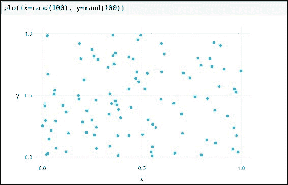

在相同的美学中，我们可以使用多个元素来获得特定的输出。

例如，要在同一数据集上同时绘制线和点几何图形，我们可以使用以下方式创建分层图：

+   `Geom.line`：线图

+   `Geom.point`：点图

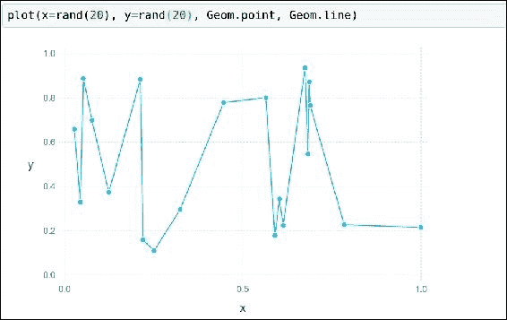

这生成了一个包含线条和点的分层图。通过组合不同的元素，可以生成一个复杂的图。

Guide:

+   `xlabel` 和 `ylabel`：Guide 可用于为我们使用的图表提供必要的标签。

+   `title`：用于为图表提供标题

刻度：

+   使用此功能可以放大或缩小图表的任何所需轴

让我们创建一个包含这些元素的类似图表。我们将添加 `x` 和 `y` 标签，给图表添加标题，并缩放图表：

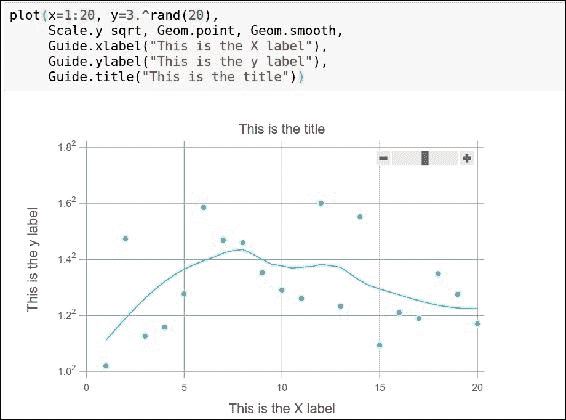

图中的滑块可用于缩放。

## 使用 Gadfly 绘制 DataFrame

Gadfly 提供的对 DataFrame 的支持非常有用。在前几章中，我们学习了 DataFrame 的功能。它是一个强大的数据结构，用于表示和操作数据。

使用 Gadfly，我们可以轻松生成复杂的图表。DataFrame 作为第一个参数传递给绘图函数。

DataFrame 中的列通过名称或索引在美学中被绘图函数使用。我们将使用 RDatasets 来为绘图函数创建 DataFrame。RDatasets 提供了一些现实世界中的数据集，我们可以在这些数据集上进行可视化操作，以了解 Gadfly 包的功能：

```py
Using Rdatasets, Gadfly 
plot(iris, x=:SepalLength, y=:SepalWidth, 
  color=:Species, shape=:Species, Geom.point, 
  Theme(default_point_size=3pt)) 

```

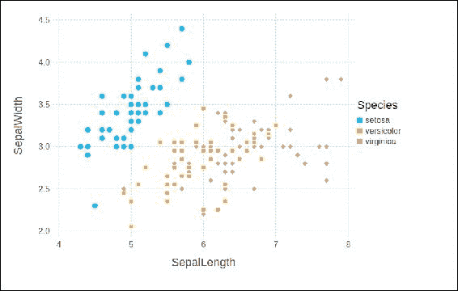

这是一个非常著名的数据集——鸢尾花数据集——我们在前面的例子中也使用过。通过花萼长度和花萼宽度绘制数据集很容易，因为我们只需将它们作为 `x` 和 `y` 坐标传递。

现在，我们使用随机数生成器创建一个直方图。我们将传递一个由随机数生成器创建的数组，然后生成直方图。

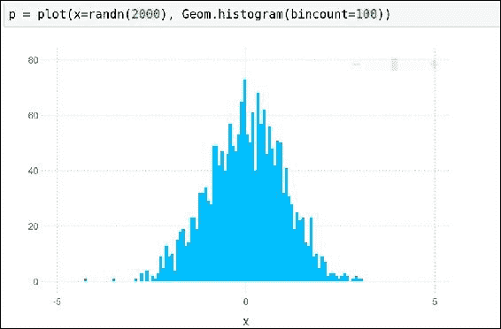

这是一个相当简单的直方图。我们来使用 RDataset 中的数据集创建一个直方图：

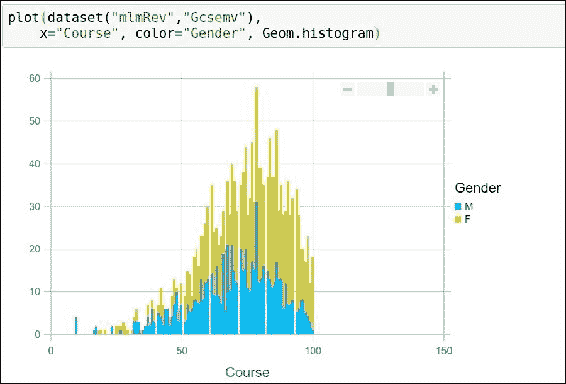

前面的数据集来自 RDatasets，我们创建了一个直方图，用于查看学生在课程中获得的成绩和性别。

这可以通过创建散点图来扩展：

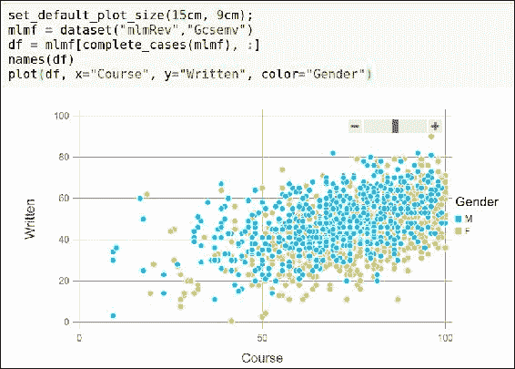

## 使用 Gadfly 可视化函数和表达式

在 Gadfly 中，绘制函数和表达式非常方便。

绘图函数的函数和表达式的签名如下：

```py
plot(f::Function, a, b, elements::Element...)
plot(fs::Array, a, b, elements::Element...)

```

这表明我们可以将函数或表达式作为数组传递，数组中包含我们希望使用的元素。

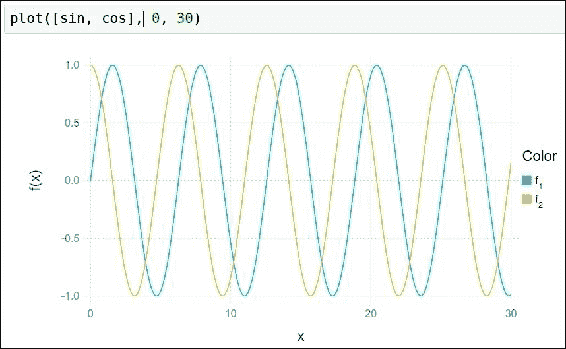

这是一个简单的正弦和余弦函数的图。让我们从一个复杂的表达式创建一个图表：

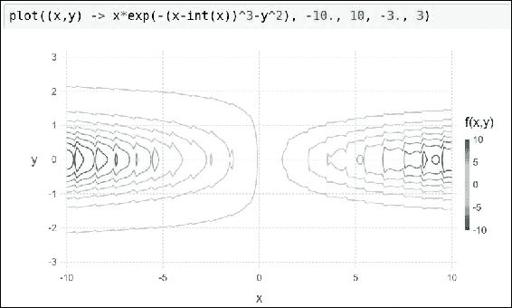

这是我们尝试绘制的一个随机表达式。你可以看到，绘制一个稍微复杂的表达式非常简单。即使复杂性增加，Gadfly 也表现得很好。

## 生成多层图像

Gadfly 能够将多个图层绘制到同一图表上：

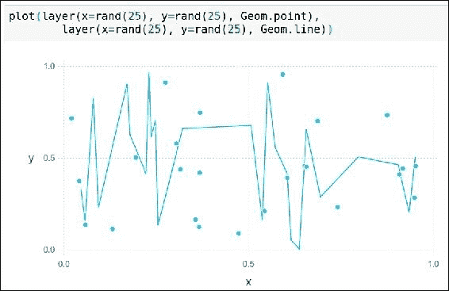

## 使用统计学生成具有不同美学的图表

Gadfly 中的统计函数通过接受一个或多个美学作为输入，并输出一个或多个美学。

让我们逐一探讨它们。

### 步骤函数

这用于在给定的点之间进行逐步插值。通过该函数在两个点之间引入一个新点，插值的方向取决于参数的方向：

+   `x` 和 `y` 点是使用的美学元素

+   `:vh` 用于垂直方向，`:hv` 用于水平方向

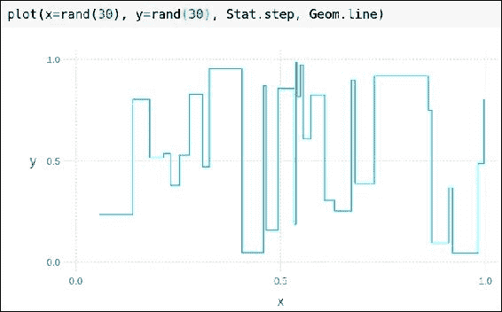

### 分位数-分位数函数

这用于生成分位数-分位数图。将两个数值向量传递给函数，并进行它们分位数的比较。

传递给函数的 `x` 和 `y` 是分布或数值向量：

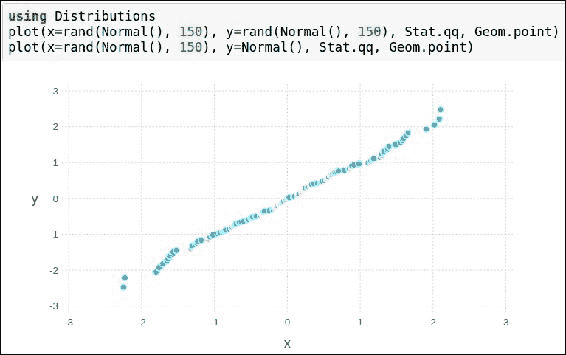

### Gadfly 中的刻度线

刻度线用于包围坐标轴之间的数据

有两种类型的刻度线：`xticks` 和 `yticks`。

刻度线函数的参数包括：

+   `ticks`：特定的刻度线数组（当没有刻度线时，会计算出它们）

+   `granularity_weight`：刻度线的数量（默认值为 1/4）

+   `simplicity_weight`：包括零（默认值为 1/6）

+   `coverage_weight`：紧密适配数据的跨度（默认值为 1/3）

+   `niceness_weight`：编号（默认值为 1/4）

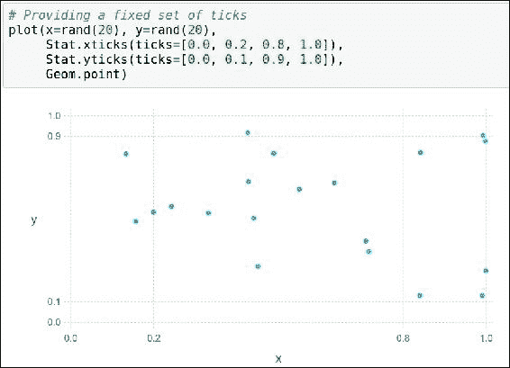

## 使用几何学生成具有不同美学的图表

几何学负责实际的绘制。一个或多个输入（美学）传递给函数。

### 箱型图

这也称为胡须图；这是一种基于四分位数显示数据的标准方法：

+   第一和第三四分位数由盒子的底部和顶部表示

+   盒子内的带状区域是第二四分位数（中位数）

+   盒子外的带状区域表示最小值和最大值

直接使用的美学包括：

+   `x`

+   `middle`

+   `lower_hinge` 和 `upper_hinge`

+   `lower_fence` 和 `upper_fence`

+   `outliers`

仅需要传递绘制箱型图的数据集。

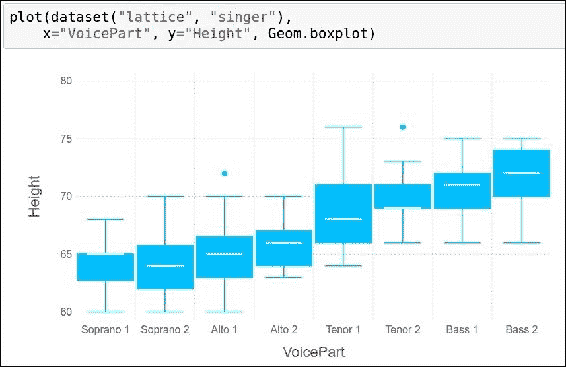

### 使用几何学创建密度图

通过密度图可以有效地查看变量的分布：

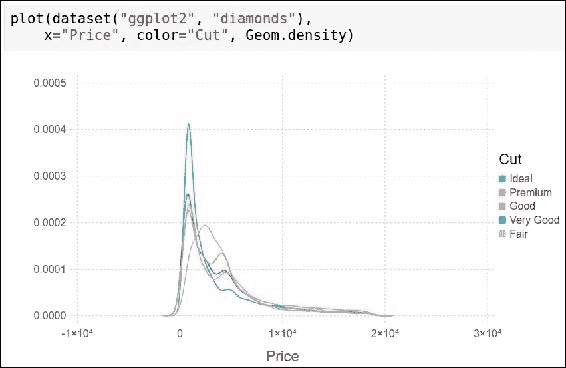

上面的截图显示了特定范围内变量的密度。

### 使用几何学创建直方图

直方图有助于理解分布的形态。它将数字分组为范围。

美学包括：

+   `x`：用于绘制直方图的数据集

+   `color`（可选）：不同的类别可以通过颜色进行分组

参数包括：

+   `position`：有两个选项，`:stack` 或 `:dodge`。这定义了条形图是并排放置还是堆叠在一起。

+   `density`：可选项

+   `orientation`：水平或垂直

+   `bincount`：箱数

+   `maxbincount` 和 `minbincount`: 当自动选择箱数时的上限和下限。


### 条形图

这些由平行条形图组成，用于图形化频率分布。

Aesthetics are:

+   `y`: 这是必需的。它是每个条形的高度。

+   `颜色`: 可选。用于将数据集分类。

+   `x`: 每个条形图的位置。

`xmin` 和 `xmax` 也可以代替 `x`，它们是每个条形图的起始和结束。

Arguments are:

+   `position`: 可以是 `:stack` 或 `:dodge`

+   `orientation`: 可以是 `:vertical` 或 `:horizontal`

如果选择 `:horizontal`，则需要提供 `y` 作为美学（或 `ymin`/`ymax`）。

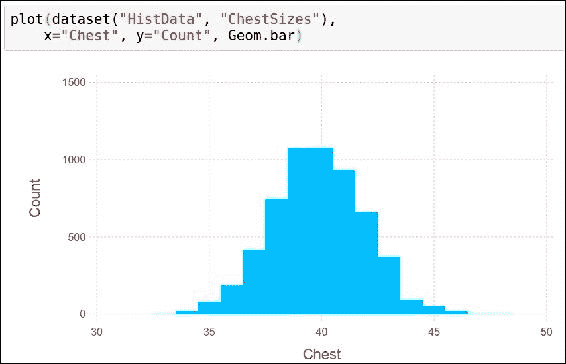

### 二维直方图 - Histogram2d

用于创建类似热图的直方图，其中矩形条形代表密度。

Aesthetics are:

+   `x` 和 `y`: 要绘制在坐标上的数据集

Arguments are:

+   `xbincount`: 指定 *x* 坐标的箱数

    当自动确定箱数时提供 `xminbincount` 和 `xmaxbincount`

+   `ybincount`: 指定 *y* 坐标的箱数

    当自动确定箱数时提供 `yminbincount` 和 `ymaxbincount`

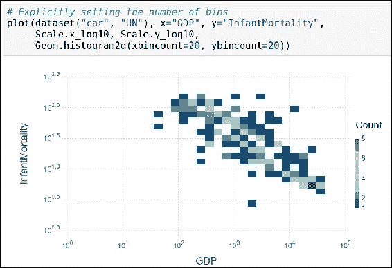

### 平滑线图

我们之前处理过线图的示例。我们还可以创建平滑线图，从数据中估计函数。

Aesthetics are:

+   `x`: 预测数据

+   `y`: 响应（函数）数据

+   `颜色`: 可作为可选参数用于分类数据集

Arguments are:

+   `smoothing`: 指定平滑的程度

    较小的值使用更多数据（更拟合），较大的值使用较少数据（拟合度较低）。

+   Method: 支持 `:lm` 和 `:loess` 方法作为生成平滑曲线的参数

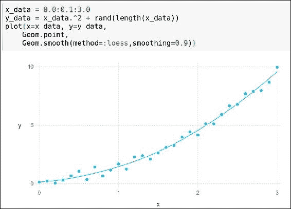

### 子图网格

可以将多个图一起作为网格制作，并根据几个分类向量进行组织:

```py
Julia> Geom.subplot_grid(elements::Gadfly.ElementOrFunction...)

```

Aesthetics are:

+   `xgroup` 和 `ygroup`（可选）：用于基于分类数据在 *x* 轴或 *y* 轴上排列子图。

+   `free_y_axis` 和 `free_x_axis`（可选）：默认情况下，值为 false，这意味着在不同子图之间 *y* 轴或 *x* 轴的比例尺可以不同。

    如果值为 true，则为每个图设置比例尺。

+   如果 `xgroup` 和 `ygroup` 都绑定，则形成一个网格。

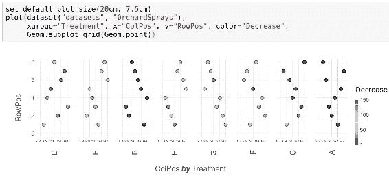

使用固定比例尺:

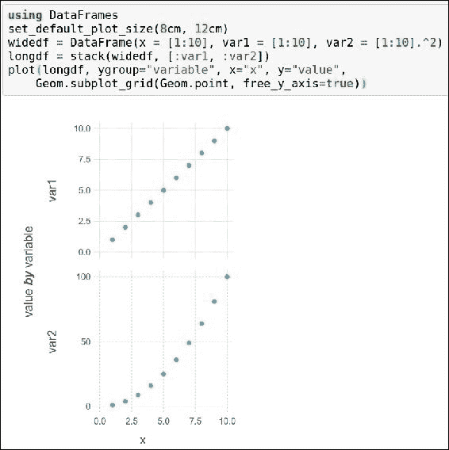

### 水平和垂直线

使用 `hline` 和 `vline`，我们可以在画布上绘制水平和垂直线。

Aesthetics are:

+   `xintercept`: *x* 轴截距

+   `yintercept`: *y* 轴截距

Arguments are:

+   `颜色`: 生成线条的颜色

+   `size`: 我们还可以指定线条的宽度

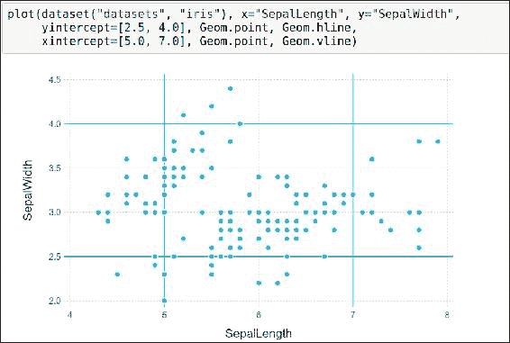

### 绘制带状图

我们还可以在折线图上绘制带状图。

美学为：

+   `x`：*x* 轴

+   `ymin` 和 `ymax`：*y* 轴的下限和上限

+   `color`（可选）：使用不同颜色将数据分组

示例：

```py
xs = 0:0.1:20 
df_cos = DataFrame( 
    x=xs, 
    y=cos(xs), 
    ymin=cos(xs) .- 0.5, 
    ymax=cos(xs) .+ 0.5, 
    f="cos" 
    ) 
df_sin = DataFrame( 
    x=xs, 
    y=sin(xs), 
    ymin=sin(xs) .- 0.5, 
    ymax=sin(xs) .+ 0.5, 
    f="sin" 
    ) 
df = vcat(df_cos, df_sin) 
p = plot(df, x=:x, y=:y, ymin=:ymin, ymax=:ymax, color=:f, Geom.line, Geom.ribbon) 

```

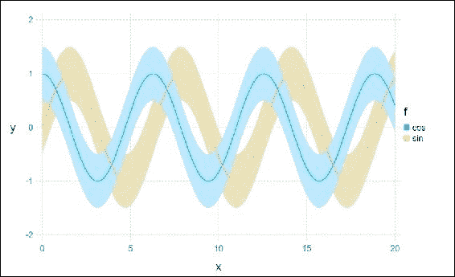

### 小提琴图

小提琴图非常特定于使用场景。它们用于显示密度。

美学为：

+   `x` 和 `y`：*x* 轴和 *y* 轴上的位置

+   `width`：这表示根据 `y` 值的密度

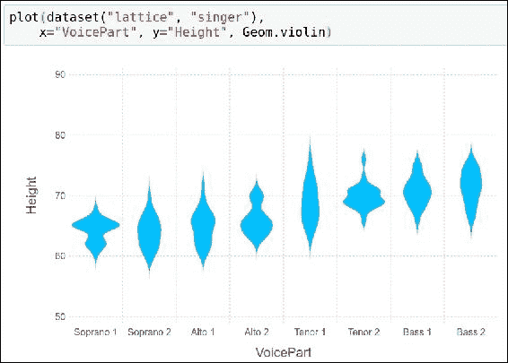

### 蜂群图

就像小提琴图一样，我们可以使用 `beeswarm` 图表示密度。

美学为：

+   `x` 和 `y`：*x* 轴和 *y* 轴的数据集

+   `color`（可选）

参数为：

+   `orientation`：这可以是 `:vertical` 或 `:horizontal`

+   `padding`：两点之间的最小距离

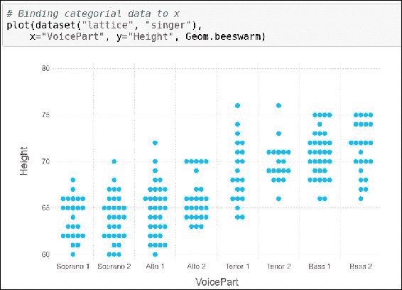

## 元素 - 比例

这用于转换原始数据，同时保留原始值。它将一个美学映射到相同的美学。

### x_continuous 和 y_continuous

这些用于将值映射到 *x* 和 *y* 坐标。

美学为：

+   `x`，`xmin`/`xmax` 和 `xintercept`

+   `y`，`ymin`/`ymax` 和 `yintercept`

参数为：

+   `minvalue`：最小 `x` 或 `y` 值

+   `maxvalue`：最大 `x` 或 `y` 值

+   `labels`：这可以是一个函数或不设置

    当传入一个函数时，字符串将映射到 `x` 或 `y` 中的值

+   `format`：数字格式化

变体为：

+   `Scale.x_continuous` 和 `Scale.y_continuous`

+   `Scale.x_log10` 和 `Scale.ylog10`

+   `Scale.x_log2` 和 `Scale.ylog2`

+   `Scale.x_log` 和 `Scale.y_log`

+   `Scale.x_asinh` 和 `Scale.y_asinh`

+   `Scale.x_sqrt` 和 `Scale.y_sqrt`

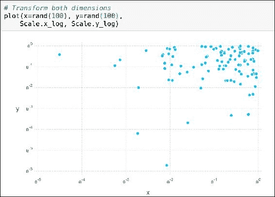

### x_discrete 和 y_discrete

这些用于将分类数据映射到笛卡尔坐标系。不论值如何，每个值都映射到一个点。

美学为：

+   `x`，`xmin`/`xmax` 和 `xintercept`

+   `y`，`ymin`/`ymax` 和 `yintercept`

参数为：

+   `labels`：这可以是一个函数或不设置

    当传入一个函数时，字符串将映射到 `x` 或 `y` 中的值：

    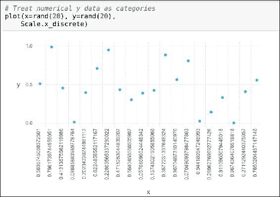

### 连续颜色比例

这创建一个使用连续颜色比例的图表。它用于表示密度。

美学为：

+   color

参数为：

+   `f`：定义的返回颜色的函数

+   `minvalues` 和 `maxvalue`：颜色比例值的范围

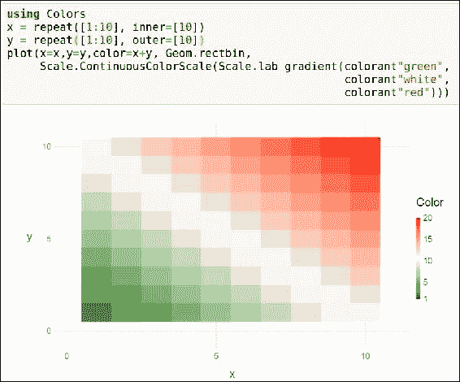

## 元素 - 引导

这些提供了特别的布局考虑，有助于我们更好地理解数据。它们包含 `xticks`、`yticks`、`xlabels`、`ylabels`、标题和注释等内容。

## 理解 Gadfly 如何工作

本章我们已经介绍了各种图表。现在简要介绍一下 Gadfly 实际如何工作。

首先，数据源的子集被映射到图表中每一层的数据对象：

+   我们将不同的尺度传递给绘图函数，用来获取可绘制的美学效果。

+   进行了美学转换，既在图层上也在图形上进行处理。

+   创建一个 Compose 上下文，通过使用所有图层的美学，将数据适配到屏幕坐标。

+   每一层的几何图形都单独渲染。

+   最后，计算并在图形上方渲染了引导。

# 总结

在这一章节中，我们学习了如何使用不同的图形选项在 Julia 中进行可视化。

我们研究了 PyPlot 以及如何利用强大的 matplotlib 库，做了多个示例。我们还了解了 Unicode 图形，它们非常轻量，可以在终端中使用。本章节还解释了两大最受欢迎的图形库 Vega 和 Gadfly。通过使用散点图、折线图、箱线图、直方图、条形图和小提琴图等不同的图形，我们理解了可视化数据的重要性和帮助。

在下一章，我们将学习 Julia 中的机器学习。

# 参考资料

+   [`dcjones.github.io/Gadfly.jl/`](http://dcjones.github.io/Gadfly.jl/)

+   [`github.com/stevengj/PyPlot.jl`](https://github.com/stevengj/PyPlot.jl)

+   [`johnmyleswhite.github.io/Vega.jl/`](http://johnmyleswhite.github.io/Vega.jl/)

+   [`github.com/Evizero/UnicodePlots.jl`](https://github.com/Evizero/UnicodePlots.jl)
