# 第六章 监督机器学习

人们通常认为数据科学就是机器学习，这意味着在数据科学中，我们只是训练机器学习模型。但数据科学远不止于此。数据科学涉及理解数据、收集数据、整理数据、从中获取意义，然后如果需要进行机器学习。

在我看来，机器学习是当今存在的最令人兴奋的领域。随着大量可用数据的出现，我们可以收集到宝贵的知识。许多公司已经使他们的机器学习库变得可访问，还有很多开源替代品存在。

在本章中，你将学习以下主题：

+   什么是机器学习？

+   机器学习的类型

+   过拟合和欠拟合是什么？

+   偏差-方差权衡

+   特征提取和选择

+   决策树

+   朴素贝叶斯分类器

# 什么是机器学习？

一般来说，当我们谈论机器学习时，我们会涉及到与我们创建但失控的智能机器争斗的想法。这些机器能够智胜人类，并对人类生存构成威胁。这些理论只是为了我们的娱乐而创造的。我们离这样的机器还非常遥远。

所以问题是：什么是机器学习？Tom M. Mitchell 给出了一个正式的定义：

> *"如果一个计算机程序在任务 T 的表现，以性能度量 P 来衡量，随着经验 E 的增加而提高，那么它就被认为是从经验 E 中学习。"*

这意味着机器学习是教计算机使用数据生成算法，而不是明确编程它们。它将数据转化为可操作的知识。机器学习与统计学、概率论和数学优化密切相关。

随着技术的发展，有一样东西呈指数增长——数据。我们有大量的结构化和非结构化数据，以非常快的速度增长。太空观测站、气象学家、生物学家、健身传感器、调查等产生了大量数据。手动处理这么多数据并找出模式或洞察力是不可能的。这些数据对科学家、领域专家、政府、卫生官员甚至企业都非常重要。为了从这些数据中获取知识，我们需要自学习算法来帮助我们做决策。

机器学习作为人工智能的一个子领域发展，消除了手动分析大量数据的需要。我们通过使用自学习预测模型来进行数据驱动决策。机器学习已经成为我们日常生活中的重要组成部分。一些常见的应用包括搜索引擎、游戏、垃圾邮件过滤器和图像识别。自动驾驶汽车也使用机器学习。

机器学习中使用的一些基本术语包括：

+   **特征**：数据点或记录的独特特征。

+   **训练集**：这是我们输入算法进行训练的数据集，帮助我们发现关系或构建模型。

+   **测试集**：使用训练数据集生成的算法会在测试数据集上进行测试，以查找准确度。

+   **特征向量**：包含定义对象特征的 n 维向量。

+   **样本**：数据集中的一个项目或记录。

## 机器学习的应用

机器学习在某种程度上无处不在，它的应用几乎没有边界。我们来讨论一些非常常见的使用案例：

+   **电子邮件垃圾邮件过滤**：每个主要的电子邮件服务提供商都使用机器学习来将垃圾邮件从收件箱过滤到垃圾邮件文件夹。

+   **预测风暴和自然灾害**：气象学家和地质学家利用机器学习，通过天气数据预测自然灾害，这有助于我们采取预防措施。

+   **定向促销/活动和广告**：在社交网站、搜索引擎，甚至可能在邮箱中，我们看到的广告总是某种程度上符合我们的口味。这是通过对我们过去搜索记录、社交资料或电子邮件内容的数据进行机器学习来实现的。

+   **自动驾驶汽车**：科技巨头目前正致力于自动驾驶汽车。这是通过对实际驾驶数据、人类驾驶员的图像和声音处理以及其他各种因素进行机器学习实现的。

+   机器学习也被企业用来预测市场。

+   它还可以用来预测选举结果和选民对特定候选人的情感。

+   机器学习也被用来预防犯罪。通过理解不同罪犯的模式，我们可以预测未来可能发生的犯罪，并加以防范。

一个广受关注的案例是，美国一家大型零售商利用机器学习来识别孕妇。该零售商想出了通过在多种孕妇用品上提供折扣来吸引女性顾客，让她们成为忠实客户，并购买高利润的婴儿用品。

该零售商通过分析购买不同孕妇用品的模式，研究出了预测怀孕的算法。

曾经有一个人走到零售商面前，询问为什么他的青少年女儿会收到孕妇用品的折扣券。零售商道歉了，但后来父亲自己也道歉了，因为他了解到女儿确实怀孕了。

这个故事可能完全真实，也可能并非完全真实，但零售商确实定期分析客户数据，以发现用于定向促销、活动和库存管理的模式。

## 机器学习与伦理

让我们看看机器学习在哪些领域被广泛应用：

+   **零售商**：在之前的例子中，我们提到零售商如何使用数据来进行机器学习，从而增加收入并留住客户

+   **垃圾邮件过滤**：电子邮件通过各种机器学习算法进行垃圾邮件过滤

+   **定向广告**：在我们的邮箱、社交网站或搜索引擎中，我们会看到自己喜欢的广告

这些仅是现实世界中实施的部分实际用例。它们之间的共同点是用户数据。

在第一个例子中，零售商利用用户的交易历史进行定向推广和活动策划，以及库存管理等其他工作。零售巨头通过为用户提供忠诚卡或注册卡来实现这一点。

在第二个例子中，电子邮件服务提供商使用经过训练的机器学习算法来检测和标记垃圾邮件。它通过检查电子邮件内容/附件，并对电子邮件发送者进行分类来实现这一点。

在第三个例子中，同样是电子邮件提供商、社交网络或搜索引擎通过我们的 Cookies、个人资料或邮件来进行定向广告。

在所有这些例子中，当我们与零售商、电子邮件提供商或社交网络签约时，协议的条款和条件中都会提到将使用用户数据，但不会侵犯隐私。

在使用未公开的数据之前，我们必须获得必要的许可。这非常重要。此外，我们的机器学习模型不应在地域、种族、性别或任何其他方面存在歧视。提供的数据不应用于协议中未提及的目的，或在所在地区或国家是非法的。

# 机器学习 – 过程

机器学习算法的训练是根据人类大脑工作的方式进行的。它们有些相似。让我们来讨论整个过程。

机器学习过程可以分为三个步骤：

1.  输入

1.  抽象

1.  泛化

这三个步骤是机器学习算法工作的核心。尽管算法的表现形式可能不同，但这解释了整体方法：

1.  第一步集中在应该包含哪些数据以及不应包含哪些数据。根据这一点，它根据需求收集、存储并清理数据。

1.  第二步涉及将数据转换为代表更大类的数据。这是必要的，因为我们无法捕捉到所有数据，且我们的算法不应该仅适用于我们拥有的数据。

1.  第三步关注于创建模型或行动，这些模型或行动将使用这些抽象的数据，并适用于更广泛的群体。

那么，接近一个机器学习问题的流程应该是什么样的呢？

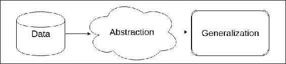

在这个特定的图示中，我们看到数据在用于创建机器学习算法之前，经过了抽象处理过程。这个过程本身是繁琐的。我们在与数据清洗相关的章节中学习了这个过程。

该过程紧随模型训练之后，模型的训练就是将模型拟合到我们拥有的数据集上。计算机并不会自主选择模型，而是依赖于学习任务。学习任务还包括将从我们尚未拥有的数据中获得的知识进行泛化。

因此，训练模型是基于我们当前拥有的数据，而学习任务包括将模型泛化到未来的数据。

它取决于我们的模型如何从我们当前拥有的数据集中推断知识。我们需要创建一个能够从之前不为我们所知的东西中汲取洞察的模型，这样它就能对未来数据产生有用的联系。

## 不同类型的机器学习

机器学习主要分为三类：

+   监督学习

+   无监督学习

+   强化学习

在监督学习中，模型/机器会接收输入以及与这些输入对应的输出。机器从这些输入中学习，并将这种学习应用于进一步的未见数据，以生成输出。

无监督学习没有所需的输出，因此由机器来学习并寻找之前未见的模式。

在强化学习中，机器与环境持续互动并通过这一过程学习。这包括一个反馈循环。

## 什么是偏差-方差权衡？

让我们理解一下什么是偏差和方差。首先，我们将讨论模型中的偏差：

+   偏差是模型生成的预测结果与预期的正确值之间的差异，或者说我们应该获得的值。

+   当我们获得新数据时，模型会进行计算并给出预测。因此，这意味着我们的模型有一个可以生成预测的范围。

+   偏差是这一预测范围的准确性。

现在，让我们理解方差以及它如何影响模型：

+   方差是当数据点发生变化或引入新数据时，模型的变异性

+   不应该在每次引入新数据时都需要调整模型

根据我们对偏差和方差的理解，我们可以得出结论，它们相互影响。因此，在创建模型时，我们会考虑这一权衡。

## 过拟合和欠拟合对模型的影响

过拟合发生在我们创建的模型开始考虑数据集中的异常值或噪声时。因此，这意味着我们的模型过度拟合了数据集。

这种模型的缺点是无法很好地进行泛化。这类模型具有低偏差和高方差。

欠拟合发生在我们创建的模型未能找到数据的模式或趋势时。因此，这意味着模型未能很好地适应数据集。

这种模型的缺点是无法给出良好的预测。这些模型具有高偏差和低方差。

我们应该尽量减少欠拟合和过拟合。这可以通过各种技术来实现。集成模型在避免欠拟合和过拟合方面非常有效。我们将在接下来的章节中学习集成模型。

# 理解决策树

决策树是“分治法”的一个很好的例子。它是最实用、最广泛使用的归纳推理方法之一。它是一种监督学习方法，可用于分类和回归。它是非参数的，目的是通过推断数据中的简单决策规则来学习，并创建一个能够预测目标变量值的模型。

在做出决策之前，我们会通过权衡不同选项来分析利弊。例如，我们想购买一部手机，并且有多个价格区间的选择。每款手机都有某些特别好的功能，可能比其他手机更好。为了做出选择，我们从考虑我们最重要的特征开始。基于此，我们创建了一系列需要满足的特征，最终选择将是最符合这些特征的那一款。

本节我们将学习：

+   决策树

+   熵度量

+   随机森林

我们还将学习著名的决策树学习算法，如 ID3 和 C5.0。

## 构建决策树 - 分治法

一种称为递归划分的启发式方法用于构建决策树。在这种方法中，随着推进，我们将数据划分为越来越小的相似类别。

决策树实际上是一个倒置的树。它从根节点开始，最终到达叶节点，这些叶节点是终端节点。节点的分支依据逻辑决策。整个数据集在根节点处表示。算法会选择一个对目标类别最具预测性的特征。然后，它根据这个特征将样本划分为不同的值组。这代表了我们树的第一组分支。

采用分治法，直到达到终点。在每一步，算法会继续选择最佳的候选特征。

当以下条件满足时，定义终点：

+   在某个节点，几乎所有的样本都属于同一类别

+   特征列表已用尽

+   达到预定义的树大小限制

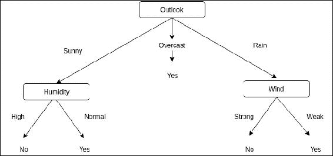

上述图像是一个非常著名的决策树示例。在这里，决策树是用来判断是否外出：

+   Outlook 是根节点。这指的是环境中所有可能的类别。

+   Sunny、overcast 和 Rain 是分支。

+   湿度和风速是叶节点，这些节点又被分为分支，决策是根据有利的环境做出的。

这些树也可以重新表示为 if-then 规则，这样会更容易理解。决策树是非常成功且受欢迎的算法之一，应用范围广泛。

以下是决策树的一些应用：

+   **信用卡/贷款批准决策**：信用评分模型基于决策树，每个申请人的信息被输入，以决定是否批准信用卡/贷款。

+   **医学诊断**：许多疾病通过基于症状、测量和检测的经过充分定义和测试的决策树进行诊断。

## 我们应该在什么情况下使用决策树学习？

虽然有多种决策树学习方法可以用于各种问题，但决策树最适合以下场景：

+   属性-值对是指通过固定集的属性和相应的值来描述实例的场景。在前面的例子中，我们有属性“风速”和值“强”和“弱”。这些互斥的可能值使得决策树学习变得容易，尽管也可以使用具有实数值的属性。

+   目标函数的最终输出是离散值，类似于前面的例子，其中我们有“是”或“否”。决策树算法可以扩展为具有多个可能的目标值。决策树也可以扩展为具有实数值作为输出，但这种情况很少使用。

+   决策树算法对于训练数据集中的错误具有鲁棒性。这些错误可能出现在示例的属性值、分类或者两者都有。

+   决策树学习也适用于数据集中缺失值的情况。如果某些示例中的值缺失，而其他示例中的相同属性有值，那么可以使用决策树。

## 决策树的优点

+   决策树容易理解和解释，决策树的可视化也很简单。

+   在其他算法中，必须先进行数据归一化才能应用。归一化是指创建虚拟变量并去除空值。而决策树则需要的准备工作较少。

+   使用决策树进行预测的成本与训练树所使用的示例数量呈对数关系。

+   与其他算法不同，决策树可以同时应用于数值型和类别型数据。其他算法通常专门用于处理其中一种类型的变量。

+   决策树可以轻松处理可能有多个输出的情况。

+   决策树遵循白盒模型，这意味着如果情况在模型中是可观察的，使用布尔逻辑可以轻松解释条件。另一方面，在黑盒模型（如人工神经网络）中，结果相对难以解释。

+   统计测试可以用来验证模型。因此，我们可以测试模型的可靠性。

+   即使数据源的真实模型假设被违反，它也能表现良好。

## 决策树的缺点

我们已经介绍了决策树适用的情况及其优势。现在我们将讨论决策树的缺点：

+   决策树存在过拟合数据的可能性。这通常发生在创建过于复杂且难以泛化的树时。

+   为了避免这种情况，可以采取多种步骤。其中一种方法是修剪。顾名思义，这是一种方法，我们在其中设置树可以生长到的最大深度。

+   决策树总是存在不稳定性的问题，因为数据的微小变化可能导致生成完全不同的树。

+   这种场景的解决方案是集成学习，在下一章中我们将学习它。

+   决策树学习有时可能导致创建偏向某些类的树，而忽视其他类的情况。在将数据拟合到决策树算法之前，解决这种情况的方法是平衡数据集。

+   决策树学习被认为是 NP 完全的，考虑到优化的几个方面。即使对于基本概念也是如此。

+   通常使用贪婪算法等启发式算法，在每个节点都做出局部最优决策。这并不保证我们将得到一个全局最优的决策树。

+   对于诸如奇偶性、XOR 和多路复用器问题等概念，学习可能会很困难，决策树无法轻松表示它们。

## 决策树学习算法

有多种决策树学习算法，实际上是核心算法的变体。核心算法实际上是一种自顶向下的、贪婪的搜索所有可能树的方法。

我们将讨论两种算法：

+   ID3

+   C4.5 和 C5.0

第一个算法，**ID3**（**迭代二分器 3**），是由 Ross Quinlan 在 1986 年开发的。该算法通过创建一个多路树来进行，它使用贪婪搜索找到每个节点和可以产生最大信息增益的特征，由于树可以增长到最大尺寸，这可能导致数据过拟合，因此使用修剪来创建泛化模型。

C4.5 是在 ID3 之后发展起来的，消除了所有特征必须是分类变量的限制。它通过基于数值变量动态定义离散特征来实现这一点。它将连续的属性值划分为一组离散区间。C4.5 从 ID3 算法的训练树中创建 if-then 规则集合。C5.0 是最新版本；它创建了更小的规则集，并且使用相对较少的内存。

### 决策树算法如何工作

决策树算法构建自顶向下的树。它遵循以下步骤：

1.  为了知道哪一个元素应该出现在树的根节点，算法会对每个属性实例进行统计测试，以确定仅使用该属性时训练示例能够被多好地分类。

1.  这导致在树的根节点选择最佳特征。

1.  现在，在这个根节点上，对于每个属性的可能值，都创建后代节点。

1.  我们训练数据集中的示例会被分配到每一个这些后代节点。

1.  对于这些单独的后代节点，之前的所有步骤会针对训练数据集中剩余的示例重复进行。

1.  这会通过贪婪搜索创建一个可接受的训练数据集决策树。算法永不回溯，这意味着它永远不会重新考虑之前的选择，而是继续向树的下方发展。

### 理解与衡量节点的纯度

决策树是自顶向下构建的。每个节点选择分裂的属性可能会很困难。因此，我们寻找能够最好地分裂目标类别的特征。纯度是指一个节点只包含一个类别的度量。

C5.0 中的纯度是通过熵来衡量的。样本的熵指示了类别值在示例之间的混合程度：

+   0: 最小值表示样本中类别值的同质性

+   1: 最大值表示样本中类别值的最大无序程度

熵的计算公式为：

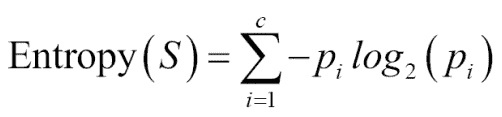

在前面的公式中，*S*表示我们拥有的数据集，*c*表示类别水平。对于给定类别*i*，*p*是该类别值的比例。

当纯度度量确定后，算法必须决定数据应该根据哪个特征进行分裂。为了决定这一点，算法使用熵度量来计算在每个可能的特征上分裂时，同质性如何变化。算法进行的这种计算叫做信息增益：

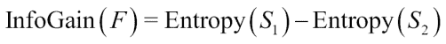

数据集分割前的熵（*S1*）与分割后得到的子集熵（*S2*）之间的差异叫做信息增益（*F*）。

## 一个示例

让我们将所学的知识应用于使用 Julia 创建决策树。我们将使用 [`scikit-learn.org/`](http://scikit-learn.org/) 上为 Python 提供的示例和 Cedric St-Jean 开发的 Scikitlearn.jl。

我们首先需要添加所需的包：

```py
julia> Pkg.update() 
julia> Pkg.add("DecisionTree") 
julia> Pkg.add("ScikitLearn") 
julia> Pkg.add("PyPlot") 

```

ScikitLearn 提供了一个接口，将著名的机器学习库从 Python 转换到 Julia：

```py
julia> using ScikitLearn 
julia> using DecisionTree 
julia> using PyPlot 

```

在添加所需包之后，我们将创建我们将在示例中使用的数据集：

```py
julia> # Create a random dataset 
julia> srand(100) 
julia> X = sort(5 * rand(80)) 
julia> XX = reshape(X, 80, 1) 
julia> y = sin(X) 
julia> y[1:5:end] += 3 * (0.5 - rand(16)) 

```

这将生成一个包含 16 个元素的 `Array{Float64,1}`。

现在我们将创建两个不同模型的实例。一个模型不限制树的深度，另一个模型则根据纯度修剪决策树：

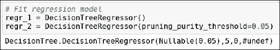

现在我们将对现有的数据集拟合模型。我们将拟合这两个模型。

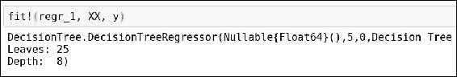

这是第一个模型。这里我们的决策树有 `25` 个叶节点，深度为 `8`。

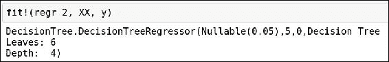

这是第二个模型。这里我们修剪了决策树。这个模型有 `6` 个叶节点，深度为 `4`。

现在我们将使用模型在测试数据集上进行预测：

```py
julia> # Predict 
julia> X_test = 0:0.01:5.0 
julia> y_1 = predict(regr_1, hcat(X_test)) 
julia> y_2 = predict(regr_2, hcat(X_test)) 

```

这将创建一个包含 501 个元素的 `Array{Float64,1}`。

为了更好地理解结果，让我们将这两个模型在我们拥有的数据集上进行可视化：

```py
julia> # Plot the results 
julia> scatter(X, y, c="k", label="data") 
julia> plot(X_test, y_1, c="g", label="no pruning", linewidth=2) 
julia> plot(X_test, y_2, c="r", label="pruning_purity_threshold=0.05", linewidth=2) 

julia> xlabel("data") 
julia> ylabel("target") 
julia> title("Decision Tree Regression") 
julia> legend(prop=Dict("size"=>10)) 

```

决策树可能会过拟合数据。为了使其更加通用，必须修剪决策树。但如果修剪过度，可能会导致模型不正确。因此，必须找到最优化的修剪级别。

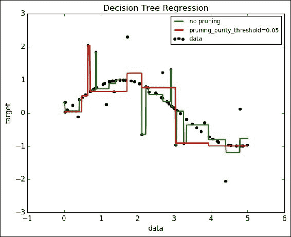

很明显，第一个决策树对我们的数据集过拟合，而第二个决策树模型则相对更加通用。

# 使用朴素贝叶斯的有监督学习

朴素贝叶斯是目前最著名的机器学习算法之一，广泛应用于文本分类技术。

朴素贝叶斯方法属于有监督学习算法。它是一种概率分类器，基于贝叶斯定理。它假设每对特征彼此独立，这一假设被称为“朴素”假设。

尽管做出这些假设，朴素贝叶斯分类器仍然表现得非常好。它们最著名的应用是垃圾邮件过滤。该算法的有效性体现在它对训练数据的需求非常小，能够估计出所需的参数。

与其他方法相比，这些分类器和学习器的速度相当快。

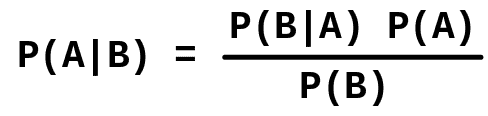

在这个公式中：

+   *A* 和 *B* 是事件。

+   *P(A)* 和 *P(B)* 分别是 *A* 和 *B* 的概率。

+   这些是先验概率，它们彼此独立。

+   *P(A | B)* 是在条件 *B* 为真的情况下，*A* 的概率。它是给定预测变量（*B*，属性）时，类别（*A*，目标）的后验概率。

+   *P(B | A)* 是在 *A* 为真时，*B* 的概率。它是预测给定类别的可能性，也就是预测器给定类别的概率。

## 朴素贝叶斯的优点

以下是朴素贝叶斯的一些优点：

+   它相对简单，易于构建和理解

+   它可以很容易地训练，并且不需要庞大的数据集

+   它相对较快

+   不受无关特征的影响

## 朴素贝叶斯的缺点

朴素贝叶斯的缺点是“朴素”假设，即每个特征都是独立的。这并非总是正确的。

## 朴素贝叶斯分类的用途

以下是朴素贝叶斯分类的一些应用：

+   **朴素贝叶斯文本分类**：这是一种概率学习方法，实际上是最成功的文档分类算法之一。

+   **垃圾邮件过滤**：这是朴素贝叶斯最知名的应用场景。朴素贝叶斯用于区分垃圾邮件和合法邮件。许多服务器端的邮件过滤机制与其他算法一起使用朴素贝叶斯。

+   **推荐系统**：朴素贝叶斯也可用于构建推荐系统。推荐系统用于预测并建议用户可能在未来喜欢的产品。它基于未见过的数据，并与协同过滤结合使用。这种方法更具可扩展性，通常比其他算法表现更好。

要理解朴素贝叶斯分类器如何实际工作，我们需要理解贝叶斯定理。它由托马斯·贝叶斯在 18 世纪提出。他发展了各种数学原理，这些原理今天被我们称为贝叶斯方法。这些方法有效地描述了事件的概率，以及当我们获得额外信息时，如何修正这些概率。

基于贝叶斯方法的分类器使用训练数据集，根据所有特征的值计算每个类别的观测概率。因此，当该分类器用于未标记或未见过的数据时，它会利用观测到的概率来预测新特征属于哪个类别。尽管这是一种非常简单的算法，但其性能可与大多数其他算法相媲美，甚至更好。

贝叶斯分类器最适用于以下情况：

+   包含大量属性的数据集，在计算结果的概率时需要同时考虑所有这些属性。

+   对于影响较弱的特征，通常会被忽略，但贝叶斯分类器仍然会使用它们来生成预测。许多此类弱特征可能会导致决策的重大变化。

## 贝叶斯方法的工作原理

贝叶斯方法依赖于一个概念，即事件发生的可能性估计是基于现有证据的。事件的可能结果就是事件本身；例如，在抛硬币时，我们可能得到正面或反面。同样，邮件可能是“正常”邮件或“垃圾”邮件。试验是指发生事件的单次机会。在我们之前的例子中，抛硬币就是试验。

### 后验概率

> *后验概率 = 条件概率 * 先验概率 / 证据*

在分类中，后验概率指的是在给定观察到的特征值时，一个特定对象属于某个类 x 的概率。例如，“给定温度和湿度，概率它会下雨是多少？”

> *P(rain | xi), xi = [45 度, 95%湿度]*

+   设*xi*为样本*i*的特征向量，其中*i*属于*{1,2,3,...n}*。

+   设*wj*为类*j*的符号，其中*j*属于*{1,2,3,...n}*。

+   *P(xi | wi)* 是观察样本*xi*的概率，前提是它属于类*wj*。

后验概率的通用表示法是：

> *P(*wj* | xi) = P(xi | wj) * P(wj)/P(xi)*

Naïve Bayes 的主要目标是最大化给定训练数据的后验概率，以便形成一个决策规则。

### 类条件概率

贝叶斯分类器假设数据集中的所有样本是独立同分布的。这里的独立性意味着一个观察的概率不受另一个观察概率的影响。

我们讨论过的一个非常著名的例子是抛硬币。在这里，第一次抛硬币的结果不会影响后续的抛硬币结果。对于一个公平的硬币，得到正面或反面的概率始终为 0.5。

一个额外的假设是特征具有条件独立性。这是另一个“天真”的假设，意味着可以直接从训练数据中估计似然或类条件概率，而无需评估所有 x 的概率。

让我们通过一个例子来理解。假设我们必须创建一个服务器端的电子邮件过滤应用程序，以决定邮件是否是垃圾邮件。假设我们有大约 1000 封电子邮件，其中 100 封是垃圾邮件。

现在，我们收到了一封新邮件，内容是“Hello Friend”。那么，我们应该如何计算这封新邮件的类条件概率呢？

文本的模式由两个特征组成：“hello”和“friend”。现在，我们将计算新邮件的类条件概率。

类条件概率是当邮件是垃圾邮件时遇到“hello”的概率 * 当邮件是垃圾邮件时遇到“friend”的概率：

> *P(X=[hello, world] | w=spam) = P(hello | spam) * P(friend | spam)*

我们可以轻松找出包含“hello”一词的邮件数量，以及包含“spam”一词的邮件数量。然而，我们做出了一个“天真”的假设，即一个单词不会影响另一个单词的出现。我们知道，“hello”和“friend”经常一起出现。因此，我们的假设被违反了。

### 先验概率

先验概率是关于事件发生的先验知识。它是特定类别发生的总概率。如果先验分布为均匀分布，则后验概率是通过类别条件概率和证据项来确定的。

先验知识是通过对训练数据的估计获得的，当训练数据是整个群体的样本时。

### 证据

计算后验概率还需要一个值，那就是“证据”。证据 P(x)是特定模式 x 发生的概率，它与类标签无关。

## 词袋模型

在前面的例子中，我们进行的是电子邮件的分类。为此，我们对一个模式进行分类。要对一个模式进行分类，最重要的任务是：

+   特征提取

+   特征选择

那么，如何识别好的特征呢？好的特征有一些特征：

+   特征必须对我们为其构建分类器的用例有重要意义

+   选择的特征应该包含足够的信息，能够很好地区分不同的模式，并可以用于训练分类器。

+   特征不应容易受到失真或缩放的影响

我们需要先将电子邮件文本表示为特征向量，然后才能将其适配到我们的模型并应用机器学习算法。文本文件的分类使用的是词袋模型。在这个模型中，我们创建词汇表，这是一个包含所有电子邮件（训练集）中出现的不同单词的集合，然后统计每个单词出现的次数。

### 使用朴素贝叶斯作为垃圾邮件过滤器的优点

以下是使用朴素贝叶斯作为垃圾邮件过滤器的优点：

+   它可以个性化。这意味着它可以基于每个用户进行训练。我们有时会订阅新闻简报、邮件列表或关于产品的更新，这些对于其他用户来说可能是垃圾邮件。此外，我收到的邮件中包含一些与我的工作相关的词汇，这些对其他用户来说可能被归类为垃圾邮件。所以，作为一个合法用户，我不希望我的邮件进入垃圾邮件箱。我们可以尝试使用规则或过滤器，但贝叶斯垃圾邮件过滤比这些机制更为优秀。

+   贝叶斯垃圾邮件过滤器在避免误报方面非常有效，因此合法邮件被分类为垃圾邮件的可能性非常小。例如，我们都会收到包含“尼日利亚”一词或声称来自尼日利亚的邮件，这些邮件实际上是钓鱼诈骗。但是，我可能在那儿有亲戚或朋友，或者我在那里有生意；因此，这封邮件对我来说可能并不不合法。

### 朴素贝叶斯过滤器的缺点

贝叶斯过滤器容易受到贝叶斯中毒的影响，这是一种通过将大量合法文本与垃圾邮件一起发送的技术。因此，贝叶斯过滤器在此处失败，并将其标记为“ham”或合法邮件。

## 朴素贝叶斯的例子

让我们使用 Julia 创建一些 Naïve Bayes 模型：

```py
julia> Pkg.update 
julia> Pkg.add("NaiveBayes") 

```

我们添加了所需的`NaiveBayes`包。

现在，让我们创建一些虚拟数据集：

```py
julia> X = [1 1 0 2 1; 
     0 0 3 1 0; 
     1 0 1 0 2] 
julia> y = [:a, :b, :b, :a, :a] 

```

我们创建了两个数组`X`和`y`，其中`y`中的每个元素表示`X`中的一列：

```py
julia> m = MultinomialNB(unique(y), 3) 
julia> fit(m, X, y) 

```

我们加载了 MultinomialNB 的实例，并将我们的数据集拟合到它上：

```py
julia> Xtest = [0 4 1; 
      2 2 0; 
      1 1 1] 

```

现在我们将使用它对我们的测试数据集进行预测：

```py
julia> predict(m, Xtest) 

```

我得到的输出是：

```py
julia> 3-element Array{Symbol,1}: 
   :b 
   :a 
   :a 

```

这意味着第一列是`b`，第二列是`a`，第三列也是`a`。

这个例子使用了一个虚拟数据集。让我们在一个实际数据集上应用 Naïve Bayes。我们将在这个例子中使用著名的鸢尾花数据集：

```py
julia> #import necessary libraries 

julia> using NaiveBayes 
julia> using RDatasets 

julia> iris = dataset("datasets", "iris") 

julia> #observations in columns and variables in rows 

julia> x = array(iris[:, 1:4]) 

julia> p,n = size(x) 
julia> # By default species is a PooledDataArray 

julia> y = [species for species in iris[:,5]] 

```

我们加载了 RDatasets，它包含了鸢尾花数据集。我们为特征向量（花萼长度、花萼宽度、花瓣长度和花瓣宽度）创建了数组。

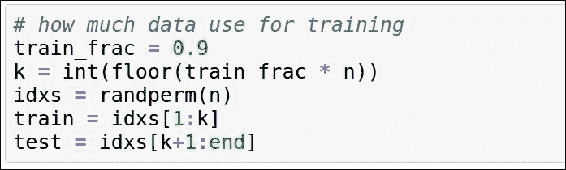

现在我们将拆分数据集进行训练和测试。

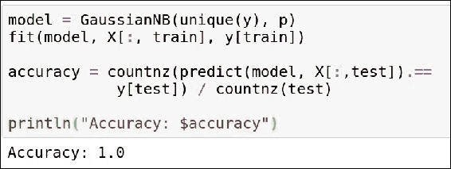

这是相当简单的，将数据集拟合到 Naïve Bayes 分类器上。我们还计算了模型的准确性。我们可以看到准确率是 1.0，也就是 100%。

# 总结

在这一章中，我们学习了机器学习及其应用。赋予计算机学习和改进的能力在这个世界上有着深远的应用。它被用于预测疾病爆发、天气预测、游戏、机器人、自动驾驶汽车、个人助手等众多领域。

机器学习有三种不同的类型：监督学习、无监督学习和强化学习。

在这一章中，我们学习了监督学习，特别是 Naïve Bayes 和决策树。在接下来的章节中，我们将学习更多关于集成学习和无监督学习的内容。

# 参考文献

+   [`github.com/JuliaStats/MLBase.jl`](https://github.com/JuliaStats/MLBase.jl)

+   [`julialang.org/`](http://julialang.org/)

+   [`github.com/johnmyleswhite/NaiveBayes.jl`](https://github.com/johnmyleswhite/NaiveBayes.jl)

+   [`github.com/bensadeghi/DecisionTree.jl`](https://github.com/bensadeghi/DecisionTree.jl)

+   [`github.com/bicycle1885/RandomForests.jl`](https://github.com/bicycle1885/RandomForests.jl)

+   [`scikit-learn.org/stable/`](http://scikit-learn.org/stable/)
