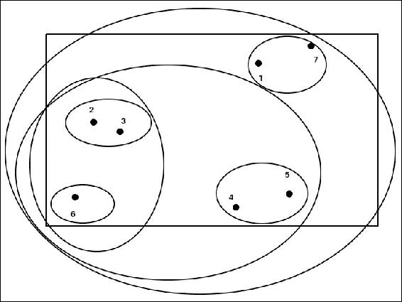

# 第七章 无监督机器学习

在上一章，我们学习了监督式机器学习算法，以及如何在现实世界的场景中使用它们。

无监督学习有些不同且更加复杂。其目标是让系统学习某些东西，但我们自己并不知道要学什么。无监督学习有两种方法。

一种方法是寻找数据集中的相似性/模式。然后，我们可以将这些相似的点创建为聚类。我们假设找到的聚类是可以分类的，并且可以为其分配标签。

算法本身无法分配名称，因为它没有任何标签。它只能基于相似性找到聚类，但仅此而已。为了真正能够找到有意义的聚类，需要一个足够大的数据集。

它在寻找相似用户、推荐系统、文本分类等方面被广泛使用。

我们将详细讨论各种聚类算法。在本章中，我们将学习：

+   与无标签数据进行处理。

+   什么是无监督学习？

+   什么是聚类？

+   不同类型的聚类。

+   K 均值算法和二分 K 均值算法，它们的优缺点。

+   层次聚类。

+   聚合聚类，它的优缺点。

+   DBSCAN 算法。

在深入探讨聚类之前，我们还应讨论第二种方法。它将告诉我们聚类与这种方法的不同之处以及使用场景。第二种方法是一种强化学习，涉及通过奖励来指示算法的成功。没有明确的分类，这种算法最适合应用于现实世界。系统根据之前的奖励或惩罚来调整行为。这种学习方式可能很强大，因为它没有偏见，也没有预先分类的观察结果。

它计算每个动作的可能性，并提前知道哪个动作会导致什么样的结果。

这种试错方法计算量大且耗时。让我们讨论一种不依赖于试错的聚类方法。

# 理解聚类

聚类是一种将数据划分为有用且有意义的组（聚类）的技术。这些聚类是通过捕捉数据的自然结构而形成的，彼此之间具有有意义的关系。也有可能它仅在其他算法或进一步分析的准备或总结阶段使用。聚类分析在许多领域都有应用，如生物学、模式识别、信息检索等。

聚类在不同领域有广泛应用：

+   **信息检索**：将信息划分为特定聚类是从众多来源或大量数据池中搜索和检索信息的重要步骤。以新闻聚合网站为例，它们创建了相似类型新闻的聚类，使得用户更容易浏览感兴趣的部分。

    这些新闻类型也可以有子类，形成层次结构。例如，在体育新闻部分，我们可以有足球、板球、网球等其他运动。

+   **生物学**：聚类在生物学中有很大的应用价值。经过多年的研究，生物学家已将大多数生物分类为不同的层级。利用这些类别的特征，可以对未知生物进行分类。同时，现有的数据可以用来寻找相似性和有趣的模式。

+   **营销**：公司通过使用客户和销售数据，创建相似用户或细分群体，以便进行有针对性的促销/活动，从而获得最大的投资回报。

+   **天气**：聚类分析在气候和天气分析中得到了广泛应用。气象站生成大量数据。聚类用于从这些数据中提取见解，发现模式和重要信息。

## 聚类是如何形成的？

形成聚类的方法有很多。我们来讨论一些基本的聚类创建方法：

+   从对数据对象进行分组开始。这种分组应仅基于描述对象的数据进行。

+   相似的对象被聚集在一起。它们之间可能存在某种关系。

+   不相似的对象被保留在其他聚类中。


+   上述图清晰地展示了当不同数据对象在聚类内相似度较高，而与其他聚类的对象不相似时，形成的一些不同聚类。


但是在这种数据点的表示中，我们可以看到没有可以形成的确定性聚类。这是因为不同聚类的数据对象之间存在一些相似性。

## 聚类的类型

聚类机制有多种类型，取决于不同的因素：

+   嵌套或非嵌套——层次或划分

+   重叠、排他和模糊

+   部分与完全

### 层次聚类

如果聚类没有形成子集，则该聚类被称为非嵌套的。因此，划分聚类被定义为创建明确定义的聚类，这些聚类彼此之间不重叠。在这种聚类中，数据点仅位于一个聚类中。

如果聚类中有子聚类，则称为层次聚类。


上述图表示一个层次聚类。层次聚类是按树形结构组织的聚类。

在这里，每个聚类都有自己的子聚类。每个节点也可以被看作是一个独立的系统，具有通过划分得到的自己的聚类。

### 重叠、独占和模糊聚类

导致不同类型聚类创建的技术可以分为三种方法：

+   **独占聚类**：在“聚类如何形成？”这一节中，我们看到两张图分别表示了两种不同类型的聚类。在第一张图中，聚类被清晰地定义，并且它们之间有很好的分离。这些叫做独占聚类。在这些聚类中，数据点与其他聚类的数据点有明显的异质性。

+   **重叠聚类**：在第二张图中，我们看到没有明确的边界来分隔两个聚类。在这里，一些数据点可以出现在任意一个聚类中。这种情况出现在没有明显特征将数据点区分到某一聚类时。

+   **模糊聚类**：模糊聚类是一个独特的概念。在这里，数据点属于每一个聚类，并且其关系通过权重来定义，权重范围从 1（完全属于）到 0（不属于）。因此，聚类被视为模糊集合。根据概率规则，添加了一个约束条件，即所有数据点的权重之和应该等于 1。

模糊聚类也称为概率聚类。通常，为了具有明确的关系，数据点与其具有最高隶属度的聚类关联。

### 部分聚类与完全聚类的区别

在完全聚类中，所有数据点都会被分配到一个聚类中，因为它们准确地表示了聚类的特征。这些类型的聚类称为完全聚类。

可能有一些数据点不属于任何聚类。这是因为这些数据点代表噪声或是聚类的异常值。此类数据点不会被包含在任何聚类中，这种情况称为部分聚类。

# K-means 聚类

K-means 是最流行的聚类技术，因为它易于使用和实现。它也有一个名为 K-medoid 的伴侣。这些划分方法创建了数据集的一级划分。让我们详细讨论 K-means。

## K-means 算法

K-means 从原型开始。它从数据集中获取数据点的质心。这种技术用于位于 n 维空间中的对象。

该技术涉及选择 K 个质心。这个 K 是由用户指定的，根据各种因素进行选择。它定义了我们希望有多少个聚类。因此，选择比所需的 K 高或低可能会导致不理想的结果。

现在，继续进行，每个点被分配到其最近的质心。随着许多点与特定质心关联，形成一个聚类。质心可以根据当前聚类中所包含的点进行更新。

这个过程会反复进行，直到质心保持不变。

### K-means 算法

理解 K-means 算法将帮助我们更好地理解如何解决这个问题。让我们一步步理解 K-means 算法：

1.  根据定义的 K，选择质心的数量。

1.  将数据点分配给最近的质心。此步骤将形成聚类。

1.  再次计算聚类的质心。

1.  重复步骤 2 和 3，直到质心保持不变。

在第一步中，我们使用均值作为质心。

第 4 步要求重复之前的算法步骤。这有时会导致大量迭代且变化很小。因此，我们通常只有在新计算的质心变化超过 1%时，才会重复步骤 2 和 3。

### 将数据点与最接近的质心关联

我们如何衡量计算出的质心与数据点之间的距离？

我们使用欧几里得（L2）距离作为度量，并假设数据点位于欧几里得空间中。如果需要，我们也可以使用不同的接近度度量，例如，曼哈顿（L1）距离也可以用于欧几里得空间。

当算法处理不同数据点之间的相似性时，最好只使用数据点的必要特征集。对于高维数据，计算量急剧增加，因为必须对每个维度进行迭代计算。

有一些可以使用的距离度量选择：

+   **曼哈顿（L1）**：这将中位数作为质心。它作用于该函数，最小化一个对象与聚类质心之间的 L1 距离之和。

+   **平方欧几里得（L2²）**：这将均值作为质心。它作用于该函数，最小化一个对象与聚类质心之间的 L2 距离平方和。

+   **余弦**：这将均值作为质心。它作用于该函数，最大化一个对象与聚类质心之间的余弦相似度之和。

+   **Bregman 散度**：这将均值作为质心。它最小化一个对象与聚类质心之间的 Bregman 散度之和。

### 如何选择初始质心？

这是 K-means 算法中非常重要的一步。我们首先随机选择初始质心。这通常会导致非常差的聚类结果。即使这些质心分布良好，我们也无法接近理想的聚类。

有一种解决此问题的技术——使用不同初始质心的多次运行。之后，选择具有最小**平方和误差**（**SSE**）的聚类集。由于数据集的大小和所需计算能力，这种方法可能并不总是有效或可行。

在重复随机初始化时，质心可能无法克服问题，但我们可以使用其他技术：

+   使用层次聚类，我们可以从一些样本点开始，使用层次聚类来形成一个聚类。现在我们可以从这个聚类中取出 K 个聚类，并使用这些聚类的质心作为初始质心。这种方法有一些约束：

    +   样本数据不应该很大（计算昂贵）。

    +   对于所需的聚类数，K 应该较小。

+   另一种技术是获取所有点的质心。从这个质心中，我们找到分离最大的点。我们按照这个过程获取最大距离的质心，这些质心也是随机选择的。但是这种方法存在一些问题：

    +   找出最远点是计算密集型的。

    +   当数据集中存在异常值时，这种方法有时会产生不良结果。因此，我们可能无法获得所需的密集区域。

### K-means 算法的时间空间复杂度

K-means 并不需要那么多的空间，因为我们只需要存储数据点和质心。

K-means 算法的存储需求 *O((m+K)n)*，其中：

+   *m* 是点数

+   *n* 是属性数

K-means 算法的时间要求可能会有所变化，但通常也是适度的。随着数据点数量的增加，时间会线性增加。

K-means 算法的时间要求：*O(I*K*m*n)*，其中：

+   *I* 是收敛到一个质心所需的迭代次数

如果所需的聚类数远远小于 K-means 所基于的数据点数，则 K-means 效果最佳。

## K-means 的问题

基本的 K-means 聚类算法存在一些问题。让我们详细讨论这些问题。

### K-means 中的空聚类

可能会出现空聚类的情况。当在分配点的阶段没有分配到特定给定聚类的点时，就会发生这种情况。可以按以下方式解决：

1.  我们选择一个不同的质心作为当前选择。如果不这样做，平方误差将远远大于阈值。

1.  要选择一个不同的质心，我们遵循找到当前质心的最远点的相同方法。这通常会消除导致平方误差的点。

1.  如果我们得到多个空聚类，则必须再次重复此过程。

### 数据集中的异常值

当我们使用平方误差时，异常值可能是决定性因素，可以影响形成的聚类。这意味着当数据集中存在异常值时，我们可能无法达到期望的聚类，或者真正代表分组数据点的聚类可能没有相似的特征。

这也导致较高的平方误差和。因此，在应用聚类算法之前，通常会先移除异常值。

也可能出现一些我们不希望移除离群点的情况。例如，一些点，如 Web 上的异常活动、过度的信用等，对于业务来说是有趣和重要的。

## 不同类型的聚类

K-means 有一些限制。K-means 最常见的限制是它在识别自然聚类时遇到困难。所谓自然聚类是指：

+   非球形/圆形的形状

+   不同大小的聚类

+   不同密度的聚类

### 提示

如果存在几个密集的聚类和一个不太密集的聚类，K-means 可能会失败。

下面是不同大小的聚类示意图：


上述图像有两张。第一张是原始点，第二张是三个 K-means 聚类。我们可以看到这些聚类并不准确。这种情况发生在聚类的大小不一样时。

下面是不同密度的聚类示意图：


上面的图有两张图片。第一张是原始点，第二张是三个 K-means 聚类。聚类具有不同的密度。

下面是非球形聚类的示意图：


上述图像有两张。第一张是原始点，第二张是两个 K-means 聚类。这些聚类是非圆形或非球形的，K-means 算法未能正确检测到它们。

### K-means —— 优势与劣势

K-means 有许多优势，也有一些劣势。我们先来讨论其优势：

+   K-means 可以用于各种类型的数据。

+   它易于理解和实现。

+   它即使在重复和多次迭代的情况下也很高效。

+   二分 K-means 是简单 K-means 的一种变体，更加高效。我们将在后面详细讨论这一点。

K-means 聚类的一些劣势或缺点包括：

+   它并不适用于所有类型的数据。

+   如前面示例所见，它在处理不同密度、大小或非球形聚类时效果不好。

+   当数据集中存在离群点时，会出现问题。

+   K-means 存在一个大限制，它通过计算中心来形成聚类。因此，我们的数据应该能够有一个“中心”。

## 二分 K-means 算法

二分 K-means 是简单 K-means 算法的扩展。在这里，我们通过将所有点集合分成两个聚类来找出 K 个聚类。然后我们选择其中一个聚类，再次进行分割。这个过程会持续进行，直到形成 K 个聚类。

二分 K-means 的算法是：

1.  首先，我们需要初始化聚类列表，列表中将包含由所有数据点组成的一个聚类。

1.  重复以下步骤：

    1.  现在我们从聚类列表中移除一个聚类

    1.  接下来我们多次尝试对聚类进行二分处理。

    1.  对于 n=1 到前一步骤中试验的次数

1.  该簇使用 K-means 被二分：

    +   从结果中选择两个总平方误差最小的簇

    +   这两个簇被添加到簇的列表中

1.  之前的步骤会一直执行，直到我们在列表中得到 K 个簇。

我们可以通过几种方式来拆分一个簇：

+   最大簇

+   总平方误差最大的簇

+   两者

我们将在这个例子中使用来自 RDatasets 的鸢尾花数据集：


这是著名的鸢尾花数据集的一个简单例子。我们使用 `PetalLength` 和 `PetalWidth` 来对数据点进行聚类。

结果如下：


## 深入了解层次聚类

这是仅次于 K-means 的第二大常用聚类技术。我们再用相同的例子来说明：


在这里，最上面的根节点表示所有数据点或一个簇。现在我们有三个子簇，用节点表示。所有这三个簇都有两个子簇，而这些子簇中还有进一步的子簇。这些子簇有助于找到纯粹的簇——也就是说，具有大多数共同特征的簇。

我们可以用两种方法来进行层次聚类：

+   **聚合法**：这是基于簇之间的接近度概念。我们一开始将每个点视为一个独立的簇，然后逐步合并最接近的簇对。

+   **分割法**：这里我们从一个包含所有数据点的簇开始，然后开始拆分，直到每个簇只包含一个数据点为止。在这种情况下，我们决定如何进行拆分。

层次聚类以树形图表示，也称为树状图（dendogram）。这用于表示簇与子簇之间的关系，以及簇是如何合并或拆分的（聚合法或分割法）。

## 聚合层次聚类

这是层次聚类的自底向上方法。在这里，每个观察点被视为一个独立的簇。这些簇对会根据相似性进行合并，然后我们向上移动。

这些簇根据最小的距离进行合并。当这两个簇合并时，它们会被当作一个新簇。这个步骤会在数据点池中只剩一个簇时重复。

聚合层次聚类的算法是：

1.  首先，计算邻接矩阵。

1.  最接近的两个簇会被合并。

1.  在第一步中创建的邻接矩阵会在合并两个簇后进行更新。

1.  第 2 步和第 3 步会重复执行，直到只剩下一个簇。

### 如何计算接近度

前述算法中的第 3 步是一个非常重要的步骤。它是衡量两个簇之间接近度的标准。

有多种方法可以定义这一点：

+   **MIN**：不同聚类中最接近的两个点定义了这些聚类的接近度。这是最短的距离。

+   **MAX**：与 MIN 相反，MAX 取聚类中的最远点，计算这两个点之间的接近度，并将其作为这两个聚类的接近度。

+   **平均法**：另一种方法是取不同聚类的所有数据点的平均值，并根据这些点计算接近度。


上述图示展示了使用 MIN 计算的接近度度量。


上述图示展示了使用 MAX 计算的接近度度量。


上述图示展示了使用平均法计算的接近度度量。

这些方法也被称为：

+   **单链接法**：MIN

+   **完全链接法**：MAX

+   **平均链接法**：平均

还有另一种方法，称为质心法。

在质心法中，接近度是通过聚类的两个均值向量来计算的。在每个阶段，两个聚类将根据哪一个具有最小的质心距离来合并。

我们来看以下例子：



上述图示展示了一个 x-y 平面中的七个点。如果我们开始进行凝聚型层次聚类，过程将如下：

1.  {1},{2},{3},{4},{5},{6},{7}。

1.  {1},{2,3},{4},{5},{6},{7}。

1.  {1,7},{2,3},{4},{5},{6},{7}。

1.  {1,7},{2,3},{4,5},{6}。

1.  {1,7},{2,3,6},{4,5}。

1.  {1,7},{2,3,4,5,6}。

1.  {1,2,3,4,5,6,7}。

该过程被分解为七个步骤，以形成完整的聚类。

这也可以通过以下树状图表示：


这表示了前述的七个步骤，属于凝聚型层次聚类。

### 层次聚类的优缺点

之前讨论的层次聚类方法有时更适合某些问题。我们可以通过理解层次聚类的优缺点来理解这一点：

+   凝聚型聚类缺乏全局目标函数。这类算法的好处是没有局部最小值，且在选择初始点时没有问题。

+   凝聚型聚类可以很好地处理不同大小的聚类。

+   认为凝聚型聚类可以产生更好的聚类质量。

+   凝聚型聚类通常计算量大，并且在处理高维数据时效果不佳。

## 了解 DBSCAN 技术

**DBSCAN**是**基于密度的空间聚类应用噪声**（Density-based Spatial Clustering of Applications with Noise）的缩写。它是一种数据聚类算法，通过基于密度的扩展种子（起始）点来找到聚类。

它定位高密度区域，并通过它们之间的低密度区域将它们与其他区域分离。

### 那么，什么是密度呢？

在基于中心的方法中，密度是通过计算数据集中特定点在指定半径内的点数来得出的。这种方法实现起来很简单，且点的密度依赖于指定的半径。

例如，一个较大的半径对应于点*m*处的密度，其中 m 是半径内的数据点数量。如果半径较小，则密度可以为 1，因为只有一个点存在。

### 如何使用基于中心的密度来分类点

+   **核心点**：位于基于密度的聚类内部的点就是核心点。这些点位于密集区域的内部。

+   **边界点**：这些点位于聚类内部，但不是核心点。它们位于核心点的邻域内，位于密集区域的边界或边缘。

+   **噪声点**：那些既不是核心点也不是边界点的点就是噪声点。

### DBSCAN 算法

非常接近的点被放在同一个聚类中。靠近这些点的点也会被放在一起。非常远的点（噪声点）会被丢弃。

DBSCAN 算法如下：

1.  点被标记为核心点、边界点或噪声点。

1.  噪声点会被剔除。

1.  核心点之间通过特殊半径形成边缘。

1.  这些核心点被组成一个聚类。

1.  与这些核心点相关的边界点被分配到这些聚类中。

### DBSCAN 算法的优缺点

如前所述，层次聚类有时更或少适合某些特定问题。我们可以通过理解层次聚类的优缺点来更好地理解这一点。

+   DBSCAN 能够处理不同形状和大小的聚类。它之所以能够做到这一点，是因为它通过密度定义了聚类。

+   它对噪声具有较强的抗干扰性。在找到更多聚类方面，它比 K-means 表现得更好。

+   DBSCAN 在面对具有不同密度的数据集时会遇到问题。

+   此外，它在处理高维数据时也有问题，因为在这种数据中找到密度变得困难。

+   计算最近邻时，它的计算开销较大。

## 聚类验证

聚类验证很重要，因为它告诉我们生成的聚类是否相关。在进行聚类验证时，需要考虑的重要点包括：

+   它有能力区分数据中是否真正存在非随机结构。

+   它能够确定实际的聚类数量。

+   它具有评估数据是否适合聚类的能力。

+   它应该能够比较两组聚类，找出哪一个聚类更好。

## 示例

我们将在层次聚类和 DBSCAN 的示例中使用`ScikitLearn.jl`。

如前所述，`ScikitLearn.jl`旨在提供一个类似于 Python 中实际 scikit-learn 的库。

我们首先需要将所需的包添加到环境中：

```py
julia> Pkg.update() 
julia> Pkg.add("ScikitLearn") 
julia> Pkg.add("PyPlot") 

```

这也要求我们在 Python 环境中安装 scikit-learn。如果尚未安装，我们可以使用以下命令进行安装：

```py
$ conda install scikit-learn 

```

接下来，我们可以从我们的示例开始。我们将尝试在`ScikitLearn.jl`中使用不同的聚类算法。这些算法在`ScikitLearn.jl`的示例中有提供：

```py
julia> @sk_import datasets: (make_circles, make_moons, make_blobs) 
julia> @sk_import cluster: (estimate_bandwidth, MeanShift, MiniBatchKMeans, AgglomerativeClustering, SpectralClustering) 

julia> @sk_import cluster: (DBSCAN, AffinityPropagation, Birch) 
julia> @sk_import preprocessing: StandardScaler 
julia> @sk_import neighbors: kneighbors_graph 

```

我们从官方的 scikit-learn 库导入了数据集和聚类算法。由于其中一些算法依赖于邻居的距离度量，我们还导入了 kNN：

```py
julia> srand(33) 

julia> # Generate datasets. 

julia> n_samples = 1500 
julia> noisy_circles = make_circles(n_samples=n_samples, factor=.5, noise=.05) 
julia> noisy_moons = make_moons(n_samples=n_samples, noise=.05) 
julia> blobs = make_blobs(n_samples=n_samples, random_state=8) 
julia> no_structure = rand(n_samples, 2), nothing 

```

这段代码将生成所需的数据集。生成的数据集大小足够大，可以用来测试这些不同的算法：

```py
julia> colors0 = collect("bgrcmykbgrcmykbgrcmykbgrcmyk") 
julia> colors = vcat(fill(colors0, 20)...) 

julia> clustering_names = [ 
    "MiniBatchKMeans", "AffinityPropagation", "MeanShift", 
    "SpectralClustering", "Ward", "AgglomerativeClustering", 
    "DBSCAN", "Birch"]; 

```

我们为这些算法指定了名称，并为图像填充了颜色：

```py
julia> figure(figsize=(length(clustering_names) * 2 + 3, 9.5)) 
julia> subplots_adjust(left=.02, right=.98, bottom=.001, top=.96, wspace=.05, hspace=.01) 

julia> plot_num = 1 

julia> datasets = [noisy_circles, noisy_moons, blobs, no_structure] 

```

现在，我们为不同的算法和数据集指定图像的生成方式：


在这里，我们对数据集进行标准化，以便更轻松地选择参数，并为需要距离度量的算法初始化`kneighbors_graph`：


在这里，我们正在创建聚类估算器，这些估算器是算法根据使用案例行为所必需的：


不同算法的类似估算器。

之后，我们将这些算法应用于我们的数据集：

```py
for (name, algorithm) in zip(clustering_names, clustering_algorithms) 
    fit!(algorithm, X) 
    y_pred = nothing 
    try 
        y_pred = predict(algorithm, X) 
    catch e 
        if isa(e, KeyError) 
            y_pred = map(Int, algorithm[:labels_]) 
            clamp!(y_pred, 0, 27) # not sure why some algorithms return -1 
        else rethrow() end 
    end 
    subplot(4, length(clustering_algorithms), plot_num) 
    if i_dataset == 1 
        title(name, size=18) 
    end 

    for y_val in unique(y_pred) 
        selected = y_pred.==y_val 
        scatter(X[selected, 1], X[selected, 2], color=string(colors0[y_val+1]), s=10) 
    end 

    xlim(-2, 2) 
    ylim(-2, 2) 
    xticks(()) 
    yticks(()) 
    plot_num += 1 
end 

```

得到的结果如下：


+   我们可以看到，凝聚型聚类和 DBSCAN 在前两个数据集上表现非常好

+   凝聚型聚类在第三个数据集上表现不佳，而 DBSCAN 表现良好

+   凝聚型聚类和 DBSCAN 在第四个数据集上都表现不佳

# 摘要

在本章中，我们学习了无监督学习及其与监督学习的区别。我们讨论了无监督学习的各种应用场景。

我们回顾了不同的无监督学习算法，并讨论了它们的算法、优缺点。

我们讨论了各种聚类技术以及聚类是如何形成的。我们学习了不同的聚类算法之间的差异，以及它们如何适应特定的应用场景。

我们了解了 K-means、层次聚类和 DBSCAN。

在下一章中，我们将学习集成学习。

# 参考文献

+   [`github.com/JuliaLang/julia`](https://github.com/JuliaLang/julia)

+   [`github.com/JuliaStats/Clustering.jl`](https://github.com/JuliaStats/Clustering.jl)

+   [`juliastats.github.io/`](http://juliastats.github.io/)

+   [`github.com/stevengj/PyCall.jl`](https://github.com/stevengj/PyCall.jl)

+   [`github.com/cstjean/ScikitLearn.jl`](https://github.com/cstjean/ScikitLearn.jl)
