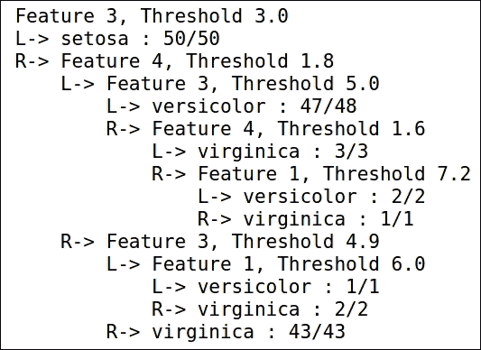

# 第八章 创建集成模型

一组人往往比单个个体做出更好的决策，特别是当每个组员都有自己的偏见时。这一理念同样适用于机器学习。

当单一算法无法生成真实的预测函数时，便会使用集成机器学习方法。当模型的性能比训练时间和模型复杂度更重要时，集成方法是首选。

在本章中，我们将讨论：

+   什么是集成学习？

+   构建集成模型。

+   组合策略。

+   提升法、装袋法和引入随机性。

+   随机森林。

# 什么是集成学习？

集成学习是一种机器学习方法，其中多个模型被训练用于解决相同的问题。这是一个过程，其中生成多个模型，并将从它们得到的结果结合起来，产生最终结果。此外，集成模型本质上是并行的；因此，如果我们可以访问多个处理器，它们在训练和测试方面要高效得多：

+   **普通机器学习方法**：这些方法使用训练数据来学习特定的假设。

+   **集成学习**：它使用训练数据构建一组假设。这些假设被组合以构建最终模型。

因此，可以说集成学习是一种为目标函数准备不同单独学习器的方法，采用不同的策略，并在长期内结合这些学习成果。


## 理解集成学习

正如我们所讨论的，集成学习将多个单独学习者的学习过程结合起来。它是多个已学习模型的聚合，旨在提高准确性：

+   基学习器：每个单独的学习器称为基学习器。基学习器可能适用于特定情境，但在泛化能力上较弱。

+   由于基学习器的泛化能力较弱，它们并不适用于所有场景。

+   集成学习使用这些基（弱）学习器来构建一个强学习器，从而得到一个相对更准确的模型。

+   通常，决策树算法作为基学习算法使用。使用相同类型的学习算法会产生同质学习器。然而，也可以使用不同的算法，这将导致异质学习器的产生。

## 如何构建集成模型

推荐基学习器应尽可能多样化。这使得集成能够以更高的准确性处理和预测大多数情况。可以通过使用数据集的不同子集、操控或转换输入，以及同时使用不同的学习技术来实现这种多样性。

此外，当单个基学习器具有较高准确性时，集成学习通常也能得到较好的准确性。

通常，集成的构建是一个两步过程：

1.  第一步是创建基础学习器。它们通常是并行构建的，但如果基础学习器受到之前形成的基础学习器的影响，则会以顺序方式构建。

1.  第二步是将这些基础学习器结合起来，创建一个最适合特定用例的集成模型。

通过使用不同类型的基础学习器和组合技术，我们可以共同产生不同的集成学习模型。

有不同的方法可以实现集成模型：

+   对训练数据集进行子采样

+   操控输入特征

+   操控输出特征

+   注入随机性

+   分类器的学习参数可以被修改

### 组合策略

组合策略可以分为两类：

+   静态组合器

+   自适应组合器

**静态组合器**：组合器的选择标准独立于组件向量。静态方法可以大致分为可训练和不可训练。

**可训练的**：组合器经历不同的训练阶段，以提高集成模型的表现。这里有两种广泛使用的方法：

+   **加权平均法**：每个分类器的输出根据其自身的表现度量进行加权：

    +   在不同验证集上衡量预测的准确性

+   **堆叠泛化**：集成的输出被视为元分类器的特征向量

**不可训练的**：个别分类器的表现不会影响投票。可能会使用不同的组合器，这取决于分类器所生成的输出类型：

+   **投票法**：当每个分类器生成一个类标签时使用此方法。每个分类器为某一特定类别投票，获得最多票数的类别获胜。

+   **平均法**：当每个分类器都生成一个置信度估计时，使用平均法。集成中后验概率最大的类别获胜。

+   **博尔达计数法**：当每个分类器生成一个排名时使用此方法。

**自适应组合器**：这是一种依赖于输入的特征向量的组合函数：

+   每个区域局部的一个函数

+   分而治之的方法创建了模块化的集成和简单的分类器，它们专门处理不同区域的输入输出空间。

+   各个专家只需在其能力范围内表现良好，而不必对所有输入都有效

## 对训练数据集进行子采样

如果输出分类器在训练数据出现小的变化时需要经历剧烈的变化，那么学习器被认为是不稳定的：

+   **不稳定学习器**：决策树、神经网络等

+   **稳定学习器**：最近邻、线性回归等

这种特定的技术更适用于不稳定学习器。

子采样中常用的两种技术是：

+   自助法

+   提升法

### 自助法

袋装法也称为自助聚合。它通过对同一数据集进行有放回的子抽样生成额外的训练数据。它通过重复组合生成与原始数据集大小相同的训练数据集。

由于采用了有放回的抽样，每个分类器平均训练 63.2%的训练样本。

在这些多个数据集上训练后，袋装法通过多数投票来组合结果。获得最多票数的类别获胜。通过使用这些多个数据集，袋装法旨在减少方差。如果引入的分类器是无关的，则可以提高准确性。

随机森林是一种集成学习方法，采用袋装法，是最强大的方法之一。

让我们来看看袋装算法。

**训练**：

+   对于迭代，*t=1 到 T*：

    +   从训练数据集中随机采样 *N* 个样本，采用有放回抽样

    +   基础学习器在该样本上训练（例如决策树或神经网络）

**测试**：

+   对于测试样本，*t=1 到 T*：

    +   启动所有已训练的模型

    +   预测是基于以下内容进行的：

        +   **回归**：平均

        +   **分类**：多数投票


#### 什么情况下袋装法有效？

袋装法在如果不使用的话可能会发生过拟合的场景中有效。我们来看一下这些场景：

+   **欠拟合**：

    +   **高偏差**：模型不够好，未能很好地拟合训练数据

    +   **小方差**：每当数据集发生变化时，分类器需要做出的调整非常小

+   **过拟合**：

    +   **小偏差**：模型对训练数据拟合得过好

    +   **大方差**：每当数据集发生小的变化时，分类器需要做出很大或剧烈的调整

袋装法旨在减少方差而不影响偏差。因此，模型对训练数据集的依赖减少。

### 提升

提升与袋装法不同。它基于 PAC 框架，即“可能近似正确”框架。

**PAC 学习**：具有比误分类错误更大的置信度和更小的准确度的概率：

+   **准确度**：这是测试数据集中正确分类样本的百分比

+   **置信度**：这是在给定实验中达到准确度的概率

#### 提升方法

提升方法基于“弱学习器”的概念。当一个算法在二分类任务中的表现略好于 50% 时，它被称为弱学习器。该方法的目的是将多个弱学习器组合在一起，目标是：

+   提高置信度

+   提高准确性

这是通过在不同数据集上训练不同的弱学习器来完成的。

#### 提升算法

+   训练：

    +   从数据集中随机抽取样本。

    +   首先，学习器 *h1* 在样本上进行训练。

    +   评估学习器 *h1* 在数据集上的准确度。

    +   使用不同的样本为多个学习者执行类似的过程。它们被划分为能够做出不同分类的子集。

+   测试：

    +   在测试数据集上，学习通过所有学习者的多数投票来应用

信心也可以通过类似方式增强，就像通过某些权衡来提升准确性一样。

提升方法更像是一个“框架”而非一个算法。该框架的主要目标是将一个弱学习算法 W 转化为强学习算法。我们现在将讨论 AdaBoost，简称为“自适应提升算法”。AdaBoost 因为是最早成功且实用的提升算法之一而广为人知。

它不需要定义大量的超参数，并且能够在多项式时间内执行。该算法的优势在于它能够自动适应给定的数据。

### AdaBoost – 通过采样进行提升

+   在 *n* 次迭代之后，Boosting 提供了一个在训练集上有分布 *D* 的弱学习器：

    +   所有例子都有相同的概率被选为第一个组成部分

+   训练集的子采样是根据分布 *Dn* 进行的，并通过弱学习器训练模型

+   错误分类实例的权重通过调整使得后续分类器能够处理相对较难的案例

+   生成分布 *D(n+1)*，其中错误分类样本的概率增加，而正确分类样本的概率减少

+   在 *t* 次迭代之后，根据模型的表现，对个别假设的投票进行加权

AdaBoost 的强大之处在于其通过自适应重采样样本，而非最终加权组合

#### 提升方法在做什么？

+   每个分类器在特定数据子集上有其专长

+   一种算法集中处理具有不断增加难度的例子

+   提升方法能够减少方差（类似于 Bagging）

+   它还能够消除弱学习器的高偏差所带来的影响（这在 Bagging 中不存在）

+   训练与测试误差的表现：

    +   我们可以将训练误差减少到接近 0

    +   不会出现过拟合，测试误差体现了这一点

#### 偏差与方差分解

让我们讨论 Bagging 和 Boosting 如何影响分类误差的偏差-方差分解：

+   可以从学习算法中预期的错误特征：

    +   偏差项是衡量分类器相对于目标函数的表现的度量

    +   方差项衡量分类器的鲁棒性；如果训练数据集发生变化，模型将如何受其影响？

+   Bagging 和 Boosting 都能够减少方差项，从而减少模型中的误差

+   还证明了提升方法试图减少偏差项，因为它专注于错误分类的样本

## 操作输入特征

另一种生成多个分类器的技术是通过操控我们输入给学习算法的特征集。

我们可以选择不同的特征子集和不同大小的网络。这些输入特征子集可以手动选择，而非自动生成。这种技术在图像处理领域广泛使用：一个非常著名的例子是主成分分析（PCA）。

在许多实验中生成的集成分类器能够像真实的人类一样执行任务。

还发现，当我们删除输入的某些特征时，会影响分类器的性能。这会影响整体投票结果，因此生成的集成分类器无法达到预期效果。

## 注入随机性

这是另一种普遍有效的生成分类器集成的方法。在这种方法中，我们将随机性注入到学习算法中。反向传播神经网络也是使用相同的技术生成的，针对隐藏权重。如果计算应用于相同的训练样本，但使用不同的初始权重，则得到的分类器可能会有很大差异。

决策树模型中最具计算成本的部分之一是准备决策树。对于决策树桩，这个过程是快速的；然而，对于更深的树结构，这个过程可能会非常昂贵。

昂贵的部分在于选择树的结构。一旦选择了树结构，利用训练数据填充叶节点（即树的预测）是非常便宜的。一种令人惊讶的高效且成功的选择是使用具有不同结构和随机特征的树。由此生成的树的集合被称为森林，因此这样构建的分类器被称为随机森林。

它需要三个参数：

+   训练数据

+   决策树的深度

+   数字形式

该算法独立生成每一棵 K 棵树，这使得并行化变得简单。对于每一棵树，它都会构建一个给定深度的完整二叉树。树枝上使用的特征是随机选择的，通常是有替换地选择，这意味着同一个特征可以多次出现在同一分支上。根据训练数据，叶节点将进行实际预测的填充。这个最后的步骤是唯一使用训练数据的时刻。随后的分类器仅依赖于 K 棵随机树的投票。

这种方法最令人惊讶的地方在于它表现得非常出色。它通常在大多数特征不重要时效果最佳，因为每棵树选择的特征数量很少。一些树将会查询那些无用的特征。

这些树基本上会做出随机预测。然而，其中一些树会查询好的特征并做出准确预测（因为叶子是基于训练数据进行评估的）。如果你有足够多的树，随机的预测会作为噪声被消除，最终只有好的树会影响最终分类。

# 随机森林

随机森林由 Leo Breiman 和 Adele Cutler 开发。它们在机器学习领域的优势在 2012 年 Strata 博客中得到了很好的展示：“决策树集成（通常称为随机森林）是现代最成功的通用算法”，因为它们“能够自动识别数据中的结构、交互和关系”。

此外，已注意到“许多 Kaggle 解决方案至少有一个顶级条目，强烈利用这一方法”。随机森林也成为了微软 Kinect 的首选算法，Kinect 是一个用于 Xbox 主机和 Windows 电脑的运动检测信息设备。

随机森林由一组决策树组成。因此，我们将开始分析决策树。

如前所述，决策树是一种类似树状的图表，每个节点都有一个基于单一特征的选择。给定一组特征，树会根据这些决策从节点到节点进行导航，直到到达叶子节点。这个叶子的名称即为给定特征列表的预测。一个简单的决策树可以用来决定你出门时需要带什么。


每棵树的构建方式如下：

+   随机选取一个*n*样本案例，其中 n 是训练集中的案例数量。

    +   使用替代法选择这 n 个案例。这一特定数据集用于构建树。

+   节点根据*x<X*进行拆分，其中*X*是输入变量的数量。*X*在森林生长过程中不会改变。

+   由于树木允许达到最大深度，因此没有进行修剪。

随机森林的错误率依赖于以下因素（如原始论文所述）：

+   当树之间的相关性增加时，随机森林的错误率也会增加。

+   当单个树较弱时，错误率会增加，而当单个树得到加强时，错误率会减少。

发现之前提到的*x*对相关性和强度有影响。增加*x*会增加强度和相关性，而减少*x*则会减少两者。我们试图找到*x*应该处于的特定值或范围，以实现最小错误。

我们使用**oob**（**袋外**）误差来寻找最佳的*x*值或范围。

这棵树并不能有效地分类所有的点。我们可以通过增加树的深度来改进这一点。这样，树就能 100%准确地预测样本数据，只需学习样本中的噪声。在极端情况下，这个算法相当于一个包含所有样本的词典。这就是过拟合，它会导致在进行测试外的预测时产生糟糕的结果。为了克服过拟合，我们可以通过为样本引入权重，并且每次分裂时仅考虑特征的一个随机子集来训练多个决策树。随机森林的最终预测将由大多数树的投票决定。这个方法也叫做集成（bagging）。它通过减少方差（训练集中的噪声错误）而不增加偏差（模型不足灵活所带来的错误）来提高预测的准确性。

## 随机森林的特征

+   与现有算法相比，随机森林具有很高的准确性。

+   它可以在大数据上有效且高效地使用。它们速度快，并且不需要昂贵的硬件来运行。

+   随机森林的一个关键特性是它能够处理多个输入变量。

+   随机森林可以在构建森林的过程中展示泛化误差的估计。它还可以提供分类的重要变量。

+   当数据稀疏时，随机森林是一种有效且准确的算法。它还可以用于预测缺失数据。

+   生成的模型可以在将来接收到的数据上使用。

+   在不平衡数据集中，它提供了平衡类人口中存在的错误的特性。

+   其中一些特征也可以用于无监督聚类，并且也可以作为一种有效的异常检测方法。

+   随机森林的另一个关键特性是它不会发生过拟合。

## 随机森林是如何工作的？

为了理解和使用不同的选择，关于如何计算这些选择的额外数据是有帮助的。大多数选项依赖于随机森林生成的两个数据对象。

当当前树的训练集通过有放回的抽样绘制时，大约三分之一的样本被保留下来，用于示例。

随着越来越多的树被添加到随机森林中，oob 数据有助于生成分类错误的估计。在每棵树构建完成后，大部分数据都会沿着树向下运行，并计算每对样本的接近度。

另一方面，如果两个样本共享相同的终端节点，则通过增加它们的接近度来增加 1。经过完整分析后，这些接近度会被归一化。接近度被用作替代缺失数据、发现异常值以及提供数据的深入视角。

## 袋外（oob）误差估计

随机森林消除了交叉验证的需求，以获得无偏的测试集误差估计。在构建过程中，误差估计如下：

+   每棵树的构建都使用了来自原始数据的交替自助样本。大约 33%的案例将留作自助测试，不参与第 k 棵树的构建。

+   可能存在一些在构建树时没有考虑到的情况。我们将这些情况放到第 k 棵树下进行分类。大约 33%的树会生成分类测试集。在运行的后期，每次当案例*n*为 oob 时，将*j*视为获得绝大多数投票的类别。*j*与*n*的真实类别在所有案例中点的中间位置不相等的次数就是 oob 误差估计。这符合在各种测试中保持无偏的原则。

### 基尼重要性

纯度度量通常用于决策树。误分类被度量，并称为基尼纯度，这适用于存在多个分类器的情境。

还有一个基尼系数。这适用于二分类。它需要一个能够根据属于正确类别的概率对样本进行排名的分类器。

### 接近度

如前所述，在构建随机森林时我们不会修剪树。因此，终端节点不会有很多实例。

为了找到接近度度量，我们将所有训练集中的案例运行到树中。假设案例 x 和案例 y 到达了同一个终端节点，那么我们就增加接近度 1。

运行结束后，我们将树的数量乘以 2，然后将增加了 1 的案例的接近度除以该数字。

# 在 Julia 中的实现

随机森林可以在 Kenta Sato 注册的 Julia 包中使用：

```py
Pkg.update() Pkg.add("RandomForests") 

```

这是基于 CART 的随机森林在 Julia 中的实现。这个包支持：

+   分类模型

+   回归模型

+   袋外（OOB）误差

+   特征重要性

+   各种可配置的参数

该包中有两个独立的模型：

+   分类

+   回归

每个模型都有自己的构造函数，通过应用`fit`方法进行训练。我们可以使用以下列出的一些关键字参数来配置这些构造函数：

```py
RandomForestClassifier(;n_estimators::Int=10, 
                        max_features::Union(Integer, FloatingPoint, Symbol)=:sqrt, 
                        max_depth=nothing, 
                        min_samples_split::Int=2, 
                        criterion::Symbol=:gini) 

```

这个适用于分类：

```py
RandomForestRegressor(;n_estimators::Int=10, 
                       max_features::Union(Integer, FloatingPoint, Symbol)=:third, 
                       max_depth=nothing, 
                       min_samples_split::Int=2) 

```

这个适用于回归：

+   `n_estimators`：这是弱估计器的数量

+   `max_features`：这是每次分裂时候候选特征的数量

    +   如果给定的是整数（Integer），则使用固定数量的特征。

    +   如果给定的是浮动点（FloatingPoint），则使用给定值的比例（0.0, 1.0]。

    +   如果给定的是符号（Symbol），则候选特征的数量由策略决定。

        +   `:sqrt: ifloor(sqrt(n_features))`

        +   `:third: div(n_features, 3)`

+   `max_depth`：每棵树的最大深度

    +   默认参数`nothing`表示没有最大深度的限制。

+   `min_samples_split`：分裂节点时尝试的最小子样本数量

+   `criterion`：分类的杂质度量准则（仅限分类）

    +   `:`gini：基尼指数

    +   `:entropy`：交叉熵

`RandomForestRegressor` 总是使用均方误差作为其杂质度量。当前，回归模型没有可配置的准则。

## 学习与预测

在我们的示例中，我们将使用 Ben Sadeghi 提供的令人惊叹的 "DecisionTree" 包。

该包支持以下可用模型：

+   `DecisionTreeClassifier`

+   `DecisionTreeRegressor`

+   `RandomForestClassifier`

+   `RandomForestRegressor`

+   `AdaBoostStumpClassifier`

安装很简单：

```py
Pkg.add("DecisionTree") 

```

让我们从分类示例开始：

```py
using RDatasets: dataset 
using DecisionTree 

```

现在我们使用著名的鸢尾花数据集：

```py
iris = dataset("datasets", "iris") 
features = convert(Array, iris[:, 1:4]); 
labels = convert(Array, iris[:, 5]); 

```

这会生成一个修剪后的树分类器：

```py
# train full-tree classifier 
model = build_tree(labels, features) 
# prune tree: merge leaves having >= 90% combined purity (default: 100%) 
model = prune_tree(model, 0.9) 
# pretty print of the tree, to a depth of 5 nodes (optional) 
print_tree(model, 5) 

```



它生成了前面图像中展示的树。现在我们应用这个学习到的模型：

```py
# apply learned model 
apply_tree(model, [5.9,3.0,5.1,1.9]) 
# get the probability of each label 
apply_tree_proba(model, [5.9,3.0,5.1,1.9], ["setosa", "versicolor", "virginica"]) 
# run n-fold cross validation for pruned tree, 
# using 90% purity threshold pruning, and 3 CV folds 
accuracy = nfoldCV_tree(labels, features, 0.9, 3) 

```

它生成了以下结果：

```py
Fold 1 
Classes:   
3x3 Array{Int64,2}: 
 15   0   0 
  1  13   0 
  0   1  20 
Any["setosa","versicolor","virginica"] 
Matrix:    
Accuracy:  
3x3 Array{Int64,2}: 
 18   0  0 
  0  18  5 
  0   1  8 
3x3 Array{Int64,2}: 
 17   0   0 
  0  11   2 
  0   3  17 
0.96 
Kappa:    0.9391727493917275 

Fold 2 
Classes:  Any["setosa","versicolor","virginica"] 
Matrix:    
Accuracy: 0.88 
Kappa:    0.8150431565967939 

Fold 3 
Classes:  Any["setosa","versicolor","virginica"] 
Matrix:    
Accuracy: 0.9 
Kappa:    0.8483929654335963 

Mean Accuracy: 0.9133333333333332 

```

现在让我们训练随机森林分类器：

```py
# train random forest classifier 
# using 2 random features, 10 trees, 0.5 portion of samples per tree (optional), and a maximum tree depth of 6 (optional) 
model = build_forest(labels, features, 2, 10, 0.5, 6) 

```

它生成了随机森林分类器：

```py
3x3 Array{Int64,2}: 
 14   0   0 
  2  15   0 
  0   5  14 
3x3 Array{Int64,2}: 
 19   0   0 
  0  15   3 
  0   0  13 
3x3 Array{Int64,2}: 
 17   0   0 
  0  14   1 
  0   0  18 

```

现在我们将应用这个学习到的模型并检查其准确性：

```py
# apply learned model 
apply_forest(model, [5.9,3.0,5.1,1.9]) 
# get the probability of each label 
apply_forest_proba(model, [5.9,3.0,5.1,1.9], ["setosa", "versicolor", "virginica"]) 
# run n-fold cross validation for forests 
# using 2 random features, 10 trees, 3 folds and 0.5 of samples per tree (optional) 
accuracy = nfoldCV_forest(labels, features, 2, 10, 3, 0.5) 

```

结果如下：

```py
Fold 1 
Classes:  Any["setosa","versicolor","virginica"] 
Matrix:    
Accuracy: 0.86 
Kappa:    0.7904191616766468 

Fold 2 
Classes:  Any["setosa","versicolor","virginica"] 
Matrix:    
Accuracy: 0.94 
Kappa:    0.9096929560505719 

Fold 3 
Classes:  Any["setosa","versicolor","virginica"] 
Matrix:    
Accuracy: 0.98 
Kappa:    0.9698613622664255 

Mean Accuracy: 0.9266666666666666 

3-element Array{Float64,1}: 
 0.86 
 0.94 
 0.98 

```

现在让我们训练一个回归树：

```py
n, m = 10³, 5 ; 
features = randn(n, m); 
weights = rand(-2:2, m); 
labels = features * weights; 
# train regression tree, using an averaging of 5 samples per leaf (optional) 
model = build_tree(labels, features, 5) 
apply_tree(model, [-0.9,3.0,5.1,1.9,0.0]) 
# run n-fold cross validation, using 3 folds, averaging of 5 samples per leaf (optional) 
# returns array of coefficients of determination (R²) 
r2 = nfoldCV_tree(labels, features, 3, 5) 

```

它生成了以下树：

```py
Fold 1 
Mean Squared Error:     3.300846200596437 
Correlation Coeff:      0.8888432175516764 
Coeff of Determination: 0.7880527098784421 

Fold 2 
Mean Squared Error:     3.453954624611847 
Correlation Coeff:      0.8829598153801952 
Coeff of Determination: 0.7713110081750566 

Fold 3 
Mean Squared Error:     3.694792045651598 
Correlation Coeff:      0.8613929927227013 
Coeff of Determination: 0.726445409019041 

Mean Coeff of Determination: 0.7619363756908465 

3-element Array{Float64,1}: 
 0.788053 
 0.771311 
 0.726445 

```

现在，训练回归森林变得更加简单，通过这个包：

```py
# train regression forest, using 2 random features, 10 trees, 
# averaging of 5 samples per leaf (optional), 0.7 of samples per tree (optional) 
model = build_forest(labels,features, 2, 10, 5, 0.7) 
# apply learned model 
apply_forest(model, [-0.9,3.0,5.1,1.9,0.0]) 
# run n-fold cross validation on regression forest 
# using 2 random features, 10 trees, 3 folds, averaging of 5 samples/leaf (optional), 
# and 0.7 porition of samples per tree (optional) 
# returns array of coefficients of determination (R²) 
r2 = nfoldCV_forest(labels, features, 2, 10, 3, 5, 0.7) 

```

它生成了以下输出：

```py
Fold 1 
Mean Squared Error:     1.9810655619597397 
Correlation Coeff:      0.9401674806129654 
Coeff of Determination: 0.8615574830022655 

Fold 2 
Mean Squared Error:     1.9359831066335886 
Correlation Coeff:      0.950439305213504 
Coeff of Determination: 0.8712750380735376 

Fold 3 
Mean Squared Error:     2.120355686915558 
Correlation Coeff:      0.9419270107183548 
Coeff of Determination: 0.8594402239360724 

Mean Coeff of Determination: 0.8640909150039585 

3-element Array{Float64,1}: 
 0.861557 
 0.871275 
 0.85944  

```

# 为什么集成学习更优？

为了理解集成学习的泛化能力为何优于单一学习器，Dietterich 提出了三个理由。

这三个原因帮助我们理解集成学习的优越性，从而得出更好的假设：

+   训练信息不会提供足够的数据来选择单一的最佳学习器。例如，可能有多个学习器在训练数据集上表现得同样优秀。因此，将这些学习器结合起来可能是一个更好的选择。

+   第二个原因是，学习算法的搜索过程可能存在缺陷。例如，即使存在一个最佳假设，学习算法可能因为各种原因（如生成了一个优于平均水平的假设）而无法达到该假设。集成学习通过增加达到最佳假设的可能性来改善这一点。

+   第三个原因是，目标函数可能不存在于我们正在搜索的假设空间中。这个目标函数可能存在于不同假设空间的组合中，这类似于将多个决策树结合起来生成随机森林。

关于备受推崇的集成技术，已有许多假设研究。例如，提升（boosting）和袋装（bagging）是实现这些讨论的三点方法。

还观察到，提升方法即使在经过无数次训练后，也不会受到过拟合的影响，有时甚至能够在训练误差为零后进一步减少泛化误差。尽管许多科学家已经研究了这一现象，但理论上的解释仍然存在争议。

偏差-方差分解常用于研究集成方法的表现。观察到 Bagging 几乎能够消除方差，从而使它特别适合与经历巨大方差的学习器结合，如不稳定的学习器、决策树或神经网络。

提升方法能够最小化偏差，尽管它会减少方差，通过这种方式，使得它更适合用于像决策树这样的弱学习器。

## 集成学习的应用

集成学习广泛应用于以下场景：

+   光学字符识别

+   文本分类

+   面部识别

+   计算机辅助医学诊断

集成学习几乎可以应用于所有使用机器学习技术的场景。

# 总结

集成学习是一种通过结合弱分类器或不太准确的分类器来生成高精度分类器的方法。在本章中，我们讨论了构建集成的一些方法，并讲解了集成方法能够超越集成中任何单一分类器的三个基本原因。

我们详细讨论了 Bagging 和 Boosting。Bagging，亦称为 Bootstrap 聚合，通过对相同数据集进行有放回的子采样来生成用于训练的附加数据。我们还学习了为何 AdaBoost 表现如此优秀，并详细了解了随机森林。随机森林是高精度且高效的算法，不会发生过拟合。我们还研究了它们为何被认为是最佳的集成模型之一。我们使用“DecisionTree”包在 Julia 中实现了一个随机森林模型。

# 参考文献

+   [`cs.nju.edu.cn/zhouzh/zhouzh.files/publication/springerEBR09.pdf`](http://cs.nju.edu.cn/zhouzh/zhouzh.files/publication/springerEBR09.pdf)

+   [`web.engr.oregonstate.edu/~tgd/publications/mcs-ensembles.pdf`](http://web.engr.oregonstate.edu/~tgd/publications/mcs-ensembles.pdf)

+   [`www.machine-learning.martinsewell.com/ensembles/ensemble-learning.pdf`](http://www.machine-learning.martinsewell.com/ensembles/ensemble-learning.pdf)

+   [`web.cs.wpi.edu/~xkong/publications/papers/ecml11.pdf`](http://web.cs.wpi.edu/~xkong/publications/papers/ecml11.pdf)
