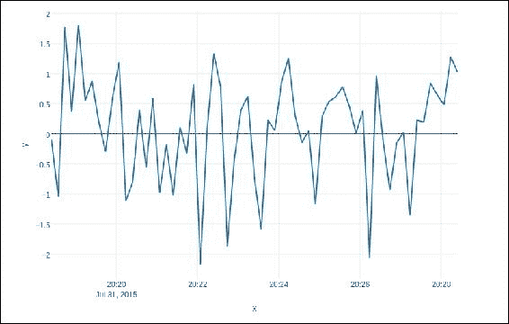
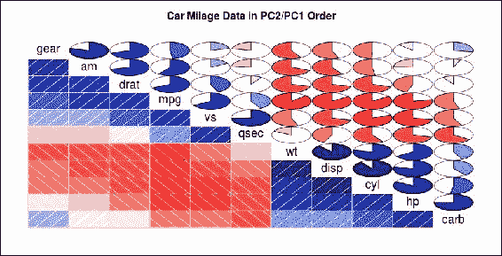

# 第九章 时间序列

展示和执行决策建模与分析的能力，是一些现实应用的关键组成部分，这些应用涵盖了从重症监护病房的紧急医疗治疗到军事指挥控制系统。现有的推理方法和技术在需要权衡决策质量与计算可行性之间取得平衡的应用中并不总是有效。对于时间关键性元素的决策建模，一种成功的方法应该明确支持瞬时过程的演示，并能够应对时间敏感的情况。

在本章中，我们将涵盖：

+   什么是预测？

+   决策过程

+   什么是时间序列？

+   模型的类型

+   趋势分析

+   季节性分析

+   ARIMA

+   平滑

# 什么是预测？

让我们以一个公司为例，假设它需要找出未来一段时间内的库存需求，以最大化投资回报。

例如，许多库存系统适用于不确定需求。这些系统中的库存参数需要评估需求和预测误差的分布。

这些系统的两个阶段——预测和库存控制——通常是独立分析的。理解需求预测和库存控制之间的相互作用至关重要，因为这直接影响库存系统的执行效果。

预测需求包括：

+   每个决策最终都会变得具有操作性，因此应该基于对未来情况的预测来制定。

+   各种数字在整个组织中都需要，绝对不应该由一个孤立的预测小组来生成。

+   预测从不“完成”。预测是持续需要的，随着时间的推移，预测对实际执行的影响被衡量，原始预测会被更新，决策会被调整，这一过程持续循环。

决策者利用预测模型来做出决策。它们通常用于模拟过程，反思不同策略的影响。

将决策过程的组成部分分成三组是很有帮助的：

+   不可控

+   可控

+   资源（定义问题情境）

## 决策过程

什么是系统？框架是由各个部分以特定方式组合而成的，目的是为了实现特定的目标。各个部分之间的关系决定了系统的功能及其整体作用。因此，系统中的连接往往比单独的部分更加重要。最终，作为其他系统构建模块的系统被称为子系统。

### 系统的动态

不变化的系统是静态系统。许多商业系统是快速变化的系统，这意味着它们的状态会随时间变化。我们将系统随时间变化的方式称为系统的行为。而当系统的发展呈现出典型模式时，我们说系统具有行为模式。一个系统是静态还是动态，取决于它如何随时间变化。

决策过程包括以下几个部分：

+   **绩效衡量（或指标）**：在每个组织中，制定有效的衡量标准被视为重要。绩效衡量标准提供了期望的结果水平，即决策的目标。目标在识别预测行动中至关重要：

    +   **战略**：投资回报率、增长和创新

    +   **战术**：成本、数量和客户满意度

    +   **操作性**：目标设定与标准符合性

+   **资源**：资源是预测期间保持不变的恒定因素。资源是定义决策问题的变量。战略决策通常具有比战术和操作性决策更长的时间跨度。

+   **预测**：预测信息来自决策者的环境。必须确定或预测不可控的输入。

+   **决策**：决策输入是所有可能可行方法的集合。

+   **互动**：前述决策部分之间的关联是表示输入、资源、预测和结果之间情况和结果关系的逻辑、科学函数。当决策的结果依赖于策略时，我们会改变一个或多个风险情境的部分，目的是在其中的其他部分实现有利变化。如果我们了解问题各部分之间的联系，我们就能取得成功。

+   **行动**：决策包括由决策者选择的策略。我们的策略如何影响选择结果，取决于预测和不同输入之间的相互关系，以及它们如何与结果相关联。

# 什么是时间序列？

时间序列是一组统计数据，通常按固定时间间隔收集。时间序列数据通常在许多应用中出现：

+   **经济学**：例如，失业率、住院人数等的月度数据

+   **财务**：例如，日常汇率、股价等

+   **环境**：例如，日降水量、空气质量读数等

+   **医学**：例如，每 2 到 8 秒的心电图脑电活动

时间序列分析技术早于一般的随机过程和马尔可夫链。时间序列分析的目标是描绘和概述时间序列数据，拟合低维度模型，并做出可取的预测。

## 趋势、季节性、周期和残差

描述序列的一个直接策略是经典分解法。其思想是将序列分解为四个组成部分：

+   **趋势（Tt）**：均值的长期变化

+   **季节效应（It）**：与日历相关的周期性波动

+   **周期（Ct）**：其他周期性波动（如商业周期）

+   **残差（Et）**：其他随机或系统性波动

该思想是为这四个元素创建独立的模型，然后将它们合并：

+   **加法形式**：*Xt = Tt + It + Ct + Et*

+   **乘法形式**：*Xt = Tt It Ct Et*

### 与标准线性回归的区别

信息并非绝对独立，也不是天生地无差异地分布。时间序列的一个特点是它是一个观测的列表，其中排序非常重要。序列至关重要，因为存在依赖关系，改变顺序可能会改变数据的意义。

### 分析的基本目标

基本目标通常是确定一个描述时间序列模式的模型。此类模型的用途包括：

+   描述时间序列模式的重要特征

+   解释过去如何影响未来，或者两个时间序列如何“相互作用”

+   预测系列的未来值

+   作为衡量某些制造环境中产品质量的控制标准

### 模型类型

有两种基本类型的“时间域”模型：

+   使用时间指数作为自变量的普通回归模型：

    +   有助于数据的初步描述，并为几种简单的预测方法奠定基础

+   ARIMA 模型（自回归积分滑动平均模型）：

    +   将序列当前值与过去的值和过去的预测误差相关联的模型

### 首先要考虑的重要特征

在观察时间序列时需要首先考虑的一些重要问题是：

+   是否存在趋势？

    +   测量值随着时间的推移趋向增加或减少的模式。

+   季节性效应的影响？

    +   是否存在与日历时间相关的高低重复模式，如季节、季度、月份、星期几等？

+   是否存在异常值？

    +   在回归中，异常值距离趋势线较远。而在时间序列数据中，异常值距离其他数据较远。

+   是否有与季节性因素无关的周期？

+   是否在特定时间段内具有恒定的方差？

+   是否有任何突变发生在任一侧？

下图是时间序列中随机数的示例。时间序列图表是指将变量与时间进行绘图。类似的图表可以用于心跳、市场波动、地震图等。



图表的一些特征包括：

+   整个时间跨度内没有持续的趋势（上升或下降）。序列似乎在缓慢地上下波动。

+   存在一些明显的异常值。

+   很难判断方差是否是恒定的。

### 系统性模式和随机噪声

与大多数不同的分析一样，在时间序列分析中，通常认为信息由系统性模式（作为一组可识别的片段的排列）和随机噪声（误差）组成，这通常使得模式难以识别。大多数时间，序列分析系统会通过某种类型的噪声滤波，目的是使模式更加可识别。

### 时间序列模式的两个主要方面

大多数时候，序列模式可以通过两个基本类别的部分来描述：

+   趋势

+   规律性

趋势是一个大体上是直线的或（通常）非线性的部分，随时间推移而变化，并且在我们数据捕获的时间范围内不会重复（可能）。

规律性可能具有形式上类似的特征；然而，它会在系统性的间隔内重复。时间序列的这两类主要元素可能在实际的现实数据中共存。

例如，一个公司的销售额可能会在几年内迅速增长，但它们仍然遵循可预测的季节性模式（例如，每年 10 月的销售额占全年销售额的 30%，而 3 月仅占 10%）。

## 趋势分析

没有已知的“自动”方法可以识别时间序列数据中的趋势部分。然而，只要趋势的持续时间是重复的（以一致的方式增加或减少），并且部分数据分析通常并不特别困难。如果时间序列数据包含显著的误差，那么识别趋势的第一步通常是平滑。

### 平滑

平滑通常涉及某种形式的局部平均数据，使得个别观测值的非系统性部分相互抵消。最常见的方法是移动平均平滑。这将序列中的每个元素替换为 n 个相邻元素的简单或加权平均值，其中 n 是平滑“窗口”的宽度。

中位数可以替代均值。中位数有一些优点：

+   在平滑窗口内，结果受异常值的影响较小。

+   如果数据中存在异常值，中位数平滑通常会比移动平均更能产生平滑或更“可靠”的曲线，即使窗口宽度相同。

中值平滑的主要弱点是，在没有明显的异常值时，它可能会生成比移动平均更为曲折的曲线，并且没有考虑加权。

### 拟合函数

许多单调的时间序列数据可以通过线性函数来很好地近似。如果存在合理的单调非线性部分，数据应首先进行转换以消除非线性。通常可以使用对数、指数或（较少使用的）多项式函数。

## 季节性分析

季节性依赖性（季节性）是时间序列模型的另一个常见组成部分。例如，如果我们看到购买趋势的时间序列图，我们会发现每年十月底和十二月都会出现一个巨大的峰值。这个模式每年都会重复。

### 自相关图

时间序列的季节性模式可以通过自相关图进行分析。自相关图通过图形和数字方式展示**自相关函数（ACF）**，即在预定滞后范围内，序列滞后的关系系数（及其标准误差）。

在自相关图中，通常会为每个滞后设置两个标准误差的范围，但通常来说，自相关的大小比它的可靠性更为重要。

以下是 `mtcars` 数据集的自相关图：



#### 检查自相关图

在检查自相关图时，我们必须记住，连续滞后的自相关是正式相关的。例如，如果第一个成分与第二个成分紧密相关，第二个成分与第三个成分相关，那么第一个成分与第三个成分也应该有某种程度的相关性，依此类推。

### 偏自相关

另一种有助于检查序列依赖性的方法是观察**偏自相关函数（PACF）**，它是自相关的扩展，消除了对中间成分（即滞后内的成分）的依赖。

### 去除序列依赖性

对于特定滞后 k 的序列依赖性，可以通过差分来消除，即将序列的每个第 *i* 个成分转化为它与 *(i-k)* 个成分的差异。

这种变化背后有两种解释：

+   序列中可能识别出隐藏的季节性依赖性

+   ARIMA 和其他过程要求我们使序列平稳，而这本身需要去除季节性依赖性。

## ARIMA

我们已经讨论了时间序列分析过程的数值建模。在现实生活中，模式并不那么清晰，观察数据通常会有相当多的误差。

要求如下：

+   寻找隐藏模式

+   生成预测

现在让我们理解 ARIMA 模型以及它如何帮助我们获取这些信息。

### 常见过程

+   自回归过程：

    +   大多数时间序列由彼此相关的组成部分构成，你可以评估一个系数或一组系数，描述系列中紧密相连的组成部分，这些组成部分来自特定的时间滞后（过去）部分。

    +   平稳性要求。自回归过程仅在特定参数范围内稳定，这些参数会影响后续点，并且序列可能不再是平稳的。

+   移动平均过程。与自回归过程独立，序列中的每个组成部分也可能受到过去误差（或随机冲击）的影响，而这些误差无法通过自回归组件表示。

+   可逆性要求。移动平均过程与自回归过程之间存在“对偶”关系：

    +   移动平均方程可以转换为自回归结构。无论如何，与上面描述的平稳条件相同，只有当移动平均参数满足特定条件时才能进行转换，也就是说，如果该模型是可逆的。另外，系列本身可能不会是平稳的。

### ARIMA 方法

自回归移动平均模型。

Box 和 Jenkins（1976）提出的通用模型包括自回归和移动平均参数，并且在模型表述中明确包括差分操作。

具体来说，模型中的三种参数是：

+   自回归参数（p）

+   差分次数（d）

+   移动平均参数（q）

在 Box 和 Jenkins 的文档中，模型通常缩写为 ARIMA（p，d，q）。

#### 辨识

ARIMA 的输入序列应该是平稳的。它必须在时间上具有稳定的均值、方差和自相关性。因此，通常情况下，序列需要首先进行差分，直到变为平稳（这通常也需要通过对数据进行对数变换来稳定方差）。

为了达到平稳性，系列需要进行多少次差分，体现在“d”参数中。为了确定基本的差分阶数，我们需要观察数据的图形和自相关图。

显著的水平变化（明显的上升或下降变化）通常需要一阶非季节性（滞后=1）差分：

+   显著的斜率变化通常需要二阶非季节性差分。

#### 估计与预测

下一步是估计。在此阶段，通过使用函数最小化方法来评估参数，以最小化残差平方和。参数的评估将在最后阶段（预测）中用于计算系列的新估计值（包括输入数据集之外的部分）及其预测值的置信区间。

估计过程在变化（差分）后的数据上进行，然后生成预测数据。需要保证序列是平稳的，以便预测值与输入数据兼容。

#### ARIMA 模型中的常数

在标准的自回归和移动平均参数下，ARIMA 模型也可能包含常数。该常数的表示形式取决于所拟合的模型：

+   如果模型中没有自回归参数，则序列的均值就是常数的期望值

+   如果模型中有自回归参数，则截距由常数表示

#### 识别阶段

在估计开始之前，我们必须确定（区分）要评估的特定 ARIMA 参数的数量和类型。识别阶段使用的重要工具包括：

+   排列的图示

+   自相关（ACF）的相关图

+   部分自相关（PACF）

选择并非简单，在一些非典型的情况下，需要经验以及大量的实验性时间序列模式试验（以及 ARIMA 的技术参数）。

然而，许多实验性的时间序列模式可以使用五种基本模型之一进行充分近似。这些模型基于**自相关图**（**ACF**）和**部分自相关图**（**PACF**）的形状：

+   一个自回归参数（p）：

    +   ACF：指数衰减

    +   PACF：滞后 1 处出现尖峰

    +   其他滞后无相关性

+   两个自回归参数（p）：

    +   ACF：正弦波形状模式或一组指数衰减

    +   PACF：滞后 1 和 2 处出现尖峰

    +   其他滞后无相关性

+   一个移动平均参数（q）：

    +   ACF：滞后 1 处出现尖峰

    +   其他滞后无相关性

    +   PACF：指数衰减

+   两个移动平均参数（q）：

    +   ACF：滞后 1 和 2 处出现尖峰

    +   其他滞后无相关性

    +   PACF：正弦波形状模式或一组指数衰减

+   一个自回归（p）和一个移动平均（q）参数：

    +   ACF：从滞后 1 开始的指数衰减

    +   PACF：从滞后 1 开始的指数衰减

#### 季节性模型

一个模式在时间上按季节性重复的序列需要特殊的模型。

这与季节性模型中的简单 ARIMA 参数类似：

+   季节性自回归（ps）

+   季节性差分（ds）

+   季节性移动平均参数（qs）

例如，假设模型为(0,1,2)(0,1,1)。

这描述了一个包含以下内容的模型：

+   无自回归参数

+   两个一般的移动平均参数

+   一个常规的移动平均参数

用于季节性参数的季节性滞后通常在识别阶段确定，并应明确指出。

关于选择需要评估的参数（考虑 ACF 和 PACF）的普遍建议同样适用于季节性模型。主要区别在于，在季节性序列中，ACF 和 PACF 会在季节性滞后的倍数处显示出显著的系数。

### 参数估计

有几种不同的评估参数的方法。它们应该基本上会产生相同的估计值，但对于任何给定的模型来说，可能在效率上有所不同。通常，在参数估计阶段，使用一个函数最小化算法来最大化在给定参数值下观察到的序列的概率（似然）。

这需要计算残差的（条件）平方和（SS），给定单独的参数。

在实际应用中，这要求计算残差的（条件）平方和（SS），给定相应的参数。

已提出不同的方法来计算残差的 SS：

+   根据 McLeod 和 Sales（1983）的近似最大似然法

+   使用回溯法的近似最大似然法

+   根据 Melard（1984）的精确最大似然法

### 模型评估

+   **参数估计**：

    +   报告估算的 *t* 值，基于参数的标准误差计算得出

    +   如果没有显著性，则通常可以从模型中去除单独的参数，而不会显著影响模型的整体拟合度。

+   **其他质量标准**：另一个明显且常见的模型质量衡量标准是根据部分数据生成的预测的准确性，以便将预测值与已知（原始）观测值进行比较。

### 中断时间序列 ARIMA

我们可能希望评估一个或多个离散事件对时间序列中变量的影响。这类时间序列分析中的干扰已在 McDowall、McCleary、Meidinger 和 Hay（1980）的细节中有所描述。McDowall 等人识别出三种可能的影响类型：

+   永久性突发干扰

+   永久性渐变干扰

+   突发性短暂干扰

## 指数平滑

指数平滑已被证明是各种时间序列数据预测策略中极为流行的一种方法。该策略由布朗和霍尔特独立开发。布朗在二战期间为美国海军工作，他的任务是设计一个追踪系统，用于计算潜艇的位置并控制火力信息。后来，他将这一策略应用于预测备件需求（一个库存控制问题）。

### 简单指数平滑

对时间序列 t 的简单模型是将每个观测值视为由一个常数（*b*）和一个误差项（epsilon）组成，即：*Xt = b + t*。

常数 b 在序列的每个片段中通常保持不变；但它可能随着时间的推移而逐渐变化。如果拟合成功，那么隔离 b 的真实估值，从而隔离出序列的系统性或可预测部分的方法之一是计算某种类型的移动平均，其中当前和最近的观察值比较老的观察值被赋予更大的权重。

指数平滑正好满足这样的加权，即给较旧的观察值分配越来越小的指数权重。简单指数平滑的具体公式如下：

*St = a*Xt + (1-a)*St-1*

当递归地连接到序列中的每个连续观察值时，每个新的平滑值（预测值）是当前观察值和过去平滑观察值的加权平均值。

过去的平滑观察值是通过计算过去的观察值以及之前的平滑值得出的，依此类推。因此，每个平滑值是过去观察值的加权平均值，其中权重会根据参数（alpha）的值呈指数递减。

如果它等于 1（一个），则完全忽略过去的观察值；如果它等于 0（零），则完全忽略当前观察值，平滑值完全由过去的平滑值组成（该平滑值是通过计算之前的平滑观察值得出的，依此类推；因此，所有的平滑值将等于初始平滑值 S0）。中间值将产生过渡结果：

+   如果它等于 1，则完全忽略过去的观察值。

+   如果它等于 0，则完全忽略当前观察值：

    +   平滑值完全由过去的平滑值组成（该平滑值又是通过计算之前的平滑观察值得出的，依此类推；因此，所有的平滑值将等于初始平滑值 S0）。中间值将产生过渡结果。

隐含在观察到的时间序列中的过程的假设模型，简单指数平滑，通常能产生准确的预测。

### 拟合缺失指标（误差）

评估基于特定值的预测准确性最直接的方法是仅绘制观察值和前一步预测值的图表。此图表还可以包括残差（与右侧的 *Y* 轴比例），这样就能轻松识别出拟合较好或较差的区域。

这种对预测准确性的视觉检查通常是判断当前指数平滑模型是否适合数据的最有效方法：

+   **平均误差**：**平均误差**（**ME**）是通过计算观察值与前一步预测值之差的平均值来得出的：

    +   显然，这一衡量标准的缺点是正负误差值可能会相互抵消，因此它不是一个良好的总体拟合指标。

+   **平均绝对误差（MAE）**：**平均绝对误差**（**MAE**）值是通过计算平均绝对误差值得到的：

    +   如果值为 0（零），则拟合（预测）被认为是完美的。

    +   与均方误差值相比，这一拟合衡量标准会忽略异常值，因此，独特或异常的大误差值将比均方误差对 MAE 的影响更小。

+   **平方误差和均方误差（SSE）**：这些值是通过计算平方误差值的总和（或均值）得到的。它是统计拟合方法中最常用的拟合缺失指标之一。

+   **百分比误差（PE）**：所有前述的衡量标准都依赖于实际误差值。可能看起来更合理的是，使用相对于观察值的幅度，表示未来一步预测与观察值的相对偏差，而不是直接表达拟合的缺失。

    +   例如，在试图预测每月可能大幅波动的销售额时，如果我们的预测"接近目标"，偏差约为±10%，我们可能会感到满意。换句话说，绝对误差可能不那么重要，而更关心的是相对误差：

*PEt = 100*(Xt - Ft )/Xt*

这里，*Xt*是时刻*t*的观察值，*Ft*是预测值（平滑值）。

+   **平均百分比误差（MPE）**：该值通过计算 PE 值的平均值得到。

+   **平均绝对百分比误差（MAPE）**：与均值误差值的情况类似，接近 0（零）的均值百分比误差可能是由相互抵消的显著正负误差百分比产生的。因此，相对拟合优度的更优衡量标准是平均绝对百分比误差。此外，该衡量标准通常比均方误差更为重要：

    +   例如，意识到正常预测偏差为±5%本身就是一个有用的结果，尽管 30.8 的均方误差并不容易直观理解。

+   **自动搜索最佳参数**：利用类牛顿法的函数最小化过程（与 ARIMA 中的方法相同）来最小化均方误差、平均绝对误差或平均总率误差。

+   **初始平滑值 S0**：我们需要一个 S0 值，以便计算时间序列中第一个观察值的平滑预测值。根据参数选择（即当它接近零时），平滑过程的初始值可能会影响某些观察值的预测质量。

# 在 Julia 中的实现

TimeSeries 是一个注册包。因此，像其他包一样，我们可以将其添加到您的 Julia 包中：

```py
Pkg.update() 
Pkg.add("TimeSeries")

```

## 时间序列类型 TimeArray

```py
immutable TimeArray{T, N, D<:TimeType, A<:AbstractArray} <: AbstractTimeSeries

 timestamp::Vector{D}
 values::A
 colnames::Vector{UTF8String}
 meta::Any

 function TimeArray(timestamp::Vector{D},
 values::AbstractArray{T,N},
 colnames::Vector{UTF8String},
 meta::Any)
 nrow, ncol = size(values, 1), size(values, 2)
 nrow != size(timestamp, 1) ? error("values must match length of
 timestamp"):
 ncol != size(colnames,1) ? error("column names must match width of
 array"):
 timestamp != unique(timestamp) ? error("there are duplicate dates"):
 ~(flipdim(timestamp, 1) == sort(timestamp) || timestamp ==
 sort(timestamp)) ? error("dates are mangled"):
 flipdim(timestamp, 1) == sort(timestamp) ? 
 new(flipdim(timestamp, 1), flipdim(values, 1), colnames, meta):
 new(timestamp, values, colnames, meta)
 end
end
```

该类型有四个字段：

+   `timestamp`：时间戳字段由一个`TimeType`类型的子类型值向量组成，实际上是`Date`或`DateTime`。`DateTime`类型与 Date 类型相似，但它表示的是比一天更小的时间框架。为了使`TimeArray`的构造正常工作，这个向量需要按顺序排序。如果向量包含非连续的日期，对象构造会报错。该向量还需要从最旧到最新日期排序，但构造器可以处理此问题，不会阻止对象的创建。

+   `values`：值字段包含时间序列中的数据，其行数必须与时间戳数组的长度匹配。如果它们不匹配，构造器将失败。`values`数组中的所有值必须是相同类型的。

+   `colnames`：`colnames`字段是一个 UTF8 字符串类型的向量，包含每个列在值字段中的列名。此向量的长度必须与`values`数组的列数匹配，否则构造器将失败。

+   `meta`：`meta`字段默认不包含任何内容，用`Void`类型表示。这个默认设置旨在允许程序员忽略该字段。对于那些希望使用此字段的人，`meta`可以保存常见类型，如`String`或更复杂的用户定义类型。有人可能希望为不可变的对象分配一个名称，而不是依赖于对象类型字段外的变量绑定。

我们将使用`MarketData`包中可用的历史财务数据集：

```py
Pkg.add("MarketData") 
using TimeSeries 
using MarketData 

```

现在让我们来查看数据：

```py
ohlc[1] 

```

这将产生以下输出：

```py
1x4 TimeSeries.TimeArray{Float64,2,Date,Array{Float64,2}} 2000-01-03 to 2000-01-03 

             Open      High      Low       Close      
2000-01-03 | 104.88    112.5     101.69    111.94 

```

让我们再看一些记录和统计数据：

```py
ohlc[[1:3;9]] 

```

这将产生以下输出：

```py
4x4 TimeSeries.TimeArray{Float64,2,Date,Array{Float64,2}} 2000-01-03 to 2000-01-13 

             Open      High      Low       Close      
2000-01-03 | 104.88    112.5     101.69    111.94     
2000-01-04 | 108.25    110.62    101.19    102.5      
2000-01-05 | 103.75    110.56    103.0     104.0      
2000-01-13 | 94.48     98.75     92.5      96.75   

```

我们也可以通过列名来遍历它们：

```py
500x2 TimeSeries.TimeArray{Float64,2,Date,Array{Float64,2}} 2000-01-03 to 2001-12-31 

             Open      Close      
2000-01-03 | 104.88    111.94     
2000-01-04 | 108.25    102.5      
2000-01-05 | 103.75    104.0      
2000-01-06 | 106.12    95.0       

2001-12-26 | 21.35     21.49      
2001-12-27 | 21.58     22.07      
2001-12-28 | 21.97     22.43      
2001-12-31 | 22.51     21.9  

```

要使用日期访问记录，可以如下操作：

```py
ohlc[[Date(2000,1,3),Date(2000,2,4)]] 

```

它将给出以下输出：

```py
2x4 TimeSeries.TimeArray{Float64,2,Date,Array{Float64,2}} 2000-01-03 to 2000-02-04 

             Open      High      Low       Close      
2000-01-03 | 104.88    112.5     101.69    111.94     
2000-02-04 | 103.94    110.0     103.62    108.0 

```

我们还可以列出日期范围内的记录：

```py
ohlc[Date(2000,1,10):Date(2000,2,10)] 

```

它将产生以下输出：

```py
23x4 TimeSeries.TimeArray{Float64,2,Date,Array{Float64,2}} 2000-01-10 to 2000-02-10 

             Open      High      Low       Close      
2000-01-10 | 102.0     102.25    94.75     97.75      
2000-01-11 | 95.94     99.38     90.5      92.75      
2000-01-12 | 95.0      95.5      86.5      87.19      
2000-01-13 | 94.48     98.75     92.5      96.75      

2000-02-07 | 108.0     114.25    105.94    114.06     
2000-02-08 | 114.0     116.12    111.25    114.88     
2000-02-09 | 114.12    117.12    112.44    112.62     
2000-02-10 | 112.88    113.88    110.0     113.5 

```

我们还可以使用两个不同的列：

```py
ohlc["Open"][Date(2000,1,10)] 

```

它产生以下输出：

```py
1x1 TimeSeries.TimeArray{Float64,1,Date,Array{Float64,1}} 2000-01-10 to 2000-01-10 

             Open       
2000-01-10 | 102 

```

## 使用时间约束

如果满足条件，某些特定方法可以按时间范围进行分段。

### `when`

`when`方法允许将`TimeArray`中的元素聚合到特定的时间段。

例如：`dayofweek`或`month`。以下是一些日期方法及其示例：

```py
day   Jan 3, 2000 = 3 
dayname  Jan 3, 2000 = "Monday" 
week  Jan 3, 2000 = 1 
month Jan 3, 2000 = 1 
monthname   Jan 3, 2000 = "January" 
year  Jan 3, 2000 = 2000 
dayofweek   Monday = 1 
dayofweekofmonth  Fourth Monday in Jan = 4 
dayofyear   Dec 31, 2000 = 366 
quarterofyear  Dec 31, 2000 = 4 
dayofquarter   Dec 31, 2000 = 93 

```

### 来自

```py
from(cl, Date(2001, 10, 24)) 

```

这将产生以下输出：

```py
47x1 TimeSeries.TimeArray{Float64,1,Date,Array{Float64,1}} 2001-10-24 to 2001-12-31 

             Close     
2001-10-24 | 18.95     
2001-10-25 | 19.19     
2001-10-26 | 18.67     
2001-10-29 | 17.63     

2001-12-26 | 21.49     
2001-12-27 | 22.07     
2001-12-28 | 22.43     
2001-12-31 | 21.9  

```

### 到

```py
to(cl, Date(2000, 10, 24))
```

这段代码将生成以下输出：

```py
206x1 TimeSeries.TimeArray{Float64,1,Date,Array{Float64,1}} 2000-01-03 to 2000-10-24 

             Close      
2000-01-03 | 111.94     
2000-01-04 | 102.5      
2000-01-05 | 104.0      
2000-01-06 | 95.0       

2000-10-19 | 18.94      
2000-10-20 | 19.5       
2000-10-23 | 20.38      
2000-10-24 | 18.88 

```

### `findwhen`

这可能是最常用且高效的方法之一。它测试一个条件并返回`Date`或`DateTime`向量：

```py
red = findwhen(ohlc["Close"] .< ohlc["Open"]); 

```

这将生成以下输出：

```py
252x4 TimeSeries.TimeArray{Float64,2,Date,Array{Float64,2}} 2000-01-04 to 2001-12-31 

             Open      High      Low       Close      
2000-01-04 | 108.25    110.62    101.19    102.5      
2000-01-06 | 106.12    107.0     95.0      95.0       
2000-01-10 | 102.0     102.25    94.75     97.75      
2000-01-11 | 95.94     99.38     90.5      92.75      

2001-12-14 | 20.73     20.83     20.09     20.39      
2001-12-20 | 21.4      21.47     20.62     20.67      
2001-12-21 | 21.01     21.54     20.8      21.0       
2001-12-31 | 22.51     22.66     21.83     21.9  

```

### `find`

`find`方法类似于`findwhen`。它测试一个条件并返回一个整数向量，表示条件为真的行号：

```py
green = find(ohlc["Close"] .> ohlc["Open"]); 

```

这将生成以下输出：

```py
244x4 TimeSeries.TimeArray{Float64,2,Date,Array{Float64,2}} 2000-01-03 to 2001-12-28 

             Open      High      Low       Close      
2000-01-03 | 104.88    112.5     101.69    111.94     
2000-01-05 | 103.75    110.56    103.0     104.0      
2000-01-07 | 96.5      101.0     95.5      99.5       
2000-01-13 | 94.48     98.75     92.5      96.75      

2001-12-24 | 20.9      21.45     20.9      21.36      
2001-12-26 | 21.35     22.3      21.14     21.49      
2001-12-27 | 21.58     22.25     21.58     22.07      
2001-12-28 | 21.97     23.0      21.96     22.43 

```

### 数学、比较和逻辑运算符

这些方法也由 TimeSeries 包支持。

使用数学运算符：

+   + 或 .+：数学元素逐项加法

+   - 或 .-: 数学元素级减法

+   * 或 .*: 数学元素级乘法

+   ./: 数学元素级除法

+   .^: 数学元素级指数运算

+   % 或 .%: 数学元素级余数

使用比较运算符：

+   .> 元素级大于比较

+   .< 元素级小于比较

+   .== 元素级等价比较

+   .>= 元素级大于或等于比较

+   .<= 元素级小于或等于比较

+   .!= 元素级不等价比较

使用逻辑运算符：

+   & 元素级逻辑与

+   | 元素级逻辑或

+   !, ~ 元素级逻辑非

+   $ 元素级逻辑异或

### 应用方法到时间序列

常见的时间序列数据转换包括：

+   滞后操作

+   前导

+   计算变化

+   窗口操作和聚合操作

#### 滞后

`lag` 方法将昨天的值放置在今天的时间戳上：

```py
cl[1:4] 

#Output 
4x1 TimeSeries.TimeArray{Float64,1,Date,Array{Float64,1}} 2000-01-03 to 2000-01-06 

             Close      
2000-01-03 | 111.94     
2000-01-04 | 102.5      
2000-01-05 | 104.0      
2000-01-06 | 95.0 

```

这在此应用了滞后操作：

```py
lag(cl[1:4]) 

```

它生成以下输出：

```py
3x1 TimeSeries.TimeArray{Float64,1,Date,Array{Float64,1}} 2000-01-04 to 2000-01-06 

             Close      
2000-01-04 | 111.94     
2000-01-05 | 102.5      
2000-01-06 | 104.0 

```

#### 滞后

Lead 操作与滞后操作相对：

```py
lead(cl[1:4]) 

```

生成的输出如下：

```py
3x1 TimeSeries.TimeArray{Float64,1,Date,Array{Float64,1}} 2000-01-03 to 2000-01-05 

             Close      
2000-01-03 | 102.5      
2000-01-04 | 104.0      
2000-01-05 | 95.0 

```

由于 cl 有 500 行长，我们可以向前推动至此。目前，我们将推动 400：

```py
lead(cl, 400) 

```

生成的输出如下：

```py
100x1 TimeSeries.TimeArray{Float64,1,Date,Array{Float64,1}} 2000-01-03 to 2000-05-24 

             Close     
2000-01-03 | 19.5      
2000-01-04 | 19.13     
2000-01-05 | 19.25     
2000-01-06 | 18.9      

2000-05-19 | 21.49     
2000-05-22 | 22.07     
2000-05-23 | 22.43     
2000-05-24 | 21.9 

```

#### 百分比

最常见的时间序列操作之一是计算百分比变化：

```py
percentchange(cl) 

```

生成的输出如下：

```py
499x1 TimeSeries.TimeArray{Float64,1,Date,Array{Float64,1}} 2000-01-04 to 2001-12-31 

             Close    
2000-01-04 | -0.0843  
2000-01-05 | 0.0146   
2000-01-06 | -0.0865  
2000-01-07 | 0.0474   

2001-12-26 | 0.0061   
2001-12-27 | 0.027    
2001-12-28 | 0.0163   
2001-12-31 | -0.0236 

```

这显示了与上一记录的百分比变化。

### 将方法结合在时间序列中

两个 `TimeArrays` 可以合并生成有意义的数组。

#### 合并

合并操作连接两个 TimeArrays。默认情况下，使用内连接：

```py
merge(op[1:4], cl[2:6], :left) 

```

生成的输出如下：

```py
4x2 TimeSeries.TimeArray{Float64,2,Date,Array{Float64,2}} 2000-01-03 to 2000-01-06 

             Open      Close      
2000-01-03 | 104.88    NaN        
2000-01-04 | 108.25    102.5      
2000-01-05 | 103.75    104.0      
2000-01-06 | 106.12    95.0 

```

在前面的例子中，我们提供了要执行的连接类型。我们还可以进行右连接或外连接。

#### 压缩

`collapse` 方法用于将数据压缩到更大的时间范围内。

#### 映射

该方法用于时间序列数据的转换。此方法的第一个参数是一个二元函数（时间戳和值）。此方法返回两个值，分别是新的时间戳和新的值向量：

```py
a = TimeArray([Date(2015, 10, 24), Date(2015, 11, 04)], [15, 16], ["Number"]) 

```

生成的输出如下：

```py
 2x1 TimeSeries.TimeArray{Int64,1,Date,Array{Int64,1}} 2015-10-24 to 2015-11-04 

             Number    
2015-10-24 | 15        
2015-11-04 | 16 

```

您可以如下应用 map 方法：

```py
map((timestamp, values) -> (timestamp + Dates.Year(1), values), a) 

```

这会转换给定时间的记录：

```py
2x1 TimeSeries.TimeArray{Int64,1,Date,Array{Int64,1}} 2016-10-24 to 2016-11-04 

             Number    
2016-10-24 | 15        
2016-11-04 | 16 

```

# 总结

在本章中，我们学习了什么是预测以及为什么它在商业中是必需的。预测帮助识别需求并采取必要的措施，在其他领域，它有助于预测天气等。预测的结果对决策过程有很大的影响。时间序列是按标准间隔收集的洞察的安排。它已在医学、天气、金融市场等多个领域得到应用。

我们还学习了不同类型的模型以及如何分析时间序列中的趋势。我们还考虑了季节性对时间序列分析的影响。我们详细讨论了 ARIMA 模型，并探索了 Julia 的时间序列库。

# 参考

+   [`timeseriesjl.readthedocs.io/en/latest/`](http://timeseriesjl.readthedocs.io/en/latest/)

+   [`documents.software.dell.com/statistics/textbook/time-series-analysis`](https://documents.software.dell.com/statistics/textbook/time-series-analysis)

+   [`home.ubalt.edu/ntsbarsh/stat-data/forecast.htm`](http://home.ubalt.edu/ntsbarsh/stat-data/forecast.htm)

+   [`userwww.sfsu.edu/efc/classes/biol710/timeseries/timeseries1.htm`](http://userwww.sfsu.edu/efc/classes/biol710/timeseries/timeseries1.htm)

+   [`onlinecourses.science.psu.edu/stat510/node/47`](https://onlinecourses.science.psu.edu/stat510/node/47)

+   [`www.itl.nist.gov/div898/handbook/pmc/section4/pmc4.htm`](http://www.itl.nist.gov/div898/handbook/pmc/section4/pmc4.htm)
