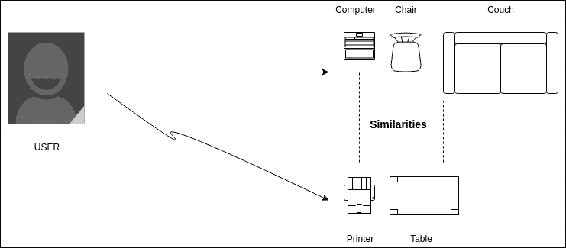
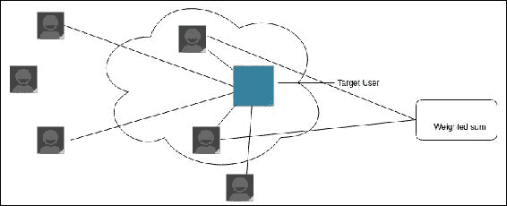
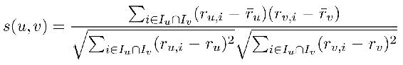
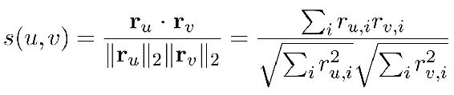
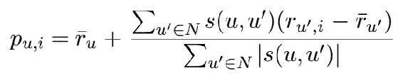
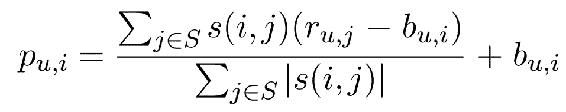
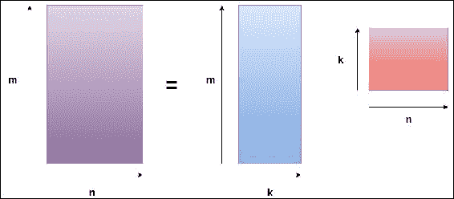

# 第十章 协同过滤与推荐系统

每天，我们都面临各种决策和选择。这些选择可以从我们的衣物，到我们能看的电影，甚至是我们在线订餐时的选择。我们在商业中也需要做决策。例如，选择我们应该投资哪只股票。我们所面临的选择集合会根据我们实际做什么以及我们想要什么而有所不同。例如，在 Flipkart 或 Amazon 上购买衣物时，我们会看到成百上千的选择。Amazon 的 Kindle 商店如此庞大，以至于没有人能够在一生中读完所有书籍。为了做出这些决策，我们需要一些背景信息，也许还需要一点帮助，知道什么对我们最好。

通常，个人依赖于朋友的建议或专家的意见来做出选择和决策。他们可能会观察朋友或信任的人，做出与自己相同的决策。这些决策可能包括支付一笔较高的票价去看电影，或者点一份自己从未尝试过的披萨，或者开始阅读一本自己一无所知的书。

这些建议的产生方式是有限制的。这些建议并不依赖于用户的喜好或“口味”。可能有许多电影、披萨或书籍是某人可能喜欢的，但他们的朋友或公司可能并不喜欢，而这些人的决定通常会影响他们的选择。传统的建议或推荐方式无法照顾到用户的特定口味。

在本章中，我们将学习：

+   什么是推荐系统？

+   关联规则挖掘

+   基于内容的过滤

+   什么是协同过滤？

+   什么是基于用户和基于项目的协同过滤？

+   构建推荐引擎

# 什么是推荐系统？

推荐框架使用学习方法来为数据、物品或服务提供个性化的建议。这些推荐系统通常与目标用户有一定程度的互动。近年来收集到的数据以及今天产生的数据，为这些推荐系统提供了巨大的支持。

今天，许多推荐系统正在运行，并每天生成数百万条推荐：

+   电子商务网站关于书籍、衣物或商品的推荐

+   适合我们口味的广告

+   我们可能感兴趣的属性类型

+   适合我们口味和预算的旅游套餐

当前一代推荐系统能够提供有价值的推荐，并且可以扩展到数百万种产品和目标用户。即使产品或用户的数量增加，推荐系统也应该继续正常工作。但这也带来了另一个挑战，因为为了获得更好的推荐，算法将处理更多的数据，这将增加推荐所需的时间。如果限制处理的数据量，生成的推荐可能不那么有效，或者质量无法获得用户的信任。

我们需要创建平衡，并设计机制以在更短的时间内处理更多数据。

这是通过使用基于用户的协同过滤或基于物品的协同过滤来实现的。在深入了解协同过滤之前，我们还将介绍关联规则挖掘。

推荐系统框架是数据和电子商务系统中的核心部分。它是一个有效的技术，帮助客户在海量数据和商品空间中筛选信息。它还帮助用户发现他们可能未曾搜索过或未曾购买的产品，如果没有推荐系统的存在，用户可能根本不会接触到这些产品。这也有助于提高销售，因为越来越多的用户会找到他们感兴趣的正确物品。

推荐系统的改进已经进行了大量研究，并且普遍认为没有一种推荐系统能够适应所有类型的问题。

算法无法在没有用户交互或数据的情况下工作。与用户的交互是必要的：

+   了解用户

+   向用户提供生成的推荐

从用户那里收集“好”数据是一个巨大挑战，即消除或去除那些可能影响生成推荐结果的噪音数据。

一些用户通常会浏览互联网上的各种信息，而另一些用户则只关注他们感兴趣的数据。另外，一些用户非常关注隐私，不允许数据收集过程进行。

实际上，当前的推荐系统通常在提供干净且有用的数据时能够给出好的推荐。大量的工作被投入到数据收集和清洗阶段，在这个过程中我们了解哪些数据对用户实际上是有用的。

## 用户效用矩阵

一般来说，在推荐系统中，我们会遇到属于两个类别的实体：

+   用户

+   物品

用户可能会对特定的物品有偏好，我们需要发现这种偏好，并向他们展示符合标准的物品。

让我们以电影的用户评分矩阵为例。我们将构建一个用户-电影矩阵，其中评分将作为矩阵中的值：

|  | **星际大战 IV** | **教父** | **指环王 1** | **指环王 2** | **指环王 3** | **恋恋笔记本** | **泰坦尼克号** |
| --- | --- | --- | --- | --- | --- | --- | --- |
| **用户 1** |  | 4 |  |  | 3 | 3 |  |
| **用户 2** | 5 |  |  | 3 |  |  | 2 |
| **用户 3** | 5 |  | 5 |  | 4 |  |  |
| **用户 4** |  | 4 |  |  |  | 3 |  |
| **用户 5** | 2 |  |  |  | 3 | 4 | 5 |

在这个具体的例子中，我们可以看到用户 1 给《教父》打了 4 分，给《指环王 3》打了 3 分，给《恋恋笔记本》打了 3 分，但该用户没有给其他电影评分，这通常是因为用户没有观看这些电影。也有可能是用户选择不分享对这些电影的看法。

这些值的范围是从 1 到 5，1 为最低评分，5 为最高评分。这表明矩阵是稀疏的，意味着大多数条目是未知的。在现实世界中，我们遇到的数据通常更稀疏，我们需要用用户可能的评分来填充这些空白，从而提供推荐。

# 关联规则挖掘

关联规则挖掘是寻找频繁出现的项目集合之间的关联或模式。这也被称为**市场篮分析**。

它的主要目的是理解顾客的购买习惯，通过发现顾客打算购买或实际购买的商品之间的关联性和模式来实现。例如，购买计算机键盘的顾客也很可能购买计算机鼠标或优盘。

该规则由以下给出：

+   前提 → 结果 [支持度，置信度]

## 关联规则的衡量标准

令* A *、* B *、* C *、* D * 和* E *……表示不同的商品。

然后我们需要生成关联规则，例如：

+   *{A, J} → {C}*

+   *{M, D, J} → {X}*

第一个规则表示，当* A *和* J *一起购买时，顾客购买* C *的概率很高。

类似地，第二个规则表示，当* M *、* D *和* J *一起购买时，顾客购买* X *的概率也很高。

这些规则通过以下方式衡量：

+   **支持度**：支持度指的是总覆盖率。它是一起购买商品的概率，占总交易的比例：

    +   支持度, X → Y: P(X,Y)

    +   （同时包含 X 和 Y 的交易）/（总交易数）

+   **置信度**：置信度指的是准确性。它是购买第二件商品的概率，前提是第一件商品已经被购买：

    +   置信度, X → Y: P(Y|X)

    +   （包含 X 和 Y 的交易）/（仅包含 X 的交易）

有些商品购买得不够频繁，它们可能对算法没有那么重要。为了生成这些规则，需要丢弃这些商品。它们通过两个阈值来定义，称为：

+   最小支持度

+   最小置信度

## 如何生成项目集

+   满足所需最小支持度的项目集被选中。

+   如果 {X,Y} 满足最小支持度的标准，那么 X 和 Y 也满足该标准，反之则不成立。

**Apriori 算法**：属于频繁项目集的子集本身也是频繁的：

1.  首先，基于 *n* 查找所有项目集：

    +   例如，当 *n=2* 时，*{{X,Y}, {Y,Z}, {X,S}, {S,Y}}*

1.  现在我们将这些集合合并到更高的层次：

    +   *{{X,Y,Z}, {X,Y,S}, {Y,Z,S}, {X,Z,S}}*

1.  从这些合并的集合中，我们检查有多少个符合所需的最小支持度：

    +   我们排除那些无法生成最小支持度的集合

1.  我们不断增加层级，直到无法生成具有所需最小支持度的集合为止

## 如何生成规则

当项目集数量较小时，使用暴力破解方法：

+   生成所有项目集的子集。空集不包括在内。

+   计算这些子集的置信度。

+   选择具有较高置信度的规则。

# 基于内容的过滤

基于内容的过滤创建用户的个人资料，并利用该个人资料向用户提供相关的推荐。用户个人资料是通过用户的历史记录创建的。

例如，电子商务公司可以跟踪以下用户详细信息，以生成推荐：

+   过去的订单项

+   查看或加入购物车但未购买的项目

+   用户浏览历史记录，用于识别用户可能感兴趣的产品类型

用户可能没有手动为这些项目评分，但可以考虑各种因素来评估它们与用户的相关性。基于此，向用户推荐那些可能感兴趣的新项目。



如图所示的过程，从用户个人资料中获取属性，并将其与可用项目的属性进行匹配。当有相关项目时，这些项目被认为是用户感兴趣的，并进行推荐。

因此，推荐结果在很大程度上依赖于用户的个人资料。如果用户个人资料正确反映了用户的喜好和兴趣，那么生成的推荐将是准确的；如果个人资料没有反映用户当前的偏好，那么生成的推荐可能不准确。

## 基于内容的过滤的步骤

在使用基于内容的过滤生成推荐时涉及多个步骤。这些步骤如下：

+   分析项目的属性。候选推荐项目可能没有有效的信息结构。因此，第一步是以结构化的方式从项目中提取这些属性：

    +   例如，对于一家电子商务公司，这些属性是他们目录中产品的属性或特征

+   生成用户的个人资料。用户个人资料是通过考虑各种因素来创建的。这个过程是使用机器学习技术完成的。可以考虑的各种因素包括：

    +   订单历史

    +   项目查看历史

    +   用户浏览历史记录，用于识别用户可能感兴趣的产品类型

    除此之外，用户的反馈也会被考虑在内。例如，如果用户在订购产品后感到满意，用户查看了产品多少次，以及在产品上花了多少时间。

+   推荐系统使用前面两步生成的组件，接下来生成的用户资料和提取的商品属性通过各种技术进行匹配。用户和商品的不同属性会被赋予不同的权重。然后，我们生成的推荐内容可以根据相关性进行排序。

生成用户资料是一个典型的任务，并且需要全面性，以便生成更准确的资料。

社交网络有助于建立用户资料。它是用户手动提供的信息宝库。用户提供了诸如以下内容的详细信息：

+   用户感兴趣的产品类型，例如哪些类型的书籍、音乐等

+   用户不喜欢的产品，例如某些特定的菜肴、化妆品牌等

在我们开始为用户提供推荐后，我们还可以收到反馈，这有助于推荐系统生成更好的推荐内容：

+   **显式反馈**：当我们在电商网站上购买商品时，通常会在初次使用后 2-3 天收到反馈表单。该表单的主要目的是帮助公司了解我们是否喜欢该产品，如果不喜欢，应该如何改进。这就是显式反馈。它使得推荐系统可以知道该产品不完全适合用户，或者可以推荐一个更合适的产品。

+   **隐式反馈**：用户可能不需要手动填写反馈表单，或者可能选择不填写。在这种情况下，用户的活动会被分析和监控，以了解用户对产品的反应。

反馈也可能出现在这些电商网站的产品评论区。这些评论可以被挖掘，从中提取出用户的情感。

尽管从用户那里获得直接反馈可以让系统更容易工作，但大多数用户选择忽略这种反馈。

## 基于内容的过滤的优点

使用基于内容的过滤方法有很多优点：

+   基于内容的过滤仅依赖于我们为其生成推荐的用户。这些推荐不依赖于其他用户的评分或资料。

+   生成的推荐内容可以向用户解释，因为它们是依赖于用户的个人资料和商品的属性。

+   由于推荐不是基于商品的评分，而是基于这些商品的属性和用户的个人资料，因此尚未购买或评分的新商品也可以被推荐。

## 基于内容的过滤的局限性

基于内容的过滤方法也有一些局限性：

+   由于基于内容的过滤需要用户资料，对于新用户来说，生成推荐可能会很困难。为了提供高质量的推荐，我们需要分析用户的活动，但生成的推荐可能仍然不会符合用户的喜好。

+   当项目的属性或特征不可用时，基于内容的过滤会面临提供推荐的困难。此外，还需要足够的领域知识来理解这些属性。

+   基于内容的过滤还依赖于用户提供的反馈。因此，我们需要持续分析和监控用户的反馈。在系统无法判断反馈是正面还是负面时，它可能无法提供相关的推荐。

+   CBF（基于内容的过滤）也有将推荐限制在特定集合中的倾向。它可能无法推荐用户可能感兴趣的类似或相关项目。

# 协同过滤

协同过滤是一种著名的算法，它基于其他用户或同伴的喜好或行为，不同于我们在前一节中研究的基于内容的过滤。

协同过滤：

+   如果用户喜欢其他用户或同伴表现出兴趣的某些项目，那么这些用户的偏好可以推荐给目标用户。

+   它被称为“最近邻推荐”

为了实现协同过滤，做出了一些假设：

+   可以考虑同伴或其他用户的喜好或行为，以了解并预测目标用户的兴趣。因此，假设目标用户与其他考虑的用户具有相似的兴趣。

+   如果用户过去是根据一组用户的评分获得推荐的，那么该用户与该组具有相似的兴趣。

协同过滤有不同的类型：

+   **基于记忆的协同过滤**：基于记忆的协同过滤通过用户的评分计算用户之间甚至是项目之间的相似性。这用于生成推荐：

    +   它利用评分矩阵

    +   使用这个评分矩阵，可以在任何给定时刻为目标用户生成推荐。

+   **基于模型的协同过滤**：基于模型的协同过滤依赖于训练数据和学习算法来创建模型。该模型用于利用实际数据生成推荐：

    +   这种方法将模型拟合到提供的矩阵，以便基于该模型生成推荐。

协同过滤的基本过程包括：

+   由于协同过滤高度依赖于考虑的群体的偏好，建议找到具有相似兴趣的同伴群体。

+   我们考虑推荐的项目应该出现在该组的项目列表中，但不是用户的项目。

+   在创建矩阵后，根据各种因素为项目赋予特定的评分。

+   得分最高的项目将被推荐。

+   为了随着新项目的加入不断改进和添加推荐，前述步骤会在所需的时间间隔内重新执行。

协同过滤有一些优点和缺点。让我们先来看看优点：

+   如果用户的属性正确形成，那么就更容易理解。

+   用户和产品是简单的系统，不需要特定的理解即可构建推荐系统。

+   产生的推荐通常很好

协同过滤也有一些缺点：

+   正如前面所讨论的，协同过滤需要大量的用户反馈。此外，这些用户需要是可靠的。

+   还需要对项目的属性进行标准化。

+   假设过去的行为会影响当前的选择。

## 基准预测方法

基准预测方法是可以形成的最简单、最容易的预测。计算基准非常重要，因为它能帮助我们了解我们生成的模型的准确性以及我们产生的算法结果的有效性：

+   **分类**：分类问题的基准可以通过考虑预测结果的大多数将来自观察量最多的类别来形成。

+   **回归**：回归问题的基准可以通过考虑预测结果的大多数将是一个集中趋势度量（如均值或中位数）来形成。

+   **优化**：在进行优化问题时，领域中的随机样本是固定的。

当我们选择了基准预测方法并得到结果后，可以将其与我们生成的模型结果进行比较。

如果我们生成的模型无法超越这些基准方法，那么很可能我们需要在模型上进行改进，以提高准确性。

## 基于用户的协同过滤

基于用户的协同过滤利用了协同过滤的核心思想，即找到与目标用户过去评分或行为相似的用户。

这种方法也被称为 k-最近邻协同过滤。



如果我们有 n 个用户和 x 个项目，那么我们将得到一个矩阵 *R -> n*x*。在前面的图中，我们可以看到有一个目标用户和多个其他用户。在这些其他用户中，有两个与目标用户相似。因此，之前的评分或行为可以用于生成推荐。

除了上述矩阵外，我们还需要一个函数来计算用户之间的相似度，以便计算哪些用户的评分可以用来生成推荐。

为了找到用户（u，v）之间的相似度，我们使用 Pearson 相关系数（Pearson 的 r）来寻找最近邻：



这会计算邻居 *u* 的邻域 N ⊆ U：

+   完全正相关 = 1

+   完全负相关 = -1

Pearson 相关系数的缺点在于，即使两个用户之间有很少的共同评分，它也可能将他们显示为相似。为了解决这个问题，我们可以对两个用户都评分的项目应用一个阈值。

余弦相似度：这是一种找到相似用户的另一种方法。它采用了不同于 Pearson 相关系数的方法。

与使用统计方法的 Pearson 相关系数不同，余弦相似度采用的是向量空间方法。在这种方法中，用户不是矩阵的一部分，而是由|I|维向量表示。

为了衡量两个用户（向量）之间的相似度，它计算余弦距离。这是向量的点积，并将其除以它们的 L2（欧几里得）范数的乘积。



当某个项目没有评分时，点积为 0，并且它会被忽略。

现在，为了生成推荐，我们使用：



它计算邻居的加权平均值，其中相似度作为权重。这是最常用的方法。

以下是基于用户的协同过滤法的一些缺点：

+   稀疏性：所形成的矩阵通常非常稀疏，并且随着用户和项目数量的增加，稀疏性会增加。

+   找到最近邻并做出推荐并不总是那么容易。

+   它的可扩展性较差，并且随着用户和项目数量的增加，计算负担加重。

+   稀疏矩阵可能无法预测实际的志同道合的人群集合。

## 项目-项目协同过滤

用户协同过滤法存在一些缺点，其中之一是可扩展性问题。为了找到最近邻，我们需要计算邻居之间的相似度，这涉及大量的计算。当用户数量达到数百万时，由于计算能力需求过高，用户协同过滤法可能无法应用。

因此，为了实现所需的可扩展性，采用了项目-项目协同过滤，而不是用户协同过滤。它会寻找一些相似的模式，比如同一组用户喜欢某些项目而不喜欢其他项目，然后这些用户被视为志同道合，进而推荐项目。

仍然需要通过使用 k-最近邻或类似算法，在项目集合中找到相似的项目。

假设有一个用户给了一些项目评分。几天后，该用户重新访问这些项目并修改他们的评分。通过修改评分，用户实际上是进入了另一个邻居。

因此，不建议始终预计算矩阵或寻找最近邻。这通常在实际需要推荐时完成。

### 基于项目的协同过滤算法

+   对于(*i=1 到 I*)，其中*I*指所有可用项目：

    +   对于每个顾客*x*，他评分了*I*。

        +   对于同一顾客*x*购买的每个项目*K*

+   保存顾客*x*购买了项目*I*和*K*

    +   对于每个项目*K*

        +   计算*i*和*K*之间的相似度。

这个特定的相似度是通过与用户协同过滤中使用的相同方法计算的：

+   基于余弦的相似度

+   基于相关性的相似度

使用加权平均值来生成推荐。

让*S*表示与*i*相似的项目集合，那么可以做出预测。定义基于项目的协同过滤的公式如下：



对于邻居数*k*，你可能已经评分了一些被考虑在内的项目。

# 构建电影推荐系统

数据集由"GroupLens 研究"维护，并且可以在[`grouplens.org/datasets/movielens/`](http://grouplens.org/datasets/movielens/)免费获取。

我们将处理包含 2000 万个评分的数据库（`ml-20m.zip`）。该数据库包含：

+   2000 万个评分

+   465,000 个标签应用被 138,000 个用户应用到 27,000 部电影。

我们将使用 ALS 推荐器，它是一种矩阵分解算法，采用**加权λ正则化交替最小二乘法**（**ALS-WR**）。

假设我们有一个包含用户*u*和项目*i*的矩阵：

```py
*Matrix, M (ui) = { r (if item i is rated by the user, u)*
*0 (if item i is not rated by user, u) }*

```

这里，*r*表示提交的评分。

假设我们有*m*个用户和*n*个电影。



对于*m*个用户和*n*个电影，我们创建一个用户与电影的矩阵（*m*n*）。

推荐是为任何用户-电影对生成的，如下所示：

*(i,j),rij=ui⋅mj,∀i,j*

这里，*(i,j)*表示用户-电影对。

Julia 有一个名为`RecSys.jl`的包，由 Abhijith Chandraprabhu 创建（[`github.com/abhijithch`](https://github.com/abhijithch)）。可以按如下方式安装此包：

```py
Pkg.update() 
Pkg.clone("https://github.com/abhijithch/RecSys.jl.git") 

```

我们将以并行模式启动 Julia：

```py
julia -p <number of worker processes> 

```

由于我们将处理一个庞大的数据集，建议并行启动 Julia 进程。

在示例部分有`movielens.jl`。我们将使用它为我们生成推荐。

将其保存在可以调用的目录中，并使用任何文本编辑器（如 Atom（Juno）、Sublime、Vim 等）打开：

```py
using RecSys 

import RecSys: train, recommend, rmse 

if isless(Base.VERSION, v"0.5.0-") 
    using SparseVectors 
end 

```

本示例将使用`RecSys`包，我们正在导入方法`train`、`recommend`和`rmse`：

```py
type MovieRec 
    movie_names::FileSpec 
    als::ALSWR 
    movie_mat::Nullable{SparseVector{AbstractString,Int64}} 

    function MovieRec(trainingset::FileSpec, movie_names::FileSpec) 
        new(movie_names, ALSWR(trainingset, ParShmem()), nothing) 
    end 

    function MovieRec(trainingset::FileSpec, movie_names::FileSpec,
    thread::Bool)  
   new(movie_names, ALSWR(trainingset, ParThread()), nothing) 
    end      

    function MovieRec(user_item_ratings::FileSpec,
    item_user_ratings::FileSpec, movie_names::FileSpec) 
        new(movie_names, ALSWR(user_item_ratings, item_user_ratings,
        ParBlob()), nothing) 
    end 
end 

```

这创建了一个复合类型，它是一个由命名字段组成的集合，可以将其实例视为单个值。这是一个用户定义的数据类型。

这个用户定义的数据类型有三个字段和三个方法。字段`als`属于类型 ALSWR，该类型定义在 RecSys 中。

该函数使用多重调度处理不同类型的输入，用户可以提供这些输入：

+   `trainingset` 和 `movie_names`

+   `trainingset`、`movie_names` 和 `thread`

+   `user_item_ratings`、`item_user_ratings` 和 `movie_names`

```py
function movie_names(rec::MovieRec) 
    if isnull(rec.movie_mat) 
        A = read_input(rec.movie_names) 
        movie_ids = convert(Array{Int}, A[:,1]) 
        movie_names = convert(Array{AbstractString}, A[:,2]) 
        movie_genres = convert(Array{AbstractString}, A[:,3]) 
        movies = AbstractString[n*" - "*g for (n,g) in
        zip(movie_names, movie_genres)] 
        M = SparseVector(maximum(movie_ids), movie_ids, movies) 
        rec.movie_mat = Nullable(M) 
    end 

    get(rec.movie_mat) 
end 

```

这创建了一个名为 `movie_names` 的函数，它与 `movielens` 数据集协作，处理 CSV 文件中的数据类型和缺失值，我们使用该文件作为推荐系统的输入。

现在，为了训练系统，我们将使用 train 函数：

```py
train(als, num_iterations, num_factors, lambda)

```

在这种特定情况下，我们将按如下操作：

```py
train(movierec::MovieRec, args...) = train(movierec.als, args...)

```

这将使用 ALS 对 `movielens` 数据集进行模型训练：

```py
rmse(movierec::MovieRec, args...; kwargs...) = rmse(movierec.als, args...; kwargs...) 

```

我们还可以启动对将产生的推荐进行测试：

```py
rmse(als, testdataset) 

```

要开始推荐，按如下步骤操作：

```py
recommend(movierec::MovieRec, args...; kwargs...) = recommend(movierec.als, args...; kwargs...) 

function print_recommendations(rec::MovieRec, recommended::Vector{Int}, watched::Vector{Int}, nexcl::Int) 
    mnames = movie_names(rec) 

    print_list(mnames, watched, "Already watched:") 
    (nexcl == 0) || println("Excluded $(nexcl) movies already watched") 
    print_list(mnames, recommended, "Recommended:") 
    nothing 
end 

```

这将在屏幕上打印推荐结果。

我收到的推荐是：

```py
[96030] Weekend It Lives, The (Ax 'Em) (1992) - Horror 
[96255] On Top of the Whale (Het dak van de Walvis) (1982) - Fantasy 
[104576] Seasoning House, The (2012) - Horror|Thriller 
[92948] Film About a Woman Who... (1974) - Drama 
[6085] Neil Young: Human Highway (1982) - Comedy|Drama 
[94146] Flower in Hell (Jiokhwa) (1958) - Crime|Drama 
[92083] Zen (2009) - Drama 
[110603] God's Not Dead (2014) - Drama 
[105040] Dragon Day (2013) - Drama|Sci-Fi|Thriller 
[80158] Cartoon All-Stars to the Rescue (1990) - Animation|Children|Comedy|Drama|Fantasy 

```

我们将调用 test 函数生成推荐：

```py
function test(dataset_path) 
    ratings_file = DlmFile(joinpath(dataset_path, "ratings.csv");
    dlm=',', header=true) 
    movies_file = DlmFile(joinpath(dataset_path, "movies.csv");
    dlm=',', header=true) 
    rec = MovieRec(ratings_file, movies_file) 
    @time train(rec, 10, 10) 

    err = rmse(rec) 
    println("rmse of the model: $err") 

    println("recommending existing user:") 
    print_recommendations(rec, recommend(rec, 100)...) 

    println("recommending anonymous user:") 
    u_idmap = RecSys.user_idmap(rec.als.inp) 
    i_idmap = RecSys.item_idmap(rec.als.inp) 
    # take user 100 
    actual_user = isempty(u_idmap) ? 100 : findfirst(u_idmap, 100) 
    rated_anon, ratings_anon = RecSys.items_and_ratings(rec.als.inp,
    actual_user) 
    actual_movie_ids = isempty(i_idmap) ? rated_anon : i_idmap[rated_anon] 
    nmovies = isempty(i_idmap) ? RecSys.nitems(rec.als.inp) :
    maximum(i_idmap) 
    sp_ratings_anon = SparseVector(nmovies, actual_movie_ids,
    ratings_anon) 
    print_recommendations(rec, recommend(rec, sp_ratings_anon)...) 

    println("saving model to model.sav") 
    clear(rec.als) 
    localize!(rec.als) 
    save(rec, "model.sav") 
    nothing 
end 

```

+   这个函数将数据集路径作为参数。在这里，我们将提供提取自 `ml-20m.zip` 的目录路径，该文件我们从 grouplens 下载。

+   它接受评分文件和电影文件，并创建一个类型为 MovieRec 的对象 "rec"，这是我们之前创建的。

+   我们将对象传递给 rmse 以找出误差。

+   它调用 `print_recommendations`，该函数会调用推荐函数为现有用户生成推荐。

+   它会保存模型以供以后使用。

# 总结

在本章中，我们学习了什么是推荐引擎，以及它们对企业的重要性，此外，我们还了解了它们为客户提供的价值。我们讨论了关联规则挖掘和市场篮子分析，了解了这一简单方法在行业中的应用。接着，我们探讨了基于内容的过滤及其优缺点。随后，我们讨论了协同过滤以及协同过滤的不同类型，包括基于用户的协同过滤和基于项目的协同过滤。基于用户的协同过滤的目标是找到与目标用户过去的评分或行为相似的用户，而基于项目的协同过滤则通过分析项目评分中的模式来找到志同道合的用户并推荐项目。
