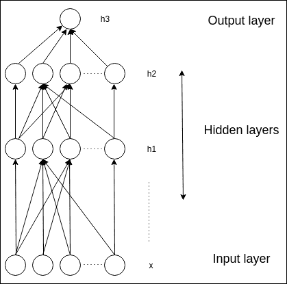
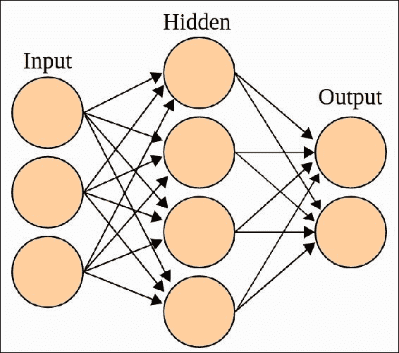
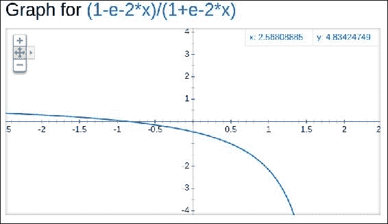
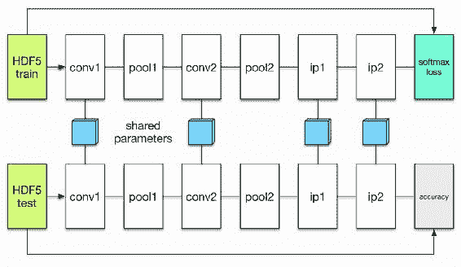

# 第十一章 深度学习简介

创新者一直渴望创造能够思考的机器。当可编程计算机首次被设想时，人们就已经在思考它们是否能够变得聪明，这比计算机的实际诞生早了一百多年（1842 年由洛夫莱斯提出）。

今天，**人工智能**（**AI**）是一个蓬勃发展的领域，拥有众多实际应用和充满活力的研究方向。我们期望智能程序能够自动化日常工作、处理图像和音频并从中提取意义、自动化多种疾病的诊断等。

起初，随着人工智能（AI）的发展，该领域处理和解决了那些对人类来说在心理上较为困难，但对计算机来说却相对简单的问题。这些问题可以通过一套正式的、数学的原则来描述。人工智能的真正挑战变成了解决那些对人类来说容易执行，但对于计算机来说却很难正式描述的任务。这些任务我们通常是自然地解释的，例如人类理解语言（和讽刺）的能力，以及我们识别图像，尤其是面孔的能力。

这种方法是让计算机通过积累经验进行学习，并通过一系列的事实链条或树状结构来理解世界，每个事实都通过与更简单事实的关联来定义。通过理解这些事实，这种方法避免了需要人工管理者正式指定计算机所需的所有信息。

事实的渐进系统使计算机能够通过将复杂的概念构建为更简单的概念来学习复杂的思想。如果我们画出一个图表，表示这些概念是如何相互依赖的，那么这个图表将是深刻的，并且包含许多层次。因此，我们称这种方法为深度学习。

人工智能的早期成就发生在相对封闭和正式的环境中，当时计算机并不需要太多关于世界的知识。让我们来看一个例子：

+   IBM 的深蓝（Deep Blue）国际象棋框架在 1997 年击败了当时的世界冠军加里·卡斯帕罗夫（Gary Kasparov）。

我们还应该考虑以下因素：

+   国际象棋显然是一个极其简单的世界。

+   它仅包含 64 个方块和 32 个元素，这些元素只能按照预定义的方式移动。

+   尽管构思一个成功的国际象棋系统是一项巨大的成就，但这个挑战并不在于如何将国际象棋元素的排列和可行的走法描述给计算机。

+   国际象棋可以完全通过一套极其简短的、完全正式的规则来描述，这些规则可以很容易地由程序员预先给出。

计算机在某些任务上表现优于人类，而在其他任务上则表现较差：

+   对人类来说，抽象任务是最具挑战性的心理工作之一，而对计算机来说却是最简单的。计算机更适合处理此类任务。

    +   一个例子是执行复杂的数学任务。

+   主观和自然的任务由普通人比计算机更好地完成。

    +   人类的日常生活需要大量关于世界的信息。

    +   其中很多知识是主观的和自然的，因此很难以正式的方式表达。

    +   计算机也需要捕捉这些信息，以便做出明智的决策。人工智能的一个关键挑战是如何将这种非正式的学习传递到计算机中。

一些人工智能项目曾尝试在形式化语言中对世界的知识进行硬编码。计算机可以通过在这些形式化语言中进行推理，从而使用合乎逻辑的推理规则。这被称为基于知识库的人工智能方法。然而，这些尝试并未取得显著的成功。

依赖硬编码信息的系统所面临的挑战表明，人工智能系统需要能够获取自己的知识，通过从原始数据中提取模式。这就是我们在前几章中学习过的机器学习。

这些简单的机器学习算法的性能在很大程度上依赖于它们所接收到的数据信息的表示。

例如，当逻辑回归用于预测未来天气时，人工智能系统并不会直接考虑患者：

+   专家会向系统提供一些重要的信息，例如温度变化、风向和风速、湿度等。

+   包含在天气表示中的每一项数据都被称为特征。逻辑回归会了解这些天气特征如何与不同季节或其他地区的天气相关。

+   然而，它无法以任何方式影响特征的定义。

解决这个问题的一个方法是利用机器，找出从表示到结果的映射方式以及表示本身。这种方法被称为表示学习。学习到的表示通常能带来比手工设计的表示更优的性能。它们还使得人工智能系统能够快速适应新任务，且几乎不需要人类干预。

一种表示学习算法可以在几分钟内为简单任务找到合适的特征集合，或为复杂任务找到特征集合，这可能需要数小时到数个月。为复杂任务手动设计特征需要大量的人力时间和精力，而计算机则大大减少了这一过程。

在本章中，我们将涉及多个主题，首先是基本介绍：

+   基础知识

+   机器学习与深度学习的区别

+   什么是深度学习？

+   深度前馈网络

+   单层和多层神经网络

+   卷积网络

+   实用的方法论与应用

# 重温线性代数

线性代数是数学中广泛使用的一个分支。线性代数是离散数学的一部分，而不是连续数学的一部分。要理解机器学习和深度学习模型，需要有良好的基础理解。我们只会复习数学对象。

## 标量的要点

标量仅是一个单独的数字（与线性代数中讨论的大多数对象不同，后者通常是不同数字的数组）。

## 向量的简要概述

向量是一个有序的数字集合或数组。我们可以通过该列表中的索引来识别每个单独的数字。例如：

> *x = [x1, x2, x3, x4 ..... xn]*

+   向量也可以被看作是空间中点的标识。

+   每个元素代表沿不同轴的坐标值。

+   我们还可以对这些值在向量中的位置进行索引。因此，更容易访问数组的特定值。

## 矩阵的重要性

+   矩阵是一个二维的数字数组。

+   每个元素由两个索引标识，而不仅仅是一个。

+   例如，二维空间中的一个点可以表示为(3,4)。这意味着该点在 *x* 轴上是 3 个单位，在 *y* 轴上是 4 个单位。

+   我们也可以拥有类似[(3,4), (2,4), (1,0)]的数字数组。这样的数组称为矩阵。

## 什么是张量？

如果需要多于两维（矩阵），我们则使用张量。

这是一个没有定义轴数的数字数组。

这些对象的结构如下：*T (x, y, z)*

*[(1,3,5), (11,12,23), (34,32,1)]*

# 概率与信息理论

概率理论是一种用于表示不确定性命题的科学体系。它提供了一种评估不确定性的方法，并为推导新的不确定性陈述提供了准则。

在 AI 应用中，我们使用概率理论的方式如下：

+   概率法则定义了 AI 系统应如何推理，因此算法被设计用来计算或近似基于概率理论推导出的不同表达式。

+   概率和统计可以用来假设性地分析提议的 AI 系统的行为。

虽然概率理论允许我们提出不确定的表达式并在不确定的视野中进行推理，但数据使我们能够衡量概率分布中的不确定性程度。

## 为什么选择概率？

与主要依赖计算机系统确定性特性的其他计算机科学分支不同，机器学习大规模利用概率理论：

+   这是因为机器学习必须始终处理不确定的量。

+   有时候也可能需要处理随机（非确定性）量。不确定性和随机性可能来自多个来源。

所有活动都需要在不确定性的面前进行推理。实际上，通过过去的数学推理，既然它们是定义上有效的，我们很难想到任何完全有效的建议，或任何完全能够保证发生的事件。

不确定性有三种可能的来源：

+   模型框架中存在的随机性。

    +   例如，在玩扑克牌游戏时，我们假设牌是以完全随机的方式洗牌的。

+   片段化的可观察性。当大部分驱动系统行为的变量无法被观察到时，即使是确定性系统也可能看起来是随机的。

    +   例如，在一个带有多个选择题答案的考试中，一个选项是正确答案，而其他选项将导致错误的结果。给定挑战者的选择，结果是确定性的，但从候选人的角度看，结果是不可确定的。

+   片段化建模。当我们使用一个模型，而必须丢弃我们已经观察到的一部分数据时，丢弃的数据会导致模型预测的不稳定。

    +   例如，假设我们制造了一个能够准确观察到周围每个物体位置的机器人。如果机器人在预测这些物体的未来位置时将空间离散化，那么离散化会使得机器人迅速变得不确定物体的确切位置：每个物体可能出现在它被看到的离散单元中的任何地方。

概率可以看作是将逻辑扩展到处理不确定性的方式。逻辑提供了一套形式化的规则，用于计算在假设某些其他建议为真或假时，哪些结论可以被推断为真或假。

概率理论提供了一套形式化的规则，用于根据不同建议的概率来确定某个建议为真或假的概率。

# 机器学习与深度学习的区别

机器学习和深度学习旨在实现相同的目标，但它们是不同的，代表着不同的思维方式。机器学习是两者中最主要的一种，科学家和数学家们已经研究它几十年了。深度学习是一个相对较新的概念。深度学习基于通过神经网络（多个层级）来学习以实现目标。理解两者之间的区别非常重要，这有助于我们知道在何种情况下应该应用深度学习，哪些问题可以通过机器学习解决。

已知通过利用仅依赖于领域和决定目标的信息，可以构建一种更强大的模式识别算法，该信息可以轻松挖掘。

例如，在图像识别中，我们积累了各种图片并在此基础上扩展算法。利用这些图片中的信息，我们的模型可以被训练来识别生物、人的外貌或其他模式。

机器学习与其他领域相关，现在它不仅仅局限于图像或字符识别。目前，它在机器人技术、金融市场、自动驾驶汽车和基因组分析等领域得到了广泛应用。我们在之前的章节中学习了机器学习，现在我们可以进一步了解它与深度学习的不同之处。

## 什么是深度学习？

深度学习在 2006 年开始变得流行，也被称为层次学习。它的应用广泛，极大地扩展了人工智能和机器学习的范围。社区对深度学习的兴趣巨大。

深度学习指的是一类机器学习技术，具体包括：

+   执行无监督或监督的特征提取。

+   通过利用多个非线性信息处理层，执行模式分析或分类。

它由一系列特征或因素构成。在这个层次结构中，低层特征有助于定义高层特征。人工神经网络通常用于深度学习。

+   传统的机器学习模型学习模式或聚类。深度神经网络通过极少的步骤学习计算。

+   一般来说，神经网络越深，其能力就越强大。

+   神经网络会根据新提供的数据进行更新。

+   人工神经网络具有容错性，这意味着如果网络的某些部分被破坏，可能会影响网络的性能，但网络的关键功能仍可能得以保留。

+   深度学习算法学习多层次的表示，并行执行计算，这些计算的复杂性可能不断增加。

如果我们快速推进到今天，大家普遍对现在许多人称之为深度学习的技术充满热情。最著名的深度学习模型，特别是在大规模图像识别任务中应用的，是卷积神经网络，简称 ConvNets。

深度学习强调我们需要使用的模型类型（例如深度卷积多层神经网络），以及我们可以利用数据来填补缺失的参数。

深度学习带来了巨大的责任。因为我们从一个具有高维度的世界模型开始，我们实际上需要大量的数据，也就是我们所说的“大数据”，并且需要相当大的计算能力（通用 GPU/高性能计算）。卷积在深度学习中被广泛使用（特别是在计算机视觉应用中）。



在前面的图像中，我们看到了三层：

+   **输出层**：在这里预测一个监督目标

+   **隐藏层**：中间函数的抽象表示

+   **输入层**：原始输入

人工模拟神经元代表了多层人工神经网络的构建模块。基本的思想是模拟人类大脑以及它如何解决复杂问题。制造神经网络的主要思想是基于这些理论和模型。

在过去几十年里，深度学习算法取得了许多重要进展。这些进展可以用来从无标签数据中提取特征指标，还可以预训练深度神经网络，这些神经网络由多个层次组成。

神经网络是学术研究中的一个有趣问题，也是在大型科技公司中至关重要的领域，例如 Facebook、Microsoft 和 Google 等公司，正在大力投资于深度学习研究。

由深度学习算法驱动的复杂神经网络被认为是解决重大问题的最先进技术。例如：

+   **谷歌图像搜索**：我们可以使用谷歌图像搜索工具在互联网上搜索图片。这可以通过上传图片或提供图片的 URL 来搜索。

+   **谷歌翻译**：这个工具可以读取图片中的文本，并理解语音，进行翻译或解释多种语言的含义。

另一个非常著名的应用是自动驾驶汽车，谷歌或特斯拉所创造的。它们由深度学习驱动，能够实时找到最佳路径，穿越交通，并执行必要的任务，像是由人类司机驾驶时一样。

## 深度前馈网络

深度前馈网络是最著名的深度学习模型。这些也被称为以下几种：

+   前馈神经网络。

+   **多层感知器**（**MLPs**）



前馈神经网络的目标是通过其参数进行学习，并定义一个映射到输出 *y* 的函数：

> *y = f(x, theta)*

正如图中所示，前馈神经网络之所以叫做前馈网络，是因为它们的数据流向是单向的。它从 *x* 开始，通过函数进行中间计算，生成 *y*。

当这些系统还包括与上一层的连接（反馈）时，它们被称为递归神经网络。

前馈系统对机器学习专家至关重要。它们构成了许多重要商业应用的基础。例如，用于语音自然语言处理的卷积网络就是一种特定类型的前馈系统。

前馈系统是通往递归网络的合理垫脚石。这些系统在自然语言应用中有许多用途。前馈神经网络被称为网络，因为它们通过将多个不同的函数组合在一起来表示。该模型与一个有向无环图相连，描述了函数是如何组合在一起的。

例如，我们有三个函数——*f(1)*、*f(2)*和*f(3)*。

它们按如下方式链接或关联在一起：

> *f(x) = f(3)(f(2)(f(1)(x)))*

这些链式结构是神经网络中最常用的结构。在这种情况下：

+   *f(1)* 被称为网络的第一层。

+   *f(2)* 被称为第二层，依此类推。

+   链的总长度决定了模型的深度。正是从这个术语中，"深度学习" 这个名称产生。

+   前馈网络的最终层被称为输出层或结果层。

在神经网络训练过程中，我们遵循以下步骤：

1.  驱动 *f(x)* 与 *f∗(x)* 一致。训练数据包含噪声和不准确的数据 off *∗(x)*，这些数据是在不同的训练集上评估的。

1.  每个* x *的示例都由标签 *y ≈ f∗(x)*关联。

1.  训练案例直接决定了每个 *x* 点上输出层应该做什么。也就是说，它必须生成一个接近 *y* 的值。

### 理解神经网络中的隐藏层

其他层的行为并未由训练数据直接指定。学习算法必须选择如何利用这些层来生成期望的输出，但训练数据并没有说明每一层应该做什么。

相反，必须由学习算法来选择如何利用这些层以最佳方式执行估计 off ∗。由于训练数据没有显示每一层的期望输出，这些层被称为隐藏层。

### 神经网络的动机

+   这些系统之所以被称为神经网络，是因为它们在某种程度上受到神经科学的启发。

+   系统的每一隐藏层通常都是向量值的。

+   这些隐藏层的 *y* 维度决定了模型的宽度。

+   向量的每个分量可以理解为承担类似神经元的角色。

+   与其将该层视为展示单一的向量到向量函数，不如认为该层由许多单元组成，这些单元并行工作，每个单元展示一个向量到标量的函数。

+   每个单元看起来像一个神经元，因为它从许多不同的单元获取贡献并注册其自身的激活值。

+   使用多个向量值表示的层是受到神经科学的启发。

+   用来确定这些表示的函数 *f(i)(x)* 的选择在某种程度上是受到神经科学观察的指导，这些观察关注有机神经元处理的功能。

我们在前几章中研究了正则化。现在让我们研究为什么这对深度学习模型至关重要。

## 理解正则化。

机器学习中的主要问题是如何构建一个能够在训练数据和新输入上都表现良好的算法。机器学习中使用的许多技术特别旨在减少测试误差，可能以增加训练误差为代价。这些技术统称为正则化。

深度学习专家可以使用许多种正则化方法。更有效的正则化策略一直是该领域研究的重点之一。

有许多正则化策略。

+   机器学习模型的额外约束。

    +   例如，包含对参数值的约束。

+   目标函数中的附加项可以视为与参数值的精细要求进行比较。

+   如果策略得当且谨慎，这些附加要求和约束可以在测试数据上带来更好的性能。

+   这些约束和限制也可以用来编码特定类型的先前学习。

+   这些约束和限制也可以导致模型的泛化。

+   集成方法也使用正则化来生成更好的结果。

关于深度学习，大多数正则化程序依赖于正则化估计器。为了调节估计器：

+   我们需要交换增加的偏差以减少方差。

+   一个有效的正则化器是能够做出有利交换的，这意味着它显著减少了方差，同时不会过度增加偏差。

在过拟合和泛化中，我们专注于训练模型时遇到的这些情况：

+   避免关于生成过程的真实信息，以考虑过拟合并引入偏差。

+   包含关于生成过程的真实信息。

+   包含关于生成过程的信息，并且额外包含关于生成过程的其他众多信息，以考虑过拟合，其中方差而非偏差主导了估计误差。

正则化的目标是将模型带入提到的第二个过程。

过于复杂的模型家族并不一定包含目标函数或真实的数据生成过程。然而，大多数深度学习算法的应用场景是，真实的数据生成过程很可能超出了模型家族的范围。深度学习算法通常与复杂的应用场景密切相关，如图像识别、语音识别、自动驾驶汽车等。

这意味着，控制模型复杂性不仅仅是找到一个适当大小且具有正确参数集的模型。

## 优化深度学习模型。

优化方法在设计算法中至关重要，用于从海量数据中提取所需的知识。深度学习是一个快速发展的领域，新的优化技术不断涌现。

深度学习算法在许多关联中包含优化。例如，在像 PCA 这样的模型中执行推断，涉及解决优化问题。

我们通常使用诊断优化来编写验证或配置计算。深度学习中许多优化问题中，最难的就是训练神经网络。

在许多机器上花费数天甚至数月的时间，以解决神经网络训练问题的单一案例，这种情况非常常见。由于这个问题如此关键且昂贵，已提出了一系列优化策略来改进它。

### 优化的案例

为了找到神经网络的参数θ，从而显著减少成本函数 J(θ)，通常需要评估整个训练集的执行度量，并可能包含额外的正则化项。

用作机器学习任务训练算法的优化与纯粹的优化不同。更复杂的算法在训练过程中会调整其学习率，或影响包含在成本函数二阶导数中的数据。最后，一些优化方法是通过将基本的优化算法组合成更高级的策略而产生的。

用于训练深度学习模型的优化算法与传统优化算法在几个方面有所不同：

+   机器学习通常是间接进行的。在大多数机器学习场景中，我们考虑某个执行度量*P*，该度量在测试集上定义，并且可能是顽固的。因此，我们间接地优化*P*。我们减少另一个成本函数*J(θ)*，期望通过这样做来改善*P*。

这与纯粹的优化不同，在纯粹优化中，最小化*J*本身就是目标。用于训练深度学习模型的优化算法通常还会针对机器学习目标函数的具体结构进行一些专门化。

# 在 Julia 中的实现

有许多好的、经过测试的深度学习库，适用于流行的编程语言：

+   Theano（Python）可以同时使用 CPU 和 GPU（来自蒙特利尔大学的 MILA 实验室）

+   Torch（Lua）是一个类似 Matlab 的环境（来自 Ronan Collobert、Clement Farabet 和 Koray Kavukcuoglu）

+   Tensorflow（Python）利用数据流图

+   MXNet（Python、R、Julia、C++）

+   Caffe 是最流行且广泛使用的

+   Keras（Python）基于 Theano

+   Mocha（Julia）由张启源编写

我们将主要介绍 Mocha for Julia，这是一个由麻省理工学院博士生张启源编写的令人惊叹的包。

首先，按如下方式添加包：

```py
Pkg.update() 
Pkg.add("Mocha") 

```

## 网络架构

Mocha 中的网络架构指的是一组层：

```py
data_layer = HDF5DataLayer(name="data", source="data-list.txt", batch_size=64, tops=[:data]) 
ip_layer   = InnerProductLayer(name="ip", output_dim=500, tops=[:ip], bottoms=[:data]) 

```

+   `ip_layer` 的输入与 `data_layer` 的输出具有相同的名称

+   相同的名称将它们连接起来

Mocha 对一组层执行拓扑排序

## 层的类型

+   数据层

    +   这些层从源读取信息并将其传递给顶层

+   计算层

    +   这些层从基础层接收输入流，进行计算，并将生成的结果反馈给顶层

+   损失层

    +   这些层从基础层接收处理过的结果（以及真实标签）并计算标量损失值

    +   来自网络中所有层和正则化器的损失值被纳入，以表征网络的最终损失函数

    +   反向传播中的网络参数通过损失函数的帮助进行训练

+   统计层

    +   这些层从基础层接收信息，并生成有价值的见解，如分类准确性

    +   见解在多个迭代过程中收集

    +   `reset_statistics` 可用于明确重置统计汇总

+   工具层

## 神经元（激活函数）

让我们了解真正的神经网络（大脑）。神经科学是研究大脑功能的学科，并为我们提供了关于大脑如何工作的有力证据。神经元是大脑的真实信息存储单元。理解它们的连接强度，即一个神经元如何强烈地影响与其连接的神经元，也是非常重要的。

学习或任务的重复以及对新的刺激过程或环境的暴露，通常会导致大脑活动，实际上是神经元根据接收到的新数据做出反应。

神经元，因而大脑，在面对不同的刺激和环境时表现得非常不同。它们在某些情境下的反应或激动程度可能比其他情境更加明显。

理解这一点对了解人工神经网络非常重要：

+   神经元可以连接到任何层

+   每一层的神经元都会影响前向传递中的输出以及反向传播中的梯度，除非它是一个身份神经元

+   默认情况下，层具有身份神经元

让我们了解一下可以用来构建网络的各种神经元类型：

+   `class Neurons.Identity`

    +   这是一种激活函数，其输入不发生变化。

+   `class Neurons.ReLU`

    +   修正线性单元。在前向传递过程中，它将所有小于某个限制 *ϵ*（通常是 0）的约束限制在该值之下。

    +   它逐点处理 *y=max(ϵ,x)*。

+   `class Neurons.LreLU`

    +   泄漏修正线性单元。Leaky ReLU 可以解决“死亡 ReLU”问题。

    +   如果足够大的梯度改变权重，使得神经元在新信息上永远不被激活，ReLU 会“死亡”。

+   `class Neurons.Sigmoid`

    +   Sigmoid 是一种平滑的阶跃函数

    +   它对于绝对值极大的负信息输出大约为 0，对于极大的正输入输出约为 1

    +   点对点方程是 *y=1/(1+e−x)y=1/(1+e−x)*

+   `class Neurons.Tanh`

    +   Tanh 是 Sigmoid 的一种变种

    +   它的取值为 *±1±1*，而不是单位间隔。

    +   点对点方程是 *y=(1−e−2x)/(1+e−2x)*



## 理解 ANN 的正则化方法

我们在前面的章节中研究了正则化方法。正则化方法包括对网络参数的附加惩罚或限制，以限制模型的复杂度。在一个流行的深度学习框架中，Caffe，它被称为衰减（decay）。

权重衰减和正则化在反向传播中是可以比较的。前向传递中的理论对比在于，当被看作权重衰减时，它们不被视为目标函数的一部分。

默认情况下，Mocha 同样会删除正则化器的前向计算，目的是减少计算量。我们使用“正则化”这个术语，而不是“权重衰减”，因为它更容易理解。

+   类 `NoRegu`: 无正则化

+   类 `L2Regu`: L2 正则化器

+   类 `L1Regu`: L1 正则化器

## 范数约束

范数限制是一种通过在每个 n 周期中明确收缩参数来直接限制模型复杂度的方法，如果参数的标准或范数超过给定阈值。

+   类 `NoCons`: 无约束

+   类 `L2Cons`: 限制参数的欧几里得范数。阈值和收缩应用于每个参数。特别是，阈值应用于卷积层的滤波器参数的每个滤波器。

## 在深度神经网络中使用求解器

Mocha 包含广泛实用的随机（子）梯度优化求解器。这些求解器可以用来训练深度神经网络。

求解器通过指明一个求解器参数词汇表来开发，提供了重要的配置：

+   一般设置，如停止条件

+   特定计算的参数

此外，通常建议在训练迭代之间休息片刻，以打印进度或保存快照。这些在 Mocha 中被称为“咖啡休息”。

**求解器算法**

+   类 `SGD`: 带动量的随机梯度下降。

    +   `lr_policy`: 学习率策略。

    +   `mom_policy`: 动量策略。

+   类 `Nesterov`: 随机 Nesterov 加速梯度方法。

    +   `lr_policy`: 学习率策略。

    +   `mom_policy`: 动量策略。

+   类 `Adam`: 随机优化方法

    +   `lr_policy`: 学习率策略。

    +   `beta1`: 一阶矩估计的指数衰减因子。*0<=beta1<1*，默认 *0.9*

    +   `beta2`: 二阶矩估计的指数衰减因子，*0<=beta2<1*，默认 *0.999*。

    +   `epsilon`: 影响参数更新的缩放，用于数值条件化，默认 *1e-8*。

## 咖啡休息

训练可能会变成一个非常计算密集的多次迭代过程。通常建议在训练迭代之间适当休息，打印进度或保存快照。这些被称为 Mocha 中的咖啡休息。它们的执行方式如下：

```py
# report training progress every 1000 iterations 
add_coffee_break(solver, TrainingSummary(), every_n_iter=1000) 

# save snapshots every 5000 iterations 
add_coffee_break(solver, Snapshot(exp_dir), every_n_iter=5000) 

```

每 1,000 次迭代打印一次训练摘要，并每 5,000 次迭代保存一次快照。

## 使用预训练的 Imagenet CNN 进行图像分类。

MNIST 是一个手写数字识别数据集，包含以下内容：

+   60,000 个训练样本。

+   10,000 个测试样本。

+   28 x 28 单通道灰度图像。

我们可以使用`get-mnist.sh`脚本来下载数据集。

它调用`mnist.convert.jl`将二进制数据集转换为 Mocha 可以读取的 HDF5 文件。

`data/train.hdf5`和`data/test.hdf5`将在转换完成后生成。

我们在这里使用 Mocha 的本地扩展以加速卷积：

```py
ENV["MOCHA_USE_NATIVE_EXT"] = "true" 

using Mocha 

backend = CPUBackend() 
init(backend) 

```

这配置 Mocha 使用本地后台而非 GPU（CUDA）。

现在，我们将继续定义网络结构。我们将从定义一个数据层开始，该数据层将读取 HDF5 文件。这将成为网络的输入。

`source`包含真实数据文件的列表：

```py
data_layer  = HDF5DataLayer(name="train-data", source="data/train.txt", 
batch_size=64, shuffle=true) 

```

通过形成小批量来处理数据。随着批量大小的增加，方差减小，但会影响计算性能。

洗牌可以减少训练过程中顺序的影响。

现在我们将继续定义卷积层：

```py
conv_layer = ConvolutionLayer(name="conv1", n_filter=20, kernel=(5,5), 
bottoms=[:data], tops=[:conv1]) 

```

+   `name`: 用于标识层的名称。

+   `n_filter`: 卷积滤波器的数量。

+   `kernel`: 滤波器的大小。

+   `bottoms`: 一个数组，用于定义输入的位置。（我们定义的 HDF5 数据层。）

+   `tops`: 卷积层的输出。

按照以下方式定义更多卷积层：

```py
pool_layer = PoolingLayer(name="pool1", kernel=(2,2), stride=(2,2), 
    bottoms=[:conv1], tops=[:pool1]) 
conv2_layer = ConvolutionLayer(name="conv2", n_filter=50, kernel=(5,5), 
    bottoms=[:pool1], tops=[:conv2]) 
pool2_layer = PoolingLayer(name="pool2", kernel=(2,2), stride=(2,2), 
    bottoms=[:conv2], tops=[:pool2]) 

```

这些是卷积层和池化层后的两个全连接层。

创建该层的计算是输入与层权重之间的内积。这些也被称为`InnerProductLayer`。

层的权重也会被学习，因此我们还为这两个层命名：

```py
fc1_layer  = InnerProductLayer(name="ip1", output_dim=500, 
    neuron=Neurons.ReLU(), bottoms=[:pool2], tops=[:ip1]) 
fc2_layer  = InnerProductLayer(name="ip2", output_dim=10, 
    bottoms=[:ip1], tops=[:ip2]) 

```

最后的内积层的维度为 10，表示类别的数量（数字 0~9）。

这是 LeNet 的基本结构。为了训练这个网络，我们将通过添加一个损失层来定义一个损失函数：

```py
loss_layer = SoftmaxLossLayer(name="loss", bottoms=[:ip2,:label]) 

```

我们现在可以构建我们的网络：

```py
common_layers = [conv_layer, pool_layer, conv2_layer, pool2_layer, 
    fc1_layer, fc2_layer] 

net = Net("MNIST-train", backend, [data_layer, common_layers..., loss_layer]) 

```

使用随机梯度下降法训练神经网络的过程如下：

```py
exp_dir = "snapshots" 
method = SGD() 

params = make_solver_parameters(method, max_iter=10000, regu_coef=0.0005, 
    mom_policy=MomPolicy.Fixed(0.9), 
    lr_policy=LRPolicy.Inv(0.01, 0.0001, 0.75), 
    load_from=exp_dir) 

solver = Solver(method, params) 

```

使用的参数如下：

+   `max_iter`: 这些是求解器将执行的最大迭代次数，用于训练网络。

+   `regu_coef`: 正则化系数。

+   `mom_policy`: 动量策略。

+   `lr_policy`: 学习率策略。

+   `load_from`: 在这里我们可以从文件或目录加载已保存的模型。

添加一些咖啡休息，如下所示：

```py
setup_coffee_lounge(solver, save_into="$exp_dir/statistics.hdf5", every_n_iter=1000) 

add_coffee_break(solver, TrainingSummary(), every_n_iter=100) 

add_coffee_break(solver, Snapshot(exp_dir), every_n_iter=5000) 

```

性能会定期在单独的验证集上进行检查，以便我们能看到进展。我们拥有的验证数据集将用作测试数据集。

为了执行评估，定义一个新的网络，采用相同的架构，但数据层不同，它将从验证集获取输入：

```py
data_layer_test = HDF5DataLayer(name="test-data", source="data/test.txt", batch_size=100) 

acc_layer = AccuracyLayer(name="test-accuracy", bottoms=[:ip2, :label]) 

test_net = Net("MNIST-test", backend, [data_layer_test, common_layers..., acc_layer]) 

```

添加一个咖啡休息，获取验证性能报告，具体如下：

```py
add_coffee_break(solver, ValidationPerformance(test_net), every_n_iter=1000) 

```

最后，开始训练，具体如下：

```py
solve(solver, net) 

destroy(net) 
destroy(test_net) 
shutdown(backend)  

```

这是我们创建的两个网络：



现在我们在测试数据上运行生成的模型。我们得到了以下输出：

```py
Correct label index: 5
Label probability vector:
Float32[5.870685e-6
0.00057068263
1.5419962e-5
8.387835e-7
0.99935246
5.5915066e-6
4.284061e-5
1.2896479e-6
4.2869314e-7
4.600691e-6]

```

# 总结

在本章中，我们学习了深度学习以及它与机器学习的不同。深度学习是指一类机器学习技术，通过利用多层非线性信息处理来执行无监督或监督的特征提取、模式分析或分类。

我们学习了深度前馈网络、正则化和优化深度学习模型。我们还学习了如何使用 Mocha 在 Julia 中创建一个神经网络来分类手写数字。

# 参考文献

+   [`docs.julialang.org/en/release-0.4/manual/`](http://docs.julialang.org/en/release-0.4/manual/)

+   [`github.com/pluskid/Mocha.jl`](https://github.com/pluskid/Mocha.jl)

+   [`psych.utoronto.ca/users/reingold/courses/ai/nn.html`](http://psych.utoronto.ca/users/reingold/courses/ai/nn.html)

+   [`www.microsoft.com/en-us/research/wp-content/uploads/2016/02/DeepLearning-NowPublishing-Vol7-SIG-039.pdf`](https://www.microsoft.com/en-us/research/wp-content/uploads/2016/02/DeepLearning-NowPublishing-Vol7-SIG-039.pdf)

+   [`www.deeplearningbook.org/contents/intro.html`](http://www.deeplearningbook.org/contents/intro.html)

+   [`deeplearning.net/tutorial/deeplearning.pdf`](http://deeplearning.net/tutorial/deeplearning.pdf)
