# 第一章：Jupyter 与数据科学

Jupyter 产品源自 IPython 项目。IPython 项目用于提供 Python 的交互式在线访问。随着时间的推移，它变得可以用相同的方式与其他编程语言（如 R）进行交互。由于这种从仅限 Python 的分离，这个工具发展成了当前的 Jupyter。IPython 仍然是一个可以使用的活跃工具。

Jupyter 作为一种 Web 应用程序，适用于各种平台。它还可以在桌面/笔记本电脑上通过多种安装方式使用。在本书中，我们将探索在 Windows PC 上使用 Jupyter，并通过互联网访问其他提供商。

# Jupyter 概念

Jupyter 基于几个基本概念组织：

+   **Notebook**：一组语句（使用某种语言）。例如，这可以是一个完整的 R 脚本，用于加载数据、分析数据、生成图形，并将结果记录到其他地方。

+   **单元格**：Jupyter Notebook 中可以操作的最小粒度的部分：

    +   **当前单元格**：当前正在编辑的单元格或已选择的单元格

+   **内核**：每个 notebook 都与特定的语言实现相关联。Jupyter 中处理特定语言的部分称为内核。

# 初步了解 Jupyter 用户界面

我们可以直接跳进去，看看 Jupyter 能提供什么。一个 Jupyter 屏幕看起来是这样的：

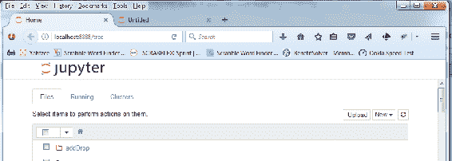

所以，Jupyter 被部署为一个网站，可以在你的机器上访问（也可以像访问任何其他网站一样通过互联网访问）。

我们可以看到页面的 URL，`http://localhost:8888/tree`。`localhost` 是指在你机器上运行的 Web 服务器的别名。我们在 Web 服务器上访问的网站以*树状*显示。这是默认的显示方式。它符合 Jupyter 中项目的显示方式。Jupyter 以树状布局显示对象，就像 Windows 文件资源管理器一样。主页列出了多个项目；每个项目都是一个子目录，并包含进一步的内容划分。根据你启动 Jupyter 的位置，当前目录中的现有内容也会显示在界面中。

# 详细描述 Jupyter 标签页

在网页上，我们可以看到即将熟悉的 Jupyter 标志和三个标签：

+   文件

+   运行

+   集群

文件标签列出了 Jupyter 可用的对象。Jupyter 使用的文件作为常规文件存储在磁盘上。Jupyter 提供了上下文管理器，能够处理你使用的不同类型的文件和程序。你可以通过 Windows 文件资源管理器查看 Jupyter 文件（它们的文件扩展名为 `.ipynb`）。你也可以在 Jupyter 窗口中看到非 Jupyter 文件。

运行标签列出了已经启动的 notebooks。Jupyter 会跟踪哪些 notebooks 正在运行。这个标签页允许你控制哪些 notebooks 在任何时候都在运行。

集群标签用于多个机器共同运行 Jupyter 的环境。

Jupyter 的集群实现是一个值得独立讨论的话题。

# 我可以在 Jupyter 中执行哪些操作？

接下来，我们看到：

+   提示选择要执行操作的项目

+   上传按钮

+   新的下拉菜单和

+   刷新图标

提示告诉你可以选择多个项目，然后对它们执行相同的操作。大多数以下操作（在菜单中）可以对单个项目或选定的一组项目执行。

上传按钮将提示选择一个文件并上传到 Jupyter。这通常用于将数据文件移动到项目中，以便在 Jupyter 作为网站运行在远程位置时访问，在这种情况下，你不能直接将文件复制到 Jupyter 运行的磁盘中。

新的下拉菜单展示了可用的不同类型的 Jupyter 项目（内核）的选择列表：

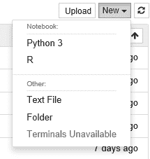

我们可以看到 Jupyter 能够创建的对象列表：

+   文本文件：创建一个用于该文件夹的文本文件。例如，如果笔记本要导入一个文件，你可以通过此功能创建该文件。

+   文件夹：是的，就像 Windows 文件资源管理器一样。

+   终端不可用：灰显，该功能只能在 Nix 环境中使用。

+   笔记本：灰显——这实际上不是一个文件类型，而是指该安装可以创建的不同类型的笔记本的标题。

+   Julia 0.4.5：创建一个使用 Julia 语言编写代码的 Julia 笔记本。

+   Python 3：创建一个使用 Python 语言编写代码的笔记本。这是默认选项。

+   R：创建一个使用 R 语言编写代码的笔记本。

+   根据你在安装中安装的内核，你可能会看到其他类型的笔记本列出。

# Jupyter 可以操作哪些对象？

如果我们启动了其中一个笔记本（它会自动在 Jupyter 对象列表中被选中），然后查看针对所选对象的操作下拉菜单，我们会看到如下显示：

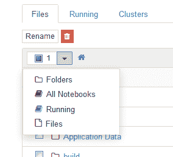

我们看到菜单操作已更改为重命名，因为这通常是对一个文件进行的操作，我们还可以看到一个图标用来删除项目（垃圾桶图标）。

项目计数现在是 1（我们在列表中选中了一个对象），该项目的图标是一个填充的蓝色方块（表示它是一个正在运行的项目），以及一个熟悉的主页图标，带我们返回到前面截图中的 Jupyter 主页显示。

对象菜单中有以下选择项：

+   文件夹：选择可用的文件夹

+   所有笔记本：选择 Jupyter 笔记本

+   正在运行：选择正在运行的 Jupyter 笔记本

+   文件：选择目录中的文件

如果我们在对象显示区域向下滚动，我们会看到在可用对象的列表中显示了一些不同的信息。每个列出的对象都有一个类型（由相关的图标形状表示）和一个用户在创建时分配的名称。

每个对象都是一个 Jupyter 项目，可以单独访问、共享和移动。每个项目都有一个完整的名称（由创建该项目的用户输入），并且有一个图标表示该条目是一个项目。我们还会看到其他 Jupyter 图标，代表其他项目组件，具体如下：

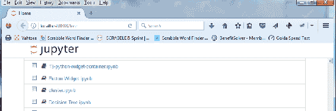

# 查看 Jupyter 项目显示

如果我们下拉“新建”菜单并选择 Python 3，Jupyter 将创建一个新的 Python 笔记本并展示其内容。我们将看到如下所示的界面：

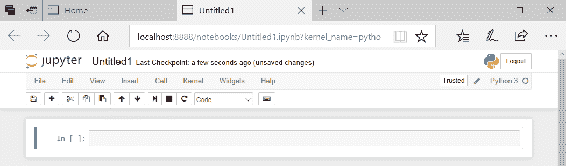

我们已经创建了一个新的 Jupyter 笔记本，并且进入了它的显示界面。Logo 已经显示，标题默认是`Untitled`，我们可以点击它进行修改。还有一个（自动保存）标记，告诉你 Jupyter 已将笔记本自动保存到磁盘，并且在你继续工作时会定期自动保存。

我们现在有了一个菜单栏，并且标明了该笔记本使用的是 Python 3 作为源语言。菜单选项包括：

+   文件：标准文件操作

+   编辑：用于编辑单元格内容（更多内容待更新）

+   视图：改变笔记本的显示方式

+   插入：在笔记本中插入一个单元格

+   单元格：改变单元格的格式和使用方式

+   内核：调整笔记本使用的内核

+   帮助：调出 Jupyter 的帮助系统

# 文件菜单

文件菜单包含以下选项：

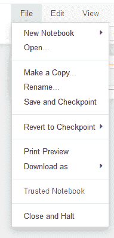

+   新建笔记本：类似于主页上的下拉操作

+   打开...：打开一个笔记本

+   复制一份...：复制一个笔记本

+   重命名...：重命名一个笔记本

+   保存和检查点：在检查点保存当前笔记本。检查点是笔记本历史中的特定时刻，用于在你对最近的更改感到后悔时，能够返回到某个检查点。

+   打印预览：类似于你曾用过的其他打印预览功能。

+   另存为：允许你将笔记本存储为各种格式。最常见的格式包括 PDF 或 Excel，这样可以将笔记本分享给那些无法访问 Jupyter 的用户。

+   可信笔记本：（此功能是灰显的）。当一个用户打开一个笔记本时，服务器会用用户的密钥计算一个签名，并将其与存储在笔记本元数据中的签名进行比较。如果签名匹配，那么笔记本中的 HTML 和 JavaScript 输出将在加载时被信任，否则将被视为不可信。

+   关闭并停止：关闭当前笔记本并停止它在 Jupyter 系统中的运行

# 编辑菜单

编辑菜单包含以下选项：


+   剪切单元格：典型的剪切操作。

+   复制单元格：假设你已经习惯了将单元格复制到内存缓冲区并稍后粘贴到笔记本的其他位置的图形界面操作。

+   粘贴上方单元格：如果您已选择一个单元格并且已经复制了一个单元格，则此选项不会被灰显，并且会将缓冲区中的单元格粘贴到当前单元格上方。

+   粘贴下方单元格：与之前的选项类似。

+   删除单元格：将删除所选的单元格。

+   撤销删除单元格。

+   拆分单元格：这里存在样式问题，关于将多少语句放入一个单元格。许多时候，您会从一个包含多个语句的单元格开始，然后将该单元格多次拆分，将单个语句或语句组分割到各自的单元格中。

+   合并上方单元格：将当前单元格与上方的单元格合并。

+   合并下方单元格：与之前的选项类似。

+   向上移动单元格：将当前单元格移到上方单元格之前。

+   向下移动单元格。

+   编辑笔记本元数据：供高级用户修改 Jupyter 为您的笔记本使用的内部编程语言。

+   查找与替换：在单元格中定位特定文本并可能进行替换。

# 查看菜单

查看菜单有以下选项：

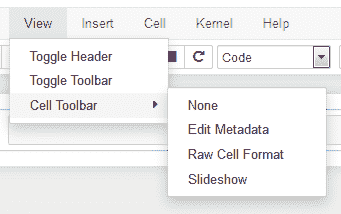

+   切换标题：切换 Jupyter 标题的显示

+   切换工具栏：切换 Jupyter 工具栏的显示

+   单元格工具栏：更改正在编辑的单元格的显示项：

    +   无：不显示单元格工具栏

    +   编辑元数据：直接编辑单元格的元数据

    +   原始单元格格式：编辑 Jupyter 使用的单元格原始格式

    +   幻灯片：以幻灯片方式浏览单元格

# 插入菜单

插入菜单有以下选项：

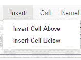

+   插入上方单元格：将复制的缓冲区单元格插入到当前单元格前面

+   插入下方单元格：与之前的选项相同

# 单元格菜单

单元格菜单有以下选项：

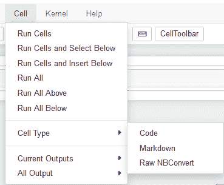

+   运行单元格：运行笔记本中的所有单元格

+   运行单元格并选择下方：运行单元格并选择当前单元格下方的所有单元格

+   运行单元格并插入下方：运行单元格并添加一个空白单元格

+   运行所有单元格：运行笔记本中的所有单元格

+   运行上方所有单元格：运行当前单元格上方的所有单元格

+   运行下方所有单元格：运行当前单元格下方的所有单元格

+   单元格类型：将选定的单元格类型更改为：

    +   代码：这是默认的——该单元格期望包含语言语句

    +   Markdown：单元格包含 HTML markdown，通常用于以最佳方式显示笔记本（因为它是一个网站，因此可以使用所有 HTML）

    +   原始 NBConvert：这是 Jupyter 的一种内部格式，基本上是纯文本

+   当前输出：是否清除或继续单元格的输出

+   所有输出

# Kernel 菜单

Kernel 菜单用于控制笔记本使用的底层语言引擎。菜单选项如下。我认为这个菜单中的许多选项使用得非常少：


+   中断：暂时停止底层语言引擎，然后让它继续

+   重启：重启底层语言引擎

+   重启并清除输出

+   重启并运行全部

+   重新连接：如果你中断了内核，那么你需要重新连接才能继续运行

+   更改内核：将本笔记本的语言更改为你安装中可用的语言

# 帮助菜单

帮助菜单显示 Jupyter 的帮助选项和语言上下文选择。例如，在我们的 Python 笔记本中，我们可以看到用于常用 Python 库的选择：

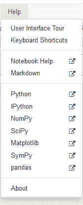

# 图标工具栏

正常菜单下方是一个图标工具栏，包含许多常用菜单项，方便快速使用，如图所示：


这些图标对应前面菜单中的选项（按出现顺序列出）：

+   文件/保存当前笔记本

+   插入下方单元格

+   剪切当前单元格

+   复制当前单元格

+   将单元格粘贴到下方

+   向上移动选中的单元格

+   向下移动选中的单元格

+   从选中的单元格开始运行

+   中断内核

+   重启内核

+   我们可以应用于当前单元格的格式列表

+   一个图标用于打开一个带有描述性名称的命令面板

+   一个图标用于打开单元格工具栏

# 执行脚本时效果如何？

如果我们为笔记本命名，输入一个简单的 Python 脚本，并执行笔记本单元格，我们将看到如下显示：

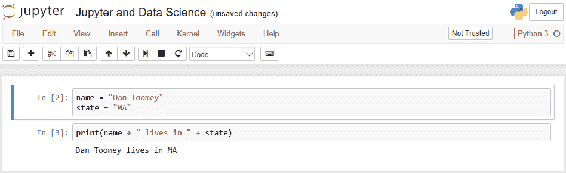

脚本是：

```py
name = "Dan Toomey"
state = "MA"
print(name + " lives in " + state)
```

我们为变量`name`和`state`赋值，然后打印它们。

如果你注意到，我将语句放入了两个不同的单元格。这仅仅是为了提高可读性。它们本可以放在同一个单元格或三个不同的单元格中。

每个单元格都有行号。编号总是从第一个单元格开始为 1，然后随着单元格的移动，编号可能会增加（正如你所看到的，显示中的第一个单元格标记为单元格 2）。

在第二个单元格下方，我们有不可编辑的显示结果。Jupyter 总是将单元格的任何对应输出显示在其下方。这可能还包括错误信息。

# 行业数据科学应用

本书讲解 Jupyter 和数据科学。我们已经介绍了 Jupyter。现在，我们可以看看数据科学的实践，再看看这两个概念是如何协同工作的。

数据科学在许多行业中得到应用。有趣的是，行业中涉及的主要技术和使用的算法。我们可以看到 Jupyter 中可用的相同技术。

一些数据科学的大型用户行业包括：

| **行业** | **更大的数据科学应用** | **技术/算法** |
| --- | --- | --- |
| 金融 | 对冲基金 | Python |
| 赌博 | 确定赔率 | R |
| 保险 | 风险衡量与定价 | Domino (R) |
| 零售银行 | 风险、客户分析、产品分析 | R |
| 采矿 | 智能勘探、产量优化 | Python |
| 消费品 | 定价与分销 | R |
| 医疗保健 | 药物发现与试验 | Python |

所有这些数据科学分析可以在 Jupyter 中完成，因为所使用的语言都得到了完全支持。

# 现实生活中的例子

在这一部分，我们展示了从当前行业焦点中提取的几个例子，并将它们应用于 Jupyter，以确保其实用性。

# 金融，Python - 欧式看涨期权估值

在[`www.safaribooksonline.com/library/view/python-for-finance/9781491945360/ch03.html`](https://www.safaribooksonline.com/library/view/python-for-finance/9781491945360/ch03.html)中有一个例子，来自 Yves Hilpisch 的书《Python for Finance》。所使用的模型在金融工作中非常标准。

我们希望得出看涨期权的理论价值。看涨期权是指在特定时间内以特定（执行）价格购买证券（如 IBM 股票）的权利。期权定价基于证券相对于执行价格和当前价格的风险性或波动性。这个例子使用的是欧式期权，只有在到期时才能行使——这简化了问题集。

这个例子使用了 Black-Scholes 模型来估值期权，其中我们有：

+   初始股票指数水平 *S[0] = 100*

+   欧式看涨期权的执行价格 *K = 105*

+   到期时间 *T = 1 年*

+   常数，无风险短期利率 *r = 5%*

+   常数波动率 *σ = 20%*

这些元素组成了以下公式：

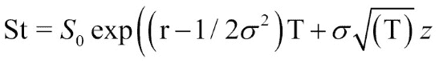

使用的算法如下：

1.  从标准正态分布中绘制 *I*（伪）随机数。

1.  计算给定 *z*(*i*) 下的所有期权到期时的指数水平 *S[T]*(*i*)。计算期权到期时的所有内在价值 *h[T]*(*i*) = max(*S[T]*(*i*) - *K*,0)。

1.  通过蒙特卡洛估算器估算期权现值，公式如下：

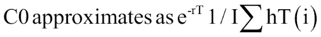

脚本如下。我们使用 `numpy` 进行复杂的数学计算。其余的代码是典型的：

```py
from numpy import * # set parameters S0 = 100. K = 105. T = 1.0 r = 0.05 sigma = 0.2 # how many samples we are using I = 100000 random.seed(103) z = random.standard_normal(I) ST = S0 * exp((r - 0.5 * sigma ** 2) * T + sigma * sqrt(T) * z) hT = maximum(ST - K, 0) C0 = exp(-r * T) * sum(hT) / I # tell user results print ("Value of the European Call Option %5.3f" % C0)
```

Jupyter 下的结果如以下截图所示：

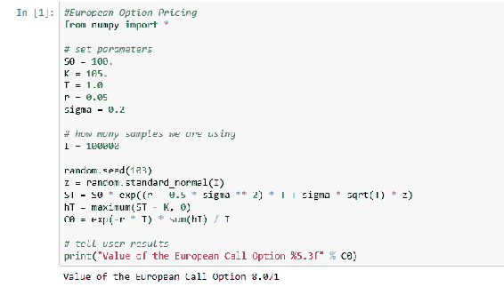

`8.071` 的值与已发布的期望值 *8.019* 一致，原因是使用的随机数有方差。（我在给随机数生成器设置种子，以确保结果可复现）。

# 金融，Python - 蒙特卡洛定价

另一个常用的算法是蒙特卡罗模拟。正如赌博度假村的名字所暗示的，在蒙特卡罗模拟中，我们模拟了一种情境，其中我们知道不同结果的百分比，但不确定接下来 *N* 次机会会发生什么。我们可以在[`www.codeandfinance.com/pricing-options-monte-carlo.html`](http://www.codeandfinance.com/pricing-options-monte-carlo.html)看到这个模型的应用。在这个例子中，我们再次使用了 Black-Scholes 模型，但采用了另一种直接方法，我们可以看到每个步骤。

编码如下。Jupyter 中的 Python 编码风格与直接在 Python 中使用的略有不同，您可以从代码顶部附近的更改导入看到。与仅从库中提取所需函数不同，您会导入整个库，然后使用所需的编码：

```py
import datetime import random # import gauss import math #import exp, sqrt random.seed(103) def generate_asset_price(S,v,r,T):
 return S * exp((r - 0.5 * v**2) * T + v * sqrt(T) * gauss(0,1.0)) def call_payoff(S_T,K):
 return max(0.0,S_T-K) S = 857.29 # underlying price v = 0.2076 # vol of 20.76% r = 0.0014 # rate of 0.14% T = (datetime.date(2013,9,21) - datetime.date(2013,9,3)).days / 365.0 K = 860. simulations = 90000 payoffs = [] discount_factor = math.exp(-r * T) for i in xrange(simulations):
 S_T = generate_asset_price(S,v,r,T) payoffs.append( call_payoff(S_T, K) ) price = discount_factor * (sum(payoffs) / float(simulations)) print ('Price: %.4f' % price)
```

在 Jupyter 下的结果如下所示：

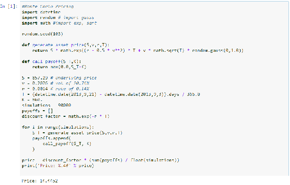

结果价格为`14.4452`，接近发布的值*14.5069*。

# 赌博，R - 投注分析

一些赌博游戏实际上是硬币翻转，成功的几率是 50/50。沿着这些线路，我们有从[`forumserver.twoplustwo.com/25/probability/flipping-coins-getting-3-row-1233506/`](http://forumserver.twoplustwo.com/25/probability/flipping-coins-getting-3-row-1233506/)获取的编码，用于确定硬币翻转中一系列正面或反面的概率，如果您知道硬币/游戏偏向于一个结果，可以使用触发器。

我们有以下脚本：

```py
##############################################
# Biased/unbiased  recursion of heads OR tails
##############################################
import numpy as np
import math

N = 14     # number of flips
m = 3      # length of run (must be  > 1 and <= N/2)
p = 0.5   # P(heads)

prob = np.repeat(0.0,N)
h = np.repeat(0.0,N)
t = np.repeat(0.0,N)

h[m] = math.pow(p,m)
t[m] = math.pow(1-p,m)
prob[m] = h[m] + t[m]

for n in range(m+1,2*m):
 h[n] = (1-p)*math.pow(p,m)
 t[n] = p*math.pow(1-p,m)
 prob[n] = prob[n-1] + h[n] + t[n]

for n in range(2*m,N):
 h[n] = ((1-p) - t[n-m] - prob[n-m-1]*(1-p))*math.pow(p,m)
 t[n] = (p - h[n-m] - prob[n-m-1]*p)*math.pow(1-p,m)
 prob[n] = prob[n-1] + h[n] + t[n]

prob[N-1]  
```

前面的代码在 Jupyter 中生成以下输出：

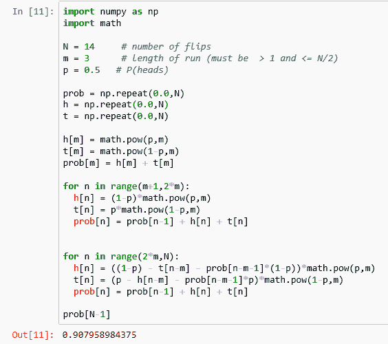

我们最终得到在一个公平的游戏中连续三次抛硬币的概率。在这种情况下，有 92%的机会（在我们运行的 14 次抛硬币的范围内）。

# 保险，R - 非人寿保险定价

我们有一个使用 R 为非寿险产品，特别是脚踏车，制定定价的例子，网址为[`www.cybaea.net/journal/2012/03/13/R-code-for-Chapter-2-of-Non_Life-Insurance-Pricing-with-GLM/`](http://www.cybaea.net/journal/2012/03/13/R-code-for-Chapter-2-of-Non_Life-Insurance-Pricing-with-GLM/)。该代码首先创建产品线的统计数据表，然后将定价与实际使用的统计数据进行比较。

积累数据的代码的第一部分如下所示：

```py
con <- url("http://www2.math.su.se/~esbj/GLMbook/moppe.sas") data <- readLines(con, n = 200L, warn = FALSE, encoding = "unknown") close(con) ## Find the data range data.start <- grep("^cards;", data) + 1L data.end   <- grep("^;", data[data.start:999L]) + data.start - 2L table.1.2  <- read.table(text = data[data.start:data.end],
 header = FALSE, sep = "", quote = "", col.names = c("premiekl", "moptva", "zon", "dur",
 "medskad", "antskad", "riskpre", "helpre", "cell"), na.strings = NULL, colClasses = c(rep("factor", 3), "numeric", rep("integer", 4), "NULL"), comment.char = "") rm(con, data, data.start, data.end) # Remainder of Script adds comments/descriptions comment(table.1.2) <-
 c("Title: Partial casco moped insurance from Wasa insurance, 1994--1999", "Source: http://www2.math.su.se/~esbj/GLMbook/moppe.sas", "Copyright: http://www2.math.su.se/~esbj/GLMbook/") ## See the SAS code for this derived field table.1.2$skadfre = with(table.1.2, antskad / dur) ## English language column names as comments: comment(table.1.2$premiekl) <-
 c("Name: Class", "Code: 1=Weight over 60kg and more than 2 gears", "Code: 2=Other") comment(table.1.2$moptva)   <-
 c("Name: Age", "Code: 1=At most 1 year", "Code: 2=2 years or more") comment(table.1.2$zon)      <-
 c("Name: Zone", "Code: 1=Central and semi-central parts of Sweden's three largest cities", "Code: 2=suburbs and middle-sized towns", "Code: 3=Lesser towns, except those in 5 or 7", "Code: 4=Small towns and countryside, except 5--7", "Code: 5=Northern towns", "Code: 6=Northern countryside", "Code: 7=Gotland (Sweden's largest island)") comment(table.1.2$dur)      <-
 c("Name: Duration", "Unit: year") comment(table.1.2$medskad)  <-
 c("Name: Claim severity", "Unit: SEK") comment(table.1.2$antskad)  <- "Name: No. claims" comment(table.1.2$riskpre)  <-
 c("Name: Pure premium", "Unit: SEK") comment(table.1.2$helpre)   <-
 c("Name: Actual premium", "Note: The premium for one year according to the tariff in force 1999", "Unit: SEK") comment(table.1.2$skadfre)  <-
 c("Name: Claim frequency", "Unit: /year") ## Save results for later save(table.1.2, file = "table.1.2.RData") ## Print the table (not as pretty as the book) print(table.1.2)
```

表的前 10 行结果如下：

```py
       premiekl moptva zon    dur medskad antskad riskpre helpre    skadfre
    1         1      1   1   62.9   18256      17    4936   2049 0.27027027
    2         1      1   2  112.9   13632       7     845   1230 0.06200177
    3         1      1   3  133.1   20877       9    1411    762 0.06761833
    4         1      1   4  376.6   13045       7     242    396 0.01858736
    5         1      1   5    9.4       0       0       0    990 0.00000000
    6         1      1   6   70.8   15000       1     212    594 0.01412429
    7         1      1   7    4.4    8018       1    1829    396 0.22727273
    8         1      2   1  352.1    8232      52    1216   1229 0.14768532
    9         1      2   2  840.1    7418      69     609    738 0.08213308
    10        1      2   3 1378.3    7318      75     398    457 0.05441486
```

然后，我们逐个产品/统计数据确定产品的定价是否与其他产品一致。请注意，`install.packages`语句中的`repos =`子句是 R 的一个相当新的添加：

```py
# make sure the packages we want to use are installed install.packages(c("data.table", "foreach", "ggplot2"), dependencies = TRUE, repos = "http://cran.us.r-project.org") # load the data table we need if (!exists("table.1.2"))
 load("table.1.2.RData") library("foreach") ## We are looking to reproduce table 2.7 which we start building here, ## add columns for our results. table27 <-
 data.frame(rating.factor = c(rep("Vehicle class", nlevels(table.1.2$premiekl)), rep("Vehicle age",   nlevels(table.1.2$moptva)), rep("Zone",          nlevels(table.1.2$zon))), class = c(levels(table.1.2$premiekl), levels(table.1.2$moptva), levels(table.1.2$zon)), stringsAsFactors = FALSE) ## Calculate duration per rating factor level and also set the ## contrasts (using the same idiom as in the code for the previous ## chapter). We use foreach here to execute the loop both for its ## side-effect (setting the contrasts) and to accumulate the sums. # new.cols are set to claims, sums, levels new.cols <-
 foreach (rating.factor = c("premiekl", "moptva", "zon"), .combine = rbind) %do% {
 nclaims <- tapply(table.1.2$antskad, table.1.2[[rating.factor]], sum) sums <- tapply(table.1.2$dur, table.1.2[[rating.factor]], sum) n.levels <- nlevels(table.1.2[[rating.factor]]) contrasts(table.1.2[[rating.factor]]) <- contr.treatment(n.levels)[rank(-sums, ties.method = "first"), ] data.frame(duration = sums, n.claims = nclaims) } table27 <- cbind(table27, new.cols) rm(new.cols) #build frequency distribution model.frequency <-
 glm(antskad ~ premiekl + moptva + zon + offset(log(dur)), data = table.1.2, family = poisson) rels <- coef( model.frequency ) rels <- exp( rels[1] + rels[-1] ) / exp( rels[1] ) table27$rels.frequency <-
 c(c(1, rels[1])[rank(-table27$duration[1:2], ties.method = "first")], c(1, rels[2])[rank(-table27$duration[3:4], ties.method = "first")], c(1, rels[3:8])[rank(-table27$duration[5:11], ties.method = "first")]) # note the severities involved model.severity <-
 glm(medskad ~ premiekl + moptva + zon, data = table.1.2[table.1.2$medskad > 0, ], family = Gamma("log"), weights = antskad) rels <- coef( model.severity ) rels <- exp( rels[1] + rels[-1] ) / exp( rels[1] ) ## Aside: For the canonical link function use ## rels <- rels[1] / (rels[1] + rels[-1]) table27$rels.severity <-
 c(c(1, rels[1])[rank(-table27$duration[1:2], ties.method = "first")], c(1, rels[2])[rank(-table27$duration[3:4], ties.method = "first")], c(1, rels[3:8])[rank(-table27$duration[5:11], ties.method = "first")]) table27$rels.pure.premium <- with(table27, rels.frequency * rels.severity) print(table27, digits = 2)
```

结果显示如下：

```py
       rating.factor class duration n.claims rels.frequency rels.severity
    1  Vehicle class     1     9833      391           1.00          1.00
    2  Vehicle class     2     8825      395           0.78          0.55
    11   Vehicle age     1     1918      141           1.55          1.79
    21   Vehicle age     2    16740      645           1.00          1.00
    12          Zone     1     1451      206           7.10          1.21
    22          Zone     2     2486      209           4.17          1.07
    3           Zone     3     2889      132           2.23          1.07
    4           Zone     4    10069      207           1.00          1.00
    5           Zone     5      246        6           1.20          1.21
    6           Zone     6     1369       23           0.79          0.98
    7           Zone     7      148        3           1.00          1.20
       rels.pure.premium
    1               1.00
    2               0.42
    11              2.78
    21              1.00
    12              8.62
    22              4.48
    3               2.38
    4               1.00
    5               1.46
    6               0.78
    7               1.20
```

在这里，我们可以看到一些车辆类别（`2`，`6`）的价格非常低，与该车辆的统计数据相比，而其他车辆则被高估（`12`，`22`）。

# 消费品，R - 营销效果

我们以一份我在[www.dantoomeysoftware.com/Using_R_for_Marketing_Research.pptx](http://www.dantoomeysoftware.com/Using_R_for_Marketing_Research.pptx)上做的演示为例，分析不同广告系列对葡萄果汁的效果。

代码如下：

```py
#library(s20x)
library(car)

#read the dataset from an existing .csv file
df <- read.csv("C:/Users/Dan/grapeJuice.csv",header=T)

#list the name of each variable (data column) and the first six rows of the dataset
head(df)

# basic statistics of the variables
summary(df)

#set the 1 by 2 layout plot window
par(mfrow = c(1,2))

# boxplot to check if there are outliers
boxplot(df$sales,horizontal = TRUE, xlab="sales")

# histogram to explore the data distribution shape
hist(df$sales,main="",xlab="sales",prob=T)
lines(density(df$sales),lty="dashed",lwd=2.5,col="red")

#divide the dataset into two sub dataset by ad_type
sales_ad_nature = subset(df,ad_type==0)
sales_ad_family = subset(df,ad_type==1)

#calculate the mean of sales with different ad_type
mean(sales_ad_nature$sales)
mean(sales_ad_family$sales)

#set the 1 by 2 layout plot window
par(mfrow = c(1,2))

# histogram to explore the data distribution shapes
hist(sales_ad_nature$sales,main="",xlab="sales with nature production theme ad",prob=T)
lines(density(sales_ad_nature$sales),lty="dashed",lwd=2.5,col="red")

hist(sales_ad_family$sales,main="",xlab="sales with family health caring theme ad",prob=T)
lines(density(sales_ad_family$sales),lty="dashed",lwd=2.5,col="red")  
```

带有输出（多个部分）：

（来自文件的原始数据，前 10 行）：

|  | **销售** | **价格** | **广告类型** | **苹果价格** | **饼干价格** |
| --- | --- | --- | --- | --- | --- |
| 1 | 222 | 9.83 | 0 | 7.36 | 8.8 |
| 2 | 201 | 9.72 | 1 | 7.43 | 9.62 |
| 3 | 247 | 10.15 | 1 | 7.66 | 8.9 |
| 4 | 169 | 10.04 | 0 | 7.57 | 10.26 |
| 5 | 317 | 8.38 | 1 | 7.33 | 9.54 |
| 6 | 227 | 9.74 | 0 | 7.51 | 9.49 |

数据的统计如下：

```py
    sales           price           ad_type     price_apple 
    Min.   :131.0   Min.   : 8.200   Min.   :0.0   Min.   :7.300 
    1st Qu.:182.5   1st Qu.: 9.585   1st Qu.:0.0   1st Qu.:7.438 
    Median :204.5   Median : 9.855   Median :0.5   Median :7.580 
    Mean   :216.7   Mean   : 9.738   Mean   :0.5   Mean   :7.659 
    3rd Qu.:244.2   3rd Qu.:10.268   3rd Qu.:1.0   3rd Qu.:7.805 
    Max.   :335.0   Max.   :10.490   Max.   :1.0   Max.   :8.290 
    price_cookies 
    Min.   : 8.790 
    1st Qu.: 9.190 
    Median : 9.515 
    Mean   : 9.622 
    3rd Qu.:10.140 
    Max.   :10.580 
```

数据显示了每个活动的效果。家庭销售更为有效：

+   *186.666666666667//自然销售平均值*

+   *246.666666666667//家庭销售平均值*

在直方图显示中，差异更加明显：

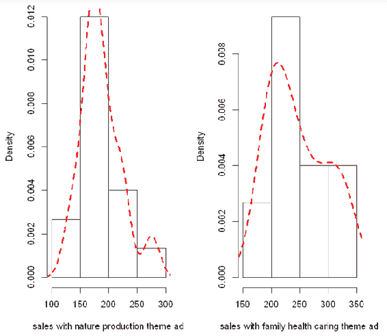

# 在 Jupyter 中使用 Docker

Docker 是一种机制，允许您在一台机器上拥有许多完整的应用程序虚拟实例。许多软件公司使用 Docker 来提供其服务的完全可扩展实现，并支持尽可能多的并发用户。

以前处理多个实例的机制共享公共资源（如磁盘地址空间）。在 Docker 下，每个实例都是一个与其他实例完全独立的完整实体。

在 Docker 环境中实现 Jupyter 允许多个用户访问各自的 Jupyter 实例，而无需担心干扰他人的计算。

Docker 的关键特性是允许在任何时候使用多个实例的笔记本。Docker 控制系统可以设置为为每个访问您笔记本的用户创建新的实例。所有这些都内建在 Docker 中，无需编程；只需使用用户界面来决定如何创建实例。

您可以通过两种方式使用 Docker：

+   从公共服务

+   在您的机器上安装 Docker

# 使用公共 Docker 服务

有几个服务可以使用。我认为它们的工作方式基本相同：注册服务，上传您的笔记本，监控使用情况（Docker 控制程序会自动跟踪使用情况）。例如，如果我们使用 [`hub.docker.com/`](https://hub.docker.com/)，我们实际上是在使用一个笔记本的版本库。版本控制在软件开发中用于跟踪随时间做出的更改。这也允许多个用户的访问权限：

1.  首先，注册。这将为您提供对服务提供商的身份验证。

1.  创建一个仓库——在这里您将保留您的笔记本版本。

1.  您需要在您的机器上安装 Docker，才能从仓库中拉取/推送笔记本。

安装 Docker 取决于操作系统。请访问 [`www.docker.com/`](https://www.docker.com/) 首页，按照您机器的说明进行操作。

1.  将您的 Jupyter 镜像上传（推送）到仓库中。

1.  访问仓库中的笔记本。您可以在 Docker 控制下与他人共享笔记本的地址（URL），并为不同用户设置特定的访问权限。

1.  从那时起，它将像在本地运行一样工作。

# 在您的机器上安装 Docker

在您的本地机器上安装 Docker 只会是发布到公共 Docker 服务的前提，除非您安装 Docker 的机器可以被他人访问。

另一个选择是将 Docker 安装在您的机器上。它与之前的情况完全相同，只是您正在管理 Docker 镜像空间。

# 如何与他人共享笔记本

有几种方法可以与他人共享 Jupyter 笔记本：

+   电子邮件

+   上传到 Google Drive

+   在 GitHub 上共享

+   将其存储为 HTML 文件在网络服务器上

+   在网络服务器上安装 Jupyter

# 你能通过电子邮件发送一个笔记本吗？

为了通过电子邮件发送笔记本，必须将笔记本转换为纯文本格式，作为附件发送给接收者，然后接收者必须将其转换回“二进制”笔记本格式。

邮件附件通常会被转换为明确的**MIME**（**多用途互联网邮件扩展**）格式。有一个程序可以将笔记本格式转换为 MIME 格式，名为`nb2mail`，它可以将笔记本转换为笔记本 MIME 格式。该程序可以在[`github.com/nfultz/nb2mail`](https://github.com/nfultz/nb2mail)找到。

使用方法如下：

+   使用`pip`命令安装`nb2mail`（见网站）

+   将选定的笔记本转换为 MIME 格式

+   发送给接收者

+   接收者的 MIME 转换过程将以正确的方式存储文件（假设他们也安装了`nb2mail`）

# 在 Google Drive 上共享笔记本

Google Drive 可用于存储你的笔记本档案信息。当与之前的笔记本邮件发送功能结合使用时，接收者可以使用 Google Drive 档案，这样没有档案信息的人就无法与笔记本互动。

你可以使用`pip`安装 python 扩展（来自[`github.com/jupyter/jupyter-drive`](https://github.com/jupyter/jupyter-drive)），然后使用`python -m`。从此以后，你可以通过 Google Drive 档案来访问笔记本，命令为`ipython notebook -profile <profilename>`。

# 在 GitHub 上共享

GitHub（以及其他平台）允许你将笔记本放在他们的服务器上，一旦放置，便可以通过 nbviewer 直接访问。服务器已安装支持你的笔记本所需的 Python（及其他语言）代码。nbviewer 是笔记本的只读版本，不支持互动。

nbviewer 可以在[`github.com/jupyter/nbviewer`](https://github.com/jupyter/nbviewer)找到。该站点包括需要添加到`ipython notebook`命令的特定参数，例如启动查看器的命令。

# 将其存储为 HTML 文件在 Web 服务器上

笔记本的内置功能是将笔记本导出为不同格式，其中之一是 HTML。通过这种方式，你可以将笔记本导出为 HTML，并在做出更改时将文件复制到你的 Web 服务器上。

命令为`jupyter nbconvert <notebook name>.ipynb --to html`。

这将是一个非互动的只读版本的笔记本。

# 在网络服务器上安装 Jupyter

Jupyter 作为 Web 应用程序部署。如果你有直接访问 Web 服务器的权限，你可以在 Web 服务器上安装 Jupyter，创建笔记本，然后这些笔记本将可供其他人访问，且完全动态。

作为一个 Web 服务器，你也可以控制对 Web 服务器的访问，因此能够控制谁可以访问你的笔记本。

这是一个高级交互，需要与网站管理员合作，确定正确的处理方式。

# 如何确保笔记本的安全？

Jupyter 笔记本的安全性有两个方面：

+   确保只有特定用户能够访问你的笔记本

+   确保你的笔记本不会用于托管恶意代码

# 访问控制

尽管 Jupyter 的许多使用场景主要是用于教育他人，但也有一些情况下，所访问的信息是机密的，且应该保持机密。Jupyter 允许你通过多种方式为你的笔记本设置访问限制。

当我们识别用户时，我们实际上是在验证该用户的身份。通常，通过在允许进入之前提出登录挑战来完成此过程，用户需要输入用户名和密码。

如果 Jupyter 实例托管在 Web 服务器上，你可以使用 Web 服务器的访问控制来限制对笔记本的访问。此外，大多数支持笔记本托管的供应商提供了一种机制，允许限制特定用户的访问。

# 恶意内容

安全性的另一个方面是确保你的笔记本内容不包含恶意代码。你应该确保你的笔记本是安全的，如下所示：

+   确保 HTML 被清理（检查恶意 HTML 代码并消除它）

+   不要允许笔记本执行外部 JavaScript

+   检查可能包含恶意内容的单元格是否在服务器环境中受到挑战

+   清理单元格输出，以避免对用户机器产生不必要的影响

# 总结

在本章中，我们深入探讨了 Jupyter 用户界面的细节：它与哪些对象进行交互，Jupyter 可以执行哪些操作，显示内容告诉我们数据的哪些信息，以及有哪些工具可供使用？接下来，我们查看了来自多个行业的 R 和 Python 编码的实际案例。然后，我们了解了将笔记本与其他用户共享的几种方式，以及如何通过不同的安全机制保护我们的笔记本。

在下一章中，我们将看到如何在 Jupyter 笔记本中使用 Python。
