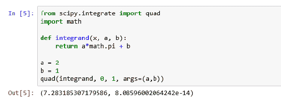
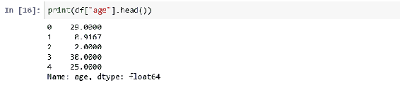
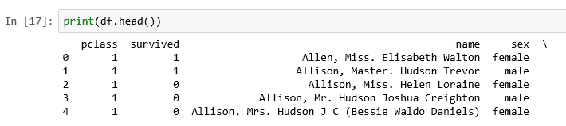

# 第二章：在 Jupyter 上处理分析数据

Jupyter 并不做分析数据的繁重工作：所有工作都是由用所选编程语言编写的程序完成的。Jupyter 提供了一个框架，可以运行多种编程语言模块。因此，我们可以选择如何在 Jupyter 中分析数据。

Python 是数据分析编程的流行选择。Jupyter 完全支持 Python 编程。我们将查看一些可能对这种支持系统造成压力的编程解决方案，并看看 Jupyter 如何应对。

# 使用 Python 笔记本进行数据抓取

数据分析的常用工具是从公共源（如网站）收集数据。Python 擅长从网站抓取数据。在这里，我们看一个示例，加载来自 Google 财经的数据的股票价格信息。

特别地，给定一个股票符号，我们想要获取该符号的过去一年的价格范围。

Google 财经网站上的一页将提供一只证券公司的过去一年的价格数据。例如，如果我们对 **超威半导体**（**AMD**）的价格点感兴趣，我们将输入以下 URL：

[`www.google.com/finance/historical?q=NASDAQ:AMD`](https://www.google.com/finance/historical?q=NASDAQ:AMD)

在这里，`NASDAQ` 是承载 AMD 股票的证券交易所。在生成的 Google 页面上，有一个包含感兴趣数据点的表格，如下图所示的部分截图所示。

就像你将尝试访问的许多网站一样，页面上还有很多其他信息，比如头部、尾部和广告，正如你在以下截图中看到的那样。网页是为人类读者构建的。幸运的是，Google 和其他公司意识到你在抓取他们的数据，并且会保持数据的相同格式，这样你就不必修改脚本。


提前警告你，如果你过于频繁地访问某个页面或整个网站，可能会被阻止访问。访问频率是你访问的特定网站需要讨论的问题。再次强调，这些网站知道你在抓取数据，并且只要不干扰正常的人工网络流量，他们是可以接受的。

在该网页上有一个清晰的表格。如果我们查看生成网页所用的底层 HTML，我们会发现有很多头部、尾部和侧边栏的信息，但更重要的是，我们会发现一个 id 为 `price_data` 的 HTML `div` 标签。在这个 `div` 标签中，我们看到一个 HTML 表格，每一行包含该数据的 `date`、`opening price`、`high`、`low`、`close` 和 `volume` 的值，正如屏幕上所看到的那样。

我们可以使用一个标准的 Python 库包，`lxml`，将网页文本加载并解析为 HTML Python 组件，以便我们进行操作。

然后，对于每一天的数据，我们提取出列信息，并将其添加到我们的数据列表中。

通常，你可能每天运行此脚本一次，并将最新一天的信息存储到本地数据库中以供进一步分析。在我们的案例中，我们只是将最后一天的值打印在屏幕上。

使用的 Python 脚本如下：

```py
from lxml import html import requests from time import sleep # setup the URL for the symbol we are interested in exchange = "NASDAQ" ticker = "AMD" url = "https://www.google.com/finance/historical?q=%s:%s"%(exchange,ticker) # retrieve the web page response = requests.get(url) print ("Retrieving prices for %s from %s"%(ticker,url)) # give it a few seconds in case there is some delay sleep(3) # convert the text into an HTML Document parser = html.fromstring(response.text) # find the HTML DIV tag that has id 'prices' price_store = parser.get_element_by_id("prices") # we will store our price information in the price_data list price_data = [] # find the HTML TABLE element within the prices DIV for table in price_store:
 #every row (skip first row headings) of table has #  date, open, high, low, close, volume for row in table[1:]: #store tuples for a day together day = {"date":row[0].text.strip('\n'), \ "open":row[1].text.strip('\n'), \ "high":row[2].text.strip('\n'), \ "low":row[3].text.strip('\n'), \ "close":row[4].text.strip('\n'), \ "volume":row[5].text.strip('\n')}        #add day's information to our set
 price_data.append(day) print ("The last day of pricing information we have is:") print (price_data[0])
```

在 Jupyter 控制台运行此脚本，我们看到如下部分截图中的结果：


# 在 Jupyter 中使用重型数据处理函数

Python 有多个处理函数组，可能会占用计算机系统的计算资源。让我们在 Jupyter 中使用其中的一些，来检查其功能是否按预期执行。

# 在 Jupyter 中使用 NumPy 函数

NumPy 是 Python 中的一个包，提供多维数组和数组处理的常用函数。我们通过`import * from numpy`语句引入 NumPy 包。特别是，NumPy 包定义了`array`关键字，表示一个具有广泛功能的 NumPy 对象。

NumPy 数组处理函数从基础的`min()`和`max()`函数（它们提供给定数组维度上的最小值和最大值）到更有趣的实用函数，用于生成直方图和计算数据框元素之间的相关性。

使用 NumPy，你可以以多种方式操作数组。例如，我们将通过以下脚本介绍其中一些函数，使用 NumPy 来：

+   创建一个数组

+   计算数组中的最大值

+   计算数组中的最小值

+   确定第二个轴的总和

```py
# numpy arrays
import numpy as np

# create an array 'a' with 3 3-tuples
a = np.array([[1, 1, 2], [3, 5, 8], [13, 21, 34]])
print("Array contents", a)

# determine the minimum value in array
print("max value = ", a.max())

# max value in array
print("min value = ", a.min())

# sum across the 2nd axis  
print("sum across 2nd axis", a.sum(axis = 1))
```

如果我们将此脚本转移到 Python 笔记本中，当执行单元格时，我们会看到如下显示：


我们可以使用以下脚本，通过更有趣的`histogram`和`correlate`函数来处理数组：

```py
import numpy as np
import random

# build up 2 sets of random numbers

# setup empty array 2 columns, 1000 rows
numbers = np.empty([2,1000], int)

# set seed so we can repeat results
random.seed(137)

# populate the array
for num in range(0, 1000):
 numbers[0,num] = random.randint(0, 1000)
 numbers[1,num] = random.randint(0, 1000)

# produce a histogram of the data
(hist, bins) = np.histogram(numbers, bins = 10, range = (0,1000))
print ("Histogram is ",hist)

# calculate correlation between the 2 columns

corrs = np.correlate(numbers[:,1], numbers[:,2], mode='valid')
print ("Correlation of the two rows is ", corrs)  
```

在这个脚本中，我们正在：

+   用随机数填充一个两列的数组

+   在 100 个点的范围内生成两个列的直方图

+   最后，确定两个列之间的相关性（这应该是非常高的相关性）

将此脚本输入到 Jupyter Notebook 并执行单元格后，我们得到如下输出。可以理解的是，这些桶的大小非常接近：


# 在 Jupyter 中使用 pandas

pandas 是一个开源的高性能数据分析工具库，在 Python 中可用。特别感兴趣的是以下功能：

+   读取文本文件

+   读取 Excel 文件

+   从 SQL 数据库读取

+   操作数据框

# 使用 pandas 在 Jupyter 中读取文本文件

最常见的包含分析数据的文本文件类型是 CSV 文件。互联网上有许多以此格式提供的数据集。我们将查看在[`vincentarelbundock.github.io/Rdatasets/csv/datasets/Titanic.csv`](https://vincentarelbundock.github.io/Rdatasets/csv/datasets/Titanic.csv)中找到的泰坦尼克号生还者数据。

与大多数 pandas 函数一样，函数调用非常简单：

```py
import pandas as pd
df = pd.read_csv ('https://vincentarelbundock.github.io/Rdatasets/csv/datasets/Titanic.csv')
print (df.head)  
```

然而，和许多 pandas 函数一样，`read_csv`函数有一组广泛的可选参数，可以传入，默认值是最常用的功能，这样我们就可以像之前一样写出简短的代码来完成工作。我们可以使用的一些附加参数允许我们：

+   跳过行

+   跳过/定义列标题

+   并且可以更改索引字段（Python 总是希望在数据框中保持一个主要索引字段，以加快访问速度）

在 Jupyter 中执行的脚本结果显示如下（注意，我只使用`head`函数打印表格的前后 30 行）：


# 在 Jupyter 中使用 pandas 读取 Excel 文件

同样，我们也可以轻松加载 Microsoft Excel 文件。例如，关于同一泰坦尼克号数据集的 Excel 文件可以在`vandebilt.edu`找到（完整链接在以下脚本中）。我们有以下脚本：

```py
import pandas as pd
df = pd.read_excel('http://biostat.mc.vanderbilt.edu/wiki/pub/Main/DataSets/titanic3.xls')
print (df.head)  
```

读取 Excel 文件时也有一组广泛的可选参数，例如：

+   选择 Excel 文件中的工作表进行读取

+   跳过行

+   指定 NA 值的处理方式

在 Jupyter 中显示的结果流程如下。数据集与之前读取的 CSV 文件非常相似。


# 使用 pandas 操作数据框

一旦我们有了数据框，就有几个 pandas 方法可以进一步处理数据。我们将使用 pandas 来：

+   `groupby`函数

+   操作列

+   计算异常值

# 在数据框中使用 groupby 函数

`groupby`函数可以用来根据您的标准对数据框中的记录进行分组（并计数）。

继续使用我们的泰坦尼克号数据集，我们可以使用`groupby`按年龄计数乘客数量。

我们可以使用以下脚本：

```py
# read in the titanic data set
import pandas as pd
df = pd.read_excel('http://biostat.mc.vanderbilt.edu/wiki/pub/Main/DataSets/titanic3.xls')
# extract just the age column to its own dataset, 
# group by the age, and
# add a count for each age
ages = df[['age']].groupby('age')['age'].count()
print (ages)  
```

在 Jupyter 中显示的结果如下。我没意识到船上有这么多婴儿。


# 操作数据框中的列

一个有趣的列操作是排序。我们可以使用`sort_values`函数对先前的年龄计数数据进行排序，以确定船上旅客的最常见年龄。

脚本如下：

```py
import pandas as pd
df = pd.read_excel('http://biostat.mc.vanderbilt.edu/wiki/pub/Main/DataSets/titanic3.xls')
# the [[]] syntax extracts the column(s) into a new dataframe
# we groupby the age column, and 
# apply a count to the age column
ages = df[['age']].groupby('age')['age'].count()
print("The most common ages")
print (ages.sort_values(ascending=False))  
```

在 Jupyter 中的结果显示如下。从数据来看，船上有很多年轻的旅客。考虑到这一点，也就能理解为什么船上有这么多婴儿。


# 在数据框中计算异常值

我们可以使用标准计算来计算异常值，即判断与均值的差的绝对值是否大于 1.96 倍的标准差。（这假设数据服从正态高斯分布）。

例如，使用之前加载的泰坦尼克号数据集，我们可以根据年龄确定哪些乘客是异常值。

Python 脚本如下：

```py
import pandas as pd

df = pd.read_excel('http://biostat.mc.vanderbilt.edu/wiki/pub/Main/DataSets/titanic3.xls')

# compute mean age
df['x-Mean'] = abs(df['age'] - df['age'].mean())

# 1.96 times standard deviation for age
df['1.96*std'] = 1.96*df['age'].std()

# this age is an outlier if abs difference > 1.96 times std dev
df['Outlier'] = abs(df['age'] - df['age'].mean()) > 1.96*df['age'].std()

# print (results)
print ("Dataset dimensions", df.count)
print ("Number of age outliers", df.Outlier.value_counts()[True])  
```

在 Jupyter 下，结果显示如下：

```py
Number of age outliers 65  
```

因为大约有 1300 名乘客，所以我们有大约 5% 的异常值，这意味着年龄可能符合正态分布。

# 在 Jupyter 中使用 SciPy

SciPy 是一个开源库，适用于数学、科学和工程领域。由于其广泛的应用范围，我们可以使用 SciPy 探索许多领域：

+   积分

+   优化

+   插值法

+   傅里叶变换

+   线性代数

+   还有一些其他强大的功能集，比如信号处理

# 在 Jupyter 中使用 SciPy 积分

一个标准的数学过程是对方程进行积分。SciPy 通过回调函数来逐步计算出函数的积分。例如，假设我们想要计算以下方程的积分：


我们将使用如下脚本。我们使用标准 `math` 包中的 *pi* 定义。

```py
from scipy.integrate import quad
import math

def integrand(x, a, b):
 return a*math.pi + b

a = 2
b = 1
quad(integrand, 0, 1, args=(a,b))
```

再次强调，这段代码非常简洁，虽然几乎无法在许多语言中实现。在 Jupyter 中运行此脚本时，我们很快就能看到结果：



我很好奇在执行过程中 `integrand` 函数是如何使用的。我正在利用它来演练回调函数。为了观察其效果，我在脚本中添加了一些调试信息，统计每次调用时发生了多少次迭代，并显示每次调用的值：

```py
from scipy.integrate import quad
import math

counter = 0
def integrand(x, a, b):
 global counter
 counter = counter + 1
 print ('called with x=',x,'a = ',a,'b = ', b)
 return a*math.pi + b

a = 2
b = 1
print(quad(integrand, 0, 1, args=(a,b)))
print(counter)
```

我们在全局范围内使用了一个计数器，因此在 `integrand` 函数内引用时需要使用 `global` 关键字。否则，Python 会假设它是该函数的局部变量。

结果如下：


该函数被调用了 21 次以缩小解决方案范围。

# 在 Jupyter 中使用 SciPy 优化

通过优化法，我们试图确定在多个变量下函数的最大值或最小值。比如，让我们使用一个包含有趣曲线的方程：


如果我们绘制该曲线并查看是否存在明显的最小值，可以使用以下脚本生成结果图表。（`%mathplotlib inline` 使得图表在 Jupyter 会话内显示，而不是在新窗口中创建图表。）

```py
%matplotlib inline
from scipy import optimize
import matplotlib.pyplot as plt
import numpy as np

def f(x):
 return x**4 - x**3 + x**2 + 1

x = np.linspace(-100, 50, 100)
plt.plot(x, f(x));  
```

在 Jupyter 中运行这个脚本时，我们看到在 *x = 0* 处有一个自然最小值。


# 在 Jupyter 中使用 SciPy 插值法

通过插值法，我们根据一组离散点对函数的值进行猜测。例如，假设你的测试结果显示了如下内容：

```py
%matplotlib inline
import matplotlib.pyplot as plt

x = [1, 3, 5, 7]
y = [0.5, 0.4, 0.35, 0.29]
plt.plot(x,y)
```


在这种情况下，我们可以使用如下脚本，插值求解当 *x* 为 `4` 时的函数值：

```py
from scipy.interpolate import interp1d 
g = interp1d(x, y) 
print (g(4)) 
```

这给出了结果 `0.375`，看起来是正确的。


# 在 Jupyter 中使用 SciPy 傅里叶变换

SciPy 中有一组 **FFT**（**傅里叶变换**）函数。考虑到需要进行的处理量，它们非常易于使用。

我们可以通过以下代码执行快速傅里叶变换（FFT）：

```py
from scipy.fftpack import fft import numpy as np x = np.array([2.0, 1.0, 2.0, 1.0, 2.0]) fft(x) 
```

这里我们有一个小数据集进行分析。这些数据点代表我们需要评估的小信号集。当在 Jupyter 中处理时，我们得到以下显示：


请注意，即使是这个小数据集，变换操作也持续了几秒钟。

我们还可以使用生成的数据集，如下面的代码所示：

```py
from scipy.fftpack import fft import numpy as np
# how many points n = 100 spacing = 1.0 / 250.0 x = np.linspace(0.0, n*spacing, n) y = np.sin(30.0 * np.pi * x) + 0.5 * np.sin(7.0 * np.pi * x) yf = fft(y) xf = np.linspace(0.0, 1.0/(2.0*spacing), n//2)
#plot the data to get a visual import matplotlib.pyplot as plt plt.plot(xf, 2.0/n * np.abs(yf[0:n//2])) plt.grid() plt.show()
```

在 Jupyter 中运行这个脚本会生成一个数据点的图形，并显示在新的屏幕上：


这与我们预期的结果相符，显示中有一个大波动和一个小波动。

# 在 Jupyter 中使用 SciPy 线性代数

有一整套线性代数函数可用。例如，我们可以通过以下步骤求解线性系统：

```py
import numpy as np from scipy import linalg
A = np.array([[1, 1], [2, 3]]) print ("A array") print (A)
b = np.array([[1], [2]]) print ("b array") print (b)
solution = np.linalg.solve(A, b) print ("solution ") print (solution)
# validate results print ("validation of solution (should be a 0 matrix)") print (A.dot(solution) – b)
```

在 Jupyter 中，输出如下所示：


我们通过最终的零矩阵来验证结果。

# 扩展 Jupyter 中的 pandas 数据框

用于处理数据框的内置函数比我们迄今为止使用的更多。如果我们从本章之前的一个示例中取出 Titanic 数据集（来自 Excel 文件），我们可以使用更多的函数来帮助呈现和处理数据集。

重复一遍，我们使用脚本加载数据集：

```py
import pandas as pd
df = pd.read_excel('http://biostat.mc.vanderbilt.edu/wiki/pub/Main/DataSets/titanic3.xls')
```

然后，我们可以使用 `info` 函数检查数据框，该函数显示数据框的特征：

```py
df.info()  
```


一些有趣的点如下：

+   1309 条记录

+   14 列

+   `body` 列中有效数据的字段不多——大多数数据丢失了

+   能够很好地概述涉及的数据类型

我们还可以使用 `describe` 函数，它为数据框中的每一列数字型数据提供了统计 breakdown。

```py
df.describe()  
```

这会生成以下表格展示：


对于每一列数字数据，我们有：

+   计数

+   均值

+   标准差

+   25%、50% 和 75% 百分位点

+   项目的最小值和最大值

我们可以使用语法 `df[12:13]` 切片感兴趣的行，其中第一个数字（默认是数据框中的第一行）是要切割的第一行，第二个数字（默认是数据框中的最后一行）是要切割的最后一行。

运行这个切片操作，我们得到了预期的结果：


由于我们在选择数据框的列时实际上是在创建一个新的数据框，因此我们也可以在此基础上使用 `head` 函数：



# 在 Jupyter/IPython 中排序和筛选数据框

数据框自动允许你轻松地对数据集进行排序和筛选，使用数据框本身已有的功能。

# 过滤数据框

我们可以根据条件选择/过滤特定的行（使用相同的 Titanic 数据框）：

```py
print(df[df.age < 5])  
```

这意味着我们查看数据框，并选择年龄小于五岁的人所在的行。（再次强调，这会创建一个新的数据框，可以根据需要进行操作。）


如果你考虑一下这个问题，你几乎可以对数据框应用任何过滤器。然后，你可以做一些事情，比如选择一个数据框的一部分，并将其与另一个数据框的部分进行合并/连接。很快，你就会得出类似 SQL 的操作，可以在数据库表上执行。换个角度看，你将能进行比基础数据框所能提供的更广泛的数据操作。

# 排序数据框

在大多数语言中，排序意味着重新组织你正在处理的数据集。在数据框中，可以通过选择另一个索引来访问数据框，从而实现排序。所有数据框在一开始都会有一个由 NumPy 内置的基本增量行索引。你可以改变用于访问数据框的索引，并有效地按照你希望的方式对数据框进行排序。

如果我们查看（Titanic）数据框的显示内容，我们会注意到没有命名的第一列序号值：



如果我们为数据框分配另一个索引来使用，我们将按该索引对数据框进行排序。例如：

```py
df.set_index('name').head()
```


记住，由于我们尚未分配这个新的数据框（命名为 index），我们仍然保留着原始数据框。

与前一节相关，实际上可以对数据框执行排序操作，使用 `sort_values` 方法。例如，如果我们使用以下脚本：

```py
print(df.sort_values(by='home.dest', ascending=True).head())  
```

这个脚本将数据框按 `home.dest` 列升序排序，并打印前五条记录（按此顺序）

我们将看到如下结果：


# 总结

在本章中，我们研究了在 Jupyter 中可能执行的一些计算密集型任务。我们使用 Python 抓取网站以收集数据进行分析。我们使用了 Python 的 NumPy、pandas 和 SciPy 函数来进行深入计算。我们进一步探索了 pandas，并研究了如何操作数据框。最后，我们看到了一些排序和过滤数据框的例子。

在下一章中，我们将做出一些预测，并使用可视化来验证我们的预测。
