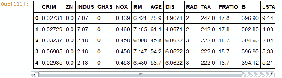

# 第三章：数据可视化与预测

做预测通常是危险的。然而，已经有一些方法可以让你对结果充满信心。在 Jupyter 下，我们可以使用 Python 和/或 R 来进行预测，并且这些功能是现成的。

# 使用 scikit-learn 做预测

scikit-learn 是一个基于 Python 构建的机器学习工具包。该包的一部分是监督学习，其中样本数据点具有属性，允许你将数据点分配到不同的类别中。我们使用一种估算器，它将数据点分配到一个类别，并对其他具有相似属性的数据点做出预测。在 scikit-learn 中，估算器提供了两个函数，`fit()` 和 `predict()`，分别提供了分类数据点和预测其他数据点类别的机制。

作为例子，我们将使用来自 [`uci.edu/`](https://uci.edu/) 的住房数据（我认为这些数据来自波士顿地区）。有许多因素，包括价格因素。

我们将采取以下步骤：

+   我们将把数据集分成训练集和测试集

+   从训练集中，我们将生成一个模型

+   我们将使用该模型在测试集上进行评估，并验证我们的模型如何拟合实际数据以预测住房价格

数据集中的属性（在我们的数据框中按相应顺序排列）为：

| **CRIM** | **每个城镇的人均犯罪率** |
| --- | --- |
| `ZN` | 住宅用地比例，规划为超过 25,000 平方英尺的地块 |
| `INDUS` | 每个城镇非零售商业用地的比例 |
| `CHAS` | 查尔斯河虚拟变量（`= 1` 如果地区边界为河流；否则为 `0`） |
| `NOX` | 氮氧化物浓度（每千万分之一） |
| `RM` | 每个住宅的平均房间数 |
| `AGE` | 1940 年之前建造的自有住宅单元的比例 |
| `DIS` | 到波士顿五个就业中心的加权距离 |
| `RAD` | 辐射高速公路的可达性指数 |
| `TAX` | 每 $10,000 的全额财产税率 |
| `PTRATIO` | 每个城镇的师生比例 |
| `B` | *1000(Bk - 0.63)²* 其中 *Bk* 是每个城镇的黑人居民比例 |
| `LSTAT` | 低阶层人口的百分比 |
| `MEDV` | 自有住宅的中位数价值（单位：$1,000） |

以下的代码之后是对所使用的算法和结果的讨论：

```py
#define all the imports we are using import matplotlib.pyplot as plt import numpy as np import pandas as pd import random from sklearn import datasets, linear_model from sklearn.cross_validation import train_test_split # load the data set df = pd.read_table('http://archive.ics.uci.edu/ml/machine-learning-databases/housing/housing.data', sep='\s+') # add column names df.columns = ['CRIM', 'ZN', 'INDUS', 'CHAS', 'NOX', \
 'RM', 'AGE', 'DIS', 'RAD', 'TAX', 'PRATIO',\ 'B', 'LSTAT', 'MDEV'] #produce basic statistics to make sure things are lined up df.head()
```

`head()` 函数的结果是数据框的前几行：



```py
df.describe()  
```

同样，前面的 `describe` 语句为我们提供了一些数据框的快速统计信息：


当将数据集分割为训练集和测试集时，我们使用两者之间的随机分配。这为我们提供了一组无偏的数据进行处理。然而，为了让你能复现这里展示的结果，你需要使用相同的随机种子/初始值。这就是为什么要调用`random.seed()`的原因。在实践中，你可以省略这个方法调用：

```py
#we are going to be splitting up the data set 'randomly', #however we need to reproduce results so set the seed random.seed(3277) #split the data into training and testing (25% for testing) training, testing = train_test_split(df, test_size = 0.25) #need this step to create an instance of the lreg model regr = linear_model.LinearRegression() # Train the model using the training set (MDEV=target) training_data = training.drop('MDEV', axis=1) training_test = training.iloc[:,-1] #training.loc[:,['MDEV']] #look at coefficients in the model to validate regr.fit(training_data,training_test) print('Coefficients: \n', regr.coef_) 'Coefficients: \n', array([
 -1.18763385e-01,   4.19752612e-02,  -1.18584543e-02, 5.53125252e-01,  -1.19774970e+01,   3.80050180e+00, -8.55663104e-03,  -1.46613256e+00,   3.86772585e-01, -1.53024705e-02,  -9.55933426e-01,   1.31347272e-02, -5.28183554e-01])) 
```

这些大多数是小数字，除了与第 6 项（房间数）有 3.8 的正相关，以及与第 8 项（从商业中心的距离）有 -1.5 的负相关。人们如此重视靠近工作地点的价值真是有趣：

```py
#split up our test set testing_data = testing.loc[:,['CRIM', 'ZN', 'INDUS', 'CHAS',\ 'NOX', 'RM', 'AGE', 'DIS', 'RAD', 'TAX', 'PRATIO', 'B',\ 'LSTAT']] testing_test = testing[['MDEV']].as_matrix() #make our prediction prediction_of_test = regr.predict(testing_data) # compute MSE # would usually use the built-in mse function, # but the test_test and prediction have diff # cols sum = 0 rows = len(testing_test) for i in range(rows):
 test = testing_test[i] prediction = prediction_of_test[i] diff = (test - prediction) ** 2 sum = sum + diff mse = sum / rows print("MSE ", mse) ('MSE ', array([ 23.1571225]))
```

MSE 为 23，相较于处理的数字大小来说，这个值似乎非常低。现在，让我们绘制结果图形，以便直观了解发生了什么：

```py
**#this preceding line is needed to display inline on Jupyter** **#plot the tests and predictions** **plt.scatter(testing_test, prediction_of_test, color='black')
****#draw a line through the middle showing the fit** **x0 = min(testing_test)** **x1 = max(testing_test)** **y0 = min(prediction_of_test)** **y1 = max(prediction_of_test)** **plt.plot([x0,x1],[y0,y1], color="red")
****#add labels** **plt.xlabel("Actual Price")** **plt.ylabel("Predicted Price")** **plt.title("Actual Price vs Predicted Price")
****plt.show()**
```

**从视觉上看，我们似乎有一个不错的拟合。大部分数据点都与通过的轴对齐。正如往常一样，也有一些明显的异常值，比如 *20*，*50*：

** **# 使用 R 进行预测

我们可以使用 R 在笔记本中执行相同的分析。不同语言的函数不同，但功能非常接近。

我们使用相同的算法：

+   加载数据集

+   将数据集划分为训练和测试分区

+   基于训练分区开发一个模型

+   使用模型从测试分区进行预测

+   比较预测值与实际测试值

编码如下：

```py
#load in the data set from uci.edu (slightly different from other housing model)
housing <- read.table("http://archive.ics.uci.edu/ml/machine-learning-databases/housing/housing.data")

#assign column names
colnames(housing) <- c("CRIM", "ZN", "INDUS", "CHAS", "NOX",
 "RM", "AGE", "DIS", "RAD", "TAX", "PRATIO",
 "B", "LSTAT", "MDEV")
#make sure we have the right data being loaded
summary(housing)
 CRIM                ZN             INDUS            CHAS 
 Min.   : 0.00632   Min.   :  0.00   Min.   : 0.46   Min.   :0.00000 
 1st Qu.: 0.08204   1st Qu.:  0.00   1st Qu.: 5.19   1st Qu.:0.00000 
 Median : 0.25651   Median :  0.00   Median : 9.69   Median :0.00000 
 Mean   : 3.61352   Mean   : 11.36   Mean   :11.14   Mean   :0.06917 
 3rd Qu.: 3.67708   3rd Qu.: 12.50   3rd Qu.:18.10   3rd Qu.:0.00000 
 Max.   :88.97620   Max.   :100.00   Max.   :27.74   Max.   :1.00000 
 NOX               RM             AGE              DIS 
 Min.   :0.3850   Min.   :3.561   Min.   :  2.90   Min.   : 1.130 
 1st Qu.:0.4490   1st Qu.:5.886   1st Qu.: 45.02   1st Qu.: 2.100 
 Median :0.5380   Median :6.208   Median : 77.50   Median : 3.207 
 Mean   :0.5547   Mean   :6.285   Mean   : 68.57   Mean   : 3.795 
 3rd Qu.:0.6240   3rd Qu.:6.623   3rd Qu.: 94.08   3rd Qu.: 5.188 
 Max.   :0.8710   Max.   :8.780   Max.   :100.00   Max.   :12.127 
...  
```

确保数据集按正确顺序排列以便进行建模。

```py
housing <- housing[order(housing$MDEV),]

#check if there are any relationships between the data items
plot(housing)  
```

数据显示如下，展示了每个变量与数据集中的其他变量的关系。我在查看是否有任何漂亮的 45 度“线”显示出变量之间的高度对称性，目的是看是否应该移除一个变量，因为另一个变量就足够作为一个贡献因子。有趣的项目是：

+   `CHAS`：查尔斯河访问权限，但这是一个二值值。

+   `LSTAT`（低收入群体）和 `MDEV`（价格）有反向关系——但价格不会成为一个因素。

+   `NOX`（烟雾）和 `DIST`（到工作地点的距离）有反向关系。我认为我们需要这个。

+   否则，数据项之间似乎没有任何关系：


我们像之前一样强制设置随机种子，以便能够复现结果。然后，我们使用 `createDataPartitions` 函数将数据划分为训练和测试分区。接下来我们可以训练我们的模型并测试结果模型进行验证：

```py
#force the random seed so we can reproduce results
set.seed(133)

#caret package has function to partition data set
library(caret)
trainingIndices <- createDataPartition(housing$MDEV, p=0.75, list=FALSE)
#break out the training vs testing data sets
housingTraining <- housing[trainingIndices,]
housingTesting <- housing[-trainingIndices,]
#note their sizes
nrow(housingTraining)
nrow(housingTesting)
#note there may be warning messages to update packages
381
125

#build a linear model
linearModel <- lm(MDEV ~ CRIM + ZN + INDUS + CHAS + NOX + RM + AGE +
 DIS + RAD + TAX + PRATIO + B + LSTAT, data=housingTraining)
summary(linearModel)
Call:
lm(formula = MDEV ~ CRIM + ZN + INDUS + CHAS + NOX + RM + AGE + 
 DIS + RAD + TAX + PRATIO + B + LSTAT, data = housingTraining)

Residuals:
 Min       1Q   Median       3Q      Max 
-15.8448  -2.7961  -0.5602   2.0667  25.2312 

Coefficients:
 Estimate Std. Error t value Pr(>|t|) 
(Intercept)  36.636334   5.929753   6.178 1.72e-09 ***
CRIM         -0.134361   0.039634  -3.390 0.000775 ***
ZN            0.041861   0.016379   2.556 0.010997 * 
INDUS         0.029561   0.068790   0.430 0.667640 
CHAS          3.046626   1.008721   3.020 0.002702 ** 
NOX         -17.620245   4.610893  -3.821 0.000156 ***
RM            3.777475   0.484884   7.790 6.92e-14 ***
AGE           0.003492   0.016413   0.213 0.831648 
DIS          -1.390157   0.235793  -5.896 8.47e-09 ***
RAD           0.309546   0.078496   3.943 9.62e-05 ***
TAX          -0.012216   0.004323  -2.826 0.004969 ** 
PRATIO       -0.998417   0.155341  -6.427 4.04e-10 ***
B             0.009745   0.003300   2.953 0.003350 ** 
LSTAT        -0.518531   0.060614  -8.555 3.26e-16 ***
---
Signif. codes:  0 '***' 0.001 '**' 0.01 '*' 0.05 '.' 0.1 ' ' 1

Residual standard error: 4.867 on 367 degrees of freedom
Multiple R-squared:  0.7327,  Adjusted R-squared:  0.7233 
F-statistic:  77.4 on 13 and 367 DF,  p-value: < 2.2e-16  
```

有趣的是，这个模型也发现查尔斯河景观对价格有高额溢价的影响。此外，这个模型还提供了 `p-value`（对模型有良好的信心）：

```py
# now that we have a model, make a prediction
predicted <- predict(linearModel,newdata=housingTesting)
summary(predicted)

#visually compare prediction to actual
plot(predicted, housingTesting$MDEV)  
```

它看起来像是一个相当好的相关性，非常接近 45 度的映射。唯一的例外是预测值略高于实际值：

** **# 互动式可视化

有一个 Python 包，Bokeh，可以用来在你的笔记本中生成一个图形，用户可以互动并改变图形。

在这个例子中，我使用了本章稍后直方图示例中的相同数据（也包含在本章的文件集中），以显示一个互动式的 Bokeh 直方图。

编码如下：**

```py
**output_notebook()** **# load the counts from other histogram example** **from_counts = np.load("from_counts.npy")** **# convert array to a dataframe for Histogram** **df = pd.DataFrame({'Votes':from_counts})** **# make sure dataframe is working correctly** **print(df.head())
** **Votes** **0     23** **1     29** **2     23** **3    302** **4     24** **# display the Bokeh histogram** **hist = Histogram(from_counts, \** **title="How Many Votes Made By Users", \** **bins=12)** **show(hist)** 
```

**我们可以看到如下所示的直方图。对于图表的清理，自动执行的操作较少，比如移动计数器或不重要的坐标轴标签。我猜测`Histogram`函数有选项可以进行进一步的更改：


注意图像顶部的控件小部件：

+   左侧是一个 Bokeh 图标

+   右侧是以下图标：

    +   将图像移动到屏幕的另一部分

    +   放大

    +   调整大小

    +   滚轮缩放- 滚动滚轮进行放大/缩小

    +   将图像保存到磁盘

    +   刷新图像

    +   Bokeh 功能的交互式帮助**  **# 使用 Plotly 绘图

Plotly 是一个有趣的混合体。它是一个订阅网站，提供强大的数据分析图形功能。你可以使用该软件的免费版本，但仍需要使用凭证登录。图形功能支持多种语言，从 Node.js 到 Python 等。

此外，生成的图形可以在 Plotly 和本地笔记本中查看。如果你将图形标记为公开，那么就可以像其他互联网上的图形一样从笔记本中访问它。同样，作为网页图形，你可以从显示中选择并根据需要保存到本地。

在这个例子中，我们再次使用投票直方图，但这次使用的是 Plotly 的功能。

脚本如下：

```py
import plotly
import plotly.graph_objs as go
import plotly.plotly as py
import pandas as pd
import numpy as np

#once you set credentials they are stored in local space and referenced automatically
#you need to subscribe to the site to get the credentials
#the api key would need to be replaced with your key
#plotly.tools.set_credentials_file(username='DemoAccount', api_key='lr17zw81')

#we are generating a graphic that anyone can see it
plotly.tools.set_config_file(world_readable=True, sharing='public')

# load voting summary from other project
from_counts = np.load("from_counts.npy")
print(from_counts.shape)
(6110,)

#plotly expects a list in a data block
from_count_list = []
for from_count in from_counts:
 from_count_list.append(from_count)

data = [go.Histogram(x=from_count_list)]

# plot on plot.ly site
py.iplot(data, filename='basic histogram')  
```

我认为这是我见过的使用开箱即用的选项/设置绘制的直方图中最漂亮的一种。我们看到了之前看到的相同直方图，只是采用了更具视觉吸引力的属性：

** **# 创建人类密度图

我原本计划制作一个全球人类密度图，但现有的图形不支持设置每个国家的颜色。因此，我构建了一个美国的密度图。

算法是：

1.  获取每个州的图形形状。

1.  获取每个州的密度。

1.  决定颜色范围，并将最低密度应用于范围的一端，最高密度应用于另一端。

1.  对于每个状态：

    +   确定它的密度

    +   查找该密度值在范围中的位置并选择颜色

    +   绘制状态

这段代码如下（代码进行时嵌入了注释）：**

```py
**import matplotlib.pyplot as plt** **from mpl_toolkits.basemap import Basemap** **from matplotlib.patches import Polygon** **import pandas as pd** **import numpy as np** **import matplotlib** **# create the map** **map = Basemap(llcrnrlon=-119,llcrnrlat=22,urcrnrlon=-64,urcrnrlat=49,
** **projection='lcc',lat_1=33,lat_2=45,lon_0=-95)** **# load the shapefile, use the name 'states'** **# download from https://github.com/matplotlib/basemap/tree/master/examples/st99_d00.dbf,shx,shp** **map.readshapefile('st99_d00', name='states', drawbounds=True)** **# collect the state names from the shapefile attributes so we can** **# look up the shape obect for a state by it's name** **state_names = []** **for shape_dict in map.states_info:
** **state_names.append(shape_dict['NAME'])** **ax = plt.gca() # get current axes instance** **# load density data drawn from** **# https://en.wikipedia.org/wiki/List_of_U.S._states_by_population_density** **df = pd.read_csv('states.csv')** **print(df.head())** **State        rank density/mi2  density/km2  pop_rank   2015_pop** **New Jersey      1       1,218          470        11  8,958,013** **Rhode Island    2       1,021          394        43  1,056,298** **Massachusetts   3         871          336        15  6,794,422** **Connecticut     4         741          286        29  3,590,886** **Maryland        5         618          238        19  6,006,401  
****land_rank area_mi2   area_km2** **0         46    7,354  19,046.80** **1         50    1,034   2,678.00** **2         45    7,800  20,201.90** **3         48    4,842  12,540.70** **4         42    9,707  25,141.00** **# determine the range of density values** **max_density = -1.0** **min_density = -1.0** **for index, row in df.iterrows():
** **d = row['density/mi2']** **density = float(d.replace(',' , ''))** **if (max_density==-1.0) or (max_density<density):** **max_density = density** **if (min_density==-1.0) or (min_density>density):** **min_density = density** **print('max',max_density)** **print('min',min_density)** **range_density = max_density - min_density** **print(range_density)** **('max', 1218.0)** **('min', 1.0)** **1217.0** **# we pick a color for the state density out of color map** **cmap = matplotlib.cm.get_cmap('Spectral')** **# for each state get the color for it's density** **for index, row in df.iterrows():
** **state_name = row['State']** **d = row['density/mi2']** **density = float(d.replace(',' , ''))** **color = cmap((density - min_density)/range_density)** **seg = map.states[state_names.index(state_name)]** **poly = Polygon(seg, facecolor=color, edgecolor=color)** **ax.add_patch(poly)** **plt.show()**
```

**我们在下图中看到了一个颜色编码的密度图。我不确定为什么明尼苏达州和威斯康星州与数据不匹配（它们在地图上显示没有颜色）。数据文件看起来是正确的，并且确实映射到图像点上。

这个示例中使用的包需要安装，因为它们不是标准包的一部分：

**  **# 绘制社会数据的直方图

有各种各样的社交网站会生成数据集。在这个示例中，我们将收集其中一个数据集并从数据中生成一个直方图。具体的数据集是来自[`snap.stanford.edu/data/wiki-Vote.html`](https://snap.stanford.edu/data/wiki-Vote.html)的 WIKI 投票行为数据。每一项数据展示了用户编号`N`为用户编号`X`投票。因此，我们通过生成直方图来分析投票行为，方法如下：

+   收集所有发生的投票

+   每一票：

    +   增加一个计数器，记录谁投了票

    +   增加一个计数器，记录谁被投票

    +   对数据进行处理，以便我们可以将其显示在两个直方图中

代码如下：**

```py
**# import all packages being used** **import matplotlib.pyplot as plt** **import pandas as pd** **import numpy as np** **import matplotlib
****# load voting data drawn from https://snap.stanford.edu/data/wiki-Vote.html** **df = pd.read_table('wiki-Vote.txt', sep=r"\s+", index_col=0)
****# produce standard summary info to validate** **print(df.head())** **print(df.describe())**
```

**Python 会自动将第一列指定为表格的索引，不管索引是否被重用（如本例所示）。你可以在`describe()`的结果中看到，只有`ToNodeId`列被提到：

```py
 ToNodeId FromNodeId 30              1412 30              3352 30              5254 30              5543 30              7478
 ToNodeId count  103689.000000 mean     3580.347018 std      2204.045658 min         3.000000 25%      1746.000000 50%      3260.000000 75%      5301.000000 max      8297.000000
```

接下来，我们根据每个人的投票数量和每个人收到的投票数量来生成分组总计。我认为应该有一个内建函数可以更好地完成这个任务，但我没有找到：

```py
from_counter = {} to_counter = {} for index, row in df.iterrows():
 ton = row['ToNodeId'] fromn = index    #add the from entry
 if from_counter.has_key(fromn): # bump entry from_counter[fromn] = from_counter.get(fromn) + 1 else: # create entry from_counter[fromn] = 1    #add the to entry
 if to_counter.has_key(ton): # bump entry to_counter[ton] = to_counter.get(ton) + 1 else: # create entry to_counter[ton] = 1print(from_counter) print(to_counter) {3: 23, 4: 29, 5: 23, 6: 302, 7: 24, 8: 182, 9: 81, 10: 86, 11: 743,…
```

我们已经可以看到其中一些较大的数字，比如`743`：

```py
#extract the count values from_counts = from_counter.values() to_counts = to_counter.values()
print("Most votes by a user",max(from_counts)) print("Most voted for",max(to_counts)) ('Most votes by a user', 893) ('Most voted for', 457)
#make histogram of number of references made by a user plt.hist(from_counts) plt.title("How Many Votes Made By Users") plt.xlabel("Value") plt.ylabel("Frequency") plt.show()
```

我们看到以下图表，展示了用户投票的熟悉布局。我认为这是我见过的最简洁的布局之一：


现在我们通过以下代码生成一个用户的引用直方图：

```py
#make histogram of number of references made for a user plt.hist(to_counts) plt.title("How Many Votes Made for User") plt.xlabel("Value") plt.ylabel("Frequency") plt.show()
```

我们看到如下的用户投票图表。我没想到结果会如此失衡：只有少数人投了很多票，只有少数人收到了大量的投票：

**  **# 绘制三维数据

许多数据分析包（如 R、Python 等）具有强大的数据可视化功能。一个有趣的功能是将数据展示为三维图形。通常，当使用三维时，会出现意想不到的可视化效果。

在这个示例中，我们使用来自[`uci.edu/`](https://uci.edu/)的汽车数据集。它是一个使用广泛的数据集，包含多个车辆属性，例如`mpg`、`weight`和`acceleration`。如果我们将这三项数据属性一起绘制出来，看看能否识别出任何明显的规律呢？

相关的代码如下：**

```py
**# import tools we are using** **import pandas as pd** **import numpy as np** **from mpl_toolkits.mplot3d import Axes3D** **import matplotlib.pyplot as plt** **# read in the car 'table' – not a csv, so we need** **# to add in the column names** **column_names = ['mpg', 'cylinders', 'displacement', 'horsepower', 'weight', 'acceleration', 'year', 'origin', 'name']** **df = pd.read_table('http://archive.ics.uci.edu/ml/machine-learning-databases/auto-mpg/auto-mpg.data', \
** **sep=r"\s+", index_col=0, header=None, names = column_names)** **print(df.head())
** **cylinders  displacement horsepower  weight  acceleration  year  origin  \** **mpg** **18.0          8         307.0  130.0  3504.0          12.0    70       1** **15.0          8         350.0  165.0  3693.0          11.5    70       1** **18.0          8         318.0  150.0  3436.0          11.0    70       1** **16.0          8         304\.   150.0  3433.0          12.0    70       1** **17.0          8         302\.   140.0  3449.0          10.5    70       1  
****mpg                        name** **18.0  chevrolet chevelle malibu** **15.0          buick skylark 320** **18.0         plymouth satellite** **16.0              amc rebel sst** **17.0                ford torino** 
```

**在以下代码中，我们根据三个看起来重要的因素——重量、每加仑英里数（mpg）和发动机缸数——绘制数据：

```py
#start out plotting (uses a subplot as that can be 3d)
fig = plt.figure()
ax = fig.add_subplot(111, projection='3d') # pull out the 3 columns that we want
xs = []
ys = []
zs = []
for index, row in df.iterrows():
 xs.append(row['weight'])
 ys.append(index) #read_table uses first column as index
 zs.append(row['cylinders']) # based on our data, set the extents of the axes
plt.xlim(min(xs), max(xs))
plt.ylim(min(ys), max(ys))
ax.set_zlim(min(zs), max(zs)) # standard scatter diagram (except it is 3d)
ax.scatter(xs, ys, zs) ax.set_xlabel('Weight')
ax.set_ylabel('MPG')
ax.set_zlabel('Cylinders') plt.show()
```

意外地，似乎有三个层次，通过明显的三条数据点线可以看出来，不论权重如何：

+   六缸车的较高 mpg

+   较低 mpg 的四缸车

+   四缸车的较高 mpg

我本来预期权重会有更大的影响：

>**  **# 摘要

在本章中，我们使用了来自 Python 和 R 的预测模型，运行环境为 Jupyter。我们使用了 Matplotlib 进行数据可视化。我们使用了交互式绘图（基于 Python）。并且我们介绍了 Jupyter 中几种可用的图形技术。我们使用 SciPy 创建了一个密度图。我们用直方图来可视化社会数据。最后，我们在 Jupyter 下生成了一个 3D 图。

在下一章中，我们将探索在 Jupyter 中以不同方式访问数据。**
