# 第四章：数据挖掘与 SQL 查询

PySpark 将 Spark 编程模型暴露给 Python。Spark 是一个快速的、通用的大规模数据处理引擎。我们可以在 Jupyter 中使用 Python。因此，我们可以在 Jupyter 中使用 Spark。

安装 Spark 需要在你的机器上安装以下组件：

+   Java JDK。

+   从 [`www.scala-lang.org/download/`](http://www.scala-lang.org/download/) 下载 Scala。

+   推荐从 [`continuum.io`](http://continuum.io) 下载带 Python 的 Anaconda。

+   从 [`spark.apache.org/downloads.html`](https://spark.apache.org/downloads.html) 下载 Spark。

+   `winutils`：这是一个命令行工具，它将 Linux 命令暴露给 Windows。32 位和 64 位版本可以在以下链接找到：

    +   32 位 `winutils.exe` 可在 [`code.google.com/p/rrd-hadoop-win32/source/checkout`](https://code.google.com/p/rrd-hadoop-win32/source/checkout) 下载

    +   64 位 `winutils.exe` 可在 [`github.com/steveloughran/winutils/tree/master/hadoop-2.6.0/bin`](https://github.com/steveloughran/winutils/tree/master/hadoop-2.6.0/bin) 下载

然后设置环境变量，指明前述组件的位置：

+   `JAVA_HOME`：你安装 JDK 的 bin 目录

+   `PYTHONPATH`：Python 安装目录

+   `HADOOP_HOME`：`winutils` 所在的目录

+   `SPARK_HOME`：Spark 安装的位置

这些组件可以通过互联网轻松获得，适用于各种操作系统。我已经在 Windows 和 Mac 环境下成功安装了这些组件。

一旦你安装了这些组件，你应该能够在命令行窗口中运行命令 `pyspark`，并可以使用 Python（并且能够访问 Spark）的 Jupyter Notebook。在我的安装中，我使用了以下命令：

```py
pyspark  
```

由于我将 Spark 安装在根目录的 `\spark` 目录下。是的，`pyspark` 是 Spark 的内置工具。

# Windows 安装的特别说明

Spark（其实是 Hadoop）需要一个临时存储位置来存放其工作数据集。在 Windows 上，默认位置是 `\tmp\hive`。如果在 Spark/Hadoop 启动时该目录不存在，它会自动创建。不幸的是，在 Windows 上，安装程序并未内置正确的工具来设置该目录的访问权限。

你应该能够在 `winutils` 中运行 `chmod` 来设置 `hive` 目录的访问权限。然而，我发现 `chmod` 功能并未正确运行。

一个更好的做法是以管理员模式自行创建 `tmp\hive` 目录。然后，再次以管理员模式将该目录的完全权限授予所有用户。

如果没有这个更改，Hadoop 会立刻失败。当你启动 `pyspark` 时，输出（包括任何错误）会显示在命令行窗口中。其中一个错误会是该目录的访问权限不足。

# 使用 Spark 分析数据

访问 Spark 的第一步是创建一个 `SparkContext`。`SparkContext` 初始化所有 Spark 并设置对 Hadoop 的任何访问（如果你也在使用 Hadoop）。

最初使用的对象是 `SQLContext`，但最近已被弃用，推荐使用 `SparkContext`，它更为开放。

我们可以使用一个简单的示例来读取文本文件，如下所示：

```py
from pyspark import SparkContext
sc = SparkContext.getOrCreate()

lines = sc.textFile("B05238_04 Spark Total Line Lengths.ipynb")
lineLengths = lines.map(lambda s: len(s))
totalLength = lineLengths.reduce(lambda a, b: a + b)
print(totalLength)  
```

在此示例中：

+   我们获取一个 `SparkContext`

+   使用上下文，读取一个文件（本示例中的 Jupyter 文件）

+   我们使用 Hadoop `map` 函数将文本文件拆分为不同的行并收集行的长度。

+   我们使用 Hadoop `reduce` 函数计算所有行的长度。

+   我们展示我们的结果

在 Jupyter 中，效果如下所示：

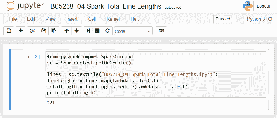

# 另一个 MapReduce 示例

我们可以在另一个示例中使用 MapReduce，从文件中获取单词计数。这是一个标准问题，但我们使用 MapReduce 来完成大部分繁重的工作。我们可以使用此示例的源代码。我们可以使用类似这样的脚本来计算文件中单词的出现次数：

```py
import pyspark
if not 'sc' in globals():
 sc = pyspark.SparkContext()

text_file = sc.textFile("Spark File Words.ipynb")
counts = text_file.flatMap(lambda line: line.split(" ")) \
 .map(lambda word: (word, 1)) \
 .reduceByKey(lambda a, b: a + b)
for x in counts.collect():
 print x  
```

我们有相同的代码前言。

然后我们将文本文件加载到内存中。

`text_file` 是一个 Spark **RDD**（**弹性分布式数据集**），而不是数据框。

假设文件是巨大的，且内容分布在多个处理程序中。

一旦文件加载完成，我们将每行拆分成单词，然后使用 `lambda` 函数标记每个单词的出现。代码实际上为每个单词出现创建了一个新记录，例如 *at appears 1*，*at appears 1*。例如，如果单词 *at* 出现了两次，每次出现都会添加一个记录，像 *at* *appears 1*。这个想法是暂时不聚合结果，只记录我们看到的出现情况。这个过程可以被多个处理器分担，每个处理器生成这些低级信息。我们并不关心优化这个过程。

一旦我们拥有所有这些记录，我们就根据提到的单词出现次数来减少/汇总记录集。

`counts` 对象在 Spark 中也是 RDD。最后的 `for` 循环会对 RDD 执行 `collect()`。如前所述，这个 RDD 可能分布在多个节点上。`collect()` 函数会将 RDD 的所有副本拉到一个位置。然后我们遍历每条记录。

当我们在 Jupyter 中运行时，我们会看到类似这样的显示：

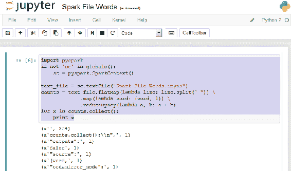

该列表被简化，因为单词列表会继续一段时间。

前面的示例在 Python 3 中效果不佳。直接在 Python 中编写代码时有解决方法，但在 Jupyter 中没有。

# 使用 SparkSession 和 SQL

Spark 提供了许多类似 SQL 的操作，可以对数据框执行。例如，我们可以加载一个包含产品销售信息的 CSV 文件数据框：

```py
from pyspark.sql import SparkSession 
spark = SparkSession(sc) 

df = spark.read.format("csv") \
 .option("header", "true") \
 .load("productsales.csv");
df.show()  
```

示例：

+   启动一个 `SparkSession`（大多数数据访问需要）

+   使用会话读取一个包含头部记录的 CSV 格式文件

+   显示初始行

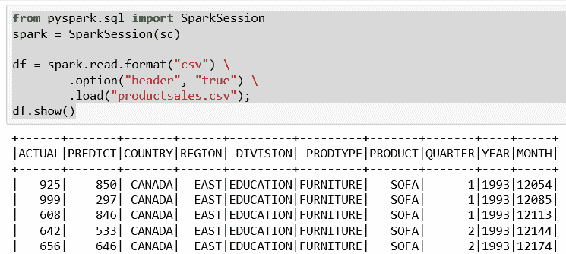

在销售数据中，我们有一些有趣的列：

+   按部门划分的产品实际销售额

+   按部门划分的产品预测销售额

如果这是一个更大的文件，我们可以使用 SQL 来确定产品列表的范围。接下来是用 Spark SQL 确定产品列表的代码：

```py
df.groupBy("PRODUCT").count().show()  
```

数据框的`groupBy`函数与 SQL 中的`Group By`子句非常相似。`Group By`根据指定列中的值将数据集中的项目进行分组。在本例中是`PRODUCT`列。`Group By`的结果是生成一个包含结果的数据集。作为数据集，我们可以使用`count()`函数查询每个组中的行数。

所以，`groupBy`的结果是对应分组元素的项目数量。例如，我们按`CHAIR`分组，发现有 288 个这样的项目：

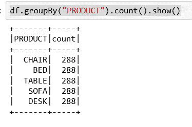

所以，显然我们没有真实的产品数据。任何公司不太可能在每个产品线中有完全相同数量的产品。

我们可以查看数据集，以使用`filter()`命令查看不同部门在实际销售与预测销售方面的表现，示例如下：

```py
df.filter(df['ACTUAL'] > df['PREDICT']).show()  
```

我们将一个逻辑测试传递给`filter`命令，该命令将在数据集的每一行上执行。如果该行数据通过测试，则返回该行；否则，该行会被从结果中删除。

我们的测试只关心实际销售额超过预测值的情况。

在 Jupyter 下，显示如下：

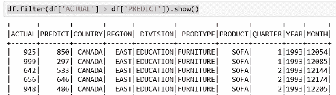

因此，我们得到了一个缩小的结果集。再次强调，这个结果是由`filter`函数生成的一个数据框，并可以像其他数据框一样调用`show`。注意，之前显示的第三条记录不再出现，因为它的实际销售额低于预测值。通常，做一个快速调查是个好主意，以确保得到正确的结果。

如果我们想进一步追踪，找出公司内表现最佳的区域该怎么办？

如果这是一个数据库表格，我们可以创建另一列，存储实际销售与预测销售之间的差异，然后根据这一列对结果进行排序。在 Spark 中我们可以执行类似的操作。

使用数据框，我们可以用类似这样的代码：

```py
#register dataframe as temporary SQL table
df.createOrReplaceTempView("sales")
# pull the values by the difference calculated
sqlDF = spark.sql("SELECT *, ACTUAL-PREDICT as DIFF FROM sales ORDER BY DIFF desc")
sqlDF.show()  
```

第一条语句是在当前上下文中创建一个视图/数据框，以便进一步操作。此视图是惰性计算的，除非采取特定步骤，否则不会持久化，最重要的是，可以作为 Hive 视图访问。该视图可以直接通过`SparkContext`访问。

然后，我们使用创建的新销售视图创建一个新的数据框，并计算新的列。 在 Jupyter 下，显示如下：

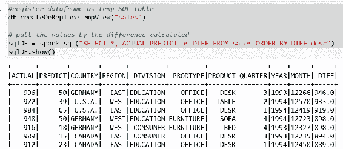

再次，我认为我们没有现实的值，因为差异与预测值相差甚远。

创建的数据框是不可变的，不像数据库表。

# 合并数据集

所以，我们已经看到将数据框移动到 Spark 进行分析。这看起来非常接近 SQL 表。在 SQL 中，标准做法是不在不同的表中重复项。例如，产品表可能会有价格，订单表只会通过产品标识符引用产品表，以避免重复数据。因此，另一个 SQL 做法是将表连接或合并，以便获得完整的所需信息。继续使用订单的类比，我们将所有涉及的表合并，因为每个表都有订单完成所需的数据。

创建一组表并使用 Spark 连接它们会有多难？我们将使用 `Product`、`Order` 和 `ProductOrder` 示例表：

| **表格** | **列** |
| --- | --- |
| 产品 | 产品 ID, 描述, 价格 |
| 订单 | 订单 ID, 订单日期 |
| 产品订单 | 订单 ID, 产品 ID, 数量 |

所以，一个 `Order` 关联有一组 `Product`/`Quantity` 值。

我们可以填充数据框并将它们移入 Spark：

```py
from pyspark import SparkContext
from pyspark.sql import SparkSession

sc = SparkContext.getOrCreate()
spark = SparkSession(sc) 

# load product set
productDF = spark.read.format("csv") \
 .option("header", "true") \
 .load("product.csv");
productDF.show()
productDF.createOrReplaceTempView("product")

# load order set
orderDF = spark.read.format("csv") \
 .option("header", "true") \
 .load("order.csv");
orderDF.show()
orderDF.createOrReplaceTempView("order")

# load order/product set
orderproductDF = spark.read.format("csv") \
 .option("header", "true") \
 .load("orderproduct.csv");
orderproductDF.show()
orderproductDF.createOrReplaceTempView("orderproduct")  
```

现在，我们可以尝试在它们之间执行类似 SQL 的 `JOIN` 操作：

```py
# join the tables
joinedDF = spark.sql("SELECT * " \
 "FROM orderproduct " \
 "JOIN order ON order.orderid = orderproduct.orderid " \
 "ORDER BY order.orderid")
joinedDF.show()  
```

在 Jupyter 中执行这些操作的结果如下所示：

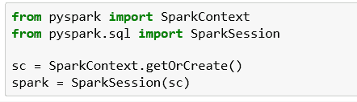

我们的标准导入获取了一个 `SparkContext` 并初始化了一个 `SparkSession`。注意 `SparkContext` 的 `getOrCreate` 方法。如果你在 Jupyter 外运行这段代码，则没有上下文，会创建一个新的上下文。在 Jupyter 中，Spark 启动时会为所有脚本初始化一个上下文。我们可以在任何 Spark 脚本中使用该上下文，而不必自己创建一个。

加载我们的 `product` 表：

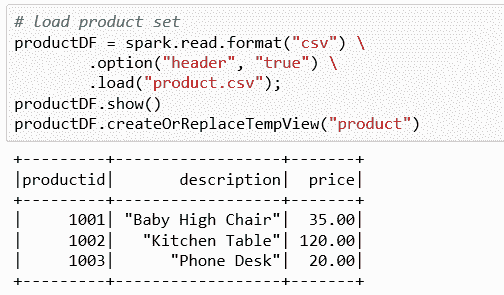

加载 `order` 表：

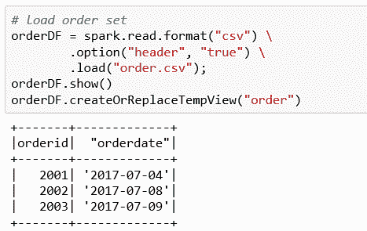

加载 `orderproduct` 表。请注意，至少有一个订单包含多个产品：

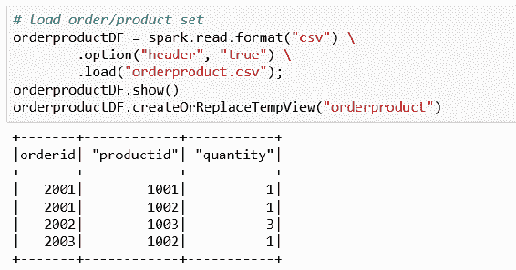

我们在结果集中有来自 `order` 和 `orderproduct` 的 `orderid` 列。我们可以在查询中进行更精确的筛选，指定我们想要返回的确切列：

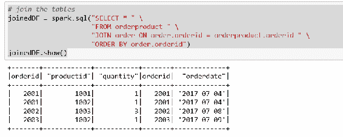

我曾尝试使用 Spark 的 `join()` 命令，但未能成功。

我在网上找到的文档和示例都是过时、稀疏且不正确的。

使用该命令也显示了一个持续的错误，即任务没有及时返回结果。从底层的 Hadoop 看，我预计处理任务通常会被拆分为独立的任务。我猜 Spark 也会类似地将函数拆分到不同的线程中去完成。为什么这些小任务没有完成并不清楚，因为我并没有要求它执行任何超常的操作。

# 将 JSON 加载到 Spark 中

Spark 还可以访问 JSON 数据进行操作。这里我们有一个示例：

+   将 JSON 文件加载到 Spark 数据框中

+   检查数据框的内容并显示其明显的模式

+   与前面提到的其他数据框一样，将数据框移入上下文以便 Spark 会话可以直接访问

+   显示一个在 Spark 上下文中访问数据框的示例

列表如下：

我们的标准包括 Spark 的内容：

```py
from pyspark import SparkContext
from pyspark.sql import SparkSession 
sc = SparkContext.getOrCreate()
spark = SparkSession(sc)  
```

读取 JSON 并显示我们找到的内容：

```py
#using some data from file from https://gist.github.com/marktyers/678711152b8dd33f6346
df = spark.read.json("people.json")
df.show()  
```

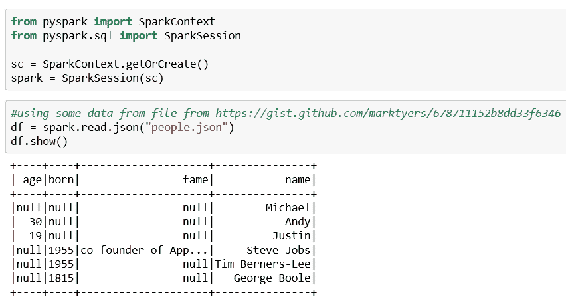

我在将标准 JSON 加载到 Spark 中时遇到了一些困难。Spark 似乎期望 JSON 文件中的每个列表记录都是一条数据记录，而我所见的许多 JSON 文件格式将记录布局进行缩进等处理。

注意使用了 null 值，表示某个实例未指定属性。

显示数据的解释模式：

```py
df.printSchema()  
```

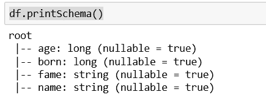

所有列的默认值为`nullable`。你可以更改列的属性，但不能更改列的值，因为数据值是不可变的。

将数据框移入上下文并从中访问：

```py
df.registerTempTable("people")
spark.sql("select name from people").show()  
```

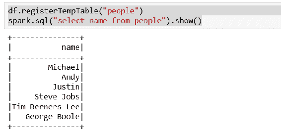

此时，`people`表像 Spark 中的任何其他临时 SQL 表一样工作。

# 使用 Spark 透视表

`pivot()`函数允许你将行转换为列，同时对某些列执行聚合操作。如果你仔细想想，这就像是围绕一个支点调整表格的坐标轴。

我想到了一个简单的例子来展示这一切是如何工作的。我认为这是一项功能，一旦你看到它的实际应用，就会意识到可以在很多地方应用它。

在我们的示例中，我们有一些原始的股票价格数据，我们希望通过透视表将其转换，按股票每年生成平均价格。

我们示例中的代码是：

```py
from pyspark import SparkContext
from pyspark.sql import SparkSession
from pyspark.sql import functions as func

sc = SparkContext.getOrCreate()
spark = SparkSession(sc)

# load product set
pivotDF = spark.read.format("csv") \
 .option("header", "true") \
 .load("pivot.csv");
pivotDF.show()
pivotDF.createOrReplaceTempView("pivot")

# pivot data per the year to get average prices per stock per year
pivotDF \
 .groupBy("stock") \
 .pivot("year",[2012,2013]) \
 .agg(func.avg("price")) \
 .show()  
```

在 Jupyter 中的展示如下：

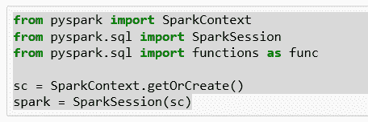

所有标准包括我们需要的内容，以便 Spark 初始化`SparkContext`和`SparkSession`：

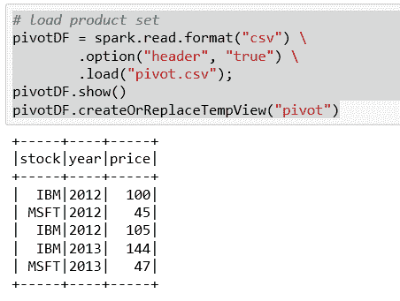

我们从 CSV 文件加载股票价格信息。重要的是，至少有一只股票在同一年份有多个价格：

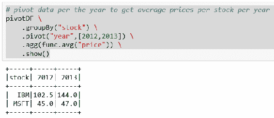

我们按股票符号对信息进行分组。透视表基于数据集中包含两个值的年份——2012 年和 2013 年。我们正在计算每年每只股票的平均价格。

# 总结

在本章中，我们熟悉了如何获取`SparkContext`。我们看到了使用 Hadoop MapReduce 的示例。我们用 Spark 数据进行了 SQL 操作。我们结合了数据框，并对结果集进行了操作。我们导入了 JSON 数据并用 Spark 进行了处理。最后，我们查看了如何使用透视表来汇总数据框的信息。

在下一章，我们将学习如何在 Jupyter 中使用 R 编程。
