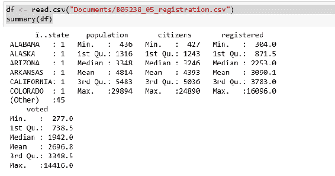
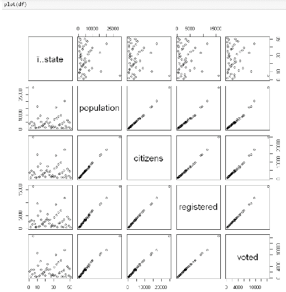

# 第五章：R 与 Jupyter

在本章中，我们将使用 R 语言代码在 Jupyter 中进行编程。我认为 R 是 Jupyter 中预期使用的主要语言之一。Jupyter 用户可以使用 R 的完整功能。

# 如何为 Jupyter 设置 R

过去，必须安装 Jupyter、Python 等的独立组件才能构建一个工作系统。但使用 Continuum Analytics 后，安装 Jupyter 并将 R 引擎添加到 Jupyter 的解决方案集中的过程变得非常简单，并且支持 Windows 和 Mac 系统。

假设你已经安装了 conda，我们只需要一个命令就能为 Jupyter 添加对 R 编程的支持：

```py
conda install -c r r-essentials  
```

此时，当你启动 Jupyter 时，列出的内核中将会有 R。

# 2016 年美国选举人口统计数据分析

为了了解 R 开发者可用的资源，我们可以查看 2016 年的选举数据。在这个案例中，我引用了维基百科的资料([`en.wikipedia.org/wiki/United_States_presidential_election,_2016`](https://en.wikipedia.org/wiki/United_States_presidential_election,_2016))，特别是名为“2016 年各人口子群体的总统选举投票”表格。以下是我们编写的代码：

定义一个辅助函数，以便我们可以轻松地打印出值。新的`printf`函数接受传入的任何参数`(...)`并将其传递给`sprintf`：

```py
printf <- function(...)print(sprintf(...))  
```

我已将不同的人口统计统计数据存储在不同的**TSV**（**制表符分隔值**）文件中，可以使用以下代码读取。对于每个表格，我们使用`read.csv`函数，并将字段分隔符指定为制表符，而不是默认的逗号。然后，我们使用`head`函数显示有关已加载数据框的信息：

```py
age <- read.csv("Documents/B05238_05_age.tsv", sep="\t")
head(age)

education <- read.csv("Documents/B05238_05_education.tsv", sep="\t")
head(education)

gender <- read.csv("Documents/B05238_05_gender.tsv", sep="\t")
head(gender)

ideology <- read.csv("Documents/B05238_05_ideology.tsv", sep="\t")
head(ideology)

income <- read.csv("Documents/B05238_05_income.tsv", sep="\t")
head(income)

orientation <- read.csv("Documents/B05238_05_orientation.tsv", sep="\t")
head(orientation)

party <- read.csv("Documents/B05238_05_party.tsv", sep="\t")
head(party)

race <- read.csv("Documents/B05238_05_race.tsv", sep="\t")
head(race)

region <- read.csv("Documents/B05238_05_region.tsv", sep="\t")
head(region)

religion <- read.csv("Documents/B05238_05_religion.tsv", sep="\t")
head(religion)  
```

顶部显示了各列的名称。每一行显示该行的各列值。每次`read`操作的结果如下所示：


现在，我们可以找出每个投票率的主导特征：

```py
printf("Most Clinton voters from %s",age[which.max(age$Clinton),'age'])
printf("Most Clinton voters from %s",education[which.max(education$Clinton),'education'])
printf("Most Clinton voters from %s",gender[which.max(gender$Clinton),'gender'])
printf("Most Clinton voters from %s",ideology[which.max(ideology$Clinton),'ideology'])
printf("Most Clinton voters from %s",income[which.max(income$Clinton),'income'])
printf("Most Clinton voters from %s",orientation[which.max(orientation$Clinton),'orientation'])
printf("Most Clinton voters from %s",party[which.max(party$Clinton),'party'])
printf("Most Clinton voters from %s",race[which.max(race$Clinton),'race'])
printf("Most Clinton voters from %s",region[which.max(region$Clinton),'region'])
printf("Most Clinton voters from %s",religion[which.max(religion$Clinton),'religion'])

printf("Most Trump voters from %s",age[which.max(age$Trump),'age'])
printf("Most Trump voters from %s",education[which.max(education$Trump),'education'])
printf("Most Trump voters from %s",gender[which.max(gender$Trump),'gender'])
printf("Most Trump voters from %s",ideology[which.max(ideology$Trump),'ideology'])
printf("Most Trump voters from %s",income[which.max(income$Trump),'income'])
printf("Most Trump voters from %s",orientation[which.max(orientation$Trump),'orientation'])
printf("Most Trump voters from %s",party[which.max(party$Trump),'party'])
printf("Most Trump voters from %s",race[which.max(race$Trump),'race'])
printf("Most Trump voters from %s",region[which.max(region$Trump),'region'])
printf("Most Trump voters from %s",religion[which.max(religion$Trump),'religion'])  
```

克林顿的结果如下：


特朗普的结果如下：


有趣的是，支持两位候选人的主要群体之间没有重叠。我认为各党派故意针对不同的群体，以避免重叠。一定有一套花钱的指南，通过广告向已知的、感兴趣的群体宣传，而不是争夺那些模糊不清的人口群体。

# 分析 2016 年选民登记与投票情况

同样，我们可以查看选民登记与实际投票（使用来自[`www.census.gov/data/tables/time-series/demo/voting-and-registration/p20-580.html`](https://www.census.gov/data/tables/time-series/demo/voting-and-registration/p20-580.html)的普查数据）。

首先，我们加载数据集并显示头部信息，以便直观地检查加载是否准确：

```py
df <- read.csv("Documents/B05238_05_registration.csv")
summary(df)  
```



因此，我们有一些按州分类的注册和投票信息。使用 R 自动使用`plot`命令以*x*和*y*格式绘制所有数据：

```py
plot(df)  
```

我们特别关注注册选民与实际投票之间的关系。我们可以从以下图表中看到，大多数数据高度相关（如大多数关系的 45 度角所示）：



我们可以使用 Python 产生类似的结果，但图形显示却相差甚远。

导入我们用于示例的所有包：

```py
from numpy import corrcoef, sum, log, arange from numpy.random import rand from pylab import pcolor, show, colorbar, xticks, yticks import pandas as pd import matplotlib from matplotlib import pyplot as plt 
```

在 Python 中读取 CSV 文件非常类似。我们调用 pandas 来读取文件：

```py
df 
```

如果数据框中存在字符串数据，pandas 将抛出错误，因此只需删除该列（带有州名）：

```py
del df['state'] #pandas do not deal well with strings 
```

一个近似的 Python 函数是`corr()`函数，它打印出数据框中所有交叉相关项的数值。你需要扫描数据，寻找接近`1.0`的相关值：

```py
#print cross-correlation matrix print(df.corr()) 
```

类似地，我们有`corrcoef()`函数，它为数据框中类似相关的项提供颜色强度。我没有找到标记相关项的方法：

```py
#graph same fig = plt.gcf() fig.set_size_inches(10, 10)
# plotting the correlation matrix R = corrcoef(df) pcolor(R) colorbar() yticks(arange(0.5,10.5),range(0,10)) xticks(arange(0.5,10.5),range(0,10)) show()
```


我们希望看到注册和投票之间的实际数值相关性。我们可以通过调用`cor`函数传入两个感兴趣的数据点来做到这一点，如下所示：

```py
cor(df$voted,df$registered)
0.998946393424037
```

实际的相关值可能因机器类型而异。这会对后续数值产生影响。

由于相关性达到 99%，我们几乎完美。

我们可以使用数据点来得出回归线，使用`lm`函数，其中我们说明*lm(y ~ (predicted by) x)*：

```py
fit <- lm(df$voted ~ df$registered)
fit
Call:
lm(formula = df$voted ~ df$registered)

Coefficients:
 (Intercept)  df$registered 
 -4.1690         0.8741  
```

根据注册数，我们将其乘以 87%并减去 4 以获取实际选民人数。再次强调，数据是相关的。

我们可以通过调用`plot`函数并传入`fit`对象来显示回归线的特征（`par`函数用于布局输出，本例中为 2x2 矩阵样式的四个图形）：

```py
par(mfrow=c(2,2))
plot(fit)  
```


然后，在 2x2 显示的第二部分中，我们有这两个图形：


从前述图表中我们可以看到以下内容：

+   残差值在非常大的数值之前接近于零。

+   大部分范围的理论量化与标准化残差非常匹配。

+   拟合值与标准化残差相比我预期的不是那么接近。

+   标准化残差与杠杆的关系显示出大多数数值之间的紧密配置。

总体而言，我们对数据仍然有一个非常好的模型。我们可以通过调用`residuals`函数查看回归的残差如何：


```py
... (for all 50 states)  
```

残差值比我预期的要大，对于如此高度相关的数据，我本以为会看到非常小的数字，而不是数百的值。

一如既往，我们展示我们得到的模型摘要：

```py
summary(fit)
Call:
lm(formula = df$voted ~ df$registered)

Residuals:
 Min      1Q  Median      3Q     Max 
-617.33  -29.69    0.83   30.70  351.27 

Coefficients:
 Estimate Std. Error t value Pr(>|t|) 
(Intercept)   -4.169018  25.201730  -0.165    0.869 
df$registered  0.874062   0.005736 152.370   <2e-16 ***
---
Signif. codes:  0 '***' 0.001 '**' 0.01 '*' 0.05 '.' 0.1 ' ' 1

Residual standard error: 127.9 on 49 degrees of freedom
Multiple R-squared:  0.9979,  Adjusted R-squared:  0.9979 
F-statistic: 2.322e+04 on 1 and 49 DF,  p-value: < 2.2e-16  
```

你可能会看到不同的结果，具体取决于你运行脚本的机器类型。

在此展示的模型中有许多数据点：

+   再次，残差值显示出相当大的范围。

+   系数与我们之前看到的相同，但截距的标准误差较高。

+   预期 R 平方接近 1。

+   *p*值最小是预期的。

我们也可以使用 Python 来得出线性回归模型：

```py
import numpy as np
import statsmodels.formula.api as sm

model = sm.ols(formula='voted ~ registered', data=df)
fitted = model.fit()
print (fitted.summary())  
```

我们看到回归结果呈标准格式如下：


警告信息提示数据中存在一些问题：

+   我们直接使用协方差矩阵，因此不清楚如果要以其他方式指定该矩阵该怎么做。

+   我想数据中可能存在较强的多重共线性，因为数据只有这两个项。

我们还可以使用 Python 脚本绘制实际值与拟合值的对比图：

```py
plt.plot(df['voted'], df['registered'], 'ro')
plt.plot(df['voted'], fitted.fittedvalues, 'b')
plt.legend(['Data', 'Fitted model'])
plt.xlabel('Voted')
plt.ylabel('Registered')
plt.title('Voted vs Registered')
plt.show()  
```


我觉得我更喜欢 Python 版本的图表，而不是 R 的显示。左下角添加的强度圆圈让我感到困惑。

# 分析大学招生变化

我们可以查看近几年大学录取率的趋势。为此分析，我使用了[`www.ivywise.com/ivywise-knowledgebase/admission-statistics`](https://www.ivywise.com/ivywise-knowledgebase/admission-statistics)上的数据。

首先，我们读取数据集并显示摘要信息，从头部数据验证：

```py
df <- read.csv("Documents/acceptance-rates.csv")
summary(df)
head(df)  
```

我们看到学校录取率的摘要数据如下：


有趣的是，录取率差异如此之大，从 2017 年的 5%低点到 41%的高点。

让我们再次查看数据图，以验证数据点是否正确：

```py
plot(df)  
```


从相关性图表来看，似乎无法使用 2007 年的数据点。图表显示 2007 年与其他年份之间存在较大的差异，而其他三年的相关性较好。

所以，我们有来自 25 所美国主要大学的连续 3 年数据。我们可以通过几个步骤将数据转换为时间序列。

首先，我们创建一个包含 2015 至 2017 年期间这些高校平均接受率的向量。我们使用均值函数来确定数据框中所有高校的平均值。数据框中有一些`NA`值，因此我们需要告诉均值函数忽略这些值（`na.rm=TRUE`）：

```py
myvector <- c(mean(df[["X2015"]],na.rm=TRUE),
 mean(df[["X2016"]],na.rm=TRUE),
 mean(df[["X2017"]],na.rm=TRUE))  
```

接下来，我们将该向量转换为时间序列。时间序列通过传入向量来使用起始和结束点，以及数据点的频率。在我们的例子中，频率是每年一次，所以`frequency = 1`：

```py
ts <- ts(myvector, start=c(2015), end=c(2017), frequency=1)  
```

然后绘制时间序列，以获得一个好的可视化效果：

```py
plot(ts)  
```


因此，明显的趋势是全面降低接受率，正如我们看到的，初始接受率为`.15`，在 2017 年稳步下降至`.14`。

数据看起来非常好，非常合适，因为数据点排列整齐。我们可以使用这个时间序列来预测未来几年。Holt-Winters 算法的版本可以基于级别数据、级别数据加上趋势分量以及级别数据加上趋势分量和季节性分量进行预测。我们有一个趋势，但没有季节性：

```py
# double exponential - models level and trend
fit <- HoltWinters(ts, gamma=FALSE)
fit
Holt-Winters exponential smoothing with trend and without seasonal component.

Call:
HoltWinters(x = ts, gamma = FALSE)

Smoothing parameters:
 alpha: 0.3
 beta : 0.1
 gamma: FALSE

Coefficients:
 [,1]
a  0.14495402
b -0.00415977  
```

我们的指数平滑系数为七分之一，接近零意味着我们并没有大幅降低录取率，但它们正在下降。

现在我们有了现有数据的良好时间序列模型，我们可以预测未来三年的数据并绘制出来：

```py
install.packages("forecast", repos="http://cran.us.r-project.org")
library(forecast)
forecast(fit, 3)
plot(forecast(fit, 3))  
```


趋势显然是负面的，但如前所述，这不是一个急剧的下降，大约每年下降半个百分点。我们还可以查看 Python 的类似编码，如下所示。导入我们将使用的所有 Python 包：

```py
import pandas as pd
import numpy as np
import matplotlib.pylab as plt
%matplotlib inline
from matplotlib.pylab import rcParams
rcParams['figure.figsize'] = 15, 6  
```

将大学录取数据读入数据框架：

```py
data = pd.read_csv('Documents/acceptance-rates.csv')
print (data.head())
 School  2017  2016  2015  2007
0      Amherst College   NaN  0.14  0.14  0.18
1       Boston College  0.32  0.32  0.28  0.27
2     Brown University  0.08  0.09  0.09  0.15
3  Columbia University  0.06  0.06  0.06  0.12
4   Cornell University  0.13  0.14  0.15  0.21  
```

删除`School`列，因为 Python 无法从字符串中计算：

```py
del data['School']
print (data.head())
 2017  2016  2015  2007
0   NaN  0.14  0.14  0.18
1  0.32  0.32  0.28  0.27
2  0.08  0.09  0.09  0.15
3  0.06  0.06  0.06  0.12
4  0.13  0.14  0.15  0.21  
```

按年份将数据转换为集合：

```py
data = data.transpose()
print (data.head())
```

我们看到数据集转置为我们期望的形状如下：


查看数据的样子：

```py
plt.plot(data);  
```


我们看到相同的录取率略微下降趋势。

在 Python 中使用 Holt-Winters 预测存在问题，因为它需要进一步转换数据。总体而言，在前一节中 R 中的相同处理变得更加复杂。

# 预测飞机到达时间

R 具有内置功能，可以在训练集和测试集之间拆分数据框架，基于训练集构建模型，使用模型和测试集预测结果，然后可视化模型的工作效果。

对于这个例子，我使用了 2008 年从[`stat-computing.org/dataexpo/2009/the-data.html`](http://stat-computing.org/dataexpo/2009/the-data.html)获取的航空公司到达和出发时间与预定到达和出发时间。数据集分发为`.bz2`文件，解压后为 CSV 文件。我喜欢这个数据集，因为初始行数超过 700 万，并且在 Jupyter 中运行得非常顺利。

我们首先读取飞机数据并显示摘要。数据集中还有其他我们没有使用的列：

```py
df <- read.csv("Documents/2008-airplane.csv")
summary(df)
...
CRSElapsedTime      AirTime          ArrDelay          DepDelay 
 Min.   :-141.0   Min.   :   0     Min.   :-519.00   Min.   :-534.00 
 1st Qu.:  80.0   1st Qu.:  55     1st Qu.: -10.00   1st Qu.:  -4.00 
 Median : 110.0   Median :  86     Median :  -2.00   Median :  -1.00 
 Mean   : 128.9   Mean   : 104     Mean   :   8.17   Mean   :   9.97 
 3rd Qu.: 159.0   3rd Qu.: 132     3rd Qu.:  12.00   3rd Qu.:   8.00 
 Max.   :1435.0   Max.   :1350     Max.   :2461.00   Max.   :2467.00 
 NA's   :844      NA's   :154699   NA's   :154699    NA's   :136246 
 Origin             Dest            Distance          TaxiIn 
 ATL    : 414513   ATL    : 414521   Min.   :  11.0   Min.   :  0.00 
 ORD    : 350380   ORD    : 350452   1st Qu.: 325.0   1st Qu.:  4.00 
 DFW    : 281281   DFW    : 281401   Median : 581.0   Median :  6.00 
 DEN    : 241443   DEN    : 241470   Mean   : 726.4   Mean   :  6.86 
 LAX    : 215608   LAX    : 215685   3rd Qu.: 954.0   3rd Qu.:  8.00 
 PHX    : 199408   PHX    : 199416   Max.   :4962.0   Max.   :308.00 
 (Other):5307095   (Other):5306783                    NA's   :151649 
 TaxiOut         Cancelled       CancellationCode    Diverted 
 Min.   :  0.00   Min.   :0.00000    :6872294        Min.   :0.000000 
 1st Qu.: 10.00   1st Qu.:0.00000   A:  54330        1st Qu.:0.000000 
 Median : 14.00   Median :0.00000   B:  54904        Median :0.000000 
 Mean   : 16.45   Mean   :0.01961   C:  28188        Mean   :0.002463 
 3rd Qu.: 19.00   3rd Qu.:0.00000   D:     12        3rd Qu.:0.000000 
 Max.   :429.00   Max.   :1.00000                    Max.   :1.000000 
 NA's   :137058 
 CarrierDelay      WeatherDelay        NASDelay       SecurityDelay 
 Min.   :   0      Min.   :   0      Min.   :   0      Min.   :  0 
 1st Qu.:   0      1st Qu.:   0      1st Qu.:   0      1st Qu.:  0 
 Median :   0      Median :   0      Median :   6      Median :  0 
 Mean   :  16      Mean   :   3      Mean   :  17      Mean   :  0 
 3rd Qu.:  16      3rd Qu.:   0      3rd Qu.:  21      3rd Qu.:  0 
 Max.   :2436      Max.   :1352      Max.   :1357      Max.   :392 
 NA's   :5484993   NA's   :5484993   NA's   :5484993   NA's   :5484993 
 LateAircraftDelay
 Min.   :   0 
 1st Qu.:   0 
 Median :   0 
 Mean   :  21 
 3rd Qu.:  26 
 Max.   :1316 
 NA's   :5484993 
```

许多数据点具有`NA`值。我们需要删除这些值以建立准确的模型：

```py
# eliminate rows with NA values
df <- na.omit(df)
```

让我们创建我们的分区：

```py
# for partitioning to work data has to be ordered
times <- df[order(df$ArrTime),]
nrow(times)
1524735

# partition data - 75% training
library(caret)
set.seed(1337)
trainingIndices <- createDataPartition(df$ArrTime,p=0.75,list=FALSE)
trainingSet <- df[trainingIndices,]
testingSet <- df[-trainingIndices,]
nrow(trainingSet)
nrow(testingSet)
1143553
381182  
```

让我们根据以下字段建立到达时间(`ArrTime`)的模型：

+   `CRSArrTime`: 计划到达时间

+   `ArrDelay`: 到达延误

+   `DepDelay`: 出发延误

+   `Diverted`: 飞机是否使用了转移路线

+   `CarrierDelay`: 航空公司系统的延误

+   `WeatherDelay`：由于天气原因的延误

+   `NASDelay`：由于 NAS 的延误

+   `SecurityDelay`：由于安全原因的延误

+   `LateAircraftDelay`：由于其他延误导致飞机晚点


其中有两个数据项只是标志（0/1），很不幸。最大的预测因素似乎是计划的到达时间。其他各种延误因素的影响较小。我认为这就像是安检或类似的事情多花了额外的 20 分钟；对于旅行者来说，这是件大事。

现在我们有了模型，让我们使用测试集来进行预测：

```py
predicted <- predict(model, newdata=testingSet)
summary(predicted)
summary(testingSet$ArrTime)
 Min. 1st Qu.  Median    Mean 3rd Qu.    Max. 
 -941    1360    1629    1590    1843    2217 
 Min. 1st Qu.  Median    Mean 3rd Qu.    Max. 
 1    1249    1711    1590    2034    2400  
```

绘制预测数据与实际数据的对比图，以评估模型的准确性：

```py
plot(predicted,testingSet$ArrTime)  
```


从视觉上看，预测数据与实际数据非常吻合，几乎呈 45 度线对齐。然而，图表右下角的整组预测点是令人困扰的。似乎有很多预测数据远低于实际值。我认为必定还有其他因素在影响预测结果，因为我本来预期所有数据会聚集在一个区域，而不是分布在两个区域。

# 总结

在本章中，我们首先将 R 设置为可用于笔记本的引擎之一。然后我们使用一些基础的 R 语言分析了总统选举中的选民人口统计数据。我们分析了选民登记与实际投票情况。接下来，我们分析了大学招生趋势。最后，我们研究了使用预测模型来判断航班是否会延误。

在下一章，我们将探讨在 Jupyter 中以不同方式处理数据。
