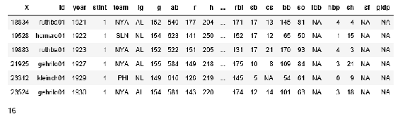
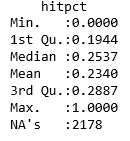
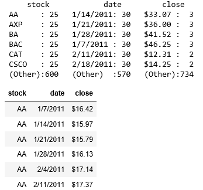

# 第六章：数据清理

在本章中，我们查看了不同形式的数据，并提取了有用的统计信息。用于访问数据的工具已经得到很好的开发，并允许某些记录中缺失标题或数据点。

# 读取 CSV 文件

文件格式的标准之一是 CSV。在本节中，我们将通过读取 CSV 文件并调整数据集的过程，得出一些关于数据的结论。我使用的数据来自加利福尼亚房屋的供暖系统选择数据集，网址为 [`vincentarelbundock.github.io/Rdatasets/datasets.html`](https://vincentarelbundock.github.io/Rdatasets/datasets.html)：

```py
#read in the CSV file as available on the site
heating <- read.csv(file="Documents/heating.csv", header=TRUE, sep=",")
# make sure the data is laid out the way we expect
head(heating)  
```


数据似乎符合预期；然而，许多列有缩写名称，并且有些列内容重复。让我们修改我们感兴趣的名称，使其更易读，并移除我们不打算使用的多余内容：

```py
# change the column names to be more readable
colnames(heating)[colnames(heating)=="depvar"] <- "system"
colnames(heating)[colnames(heating)=="ic.gc"] <- "install_cost"
colnames(heating)[colnames(heating)=="oc.gc"] <- "annual_cost"
colnames(heating)[colnames(heating)=="pb.gc"] <- "ratio_annual_install"

# remove columns which are not used
heating$idcase <- NULL
heating$ic.gr <- NULL
heating$ic.ec <- NULL
heating$ic.hp <- NULL
heating$ic.er <- NULL
heating$oc.gr <- NULL
heating$oc.ec <- NULL
heating$oc.hp <- NULL
heating$oc.er <- NULL
heating$pb.gr <- NULL
heating$pb.ec <- NULL
heating$pb.er <- NULL
heating$pb.hp <- NULL

# check the data layout again now that we have made changes
head(heating)  
```


现在我们有了一个更精简的数据集，让我们开始查看数据：

```py
# get rough statistics on the data
summary(heating)  
```


总结中有几点突出：

+   有五种不同类型的供暖系统，其中以燃气制冷最为普遍

+   成本变化远比预期的要大

+   数据涵盖了加利福尼亚的四个大区域

+   年度成本与初始成本的比率变化远比预期的要大

数据关系并不显而易见，但我们可以使用 R 中的 `plot()` 函数提供一个快速的快照，显示任何重要的内容：

```py
plot(heating)  
```


再次，几个有趣的事实浮现出来：

+   初始成本在不同类型的系统中变化很大

+   年度成本在不同类型的系统中也有所不同

+   成本在客户收入、年龄、房屋房间数和地区范围内变化很大

变量之间唯一的直接关系似乎是系统的初始成本和年度成本。通过协方差，我们可以衡量两个变量之间如何相互变化。如果我们对安装成本和年度成本进行协方差分析，我们得到：

```py
cov(heating$install_cost, heating$annual_cost) 
2131  
```

我不确定我是否见过更高的协方差结果。

# 读取另一个 CSV 文件

我们可以查看同一数据集中的另一个 CSV 文件，看看我们会遇到什么问题。使用我们之前从同一网站下载的所有大联盟棒球运动员的年度击球记录，我们可以使用类似以下的代码开始分析数据：

```py
players <- read.csv(file="Documents/baseball.csv", header=TRUE, sep=",")head(players) 
```

这会生成以下的表头显示：


这个数据集中包含了很多棒球运动员的统计数据。也有很多 `NA` 值。R 对 `NA` 值的处理非常好。让我们首先使用以下方法查看数据的统计信息：

```py
summary(players)
```

这会生成所有相关字段的统计数据（还有一些未在此显示的字段）：


在之前的显示中有一些有趣的点，值得注意：

+   每个球员大约有 30 个数据点

+   有趣的是，球员数据追溯到 1871 年

+   每支队伍大约有 1,000 个数据点

+   美国联赛和国家联赛显然更受欢迎

+   一些数据点的范围令人惊讶：

    +   打击数范围从 0 到 700

    +   跑垒数（r）范围从 0 到 177

    +   击球数（h）范围从 0 到 257

如果我们只绘制一些主导性数据点，我们可以看到如下内容：

```py
plot(players$h, type="l", col="blue")
# doubles lines(players$X2b, type="l", col="yellow")
# home runs lines(players$hr, type="l", col="green")
# triples lines(players$X3b, type="l", col="red")
# Create a title with a red, bold/italic font title(main="Hits", font.main=4)#, xlab="Players", ylab="Hits and Home Runs")
```

统计图按此顺序显示，以避免较小的值被较大的值覆盖（例如，击球数（最大数字）首先显示，而三垒打（最小数字）最后显示在先前数字的上方）。

我们显示了球员随时间变化的击球类型，如下所示。


我觉得很有趣的是，三垒打如此少见。而且，由于数据的组织方式是按时间顺序的，三垒打的数量已经有一段时间在减少。也许现在更注重击球员争取本垒打，而不是击三垒打。

# 使用 `dplyr` 操作数据

R 的 `dplyr` 包被描述为一个提供数据操作语法的包。它具备你期望的所有数据框操作入口，整合在一个包中。我们将使用 `dplyr` 包处理本章前面使用的棒球选手统计数据。

我们读取球员数据并显示前几行：

```py
players <- read.csv(file="Documents/baseball.csv", header=TRUE, sep=",") head(players)
```


我们将使用 `dplyr` 包，因此我们需要将该包导入我们的笔记本：

```py
library(dplyr)
```

# 将数据框转换为 `dplyr` 表

`dplyr` 包有函数可以将数据对象转换为 `dplyr` 表。`dplyr` 表以紧凑的格式存储数据，使用的内存远小于普通数据框。大多数其他 `dplyr` 函数也可以直接在该表上操作。

我们可以通过以下方式将数据框转换为表：

```py
playerst <- tbl_df(players) playerst  
```

这将导致一个非常相似的显示模式：


# 快速了解数据值范围

`dplyr` 还有一个可用的函数是 `glimpse()`。它会显示每一列的值范围。我们可以按以下方式使用该函数：

```py
glimpse(playerst)  
```

这有如下显示效果：


我喜欢这个方法，除了 `summary`/`head` 的显示方式，它能让你感知涉及的变量，而不是涉及的行，实际上是倒转了数据集。

# 抽样数据集

`dplyr` 包有一个函数可以从数据集中抽取样本，`sample()`。你传入数据集和你想要抽取的样本数量，`sample_n()`，以及样本比例，`sample_frac()`，如下例所示：

```py
data <- sample_n(players, 30) glimpse(data)
```

我们可以看到如下截图中的结果：


注意，结果集中有 30 个观察值，如请求的那样。

# 在数据框中筛选行

我们可以使用的另一个函数是`filter`函数。`filter`函数以数据框作为参数并使用过滤语句。该函数在数据框的每一行上运行，并返回满足过滤语句的行：

```py
#filter only players with over 200 hits in a season over200 <- filter(players, h > 200) head(over200) nrow(over200)
```


看起来很多球员每赛季都能达到 200 次击球。如果我们看看那些在赛季中还能超过 40 次本垒打的球员呢？

```py
over200and40hr <- filter(players, h > 200 & hr > 40) head(over200and40hr) nrow(over200and40hr)
```



这是一个非常小的清单。我知道球员的名字有些混乱，但你可以认出一些，比如贝贝·卢斯（Babe Ruth）。

我想知道有没有球员在一个赛季中击中超过 300 次。

```py
filter(players, h > 300)
```


有趣的是，没有记录符合我们的`filter`条件，但结果处理程序需要一些列，并抛出错误，因为在这种情况下没有列。通常，R 中的错误是由于编程错误造成的。R 很少因我认为正常的无结果数据而生成错误。

# 向数据框添加列

`mutate`函数可以使用您在其他地方看到过的熟悉的 R 编程语法向数据框添加列。在本例中，我们正在向数据框添加一个列，该列显示球员上场击中的百分比：

```py
pct <- mutate(players, hitpct = h / ab) head(pct)
```


你可以在上面的显示中看到右侧的新列。如果我们运行`summary`，我们将得到所有字段（包括新的`hitpct`）的汇总：

```py
summary(pct)
```



最大值为`1.0`，这意味着一些球员每次上场都能击中。同样地，那些值为`0.0`的球员从未击中。看起来在 20%范围内有一个狭窄的区间。假设`1.0`表示一次上场一次击中，因为所有其他值都是用多个小数点来衡量的。

# 在计算字段上获得汇总

我们可以使用`summarize`函数更直接地得到列的汇总值。该函数接受一个数据框和一个计算出的结果。我们可以通过以下脚本看到相同的结果：

```py
summarize(pct, mean(hitpct, na.rm = TRUE))
```


# 在函数之间进行数据传输

我们可以通过*piping*数据在函数之间传递来获得相同的结果。在 R 编程中，使用符号`%>%`来表示管道。它是从`magrittr`包中获取的。管道符号通常被认为是英语中*then*的同义词。例如，R 语句`data %>% function()`意味着获取数据对象，然后将其传递给`function()`，就像我们输入了语句`function(data)`一样。

要使用管道对计算字段进行相同的汇总，我们将编写以下内容（意思是获取`pct`数据集，然后将其管道传递到`summarize`函数，并获取`hitpct`字段并将其管道传递给均值函数）：

```py
library(magrittr) pct %>% summarize(hitpct %>% mean(na.rm = TRUE))
```

# 获得 99%分位数

我们可以使用`quantile()`函数查看 99%分界点的值。使用相同的样本数据，我们可以使用：

```py
quantile(pct$hitpct, probs = 0.99, na.rm = TRUE)
```

这将产生相应的输出：

```py
99%: 0.470588235294118
```

因此，47%的击球率是数据中 99%水平的分界点。考虑到三分之四的百分位数是 28%（如前面的`hitpct`图示），最后四分之一的数据点的表现差异很大——也就是说，确实有一些优秀的棒球选手。

我们可以使用以下方法列出那些在击球率前 25%的球员：

```py
top_players <- filter(pct, hitpct > 0.47) top_players <- top_players[order(top_players$hitpct) , ] head(top_players) nrow(top_players) 198
```

如果球员按击球率降序排列，则会显示出击球率完美的球员，但他们的打击次数都不到 10 次。

我们可以如下查看数据点：


所以，我们在数据集中排名前 25%的有 200 个（`198`）球员，这意味着 1%的球员位于击球表现的前 25%。我没想到数据会如此失衡。

# 获取分组数据的摘要

好的，前面的步骤告诉我们一些关于单个球员的信息。总有一种说法，*X 队*总是比其他队更强。那么如果我们能按团队获得击球率并进行比较呢？

在这个例子中，我们按团队对球员进行分组，然后计算整个团队的平均击球率：

```py
teamhitpct <- summarize(group_by(pct, team), mean(hitpct, na.rm = TRUE)) names(teamhitpct) <- c("team", "hitpct") summary(teamhitpct)
```


那么，历史上最强的队伍是谁呢？我们可以通过队伍的击球率对数据进行排序（`-teamhitpct`子句意味着结果应该按降序排列），方法如下：

```py
teamhitpct <- teamhitpct[order(-teamhitpct$hitpct) , ] head(teamhitpct)
```


我不确定 CNU 队是什么，我猜它是一个早期的芝加哥队。其他队伍可以识别为费城、多伦多和波士顿。

我们可以使用之前为球员击球表现使用过的`quantile`函数，找出排名前几的队伍：

```py
quantile(teamhitpct$hitpct, probs = 0.99) 
```

这将给我们以下结果：

```py
99%: 0.340577141193618
```

与前面的表格相比，我们可以看到只有两个队伍（在 130 个队伍中）位于顶尖表现组（大约是 1%的水平）。

# 使用 tidyr 整理数据

`tidyr`包可用于清理/整理你的数据集。`tidyr`的作用是重新排列你的数据，使其：

+   每一列是一个变量

+   每一行是一个观察值

当你的数据以这种方式排列时，分析起来会容易得多。有很多数据集发布时混合了列和行以及数值。如果你在实际应用中使用这些数据，你就必须根据需要进行调整。

`tidyr`提供了三个函数来清理你的数据：

+   `gather`

+   `separate`

+   `spread`

`gather()`函数将你的数据整理成键值对，类似于 Hadoop 数据库模型。我们使用股票价格在某个日期的标准例子，数据如下：

```py
library(tidyr)
stocks <- data_frame(
 time = as.Date('2017-08-05') + 0:9, X = rnorm(10, 20, 1), #how many numbers, mean, std dev Y = rnorm(10, 20, 2), Z = rnorm(10, 20, 4) )
```

这将生成如下的数据：


每一行都有一个时间戳和当时三个股票的价格。

我们首先使用`gather()`将股票的键值对拆分出来。`gather()`函数与其将处理的数据框、输出列名以及需要忽略的列（`-time`）一起调用。因此，我们可以使用以下方法获得一个包含不同时间、股票和价格的行：

```py
stocksg <- gather(stocks, stock, price, -time) head(stocksg)  
```

这将生成如下的`head()`显示：


`separate()`函数用于拆分同一条目点中的值。

我们将使用来自 UCI 的道琼斯工业价格历史数据（[`archive.ics.uci.edu/ml/datasets/Dow+Jones+Index`](https://archive.ics.uci.edu/ml/datasets/Dow+Jones+Index)）：

```py
dji <- read.csv("Documents/dow_jones_index.data") dj <- dji[,c("stock","date","close")] summary(dj) head(dj)
```

我们只关注`stock`、`date`和`close`列。



因此，我们已经收集了日期数据以开始（如果我们一开始有未整理的数据，我们会使用`gather`函数将其整理到此为止）。

`spread()`函数将从`gather()`函数得到的键值对拆分成多个列。我们使用包含源数据框的日期、作为列的值以及每个日期/列的数据点来调用`spread()`。继续我们的示例，我们可以使用以下方法按日期展开所有证券：

```py
prices <- dj %>% spread(stock, close) summary(prices) head(prices)  
```

这会导致如下的`summary`显示（缩短为仅显示前几个证券）：


它还会产生如下的`head`显示，按日期显示所有证券的价格：


我们还可以通过列出每行股票的所有价格来以类似的方式重新组织数据，使用：

```py
times <- dj %>% spread(date, close) summary(times) head(times)  
```

在这里，我们的行驱动项是股票，列标题是日期值，而每个股票/日期的数据点是该日期证券的收盘价。

从`summary`（简化版）中，我们可以看到以下内容：


以下是显示我们所需格式的`head`示例：


# 摘要

在本章中，我们读取了 CSV 文件并进行了快速数据分析，包括可视化以帮助理解数据。接下来，我们考虑了`dplyr`包中的一些函数，包括绘制数据项范围的概览、对数据集进行采样、筛选数据、使用 mutate 添加列以及生成摘要。在此过程中，我们还开始使用管道操作，便于将一个操作的结果传递到另一个操作中。最后，我们研究了`tidyr`包，通过使用相应的 gather、separate 和 spread 函数，将数据整理成独立的列和观测值。

在下一章中，我们将查看如何在 Jupyter 下生成仪表板。
