# 第七章：Jupyter 仪表盘

仪表盘是一种将多个显示组合在一起用于演示的机制。例如，您可以将来自不同数据的 3 个生产线图形显示在一个屏幕上，放在同一个框架或仪表盘中。通过 Jupyter，我们可以使用许多机制来检索和可视化数据，然后将它们组合成一个演示。

# 可视化已准备好的字形数据

字形是一个符号。在这一部分，我们希望在图表的不同位置显示字形，而不是标准的点，因为字形应该为观众提供更多的视觉信息。通常，数据点的某些属性可以用来将其转化为有用的字形，正如我们将在以下示例中看到的那样。

`ggplot2`包在以多种方式可视化数据时非常有用。`ggplot`被描述为 R 的一个绘图系统。我们将看一个示例，展示全球范围内的火山数据点。我使用了来自[`www.ngdc.noaa.gov/nndc`](https://www.ngdc.noaa.gov/nndc)的国家环境信息中心的数据。我选择了 1964 年后的火山信息。

这生成了一组数据，我将其复制到本地 CSV 文件中：

```py
#read in the CSV file as available as described previously
volcanoes = read.csv("volcanoes.csv")
head(volcanoes)  
```

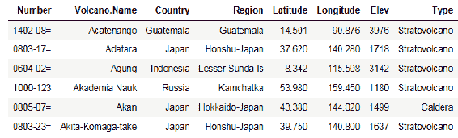

如果我们仅在世界地图上绘制点，就能看到火山的位置。我们使用`mapdata`包来生成地图：

最新的 R 语法要求在`install.packages()`函数调用中指定仓库（或镜像）的地址，以找到包的位置。

```py
#install.packages("mapdata",repos = "http://cran.us.r-project.org")
library(maps)
map("world")
points(volcanoes$Longitude, volcanoes$Latitude, pch=16, col="red", cex=1)  
```

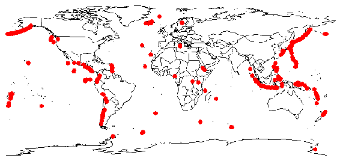

有一些零散的火山，但主要的模式出现在西美洲和东南亚，正好与地壳板块线相对应。

我们可以将一些数据点用作字形，并使用`ggplot2`中的`qplot`（快速绘图）函数以类似的图形展示这些信息：

```py
    library(ggplot2)
    qplot(Longitude, Latitude, data=volcanoes, color=Type, size=Elev, alpha=0.5)

```

这些参数是：

+   `x`，`y`，`经度`和`纬度`

+   我们参考的数据集

+   我们使用颜色来表示火山类型

+   数据点的大小与火山的海拔高度相关

+   设置 alpha 为中间值将绘制半阴影颜色点，以便我们更好地看到重叠部分

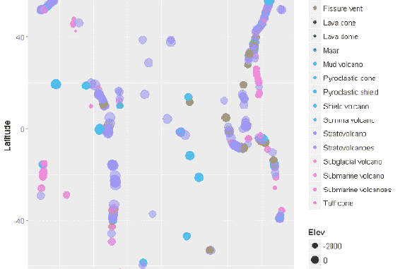

可能有一种方法可以将图形数据叠加在前面的地理地图上。

大多数火山位于海拔超过 2000 英尺的地方。东南亚和南太平洋的火山往往位于水下。

同样，我们可以展示标准的`iris`数据集中的字形数据：

```py
library(ggplot2) 
qplot(Sepal.Length, Petal.Length, data=iris, color=Species, size=Petal.Length)  
```

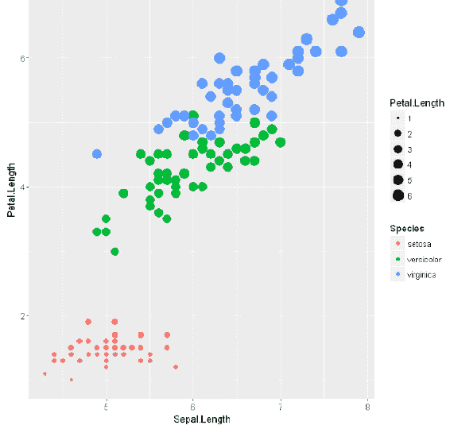

在这个图形中，我们使用了花瓣长度和物种。图形清楚地表明，物种可以通过植物部件的尺寸来确定。

或者，使用内置的钻石数据集，我们可以从字形数据中获取一些信息：

```py
library(ggplot2) 
dsmall <- diamonds[sample(nrow(diamonds), 100), ]

(d <- ggplot(dsmall, aes(carat, price)) + geom_point(aes(shape = cut))) +
scale_shape(solid = FALSE)  
```

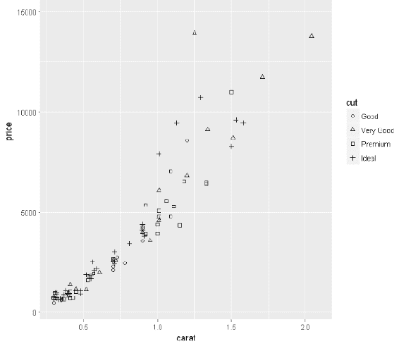

我没想到尺寸（克拉）会是价格的主要决定因素。我知道每个人都听说过切工、净度和颜色会有所不同，但实际数据的图表似乎并没有显示这些因素有任何区别。

我们也可以用类似的方式查看汽车每加仑英里数的数据集：

```py
library(ggplot2) 
ggplot(data=mpg) + 
 geom_point(mapping = aes(x=displ, y=hwy, color=class, size=class))  
```

在这个例子中，我们将美学数据点映射，其中`x`、`y`位置基于发动机排量和高速公路每加仑英里数，但我们还根据车辆类别对数据点进行`颜色`和`大小`的标注。

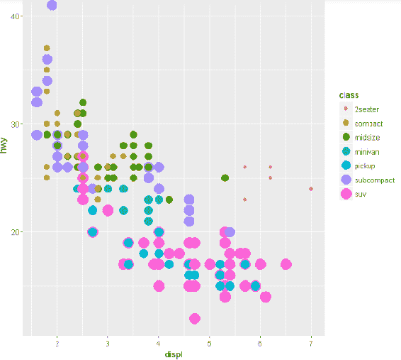

这些符号使其更清晰：

+   无论发动机排量大小如何，SUV 的油耗较低

+   小型和紧凑型车辆的油耗更好

+   有趣的是，发动机尺寸在任何车辆类别中对油耗几乎没有影响

我知道这些是直观的数据点，但使用符号确认信息后，变得更加清晰。

# 发布笔记本

你可以使用 markdown 发布笔记本/仪表盘。Markdown 涉及向笔记本中的单元格添加注释，Jupyter 会将其解释并转换为你在其他已发布材料中看到的更标准的 HTML 表示形式。

在所有情况下，我们创建带有 markdown 类型的单元格。然后，我们在单元格中输入 markdown 的语法。一旦运行 markdown 单元格，单元格的显示会变成有效的 markdown 表示形式。你还应该注意，markdown 单元格没有行号标注，因为 markdown 单元格中没有代码执行。

# 字体 markdown

你可以使用 `斜体` 和 `粗体` HTML 标记调整字体样式。例如，如果我们有如下格式的单元格代码，你可以使用带有斜体（`<i>`）和粗体（`<b>`）标签的 markdown：

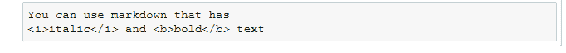

当我们运行单元格时，我们看到有效的 markdown 如下：


# 列表 markdown

我们可以使用以下列表，其中我们开始一个无序列表（我们本可以使用 `nl` 来创建有序列表），并用列表项（`<li>`）标签将两个列表项括起来：

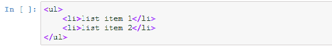

当我们运行这个单元格时，结果的 markdown 会显示如下：


# 标题 markdown

有一组层次化的标题可以使用，就像这个 markdown 示例一样，Jupyter 特别关注使用井号符号 `#` 的标题标记：


奇怪的是，Jupyter 决定特别处理这个 markdown，而不是其他的 markdown。

结果显示如下：


# 表格 markdown

我们可以像在 HTML 中一样生成表格。HTML 表格以 `table` 标签开始。每一行的表格以 `tr` 标签开始。每行中的列以 `td` 标签开始。或者，你可以使用列标题标签 `th` 来代替 `td` 标签。在这个示例中，我们有一个简单的表格 markdown：

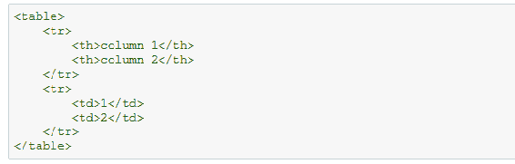

显示结果：


表格默认在 markdown 中居中。我们可以使用更多的 markdown 将表格改为左对齐。我们还可以通过向 `table` 标签添加 `'borders=1'` 来为表格单元格加上边框。注意，列标题默认是加粗的。

# 代码 markdown

有时在展示中展示实际的代码语句是很有用的。我们通过在代码序列前添加三个反引号和语言名称来解释代码的含义。通过在末尾加上三个反引号来关闭代码，如以下示例所示：

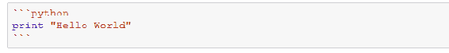

显示的结果对应于语言特定的关键字高亮：


# 更多 markdown

下面是一些额外的 markdown 注释：

+   强调

+   数学符号、几何形状、横线

+   等宽字体

+   换行符

+   缩进

+   颜色（包括背景）

+   图形引用（注意确保这些图形在 markdown 远程部署时仍可访问）

+   内部和外部链接（部署时的相同问题）

# 创建 Shiny 仪表盘

Shiny 是一个用于 R 的 Web 应用框架。它不要求用户编写 HTML 代码。通常有两个代码集：服务器端和 **用户界面**（**UI**）。这两个代码集都运行在 Shiny 服务器上。Shiny 服务器可以托管在你的机器上，或者通过多个托管公司托管在云端。

Shiny 服务器代码集处理数据访问、计算结果、获取用户输入和与其他服务器代码集交互以更改结果。UI 代码集处理展示的布局。

例如，如果你有一个应用程序生成数据的直方图，服务器集会获取数据并生成结果，展示结果，并与用户交互以更改结果——例如，可能会更改显示的数据桶的数量或范围。UI 代码集将严格处理布局。

Shiny 代码不能在 Jupyter 中运行。你可以使用 RStudio 开发代码。RStudio 是一个 **集成开发环境**（**IDE**），用于开发 R 脚本。

使用 RStudio，你可以开发 `server.R` 和 `ui.R` 组件的代码集，然后运行它们。运行一个 Shiny 应用程序将：

+   打开一个新的浏览器窗口

+   使用代码生成相应的 HTML 代码

+   在新的浏览器窗口中显示生成的 HTML

一旦你的应用程序工作正常，你也可以进一步将应用程序部署到互联网上的 R 服务器上，在那里你可以与其他用户分享与你的应用程序相关的 URL。

# R 应用编码

当你启动 RStudio 时，你会看到（希望）熟悉的显示界面。显示界面中有四个主要窗口（从左上角开始顺时针方向）：

+   源代码窗口。在此窗口中，你可以输入特定 R 脚本文件的代码。在源代码窗口中保存文件会更新存储在磁盘上的文件（并且该文件可以在文件窗口中查看）。

+   环境/历史窗口。在这个窗口中，任何已加载的数据集或已建立的变量都会显示出来。

+   文件窗口。在此窗口中，当前的文件集会显示出来（并且可以通过点击文件将其拉入源代码窗口）。

+   执行窗口。在此窗口中，会向 R 服务器发送实际的命令。

对于简单的例子，我们将使用 `server.R` 和 `io.R` 文件，这些文件与 Shiny 网页上的文件非常相似。

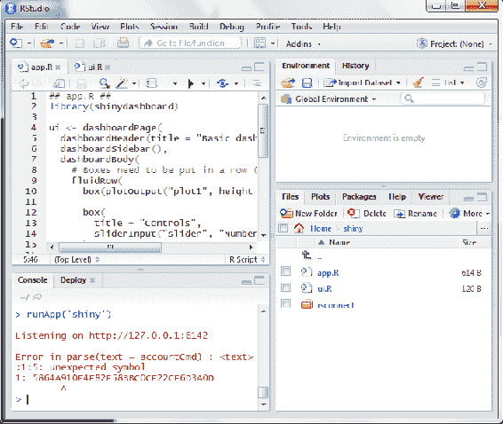

`app.R` 文件包含以下命令：

```py
## app.R ##
# load the shiny dashboard library
library(shinydashboard)
# create a dashboard with title, sidebar and body
ui <- dashboardPage(
 dashboardHeader(title = "Shiny dashboard"),
 dashboardSidebar(),
 dashboardBody(
 fluidRow(
 box(plotOutput("plot1", height = 250)), 
 box(
 title = "Controls",
 sliderInput("slider", "Number of observations:", 1, 100, 50)
 )
 )
 )
)
# when the server is called upon by system, will generate normalized data and plot it
# further, every interaction with the user will rerun this set of code generating new data
server <- function(input, output) {
 set.seed(122)
 histdata <- rnorm(500)
 output$plot1 <- renderPlot({
 data <- histdata[seq_len(input$slider)]
 hist(data)
 })
}
# start the application - this calls upon the browser to get output for display
shinyApp(ui, server)  
```

UI 文件仅设置页面的布局：

```py
library(shinydashboard)
# only calls upon shiny to create a dashboard page with header, sidebar and body
# each of these components is defined in the preceding app.R code.
dashboardPage(
 dashboardHeader(),
 dashboardSidebar(),
 dashboardBody()
)  
```

如果我们在 RStudio 中运行 `app.R` 程序，我们将得到一个如下所示的页面。页面有一个头部区域、侧边栏和主体部分。主体包含显示区域和滑块控制。我们可以通过在源代码窗口中选择 `app.R` 文件，然后点击源代码窗口顶部的“运行应用”按钮来运行应用程序。点击“运行应用”按钮的效果是向控制台窗口输入命令 `runApp('shiny')`（所以你本来也可以自己输入该命令）。一旦应用程序运行，你会在控制台窗口看到类似于“监听 http://127.0.0.1:6142”的消息，这意味着 R 决定将你的应用程序部署到你的机器上。

在新打开的浏览器窗口中，我们可以看到展示的 Shiny 应用程序：

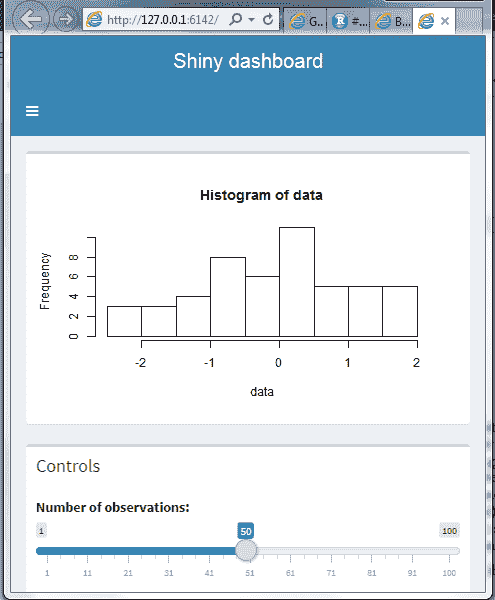

请注意，Shiny 显示是响应式的。响应式网页应用程序会根据窗口物理尺寸的变化调整组件的布局。正如之前的展示一样，你会看到组件按出现的顺序水平排列。当我调整显示的尺寸以适应打印页面时，布局重新组织了。

页面是完全动态的。当你移动滑块时，图形会重新生成。

# 发布你的仪表盘

一旦你对你的仪表盘感到满意，就可以将其发布到互联网上。源代码窗口右上角附近的“部署”按钮将把你的应用程序集推送到你所连接的服务。

在我的例子中，我使用了一个免费的账户，注册于[`www.shinyapps.io/`](http://www.shinyapps.io/)。还有其他服务可以托管你的 Shiny 应用程序。

一旦你选择发布应用程序，RStudio 将提示你输入发布所需的服务和凭据（凭据会在你注册时提供给你）。

之后，文件会被上传到你的主机，应用程序也开始运行。通过访问我的演示账户 [`dantoomeysoftware.shinyapps.io/shiny`](https://dantoomeysoftware.shinyapps.io/shiny)，你会看到与前面展示完全相同的界面，只是我们是在托管的服务器上运行。

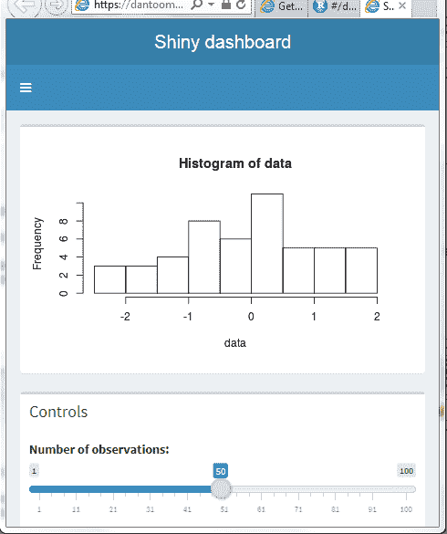

所以，我们有一个易于使用的系统，可以使用各种显示机制创建我们的仪表盘。总体而言，比我预期的要容易得多——考虑到我在其他系统（如微软工具）中开发此类演示的经验。

# 构建独立的仪表盘

使用 Node.js，开发人员提出了一种在 jupyter-dashboard-server 上托管你的仪表盘/笔记本而不使用 Jupyter 的方法。

安装需要安装 Node.js（因为服务器是用 Node.js 编写的）。这是一个较大的安装包。

一旦安装了 Node.js，其中一个安装的工具是 npm-node 产品管理器。你可以使用 npm 通过以下命令安装仪表盘服务器：

```py
npm install -g jupyter-dashboards-server  
```

安装完成后，你可以使用以下命令运行服务器：

```py
C:\Users\Dan>jupyter-dashboards-server --KERNEL_GATEWAY_URL=http://my.gateway.com  
```

`mygateway.com` 是一个占位符。你需要使用你的网关服务器（如果需要）。此时，服务器已在你提到的环境中运行，并将输出几行信息：

```py
Using generated SESSION_SECRET_TOKEN
Jupyter dashboard server listening on 127.0.0.1:3000  
```

你可以在浏览器中打开 URL (`http://127.0.0.1:3000/dashboards`)，查看服务器控制台的样子：

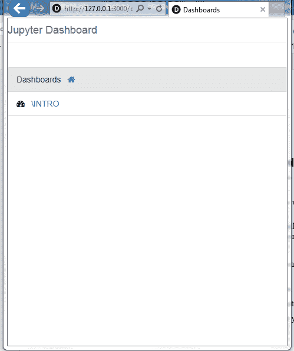

至于开发你可以托管在服务器上的仪表盘，我们还需要安装更多内容：

```py
conda install jupyter_dashboards -c conda-forge  
```

然后启用扩展（这是一个笔记本扩展）：

```py
jupyter nbextension enable jupyter_dashboards --py --sys-prefix  
```

然后需要使用以下命令安装布局扩展：

```py
pip install jupyter_dashboards_bundlers
jupyter bundlerextension enable --sys-prefix --py dashboards_bundlers  
```

此时，你可以使用以下命令上传你的仪表盘笔记本文件：

```py
POST /_api/notebooks/[PATH/]NAME  
```

URL 前缀是你使用的托管站点，`PATH` 是可选的（默认情况下指向根位置），`NAME` 是你确定的名称。

# 小结

在本章中，我们使用符号图形化地展示数据，强调数据的关键方面。我们使用 Markdown 注释了笔记本页面。我们使用 Shiny 生成了一个交互式应用程序。并且我们看到了在 Jupyter 之外托管笔记本的方法。

在下一章中，我们将介绍 Jupyter 下的统计建模。
