# 第八章：统计建模

在本章中，我们将使用原始数据并通过构建统计模型来尝试解读信息。一旦我们构建了模型，通常会更容易看到共同点，我们也可以确定趋势。

# 将 JSON 转换为 CSV

对于本章，我们将使用来自 [`www.yelp.com/dataset/challenge`](https://www.yelp.com/dataset/challenge) 的 Yelp 数据集。此部分使用的是挑战的 *第 9 轮* 数据集。背景是，Yelp 是一个用于评估不同产品和服务的站点，Yelp 会将评估结果发布给用户。

数据集文件是一个非常大的（几 GB）评级数据。下载的内容包括多个评级信息集——包括商业评级、评论、建议（比如这会是一个不错的地方）和用户集。我们对评论数据感兴趣。

在处理如此大的文件时，可能需要找到并使用一个大型文件编辑器，以便能够深入查看数据文件。在 Windows 上，大多数标准编辑器限制为几个兆字节。我使用了 Large Text File Viewer 程序来打开这些 JSON 文件。

所有文件都是 JSON 格式的。JSON 是一种人类可读的格式，包含结构化元素——例如，一个城市对象包含街道对象。虽然 JSON 格式易于阅读，但在处理大量元素时，这种格式显得笨拙。在 `reviews` 文件中有几百万行。因此，我们首先使用此脚本将 JSON 转换为平坦的 CSV 格式，以便更容易进行处理：

```py
import time import datetime import json, csv print( datetime.datetime.now().time()) headers = True #with open('c:/Users/Dan/reviews.json') as jsonf, open('c:/Users/Dan/reviews.csv', "wb") as csvf: filein = 'c:/Users/Dan/yelp_academic_dataset_review.json' fileout = 'c:/Users/Dan/yelp_academic_dataset_review.csv' with open(filein) as jsonf, open(fileout, "wb") as csvf:
 for line in jsonf: data = json.loads(line)        #remove the review text
 data.pop('text') if headers: w = csv.DictWriter(csvf, data.keys()) w.writeheader() headers = False w.writerow(data)print( datetime.datetime.now().time())
```

我正在打印出开始和结束时间，以便了解此过程的耗时。对于我的机器，转换文件花费了 1.5 分钟。我在使前述代码以令人满意的速度工作之前，尝试了几个版本的代码。在开发这个脚本时，我取了原始数据文件的一个小子集（2000 行），并一直在这个文件上工作，直到进展足够为止。

如你所见，我正在读取来自 Yelp 的原始 JSON 文件，并写出一个相应的 CSV 文件。

该脚本读取每一行 JSON（每一行包含一个完整的对象），并输出相应的 CSV。我去除了评论文本，因为我并未对评论文本进行评估，而且评论文本占用了大量空间。使用此编码后，评论文件的大小从 3GB 降低到了 300MB。除此之外，我们确保将头信息作为第一条记录写入 CSV。我然后使用一个单独的脚本/笔记本条目读取 CSV 并进行处理。

# 评估 Yelp 评论

我们使用这个脚本读取处理后的 Yelp 评论，并打印出一些数据统计信息：

```py
reviews <- read.csv("c:/Users/Dan/yelp_academic_dataset_review.csv") 
```

我通常在加载数据后查看一些数据，以便直观检查是否一切按预期工作。我们可以通过调用 `head()` 函数来实现：

```py
head(reviews)
```

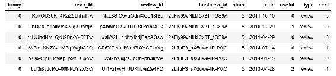

# 数据总结

所有列似乎都正确加载了。现在，我们可以查看数据的总结统计信息：

```py
summary(reviews)  
```

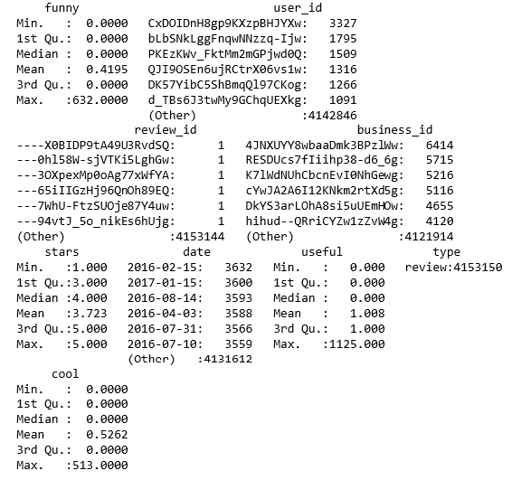

总结中有几点值得注意：

+   我原本以为一些数据点会是`TRUE`/`FALSE`，`0`/`1`，但实际上它们是区间值；例如，`funny`的最大值超过 600；`useful`的最大值为 1100，`cool`的最大值为 500。

+   所有的 ID（用户、公司）都被篡改了。我们可以使用用户文件和公司文件来找到确切的引用。

+   星级评分是`1`到`5`，这符合预期。然而，平均值和中位数大约为`4`，我认为这表明很多人只愿意花时间写好评。

# 评论分布

我们可以通过简单的直方图来了解评论的分布，使用如下代码：

```py
hist(reviews$stars)  
```

这将生成一个内联直方图，如下所示：

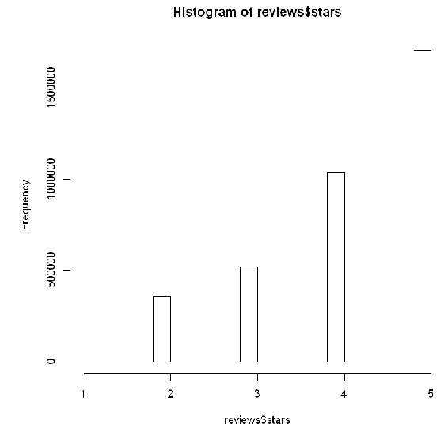

再次，我们看到人们倾向于只写好评（但差评的数量还是相当大的）。

# 寻找评分最高的公司

我们可以使用以下脚本，找到评分最多的公司（5 星）。这个脚本使用类似 SQL 的数据框访问方式，SQL 有内置的机制来按需搜索、选择和排序数据组件。

在这个脚本中，我们正在构建一个计算数据框，包含两列：`business_id`和评论`count`。该数据框按评分从高到低排列。创建完成后，我们展示数据框的头部，以便查看数据集中的评分最高的公司：

```py
#businesses with most 5 star ratings
#install.packages("sqldf", repos='http://cran.us.r-project.org')
library(sqldf)
five_stars = sqldf("select business_id, count(*) from reviews where stars = 5 group by business_id order by 2 desc")
head(five_stars)  
```

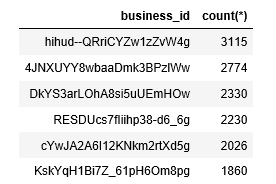

值得注意的是，排名前五的公司在评分数量上存在如此明显的偏差（排名第`1`的公司几乎是排名第`6`公司评分数量的两倍）。你会怀疑，是否在评分过程中存在某种串通现象，导致这种差异。再次提醒，名字到目前为止都被篡改了。

# 寻找评价最高的公司

所以，这些公司得到了最多的好评。那哪些公司得到了最多的评论呢？我们可以使用类似的脚本来确定最被评价的公司：

```py
#which places have most ratings
library(sqldf)
most_ratings = sqldf("select business_id, count(*) from reviews group by business_id order by 2 desc")
head(most_ratings)  
```

在此脚本中，我们不对评分进行限定，以确定它的归属，最终结果是：

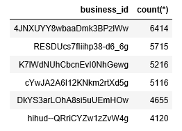

同样地，我们可以看到少数几家公司有远超平均值的评分数。而且，虽然名字被篡改，但我们确实看到四家公司既是评分最高的公司，同时也出现在最被评价的公司名单中。

# 查找评分最高的公司所有的评分

如果我们查看其中一家评分最高的公司，看看评分分布情况如何呢？我们可以使用以下脚本：

```py
# range of ratings for business with most ratings
library(sqldf)
most_rated = sqldf("select * from reviews where business_id = '4JNXUYY8wbaaDmk3BPzlWw' ")
hist(most_rated$stars)  
```

该脚本获取一个评分最高的 ID，访问其所有评分，并显示一个相关的直方图：

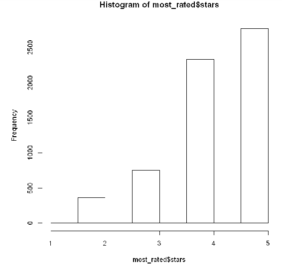

所以，对于某些评分最高的公司，几乎没有低评分。

# 确定评分与评论数量之间的相关性

我们可以使用以下脚本查看星级评分与评论数量之间的相关性：

```py
# correlation number of reviews and number of stars
library(sqldf)
reviews_stars = sqldf("select stars,count(*) as reviews from reviews group by stars")
reviews_stars
cor(reviews_stars)  
```

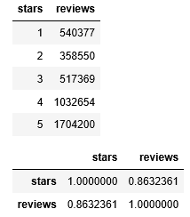

所以，我们看到 `5` 星评价是 `1` 星评价的三倍多。我们还看到了评论数量和星级数量之间非常高的相关性（`0.8632361`）。人们只愿意为好的公司评分。这使得仅使用 Yelp 来确定公司是否被评论过变得非常有趣。如果公司没有评分（或者评分很少），那么那些未书面的评论就会很差。

我们可以使用以下脚本可视化公司评分和评论数量之间的关系：

```py
#correlation business and rating
library(sqldf)
business_rating = sqldf("select business_id, avg(stars) as rating from reviews group by business_id order by 2 desc")
head(business_rating)
hist(business_rating$rating)  
```

其中，`business_rating` 数据框是一个商业和平均星级评分的列表。生成的直方图如下：

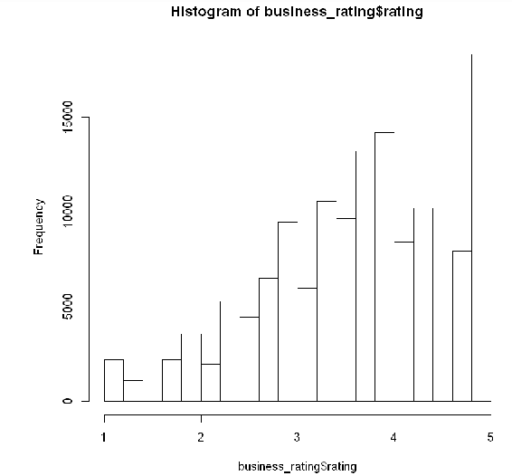

这看起来像是一个泊松分布。有趣的是，公司的评级分布呈现出如此自然的离散性。

# 构建评论模型

我们可以从数据集中构建一个模型，估算一个评分可能涉及多少颗星。然而，评论中的数据点只有：

+   `funny`

+   `useful`

+   `cool`

这些似乎不是良好的评分指示器。我们可以使用一个模型，例如：

```py
model <- lm(stars ~ funny + useful + cool, data=reviews)
summary(model)  
```

这生成了模型的统计数据：

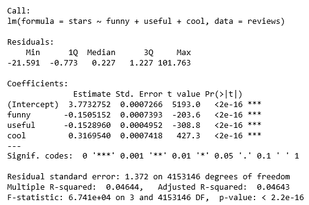

如预期的那样，我们没有足够的信息来进行处理：

+   超过四百万的自由度，几乎每个评论一个自由度

+   *P* 值非常小——我们估算正确的概率几乎为零

+   `3.7` 截距（接近范围的中点）

+   这么低的影响率（每个因素不到一次），意味着我们距离截距没有太大的变化。

# 使用 Python 比较评分

在之前的示例中，我们使用 R 来处理从转换后的 JSON 到 CSV 文件构建的数据框。如果我们使用 Yelp 的企业评分文件，可以直接使用 Python，因为它更小，且产生类似的结果。

在这个示例中，我们从 Yelp 文件中收集包含餐厅的商业类别的菜品。我们为所有菜品累计评分，然后为每个菜品生成平均分。

我们将 JSON 文件读取为单独的行，并将每行转换为 Python 对象：

我们将每行转换为 Unicode，使用 `errors=ignore` 选项。这是因为数据文件中存在许多错误字符。

```py
import json
#filein = 'c:/Users/Dan/business.json'
filein = 'c:/Users/Dan/yelp_academic_dataset_business.json'
lines = list(open(filein))  
```

我们为菜品的评分使用字典。字典的键是菜品的名称，字典的值是该菜品的评分列表：

```py
ratings = {}
for line in lines:
 line = unicode(line, errors='ignore')
 obj = json.loads(line)
 if obj['categories'] == None:
 continue
 if 'Restaurants' in obj['categories']:
 rating = obj['stars']
 for category in obj['categories']:
 if category not in ratings:
 ratings[category] = []
 clist = ratings.get(category)
 clist.append(rating)
```

现在我们收集了所有评分后，可以生成一个新的菜品字典，包含平均评分。我们还会累计总数以生成整体平均值，并跟踪评分最高的菜品：

```py
cuisines = {}
total = 0
cmax = ''
maxc = 0
for cuisine in ratings:
 clist = ratings[cuisine]
 if len(clist) < 10:
 continue
 avg = float(sum(clist))/len(clist)
 cuisines[cuisine] = avg
 total = total + avg
 if avg > maxc:
 maxc = avg
 cmax = cuisine

print ("Highest rated cuisine is ",cmax," at ",maxc)
print ("Average cuisine rating is ",total/len(ratings))

print (cuisines)  
```

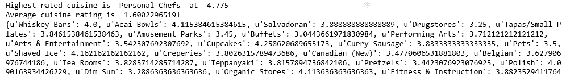

有趣的是，`Personal Chefs`（私人厨师）得分最高。我只听说过名人会有私人厨师，但数据显示这可能是值得的。所有菜系的平均评分为 1.6，极为低下。早些时候我们看到数据似乎没有高低评分的平衡。然而，仔细查看结果输出时，会发现很多条目并非菜系，尽管`Restaurants`（餐馆）键存在。我曾尝试通过仅计算评分数达到 10 条以上的菜系来剔除坏数据，虽然剔除了一部分坏数据，但仍然有许多错误记录存在。

# 按菜系可视化平均评分

现在我们已经计算出各菜系的平均值，可以通过直方图展示它们的分布情况。我们首先将字典转换为数据框。然后将数据框中的`Rating`列绘制为直方图：

我们使用五个箱子来对应五个可能的评分。

```py
import pandas as pd
import numpy as np
df = pd.DataFrame(columns=['Cuisine', 'Rating'])
for cuisine in cuisines:
 df.loc[len(df)]=[cuisine, cuisines[cuisine]]
hist, bin_edges = np.histogram(df['Rating'], bins=range(5))

import matplotlib.pyplot as plt
plt.bar(bin_edges[:-1], hist, width = 1)
plt.xlim(min(bin_edges), max(bin_edges))
plt.show()     
```

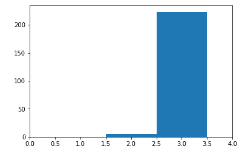

再次，我们看到明显偏向高平均值的趋势。我曾尝试改善数据展示的梯度，但未能成功。

# 随机评分搜索

由于数据已经以易于加载的格式存在，我们可以根据任意条件进行搜索，比如`Personal Chefs`（私人厨师）是否允许狗——也许他们会为你的狗定制烹饪。

我们可以使用如下脚本：for line in lines:

```py
 line = unicode(line, errors='ignore')
 obj = json.loads(line)
 if obj['categories'] == None:
 continue
 if 'Personal Chefs' in obj['categories']:
 if obj['attributes'] == None:
 continue
 for attr in obj['attributes']:
 print (attr)
```

在这里我们对筛选出的项目做一些有用的处理。此脚本仅会显示`Personal Chefs`（私人厨师）的属性。可以在以下显示中看到：

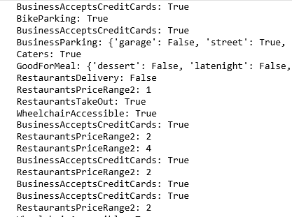

我们也可以轻松地进行某些计算或其他操作，快速缩小范围，专注于数据的特定部分。

# 确定评分数量与评分之间的关系

根据前述结果，似乎人们大多数时间只是进行积极投票。我们可以查看公司收到的投票数量与其评分之间是否存在关系。

首先，我们使用以下脚本来累积数据集，提取每家公司的投票数和评分：

```py
#determine relationship between number of reviews and star rating
import pandas as pd
from pandas import DataFrame as df 
import numpy as np 

dfr2 = pd.DataFrame(columns=['reviews', 'rating'])
mynparray = dfr2.values

for line in lines:
 line = unicode(line, errors='ignore')
 obj = json.loads(line)
 reviews = int(obj['review_count'])
 rating = float(obj['stars'])
 arow = [reviews,rating]
 mynparray = np.vstack((mynparray,arow)) 

dfr2 = df(mynparray)
print (len(dfr2))  
```

这段代码仅构建了我们两个变量的数据框。我们使用 NumPy，因为它更容易将一行添加到数据框中。当我们处理完所有记录后，我们会将 NumPy 数据框转换回 pandas 数据框。

列名在转换过程中丢失了，因此我们将它们重新添加并绘制一些总结统计数据：

```py
dfr2.columns = ['reviews', 'rating']
dfr2.describe()
```

在以下输出中，我们可以看到收集的评论和评分数据的布局。Yelp 没有对该数据集的数据输入做出任何限制。评分应有 5 个独特的值：

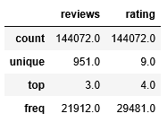

接下来，我们绘制数据以获得关系的视觉线索，使用以下内容：

```py
#import matplotlib.pyplot as plt
dfr2.plot(kind='scatter', x='rating', y='reviews')
plt.show()  
```

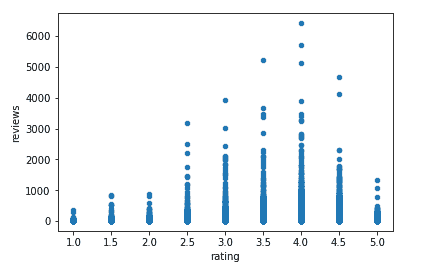

因此，最终数据似乎呈现出一个清晰的泊松分布，与之前的`business_rating`直方图相比。

接下来，我们计算回归参数：

```py
#compute regression
import statsmodels.formula.api as smf

# create a fitted model in one line
lm = smf.ols(formula='rating ~ reviews', data=dfr2).fit()

# print the coefficients
lm.params  
```

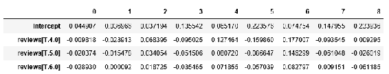

我们计算了所有评分值的截距。我原本预期会得到一个单一的值。

现在，我们使用以下方法来确定观察数据的范围：

```py
#min, max observed values
X_new = pd.DataFrame({'reviews': [dfr2.reviews.min(), dfr2.reviews.max()]})
X_new.head()  
```

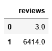

所以，正如我们之前猜测的那样，一些企业有着大量的评论。

```py
Now, we can make predictions based on the extent data points:
#make corresponding predictions
preds = lm.predict(X_new)
preds  
```

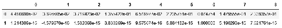

我们看到的预测值范围远比预期的大。接下来，绘制出观察数据和预测数据：

```py
# first, plot the observed data
dfr2.plot(kind='scatter', x='reviews', y='rating')

# then, plot the least squares line
plt.plot(X_new, preds, c='red', linewidth=2)
plt.show()  
```

在以下展示的图中，似乎没有发现评论数量和企业评分之间的关系。这看起来像是一场数字游戏——如果你让人们评论你的企业，平均而言，他们会给你一个高分。

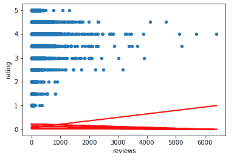

似乎没有发现评论数量和企业评分之间的关系。

# 总结

在这一章中，我们使用了数据并将 JSON 文件转换为 CSV 文件。我们评估了 Yelp 的餐饮评论数据集，确定了评分最高和评论最多的企业。我们查看了评分的分布。我们使用 Python 对 Yelp 企业评分进行了类似的评估，发现数据的分布非常相似。

在下一章中，我们将学习如何在 Jupyter 下使用机器学习。
