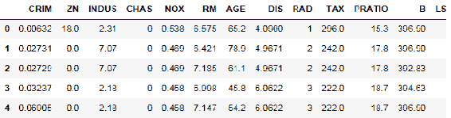

# 第九章：使用 Jupyter 进行机器学习

在本章中，我们将使用几种机器学习算法在 Jupyter 下进行演示。我们在 R 和 Python 中编写代码，以展示 Jupyter 开发者可用的各种选择。

# 朴素贝叶斯

朴素贝叶斯是一种使用概率通过贝叶斯定理对数据进行分类的算法，前提是特征之间有较强的独立性。贝叶斯定理基于先验条件估计事件的概率。因此，整体上，我们使用一组特征值来估算一个值，假设在这些特征具有相似值时，条件保持一致。

# 使用 R 的朴素贝叶斯

我们的第一个朴素贝叶斯实现使用了 R 编程语言。该算法在 R 中的实现被编码在`e1071`库中。`e1071`似乎是该包开发时所在学校的部门标识符。

我们首先安装包，并加载库：

```py
#install.packages("e1071", repos="http://cran.r-project.org") 
library(e1071) 
library(caret) 
set.seed(7317) 
data(iris) 
```

关于这些步骤的一些备注：

+   `install.packages`调用被注释掉了，因为我们不想每次运行脚本时都运行它。

+   `e1071`是朴素贝叶斯算法包。

+   `caret`包包含一个方法，用于随机分割数据集。

+   我们设置了`seed`，以便能够重现结果。

+   我们在这个示例中使用的是`iris`数据集。具体来说，使用其他`iris`特征来预测物种。

包的调用方式如下：

```py
model <- naiveBayes(response ~ ., data=training) 
prediction <- predict(model, test, type="class") 
```

`naiveBayes`的参数如下：

+   公式形式为 *y ~ x1 + x2 ....* ——尝试根据*x1, x2, ...*预测*y*。

+   数据框

+   可选的拉普拉斯平滑

+   基于布尔过滤器的可选数据子集

+   可选的处理`na`值的函数（`na.action`）——默认是通过

一旦我们建立了模型，就可以使用`predict()`函数并传入参数来尝试预测：

+   模型（来自前面的调用）

+   数据框

+   输入数据是类别数据还是原始数据（条件）

因此，我们继续使用`iris`示例：

```py
trainingIndices <- createDataPartition(iris$Species, p=0.75, list=FALSE) 
training <- iris[trainingIndices,] 
testing <- iris[-trainingIndices,] 
nrow(training) 
nrow(testing) 
114 
36 
```

在这里，我们将数据拆分为 75%的训练集和 25%的测试集，从每个数据框中的行数可以看到这一点。

接下来，我们构建模型——我们正在尝试根据数据框的其他特征/列预测`Species`：

```py
model <- naiveBayes(Species ~ ., data=training) 
model 
```


有趣的是，Apriori 假设假设可能性之间是均等的。花萼长度、宽度和花瓣长度对物种有很强的影响。

我们基于模型对测试数据进行预测：

```py
prediction <- predict(model, testing, type="class") 
```

现在，我们需要衡量模型的准确性。通常我们可以使用散点图，`x`来自实际值，`y`来自预测值，但由于我们有分类数据，我们可以建立一个实际值与预测值的向量，并在一个新的结果数据框中比较这两个向量：

```py
results <- data.frame(testing$Species, prediction) 
results["accurate"] <- results['testing.Species'] == results['prediction'] 
nrow(results) 
nrow(results[results$accurate == TRUE,]) 
36 
35 
```

最终我们得到了一个提供 97%准确率的模型（`35`/`36`）。这是一个非常好的性能水平，几乎处于优秀的统计边界内（+/- 2%）。

# 使用 Python 的朴素贝叶斯

算法的 Python 实现位于 `sklearn` 库中。整个过程要简单得多。首先，加载 `iris` 数据集：

```py
from sklearn import datasets 
irisb = datasets.load_iris() 
iris = irisb['data'] 
iris.shape 
```

调用内建的高斯朴素贝叶斯估算器来一步完成模型和预测：

```py
from sklearn.naive_bayes import GaussianNB 
gnb = GaussianNB() 
y_pred = gnb.fit(irisb.data, irisb.target).predict(irisb.data) 
```

确定模型的准确度：

```py
print("Number of errors out of a total %d points : %d"  
      % (irisb.data.shape[0],(irisb.target != y_pred).sum())) 
Number of errors out of a total 150 points : 6
```

我们得到了非常相似的估算准确性结果。

# 最近邻估算器

使用最近邻时，我们有一个未分类的对象和一组已分类的对象。我们然后取未分类对象的属性，和已知分类进行比较，并选择与我们的未知对象最接近的类别。比较的距离通过欧几里得几何来计算，即计算两点之间的距离（已知属性与未知对象属性的比较）。

# 使用 R 实现最近邻

在这个例子中，我们使用来自 `ics.edu` 的房价数据。首先，我们加载数据并指定列名：

```py
housing <- read.table("http://archive.ics.uci.edu/ml/machine-learning-databases/housing/housing.data") 
colnames(housing) <- c("CRIM", "ZN", "INDUS", "CHAS", "NOX", "RM", "AGE", "DIS", "RAD", "TAX", "PRATIO", "B", "LSTAT", "MDEV") 
summary(housing) 
```

我们重新排序数据，使得关键值（房价 `MDEV`）按升序排列：

```py
housing <- housing[order(housing$MDEV),] 
```

现在，我们可以将数据拆分为训练集和测试集：

```py
#install.packages("caret") 
library(caret) 
set.seed(5557) 
indices <- createDataPartition(housing$MDEV, p=0.75, list=FALSE) 
training <- housing[indices,] 
testing <- housing[-indices,] 
nrow(training) 
nrow(testing) 
381 
125 
```

我们使用这两个数据集来构建最近邻模型：

```py
library(class) 
knnModel <- knn(train=training, test=testing, cl=training$MDEV) 
knnModel 
10.5 9.7 7 6.3 13.1 16.3 16.1 13.3 13.3... 
```

让我们看看结果：

```py
plot(knnModel) 
```


在数据的较高点附近存在轻微的泊松分布。我认为这符合 *自然* 数据的特点。起始和结束的尾部在页面上显得异常偏离。

那么，这个模型的准确度如何呢？我没有找到将 `knnModel` 中预测的因素转化为数值的清晰方法，所以我将它们提取到一个平面文件中，然后单独加载：

```py
predicted <- read.table("housing-knn-predicted.csv") 
colnames(predicted) <- c("predicted") 
predicted
```

| 预测值 |
| --- |
| 10.5 |
| 9.7 |
| 7.0 |

然后我们可以构建一个 `results` 数据框：

```py
results <- data.frame(testing$MDEV, predicted) 
```

计算我们的准确率：

```py
results["accuracy"] <- results['testing.MDEV'] / results['predicted'] 
head(results) 
mean(results$accuracy) 
1.01794816307793
```

| **testing.MDEV** | **预测值** | **准确率** |
| --- | --- | --- |
| `5.6` | `10.5` | `0.5333333` |
| `7.2` | `9.7` | `0.7422680` |
| `8.1` | `7.0` | `1.1571429` |
| `8.5` | `6.3` | `1.3492063` |
| `10.5` | `13.1` | `0.8015267` |
| `10.8` | `16.3` | `0.6625767` |

因此，我们在测试数据的 2% 内（`1.01`）进行估算。

# 使用 Python 实现最近邻

在 Python 中，我们有非常相似的步骤来生成最近邻估算。

首先，我们导入要使用的包：

```py
from sklearn.neighbors import NearestNeighbors 
import numpy as np 
import pandas as pd 
```

Numpy 和 pandas 是标准库。最近邻是 `sklearn` 的一项特性。

现在，我们加载我们的房价数据：

```py
housing = pd.read_csv("http://archive.ics.uci.edu/ml/machine-learning-databases/housing/housing.data",
                       header=None, sep='\s+') 
housing.columns = ["CRIM", "ZN", "INDUS", "CHAS", "NOX", "RM", "AGE", \ 
"DIS", "RAD", "TAX", "PRATIO", \ 
"B", "LSTAT", "MDEV"] 
housing.head(5) 
```



这是我们之前在 R 中看到的相同数据。

让我们看看它的大小：

```py
len(housing) 
506 
```

然后将数据划分为 `训练` 和 `测试` 集：

```py
mask = np.random.rand(len(housing)) < 0.8 
training = housing[mask] 
testing = housing[~mask] 
len(training) 
417 
len(testing) 
89 
```

查找最近邻：

```py
nbrs = NearestNeighbors().fit(housing) 
```

显示它们的索引和距离。索引的变化较大。距离似乎呈现出带状分布：

```py
distances, indices = nbrs.kneighbors(housing) 
indices 
array([[  0, 241,  62,  81,   6], 
       [  1,  47,  49,  87,   2], 
       [  2,  85,  87,  84,   5], 
       ...,  
       [503, 504, 219,  88, 217], 
       [504, 503, 219,  88, 217], 
       [505, 502, 504, 503,  91]], dtype=int32) 
distances 
array([[  0\.        ,  16.5628085 , 17.09498324,18.40127391, 
         19.10555821], 
       [  0\.        ,  16.18433277, 20.59837827, 22.95753545, 
         23.05885288] 
       [  0\.        ,  11.44014392, 15.34074743, 19.2322435 , 
         21.73264817], 
       ...,  
       [  0\.        ,   4.38093898,  9.44318468, 10.79865973, 
         11.95458848], 
       [  0\.        ,   4.38093898,  8.88725757, 10.88003717, 
         11.15236419], 
       [  0\.        ,   9.69512304, 13.73766871, 15.93946676, 
         15.94577477]]) 
```

从 `训练` 集构建一个最近邻模型：

```py
from sklearn.neighbors import KNeighborsRegressor 
knn = KNeighborsRegressor(n_neighbors=5) 
x_columns = ["CRIM", "ZN", "INDUS", "CHAS", "NOX", "RM", "AGE", "DIS", "RAD", "TAX", "PRATIO", "B", "LSTAT"] 
y_column = ["MDEV"] 
knn.fit(training[x_columns], training[y_column]) 
KNeighborsRegressor(algorithm='auto', leaf_size=30, metric='minkowski', 
          metric_params=None, n_jobs=1, n_neighbors=5, p=2, 
          weights='uniform') 
```

有趣的是，使用 Python 时我们不需要将模型单独存储。方法是有状态的。

做出我们的预测：

```py
predictions = knn.predict(testing[x_columns]) predictions array([[ 20.62],
 [ 21.18], [ 23.96], [ 17.14], [ 17.24], [ 18.68], [ 28.88], 
```

确定我们预测房价的准确性：

```py
columns = ["testing","prediction","diff"] 
index = range(len(testing)) 
results = pd.DataFrame(index=index, columns=columns) 

results['prediction'] = predictions 

results = results.reset_index(drop=True) 
testing = testing.reset_index(drop=True) 
results['testing'] = testing["MDEV"] 

results['diff'] = results['testing'] - results['prediction'] 
results['pct'] = results['diff'] / results['testing'] 
results.mean() 
testing       22.159551 
prediction    22.931011 
diff          -0.771461 
pct           -0.099104 
```

我们的平均差异为¾，而平均值为`22`。这应该意味着大约 3%的平均百分比差异，但计算出来的平均百分比差异接近 10%。因此，我们在 Python 中并没有做出很好的估计。

# 决策树

在本节中，我们将使用决策树来预测值。决策树具有逻辑流程，用户根据属性做出决策，沿着树形结构向下直到根节点，在根节点提供分类结果。

在这个示例中，我们使用汽车特征，例如车辆重量，来判断该车是否能提供良好的油耗。这些信息来自页面 [`alliance.seas.upenn.edu/~cis520/wiki/index.php?n=Lectures.DecisionTrees`](https://alliance.seas.upenn.edu/~cis520/wiki/index.php?n=Lectures.DecisionTrees)。我将数据复制到 Excel 中，并将其作为 CSV 文件用于本示例。

# R 中的决策树

我们加载用于`rpart`和`caret`的库。`rpart`包含决策树建模包，`caret`包含数据划分功能：

```py
library(rpart) 
library(caret) 
set.seed(3277) 
```

我们加载`mpg`数据集，并将其分为训练集和测试集：

```py
carmpg <- read.csv("car-mpg.csv") 
indices <- createDataPartition(carmpg$mpg, p=0.75, list=FALSE) 
training <- carmpg[indices,] 
testing <- carmpg[-indices,] 
nrow(training) 
nrow(testing) 
33 
9 
```

我们开发一个模型，根据其他因素预测`mpg`的可接受性：

```py
fit <- rpart(mpg ~ cylinders + displacement + horsepower + weight + acceleration +
             modelyear + maker, method="anova", data=training) 
fit 
n= 33  

node), split, n, deviance, yval 
      * denotes terminal node 

1) root 33 26.727270 1.909091   
2) weight>=3121.5 10  0.000000 1.000000 * 
3) weight< 3121.5 23 14.869570 2.304348   
6) modelyear>=78.5 9  4.888889 1.888889 * 
7) modelyear< 78.5 14  7.428571 2.571429 * 
```

显示的是决策树的文本表示形式。你可以通过以下方式图形化查看决策树：

```py
plot(fit) 
text(fit, use.n=TRUE, all=TRUE, cex=.5) 
```


这似乎是一个非常简单的模型。1980 年可能发生了油耗的变化，因为这是决策树的主要驱动因素。

最后，我们预测值并将其与我们的`testing`集进行比较：

```py
predicted <- predict(fit, newdata=testing) 
predicted 
testing 
```


看起来这个包已经将`Bad`、`OK`和`Good`转换为数字等效值，其中`1`代表`Bad`，其他则为`OK`或`Good`。总体来说，我们不确定这个模型是否有效。显然可用的数据量很小，增加测试集的大小可能会澄清模型。

# Python 中的决策树

我们可以在 Python 中执行相同的分析。加载一些需要用到的库：

```py
import pandas as pd 
import numpy as np 
from os import system 
import graphviz #pip install graphviz  
from sklearn.cross_validation import train_test_split 
from sklearn.tree import DecisionTreeClassifier 
from sklearn.metrics import accuracy_score 
from sklearn import tree 
```

读取`mpg`数据文件：

```py
carmpg = pd.read_csv("car-mpg.csv") 
carmpg.head(5) 
```


将数据分解为因素和结果：

```py
columns = carmpg.columns 
mask = np.ones(columns.shape, dtype=bool) 
i = 0 #The specified column that you don't want to show 
mask[i] = 0 
mask[7] = 0 #maker is a string 
X = carmpg[columns[mask]] 
Y = carmpg["mpg"] 
```

将数据分为训练集和测试集：

```py
X_train, X_test, y_train, y_test  
= train_test_split( X, Y, test_size = 0.3,  
random_state = 100) 
```

创建一个决策树模型：

```py
clf_gini = tree.DecisionTreeClassifier(criterion = "gini",  
random_state = 100, max_depth=3, min_samples_leaf=5) 
```

计算模型的拟合度：

```py
clf_gini.fit(X_train, y_train) 
DecisionTreeClassifier(class_weight=None, criterion='gini', max_depth=3, 
            max_features=None, max_leaf_nodes=None, 
            min_impurity_split=1e-07, min_samples_leaf=5, 
            min_samples_split=2, min_weight_fraction_leaf=0.0, 
            presort=False, random_state=100, splitter='best') 
```

绘制出决策树：

```py
#I could not get this to work on a Windows machine 
#dot_data = tree.export_graphviz(clf_gini, out_file=None,  
#                         filled=True, rounded=True,   
#                         special_characters=True)   
#graph = graphviz.Source(dot_data)   
#graph 
```

# 神经网络

我们可以将房屋数据建模为神经网络，其中不同的数据元素作为系统的输入，而网络的输出是房价。通过神经网络，我们最终得到一个图形化的模型，展示了每个输入应应用的因素，以得出房价。

# R 中的神经网络

R 中有一个神经网络包。我们加载它：

```py
#install.packages('neuralnet', repos="http://cran.r-project.org") 
library("neuralnet") 
```

加载房屋数据：

```py
filename = "http://archive.ics.uci.edu/ml/machine-learning-databases/housing/housing.data" 
housing <- read.table(filename) 
colnames(housing) <- c("CRIM", "ZN", "INDUS", "CHAS", "NOX",  
                       "RM", "AGE", "DIS", "RAD", "TAX", "PRATIO", 
                       "B", "LSTAT", "MDEV") 
```

将房屋数据分为训练集和测试集（我们在之前的示例中已经看到过这种编码）：

```py
housing <- housing[order(housing$MDEV),] 
#install.packages("caret") 
library(caret) 
set.seed(5557) 
indices <- createDataPartition(housing$MDEV, p=0.75, list=FALSE) 
training <- housing[indices,] 
testing <- housing[-indices,] 
nrow(training) 
nrow(testing) 
testing$MDEV 
```

计算我们的`neuralnet`模型：

```py
nnet <- neuralnet(MDEV ~ CRIM + ZN + INDUS + CHAS + NOX  
                  + RM + AGE + DIS + RAD + TAX + PRATIO  
                  + B + LSTAT, 
                  training, hidden=10, threshold=0.01) 
nnet 
```

`neuralnet`模型的显示信息相当广泛。以下是第一组显示内容。尚不清楚这些点是否有用：

```py
$call 
neuralnet(formula = MDEV ~ CRIM + ZN + INDUS + CHAS + NOX + RM +  
    AGE + DIS + RAD + TAX + PRATIO + B + LSTAT, data = training,  
    hidden = 10, threshold = 0.01) 

$response 
    MDEV 
399  5.0 
406  5.0 
... 
$covariate 
           [,1]  [,2]  [,3] [,4]   [,5]  [,6]  [,7]    [,8] [,9] [,10] [,11] 
  [1,] 38.35180   0.0 18.10    0 0.6930 5.453 100.0  1.4896   24   666  20.2 
  [2,] 67.92080   0.0 18.10    0 0.6930 5.683 100.0  1.4254   24   666  20.2 
  [3,]  9.91655   0.0 18.10    0 0.6930 5.852  77.8  1.5004   24   666  20.2 
.... 
```

显示模型：

```py
plot(nnet, rep="best") 
```


这只是图表的上半部分。如您所见，每个因素都被调整到模型中以得出我们的房价。这并不有用——每个因素不可能都这么重要。

确定我们在该模型中的准确性：

```py
results <- compute(nnet, testing[,-14]) 
diff <- results$net.result - testing$MDEV 
sum( (diff - mean(diff) )² ) #sum of squares 
9275.74672 
```

鉴于该模型似乎非常不准确，我不确定在 Python 中按照相同的步骤操作是否会有益。

# 随机森林

随机森林算法尝试多棵随机决策树，并提供在所用参数下最有效的树。

# R 中的随机森林

在 R 中，我们包括了将要使用的包：

```py
install.packages("randomForest", repos="http://cran.r-project.org") 
library(randomForest) 
```

加载数据：

```py
filename = "http://archive.ics.uci.edu/ml/machine-learning-databases/housing/housing.data" 
housing <- read.table(filename) 
colnames(housing) <- c("CRIM", "ZN", "INDUS", "CHAS", "NOX",  
                       "RM", "AGE", "DIS", "RAD", "TAX", "PRATIO", 
                       "B", "LSTAT", "MDEV") 
```

将数据分割：

```py
housing <- housing[order(housing$MDEV),] 
#install.packages("caret") 
library(caret) 
set.seed(5557) 
indices <- createDataPartition(housing$MDEV, p=0.75, list=FALSE) 
training <- housing[indices,] 
testing <- housing[-indices,] 
nrow(training) 
nrow(testing) 
```

计算我们的模型：

```py
forestFit <- randomForest(MDEV ~ CRIM + ZN + INDUS + CHAS + NOX  
                  + RM + AGE + DIS + RAD + TAX + PRATIO  
                  + B + LSTAT, data=training) 
forestFit 
Call: 
 randomForest(formula = MDEV ~ CRIM + ZN + INDUS + CHAS + NOX +      RM + AGE + DIS + RAD + TAX + PRATIO + B + LSTAT, data = training)  
               Type of random forest: regression 
                     Number of trees: 500 
No. of variables tried at each split: 4 

          Mean of squared residuals: 11.16163 
                    % Var explained: 87.28 
```

这是关于模型的更多信息性显示——我们看到模型解释了 87%的变量。

做出我们的预测：

```py
forestPredict <- predict(forestFit, newdata=testing) 
See how well the model worked: 
diff <- forestPredict - testing$MDEV 
sum( (diff - mean(diff) )² ) #sum of squares 
1391.95553131418 
```

这是我们在本章中产生的模型中，最小的平方和之一。

# 摘要

在本章中，我们使用了几种机器学习算法，其中一些在 R 和 Python 中进行对比。我们使用朴素贝叶斯算法来确定数据可能的使用方式。我们以不同的方式应用最近邻算法来查看我们的结果。我们使用决策树来构建预测算法。我们尝试用神经网络来解释房价。最后，我们使用随机森林算法做了相同的尝试——并取得了最佳结果！

在下一章中，我们将研究如何优化 Jupyter 笔记本。
