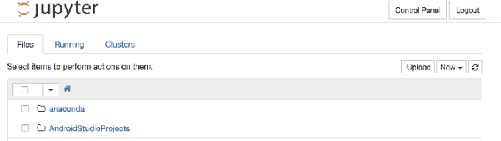

# 第十章：优化 Jupyter Notebook

在开发 Jupyter Notebook 之前，你应该处理在公众开始访问之前需要进行的优化。这些优化包括从特定语言问题（使用最佳实践的 R 编码风格）到将笔记本部署到高可用环境中的一系列选项。

# 部署笔记本

Jupyter Notebook 是一个网站。你可以在用来显示此文档的计算机上托管网站。你所在部门可能有一台机器正在用作 Web 服务器。

如果你在本地机器上进行部署，你将拥有一个单用户网站，其他用户将被阻止访问，或者会发生冲突。发布笔记本的第一步是使用提供多用户访问的托管服务。

# 部署到 JupyterHub

当前主流的 Jupyter 托管产品是 JupyterHub。为了明确，JupyterHub 是安装在你控制的机器上。它为你的笔记本提供多用户访问。这意味着你可以在你的环境中的一台机器上安装 JupyterHub，并且只有内部用户（多个内部用户）可以访问它。

当 JupyterHub 启动时，它会开始一个 hub 或控制代理。该 hub 将启动一个监听器或代理实例来处理 Jupyter 请求。当代理收到 Jupyter 请求时，它将把请求交给 hub。如果 hub 判断这是一个新用户，它将生成一个新的 Jupyter 服务器实例，并将该用户与 Jupyter 之间的所有后续交互绑定到该用户的版本服务器上。此功能提供了多用户访问。

# 安装 JupyterHub

JupyterHub 需要 Python 3.3 或更高版本，我们将使用 Python 工具 `pip3` 来安装 JupyterHub。安装命令是：

```py
npm install -g configurable-http-proxy
pip3 install jupyterhub  
```

# 访问 JupyterHub 安装

现在我们可以直接从命令行启动 JupyterHub：

```py
jupyterhub  
```

替代你一直在使用的典型 `jupyter notebook`。

如前所述，JupyterHub 是用户访问笔记本的入口点。它在背后为用户实例化 Jupyter 实例。

用户界面也有一些小差异，如下图所示：



注意屏幕右上方的额外按钮：

+   控制面板：用于控制 JupyterHub

+   注销：注销将在 JupyterHub 的 SSL 功能中用于控制对笔记本的访问。

控制面板提供了两个选项：

+   停止我的服务器：停止 JupyterHub 的进一步响应。如果需要升级系统的某些部分，这个选项很有用。

+   我的服务器：返回到 JupyterHub 的主页（上一张截图）。

如果你在桌面上启动两个浏览器实例并访问 JupyterHub 上的笔记本，你将看到为每个用户呈现不同的信息，因为用户信息是分别分配给每个用户的。

# Jupyter 托管

如果你想将笔记本分享给更广泛的观众，一个更好的机制是使用公共托管服务来展示你的笔记本。这可以减轻你自己做这件事时需要承担的一些大量安全性和可用性要求。

提供 Jupyter Notebook 托管服务的（托管）供应商越来越多。一些主要的供应商包括：

+   **Rackspace**：Rackspace 特别面向教育笔记本，提供为教育领域客户运行时的特殊处理

+   **Azure**：由微软提供的服务器托管服务—提供完整的笔记本托管

+   **GitHub**：主要的编程工件源仓库之一，例如你的笔记本

这些托管服务的一个伟大特点是，你不再需要安装从笔记本脚本中访问的任何库。托管公司已经下载（并维护和更新）了你通常会使用的所有库。GitHub 负责这些维护工作。其他托管公司则是纯粹的网络托管公司，期望你安装任何必要的软件。

# 优化你的脚本

你可以对笔记本脚本进行优化，使其运行更高效。这些优化是依赖于脚本语言的。我们已经在笔记本中讨论了 Python 和 R 脚本，并将讨论可以为这两种语言进行的优化。

Jupyter 确实支持其他语言，如 Scala 和 Spark。其他语言有自己的优化工具和策略。

# 优化你的 Python 脚本

性能调优你的 Python 脚本可以使用多种工具：

+   `timeit`

+   Python 正则表达式

+   字符串处理

+   循环优化

+   `hotshot` 性能分析

# 确定脚本执行所需的时间

Python 中的 `timeit` 函数接收一行代码并确定执行所需的时间。你还可以重复执行相同的脚本，查看是否有需要解决的启动问题。

`timeit` 以这种方式使用：

```py
import timeit
t = timeit.Timer("myfunction('Hello World')", "import myfunction") 
t.timeit() 
3.32132323232
t.repeat(2, 2000000) 
[#, #, #]  
```

`repeat()` 函数告诉 `timeit` 执行定时指令两次，每次执行 2,000,000 次。`repeat()` 调用后的数字是三次时间的展示，作为重复调用的代表。

你通常会用它来测试完整的函数，而不是与用户进行任何交互的部分。

# 使用 Python 正则表达式

有很多情况下你需要让脚本评估一个数据字符串，可能是由用户输入的。是的，你可以手动完成这个过程，但 Python 正则表达式处理非常高效，并能捕捉到你可能没有注意到的所有边界情况。

# 使用 Python 字符串处理

字符串在内存分配方面表现较差，每当对字符串进行微小的修改时，就会重复进行内存分配。此外，像将字母大写这样的小操作也会导致重新分配。最好一次性处理整个字符串（比如大写化），这样就能将重新分配的次数减少到一次。

# 最小化循环操作

在很多情况下，你可能会开发一个脚本，并将一些步骤放在循环内，因为在开发时这样做较为方便，而且对较小的测试数据运行时，性能差异可能不大。例如，在本书中的任何脚本里，我通常会提取一小部分数据行来处理。这样可以确保我正确地访问数据。然而，我可能会调整循环操作，使标记操作发生在其中。在大约 20 行的小数据集上，这种影响不大。然而，当我开始使用真正的数据集，可能包含数百万行时，每一行都需要设置标记，这将影响整个操作的性能。

然而，一旦处理较大的数据集时，那些每次循环执行时都会发生的小操作变得非常昂贵。通常有些操作可以从循环中提取出来，放到循环外执行一次。例如，如果我们想在循环中找到最大的数字，我们可以在循环外将结果初始化为一个不现实的值，在循环内部，如果看到这个不现实的值，就用第一个结果来初始化结果。这个测试会在每次循环操作时进行。然而，我们可以在进入循环之前就设置好第一个记录的结果。

# 分析脚本

热点分析器（hotshot profiler）在 Python 中可用，能够完整地展示脚本执行的过程。你需要先安装 Hotshot 才能执行。

它可以这样使用：

```py
import hotshot
import myfunction
prof = hotshot.Profile('my_hotshot _stats')
prof.run('myfunction').close()
```

然后，要查看分析器的结果总结，可以使用以下命令：

```py
import hotshot.stats
hotshot.stats.load('my_hotshot_stats').strip_dirs().sort_stats('time').print_stats()  
```

# 优化你的 R 脚本

R 也提供了一些工具，帮助定位 R 代码的性能问题：

+   `microbenchmark`

+   修改常用函数

+   优化名称查找

+   优化数据框值提取

+   R 实现

+   更改算法

# 使用 microbenchmark 来分析 R 脚本

`microbenchmark` 是作为 R 库的一部分提供的。一旦将其包含在脚本中，你就可以将待分析的代码用 `microbenchmark` 标签包裹起来，执行后该工具会输出该脚本的性能分析信息。

例如，我们可以这样使用：

```py
library(microbenchmark)
x <- runif(125) 
microbenchmark( mean(x) )  
```

这样会对包含的代码进行 125 次（默认 100 次）执行，并输出诸如以下的分析信息：

```py
Unit: nanoseconds
 expr  min     lq    mean median     uq   max neval
 sqrt(x)  825  860.5 1212.79  892.5  938.5 12905   100
 x⁰.5 3015 3059.5 3776.81 3101.5 3208.0 15215   100  
```

我们关注的是均值，它能很好地指示每次迭代所需的时间。我们还应该注意到，若最小值和最大值相差很大，意味着存在明显的偏差——这正是我们在这里看到的情况。

# 修改提供的功能

R 允许你更改大多数对象的行为，包括提供的大多数知名函数。例如，一个极端的例子是重新设计`mean()`函数的工作方式。也许你对正在处理的数据有深入的理解，可以在特定情况下相应地提高性能。

与前面的工具一样，你可以先执行提供的功能，再进行你的实现，并比较 `microbenchmark` 提供的性能分析信息。

# 优化名称查找

R 允许动态命名对象，因此每次你访问一个变量时，R 必须遍历一系列作用域，找到对象当前所在的位置。

你也可以使用本地缓存机制直接访问确切的值，从而避免 R 在所有作用域中查找变量。

# 优化数据框值提取

R 提供多种编码风格，允许你以多种方式访问数据框中的特定值。如果你的代码频繁访问大型数据框以提取单个值，那么值得对不同的替代方法进行基准测试，看看哪种访问方式能提供最佳性能。

# 更改 R 实现

R 是由几家公司实现的，每个实现都有其自己的性能范围。在极端情况下，尝试不同的 R 实现可能会很有价值，以确定哪个最适合你。更改 Jupyter 使用的 R 引擎可能会比较困难。

# 更改算法

每当你编写笔记本代码时，你已采用某种方法来解决问题。这种方法被称为*算法*。你的算法可能包括遍历记录或直接查询数据库中的记录来获取感兴趣的记录。很多时候，你会在过程初期选择一个看似足够有效的算法。也许还有其他算法能够以更高效的方式解决问题。

对任何编程实现来说，最大的提升来自于改变整体处理方法。不幸的是，这是最难实现的变动，因为需要重新设计和重写代码。即便如此，像其他技巧一样，你仍然需要比较不同方法的基准，确保新方法更好。

# 监控 Jupyter

与本章之前关于优化的讨论一样，你也可以使用编程工具来监控笔记本的整体交互。Linux/Mac 环境下主要的工具是`memory_profiler`。如果你启动这个工具，然后再启动笔记本，分析器将会跟踪笔记本的内存使用情况。

根据此信息记录，如果您发现发生了大量内存使用，您可能能够调整程序的内存分配以减小内存占用。例如，性能分析器可能会突出显示您在一个循环中不断创建（和丢弃）一个大内存项。当您回到代码时，您会意识到这个内存访问可以从循环中提取出来，或者可以轻松地减少分配的大小。

# 缓存您的笔记本

缓存是一种常见的编程实践，用于加速性能。如果计算机不需要重新加载某一段代码、变量或文件，而是可以直接从缓存中访问，这将提高性能。

如果您将笔记本部署到 Docker 环境中，则有一种机制可以缓存您的笔记本。Docker 是一种在一台机器上虚拟化代码的机制，在 Java 编程领域，采用这种方法已经成为常规做法。幸运的是，Docker 非常灵活，已经确定了一种方法，可以将 Jupyter 用在 Docker 中。一旦进入 Docker，自动缓存页面就变得相对简单。底层工具是`memcached`，这也是一个常见的缓存工具，用于缓存任何内容，这里是 Jupyter 笔记本。

# 笔记本的安全

笔记本的安全性可以通过多种方法实现，例如：

+   管理授权

+   笔记本内容的安全

# 管理笔记本授权

笔记本可以通过用户名/密码授权进行保护。默认情况下，您的笔记本启用了授权。在 Jupyter 中，使用的是令牌/密码，而不是用户名/密码，因为令牌在解释时更灵活。请参阅 Jupyter 文档，了解如何实现授权，因为这一点随着时间的推移有所变化。

# 笔记本内容的安全

一个笔记本可能存在安全问题，Jupyter 会自动保护其中一些标准内容：

+   不信任的 HTML 会被清理

+   不信任的 JavaScript 不会被执行

+   Markdown 单元中的 HTML 和 JavaScript 不被信任

+   笔记本输出不被信任

+   笔记本中的其他 HTML 或 JavaScript 不被信任

信任问题归结为一个问题：是用户执行了这个操作，还是 Jupyter 脚本执行了？不信任意味着不会生成内容。

被清理过的代码会被包装，强制其值仅以文本显示—不会生成可执行代码。例如，如果您的笔记本单元格生成 HTML，如额外的`H1`标题标签，Jupyter 会清理输出，使其呈现原始 HTML，而不是页面上显示的 HTML 标题效果，原始 HTML 可能是类似`<H1&gt;Additional Heading</H1&gt;`的内容。

# 扩展 Jupyter 笔记本

扩展是指提供大量并发用户访问一个笔记本，而不降低性能。今天，唯一实现这一点的供应商是 Azure。他们每天都有成千上万的页面和用户在大规模使用。

最令人惊讶的是，这是一项**免费的**服务。

# 共享 Jupyter 笔记本

Jupyter 笔记本可以通过将笔记本放置在服务器上（有多种类型）或将笔记本转换为其他格式来共享（虽然它将不再具备交互性，但内容仍然可用）。

# 在笔记本服务器上共享 Jupyter 笔记本

笔记本配置内置了可以直接公开笔记本服务器的扩展功能。可以使用以下命令生成笔记本配置：

```py
Jupyter Notebook -generate-config  
```

在生成的 `jupyter_notebook_config.py` 文件中，有一些设置可以用于配置：

+   笔记本的 IP/端口地址

+   加密证书位置

+   密码

通过设置此项并启动 Jupyter，您应该能够在网络中的其他计算机上通过指定的 IP 地址访问笔记本。

在这样做之前，您应该与您的网络安全人员协作。

# 在笔记本服务器上共享加密的 Jupyter 笔记本

如果在前述配置文件中正确指定了证书信息，则笔记本只能通过 HTTPS 或安全的加密通道访问。

# 在 Web 服务器上共享笔记本

配置文件的另一部分是 `tornado_settings`。这一系列设置描述了将 web 流量引导到您的笔记本的 Web 服务器。再次强调，一旦这些设置完成，您可以通过 Web 服务器的 IP 地址访问您的笔记本。

这在将笔记本访问呈现为您现有网站的一部分时可能会很有用。

# 在 Docker 上共享笔记本

Docker 是一个框架，通过一个小的配置文件 `Dockerfile` 提供软件实例的托管服务。Docker 允许根据需要自动实例化多个软件实例。因此，我们将有多个笔记本实例可供用户使用。用户无法区分多个实例，因为他们只会引用同一个笔记本。Docker 根据用户最初连接到系统的情况，将流量引导到某个实例。

`Dockerfile` 包含环境设置，告诉 Docker 系统需要在实例中存在哪些系统组件，以便可以执行所引用的对象，在本例中是笔记本。

# 转换笔记本

您还可以通过将笔记本转换为可供接收者阅读的格式与他人共享笔记本。可以使用笔记本文件菜单中的“另存为”功能将笔记本转换为多种格式。

笔记本可以转换为以下格式：

+   **<language&gt; format**：此选项取决于用于创建笔记本的语言。例如，R 笔记本可以选择将其下载为 R 脚本。

+   HTML：这种表示方式是 HTML 编码，用于显示笔记本中呈现页面的 HTML 构造。

+   Markdown：Markdown 是一种简单的显示标签格式，某些较旧的 Linux 系统使用该格式。

+   reST：另一种 Markdown 格式，它比 HTML 更简洁。

+   PDF。

# 版本控制笔记本

在编程领域，一个常见的做法是维护程序更改的历史记录。随着时间的推移，程序的不同版本会被保存在一个软件仓库中，程序员可以检索先前的版本，以便回到程序的旧有、可用状态。

在上一节中，我们提到过将笔记本放置在 GitHub 上。Git 是一个广泛使用的软件仓库，GitHub 是 Git 的一个基于互联网的实例。一旦你将任何软件放入 Git 中，它会自动进行版本管理。下次你更新 GitHub 中的笔记本时，Git 会将当前实例存储为历史版本，并将新实例放为当前版本——这样，任何访问你 GitHub 仓库的人都会默认看到最新版本。

# 总结

在本章中，我们将笔记本部署到了一组不同的环境中。我们探讨了可以对笔记本脚本进行的优化。我们学习了不同的分享笔记本的方式。最后，我们研究了如何将笔记本转换为没有 Jupyter 访问权限的用户使用的格式。
