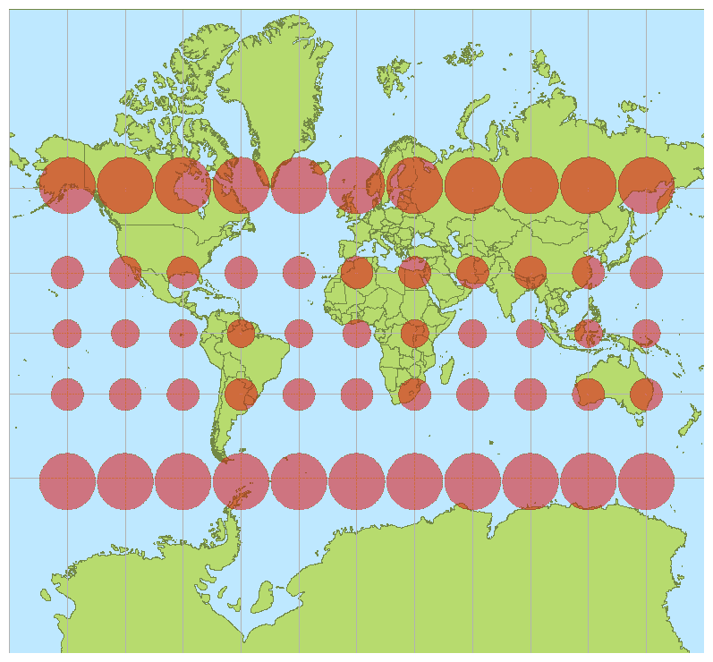
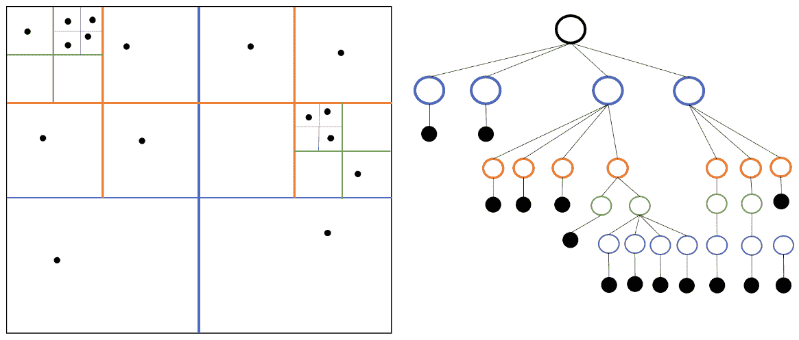
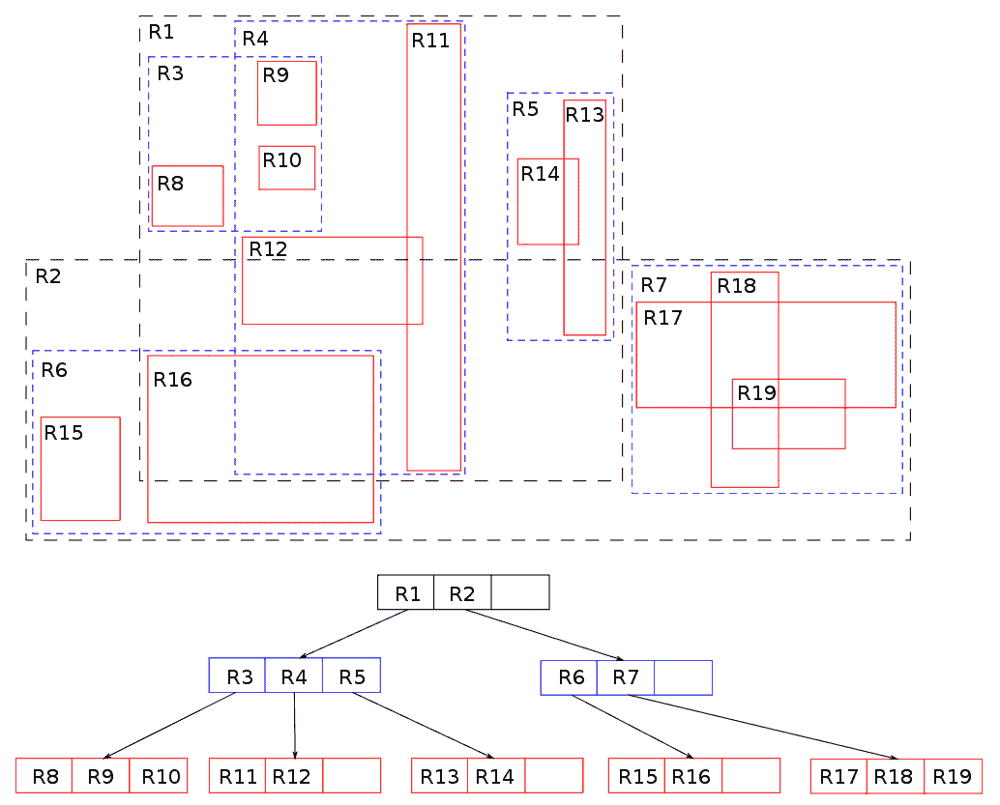
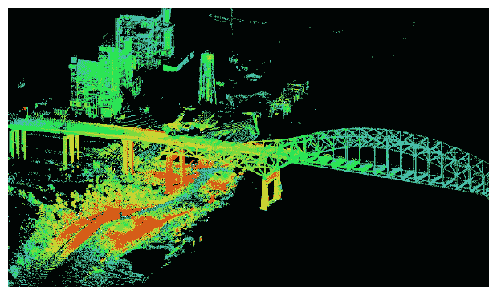

# 二、学习地理空间数据

地理空间分析最具挑战性的方面之一是数据。地理空间数据已经包括数十种文件格式和数据库结构，并且继续发展和增长，以包括新类型的数据和标准。此外，几乎任何文件格式在技术上都可以包含地理空间信息，只需添加一个位置即可。

在本章中，我们将研究以下主题:

*   获得常见数据格式的概述
*   检查地理空间数据的一些共同特征
*   理解空间索引
*   了解最广泛使用的向量数据类型
*   了解栅格数据类型

我们还将深入了解更新、更复杂的类型，包括点云数据、网络服务和地理空间数据库。

# 获得常见数据格式的概述

作为地理空间分析师，您可能经常会遇到以下一般数据类型:

*   电子表格和**逗号分隔值** ( **CSV 文件**)或**制表符分隔值** ( **TSV 文件**
*   地理标记的照片
*   轻量级二进制点、线和多边形
*   数千兆字节的卫星或航空图像
*   高程数据，如网格、点云或基于整数的图像
*   XML 文件
*   JSON 文件
*   数据库(服务器和文件数据库)
*   Web 服务
*   地理数据库

每种格式都有自己的访问和处理挑战。当您对数据进行分析时，通常必须先进行某种形式的预处理。您可以将大面积的卫星图像裁剪或子集化到您感兴趣的区域，或者您可以将集合中的点数减少到数据模型中满足特定标准的点数。这种预处理的一个很好的例子是我们在[第 1 章](01.html)*末尾看到的`SimpleGIS`例子，学习使用 Python 进行地理空间分析*。州数据集只包括科罗拉多州，而不是全部 50 个州。城市数据集只包括三个样本城市，展示了三个层次的人口，以及不同的相对位置。

[第 1 章](01.html)、*中的常见地理空间操作使用 Python 学习地理空间分析*，是这种预处理的构建模块。但是，需要注意的是，地理空间分析领域已经逐渐转向易于获取的底图。直到 2004 年左右，地理空间数据很难获得，桌面计算能力也远不如现在。对任何地理空间项目来说，预处理数据都是绝对的第一步。然而，在 2004 年，谷歌发布了谷歌地图，这在谷歌地球之后不久。微软也一直在开发一项名为 **TerraServer** 的技术收购，这次他们重新启动了这项收购。2004 年，**开放地理空间联盟** ( **OGC** )更新了其**网络地图服务** ( **WMS** )的版本，该版本的使用量和受欢迎程度越来越高。同年，Esri 还发布了其 ArcGIS server 系统的第 9 版。这些创新是由谷歌的网络地图平铺模型推动的，该模型允许以许多不同的分辨率平滑、全局、滚动地图，通常被称为**滑动地图**。

在谷歌地图之前，人们在互联网上使用地图服务器，最著名的是地图任务驾驶指南网站。然而，这些地图服务器一次只能提供少量数据，并且通常覆盖有限的区域。谷歌切片系统将全球地图转换为图像和地图数据的分层图像切片。这些都是使用 JavaScript 和基于浏览器的`XMLHttpRequest`应用编程接口动态提供的，更常见的是**异步 JavaScript 和 XML** ( **AJAX** )。谷歌的系统已经扩展到数百万使用普通网络浏览器的用户。更重要的是，它允许程序员利用 JavaScript 编程来创建混搭，这样他们就可以使用谷歌地图 JavaScript API 向地图添加额外的数据。混搭概念实际上是一个共享的地理空间图层系统。用户可以将来自不同 web 服务的数据组合并重新组合成一个单一的地图，只要数据是可通过 web 访问的。其他商业和开源系统很快模仿了这个概念。

分布式地理空间层的显著例子是 **OpenLayers** ，它提供了一个开源的、类似谷歌的应用编程接口，现在已经超越了谷歌的应用编程接口，提供了额外的功能。与开放图层相辅相成的是**开放街道地图**，它是开放图层等系统使用的切片地图服务的开源答案。OpenStreetMap 具有全球、街道级别的向量数据和其他空间特征，这些数据是从可用的政府数据源和全球数千名编辑的贡献中收集的。OpenStreetMap 的数据维护模式类似于在线百科全书维基百科(Wikipedia)为文章创建和更新人群源信息的方式。最近，甚至出现了更多的映射 API，包括小叶和 Mapbox，它们在灵活性、简单性和功能上不断增加。

混搭革命对数据产生了有趣而有益的副作用。地理空间数据传统上很难获得。收集、处理和分发数据的成本使地理空间分析局限于那些能够通过生产或购买数据来承担这一高昂开销的人。几十年来，地理空间分析一直是政府、大型组织和大学的工具。一旦网络地图趋势转向大规模、全球切片地图，组织就开始免费提供底图图层，以便将开发人员吸引到他们的平台。大规模可扩展的全球地图系统需要大规模可扩展的高分辨率数据才能发挥作用。地理空间软件生产商和数据提供商希望保持其市场份额，并跟上技术趋势。

地理空间分析师从这一市场转变中受益匪浅。首先，数据提供商开始在一个名为**墨卡托**的公共投影中分发数据。墨卡托投影是 400 多年前引入的航海投影。正如我们在[第 1 章](01.html)、*中提到的，使用 Python* 学习地理空间分析，所有的投影都有实际的好处，也有扭曲。墨卡托投影中的失真是它的大小。从全球来看，格陵兰岛似乎比南美洲大陆更大。然而，像每一个投影一样，它也有一些好处。墨卡托保留角度。可预测的角度使得中世纪的航海家在绘制穿越海洋的航线时能够画出直线。谷歌地图没有推出墨卡托。然而，很快就清楚了，高纬度和低纬度的道路在地图上以奇数角度相遇，而不是现实中的 90 度。

由于谷歌地图的主要目的是街道级别的行驶方向，因此当查看单个城市时，谷歌牺牲了全局视图精度，以获得街道之间更好的相对精度。相互竞争的制图系统也紧随其后。谷歌还对 WGS 84 的数据进行了标准化。该基准定义了地球的特定球形模型，称为**大地水准面**。这个模型定义了正常的海平面。谷歌这一选择的意义在于**全球定位系统** ( **全球定位系统**)也使用了这一数据。因此，大多数全球定位系统单位也默认该数据，使谷歌地图很容易与原始地理信息系统数据兼容。

墨卡托投影的谷歌变体通常被称为**谷歌墨卡托**。**欧洲石油勘测集团** ( **EPSG** )为预测分配短数字代码，作为参考它们的简单方法。他们没有等待 EPSG 批准或分配一个最初只与谷歌相关的代码，而是开始称这个项目为 EPSG:900913，这是谷歌用数字拼写的*。后来，EPSG 将代码分配给了 EPSG:3857，否定了旧代码。大多数地理信息系统都认为这两个代码是同义词。需要注意的是，谷歌为了使用，对标准墨卡托投影稍作调整；然而，这种变化几乎是察觉不到的。谷歌在所有地图比例下使用球形公式，而标准墨卡托在大比例下采用椭球形。*

 *以下墨卡托投影图像([https://en.wikipedia.org/wiki/File:Tissot_mercator.png](https://en.wikipedia.org/wiki/File:Tissot_mercator.png))取自维基百科:



它显示了使用天梭指示线的墨卡托投影造成的失真，天梭指示线在地图上投影大小相等的小椭圆。椭圆的变形清楚地显示了投影如何影响大小和距离:网络地图服务减少了搜寻数据的繁琐工作和分析师创建底图的大量预处理工作。但是，要创建任何有价值的东西，您必须了解地理空间数据以及如何使用它。本章概述了地理空间分析中常见的数据类型和问题。

在本章中，通常使用两个术语:

*   **向量数据:**向量数据包括使用点、线或多边形最低限度地表示地理位置数据的任何格式。
*   **栅格数据:**栅格数据包括以行和列的网格存储数据的任何格式。光栅数据包括所有图像格式。

这是大多数地理空间数据集可以归入的两个主要类别。

If you want to see a projection that shows the relative size of continents more accurately, refer to the Goode homolosine projection: [https://en.wikipedia.org/wiki/Goode_homolosine_projection](https://en.wikipedia.org/wiki/Goode_homolosine_projection).

# 理解数据结构

尽管有几十种格式，地理空间数据有一些共同的特点。通过识别几乎所有空间数据共有的成分，了解这些特征可以帮助您接近和理解不熟悉的数据格式。给定数据格式的结构通常由其预期用途驱动。

有些数据针对高效存储或压缩进行了优化，有些数据针对高效访问进行了优化，有些数据设计为轻量级和可读的(网络格式)，而其他数据格式则寻求包含尽可能多的不同数据类型。

有趣的是，当今一些最流行的格式也是一些最简单的格式，甚至缺乏功能更强大、更复杂的格式。易用性对于地理空间分析师极其重要，因为将数据集成到地理信息系统以及在分析师之间交换数据花费了大量时间。简单的数据格式最有利于这些活动。

# 共同特征

地理空间分析是一种将信息处理技术应用于具有地理背景的数据的方法。该定义包含地理空间数据的最重要元素:

*   **地理定位数据**:地理定位信息可以简单到地球上的一个点参考一张照片的拍摄地点。它也可以像卫星相机工程模型和轨道力学信息一样复杂，用于重建卫星捕获图像的确切条件和位置。
*   **主题信息**:主题信息也可以涵盖多种可能性。有时，图像中的像素是地面视觉表现方面的数据。其他时候，可以使用多光谱波段(如红外光)处理图像，以提供图像中不可见的信息。处理后的图像通常使用结构化调色板进行分类，调色板链接到一个键，描述每种颜色代表的信息。其他可能性包括某种形式的数据库，其中包含每个地理位置要素的行和列信息，例如从第 1 章*开始的`SimpleGIS`中与每个城市相关联的人口，使用 Python 学习地理空间分析*。

这两个因素存在于可以被视为地理空间数据的每一种格式中。地理空间数据的另一个共同特征是空间索引。概览数据集也与索引相关。

# 理解空间索引

地理空间数据集通常是非常大的文件，很容易达到数百兆字节甚至几千兆字节的大小。执行分析时，地理空间软件在尝试重复访问大型文件时可能会非常慢。

正如在[第 1 章](01.html)*中简要讨论的，使用 Python* 学习地理空间分析，空间索引创建了一个指南，允许软件快速定位查询结果，而无需检查数据集中的每个要素。空间索引允许软件排除可能性，并对小得多的数据子集执行更详细的搜索或比较。

# 空间索引算法

许多空间索引算法是已经在非空间信息上使用了几十年的成熟算法的衍生。最常见的两种空间索引算法是**四叉树索引**和 **R 树索引**。

# 四叉树索引

四叉树算法实际上代表了一系列基于共同主题的不同算法。四叉树索引中的每个节点包含四个子节点。这些子节点通常是正方形或矩形。当一个节点包含指定数量的要素并且添加了更多要素时，该节点会拆分。

将空间分成嵌套正方形的概念加快了空间搜索的速度。软件一次只能处理五个点，并使用简单的大于/小于比较来检查一个点是否在一个节点内。四叉树索引最常见于基于文件的索引格式。

下图显示了按四叉树算法排序的点数据集。黑点是实际的数据集，而框是索引的边界框。请注意，没有任何边界框重叠。左边的图显示了索引的空间表示，而右边的图显示了典型索引的层次关系，这就是空间软件如何查看索引和数据。

这种结构允许空间搜索算法在试图定位一个或多个与其他特征集相关的点时快速排除可能性，如下图所示:



现在我们已经理解了四叉树索引，让我们看看另一种常见类型的空间索引，称为 R 树。

# r 树索引

**R 树**索引比四叉树更复杂。r 树是为处理三维数据而设计的，并经过优化，以与数据库使用磁盘空间和内存的方式兼容的方式存储索引。使用来自各种空间算法的算法将附近的对象分组在一起。一个组中的所有对象都由一个最小矩形界定。这些矩形被聚合成在每一层都平衡的分层节点。

与四叉树不同，R 树的边界框可能跨节点重叠。由于相对复杂和面向数据库的结构，相对于基于文件的格式，R 树最常见于空间数据库。

来自 https://en.wikipedia.org/wiki/File:R-tree.svg 的下图显示了 2D 点数据集的平衡 R 树:



索引会分解大型数据集，但为了加快搜索速度，它们可能会采用一种称为**网格**的技术。我们接下来看看。

# 网格

空间索引也经常使用整数网格的概念。地理空间坐标通常是小数点后两位到十六位的浮点数。对浮点数进行比较比使用整数在计算上要昂贵得多。索引搜索是关于首先消除不需要精度的可能性。

因此，大多数空间索引算法将浮点坐标映射到固定大小的整数网格。在搜索特定功能时，软件可以使用更有效的整数比较，而不是使用浮点数。一旦缩小结果范围，软件就可以访问全部分辨率数据。

对于简单的文件格式，网格大小可以小到 256 x 256，或者在大型地理空间数据库中可以大到 300 万 x 300 万，这些数据库旨在整合所有已知的坐标系和可能的分辨率。

整数映射技术非常类似于在映射程序中用于在图形画布上绘制数据的渲染技术。[第 1 章](01.html)、*中的`SimpleGIS`脚本使用 Python* 学习地理空间分析，也使用这种技术使用内置的 Python 海龟图形引擎渲染点和多边形。

# 什么是概述？

概览数据最常见于栅格格式。概视图是栅格数据集的重采样和低分辨率版本，提供缩略图视图或以不同的地图比例快速加载图像视图。它们也被称为**金字塔**，而创建它们的过程被称为**聚合一个图像**。这些概视图通常经过预处理，并与嵌入文件或单独文件中的全分辨率数据一起存储。

这种便利性的折衷是，额外的图像会增加数据集的整体文件大小；然而，它们加快了图像查看器的速度。向量数据也有概视图的概念，通常用于在概视图中给出数据集的地理环境。然而，因为向量数据是可扩展的，所以通常由软件使用泛化操作动态创建尺寸减小的概视图，如[第 1 章](01.html)、*使用 Python 学习地理空间分析*中所述。

有时，向量数据会通过转换为缩略图图像进行栅格化，缩略图图像与图像标题一起存储或嵌入其中。下图演示了图像概视图的概念，直观地显示了它们为什么通常被称为金字塔:


空间索引和概览有助于加快分析师通过软件访问数据的速度。接下来，我们将看看元数据，它提供了一种人类可读和机器可读的方式来理解、搜索甚至编目数据。

# 什么是元数据？

正如在[第 1 章](01.html)*中所讨论的，使用 Python 学习地理空间分析*，元数据是描述相关数据集的任何数据。元数据的常见示例包括基本元素，如数据集在地球上的足迹，以及更详细的信息，如空间投影和描述数据集如何创建的信息。

大多数数据格式都包含地球上数据的足迹或边界框。详细的元数据通常以标准格式存储在单独的位置，例如美国**联邦地理数据委员会** ( **FGDC** )、**数字地理空间元数据内容标准** ( **CSDGM** )、ISO 或包括元数据要求的较新的欧盟倡议，并被称为欧洲共同体空间信息基础设施 ( **INSPIRE** )。

# 理解文件结构

根据格式的不同，上述元素可以以多种方式存储在单个文件、多个文件或数据库中。此外，这些地理空间信息可以以多种格式存储，包括嵌入的二进制标题、XML、数据库表、电子表格/CSV、单独的文本或二进制文件。

人类可读的格式，如 XML 文件、电子表格和结构化文本文件，只需要一个文本编辑器就可以进行研究。使用 Python 的内置模块、数据类型和字符串操作函数，也可以轻松解析和处理这些文件。基于二进制的格式更复杂。因此，使用第三方库处理二进制格式通常更容易。

但是，您不必使用第三方库，尤其是如果您只想在高层次上调查数据。Python 内置的`struct`模块拥有你需要的一切。`struct`模块允许您以字符串形式读写二进制数据。使用`struct`模块时，您需要了解字节顺序的概念。字节顺序是指组成文件的信息字节如何存储在内存中。这种顺序通常是特定于平台的，但是在一些罕见的情况下，包括 shapefiles，字节顺序被混合到文件中。

Python `struct`模块使用大于(`>`)和小于(`<`)符号来指定字节顺序(分别为大端和小端)。

下面的简单例子演示了 Python `struct`模块从 Esri 形状文件向量数据集中解析边界框坐标的用法。您可以从以下网址下载此形状文件作为压缩文件:[https://github . com/GeospatialPython/Learn/blob/master/Hancock . zip？原始=真实](https://github.com/GeospatialPython/Learn/blob/master/hancock.zip?raw=true)。 [](https://geospatialpython.googlecode.com/files/hancock.zip) 

当你解压这个文件时，你会看到三个文件。对于这个例子，我们将使用`hancock.shp`。Esri shapefile 格式在文件头中具有固定的位置和数据类型，从字节 36 到字节 37，用于最小 *x* 、最小 *y* 、最大 *x* 和最大 *y* 边界框值。在本例中，我们将执行以下步骤:

1.  导入`struct`模块。
2.  以二进制读取模式打开`hancock.zip`形状文件。
3.  导航到字节`36`。
4.  读取指定为`d`的每个 8 字节双变量，并按照`<`符号指定的小端顺序使用`struct`模块将其解包。

执行该脚本的最佳方式是在交互式 Python 解释器中。然后，我们将读取最小经度、最小纬度、最大经度和最大纬度:

```py
>>> import struct 
>>> f = open("hancock.shp","rb") 
>>> f.seek(36) 
>>> struct.unpack("<d", f.read(8)) 
(-89.6904544701547,) >>> struct.unpack("<d", f.read(8)) 
(30.173943486533133,) 
>>> struct.unpack("<d", f.read(8)) 
(-89.32227546981174,) 
>>> struct.unpack("<d", f.read(8)) 
(30.6483914869749,) 
```

您会注意到，当`struct`模块解包一个值时，它会返回一个包含一个值的 Python 元组。您可以将前面的解包代码缩短为一行，方法是一次指定所有四个双精度值，并将字节长度增加到 32 个字节，如以下代码所示:

```py
>>> f.seek(36) 
>>> struct.unpack("<dddd", f.read(32)) 
(-89.6904544701547, 30.173943486533133, -89.32227546981174, 
   30.6483914869749) 
```

既然我们已经了解了如何描述数据，那么让我们了解一种最常见的地理空间数据类型——向量数据。

# 了解最广泛使用的向量数据类型

到目前为止，向量数据是最常见的地理空间格式，因为它是存储空间信息的最有效方式。一般来说，它比栅格数据需要更少的计算机资源来存储和处理。OGC 有超过 16 种与向量数据直接相关的格式。向量数据仅存储几何图元，包括点、线和多边形。但是，对于每种类型的形状，只存储点。例如，在简单的直线向量形状的情况下，只有端点必须被存储并定义为一条线。显示这些数据的软件会读取形状类型，然后用一条线动态连接端点。

地理空间向量数据类似于向量计算机图形的概念，但有一些明显的例外。地理空间向量数据包含正的和负的基于地球的坐标，而向量图形通常存储计算机屏幕坐标。地理空间向量数据通常还与几何图形所表示的对象的其他信息相关联。在全球定位系统数据的情况下，该信息可以像时间戳一样简单，或者对于较大的地理信息系统，可以像整个数据库表一样简单。

向量图形通常存储描述颜色、阴影和其他显示相关指令的样式信息，而地理空间向量数据通常不存储。另一个重要的区别是形状。地理空间向量通常只包括基于点、直线和直线多边形的非常原始的几何图形，而许多计算机图形向量格式具有曲线和圆的概念。然而，地理空间向量可以使用更多的点来建模这些形状。

其他人类可读的格式，如 CSV、简单文本字符串、GeoJSON 和基于 XML 的格式，在技术上是向量数据，因为它们存储的是几何数据，而不是栅格数据，后者代表数据集边界框内的所有数据。直到 20 世纪 90 年代末 XML 的爆发，向量数据格式几乎都是二进制的。XML 提供了一种计算机可读和人类可读的混合方法。折中的办法是，与二进制格式相比，文本格式(如 GeoJSON 和 XML 数据)会大大增加文件大小。这些格式将在本节后面讨论。

可供选择的向量格式数量惊人。OGR([http://www.gdal.org/ogr_formats.html](http://www.gdal.org/ogr_formats.html))开源向量库列出了超过 86 种支持的向量格式。其商业对手，安全软件的**功能操纵引擎** ( **FME** )列出了超过 188 种支持的向量格式([http://www.safe.com/fme/format-search/#filters%5B%5D=VECTOR](http://www.safe.com/fme/format-search/#filters%5B%5D=VECTOR))。这些列表包括一些向量图形格式，以及人类可读的地理空间格式。至少还有很多格式需要注意，以防你遇到它们。

现在，让我们来看看一种特定的、广泛使用的向量数据类型，称为 shapefiles。

# Shapefiles

最普遍的地理空间格式是 Esri shapefile。被称为 Esri 的地理空间软件公司在 1998 年发布了作为开放格式的 shapefile 格式规范([http://www.esri.com/library/whitepapers/pdfs/shapefile.pdf](http://www.esri.com/library/whitepapers/pdfs/shapefile.pdf))。Esri 将其开发为 ArcView 软件的一种格式，旨在作为低端 GIS 选项，以补充其高端专业软件包， **ArcInfo** ，以前称为 **ARC/INFO** 。然而，这种格式的开放规范、效率和简单性使它成为一种非官方的地理信息系统标准，在 15 年后仍然非常流行。

实际上，每一个被标记为地理空间软件的软件都支持 shapefile，因为 shape file 格式非常常见。由于这个原因，作为一名分析师，你几乎可以通过密切熟悉 shapefiles 而忽略其他格式来勉强度日。您可以通过源格式的本机软件或第三方转换器将几乎任何其他格式转换为 shapefile，例如 OGR 库，其中有一个 Python 模块。其他处理 Shapely 文件的 Python 模块是 Shapely 和 Fiona，它们基于 OGR。

shapefile 最显著的特点之一是格式由多个文件组成(从最小到最大，可以有 3-15 个不同的文件)。下表描述了文件格式。有效的形状文件需要`.shp`、`.shx`和`.dbf`文件:

| **支持文件扩展名的 Shapefile】** | **配套文件用途** | **注释** |
| --- | --- | --- |
| `.shp` | 这是形状文件。它包含几何图形。 | 这是一个必需的文件。一些只需要几何图形的软件会接受没有`.shx`或`.dbf`文件的`.shp`文件。 |
| `.shx` | 这是形状索引文件。它是一个固定大小的记录索引，引用几何图形以加快访问速度。 | 这是一个必需的文件。没有`.shp`文件，这个文件没有意义。 |
| `.dbf` | 这是数据库文件。它包含几何属性。 | 这是一个必需的文件。一些软件会在没有`.shp`文件的情况下访问这种格式，因为规范早于 shapefiles。它基于非常古老的 FoxPro 和 dBase 格式。它有一个开放的规范，叫做 Xbase。大多数类型的电子表格软件都可以打开`.dbf`文件。 |
| `.sbn` | 这是空间 bin 文件，即 shapefile 空间索引。 | 它包含映射到 256 x 256 整数网格的要素边界框。这个文件伴随大型 shapefile 数据集是非常常见的。 |
| `.sbx` | `.sbn`文件的固定大小的记录索引。 | 空间索引的传统有序记录索引。经常看到。 |
| `.prj` | 这包含以众所周知的文本格式存储的地图投影信息。 | 由地理信息系统软件进行动态投影的一种非常常见且必需的文件。这种相同的格式也可以伴随栅格数据。 |
| `.fbn` | 只读要素的空间索引。 | 很少见到。 |
| `.fbx` | `.fbn`空间索引的固定大小的记录索引。 | 很少见到。 |
| `.ixs` | 地理编码索引。 | 常见于地理编码应用，包括行驶方向类型应用。 |
| `.mxs` | 另一种地理编码索引。 | 比`.ixs`格式不常见。 |
| `.ain` | 属性索引。 | 大多是遗留格式，很少用于现代软件。 |
| `.aih` | 属性索引。 | 伴随`.ain`文件。 |
| `.qix` | 四叉树索引。 | 一种由开源社区创建的空间索引格式，因为 Esri `.sbn`和`.sbx`文件直到最近才被记录下来。 |
| `.atx` | 属性索引。 | 一个更新的 Esri 软件特有的属性索引，用于加速属性查询。 |
| `.shp.xml` | 元数据。 | 一个地理空间元数据`.xml`容器。它可以是多种 XML 标准中的任何一种，包括 FGDC 和国际标准化组织。 |
| `.cpg` | `.dbf`的代码页文件。 | 用于`.dbf`文件的国际化。 |

您可能永远不会同时遇到所有这些格式。但是，您使用的任何 shapefile 都将有多个文件。你通常会看到`.shp`、`.shx`、`.dbf`、`.prj`、`.sbn`、`.sbx`，偶尔也会看到`.shp.xml`文件。如果要重命名形状文件，必须用相同的名称重命名所有关联的文件；但是，在 Esri 软件和其他 GIS 软件包中，这些数据集将显示为单个文件。

shapefiles 的另一个重要特性是记录没有编号。记录包括几何图形、`.shx`索引记录和`.dbf`记录。这些记录以固定的顺序存储。当您使用软件检查 shapefile 记录时，它们看起来是有编号的。

人们在删除 shapefile 记录、保存文件并重新打开文件时，经常会感到困惑；已删除记录的编号仍会出现。原因是 shapefile 记录在加载时是动态编号的，而不是保存的。因此，例如，如果您删除记录号 23 并保存 shapefile，则下次读取 shapefile 时，记录号 24 将变为 23。许多人希望打开 shapefile，看到记录从 22 跳到 24。以这种方式跟踪 shapefile 记录的唯一方法是在`.dbf`文件中创建一个名为 ID 或类似的新属性，并为每个记录分配一个永久且唯一的标识符。

就像重命名 shape file 一样，在编辑 shape file 时必须小心。最好使用将 shapefiles 作为单个数据集处理的软件。如果您单独编辑任何文件，并在不编辑附带文件的情况下添加/删除记录，大多数地理空间软件会认为 shapefile 已损坏。

# 计算机辅助设计文件

**CAD** 代表**计算机辅助设计**。计算机辅助设计数据的主要格式是由 Autodesk 为其领先的 AutoCAD 软件包创建的。常见的两种格式是**图纸交换格式** ( **DXF** )和 AutoCAD 的原生**图纸** ( **DWG** )格式。

DWG was traditionally a closed format, but it has become more open.

计算机辅助设计软件用于所有与工程相关的事情，从设计自行车到汽车、公园和城市下水道系统。作为一名地理空间分析师，你不必担心机械工程设计；然而，土木工程设计成为一个相当大的问题。大多数工程公司使用地理空间分析的程度非常有限，但几乎所有数据都以计算机辅助设计格式存储。DWG 和 DXF 格式可以使用地理空间软件中没有的要素或地理空间系统支持较弱的要素来表示对象。这些功能的一些示例包括:

*   曲线
*   曲面(对于不同于地理空间高程曲面的对象)
*   三维实体
*   文本(呈现为对象)
*   文本样式
*   视口配置

这些特定于计算机辅助设计和工程的功能使得很难将计算机辅助设计数据干净地转换为地理空间格式。如果您遇到计算机辅助设计数据，最简单的选择是询问数据提供商他们是否有形状文件或其他以地理空间为中心的格式。

# 基于标签和基于标记的格式

基于标记的标记格式通常是 XML 格式。它们还包括其他结构化文本格式，如**知名文本** ( **WKT** )格式，用于投影信息文件以及不同类型的数据交换。

XML 格式包括**锁眼标记语言**(**KML**)**OpenStreetMap**(**OSM**)格式，以及 GPS 数据的 Garmin GPX 格式，后者已经成为一种流行的交换格式。开放地理空间联盟的**地理标记语言** ( **GML** )标准是最古老、使用最广泛的基于 XML 的地理格式之一。它也是 OGC **网络功能服务** ( **WFS** )网络应用标准的基础。然而，GML 已经基本上被 KML 和 GeoJSON 格式所取代。

XML 格式通常不仅仅包含几何图形。它们还包含属性和渲染说明，如颜色、样式和符号系统。谷歌的 KML 格式已经成为完全受支持的 OGC 标准。以下是 KML 的一个样本，展示了一个简单的地标:

```py
<?xml version="1.0" encoding="utf-8"?> 
<kml > 
  <Placemark> 
    <name>Mockingbird Cafe</name> 
    <description>Coffee Shop</description> 
    <Point> 
      <coordinates>-89.329160,30.310964</coordinates> 
    </Point> 
  </Placemark> 
</kml> 
```

XML 格式对地理空间分析师很有吸引力，原因如下:

*   这是一种人类可读的格式。
*   它可以在文本编辑器中编辑。
*   编程语言(尤其是 Python)很好地支持它。
*   根据定义，它很容易扩展。

然而，XML 并不完美。对于非常大的数据格式来说，这是一种低效的存储机制，编辑起来会很麻烦。数据集中的错误很常见，大多数解析器不能稳健地处理错误。尽管有缺点，但 XML 在地理空间分析中被广泛使用。

**可伸缩向量图形** ( **SVG** )是一种广泛支持的计算机图形 XML 格式。浏览器很好地支持它，并且经常用于地理空间渲染。然而，SVG 不是作为地理格式设计的。

WKT 格式也是一个更古老的 OGC 标准。它最常见的用途是定义通常存储在`.prj`投影文件中的投影信息，以及形状文件或光栅。WGS 84 坐标系的 WKT 字符串如下:

```py
GEOGCS["WGS 84", 
    DATUM["WGS_1984", 
        SPHEROID["WGS 84",6378137,298.257223563, 
            AUTHORITY["EPSG","7030"]], 
        AUTHORITY["EPSG","6326"]], 
    PRIMEM["Greenwich",0, 
        AUTHORITY["EPSG","8901"]], 
    UNIT["degree",0.01745329251994328, 
        AUTHORITY["EPSG","9122"]], 
    AUTHORITY["EPSG","4326"]] 
```

定义投影的参数可能很长。由 EPSG 创建的一个标准委员会引入了一个数字编码系统来参考预测。这些代码，如 EPSG:4326，被用作字符串的简写，如前面的代码。还有一些常用投影的简称，如墨卡托投影，可以在不同的软件包中引用一个投影。

More information on these reference systems can be found on the spatial reference website at [http://spatialreference.org/ref/](http://spatialreference.org/ref/).

# 杰尤森

GeoJSON 是一种基于**JavaScript Object Notation**(**JSON**)格式的相对较新且出色的文本格式，多年来一直是一种常用的数据交换格式。尽管 GeoJSON 的历史很短，但它可以嵌入到所有主要的地理空间软件系统和大多数分发数据的网站中。这是因为 JavaScript 是动态网页的语言，而 GeoJSON 可以直接馈入 JavaScript。

GeoJSON 是流行的 JSON 格式的完全向后兼容的扩展。JSON 的结构非常相似，在某些情况下，与通用编程语言的现有数据结构相同。JSON 几乎与 Python 的字典和列表数据类型完全相同。由于这种相似性，在脚本中解析 JSON 从零开始很简单，但是有很多库可以让它变得更容易。Python 包含一个名为`json`的内置库。

GeoJSON 为您提供了定义几何图形、属性、边界框和投影信息的标准方法。GeoJSON 具有 XML 的所有优点，包括人类可读的语法、出色的软件支持以及在行业中的广泛使用。它也超越了 XML。

GeoJSON 比 XML 紧凑得多，主要是因为它使用简单的符号来定义对象，而不是打开和关闭充满文本的标签。这种紧凑性也有助于更大数据集的可读性和可管理性。然而，从数据量的角度来看，它仍然不如二进制格式。以下是 GeoJSON 语法的示例，定义了一个包含点和线的几何集合:

```py
{ "type": "GeometryCollection", 
  "geometries": [ 
    { "type": "Point", 
      "coordinates": [-89.33, 30.0] 
    }, 
    { "type": "LineString", 
      "coordinates": [ [-89.33, 30.30], [-89.36, 30.28] ] 
    } 
  {"type": "Polygon", 
    "coordinates": [[ 
      [-104.05, 48.99], 
      [-97.22,  48.98] 
    } 
  ] 
} 
```

前面的代码是有效的 GeoJSON，但也是有效的 Python 数据结构。您可以将前面的代码示例作为变量定义直接复制到 Python 解释器中，它将毫无错误地进行评估，如下所示:

```py
gc = { "type": "GeometryCollection", 
  "geometries": [ 
    { "type": "Point", 
      "coordinates": [-89.33, 30.0] 
    }, 
    { "type": "LineString", 
      "coordinates": [ [-89.33, 30.30], [-89.36, 30.28] ] 
    } 
  ] 
} 
gc 
{'type': 'GeometryCollection', 'geometries': [{'type': 'Point', 
   'coordinates': [ 
  -89.33, 30.0]}, {'type': 'LineString', 'coordinates': [[-89.33, 
     30.3], [-89.36,30.28]]}]} 
```

由于其紧凑的大小，由于用 JavaScript 编写的互联网友好的语法，以及主要编程语言的支持，GeoJSON 是领先的 REST 地理空间 web APIs 的关键组件，这将在本章稍后介绍。目前，它在二进制格式的计算机资源效率、文本格式的人类可读性和编程实用性之间提供了最佳折衷。

# 地质包装

我们将在此简要提及地理包格式，因为它包含在[第 3 章](03.html)、*地理空间技术景观*中，也因为它是一种地理数据库。`geopackage`格式是基于 SQLite 文件的数据库容器上的 OGC 开放标准，该数据库容器独立于平台、供应商和软件。它试图摆脱所有由专有数据格式或受限数据格式产生的问题。

接下来，我们将看看其他主要的数据类型:栅格数据。

# 了解栅格数据类型

栅格数据由行和列的像元或像素组成，每个像元代表一个值。将栅格数据视为图像是最简单的方式，这是软件通常表示它们的方式。但是，栅格数据集不一定存储为图像。它们也可以是 ASCII 文本文件或数据库中的二进制大对象。

地理空间栅格数据和常规数字图像的另一个区别是分辨率。如果以全尺寸打印，数字图像以每英寸点数表示分辨率。分辨率也可以表示为图像中的像素总数，定义为百万像素。但是，地理空间栅格数据使用每个像元代表的地面距离。例如，分辨率为 2 英尺的栅格数据集意味着单个像元代表地面上的 2 英尺，这也意味着只有大于 2 英尺的对象才能在数据集中直观地识别出来。

栅格数据集可能包含多个波段，这意味着可以在同一时间在同一区域收集不同波长的光。通常，这个范围是从 3-7 个波段，但是在高光谱系统中可以是几百个。这些波段作为图像的 RGB 波段单独查看或交换进出。还可以使用数学方法将它们重新组合成衍生的单波段图像，然后使用代表数据集中值的一定数量的类重新着色。

栅格数据的另一个常见应用是在科学计算领域，该领域共享地理空间遥感的许多元素，但增加了一些有趣的曲折。科学计算经常使用复杂的栅格格式，包括**网络公共数据表单** ( **网络 CDF**)**GRIB**和 **HDF5** ，它们存储整个数据模型。这些格式更像文件系统中的目录，可以包含多个数据集或同一数据集的多个版本。海洋学和气象学是这种分析最常见的应用。科学计算数据集的一个示例是天气模型的输出，其中不同波段的栅格数据集的像元可能表示时间序列中模型的不同变量输出。

像向量数据一样，栅格数据可以有多种格式。开源的`raster`库，被称为**地理空间数据抽象库** ( **GDAL** )，它实际上包括我们前面提到的向量 OGR 库，列出了超过 130 种支持的栅格格式([http://www.gdal.org/formats_list.html](http://www.gdal.org/formats_list.html))。FME 软件包也支持这许多。然而，就像形状文件和计算机辅助设计数据一样，也有一些突出的光栅格式。

# TIFF 文件

**标记图像文件格式** ( **TIFF** )是最常见的地理空间栅格格式。TIFF 格式的灵活标记系统允许它在单个文件中存储任何类型的数据。TIFFs 可以包含概览图像、多个波段、整数高程数据、基本元数据、内部压缩以及通常以其他格式存储在附加支持文件中的各种其他数据。任何人都可以通过向文件结构添加标记数据来非正式地扩展 TIFF 格式。这种可扩展性有优点也有缺点。然而，一个 TIFF 文件可能在一个软件中运行良好，但在另一个软件中访问时会失败，因为这两个软件包在不同程度上实现了大量的 TIFF 规范。一个关于 TIFF 的老笑话有一个令人沮丧的事实: **TIFF** 代表**成千上万不兼容的文件格式**。GeoTIFF 扩展定义了地理空间数据的存储方式。存储为 TIFF 文件的地理空间栅格可能具有以下任何文件扩展名:`.tiff`、`.tif`或`.gtif`。

# JPEG、GIF、BMP 和 PNG

JPEG、GIF、BMP 和 PNG 格式通常是常见的图像格式，但也可用于基本的地理空间数据存储。通常，这些格式依赖于信息地理配准的辅助文本文件，以便与地理信息系统软件兼容，如 WKT、`.prj`或世界文件。

JPEG 格式对于地理空间数据来说也相当常见。JPEGs 有一个内置的元数据标记系统，类似于 TIFFs，叫做 EXIF。除了栅格地理信息系统图层之外，JPEGs 通常还用于地理标记的照片。**位图** ( **BMP** )图像用于桌面应用和文档图形。但是，JPEG、GIF 和 PNG 是网络地图应用程序中使用的格式，尤其是用于预生成的服务器地图切片，以便通过滑动地图快速访问。

# 压缩格式

由于地理空间栅格往往非常大，因此通常使用高级压缩技术存储它们。最新的开放标准是 JPEG 2000 格式，它是 JPEG 格式的升级，包括小波压缩和一些其他功能，如地理参考数据。**多分辨率无缝图像数据库** ( **MrSID** ) ( `.sid`)和**增强压缩小波** ( **ECW** ) ( `.ecw`)是地理空间环境中常见的两种专有小波压缩格式。

TIFF 格式支持压缩，包括**伦佩尔-齐夫-韦尔奇** ( **LZW** )算法。必须注意的是，压缩数据适合作为底图的一部分，但不应用于遥感处理。压缩图像被设计成视觉上正确，但通常会改变原始单元格的值。无损压缩算法试图避免降低源数据的质量，但通常认为尝试对经过压缩的数据进行频谱分析是一个坏主意。JPEG 格式是一种有损格式，它会牺牲数据以获得更小的文件大小。它也是经常遇到的，所以记住这个事实以避免无效结果是很重要的。

# ASCII 网格

另一种存储栅格数据(通常是高程数据)的方法是在 ASCII 网格文件中。这种文件格式由 Esri 创建，但已成为大多数软件包支持的非官方标准。ASCII 网格是一个简单的文本文件，包含( *x* ， *y* )作为行和列的值。栅格的空间信息包含在一个简单的标题中。文件的格式如下:

```py
<NCOLS xxx> 
<NROWS xxx> 
<XLLCENTER xxx | XLLCORNER xxx> 
<YLLCENTER xxx | YLLCORNER xxx> 
<CELLSIZE xxx> 
{NODATA_VALUE xxx} 
row 1 
row 2 
. 
. 
. 
row n 
```

虽然不是存储数据的最有效方式，但 ASCII 网格文件非常受欢迎，因为它们不需要任何特殊的数据库来创建或访问地理空间栅格数据。这些文件通常作为`.zip`文件分发。前面格式的标题值包含以下信息:

*   列数
*   行数
*   *x*-轴单元中心坐标|*x*-轴左下角坐标
*   *y*-轴单元中心坐标|*y*-轴左下角坐标
*   以映射单位表示的单元格大小
*   无数据值(通常为 9，999)

# 世界档案

世界文件是简单的文本文件，对于通常不支持空间信息的文件格式，包括 JPEG、GIF、PNG 和 BMP，可以从外部为任何图像提供地理空间参考信息。由于其命名约定，世界文件被地理空间软件识别。命名世界文件最常见的方法是使用栅格文件名，然后更改扩展名以删除中间的字母，并在末尾添加`w`。

下表显示了不同格式的光栅图像以及基于惯例的相关世界文件名的一些示例:

| 光栅文件名 | 世界文件名 |
| `World.jpg` | `World.jgw` |
| `World.tif` | `World.tfw` |
| `World.bmp` | `World.bpw` |
| `World.png` | `World.pgw` |
| `World.gif` | `World.gfw` |

世界文件的结构非常简单。它是一个六行文本文件，如下所示:

*   第 1 行:以地面单位表示的沿 *x* 轴的单元尺寸
*   第二行:在 *y* 轴上的旋转
*   第 3 行:在 *x* 轴上的旋转
*   第 4 行:沿 *y* 轴的像元尺寸，单位为地面单位
*   第 5 行:左上角单元格的中心*x*-坐标
*   第 6 行:左上角单元格的中心 *y* 坐标

以下是世界文件值的示例:

```py
15.0 
0.0 
0.0 
-15.0 
-89,38 
45.0 
```

第 1、4、5 和 6 行中包含的( *x* 、 *y* )坐标和( *x* 、 *y* )像元大小允许您计算任意像元的坐标或一组像元之间的距离。旋转值对于地理空间软件很重要，因为遥感图像经常由于数据收集平台而旋转。

旋转图像会有重采样数据的风险，从而导致数据丢失，因此旋转值允许软件考虑失真。图像外部的周围像素通常被赋予一个`no data`值，并表示为黑色。

以下图片由来自[https://viewer.nationalmap.gov/advanced-viewer/](https://viewer.nationalmap.gov/advanced-viewer/)的**美国地质调查局** ( **美国地质勘探局**)提供，演示了图像旋转，其中卫星采集路径的方向为从东南到东北，但底层底图为北:


在 Python 中处理栅格数据时，世界文件是一个很好的工具。大多数地理空间软件和数据库都支持世界文件，因此在地理配准方面，它们通常是一个不错的选择。

You'll find that world files are very useful, but as you use them infrequently, you will forget what the unlabeled contents represent. A quick reference for world files is available at [https://kralidis.ca/gis/worldfile.htm](http://kralidis.ca/gis/worldfile.htm).

向量数据和栅格数据是两种最常见的数据类型。然而，由于收集成本逐渐变得更便宜，另一种类型越来越受欢迎。这种类型就是点云数据，接下来我们将对其进行研究。

# 什么是点云数据？

点云数据是基于某种聚焦能量返回作为表面点的( *x* 、 *y* 、 *z* )位置收集的任何数据。这可以使用激光、雷达波、声学探测或其他波形生成设备来创建。点之间的间距是任意的，并且取决于收集数据的传感器的类型和位置。

在这本书里，我们将主要关注激光雷达数据和雷达数据。雷达点云数据通常是在空间任务中收集的，而激光雷达通常是由地面或机载车辆收集的。从概念上讲，这两种类型的数据是相似的。

# 激光雷达

激光雷达使用强大的激光测距系统，以非常高的精度模拟世界。术语 **LIDAR** ，或者 LIDAR，是词语*光*和*雷达*的组合。有人声称它也代表**光探测和测距**。激光雷达传感器可以安装在空中平台上，包括卫星、飞机或直升机。它们也可以安装在车辆上进行地面收集。

由于激光雷达提供的高速、连续的数据采集，以及宽视野(通常是传感器的 360 度)，激光雷达数据通常不像其他形式的栅格数据那样具有矩形覆盖区。激光雷达数据集通常被称为点云，因为数据是一系列 *(x，y，z* )位置，其中 *z* 是从激光到被检测物体的距离，( *x* ， *y* )值是根据传感器位置计算的物体投影位置。

下图由美国地质勘探局提供，显示了使用地面传感器而不是航空传感器的城市地区点云激光雷达数据集。颜色基于激光能量返回的强度，红色区域更靠近激光雷达传感器，绿色区域更远，可以给出几厘米以内的精确高度:



LIDAR 数据最常见的数据格式是 **LIDAR 交换格式** ( **LAS** ，这是一个社区标准。LIDAR 数据可以用多种方式表示，包括一个简单的文本文件，每行有一个( *x* 、 *y* 、 *z* )元组。有时，激光雷达数据可以使用同时收集的图像像素颜色进行着色。激光雷达数据也可用于创建 2D 高程栅格。

这种技术是激光雷达在地理空间分析中最常见的用途。任何其他用途都需要专门的软件，允许用户以 3D 方式工作。在这种情况下，其他地理空间数据不能与点云结合。

# 什么是 web 服务？

地理空间 web 服务允许用户通过 web 执行数据发现、数据可视化和数据访问。Web 服务通常由基于用户输入的应用程序访问，例如放大在线地图或搜索数据目录。最常见的协议是返回渲染地图图像的**网络地图服务** ( **WMS** )和返回 GML 的**网络要素服务** ( **WFS** )，这在本章的介绍中有所提及。

许多 WFS 服务还可以返回 KML、JSON、压缩的形状文件和其他格式。这些服务通过 HTTP `GET`请求调用。以下 URL 是一个 WMS `GET`请求的示例，该请求返回一个 640 像素宽、400 像素高的世界地图图像，EPSG 代码为 900913:[http://ows.mundialis.de/services/service?SERVICE=wms&VERSION = 1 . 1 . 1&REQUEST = GetMap&FORMAT = image/png&STYLES =&WIDTH = 600&HEIGHT = 400&LAYERS = TOPO-OSM-WMS&SRS = EPSG:900](http://ows.mundialis.de/services/service?SERVICE=wms&VERSION=1.1.1&REQUEST=GetMap&FORMAT=image/png&STYLES=&WIDTH=600&HEIGHT=400&LAYERS=TOPO-OSM-WMS&SRS=EPSG:900913&BBOX=-20037508,-20037508,20037508,20037508) [](http://osm.woc.noaa.gov/mapcache?SERVICE=wms&VERSION=1.1.1&REQUEST=GetMap&FORMAT=image/png&WIDTH=600&HEIGHT=400&LAYERS=osm&SRS=EPSG:900913&BBOX=-20037508,-20037508,20037508,20037508) 

Web 服务正在快速发展。开放地理信息系统联盟正在为传感器网络和其他地理空间环境增加新的标准。**代表性状态转移** ( **REST** )服务也是常用的。REST 服务使用简单的 URL，通过相应地定制 URL 参数及其值，使得请求数据在几乎任何编程语言中都非常容易实现。几乎每种编程语言都有强大的 HTTP 客户端库，能够使用 REST 服务。

这些 REST 服务可以返回许多类型的数据，包括图像、XML 或 JSON。目前还没有通用的地理空间 REST 标准，但 OGC 已经研究了很长时间。Esri 已经创建了一个目前广泛使用的工作实现。

The following URL is an example of an Esri geospatial REST service that would return KML based on a weather radar image layer. You can add this URL to Google Earth as a network link, or you can download it as compressed KML (KMZ) in a browser to import it into another program: [https://idpgis.ncep.noaa.gov/arcgis/rest/services/NWS_Observations/radar_base_reflectivity/MapServer/generateKml?docName=NWSRadar&layers=0&layerOptions=separateImage](https://idpgis.ncep.noaa.gov/arcgis/rest/services/NWS_Observations/radar_base_reflectivity/MapServer/generateKml?docName=NWSRadar&layers=0&layerOptions=separateImage).

You can find tutorials on the myriad of OGC services here: [http://cite.opengeospatial.org/pub/cite/files/edu/fundamental-concepts/text/basic.html](http://cite.opengeospatial.org/pub/cite/files/edu/fundamental-concepts/text/basic.html).

在撰写本书时，OGC 正在经历一场应用编程接口的演变，它将通过诸如 REST、OpenAPI、JSON/HTML 和 Swagger 等技术显著降低使用地理空间应用编程接口的障碍。你可以在这里通过 OGC 的技术路线图追踪这些趋势:[https://github.com/opengeospatial/OGC-Technology-Trends](https://github.com/opengeospatial/OGC-Technology-Trends)。

现在，我们将从单个文件格式转向功能强大的地理数据库，这些地理数据库可以通过单个应用编程接口整合数据。

# 了解地理空间数据库

地理空间数据库或地理数据库是指文件格式、数据模式甚至软件的整个类别。在[第 3 章](03.html)*地理空间技术领域*中，我们将把地理数据库作为软件包进行介绍，正式称为数据库管理系统。但是在本节中，我们将把它们的属性描述为文件格式。地理数据库历史上仅存储向量数据，但现代地理数据库也非常适合栅格数据管理。

地理数据库可以展示我们之前提到的所有共同特征。这些信息存储在我们称之为数据库模型的数据库中。一种非常流行的模型是传统的关系模型，它使用行和列的表。每行和每列的组合称为一个单元格。行可以与另一个表相关联，以使用指定的列链接信息，其中每个单元格都成为引用另一个表中的单元格的键，然后将行链接在一起。

列的实际名称和数据之间的关系构成了数据定义。地理数据库至少会将几何描述与几何所代表的对象的属性相关联。单点通常由`x`和`y`列表示。但是，多边形和多段线具有任意数量的点。这意味着地理数据库通常将几何信息存储为一个 **BLOB** ，使用的格式标准称为**众所周知的二进制**或 **WKB** 。

属性信息通常被定义为数据类型，如整数、浮点十进制数、字符串或日期。该表还可以包括用于地图显示的投影信息，以及用于加速搜索和地理空间比较的空间索引栏。地理数据库也可能有另一个相关表，以便链接关于地理空间数据的详细元数据。

大型地理空间栅格数据集很少直接存储在数据库中。通常，栅格数据以一个名称存储在磁盘上，文件系统引用存储在指向栅格数据的数据库中。地理数据库还可以存储表示栅格数据地面覆盖区的几何列，然后可以将其用作地理空间操作的代理。

# 摘要

现在，您已经具备了处理常见类型的地理空间数据所需的背景。您还了解地理空间数据集的共同特征，这些特征将允许您评估不熟悉的数据类型，并确定关键元素，这些元素将推动您在与这些数据交互时使用哪些工具。

在下一章中，我们将研究可用于处理地理空间数据集的模块和库。我们将了解地理空间技术生态系统，它由数千个软件库和包组成。我们还将了解地理空间软件的层次结构，以及它如何让您快速理解和评估任何地理空间工具。

# 进一步阅读

你可以在这里找到无数 OGC 服务的教程。*