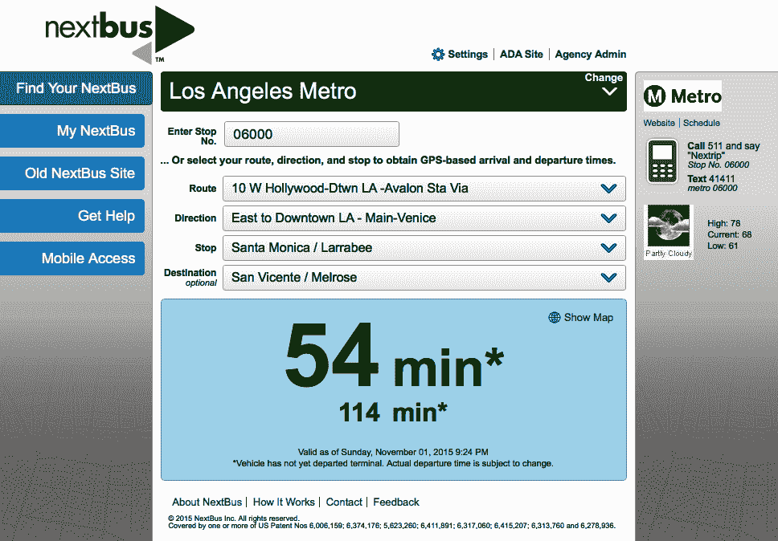
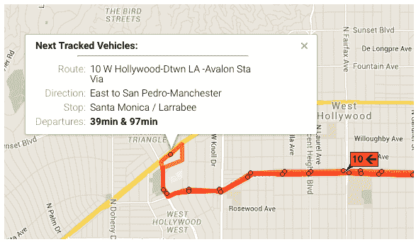
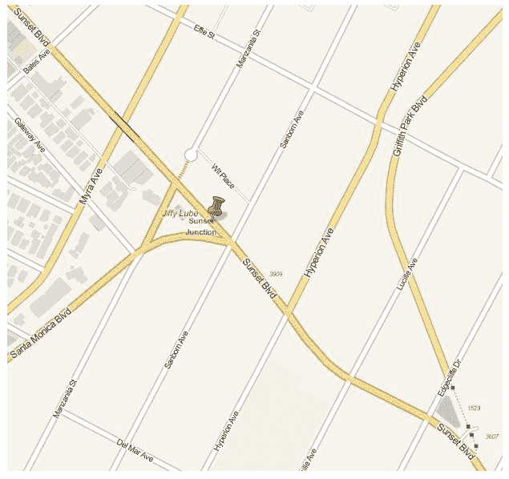
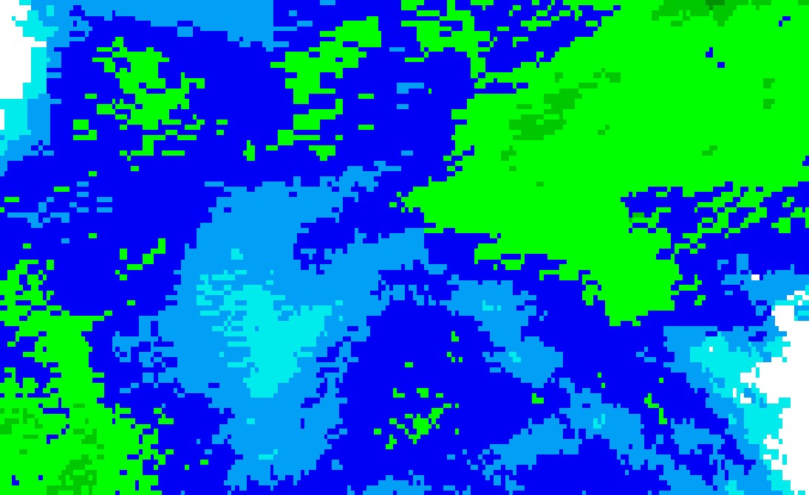
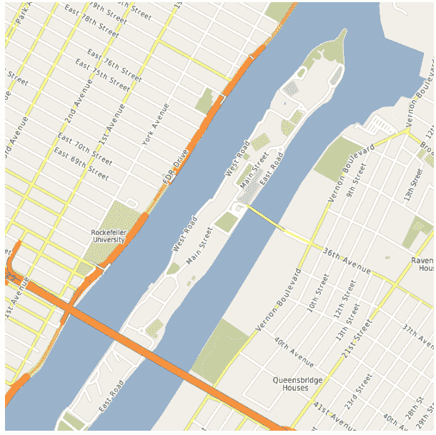
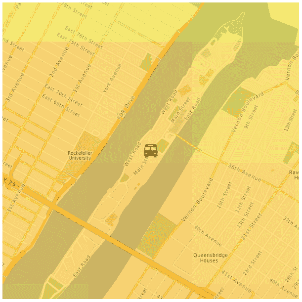
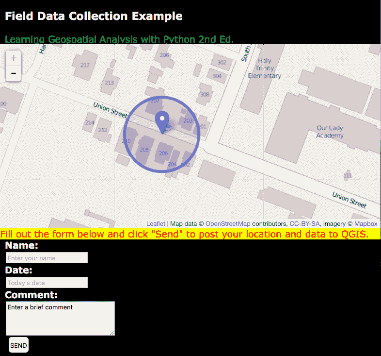

# 九、实时数据

地理空间分析师的一句俗语是:*地图一创建就过时了*。这句话反映了地球和地球上的一切都在不断变化的事实。对于地理空间分析的大部分历史和本书的大部分内容，地理空间产品是相对静态的。原始数据集通常在几个月到几年的时间内更新。地图中地理空间数据的时代被称为**数据货币**。

由于收集数据所需的时间和费用，数据货币传统上不是主要关注点。网络地图、无线蜂窝调制解调器和低成本的全球定位系统天线改变了这一焦点。现在，监控一个快速变化的对象或系统，并将这些变化在线传播给数百万人，在后勤上是可行的，甚至是非常经济的。这一变化正在彻底改变地理空间技术，并将其带入新的方向。这场革命最直接的证据是使用谷歌地图或 OpenLayers 等系统和网络可访问数据格式的网络地图混搭。每天，越来越多的电子设备上线，广播它们的位置和数据，以实现自动化或远程控制。例子包括恒温器、照相机、汽车等等。你也可以使用廉价的嵌入式计算机，比如流行的树莓皮，将几乎任何东西都变成一个互联的**智能**设备。这种将设备连接成数据和信息网络的概念被称为**物联网** ( **物联网**)。

在本章中，我们将查看以下主题:

*   实时数据的局限性
*   使用实时数据
*   跟踪车辆
*   风暴追逐
*   来自现场的报告

到最后，您将学会使用实时地理空间数据，并且能够构建一个字段报告工具，该工具可以作为任何类型数据的数据传输源。

# 技术要求

本章要求以下内容:

*   Python 3.6 或更高版本
*   内存:最小 6 GB (Windows)，8 GB (macOS)，推荐 8 GB
*   存储:最低 7200 转/分的 SATA，有 20 GB 的可用空间，推荐的固态硬盘有 40 GB 的可用空间
*   处理器:最低英特尔酷睿 i3 2.5 GHz，推荐英特尔酷睿 i5
*   MapQuest Developer API 密钥，在此提供:[https://Developer . MapQuest . com/plan _ purchase/steps/business _ edition/business _ edition _ free/register](https://developer.mapquest.com/plan_purchase/steps/business_edition/business_edition_free/register)

# 实时数据的局限性

术语**实时数据**通常意味着接近实时。一些跟踪设备捕捉实时数据，并且可能每秒更新几次。但是，广播这些数据的基础设施的局限性可能会将输出限制在每 10 秒或更长时间一次。天气雷达就是一个完美的例子。一台**多普勒天气雷达** ( **DWR** )持续扫描，但数据通常每五分钟在线一次。但是考虑到与传统地理空间数据更新的对比，几分钟的刷新就足够实时了。局限性可以总结如下:

*   限制数据大小的网络带宽限制
*   限制数据更新频率的网络延迟
*   由于电池寿命等限制，数据源的可用性
*   由于消费者可以立即获得数据，因此缺乏质量控制
*   由于快速接收未经验证的数据而导致的安全漏洞

实时数据为地理空间应用开辟了更多的机会，因此我们接下来将研究如何使用它。

# 使用实时数据

Web 混搭通常使用实时数据。网络混搭令人惊叹，改变了许多不同行业的运作方式。但是它们通常是有限的，因为它们通常只在地图上显示预处理过的数据，并允许开发人员访问 JavaScript API。但是如果你想以某种方式处理数据呢？如果您想要过滤、更改，然后将其发送到另一个系统，该怎么办？要将实时数据用于地理空间分析，您需要能够将其作为点数据或地理参考栅格进行访问。

You can find out more about web map mashups here: [https://www.esri.com/arcgis-blog/products/product/uncategorized/digital-map-mashups/](https://www.esri.com/arcgis-blog/products/product/uncategorized/digital-map-mashups/).

与前面几章中的例子一样，脚本尽可能简单，设计为从头到尾阅读，没有太多的思维循环。当使用函数时，首先列出它们，然后是脚本变量声明，最后是主程序执行。

现在让我们看看如何使用 NextBus API 中的车辆访问实时和点位置数据源。

# 跟踪车辆

对于我们的第一个实时数据源，我们将使用优秀的 **NextBus API** 。next bus([http://www.nextbus.com/](http://www.nextbus.com/))是一项商业服务，跟踪城市公共交通，包括公共汽车、无轨电车和火车。乘坐这些公交线路的人们可以追踪下一班*公交车*的到达时间。

更好的是，在客户的允许下，NextBus 通过**表征状态转移** ( **REST** ) **API 发布跟踪数据。**使用 URL API 调用，开发者可以请求关于车辆的信息，并接收关于其位置的 XML 文档。这个应用编程接口是开始使用实时数据的简单方法。

如果你去 NextBus，你会看到如下截图所示的网络界面，显示了加州洛杉矶市地铁系统的数据:



系统允许您选择几个参数来学习下一站的当前位置和时间预测。在屏幕的右侧，有一个指向谷歌地图混搭的链接，显示了特定路线的交通跟踪数据，如下图所示:



这是一个非常有用的网站，但它不能让我们控制数据如何显示和使用。让我们直接使用 Python 和 NextBus REST API 访问原始数据，开始处理实时数据。

对于本章中的示例，我们将使用在此找到的有文档记录的 next bus API:[http://www.nextbus.com/xmlFeedDocs/NextBusXMLFeed.pdf](http://www.nextbus.com/xmlFeedDocs/NextBusXMLFeed.pdf)。

从这个例子开始，我们需要一个所需总线的列表。

# 下一个巴士公司名单

NextBus 的客户被称为**机构**。在我们的例子中，我们将在前往加州洛杉矶的路线上跟踪公共汽车。首先，我们需要获得一些关于该机构的信息。下一个总线应用编程接口由一个名为`publicXMLFeed`的网络服务组成，在这个服务中你可以设置一个名为`command`的参数。我们将在浏览器中调用`agencyList`命令，使用以下 REST URL 获取包含机构信息的 XML 文档:[http://webservices.nextbus.com/service/publicXMLFeed?命令=机构列表](http://webservices.nextbus.com/service/publicXMLFeed?command=agencyList)。

当我们在浏览器中访问该链接时，它会返回一个包含`<agency/>`标签的 XML 文档。洛杉矶的标签如下所示:

```py
<agency tag="lametro" title="Los Angeles Metro" regionTitle="California-Southern"/> 
```

既然我们有了公共汽车的清单，我们需要知道它们可以行驶的路线。

# 下一班车路线列表

`tag`属性是雷霆湾的 ID，我们需要它来执行其他的 NextBus API 命令。其他属性是人类可读的元数据。我们需要的下一条信息是关于**路线 2** 巴士路线的细节。为了获取这些信息，我们将使用机构标识和`routeList` REST 命令，通过将网址粘贴到我们的网络浏览器中来获取另一个 XML 文档。

Note that the agency ID is set to the parameter in the REST URL: [http://webservices.nextbus.com/service/publicXMLFeed?command=routeList&a=lametro](http://webservices.nextbus.com/service/publicXMLFeed?command=routeList&a=lametro).

当我们在浏览器中调用这个网址时，我们会得到以下 XML 文档:

```py
<?xml version="1.0" encoding="utf-8" ?>
<body copyright="All data copyright Los Angeles Metro 2015."><route tag="2" title="2 Downtown LA - Pacific Palisades Via"/><route tag="4" title="4 Downtown LA - Santa Monica Via Santa"/>
<route tag="10" title="10 W Hollywood-Dtwn LA -Avalon Sta Via"/>
...
<route tag="901" title="901 Metro Orange Line"/>
<route tag="910" title="910 Metro Silver Line"/>
</body>
```

我们有公共汽车和路线。我们准备开始追踪他们的位置！

# NextBus 车辆位置

所以根据这些结果，存储在`tag`属性中的主线路线 ID 简单来说就是`1`。因此，现在，我们已经掌握了沿着**洛杉矶地铁 2 号线**追踪公交车所需的所有信息。

只有一个必需的参数(称为`t`)表示自 **1970 年纪元日期**(**1970 年 1 月 1 日，世界协调时**午夜以来的毫秒数。纪元日期只是机器用来跟踪时间的计算机标准。在 NextBus API 内最容易做的事情就是为这个值指定`0`，它返回最后 15 分钟的数据。

有一个可选的`direction`标签，允许您在一条路线上有多辆相反方向行驶的公共汽车的情况下指定一个终止公共汽车站。但是，如果我们不指定，API 将返回第一个，这符合我们的需要。获取洛杉矶地铁主线路线的 REST 网址如下:[http://webservices.nextbus.com/service/publicXMLFeed?命令=车辆位置& a=lametro & r=2 & t=0](http://webservices.nextbus.com/service/publicXMLFeed?command=vehicleLocations&a=lametro&r=2&t=0) 。

在浏览器中调用此 REST URL 会返回以下 XML 文档:

```py
<?xml version="1.0" encoding="utf-8" ?>
<body copyright="All data copyright Los Angeles Metro 2015.">
<vehicle id="7582" routeTag="2" dirTag="2_758_0" lat="34.097992" lon="-118.350365" secsSinceReport="44" predictable="true" heading="90" speedKmHr="0"/>
<vehicle id="7583" routeTag="2" dirTag="2_779_0" lat="34.098076" lon="-118.301399" secsSinceReport="104" predictable="true" heading="90" speedKmHr="37"/>
. . .
</body >  
```

每个`vehicle`标记代表最近 15 分钟内的一个位置。`last`标签是最近的位置(尽管 XML 在技术上是无序的)。

这些公共交通系统不会一直运行。许多商店在当地时间晚上 10 点(22 点)关门。如果您在脚本中遇到错误，请使用 NextBus 网站找到正在运行的系统，并更改代理和路由变量到该系统。

我们现在可以编写一个 Python 脚本，返回给定路线上的公共汽车位置。如果我们不指定`direction`标签，NextBus 将返回第一个标签。在本例中，我们将通过使用前面章节中演示的内置 Python `urllib`库调用 REST URL 来轮询 NextBus 跟踪 API。

我们将使用简单的内置`minidom`模块解析返回的 XML 文档，也显示在*迷你文档模块*部分、[第 4 章](04.html)T5、地理空间 Python 工具箱中。这个脚本只是输出路线 2 公共汽车的最新纬度和经度。您将在顶部附近看到代理和路由变量。为此，我们需要遵循以下步骤:

1.  首先，我们导入我们需要的库:

```py
import urllib.request
import urllib.parse
import urllib.error
from xml.dom import minidom
```

2.  现在，我们为应用编程接口模式以及要查询的客户和路线设置变量:

```py
# Nextbus API command mode
command = "vehicleLocations"

# Nextbus customer to query
agency = "lametro"

# Bus we want to query
route = "2"
```

3.  我们将时间值设置为`0`，这将抓取最后`15`分钟的数据:

```py
# Time in milliseconds since the
# 1970 epoch time. All tracks
# after this time will be returned.
# 0 only returns data for the last
# 15 minutes
epoch = "0"
```

4.  现在，我们需要构建用于访问应用编程接口的查询网址:

```py
# Build our query url
# webservices base url
url = "http://webservices.nextbus.com"

# web service path
url += "/service/publicXMLFeed?"

# service command/mode
url += "command=" + command

# agency
url += "&a=" + agency
url += "&r=" + route
url += "&t=" + epoch
```

5.  接下来，我们可以使用`urllib`调用 API:

```py
# Access the REST URL
feed = urllib.request.urlopen(url)
if feed:
 # Parse the xml feed
 xml = minidom.parse(feed)
 # Get the vehicle tags
 vehicles = xml.getElementsByTagName("vehicle")
 # Get the most recent one. Normally there will
 # be only one.
```

6.  最后，我们可以访问结果并打印出每辆公共汽车的位置:

```py
 if vehicles:
   bus = vehicles.pop()
   # Print the bus latitude and longitude
   att = bus.attributes
   print(att["lon"].value, ",", att["lat"].value)
 else:
   print("No vehicles found.")
```

这个脚本的输出只是一个纬度和经度值，这意味着我们现在可以控制并理解 API。输出应该是纬度和经度的坐标值。

现在我们准备使用这些位置值来创建我们自己的地图。

# 映射下一个总线位置

免费获取街道地图数据的最佳来源是**开放街道地图** ( **OSM** )项目:[http://www.openstreetmap.org](http://www.openstreetmap.org)。OSM 还有一个可公开获取的 REST API，用于创建静态地图图像，名为 **StaticMapLite** : [。](http://staticmap.openstreetmap.de)

**OSM 静态地图应用编程接口**提供了一个基于谷歌静态地图应用编程接口的`GET`应用编程接口，以创建具有有限数量的点标记和线的简单地图图像。一个`GET` API，与 REST 相反，API 允许你在网址上的问号后面附加名称/值参数对。REST 应用编程接口将参数作为网址路径的一部分。我们将使用该应用编程接口按需创建我们自己的下一个总线应用编程接口地图，带有一个红色的图钉图标用于总线位置。

在下一个例子中，我们已经将之前的脚本压缩为一个名为`nextbus()`的紧凑函数。`nextbus()`函数接受代理、路线、命令和纪元作为参数。该命令默认为`vehicleLocations`，纪元默认为`0`，以获取最后 15 分钟的数据。在这个脚本中，我们将传入 LA route-2 路由信息，并使用默认命令返回最近的总线纬度/经度。

我们有第二个名为`nextmap()`的函数，它会创建一个地图，在每次调用公共汽车时的当前位置都有一个紫色标记。地图是通过为 OSM `StaticMapLite`应用编程接口建立一个`GET`网址创建的，该网址以公共汽车的位置为中心，并使用 *1-18* 和地图大小之间的缩放级别来确定地图范围。

You can access the API directly in a browser to see an example of what the `nextmap()` function does. You will need a free MapQuest Developer API key available by registering here: [https://developer.mapquest.com/plan_purchase/steps/business_edition/business_edition_free/register](https://developer.mapquest.com/plan_purchase/steps/business_edition/business_edition_free/register). Once you have the key, insert it in the `key` parameter where it says `YOUR_API_KEY_HERE`. Then, you can test the following example URL: `https://www.mapquestapi.com/staticmap/v4/getmap?size=865,512&type=map&pois=mcenter,40.702147,-74.015794|&zoom=14&center=40.714728,-73.998672&imagetype=JPEG&key=YOUR_API_KEY_HERE`.

静态地图如下所示:


`nextmap()`函数接受地图基础图像名称的下一个公交机构标识、路线标识和字符串。该函数调用`nextbus()`函数获取纬度/经度对。该程序的执行以定时间隔循环进行，在第一次通过时创建一个地图，然后在后续通过时覆盖该地图。该程序还会在每次保存地图时输出时间戳。`requests`变量指定通过次数，`freq`变量表示每次循环之间的时间(秒)。让我们检查下面的代码，看看这个例子是如何工作的:

1.  首先，我们导入我们需要的库:

```py
import urllib.request
import urllib.parse
import urllib.error
from xml.dom import minidom
import time
```

2.  接下来，我们创建一个函数，它可以获取给定路线上公共汽车的最新位置:

```py
def nextbus(a, r, c="vehicleLocations", e=0):
 """Returns the most recent latitude and
 longitude of the selected bus line using
 the NextBus API (nbapi)
 Arguments: a=agency, r=route, c=command,
 e=epoch timestamp for start date of track,
 0 = the last 15 minutes"""
 nbapi = "http://webservices.nextbus.com"
 nbapi += "/service/publicXMLFeed?"
 nbapi += "command={}&a={}&r={}&t={}".format(c, a, r, e)
 xml = minidom.parse(urllib.request.urlopen(nbapi))
 # If more than one vehicle, just get the first 
 bus = xml.getElementsByTagName("vehicle")[0]
 if bus: 
 at = bus.attributes
 return(at["lat"].value, at["lon"].value)
 else:
 return (False, False)
```

3.  现在，我们有了一个在地图图像上绘制公交位置的功能:

```py
def nextmap(a, r, mapimg):
 """Plots a nextbus location on a map image
 and saves it to disk using the MapQuest OpenStreetMap Static Map 
 API (osmapi)"""
 # Fetch the latest bus location
 lat, lon = nextbus(a, r)
 if not lat:
   return False
 # Base url + service path
```

4.  在该函数中，我们在 URL 中设置了 API 参数:

```py
 osmapi = "https://www.mapquestapi.com/staticmap/v4/getmap?
 type=map&"
# Use a red, pushpin marker to pin point the bus
 osmapi += "mcenter={},{}|&".format(lat, lon)
# Set the zoom level (between 1-18, higher=lower scale)
 osmapi += "zoom=18&"
# Center the map around the bus location
 osmapi += "center={},{}&".format(lat, lon)
# Set the map image size
 osmapi += "&size=1500,1000"
# Add our API Key
 osmapi += "&key=YOUR_API_KEY_HERE"
```

5.  现在，我们可以通过调用网址来创建图像并保存它:

```py
 # Create a PNG image
 osmapi += "imagetype=png&"
 img = urllib.request.urlopen(osmapi)

# Save the map image
 with open("{}.png".format(mapimg), "wb") as f:
   f.write(img.read())
return True
```

6.  现在，在我们的主程序中，我们可以设置要跟踪的公共汽车的变量:

```py
# Nextbus API agency and bus line variables
agency = "lametro"
route = "2"
# Name of map image to save as PNG
nextimg = "nextmap"
```

7.  然后，我们可以指定我们想要的跟踪点的数量和频率:

```py
# Number of updates we want to make
requests = 1
# How often we want to update (seconds)
freq = 5
```

8.  最后，我们可以开始跟踪和更新我们的地图图像:

```py
# Map the bus location every few seconds
for i in range(requests):
 success = nextmap(agency, route, nextimg)
 if not success:
   print("No data available.")
   continue
 print("Saved map {} at {}".format(i, time.asctime()))
 time.sleep(freq)
```

9.  当脚本运行时，您将看到类似以下内容的输出，显示脚本保存每个地图的时间:

```py
Saved map 0 at Sun Nov 1 22:35:17 2015
Saved map 1 at Sun Nov 1 22:35:24 2015
Saved map 2 at Sun Nov 1 22:35:32 2015
```

该脚本会保存一个类似于以下内容的地图图像，具体取决于运行该脚本时公共汽车的位置:



这张地图是使用应用编程接口创建自定义地图产品的一个很好的例子。但这是一个非常基本的跟踪应用。为了开始将它开发成一个更有趣的地理空间产品，我们需要将它与其他一些实时数据源结合起来，让我们能够更好地了解情况。

现在我们可以跟踪公共汽车了，让我们在地图上添加一些对乘坐公共汽车的乘客有用的附加信息。让我们添加一些天气数据。

# 风暴追逐

到目前为止，我们已经创建了一个更简单版本的 NextBus 网站。但我们这样做的方式最终让我们完全控制了产量。现在，我们希望使用这个控件来超越 NextBus 谷歌地图混搭的功能。我们将添加另一个对旅行者和公交运营商都非常重要的实时数据源:天气。

**爱荷华州立大学的 Mesonet** 项目为应用程序提供免费且经过打磨的天气数据。我们使用这些数据为我们的公交位置图创建实时天气图。我们可以使用**开放地理空间联盟** ( **OGC** ) **网络地图服务** ( **WMS** )标准来请求我们感兴趣区域的单个图像。WMS 是通过网络提供地理参考地图图像的 OGC 标准；它们是由地图服务器通过 HTTP 请求生成的。

Mesonet 系统提供了一个出色的网络地图服务，它根据一个格式正确的 WMS 请求，从全球降水镶嵌图中返回一个子集图像。这种请求的一个例子是以下查询: [http://mesonet.agron .传道论. edu/cgi-bin/wms/nexrad/n0r.cgi？SERVICE = WMS&VERSION = 1 . 1 . 1&REQUEST = GetMap&LAYERS = nexrad-n0r&style =&SRS = EPSG:900913&BBOX =-15269659.42，2002143.61，-6103682.81，7618920.15&WIDTH = 600&HEIGHT = 600&FORMAT = image/image](http://mesonet.agron.iastate.edu/cgi-bin/wms/nexrad/n0r.cgi?service=wms&version=1.1.1&request=getmap&layers=nexrad-n0r&styles=&srs=epsg:900913&bbox=-15269659.42,2002143.61,-6103682.81,7618920.15&width=600&height=600&format=image/png)

因为本章中的示例依赖于实时数据，所以如果感兴趣的区域没有活动，列出的特定请求可能会生成空白天气图像。您可以访问此链接([http://radar.weather.gov/ridge/Conus/index.php](http://radar.weather.gov/ridge/Conus/index.php))来查找正在发生风暴的区域。该页面包含谷歌地球或 QGIS 的 KML 链接。这些 WMS 图像是透明的 PNG 图像，类似于以下示例:



另一方面，OSM 网站不再通过 WMS 提供街道地图——只提供瓷砖。但是，它们允许其他组织下载切片或原始数据来扩展免费服务。美国国家海洋和大气管理局 ( **美国国家海洋和大气管理局**)已经做到了这一点，并为他们的 OSM 数据提供了一个 WMS 接口，允许请求检索我们的公交路线所需的单个底图图像:



我们现在有了获取底图和天气数据的数据源。我们想把这些图像结合起来，画出公共汽车的当前位置。这次，我们将不再使用简单的点，而是变得更加复杂，并添加以下总线图标:


您需要从这里将此图标`busicon.png`下载到您的工作目录中:[https://github . com/GeospatialPython/Learn/blob/master/busicon . png？原始=真实](https://github.com/GeospatialPython/Learn/blob/master/busicon.png?raw=true)。

现在，我们将结合以前的脚本和新的数据源来创建实时天气巴士地图。因为我们要混合街道图和天气图，我们需要前几章使用的 **Python 图像库** ( **PIL** )。我们将用一个简单的`wms()`函数替换前面例子中的`nextmap()`函数，该函数可以通过任何 WMS 服务的边界框抓取地图图像。我们还将添加一个将十进制度数转换为米的函数，名为`ll2m()`。

该脚本获取公交车位置，将该位置转换为米，在该位置周围创建一个 2 英里(3.2 公里)的矩形，然后下载街道和天气地图。然后使用 PIL 将地图图像混合在一起。然后，PIL 将公交图标图像缩小到 30 x 30 像素，并将其粘贴到地图的中心，也就是公交位置。让我们看看下面的代码是如何工作的:

1.  首先，我们将导入我们需要的库:

```py
import sys
import urllib.request
import urllib.parse
import urllib.error
from xml.dom import minidom
import math
try:
 import Image
except:
 from PIL import Image
```

2.  现在我们将重用前面例子中的`nextbus`函数来获取总线跟踪数据:

```py
def nextbus(a, r, c="vehicleLocations", e=0):
 """Returns the most recent latitude and
 longitude of the selected bus line using
 the NextBus API (nbapi)"""
 nbapi = "http://webservices.nextbus.com"
 nbapi += "/service/publicXMLFeed?"
 nbapi += "command=%s&a=%s&r=%s&t=%s" % (c, a, r, e)
 xml = minidom.parse(urllib.request.urlopen(nbapi))
 # If more than one vehicle, just get the first
 bus = xml.getElementsByTagName("vehicle")[0]
 if bus:
 at = bus.attributes
 return(at["lat"].value, at["lon"].value)
 else:
 return (False, False)
```

3.  我们还需要一个将纬度和经度转换为米的函数:

```py
def ll2m(lon, lat):
 """Lat/lon to meters"""
 x = lon * 20037508.34 / 180.0
 y = math.log(math.tan((90.0 + lat) *
 math.pi / 360.0)) / (math.pi / 180.0)
 y = y * 20037508.34 / 180
 return (x, y)
```

4.  现在，我们需要一个函数来检索 WMS 地图图像，这将用于我们的天气图像:

```py
def wms(minx, miny, maxx, maxy, service, lyr, epsg, style, img, w, 
        h):
    """Retrieve a wms map image from
    the specified service and saves it as a JPEG."""
    wms = service
    wms += "?SERVICE=WMS&VERSION=1.1.1&REQUEST=GetMap&"
    wms += "LAYERS={}".format(lyr)
    wms += "&STYLES={}&".format(style)
    wms += "SRS=EPSG:{}&".format(epsg)
    wms += "BBOX={},{},{},{}&".format(minx, miny, maxx, maxy)
    wms += "WIDTH={}&".format(w)
    wms += "HEIGHT={}&".format(h)
    wms += "FORMAT=image/jpeg"
    wmsmap = urllib.request.urlopen(wms)
    with open(img + ".jpg", "wb") as f:
        f.write(wmsmap.read())
```

5.  现在我们可以在主程序中设置所有变量来使用我们的函数:

```py
# Nextbus agency and route ids
agency = "roosevelt"
route = "shuttle"
# OpenStreetMap WMS service
basemap = "http://ows.mundialis.de/services/service"
# Name of the WMS street layer
streets = "TOPO-OSM-WMS"
# Name of the basemap image to save
mapimg = "basemap"
# OpenWeatherMap.org WMS Service
weather = "https://mesonet.agron.iastate.edu/cgi-bin/wms/nexrad/n0q.cgi?"
# If the sky is clear over New York,
# use the following url which contains
# a notional precipitation sample:
# weather = "http://git.io/vl4r1"
# WMS weather layer
weather_layer = "nexrad-n0q-900913"
# Name of the weather image to save
skyimg = "weather"
# Name of the finished map to save
final = "next-weather"
# Transparency level for weather layer
# when we blend it with the basemap.
# 0 = invisible, 1 = no transparency
opacity = .5
# Pixel width and height of the
# output map images
w = 600
h = 600
# Pixel width/height of the the
# bus marker icon
icon = 30
```

6.  现在我们准备好了我们的巴士位置:

```py
# Get the bus location
lat, lon = nextbus(agency, route)
if not lat:
 print("No bus data available.")
 print("Please try again later")
 sys.exit()
# Convert strings to floats
lat = float(lat)
lon = float(lon)
# Convert the degrees to Web Mercator
# to match the NOAA OSM WMS map
x, y = ll2m(lon, lat)
# Create a bounding box 1600 meters
# in each direction around the bus
minx = x - 1600
maxx = x + 1600
miny = y - 1600
maxy = y + 1600
```

7.  然后，我们可以下载我们的街道地图:

```py
# Download the street map
wms(minx, miny, maxx, maxy, basemap, streets, mapimg, w, h)
```

8.  然后，我们可以下载天气图:

```py
# Download the weather map
wms(minx, miny, maxx, maxy, weather, weather_layer, skyimg, w, h)
```

9.  现在我们可以将天气数据叠加在公交地图上:

```py
# Open the basemap image in PIL
im1 = Image.open("basemap.png").convert('RGBA')
# Open the weather image in PIL
im2 = Image.open("weather.png").convert('RGBA')
# Convert the weather image mode
# to "RGB" from an indexed PNG
# so it matches the basemap image
im2 = im2.convert(im1.mode)
# Create a blended image combining
# the basemap with the weather map
im3 = Image.blend(im1, im2, opacity)
```

10.  接下来，我们需要将巴士图标添加到我们的组合地图中，以显示巴士的位置:

```py
# Open up the bus icon image to
# use as a location marker.
# http://git.io/vlgHl 
im4 = Image.open("busicon.png")
# Shrink the icon to the desired
# size
im4.thumbnail((icon, icon))
# Use the blended map image
# and icon sizes to place
# the icon in the center of
# the image since the map
# is centered on the bus
# location.
w, h = im3.size
w2, h2 = im4.size
# Paste the icon in the center of the image
center_width = int((w/2)-(w2/2))
center_height = int((h/2)-(h2/2))
im3.paste(im4, (center_width, center_height), im4)
```

11.  最后，我们可以保存完成的地图:

```py
# Save the finished map
im3.save(final + ".png")
```

该脚本将生成类似于以下内容的地图:



地图向我们显示，公共汽车在当前位置正经历中度降水。如之前的 Mesonet 网站截图所示，颜色渐变的范围从淡蓝色代表轻度降水，然后是绿色、黄色、橙色，随着雨越下越大，颜色渐变的范围会变成红色(或者从浅灰色变成黑色和白色的深灰色)。因此，在创建这张地图时，公交线路运营者可以使用这张图片告诉他们的司机开得慢一点，乘客会知道他们可能想在去公交车站之前拿把伞。

因为我们想在低层次上学习 NextBus API，所以我们直接使用内置的 Python 模块来使用该 API。但是该应用编程接口有几个第三方 Python 模块，包括 PyPI 上的一个，简称为`nextbus`，它允许您为所有 NextBus 命令处理更高级别的对象，并提供本章简单示例中没有的更健壮的错误处理。

现在我们已经学会了如何检查天气，让我们使用 Python、HTML 和 JavaScript 将离散的实时数据源组合成更有意义的产品。

# 来自现场的报告

在这一章的最后一个例子中，我们将下车到野外。现代智能手机、平板电脑和笔记本电脑允许我们更新地理信息系统，并从任何地方查看这些更新。我们将使用 HTML、GeoJSON、小叶 JavaScript 库和名为 leaf 的纯 Python 库来创建一个客户端-服务器应用程序，该应用程序允许我们将地理空间信息发布到服务器，然后创建一个交互式网络地图来查看这些数据更新。

首先，我们需要一个 web 表单，显示您的当前位置，并在您提交表单时更新服务器，其中包含关于您的位置的注释。你可以在这里找到表格:[http://geospatialpython.github.io/Learn/fieldwork.html](http://geospatialpython.github.io/Learn/fieldwork.html)。

下面的截图显示了表单:



您可以查看该表单的源代码，了解其工作原理。映射是使用传单库完成的，并将地理信息发布到 myjson.com 的一个唯一的网址上。您可以在移动设备上使用此页面，将其移动到任何 web 服务器，甚至可以在本地硬盘上使用。

该表单在[myjson.com](http://myjson.com/)上公开发布到以下网址:[https://api.myjson.com/bins/467pm](https://api.myjson.com/bins/467pm)。您可以在浏览器中访问该网址来查看原始地理信息。

接下来，您需要从 PyPI 安装叶库。leaf 为创建 leaf 网络地图提供了一个简单的 Python 应用编程接口。你可以在这里找到更多关于叶的信息:[https://github.com/python-visualization/folium](https://github.com/python-visualization/folium)。

leaf 使得制作一张 leaf 地图变得非常简单。这个脚本只有几行，将输出一个名为`map.html`的网页。我们将 GeoJSON URL 传递给`map`对象，该对象将在地图上绘制位置:

```py
import folium
m = folium.Map()
m.geo_json(geo_path="https://api.myjson.com/bins/467pm")
m.create_map(path="map.html")
```

生成的交互式地图会将点显示为标记。单击标记时，将显示表单中的信息。你可以在任何浏览器中打开 HTML 文件。

# 摘要

实时数据是进行新类型地理空间分析的一种令人兴奋的方式，只是最近几项不同技术的进步才使其成为可能，包括网络地图、全球定位系统和无线通信。在本章中，您学习了如何访问实时位置数据的原始源，如何获取实时栅格数据的子集，如何仅使用 Python 将不同类型的实时数据组合到自定义地图分析产品中，以及如何构建客户端-服务器地理空间应用程序来实时更新地理信息系统。

与前几章一样，这些示例包含构建块，允许您使用 Python 构建新类型的应用程序，这些应用程序远远超出了典型的流行且无处不在的基于 JavaScript 的混搭。

在下一章中，我们将把迄今为止所学的一切结合成一个完整的地理空间应用程序，在现实场景中应用算法和概念。