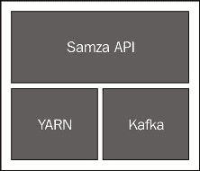
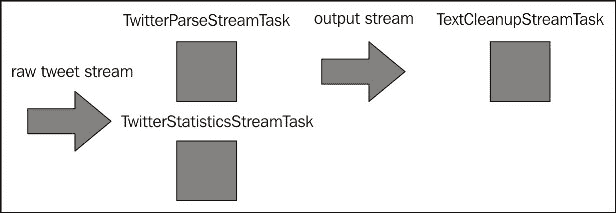

# 四、使用 Samza 的实时计算

上一章讨论了 YAINE，并经常提到它在 Hadoop 平台上支持的传统批处理 MapReduce 之外的计算模型和处理框架的广度。 在本章和下一章中，我们将深入探讨两个这样的项目，即 Apache Samza 和 Apache Spark。 我们之所以选择这些框架，是因为它们演示了流和迭代处理的使用，并提供了有趣的机制来组合处理范例。 在本章中，我们将探讨 Samza，并涵盖以下主题：

*   Samza 是什么，以及它如何与 YAR 和其他项目(如 Apache Kafka)集成
*   Samza 如何为流处理提供基于回调的简单接口
*   Samza 如何将多个流处理作业组合到更复杂的工作流中
*   Samza 如何支持任务中的持久本地状态，以及这如何极大地丰富了它可以实现的功能

# 使用 Samza 进行流处理

为了探索纯流处理平台，我们将使用 Samza，它在[https://samza.apache.org](https://samza.apache.org)上提供了。 这里显示的代码已经在当前的 0.8 版本中进行了测试，随着项目的不断发展，我们将不断更新 GitHub 存储库。

Samza 是 LinkedIn 打造的，并于 2013 年 9 月捐赠给了 Apache 软件基金会(Apache Software Foundation)。 多年来，LinkedIn 已经建立了一个模型，将他们的大部分数据概念化为流，从这个模型中，他们看到了需要一个框架，该框架可以提供一种开发人员友好的机制来处理这些无处不在的数据流。

LinkedIn 的团队意识到，当涉及到数据处理时，很多注意力都集中在数据处理上，例如，RPC 工作负载通常作为延迟要求非常低的同步系统实施，或者在批处理系统中，作业的周期通常以小时来衡量。 介于两者之间的地区得到的支持相对较少，这是 Samza 的目标领域；它的大多数工作预计响应时间从几毫秒到几分钟不等。 他们还假设数据以理论上无限的连续消息流的形式到达。

## Samza 的工作原理

在开放源码世界中有许多个流处理系统，比如 Storm([http://storm.apache.org](http://storm.apache.org))，还有许多其他(主要是商业化的)工具，比如**复杂事件处理**(**CEP**)系统，它们也面向连续消息流的处理。 这些系统有许多相似之处，但也有一些主要的不同之处。

对于 Samza 来说，最重要的区别可能是它对消息传递的假设。 许多系统非常努力地减少每条消息的延迟，有时假设目标是尽可能快地将消息传入和传出系统。 Samza 的假设几乎是相反的；它的流是持久的和有弹性的，任何写入流的消息都可以在第一次到达后的一段时间内重新读取。 正如我们将看到的，这提供了相当大的容错能力。 Samza 也建立在这种模式的基础上，让它的每一项任务都能保持地方政府的弹性。

Samza 主要是用 Scala 实现的，尽管它的公共 API 是用 Java 编写的。 我们将在本章中展示 Java 示例，但是任何 JVM 语言都可以用来实现 Samza 应用。 我们将在下一章探索 Spark 时讨论 Scala。

## Samza 高级架构

Samza 认为世界有三个主要层或组件：流层、执行层和处理层。



桑扎建筑

流层提供对数据流的访问，用于消费和发布。 执行层提供了运行 Samza 应用、分配 CPU 和内存等资源以及管理其生命周期的方法。 处理层是实际的 Samza 框架本身，其接口允许每条消息的功能。

Samza 提供了可插拔的接口来支持前两层，尽管当前的主要实现使用 Kafka 进行流式处理，而将 YAR 用于执行。 我们将在接下来的几节中进一步讨论这些问题。

## 桑扎最好的朋友--Apache·卡夫卡

Samza 本身不实现实际的消息流。 相反，它为消息系统提供接口，然后与集成。 默认流实现构建在**Apache Kafka**([http://kafka.apache.org](http://kafka.apache.org))之上，这也是 LinkedIn 构建的消息传递系统，但现在是一个成功且被广泛采用的开源项目。

可以将 Kafka 视为类似 RabbitMQ 或 ActiveMQ 的消息代理，但如前所述，它将所有消息写入磁盘，并作为其设计的核心部分跨多个主机进行扩展。 Kafka 通过命名主题使用发布/订阅模型的概念，生产者向这些主题写入消息，消费者从这些主题读取消息。 它们的工作原理与任何其他消息传递系统中的主题非常相似。

因为 Kafka 将所有消息写入磁盘，所以它可能不像其他消息传递系统那样具有超低延迟的消息吞吐量，其他消息传递系统关注的是尽可能快地处理消息，而不是长期存储消息。 然而，Kafka 的伸缩性非常好，它重放消息流的能力非常有用。 例如，如果消费客户端出现故障，则它可以从已知良好的时间点重新读取消息，或者如果下游算法发生变化，则可以重放流量以利用新功能。

当跨主机伸缩时，Kafka 对主题进行分区，并支持分区复制以实现容错。 每个 Kafka 消息具有与该消息相关联的密钥，并且该密钥用于决定将给定消息发送到哪个分区。 这允许进行语义上有用的分区，例如，如果密钥是系统中的用户 ID，则给定用户的所有消息都将发送到同一分区。 Kafka 保证每个分区内的有序交付，这样读取分区的任何客户端都可以知道它们正在按照生产者写入消息的顺序接收该分区中每个键的所有消息。

Samza 定期写出位置的检查点，它已经读取了它正在使用的所有流。 这些检查点消息本身就是写入卡夫卡主题的。 因此，当 Samza 作业启动时，每个任务都可以重新读取其检查点流，以了解从流中的哪个位置开始处理消息。 这意味着 Kafka 实际上也起到了缓冲区的作用；如果 Samza 作业崩溃或被关闭进行升级，消息不会丢失。 相反，作业在重新启动时只会从最后一个检查点位置重新启动。 这种缓冲功能也很重要，因为它使多个 Samza 作业更容易作为复杂工作流的一部分运行。 当 Kafka 主题是作业之间的协调点时，一个作业可能会消耗另一个作业正在写入的主题；在这种情况下，Kafka 可以帮助解决由于任何给定作业运行速度慢于其他作业而导致的问题。 传统上，在由多个作业阶段组成的系统中，运行缓慢的作业造成的背压可能是一个真正的问题，但 Kafka 作为弹性缓冲区允许每个作业以其自己的速率进行读写。 请注意，这类似于多个协调 MapReduce 作业如何将 HDFS 用于类似目的。

Kafka 提供至少一次的消息传递语义，也就是说，写入 Kafka 的任何消息都将保证对特定分区的客户端可用。 但是，消息可能会在检查点之间进行处理；客户端可能会接收到重复的消息。 有特定于应用的机制可以缓解这一问题，Kafka 和 Samza 在他们的路线图上都有只有一次的语义，但就目前而言，这是你在设计工作时应该考虑的因素。

除了演示 Samza 之外，我们不会进一步解释卡夫卡。 如果你感兴趣，可以去看看它的网站和维基；那里有很多好的信息，包括一些优秀的论文和演示文稿。

## Yarn 一体化

如前所述，正如 Samza 将 Kafka 用于其流层实现一样，它将 Yarn 用于执行层。 就像[第 3 章](03.html "Chapter 3. Processing – MapReduce and Beyond")，*Processing-MapReduce 及以后*中描述的任何 Year 应用一样，Samza 既提供了控制整个作业生命周期的`ApplicationMaster`实现，也提供了在每个容器中执行的特定于 Samza 的功能(称为任务)的实现。 正如 Kafka 划分其主题一样，任务是 Samza 划分其处理的机制。 每个 Kafka 分区将由单个 Samza 任务读取。 如果 Samza 作业使用多个流，那么对于分配给它的每个流分区，给定任务将是该作业中的唯一使用者。

Samza 框架由每个作业配置告知该作业感兴趣的 Kafka 流，并且 Samza 不断轮询这些流以确定是否有新消息到达。 当有新消息可用时，Samza 任务调用用户定义的回调来处理该消息，该模型对于 MapReduce 开发人员来说不应该太陌生。 此方法在名为`StreamTask`的接口中定义，并具有以下签名：

```scala
public void process(IncomingMessageEnvelope envelope,
 MessageCollector collector, 
 TaskCoordinator coordinator)
```

这是每个 Samza 任务的核心，并定义要应用于接收到的消息的功能。 接收到的待处理消息被封装在`IncomingMessageEnvelope`中；输出消息可以写入到`MessageCollector`中，并且可以通过`TaskCoordinator`执行任务管理(如关机)。

如前所述，Samza 在底层 Kafka 主题中为每个分区创建一个任务实例。 每个 Yarn 容器将管理这些任务中的一个或多个。 因此，总体模型是 Samza Application Master 协调多个容器，每个容器负责一个或多个`StreamTask`实例。

## 独立模型

虽然我们将在本章中专门讨论 Kafka 和 Year 作为 Samza 的流和执行层的提供者，但重要的是要记住，核心 Samza 系统对流和执行系统都使用定义良好的接口。 有多个流源的实现(我们将在下一节中看到)，除了 Yarn 支持之外，Samza 还附带了一个`LocalJobRunner`类。 这种运行任务的替代方法可以在 JVM 上执行进程中的`StreamTask`个实例，而不需要完整的 Yarn 集群，后者有时是一个有用的测试和调试工具。 还讨论了在其他集群管理器或虚拟化框架之上的 Samza 实现。

## 你好,桑扎!

由于并不是每个人都有 ZooKeeper、Kafka 和 Yarn 簇可以使用，Samza 团队已经创建了一个很好的方法来开始使用产品。 而不是仅仅拥有一个“你好世界”！ 程序中，有一个名为 Hello Samza 的存储库，您可以通过在[git：//git.apache.org/samza-hello-samza.git](http://git://git.apache.org/samza-hello-samza.git)上克隆该存储库来访问该存储库。

这将下载并安装专用的 ZooKeeper、Kafka 和 Snow 实例(Samza 的三个主要前提条件)，从而创建一个完整的堆栈，您可以在上面提交 Samza 作业。

还有许多示例 Samza 作业处理来自 Wikipedia 编辑通知的数据。 查看位于[http://samza.apache.org/startup/hello-samza/0.8/](http://samza.apache.org/startup/hello-samza/0.8/)的页面，并按照那里给出的说明进行操作。 (在撰写本文时，Samza 仍然是一个相对年轻的项目，我们不愿包含有关示例的直接信息，这些信息可能会发生变化)。

对于本章中剩下的 Samza 示例，我们假设您要么使用 Hello Samza 包来提供必要的组件(ZooKeeper/Kafka/Year)，要么已经集成了每个组件的其他实例。

本例有三个相互构建的不同 Samza 作业。 第一个读取维基百科的编辑，第二个解析这些记录，第三个根据处理后的记录生成统计数据。 我们将很快构建我们自己的多数据流工作流。

有趣的是这里的 WikipediaFeed 示例；它使用 Wikipedia 而不是 Kafka 作为其消息源。 具体地说，它提供了 Samza`SystemConsumer`接口的另一个实现，以允许 Samza 从外部系统读取消息。 如前所述，Samza 并不依赖于 Kafka，并且，如本例所示，构建新的流实现不必针对通用的基础设施组件；它可以是非常特定于工作的，因为所需的工作量并不是很大。

### 提示

请注意，ZooKeeper 和 Kafka 的默认配置都会将系统数据写入到`/tmp`下的目录中，如果使用 Hello Samza，这将是您已经设置的配置。 如果您使用的 Linux 发行版会在重新引导时清除此目录的内容，请务必小心。 如果您计划执行任何重要的测试，那么最好重新配置这些组件以使用较少的临时位置。 更改每个服务的相关配置文件；它们位于`hello-samza/deploy`目录下的服务目录中。

## 构建推文解析作业

让我们构建我们自己的简单作业实现来显示所需的完整代码。 我们将使用 Twitter 流的解析作为本章中的示例，稍后将从我们的客户端设置一个管道，将来自 Twitter API 的消息消费到 Kafka 主题中。 因此，我们需要一个 Samza 任务来读取 JSON 消息流，提取实际的 tweet 文本，并将这些内容写入 tweet 主题。

以下是`TwitterParseStreamTask.java`中的主要代码，可从[https://github.com/learninghadoop2/book-examples/blob/master/ch4/src/main/java/com/learninghadoop2/samza/tasks/TwitterParseStreamTask.java](https://github.com/learninghadoop2/book-examples/blob/master/ch4/src/main/java/com/learninghadoop2/samza/tasks/TwitterParseStreamTask.java)获得：

```scala
package com.learninghadoop2.samza.tasks;
public class TwitterParseStreamTask implements StreamTask {
    @Override
    public void process(IncomingMessageEnvelope envelope, MessageCollector collector, TaskCoordinator coordinator) {
        String msg = ((String) envelope.getMessage());

        try {
            JSONParser parser  = new JSONParser();
            Object     obj     = parser.parse(msg);
            JSONObject jsonObj = (JSONObject) obj;
            String     text    = (String) jsonObj.get("text");

            collector.send(new OutgoingMessageEnvelope(new SystemStream("kafka", "tweets-parsed"), text));
        } catch (ParseException pe) {}
    }
  }
}
```

代码在很大程度上是不言而喻的，但也有一些有趣的地方。 我们使用 JSON Simple([http://code.google.com/p/json-simple/](http://code.google.com/p/json-simple/))来满足相对简单的 JSON 解析需求；在本书后面我们也将使用它。

`IncomingMessageEnvelope`及其对应的`OutputMessageEnvelope`是与实际消息数据相关的主要结构。 除了消息有效负载之外，信封还将包含有关系统、主题名称和(可选)分区号的数据，以及其他元数据。 出于我们的目的，我们只从传入消息中提取消息体，并通过新的`OutgoingMessageEnvelope`将从中提取的 tweet 文本发送到名为`kafka`的系统中名为`tweets-parsed`的主题。 请注意小写的名称-我们稍后将对此进行解释。

`IncomingMessageEnvelope`中的消息类型为`java.lang.Object`。 Samza 目前不强制执行数据模型，因此没有强类型的消息体。 因此，在提取消息内容时，通常需要显式强制转换。 因为每个任务都需要知道它处理的流的预期消息格式，所以这并不是看起来那么奇怪。

## 配置文件

在前面的代码中，没有说明消息来自哪里；框架只是将它们呈现给`StreamTask`实现，但显然 Samza 需要知道从哪里获取消息。 每个作业都有一个配置文件来定义这一点和更多内容。 在[https://github.com/learninghadoop2/book-examples/blob/master/ch4/src/main/resources/twitter-parser.properties](https://github.com/learninghadoop2/book-examples/blob/master/ch4/src/main/resources/twitter-parser.properties)处可以找到`twitter-parse.properties`：

```scala
# Job
job.factory.class=org.apache.samza.job.yarn.YarnJobFactory
job.name=twitter-parser

# YARN
yarn.package.path=file:///home/gturkington/samza/build/distributions/learninghadoop2-0.1.tar.gz

# Task
task.class=com.learninghadoop2.samza.tasks.TwitterParseStreamTask
task.inputs=kafka.tweets
task.checkpoint.factory=org.apache.samza.checkpoint.kafka.KafkaCheckpointManagerFactory
task.checkpoint.system=kafka

# Normally, this would be 3, but we have only one broker.
task.checkpoint.replication.factor=1

# Serializers
serializers.registry.string.class=org.apache.samza.serializers.StringSerdeFactory

# Systems
systems.kafka.samza.factory=org.apache.samza.system.kafka.KafkaSystemFactory
systems.kafka.streams.tweets.samza.msg.serde=string
systems.kafka.streams.tweets-parsed.samza.msg.serde=string
systems.kafka.consumer.zookeeper.connect=localhost:2181/
systems.kafka.consumer.auto.offset.reset=largest
systems.kafka.producer.metadata.broker.list=localhost:9092
systems.kafka.producer.producer.type=sync
systems.kafka.producer.batch.num.messages=1
```

这个看起来可能很多，但现在我们只考虑高级结构和一些关键设置。 作业部分将 Yarn 设置为执行框架(与本地作业运行器类相对)，并为作业命名。 如果我们要运行同一作业的多个副本，我们还会为每个副本分配一个唯一的 ID。任务部分指定任务的实现类以及它应该接收消息的流的名称。 序列化程序告诉 Samza 如何在流中读取和写入消息，系统部分按名称定义系统，并将实现类与它们相关联。

在我们的示例中，我们只定义了一个名为`kafka`的系统，并且在前一个任务中发送消息时引用此系统。 请注意，这个名称是任意的，我们可以随心所欲地称呼它。 显然，为了清楚起见，用相同的名字来称呼卡夫卡系统是有意义的，但这只是一种惯例。 特别是，在处理彼此相似的多个系统时，有时甚至在配置文件的不同部分以不同方式对待同一系统时，有时需要指定不同的名称。

在本节中，我们还将指定要与任务使用的流相关联的 SerDe。 回想一下，Kafka 消息有一个正文和一个可选的键，用于确定将消息发送到哪个分区。 Samza 需要知道如何处理这些流的密钥和消息的内容。 Samza 支持将其视为原始字节或特定类型，如前面提到的字符串、整数和 JSON。

其余的配置将在每个作业之间基本保持不变，因为它包括 ZooKeeper 集合和 Kafka 集群的位置等内容，并指定如何设置流的检查点。 Samza 允许各种各样的定制，完整的配置选项在[http://samza.apache.org/learn/documentation/0.8/jobs/configuration-table.html](http://samza.apache.org/learn/documentation/0.8/jobs/configuration-table.html)中有详细介绍。

## 将推特数据导入卡夫卡

在我们运行作业之前，我们确实需要向 Kafka 发送一些 t1 消息。 让我们创建一个新的 Kafka 主题，名为*twets*，我们将把 tweet 写入其中。

要执行此操作和其他与 Kafka 相关的操作，我们将使用位于 Kafka 发行版的`bin`目录中的命令行工具。 如果您从作为 Hello Samza 应用一部分创建的堆栈中运行作业，则为`deploy/kafka/bin`。

`kafka-topics.sh`是一个通用工具，可用于创建、更新和描述主题。 它的大多数用法都需要参数来指定本地动物园管理员集群的位置、Kafka 代理存储其详细信息的位置以及要操作的主题的名称。 要创建新主题，请运行以下命令：

```scala
$ kafka-topics.sh  --zookeeper localhost:2181 --create –topic tweets --partitions 1 --replication-factor 1

```

这将创建一个名为*twets*的主题，并将其分区数和复制因子显式设置为 1。如果您在本地测试 VM 中运行 Kafka，这是合适的，但很明显，生产部署将具有更多分区以跨多个代理扩展负载，并且复制因子至少为 2 以提供容错。

使用`kafka-topics.sh`工具的列表选项仅显示系统中的主题，或使用`describe`获取有关特定主题的更多详细信息：

```scala
$ kafka-topics.sh  --zookeeper localhost:2181 --describe --topic tweets
Topic:tweets    PartitionCount:1    ReplicationFactor:1    Configs:
 Topic: tweets  Partition: 0    Leader: 0    Replicas: 0    Isr: 0

```

多个 0 可能会造成混淆，因为它们是标签而不是计数。 系统中的每个代理都有一个 ID，通常从 0 开始，每个主题中的分区也是如此。 前面的输出告诉我们，名为`tweets`的主题有一个 ID 为 0 的分区，充当该分区的领导者的代理是 Broker 0，并且此分区的**同步副本**(**ISR**)的集合也只有 Broker 0。 最后一个值在处理复制时特别重要。

我们将使用前面章节中的 Python 实用程序从 Twitter 提要中提取 JSON tweet，然后使用 Kafka CLI 消息生成器将消息写入 Kafka 主题。 这不是一种非常有效的做事方式，但它适合用于插图目的。 假设我们的 Python 脚本位于主目录中，从 kafka`bin`目录中运行以下命令：

```scala
$ python ~/stream.py –j | ./kafka-console-producer.sh  --broker-list localhost:9092 --topic tweets

```

它将无限期运行，因此请注意不要让它在磁盘空间较小的测试 VM 上运行一夜，而不是因为作者曾经做过这样的事情。

## 运行 Samza 作业

要运行 Samza 作业，我们需要将代码与执行它所需的 Samza 组件一起打包到一个`.tar.gz`存档中，该存档将由 Yar NodeManager 读取。 这是 Samza 任务配置文件中的`yarn.file.package`属性引用的文件。

在使用单节点 Hello Samza 时，我们只能使用文件系统上的绝对路径，如前面的配置示例所示。 对于较大的 Yarn 网格上的作业，最简单的方法是将包放到 HDFS 上，并通过`hdfs://`URI 或在 Web 服务器上引用它(Samza 提供了一种机制，允许 Yarn 通过 HTTP 读取文件)。

因为 Samza 有多个子组件，并且每个子组件都有自己的依赖项，所以整个 Yarn 包最终可能包含很多 JAR 文件(超过 100 个！)。 此外，您需要包含 Samza 任务的自定义代码以及 Samza 发行版中的一些脚本。 这不是手工可以做的事情。 在本章的示例代码中(可在[Gradle](https://github.com/learninghadoop2/book-examples/tree/master/ch4)找到)，我们设置了一个示例结构来保存代码和配置文件，并通过 Gradle 提供了一些自动化功能，以构建必要的任务归档并启动任务。

当位于本书的 Samza 示例代码目录的根目录中时，执行以下命令以构建包含本章所有类一起编译并与所有其他必需文件捆绑在一起的单个文件存档：

```scala
$ ./gradlew targz

```

此 Gradle 任务不仅将在`build/distributions`目录中创建必要的`.tar.gz` 归档，还将在`build/samza-package`下存储归档的扩展版本。 这将非常有用，因为我们将使用存储在归档的`bin`目录中的 Samza 脚本将任务实际提交给 YAR。

所以现在，让我们来做我们的工作吧。 我们需要有两个文件路径：将作业提交给 YAR 的 Samza`run-job.sh`脚本和作业的配置文件。 由于我们创建的作业包将所有已编译的任务捆绑在一起，因此通过使用在`task.class`属性中指定特定任务实现类的不同配置文件，我们告诉 Samza 要运行哪个任务。 要实际运行任务，我们可以从`build/samza-archives`下的分解项目归档中运行以下命令：

```scala
$ bin/run-job.sh  --config-factory=org.apache.samza.config.factories.PropertiesConfigFactory --config-path=]config/twitter-parser.properties

```

为方便起见，我们添加了一个 Gradle 任务来运行此作业：

```scala
$ ./gradlew runTwitterParser

```

要查看作业的输出，我们将使用 Kafka CLI 客户端消费消息：

```scala
$ ./kafka-console-consumer.sh –zookeeper localhost:2181 –topic tweets-parsed

```

您应该看到客户端上出现了连续的 tweet 流。

### 备注

请注意，我们没有显式创建名为 twets-parsed 的主题。 当生产者或消费者试图使用主题时，Kafka 可以允许动态创建主题。 但在许多情况下，默认的分区和复制值可能不合适，并且需要显式创建主题以确保正确定义这些关键主题属性。

## Samza 和 HDFS

您可能已经注意到，我们刚刚在讨论 Samza 时第一次提到了 HDFS。 虽然 Samza 与 Yarn 紧密集成，但它没有与 HDFS 直接集成。 在逻辑层面上，Samza 的流实现系统(如 Kafka)提供的存储层通常由 HDFS 为传统 Hadoop 工作负载提供。 如前所述，在 Samza 体系结构的术语中，在这两个模型中，YAR 是执行层，而 Samza 对源和目标数据使用流层，而 MapReduce 等框架使用 HDFS。 这是一个很好的例子，说明了 YAR 如何启用其他计算模型，这些模型不仅处理数据的方式与面向批处理的 MapReduce 非常不同，而且还可以使用完全不同的存储系统来存储它们的源数据。

## 窗口函数

根据在个特定时间窗口内在流上接收到的消息来生成某些数据通常很有用。 例如，记录每分钟测量的前*n*属性值。 Samza 通过`WindowableTask`接口支持这一点，该接口有以下要实现的单一方法：

```scala
  public void window(MessageCollector collector, TaskCoordinator coordinator);
```

这应该类似于`StreamTask`接口中的`process`方法。 但是，因为该方法是按时间计划调用的，所以它的调用不与接收到的消息相关联。 但是，`MessageCollector`和`TaskCoordinator`参数仍然存在，因为大多数可窗口化任务将生成输出消息，并且可能还希望执行一些任务管理操作。

让我们以前面的任务为例，添加一个窗口函数，该函数将输出每个窗口化时间段内收到的 tweet 数量。 这是在[https://github.com/learninghadoop2/book-examples/blob/master/ch4/src/main/java/com/learninghadoop2/samza/tasks/TwitterStatisticsStreamTask.java](https://github.com/learninghadoop2/book-examples/blob/master/ch4/src/main/java/com/learninghadoop2/samza/tasks/TwitterStatisticsStreamTask.java)中找到的`TwitterStatisticsStreamTask.java` 的主类实现：

```scala
public class TwitterStatisticsStreamTask implements StreamTask, WindowableTask {
    private int tweets = 0;

    @Override
    public void process(IncomingMessageEnvelope envelope, MessageCollector collector, TaskCoordinator coordinator) {
        tweets++;
    }

    @Override
    public void window(MessageCollector collector, TaskCoordinator coordinator) {
        collector.send(new OutgoingMessageEnvelope(new SystemStream("kafka", "tweet-stats"), "" + tweets));

        // Reset counts after windowing.
        tweets = 0;
    }
}
```

`TwitterStatisticsStreamTask`类有一个名为`tweets`的私有成员变量，该变量被初始化为`0`，并在每次调用`process`方法时递增。 因此，我们知道，对于从底层流实现传递到任务的每条消息，该变量都将递增。 每个 Samza 容器都有一个在循环中运行的线程，该线程对容器内的所有任务执行进程和窗口方法。 这意味着我们不需要保护实例变量不受并发修改的影响；容器内的每个任务只有一个方法可以同时执行。

在我们的`window`方法中，我们向名为`tweet-stats`的新主题发送一条消息，然后重置`tweets`变量。 这非常简单，唯一缺少的部分是 Samza 如何知道何时调用`window`方法。 我们在配置文件中指定：

```scala
task.window.ms=5000
```

这告诉 Samza 每隔 5 秒对每个任务实例调用`window`方法。 要运行`window`任务，需要执行 Gradle 任务：

```scala
$ ./gradlew runTwitterStatistics

```

如果我们现在使用`kafka-console-consumer.sh`监听`tweet-stats`流，我们将看到以下输出：

```scala
Number of tweets: 5012
Number of tweets: 5398

```

### 备注

请注意，本文中的术语*窗口*指的是 Samza 在概念上将消息流分割成时间范围，并提供在每个范围边界执行处理的机制。 Samza 没有直接提供该术语在滑动窗口方面的其他用法的实现，在滑动窗口中，随着时间的推移保存和处理一系列值。 然而，可窗口任务界面确实提供了实现此类滑动窗口的管道。

## 多作业工作流

正如我们在 Hello Samza 示例中看到的，Samza 的一些真正功能来自多个作业的组合，我们将使用文本清理作业开始演示此功能。

在接下来的部分中，我们将通过将推文与一组英语正面和负面单词进行比较来执行推文情感分析。 然而，考虑到 Twitter 信息流是多么丰富的多语种，简单地将其应用于原始 Twitter 提要将会产生非常参差不齐的结果。 我们还需要考虑文本清理、大写、频繁收缩等问题。 正如任何使用过任何重要数据集的人都知道的那样，使数据适合处理的操作通常需要大量的工作(通常是大多数工作！)。 去吧。

因此，在我们尝试检测 tweet 情绪之前，让我们先进行一些简单的文本清理；特别是，我们将只选择英文 tweet，并且在将它们发送到新的输出流之前，我们将强制它们的文本为小写。

语言检测是一个难题，为此，我们将使用 Apache Tika 库的特性([http://tika.apache.org](http://tika.apache.org))。 Tika 提供了广泛的功能，可以从各种来源提取文本，然后从该文本中提取更多信息。 如果使用我们的 Gradle 脚本，则 Tika 依赖项已经指定，并将自动包含在生成的作业包中。 如果通过其他机制构建，您将需要从主页下载 Tika JAR 文件并将其添加到您的 Yarn 作业包中。 可以在[https://github.com/learninghadoop2/book-examples/blob/master/ch4/src/main/java/com/learninghadoop2/samza/tasks/TextCleanupStreamTask.java](https://github.com/learninghadoop2/book-examples/blob/master/ch4/src/main/java/com/learninghadoop2/samza/tasks/TextCleanupStreamTask.java)找到以下代码`TextCleanupStreamTask.java`：

```scala
public class TextCleanupStreamTask implements StreamTask {
    @Override
    public void process(IncomingMessageEnvelope envelope, MessageCollector collector, TaskCoordinator coordinator) {
        String rawtext = ((String) envelope.getMessage());

        if ("en".equals(detectLanguage(rawtext))) {
            collector.send(new OutgoingMessageEnvelope(new SystemStream("kafka", "english-tweets"),
                    rawtext.toLowerCase()));
        }
    }

    private String detectLanguage(String text) {
        LanguageIdentifier li = new LanguageIdentifier(text);

        return li.getLanguage();
    }
}
```

这项任务非常简单，这要归功于 Tika 执行的繁重任务。 我们创建一个实用方法来包装 Tika`LanguageDetector`的创建和使用，然后在`process`方法中对每个传入消息的消息体调用此方法。 仅当应用此实用程序方法的结果为`"en"`(即英语的两个字母代码)时，我们才写入输出流。

此任务的配置文件类似于前一个任务的配置文件，具有任务名称和实现类的特定值。 它在存储库中的名称为`textcleanup.properties`，位于[https://github.com/learninghadoop2/book-examples/blob/master/ch4/src/main/resources/textcleanup.properties](https://github.com/learninghadoop2/book-examples/blob/master/ch4/src/main/resources/textcleanup.properties)。 我们还需要指定输入流：

```scala
task.inputs=kafka.tweets-parsed
```

这一点很重要，因为我们需要此任务来解析在前面任务中提取的 tweet 文本，并避免重复最好封装在一个位置的 JSON 解析逻辑。 我们可以使用以下命令运行此任务：

```scala
$ ./gradlew runTextCleanup

```

现在，我们可以一起运行这三个任务；`TwitterParseStreamTask`和`TwitterStatisticsStreamTask`将使用原始 tweet 流，而`TextCleanupStreamTask`将使用`TwitterParseStreamTask`的输出。



流上的数据处理

## 推文情感分析

我们现在将实现一个任务来执行推文情感分析，类似于我们在上一章中使用 MapReduce 所做的操作。 这还将向我们展示 Samza 提供的一种有用机制：引导流。

### 引导流

一般来说，大多数流处理作业(在 Samza 或其他框架中)将开始处理启动后到达的消息，通常会忽略历史消息。 由于其可重放流的概念，Samza 没有这一限制。

在我们的情绪分析工作中，我们有两套参照词：积极词和消极词。 尽管到目前为止我们还没有展示它，但是 Samza 可以使用来自多个流的消息，底层机制将轮询所有命名流，并将它们的消息一次一个地提供给`process`方法。 因此，我们可以为肯定词和否定词创建流，并将数据集推送到这些流上。 乍一看，我们可以计划将这两个流回溯到最早的点，并在它们到达时阅读推文。 问题是，Samza 不能保证对来自多个流的消息进行排序，即使有一种机制可以给流更高的优先级，我们也不能假设在第一条 tweet 到达之前，所有否定和肯定的词都会被处理。

对于这类场景，Samza 有引导流的概念。 如果任务定义了任何引导流，那么它将从最早的偏移量开始读取这些流，直到它们被完全处理为止(从技术上讲，它将读取这些流，直到它们被赶上，因此发送到任一流的任何新词都将被无优先级地处理，并且将在 tweet 之间交错到达)。

现在，我们将创建一个名为`TweetSentimentStreamTask`的新作业，该作业读取两个引导流，将其内容收集到 HashMap 中，收集情绪趋势的运行计数，并使用`window`函数每隔一段时间输出此数据。 此代码可在[https://github.com/learninghadoop2/book-examples/blob/master/ch4/src/main/java/com/learninghadoop2/samza/tasks/TwitterSentimentStreamTask.java](https://github.com/learninghadoop2/book-examples/blob/master/ch4/src/main/java/com/learninghadoop2/samza/tasks/TwitterSentimentStreamTask.java)中找到：

```scala
public class TwitterSentimentStreamTask implements StreamTask, WindowableTask {
    private Set<String>          positiveWords  = new HashSet<String>();
    private Set<String>          negativeWords  = new HashSet<String>();
    private int                  tweets         = 0;
    private int                  positiveTweets = 0;
    private int                  negativeTweets = 0;
    private int                  maxPositive    = 0;
    private int                  maxNegative    = 0;

    @Override
    public void process(IncomingMessageEnvelope envelope, MessageCollector collector, TaskCoordinator coordinator) {
        if ("positive-words".equals(envelope.getSystemStreamPartition().getStream())) {
            positiveWords.add(((String) envelope.getMessage()));
        } else if ("negative-words".equals(envelope.getSystemStreamPartition().getStream())) {
            negativeWords.add(((String) envelope.getMessage()));
        } else if ("english-tweets".equals(envelope.getSystemStreamPartition().getStream())) {
            tweets++;

            int    positive = 0;
            int    negative = 0;
            String words    = ((String) envelope.getMessage());

            for (String word : words.split(" ")) {
                if (positiveWords.contains(word)) {
                    positive++;
                } else if (negativeWords.contains(word)) {
                    negative++;
                }
            }

            if (positive > negative) {
                positiveTweets++;
            }

            if (negative > positive) {
                negativeTweets++;
            }

            if (positive > maxPositive) {
                maxPositive = positive;
            }

            if (negative > maxNegative) {
                maxNegative = negative;
            }
        }
    }

    @Override
    public void window(MessageCollector collector, TaskCoordinator coordinator) {
        String msg = String.format("Tweets: %d Positive: %d Negative: %d MaxPositive: %d MinPositive: %d", tweets, positiveTweets, negativeTweets, maxPositive, maxNegative);

        collector.send(new OutgoingMessageEnvelope(new SystemStream("kafka", "tweet-sentiment-stats"), msg));

        // Reset counts after windowing.
        tweets         = 0;
        positiveTweets = 0;
        negativeTweets = 0;
        maxPositive    = 0;
        maxNegative    = 0;
    }

}
```

在这个任务中，我们添加了一些私有成员变量，我们将使用这些变量来记录整个 tweet 的数量、正数和负数，以及在单个 tweet 中看到的最大正数和负数。

此任务消耗三个 Kafka 主题。 尽管我们将配置两个作为引导流，但它们仍然是从其中接收消息的完全相同类型的 Kafka 主题；引导流的唯一区别是我们告诉 Samza 使用 Kafka 的倒带功能来完全重新读取流中的每条消息。 对于另一条推文流，我们只是在新消息到达时开始阅读它们。

如前所述，如果一个任务订阅了多个流，则相同的`process`方法将从每个流接收消息。 这就是为什么我们使用`envelope.getSystemStreamPartition().getStream()`来提取每个给定消息的流名称，然后执行相应操作的原因。 如果消息来自任何一个引导流，我们就将其内容添加到适当的哈希图中。 我们将一条推特信息分解成其构成词，测试每个词的正面或负面情绪，然后相应地更新计数。 如您所见，此任务不会将收到的 tweet 输出到另一个主题。

因为我们不执行任何直接处理，所以这样做没有意义；任何其他希望使用消息的任务都可以直接订阅传入的 twets 流。 然而，一个可能的修改可能是为每个人写正面和负面情绪的推文到专门的推文中。

`window`方法输出一系列计数，然后重置变量(与以前一样)。 请注意，Samza 确实支持通过 JMX 直接公开指标，这可能更适合于这样的简单窗口示例。 但是，我们没有篇幅在本书中介绍该项目的这一方面。

要运行此作业，我们需要像往常一样设置作业和任务名称来修改配置文件，但现在还需要指定多个输入流：

```scala
task.inputs=kafka.english-tweets,kafka.positive-words,kafka.negative-words
```

然后，我们需要指定我们的两个流是引导流，应该从最早的偏移量开始读取。 具体地说，我们为流设置了三个属性。 我们说它们将被引导，即在其他流之前完全读取，这是通过指定每个流上的偏移量需要被重置到最旧(第一)位置来实现的：

```scala
systems.kafka.streams.positive-words.samza.bootstrap=true
systems.kafka.streams.positive-words.samza.reset.offset=true
systems.kafka.streams.positive-words.samza.offset.default=oldest

systems.kafka.streams.negative-words.samza.bootstrap=true
systems.kafka.streams.negative-words.samza.reset.offset=true
systems.kafka.streams.negative-words.samza.offset.default=oldest
```

我们可以使用以下命令运行此作业：

```scala
$ ./gradlew runTwitterSentiment

```

启动作业后，查看关于`tweet-sentiment-stats`主题的消息的输出。

情绪检测作业将在阅读任何新检测到的小写英文推文之前引导正面和负面词流。

有了情绪检测作业，我们现在可以可视化我们的四个协作作业，如下图所示：


引导流和协作任务

### 提示

要正确运行作业，似乎有必要先启动 JSON 解析器作业，然后再启动清理作业，然后再启动情感作业，但事实并非如此。 任何未读的消息都会保留在 Kafka 中进行缓冲，因此多作业工作流中的作业以什么顺序启动并不重要。 当然，在开始接收数据之前，情感作业将输出 0 条 tweet 计数，但如果流作业在它所依赖的作业之前开始，则不会中断。

## 有状态任务

我们将探讨的 Samza 的最后一个方面是，它如何允许处理流分区的任务具有持久的本地状态。 在前面的示例中，我们使用私有变量来跟踪运行总数，但有时任务具有更丰富的本地状态会很有用。 例如，在两个流上执行逻辑联接，从一个流构建状态模型并将其与另一个流进行比较非常有用。

### 备注

请注意，Samza 可以利用其分区流的概念来极大地优化加入流的行为。 如果要加入的每个流使用相同的分区键(例如，用户 ID)，则使用这些流的每个任务将跨所有流接收与每个 ID 关联的所有消息。

Samza 还有另一个抽象，类似于其管理其作业和实现其任务的框架的概念。 它定义了一个可以有多个具体实现的抽象键值存储。 Samza 将现有的开源项目用于磁盘实现，并从 v0.7 开始使用 LevelDB，从 v0.8 开始添加 RocksDB。 还有一个内存中存储，它不持久保存键值数据，但在测试或潜在的非常具体的生产工作负载中可能很有用。

每个任务都可以写入这个键值存储，并且 Samza 管理其对本地实现的持久性。 为了支持持久状态，存储还被建模为流，并且对存储的所有写入也被推送到流中。 如果任务失败，则在重新启动时，它可以通过重播支持主题中的消息来恢复其本地键值存储的状态。 这里一个明显的问题是需要重放的消息的数量；然而，例如，当使用 Kafka 时，它会用相同的密钥压缩消息，因此主题中只保留最新的更新。

我们将修改前面的 tweet 情绪示例，以添加在任何 tweet 中看到的最大正面和负面情绪的终生计数。 可以在[https://github.com/learninghadoop2/book-examples/blob/master/ch4/src/main/java/com/learninghadoop2/samza/tasks/TwitterStatefulSentimentStreamTask.java](https://github.com/learninghadoop2/book-examples/blob/master/ch4/src/main/java/com/learninghadoop2/samza/tasks/TwitterStatefulSentimentStreamTask.java)找到以下代码`TwitterStatefulSentimentStateTask.java`。 请注意，process 方法与`TwitterSentimentStateTask.java`相同，因此出于空间原因，我们在这里省略了它：

```scala
public class TwitterStatefulSentimentStreamTask implements StreamTask, WindowableTask, InitableTask {
    private Set<String> positiveWords  = new HashSet<String>();
    private Set<String> negativeWords  = new HashSet<String>();
    private int tweets = 0;
    private int positiveTweets = 0;
    private int negativeTweets = 0;
    private int maxPositive = 0;
    private int maxNegative = 0;
    private KeyValueStore<String, Integer> store;

    @SuppressWarnings("unchecked")
    @Override
    public void init(Config config, TaskContext context) {
        this.store = (KeyValueStore<String, Integer>) context.getStore("tweet-store");
    }

    @Override
    public void process(IncomingMessageEnvelope envelope, MessageCollector collector, TaskCoordinator coordinator) {
...
    }

    @Override
    public void window(MessageCollector collector, TaskCoordinator coordinator) {
        Integer lifetimeMaxPositive = store.get("lifetimeMaxPositive");
        Integer lifetimeMaxNegative = store.get("lifetimeMaxNegative");

        if ((lifetimeMaxPositive == null) || (maxPositive > lifetimeMaxPositive)) {
            lifetimeMaxPositive = maxPositive;
            store.put("lifetimeMaxPositive", lifetimeMaxPositive);
        }

        if ((lifetimeMaxNegative == null) || (maxNegative > lifetimeMaxNegative)) {
            lifetimeMaxNegative = maxNegative;
            store.put("lifetimeMaxNegative", lifetimeMaxNegative);
        }

        String msg =
            String.format(
                "Tweets: %d Positive: %d Negative: %d MaxPositive: %d MaxNegative: %d LifetimeMaxPositive: %d LifetimeMaxNegative: %d",
                tweets, positiveTweets, negativeTweets, maxPositive, maxNegative, lifetimeMaxPositive,
                lifetimeMaxNegative);

        collector.send(new OutgoingMessageEnvelope(new SystemStream("kafka", "tweet-stateful-sentiment-stats"), msg));

        // Reset counts after windowing.
        tweets         = 0;
        positiveTweets = 0;
        negativeTweets = 0;
        maxPositive    = 0;
        maxNegative    = 0;
    }
}
```

这个类实现了一个名为`InitableTask`的新接口。 这只有一个名为`init`的方法，当任务需要在开始执行之前配置其配置的个方面时使用。 我们在这里使用`init()`方法创建`KeyValueStore`类的实例，并将其存储在私有成员变量中。

顾名思义，`KeyValueStore`提供了熟悉的`put`/`get`类型的接口。 在本例中，我们指定键的类型为字符串，值为整数。 在我们的`window`方法中，我们检索之前存储的最大正面和负面情绪的值，如果当前窗口中的计数更高，则相应地更新存储。 然后，我们像以前一样输出`window`方法的结果。

如您所见，用户不需要处理`KeyValueStore`实例的本地或远程持久性的细节；这些都由 Samza 处理。 该机制的效率还使任务易于处理以保存大量的本地状态，在长时间运行的聚合或流连接等情况下可能特别有价值。

作业的配置文件可以在[https://github.com/learninghadoop2/book-examples/blob/master/ch4/src/main/resources/twitter-stateful-sentiment.properties](https://github.com/learninghadoop2/book-examples/blob/master/ch4/src/main/resources/twitter-stateful-sentiment.properties)中找到。 它需要添加几个条目，如下所示：

```scala
stores.tweet-store.factory=org.apache.samza.storage.kv.KeyValueStorageEngineFactory
stores.tweet-store.changelog=kafka.twitter-stats-state
stores.tweet-store.key.serde=string
stores.tweet-store.msg.serde=integer
```

第一行指定存储的实现类，第二行指定用于持久状态的 Kafka 主题，最后两行指定存储键和值的类型。

要运行此作业，请使用以下命令：

```scala
$ ./gradlew runTwitterStatefulSentiment

```

为方便起见，以下命令将启动四个作业：JSON 解析器、文本清理、统计作业和状态情感作业：

```scala
$ ./gradlew runTasks

```

Samza 是一个纯粹的流处理系统，它提供其存储层和执行层的可插拔实现。 最常用的插件是 YAR 和 Kafka，它们展示了 Samza 如何在使用完全不同的存储层的情况下与 Hadoop Year 紧密集成。 Samza 仍然是一个相对较新的项目，目前的功能只是设想的一个子集。 建议查阅其网页，以获取有关其当前状况的最新信息。

# 摘要

本章更多地关注在 Hadoop2 上可以做些什么，特别是 Yarn，而不是 Hadoop 内部的细节。 这几乎肯定是一件好事，因为它表明 Hadoop 正在实现其目标，即成为一个不再依赖于批处理的更灵活、更通用的数据处理平台。 特别是，我们重点介绍了 Samza 如何展示可以在 YAR 上实现的处理框架可以创新并支持与 Hadoop1 中提供的功能截然不同的功能。

特别是，我们看到 Samza 如何从批处理转向延迟范围的另一端，并在单个消息到达时支持按消息处理。

我们还了解了 Samza 如何提供 MapReduce 开发人员熟悉的回调机制，但将其用于非常不同的处理模型。 我们还讨论了 Samza 使用 YAIN 作为其主要执行框架的方式，以及它如何实现[第 3 章](03.html "Chapter 3. Processing – MapReduce and Beyond")、*Processing-MapReduce 以及之后*中描述的模型。

在下一章中，我们将改变思路，探索 Apache Spark。 虽然它的数据模型与 Samza 非常不同，但我们将看到它也有一个支持实时数据流处理的扩展，包括 Kafka 集成选项。 然而，这两个项目是如此不同，以至于它们在竞争中更具互补性。