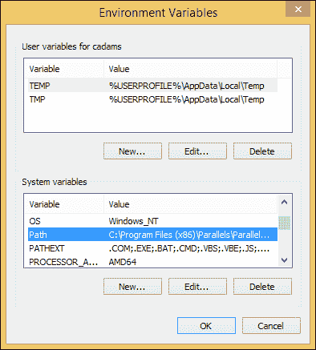
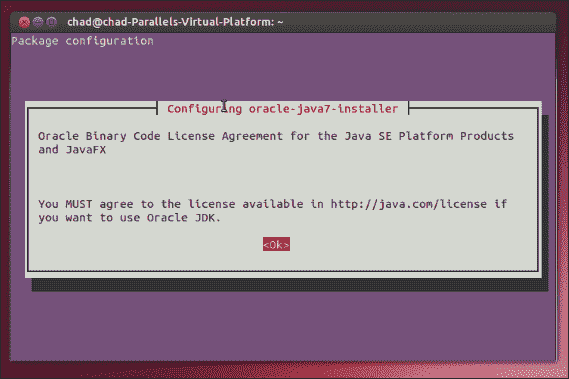

# 一、设置您的开发环境

# 简介

在本章中，我们将回顾如何在 Windows、Mac 和 Ubuntu Linux 上设置 Python 2.7 32 位版本。我们将遍历 Python 解释器，并构建几个 Hello-World 风格的 Python 应用，以确保我们的代码正常工作。本章的 Windows 部分将主要介绍这一点，但其他操作系统部分将会重复这一点。

我们还将回顾如何安装和使用 **easy_install** 和 **pip** ，这两个是 Python 开发中常用的包管理器。我们还将回顾如何安装 **lxml** ，这是一个流行的 xml 解析器和编写器，我们将在后面的章节中需要它。

# 在 Windows 上设置 Python

如果你对 Python 相当陌生，你可能听说过 Python 没有合适的构建工具在 Windows 上运行，或者 Python 针对基于 Unix 的系统进行了优化，比如 Mac OS X 和 Linux 变体。在某种程度上，这是真的；大多数库，包括本书中介绍的库，如果您在非 Windows 的操作系统上，会工作得更好，也更容易安装。

我想在这一部分花一点额外的时间，以防你，读者，在阅读这本书的时候，想使用 Windows 作为你的开发操作系统。首先，我想解释一下为什么众所周知 Windows 与 Python 开发人员之间存在问题。通常，不是语言导致了问题，也不是缺少编辑。事实上，Windows 甚至有更多高质量的 Python 编辑器，包括带有 Python 工具的 Visual Studio，以及更多文本编辑器选项，如 Notepad++。

困扰开发人员的真正问题是库的兼容性，特别是那些引用基于 C 的代码来实现直接使用 Python 语言无法实现的结果的 Python 库。与 Mac OS X 或 Linux 变体不同，Windows 不包含 C 编译器作为操作系统的一部分。通常，当 Python 库作者提到 Windows“缺少构建工具”时，这通常指的是不包括 C 编译器的 Windows。

另一个问题是命令提示符；在 Python 开发中，通常使用终端或使用 Windows 命令中的命令提示符来安装库和资产。安装库的两个常用命令是`easy_install`和`pip`。如果你不熟悉，easy_install 是一个基于命令行的 Python 包管理器。它使用 Python eggs(一个特定于 easy_install 的重命名的`.zip`文件)来捆绑库的脚本和所需文件。easy_install 包管理器也是一个较旧的包管理器，已经在 Python 工具带中使用了很长时间。通常使用 easy_install 可以找到旧的 Python 库。下面的截图向您展示了 PyPI 网站:


另一个命令叫做 pip，也被称为 **Python 包索引** ( **PyPi** )。尽管 easy_install 是由社区驱动的，但 PyPi 是 Python 软件基金会的官方包管理器，该组织负责更新和处理 Python 语言。该网站还托管第三方软件包。

下面的截图向您展示了 Python 网站:


### 注

较新的库通常使用 pip 创建，原因有二。第一，pip 比 easy_install 有更多的特性，第二，pip 库可以在 Python 的官方包网站库中搜索，位于[https://pypi.python.org/pypi](https://pypi.python.org/pypi)。

# 安装

让我们从在你的 Windows 机器上安装 Python 开始。对于这本书，我将使用 Windows 8.1，尽管如果您运行的是 Windows 7 或 Windows Vista，这个工作流应该没问题。首先，打开你选择的浏览器，导航到[http://www.python.org/](http://www.python.org/)。


在主页上，你应该会看到一个如前面截图所示的的下载链接。对于 Windows，我们正在寻找 Python 版本 2.7+(32 位版本)。继续点击该链接，您将进入下载页面:


在下载页面，你会想要下载 Windows x86 MSI 安装程序。我们想要 32 位安装程序，而不是 64 位安装程序。这将确保与即将到来的章节中的包的最佳兼容性。下面的截图显示了 Python 在 Windows 上的一般安装窗口(此处显示的是 64 位版本的 Python，用于演示目的):


一旦你下载了安装程序，双击安装程序运行它。遵循向导，保留默认值，特别是前面截图中显示的 Python 安装路径。让安装程序完成安装并重新启动系统。

重启系统后，如果你在 Windows 8 的桌面上，右键点击**开始**屏幕图标，点击**系统**。然后点击**高级系统设置**(如果你在 Windows 7 或 Vista 中，可以通过导航到**控制面板** | **所有控制面板项目** | **系统**找到这个)，如下图截图所示:


一旦完成，你就要点击**环境变量**，如前面截图所示，在**系统变量**下寻找**路径**。这些变量允许命令提示符知道它可以访问系统中任何地方的哪些程序。我们要编辑**路径**，如下图截图所示，选择**路径**，点击**编辑**:



当**编辑**菜单可见时，在变量值的末尾键入`C:\Python27;C:\Python27\Lib\site-packages\;C:\Python27\Scripts\;`(包括前面的分号来区分路径)。在两个窗口中点击**确定**保存更改并重新启动电脑。


现在，让我们测试一下你的 Python 安装！打开命令提示符，小写输入`python`，按*进入*。假设安装程序工作正常，您应该会看到命令提示符路径光标位置更改到`>>>`之前，如下图所示:


您现在在 Python 解释器中；在这里，您可以运行简单的单行脚本，如以下命令:

```py
print('Hello Reader!')

```

### 型式

**下载示例代码**

您可以从您在[http://www.packtpub.com](http://www.packtpub.com)的账户中下载您购买的所有 Packt 书籍的示例代码文件。如果您在其他地方购买了这本书，您可以访问[http://www.packtpub.com/support](http://www.packtpub.com/support)并注册，以便将文件直接通过电子邮件发送给您。


下一个行将输出`Hello Reader!`，向控制台显示您的 Python 脚本打印，下面的`>>>`等待您的下一个命令。也可以处理`2 + 2`等命令，点击*进入*，下一行会看到`4`。

让我们尝试将一个变量保存到提示中；在下一行键入以下命令:

```py
authorsName = 'Chad'

```

按*进入*。然后，输入以下命令，再次按*进入*:

```py
print(authorsName)

```

输出显示在下一张截图中:


现在，您的命令提示符看起来像前面的截图。请注意结果行中的`Chad`是`authorsName` Python 变量的输出。这意味着您已经正确安装了 Python 编译器！通过测试函数对象、数学对象和变量对象，我们已经确认 Python 可以在窗口上工作。

经过测试，您可以通过退出编译器从 Python 编译器返回到标准命令提示符。只需键入`exit(0)`即可退出 Python 实例。

# 探索 Windows 中的 Python 安装

既然已经查看了 Windows 上的命令行，我们需要在开始编写代码之前了解一些其他的事情。让我们从 Python 和任何库在您的机器上的安装位置开始。打开 Windows 资源管理器，导航至`C:\Python27`，如下图截图所示:


在`Python27`目录中，可以看到`python.exe`文件；这是我们的**系统变量**中的**路径**寻找运行 Python 脚本和命令的应用。该文件夹还包含 Python 需要运行的其他库，包括从 easy_install 或 pip 下载的库。

通过导航到`C:\Python27\Lib\site-packages`，可以找到第三方库。默认情况下，通过 pip 或 easy_install 下载的任何库和任何第三方依赖项都将安装在此目录中。

接下来，让我们为这本书下拉几个我们需要的库。默认情况下，Python 的 Windows Installer 包含 Windows pip 上的 Python 2.7 和 easy_install。首先，我们需要`lxml`图书馆。现在，在 Windows 上，`lxml`库是非常流行的基于 C 的 XML 解析器和 Python 库的编写器库，并且由于其基于 C 的实现而与 Windows 系统不兼容是出了名的。我们先安装`lxml`库，再拉可能依赖这个的包，从`lxml`开始，如下图截图所示:


lxml 确实有 pip 和 easy_install 两种风格；然而，由于它是基于 C 的，我们需要在 https://pypi.python.org/pypi/lxml/3.3.3 找到的 T4 视窗安装程序。抓取`lxml-3.3.3.win32-py2.7.exe`文件或更新的 2.7 版本库，运行安装程序。一旦安装完成，我们可以通过导航到`site-packages`目录并检查是否已经创建了任何名为`lxml`的新文件夹来确认安装。安装后，`site-packages`目录应该如下图所示:


`lxml`安装完成后，我们将设置 easy_install 和 pip。首先，让我们下载 easy_install 并安装它。步骤如下:

1.  将您选择的浏览器导航到 https://pypi.python.org/pypi/setuptools T2。
2.  然后，下载`ez_setup.py`文件。
3.  Save the file to `C:\Python27\ez_setup.py`. You can find the file on the page here, as shown in the following screenshot:

    

现在，以管理员权限再次打开您的命令提示符，然后键入以下命令，并按*进入*:

```py
cd c:\Python27

```

接下来，输入以下命令并按*进入*:

```py
python ez_setup.py

```

完成后，命令提示符应该如下图所示:


现在，让我们测试 easy_install 并同时安装 pip！再次，打开命令提示符设置您的目录，就像您之前做的那样:

```py
cd c:\Python27

```

然后，输入以下命令，按*进入*:

```py
easy_install pip

```

如果成功，您的命令提示符应该如下图所示:


做完这些，让我们来测试一下 pip！我们想尝试安装一个名为`BeautifulSoup`的库。这是一个通用的 Python 库，用于废弃 HTML 内容。我们不会使用`BeautifulSoup`但是我们需要测试 pip 安装，`BeautifulSoup`是一个适用于大多数安装的好库。要在控制台打开且路径仍指向您的`C:\Python27`目录时安装`BeautifulSoup`，请键入以下命令:

```py
pip install beautifulsoup

```

您将在最后看到一条消息，如下图所示:


# Python 编辑器

我们现在已经安装了构建 Python 脚本所需的必要库和框架，所以让我们选择一个代码编辑器。对于第一次(甚至是资深的 Python)开发人员，我推荐一个 IDE 作为首选编辑器，而不是纯文本编辑器。这主要有两个原因。第一，一个典型的集成开发环境包括某种代码提示，让开发人员知道有哪些 Python 包可用，甚至安装在开发人员的系统上。第二，大多数好的 ide 包括 Python 特定的代码文档模板和帮助编写大型代码库的助手。

比较流行的 ide 之一是带有 PyDev 的 Eclipse 它是免费的，是 Python 非常好的入门 IDE。我们将在接下来的章节中针对其他平台更深入地介绍 Eclipse，但是如果您打算在 Windows 上使用 Eclipse，请确保为您的 Windows 版本安装最新的 Java 运行时和 JDK 安装程序。请继续阅读，通过 PyDev 了解更多关于 Eclipse 的信息。

如果您来自. NET 背景或总体上更喜欢 Visual Studio，请查看 Visual Studio 的 Python 工具。这允许您在 Visual Studio 项目中运行 Python 代码，并且能够将 Python 代码保存在 Team Foundation Server(微软的源代码控制系统)中。下面的截图显示了 Visual Studio 网站的 Python 工具:


要为 Visual Studio 安装 Python 工具，请从[http://pytools.codeplex.com/](http://pytools.codeplex.com/)获取安装程序(如上图所示)。另外，如果你没有 Visual Studio，Python 工具可以安装在 Visual Studio for Desktop 或 Visual Studio for Web 上，这是微软免费下载的。你可以在[网站下载快递版。](http://www.visualstudio.com/products/visual-studio-express-vs)

### 型式

如果您打算使用快速版本，我建议您下载 Visual Studio 网络快速，因为我们将在本书的后面使用一些 HTML 和 CSS。

下面的截图显示了 IronPython 网站:


你可能还会在 http://ironpython.net/的 T2 注意到铁蟒。IronPython 是针对 Windows 优化的 Python，可以访问。NET 库，这意味着你可以访问。NET 属性，如`System.Windows.Forms`。

对于这本书，我们将使用 CPython(通常指没有添加任何内容的普通 Python 库)。请记住，一些用 Python 编写的库可能在 IronPython 中工作，也可能不工作，这取决于它的依赖关系。

在进入操作系统 x 之前，让我们在 Visual Studio 中使用 Python 工具构建一个快速的 Python 脚本。在下面的截图中，您将看到**新项目**窗口。请注意名为 **Python 应用**的普通(CPython)选项，以及其他项目类型，如**姜戈**和**铁 Python** 。本书需要 **Python 应用**。


安装好 Visual Studio 的 Python 工具后，打开 Visual Studio，在 Python 下新建一个项目，选择 **Python 应用**，命名为`Pyname`，如前面的截图所示。右键单击`Pyname`项目，然后单击**属性**。将你的解释器设置为 **Python 2.7** ，点击工具栏中的**保存**，如下图截图所示:


现在，看看**解决方案资源管理器**并扩展您的 **Python 环境** | **Python 32 位 2.7** 。您将能够看到我们安装的第三方库现在在 Visual Studio 中可见，如下图所示(此处显示的是 64 位版本的 Python，用于演示目的):


让我们编写我们之前使用的脚本，并在 Visual Studio 中运行它。在`Pyname.py`文件中输入以下内容:

```py
authorName = ('Chad')
print(authorName)
```

现在点击**启动**，你会看到屏幕上打印着`Chad`的命令提示符自动启动。成功；你刚刚在 Visual Studio 中写了 Python！

在本节中，我们讨论了以下主题:

*   在 Windows 中安装 Python
*   安装简易安装和 pip
*   安装`lxml`，一个常见的 Python 库

# 在 Mac OS X 上设置 Python

从开始，Python 变得更容易安装。如果你在苹果电脑上，许多人认为 Python 是最好的运行工具，因为它包含了构建工具和编译器。在我们安装 Python 之前，知道 OS X 在操作系统中包含 Python 是很重要的。然而，一个问题是，它没有包括基本安装程序所做的一切。此外，OS X 锁定了一些在 Unix 系统中常见的命令行功能，这些功能可能会导致一些 Python 模块和库出现问题。

在这一节中，我们将回顾在 OS X 使用 PyDev 3.0 的 Eclipse IDE，并回顾使用 easy_install 和使用 OSX 的 pip 。首先到[https://www.python.org/](https://www.python.org/)下载 2.7.7(或更高)32 位`.dmg`安装程序安装 Python。


安装完成后，打开终端并测试 easy_install。由于默认情况下包含 easy_install，因此我们可以使用 easy_install 来安装 pip。在控制台中键入以下命令:

```py
sudo easy_install pip

```

请记住，使用控制台中的`sudo`会提示您输入管理员密码。根据您的版本，您的输出可能会提到您已经安装了；没关系，这意味着您的 Python 包管理器已经准备好了。现在，尝试测试 Python 编译器。在终端中，键入`python`并按回车键。

这应该看起来像下面的截图；请注意解释器中的版本号，以确认哪个版本是活动的。


现在，让我们测试一下解释器；尝试键入以下命令:

```py
print('Hello Reader!')

```

输出应为`Hello Reader!`。现在，让我们试试我们的`authorName`变量脚本(如下截图所示)来确认 Python 中的变量正在被保存。键入下面截图中显示的两行，它应该类似于下面的示例。如果是，恭喜；Python 及其基础库都安装好了！


安装了 Python ，我们现在可以专注于一个编辑器了。OS X、Aptana 和 Pycharm 有几种 Python IDEs，但是我们将使用的一种(也是 Python 开发人员中最流行的一种)是 Eclipse 的 PyDev。在撰写本文时，Eclipse 开普勒(4.3.2)已经发布，PyDev 版本也已经发布。两者都需要安装 Java 7 和 JDK 7 或更高版本，PyDev 才能正常工作。因此，在安装 Eclipse 和 PyDev 之前，通过访问以下链接来安装最新的 JRE 和 JDK:

*   [http://Java . com/en/download/](http://java.com/en/download/)
*   [http://www . Oracle . com/tech network/Java/javase/downloads/index . html](http://www.oracle.com/technetwork/java/javase/downloads/index.html)

一旦你安装了 Java 运行时和 JDK，重启你的苹果电脑，导航你选择的浏览器到[http://www.eclipse.org](http://www.eclipse.org)，下载 Eclipse 开普勒(4.3.2)经典版本(32 位或 64 位，取决于你的系统)。经典版本是 Eclipse 本身，不包含插件或项目类型。完成后，将 Eclipse `.zip`文件提取到桌面上的一个文件夹中，并打开 Eclipse 应用。第一次启动 Eclipse 时，设置您的工作空间路径并点击**确定**。Eclipse 将重新启动并重新启动 Eclipse。同样在 Safari 上，我们可能会因为这个站点消息而阻止一个**插件。要继续，用户必须点击**信任**。这是一种安全措施，用于确认用户想要安装外部软件包或插件。点击**信任**进行安装。**

此外，您还需要 JDK 和 Java 7 运行时或更高版本，因为它是当前版本的 PyDev 所必需的。OS X 安装的过程应该是相同的。

现在，加载了 Eclipse，导航到**帮助** | **Eclipse 市场**。然后，在**搜索**字段中，输入`Pydev`。您应该会看到如下截图:


点击**上的立即安装**并按照提示操作，包括通过选择 PyDev 的**我同意**单选按钮并点击**完成**来批准证书，然后退出 Eclipse。一旦 Eclipse 重启，您可以通过导航到**窗口** | **打开透视图** | **其他** | **Pydev** 并点击**确定**来更改 Python 开发的 IDE。

接下来，让我们配置我们的解释器，以便当我们运行 Python 代码时，IDE 可以处理我们的运行请求。最简单的方法是在 Eclipse 中。

导航至**窗口** | **偏好设置** | **PyDev** | **解释器**(**Python**/**Jython**/**iron Python**)。

然后，点击解释器窗口中的**自动配置**，运行**自动配置**。你的路径将被自动设置。遇到问题可以手动设置，通过导航到**库** | **框架** | **Python 指向可执行文件。框架** | **版本** | **2.7** | **仓** | **蟒 2.7-32** 。

现在，让我们用 Eclipse 编写一些代码。Eclipse 重启后，导航至**文件** | **新** | **Pydev 项目**。


创建一个名为`Pyname`的项目，如下图所示。接下来，在右侧的项目浏览器中创建一个`pyname.py`文件。


最后，如下图截图所示输入以下代码，点击**运行**。如果成功，你会在输出窗口看到`Chad`。


在这个部分，我们介绍了如何在 OS X 上安装 Python，使用 easy_install 安装 pip，使用终端工作，以及使用 PyDev 设置 Eclipse。

# 在 Ubuntu 上设置 Python

基于 Linux 的操作系统，比如 Ubuntu，在很多方面都是 Python 的家。Ubuntu 市场是用 Python 编写的，许多 Linux 应用通常都有 Python 代码库。Ubuntu 拥有许多 OS X 使用的相同的终端命令，如果不是相同的命令的话。对于 Ubuntu，我们将重点介绍 Ubuntu 13.10。如果你使用的是 Ubuntu、Lubuntu、Xubuntu 或 Linux Mint 的衍生版本，有几点需要记住。

这些命令中的大多数应该是相同的，根据您的设置有一些小的不同。如果您在加载每个软件组件时遇到问题，请联系您选择的搜索引擎。基于 Debian 或红帽的 Linux 发行版也是如此。

像 OS X 一样，您将需要 Java 7 运行时或更高版本以及 JDK 7 运行时或更高版本。Ubuntu 没有将这些包含在它包含的包管理器中，但是您可以通过命令行安装它们。

好消息是 Ubuntu 13.10 中包含了 Python 2.7，所以我们不需要安装 Python。我们甚至可以通过打开终端，在 Bash 提示符下输入`python`来测试这一点，如下图截图所示:


然后我们将带入 Python 解释器，解释器将向您显示默认 Python 实例的版本号，在本例中为 2.7.5+。

easy_install 和 pip Python 包管理器通常用于安装和更新我们的包。接下来，获取 easy_install 和 pip，并使用以下命令安装这两个工具:

```py
sudo apt-get install python-setuptools
sudo apt-get install python-pip

```

请记住，在 Ubuntu 中，`sudo`命令会在安装`python-setuptools`和`python-pip`之前询问密码。如果成功，终端应该会返回如下消息，如下图所示:


接下来，在用 PyDev 安装 Eclipse 之前，让我们下载 Java 7 和 JDK。为此，我们将把它添加到我们的系统包存储库中，并安装 Java。打开终端并键入以下命令:

```py
sudo add-apt-repository ppa:webupd8team/java
sudo apt-get update
sudo apt-get install oracle-java7-installer

```

请务必在终端中使用许可协议上的键盘按键，如下图所示:



当完成后，您可以在终端中通过输入`Java –version`来测试安装。该命令将返回已安装的 Java 版本。

现在，让我们安装 Eclipse 和 PyDev。使用您选择的浏览器导航到[http://www.eclipse.org/](http://www.eclipse.org/)，然后下载 Eclipse Classic。打开下载文件，打开 Eclipse，选择一个工作空间路径，点击**确定**。

### 注

在撰写本文时，在 Ubuntu 中重新构建 Eclipse 菜单有一个错误。如果您遇到此问题，请在线检查命令行修复，因为这可能因更新而异。Ubuntu 14.04 LTS 计划在发行版中解决这个错误。

完成后，通过导航至**帮助** | **日蚀市场**打开**日蚀市场**并搜索 PyDev。安装插件并同意证书，然后重新启动 Eclipse。

假设一切安装正确，您将在 Eclipse 的**首选项**部分看到 PyDev。

关于 Ubuntu 的最后一个注意事项:由于 Ubuntu 有自己的包管理器`apt-get`，我们也可以使用它为 Python 安装包，例如，使用`lxml`:

```py
sudo apt-get install python-lxml

```

请注意我们在我们的包之前添加了一个`python-`前缀。这个帮助`apt-get`指定包类型，因为`apt-get`使用多种语言。

此时，您应该已经为 Python 开发做好了准备。尝试从 OS X 和视窗部分重新创建我们的`authorName`脚本。

# 总结

在这一章中，我们讨论了安装 Python 的基础知识以及用于 Windows、Mac OS X 和基于 Linux 的 Python 开发的工具。接下来，准备好工具后，我们将复习一些 Python 编码基础知识，为使用 Python 代码构建图表做准备。