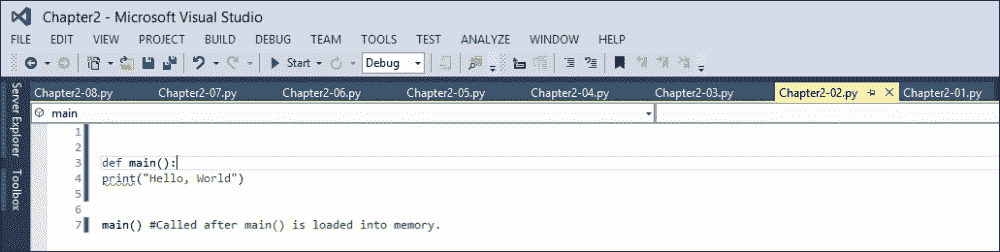
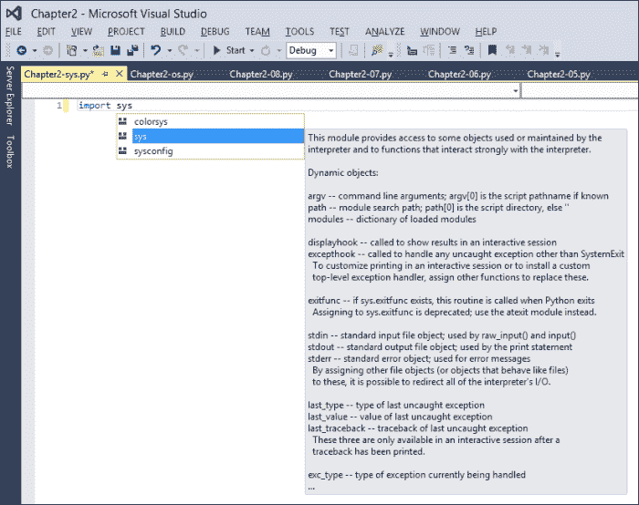
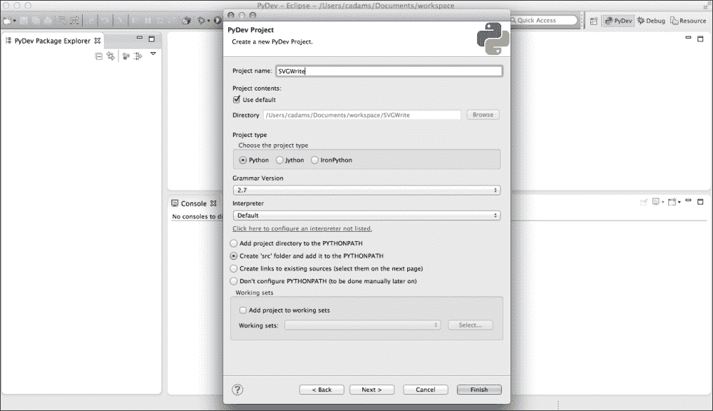

# 二、Python 复习

在本章中，我们将学习一些 Python 编程基础知识以及 Python 开发中使用的常见 Python 第一和第三方库。在这一章中，我们将使用标准的 2.7 CPython 为 Visual Studio 开发 Python 工具，这对于新的 Python 开发人员来说非常有用。如果你在苹果电脑、Linux Eclipse 或你选择的编辑器上工作，那就没问题了。我们将在 Visual Studio 中使用 pip 和 easy_install，但我也将包括 Mac 和 Linux 命令的注释。

# Python 基础知识

让我们从用 Python 工具在 Visual Studio 中创建一个项目(VSPT)开始。转到**文件** | **新项目**，然后 **Python** | **Python 应用**，调用此解决方案`Chapter2`，如下图截图所示:


接下来，导航至 **【解决方案浏览器】**，点击**添加/删除环境**。你会看到如下截图所示的提示。如果您有多个 Python 安装，您将能够选择您想要指定的安装。点击 **Python 2.7** 环境，点击**确定**。


那么这是做什么的呢？Python 开发的一个常见问题是使用 pip 或 easy_install 安装在主机系统上的库被保存在项目文件之外。这使得在一个系统上安装不同库的 Python 脚本无法在另一个没有完全相同设置的系统上运行。它还将更新 Visual Studio 的智能感知，以尽可能好地安装任何 Python 库。

现在看看你的**解决方案浏览器**。你会看到 **Python 2.7** 已经添加到 **Python 环境**下。右键点击 **Python 2.7** ，点击**文件资源管理器**中的【打开文件夹】，可以看到复制的环境保存在项目中的什么位置。您将看到一个`Lib`文件夹，其中有一个名为`site-packages`的子文件夹，该文件夹是用自己的库结构为第三方模块和库创建的。

现在，让我们从 Python 的规范 Hello World 应用开始编写一些代码。在编辑器中输入以下代码，点击顶部的**开始**:

```py
print("Hello, World") #This will execute the quickest and fastest, but doesn't scale well in Python.
```

很多小的 Python 脚本都是这样写的，没有结构也没有包含。随着您的应用越来越大，这个可能会成为一个问题。让我们把它包装成一个函数。再次在编辑器中输入以下代码，点击顶部的**开始**:

```py
#A simple python function.
def main():
    print("Hello, World")

main() #Called after main() is loaded into memory.
```

这里，我们创建了一个名为`main()`的函数，并将我们的`print`语句包含在其中。下一行，我们调用`main()`触发控制台打印`Hello World`。如果你来自 C#或 JavaScript 背景，这可能看起来有点好笑，你这样想是对的。Python 是一种非常松散的语言——函数没有大括号，也没有分号来终止一行代码。

这将打字保持在最低限度，这很好，但是对于那些以前从未编写过 Python 代码的人来说，这可能会导致问题。Python 非常具体地说明了它的代码是如何构造的，以便它能够工作。请记住，在这本书的开头，像这样的错误会阻碍开发。让我们看一个例子:

```py
#A simple python function.
def main():
    print("Hello, World") '''A function needs to be indented and not be further away more than one line break.'''
main()
```

通过使用像 Visual Studio 或 Eclipse 这样的 IDE，我们可以看到类似这样的问题，而简单的文本编辑器可能不会显示这些问题。下面是 Visual Studio 显示的缩进问题。将鼠标移到`print()`方法上，您将获得问题所在的帮助。



到目前为止，这对于一个小的 Python 脚本来说是非常有效的，但是让我们开始将我们的代码转移到一个更加面向对象的结构中。现在，我们想要包装我们的`main()`函数，并让它用我们的 Python 内置脚本事件之一触发，具体来说，就是我们的`__main__`事件。请注意双下划线，这表示它是 Python 中的内置事件。以下是在`main()`功能上触发的`__main__`事件示例:

```py
#Same function as before.
def main():
    print("Hello, World")
if __name__ == '__main__': #Here Python checks if the runtime event __main__ is called if so run the code below.
    main()
```

你可以看到我们为`__main__`检查`__name__`事件；如果存在，则执行一个或多个功能。这类似于 C#中的`private void`函数或 JavaScript 中的`window.onload`。如果您想要创建自己的 Python 模块库，以这种方式包装函数也很重要，这样每个函数只能在模块完全加载时调用，而不是之前。

现在，让我们添加一个参数，这样我们就可以重用我们的`main()`函数。在这里，我将把用户名添加到`main()`函数中，这样我就可以向我们的`Hello` `print`语句传递一个字符串:

```py
#Main function with passed in parameter.
def main(readersname):
    print("Hello, " + readersname)

if __name__ == '__main__':
    main('Chad')
```

请注意，您可以使用`+`追加字符串，就像使用 JavaScript 或 C#一样。在 Python 中，您还可以选择字符串格式化程序。下面是前面的代码，其中一个字符串格式化程序传入了我们的`readersname`参数:

```py
#Here we use string formatting to better construct our strings.
def main(readersname):
    print("Hello, %s" % readersname)

if __name__ == '__main__':
    main('Chad')
```

让我们在`main()`方法中添加另一个参数。这一次，我们将使用一个数字，特别是一个整数。让我们将数字`35`作为读者已阅读的固定页数传递，并更新我们的`print()`声明，以包括两者:

```py
#Main function with two passed in parameters.
def main(readersname, amt):
    print("Hello, " + readersname + ", you have read " + str(amt) + " pages.")

if __name__ == '__main__':
    main('Chad', 35)
```

运行脚本，输出将是`Hello, Chad, you have read 35 pages.`。接下来，让我们在这里使用字符串格式，而不是使用字符串连接。我已经使用`%i`将字符串连接更改为字符串格式化程序，以指示格式是整数:

```py
#Here we use string formatting to better construct our strings.
def main(readersname, amt):
    print("Hello, %s, you have read %i" % (readersname, amt))

if __name__ == '__main__':
    main('Chad', 35)
```

字符串格式还可以帮助参数以独特的方式输出。假设我们想将`35`显示为带小数点的浮点数。我们可以将字符串整数格式化程序`%i`改为浮点格式化程序`%f`。看看这个例子:

```py
#Let's format the string to output a float with decimal places.
def main(readersname, amt):
    print("Hello, %s, your total pages read are %f." % (readersname, amt))

if __name__ == '__main__':
    main('Chad', 50)
```

如果我们运行 Python 脚本，您将看到输出`Hello, Chad, your total pages read are 50.000000.`。如我们所见，我们传递的整数值现在是`50.000000`，浮点格式化程序修改了我们的字符串，没有任何转换代码。如果我们希望它只显示两个小数点呢？好吧，我们可以调整我们的修饰符并指定小数点的数量，如下面的代码所示:

```py
#Let's format the string to output a float with two decimal places.
def main(readersname, amt):
    print("Hello, %s, your total pages read are %0.2f." % (readersname, amt))

if __name__ == '__main__':
    main('Chad', 50)
```

如果我们现在运行 Python 脚本，我们的输出如下所示:`Hello, Chad, your total pages read are 50.00`。

格式化程序也处理浮点数到整数；看看这个代码示例:

```py
def main(readersname, amt):
    print("Hello, %s, your total pages read are %i." % (readersname, amt))

if __name__ == '__main__':
    main('Chad', 50.652)
```

现在，让我们看看我们的结果:`Hello, Chad, your total pages read are 50.`。我们注意到它删除了小数位，尽管`.652`值应该将我们的 50 整数舍入到 51，但它没有。整数格式化程序只是修剪了值，并没有对值进行舍入。对于整数格式化程序来说，这一点非常重要。

太棒了。现在我们有了一个快速简单的方法，可以将数值转换成浮点数(小数点)，如果以后需要转换图表中的数值，还可以再次转换成整数。请记住，Python 是一种动态类型的语言，这意味着所有变量都可以是任何类型，而不需要指定，并且 Python 解释器会根据可用的类型来分配类型。现在我们已经掌握了函数和字符串，让我们来看看一些常见的库，以帮助我们理解文件输入和输出。

## 导入模块和库

到目前为止，我们所介绍的可以适用于非常小的 Python 脚本，但是我们希望使用预制的库和函数来充分利用 Python，以允许我们编写可维护的代码。在本节中，我们将回顾导入现有 Python 模块和库以及在代码中使用这些函数。

回想一下在[第 1 章](1.html "Chapter 1. Setting Up Your Development Environment")、*设置您的开发环境*中，我们介绍了安装 pip 和 easy_install。嗯，pip 至少是一个 Python 库，但是有一点你可能想不起来，那就是在那一章中，我们实际上安装了很多库和模块。如果你记得的话，我们还安装了来自[https://www.python.org/](https://www.python.org/)的 Python 语言解释器和工具。我们的安装附带了数百个要使用的捆绑库。这些被认为是 Python 的通用发布库。这些是 Python 开发中使用的公共语言库，由 Python 软件基金会测试，用于跨平台开发，这消除了对核心语言中特定于操作系统的开发的需求。

让我们尝试导入`sys`模块。`sys`模块提供对解释器使用或维护的一些变量以及与解释器强交互的函数的访问。

要导入模块，请在 Python 脚本的最上面一行键入以下内容。

```py
import sys
```

请看下面截图中的这一步:



在 Visual Studio 中，您可以通过按下 *Ctrl* +空格键来调用智能感知。当您键入时，可以越来越多地看到智能感知过滤器。此外，突出显示的内容将显示为该文件编写的 Python 文档字符串，以便为实现这些库的开发人员提供帮助和注释。

如果你在 Eclipse 中，Eclipse PyDev 也提供代码提示，就像 IntelliSense 一样。连键盘快捷键都一样， *Ctrl* +空格键。现在让我们测试一下我们的导入。由于`sys`可以查找 Python 参数和环境变量，所以让我们检查一下我们运行的是什么平台。在编辑器中键入以下内容:

```py
import sys

platform = sys.platform;

print("%s" % platform)
```

现在运行脚本，如果你在基于 Windows 的操作系统中，你的输出将是`win32`；如果你在 Mac OS X 上，你的输出会是`darwin`(这里指的是 FreeBSD 的苹果实现，它是 OS X 的核心)。如果你在像 Ubuntu 这样的 Linux 操作系统上，你的输出将是`linux2`。

接下来，让我们使用`sys.version_info`检查版本。`version_info`列表返回当前版本用于该脚本的内容、主要发行号(int)、次要发行号(int)和微发行号(int)的数组。为了测试这一点，让我们运行下面代码中显示的脚本:

```py
import sys

pyversion_major = sys.version_info[0];
pyversion_minor = sys.version_info[1];
pyversion_micro = sys.version_info[2];

print("Python version: %s.%s.%s" % (pyversion_major, pyversion_minor, pyversion_micro))
```

运行脚本，你的输出应该是`Python version: 2.7.6`或者 Python 2.7 的更新版本。现在我们已经掌握了导入，让我们从使用`os`模块及其用户和路径功能的 Python 文件输入/输出的基础开始。

## 输入和输出

使用 Python 时的一个核心技能是理解输入和输出。如果您来自无法访问文件的客户端 web 开发背景，请在这一部分特别注意，因为在创建图表时，我们需要能够将图表保存到硬盘上。

`os`模块是 Python 中使用最多的模块之一，主要是因为它如何处理跨平台获取公共文件路径。让我们演示如何读取文件。创建一个名为`PyREADME.txt`的文本文件，并将其保存到项目目录中。将以下文本复制到`PyREADME.txt`文件中并保存文件:

```py
Hello Reader,
This copy is being read in Python, and saved as a string to a variable.
```

保存后，它应该如下图所示:


现在，在您的 Python 编辑器中，我们将通过在最上面的行包含`import os`来导入`os`模块，然后添加以下代码。确保你的`PyREADME.txt`文件和你运行的 Python 脚本在同一个目录下。

```py
import os

#Open the file to be read.
openFile = os.open('PyREADME.txt', os.O_RDONLY )

#Save the file's inner content to a Python variable string. This take two parameters, the file to be opened and how many characters to read.
readmeText = os.read(openFile, 100)

print(readmeText)
```

如果一切都成功了，您的输出窗口应该会显示下图中的内容。

### 型式

如果您有问题，请仔细检查您的文件类型，看看您是否有文件扩展名，如`PyREADME.txt`。


现在让我们回顾一下我们的代码。我们使用`open()`函数打开我们的文件，我们有两个参数:带扩展名的文件名和`r`字符串。`r`字符串告诉`open()`方法我们在处理文件时有什么权限。打开文件后，我们读取文件并将其打印到控制台。最后，我们关闭我们的`openFile`；这使我们不会有潜在的内存泄漏，因为我们的文件 I/O 不会关闭，直到我们告诉它关闭。

接下来，让我们创建一个文本文件。我们将以`Hello World`为内容，命名为`content.txt`。用这段代码替换您的 Python 文件:

```py
import os

txtContent = 'Hello World'
openFile = open('content.txt', 'w') #Open the file to be written.
readmeText = openFile.write(txtContent) #Write the file's inner content to the text file.

openFile.close() #Close the file.
```

如果成功，你应该有一个新的文本文件，文件中写着`Hello World`，如下图所示。您可以在与 Python 脚本相同的目录中找到该文件。让我们回顾一下代码。您会注意到，我们将`open()`权限的参数更改为`w`，这意味着只写，并且我们将文件名设置为`content.txt`到以指示文件的名称(即使在运行脚本之前它不存在)。除此之外，唯一改变的代码是因为我们用`openFile.write()`替换了`openFile.read()`，告诉 Python 向文件中写入内容字符串，而不是从文件中输出。


## 生成图像

现在我们理解了导入和读写文件到我们电脑的硬盘，让我们生成一个带有一些文本的图像。首先要做的是下载一个映像库来使用，因为默认情况下 Python 不包含映像库。其中最常见的是 **Python 图像库** ( **PIL** )。PIL 允许将文本输入打印为图像，并且非常常用于验证码密码系统。

要安装 PIL，我们需要使用 easy_install。如果您有 Mac OS X 或 Linux，命令如下:

```py
sudo easy_install PIL

```

在 Windows 上，您可以作为 Python 目录中的管理员在命令行中运行以下命令:

```py
easy_install PIL

```

更好的是，如果你使用 Visual Studio 作为你的编辑器，将你的项目设置为 **Python 2.7** 并点击 **Python 环境 2.7** 实例下的**安装 Python 包**。在 easy_install 下输入`pil`，勾选**以管理员身份运行**，如下图截图所示:


如果成功，您应该能够看到环境中包含的`pil`，如下图所示:


在其他环境中，如 Eclipse，您可以使用以下命令检查您的导入:

```py
from pil import *

```

这将从 PIL 图书馆导入所有模块。现在我们有了这个设置，我们将重用我们之前创建的`content.txt`文件，并生成一个包含其内容的图像。由于这有点复杂，我将把这两个步骤移到它们自己的函数中，如下面的代码所示:

```py
from pil import *
import Image
import ImageDraw
import os

def readcontent():
    '''Open the file to be read. Note the file's permission is set to read-only.'''
    openFile = open('content.txt', 'r')
    '''Save the file's inner content to a Python Variable string.'''
    readmeText = openFile.read()
    '''Close the file to save memory.'''
    openFile.close()
    '''Return the results to each as a reference variable.'''
    return openFile, readmeText

def generateImage():
    '''Create our references.'''
    img = Image.new("RGBA", (100, 80), "white")
    '''Draw the images size and background to the screen.'''
    draw = ImageDraw.Draw(img)
    '''Position the text with an x/y of 10 x 10, assign it the text value and text color of red.'''
    output = draw.text((10, 10), readmeText,  fill=(255,0,0,255))
    '''Draw the text to the screen.'''
    draw = ImageDraw.Draw(img)
    '''Save the image.'''
    img.save("output.png")
    '''Return the results to each as a reference variable.'''
    return draw, img, output

'''trigger the read content function.'''
openFile, readmeText = readcontent()

'''Generate our image.'''
draw, img, output = generateImage()
```

我们现在应该有一个简单的图像，如下图所示。如果您想设置字体大小和字体，请随意修改`content.txt`文件以获得不同的结果。


### 型式

通过 easy_install，当前版本的 PIL 有一个 bug。一些基于 C 的代码安装不正确。你可能想看看枕头(PIL 的捆绑版)，你可以在这里下载:[https://code.google.com/p/rudix/downloads/detail?名称=枕头-1.7.7-0.pkg & can=2 & q](https://code.google.com/p/rudix/downloads/detail?name=pillow-1.7.7-0.pkg&can=2&q) 。

# 使用 svgwrite 创建 SVG 图形

在我们结束这一章之前，让我们来看看如何生成基于矢量和计算机绘制的可缩放线条和形状的 SVG 图形。为此，我们将使用一个名为`svgwrite`的 Python 库，您可以在这里找到:[https://pypi.python.org/pypi/svgwrite](https://pypi.python.org/pypi/svgwrite)。由于这是 PyPi 上的 Python 库，我们可以使用 pip 来安装。

## 对于使用 VSPT 的 Windows 用户

将您当前的 Python 实例添加到您的**解决方案资源管理器**中的 Python 环境中，并在**安装 Python 包**提示符下键入`svgwrite`，如下图所示:


如果成功，您应该会在您的**解决方案资源管理器**中看到包，如下图所示。如果您看不到它们，请尝试打开您的 **Python 环境**，然后在您的解决方案中打开您的 Python 版本:


## 适用于 Eclipse 或 Windows 上的其他编辑器

在具有管理员权限的命令提示符下键入以下命令:

```py
cd C:\Python27
pip install svgwrite

```

以下是 Windows 命令提示符的屏幕截图:


## 适用于 Mac 和 Linux 上的 Eclipse

打开终端，输入以下命令:

```py
sudo pip install svgwrite

```

我们在这里使用`sudo`来确保`svgwrite`的所有东西都已正确安装。接下来，在 PyDev 中创建您的项目，并确保将项目路径设置为`src`。这将路径设置为它自己的目录，而不是您的 Python 根目录。请看下面的截图，它显示了 OS X Eclipse 中一个新的 PyDev 项目的开始:



在 Eclipse 中，您也可以使用 Python 控制台检查代码。在控制台中，点击窗口右上角的**新控制台视图**图标，选择 **Pydev 控制台**，如下图所示:


您也可以在 PyDev 中验证您安装了什么软件包。在您的 **PyDev 包浏览器**中，展开 **python** 根目录，转到**系统库**|**2.7/站点包**。一旦打开，如果能找到`svgwrite`，就应该设置好了。在下面的截图中，您可以看到它在我的系统上的外观:


一旦你准备好了，我们将创建一个新的项目和 Python 文件来生成我们的 SVG 文件。首先创建`svgwrite`的导入(小写)，如下代码所示:

```py
import svgwrite
```

现在让我们引用根`svgwrite`库，并将其分配给一个变量，我们可以将其作为 SVG 文件输出。为此，我们将使用`svgwrite`中的`Drawing`方法。`Drawing`方法使我们能够创建一个 SVG 文件。这是我们将放下其他对象的地方，如文本、线条、圆圈等。

让我们看看下面的例子:

```py
drawObj = svgwrite.Drawing('username.svg', profile='tiny', width=444, height=300)
```

这里，我们有一个`drawObj`变量，我们已经创建了一个`svgwrite`对象的实例，并使用一些参数调用了`Drawing`方法。我们的第一个参数是一个字符串，我们在这里声明我们的文件名；在这种情况下，`username.svg`。请注意，我们没有包含路径，因此对于这个脚本，文件将保存在我们的项目目录中。

`profile`属性为 SVG 设置基本配置文件。您可以使用两个值:`tiny`和`full`。我们也可以用`width`和`height`属性设置 SVG 标签的宽度和高度。

现在，我们有了基础绘图对象来绘制形状。我们将为`drawObj`变量添加一个 SVG 文本节点。请看下面一行:

```py
drawObj.add(drawObj.text('Test', insert=(0, 0), fill='red', font_size=70, font_family='sans-serif', font_weight='bold'))
```

这里我们有一系列的参数。第一个是我们想要写入节点的文本副本的字符串，下一个是一个映射(映射是一组两个参数)。这个映射为 SVG 节点中的左上角文本块元素设置了 X 和 Y 坐标。

下面是我们这个文本块的`fill`颜色；在这种情况下，我们有一个值`red`。如果我们需要它类似于 CSS 中的颜色十六进制，我们也可以在这里使用十六进制值。这里我们还有三个参数:`font_size`、`font_family`和`font_weight`，它们都是不言自明的。`font_size`参数使用简单的 int 值来增加或减少大小。`font_family`参数将适用于系统中包含的任何常规字体(不需要文件路径)。而`font_weight`可以根据所选字体的属性将字体的粗细设置为`bold`或`light`。注意，没有`font_family`参数，`font_weight`参数将不起作用。

最后，我们将使用`save()`函数将`drawObj`变量保存到文件中。这将使用我们添加的参数保存文件。加上这些，这里有一个准备运行的完整脚本。这是我们的`save()`功能:

```py
drawObj.save()
```

现在让我们从我们的 IDE 中运行应用。按照上一个代码中显示的`drawObj`示例检查您的代码，假设没有遇到错误，您应该会看到一个终端(或命令提示符)窗口，其中**按回车键继续……**如上一个示例所示，表示成功。

我们可以通过进入我们的项目目录，并在我们选择的浏览器中打开我们新生成的`username.svg`文件来查看:


我们快到了。看起来我们的 SVG 文件很好，但是我们的文本节点偏离了中心。还记得我们的`insert`地图吗，我们在那里定义了我们的 X 和 Y 坐标？让我们调整一下；此外，如果您正在使用 Ubuntu 或任何其他 Linux 发行版，您可能需要格式化 X 和 Y 坐标以适合您平台的浏览器:

```py
drawObj.add(drawObj.text('Test', insert=(15, 64), fill='red', font_size=70, font_family='sans-serif', font_weight='bold'))
```

让我们在浏览器中重新运行并刷新我们的 SVG 文件:


有我们的文本，显示作为我们生成的一个 SVG。请注意，我们甚至可以选择文本。由于这是一个文本节点，我们应该能够在网络内容中突出显示甚至搜索它。将输出作为 SVG 给了我们创建图形的一系列用途。

让我们在文本节点周围添加几行，比如 X 和 Y 图表基线，只是为了显示一些基本的绘图。在您的`save()`功能之前，包括如下例所示的`line()`功能:

```py
import svgwrite

drawObj = svgwrite.Drawing('username.svg', profile='tiny', width=444, height=300)
drawObj.add(drawObj.text('Test', insert=(15, 64), fill='red', font_size=70, font_family='sans-serif', font_weight='bold'))
drawObj.add(drawObj.line((10, 10), (10, 70), stroke=svgwrite.rgb(0, 0, 0, '%')))
drawObj.add(drawObj.line((10, 70), (370, 70), stroke=svgwrite.rgb(0, 0, 0, '%')))
drawObj.save()
```

现在让我们重新运行我们的项目看看结果:


现在我们有了一个非常简单的图表的开始，它被导出为一个我们可以在 HTML 中操作的 SVG 文件(使用兼容 SVG 的浏览器)。看看下面的截图。在这里，我们可以使用 Chrome 的网页浏览器来改变`fill`的颜色:


整洁！所以现在我们可以打印文本和对象到一个 SVG 文件！我们可以在 SVG 中绘制线条、方框和圆圈，当您看到这些时，您开始了解如何从头开始构建图表和图形。让我们让这个脚本更实用一点，就像我们把它用作一个应用一样。让我们重用我们的 Hello World 图像脚本中的文本文件阅读器模块。

在开始这段代码之前，请确保您的`content.txt`文件位于项目目录的根目录下。接下来，让我们重用我们早期脚本中的`readcontent()`函数。早期在模块中分解这些代码有助于我们通过复制和粘贴在新项目中重用这些代码！

首先，包括您的导入，它将包含`svgwrite`，就像之前访问您的文本文件一样:

```py
import svgwrite

def readcontent():
    '''Open the file to be read. Note the file's permission is set to read-only.'''
    openFile = open('content.txt', 'r')
    '''Save the file's inner content to a Python Variable string.'''
    readmeText = openFile.read()
    '''Close the file to save memory.'''
    openFile.close()
    '''Return the results to each as a reference variable.'''
    return openFile, readmeText

'''trigger the read content function.'''
openFile, readmeText = readcontent()
```

现在让我们将包装在它自己的函数中，并给它一个参数；在这种情况下，`username`，要传递我们的`content.txt`文件的输出。您的 Python 脚本应该类似于以下代码:

```py
import svgwrite
def readcontent():
      '''Open the file to be read. Note the file's permission is set to read-only.'''
      openFile = open('content.txt', 'r')

      readmeText = openFile.read()
      '''Save the file's inner content to a Python Variable string.'''

      openFile.close()
      '''Close the file to save memory.'''

      return openFile, readmeText
      '''Return the results to each as a reference variable.'''

def createSVGText(usrname):
    drawObj = svgwrite.Drawing('username.svg', profile='tiny', width=444, height=300)
    drawObj.add(drawObj.text(usrname, insert=(15, 64), fill='red', font_size=70, font_family='sans-serif', font_weight='bold'))
    drawObj.add(drawObj.line((10, 10), (10, 70), stroke=svgwrite.rgb(0, 0, 0, '%')))
    drawObj.add(drawObj.line((10, 70), (400, 70), stroke=svgwrite.rgb(0, 0, 0, '%')))
    drawObj.save()
    return drawObj

'''trigger the read content function.'''
openFile, readmeText = readcontent()
'''Grab the 'readmeText' file content and pass that into our createSVGText function.'''
drawObj = createSVGText(readmeText)
```

重新运行脚本，让我们看看的`username.svg`文件:


我们到了。我们创建了一个动态脚本，它从本地文本文件中提取数据，并将其导入类似图表的布局中，并在每次运行时动态更新。玩转选项，看看你能做什么，把其他单词输入`content.txt`文件。

现在这还是一个简单的剧本；显然，如果我们在文本文件中键入一个非常长的字符串，它将溢出 SVG 文件。这只是一个要素。如果您从头开始构建图表，并且需要一切正常工作，该怎么办？我们可以假设这只会变得越来越复杂，最终这就是本章的重点。

# 总结

总结一下，在本章中，我们回顾了一些基本的 Python 技能、变量、函数和参数；看到了如何导入库以及如何在多个 IDEs 上安装库；并使用 Python 图像库(一个常见的 Python 库)生成 PNG 图形。

我们花了一点时间来理解 Python 中的路径和文件输入/输出，在 Python 代码中读写文件和变量。我们还学习了 SVG 图形:如何使用它们，并使用`svgwrite`库在 Python 中生成它们。

现在，我们已经用 Python 完成了一些基本的图形生成，并使用了一些基本的图像库，我们准备开始本书的数据可视化部分。

如您现在所知，构建图形，更不用说图表，在没有一些帮助库的情况下可能是一项艰巨的任务。幸运的是，Python 提供了一个又一个经过测试的漂亮的图表工具库，为您的 Python 项目做好了准备。

在下一章中，我们将从一个非常易于使用的、几乎全包的库开始，该库用于构建已准备好高端多媒体内容的 SVG 图表:pygal！