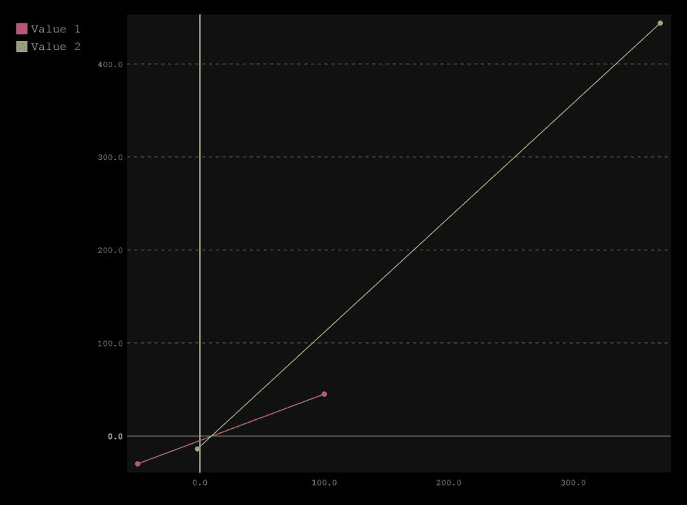

# 三、pygal 入门

在本章中，我们将从使用 Python 的 **pygal** 图表库构建一些基本的 SVG 图表开始，并查看常见的图表类型和样式。

# 为什么用 pygal？

在 Python 开发的世界中，有许多图表库(Matplotlib 和 Plotly 是几个例子)，并且已经为其中许多编写了烹饪书风格的书籍。由于这是对数据图表的介绍，我们需要一个简单易用的库，熟悉 Python 图表或 Python 图表的开发人员可以轻松地从这本书中获取代码并构建 Python 应用。下面的截图显示了 pygal 网站和一些图表示例:


这是皮格尔进来的地方；pygal([http://pygal.org/](http://pygal.org/))是一款基于 Python 的 SVG 图表创建器，由 Kozea 社区([http://community.kozea.fr/](http://community.kozea.fr/))开发，如下图所示。这是一个致力于构建高质量开源库的组织(主要基于 Python，但也适用于 HTML5 项目)。


`pygal`库除了我认为的标准图表之外，还提供了多种图表选项:条形图、折线图和饼图。它包括世界地图、漏斗图、雷达图和方框图等。

它还包括预先构建的主题和样式，如果您不打算这样做，就不必定制它们。此外，由于图表库的输出是 SVG，这使得它成为 HTML5 甚至打印媒体的高度灵活的输出类型。Python 中一些图表库的一个问题是输出默认为具有指定图像大小的 PNG 格式。由于 SVG 是一种矢量图形(一种可缩放而不损失图像质量的图形)，因此它可以根据任何需要进行缩放和调整大小，而不会损失质量。

请看下面的[http://pygal.org/](http://pygal.org/)文档页面截图:


pygal 网站也包含了非常好且易于阅读的文档。第三方 Python 库很常见的一点是，文档可以从一个文档齐全、可在线搜索的 wiki 到一个仅显示如何安装库的简单`readme.txt`文件。`pygal`库也不需要太多的依赖，这对于入门书来说是至关重要的，因为一个非常依赖的库可能会给新开发人员或刚接触 pygal 的开发人员带来问题。

许多 Python 框架都有一些非常挑剔的依赖项，您可能需要它们来完成您的项目，但是它们可能适合您的系统，也可能不适合您的系统。


`lxml`库是 pygal 唯一需要的库，但是它有一些问题，这取决于您在哪个操作系统上运行 Python 代码。在我们介绍 pygal 的安装之前，我鼓励您重读`lxml`上的注释(特别是如果您运行的是 Windows)。

至此，让我们安装 pygal 并构建一些图表！

## 使用 pip 安装 pygal

首先首先，如果你还没有安装`lxml`，如果你在 Windows 上工作，你会想要安装`lxml`安装程序，如[第 1 章](1.html "Chapter 1. Setting Up Your Development Environment")、*设置你的开发环境*所述；否则，下面的命令应该会为你安装`lxml`。接下来，我们将使用 pip 并使用以下命令为 Windows 和 Mac/Linux 系统安装`pygal`(注意在 Mac 和 Ubuntu 安装中使用了`sudo`)。

如果您是 Windows 用户，请键入以下命令:

```py
pip install pygal

```

如果您是苹果或 Ubuntu 用户，请键入以下命令:

```py
sudo pip install pygal

```

接下来，用 PyDev 打开 Eclipse，创建一个新的 Python 项目，然后是一个新文件(设置并不重要，因为这是一个测试项目)。项目创建后，创建新文件，称之为`importtest.py`，并键入以下内容:

```py
import pygal
```

如果成功，您应该能够按下 *Ctrl* +空格键，并看到 PyDev 的代码提示拉出系统上安装的所有库。在下面的截图中，可以看到`pygal`正在我的系统中被识别:


## 使用 Python 工具为 Visual Studio 安装 pygal

如果您计划在 Visual Studio 中工作以完成本书的剩余部分，这里有一个关于安装的注意事项:首先，如果您还没有安装`lxml`，如[第 1 章](1.html "Chapter 1. Setting Up Your Development Environment")、*中所述设置您的开发环境*，然后在**安装 Python 包**窗口中用您的 Python 环境运行 **easy_install** ，如下图截图所示:


如果成功，您的**解决方案资源管理器**窗口应该如下图所示，包括`lxml`:


最后，安装`pygal`库。右键单击环境中的，选择**安装 Python 包**，这次是`pygal`，如下图所示:


## 构建折线图

折线图通常显示特定数据在不同时间间隔的变化情况。在图表中，这是您能制作的最简单的图表，通常带有 *x* 和 *y* 轴，图表上的每个轴表示时间、值或其他参数。

让我们建立一个简单的图表，在这种情况下，一个网站在过去两年(2012-2014 年)的点击量。看看下面代码的第一行；这是 Python 解释器用来指定文件字符串编码类型的声明行。另外，你会在`line.x_labels`上注意到我们使用了一个名为 `range()`的内联函数。这让我们创建一个数字数组，从最低的数字开始到最高的数字；在下面的例子中，`2012`和`2014`将打印为一个数组中的`2012`、`2013`、`2014`。现在，将以下代码复制到项目的主 Python 文件中:

```py
# -*- coding: utf-8 -*-
import pygal

#create a new line chart.
line = pygal.Line()
line.title = 'Website hits in the past 2 years' #set chart title
line.x_labels = map(str, range(2012, 2014)) #set the x-axis labels.
line.add('Page views', [None, 0, 12, 32, 72, 148]) #set values.
line.render_to_file('linechart.svg') #set filename.
```

下面的截图显示了一个基本的 pygal 折线图输出:


在运行脚本的主项目文件中，您可以看到创建的`linechart.svg`文件。打开它，你的图表将看起来像前面截图中显示的那样。要找到文件，打开项目所在的目录，找到`linechart.svg`文件。请注意，您可以将鼠标悬停在这些点上，并获取图表中每个标记的值；这些是`pygal`图书馆预建的一些功能。

我们也将看到图表的时间线从 2013 年的 0.0 开始。如果你看一下 `line.add()`语句，第一个参数是`None`；这在我们的图表中增加了一个间隔，将图表数据推出一点点，而不是迫使图表从 2012 年开始。这是设置图表布局的常见技巧。

另一个特点是，如果您将鼠标悬停在线标签上(在本例中为`Page views`)，整条线将被高亮显示，指示您正在使用该标签查看哪个数据集。`pygal`库还将检查您的数据，并强调数据轴上的某些行，如 0.0、50.0 和 100.0，以分解一些图表行，从而更容易阅读。

### 型式

pygal 对`line()`函数外观的代码提示支持取决于您使用的 IDE。与大多数 Python 库相比，`pygal`库的编写方式略有不同。该库使用`for`循环动态生成每个图表类型，该循环检查`pygal`库中的每个图表类。因此，在 Python 中需要静态硬编码函数的 ide 会抛出一个错误，但在运行时不会中断。换句话说，使用代码提示可能会也可能不会很好地工作，这取决于您使用的编辑器。

# 堆叠折线图

堆叠折线图的工作方式与传统折线图相似，但它们将多组数据堆叠在一起，以显示一个组的特定值。将以下代码复制到项目的主 Python 文件中，并运行该文件。另外，请注意我们图表上的多个`add()`功能。由于图表在一个图表中有多个数据集，我们需要为每个数据集创建一个数据集:

```py
# -*- coding: utf-8 -*-
import pygal

#create a new stacked line chart.
line = pygal.StackedLine(fill=True)
line.title = 'Web hits in the past 2 years' #set chart title
line.x_labels = map(str, range(2012, 2014)) #set the x-axis labels.
line.add('Site A', [None, 0, 12, 32, 72, 148]) #set values.
line.add('Site B', [2, 16, 12, 87, 91, 342]) #set values.
line.add('Site C', [42, 55, 84, 88, 90, 171]) #set values.
line.render_to_file('linechart.svg') #set filename.
```

下面的截图显示了我们脚本的结果:


渲染后，您的堆叠图将看起来像前面截图中显示的那样。打开项目所在的目录，找到`linechart.svg`文件。注意默认情况下 pygal 是如何覆盖您的原始 SVG 文件的；使用此库时，请记住这一点。另外，您会注意到，当我们声明图表时，我们在`StackedLine`函数中添加了一个`fill=True`参数；这是一个图表参数。稍后将对此进行更多介绍，但在这里我们可以看到填充颜色被添加到图表的线条下方。

# 简单条形图

条形图和折线图一样是典型的，但是它们占据了图表的整个区域。它们还有助于显示信息类别的价值。让我们构建一个简单条形图，将以下代码复制到一个名为`bar_chart.py`的新文件中，并运行脚本:

```py
# -*- coding: utf-8 -*-
import pygal

#create a new bar chart.
bar = pygal.Bar()
bar.title = 'Searches for term: sleep'
bar.x_labels = map(str, range(2011, 2015))
bar.add('Searches', [81, 88, 88, 100])
bar.render_to_file('bar_chart.svg')
```

转到您的项目目录，在浏览器中打开`bar_chart.svg`。请注意，除了提供的数据和定义的图表类型之外，代码没有太大变化(在本例中，它是`pygal.Bar()`)。下面的截图显示了我们脚本的结果:


# 堆叠条形图

就像折线图一样，堆叠条形图按照数据顺序将不同的条形图重叠在一起。让我们复制下面的代码示例并运行这个脚本:

```py
# -*- coding: utf-8 -*-
import pygal

#Create a new stacked bar chart.
bar = pygal.StackedBar()
bar.title = 'Searches for term: sleep'
bar.x_labels = map(str, range(2011, 2015))
bar.add('Men', [81, 88, 88, 100])
bar.add('Women', [78, 84, 69, 92])
bar.render_to_file('bar_chart.svg')
```

下面的截图显示了我们脚本的结果:


由于这是一个堆叠值，我们有两组数据；在这种情况下，男人和女人搜索。前面的截图是完整的图表，显示了带有术语“睡眠”的总搜索的分离段值的组合数据集。

# 水平条形图

对于 pygal 提供的最后一种条形图类型，我们将使用水平图，并重用简单条形图中的数据。水平条形图旨在更好地显示某个时间点的数据。为此，我们将删除我们的`x_labels`属性，因为我们只想显示一个月，因此删除了年份。现在，复制以下代码并运行脚本:

```py
# -*- coding: utf-8 -*-
import pygal

#create a new bar chart.
bar = pygal.HorizontalBar()
bar.title = 'Searches for term: sleep in April'
bar.add('Searches', [81, 88, 88, 100])
bar.render_to_file('bar_chart.svg')
```

打开`bar_chart.svg`文件；结果显示在下面的截图中:


# XY 图表

XY 图表是科学数据中用来显示不同点的多个值的典型。它们也可以显示负值。为了便于阅读，它们还覆盖了多组值。让我们用两点建立一个简单的 XY 图表。将以下代码复制到您的 Python 文件中并运行应用，并将您的 SVG 文件输出保存为`xy_chart.svg`:

```py
# -*- coding: utf-8 -*-
import pygal

xy_chart = pygal.XY()
xy_chart.add('Value 1', [(-50, -30), (100, 45)])

xy_chart.render_to_file("xy_chart.svg")
```

打开`xy_chart.svg`文件；结果显示在下面的截图中:


注意`pygal`如何在 x 和 y 坐标上高亮显示 0 线；同样，这是由`pygal`库提供的免费样式，用于指示负值。此外，注意`add()`函数，每个值是如何记为(x，y)坐标，并组合成一个数组的。让我们建立另一个图表，这次有两个图；在这种情况下，我们使用`Value 1`和`Value 2`进行构建。复制以下代码并运行它:

```py
# -*- coding: utf-8 -*-
import pygal

xy_chart = pygal.XY()
xy_chart.add('Value 1',  [(-50, -30), (100, 45)])
xy_chart.add('Value 2',  [(-2, -14), (370, 444)])
xy_chart.render_to_file("xy_chart.svg")
```

打开`xy_chart.svg`文件；注意有两条线图，如下图所示:



我们现在将看到如何在 XY 图表中绘制基本线图，但是如果我们在一条线上有多个值呢？我们再写一张 XY 图，三个值，每个值六个点。让我们看看下面的代码并运行它:

```py
# -*- coding: utf-8 -*-
import pygal

xy_chart = pygal.XY()
xy_chart.add('Value 1',  [(-50, -30), (100, 45), (120, 56), (168, 102), (211, 192), (279, 211)])
xy_chart.add('Value 2',  [(-2, -14), (370, 444), (391, 464), (399, 512), (412, 569), (789, 896)])
xy_chart.add('Value 3',  [(2, 10), (142, 164), (184, 216), (203, 243), (208, 335), (243, 201)])
xy_chart.render_to_file("xy_chart.svg")
```

完成后，打开`xy_chart.svg`文件；它应该看起来像下面的截图所示:


请注意我们如何轻松地读取每个数据集。我们可以看出`Value 2`的数值最多的是在偏高的一侧，也可以看出`Value 3`达到了比`Value 1`更高的点但是下降的很快，这使得 XY 图对于科学数据来说非常棒。现在，让我们来看看 XY 图表的一种变体，称为散点图。

# 散点图

散点图的工作原理与 XY 图表相同，但它们没有链接在一起的线条。在`pygal`库中，这次没有“散点图”功能可以使用。相反，我们只是重用 XY 图表函数并设置一个参数；在这种情况下，`stroke`等于`False`(默认为`stroke`为`True`)。让我们重复使用上一张图表中的 XY 代码，添加`stroke`参数，看一下:

```py
# -*- coding: utf-8 -*-
import pygal

xy_chart = pygal.XY(stroke=False)
xy_chart.add('Value 1',  [(-50, -30), (100, 45), (120, 56), (168, 102), (211, 192), (279, 211)])
xy_chart.add('Value 2',  [(-2, -14), (370, 444), (391, 464), (399, 512), (412, 569), (789, 896)])
xy_chart.add('Value 3',  [(2, 10), (142, 164), (184, 216), (203, 243), (208, 335), (243, 201)])
xy_chart.render_to_file("xy_chart.svg")
```

打开`xy_chart.svg`文件；它应该像下面的截图所示:


请注意，如果有更多的数据点，这个图表会更容易阅读。通常，使用 XY 图表和散点图的一个很好的经验法则是，如果每个数据集有 10 个以上的点或者有 6 个以上的数据集要显示。在结束本章之前，让我们再看一下`pygal`库中 XY 图表库的一个变体: **DateY** 。

# 日期图表

日期图表的工作方式与任何 XY 图表相同，只有一个例外。每个数据点都与一个日期相关联，而不是 Python 中带有日期的字符串类型，而是 Python 代码中的物理日期时间对象。在我们的 Python 代码中，每个 X 标签都将与一个`date`对象相关联，Y 要么是整数，要么是我们提供的浮点数。

与我们的散点图不同，DateY 包含自己的函数，并遵循自己的规则。让我们构建一个非常简单的日期图来看看我们正在处理什么。首先，在运行下面的代码之前，先看看`datetime`库，具体是`datetime`和`timedelta`。

`datetime`库是 Python 的内置库，非常简单。它允许将日期保存到本地机器内部时钟的代码中，并包括将字符串转换为日期以及按时间向前或向后计数的方法。`timedelta`功能属于`datetime`图书馆。`timedelta()`代表的是持续时间，以及两个日期或时间之间的差异，带有基于日期的参数。让我们构建一个名为`timedelta.py`的快速脚本，并复制以下代码来查看结果:

```py
# -*- coding: utf-8 -*-
import datetime

from time import sleep
start = datetime.datetime.now()
sleep(5) #delay the python script for 5 seconds.
stop = datetime.datetime.now()

elapsed = stop - start
if elapsed > datetime.timedelta(minutes=4):
    print "Slept for greater than 4 minutes"

if elapsed > datetime.timedelta(seconds=4):
    print "Slept for greater than 4 seconds"
```

输出显示在下面的截图中。请注意，在设置`stop`变量的日期之前，我们在脚本中使用`sleep()`函数设置了`5`秒的延迟，从而通过了`4`秒。

### 型式

`time.sleep()`函数是一个常见的 Python 函数，对于无法多线程的进程密集型代码非常有用，例如复制或删除硬盘上的文件，或者使用 Python 为网络活动设置延迟。


接下来，让我们写下我们的日期表。对于这个图表，我们将用值给一系列日期加上时间戳；在这种情况下，乘客在给定时间从圣路易斯抵达。让我们编写以下代码并将输出保存为`datey_chart.svg`:

```py
# -*- coding: utf-8 -*-
import pygal
from datetime import datetime, timedelta

Date_Y = pygal.DateY()
Date_Y.title = "Flights and amount of passengers arriving from St. Louis."
Date_Y.add("Arrival", [
    (datetime(2014, 1, 5), 42),
    (datetime(2014, 1, 14), 123),
    (datetime(2014, 2, 2), 97),
    (datetime(2014, 3, 22), 164)
])
Date_Y.render_to_file('datey_chart.svg')
```

现在，让我们看看下面的图表。我们可以看到一个完整的日期时间与每个数据点相关联，如以及我们的图表值，在本例中是乘客。我们还可以在 *x* 轴标签上看到时间范围。然而，这有一个问题。看看下面的图表，看看 x 轴上的标签:


注意标签是如何聚集在一起的，如果它们不合适，就会被剪掉。这不是我们担心的问题，因为日期图表有一个可选参数来帮助呈现这些标签。我们可以使用下面代码中显示的参数沿着 *x* 轴旋转它们:

```py
# -*- coding: utf-8 -*-
import pygal
from datetime import datetime, timedelta

Date_Y = pygal.DateY(x_label_rotation=25)
Date_Y.title = "Flights and amount of passengers arriving from St. Louis."
Date_Y.add("Arrival", [
    (datetime(2014, 1, 5), 42),
    (datetime(2014, 1, 14), 123),
    (datetime(2014, 2, 2), 97),
    (datetime(2014, 3, 22), 164)
])
Date_Y.render_to_file('datey_chart.svg')
```

现在，让我们重新渲染我们的图表，如下图所示。我们可以看到标签的格式有助于提高可读性:


在完成本章之前，让我们再添加一个图表。在这里，我们将捕获由我们的代码调用的两个时间点，一个将被延迟一个睡眠延迟，就像我们的`timedelta`例子一样；我们将有两个航班在两个不同的时间点到达。

这里，我们将设置两次到达之间的延迟，并为每个数据点设置时间。我们将使用`time.sleep()`来延迟脚本。运行以下脚本。请记住，由于图表的代码有延迟，SVG 文件将需要`277`秒来处理:

```py
# -*- coding: utf-8 -*-
import pygal, time
from datetime import datetime

#Set pre-defined arrival dates for compare.
arrival1 = datetime.now()
time.sleep(277)
arrival2 = datetime.now()

delta = arrival2 - arrival1
result = str(delta.seconds) + ' seconds'

Date_Y = pygal.DateY(x_label_rotation=25)
Date_Y.title = "Flights and amount of passengers arriving from St. Louis."
Date_Y.add("Arrival", [
    (datetime(2014, 1, 5), 42),
    (datetime(2014, 1, 14), 123),
    (datetime(2014, 2, 2), 97),
    (datetime(2014, 3, 22), 164)
])
Date_Y.add("Arrivals today (time between flights %s)" % result, [
(arrival1, 14),
(arrival2, 47)
])

Date_Y.render_to_file('datey_chart.svg')
```

现在，我们来看看的结果。由于时间相隔并不太远，你可能想停留在上面，更细致地观察时间过去了多少。根据我们的标签，`277`秒已经过去:


# 总结

干得好！您已经使用`pygal`库完成了第一轮图表！我们回顾了常见的图表，如折线图和条形图、散点图和 XY 图表；了解了如何使用带有 DateY 的图表，包括两个`datetime`变量之间的比较；并创建了一个模拟现实场景的图表。

如果你纠结这一章，没关系。开始浏览前几个图表(折线图和条形图)，用自己的数据创建一些图表，直到你变得更加自信。

在下一章中，我们将介绍`pygal`库中更高级的图表类型，包括世界地图，以及更复杂的数据。