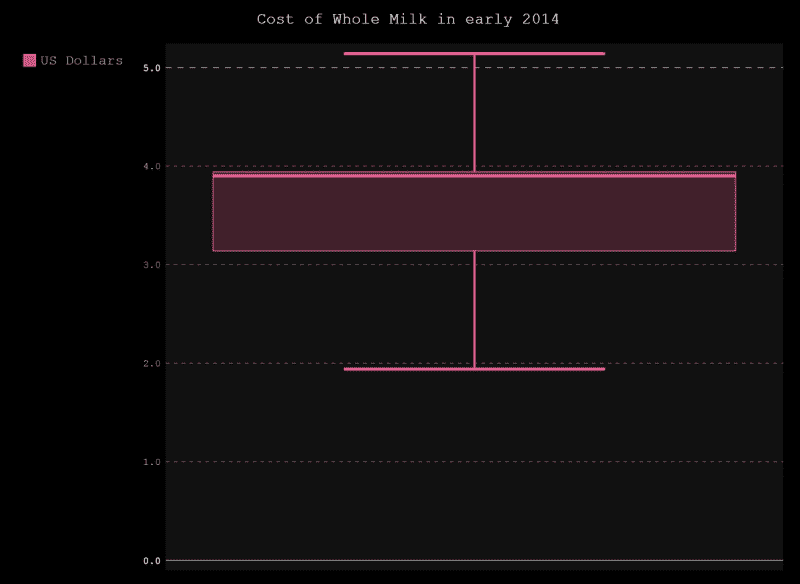
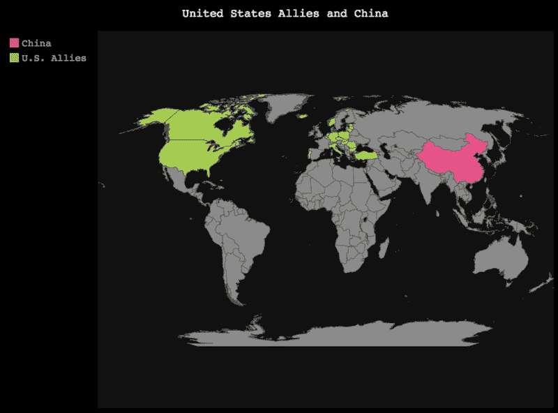

# 四、高级图表

在本章中，我们将使用 Python 的 **pygal** 图表库来探索和构建一些更高级的 SVG 图表。我们还将与 pygal 一起探索世界地图图表，并探索该图表特有的数据类型。

# 饼图

饼图可以很好地显示一组数据或一组数据的总和，这些数据像饼图一样被分割开来。让我们用一些虚拟数据构建一个简单的饼图。看看下面的代码，并将其合并到您自己的 Python 文件中。请注意，这次我们将文件输出保存到`pie_chart.svg`:

```py
# -*- coding: utf-8 -*-
import pygal

pie_chart = pygal.Pie()
pie_chart.title = 'Total top tablet sales in 2013 (in %)'
pie_chart.add('iPad & iPad mini', 49.7)
pie_chart.add('Surface Pro 2', 36.3)
pie_chart.add('Surface 2', 24.5)
pie_chart.add('Nexus 7', 17.5)

pie_chart.render_to_file('pie_chart.svg')
```

下面的截图显示了我们脚本的结果:


正如我们在前面的图表中所看到的，饼图中的每个`add()`函数都将一个不同的设备作为一个切片添加到饼图中。`pie`函数还包括基于第一个参数中给出的字符串的标准图例。

## 堆叠饼图

堆叠饼图的工作原理和听起来一样；它们将数值叠加在饼图的每个部分，让你更深入地了解数据。由于堆叠图表可以包含多个值，这些值并不是整个饼图的一部分，因此我们将构建此图表而不检查错误。让我们用下面的代码示例构建我们的图表；请注意，我们仍在使用`Pie()`功能，该功能类似于上一章的散点图和 XY 图表。一个限制是 pygal 中的堆叠饼图只接受主值之上的另一个值。我们还可以使用 Nexus 7 数据集上显示的单个值。这在以下代码中显示:

```py
# -*- coding: utf-8 -*-
import pygal
pie_chart = pygal.Pie()
pie_chart.title = 'Total top tablet sales in 2013 (in %)'
pie_chart.add('iPad & iPad mini', [19.7, 21.3])
pie_chart.add('Surface 2 (& Pro 2)', [24.5, 36.3])
pie_chart.add('Nexus 7', 17.5)

pie_chart.render_to_file('pie_chart.svg')
```

打开`pie_chart.svg`文件，结果如下截图所示:


在前面的示例中，我们可以看到每个饼图切片中的子层切片。看看我们的代码示例，注意额外的切片来自我们添加到图表对象的每个`add()`函数的第二个参数中的 Python 列表数组。

# 雷达图

雷达图非常适合显示一个数据对象的多个变量。雷达图通常看起来像你期望在机场雷达上看到的，向你显示一个中间有零点的地图区域。应用性能是您可以在其中找到雷达图的一个常见地方。它们也被用在体育图表中，显示球员或球队的优势和劣势。对于此图表，我们将为单个项目建立一个预算估计和实际预算支出合并在一个图表中:

```py
# -*- coding: utf-8 -*-
import pygal

radar_chart = pygal.Radar()
radar_chart.title = 'Product Budget Figures'
radar_chart.x_labels = ['Sales', 'Marketing', 'Development', 'Customer support', 'Information Technology', 'Administration']
radar_chart.add('Estimate', [40, 20, 100, 20, 30, 20, 10])
radar_chart.add('Actual Spending', [70, 50, 40, 10, 17, 8, 10])
radar_chart.render_to_file('radar_chart.svg')
```

打开`radar_chart.svg`文件，结果如下截图所示:


注意前面代码中显示的`x_labels`。在这种情况下，我们有`Sales`、`Marketing`、`Development`、`Customer support`、`Information Technology`和`Administration`作为一个数组项。

数组中每个项目的顺序很重要，因为雷达图按照数组的顺序设置每个数据集的值，以逆时针方式将该标签设置到雷达的每个端点。构建雷达图时请记住这一点。

# 方框图

箱线图，有时称为箱线图和触须图，是一种以类似条形图的方式向您显示数值的低、中、高范围的图表。方框图通常包含一个方框，该方框被定义为数据的高范围，然后在顶部和底部垂直向表示中间值的线逐渐变细，方框图末尾的线处的最小值也称为晶须。

箱线图适用于给定时间或供应范围内的估计值。它们也能很好地向您展示数据分布。箱线图也使用数组来表示数据，就像我们的雷达图一样。让我们用下面的代码构建一个简单的方框图，显示 2014 年初全脂牛奶的成本。确保您在`render_to_file()`函数中使用`box_plot.svg`作为文件名，如以下代码所示:

```py
# -*- coding: utf-8 -*-
import pygal

box_plot = pygal.Box()
box_plot.title = 'Cost of Whole Milk in early 2014'
box_plot.add('US Dollars', [2.08, 3.14, 3.89, 3.91, 3.94, 3.98])

box_plot.render_to_file('box_plot.svg')
```

这是一个非常简单的 pygal 图表；让我们看看我们的例子:



使用方框图，我们可以向图表中添加多个方框图。让我们这样做，通过增加另一个货币市场来看看结果。在这种情况下，我们将使用`Pound sterling`。复制以下代码，并查看结果:

```py
# -*- coding: utf-8 -*-
import pygal

box_plot = pygal.Box()
box_plot.title = 'Cost of Whole Milk in early 2014'
box_plot.add('US Dollars', [2.08, 3.14, 3.89, 3.91, 3.94, 3.98])
box_plot.add('Pound Sterling', [2.78, 3.84, 1.69, 4.71, 4.84, 4.92])

box_plot.render_to_file('box_plot.svg')
```

以下截图显示了我们脚本的结果:


现在，通过这个例子，我们可以看到并比较箱线图的中位数，并注意到，通过将鼠标悬停在我们的 SVG 图表上，美元的中位数落在范围的顶部附近并保持不变，而英镑的中位数被设置在箱线图的中高范围内，从而显示出一些变化。

# 点状图

点图(也称为点图)类似于旧的计算机穿孔卡片。它们是一种非常简单的传递数据集的形式，可以替代饼图或条形图。在 pygal 中，`dot_chart`类允许根据给定值调整每个点的大小，而无需程序员编写额外的代码。这保持了数据的简单性，但允许图表数据的消费者仍然对数据感兴趣。通常，您可以在数据集中找到点图，也可以在条形图中使用，并且可以更容易地读取小数据集。一些选民登记和/或统计将使用点状图，并将结果打卡到卡片或纸上的一行。

让我们建立一个简单的点图。我们将重用我们的箱线图中的数据集。首先，我们将使用美国货币数据集。将以下代码复制到您选择的编辑器中，并确保您将文件保存为`dot_chart.svg`:

```py
# -*- coding: utf-8 -*-
import pygal

dot_chart = pygal.Dot()
dot_chart.title = 'Cost of Whole Milk in early 2014'
dot_chart.add('US Dollars', [2.08, 3.14, 3.89, 3.91, 3.94, 3.98])

dot_chart.render_to_file('dot_chart.svg')
```

### 型式

点图仅适用于每个数据集不超过 30 个值的少量数据。如果您考虑的数据集大于 20-25，请考虑条形图、折线图或饼图。

打开`dot_chart.svg`文件，结果如下截图所示:


查看上图，可以看到数值越大，点越大。传统的点图通常不会调整点的大小；它们保持一致的大小。

让我们从方框图示例中添加英镑数据集，并更新变量。我们还将添加月份，以便使用`x_labels`属性更好地阐明我们的图表，并且我们还将向我们的 *x* 轴添加旋转。这将为我们的标签添加轻微的旋转，这些标签看起来会与多个数据集相互重叠。复制以下代码:

```py
# -*- coding: utf-8 -*-
import pygal

dot_chart = pygal.Dot(x_label_rotation=45)
dot_chart.title = 'Cost of Whole Milk in early 2014'
dot_chart.x_labels = ['Jan', 'Feb', 'Mar', 'April', 'May', 'June']
dot_chart.add('US Dollars', [2.08, 3.14, 3.89, 3.91, 3.94, 3.98])
dot_chart.add('Pound Sterling', [2.78, 3.84, 1.69, 4.71, 4.84, 4.92])

dot_chart.render_to_file('dot_chart.svg')
```

打开`dot_chart.svg`文件，结果如下截图所示:


这里，有了*x*轴标签，我们现在对跨数据集的数据有了更好的理解。这看起来很好，通过调整点的大小，我们可以看到每个月的一般值。

### 型式

使用库很容易构建点图，但是从库中从头开始构建点图就不容易了。问题是创建一个大小合适的点，因为每个数据值都需要大量的数学知识。如果你试图用点状图构建或重新设计一个库，请对此预先警告。

# 漏斗图

漏斗图(也称为漏斗图)是一种突出显示数据中某些阶段的某些共享属性的图表，其中数据集来自多个数据源，但似乎在一个中心点上相互重叠。通常，这些图表旨在向您展示一组数据集的共性。

pygal 漏斗图的一个优势是它们运行良好，显示大数值集的数据，例如，航空和火箭科学，能够测试和读取空速、用于推力的燃料磅数等数据。让我们看一个例子，它有一个类似于前面提到的图表；这里，我们有一个代码示例，它向我们显示了航天飞机在起飞时使用的推力。复制下面的代码，让我们在我们选择的编辑器中运行这个代码示例。再次，确保将此保存在单独的图表名称中，这次是`funnel_chart.svg`。我们还将向图表中添加一个`x_label_rotation`属性，以帮助显示我们的数据集:

```py
# -*- coding: utf-8 -*-
import pygal

funnel_chart = pygal.Funnel(x_label_rotation=40)
funnel_chart.title = 'Amount of thrust used in a space shuttle at takeoff (in lbs)'
funnel_chart.x_labels = ['Pre-takeoff', '5 min', ' 10 min', '15 min', '20 min']
funnel_chart.add('Main Engine', [7000000, 6115200, 5009600, 4347400, 2341211])
funnel_chart.add('Engine #1', [1285000, 1072000, 89000, 51600, 12960])
funnel_chart.add('Engine #3 & #4 (mid-size)', [99000, 61600, 21960, 17856, 11235])

funnel_chart.render_to_file('funnel_chart.svg')
```

打开`funnel_chart.svg`文件，结果如下截图所示:


看看我们的图表。在 *x* 轴上，`Main Engine`结束，`Engine #1`接管，当我们从发射到达不同阶段时，我们可以看到推力逐渐减小。然后，我们看到`Main Engine`分离，然后我们看到燃烧的`Engine #1`，接着是`Engine #3 & #4`，在`Engine #1`分离之后。这当然向我们展示了航天飞机在发射时的指向和飞往太空时的初始推力输出。

# 仪表图

仪表图以类似于汽车速度计的图形方式显示数据。它们也适用于多个数据集，但不适用于单个数据集。在下面的代码中，我们有一个仪表图的例子，这是一个非常简单的 pygal 图。这一次，我们将使用一些新的数据；在这种情况下，我们将使用一个数据集来表示航天飞机从发射到 20 分钟的速度。

让我们看看下面代码片段中的示例代码和图表。将代码复制到您选择的编辑器中，并确保将文件保存到`gauge_chart.svg`:

```py
# -*- coding: utf-8 -*-
import pygal

gauge_chart = pygal.Gauge()
gauge_chart.title = 'Speed of space shuttle during takeoff'
gauge_chart.x_labels = ['Pre-takeoff', '5 min', ' 10 min', '15 min', '20 min']
gauge_chart.add('Pre-takeoff', 0)
gauge_chart.add('5 min', 96)
gauge_chart.add('10 min', 167)
gauge_chart.add('15 min', 249)
gauge_chart.add('20 min', 339)

gauge_chart.render_to_file('gauge_chart.svg')
```

打开`gauge_chart.svg`文件，结果如下截图所示:


在我们的浏览器中查看`gauge_chart.svg`，我们可以看到一个简单的仪表图。但是，请注意，速度值是浮动的。如果我们正在处理具有多个小数点的复杂浮点数，我们可以简化该图表，并使用我们的`Gauge()`函数中的`human_readable=True`来修剪这些浮点数，如以下代码所示:

```py
# -*- coding: utf-8 -*-
import pygal

gauge_chart = pygal.Gauge(human_readable=True)
gauge_chart.title = 'Speed of space shuttle during takeoff'
gauge_chart.x_labels = ['Pre-takeoff', '5 min', ' 10 min', '15 min', '20 min']
gauge_chart.add('Pre-takeoff', 0)
gauge_chart.add('5 min', 96)
gauge_chart.add('10 min', 167)
gauge_chart.add('15 min', 249)
gauge_chart.add('20 min', 339)

gauge_chart.render_to_file('gauge_chart.svg')
```

现在，让我们更新我们的图表，看看结果。


这个看起来不错；使用`human_readable=True`将有助于修剪我们图表中的长值，并有助于防止重叠。请注意前面截图中的值；现在，我们的图表标签中的任何十进制值都会被修剪。

### 型式

仪表图的一个简洁的用户界面特征是，如果您将鼠标悬停在与 SVG 兼容的浏览器中仪表标签的某个值上，将会出现一条虚线，指示与数据集值的接近程度。

# 金字塔图

通常金字塔图是用来显示大量数据值较高的数据，如人口数据、投票率、选举结果等。

让我们试着建立一个图表；现在，这个 pygal 图表看起来会有点不同。金字塔图在有大量数据的情况下看起来最好，在这种情况下，我已经打印出了一堆数据，你可以用来练习。对于这个图表，我将在另一个数组内部创建一个数组，每个括号集作为一个子数组。这将被称为`miles_traveled`。

接下来，我将创建另一个数组，谢天谢地没有那么大，叫做`craft_type`。这将保留一个代表航天飞机类型的字符串数组，它等于我们的子阵列数量，在本例中为`Apollo Rockets`、`Russian rockets`、`US Space Shuttles`和`Satellites`。我们还将在`for`循环中使用一个名为`zip()`的内置 Python 函数来迭代我们的`miles_traveled`。`zip()`函数允许用户返回元组列表或只有两个值的小数组:

```py
# -*- coding: utf-8 -*-
import pygal

#Array of miles each with a subarray of miles traveled.
miles_traveled = [(364383, 359443, 360172, 345780, 333968, 326914, 323053, 312576, 302015, 301277, 309874, 318295, 323396, 332736, 330759, 335267, 345096, 352685, 368067, 381521, 380145, 378724, 388045, 382303, 373469, 365184, 342869, 316928, 285137, 273553, 250861, 221358, 195884, 179321, 171010, 162594, 152221, 148843, 143013, 135887, 125824, 121493, 115913, 113738, 105612, 99596, 91609, 83917, 75688, 69538, 62999, 58864, 54593, 48818, 44739, 41096, 39169, 36321, 34284, 32330, 31437, 30661, 31332, 30334, 23600, 21999, 20187, 19075, 16574, 15091, 14977, 14171, 13687, 13155, 12558, 11600, 10827, 10436, 9851, 9794, 8787, 7993, 6901, 6422, 5506, 4839, 4144, 3433, 2936, 2615),
   (349909, 340550, 342668, 346788, 319010, 312898, 308153, 296752, 289639, 290466, 296190, 303451, 309786, 317436, 315487, 316696, 325772, 331694, 345815, 354696, 354899, 351727, 354579, 341702, 
336421, 321116, 292261, 261874, 242407, 229488, 208939, 184147, 162662, 147361, 140424, 134336, 126929, 125404, 122764, 116004, 105590, 100813, 95021, 90950, 85036, 79391, 72952, 66022, 59126, 52716, 46582, 42772, 38509, 34048, 30887, 28053, 26152, 23931, 22039, 20677, 19869, 19026, 18757, 18308, 14458, 13685, 12942, 12323, 11033, 10183, 10628, 10803, 10655, 10482, 10202, 10166, 9939, 10138, 10007, 10174, 9997, 9465, 9028, 8806, 8450, 7941, 7253, 6698, 6267, 5773),
   (0, 0, 0, 0, 0, 0, 0, 0, 0, 0, 0, 0, 0, 0, 0, 0, 26, 81, 312, 1319, 2987, 5816, 10053, 16045, 24240, 35066, 47828, 62384, 78916, 97822, 112799, 124414, 130658, 140789, 153951, 168560, 179996, 194471, 212006, 225209, 228886, 239690, 245974, 253459, 255455, 260715, 259980, 256481, 252222, 249467, 240268, 238465, 238167, 231361, 223832, 220459, 222512, 220099, 219301, 221322, 229783, 239336, 258360, 271151, 218063, 213461, 207617, 196227, 174615, 160855, 165410, 163070, 157379, 149698, 140570, 131785, 119936, 113751, 106989, 99294, 89097, 78413, 68174, 60592, 52189, 43375, 35469, 29648, 24678, 20365),
   (0, 0, 0, 0, 0, 0, 0, 0, 0, 0, 0, 0, 0, 0, 0, 0, 72, 344, 1478, 3901, 7878, 12899, 19948, 29108, 42475, 58287, 74163, 90724, 108375, 125886, 141559, 148061, 152871, 159725, 171298, 183536, 196136, 210831, 228757, 238731, 239616, 250036, 251759, 259593, 261832, 264864, 264702, 264070, 258117, 253678, 245440, 241342, 239843, 232493, 226118, 221644, 223440, 219833, 219659, 221271, 227123, 232865, 250646, 261796, 210136, 201824, 193109, 181831, 159280, 145235, 145929, 140266, 133082, 124350, 114441, 104655, 93223, 85899, 78800, 72081, 62645, 53214, 44086, 38481, 32219, 26867, 21443, 16899, 13680, 11508),
   (0, 0, 0, 0, 0, 0, 0, 0, 0, 0, 0, 0, 0, 0, 0, 0, 6, 7, 11, 13, 31, 34, 38, 35, 45, 299, 295, 218, 247, 252, 254, 222, 307, 316, 385, 416, 463, 557, 670, 830, 889, 1025, 1149, 1356, 1488, 1835, 1929, 2130, 2362, 2494, 2884, 3160, 3487, 3916, 4196, 4619, 5032, 5709, 6347, 7288, 8139, 9344, 11002, 12809, 11504, 11918, 12927, 13642, 13298, 14015, 15751, 17445, 18591, 19682, 20969, 21629, 22549, 23619, 25288, 26293, 27038, 27039, 27070, 27750, 27244, 25905, 24357, 22561, 21794, 20595),
   (0, 0, 0, 0, 0, 0, 0, 0, 0, 0, 0, 0, 0, 0, 0, 0, 7, 9, 9, 10, 20, 34, 49, 84, 97, 368, 401, 414, 557, 654, 631, 689, 698, 858, 1031, 1120, 1263, 1614, 1882, 2137, 2516, 2923, 3132, 3741, 4259, 4930, 5320, 5948, 6548, 7463, 8309, 9142, 10321, 11167, 12062, 13317, 15238, 16706, 18236, 20336, 23407, 27024, 32502, 37334, 34454, 38080, 41811, 44490, 45247, 46830, 53616, 58798, 63224, 66841, 71086, 73654, 77334, 82062, 87314, 92207, 94603, 94113, 92753, 93174, 91812, 87757, 84255, 79723, 77536, 74173)]

#Array of miles each with a sub array of miles traveled.
craft_type = ['Apollo Rockets', 'Russian Rockets', 'US Space Shuttles', 'Satellites']

pyramid_chart = pygal.Pyramid()
pyramid_chart.title = 'Miles traveled of earth spacecraft'

#loop thru miles_traveled for each sub-array and add them to a craft_type as a data set.
for type, miles in zip(craft_type, miles_traveled):
    pyramid_chart.add(type, miles)

pyramid_chart.render_to_file('pyramid_chart.svg')
```

现在，让我们在下一张截图中看看我们的新金字塔图。我们可以看到相当多的数据。每一条水平线都向你显示了每次任务的飞行里程数，随着发射时间的延长，我们可以看到一些早期形式的太空旅行的飞行里程逐渐减少，卫星和航天飞机使用了更多的飞行里程。

打开`pyramid_chart.svg`文件，结果如下截图所示:


# 世界地图图表

我认为世界地图图表不需要太多介绍。这是一个分成国家的世界地图，输出到一个 SVG 文件中。世界地图图表是`pygal`库的一个奇妙特性，也是我喜欢这个 Python 图表库的部分原因。这是因为在我们今天生活的现代 HTML5 移动世界中，没有多少 Python 图表库将地图作为一项功能，更不用说那些使用 SVG 输出，使地图图表 pygal 产生非常便携的图表文件的库了。

使用 pygal 库，一个简单的世界地图很容易用一点虚拟数据构建。让我们构建一个简单的世界地图，仅突出显示`United States`和`China`作为示例。将以下代码复制到您选择的编辑器中，运行您的 Python 脚本，让我们看看结果。另外，确保将输出的 SVG 文件保存为`world_map.svg`。

```py
# -*- coding: utf-8 -*-
import pygal

worldmap_chart = pygal.Worldmap()
worldmap_chart.title = 'Highlighting China and the United States'
worldmap_chart.add('China', ['cn'])
worldmap_chart.add('United States', ['us'])

#Render file.
worldmap_chart.render_to_file('world_map.svg')
```

打开`world_map.svg`文件，结果如下截图所示:


因此，在前面的截图中，我们有了我们的输出世界地图，我们可以验证`China`和`United States`都被突出显示了。我们还可以看到夏威夷和阿拉斯加在`United States`中被恰当地突出显示。让我们回顾一下我们的代码，看看与其他图表相比，世界地图有什么不同。

看看我们的`world_map`变量的`add()`函数，看看其中传递的两个参数，如下面的代码所示:

```py
worldmap_chart.add('China', ['cn'])
worldmap_chart.add('United States', ['us'])
```

请注意，我们的`add()`函数的工作方式类似于我们过去的图表；但是，这一次，我们传递的是一个字符串，而不是数组中的数字，在本例中，是一个带有字符串的单个项目数组。这个字符串实际上是一个两个字母的国家代码，由于它是一个标准的国家代码，pygal 可以为我们地图上的特定国家设置值。

回到我们`add()`方法中的数组，如果我们为单个`add()`函数向数组中添加多个国家会发生什么？让我们修改我们的图表，以便突出显示多个国家。

这次我们将`United States`改名，标签改为`U.S. Allies`。让我们把这些盟友和我们的`us`国家代码加在一起，看看会发生什么。此外，我将把我们的数组分解为每个国家/地区代码的一行(每个国家/地区代码在代码包中被移到新的一行)，这样我们就可以很容易地阅读或更新我们的代码:

```py
# -*- coding: utf-8 -*-
import pygal

worldmap_chart = pygal.Worldmap()
worldmap_chart.title = 'United States Allies and China'
worldmap_chart.add('China', ['cn'])
worldmap_chart.add('U.S. Allies', ['al','be','bg','ca','hr','cz','dk','ee','ff','de','hu','is','it','lv','lt','lu','nl','no','pl','pt','ro','si','sk','tr','us','uk'])

#Render file.
worldmap_chart.render_to_file('world_map.svg')
```

打开`world_map.svg`文件，结果如下截图所示:



还不错；我们可以很容易地看到图表用相同的颜色突出显示我们的`U.S. Allies`，而`China`在单独的数据集上用另一种颜色突出显示。

### 型式

世界地图是很棒的 SVG 图表。需要注意的一点是，世界地图是非常复杂的 SVG 图像，所以考虑一下你自己的图表将包含的数据量，避开极其复杂的数据集。一些用动画渲染 SVG 的移动平台在部署时可能会变得迟缓。

# 总结

说完这些，这一章就结束了。在这一章中，我们介绍了 pygal 库的其余图表、特性以及更高级的图表和非常复杂的数据集的正确使用。此时，考虑用自己的数据构建自己的图表。实验并玩结果；你玩库玩得越多，你就越能理解应该如何组织数据。在下一章中，我们将开始学习 pygal 主题、可选特性和定制。