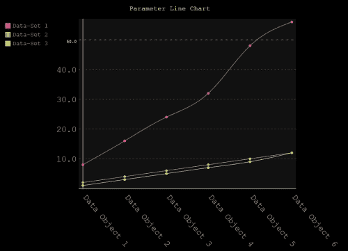

# 五、调整 pygal

在本章中，我们将介绍如何应用主题和使用`pygal`库中使用的一些可选功能。我们还将研究图表的主题和样式。

# 国家图表

`pygal`库有一个图表，我们在过去的章节中没有复习过；这是提出话题和讨论图表的好时机。它叫做**国家地图**。像世界地图图表一样，它显示了一个国家更深层次的详细区域；不幸的是，在写这本书的时候，它只限于法国这个国家，它的工作原理与世界地图非常相似。

如果你还记得我们的介绍章节，你可能还记得我们关于 Kozea 的讨论，Kozea 是起源于法国的开源社区，它开发了`pygal`图书馆。由于他们来自法国，他们为自己的国家创建了一张地图，包括被称为省和地区的分区。法国的地区类似于州，部门类似于一个州的县。

让我们看一下这张地图的一些示例代码，然后我们可以使用 pygal 框架的一些额外特性来构建它。首先，让我们构建一个使用部门的简单示例。创建一个新的 Python 文件，并将以下代码复制到您选择的编辑器中。请注意这和我们的世界地图代码在[第 4 章](4.html "Chapter 4. Advanced Charts")*高级图表*中的相似之处。请务必使用`france_map.svg`作为文件输出:

```py
# -*- coding: utf-8 -*-
import pygal

france_chart = pygal.FrenchMap_Departments()
france_chart.title = 'Sample departments'
france_chart.add('Data-set 1', ['17'])
france_chart.add('Data-set 2', ['27'])
france_chart.add('Data-set 3', ['38'])
france_chart.add('Data-set 4', ['42'])
france_chart.add('Data-set 5', ['19'])
france_chart.render_to_file('france_map.svg')
```

打开`france_map.svg`文件，结果会是如下截图所示:


让我们来看看我们的`france_chart`型。请注意，我们在图表类型中使用了以`Departments`为后缀的`pygal.FrenchMap_Departments()`。在这个图表中，有两种模式——一种用于部门，另一种用于地区。使用以下代码查看如何创建基于区域的图表。这次注意后缀:

```py
# -*- coding: utf-8 -*-
import pygal

france_chart = pygal.FrenchMap_Regions()
france_chart.title = 'Sample Regions'
france_chart.add('Centre', ['24'])
france_chart.add('Lorraine', ['41'])
france_chart.add('Picardy', ['22'])
france_chart.add('Upper Normandy', ['23'])
france_chart.add('Corsica', ['94'])
france_chart.render_to_file('france_map.svg')
```

打开`france_map.svg`文件，结果会是如下截图所示:


仔细观察代码，我们可能会想为什么我们没有使用地区缩写，或者问如何设置我们的活动地区或部门。数字的原因是法国使用自己的 INSEE 数字。

**国家统计和经济研究所** ( **INSEE** )是法国的国家统计和经济研究所，为其部门和地区创建了编号系统。由于这是识别法国部分的通用系统，`pygal`库开发人员使用相同的数字为地图图表分配高光。现在我们知道如何使用这个图表了，这次让我们修改它，不是用数据，而是用`pygal`库中包含的参数、方法和主题。

# 参数

我们已经在整本书中看到了与 pygal 相关的章节中使用的参数。在这里，我们将从基于地区的法国图表开始，但首先让我们继续并填写图表上的其余地区。将以下代码复制到您选择的编辑器中，并呈现图表:

```py
# -*- coding: utf-8 -*-
import pygal

france_chart = pygal.FrenchMap_Regions()
france_chart.title = 'Sample Regions'
france_chart.add('Alsace', ['42'])
france_chart.add('Aquitaine', ['72'])
france_chart.add('Auvergne', ['83'])
france_chart.add('Brittany', ['53'])
france_chart.add('Burgundy', ['26'])
france_chart.add('Centre', ['24'])
france_chart.add('Champagne-Ardenne', ['21'])
france_chart.add(unicode('Franche-Comté', 'utf-8'), ['43'])
france_chart.add(unicode('Île-de-France', 'utf-8'), ['11'])
france_chart.add('Languedoc-Roussillon', ['91'])
france_chart.add('Limousin', ['74'])
france_chart.add('Lorraine', ['41'])
france_chart.add('Lower Normandy', ['25'])
france_chart.add(unicode('Midi-Pyrénées', 'utf-8'), ['73'])
france_chart.add('Nord-Pas-de-Calais', ['31'])
france_chart.add('Pays de la Loire', ['52'])
france_chart.add('Picardy', ['22'])
france_chart.add('Poitou-Charentes', ['54'])
france_chart.add(unicode('Provence-Alpes-Côte d\'Azur', 'utf-8'), ['93'])
france_chart.add(unicode('Rhône-Alpes', 'utf-8'), ['83'])
france_chart.add('Upper Normandy', ['23'])
france_chart.add('Corsica', ['94'])
france_chart.add('French Guiana', ['03'])
france_chart.add('Guadeloupe', ['01'])
france_chart.add('Mayotte', ['05'])
france_chart.add('Reunion', ['04'])
france_chart.render_to_file('france_map.svg')
```

当完成后，你应该会看到如下截图所示:


在之前的截图中，我们可以看到我们传说中相当多的区域。请注意它们在我们的图表中占据了多少空间。让我们修改一些格式化参数来清理它。

## 底部的传说

我们可以使用`legend_at_bottom`参数重新定位图表的图例，并输入一个值作为`True`或`False`。这里有一个例子和输出屏幕。注意`FrenchMap_Regions()`方法中的`legend_at_bottom`参数:

```py
# -*- coding: utf-8 -*-
import pygal

france_chart = pygal.FrenchMap_Regions(legend_at_bottom=True)
france_chart.title = 'Sample Regions'
france_chart.add('Alsace', ['42'])
france_chart.add('Aquitaine', ['72'])
france_chart.add('Auvergne', ['83'])
france_chart.add('Brittany', ['53'])
france_chart.add('Burgundy', ['26'])
france_chart.add('Centre', ['24'])
france_chart.add('Champagne-Ardenne', ['21'])
france_chart.add(unicode('Franche-Comté', 'utf-8'), ['43'])
france_chart.add(unicode('Île-de-France', 'utf-8'), ['11'])
france_chart.add('Languedoc-Roussillon', ['91'])
france_chart.add('Limousin', ['74'])
france_chart.add('Lorraine', ['41'])
france_chart.add('Lower Normandy', ['25'])
france_chart.add(unicode('Midi-Pyrénées', 'utf-8'), ['73'])
france_chart.add('Nord-Pas-de-Calais', ['31'])
france_chart.add('Pays de la Loire', ['52'])
france_chart.add('Picardy', ['22'])
france_chart.add('Poitou-Charentes', ['54'])
france_chart.add(unicode('Provence-Alpes-Côte d\'Azur', 'utf-8'), ['93'])
france_chart.add(unicode('Rhône-Alpes', 'utf-8'), ['83'])
france_chart.add('Upper Normandy', ['23'])
france_chart.add('Corsica', ['94'])
france_chart.add('French Guiana', ['03'])
france_chart.add('Guadeloupe', ['01'])
france_chart.add('Mayotte', ['05'])
france_chart.add('Reunion', ['04'])
france_chart.render_to_file('france_map.svg')
```

下面的截图显示了我们脚本的结果:


## 图例设置

我们还可以使用允许整数值的`legend_box_size`参数来和格式化图例框；这将改变每个图例项的彩色框尺寸。这里有一个例子:

```py
# -*- coding: utf-8 -*-
import pygal

france_chart = pygal.FrenchMap_Regions(legend_at_bottom=True, legend_box_size=3)
france_chart.title = 'Sample Regions'
france_chart.add('Alsace', ['42'])
france_chart.add('Aquitaine', ['72'])
france_chart.add('Auvergne', ['83'])
france_chart.add('Brittany', ['53'])
france_chart.add('Burgundy', ['26'])
france_chart.add('Centre', ['24'])
france_chart.add('Champagne-Ardenne', ['21'])
france_chart.add(unicode('Franche-Comté', 'utf-8'), ['43'])
france_chart.add(unicode('Île-de-France', 'utf-8'), ['11'])
france_chart.add('Languedoc-Roussillon', ['91'])
france_chart.add('Limousin', ['74'])
france_chart.add('Lorraine', ['41'])
france_chart.add('Lower Normandy', ['25'])
france_chart.add(unicode('Midi-Pyrénées', 'utf-8'), ['73'])
france_chart.add('Nord-Pas-de-Calais', ['31'])
france_chart.add('Pays de la Loire', ['52'])
france_chart.add('Picardy', ['22'])
france_chart.add('Poitou-Charentes', ['54'])
france_chart.add(unicode('Provence-Alpes-Côte d\'Azur', 'utf-8'), ['93'])
france_chart.add(unicode('Rhône-Alpes', 'utf-8'), ['83'])
france_chart.add('Upper Normandy', ['23'])
france_chart.add('Corsica', ['94'])
france_chart.add('French Guiana', ['03'])
france_chart.add('Guadeloupe', ['01'])
france_chart.add('Mayotte', ['05'])
france_chart.add('Reunion', ['04'])
france_chart.render_to_file('france_map.svg')
```

下面的截图显示了我们脚本的结果:


查看了解我们如何使用`legend_at_bottom`和`legend_box_size`参数。我们可以在参数之间使用逗号来堆叠它们，并允许多种组合。我们仍然有过多的标签渗进下一列的图例中；让我们继续用这些其他属性来调整它们。

在接下来的几个代码示例中，我将删除数据集，以便我们能够专注于理解参数。如果您需要重新注册，请参考我们在*参数*部分的初始图表。现在，让我们缩小标签的字体大小，并使用`legend_font_size`参数调整框的大小:

```py
# -*- coding: utf-8 -*-
import pygal

france_chart = pygal.FrenchMap_Regions(legend_at_bottom=True, legend_box_size=8, legend_font_size=8)
# ///Data-sets (continued)
```

以下屏幕截图显示了脚本的结果:


很好！现在有一个传说项目还是有点小；让我们使用`truncate_legend`参数将和一起修剪以保持一致性，如下代码所示:

```py
# -*- coding: utf-8 -*-
import pygal

france_chart = pygal.FrenchMap_Regions(legend_at_bottom=True, legend_box_size=8, legend_font_size=8, truncate_legend=6)
```

下面的截图显示了我们脚本的结果:


干得好！这是现在看起来更和更有条理。我们甚至可以通过移除或将其设置为`False`来禁用`legend_at_bottom`参数。它看起来像下面截图中显示的内容:


关于传说还有一点要注意的是，如果你不需要它们，你可以禁用它们。请记住，图表图例有助于图表用户使用数据。由于我们没有 *x* 和 *y* 轴标签，我们应该可以禁用图例。为此，您只需将`show_legend`参数设置为`False`，如下代码所示:

```py
# -*- coding: utf-8 -*-
import pygal

france_chart = pygal.FrenchMap_Regions(show_legend=False, legend_box_size=8, legend_font_size=8, truncate_legend=6)
```

下面的截图显示了我们的脚本的结果，没有图例:


太棒了！现在，我们已经修改了图例，以允许为我们的图表提供更大的灵活性。

# 标签设置

让我们看看一个传统的折线图，我们可以在其中使用标签。这是一个简单的图表，包含一些虚拟数据集。将代码复制到您选择的编辑器中并运行脚本。您的输出应该是下一个截图中显示的内容。

您也可以使用与图例类似的参数来设置标签设置。让我们建立一个简单的折线图，我们可以看到我们的变化。将以下代码添加到您选择的编辑器中并运行脚本。务必将输出保存为`lineparam.svg`:

```py
# -*- coding: utf-8 -*-
import pygal

param_line_chart = pygal.Line()
param_line_chart.title = 'Parameter Line Chart'
param_line_chart.x_labels = map(str, ["Data Object 1", "Data Object 2", "Data Object 3", "Data Object 4", "Data Object 5", "Data Object 6"])
param_line_chart.add('Data-Set 1', [8, 16, 24, 32, 48, 56])
param_line_chart.add('Data-Set 2', [2, 4, 6, 8, 10, 12])
param_line_chart.add('Data-Set 3', [1, 3, 5, 7, 9, 12])

param_line_chart.render_to_file('lineparam.svg')
```

下面的截图显示了我们脚本的结果:


折线图有一些具体的参数，比如[第三章](3.html "Chapter 3. Getting Started with pygal")、*pygal*入门中提到的`fill=true`。您也可以使用`label_font_size`参数调整指定标签的大小，如以下代码所示:

```py
# -*- coding: utf-8 -*-
import pygal

param_line_chart = pygal.Line(fill=True, label_font_size=20)
param_line_chart.title = 'Parameter Line Chart'
param_line_chart.x_labels = map(str, ["Data Object 1", "Data Object 2", "Data Object 3", "Data Object 4", "Data Object 5", "Data Object 6"])
param_line_chart.add('Data-Set 1', [8, 16, 24, 32, 48, 56])
param_line_chart.add('Data-Set 2', [2, 4, 6, 8, 10, 12])
param_line_chart.add('Data-Set 3', [1, 3, 5, 7, 9, 12])

param_line_chart.render_to_file('lineparam.svg')
```

下面的截图显示了我们脚本的结果:


我们可以使用`x_label_rotation`参数旋转标签，并使用`stroke=false`参数一起移除线条，如下代码所示:

```py
# -*- coding: utf-8 -*-
import pygal

param_line_chart = pygal.Line(fill=False, stroke=False, label_font_size=20, x_label_rotation=50)
param_line_chart.title = 'Parameter Line Chart'
param_line_chart.x_labels = map(str, ["Data Object 1", "Data Object 2", "Data Object 3", "Data Object 4", "Data Object 5", "Data Object 6"])
param_line_chart.add('Data-Set 1', [8, 16, 24, 32, 48, 56])
param_line_chart.add('Data-Set 2', [2, 4, 6, 8, 10, 12])
param_line_chart.add('Data-Set 3', [1, 3, 5, 7, 9, 12])

param_line_chart.render_to_file('lineparam.svg')
```

下面的截图显示了我们脚本的结果:


折线图有一个特定的参数`interpolate='cubic'`，它允许线条在数据中弯曲。这里有一个例子:

```py
# -*- coding: utf-8 -*-
import pygal

param_line_chart = pygal.Line(interpolate='cubic', label_font_size=20, x_label_rotation=50)
param_line_chart.title = 'Parameter Line Chart'
param_line_chart.x_labels = map(str, ["Data Object 1", "Data Object 2", "Data Object 3", "Data Object 4", "Data Object 5", "Data Object 6"])
param_line_chart.add('Data-Set 1', [8, 16, 24, 32, 48, 56])
param_line_chart.add('Data-Set 2', [2, 4, 6, 8, 10, 12])
param_line_chart.add('Data-Set 3', [1, 3, 5, 7, 9, 12])

param_line_chart.render_to_file('lineparam.svg')
```

下面的截图显示了我们脚本的结果:



# 图表标题设置

我们对过去两章的图表标题相当熟悉，但是很高兴知道我们也可以给 *x* 和 *y* 轴命名。看看下面的代码:

```py
# -*- coding: utf-8 -*-
import pygal

param_line_chart = pygal.Line(interpolate='cubic', label_font_size=20, x_label_rotation=50)
param_line_chart.title = 'Parameter Line Chart'
param_line_chart.x_title='Data-Sets (X Axis)'
param_line_chart.y_title='Values (Y Axis)'

param_line_chart.x_labels = map(str, ["Data Object 1", "Data Object 2", "Data Object 3", "Data Object 4", "Data Object 5", "Data Object 6"])

param_line_chart.add('Data-Set 1', [8, 16, 24, 32, 48, 56])
param_line_chart.add('Data-Set 2', [2, 4, 6, 8, 10, 12])
param_line_chart.add('Data-Set 3', [1, 3, 5, 7, 9, 12])

param_line_chart.render_to_file('lineparam.svg')
```

下面的截图显示了我们脚本的结果:


我们可以使用`title_font_size`、`x_title_font_size`和`y_title_font_size`参数来调整 x、y 和图表标题的字体大小，如下代码所示:

```py
# -*- coding: utf-8 -*-
import pygal

param_line_chart = pygal.Line(interpolate='cubic', label_font_size=20, x_label_rotation=50, title_font_size=24, x_title_font_size=24, y_title_font_size=24)
param_line_chart.title = 'Parameter Line Chart'
param_line_chart.x_title='Data-Sets (X Axis)'
param_line_chart.y_title='Values (Y Axis)'

param_line_chart.x_labels = map(str, ["Data Object 1", "Data Object 2", "Data Object 3", "Data Object 4", "Data Object 5", "Data Object 6"])

param_line_chart.add('Data-Set 1', [8, 16, 24, 32, 48, 56])
param_line_chart.add('Data-Set 2', [2, 4, 6, 8, 10, 12])
param_line_chart.add('Data-Set 3', [1, 3, 5, 7, 9, 12])

param_line_chart.render_to_file('lineparam.svg')
```

下面的截图显示了我们脚本的结果:


# 不显示数据

一个值得关注的参数是`no_data_text`参数，它允许我们为图表设置一个文本覆盖，以防我们在没有加载数据的情况下创建图表。如果我们正在构建一个动态图表，通过文件或命令行参数从数据源(在线或本地)提取数据，这将非常有用。下面是`no_data_text`参数的一个例子:

```py
# -*- coding: utf-8 -*-
import pygal

param_line_chart = pygal.Line(no_data_text='Unable to load data')
param_line_chart.title = 'Parameter Line Chart'
param_line_chart.x_title='Data-Sets (X Axis)'
param_line_chart.y_title='Values (Y Axis)'

param_line_chart.x_labels = map(str, ["Data Object 1", "Data Object 2", "Data Object 3", "Data Object 4", "Data Object 5", "Data Object 6"])

#param_line_chart.add('Data-Set 1', [8, 16, 24, 32, 48, 56])
#param_line_chart.add('Data-Set 2', [2, 4, 6, 8, 10, 12])
#param_line_chart.add('Data-Set 3', [1, 3, 5, 7, 9, 12])

param_line_chart.render_to_file('lineparam.svg')
```

下面的截图显示了我们脚本的结果:


# 皮格尔主题

到目前为止，我们已经为 pygal 图表使用了默认主题，简称为**默认**。然而，pygal 提供了 14 个预先构建的主题。让我们用另一个名为**霓虹**的主题来更新我们的折线图代码:

```py
# -*- coding: utf-8 -*-
import pygal
from pygal.style import NeonStyle

param_line_chart = pygal.Line(interpolate='cubic', fill=True, style=NeonStyle)
param_line_chart.title = 'Parameter Line Chart'
param_line_chart.x_title='Data-Sets (X Axis)'
param_line_chart.y_title='Values (Y Axis)'

param_line_chart.x_labels = map(str, ["Data Object 1", "Data Object 2", "Data Object 3", "Data Object 4", "Data Object 5", "Data Object 6"])

param_line_chart.add('Data-Set 1', [8, 16, 24, 32, 48, 56])
param_line_chart.add('Data-Set 2', [2, 4, 6, 8, 10, 12])
param_line_chart.add('Data-Set 3', [1, 3, 5, 7, 9, 12])

param_line_chart.render_to_file('lineparam.svg')
```

下面的截图显示了我们脚本的结果:


如我们所见，霓虹风格类似于默认风格；但是，与我们早期使用默认样式的`fill`参数相比，Neon 样式的`fill`参数应用了轻微的透明度。同样，如果我们检查我们的代码，我们会看到样式只是一个应用于图表实例的参数，在所选样式的名称后面有一个后缀*样式*；有关 pygal 主题的完整列表，请查看位于[http://pygal.org/builtin_styles/](http://pygal.org/builtin_styles/)的主题框架文档。

另外，看一下前面代码中`import pygal`下面的行，它是从`pygal.style import NeonStyle`行读取的。默认情况下，内置样式不包含在我们的`import pygal`语句中，所以我们需要添加它们，在这种情况下，我们指定要导入`NeonStyle`主题。让我们使用**红蓝**主题尝试一种更轻的风格，并覆盖我们的`NeonStyle`，在我们的`import`和`style`参数中，如下代码所示:

```py
# -*- coding: utf-8 -*-
import pygal
from pygal.style import RedBlueStyle

param_line_chart = pygal.Line(interpolate='cubic', fill=True, style=RedBlueStyle)
param_line_chart.title = 'Parameter Line Chart'
param_line_chart.x_title='Data-Sets (X Axis)'
param_line_chart.y_title='Values (Y Axis)'

param_line_chart.x_labels = map(str, ["Data Object 1", "Data Object 2", "Data Object 3", "Data Object 4", "Data Object 5", "Data Object 6"])

param_line_chart.add('Data-Set 1', [8, 16, 24, 32, 48, 56])
param_line_chart.add('Data-Set 2', [2, 4, 6, 8, 10, 12])
param_line_chart.add('Data-Set 3', [1, 3, 5, 7, 9, 12])

param_line_chart.render_to_file('lineparam.svg')
```

以下截图显示了我们脚本的结果:


看起来不错！如果你想找到一个特定的主题，请参考 pygal 的网站，获取关于 http://pygal.org/styles/ T2 主题的完整文档。您也可以在[http://cabaret.pygal.org/](http://cabaret.pygal.org/)使用 pygal 的风格工具在线测试主题。

# 总结

在这一章中，我们已经介绍了很多关于 pygal 的内容，我们应该能够很好地处理 pygal 构建图表，并根据我们的需要对它们进行修改。在下一章中，我们将从图表中休息一下，开始处理构建动态图表的数据方面。