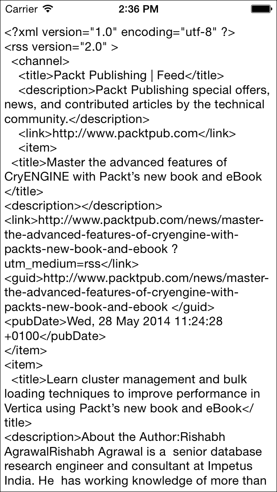
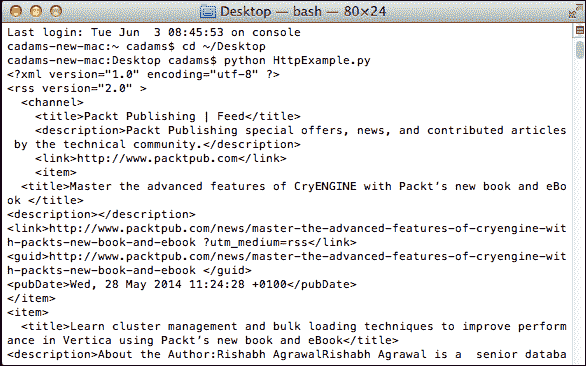
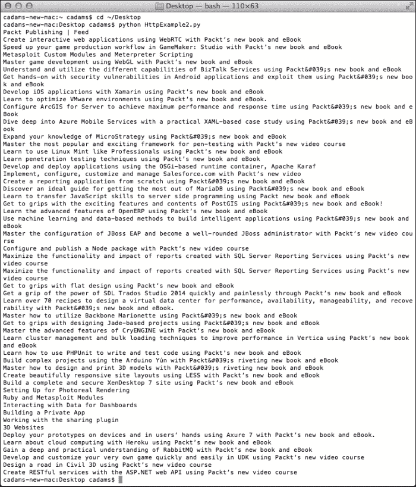
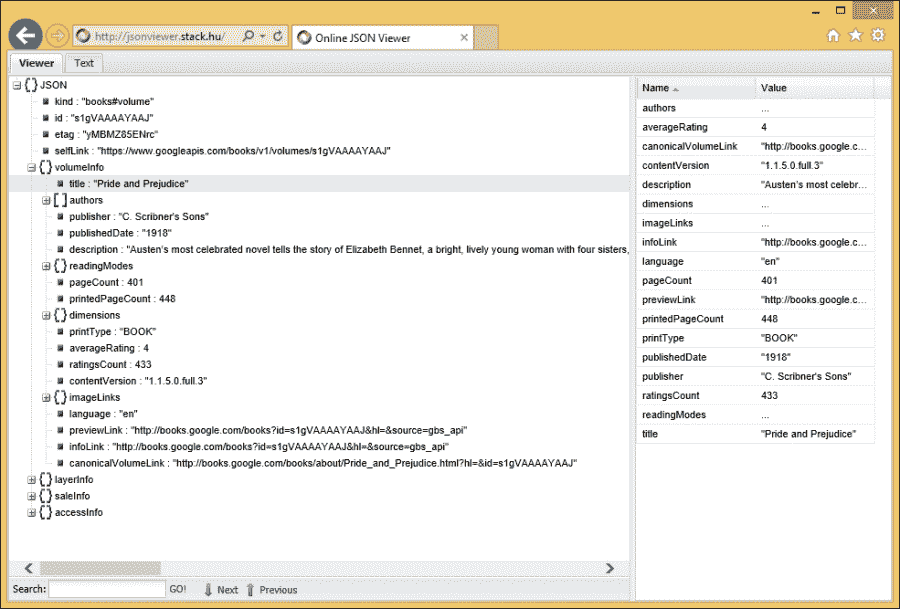
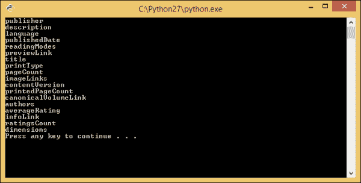
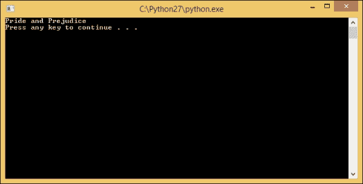

# 六、导入动态数据

既然我们现在已经了解了如何使用`pygal`库以及构建图表和图形，现在是开始考虑使用 Python 构建应用的时候了。

在本章中，我们将了解从网络中提取数据、解析数据、将其添加到我们的代码库中并将数据格式化为可用格式的基础知识，我们还将了解如何将这些基础知识应用到我们的 Python 代码中。我们还将讨论解析 XML 和 JSON 数据。

# 从网络上获取数据

对于许多非开发人员来说，开发人员能够神奇地从在线资源中提取数据，并将其与 iPhone 应用或 Windows Store 应用集成，或者将数据提取到能够根据请求生成各种版本数据的云资源中，这似乎是一种巫术。

平心而论，他们确实有一个大致的了解；数据从网络中提取，并格式化到他们选择的应用中。他们可能无法完全了解流程工作流是如何发生的。一些开发人员的情况也是如此——许多开发人员主要从事一种技术，这种技术只能在锁定的环境中工作，或者一般情况下，他们的应用不使用互联网。再次，他们理解背后的逻辑；不知何故，一个 RSS 源被拉进了一个应用。

在许多语言中，相同的任务以不同的方式完成，通常取决于使用哪种语言。让我们看几个例子，使用 Packt 自己的新闻 RSS 提要，使用 iOS 应用通过 Objective-C 拉入数据。

现在，如果您正在阅读这篇文章，并且不熟悉 Objective-C，没关系，重要的是我们在 iPhone 应用中显示了一个 XML 文件的内部 XML 内容:

```py
#import "ViewController.h"

@interfaceViewController ()
@property (weak, nonatomic) IBOutletUITextView *output;

@end

@implementationViewController

- (void)viewDidLoad
{
    [super viewDidLoad];
	// Do any additional setup after loading the view, typically from a nib.

    NSURL *packtURL = [NSURLURLWithString:@"http://www.packtpub.com/rss.xml"];
    NSURLRequest *request = [NSURLRequestrequestWithURL:packtURL];
    NSURLConnection *connection = [[NSURLConnectionalloc] initWithRequest:requestdelegate:selfstartImmediately:YES];

    [connection start];
}

- (void)connection:(NSURLConnection *)connection didReceiveData:(NSData *)data {
    NSString *downloadstring = [[NSStringalloc] initWithData:dataencoding:NSUTF8StringEncoding];

    [self.outputsetText:downloadstring];

}

- (void)didReceiveMemoryWarning
{
    [superdidReceiveMemoryWarning];
    // Dispose of any resources that can be recreated.
}

@end
```

在这里，我们可以在 iPhone 模拟器中看到，我们的 XML 输出是通过 HTTP 从 Web 动态拉到我们的 iPhone 模拟器的。这就是我们想用 Python 开始做的事情:



# XML 复习

**可扩展标记语言** ( **XML** )是一种数据标记语言，它为数据组设置一系列规则和层次结构，数据组存储为静态文件。通常，服务器会定期更新网络上的这些 XML 文件，以便重新用作数据源。XML 非常容易理解，因为它类似于 HTML。在这种情况下，您可以从文档声明开始:

```py
<?xml version="1.0" encoding="utf-8"?>
```

接下来，设置一个根节点。节点就像一个 HTML 标记(也称为节点)。通过节点名称周围的括号，可以看出它是一个节点。例如，这里有一个名为`root`的节点:

```py
<root></root>
```

请注意，我们通过用反斜杠创建同名节点来关闭节点。我们还可以给节点添加参数并赋值，如下图`root`节点所示:

```py
<root parameter="value"></root>
```

XML 中的数据是通过层次结构设置的。为了声明这个层次结构，我们创建了另一个节点，并将它放在父节点中，如下面的代码所示:

```py
<root parameter="value">
     <subnode>Subnode's value</subnode>
</root>
```

在前面的父节点中，我们创建了一个`subnode`。在`subnode`里面，我们有一个内在的价值叫做`Subnode's value`。现在，用编程术语来说，从 XML 数据文件中获取数据是一个叫做解析的过程。通过解析，我们可以指定在 XML 结构中的什么位置获取特定的值；例如，我们可以抓取 XML 结构并获取内部内容，如下所示:

```py
/root/subnode
```

这通常被称为 **XPath** 语法，一种跨语言的浏览 XML 文件的方式。有关 XML 和 XPath 的更多信息，请分别查看:[http://www.w3.org/TR/REC-xml/](http://www.w3.org/TR/REC-xml/)和此处[http://www.w3.org/TR/xpath/](http://www.w3.org/TR/xpath/)的完整规范。

# RSS 和 ATOM

**真正简单的联合** ( **RSS** )只是 XML 的一个变种。RSS 是一个规范，它定义了发送数据常用的特定节点。通常，许多博客订阅源都包含一个 RSS 选项，供用户从这些网站上获取最新信息。RSS 中使用的一些节点包括`rss`、`channel`、`item`、`title`、`description`、`pubDate`、`link`和`GUID`。

从*从网络*获取数据部分查看本章中我们的 iPhone 示例，我们可以看到典型的 RSS 结构需要什么。RSS 提要通常很容易被发现，因为规范要求根节点被命名为`rss`才能成为真正的 RSS 文件。

在某些情况下，一些网站和服务会使用`.rss`而不是`.xml`；这通常很好，因为大多数 RSS 内容的读者会像 XML 文件一样拉入 RSS 数据，就像在 iPhone 示例中一样。

另一种形式的 XML 叫做原子。ATOM 是另一个类似于 RSS 的规范，但是比 RSS 发展得晚得多。正因为如此，ATOM 比 RSS 有更多的特性:XML 命名空间、指定的内容格式(视频或音频特定的 URL)、对国际化的支持以及多语言支持，仅举几个例子。

与 RSS 相比，ATOM 确实有一些不同的节点；例如，RSS 源的根节点将是`<rss>`。ATOM 的词根以`<feed>`开头，所以很容易看出区别。另一个区别是 ATOM 也可以以`.atom`或`.xml`结尾。

有关 RSS 和 ATOM 规范的更多信息，请查看以下网站:

*   [http://www.rssboard.org/rss-specification](http://www.rssboard.org/rss-specification)
*   [http://tools.ietf.org/html/rfc4287](http://tools.ietf.org/html/rfc4287)

# 理解 HTTP

所有这些来自 Packt Publishing 网站的 RSS 提要的样本都显示了一个使用的共性，不管编码在其中的技术如何，那就是用于下拉这些静态文件的方法是通过**超文本传输协议** ( **HTTP** )。HTTP 是互联网交流的基础。这是一个包含两种不同类型请求的协议:数据请求或`GET`和数据推送，称为`POST`。

通常，当我们使用 HTTP 下载数据时，我们使用 HTTP 的`GET`方法来下拉数据。如果我们提到一个特定的类型，`GET`请求将返回一个字符串或另一个数据类型。我们可以直接使用这个值，也可以保存到一个变量中。

通过`POST`请求，我们将值发送给处理任何传入值的服务；假设我们创建了一个新的博客文章的标题，并需要添加到当前标题的列表中，一种常见的方法是使用 URL 参数。网址参数是一个现有的网址，但带有后缀键值对。

以下是带有网址参数的`POST`请求的模拟示例:

`http://www.yourwebsite.com/blogtitles/?addtitle=Your%20New%20Title`

如果我们的服务设置正确，将扫描`POST`对`addtitle`键的请求并读取值，在本例中为:`Your New Title`。对于我们的请求，我们可能会在标题中注意到`%20`。这是一个转义字符，允许我们发送一个带有空格的值；在这种情况下，`%20`在我们的价值观中是一个空间的定位。

对于本书的其余部分，我们将坚持`GET`请求，因为我们将只从网络上读取数据；但是，这将为您提供开始处理请求的概述。

## 在 Python 中使用 HTTP

来自 packkt Publishing 网站的 RSS 样本显示了我们在 HTTP 中工作时在编程中使用的一些共性；一个是我们总是考虑连接可能出现问题的可能性，并且我们总是在完成后关闭我们的请求。下面是一个例子，说明如何使用名为`urllib2`的内置库在 Python 中完成相同的 RSS 提要请求:

```py
#!/usr/bin/env python
# -*- coding: utf-8 -*-

import urllib2

try:
    #Open the file via HTTP.
    response = urllib2.urlopen('http://www.packtpub.com/rss.xml')
    #Read the file to a variable we named 'xml'
    xml = response.read()
    #print to the console.
    print(xml)
    #Finally, close our open network.
    response.close()
except:
    #If we have an issue show a message and alert the user.
    print('Unable to connect to RSS...')
```

如果我们查看下面的控制台输出，我们可以看到 XML 内容，就像我们在 iOS 代码示例中看到的一样:



在这个例子中，注意到我们把我们的 HTTP 请求包装在一个`try` `except`块周围。对于来自另一种语言的人来说，`except`可以被认为是与`catch`相同的语句。这使我们能够检测是否发生了错误，这可能是不正确的网址或缺乏连接，例如，以编程方式为我们的 Python 脚本设置一个替代结果。

# 用 HTTP 解析 Python 中的 XML

有了这些例子包括我们的 Python 版本的脚本，它仍然返回某种类型的字符串，这本身对于从完整字符串中获取值没有多大用处。为了从通过 HTTP 提取的 XML 中获取特定的字符串和值，我们需要解析它。幸运的是，Python 主库中为此有一个内置对象，称为`ElementTree`，它是 Python 中 XML 库的一部分。

让我们将`ElementTree`结合到我们的示例中，看看它是如何工作的:

```py
# -*- coding: utf-8 -*-

import urllib2
from xml.etree import ElementTree

try:
    #Open the file via HTTP.
    response = urllib2.urlopen('http://www.packtpub.com/rss.xml')

    tree = ElementTree.parse(response)
    root = tree.getroot()

    #Create an 'Element' group from our XPATH using findall.
    news_post_title = root.findall("channel//title")

    #Iterate in all our searched elements and print the inner text for each.
    for title in news_post_title:
        print title.text

    #Finally, close our open network.
    response.close()
except Exception as e:
    #If we have an issue show a message and alert the user.
    print(e)
```

下面的截图显示了我们脚本的结果:



正如我们看到的，我们的输出显示了每个博客文章的每个标题。注意我们如何使用`channel//item`进行我们的`findall()`方法。这个使用的是 XPath，它允许我们以速记的方式书写如何迭代一个 XML 结构。它是这样工作的；让我们以[http://www.packtpub.com](http://www.packtpub.com)饲料为例。我们有一个根，然后是通道，然后是一系列标题元素。

`findall()`方法找到每个元素，并将它们保存为 Python 中使用的特定于 XML 库`ElementTree`的`Element`类型，并将每个元素保存到一个数组中。然后我们可以使用`for in`循环迭代每一个，并使用文本`property`将内部文本打印到`Element`类型。

### 注

你可能注意到在最近的例子中，我用一点额外的代码改变了`except`并增加了`Exception as e`。这允许我们帮助调试问题，并将它们打印到控制台，或者向用户显示更深入的反馈。一个`Exception`允许 Python 库内置的警告和错误通过控制台打印出来或者用代码处理。它们也有我们可以使用的更具体的异常，例如`IOException`，它是专门用于文件读写的。

# 关于 JSON

现在，另一种在处理 web 数据时变得越来越常见的数据类型是 **JSON** 。JSON 是 JavaScript 对象符号的缩写，顾名思义，确实是真正的 JavaScript。近年来，随着移动应用的兴起和 **丰富的互联网应用** ( **RIA** )的出现，它变得流行起来。

JSON 对于 JavaScript 开发人员来说非常棒；与 XML 相比，在 HTML 内容中工作更容易。正因为如此，JSON 正在成为网络和移动应用开发中更常见的数据类型。

# 用 HTTP 解析 Python 中的 JSON

用 Python 解析 JSON 数据是一个非常相似的过程；然而，在这个的例子中，我们的`ElementTree`库是不需要的，因为只对 XML 起作用。我们需要一个库，用来使用 Python 解析 JSON。幸运的是，Python 库的创建者已经为我们准备了一个库，简称`json`。

让我们使用`json`导入构建一个类似于我们的 XML 代码的例子；当然，我们需要使用不同的数据源，因为我们不会使用 XML。我们可能注意到的一件事是，可以使用的公共 JSON 提要并不多，其中许多提要需要使用代码，该代码允许开发人员通过开发人员应用编程接口(如推特的 JSON 应用编程接口)生成 JSON 提要。为了避免这种情况，我们将使用谷歌图书应用编程接口的样本网址，该网址将显示《傲慢与偏见》的演示数据《T2》、《简·奥斯汀》的演示数据《T4》。我们可以通过输入以下网址来查看 JSON (或下载文件):

[https://www.googleapis.com/books/v1/volumes/s1gVAAAAYAAJ](https://www.googleapis.com/books/v1/volumes/s1gVAAAAYAAJ)

### 注

请注意，该应用编程接口使用 HTTPS，许多 JSON 应用编程接口正在转向传输数据的安全方法，所以一定要将安全包含在 HTTP 中，与 HTTPS 一起。

让我们来看看 JSON 的输出:

```py
{
 "kind": "books#volume",
 "id": "s1gVAAAAYAAJ",
 "etag": "yMBMZ85ENrc",
 "selfLink": "https://www.googleapis.com/books/v1/volumes/s1gVAAAAYAAJ",
 "volumeInfo": {
  "title": "Pride and Prejudice",
  "authors": [
   "Jane Austen"
  ],
  "publisher": "C. Scribner's Sons",
  "publishedDate": "1918",
  "description": "Austen's most celebrated novel tells the story of Elizabeth Bennet, a bright, lively young woman with four sisters, and a mother determined to marry them to wealthy men. At a party near the Bennets' home in the English countryside, Elizabeth meets the wealthy, proud Fitzwilliam Darcy. Elizabeth initially finds Darcy haughty and intolerable, but circumstances continue to unite the pair. Mr. Darcy finds himself captivated by Elizabeth's wit and candor, while her reservations about his character slowly vanish. The story is as much a social critique as it is a love story, and the prose crackles with Austen's wry wit.",
  "readingModes": {
   "text": true,
   "image": true
  },
  "pageCount": 401,
  "printedPageCount": 448,
  "dimensions": {
   "height": "18.00 cm"
  },
  "printType": "BOOK",
  "averageRating": 4.0,
  "ratingsCount": 433,
  "contentVersion": "1.1.5.0.full.3",
  "imageLinks": {
   "smallThumbnail": "http://bks8.books.google.com/books?id=s1gVAAAAYAAJ&printsec=frontcover&img=1&zoom=5&edge=curl&imgtk=AFLRE73F8btNqKpVjGX6q7V3XS77QA2PftQUxcEbU3T3njKNxezDql_KgVkofGxCPD3zG1yq39u0XI8s4wjrqFahrWQ-5Epbwfzfkoahl12bMQih5szbaOw&source=gbs_api",
   "thumbnail": "http://bks8.books.google.com/books?id=s1gVAAAAYAAJ&printsec=frontcover&img=1&zoom=1&edge=curl&imgtk=AFLRE70tVS8zpcFltWh_7K_5Nh8BYugm2RgBSLg4vr9tKRaZAYoAs64RK9aqfLRECSJq7ATs_j38JRI3D4P48-2g_k4-EY8CRNVReZguZFMk1zaXlzhMNCw&source=gbs_api",
   "small": "http://bks8.books.google.com/books?id=s1gVAAAAYAAJ&printsec=frontcover&img=1&zoom=2&edge=curl&imgtk=AFLRE71qcidjIs37x0jN2dGPstn6u2pgeXGWZpS1ajrGgkGCbed356114HPD5DNxcR5XfJtvU5DKy5odwGgkrwYl9gC9fo3y-GM74ZIR2Dc-BqxoDuUANHg&source=gbs_api",
   "medium": "http://bks8.books.google.com/books?id=s1gVAAAAYAAJ&printsec=frontcover&img=1&zoom=3&edge=curl&imgtk=AFLRE73hIRCiGRbfTb0uNIIXKW4vjrqAnDBSks_ne7_wHx3STluyMa0fsPVptBRW4yNxNKOJWjA4Od5GIbEKytZAR3Nmw_XTmaqjA9CazeaRofqFskVjZP0&source=gbs_api",
   "large": "http://bks8.books.google.com/books?id=s1gVAAAAYAAJ&printsec=frontcover&img=1&zoom=4&edge=curl&imgtk=AFLRE73mlnrDv-rFsL-n2AEKcOODZmtHDHH0QN56oG5wZsy9XdUgXNnJ_SmZ0sHGOxUv4sWK6GnMRjQm2eEwnxIV4dcF9eBhghMcsx-S2DdZoqgopJHk6Ts&source=gbs_api",
   "extraLarge": "http://bks8.books.google.com/books?id=s1gVAAAAYAAJ&printsec=frontcover&img=1&zoom=6&edge=curl&imgtk=AFLRE73KIXHChsznTbrXnXDGVs3SHtYpl8tGncDPX_7GH0gd7sq7SA03aoBR0mDC4-euzb4UCIDiDNLYZUBJwMJxVX_cKG5OAraACPLa2QLDcfVkc1pcbC0&source=gbs_api"
  },
  "language": "en",
  "previewLink": "http://books.google.com/books?id=s1gVAAAAYAAJ&hl=&source=gbs_api",
  "infoLink": "http://books.google.com/books?id=s1gVAAAAYAAJ&hl=&source=gbs_api",
  "canonicalVolumeLink": "http://books.google.com/books/about/Pride_and_Prejudice.html?hl=&id=s1gVAAAAYAAJ"
 },
 "layerInfo": {
  "layers": [
   {
    "layerId": "geo",
    "volumeAnnotationsVersion": "6"
   }
  ]
 },
 "saleInfo": {
  "country": "US",
  "saleability": "FREE",
  "isEbook": true,
  "buyLink": "http://books.google.com/books?id=s1gVAAAAYAAJ&hl=&buy=&source=gbs_api"
 },
 "accessInfo": {
  "country": "US",
  "viewability": "ALL_PAGES",
  "embeddable": true,
  "publicDomain": true,
  "textToSpeechPermission": "ALLOWED",
  "epub": {
   "isAvailable": true,
   "downloadLink": "http://books.google.com/books/download/Pride_and_Prejudice.epub?id=s1gVAAAAYAAJ&hl=&output=epub&source=gbs_api"
  },
  "pdf": {
   "isAvailable": true,
   "downloadLink": "http://books.google.com/books/download/Pride_and_Prejudice.pdf?id=s1gVAAAAYAAJ&hl=&output=pdf&sig=ACfU3U3dQw5JDWdbVgk2VRHyDjVMT4oIaA&source=gbs_api"
  },
  "webReaderLink": "http://books.google.com/books/reader?id=s1gVAAAAYAAJ&hl=&printsec=frontcover&output=reader&source=gbs_api",
  "accessViewStatus": "FULL_PUBLIC_DOMAIN",
  "quoteSharingAllowed": false
 }
}
```

JSON 的一个缺点是很难读取复杂的数据。因此，如果我们运行一个复杂的 JSON 提要，我们可以使用 JSON 可视化工具可视化它。Visual Studio 在其所有版本中包含一个，一个网络搜索还将显示多个在线网站，您可以在其中粘贴 JSON，并且将显示一个易于理解的数据结构。这里有一个使用[http://jsonviewer.stack.hu/](http://jsonviewer.stack.hu/)加载我们的示例 JSON 网址的例子:



接下来，让我们使用我们的`urllib2`库来重用我们现有的一些 Python 代码，以请求我们的 JSON 提要，然后我们将使用 Python 的 JSON 库来解析它。让我们从 JSON(根)节点开始解析本书的`volumeInfo`节点，接下来是`volumeInfo`作为子节点。下面是我们在 XML 部分的例子，使用 JSON 解析所有子元素:

```py
# -*- coding: utf-8 -*-

import urllib2
import json
try:
    #Set a URL variable.
    url = 'https://www.googleapis.com/books/v1/volumes/s1gVAAAAYAAJ'
    #Open the file via HTTP.
    response = urllib2.urlopen(url)

    #Read the request as one string.
    bookdata = response.read()

    #Convert the string to a JSON object in Python.
    data = json.loads(bookdata)

    for r in data ['volumeInfo']:
        print r

    #Close our response.
    response.close()

except:
    #If we have an issue show a message and alert the user.
    print('Unable to connect to JSON API...')
```

这是我们的输出。应该匹配`volumeInfo`的子节点，在输出画面中匹配，如下图所示:



干得好！现在，让我们抓住`title`的值。看看下面的例子，注意我们有两个括号:一个代表`volumeInfo`，另一个代表`title`。这类似于导航我们的 XML 层次结构:

```py
# -*- coding: utf-8 -*-

import urllib2
import json

try:
    #Set a URL variable.
    url = 'https://www.googleapis.com/books/v1/volumes/s1gVAAAAYAAJ'

    #Open the file via HTTP.
    response = urllib2.urlopen(url)

    #Read the request as one string.
    bookdata = response.read()

    #Convert the string to a JSON object in Python.
    data = json.loads(bookdata)

    print data['volumeInfo']['title']

    #Close our response.
    response.close()

except Exception as e:
    #If we have an issue show a message and alert the user.
    #'Unable to connect to JSON API...'
    print(e)
```

以下截图展示了我们脚本的结果:



正如你在前面的截图中看到的，我们返回一行，其中`Pride and Prejudice`是从我们的 JSON 数据中解析出来的。

# 关于 JSONP

**JSONP** 、或者带 Padding 的 JSON，其实是 JSON，但是设置和传统的 JSON 文件不同。JSONP 是 web 跨浏览器脚本编写的一种变通方法。一些网络服务可以提供 JSONP，而不是纯 JSON JavaScript 文件。问题是 JSONP 与许多基于 JSON Python 的解析器不兼容，包括这里介绍的解析器，所以您会希望尽可能避免 JSONP 风格的 JSON。

那么如何才能发现 JSONP 文件呢；他们有不同的分机吗？不，它只是 JSON 数据的包装器；这里有一个没有 JSONP 的例子:

```py
/*
 *Regular JSON
 */
{ authorname: 'Chad Adams' }

The same example with JSONP:

/*
 * JSONP
 */
callback({ authorname: 'Chad Adams' });
```

请注意，我们用函数包装器或回调包装了我们的 JSON 数据。通常情况下，这是我们的解析器中的漏洞，并表明这是一个 JSONP 格式的 JSON 文件。在 JavaScript 中，我们甚至可以用这样的代码来调用它:

```py
/*
 * Using JSONP in JavaScript
 */
callback = function (data) {
    alert(data.authorname);
};
```

# 用 Python 实现 JSONP

如果需要，我们可以绕过 JSONP 数据源；这只是需要一点工作。在通过我们的 JSON 解析器运行字符串之前，我们可以使用 Python 中的`str.replace()`方法剥离回调。如果我们在我们的 JSON 解析器示例中解析我们的示例 JSONP 文件，字符串将如下所示:

```py
#Convert the string to a JSON object in Python.
data = json.loads(bookdata.replace('callback(', '').) .replace(')', ''))
```

# 总结

在这一章中，我们介绍了从网络中提取字符串和数据的 HTTP 概念和方法。我们学习了如何使用 Python 使用`urllib2`库来做到这一点，并解析了 XML 数据和 JSON 数据。我们讨论了 JSON 和 JSONP 之间的区别，以及如果需要，如何围绕 JSONP 工作。

在下一章中，我们将使用动态 web 数据用`pygal`库构建一个工作简单的应用。