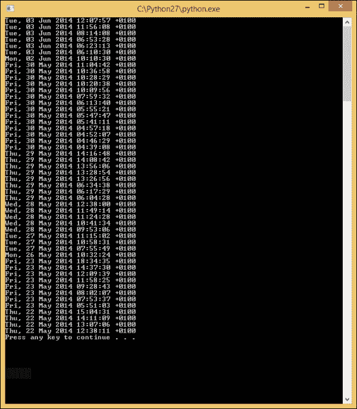
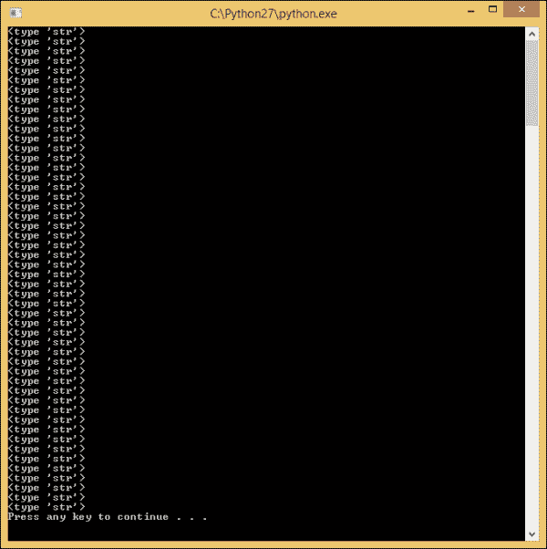
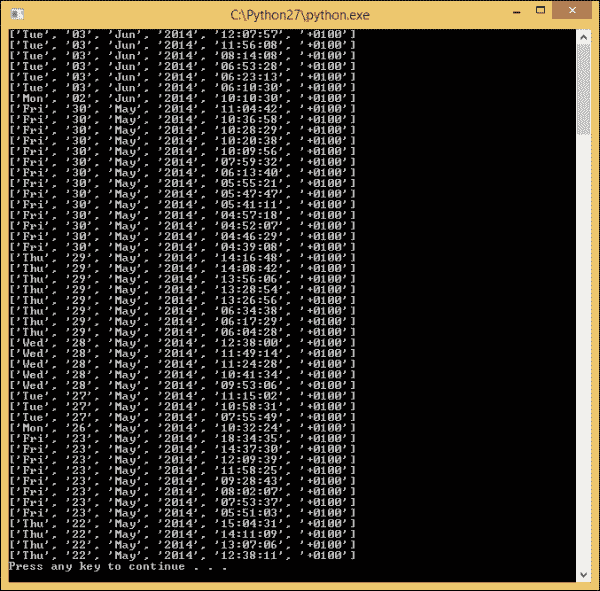
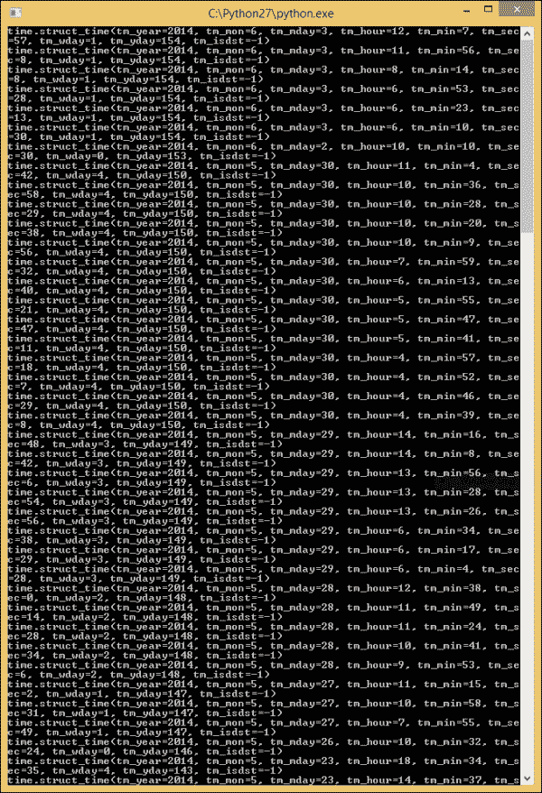
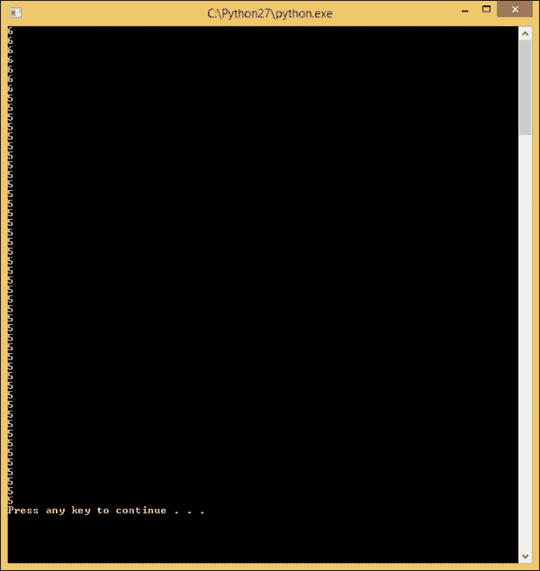
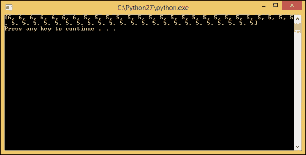
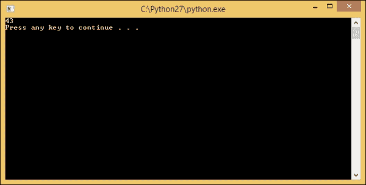
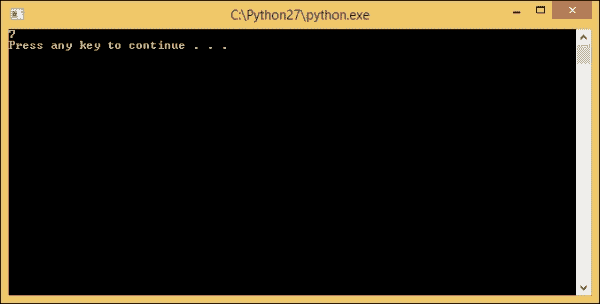
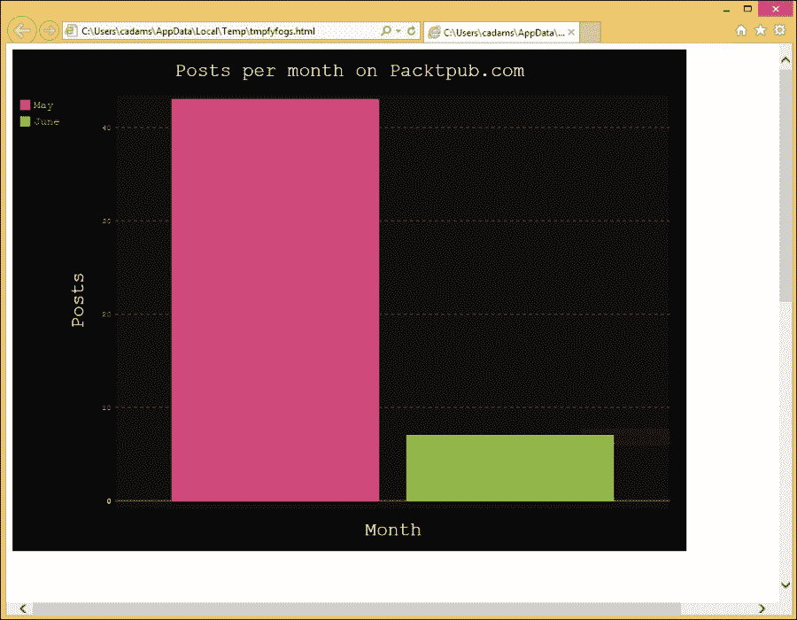

# 七、把这一切放在一起

我们一起经历了学习 Python 数据可视化开发、处理数据和使用`pygal`库创建图表的漫长过程。现在是时候将这些技能付诸实践了。本章的目标是利用我们的知识创建一个包含网络动态数据的图表。在本章中，我们将涵盖以下主题:

*   从网上导入 2 个月的 RSS 博客文章
*   为新的条形图数据集格式化我们的 RSS 数据
*   建立一个简单的条形图来显示过去两个月的博客文章，传递文章的数量
*   创建一个主应用脚本来处理执行，并将我们的代码分成模块，我们将把这些模块导入到主脚本中

# 博客的图表使用情况

我们将从 Packt Publishing 的 RSS 提要开始，并使用 RSS 提要中的数据创建一个图表。这个图表将具体包括一个月有多少文章发表；至此，我们已经熟悉了使用 HTTP 从 Web 上找到的位置解析 XML。然后，我们将从这个提要创建我们自己的数据集。

为此，我们需要执行以下任务:

*   找出一个月内有多少帖子
*   过滤每个月的帖子数
*   最后，根据这两个月的数据生成图表

像任何编程任务一样，无论是编写的容易性还是代码的可维护性，成功的关键都是分解完成工作所需的任务。为此，我们将把这个任务分解成 Python 模块。

## 整理我们的数据

我们的第一个任务是将来自 Packt Publishing 网站的 RSS 源拉进我们的 Python 代码中。为此，我们可以从[第 6 章](6.html "Chapter 6. Importing Dynamic Data")、*导入动态数据*中重用我们的 Python HTTP 和 XML 解析器示例，但是我们将从`pubDate`中抓取日期，而不是抓取每个`title`节点的标题。`pubDate`对象是一个 RSS 标准约定，用于在基于 XML 的 RSS 源中指示日期和时间。

我们从[第六章](6.html "Chapter 6. Importing Dynamic Data")、*导入动态数据*修改代码，抓取`pubDate`对象。我们将创建一个新的 Python 脚本文件，并将其称为`LoadRssFeed.py`。然后，我们将在我们选择的编辑器中使用这些代码:

```py
#!/usr/bin/env python
# -*- coding: utf-8 -*-

import urllib2
from xml.etree import ElementTree

try:
    #Open the file via HTTP.
    response = urllib2.urlopen('http://www.packtpub.com/rss.xml')
    tree = ElementTree.parse(response)
    root = tree.getroot()

    #List of post dates.

    news_post_date = root.findall("channel//pubDate")

    '''Iterate in all our searched elements and print the inner text for each.'''
    for date in news_post_date:
       print(date.text)

       #Finally, close our open network.
       response.close()

except Exception as e:
    #If we have an issue show a message and alert the user.
    print(e)
```

请注意，我们现在不是找到所有标题，而是使用 XPath 路径`channel//pubDate`找到`pubDate`。我们还将约会对象的名单更新为`news_post_date`。这将有助于澄清我们的代码。让我们运行代码并查看结果:



望好；我们可以知道我们有一个结构化的日期和时间格式，现在我们可以根据字符串中的内容进行过滤，但是让我们对此进行更多的挖掘。像大多数语言一样，Python 也有一个`time`库，允许字符串转换成`datetime` Python 对象。我们如何判断这些值是否已经不是`date`的对象？让我们将`print (date.text)`方法包装在`type`函数中，以渲染对象的类型，而不是对象的输出，如下所示:`print type(date.text)`。让我们重新运行代码，看看结果:



## 将日期字符串转换为日期

在继续之前，我们需要将中的任何字符串转换成 Python 中可用的类型，例如，我们从 RSS 提要中获取发布日期。拥有一些已经制作好的功能来格式化或搜索我们的日期不是很好吗？嗯，Python 对此有一个内置类型叫做`time`。将字符串转换为`time`对象非常容易，但是首先，我们需要在代码的顶部添加`time`的`import`语句，例如`import time`。接下来，由于我们的`pubDate`节点不是我们可以轻松解析的多个字符串，所以让我们使用`split()`方法将它们拆分成一个数组。

我们将使用`replace()`方法删除字符串中的任何逗号。我们甚至可以运行它，我们的输出窗口将在每个`pubDate`周围显示括号，每个数组项之间用逗号隔开，表示我们成功地将单个字符串分割成字符串数组。

这里我们使用一个循环，循环中有一个从 RSS 源中提取的不同时间元素的列表:

```py
#!/usr/bin/env python
# -*- coding: utf-8 -*-

import urllib2
from xml.etree import ElementTree

try:
    #Open the file via HTTP.
    response = urllib2.urlopen('http://www.packtpub.com/rss.xml')
    tree = ElementTree.parse(response)
    root = tree.getroot()

    #List of post dates.
    news_post_date = root.findall("channel//pubDate")
    print(news_post_date)
    '''Iterate in all our searched elements and print the inner text for each.'''
    for date in news_post_date:
        '''Create a variable striping out commas, and generating a new array item for every space.'''
        datestr_array = date.text.replace(',', '').split(' ')
        '''Show each array in the Command Prompt(Terminal).'''
        print(datestr_array)

    #Finally, close our open network.
    response.close()

except Exception as e:
    '''If we have an issue show a message and alert the user.'''print(e)
```

在这里，当我们循环代码时，我们可以看到每个`time`对象的列表，月、日、年、时间等等；这将有助于获取与我们解析的 RSS 提要相关的特定时间值:



## 使用 strptime

`strptime()`方法或条带时间是在`time`模块中找到的方法，它允许我们使用我们的字符串数组创建一个`date`变量。我们只需要在`strptime()`方法中指定年、月、日、时。让我们为在`for`循环中创建的字符串数组创建一个变量。然后，用我们的`strptime()`方法创建一个`date`类型变量，并用我们的字符串数组格式化它。

看看下面的代码，注意我们如何使用`news_post_date`列表来构造`for`循环，以匹配我们的字符串数组来显示从 RSS 提要接收到的日期列表，我们使用`strptime()`方法将其解析为 Python `time`对象。让我们继续添加以下代码，看看我们的结果:

```py
#!/usr/bin/env python
# -*- coding: utf-8 -*-

import urllib2, time
from xml.etree import ElementTree

try:
    #Open the file via HTTP.
    response = urllib2.urlopen('http://www.packtpub.com/rss.xml')
    tree = ElementTree.parse(response)
    root = tree.getroot()

    #Array of post dates
    news_post_date = root.findall("channel//pubDate")

    #Iterate in all our searched elements and print the inner text for each.
    for date in news_post_date:
        '''Create a variable striping out commas, and generating a new array item for every space.'''
        datestr_array = date.text.replace(',', '').split(' ')
        '''Create a formatted string to match up with our strptime method.'''
        formatted_date = "{0} {1}, {2}, {3}".format(datestr_array[2], datestr_array[1], datestr_array[3], datestr_array[4])

        #Parse a time object from our string.
        blog_datetime = time.strptime(formatted_date, "%b %d, %Y, %H:%M:%S")

        print blog_datetime

    #Finally, close our open network.
    response.close()

except Exception as e:
    #If we have an issue show a message and alert the user.
 print(e)
```

正如我们所看到的，通过 RSS 提要的每个循环显示一个`time.struct_time`对象。`struct_time`对象允许我们指定要使用`time`对象的哪个部分；让我们仅将月份打印到控制台:



我们现在可以通过打印`blog_datetime.tm_mon`来轻松完成，其中引用了我们的`struct_time`方法中的`tm_mon`命名参数。例如，这里我们得到每个帖子的月数，如下所示:

```py
#!/usr/bin/env python
# -*- coding: utf-8 -*-

import urllib2
from xml.etree import ElementTree
import time

def get_all_rss_dates():

    '''Create a global array to our function to save our month counts.'''
    month_count = []

    try:
        #Open the file via HTTP.
        response = urllib2.urlopen('http://www.packtpub.com/rss.xml')
        tree = ElementTree.parse(response)
        root = tree.getroot()

        #Array of post dates.
        news_post_date = root.findall("channel//pubDate")

        '''Iterate in all our searched elements and print the inner text for each.'''
        for date in news_post_date:
            '''Create a variable striping out commas, and generating a new array item for every space.'''
            datestr_array = date.text.replace(',', '').split(' ')

            '''Create a formatted string to match up with our strptime method.'''
            formatted_date = "{0} {1}, {2}, {3}".format(datestr_array[2], datestr_array[1], datestr_array[3], datestr_array[4])

            '''Parse a time object from our string.'''
            blog_datetime = time.strptime(formatted_date, "%b %d, %Y, %H:%M:%S")

            '''Add this date's month to our count array'''
            month_count.append(blog_datetime.tm_mon)

        #Finally, close our open network.
        response.close()

    except Exception as e:
        '''If we have an issue show a message and alert the user.'''
        print(e)
    for mth in month_count:
        print(mth)

#Call our function.
get_all_rss_dates()
```

下面的截图显示了我们的脚本的结果:



有了这个输出，我们可以看到数字`6`，表示六月，数字`5`，表示五月。太好了。我们现在已经修改了代码，以使用来自 Web 的数据，并显示我们在输出中指定的相同类型的数据。如果你对`blog_datetime`上的字符串格式感到好奇，你可以参考字符串格式索引，我已经把它包含在下表中了。在[https://docs . python . org/2/library/datetime . html # strftime-strptime-behavior](https://docs.python.org/2/library/datetime.html#strftime-strptime-behavior)上也有详细的列表。

<colgroup><col style="text-align: left"> <col style="text-align: left"></colgroup> 
| 

占位符

 | 

描述

 |
| --- | --- |
| `%a` | 这个是缩写的工作日名称 |
| `%A` | 这个是没有缩写的工作日名称 |
| `%b` | 这个是缩写的月份名称 |
| `%B` | 这个是没有缩写的月份名称 |
| `%c` | 这是优选的日期和时间表示 |
| `%C` | 这是日期的世纪(2000 年将返回 20，1900 年将返回 19) |
| `%d` | 这个显示了一个月中的某一天 |
| `%D` | 这个和`%m` / `%d` / `%y`一样 |
| `%g` | 这是就像`%G`一样，但是没有世纪 |
| `%G` | 这个给出了四位数的年份，比如 2014 年 |
| `%H` | 此以 24 小时格式(00 至 23)显示小时；大多数博客使用 24 小时制 |
| `%I` | 此给出 12 小时格式的小时(01 至 12) |
| `%j` | 一年中的第天(001 到 366) |
| `%m` | 月(01 至 12) |
| `%M` | 分钟 |
| `%p` | 使用上午或下午 |
| `%S` | 这会显示日期的秒数 |
| `%T` | 这个给出当前时间，等于`%H:%M:%S` |
| `%W` | 这个是当年的周数 |
| `%w` | 星期几为小数，周日=0 |
| `%x` | 这给出了没有时间的优选日期表示 |
| `%X` | 这个给出了没有日期的优选时间表示 |
| `%y` | 这只是返回年份的最后两位数字(例如，2014 将返回 14) |
| `%Y` | 这个给出了包括世纪在内的年份(如果年份是 2014 年，产量就是 2014 年) |
| `%Z`或`%z` | 这个给出了时区的名称或时区的缩写(例如，东部标准时间，或 EST) |

## 将输出保存为计数数组

有了我们的数据类型，我们想要计算一个月内有多少帖子。为此，我们需要将每个帖子放入一个分组列表中，以便在我们的`for`循环之外使用。我们可以通过在`for`循环外创建一个空数组并将每个`blog_datetime.tm_mon`对象添加到我们的数组中来做到这一点。

让我们在下面的代码中这样做，但是首先，我们将把它包装在一个函数中，因为我们的代码文件开始变得有点大了。如果你还记得在[第 2 章](2.html "Chapter 2. Python Refresher")、*Python reviewer*中，我们将我们的大代码块包装在函数中，这样我们就可以重用或清理我们的代码。我们将把代码包装在`get_all_rss_dates`名称函数中，并在最后一行调用它。此外，我们将在我们的`try` `catch`准备追加值之前添加`month_count`数组变量，这是我们在`for`循环中所做的，然后打印`month_count`数组变量。让我们看看这会呈现什么:

```py
#!/usr/bin/env python
# -*- coding: utf-8 -*-

import urllib2
from xml.etree import ElementTree
import time

def get_all_rss_dates():
    #create a global array to our function to save our month counts.
    month_count = []

    try:
        #Open the file via HTTP.
        response = urllib2.urlopen('http://www.packtpub.com/rss.xml')
        tree = ElementTree.parse(response)
        root = tree.getroot()

        #Array of post dates.
        news_post_date = root.findall("channel//pubDate")

        '''Iterate in all our searched elements and print the inner text for each.'''
        for date in news_post_date:
            '''Create a variable striping out commas, and generating a new array item for every space.'''
            datestr_array = date.text.replace(',', '').split(' ')
            '''Create a formatted string to match up with our strptime method.'''
            formatted_date = "{0} {1}, {2}, {3}".format(datestr_array[2], datestr_array[1], datestr_array[3], datestr_array[4])

            '''Parse a time object from our string.'''
            blog_datetime = time.strptime(formatted_date, "%b %d, %Y, %H:%M:%S")

            '''Add this dates month to our count array'''
            month_count.append(blog_datetime.tm_mon)

            '''Finally, close our open network.'''
            response.close()

    except Exception as e:
        '''If we have an issue show a message and alert the user.'''
        print(e)

    print month_count

#Call our function
get_all_rss_dates()
```

下面是截图，显示了我们的月份列表和与月份对应的数字。在这种情况下，`5`代表 5 月份，`6`代表 6 月份(您的数字可能会因月份而异):



### 计数数组

现在，我们的阵列已经准备就绪，让我们统计一下 6 月和 5 月的帖子。在写这本书的时候，我们在 6 月份有 7 个帖子，在 5 月份有很多帖子。

让我们打印出五月在帕克特出版网站新闻提要上的博客文章数量。为此，我们将使用`count()`方法，该方法允许我们在数组中搜索特定的值。在这种情况下，`5`就是我们要寻找的值:

```py
#!/usr/bin/env python 
# -*- coding: utf-8 -*- 

import urllib2 
from xml.etree import ElementTree 
import time

def get_all_rss_dates():

    '''create a global array to our function to save our month counts.'''
    month_count = []

    try: 
        #Open the file via HTTP. 
        response = urllib2.urlopen('http://www.packtpub.com/rss.xml') 
        tree = ElementTree.parse(response) 
        root = tree.getroot() 

        #Array of post dates.
        news_post_date = root.findall("channel//pubDate") 

        '''Iterate in all our searched elements and print the inner text for each. '''
        for date in news_post_date: 
            '''Create a variable striping out commas, and generating a new array item for every space.'''
            datestr_array = date.text.replace(',', '').split(' ')

            '''Create a formatted string to match up with our strptime method.'''
            formatted_date = "{0} {1}, {2}, {3}".format(datestr_array[2], datestr_array[1], datestr_array[3], datestr_array[4])

            '''Parse a time object from our string.'''
            blog_datetime = time.strptime(formatted_date, "%b %d, %Y, %H:%M:%S")

            '''Add this date's month to our count array'''
            month_count.append(blog_datetime.tm_mon)

        '''Finally, close our open network. '''
        response.close() 

    except Exception as e: 
        '''If we have an issue show a message and alert the user. '''
        print(e)

    print month_count.count(5)

#Call our function
get_all_rss_dates()
```

正如我们在下面的控制台中看到的，我们得到了给定月份写的帖子数量(在屏幕和代码中，这是 5 月份):



在我们的输出窗口中，我们可以看到我们的结果是 2014 年 5 月的`43`帖子。如果我们将计数搜索更改为六月，或者更确切地说，代码中的`6`会怎么样？让我们更新代码并重新运行:



我们的输出显示`7`为 6 月份的总博客帖子。在这一点上，我们已经测试了我们的代码，现在我们有了一个可以显示 5 月和 6 月的工作数据集。

# Python 模块

好了，我们已经设置了图表的数据端，从网络中提取数据，并用 Python 将这些数据解析成可用的对象。我们可能认为，现在很容易将这些值插入 pygal 图表并结束一天的工作，在某种程度上，这是正确的；然而，我们希望代码更加智能。

还记得我们关于如何将大块 Python 代码包装成函数的讨论吗；好吧，对于一个更大的项目，我们希望模块更高；所以，我们首先想到的是:什么是模块？我们在这本书的课程中使用过模块吗？

是的，每当我们在代码中使用`import`语句时，我们都会使用`time`、`pygal`或`urllib2`。这是一个模块，(有时称为库)，更有趣的是，我们可以制作自己的模块，从而允许我们模块化代码。

## 构建主方法

在许多编程语言中，存在一个`main`函数的概念，它是程序执行中调用的第一个函数。让我们在这里创建一个名为`main_chartbuild`的文件，只需在我们的 IDE 中创建`main_chartbuild.py`文件。

接下来，我们要移除在`LoadRssFeed`中的初始测试期间发现的`get_all_rss_dates()`方法调用，然后使用我们的`main_chartbuild.py`文件中的`import`调用我们的`get_all_rss_dates()`函数的`dates`方法。然后，我们将引用我们的方法，但在它前面加上我们的`import` 名称，如下所示:

```py
#!/usr/bin/env python
# -*- coding: utf-8 -*-

import LoadRssFeed

#Call our 'LoadRssFeed' function.
LoadRssFeed.get_all_rss_dates()
```

如果我们重新运行脚本，我们应该会看到与我们 6 月的帖子计数相同的结果，即`7`:


# 修改我们的 RSS 以返回值

由于我们现在使用我们的`LoadRssFeed`作为库模块，我们将希望修改最终结果以返回一个我们可以在我们即将构建的`chart`模块中使用的数组。我们将在一个数组中返回两个计数，一个用于 5 月，一个用于 6 月。

此外，我们将删除`print`语句，因为我们知道它工作正常。所以，去掉`LoadRssFeed`、`get_all_rss_dates`功能末尾的`print`线，换成`return [month_count.count(5), month_count.count(6)]`。这将允许我们返回一个对象，但为我们的图表保留两个值。文件的实现如下:

```py
#!/usr/bin/env python
# -*- coding: utf-8 -*-

import urllib2 
from xml.etree import ElementTree
import time

def get_all_rss_dates():

    '''create a global array to our function to save our month counts.'''
    month_count = []

    try: 
        '''Open the file via HTTP.'''
        response = urllib2.urlopen('http://www.packtpub.com/rss.xml') 
        tree = ElementTree.parse(response) 
        root = tree.getroot() 

        '''Array of post dates.'''
        news_post_date = root.findall("channel//pubDate") 

        '''Iterate in all our searched elements and print the inner text for each.''' 
        for date in news_post_date:
            '''Create a variable striping out commas, and generating a new array item for every space.'''
            datestr_array = date.text.replace(',', '').split(' ')

            '''Create a formatted string to match up with our strptime method.'''
            formatted_date = "{0} {1}, {2}, {3}".format(datestr_array[2], datestr_array[1], datestr_array[3], datestr_array[4])

            '''Parse a time object from our string.'''
            blog_datetime = time.strptime(formatted_date, "%b %d, %Y, %H:%M:%S")

            '''Add this date's month to our count array'''
            month_count.append(blog_datetime.tm_mon)

        '''Finally, close our open network.'''
        response.close()

    except Exception as e:
        '''If we have an issue show a message and alert the user.'''
        print(e)

    '''Return two counts for both months.'''
    return [month_count.count(5), month_count.count(6)]
```

### 型式

Packt Publishing 网站的 RSS feed 只占过去两个月的帖子，因此，例如，如果您在 10 月份阅读这篇文章，您需要将每个`month_count`项目的计数设置为 10 月份的`10`和 9 月份的`9`。

## 构建我们的图表模块

接下来，让我们创建一个新的 Python 文件，作为我们使用 pygal 的图表构建库。我们将此文件命名为`chart_build.py`，并将其与我们的`LoadRssFeed.py`和`main_chartbuild.py`文件一起添加到我们的项目根目录中。

接下来，打开`chart_build.py`文件，让我们构建一个简单的条形图，显示 5 月和 6 月的帖子数量。就像我们构建的`LoadRssFeed`模块一样，我们将图表代码包装在一个函数中，该函数带有一个名为`dataarr`的参数，表示一个数据数组。在我们将数据添加到图表之前，让我们设置图表配置。

## 为我们的图表构建便携式配置

在 pygal 中，我们通常创建一个图表，在其中，我们指定参数来设置图表的设置，并将我们的参数值添加到我们调用的图表对象中。`pygal`库提供了一种模块化配置选项的方法。

这很有帮助，因为在这个例子中，我们只使用一个图表，但是如果我们有八个或十二个图表要构建呢？拥有一个可移植的配置来设置图表布局和主题可能非常有用，而不是每次都重写配置。

看看下面的代码。这里，我正在创建一个名为`ConfigChart`的 Python 类，它有一个名为`Config`的参数，基本上覆盖了我们分配给它的图表中的`Config`对象。在类内部，我有一个可以干净地更新和修改的参数列表。注意我也导入`pygal`，使用`from pygal`，我也导入`Config`作为单独的对象工作:

```py
import pygal
from pygal import Config

'''Creating our own class with values to pass in as parameters to our chart.'''
class ConfigChart(Config):
    show_legend = True
    human_readable = True
    fill = True
 '''explicit_size sets a fixed size to our width height            properties.'''
    explicit_size = True
    width = 860
    height = 640
    title= 'Posts per month on Packtpub.com'
    y_label = 'Posts'
    x_label = 'Month'
    y_title = 'Posts'
    x_title = 'Month'
    show_y_labels = True
    show_x_labels = True
    stroke = False
    tooltip_font_size = 42
    title_font_size = 24
 '''Always include an error message for any dynamic data.'''
    no_data_text = 'Unable to load data'
```

正如所见，我已经添加了我们在[第 5 章](5.html "Chapter 5. Tweaking pygal")、*调整 pygal* 中讨论的许多值，并且还确保了我们的`no_data_text`参数在任何连接问题的情况下都有值。此外，当我们想要在浏览器中渲染时，我已经设置了`width`和`height`以及将名为`explicit_size`的参数设置为`True`，以强制 SVG 输出为固定大小。

## 设置我们的数据图表

现在，让我们完成设置我们的图表以接收我们的`chart_build.py`文件中的数据。在这里，我已经将我的 pygal 图表创建代码包装在一个名为`generate_chart`的函数中，并添加了一个参数来处理从 RSS 提要中提取的图表数据。

这是图表的最终代码，包括我们的`ConfigChart`类，应用于我们的图表对象。请注意，对于图表的`add()`方法，我只是添加了带有数组索引的`dataarr`，以分别指定`May`和`June`的值:

```py
import pygal
from pygal import Config

'''Creating our own class with values to pass in as parameters to our chart.'''
class ConfigChart(Config):
    show_legend = True
    human_readable = True
    fill = True
    '''explicit_size sets a fixed size to our width height properties.'''
    explicit_size = True
    width = 860
    height = 640
    title= 'Posts per month on Packtpub.com'
    y_label = 'Posts'
    x_label = 'Month'
    y_title = 'Posts'
    x_title = 'Month'
    show_y_labels = True
    show_x_labels = True
    stroke = False
    tooltip_font_size = 42
    title_font_size = 24
    '''Always include an error message for any dynamic data.'''
    no_data_text = 'Unable to load data'

'''Generate chart based on imported array, (with 2 values)'''
def generate_chart(dataarr):

    '''Initialize the chart with our ConfigChart class.'''
    mychart = pygal.Bar(ConfigChart())

    '''Add data to the chart for May and June.'''
    mychart.add('May', dataarr[0])
    mychart.add('June', dataarr[1])

    '''Launch our web browser with our SVG, (we can also render to file as well)'''
    mychart.render_in_browser()
```

在运行`main_chartbuild.py`之前，在`LoadRssFeed.py`文件中检查我们的代码。我们这里做了一个改动；我们将`print`异常更改为`throw`，如果在我们的`try` / `catch`块中遇到数据连接问题，将会出现异常。如果我们公开部署这个应用，我们会为消费者添加一个 UI 错误，而不是一个异常。

在这段代码中，我们进行了更新，返回了两个将传递到图表中的值:

```py
#!/usr/bin/env python
# -*- coding: utf-8 -*-

import urllib2 
from xml.etree import ElementTree
import time

def get_all_rss_dates():
    '''create a global array to our function to save our month counts.'''
    month_count = []

    try:
        '''Open the file via HTTP. '''
        response = urllib2.urlopen('http://www.packtpub.com/rss.xml')
        tree = ElementTree.parse(response)
        root = tree.getroot()

        '''Array of post dates.'''
        news_post_date = root.findall("channel//pubDate")

        '''Iterate in all our searched elements and print the inner text for each. '''
        for date in news_post_date:
            '''Create a variable striping out commas, and generating a new array item for every space.'''
            datestr_array = date.text.replace(',', '').split(' ')

            '''Create a formatted string to match up with our strptime method.'''
            formatted_date = "{0} {1}, {2}, {3}".format(datestr_array[2], datestr_array[1], datestr_array[3], datestr_array[4])

            '''Parse a time object from our string.'''
            blog_datetime = time.strptime(formatted_date, "%b %d, %Y, %H:%M:%S")

            '''Add this date's month to our count array'''
            month_count.append(blog_datetime.tm_mon)

        '''Finally, close our open network. '''
        response.close()

    except Exception as e:
        '''If we have an issue show a message and alert the user.'''
        throw

    #Return two counts for both months.
    return [month_count.count(5), month_count.count(6)]
```

## 配置我们的主要功能来传递数据

还有一个要做的任务是设置我们的`main`函数，就是我们的`main_chartbuild.py`，在我们的脚本执行的时候调用。当我们的`LoadRssFeed`模块返回一个我们传递到图表中的数组时，我们将从我们构建的`chart`模块中调用`generate_chart()`方法并传递结果，如以下代码所示:

```py
#!/usr/bin/env python
# -*- coding: utf-8 -*-

import LoadRssFeed, chart_build

#Call our 'LoadRssFeed' function.
chart_build.generate_chart(LoadRssFeed.get_all_rss_dates())
```

让我们运行我们的`main_chartbuild.py`文件，看看结果:



# 项目改进

成功！我们通过从 web 源拉取数据构建了一个动态图表，并生成了一个具有特定配置的图表，可以轻松移动、更新和复制！现在，对于我们在一起的时间，这是一个动态图表上非常简单的例子。根据实际情况，该脚本可能每十分钟自动更新一次，例如，在图表构建服务器上，或者从具有 shell 访问权限的另一种语言调用，从而触发 Python 脚本。

此外，考虑数据以及它如何创建不同类型的图表。我们可以使用我们一起构建的`LoadRssFeed`模块创建数组，并提取特定作者的帖子数量，或者特定单词在博客文章标题中出现的次数。我们已经体验过使用 Python 处理复杂的应用，以及将网络上的实时数据拉进图表进行显示。

以下是独立于月份的修改代码:

```py
import pygal
from pygal import Config

'''Creating our own class with values to pass in as parameters to our chart. '''
class ConfigChart(Config):
    show_legend = True
    human_readable = True
    fill = True
    #explicit_size sets a fixed size to our width height properties.
    explicit_size = True
    width = 860
    height = 640
    title= 'Posts per month on Packtpub.com'
    y_label = 'Posts'
    x_label = 'Month'
    y_title = 'Posts'
    x_title = 'Month'
    show_y_labels = True
    show_x_labels = True
    stroke = False
    tooltip_font_size = 42
    title_font_size = 24
    #Always include an error message for any dynamic data.
    no_data_text = 'Unable to load data'

'''Generate chart based on imported array, (with 2 values) '''
def generate_chart(dataarr):

    '''Initialize the chart with our ConfigChart class. '''
    mychart = pygal.Bar(ConfigChart())

    '''Add data to the chart for May and June. '''
    for data in dataarr:
        mychart.add(data[0], data[1])
    #mychart.add('June', dataarr[1])

    '''Launch our web browser with our SVG,
    (we can also render to file as well) '''
    mychart.render_in_browser()

if __name__ == '__main__':
    generate_chart([('May', 10), ('June', 20), ('July', 30)])

LoadRssFeed.py

import urllib2
from xml.etree import ElementTree
from collections import defaultdict

def get_all_rss_dates():

    month_count = defaultdict(int)

    try:
        #Open the file via HTTP.
        response = urllib2.urlopen('http://www.packtpub.com/rss.xml')
        tree = ElementTree.parse(response)
        root = tree.getroot()

        news_post_date = root.findall("channel//pubDate")

        #Iterate in all our searched elements and print the inner text for each.
        for date in news_post_date:
            month_count[ date.text[8:11]] += 1

        response.close()

    except Exception as e:
        #If we have an issue show a message and alert the user.
        throw

    return list(month_count.items())

if __name__ == '__main__':
    print(get_all_rss_dates())
```

# 总结

在这一章中，我们使用通过 HTTP 从网络中动态提取的 RSS 数据，构建了一个基本的，但实际工作的动态图表应用。我们使用`pygal`库创建了一个图表，然后使用 pygal 的`Config`类修改了我们的图表，并自动启动网络浏览器来显示图表。