# 八、更多资源

所以我们可能会问，现在怎么办？还有什么要知道的？嗯，实际上相当多，正如在[第 1 章](1.html "Chapter 1. Setting Up Your Development Environment")、*设置您的开发环境*以及其他章节开头提到的，这是使用 Python 的数据可视化的介绍，但不是全部。

用 Python 构建动态图表是目前非常需要的技能。存在的原因是双重的；首先，Python 是免费的，跨平台的，允许构建服务器存在于一个 Linux 服务器上，一个微软 IIS 服务器；或者一台 Mac 服务器，你就明白了。

另一个原因是 Python 处理数据计算的速度非常快，特别是在医疗、大气甚至金融数据等方面。根据需要不同图表风格和不同交互性的数据类型，我们将需要使用不同的图表库，这就引出了一个问题，除了 pygal，还有什么？

# matplotlib 库

在图形和数据图表的 T2 Python 世界中，最受欢迎的库之一是 T4 的 T3 matplotlib。虽然这个名字听起来很傻，但简单来说，`matplotlib`是一个 2D 和三维绘图库，可以生成高质量的硬拷贝图形和图表。现在，`matplotlib`库在早期很容易使用，但很快就会变得非常复杂。

还记得在[第 2 章](2.html "Chapter 2. Python Refresher")*Python reviewer*中，我们讨论过从头开始创建自己的图形和图表吗？matplotlib 不仅允许我们构建图表和图形，还允许我们在框架内创建的 2D 静态图像和 3D 对象中绘制图形、小部件和运行动画。查看 matplotlib 网站上的示例:[http://matplotlib.org/examples/index.html](http://matplotlib.org/examples/index.html)。

## 安装 matplotlib 库

还记得[第三章](3.html "Chapter 3. Getting Started with pygal")*开头的吗，pygal* 入门，pygal 需要安装`lxml`？matplotlib 也是，但是在 Linux 系统上有一组不同的库；matplotlib 可以使用以下命令通过大多数 Linux 通用 Python 包管理器及其所有必需的依赖项轻松安装，因此您不需要 Debian 安装程序:

```py
sudo apt-get install Python-matplotlib

```

### 型式

如果您使用的是基于 Windows 的系统，请考虑使用基于 Mac 或 Linux 的系统，因为它们需要一点额外的工作来正确安装`matplotlib`。如果您只能访问 Windows，请考虑安装一个带有诸如 Ubuntu 之类的操作系统的虚拟机。

以下截图显示了 matplotlib **下载**页面:

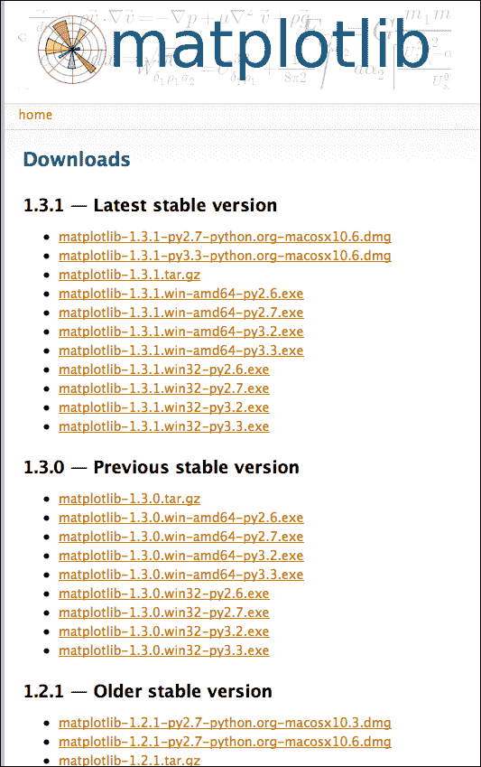

## matplotlib 的库下载页面

现在，如果你在基于 Windows 或 Mac 的操作系统中工作，matplotlib 建议下载 matplotlib 的二进制安装程序，为此开发人员为 Windows 机器创建了一个 exe 安装程序，或者为 Mac 系统创建了一个 dmg 安装程序。这允许将 C 映像代码正确安装到机器上，就像[第 1 章](1.html "Chapter 1. Setting Up Your Development Environment")、*为 Window 的系统设置开发环境*中的`lxml`一样。可以在这里抓取 Windows 和 Mac 的安装程序:[http://matplotlib.org/downloads.html](http://matplotlib.org/downloads.html)。

### 型式

对于 matplotlib 的 Mac 用户来说，撰写本文时的链接显示 10.6 是唯一的安装程序；这些将适用于任何英特尔 Mac，包括 10.9 小牛。

如果您在 Linux 系统上遇到 matplotlib 的问题，也可以在该页面上找到该平台的 tarball 安装程序；请确保安装 Python 运行时附带的版本。

一个依赖性是 matplotlib 使用 Numeric Python 或 NumPy 来处理复杂的数学运算，通常用于基本图表创建和/或在数据中创建曲线。通过 pip 下载这个依赖关系稍微容易一点，使用以下命令中显示的 pip 命令。如果您遇到问题，请查看在[http://www.scipy.org/](http://www.scipy.org/)安装 SciPy 堆栈，它还包括`maplotlib`以及额外的插件。

```py
sudo pip install numpy

```

### 型式

对于 Windows 用户，NumPy 不包括 64 位版本。您将需要 32 位版本的 Python 2.7 来运行它。

## 创建简单的 matplotlib 图表

一旦安装了库和依赖项，matplotlib 中的大多数基本图表都很容易构建。在下面的代码中，我们有一个带有标准 Python 和 Unicode 声明的示例代码，我们只需使用范围`0 – 541`创建一个数字列表，然后使用一个简单的`for`循环向图表中添加值，并保存文件，同时在 matplotlib 查看器中显示它:

```py
#!/usr/bin/env Python
# -*- coding: utf-8 -*- 
from matplotlib import pyplot
#Create a range from 0 - 541
X = range(0, 541)

#Set the values for Y by iterating thru X's range.
Y = [i*i for i in X]

'''Assign a range of values to the graph, the dash goes between each value.'''
pyplot.plot(X, Y, '-')

#Set chart's labels and title
pyplot.title('Plotting x*x')
pyplot.xlabel('X Axis')
pyplot.ylabel('Y Axis')

#Save the chart as a PNG to our project directory.
pyplot.savefig('Simple.png')

#Show the chart in the Python runtime viewer.
pyplot.show()
```

下面的截图显示了我们脚本的结果:

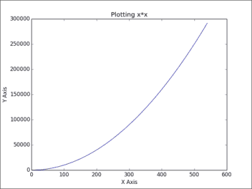

注意这里的我们图表的`Simple.png`文件是用`savefig()`函数创建的，实际上是透明的。这是由于 matplotlib 如何渲染 PNG 图表。现在，如果我们看最后一行，`pyplot.show()`，这将告诉`matplotlib`显示下面的窗口，显示我们保存到我们的`Simple.png`文件的相同图表。

下面是我们使用 matplotlib 提供的 Python 图表查看器的图表。您可以使用左下角的控件来操作图表:

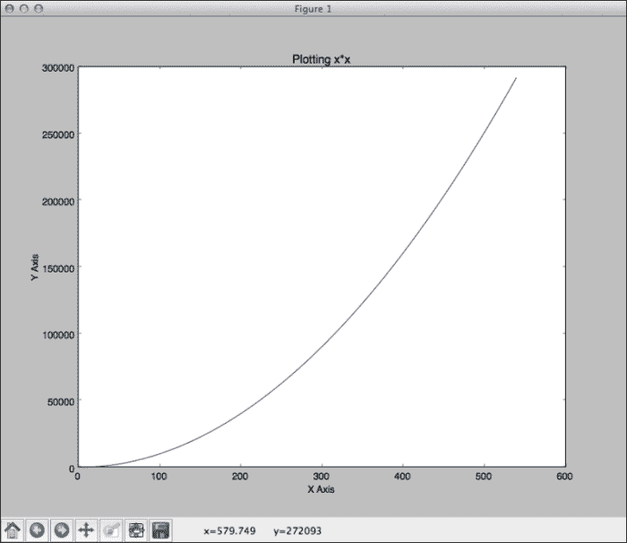

在**保存**按钮旁边的中可以找到的控件之一是**子图配置工具**。单击打开控件子集以调整图表，如下图所示:

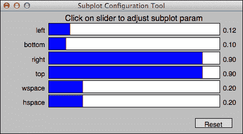

当对你的图表外观满意时，可以通过**保存**按钮进行保存。如果你犯了错误，你可以点击**重置**或者点击主窗口工具栏上的**主页**按钮。

`matplotlib`库包括许多标准图表类型以及支持 3D 的图表。让我们构建一个简单的三维图表。看看下面的代码:

```py
#!/usr/bin/env Python
# -*- coding: utf-8 -*-

from mpl_toolkits.mplot3d import Axes3D
import numpy as np
import matplotlib.pyplot as plt

fig = plt.figure()
ax = fig.gca(projection='3d')

#Create a curve on the z axis.
x = np.linspace(0, 1, 100)
y = np.sin(x * -1 * np.pi) / 2 + 0.5

ax.plot(x, y, zs=0, zdir='z', label='Our random sin curve, only for z-axis')

'''Specify colors, and loop thru each and randomize the scatter dots, and add them to the chart data.'''
colors = ('r', 'g', 'k', 'b')
for c in colors:
    x = np.random.sample(42)
    y = np.random.sample(42)
    ax.scatter(x, y, 1, zdir='x', c=c)

#Apply the legend.
ax.legend()

#Add the X, Y, and Z axis.
ax.set_xlim3d(0, 1)
ax.set_ylim3d(0, 1)
ax.set_zlim3d(0, 1)

#Show the chart.
plt.show()
```

对于这张图表，请注意我们使用的是`matplotlib`的模块`mpl_toolkits`；这包括`Axes3D`模块。这允许我们绘制基于 3D 的图表。这里我们要在 *z* 轴上画一条曲线，在 *x* 轴上随机散布多色点。让我们运行代码并查看结果:

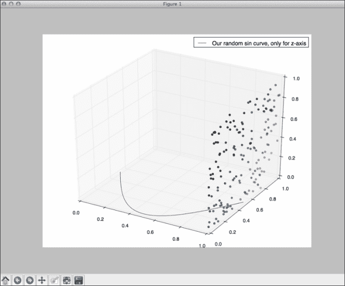

带`matplotlib`的 3D 图表的一个大特点是我们可以用鼠标旋转 3D 图表，通过将鼠标拖动到图表图像上；下面是一个更新图表的例子，以获得更好的点和曲线角度:

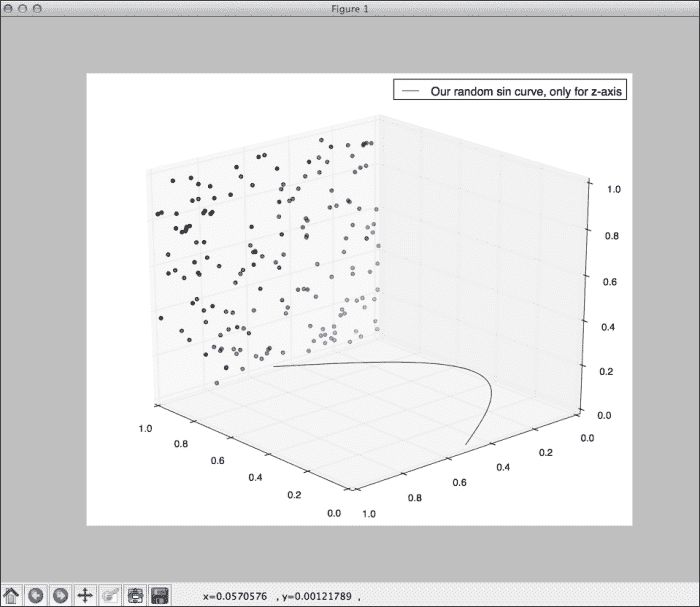

这只是对 matplotlib 为图表可视化开发人员提供的的一个尝试，我们在 pygal 中介绍的许多相同类型的图表被翻译成 matplotlib，但它包括各种插件和更多的 3D 图表和绘图工具。

有关该库的更多信息，请访问 matplotlib 网站。考虑到它的受欢迎程度，有很多关于这个主题的书可以让你从进入图书馆的各种入口开始。

# 绘图

**Plotly**([https://plot.ly/](https://plot.ly/))是 Python 数据可视化空间中一个新的图表库。Plotly 与其他制图 Python 库的区别在于它非常面向业务和组织。Plotly 是一家公司，不像网络上的其他一些图书馆。Python 开发人员需要在网站上注册一个开发人员帐户，以接收要在代码中使用的 API 密钥，如下图所示:

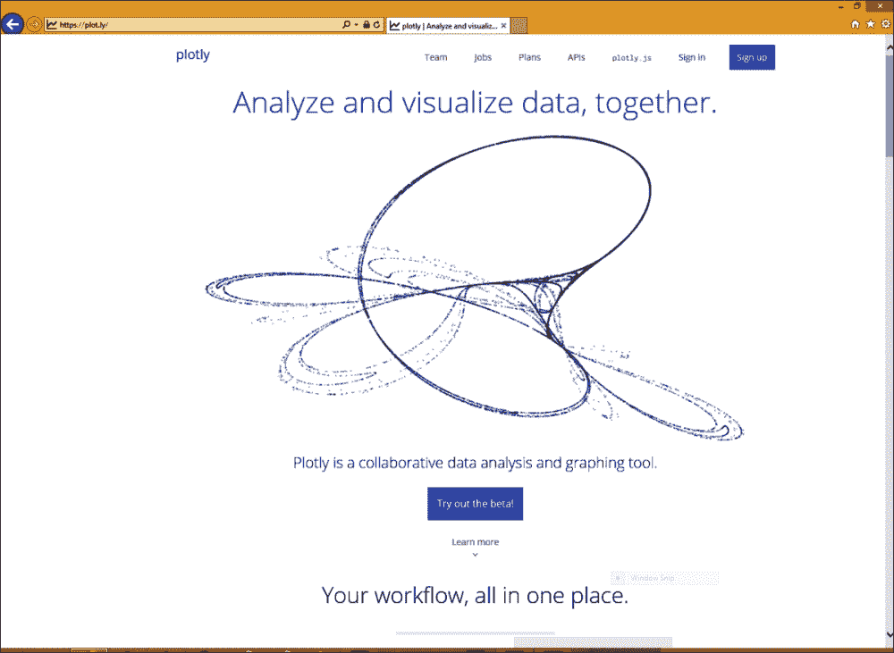

Plotly 的概念很简单。图表要么在 Plotly 网站上托管的在线工具中创建，要么通过代码创建；在我们的例子中，是一个与 Plotly 的服务集成的 Python 库，因为 Plotly 托管每个保存的图表，并且它允许共享托管的图表。这有助于与非技术用户共享数据。例如，以下是在 Plotly 编辑器中制作的一个图表的截图，用户可以在网上分享:

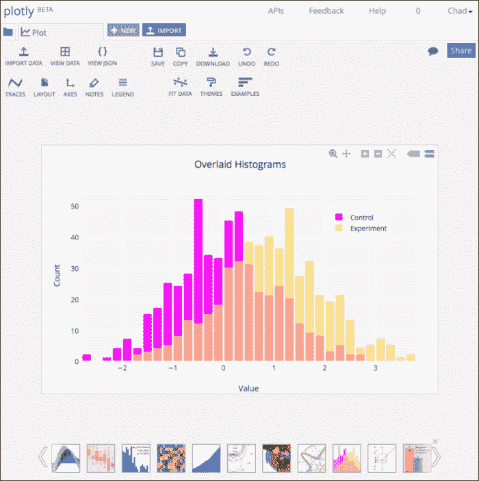

Plotly 给出的优势是很容易分享交互式图表。Plotly 还有一个在线工具，如前一张截图所示，无需任何代码即可创建图表，并上传数据以显示到在线可共享图表中。开发人员也可以通过使用 Chrome 应用在 Chrome OS 上使用 Plotly。

另一方面，Plotly 作为一个基于云的库运行良好。重要的是要知道 Plotly 的库需要 Python 3 或更高版本；所以在安装之前，我们需要从 Python 的网站([http://www.python.org/](http://www.python.org/))下载 Python 3。在安装 Plotly 之前，如果需要，也可以在 2 旁边运行 Python 3。用 Python 3 安装 Plotly 也非常容易。使用`pip`可以轻松安装`plotly`库，如下代码所示:

```py
pip install plotly

```

请记住，Plotly 需要 Python 3 或更高版本才能工作。否则，如果 pip 在 Python 2.7 中运行，一些依赖项将不会被安装。现在，一旦我们安装了我们的库，我们需要为 API 指定我们的登录信息，这特定于在[https://plot.ly/](https://plot.ly/)网站上使用的登录或 OpenID。请确保包含请求的登录信息；否则，任何图表都将导致类似于以下屏幕截图所示的对话框:

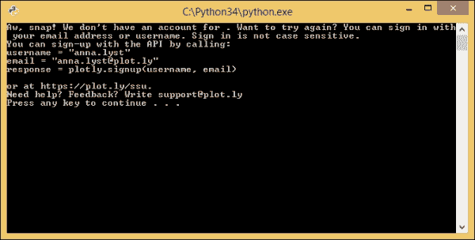

幸运的是，Plotly 有一个页面，如果您登录了，它将生成一个包含用户特定信息的登录对象示例。我们可以在 https://plot.ly/Python/getting-started/找到这个。

加上这些，让我们在 Plotly 中构建一个简单的图表。在这里，我们将把 Plotly 导入到我们的脚本中，并再次作为一个模块，导入所有图表类型供我们使用，最后导入我们的信息供 API 使用。

这里我们将用一些样本数据构建一个简单的折线图。复制以下代码并运行脚本，记住运行脚本需要注册用户名和 API 密钥。在下面的代码示例中，我在括号中添加了占位符来填充:

```py
#!/usr/bin/env python
# -*- coding: utf-8 -*-

'''import Plotly, and the main plotly object as a variable.'''
import plotly;
import plotly.plotly as py

'''import all chart types.'''
from plotly.graph_objs import *

'''Set the username, APIKey, and streaming IDs as given on https://plot.ly/python/getting-started/'''
plotly.tools.set_credentials_file(username='[username]', api_key='[apikey]', stream_ids=['[streamingkey1]', '[streamingkey2]'])

'''Create a data-set for a Plotly scatter plot.'''
trace0 = Scatter(
    x=[5, 10, 15, 20],
    y=[20, 40, 35, 16]
)

'''Assign the chart's data to an array typed variable (in this case trace0) to hold data.'''
data = Data([trace0])

'''Create a URL with the data loaded via the API, and open a web browser to the chart on success.'''
unique_url = py.plot(data, filename = 'basic-line')
```

如果成功，我们应该看到我们的默认网络浏览器打开图表，我们可以通过网络上 Plotly 查看器左侧的社交网络图标轻松共享该图表。请注意，如果我们将鼠标悬停在图表上，我们可以获得类似 pygal 的动画和数据，但我们也可以放大图表或选择图表的特定区域来获取更复杂的数据。

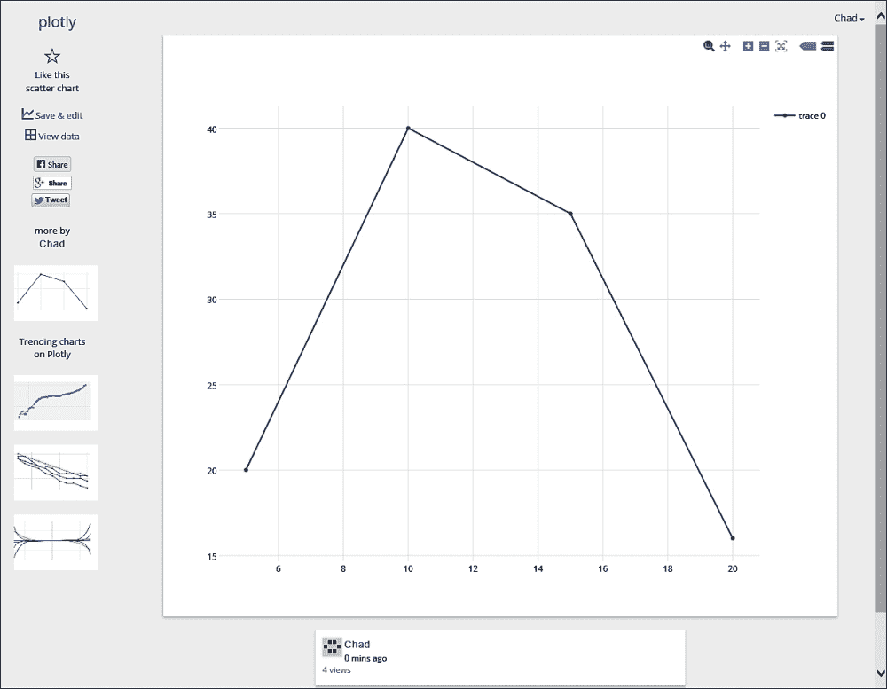

干得好！让我们再建立一个图表。这一次将是两个数据集的散点图。我们将做一个模拟图，比较纳斯卡粉丝和从欧洲和美国取样的 f1 粉丝(记住，这只是样本数据)。

在这个图表中，我们还将结合一些标签来更好地设置图表的样式，并用我们自己的样式来设置点的格式。同样，我们将需要我们的 API 登录和密钥；此代码示例中设置了占位符:

```py
#!/usr/bin/env python
# -*- coding: utf-8 -*-

'''import Plotly, and the main plotly object as a variable.'''
import plotly;
import plotly.plotly as py

'''import all chart types.'''
from plotly.graph_objs import *

'''Set the username, APIKey, and streaming IDs as given on https://plot.ly/python/getting-started/'''

plotly.tools.set_credentials_file(username='[username]', api_key='[apikey]', stream_ids=['[streamingkey1]', '[streamingkey2]'])

'''Create a data-set for a scatter plot.'''
trace0 = Scatter(
    #Create an array for each value.
    x=[27984, 9789],
    y=[34, 27],
    text=['Formula 1 Fans', 'Nascar Fans'],
    name='European automotive fans',
    mode='markers',
    marker=Marker(
        line=Line(
            color='rgb(124, 78, 42)',
            width=0
        ),
        size=48,
        color='rgb(124, 78, 42)'
    )
)

trace1 = Scatter(
    #Create an array for each value.
    x=[10117, 340159],
    y=[38, 31],
    text=['Formula 1 Fans', 'Nascar Fans'],
    name='North America automotive fans',
    mode='markers',
    marker=Marker(
        line=Line(
            color='rgb(114, 124, 195)',
            width=0
        ),
        size=48,
        color='rgb(114, 124, 195)'
    )
)

'''Set chart's titles, labels, and values.'''
layout = Layout(
    title='Fan comparisons of automotive sports in the United States and Europe',
    xaxis=XAxis(
        title='Amount of fans',
        showgrid=True,
        zeroline=False
    ),
    yaxis=YAxis(
        title='Average age of fans sampled',
        showline=True
    )
)

'''Assign the data to an array typed variable to hold data.'''
data = Data([trace0, trace1])

'''Add full chart labels to the chart.'''
fig = Figure(data=data, layout=layout)

'''Create a URL with the data loaded via the API, pass the data to the figure which is passed here, and then open a web browser to the chart on success.'''
unique_url = py.plot(fig, filename = 'line-style')
```

下面的截图显示了我们脚本的结果:

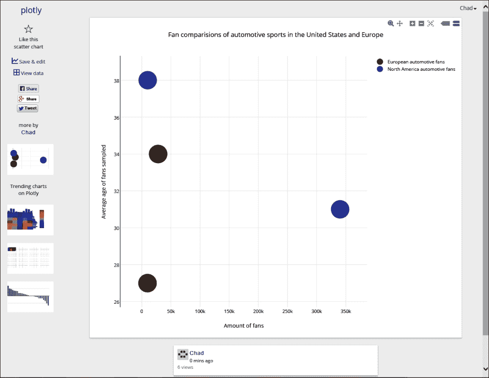

因此，正如我们所看到的，Plotly 非常容易使用，并且有了我们的 pygal 背景，这个将在未来的任何项目中很好地工作。有关 Python 的 Plotly API 的信息，请查看位于[https://plot.ly/Python/](https://plot.ly/Python/)的开发人员网站。

# Pyvot

**Pyvot**([http://pytools.codeplex.com/wikipage?title=Pyvot](http://pytools.codeplex.com/wikipage?title=Pyvot))是一个 Python 数据到微软 Excel 的转换器，是一个非常好用的工具，可以将图表数据或者通用 Python 值导出到 Excel。可以这样使用`pip`安装:

```py
pip install Pyvot

```

也可以用`easy_install`安装:

```py
easy_install Pyvot

```

### 注

有一点需要注意的是，在写完这本书的时候，Pyvot 已经不再由作者维护了，大部分都是被微软工作人员或者微软 MVPs 在 Visual Studio 中用于 Python 的技术演示，所以我们就不在这本书里贴示例代码了。如果您需要 Pyvot CodePlex 网站上的文档，http://pytools.codeplex.com/wikipage?title=Pyvot 会很有帮助。还有一点需要注意的是，Pyvot 在一些 Python 图表项目中是可以常见到的，这主要是因为与 Visual Studio 和 Excel 的紧密集成。

库本身在 Python 2 和 3 项目中仍然运行良好，但是如果需要一个维护的库，请查看:**pyxl**([https://www.pyxll.com/](https://www.pyxll.com/))或**数据硝基**([https://datanitro.com/](https://datanitro.com/))。

以下屏幕截图显示了 Pyvot 的 CodePlex 站点，其中包含下载链接和视频文档演练:

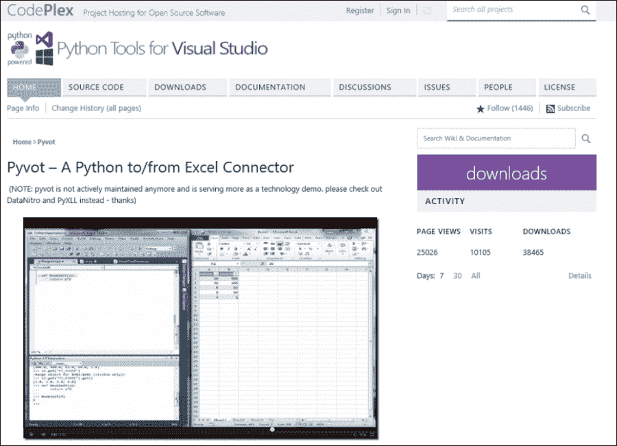

# 总结

在本章中，我们用`matplotlib`和 Plotly 的概述和基本用法来总结。我们通过使用诸如 Pyvot、PyXLL 和 DataNitro 这样的库来导出数据。

这本书的一个收获是，在 Python 语言中，数据可视化的选择非常多。我对新的和当前的 Python 开发人员的建议是，找到一个能很好地满足您的需求和项目目标的库。对于这本书，我们涵盖了`pygal`库，因为它简单且易于使用的文档，如[第 3 章](3.html "Chapter 3. Getting Started with pygal")、*pygal*入门中所述。现在尝试本章中提到的其他一些库，看看什么数据可视化库最适合您。