使用地理处理工具进行分析

到目前为止，您已经了解到 ArcGIS Pro 拥有一些强大的工具来可视化和维护 GIS 数据。*但是关于分析这些信息呢？**它可以帮助您识别需要联系的道路维修工程中的土地所有者，或者获取特定区域内的客户数量吗？** ArcGIS Pro 拥有工具来帮助您回答这类问题以及更多。

通过在 ArcGIS Pro 中使用地理处理工具来回答这类问题。*什么是地理处理？* 简单来说，它是在 ArcGIS 中使用的数据的操作。地理处理工具可以分析数据，将数据从一种格式转换为另一种格式，向表中添加属性字段，或将数据从一种坐标系投影到另一种坐标系。在地理处理工具上能做的事情是无限的。

除了 ArcGIS Pro 中包含的工具外，您还可以购买扩展来增加软件的功能。地理处理框架还为您提供了使用 **ModelBuilder**、**Python** 和其他编程语言创建自定义工具的途径。您将在后面的章节中了解更多关于 ModelBuilder 和 Python 的内容。

在本章中，您将学习如何使用一些最常用的地理处理分析工具来执行空间和表格数据的简单 **地理信息系统** (**GIS**) 分析。此外，您还将了解如何根据分配给您的许可级别和扩展确定可用的工具。随着您在本章中的学习，您将了解以下主题：

+   确定要使用的工具

+   理解分析过程

+   使用其他常见的地理处理工具进行分析

在您开始使用地理处理工具时，需要注意的一点是，其中大多数工具会创建新的数据。这意味着即使您选择了错误的工具或在工具中使用了错误的设置，在大多数情况下，您的原始数据是受到保护的。这提供了一定程度的保护，并有助于让您放心，因为错误操作损坏数据的风险大大降低。

# 第十三章：技术要求

为了完成本章的练习，您必须至少拥有 **ArcGIS Pro 2.6** 或更高版本。基本、标准或高级许可级别均可。

# 确定要使用的工具

有两个因素决定了在 ArcGIS Pro 中您将可以使用哪些地理处理工具。第一个是您的许可级别。第二个是您可能拥有的扩展。让我们来看看这两个项目及其对可用地理处理工具的影响。

在本节中，您将了解您的许可级别如何影响您可用的地理处理工具。您还将了解一些 ArcGIS Pro 的扩展以及它们如何增加分析能力。

## 理解许可级别

如果您还记得第一章中的内容，*介绍 ArcGIS Pro*，ArcGIS Pro 有三个不同的许可级别：

+   **基础**

+   **标准**

+   **高级**

您拥有的许可级别将直接影响您可访问的地理处理工具。

基础级别是最限制性的许可级别，具有最少的地理处理工具。在这个级别上，您将能够访问简单的分析工具，例如**缓冲区**、**并集**和**交集**。您将无法使用允许您在另一个图层中找到最近特征或擦除两个或多个图层之间重叠区域的工具。

标准级别在基础级别可用的所有工具之外还包含一些额外的地理处理工具。其中许多专注于数据管理和维护。例如，标准级别包括在地理数据库中创建关系类的地理处理工具。它还包括用于管理**企业**或**工作组**地理数据库的工具。最后，它包括创建和管理拓扑的工具，允许您根据应用规则验证或检查您的空间数据是否存在错误。

高级许可级别具有最多的地理处理工具。它包括基础和标准许可级别中找到的所有工具，以及更多的分析工具。高级许可将允许您定位到另一个特征最近的特征或计算点之间的距离。它还具有允许您擦除两个或多个图层之间重叠区域的工具，以及许多其他分析工具。

下表显示了 ArcGIS Pro 2.6 中基础和高级许可级别中找到的地理处理工具数量的比较。标准许可级别将介于基础和高级许可级别之间：

| **参数** | **基础** | **高级** |
| --- | --- | --- |
| 分析 | 19 | 29 |
| 制图 | 11 | 41 |
| 转换 | 36 | 42 |
| 数据管理 | 210 | 346 |
| 编辑 | 0 | 17 |
| 地理编码 | 11 | 11 |
| 线性参照 | 7 | 7 |
| 多维 | 11 | 12 |
| 服务器 | 16 | 16 |
| 空间时间模式挖掘 | 9 | 9 |
| 空间统计 | 33 | 33 |
| **总计** | **363** | **563** |

除了可用的地理处理工具之外，每个许可级别还有其他限制。您应该检查 Esri 的 ArcGIS **桌面功能矩阵**以查看许可级别之间的完整差异列表。ArcGIS Pro 将略有不同，因为并非所有在 ArcGIS for Desktop 中找到的功能都已移植到 ArcGIS Pro 中。您可以通过访问[`www.esri.com/content/dam/esrisites/en-us/media/brochures/arcgis-enterprise-functionality-matrix.pdf`](https://www.esri.com/content/dam/esrisites/en-us/media/brochures/arcgis-enterprise-functionality-matrix.pdf)来查看功能矩阵。

许可证级别并不是影响您在 ArcGIS Pro 中执行分析可使用工具的唯一因素。Esri 还创建了几个扩展，提供了额外的分析工具。

在下一节中，我们将简要讨论 Esri 目前为 ArcGIS Pro 提供的扩展，以便您了解它们是什么以及它们是否可能对您有用。

## 了解 ArcGIS Pro 扩展

Esri 还为 ArcGIS Pro 提供了几个您可以购买的扩展。扩展是 ArcGIS Pro 核心产品的附加组件。它们为所有许可级别提供扩展功能。每个扩展都有一个专注于增加功能的功能区域，包括额外的地理处理工具。

目前为 ArcGIS Pro 开发了 19 个不同的扩展。截至版本 2.6，当前的 ArcGIS Pro 扩展包括以下内容：

+   **空间分析器**

+   **3D Analyst**

+   **网络分析器**

+   **地理统计分析师**

+   **数据审查员**

+   **数据互操作性**

+   **图像分析器**

+   **定位 XT**

+   **位置引用**

+   **生产制图**

+   **发布者**

+   **工作流管理器**

+   ****海事制图****

+   **国防制图**

+   **航空机场**

+   **航空图表**

+   **水深测量**

+   **商业分析师**

+   **StreetMap Premium**

每个扩展的名称有助于识别其目的。例如，3D Analyst 扩展包括您可以在 3D 环境中创建和分析数据的工具。网络分析器扩展允许您在如道路网络等线性网络中进行分析，以计算服务区域或确定最短旅行路径或计算两点或多点之间的估计驾驶时间。

要使用前面列出的扩展，不仅需要购买它们，还必须在 ArcGIS Online 或 Portal for ArcGIS 中为用户分配许可证。在接下来的部分中，我们将快速查看前三个扩展——空间分析器、3D Analyst 和网络分析器，它们是最常用的。

### 空间分析器

空间分析器扩展用于使用基于栅格的数据执行空间分析。您可以使用空间分析器扩展执行以下操作：

+   使用**数字高程模型**（**DEM**）进行地形分析

+   计算坡度

+   确定视域

+   执行水文分析

+   对图像进行分类等等

空间分析器扩展包括超过 170 个地理处理工具，这些工具可以在与扩展同名的工具箱中找到：

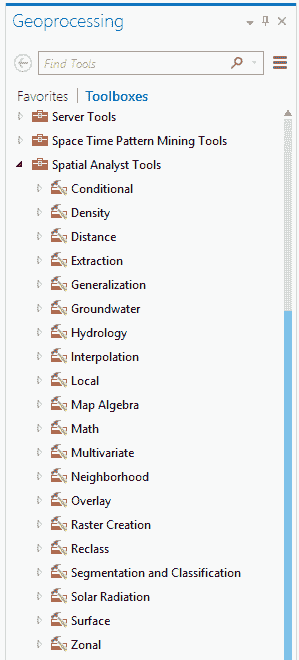

从前面的屏幕截图可以看出，这些地理处理工具被组织在工具箱中的 21 个不同的工具集中。

### 3D Analyst

3D 分析师扩展允许你在 ArcGIS Pro 中处理和分析 3D 数据。它与空间分析师有许多共同工具。主要区别在于 3D 分析师旨在与 3D 向量数据一起工作，而不是栅格数据。它确实有一些创建和分析栅格数据的能力，但这不是它的强项。同时使用 3D 分析师和空间分析师扩展并不罕见。例如，你可能会使用 3D 向量数据，如高程等高线，并使用 3D 分析师创建 DEM，以便与空间分析师扩展进行进一步分析。

3D 分析师允许你处理许多 3D 数据集，包括**不规则三角网**（**TIN**）、**光探测与测距激光**（**LiDAR LAS**）数据集，以及在第八章“编辑空间和表格数据”中讨论的许多其他标准数据格式。如果你的数据没有与之相关联的高程或高度，3D 分析师可以将你的 2D 数据覆盖在表面上，然后使用该表面计算你的特征相对于覆盖表面的高程。

3D 分析师扩展包括超过 100 个地理处理工具，这些工具被分为 11 个工具集：

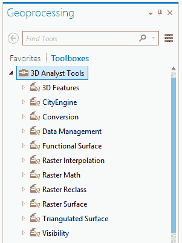

正如你在第四章“创建 3D 场景”中看到的，ArcGIS Pro 支持将 3D 数据作为其核心功能的一部分进行可视化。因此，你可能想知道为什么你需要 3D 分析师扩展。虽然可视化 3D 数据是 ArcGIS Pro 允许你使用任何许可级别直接执行的操作之一，但它并不允许你在 3D 中执行分析。如果你需要在 ArcGIS Pro 中确定诸如坡度或视线或生成**数字高程模型**（**DEM**）等事物，你必须拥有 3D 分析师扩展。

### 网络分析师

网络分析师扩展具有创建和分析网络数据集的工具。网络数据集是一组由节点连接的线性特征，这些节点允许双向流动。这意味着你可以在网络中的线条上沿任意方向移动。网络数据集通常与交通相关的网络相关联，如道路、铁路、人行道或自行车道。这些通常不用于公用事业，因为那些通常是单向流动网络。

使用网络分析师，你可以计算车辆的最佳路线，根据驾驶时间要求确定服务区域，在网络中查找最近的功能，等等。因此，你可能会使用此扩展来帮助根据现有消防站的驾驶时间覆盖范围定位新的消防站。

ArcGIS Pro 的网络分析师扩展目前包括 20 个地理处理工具，这些工具被组织成三个工具集：

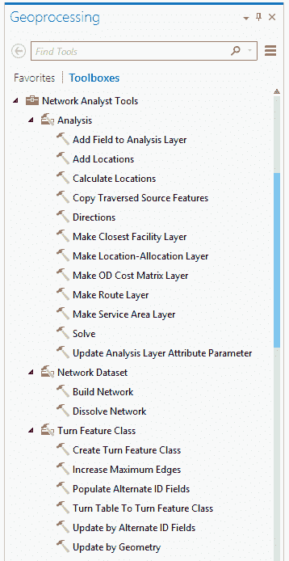

如您从前面的截图中所见，工具的名称应该能帮助您理解它们的作用，并为您提供更多关于网络分析师扩展将允许您做什么的洞察。例如，创建服务区域图层工具将根据位置和网络数据集计算服务区域。构建网络工具创建您用作其他分析扩展基础的网络数据集。

现在您已经了解了许可级别和扩展，接下来的练习将向您展示如何确定分配给 ArcGIS Pro 的许可级别和扩展，以便您可以确定您拥有的功能。

## 练习 10A – 确定您的许可级别和扩展

正如您刚刚学到的，ArcGIS Pro 的许可级别和分配给您的扩展将影响您在 ArcGIS Pro 中能做什么。因此，了解您需要与之合作的许可级别和扩展非常重要。

在这个简短的练习中，您将确定您的许可级别以及（如果有）分配了哪些扩展。如果您是您组织的管理员，您还可以登录到 ArcGIS Online 或 Portal for ArcGIS 以确定分配给每个用户的许可。但是，并非每个人都有管理权限，因此了解您如何从 ArcGIS Pro 中确定这一点很重要。

### 步骤 1 – 打开 ArcGIS Pro

第一步是打开 ArcGIS Pro，然后确定您可用的许可级别：

1.  打开 ArcGIS Pro，就像您在以前的练习中所做的那样。

1.  点击位于打开最近项目窗口左下角的关于 ArcGIS Pro。

问题：*您正在使用哪个版本的 ArcGIS Pro？*

关于 ArcGIS Pro 窗口显示了您正在使用哪个版本的 ArcGIS Pro。它还允许您检查 ArcGIS Pro 是否有任何软件更新。

### 步骤 2 – 确定许可级别和扩展

现在，您将看到您被分配的许可级别以及是否有任何扩展也被分配给您：

1.  在左侧面板中点击许可。

1.  查看您可用的许可。本节将告诉您哪个许可级别可用，而中间部分将告诉您分配给您的扩展。

问题：*您拥有哪个版本的 ArcGIS Pro 许可级别？**您可以使用哪些扩展（如果有）？*

1.  回答完前面的问题后，关闭 ArcGIS Pro。

现在您已经知道了您正在运行的软件版本、分配给您的许可级别以及是否分配了任何扩展，您应该对在 ArcGIS Pro 中可用的功能有更清晰的认识。有了这些关于您要处理的内容的知识，现在是时候看看 ArcGIS Pro 中的分析过程了。

# 理解分析过程

GIS 分析通常从一个问题开始。这个问题可能很简单，比如城市内道路的总长度是多少。它们也可以非常复杂，例如*我需要知道在哪个地方建立我的新业务最好，以便它有水和下水道服务，以及它是否靠近主要道路，以及白天吸引商业客户和晚上吸引家庭的地点*。

这些问题将帮助你开始分析过程。这个过程通常不是线性的。你会发现，一旦你回答了初始问题，它就会引出其他问题，这些问题又从头开始整个过程。因此，一般分析过程看起来是这样的：

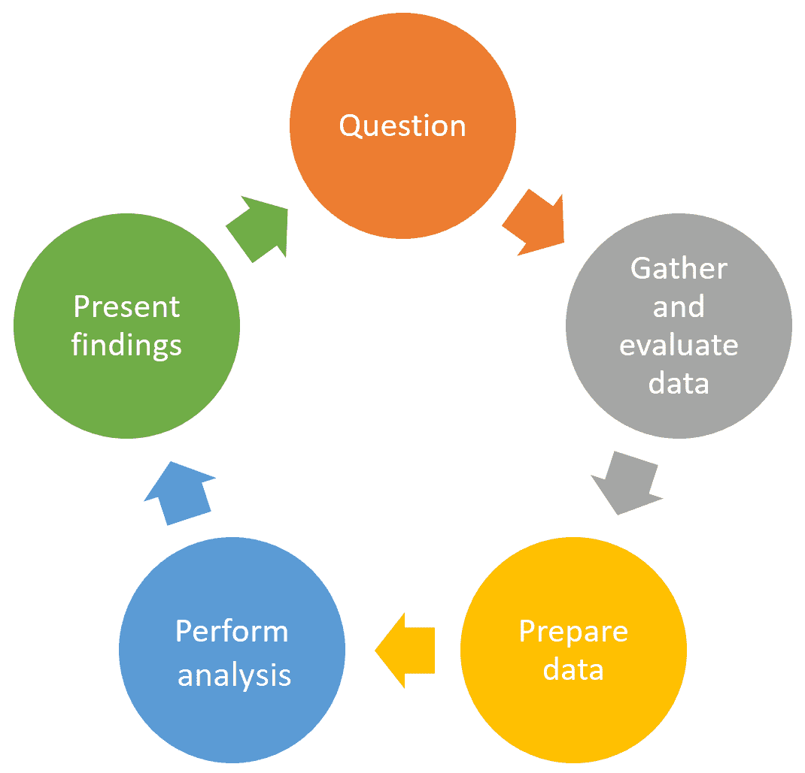

初始问题应该促使你提出问题。问题阶段确立了需要回答的规格和需要回答问题所需的数据。

一旦你确切地知道你试图回答的问题是什么，你便需要开始收集你将用于分析所需的数据。在你收集数据的过程中，你需要对其进行评估。*它是否包含你所需的所有信息？**它是否以你需要的格式存在？**单位是否正确以回答这些问题？*这些都是你在收集用于分析的数据时需要考虑的事项。

接下来，你需要为分析准备你的数据。这可能包括通过裁剪到特定区域来简化它，将其投影到不同的坐标系，转换数据格式，合并图层，泛化信息，或更新它。

一旦你准备好了你的数据，你就可以开始你的分析了。这通常需要使用多个地理处理工具，以及其他工具，如根据属性或位置选择要素。

在你完成分析后，你需要展示你的发现。你可以通过创建地图和布局来实现，正如你已经学到的。你还可以创建图表和图形来展示你的结果。

## 准备分析数据

在收集和评估数据以进行分析时，数据需要一些准备工作以使其处于可用于分析的状态并不罕见。例如，你可能需要从**ArcGIS Online**下载数据，这些数据使用的坐标系与你的主要坐标系不同。因此，你需要将下载的数据投影到你将用于其余数据的坐标系。

常见的数据准备工作包括简化数据、标准化单位、合并图层和更新数据。执行这些任务最广泛使用的地理处理工具如下：

+   **裁剪**

+   **溶解**

+   **项目**

+   **追加**

+   **合并**

这些工具在所有许可级别都可用。我们将在以下各节中了解上述每个工具。

### 裁剪地理处理工具

裁剪工具用于根据其他数据的边界提取数据。例如，如果你想要确定街道的哪些部分位于城市界限内，可以使用裁剪工具将位于城市界限内的街道部分裁剪到它们自己的层中。裁剪工具就像一个*饼干模具*。

此工具可在**分析**工具箱和**提取**工具集中找到。它可以用于裁剪点、线或多边形。然而，裁剪层必须是一个多边形。以下是一个裁剪工具作用的示例：

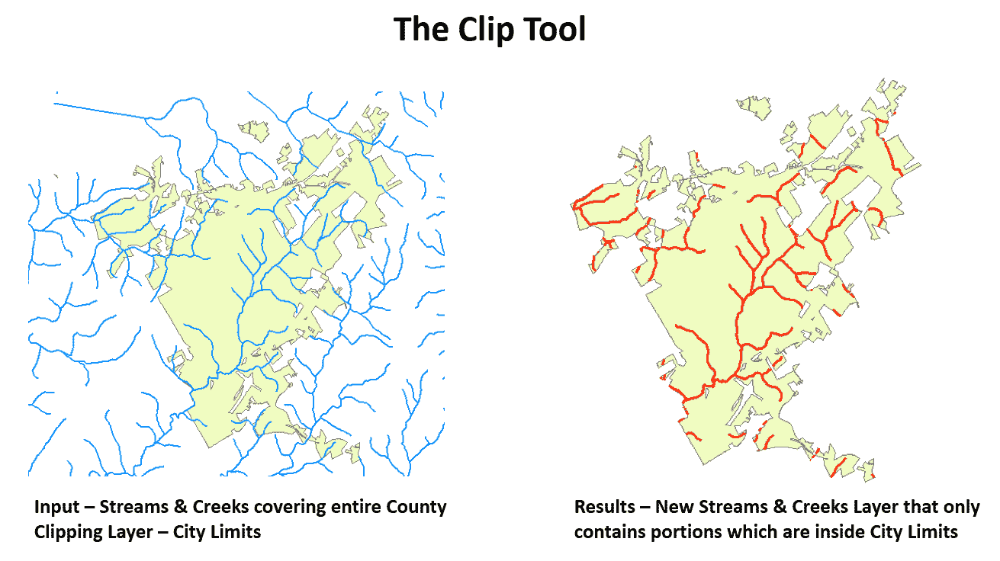

从前面的截图可以看出，我们正在尝试隔离位于城市界限内的溪流和河流的部分。溪流和河流层包含整个县内所有这些地点的位置。在这里，我们使用城市界限层（一个多边形）来裁剪它们，结果是包含仅位于城市界限内溪流和河流部分的新层。

### 溶解工具

溶解工具用于根据公共属性值简化或泛化数据层。例如，如果你有一个地块层，显示了每个地块，每个地块都编码了其指定的分区分类，而你想要知道城市内每个分区分类的总面积，可以使用溶解工具为每个分区分类创建单个多边形。

溶解工具可在**数据管理工具**工具箱和**泛化**工具集中找到。它适用于点、线和多边形。以下是之前描述的示例的插图：

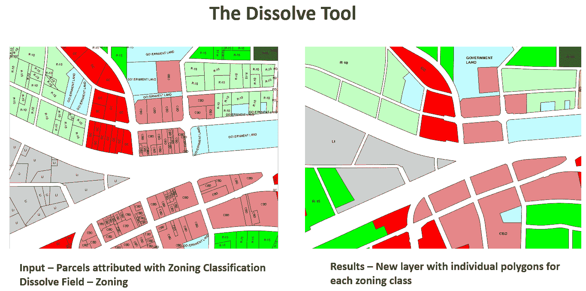

如前一个截图所示，初始地块层包含许多单独的多边形，这将使确定每个分区分类的总面积变得困难。一旦使用溶解工具，就会创建一个新的层，使得每个分区类别只有一个多边形。从那里，确定每个分区类别的总面积变得简单得多。

### 投影工具

投影工具用于将空间层从一个坐标系统移动到另一个坐标系统。重要的是要知道，在坐标系统之间投影数据时，你的要素的实际坐标值必须改变。投影工具将使用适当的数学和转换将现有数据转换为新的坐标系统，从而创建一个新的层，该层位于指定的坐标系统中。

项目工具位于**数据管理工具**工具箱和**投影与变换**工具集中。某些工具和功能与不同类型的坐标系统配合使用效果最佳。存在两种基本的坐标系统类型——**地理**和**投影**。如果你试图测量距离或面积，那么投影坐标系统效果最佳。

尽管 ArcGIS Pro 可以即时投影数据，使得不同坐标系统的数据也能一起显示，但将所有分析数据放置在同一个公共坐标系中是一个推荐的最佳实践。这可以避免由不同单位和转换引起的问题。

这个工具不应与**定义投影**工具混淆，后者位于同一位置。**定义投影**工具将为未定义的特征类分配一个坐标系，但它实际上并不会将数据投影到新的坐标系中。这是新 ArcGIS 用户常见的错误。

### 合并工具

合并工具可以从两个或更多图层或表中提取数据，并将它们合并到一个新的单一输出中。如果你从多个来源或位置获取相同类型的数据，这很有用。例如，假设你正在与一个区域紧急响应小组合作，并试图制定一个区域疏散计划。你从多个司法管辖区接收道路数据。你可以使用合并工具将它们全部合并到一个单独的图层中。

合并工具可以在**数据管理工具**工具箱和**通用**工具集中找到。合并工具可以用于合并点、线、多边形，甚至独立的表格。你只能合并相似的特征，这意味着你只能合并点与点、线与线、多边形与多边形。

这里有一个使用合并工具的另一个例子。你负责清点城市内所有的消防栓。因此，你花了几天时间外出收集这些消防栓的位置。这导致了一个显示你每天收集的所有位置的图层。你希望将所有收集到的位置合并到一个单独的图层中：

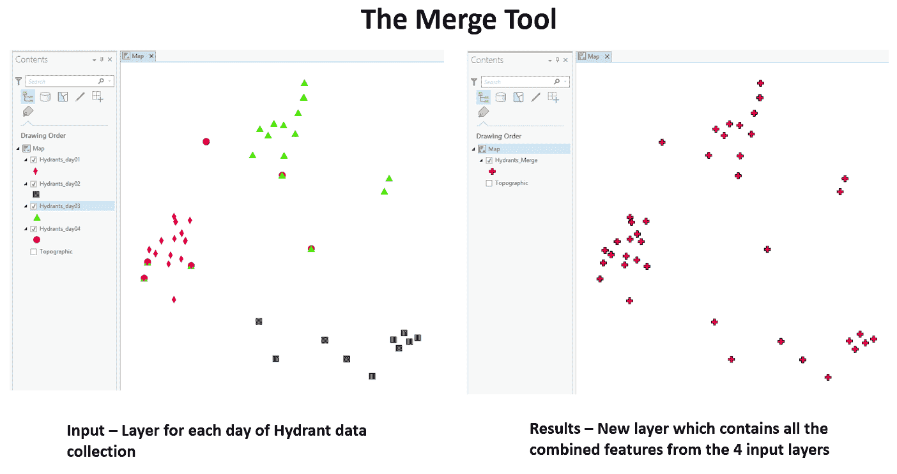

从之前的屏幕截图可以看出，合并工具创建了一个新的图层，其中包含了原来四个单独图层中的所有特征和属性。因此，现在你有一个单独的图层可以管理、更新和分析。

### 追加工具

追加工具与合并工具非常相似。它也将多个图层或表中的数据合并到一个。这两个工具之间最大的区别是，追加是少数几个会改变输入数据的地理处理工具之一。它将特征或记录添加到目标输入中。

如果你有一个现有的信息图层，并且只需要将新获取的数据添加到其中，你可能需要使用追加工具。例如，继续使用之前的消防栓例子，在合并前四天的消防栓数据后，你收集了一些数据。现在，你外出收集更多的消防栓位置。你希望将这些新收集的消防栓添加到合并图层中。

在这种情况下，Append 工具将起作用。它将继续将新收集的位置添加到现有数据层中。它不会不断创建你需要管理的新层。以下截图说明了这一点：

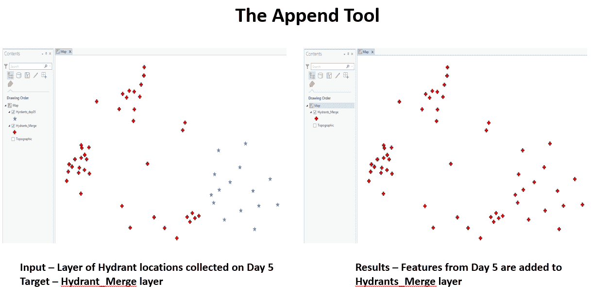

如前一个截图所示，第五天收集层中显示的消防栓已添加到右侧结果中的 Hydrant_Merge 层。这说明了 Append 工具如何将输入层的数据添加到目标层。

现在你已经了解了用于准备分析数据的一些最常用的地理处理工具，是时候通过实际操作来获得一些经验了。在下一个练习中，你将应用你所学的 Clip 和 Dissolve 工具。 

## 练习 10B – 使用 Clip 和 Dissolve 工具

公共工程总监正在准备一份必须提交给市议会以支持其预算请求的报告。他需要知道 Trippville 市内每条道路的总长度。他已经要求你提供这些数字。

幸运的是，你已经在你的地理数据库中有了城市边界和街道数据。然而，街道数据延伸到城市边界之外，并分解为单独的道路段。因此，在你能提供他需要的数字之前，你需要花一些时间来准备数据。

### 步骤 1 – 评估数据

经理已经提供了问题，并且你已经验证了你有完成项目所需的数据。所以现在，你只需要评估你的数据以验证你需要完成项目的步骤。

在这一步中，你将打开 ArcGIS Pro 并查看街道和城市边界数据。你需要确保你拥有所需的信息：

1.  启动 ArcGIS Pro 并打开位于`C:\Student\IntroArcPro\Chapter10\Ex10B`的`Ex10B.aprx`文件。

1.  一旦项目打开，你应该看到包含两个层，即 City_Limit 和 Street_Centerlines 的地图。注意街道延伸到城市边界之外。

问题：*你认为在本章中你读到的哪个地理处理工具应该用来创建一个只包含城市边界内街道的层？*

1.  右键单击 Street_Centerlines 层并选择属性表。

1.  经理需要了解城市中每条道路的总长度。请查看 Street_Centerlines 层，看看是否有字段标识每个路段属于哪条道路。

问题：*哪个字段标识每个路段属于哪条道路？*

1.  关闭表格并保存你的项目。

你现在已经评估了数据，以确定其是否适合提供导演所需的信息。你知道你将不得不提取位于城市界限内的街道中心线部分，并且你有一个可以用来通过它溶解街道段以便轻松计算其长度的标识字段。

### 第 2 步 – 裁剪街道

在这一步，你将裁剪街道中心线，从而创建一个只包含位于城市界限内街道部分的新的图层：

1.  在功能区选择分析标签页。

1.  从位于分析标签页中心的工具组中，选择裁剪。这应该在界面的右侧打开地理处理面板。

如果你看不到裁剪工具，你可以使用工具组右侧的小箭头来展开更多工具。

1.  点击位于输入要素单元格右侧的小下拉箭头，并选择 *Street_Centerlines* 图层。

1.  对于裁剪特征，使用相同的过程选择 *City_Limit*。

1.  确保你的输出要素类字段设置为 `C:\Student\IntroArcPro\Chapter10\Ex10B\Ex10B.gdb\Street_Centerlines_Clip`。

1.  留空 XY 容差字段。你的地理处理面板应该看起来像这样：

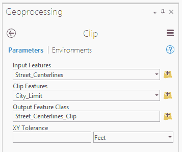

1.  一旦你确认所有设置都正确无误，点击位于地理处理面板底部的**运行**按钮。

如果你任何时候都不确定一个工具会做什么，或者各种参数指的是什么，请定位到地理处理面板右上角周围带有圆圈的蓝色问号，并点击它。

这将打开工具的帮助文档。这将为你提供工具的详细描述，预期的使用案例，以及所有参数的描述。它还将包括一些你可以使用的示例 Python 脚本代码，如果你正在创建包含你正在审查的工具的脚本。你将在第十二章使用 ModelBuilder 和 Python 自动化流程中了解更多关于 Python 的内容。

当裁剪工具完成后，将在你的地图中添加一个名为 Street_Centerlines_Clip 的新图层。

1.  关闭或移除 Streets_Centerlines 图层，以便更好地查看裁剪工具的结果。

1.  右键单击你刚刚创建的新图层，并选择属性表。

1.  右键单击 ST_NAME 字段，并选择升序排序。这将根据每条路的名字对记录进行排序。

问题：*在表格中排序记录后，你注意到每条路的段落数有什么特点？*

因此，现在，你可以看到剪辑工具如何创建了一个只包含位于城市界限内的道路部分的新图层。你的原始图层保持不变。你几乎准备好向导演提供他需要的信息了。然而，你仍然需要简化数据，这样你就可以更容易地计算每条道路的总长度。

让我们继续下一步，关于简化数据。

### 第 3 步 – 简化数据和计算总长度

在这一步中，你将使用溶解工具简化你在上一步中创建的剪辑道路中心线层。这将在你地图中创建另一个新图层：

1.  在功能区点击分析标签。

1.  在地理处理组标签页中点击工具箱按钮。这将再次激活或打开地理处理面板。

1.  在地理处理面板顶部，选择工具箱，它位于收藏夹的右侧。这将显示包含在 ArcGIS Pro 中的所有工具箱以及你可以访问的任何扩展。

1.  展开数据管理工具箱。

1.  展开位于数据管理工具箱中的通用化工具集。

1.  双击溶解工具。

1.  使用与剪辑工具相同的流程将输入要素字段设置为 Street_Centerlines_Clip。

1.  将输出要素类字段设置为`C:\Student\IntroArcPro\Chapter10\Ex10B\Ex10B.gdb\Street_Centerlines_Dissolve_Name`。

1.  将溶解字段设置为 ST_NAME。溶解工具现在应该看起来像这样：

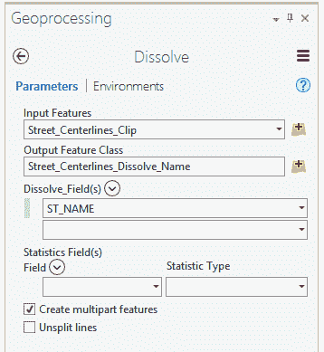

1.  一旦你确认溶解工具配置正确，点击运行按钮。

1.  再次添加一个新图层到你的地图中。右键点击这个图层并选择属性表。

1.  右键点击 ST_NAME 字段并选择升序排序。

1.  滚动记录列表。注意与每个道路名称关联的记录数量。

问题：*有多少条记录具有相同的道路名称？*

现在，信息已经准备好提供给导演。随着溶解完成，你有一个包含每条道路及其关联的总长度在**Shape_Length**字段中的列表。

在这一步中，你使用了溶解工具简化数据，以便你能够轻松地向导演提供他请求的值。溶解工具的结果已按名称总结了城市内每条道路的总长度。接下来，我们将继续进行最后一步，以满足导演的要求：将数据导出到 Excel 电子表格中。

### 第 4 步 – 将表格导出到 Excel

导演赞赏你的努力。然而，他没有 ArcGIS Pro。因此，他询问你是否可以将结果导出到 Excel 电子表格中。这将使他能够轻松地将你的结果纳入他的报告中。

在这一步中，你将使用**转换**工具箱中的工具将你努力的成果导出到一个**Excel**电子表格中：

1.  通过单击面板左上角带有圆圈的箭头，返回地理处理面板中的工具箱列表。

1.  展开转换工具箱，然后展开 Excel 工具集。

1.  选择“表到 Excel”脚本工具。这个特定的工具实际上是一个**Python 脚本**。位于工具名称旁边的滚动图标标识了它。

1.  将输入表设置为`Street_Centerlines_Dissolve_Name`。

1.  将输出设置为`C:\Student\IntroArcPro\Chapter10\Ex10B\Street_Lengths_by_Name.xls`。

1.  确认你的地理处理面板看起来如下，然后单击运行按钮：

当“表到 Excel”工具完成时，它不会将生成的 Excel 电子表格添加到你的地图中。如果你希望查看结果，请启动**Microsoft Excel**并打开你刚刚创建的电子表格。它应该看起来与你在 ArcGIS Pro 中查看的表格非常相似。

1.  关闭地理处理面板并保存你的项目。

1.  关闭 ArcGIS Pro。

恭喜！你刚刚使用 ArcGIS Pro 完成了第一个分析项目。接下来，我们将查看一些其他常用的分析工具。

# 使用其他常见的地理处理分析工具

在 ArcGIS Pro 中，有超过 300 个地理处理工具可用，你只是刚刚开始接触你可以使用 ArcGIS Pro 执行的分析类型。ArcGIS Pro 还包括允许你执行数据空间分析的工具。这可以分解为几个工具集，包括分析工具箱中的**叠加**、**邻近**和**统计**。我们将在接下来的章节中了解每个工具集。

## 叠加分析

叠加分析比较两个或多个图层，并定位它们相互重叠的区域。根据你使用的工具，你可以确定它们重叠的区域，擦除重叠的区域，或者合并所有输入的总区域。

叠加工具集包括以下工具：

| **工具名称** | **最低许可级别** | **简短描述** |
| --- | --- | --- |
| 擦除 | 高级 | 它从输入特征中裁剪出重叠区域。 |
| 标识 | 高级 | 它计算重叠和非重叠区域。 |
| 交集 | 基础 | 它仅返回重叠区域。 |
| 并集 | 基础 | 它合并输入多边形的总面积。 |
| 更新 | 高级 | 它用新特征替换重叠区域。 |
| 空间连接 | 基础 | 它根据空间关系将一个特征的属性连接到另一个特征。 |
| 对称差集 | 高级 | 它识别特征不重叠的区域。 |

ArcGIS Pro 引入了一个新的**成对**工具集，它也执行叠加分析。该工具集中的工具旨在与非常大的数据集一起使用。它们将提供与标准叠加工具创建的类似结果。

现在，我们将更详细地探讨所有许可级别都可用的一组叠加分析工具，即**并集**和**交集**。

### 并集

并集工具接受多个多边形层的输入，并将所有信息合并到一个包含所有输入层（通常是两个或更多）数据的单个要素类中。重要的是要记住，此工具仅适用于多边形。它不能用于点或线。如果您需要在点或线上执行此类分析，您将需要使用**识别**工具。

如果您希望确定每个地块在洪泛区面积中的比例以及每个地块不在洪泛区面积中的比例，您可能会使用并集工具，如下面的截图所示：

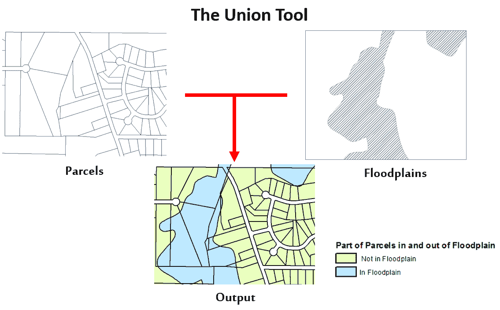

如您所见，结果是包含来自每个重叠地块部分和两个层不重叠部分的属性的新层或要素类。同样，您的原始输入仍然完好无损。

### 交集

交集工具接受多个输入层，并返回一个新层，显示输入重叠的位置。结果层的属性表将包含所有输入的组合属性。此工具适用于所有要素类型；也就是说，点、线和多边形。如果您输入多个要素类型，您可以选择您的输出类型将是什么。

如果您正在为您的社区制定紧急疏散计划，您可能会使用交集工具。例如，您可能需要确定哪些道路可能会因洪水而堵塞，因此您需要知道哪些路段位于洪泛区。您可以使用交集工具将**街道中心线**与洪泛区叠加，以确定每条道路在洪泛区内的哪些部分以及这些部分的风险程度，如下面的截图所示：

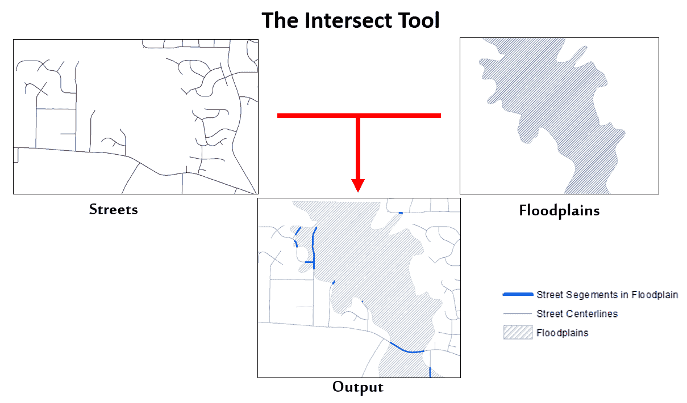

在这种情况下，交集工具的结果输出是一个新层，仅包含位于洪泛区内的街道部分。与其他工具一样，您的原始输入层没有任何改变。

让我们继续介绍下一个工具集——邻近。

## 邻近分析

邻近分析比较、计算或显示两个或更多层之间的要素距离。邻近工具将生成距离缓冲区、定位最近要素或计算要素之间的距离。

包含在邻近工具集中的工具如下：

| **工具名称** | **最低许可级别** | **简短描述** |
| --- | --- | --- |
| 缓冲区 | 基础 | 它在现有要素周围创建一定距离的多边形。 |
| 多环缓冲区 | 基础 | 它可以在各种距离处创建多个缓冲多边形。 |
| 创建泰森多边形 | 高级 | 它在点周围创建多边形，显示影响区域。 |
| 近邻 | 高级 | 它确定输入层和最近要素层之间最近要素的距离。 |
| 生成近邻表 | 高级 | 它创建一个新的独立表，显示两个层中要素之间的距离。 |
| 多边形邻居 | 高级 | 它确定哪些多边形与源多边形相邻，并计算其他相关信息。 |

接下来，我们将快速查看前面表格中提到的**缓冲**和**多重环缓冲**工具。

### 缓冲工具

缓冲工具是 ArcGIS 中最常用的工具之一。它根据指定的距离在输入层周围创建一个新的多边形层。缓冲距离可以是一个单一值，也可以基于被缓冲要素属性表中的属性字段。你可以选择缓冲任何要素类型。你可以缓冲点、线或多边形。

然而，输出始终是一个多边形，如下面的截图所示：

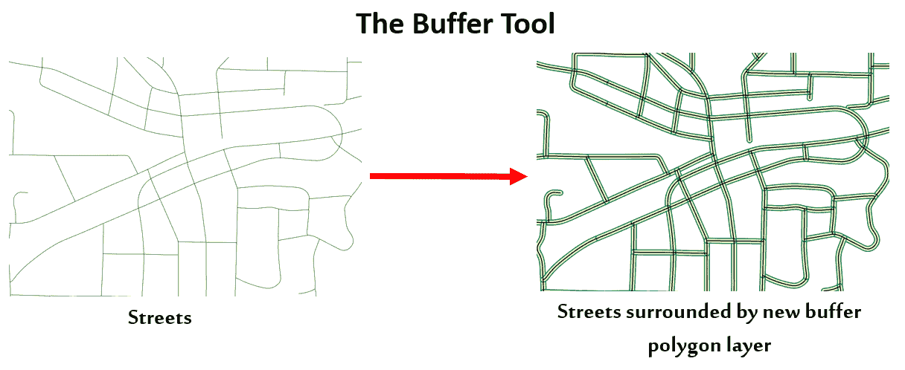

缓冲区非常有用。它们可以帮助我们确定一个层中的要素是否在另一个层的距离范围内。它们还可以帮助我们创建用于其他目的的要素，例如创建道路或铁路的通行权，如前面的截图所示。

在这个示意图中，你可以看到在现有的街道中心线周围创建了一个新的多边形层，所有这些都在一个均匀的距离上。这个新的层代表了这些道路的通行权。此外，每个新的多边形都继承了被缓冲的街道的属性值。这意味着新的多边形被分配给了道路名称以及任何与街道段关联的其他属性。

当使用缓冲工具时，你可以选择溶解重叠的缓冲区。如果你选择溶解重叠的缓冲区，那么任何重叠的缓冲区都将合并成一个单一的多边形。这减少了结果层中的要素数量。此外，如果你选择溶解重叠的缓冲区，新的多边形将不会包含与被缓冲的要素关联的属性信息。

下面的截图显示了已溶解和未溶解的缓冲区的区别：

如你所见，左边的未溶解示例比右边的溶解示例包含更多的多边形。左边的示例有许多重叠的缓冲区，所以如果它们被溶解，它们将合并成一个。

### 多重环缓冲工具

多重环缓冲工具是一个 Python 脚本，它多次运行缓冲工具，在缓冲要素周围创建同心缓冲环，如下面的截图所示：

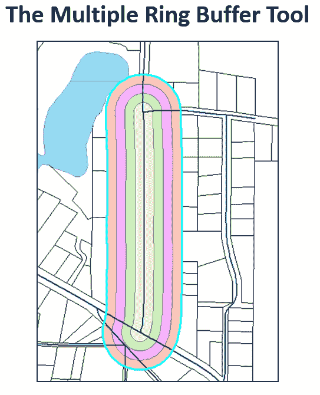

与标准“Buffer”工具一样，“多重环形缓冲区工具”与点、线和多边形一起工作，但只输出新的多边形图层。您还可以选择溶解重叠的缓冲区。

现在您已经有机会了解一些最常用的分析地理处理工具，让我们给您一个机会将它们付诸实践。

## 练习 10C – 执行分析

记得在第四章“创建 3D 场景”中，当社区和经济发展总监要求您准备几张显示 1 到 3 英亩之间商业地产位置的地图时？在与商业主人的会议之后，他需要更多关于这个项目的帮助。

他需要您定位到距离现有城市下水道线 150 英尺以内的商业地产，并且至少有 1 英亩不在洪水平原内。

### 第 1 步 – 定位靠近下水道线的商业地产

您分析的第一步将是定位所有大小在 1 到 3 英亩之间，并且距离现有下水道线 150 英尺以内的商业地产。幸运的是，您在第四章“创建 3D 场景”中已经确定了符合大小要求的商业地产，所以这部分已经完成。因此，现在您只需要确定其中哪些位于下水道线 150 英尺范围内。

在这一步中，您将在城市下水道线周围创建一个 150 英尺的缓冲区。然后，您将执行空间选择，以选择所有大小在 1 到 3 英亩之间，并且与您创建的缓冲区接触或相交的商业地产：

1.  启动 ArcGIS Pro。

1.  打开位于`C:\Student\IntroArcPro\Chapter10`的`Ex10C.aprx`项目。

当项目打开时，您应该看到一个看起来非常熟悉的地图，就像您在第四章中创建的“创建 3D 场景”一样。这张地图已经包含了您进行分析所需的所有基本图层。您可以看到 1 到 3 英亩之间的商业地产、下水道线和洪水平原。现在，您需要围绕下水道线创建 150 英尺的缓冲区。

1.  在功能区中选择“Analysis”标签。

1.  选择“Buffer”工具以打开“Geoprocessing”面板和“Buffer”工具参数。

1.  使用您在上一练习中学到的技能，将“Input Feature class”设置为“Sewer Lines”。

1.  将您的输出要素类设置为`C:\Student\IntroArcPro\Chapter10\Ex10B\Ex10B.gdb\sewer_lines_Buffer`。

1.  将“Distance”字段设置为`150`，并将单位设置为英尺。

1.  保持“Side Type”、“End Type”和“Method”字段使用默认设置。

1.  将“Dissolve Type”字段设置为“将所有输出要素溶解为单个要素”。由于您不需要知道哪条下水道线靠近哪个地块，这允许 ArcGIS Pro 溶解生成的缓冲区，从而使得未来的分析更加容易。

1.  确认您的“Geoprocessing”面板看起来如下，然后点击“运行”：

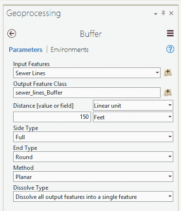

一旦你完成使用 Buffer 工具，你的地图上将会添加一个新的图层。这个新图层将显示距离下水道管线 150 英尺范围内的区域。你现在将使用这个新图层来选择商业地产。

1.  在功能区中点击地图标签页。

1.  在地图标签页上的选择组中，选择“按位置选择”按钮。

1.  按位置选择工具窗口将打开。将输入要素图层设置为商业地产 1 至 3 AC。

1.  将关系字段设置为相交。这将选择所有被下水道线缓冲图层覆盖的 1 至 3 英亩的商业地产。

1.  将选择要素字段设置为 sewer_lines_Buffer。

1.  保持所有其他参数的默认设置。

1.  验证按位置选择工具窗口看起来如下，然后点击确定：

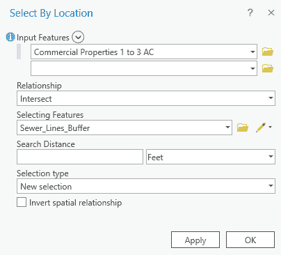

当按层位置选择过程完成后，你应该有大约 18 个商业地产被选中。所有这些地块都与你创建的下水道线缓冲区重叠或接触。这意味着它们都位于现有下水道线 150 英尺范围内。你现在将把这些选中的地块导出到它们自己的图层中。

### 第 2 步 - 导出选定的地块

既然你已经确定了哪些商业地产位于下水道管线 150 英尺范围内，你将把它们导出到一个新的要素类中，以便你可以在以后进行进一步分析。这将确保你不会意外地更改或损坏现有的图层：

1.  在内容窗格中选择商业地产 1 至 3 AC。

1.  在要素图层组中选择数据标签页。

1.  在数据标签页中点击导出要素按钮，打开导出要素工具窗口。

1.  输入要素字段应自动设置为商业地产 1 至 3 AC。如果不是，请将其设置为该图层。

1.  将输出要素类字段设置为`C:\Student\IntroArcPro\Chapter10\Ex10\Ex10B.gdb\CommercialProp_near_sewer`。

1.  验证你的导出要素窗口看起来如下，然后点击确定：

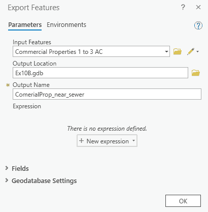

当 Copy Features 工具的处理过程完成后，你的地图上将会添加一个新的图层，其中只包含你之前选择的商业地块。如果你在地图或表格中选择了要素，大多数地理处理工具将自动只使用该工具中选择的记录。

1.  打开你地图上刚添加的 CommercialProp_near_sewer 图层的属性表。

1.  验证表格包含与之前选择相同数量的记录。应有大约 18 条。

1.  通过在地图标签页上的选择组中点击清除按钮来清除你的选择。

1.  关闭表格。

1.  关闭下水道管线、卫生下水道检查井、下水道线缓冲区以及商业地产 1 至 3 AC 图层。你不需要在接下来的分析中看到这些图层，它们可能会引起混淆。

1.  保存你的项目。

您已成功将选定的要素导出到新的要素类中，同时保留了原始数据。您将在下一步中使用您刚刚创建的新要素类来执行分析，以确定有多少商业属性位于洪泛区内。

### 第 3 步 – 确定每个商业属性中有多少位于洪泛区

现在您已经选择了所需大小且靠近城市下水道系统的商业属性，是时候计算这些地块中有多少面积位于洪泛区内了。为此，您将使用联合地理处理工具将您刚刚创建的新图层与洪泛区联合起来。

这将创建一个新图层，将每个商业属性分割成位于洪泛区内的部分和不在的部分：

1.  使用您已经学到的技能，打开 CommercialProp_near_sewer 和洪泛区层的属性表。花点时间查看每个表中包含的字段以及它们包含的一些值。这将帮助您理解联合工具产生的结果。

1.  关闭表格。

1.  在功能区中单击分析选项卡。

1.  从工具组中选择联合工具。现在，地理处理面板将显示与联合工具相关的参数。

1.  将您的输入要素类设置为商业属性 1 到 3 AC 和洪泛区。

1.  将您的输出要素类设置为 `C:\Student\IntroArcPro\Chapter10\Ex10B\Ex10B.gdb\Commercial_Floodplain_Union`。

1.  一旦您确认您的地理处理面板看起来如下，请单击运行：

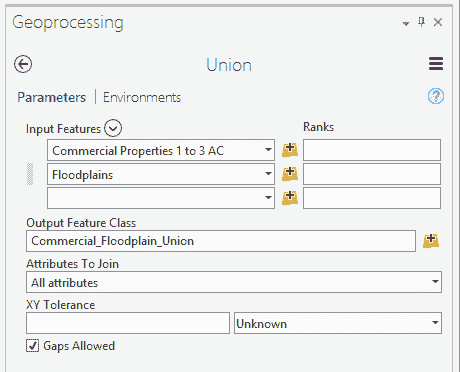

当联合工具的处理过程完成后，它将在您的地图中添加一个新图层，该图层包含结合两个输入层的特征。您的地图应该看起来类似于以下（记住，您的颜色可能不同）：

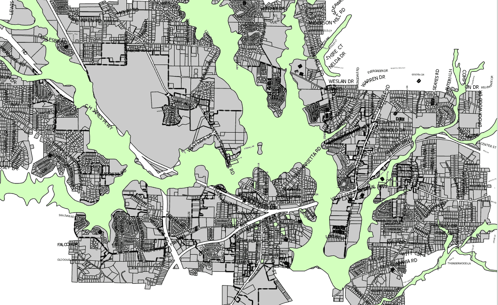

如您所见，地图上的绿色图层是联合工具的结果。

1.  打开您刚刚创建并添加到地图中的图层的属性表。

1.  在 SFHA 字段上选择降序排序。所有被分配给 IN 的多边形都在洪泛区内。所有空白或 NULL 的都在洪泛区外。

1.  您需要更新 ACRE_CALC 字段以反映 Commercial_Floodplain_Union 的新面积。右键单击 ACRE_CALC 字段并选择计算字段选项。

如果计算字段选项变灰，请确保在内容面板上按可编辑列表编辑层是可编辑的。如果层不可编辑，则无法运行计算字段或**计算几何**工具。

1.  将表达式类型字段设置为 Arcade，使用下拉箭头进行设置。

1.  在字段列下方找到的“ACRE_CALC =”表达式单元格中，输入`$feature.Shape_Area / 43560`。这将把以平方英尺为单位的 Shape_Area 字段值转换为英亩。完成输入后，它应看起来像这样：

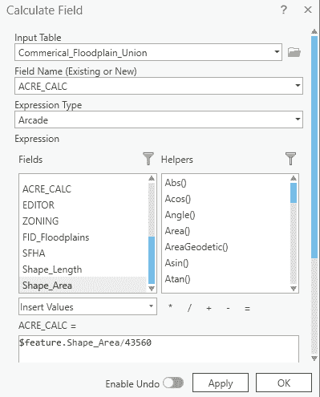

1.  验证完表达式后，点击“确定”。

1.  关闭表格并保存您的项目。

通过使用并集工具确定每个商业地块在洪水平原内外的比例，然后使用字段计算器工具计算每个地块的总面积（以英亩为单位），以便您能够完成下一步。在下一步中，您将构建一个查询，以选择所有不在洪水平原内且面积大于或等于 1 英亩的商业地块。

### 第 4 步 – 选择不在洪水平原上的商业地块

在此过程中使用并集工具的一个问题是，结果图层还包括了不与商业地块重叠的洪水平原多边形的部分。这意味着您需要通过移除位于洪水平原中的多边形来简化该图层，或者在查询中考虑它们。如果您拥有高级许可证，您可以使用身份工具，这将避免此步骤。

在此步骤中，您将选择至少有 1 英亩或更多不在洪水平原上的商业地块：

1.  在功能区中点击“地图”标签。

1.  点击“按属性选择”按钮以打开工具窗口。

1.  确认“输入行”设置为 Commercial_Floodplain_Union。如果不是，相应地设置。

1.  选择类型字段应设置为“新选择”。

1.  点击“新建表达式”按钮。

1.  在单词“Where”之后，将字段设置为分区，并将后续运算符设置为`不等于`。对于值，选择列表顶部的空白选项并点击添加。这将消除仅代表不与商业地块重叠的洪水平原区域的折线。

1.  在您刚刚创建的子句下方点击“添加子句”按钮。

1.  将查询字段设置为 ACRE_CALC，并将后续运算符设置为`大于或等于`。输入值为`1.00`并点击添加。这将选择所有正确大小的商业地块。

1.  再次点击“添加子句”按钮。

1.  将查询字段设置为 SFHA，并将运算符设置为`不等于`。然后，将值设置为 IN 并点击添加。这将从最终选择中移除任何位于洪水平原内的区域。

1.  点击绿色的勾选标记以验证查询。您的地理处理面板应类似于以下内容：

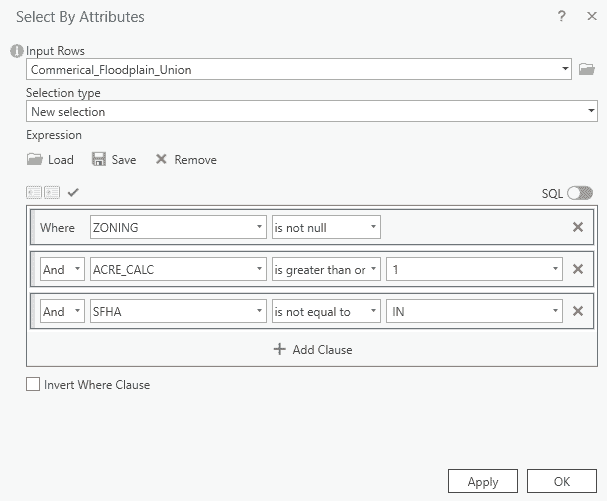

1.  验证一切设置正确后，点击“确定”。完成后，您应该有 21 个商业地块被选中。这些地块的面积都应大于 1 英亩，并且位于洪水平原之外。

1.  使用您在上一步中学到的技能，将您的选择导出到一个新图层。为新图层设置符号，使其更加突出。

1.  关闭“Commercial_Floodplain_Union”图层，以便您的新图层更加突出。

1.  保存您的项目。

有了这些，您刚刚已经确定了符合主任要求的城市内的地块。您使用了各种分析和选择工具来回答他的问题。正如您所看到的，使用多个工具和方法来获取看似简单问题的答案并不罕见。信不信由你，一旦您熟悉并习惯了这些工具，您刚才完成的过程可以在不到 10 分钟内完成。这只需要练习。

接下来，您将学习如何访问在 ArcGIS Pro 中使用的所有地理处理工具的历史记录。

### 第 5 步 – 查看您的地理处理历史记录

您刚才完成的分析过程涉及许多步骤。*如果不是有笔记可以参考的练习，您将如何知道完成分析所使用的所有步骤和工具？* 幸运的是，ArcGIS Pro 记录了您使用的地理处理工具、包含在那些工具中的参数以及遇到的任何结果或错误。这为您提供了到达结果的工作记录。

在本步骤中，您将学习如何访问您地理处理活动的历史记录：

1.  在功能区中单击“分析”选项卡。

1.  在“分析”选项卡上的“地理处理”组中单击“历史记录”按钮。这将打开历史记录窗格。

1.  抽空查看历史记录窗格中可见的记录。您应该看到在本章中使用的所有地理处理工具，以及您可能在之前的章节或日常活动中使用过的其他工具。

1.  在历史记录窗格中右键单击“剪辑”工具，从菜单中选择“查看详细信息”选项。这看起来如下所示：

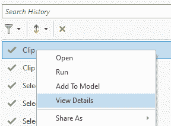

1.  当您运行此“剪辑”工具实例时，ArcGIS Pro 应该会打开一个新窗口，显示该实例的历史记录。花点时间查看此窗口中的信息。

当一个工具无法成功运行时，这个信息窗口非常有用。它将为您提供一系列错误和警告，这些错误和警告可能解释了导致工具失败的原因。

1.  审查完“剪辑”工具的历史记录后，关闭窗口。

1.  再次右键单击“剪辑”工具以显示菜单。查看它包含的选项。

1.  保存您的项目并关闭 ArcGIS Pro。

现在，你已经知道了如何在 ArcGIS Pro 中访问你所使用的所有地理处理工具的历史记录。这让你能够查看完成分析所使用的工具，确定可能导致工具失败的原因，以及更多。你也可以使用历史面板中显示的相同设置重新运行工具。这可以帮助你节省时间，无需再次输入所有参数来运行工具。正如你所看到的，历史面板在你需要执行分析时可以成为一个强大的盟友。

# 摘要

在本章中，你了解到 ArcGIS Pro 可以用于进行空间分析，以帮助回答大量的问题和关注点。它还可以帮助你看到模式和解决方案。你现在有了使用各种类型的数据来获取你需要的日常问题答案的强大地理处理工具的技能。

在本章中，你还学习了地理处理是什么，以及 ArcGIS Pro 中可用的某些工具。然后，你学习了你的许可级别和扩展如何影响当你需要执行分析或管理 GIS 数据时可以使用的特定工具。

本章还向你介绍了最常用的分析和数据准备工具。你使用这些工具进行了两个独立的分析项目。凭借你所获得的技术和实际操作经验，你可以将这些工具与其他你已经接触过的工具集成，以找到答案。

有了这些，你已经学到了许多技能，包括使用 ArcGIS Pro 创建项目、地图、场景和布局，以及如何编辑和分析数据。你还看到，执行同一任务通常有不止一种方法。

在下一章中，你将探索任务，这可以使你标准化工作流程，帮助培训新用户，记录正确的工作流程，并确保每个人都使用相同的方法来完成常见过程。
