创建和使用任务

如您亲身体验到的，ArcGIS Pro 包含大量用于编辑数据、创建地图和执行分析的工具和方法。在许多情况下，有二三种不同的方法来完成同一件事。此外，许多地理处理工具非常相似，例如**合并**、**相交**和**身份**。尽管它们相似，但每个都是为特定情况设计的。

所有这些不同的工具和方法使 ArcGIS Pro 成为一个非常强大的应用程序。然而，它也可能使新用户感到困惑，并允许经验丰富的用户以非常不同的方式执行功能。这可能导致不准确或错误的结果。如果您能够开发出每个人都可以使用且需要逐步说明以完成特定任务的标准化工作流程，事情将会简单得多。

使用 ArcGIS Pro，您确实可以做到这一点。它们被称为**任务**。任务提供可以与项目一起保存的逐步工作流程。您可以为项目保存的任务数量没有限制。您可以将它们保存并共享到网络文件夹、ArcGIS Online、ArcGIS 门户等。

在本章中，您将学习如何在 ArcGIS Pro 中创建和使用任务。这包括以下主题：

+   任务是什么以及创建任务前需要考虑的事项

+   如何创建一个任务

+   如何使用任务

完成本章后，您将更好地理解任务是什么，如何创建一个，更重要的是，如何使用它们来标准化组织中的常见工作流程。

# 第十五章：技术要求

要完成本章的练习，您需要安装**ArcGIS Pro 2.6**或更高版本。任何许可级别都将被接受。

# 理解任务是什么

简而言之，任务是一系列预配置的步骤，用于完成特定的过程。任务可以非常简单，只包含三四个步骤，或者它们可以非常复杂，包含任务内的组任务，并且每个组可以包含多个步骤。这完全取决于任务的用途和使用任务的人员的技能水平。任务允许您对用户受众的详细程度进行详细说明。

本节将帮助您了解任务的组件。我们还将通过运行任务的练习获得一些实际操作经验。

任务存储在 ArcGIS Pro 项目中的**任务项**内。您可以通过目录窗格访问您的任务。当您打开一个特定的任务时，它将出现在一个名为任务窗格的新窗格中。

## 任务组件

您在 ArcGIS Pro 中创建的每个任务都将由几个组件组成。它们如下：

+   **任务项**：第一个是**任务项**，它存储在项目中。它基本上是一个用于存储项目内相关任务的文件夹。您将像以下截图所示，从目录窗格访问任务项：

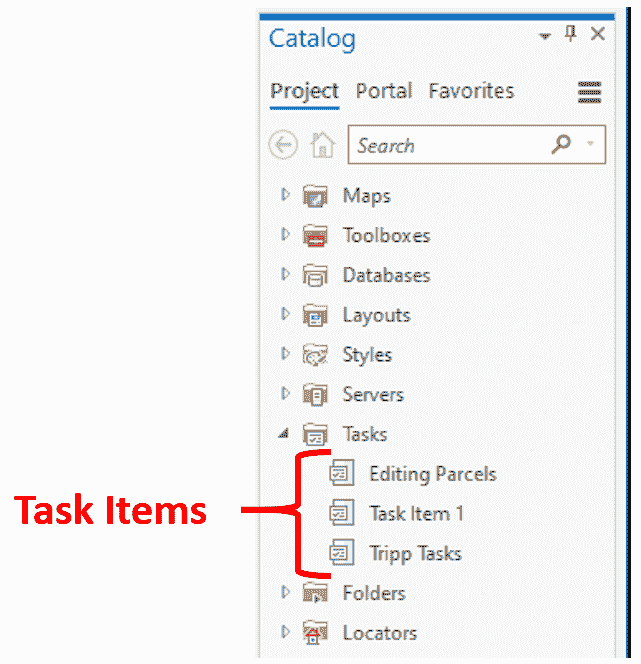

+   **任务组**：第二个组件是**任务组**。任务组是任务项内的子文件夹，用于按功能或目的对相关任务进行分组。下面的截图显示了任务组的示例：

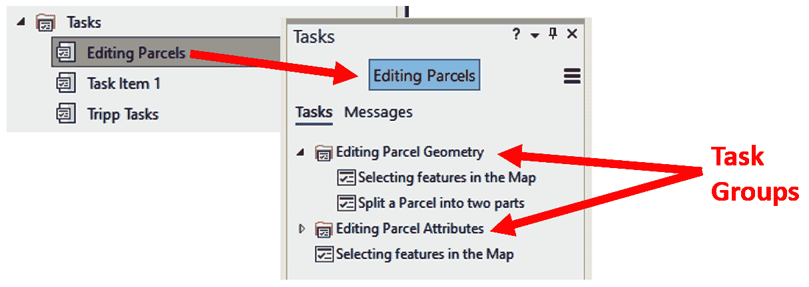

如前一个截图所示，您可以在其他任务组内部创建任务组，就像您可以在 Microsoft Windows 中的其他文件夹内部创建文件夹一样。这允许您为存储任务创建一个组织结构，以便更容易找到和管理。

+   **任务**：第三个组件是**任务**本身。这是一个包含完成给定过程所需步骤的集合，例如拆分包裹、添加新的水管或对新的地址进行地理编码。任务可以存储在任务组或独立任务中，如下面的截图所示：

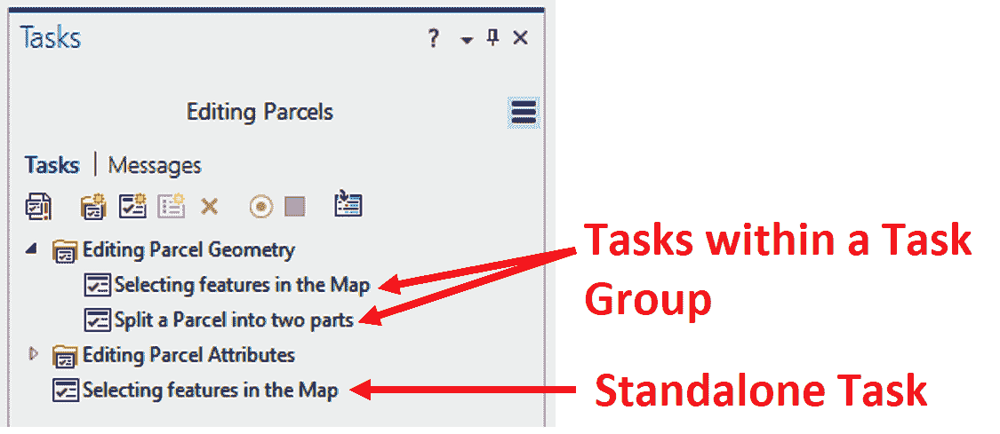

+   **步骤**：最后一个组件是**步骤**。任务通常包含多个步骤。步骤指的是在 ArcGIS Pro 中可访问的动作、按钮、地理处理工具、模型或脚本。一个常见的步骤是使用**探索**工具缩放到要素的位置。另一个例子是在用户缩放到正确区域后选择一个特定的要素：

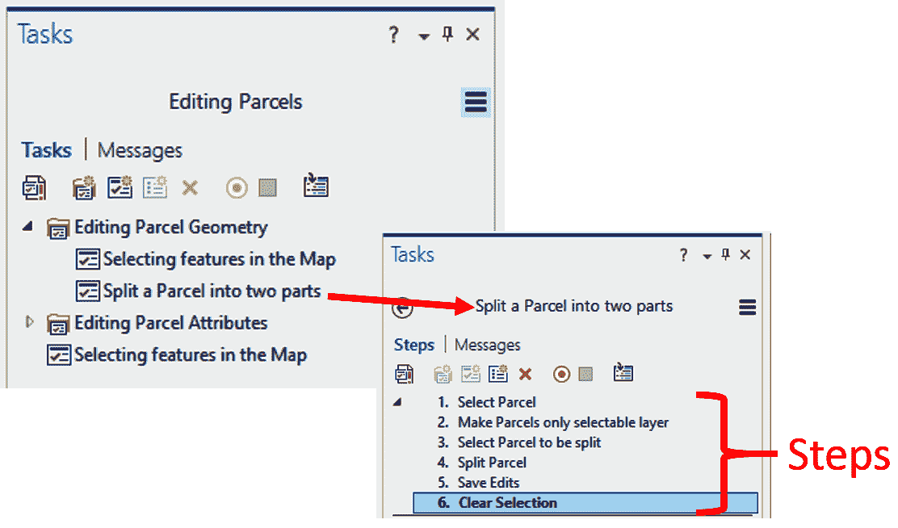

每个步骤都将有几个您可以为此步骤设置的参数。您将提供有关每个步骤的一般信息，例如名称、用户遵循的说明以及步骤的运行方式，如下面的截图所示：

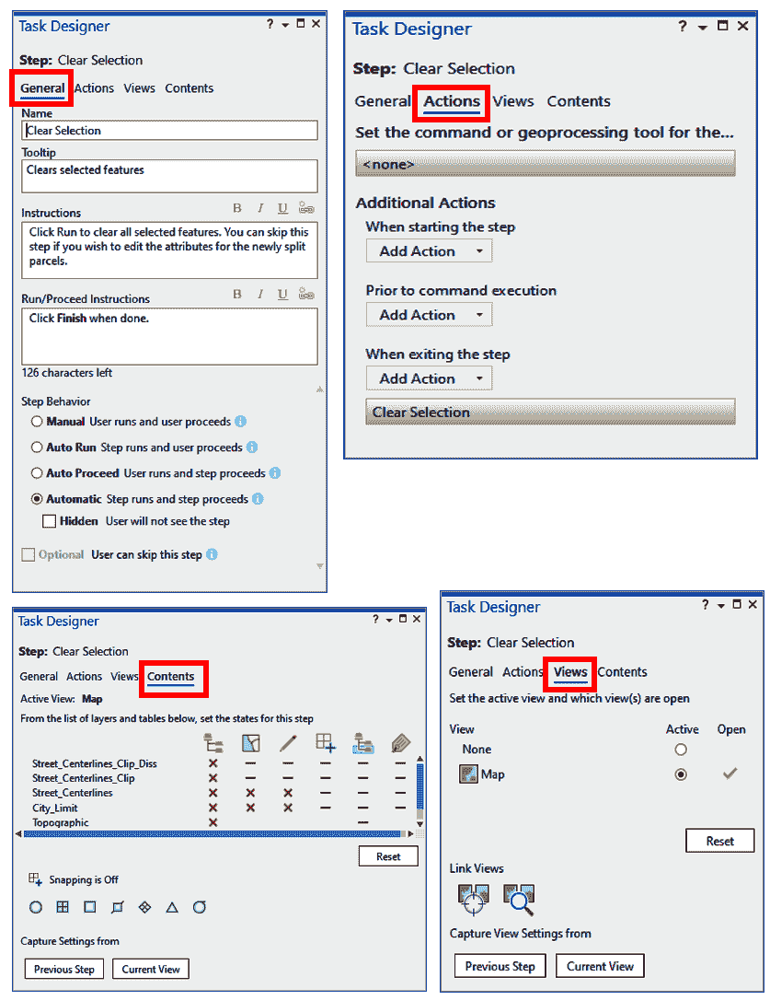

您可以在步骤下的操作中引用特定的地理处理工具或命令。在前面的示例中，此步骤引用了清除**矩形选择**命令的选择。您有选项来控制步骤应使用哪个地图和视图。最后，您可以通过步骤控制该视图的内容。您可以决定哪些图层将可见、可选或可编辑。

您可以拥有简单的步骤，这些步骤仅向用户提供指令并自动运行。如果需要，您可以隐藏步骤。您将在本章后面了解更多关于步骤及其创建方法的信息。

我们现在将进入下一节，关于运行任务。

## 运行任务

任务从任务窗格运行。步骤将按用户完成每个步骤并进入下一个步骤的方式呈现给用户。要使任务在任务窗格中打开，您必须首先打开包含您希望运行的所需任务的任务项。

一旦您从目录窗格打开任务项，任务窗格将打开，您将能够选择要运行的存储在所选任务项中的哪个任务。您可能需要展开任务组以找到您正在寻找的特定任务。当您找到要运行的特定任务时，只需在任务窗格中双击它即可运行。

现在，让我们通过一个动手练习让您体验运行任务的感觉。

## 练习 11A – 运行一个简单任务

在这个练习中，您将运行一个简单的任务，引导您通过在地图中选择要素的过程。这将使您亲身体验如何在 ArcGIS Pro 中访问和运行任务。

### 步骤 1 – 启动 ArcGIS Pro 并打开一个项目

您首先需要打开一个包含存储任务的项目的项目。在这一步，您将启动 ArcGIS Pro 并打开一个包含几个任务的项目：

1.  启动 ArcGIS Pro。

1.  打开位于 `C:\Student\IntroArcPro\Chapter11` 的 `Ex11.aprx` 文件。

当您的项目打开时，您应该看到一个包含代表 Trippville 城市边界、街道和地块的二维地图。

1.  在目录窗格中，展开任务文件夹，以便您可以看到在此项目中保存的任务项。

问题：*您在这个项目中看到了哪些任务项？*

我们现在将进入下一步。

### 步骤 2 – 打开和运行任务

在这一步，您将打开一个任务项，然后运行一个任务，引导您在地图中选择一个要素的过程：

1.  在目录窗格中双击“选择要素”任务项。

1.  目录窗格应该在 ArcGIS Pro 界面的左侧打开。注意这个任务项中包含的任务。

问题：*在您打开的任务项中包含多少个任务？它们是什么？*

1.  双击“地图中的选择要素”以打开它。

1.  按照任务步骤中提供的说明进行操作。当要求您将地图缩放到某个区域时，您可以缩放到任何位置进行此练习。请确保阅读并遵循所有说明：

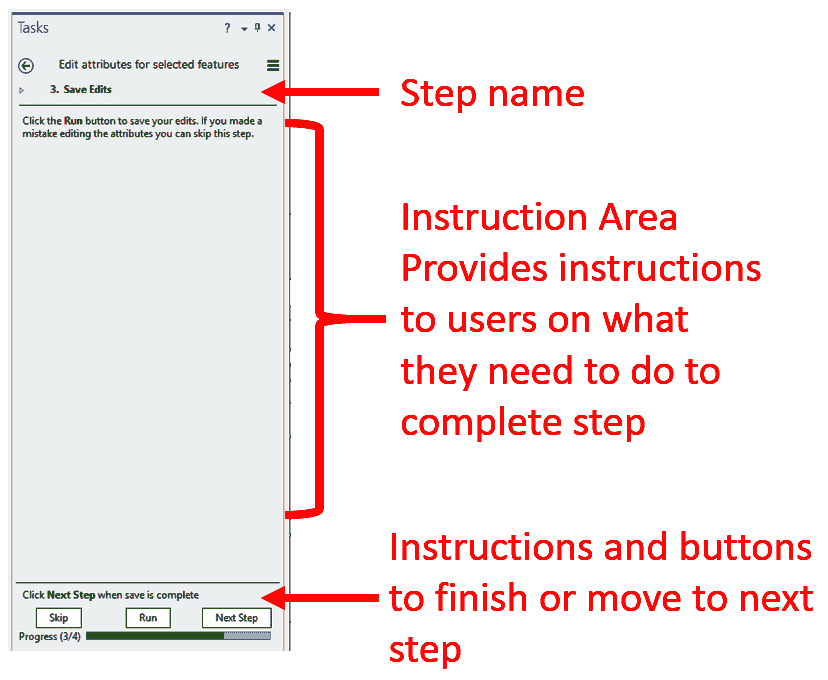

1.  当您完成任务的运行后，清除您的选择。

问题：*这个任务有多少个步骤？*

1.  关闭任务窗格。

1.  关闭 ArcGIS Pro 而不保存项目。

您刚刚体验了从用户的角度来看任务是如何工作的。这是一个非常简单的任务。任务可以像您希望的那样复杂或简单。请随意尝试这个项目中包含的其他任务。

我们现在将进入下一个关于创建任务的章节。

# 学习如何创建任务

创建一个成功的任务并不像创建地图或布局那样简单，它需要思考和计划。在创建任务的前端投入的时间将减轻您自己和那些使用您创建的任务的人之后的许多挫折和头痛。

本节将带您进行探索和创建任务的练习。您还将了解在创建任务之前需要考虑的事项。

就像您在创建布局时做的那样，您需要回答几个问题：

+   *这个任务的目的是什么？目标是什么？*

+   *支持这个目的的工作流程是什么？*

+   *任务将如何被使用？*

+   *您的任务的目标受众是谁？*

这些问题的答案将影响您任务的设计。它们将帮助确定要包含的步骤数量，哪些步骤可能需要自动运行，您需要提供的指导水平，每个步骤中需要包含哪些工具，等等。

在回答这些问题之后，您将准备好开始创建您的任务。这可能需要您首先创建一个新的任务项，然后在其中创建任务或任务组，或者您可以将新任务添加到现有的任务项中。

当您创建新任务时，您将使用 **任务设计器** 面板。任务设计器允许您添加或修改步骤。步骤是任何任务的灵魂。它们为用户提供完成任务所需的说明。步骤本身有几个参数，您在创建任务时需要配置。再次强调，上述问题的答案将有助于指导每个步骤的创建。

在您开始创建任务之前，让我们先探索一个现有的任务。

## 练习 11B – 探索任务

在这个练习中，您将更仔细地查看您在 第九章 的 *Exercise 9A* 中运行的任务，*学习编辑表格数据*。您将验证它是否包含您认为的步骤数量，或者是否超出了您的预期。

### 第 1 步 – 打开项目

在此步骤中，您将打开您在 第十章 的 *Exercise 10A* 中使用的相同项目，*使用地理处理工具进行分析*。这将允许您访问您之前运行的任务：

1.  打开 ArcGIS Pro 并从之前打开的项目列表中选择 Ex11。

1.  在目录面板中展开“任务”文件夹。

1.  验证您是否在“任务”文件夹中看到了“选择要素”任务项。

现在您已经打开了正确的项目并验证了您看到了您在上一个练习中使用的任务项，您现在将学习如何在任务设计器中打开它进行编辑。

### 第 2 步 – 在任务设计器中打开任务

您现在将打开任务设计器中的任务项。这将允许您查看任务项中包含的所有参数、任务和步骤：

1.  右键单击“选择要素”任务项并选择“在设计师中编辑”。任务面板以设计模式在界面左侧打开，任务设计器面板在界面右侧打开。

1.  在任务设计器面板中查看任务项的参数。注意，除了标准参数，如名称、作者和描述之外，您还可以看到任务是用哪个版本的 ArcGIS Pro 创建的，以及随着您更新和修改任务而跟踪任务版本。

1.  现在您将对这个任务项进行一些更改。通过在“名称”下方的单元格中输入，将任务项的名称更改为 ArcGIS Pro 中的“选择要素”。

1.  将作者名称更改为您自己的。

1.  将描述更改为`此任务项包含各种任务，展示了在 ArcGIS Pro 中选择功能的不同方法`。

1.  最后，启用任务项版本的自动递增。

任务设计器中没有*保存*按钮。当你点击另一个参数、任务或窗格时，更改会自动应用。这允许你快速测试更改。当你保存项目时，实际更改会永久保存。如果你在没有保存的情况下关闭项目，你对任务项及其包含的任务和步骤所做的任何更改都将丢失。

1.  保存你的项目。

现在你已经知道如何打开任务设计器以查看给定任务中包含的各种组件，接下来你将探索你刚刚打开的任务中的组件。

### 步骤 3 – 审查任务的步骤

现在你已经在任务设计器中打开了任务项，接下来你将探索特定任务的步骤。在这种情况下，它将是你在*练习 11A*中运行的任务：

1.  在任务窗格中，选择“在地图任务中选择功能”。

1.  点击任务名称右侧出现的蓝色箭头以访问任务的步骤：

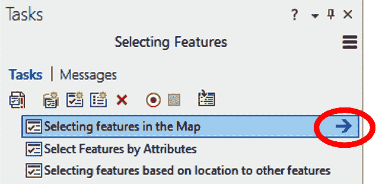

问题：*在这个任务中，你看到了多少步骤？这与你在上一个练习中运行任务时计数的步骤数量相比如何？*

1.  选择每个步骤并审查与每个步骤关联的常规、操作、视图和内容参数。它们将在界面右侧的任务设计器窗格中显示。

问题：*你认为在*第九章*中，学习编辑表格数据时，你在练习 9A 中计数步骤的数量与这个任务中实际包含的步骤数量不同的原因是什么？*

1.  在审查完每个步骤后，点击任务窗格左上角的返回箭头。

1.  审查此任务项内其他任务及其相关步骤。

1.  完成任务审查后，请关闭任务窗格。

1.  保存你的项目并关闭 ArcGIS Pro。

现在你对任务配置和步骤的工作方式有了更好的了解。现在让我们更仔细地看看创建任务的过程。

## 创建任务时需要考虑的事项

如前所述，在开始创建任何任务之前，你需要回答那三个问题。这些问题的答案将指导大部分任务设计。那么这三个问题如何影响或指导你任务的设计？

### 理解任务的目的

就像地图一样，你创建任务是有原因的。例如，可能是为了向组织中的每个人展示分割地块的正确工作流程，以便每个人都以相同的方式进行。也可能是为了开发一个工作流程，以识别位于另一个即将重新规划的地块 300 英尺范围内的所有地块，以便你可以创建一个通知邮件列表。这些代表不同的目的。

理解任务的目的将帮助你确定在任务中需要引用哪些工具。目的还将帮助你回答关于通过你的任务将解决的总体工作流程的下一个问题。

### 确定支持目的的工作流程

任务工作流程由将包含在任务中的步骤组成。这包括需要执行的工具和操作，以及这些工具和操作需要执行的顺序，以达到任务的目的和目标。

仔细思考你的工作流程。写下你认为在任务中需要的每个步骤以及与每个步骤相关的任何工具。一旦你写下了步骤，你应该验证你是否已经考虑了所有需要的步骤。对于经验丰富的用户来说，忘记一个步骤是很常见的事情，因为他们会自动执行，甚至没有意识到自己在做。这意味着任务可能根据使用任务的目标群体而变得不完整或令人困惑。

验证或甚至为任务开发初始工作流程的最好方法之一是在 ArcGIS Pro 中手动完成整个流程。如果你正在验证工作流程，请确保严格按照你记录的方式执行。这将帮助你识别你可能遗漏的任何步骤。

按照自己的说明来做会比你想的更难。你可能会本能地去做，但不要陷入这个陷阱。确保你花时间，按照你概述的步骤进行操作。记住，可能使用该任务的其他人可能没有你那样的技能水平。因此，对你来说直观的工具或步骤可能对其他人来说不是那么直观。

如果你手动完成这个过程以实际开发步骤，那么在执行每个步骤时都要记录下来。确保注意与该步骤相关的工具。在执行此操作时创建带有截图的文档也可能很有帮助。这有助于确保你在创建任务时记住与给定步骤相关的所有要求。

### 以不同方式使用任务

你创建任务有几个原因。例如，你可能想要在组织中标准化一个常见的流程，以确保每个人都在以相同的方式进行操作；你可能想将其用作新用户的培训工具；或者你可能想为你的组织建立最佳实践，以确保准确性和效率。

无论任务的目的是什么，它都会影响任务所需的复杂性和文档水平。以下是一些例子：

+   如果你正在创建一个用于**培训新用户**的任务，你需要确保包括精确的逐步说明，以及非常详细的文档，说明用户需要做什么来完成每个步骤。你希望许多步骤都是手动交互式的，这样用户就能完全学习过程并理解每个步骤的原因。

+   如果您只是试图在经验丰富的用户组织中**建立共同的流程**，您通常可以减少交互步骤的数量，并使用自动步骤，因为用户已经熟悉 ArcGIS Pro 的功能。此外，由于那个经验水平，您可以减少每个步骤所需的指导文档水平。

+   为培训或**建立最佳实践**而创建的任务需要更多时间来创建，因为它们的设计和文档通常具有更高的复杂性。

+   另一个需要考虑的因素是任务的使用方式，即执行任务内步骤所需的**许可级别**。步骤通常涉及使用特定的地理处理工具或 ArcGIS Pro 命令。如您所学的，某些地理处理工具仅适用于特定的许可级别或扩展。

因此，在开发任务时，您需要始终考虑完成任务所需的技能水平、许可级别和扩展。如果您的任务使用了需要特定许可级别或扩展的工具，您可能希望包括一个步骤，让用户验证他们拥有完成任务所需的正确许可级别或扩展。

### 确定任务的受众

最后，您需要确定您正在创建的任务的目标受众。您需要知道您的受众是否是经验丰富的 ArcGIS Pro 用户或新用户，或者他们是否使用过其他 GIS 软件。

您听众的经验和技能水平将影响您的设计任务。技能和经验水平越低，您需要提供的指导就越多。您可能还需要包括对经验用户来说直观的步骤。

如果您的受众是熟悉其他 GIS 软件应用（如 ArcMap）的群体，您可能需要包括对该应用中的工具或过程的引用，以便他们更容易将 ArcGIS Pro 的功能与他们熟悉的内容联系起来。这可能会增加您为每个步骤创建的指导数量。

现在您已经了解了在创建任务之前需要考虑的事项，是时候学习如何实际创建任务了。

## 创建自己的任务

如您所学的，任务有几个组成部分。在创建任何新任务时，您需要创建这些组成部分。创建任何任务的第一个步骤是拥有一个包含它的任务项。这可以是一个现有的或新的任务项。

一旦创建或确定包含您的任务的现有任务项，您接下来需要决定您希望任务是独立的还是包含在任务组中。

如果你创建的任务与其他流程或工作流无关，将其作为独立任务留下是好的。然而，如果任务是大流程或过程中的一个部分，那么将这些相关任务存储在任务组中是个好主意。这样更容易找到。如果你想将任务存储在任务组中，你需要在创建任务项之后创建它。

到目前为止，你现在已经准备好创建你的第一个任务了。你将使用任务设计器和本章*学习创建任务*部分中列出的四个问题的答案来创建一个新任务。

### 创建任务项

创建任务项有几种方法。具体如下：

+   如果这是你第一次向项目添加任务项，请转到功能区上的“插入”选项卡，然后在项目组中选择“任务”按钮。这将按以下截图所示在你的项目中创建一个新的空白任务项。

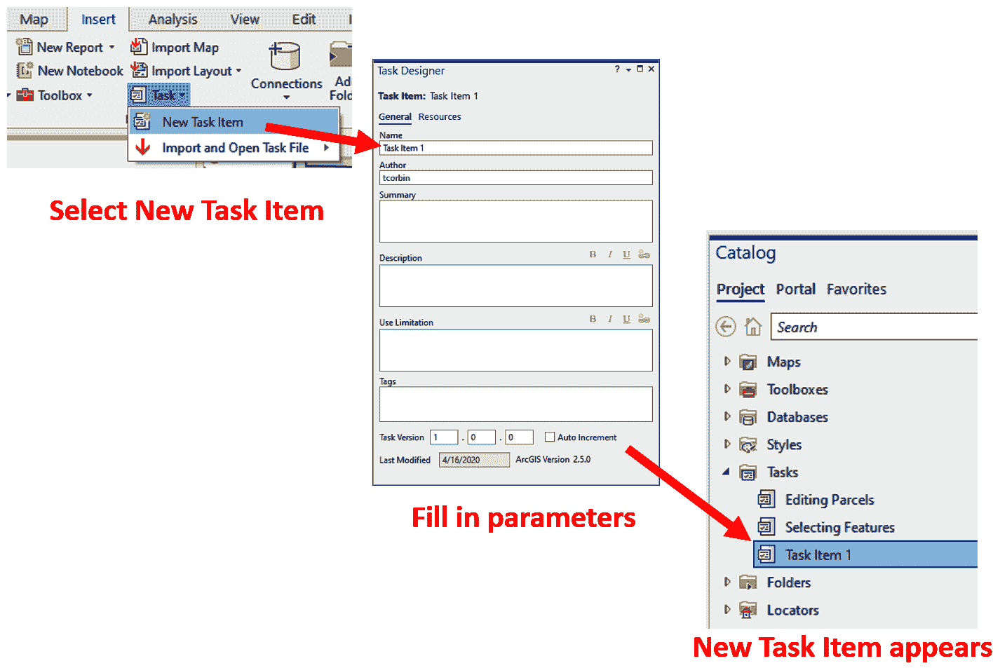

+   如果你已经在项目中有了任务项，那么你可以从目录面板中添加新的。你只需右键单击“任务”文件夹，然后选择“新建任务项”，如以下截图所示：

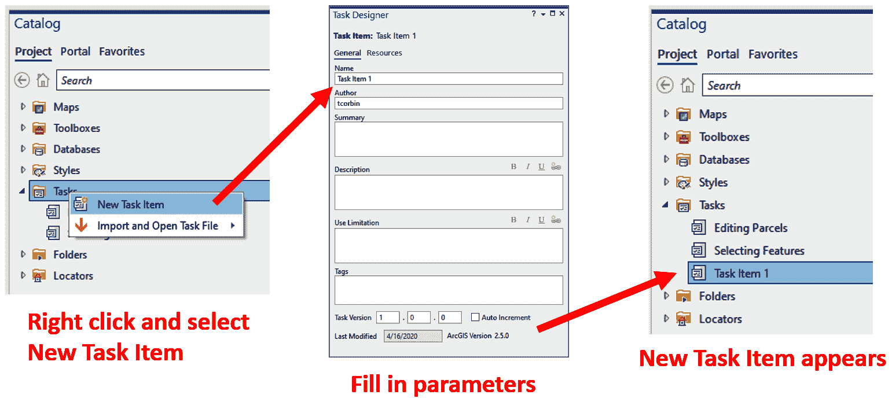

如您从前面的截图中所见，在 ArcGIS Pro 中创建任务项的方式不止一种。在 ArcGIS Pro 中，有多种方法来完成某事并不罕见。这提供了灵活性，并允许你确定最适合你的方法。

我们现在将看到如何创建任务组。

### 创建任务组

如果你想将任务存储在任务组中，你需要在任务项中创建它。您将在设计师模式下从任务面板中这样做。

简单地点击新建组按钮并填写参数，如以下截图所示：

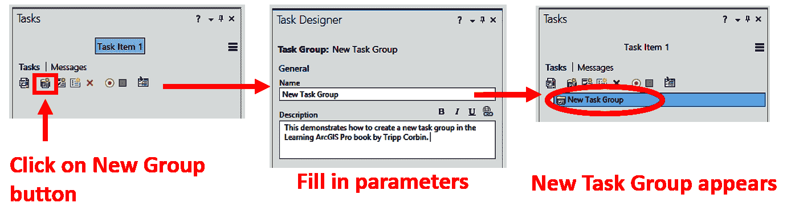

前面的截图显示了创建新任务组是多么简单。任务组可以帮助你根据功能、用途或目标受众组织任务，以便在需要时快速定位。

让我们继续学习如何创建任务。

### 创建任务

现在你已经准备好创建实际的任务了。请记住，你可以向现有的任务项和任务组添加任务。创建任务与创建任务组非常相似，如以下截图所示：

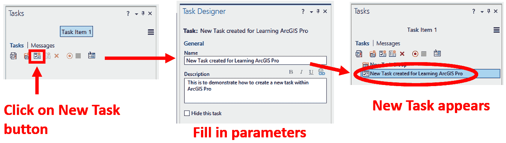

如您从前面的截图中所见，在设计师模式下，要创建任务，请点击任务面板中的新建任务按钮。然后您可以填写相关参数，新任务将按以下所示创建。

现在让我们继续到下一节，关于创建任务的说明。

## 练习 11C – 创建任务

在这个练习中，你将在项目中创建一个新的任务。在稍后的*练习 11D*中，你将向这个任务添加步骤。

新任务的目的在于创建沿道路分布的土地列表。这将帮助城市在道路维修时通知沿路居住和工作的人。此任务将作为现有和新 GIS 人员的一个常用工作流程。

### 第 1 步 – 打开项目并创建任务项

在此步骤中，你将打开一个项目并创建一个任务项，该任务项将包含你在后续步骤中创建的任务：

1.  启动 ArcGIS Pro 并从最近打开的项目列表中打开 Ex11 项目。

1.  在目录面板中展开 Tasks 文件夹。

1.  右键单击 Tasks 文件夹并选择 New Task Item。Task 和 Task Designer 面板将自动打开。

1.  在 Task Designer 面板中，按照以下方式填写你的新任务项参数：

    +   在名称字段中，键入 `Road Repair Tasks`。

    +   在作者字段中，键入你的名字。

    +   在描述字段中，键入 `This task item contains tasks associated with road repair projects such as generating notification lists, locating nearby parcels, calculating total lengths, and more`。

    +   在 Task version 字段中，输入 `1.0.0`。

    +   启用自动递增。

1.  保存你的项目。

你刚刚创建了你的第一个任务项。现在你需要向该项添加一个任务。

### 第 2 步 – 创建新任务

你现在可以创建任务了。这最终将作为创建你在 *Exercise 11D* 中创建的沿道路分布的土地列表所需步骤的容器。由于这是你唯一要创建的任务，因此你需要创建一个独立任务。如果你正在创建大量任务的一部分，你将不得不创建任务组来帮助组织它们：

1.  在界面左侧的 Tasks 面板中，单击 New Task 按钮。

1.  在 TaskDesigner 面板中，按照以下方式填写新任务的参数：

    +   在名称字段中，键入 `Create a list of nearby parcels`。

    +   在描述字段中，添加 `This task will step you through the process needed to create a list of parcels located along a road segment which will be repaired. The list will allow those that live and work along the road to be notified of the repair and how long it is expected to take`。

1.  关闭 Task designer 面板。

你的 Tasks 面板现在应该看起来像这样：

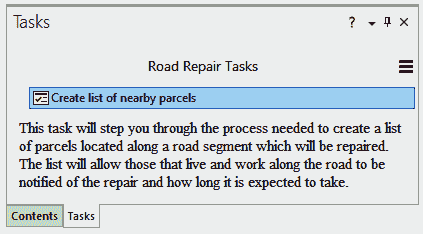

1.  保存你的项目并关闭 Tasks 面板。

你已经了解了任务以及如何为自己创建一个任务。你还了解了在创建任务时需要考虑的事项。

你现在已经创建了一个任务，但它仍然是空的。你还需要向任务中添加步骤，以告诉用户生成位于将要修复的道路段附近的土地列表所需的过程。我们将在下一节中这样做。

# 添加任务步骤

步骤实际上是你的任务的核心。它们为用户提供完成过程或工作流程的说明。步骤可以是简单的文本说明，告诉用户如何执行操作。例如，一个步骤可能像“使用探索工具缩放到感兴趣的区域”这样简单。然而，步骤也可以非常复杂。你可以在步骤内包括特定的工具、图层行为和选择控制。

在本节中，你将了解步骤的组成部分，随后将有一个练习，用于向任务中添加步骤，这样你将获得一些实际操作经验。

步骤的复杂性和你需要多少步骤将由我们在本章前面讨论的四个问题的答案所驱动。如果你试图为经验丰富的用户标准化特定的工作流程，你可能选择增加步骤结构的复杂性，尽可能自动化它。这将提高你团队的效率，同时确保每个人都以相同的方式进行过程操作。如果你设计任务作为培训工具，你可能希望步骤更加手动和指导性，以便用户更好地理解所使用的工具及其工作原理。

因此，让我们更仔细地看看构成步骤的组件及其目的。这将为你提供一个良好的理解，以便你可以在任务中构建有效的步骤。

## 了解步骤的组成部分

一个单独的步骤可以包括多个组件，具体取决于其目的。你可以包括用户的说明，确定步骤的运行方式，将其链接到地理处理工具或命令，控制视图和图层行为，以及管理单个步骤内的选择。让我们更仔细地看看这些组件或参数。

### 常规

步骤的第一个组成部分是步骤的一般信息和行为。这包括步骤名称、工具提示、说明和步骤运行行为，如下面的截图所示：

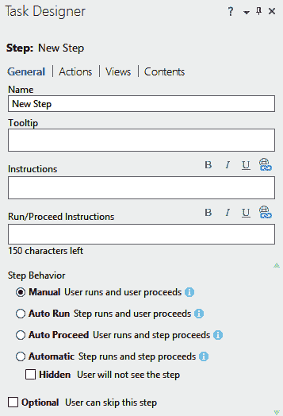

如前一个截图所示，在“常规”选项卡中字段或参数很少。它们如下所示：

+   步骤的名称是用户首先在任务中看到的列表中的内容。名称应该给用户一个大致的概念，说明步骤应该完成什么，例如“缩放到区域”或“选择地块进行编辑”。

+   工具提示是一个当你的鼠标指针移至相关对象上时出现的弹出窗口。这应该为用户提供更多信息，但最多不超过一个简短的段落。它通常与名称非常相似。

+   指示是步骤最重要的参数之一。它们是您向用户提供指示的地方，告诉他们在给定步骤中需要做什么以完成它。这些可以长到详细到您认为它们需要根据步骤的目的和目标受众。它们应该始终清晰且易于遵循。尽可能避免使用缩写或首字母缩略词，因为这些可能会引起混淆。

+   **运行/继续说明**告诉用户在完成说明以进入下一步后需要做什么。例如，点击运行按钮以启动步骤。一旦完成步骤，点击下一步按钮以继续。

+   最后，您需要确定步骤的运行方式。您有四种基本选项可供选择，即手动、自动运行、自动继续和自动。以下表格有助于我们更好地理解这四个选项：

| **步骤行为** | **描述** | **使用示例** |
| --- | --- | --- |
| 手动 | 用户必须手动点击运行按钮以启动步骤，并点击下一步按钮以继续。 | 您希望用户激活探索工具并放大到特定区域。您正在使用此作为培训工具，因此需要他们看到探索工具被激活以供使用。 |
| 自动运行 | 这将自动运行命令或地理处理工具。用户使用相关工具执行操作，然后手动点击下一步以继续。 | 您希望用户从地图中选择要素，因此您已将选择矩形工具链接到步骤，并且它自动运行，因此用户不需要激活它。他们只需从地图中选择要素即可。 |
| 自动继续 | 用户点击运行按钮并运行步骤，完成后自动进入下一步。 | 您希望用户缓冲一个功能，但距离将根据情况而有所不同。用户将输入适当的缓冲距离，然后点击运行按钮。缓冲完成后，它将自动进入下一步。 |
| 自动 | 步骤在没有用户交互的情况下运行。自动步骤有隐藏选项。 | 您的用户正在处理一个地图，您需要他们切换到另一个地图。您可以在进入下一步之前包含一个自动步骤，将当前活动地图切换到另一个地图。 |

现在让我们继续到关于步骤第二个组件的下一节。

### 操作

步骤的下一个组件是**操作**。操作允许您将 ArcGIS Pro 命令或地理处理工具链接到步骤。ArcGIS Pro 命令是您在功能区中看到的任何按钮或工具，例如添加数据或测量。地理处理工具是工具箱中可用的任何工具，包括您或其他人可能创建的自定义 Python 脚本或模型。步骤不需要操作 - 它可以完全是指导性的。

以下截图显示了任务设计器面板中的操作标签：

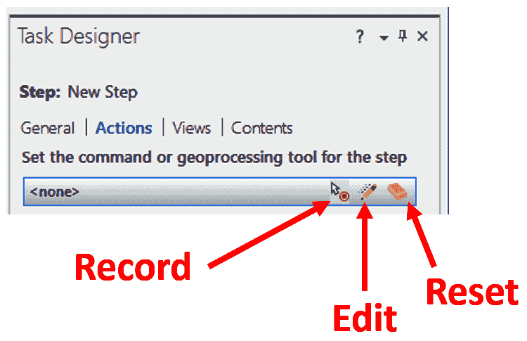

您可以通过两种方式将命令或地理处理工具添加到步骤中：

+   第一种方法是**编辑**操作。这允许您从列表中选择一个命令或地理处理工具。您有使用关键词搜索的选项。

+   另一种方法是**记录**。当您记录时，您只需从 ArcGIS Pro 界面找到您希望使用的命令或地理处理工具并点击它。如果您过去手动执行过该步骤并且确切知道需要哪个工具，这是一个很好的选项。

您还可以使用一个称为“额外操作”的功能来管理与步骤相关的选择，该功能在步骤开始时、在运行命令之前或退出步骤时使用。在步骤内，您可以创建、修改、保存或清除一个新的选择，如下面的截图所示：

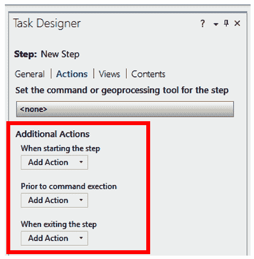

您可以将当前选定的要素保存到一个**选择集中**。这个选择集可以在任务中的后续步骤中使用。您还可以保存由本步骤或之前步骤创建或修改的要素，如下面的截图所示：

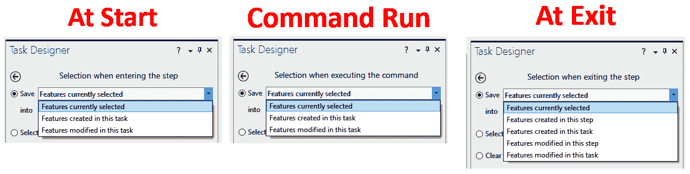

例如，如果在之前的步骤中您将地块分割成多个地块，分割后这些地块仍然被选中，并且您希望在后续步骤中编辑这些新地块的属性，您可以将这些分割地块的选择保存到一个名为“Split Parcels”的选择中，这样就可以在后续步骤中轻松地调用了。

您还可以清除选择或创建一个自定义查询来选择要素。自定义查询与**按属性选择**工具以及您在过去章节中使用过的定义查询非常相似。

使用额外操作也是可选的。一个步骤可以没有操作或额外操作的定义，它可能只指示了一个命令或地理处理工具，或者它可能只定义了额外操作，甚至是一个命令或地理处理工具与额外操作的组合。

### 视图

视图允许您在运行步骤时控制项目内打开和激活的地图、场景或布局。您将看到项目中包含的所有视图。虽然您可以在任何时候打开许多视图，但只有一个视图可以是活动的。

下面的截图显示了任务设计器面板中的“视图”选项卡：

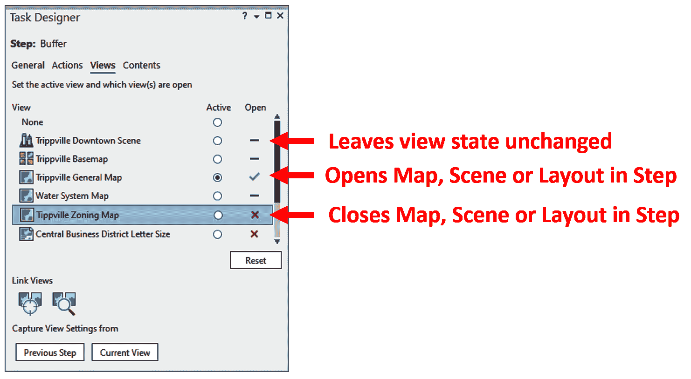

活动视图将是步骤和定义的操作应用到的视图。因此，如果您正在创建一个选择分区多边形的步骤，您可能想确保分区视图是活动的。如果您的步骤有人向布局添加北箭头，您将希望适当的布局是打开和活动的。您可能想关闭一些视图以消除用户可能产生的混淆，以及减少可能使用的计算机资源数量。

如前述截图所示，您可以为步骤手动设置这些参数，从上一个步骤中捕获它们，或者根据创建步骤时项目当前设置来设置它们。

### 内容

正如您可以控制哪些视图是打开和活动的，您也可以控制您活动视图中的图层。在步骤内，您可以控制图层的可见性、是否可选、是否可编辑、是否可捕捉、是否为选定的图层以及标签的可见性。

以下截图显示了任务设计器窗格中的“内容”选项卡：

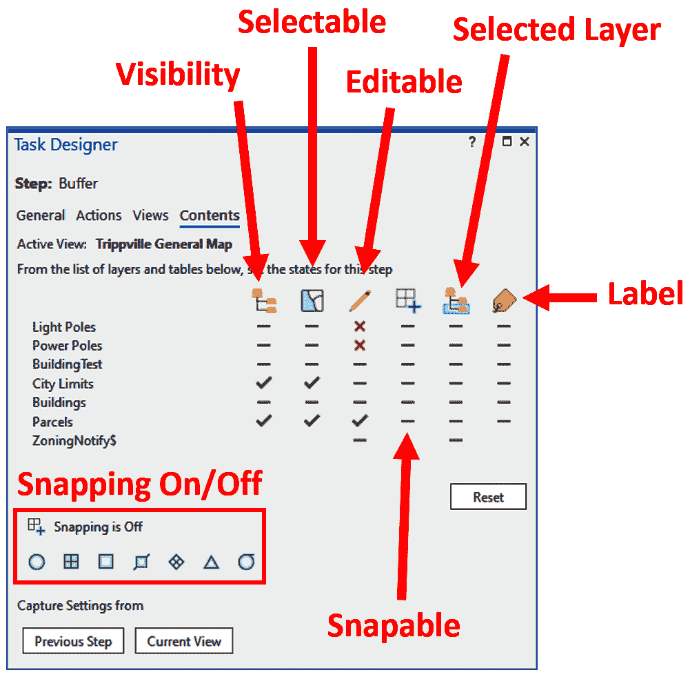

图层控制级别非常强大。它确保您的数据得到保护，并且仅在给定步骤中与您需要的图层一起工作。例如，如果您正在步骤内编辑一块地，您会想确保地块图层被设置为唯一的可编辑图层。这将确保用户不会意外地编辑城市界限或建筑图层，例如。

现在您对步骤如何在任务中配置和工作的理解更加深入，您现在可以开始向之前练习中创建的任务添加步骤了。

## 练习 11D – 向任务中添加步骤

在这个练习中，您将向之前创建的任务添加步骤，引导用户通过生成要修复的道路段附近的土地所有者名单的过程。

### 步骤 1 – 在任务设计器中打开任务

在此步骤中，您将打开在任务设计器中创建的任务，以便您可以开始创建步骤：

1.  启动 ArcGIS Pro 并使用您在之前练习中学到的技能打开 Ex11。

1.  在目录窗格中展开任务文件夹。

1.  双击上一次练习中创建的“道路维修任务”项。这将打开任务窗格。

1.  右键单击“创建附近地块列表任务”并选择“在设计中编辑”。任务设计器窗格应该打开在界面右侧，任务窗格应该进入设计模式。

您现在可以添加任务了。如果不是课堂练习，您将开始参考“学习创建任务”部分中那些问题的答案，您在创建任务之前需要考虑这些问题。您将特别关注四个问题中的第二个问题的流程。

为了练习的目的，这已经完成，您只需遵循练习说明即可。

### 步骤 2 – 添加缩放步骤

在此步骤中，您将添加一个步骤，指示用户放大到待修道路的位置。您将让他们使用探索工具放大到该位置：

1.  在任务窗格中单击“新建步骤”按钮。新步骤将自动列在任务窗格中，步骤的参数将在任务设计器窗格中显示。

1.  按以下方式设置常规参数：

    +   在名称字段中，添加`使用探索工具缩放到街道`。

    +   在工具提示字段中，添加`缩放到将要修复的街道`。

    +   在说明字段中，键入`使用位于地图标签页上的探索工具，缩放到地图中将要进行修复的道路段的位置。如果您已经缩放到正确的区域，您可以跳过此步骤`。

    +   在运行/继续说明字段中，键入`一旦您成功缩放到街道的位置，请点击下一步继续`。

我个人喜欢在说明中使用粗体字体来呈现任何命名的工具或按钮。这有助于用户识别它们的重要性。因此，在先前的说明和运行/继续说明字段中，我会将*探索*和*下一步*设置为粗体。

1.  在步骤行为中，将其设置为自动运行步骤。您将连接探索工具作为此步骤的动作。通过将其设置为自动运行步骤，步骤将自动启用探索工具，而无需用户操作。用户所需做的只是开始缩放到地图中的正确区域。

1.  最后，对于常规设置，将其设置为可选步骤，允许用户在开始任务时跳过步骤，如果他们已经缩放到将要修复的街道的正确位置。

您已为此步骤配置了常规参数。现在您将将其链接到一个动作。该动作将是探索工具。

1.  点击任务设计器面板顶部的动作。

1.  将鼠标指针移至<无>处。右侧应出现三个图标。点击编辑图标。

1.  点击位于命令/地理处理面板中<无>右侧的下拉箭头。

1.  从下拉列表中选择命令。

1.  点击位于所选命令右侧出现的浏览器按钮。

1.  在弹出窗口的搜索区域中，键入`Explore`并选择探索（打开当前探索工具），然后点击确定：

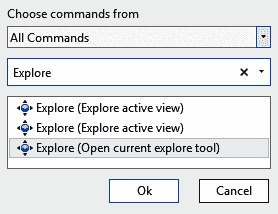

1.  点击位于任务设计器面板底部的完成按钮。

由于您只是让用户缩放到一个位置，因此您不需要配置其他动作或更改此步骤中视图或内容的设置。所以，您已经完成了这个步骤。记住，没有保存任务或步骤的按钮。它们在保存项目时自动保存。

1.  保存您的项目。

恭喜，您已经创建了第一个步骤。但您还没有完成。您还需要创建几个更多步骤来完成此工作流程。

### 步骤 3 – 选择道路段

现在您需要添加一个步骤，指导用户选择将要修复的道路段。您将使用**选择矩形**工具，并指导用户从地图中选择道路：

1.  点击任务面板中的新建步骤按钮以创建另一个新的步骤。

1.  完成以下常规参数：

    +   在名称字段中，添加`选择道路段`。

    +   在工具提示字段中，添加`选择将要修复的道路段`。

    +   在说明字段中添加`点击运行按钮以开始此步骤。然后，使用按矩形选择工具，从地图中选择计划修复的道路段。如果您已经选择了道路段，您可以跳过此步骤`。

    +   在运行/继续说明字段中添加`一旦您选择了计划修复的道路段，点击下一步按钮`。

    +   在步骤行为字段中选择手动。

    +   启用可选功能，允许用户在已经选择了一段道路段的情况下跳过此步骤。

1.  点击位于任务设计器面板顶部的操作选项。

1.  将鼠标指针移动到显示<none>的区域并点击记录图标。

1.  点击位于地图标签页中的选择工具。注意这个工具会自动添加为操作。

由于您将在这个步骤中让用户在特定图层上选择一个功能，您想要限制他们运行此步骤时可以选择的图层。如您之前所学，您可以通过步骤中的内容设置来完成此操作。

1.  点击位于任务设计器面板顶部的内容。

1.  当这个任务运行时，您想要确保街道图层是可见和可选择的。点击位于可见性列下街道旁边的**–**，直到它变成绿色勾选标记。对选择列也做同样操作。

1.  为了确保不会意外选择其他图层，您想要通过点击选择列中的–将剩余图层设置为不可选择，直到它们旁边都有一个红色的 X。

完成后，您的任务设计器面板应该看起来像这样：

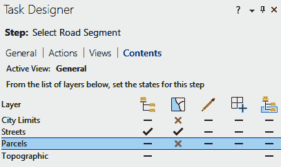

1.  保存您的项目。

您现在已为用户提供他们需要的说明，告诉他们如何缩放到计划修复的道路位置以及如何选择它。现在您需要告诉他们如何选择周围的 parcels。

### 第 4 步 – 选择附近的 parcels

在此步骤中，您将创建一个步骤，告诉用户如何选择他们在上一步中选择的路段附近的 parcels。您将使用**按位置选择**命令来完成此操作：

1.  再次点击新建步骤按钮以创建新的步骤。

1.  将通用参数设置如下：

    +   在名称字段中添加`选择附近的 parcels`。

    +   在工具提示字段中添加`选择您在上一步中选择的路段附近的 parcels`。

    +   在说明字段中添加`使用按位置选择工具，您将选择位于所选道路段 100 英尺范围内的地块`。

1.  确保这个工具配置如下：

    +   将输入功能图层字段设置为 parcels。

    +   将关系字段设置为在距离内。

    +   将选择功能字段设置为街道。

    +   将搜索距离字段设置为`100`英尺。

    +   将选择类型字段设置为新选择。

1.  一旦您已验证设置是否正确，点击运行按钮并确保以下内容：

    +   在运行/继续说明字段中添加`点击下一步继续`。

    +   在步骤行为选项下选择手动。

1.  点击“操作”，使用“记录”选项，将命令设置为位于地图选项卡中的“按位置选择”。

1.  地理处理面板将自动打开。由于您正在手动运行此步骤，您可以关闭它并返回到任务设计器面板。

1.  点击“内容”，设置使街道和地块图层可见，并且地块图层将是唯一可选择的图层。

1.  保存您的项目。

现在附近的地块已选择，您还有最后一步要走。您将指导用户如何将选定的地块导出到**Excel**电子表格。

### 第 5 步 – 将选择导出到 Excel 电子表格

在此步骤中，您将创建一个新的步骤，指导用户将选定的地块导出到**Excel**电子表格：

1.  在任务面板中点击“新建步骤”按钮。

1.  按照以下设置通用参数：

    +   在“名称”字段中，添加`导出到 Excel`。

    +   在“工具提示”字段中，添加`将选定的地块导出到 Excel 电子表格`。

    +   对于“说明”字段，按照以下方式完成 Table to Excel 地理处理工具的参数：

        +   在“输入表”字段中，键入`Parcels`。

        +   在“输出表”字段中，键入`C:\Student\IntroArcPro\Chapter11\Parcels_TableToExcel.xls`。在验证了您的设置后，点击“运行”。

    +   在“运行/继续指令”字段中，点击“完成”以完成任务。

    +   在“步骤行为选项”中，选择“运行手动”选项。

1.  点击“操作”并点击编辑图标。

1.  将命令类型设置为地理处理工具。

1.  点击所选地理处理工具旁边的浏览按钮。

1.  在“查找工具”单元格中，键入`Excel`。

1.  选择“Table to Excel”Python 脚本并点击“确定”。

1.  确保已启用嵌入，并按您的说明设置参数。任务设计器面板应如下所示：

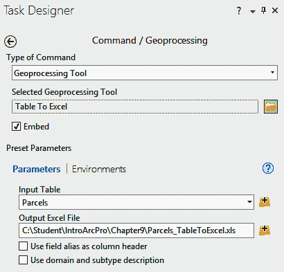

1.  一旦您已验证了您的设置，请点击“完成”。

1.  没有必要更改视图或内容设置，因此关闭任务设计器并保存您的项目。

您的任务现在已完成。您已添加所有必要的步骤，以选择计划修复的路段附近的地块，并将它们导出到**Excel**电子表格。现在您需要测试它。

### 第 6 步 – 运行您的任务

现在您的任务已完成，您将运行它以查看其工作效果。这将验证任务是否包含完成所需过程的所有步骤，并验证您的说明是否清晰，步骤是否按预期流动：

1.  使用您学到的技能，找到并运行您刚刚创建的任务。仔细遵循每个步骤的说明。检查它们是否合理，并确保您得到预期的结果。

1.  对任务及其步骤进行任何您认为需要的调整。

1.  保存您的项目并关闭 ArcGIS Pro。

假设一切按预期运行，您刚刚创建了一个完整任务。您开发了一个工作流程，其他人将能够按照您的逐步说明完成特定过程。

## 挑战

利用本章学到的技能，选择本书中的一个先前练习，或你办公室中的一个常见流程，并为它开发一个任务。你也可以开发一个任务来复制该工作流程。

# 摘要

在本章中，你学习了如何使用任务来标准化流程、培训新用户并在你的组织中建立最佳实践。你还了解了构成任务的各个组件以及创建自己的任务时需要考虑的因素。

最后，你拥有了在 ArcGIS Pro 中创建自己任务所需的技能。你从头开始经历了创建新任务的过程，最终创建了一个将选定的数据导出到 Excel 电子表格的任务。这包括创建任务项、任务和任务步骤。

在下一章中，你将开始探索使用 ModelBuilder 和 Python 自动化多步骤过程的方法。这些方法允许你创建模型或脚本，可以将一系列工具和工作流程串联成一个单一的工具，从而节省你的时间和精力，尤其是在你定期执行的过程。
