# 第一章：介绍 Apache Flink

随着分布式技术不断发展，工程师们试图将这些技术推向极限。以前，人们正在寻找更快、更便宜的处理数据的方法。当 Hadoop 被引入时，这种需求得到了满足。每个人都开始使用 Hadoop，开始用 Hadoop 生态系统工具替换他们的 ETL。现在，这种需求已经得到满足，Hadoop 在许多公司的生产中被使用，另一个需求出现了，即以流式方式处理数据，这催生了 Apache Spark 和 Flink 等技术。快速处理引擎、能够在短时间内扩展以及对机器学习和图技术的支持等功能，正在开发者社区中推广这些技术。

你们中的一些人可能已经在日常生活中使用 Apache Spark，并且可能一直在想，如果我有 Spark，为什么还需要使用 Flink？这个问题是可以预料的，比较是自然的。让我试着简要回答一下。我们需要在这里理解的第一件事是，Flink 基于**流式优先原则**，这意味着它是真正的流处理引擎，而不是将流作为小批量收集的快速处理引擎。Flink 将批处理视为流处理的特例，而在 Spark 的情况下则相反。同样，我们将在本书中发现更多这样的区别。

这本书是关于最有前途的技术之一--Apache Flink。在本章中，我们将讨论以下主题：

+   历史

+   架构

+   分布式执行

+   特性

+   快速启动设置

+   集群设置

+   运行一个示例应用程序

# 历史

Flink 作为一个名为*Stratosphere*的研究项目开始，旨在在柏林地区的大学建立下一代大数据分析平台。它于 2014 年 4 月 16 日被接受为 Apache 孵化器项目。Stratosphere 的最初版本基于 Nephele 的研究论文[`stratosphere.eu/assets/papers/Nephele_09.pdf`](http://stratosphere.eu/assets/papers/Nephele_09.pdf)。

以下图表显示了 Stratosphere 随时间的演变：

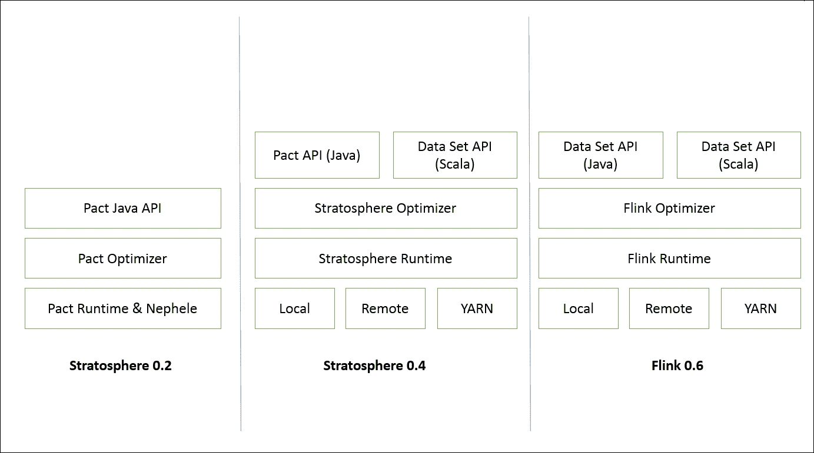

Stratosphere 的第一个版本主要关注运行时、优化器和 Java API。随着平台的成熟，它开始支持在各种本地环境以及**YARN**上的执行。从 0.6 版本开始，Stratosphere 更名为 Flink。Flink 的最新版本专注于支持各种功能，如批处理、流处理、图处理、机器学习等。

Flink 0.7 引入了 Flink 最重要的功能，即 Flink 的流式 API。最初的版本只有 Java API。后来的版本开始支持 Scala API。现在让我们在下一节中看一下 Flink 的当前架构。

# 架构

Flink 1.X 的架构包括各种组件，如部署、核心处理和 API。我们可以轻松地将最新的架构与 Stratosphere 的架构进行比较，并看到它的演变。以下图表显示了组件、API 和库：

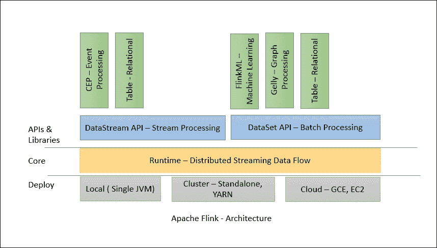

Flink 具有分层架构，其中每个组件都是特定层的一部分。每个层都建立在其他层之上，以清晰的抽象。Flink 被设计为在本地机器、YARN 集群或云上运行。运行时是 Flink 的核心数据处理引擎，通过 API 以 JobGraph 的形式接收程序。**JobGraph**是一个简单的并行数据流，其中包含一组产生和消费数据流的任务。

DataStream 和 DataSet API 是程序员用于定义作业的接口。当程序编译时，这些 API 生成 JobGraphs。一旦编译完成，DataSet API 允许优化器生成最佳执行计划，而 DataStream API 使用流构建进行高效的执行计划。

然后根据部署模型将优化后的 JobGraph 提交给执行器。您可以选择本地、远程或 YARN 部署模式。如果已经运行了 Hadoop 集群，最好使用 YARN 部署模式。

# 分布式执行

Flink 的分布式执行由两个重要的进程组成，即主节点和工作节点。当执行 Flink 程序时，各种进程参与执行，即作业管理器、任务管理器和作业客户端。

以下图表显示了 Flink 程序的执行：

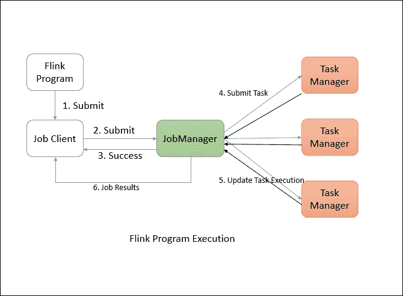

Flink 程序需要提交给作业客户端。然后作业客户端将作业提交给作业管理器。作业管理器负责编排资源分配和作业执行。它的第一件事是分配所需的资源。资源分配完成后，任务被提交给相应的任务管理器。收到任务后，任务管理器启动线程开始执行。在执行过程中，任务管理器不断向作业管理器报告状态的变化。可能有各种状态，如执行开始、进行中或已完成。作业执行完成后，结果被发送回客户端。

## 作业管理器

主进程，也称为作业管理器，协调和管理程序的执行。它们的主要职责包括调度任务、管理检查点、故障恢复等。

可以并行运行多个主节点并共享这些责任。这有助于实现高可用性。其中一个主节点需要成为领导者。如果领导节点宕机，备用主节点将被选举为领导者。

作业管理器包括以下重要组件：

+   actor 系统

+   调度器

+   检查点

Flink 在内部使用 Akka actor 系统在作业管理器和任务管理器之间进行通信。

### actor 系统

actor 系统是具有各种角色的 actor 的容器。它提供诸如调度、配置、日志记录等服务。它还包含一个线程池，所有 actor 都是从中初始化的。所有 actor 都驻留在一个层次结构中。每个新创建的 actor 都会分配给一个父级。actor 之间使用消息系统进行通信。每个 actor 都有自己的邮箱，从中读取所有消息。如果 actor 是本地的，消息通过共享内存共享，但如果 actor 是远程的，消息则通过 RPC 调用传递。

每个父级负责监督其子级。如果子级出现任何错误，父级会收到通知。如果 actor 能够解决自己的问题，它可以重新启动其子级。如果无法解决问题，则可以将问题升级给自己的父级：

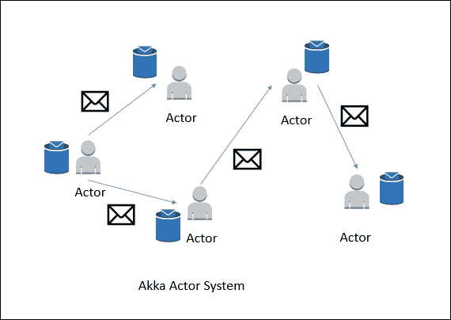

在 Flink 中，actor 是一个具有状态和行为的容器。actor 的线程会顺序地处理它在邮箱中接收到的消息。状态和行为由它接收到的消息确定。

### 调度器

在 Flink 中，执行器被定义为任务槽。每个任务管理器需要管理一个或多个任务槽。在内部，Flink 决定哪些任务需要共享槽，哪些任务必须放入特定的槽中。它通过 SlotSharingGroup 和 CoLocationGroup 来定义。

### 检查点

检查点是 Flink 提供一致性容错的支柱。它不断为分布式数据流和执行器状态进行一致的快照。它受 Chandy-Lamport 算法的启发，但已经修改以满足 Flink 的定制要求。有关 Chandy-Lamport 算法的详细信息可以在以下网址找到：[`research.microsoft.com/en-us/um/people/lamport/pubs/chandy.pdf`](http://research.microsoft.com/en-us/um/people/lamport/pubs/chandy.pdf)。

有关快照实现细节的详细信息可以在以下研究论文中找到：*Lightweight Asynchronous Snapshots for Distributed Dataflows (*[`arxiv.org/abs/1506.08603`](http://arxiv.org/abs/1506.08603))。

容错机制不断为数据流创建轻量级快照。因此，它们在没有显着负担的情况下继续功能。通常，数据流的状态保存在配置的位置，如 HDFS。

在发生故障时，Flink 会停止执行器并重置它们，然后从最新可用的检查点开始执行。

流障是 Flink 快照的核心元素。它们被吸收到数据流中而不影响流程。障碍永远不会超越记录。它们将一组记录分组成一个快照。每个障碍都携带一个唯一的 ID。以下图表显示了障碍如何被注入到数据流中进行快照：

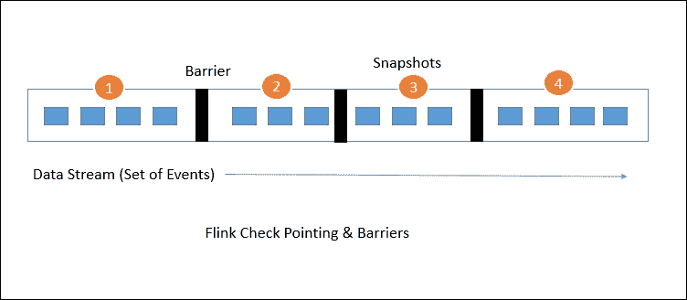

每个快照状态都报告给 Flink 的**作业管理器**的检查点协调器。在绘制快照时，Flink 处理记录的对齐，以避免由于任何故障而重新处理相同的记录。这种对齐通常需要一些毫秒。但对于一些强烈的应用程序，即使毫秒级的延迟也是不可接受的，我们可以选择低延迟而不是精确的单个记录处理。默认情况下，Flink 会精确处理每个记录一次。如果任何应用程序需要低延迟，并且可以接受至少一次交付，我们可以关闭该触发器。这将跳过对齐并提高延迟。

## 任务管理器

任务管理器是在 JVM 中以一个或多个线程执行任务的工作节点。任务管理器上的任务执行的并行性由每个任务管理器上可用的任务槽确定。每个任务代表分配给任务槽的一组资源。例如，如果一个任务管理器有四个槽，那么它将为每个槽分配 25%的内存。一个任务槽中可能运行一个或多个线程。同一槽中的线程共享相同的 JVM。同一 JVM 中的任务共享 TCP 连接和心跳消息：

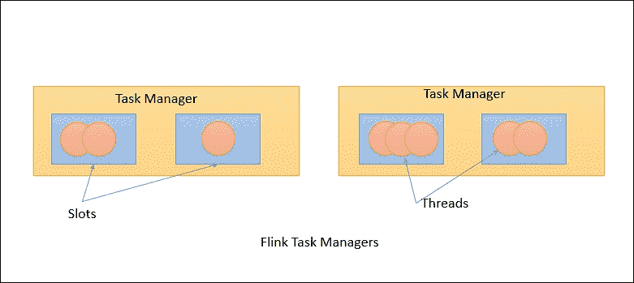

## 作业客户端

作业客户端不是 Flink 程序执行的内部部分，而是执行的起点。作业客户端负责接受用户的程序，然后创建数据流，然后将数据流提交给作业管理器进行进一步执行。执行完成后，作业客户端将结果提供给用户。

数据流是执行计划。考虑一个非常简单的单词计数程序：

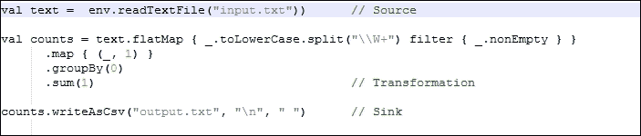

当客户端接受用户的程序时，然后将其转换为数据流。上述程序的数据流可能如下所示：

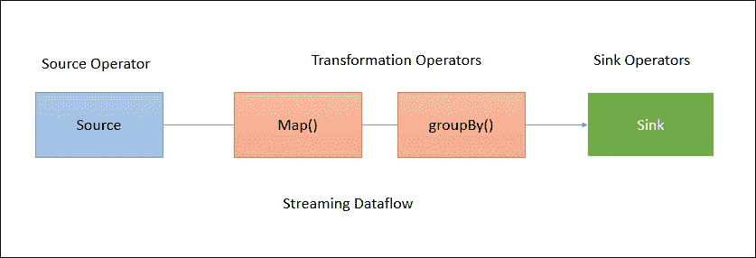

前面的图表显示了程序如何转换为数据流。Flink 数据流默认是并行和分布式的。对于并行数据处理，Flink 对操作符和流进行分区。操作符分区称为子任务。流可以以一对一或重新分布的方式分发数据。

数据直接从源流向映射操作符，因此无需洗牌数据。但对于 GroupBy 操作，Flink 可能需要按键重新分发数据以获得正确的结果。

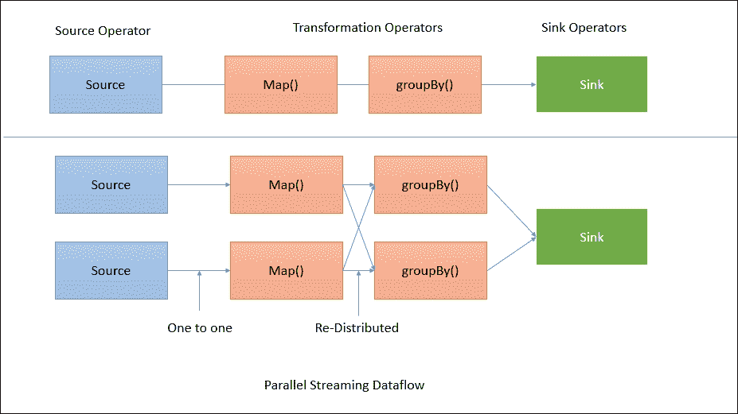

# 特点

在之前的章节中，我们试图了解 Flink 的架构和其执行模型。由于其健壮的架构，Flink 充满了各种功能。

## 高性能

Flink 旨在实现高性能和低延迟。与 Spark 等其他流处理框架不同，您不需要进行许多手动配置以获得最佳性能。Flink 的流水线数据处理与其竞争对手相比具有更好的性能。

## 精确一次性有状态计算

正如我们在前一节中讨论的，Flink 的分布式检查点处理有助于确保每个记录的处理仅一次。在高吞吐量应用程序的情况下，Flink 为我们提供了一个开关，允许至少一次处理。

## 灵活的流式窗口

Flink 支持数据驱动的窗口。这意味着我们可以基于时间、计数或会话设计窗口。窗口也可以定制，这使我们能够在事件流中检测特定模式。

## 容错

Flink 的分布式、轻量级快照机制有助于实现很高程度的容错。它允许 Flink 提供高吞吐量性能和可靠的传递。

## 内存管理

Flink 配备了自己的内存管理，位于 JVM 内部，这使其独立于 Java 的默认垃圾收集器。它通过使用哈希、索引、缓存和排序有效地进行内存管理。

## 优化器

为了避免消耗大量内存的操作（如洗牌、排序等），Flink 的批处理数据处理 API 进行了优化。它还确保使用缓存以避免大量的磁盘 IO 操作。

## 流和批处理在一个平台上

Flink 提供了用于批处理和流处理数据的 API。因此，一旦设置了 Flink 环境，它就可以轻松托管流和批处理应用程序。事实上，Flink 首先考虑流处理，并将批处理视为流处理的特例。

## 库

Flink 拥有丰富的库，可用于机器学习、图处理、关系数据处理等。由于其架构，执行复杂事件处理和警报非常容易。我们将在后续章节中更多地了解这些库。

## 事件时间语义

Flink 支持事件时间语义。这有助于处理事件到达顺序混乱的流。有时事件可能会延迟到达。Flink 的架构允许我们基于时间、计数和会话定义窗口，这有助于处理这种情况。

# 快速开始设置

现在我们了解了 Flink 的架构和其过程模型的细节，是时候开始快速设置并自己尝试一些东西了。Flink 可以在 Windows 和 Linux 机器上运行。

我们需要做的第一件事是下载 Flink 的二进制文件。Flink 可以从 Flink 下载页面下载：[`flink.apache.org/downloads.html`](http://flink.apache.org/downloads.html)。

在下载页面上，您将看到多个选项，如下面的截图所示：

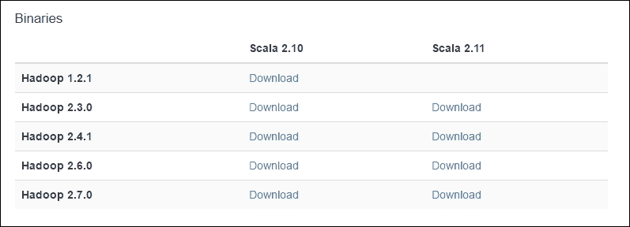

为了安装 Flink，您不需要安装 Hadoop。但是，如果您需要使用 Flink 连接到 Hadoop，那么您需要下载与您拥有的 Hadoop 版本兼容的确切二进制文件。

由于我已经安装了最新版本的**Hadoop 2.7.0**，我将下载与 Hadoop 2.7.0 兼容并基于 Scala 2.11 构建的 Flink 二进制文件。

这是直接下载链接：

[`www-us.apache.org/dist/flink/flink-1.1.4/flink-1.1.4-bin-hadoop27-scala_2.11.tgz`](http://www-us.apache.org/dist/flink/flink-1.1.4/flink-1.1.4-bin-hadoop27-scala_2.11.tgz)

## 先决条件

Flink 需要首先安装 Java。因此，在开始之前，请确保已安装 Java。我在我的机器上安装了 JDK 1.8：


## 在 Windows 上安装

Flink 安装非常容易。只需提取压缩文件并将其存储在所需位置。

提取后，转到文件夹并执行`start-local.bat`：

```java
>cd flink-1.1.4
>bin\start-local.bat

```

然后您会看到 Flink 的本地实例已经启动。

您还可以在`http://localhost:8081/`上检查 Web UI：

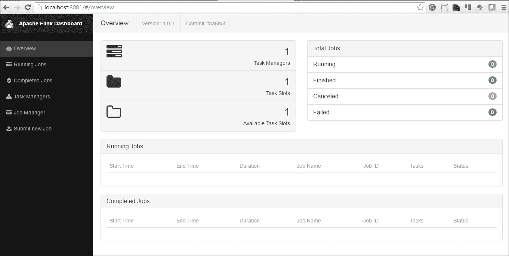

您可以通过按下*Cltr* + *C*来停止 Flink 进程。

## 在 Linux 上安装

与 Windows 类似，在 Linux 机器上安装 Flink 非常容易。我们需要下载二进制文件，将其放在特定文件夹中，然后进行提取和完成：

```java
$sudo tar -xzf flink-1.1.4-bin-hadoop27-scala_2.11.tgz
$cd flink-1.1.4
$bin/start-local.sh 

```

与 Windows 一样，请确保 Java 已安装在机器上。

现在我们已经准备好提交一个 Flink 作业。要停止 Linux 上的本地 Flink 实例，请执行以下命令：

```java
$bin/stop-local.sh

```

# 集群设置

设置 Flink 集群也非常简单。那些有安装 Hadoop 集群背景的人将能够非常容易地理解这些步骤。为了设置集群，让我们假设我们有四台 Linux 机器，每台机器都有适度的配置。至少两个核心和 4 GB RAM 的机器将是一个很好的选择来开始。

我们需要做的第一件事是选择集群设计。由于我们有四台机器，我们将使用一台机器作为**作业管理器**，另外三台机器作为**任务管理器**：

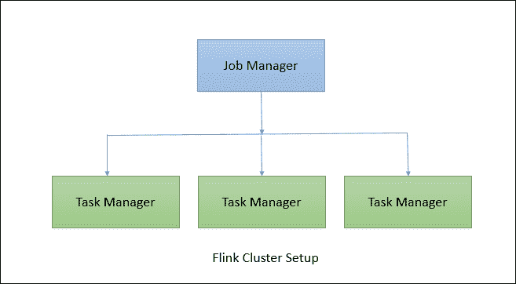

## SSH 配置

为了设置集群，我们首先需要在作业管理器机器上进行无密码连接到任务管理器。需要在创建 SSH 密钥并将其复制到`authorized_keys`上执行以下步骤：

```java
$ssh-keygen

```

这将在`/home/flinkuser/.ssh`文件夹中生成公钥和私钥。现在将公钥复制到任务管理器机器，并在任务管理器上执行以下步骤，以允许从作业管理器进行无密码连接：

```java
sudo mkdir -p /home/flinkuser/.ssh 
sudo touch /home/flinkuser/authorized_keys 
sudo cp /home/flinkuser/.ssh 
 sudo sh -c "cat id_rsa.pub >> /home/flinkuser/.ssh/authorized_keys"

```

确保密钥通过执行以下命令具有受限访问权限：

```java
sudo chmod 700 /home/flinkuser/.ssh
sudo chmod 600 /home/flinkuser/.ssh/authorized_keys 

```

现在您可以从作业管理器机器测试无密码 SSH 连接：

```java
sudo ssh <task-manager-1>
sudo ssh <task-manager-2>
sudo ssh <task-manager-3>

```

### 提示

如果您正在使用任何云服务实例进行安装，请确保从 SSH 启用了 ROOT 登录。为了做到这一点，您需要登录到每台机器：`打开文件/etc/ssh/sshd_config`。然后将值更改为`PermitRootLogin yes`。保存文件后，通过执行命令重新启动 SSH 服务：`sudo service sshd restart`

## Java 安装

接下来，我们需要在每台机器上安装 Java。以下命令将帮助您在基于 Redhat/CentOS 的 UNIX 机器上安装 Java。

```java
wget --no-check-certificate --no-cookies --header "Cookie: 
    oraclelicense=accept-securebackup-cookie" 
    http://download.oracle.com/otn-pub/java/jdk/8u92-b14/jdk-8u92-
    linux-x64.rpm
sudo rpm -ivh jdk-8u92-linux-x64.rpm

```

接下来，我们需要设置`JAVA_HOME`环境变量，以便 Java 可以从任何地方访问。

创建一个`java.sh`文件：

```java
sudo vi /etc/profile.d/java.sh

```

并添加以下内容并保存：

```java
#!/bin/bash
JAVA_HOME=/usr/java/jdk1.8.0_92
PATH=$JAVA_HOME/bin:$PATH
export PATH JAVA_HOME
export CLASSPATH=.

```

使文件可执行并对其进行源操作：

```java
sudo chmod +x /etc/profile.d/java.sh
source /etc/profile.d/java.sh

```

您现在可以检查 Java 是否已正确安装：

```java
$ java -version
java version "1.8.0_92"
Java(TM) SE Runtime Environment (build 1.8.0_92-b14)
Java HotSpot(TM) 64-Bit Server VM (build 25.92-b14, mixed mode)

```

在作业管理器和任务管理器机器上重复这些安装步骤。

## Flink 安装

一旦 SSH 和 Java 安装完成，我们需要下载 Flink 二进制文件并将其提取到特定文件夹中。请注意，所有节点上的安装目录应该相同。

所以让我们开始吧：

```java
cd /usr/local
sudo wget  http://www-eu.apache.org/dist/flink/flink-1.1.4/flink-
    1.1.4-bin-hadoop27-scala_2.11.tgz
sudo tar -xzf flink-1.1.4-bin-hadoop27-scala_2.11.tgz

```

现在二进制文件已经准备好，我们需要进行一些配置。

## 配置

Flink 的配置很简单。我们需要调整一些参数，然后就可以了。大多数配置对作业管理器节点和任务管理器节点都是相同的。所有配置都在`conf/flink-conf.yaml`文件中完成。

以下是作业管理器节点的配置文件：

```java
jobmanager.rpc.address: localhost
jobmanager.rpc.port: 6123
jobmanager.heap.mb: 256
taskmanager.heap.mb: 512
taskmanager.numberOfTaskSlots: 1

```

您可能希望根据节点配置更改作业管理器和任务管理器的内存配置。对于任务管理器，`jobmanager.rpc.address`应填入正确的作业管理器主机名或 IP 地址。

因此，对于所有任务管理器，配置文件应如下所示：

```java
jobmanager.rpc.address: <jobmanager-ip-or-host>
jobmanager.rpc.port: 6123
jobmanager.heap.mb: 256
taskmanager.heap.mb: 512
taskmanager.numberOfTaskSlots: 1

```

我们需要在此文件中添加`JAVA_HOME`详细信息，以便 Flink 确切知道从何处查找 Java 二进制文件：

```java
export JAVA_HOME=/usr/java/jdk1.8.0_92

```

我们还需要在`conf/slaves`文件中添加从节点的详细信息，每个节点占据一个新的单独行。

示例`conf/slaves`文件应如下所示：

```java
<task-manager-1>
<task-manager-2>
<task-manager-3>

```

## 启动守护程序

现在唯一剩下的就是启动 Flink 进程。 我们可以在各个节点上分别启动每个进程，也可以执行`start-cluster.sh`命令在每个节点上启动所需的进程：

```java
bin/start-cluster.sh

```

如果所有配置都正确，那么您会看到集群正在运行。 您可以在`http://<job-manager-ip>:8081/`上检查 Web UI。

以下是 Flink Web UI 的一些快照：

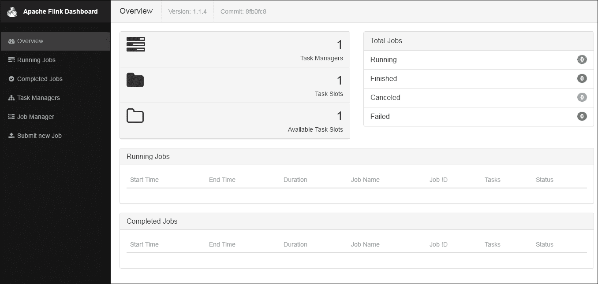

您可以单击**作业管理器**链接以获取以下视图：

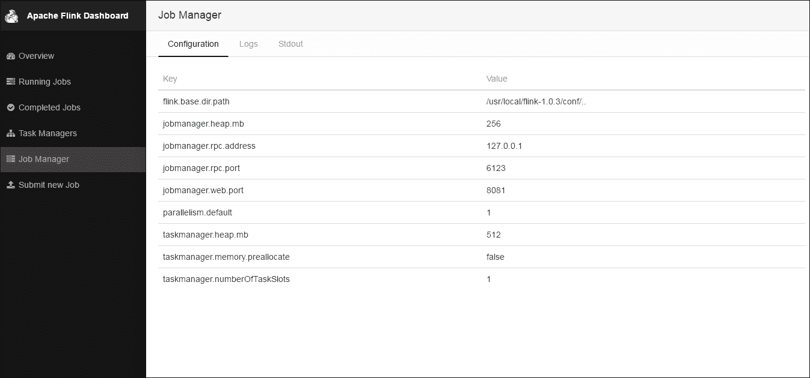

同样，您可以按以下方式查看**任务管理器**视图：

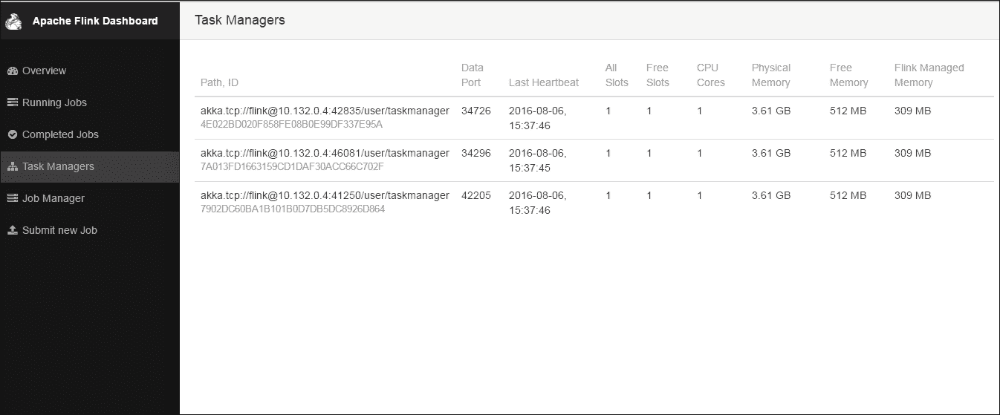

## 添加额外的作业/任务管理器

Flink 为您提供了向正在运行的集群添加额外的作业和任务管理器实例的功能。

在启动守护程序之前，请确保您已按照先前给出的步骤进行操作。

要向现有集群添加额外的作业管理器，请执行以下命令：

```java
sudo bin/jobmanager.sh start cluster

```

同样，我们需要执行以下命令以添加额外的任务管理器：

```java
sudo bin/taskmanager.sh start cluster

```

## 停止守护程序和集群

作业执行完成后，您希望关闭集群。 以下命令用于此目的。

要一次停止整个集群：

```java
sudo bin/stop-cluster.sh

```

要停止单个作业管理器：

```java
sudo bin/jobmanager.sh stop cluster

```

要停止单个任务管理器：

```java
sudo bin/taskmanager.sh stop cluster

```

# 运行示例应用程序

Flink 二进制文件附带了一个示例应用程序，可以直接使用。 让我们从一个非常简单的应用程序开始，单词计数。 在这里，我们将尝试一个从特定端口上的 netcat 服务器读取数据的流式应用程序。

让我们开始吧。 首先通过执行以下命令在端口`9000`上启动 netcat 服务器：

```java
nc -l 9000

```

现在 netcat 服务器将开始监听端口 9000，所以无论您在命令提示符上输入什么都将被发送到 Flink 处理中。

接下来，我们需要启动 Flink 示例程序以侦听 netcat 服务器。 以下是命令：

```java
bin/flink run examples/streaming/SocketTextStreamWordCount.jar --
hostname localhost --port 9000
08/06/2016 10:32:40     Job execution switched to status RUNNING.
08/06/2016 10:32:40     Source: Socket Stream -> Flat Map(1/1)   
switched to SCHEDULED
08/06/2016 10:32:40     Source: Socket Stream -> Flat Map(1/1) 
switched to DEPLOYING
08/06/2016 10:32:40     Keyed Aggregation -> Sink: Unnamed(1/1) 
switched to SCHEDULED
08/06/2016 10:32:40     Keyed Aggregation -> Sink: Unnamed(1/1) 
switched to DEPLOYING
08/06/2016 10:32:40     Source: Socket Stream -> Flat Map(1/1) 
switched to RUNNING
08/06/2016 10:32:40     Keyed Aggregation -> Sink: Unnamed(1/1) 
switched to RUNNING

```

这将启动 Flink 作业执行。 现在您可以在 netcat 控制台上输入一些内容，Flink 将对其进行处理。

例如，在 netcat 服务器上键入以下内容：

```java
$nc -l 9000
hi Hello
Hello World
This distribution includes cryptographic software.  The country in
which you currently reside may have restrictions on the import,
possession, use, and/or re-export to another country, of
encryption software.  BEFORE using any encryption software, please
check your country's laws, regulations and policies concerning the
import, possession, or use, and re-export of encryption software,   
to
see if this is permitted.  See <http://www.wassenaar.org/> for    
more
information.

```

您可以在日志中验证输出：

```java
$ tail -f flink-*-taskmanager-*-flink-instance-*.out
==> flink-root-taskmanager-0-flink-instance-1.out <== 
(see,2) 
(http,1) 
(www,1) 
(wassenaar,1) 
(org,1) 
(for,1) 
(more,1) 
(information,1) 
(hellow,1) 
(world,1) 

==> flink-root-taskmanager-1-flink-instance-1.out <== 
(is,1) 
(permitted,1) 
(see,2) 
(http,1)
(www,1) 
(wassenaar,1) 
(org,1) 
(for,1) 
(more,1) 
(information,1) 

==> flink-root-taskmanager-2-flink-instance-1.out <== 
(hello,1) 
(worlds,1) 
(hi,1) 
(how,1) 
(are,1) 
(you,1) 
(how,2) 
(is,1) 
(it,1) 
(going,1)

```

您还可以查看 Flink Web UI，以查看作业的执行情况。 以下屏幕截图显示了执行的数据流计划：

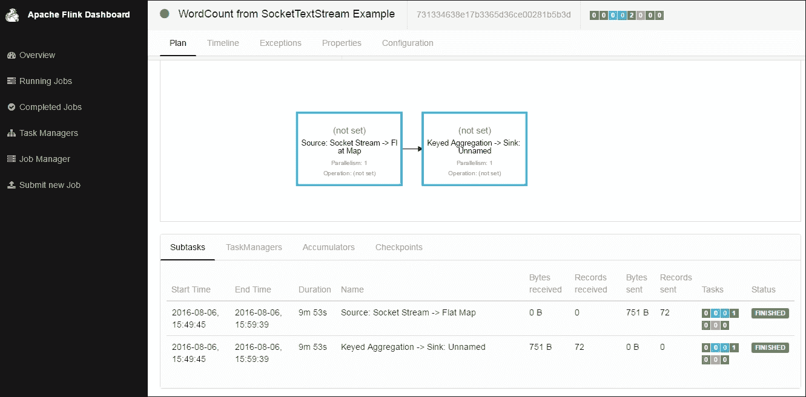

在作业执行中，Flink 有两个运算符。 第一个是源运算符，它从 Socket 流中读取数据。 第二个运算符是转换运算符，它聚合单词的计数。

我们还可以查看作业执行的时间轴：

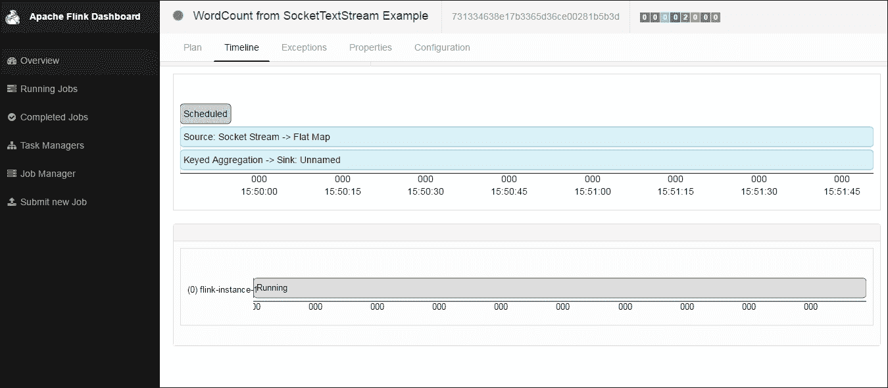

# 摘要

在本章中，我们讨论了 Flink 如何作为大学项目开始，然后成为一款成熟的企业级数据处理平台。 我们查看了 Flink 架构的细节以及其处理模型的工作原理。 我们还学会了如何在本地和集群模式下运行 Flink。

在下一章中，我们将学习 Flink 的流式 API，并查看其细节以及如何使用该 API 来解决我们的数据流处理问题。
