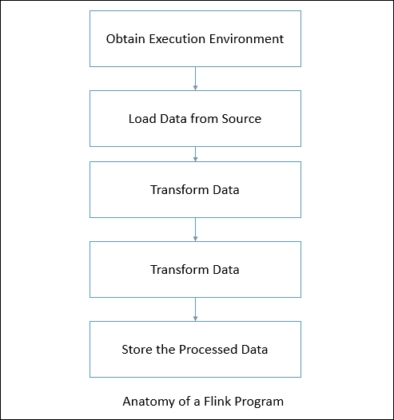
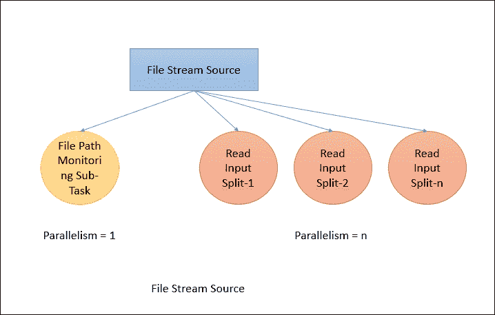
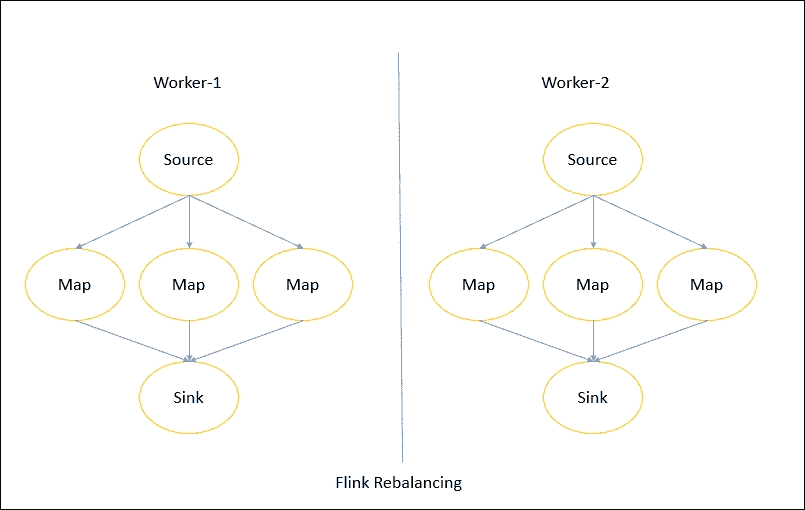
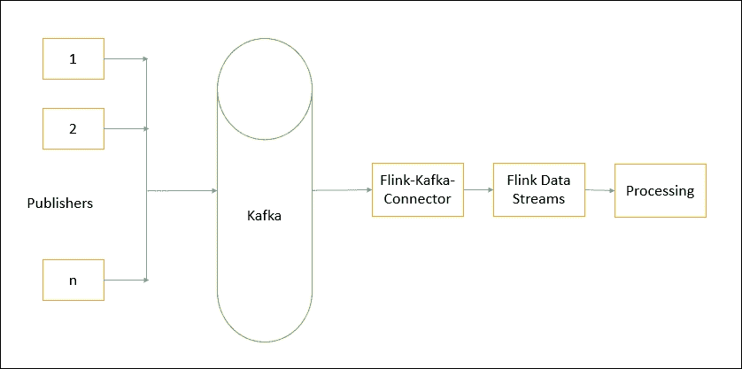
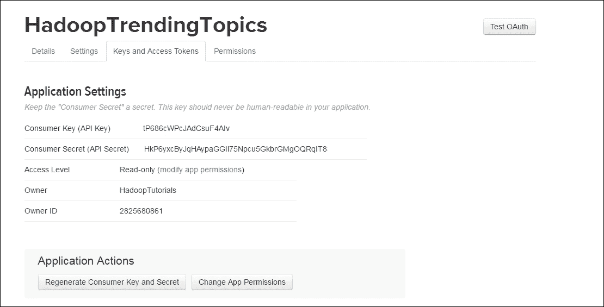
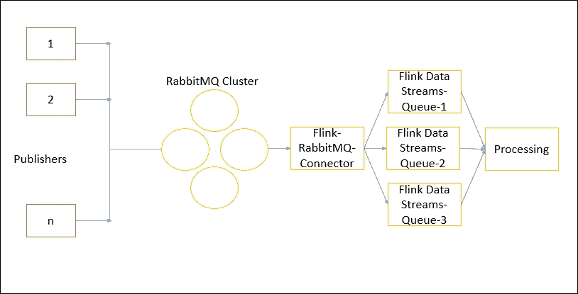
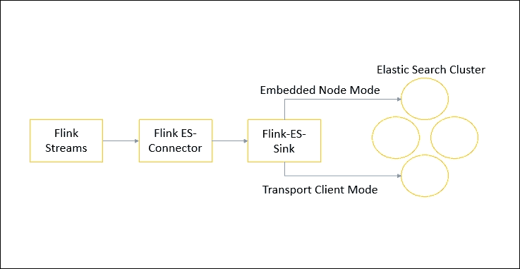
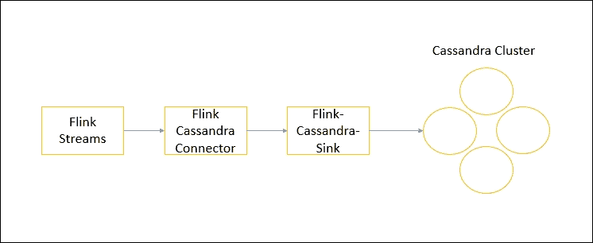
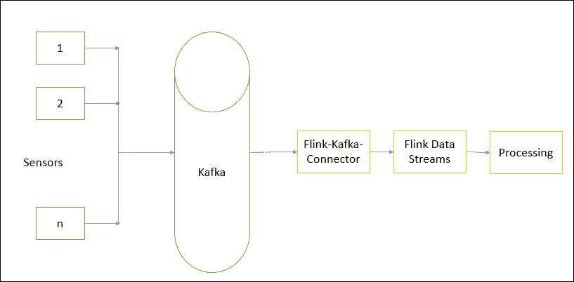

# 第二章：使用 DataStream API 进行数据处理

实时分析目前是一个重要问题。许多不同的领域需要实时处理数据。到目前为止，已经有多种技术试图提供这种能力。像 Storm 和 Spark 这样的技术已经在市场上存在很长时间了。源自**物联网**（**IoT**）的应用程序需要实时或几乎实时地存储、处理和分析数据。为了满足这些需求，Flink 提供了一个名为 DataStream API 的流数据处理 API。

在本章中，我们将详细了解 DataStream API 的相关细节，涵盖以下主题：

+   执行环境

+   数据源

+   转换

+   数据汇

+   连接器

+   用例 - 传感器数据分析

任何 Flink 程序都遵循以下定义的解剖结构：



我们将逐步了解每个步骤以及如何使用此解剖结构的 DataStream API。

# 执行环境

为了开始编写 Flink 程序，我们首先需要获取现有的执行环境或创建一个。根据您要做什么，Flink 支持：

+   获取已存在的 Flink 环境

+   创建本地环境

+   创建远程环境

通常情况下，您只需要使用`getExecutionEnvironment()`。这将根据您的上下文执行正确的操作。如果您在 IDE 中执行本地环境，则会启动本地执行环境。否则，如果您执行 JAR 文件，则 Flink 集群管理器将以分布式方式执行程序。

如果您想自己创建本地或远程环境，那么您也可以选择使用`createLocalEnvironment()`和`createRemoteEnvironment`（`String host`，`int port`，`String`和`.jar`文件）等方法来执行。

# 数据源

数据源是 Flink 程序期望从中获取数据的位置。这是 Flink 程序解剖的第二步。Flink 支持多个预先实现的数据源函数。它还支持编写自定义数据源函数，因此可以轻松编程任何不受支持的内容。首先让我们尝试了解内置的源函数。

## 基于套接字

DataStream API 支持从套接字读取数据。您只需要指定要从中读取数据的主机和端口，它就会完成工作：

```java
socketTextStream(hostName, port); 

```

您还可以选择指定分隔符：

```java
socketTextStream(hostName,port,delimiter) 

```

您还可以指定 API 应尝试获取数据的最大次数：

```java
socketTextStream(hostName,port,delimiter, maxRetry) 

```

## 基于文件

您还可以选择使用 Flink 中基于文件的源函数从文件源中流式传输数据。您可以使用`readTextFile(String path)`从指定路径的文件中流式传输数据。默认情况下，它将读取`TextInputFormat`并逐行读取字符串。

如果文件格式不是文本，您可以使用这些函数指定相同的内容：

```java
readFile(FileInputFormat<Out> inputFormat, String path) 

```

Flink 还支持读取文件流，因为它们使用`readFileStream()`函数生成：

```java
readFileStream(String filePath, long intervalMillis, FileMonitoringFunction.WatchType watchType) 

```

您只需要指定文件路径、轮询间隔（应轮询文件路径的时间间隔）和观察类型。观察类型包括三种类型：

+   当系统应该仅处理新文件时，使用`FileMonitoringFunction.WatchType.ONLY_NEW_FILES`

+   当系统应该仅处理文件的附加内容时，使用`FileMonitoringFunction.WatchType.PROCESS_ONLY_APPENDED`

+   当系统应该重新处理文件的附加内容以及文件中的先前内容时，使用`FileMonitoringFunction.WatchType.REPROCESS_WITH_APPENDED`

如果文件不是文本文件，那么我们可以使用以下函数，它让我们定义文件输入格式：

```java
readFile(fileInputFormat, path, watchType, interval, pathFilter, typeInfo) 

```

在内部，它将读取文件任务分为两个子任务。一个子任务仅基于给定的`WatchType`监视文件路径。第二个子任务并行进行实际的文件读取。监视文件路径的子任务是一个非并行子任务。它的工作是根据轮询间隔不断扫描文件路径，并报告要处理的文件，拆分文件，并将拆分分配给相应的下游线程：



# 转换

数据转换将数据流从一种形式转换为另一种形式。输入可以是一个或多个数据流，输出也可以是零个、一个或多个数据流。现在让我们逐个尝试理解每个转换。

## 映射

这是最简单的转换之一，其中输入是一个数据流，输出也是一个数据流。

在 Java 中：

```java
inputStream.map(new MapFunction<Integer, Integer>() { 
  @Override 
  public Integer map(Integer value) throws Exception { 
        return 5 * value; 
      } 
    }); 

```

在 Scala 中：

```java
inputStream.map { x => x * 5 } 

```

## FlatMap

FlatMap 接受一个记录并输出零个、一个或多个记录。

在 Java 中：

```java
inputStream.flatMap(new FlatMapFunction<String, String>() { 
    @Override 
    public void flatMap(String value, Collector<String> out) 
        throws Exception { 
        for(String word: value.split(" ")){ 
            out.collect(word); 
        } 
    } 
}); 

```

在 Scala 中：

```java
inputStream.flatMap { str => str.split(" ") } 

```

## 过滤

过滤函数评估条件，然后，如果结果为真，则仅发出记录。过滤函数可以输出零条记录。

在 Java 中：

```java
inputStream.filter(new FilterFunction<Integer>() { 
    @Override 
    public boolean filter(Integer value) throws Exception { 
        return value != 1; 
    } 
}); 

```

在 Scala 中：

```java
inputStream.filter { _ != 1 } 

```

## KeyBy

KeyBy 根据键逻辑地将流分区。在内部，它使用哈希函数来分区流。它返回`KeyedDataStream`。

在 Java 中：

```java
inputStream.keyBy("someKey"); 

```

在 Scala 中：

```java
inputStream.keyBy("someKey") 

```

## 减少

Reduce 通过将上次减少的值与当前值进行减少来展开`KeyedDataStream`。以下代码执行了`KeyedDataStream`的求和减少。

在 Java 中：

```java
keyedInputStream. reduce(new ReduceFunction<Integer>() { 
    @Override 
    public Integer reduce(Integer value1, Integer value2) 
    throws Exception { 
        return value1 + value2; 
    } 
}); 

```

在 Scala 中：

```java
keyedInputStream. reduce { _ + _ } 

```

## 折叠

Fold 通过将上次的文件夹流与当前记录组合起来来展开`KeyedDataStream`。它发出一个数据流。

在 Java 中：

```java
keyedInputStream keyedStream.fold("Start", new FoldFunction<Integer, String>() { 
    @Override 
    public String fold(String current, Integer value) { 
        return current + "=" + value; 
    } 
  }); 

```

在 Scala 中：

```java
keyedInputStream.fold("Start")((str, i) => { str + "=" + i }) 

```

应用于流(1,2,3,4,5)的前面给定的函数将发出这样的流：`Start=1=2=3=4=5`

## 聚合

DataStream API 支持各种聚合，如`min`、`max`、`sum`等。这些函数可以应用于`KeyedDataStream`，以便进行滚动聚合。

在 Java 中：

```java
keyedInputStream.sum(0) 
keyedInputStream.sum("key") 
keyedInputStream.min(0) 
keyedInputStream.min("key") 
keyedInputStream.max(0) 
keyedInputStream.max("key") 
keyedInputStream.minBy(0) 
keyedInputStream.minBy("key") 
keyedInputStream.maxBy(0) 
keyedInputStream.maxBy("key") 

```

在 Scala 中：

```java
keyedInputStream.sum(0) 
keyedInputStream.sum("key") 
keyedInputStream.min(0) 
keyedInputStream.min("key") 
keyedInputStream.max(0) 
keyedInputStream.max("key") 
keyedInputStream.minBy(0) 
keyedInputStream.minBy("key") 
keyedInputStream.maxBy(0) 
keyedInputStream.maxBy("key") 

```

`max`和`maxBy`之间的区别在于 max 返回流中的最大值，但`maxBy`返回具有最大值的键。对`min`和`minBy`也适用相同的规则。

## 窗口

`window`函数允许按时间或其他条件对现有的`KeyedDataStreams`进行分组。以下转换通过 10 秒的时间窗口发出记录组。

在 Java 中：

```java
inputStream.keyBy(0).window(TumblingEventTimeWindows.of(Time.seconds(10))); 

```

在 Scala 中：

```java
inputStream.keyBy(0).window(TumblingEventTimeWindows.of(Time.seconds(10))) 

```

Flink 定义了数据的切片，以处理（可能是）无限的数据流。这些切片称为窗口。这种切片有助于通过应用转换来以块的方式处理数据。要对流进行窗口处理，我们需要分配一个键，以便进行分发，并且需要一个描述在窗口流上执行什么转换的函数。

要将流切片成窗口，我们可以使用预先实现的 Flink 窗口分配器。我们有选项，如滚动窗口、滑动窗口、全局和会话窗口。Flink 还允许您通过扩展`WindowAssginer`类来编写自定义窗口分配器。让我们尝试理解这些各种分配器是如何工作的。

### 全局窗口

全局窗口是永不结束的窗口，除非由触发器指定。通常在这种情况下，每个元素都分配给一个单一的按键全局窗口。如果我们不指定任何触发器，将永远不会触发任何计算。

### 滚动窗口

根据特定时间创建滚动窗口。它们是固定长度的窗口，不重叠。当您需要在特定时间内对元素进行计算时，滚动窗口应该是有用的。例如，10 分钟的滚动窗口可用于计算在 10 分钟内发生的一组事件。

### 滑动窗口

滑动窗口类似于滚动窗口，但它们是重叠的。它们是固定长度的窗口，通过用户给定的窗口滑动参数与前一个窗口重叠。当您想要计算在特定时间范围内发生的一组事件时，这种窗口处理非常有用。

### 会话窗口

会话窗口在需要根据输入数据决定窗口边界时非常有用。会话窗口允许窗口开始时间和窗口大小的灵活性。我们还可以提供会话间隙配置参数，指示在考虑会话关闭之前等待多长时间。

## WindowAll

`windowAll`函数允许对常规数据流进行分组。通常这是一个非并行的数据转换，因为它在非分区数据流上运行。

在 Java 中：

```java
inputStream.windowAll(TumblingEventTimeWindows.of(Time.seconds(10))); 

```

在 Scala 中：

```java
inputStream.windowAll(TumblingEventTimeWindows.of(Time.seconds(10))) 

```

与常规数据流函数类似，我们也有窗口数据流函数。唯一的区别是它们适用于窗口化的数据流。因此，窗口缩减类似于`Reduce`函数，窗口折叠类似于`Fold`函数，还有聚合函数。

## 联合

`Union`函数执行两个或多个数据流的并集。这会并行地组合数据流。如果我们将一个流与自身组合，则每个记录都会输出两次。

在 Java 中：

```java
inputStream. union(inputStream1, inputStream2, ...); 

```

在 Scala 中：

```java
inputStream. union(inputStream1, inputStream2, ...) 

```

## 窗口连接

我们还可以通过一些键在一个公共窗口中连接两个数据流。下面的示例显示了在`5`秒的窗口中连接两个流的情况，其中第一个流的第一个属性的连接条件等于另一个流的第二个属性。

在 Java 中：

```java
inputStream. join(inputStream1) 
   .where(0).equalTo(1) 
    .window(TumblingEventTimeWindows.of(Time.seconds(5))) 
    .apply (new JoinFunction () {...}); 

```

在 Scala 中：

```java
inputStream. join(inputStream1) 
    .where(0).equalTo(1) 
    .window(TumblingEventTimeWindows.of(Time.seconds(5))) 
    .apply { ... }
```

## 分割

此函数根据条件将流拆分为两个或多个流。当您获得混合流并且可能希望分别处理每个数据时，可以使用此函数。

在 Java 中：

```java
SplitStream<Integer> split = inputStream.split(new OutputSelector<Integer>() { 
    @Override 
    public Iterable<String> select(Integer value) { 
        List<String> output = new ArrayList<String>(); 
        if (value % 2 == 0) { 
            output.add("even"); 
        } 
        else { 
            output.add("odd"); 
        } 
        return output; 
    } 
}); 

```

在 Scala 中：

```java
val split = inputStream.split( 
  (num: Int) => 
    (num % 2) match { 
      case 0 => List("even") 
      case 1 => List("odd") 
    } 
) 

```

## 选择

此函数允许您从拆分流中选择特定流。

在 Java 中：

```java
SplitStream<Integer> split; 
DataStream<Integer> even = split.select("even"); 
DataStream<Integer> odd = split.select("odd"); 
DataStream<Integer> all = split.select("even","odd"); 

```

在 Scala 中：

```java
val even = split select "even" 
val odd = split select "odd" 
val all = split.select("even","odd") 

```

## 项目

`Project`函数允许您从事件流中选择一部分属性，并仅将选定的元素发送到下一个处理流。

在 Java 中：

```java
DataStream<Tuple4<Integer, Double, String, String>> in = // [...] 
DataStream<Tuple2<String, String>> out = in.project(3,2); 

```

在 Scala 中：

```java
val in : DataStream[(Int,Double,String)] = // [...] 
val out = in.project(3,2) 

```

前面的函数从给定记录中选择属性编号`2`和`3`。以下是示例输入和输出记录：

```java
(1,10.0, A, B )=> (B,A) 
(2,20.0, C, D )=> (D,C) 

```

# 物理分区

Flink 允许我们对流数据进行物理分区。您可以选择提供自定义分区。让我们看看不同类型的分区。

## 自定义分区

如前所述，您可以提供分区器的自定义实现。

在 Java 中：

```java
inputStream.partitionCustom(partitioner, "someKey"); 
inputStream.partitionCustom(partitioner, 0); 

```

在 Scala 中：

```java
inputStream.partitionCustom(partitioner, "someKey") 
inputStream.partitionCustom(partitioner, 0) 

```

在编写自定义分随机器时，您需要确保实现有效的哈希函数。

## 随机分区

随机分区以均匀的方式随机分区数据流。

在 Java 中：

```java
inputStream.shuffle(); 

```

在 Scala 中：

```java
inputStream.shuffle() 

```

## 重新平衡分区

这种类型的分区有助于均匀分布数据。它使用轮询方法进行分发。当数据发生偏斜时，这种类型的分区是很好的。

在 Java 中：

```java
inputStream.rebalance(); 

```

在 Scala 中：

```java
inputStream.rebalance() 

```

## 重新缩放

重新缩放用于在操作之间分发数据，对数据子集执行转换并将它们组合在一起。这种重新平衡仅在单个节点上进行，因此不需要在网络上进行任何数据传输。

以下图表显示了分布情况：



在 Java 中：

```java
inputStream.rescale(); 

```

在 Scala 中：

```java
inputStream.rescale() 

```

## 广播

广播将所有记录分发到每个分区。这会将每个元素扩展到所有分区。

在 Java 中：

```java
inputStream.broadcast(); 

```

在 Scala 中：

```java
inputStream.broadcast() 

```

# 数据接收器

数据转换完成后，我们需要将结果保存到某个地方。以下是 Flink 提供的一些保存结果的选项：

+   `writeAsText()`: 逐行将记录写为字符串。

+   `writeAsCsV()`: 将元组写为逗号分隔值文件。还可以配置行和字段分隔符。

+   `print()/printErr()`: 将记录写入标准输出。您也可以选择写入标准错误。

+   `writeUsingOutputFormat()`: 您还可以选择提供自定义输出格式。在定义自定义格式时，您需要扩展负责序列化和反序列化的`OutputFormat`。

+   `writeToSocket()`: Flink 还支持将数据写入特定的套接字。需要定义`SerializationSchema`以进行适当的序列化和格式化。

# 事件时间和水印

Flink Streaming API 受到 Google Data Flow 模型的启发。它支持其流式 API 的不同时间概念。一般来说，在流式环境中有三个地方可以捕获时间。它们如下

## 事件时间

事件发生的时间是指其产生设备上的时间。例如，在物联网项目中，传感器捕获读数的时间。通常这些事件时间需要在记录进入 Flink 之前嵌入。在处理时，这些时间戳被提取并考虑用于窗口处理。事件时间处理可以用于无序事件。

## 处理时间

处理时间是机器执行数据处理流的时间。处理时间窗口只考虑事件被处理的时间戳。处理时间是流处理的最简单方式，因为它不需要处理机器和生产机器之间的任何同步。在分布式异步环境中，处理时间不提供确定性，因为它取决于记录在系统中流动的速度。

## 摄取时间

这是特定事件进入 Flink 的时间。所有基于时间的操作都参考这个时间戳。摄取时间比处理时间更昂贵，但它提供可预测的结果。摄取时间程序无法处理任何无序事件，因为它只在事件进入 Flink 系统后分配时间戳。

以下是一个示例，显示了如何设置事件时间和水印。在摄取时间和处理时间的情况下，我们只需要时间特征，水印生成会自动处理。以下是相同的代码片段。

在 Java 中：

```java
final StreamExecutionEnvironment env = StreamExecutionEnvironment.getExecutionEnvironment(); 
env.setStreamTimeCharacteristic(TimeCharacteristic.ProcessingTime); 
//or 
env.setStreamTimeCharacteristic(TimeCharacteristic.IngestionTime); 

```

在 Scala 中：

```java
val env = StreamExecutionEnvironment.getExecutionEnvironment 
env.setStreamTimeCharacteristic(TimeCharacteristic.ProcessingTime) 
//or  
env.setStreamTimeCharacteristic(TimeCharacteristic.IngestionTime) 

```

在事件时间流程序中，我们需要指定分配水印和时间戳的方式。有两种分配水印和时间戳的方式：

+   直接从数据源属性

+   使用时间戳分配器

要使用事件时间流，我们需要按照以下方式分配时间特征

在 Java 中：

```java
final StreamExecutionEnvironment env = StreamExecutionEnvironment.getExecutionEnvironment(); 
env.setStreamTimeCharacteristic(TimeCharacteristic.EventTime; 

```

在 Scala 中：

```java
val env = StreamExecutionEnvironment.getExecutionEnvironment 
env.setStreamTimeCharacteristic(TimeCharacteristic.EventTime) 

```

在存储记录时，最好同时存储事件时间。Flink 还支持一些预定义的时间戳提取器和水印生成器。参考[`ci.apache.org/projects/flink/flink-docs-release-1.2/dev/event_timestamp_extractors.html`](https://ci.apache.org/projects/flink/flink-docs-release-1.2/dev/event_timestamp_extractors.html)。

# 连接器

Apache Flink 支持允许在各种技术之间读取/写入数据的各种连接器。让我们更多地了解这一点。

## Kafka 连接器

Kafka 是一个发布-订阅的分布式消息队列系统，允许用户向特定主题发布消息；然后将其分发给主题的订阅者。Flink 提供了在 Flink Streaming 中将 Kafka 消费者定义为数据源的选项。为了使用 Flink Kafka 连接器，我们需要使用特定的 JAR 文件。

以下图表显示了 Flink Kafka 连接器的工作原理：



我们需要使用以下 Maven 依赖项来使用连接器。我一直在使用 Kafka 版本 0.9，所以我将在`pom.xml`中添加以下依赖项：

```java
<dependency> 
  <groupId>org.apache.flink</groupId> 
  <artifactId>flink-connector-kafka-0.9_2.11/artifactId> 
  <version>1.1.4</version> 
</dependency> 

```

现在让我们试着理解如何将 Kafka 消费者作为 Kafka 源来使用：

在 Java 中：

```java
Properties properties = new Properties(); 
  properties.setProperty("bootstrap.servers", "localhost:9092"); 
  properties.setProperty("group.id", "test"); 
DataStream<String> input  = env.addSource(new FlinkKafkaConsumer09<String>("mytopic", new SimpleStringSchema(), properties)); 

```

在 Scala 中：

```java
val properties = new Properties(); 
properties.setProperty("bootstrap.servers", "localhost:9092"); 
// only required for Kafka 0.8 
properties.setProperty("zookeeper.connect", "localhost:2181"); 
properties.setProperty("group.id", "test"); 
stream = env 
    .addSource(new FlinkKafkaConsumer09String, properties)) 
    .print 

```

在上述代码中，我们首先设置了 Kafka 主机和 zookeeper 主机和端口的属性。接下来，我们需要指定主题名称，在本例中为`mytopic`。因此，如果任何消息发布到`mytopic`主题，它们将被 Flink 流处理。

如果您以不同的格式获取数据，那么您也可以为反序列化指定自定义模式。默认情况下，Flink 支持字符串和 JSON 反序列化器。

为了实现容错，我们需要在 Flink 中启用检查点。Flink 会定期对状态进行快照。在发生故障时，它将恢复到最后一个检查点，然后重新启动处理。

我们还可以将 Kafka 生产者定义为接收器。这将把数据写入 Kafka 主题。以下是将数据写入 Kafka 主题的方法：

在 Scala 中：

```java
stream.addSink(new FlinkKafkaProducer09<String>("localhost:9092", "mytopic", new SimpleStringSchema())); 

```

在 Java 中：

```java
stream.addSink(new FlinkKafkaProducer09String)) 

```

## Twitter 连接器

如今，从 Twitter 获取数据并处理数据非常重要。许多公司使用 Twitter 数据来进行各种产品、服务、电影、评论等的情感分析。Flink 提供 Twitter 连接器作为一种数据源。要使用连接器，您需要拥有 Twitter 账户。一旦您拥有了 Twitter 账户，您需要创建一个 Twitter 应用程序并生成用于连接器的身份验证密钥。以下是一个链接，可以帮助您生成令牌：[`dev.twitter.com/oauth/overview/application-owner-access-tokens`](https://dev.twitter.com/oauth/overview/application-owner-access-tokens)。

Twitter 连接器可以通过 Java 或 Scala API 使用：



生成令牌后，我们可以开始编写程序从 Twitter 获取数据。首先我们需要添加一个 Maven 依赖项：

```java
<dependency> 
  <groupId>org.apache.flink</groupId> 
  <artifactId>flink-connector-twitter_2.11/artifactId> 
  <version>1.1.4</version> 
</dependency> 

```

接下来我们将 Twitter 作为数据源。以下是示例代码：

在 Java 中：

```java
Properties props = new Properties(); 
props.setProperty(TwitterSource.CONSUMER_KEY, ""); 
props.setProperty(TwitterSource.CONSUMER_SECRET, ""); 
props.setProperty(TwitterSource.TOKEN, ""); 
props.setProperty(TwitterSource.TOKEN_SECRET, ""); 
DataStream<String> streamSource = env.addSource(new TwitterSource(props)); 

```

在 Scala 中：

```java
val props = new Properties(); 
props.setProperty(TwitterSource.CONSUMER_KEY, ""); 
props.setProperty(TwitterSource.CONSUMER_SECRET, ""); 
props.setProperty(TwitterSource.TOKEN, ""); 
props.setProperty(TwitterSource.TOKEN_SECRET, ""); 
DataStream<String> streamSource = env.addSource(new TwitterSource(props)); 

```

在上述代码中，我们首先为我们得到的令牌设置属性。然后我们添加`TwitterSource`。如果给定的信息是正确的，那么您将开始从 Twitter 获取数据。`TwitterSource`以 JSON 字符串格式发出数据。示例 Twitter JSON 如下所示：

```java
{ 
... 
"text": ""Loyalty 3.0: How to Revolutionize Customer &amp; Employee Engagement with Big Data &amp; #Gamification" can be ordered here: http://t.co/1XhqyaNjuR", 
  "geo": null, 
  "retweeted": false, 
  "in_reply_to_screen_name": null, 
  "possibly_sensitive": false, 
  "truncated": false, 
  "lang": "en", 
    "hashtags": [{ 
      "text": "Gamification", 
      "indices": [90, 
      103] 
    }], 
  }, 
  "in_reply_to_status_id_str": null, 
  "id": 330094515484508160 
... 
} 

```

`TwitterSource`提供各种端点。默认情况下，它使用`StatusesSampleEndpoint`，返回一组随机推文。如果您需要添加一些过滤器，并且不想使用默认端点，可以实现`TwitterSource.EndpointInitializer`接口。

现在我们知道如何从 Twitter 获取数据，然后可以根据我们的用例决定如何处理这些数据。我们可以处理、存储或分析数据。

## RabbitMQ 连接器

RabbitMQ 是一个广泛使用的分布式、高性能的消息队列系统。它用作高吞吐量操作的消息传递系统。它允许您创建分布式消息队列，并在队列中包括发布者和订阅者。可以在以下链接进行更多关于 RabbitMQ 的阅读[`www.rabbitmq.com/`](https://www.rabbitmq.com/)

Flink 支持从 RabbitMQ 获取和发布数据。它提供了一个连接器，可以作为数据流的数据源。

为了使 RabbitMQ 连接器工作，我们需要提供以下信息：

+   RabbitMQ 配置，如主机、端口、用户凭据等。

+   队列，您希望订阅的 RabbitMQ 队列的名称。

+   关联 ID 是 RabbitMQ 的一个特性，用于在分布式世界中通过唯一 ID 相关请求和响应。Flink RabbitMQ 连接器提供了一个接口，可以根据您是否使用它来设置为 true 或 false。

+   反序列化模式--RabbitMQ 以序列化方式存储和传输数据，以避免网络流量。因此，当接收到消息时，订阅者应该知道如何反序列化消息。Flink 连接器为我们提供了一些默认的反序列化器，如字符串反序列化器。

RabbitMQ 源为我们提供了以下关于流传递的选项：

+   确切一次：使用 RabbitMQ 关联 ID 和 Flink 检查点机制与 RabbitMQ 事务

+   至少一次：当启用 Flink 检查点但未设置 RabbitMQ 关联 ID 时

+   RabbitMQ 自动提交模式没有强有力的交付保证

以下是一个图表，可以帮助您更好地理解 RabbitMQ 连接器：



现在让我们看看如何编写代码来使这个连接器工作。与其他连接器一样，我们需要向代码添加一个 Maven 依赖项：

```java
<dependency> 
  <groupId>org.apache.flink</groupId> 
  <artifactId>flink-connector-rabbitmq_2.11/artifactId> 
  <version>1.1.4</version> 
</dependency> 

```

以下代码段显示了如何在 Java 中使用 RabbitMQ 连接器：

```java
//Configurations 
RMQConnectionConfig connectionConfig = new RMQConnectionConfig.Builder() 
.setHost(<host>).setPort(<port>).setUserName(..) 
.setPassword(..).setVirtualHost("/").build(); 

//Get Data Stream without correlation ids 
DataStream<String> streamWO = env.addSource(new RMQSource<String>(connectionConfig, "my-queue", new SimpleStringSchema())) 
  .print 
//Get Data Stream with correlation ids 
DataStream<String> streamW = env.addSource(new RMQSource<String>(connectionConfig, "my-queue", true, new SimpleStringSchema())) 
  .print 

```

同样，在 Scala 中，代码可以写成如下形式：

```java
val connectionConfig = new RMQConnectionConfig.Builder() 
.setHost(<host>).setPort(<port>).setUserName(..) 
.setPassword(..).setVirtualHost("/").build() 
streamsWOIds = env 
    .addSource(new RMQSourceString) 
    .print 

streamsWIds = env 
    .addSource(new RMQSourceString) 
    .print 

```

我们还可以使用 RabbitMQ 连接器作为 Flink sink。如果要将处理过的数据发送回不同的 RabbitMQ 队列，可以按以下方式操作。我们需要提供三个重要的配置：

+   RabbitMQ 配置

+   队列名称--要将处理过的数据发送回哪里

+   序列化模式--RabbitMQ 的模式，将数据转换为字节

以下是 Java 中的示例代码，展示了如何将此连接器用作 Flink sink：

```java
RMQConnectionConfig connectionConfig = new RMQConnectionConfig.Builder() 
.setHost(<host>).setPort(<port>).setUserName(..) 
.setPassword(..).setVirtualHost("/").build(); 
stream.addSink(new RMQSink<String>(connectionConfig, "target-queue", new StringToByteSerializer())); 

```

在 Scala 中也可以这样做：

```java
val connectionConfig = new RMQConnectionConfig.Builder() 
.setHost(<host>).setPort(<port>).setUserName(..) 
.setPassword(..).setVirtualHost("/").build() 
stream.addSink(new RMQSinkString。

在许多用例中，您可能希望使用 Flink 处理数据，然后将其存储在 ElasticSearch 中。为此，Flink 支持 ElasticSearch 连接器。到目前为止，ElasticSearch 已经发布了两个主要版本。Flink 支持它们两个。

对于 ElasticSearch 1.X，需要添加以下 Maven 依赖项：

```java
<dependency> 
  <groupId>org.apache.flink</groupId> 
  <artifactId>flink-connector-elasticsearch_2.11</artifactId> 
  <version>1.1.4</version> 
</dependency> 

```

Flink 连接器提供了一个 sink，用于将数据写入 ElasticSearch。它使用两种方法连接到 ElasticSearch：

+   嵌入式节点

+   传输客户端

以下图表说明了这一点：



### 嵌入式节点模式

在嵌入式节点模式中，sink 使用 BulkProcessor 将文档发送到 ElasticSearch。我们可以配置在将文档发送到 ElasticSearch 之前缓冲多少个请求。

以下是代码片段：

```java
DataStream<String> input = ...; 

Map<String, String> config = Maps.newHashMap(); 
config.put("bulk.flush.max.actions", "1"); 
config.put("cluster.name", "cluster-name"); 

input.addSink(new ElasticsearchSink<>(config, new IndexRequestBuilder<String>() { 
    @Override 
    public IndexRequest createIndexRequest(String element, RuntimeContext ctx) { 
        Map<String, Object> json = new HashMap<>(); 
        json.put("data", element); 

        return Requests.indexRequest() 
                .index("my-index") 
                .type("my-type") 
                .source(json); 
    } 
})); 

```

在上述代码片段中，我们创建了一个哈希映射，其中包含集群名称以及在发送请求之前要缓冲多少个文档的配置。然后我们将 sink 添加到流中，指定要存储的索引、类型和文档。在 Scala 中也有类似的代码：

```java
val input: DataStream[String] = ... 

val config = new util.HashMap[String, String] 
config.put("bulk.flush.max.actions", "1") 
config.put("cluster.name", "cluster-name") 

text.addSink(new ElasticsearchSink(config, new IndexRequestBuilder[String] { 
  override def createIndexRequest(element: String, ctx: RuntimeContext): IndexRequest = { 
    val json = new util.HashMap[String, AnyRef] 
    json.put("data", element) 
    Requests.indexRequest.index("my-index").`type`("my-type").source(json) 
  } 
})) 

```

### 传输客户端模式

ElasticSearch 允许通过端口 9300 的传输客户端进行连接。Flink 支持通过其连接器使用这些连接。这里唯一需要提到的是配置中存在的所有 ElasticSearch 节点。

以下是 Java 中的片段：

```java
DataStream<String> input = ...; 

Map<String, String> config = Maps.newHashMap(); 
config.put("bulk.flush.max.actions", "1"); 
config.put("cluster.name", "cluster-name"); 

List<TransportAddress> transports = new ArrayList<String>(); 
transports.add(new InetSocketTransportAddress("es-node-1", 9300)); 
transports.add(new InetSocketTransportAddress("es-node-2", 9300)); 
transports.add(new InetSocketTransportAddress("es-node-3", 9300)); 

input.addSink(new ElasticsearchSink<>(config, transports, new IndexRequestBuilder<String>() { 
    @Override 
    public IndexRequest createIndexRequest(String element, RuntimeContext ctx) { 
        Map<String, Object> json = new HashMap<>(); 
        json.put("data", element); 

        return Requests.indexRequest() 
                .index("my-index") 
                .type("my-type") 
                .source(json); 
    } 
})); 

```

在这里，我们还提供了有关集群名称、节点、端口、发送的最大请求数等的详细信息。在 Scala 中，类似的代码可以编写如下：

```java
val input: DataStream[String] = ... 

val config = new util.HashMap[String, String] 
config.put("bulk.flush.max.actions", "1") 
config.put("cluster.name", "cluster-name") 

val transports = new ArrayList[String] 
transports.add(new InetSocketTransportAddress("es-node-1", 9300)) 
transports.add(new InetSocketTransportAddress("es-node-2", 9300)) 
transports.add(new InetSocketTransportAddress("es-node-3", 9300)) 

text.addSink(new ElasticsearchSink(config, transports, new IndexRequestBuilder[String] { 
  override def createIndexRequest(element: String, ctx: RuntimeContext): IndexRequest = { 
    val json = new util.HashMap[String, AnyRef] 
    json.put("data", element) 
    Requests.indexRequest.index("my-index").`type`("my-type").source(json) 
  } 
})) 

```

## Cassandra 连接器

Cassandra 是一个分布式、低延迟的 NoSQL 数据库。它是一个基于键值的数据库。许多高吞吐量应用程序将 Cassandra 用作其主要数据库。Cassandra 使用分布式集群模式，其中没有主从架构。任何节点都可以进行读取和写入。有关 Cassandra 的更多信息可以在此处找到：[`cassandra.apache.org/`](http://cassandra.apache.org/)。

Apache Flink 提供了一个连接器，可以将数据写入 Cassandra。在许多应用程序中，人们可能希望将来自 Flink 的流数据存储到 Cassandra 中。以下图表显示了 Cassandra sink 的简单设计：



与其他连接器一样，要获得此连接器，我们需要将其添加为 Maven 依赖项：

```java
<dependency> 
  <groupId>org.apache.flink</groupId> 
  <artifactId>flink-connector-cassandra_2.11</artifactId> 
  <version>1.1.4</version> 
</dependency>
```

一旦添加了依赖项，我们只需要添加 Cassandra sink 及其配置，如下所示：

在 Java 中：

```java
CassandraSink.addSink(input) 
  .setQuery("INSERT INTO cep.events (id, message) values (?, ?);") 
  .setClusterBuilder(new ClusterBuilder() { 
    @Override 
    public Cluster buildCluster(Cluster.Builder builder) { 
      return builder.addContactPoint("127.0.0.1").build(); 
    } 
  }) 
  .build() 

```

上述代码将数据流写入名为**events**的表中。该表期望事件 ID 和消息。在 Scala 中也是如此：

```java
CassandraSink.addSink(input) 
  .setQuery("INSERT INTO cep.events (id, message) values (?, ?);") 
  .setClusterBuilder(new ClusterBuilder() { 
    @Override 
    public Cluster buildCluster(Cluster.Builder builder) { 
      return builder.addContactPoint("127.0.0.1").build(); 
    } 
  }) 
  .build(); 

```

# 用例 - 传感器数据分析

既然我们已经看过了 DataStream API 的各个方面，让我们尝试使用这些概念来解决一个真实的用例。考虑一个安装了传感器的机器，我们希望从这些传感器收集数据，并计算每五分钟每个传感器的平均温度。

以下是架构：



在这种情况下，我们假设传感器正在向名为**temp**的 Kafka 主题发送信息，信息格式为（时间戳，温度，传感器 ID）。现在我们需要编写代码从 Kafka 主题中读取数据，并使用 Flink 转换进行处理。

在这里需要考虑的重要事情是，由于我们已经从传感器那里得到了时间戳数值，我们可以使用事件时间计算来处理时间因素。这意味着即使事件到达时是无序的，我们也能够处理这些事件。

我们从简单的流执行环境开始，它将从 Kafka 中读取数据。由于事件中有时间戳，我们将编写自定义的时间戳和水印提取器来读取时间戳数值，并根据此进行窗口处理。以下是相同的代码片段。

```java
// set up the streaming execution environment 
final StreamExecutionEnvironment env = StreamExecutionEnvironment.getExecutionEnvironment(); 
// env.enableCheckpointing(5000); 
nv.setStreamTimeCharacteristic(TimeCharacteristic.EventTime); 
Properties properties = new Properties(); 
properties.setProperty("bootstrap.servers", "localhost:9092"); 

properties.setProperty("zookeeper.connect", "localhost:2181"); 
properties.setProperty("group.id", "test"); 

FlinkKafkaConsumer09<String> myConsumer = new FlinkKafkaConsumer09<>("temp", new SimpleStringSchema(), 
                      properties); 
myConsumer.assignTimestampsAndWatermarks(new CustomWatermarkEmitter()); 

```

在这里，我们假设我们从 Kafka 主题中以字符串格式接收事件，并且格式为：

```java
Timestamp,Temperature,Sensor-Id
```

以下是从记录中提取时间戳的示例代码：

```java
public class CustomWatermarkEmitter implements AssignerWithPunctuatedWatermarks<String> {
    private static final long serialVersionUID = 1L;

    @Override
    public long extractTimestamp(String arg0, long arg1) {
        if (null != arg0 && arg0.contains(",")) {
           String parts[] = arg0.split(",");
           return Long.parseLong(parts[0]);
           }

          return 0;
    }
    @Override
    public Watermark checkAndGetNextWatermark(String arg0, long arg1) {
        if (null != arg0 && arg0.contains(",")) {
            String parts[] = arg0.split(",");
            return new Watermark(Long.parseLong(parts[0]));
        }
        return null;
    }
}
```

现在我们简单地创建了分区数据流，并对温度数值进行了平均计算，如下面的代码片段所示：

```java
DataStream<Tuple2<String, Double>> keyedStream = env.addSource(myConsumer).flatMap(new Splitter()).keyBy(0)
.timeWindow(Time.seconds(300))
.apply(new WindowFunction<Tuple2<String, Double>, Tuple2<String, Double>, Tuple, TimeWindow>() {
    @Override
    public void apply(Tuple key, TimeWindow window, 
    Iterable<Tuple2<String, Double>> input,
    Collector<Tuple2<String, Double>> out) throws Exception {
        double sum = 0L;
            int count = 0;
            for (Tuple2<String, Double> record : input) {
                sum += record.f1;
                count++;
            }
     Tuple2<String, Double> result = input.iterator().next();
     result.f1 = (sum/count);
     out.collect(result);
   }
});
```

当执行上述给定的代码时，如果在 Kafka 主题上发布了适当的传感器事件，那么我们将每五分钟得到每个传感器的平均温度。

完整的代码可以在 GitHub 上找到：[`github.com/deshpandetanmay/mastering-flink/tree/master/chapter02/flink-streaming`](https://github.com/deshpandetanmay/mastering-flink/tree/master/chapter02/flink-streaming)。

# 总结

在本章中，我们从 Flink 最强大的 API 开始：DataStream API。我们看了数据源、转换和接收器是如何一起工作的。然后我们看了各种技术连接器，比如 ElasticSearch、Cassandra、Kafka、RabbitMQ 等等。

最后，我们还尝试将我们的学习应用于解决真实世界的传感器数据分析用例。

在下一章中，我们将学习 Flink 生态系统中另一个非常重要的 API，即 DataSet API。
