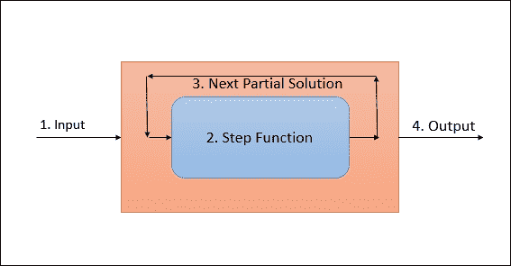
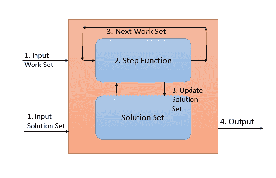

# 第三章：使用批处理 API 进行数据处理

尽管许多人欣赏流数据处理在大多数行业中的潜在价值，但也有许多用例，人们认为不需要以流式方式处理数据。在所有这些情况下，批处理是前进的方式。到目前为止，Hadoop 一直是数据处理的默认选择。但是，Flink 也通过 DataSet API 支持批处理数据处理。

对于 Flink，批处理是流处理的一种特殊情况。在[`data-artisans.com/batch-is-a-special-case-of-streaming/`](http://data-artisans.com/batch-is-a-special-case-of-streaming/)上有一篇非常有趣的文章详细解释了这个想法。

在本章中，我们将详细了解 DataSet API 的详细信息。这包括以下主题：

+   数据源

+   转换

+   数据接收器

+   连接器

正如我们在上一章中学到的，任何 Flink 程序都遵循以下定义的解剖结构：


DataSet API 也不例外。我们将详细了解每个步骤。我们已经在上一章中讨论了如何获取执行环境。因此，我们将直接转向 DataSet API 支持的数据源的详细信息。

# 数据源

源是 DataSet API 期望从中获取数据的地方。它可以是文件形式，也可以是来自 Java 集合。这是 Flink 程序解剖的第二步。DataSet API 支持许多预先实现的数据源函数。它还支持编写自定义数据源函数，因此可以轻松地编程任何不受支持的内容。首先让我们尝试理解内置的源函数。

## 基于文件的

Flink 支持从文件中读取数据。它逐行读取数据并将其作为字符串返回。以下是您可以使用的内置函数来读取数据：

+   `readTextFile(Stringpath)`: 从指定路径读取文件中的数据。默认情况下，它将读取`TextInputFormat`并逐行读取字符串。

+   `readTextFileWithValue(Stringpath)`: 从指定路径读取文件中的数据。它返回`StringValues`。`StringValues`是可变字符串。

+   `readCsvFile(Stringpath)`: 从逗号分隔的文件中读取数据。它返回 Java POJOs 或元组。

+   `readFileofPremitives(path, delimiter, class)`: 将新行解析为原始数据类型，如字符串或整数。

+   `readHadoopFile(FileInputFormat, Key, Value, path)`: 从指定路径使用给定的`FileInputFormat`、`Key`类和`Value`类读取文件。它将解析后的值返回为元组`Tuple2<Key,Value>`。

+   `readSequenceFile(Key, Value, path)`: 从指定路径使用给定的`SequenceFileInputFormat`、`Key`类和`Value`类读取文件。它将解析后的值返回为元组`Tuple2<Key,Value>`。

### 注意

对于基于文件的输入，Flink 支持递归遍历指定路径中的文件夹。为了使用这个功能，我们需要设置一个环境变量，并在读取数据时将其作为参数传递。要设置的变量是`recursive.file.enumeration`。我们需要将此变量设置为`true`以启用递归遍历。

## 基于集合的

使用 Flink DataSet API，我们还可以从基于 Java 的集合中读取数据。以下是一些我们可以使用的函数来读取数据：

+   `fromCollection(Collection)`: 从基于 Java 的集合创建数据集。

+   `fromCollection(Iterator, Class)`: 从迭代器创建数据集。迭代器的元素由类参数给定的类型。

+   `fromElements(T)`: 创建一个包含一系列对象的数据集。对象类型在函数本身中指定。

+   `fromParallelCollection(SplittableIterator, Class)`: 这将并行从迭代器创建数据集。Class 代表对象类型。

+   `generateSequence(from, to)`: 生成给定范围内的数字序列。

## 通用源

DataSet API 支持一些通用函数来读取数据：

+   `readFile(inputFormat, path)`: 这将从给定路径创建一个`FileInputFormat`类型的数据集

+   `createInput(inputFormat)`: 这将创建一个通用输入格式的数据集

## 压缩文件

Flink 支持在读取文件时解压缩文件，如果它们标有适当的扩展名。我们不需要对读取压缩文件进行任何不同的配置。如果检测到具有适当扩展名的文件，则 Flink 会自动解压缩并发送到进一步处理。

这里需要注意的一点是，文件的解压缩不能并行进行，因此在实际数据处理开始之前可能需要一些时间。

在这个阶段，建议避免使用压缩文件，因为在 Flink 中解压缩不是可扩展的活动。

支持以下算法：

| **压缩算法** | **扩展名** | **是否并行？** |
| --- | --- | --- |
| Gzip | `.gz`, `.gzip` | 否 |
| Deflate | `.deflate` | 否 |

# 转换

数据转换将数据集从一种形式转换为另一种形式。输入可以是一个或多个数据集，输出也可以是零个、一个或多个数据流。现在让我们逐个了解每个转换。

## 映射

这是最简单的转换之一，输入是一个数据集，输出也是一个数据集。

在 Java 中：

```java
inputSet.map(new MapFunction<Integer, Integer>() { 
  @Override 
  public Integer map(Integer value) throws Exception { 
        return 5 * value; 
      } 
    }); 

```

在 Scala 中：

```java
inputSet.map { x => x * 5 } 

```

在 Python 中：

```java
inputSet.map { lambda x : x * 5 } 

```

## Flat map

flat map 接受一个记录并输出零个、一个或多个记录。

在 Java 中：

```java
inputSet.flatMap(new FlatMapFunction<String, String>() { 
    @Override 
    public void flatMap(String value, Collector<String> out) 
        throws Exception { 
        for(String word: value.split(" ")){ 
            out.collect(word); 
        } 
    } 
}); 

```

在 Scala 中：

```java
inputSet.flatMap { str => str.split(" ") } 

```

在 Python 中：

```java
inputSet.flat_map {lambda str, c:[str.split() for line in str } 

```

## 过滤

过滤函数评估条件，然后如果返回`true`则只发出记录。过滤函数可以输出零个记录。

在 Java 中：

```java
inputSet.filter(new FilterFunction<Integer>() { 
    @Override 
    public boolean filter(Integer value) throws Exception { 
        return value != 1; 
    } 
}); 
In Scala: 
inputSet.filter { _ != 1 } 

```

在 Python 中：

```java
inputSet.filter {lambda x: x != 1 } 

```

## 项目

项目转换删除或移动元组的元素到另一个元组。这可以用来对特定元素进行选择性处理。

在 Java 中：

```java
DataSet<Tuple3<Integer, String, Double>> in = // [...] 
DataSet<Tuple2<String, Integer>> out = in.project(1,0); 

```

在 Scala 中，不支持这种转换。

在 Python 中：

```java
inputSet.project(1,0) 

```

## 对分组数据集进行减少

减少转换根据用户定义的减少函数将每个组减少为单个元素。

在 Java 中：

```java
public class WC { 
  public String word; 
  public int count; 
} 

//Reduce function 
public class WordCounter implements ReduceFunction<WC> { 
  @Override 
  public WC reduce(WC in1, WC in2) { 
    return new WC(in1.word, in1.count + in2.count); 
  } 
} 

// [...] 
DataSet<WC> words = // [...] 
DataSet<WC> wordCounts = words 
                         // grouping on field "word" 
                         .groupBy("word") 
                         // apply ReduceFunction on grouped DataSet 
                         .reduce(new WordCounter()); 

```

在 Scala 中：

```java
class WC(val word: String, val count: Int) { 
  def this() { 
    this(null, -1) 
  } 
} 

val words: DataSet[WC] = // [...] 
val wordCounts = words.groupBy("word").reduce { 
  (w1, w2) => new WC(w1.word, w1.count + w2.count) 
} 

```

在 Python 中，代码不受支持。

## 按字段位置键对分组数据集进行减少

对于元组数据集，我们也可以按字段位置进行分组。以下是一个例子。

在 Java 中：

```java
DataSet<Tuple3<String, Integer, Double>> reducedTuples = tuples 
                           // group by on second and third field  
                            .groupBy(1, 2) 
                            // apply ReduceFunction 
                            .reduce(new MyTupleReducer()); 

```

在 Scala 中：

```java
val reducedTuples = tuples.groupBy(1, 2).reduce { ... } 

```

在 Python 中：

```java
reducedTuples = tuples.group_by(1, 2).reduce( ... ) 

```

## 组合组

在一些应用中，在进行一些更多的转换之前进行中间操作非常重要。在这种情况下，组合操作非常方便。中间转换可以减小大小等。

这是使用贪婪策略在内存中执行的，需要进行多个步骤。

在 Java 中：

```java
DataSet<String> input = [..]  

  DataSet<Tuple2<String, Integer>> combinedWords = input 
  .groupBy(0); // group similar words 
  .combineGroup(new GroupCombineFunction<String, Tuple2<String,  
   Integer>() { 

    public void combine(Iterable<String> words,   
    Collector<Tuple2<String, Integer>>) { // combine 
        String key = null; 
        int count = 0; 

        for (String word : words) { 
            key = word; 
            count++; 
        } 
        // emit tuple with word and count 
        out.collect(new Tuple2(key, count)); 
    } 
}); 

```

在 Scala 中：

```java
val input: DataSet[String] = [..]  

val combinedWords: DataSet[(String, Int)] = input 
  .groupBy(0) 
  .combineGroup { 
    (words, out: Collector[(String, Int)]) => 
        var key: String = null 
        var count = 0 

        for (word <- words) { 
            key = word 
            count += 1 
        } 
        out.collect((key, count)) 
} 

```

在 Python 中，不支持这段代码。

## 对分组元组数据集进行聚合

聚合转换非常常见。我们可以很容易地对元组数据集执行常见的聚合，如`sum`、`min`和`max`。以下是我们执行的方式。

在 Java 中：

```java
DataSet<Tuple3<Integer, String, Double>> input = // [...] 
DataSet<Tuple3<Integer, String, Double>> output = input 
             .groupBy(1)        // group DataSet on second field 
             .aggregate(SUM, 0) // compute sum of the first field 
             .and(MIN, 2);      // compute minimum of the third field 

```

在 Scala 中：

```java
val input: DataSet[(Int, String, Double)] = // [...] 
val output = input.groupBy(1).aggregate(SUM, 0).and(MIN, 2) 

```

在 Python 中：

```java
input = # [...] 
output = input.group_by(1).aggregate(Sum, 0).and_agg(Min, 2) 

```

请注意，在 DataSet API 中，如果我们需要应用多个聚合，我们需要使用`and`关键字。

## 对分组元组数据集进行 MinBy

`minBy`函数从元组数据集的每个组中选择一个元组，其值为最小值。用于比较的字段必须是可比较的。

在 Java 中：

```java
DataSet<Tuple3<Integer, String, Double>> input = // [...] 
DataSet<Tuple3<Integer, String, Double>> output = input 
                  .groupBy(1)   // group by on second field 
                  .minBy(0, 2); // select tuple with minimum values for first and third field. 

```

在 Scala 中：

```java
val input: DataSet[(Int, String, Double)] = // [...] 
val output: DataSet[(Int, String, Double)] = input 
           .groupBy(1)                                     
           .minBy(0, 2)
```

在 Python 中，不支持这段代码。

## 对分组元组数据集进行 MaxBy

`MaxBy`函数从元组数据集的每个组中选择一个元组，其值为最大值。用于比较的字段必须是可比较的。

在 Java 中：

```java
DataSet<Tuple3<Integer, String, Double>> input = // [...] 
DataSet<Tuple3<Integer, String, Double>> output = input 
                  .groupBy(1)   // group by on second field 
                  .maxBy(0, 2); // select tuple with maximum values for         
                                /*first and third field. */

```

在 Scala 中：

```java
val input: DataSet[(Int, String, Double)] = // [...] 
val output: DataSet[(Int, String, Double)] = input 
.groupBy(1)                                    
.maxBy(0, 2)  

```

在 Python 中，不支持这段代码。

## 对完整数据集进行减少

减少转换允许在整个数据集上应用用户定义的函数。以下是一个例子。

在 Java 中：

```java
public class IntSumReducer implements ReduceFunction<Integer> { 
  @Override 
  public Integer reduce(Integer num1, Integer num2) { 
    return num1 + num2; 
  } 
} 

DataSet<Integer> intNumbers = // [...] 
DataSet<Integer> sum = intNumbers.reduce(new IntSumReducer()); 

```

在 Scala 中：

```java
val sum = intNumbers.reduce (_ + _) 

```

在 Python 中：

```java
sum = intNumbers.reduce(lambda x,y: x + y) 

```

## 对完整数据集进行组减少

组减少转换允许在整个数据集上应用用户定义的函数。以下是一个例子。

在 Java 中：

```java
DataSet<Integer> input = // [...] 
DataSet<Integer> output = input.reduceGroup(new MyGroupReducer()); 

```

在 Scala 中：

```java
val input: DataSet[Int] = // [...] 
val output = input.reduceGroup(new MyGroupReducer())  

```

在 Python 中：

```java
output = data.reduce_group(MyGroupReducer()) 

```

## 对完整元组数据集进行聚合

我们可以对完整数据集运行常见的聚合函数。到目前为止，Flink 支持`MAX`、`MIN`和`SUM`。

在 Java 中：

```java
DataSet<Tuple2<Integer, Double>> output = input 
.aggregate(SUM, 0) // SUM of first field                   
.and(MIN, 1); // Minimum of second  

```

在 Scala 中：

```java
val input: DataSet[(Int, String, Double)] = // [...] 
val output = input.aggregate(SUM, 0).and(MIN, 2)  

```

在 Python 中：

```java
output = input.aggregate(Sum, 0).and_agg(Min, 2) 

```

## 在完整元组数据集上的 MinBy

`MinBy`函数从完整数据集中选择一个数值最小的元组。用于比较的字段必须是可比较的。

在 Java 中：

```java
DataSet<Tuple3<Integer, String, Double>> input = // [...] 
DataSet<Tuple3<Integer, String, Double>> output = input 
                  .minBy(0, 2); // select tuple with minimum values for 
                                first and third field. 

```

在 Scala 中：

```java
val input: DataSet[(Int, String, Double)] = // [...] 
val output: DataSet[(Int, String, Double)] = input 
.minBy(0, 2)  

```

在 Python 中，此代码不受支持。

## 在完整元组数据集上的 MaxBy

`MaxBy`选择数值最大的单个元组完整数据集。用于比较的字段必须是可比较的。

在 Java 中：

```java
DataSet<Tuple3<Integer, String, Double>> input = // [...] 
DataSet<Tuple3<Integer, String, Double>> output = input 
                 .maxBy(0, 2); // select tuple with maximum values for first and third field. 

```

在 Scala 中：

```java
val input: DataSet[(Int, String, Double)] = // [...] 
val output: DataSet[(Int, String, Double)] = input 
                                  .maxBy(0, 2)  

```

在 Python 中，此代码不受支持。

## 不同

distinct 转换从源数据集中发出不同的值。这用于从源中删除重复的值。

在 Java 中：

```java
DataSet<Tuple2<Integer, Double>> output = input.distinct(); 

```

在 Scala 中：

```java
val output = input.distinct() 

```

在 Python 中，此代码不受支持。

## 连接

join 转换将两个数据集连接成一个数据集。连接条件可以定义为每个数据集的一个键。

在 Java 中：

```java
public static class Student { public String name; public int deptId; } 
public static class Dept { public String name; public int id; } 
DataSet<Student> input1 = // [...] 
DataSet<Dept> input2 = // [...] 
DataSet<Tuple2<Student, Dept>> 
            result = input1.join(input2) 
.where("deptId")                                  
.equalTo("id"); 

```

在 Scala 中：

```java
val input1: DataSet[(String, Int)] = // [...] 
val input2: DataSet[(String, Int)] = // [...] 
val result = input1.join(input2).where(1).equalTo(1) 

```

在 Python 中

```java
result = input1.join(input2).where(1).equal_to(1)  

```

### 注意

有各种其他方式可以连接两个数据集。在这里有一个链接，您可以阅读更多关于所有这些连接选项的信息：[`ci.apache.org/projects/flink/flink-docs-master/dev/batch/dataset_transformations.html#join`](https://ci.apache.org/projects/flink/flink-docs-master/dev/batch/dataset_transformations.html#join)。

## 交叉

交叉转换通过应用用户定义的函数对两个数据集进行交叉乘积。

在 Java 中：

```java
DataSet<Class> input1 = // [...] 
DataSet<class> input2 = // [...] 
DataSet<Tuple3<Integer, Integer, Double>> 
            result = 
            input1.cross(input2) 
                   // applying CrossFunction 
                   .with(new MyCrossFunction()); 

```

在 Scala 中：

```java
val result = input1.cross(input2) { 
//custom function 
} 

```

在 Python 中：

```java
result = input1.cross(input2).using(MyCrossFunction()) 

```

## 联合

union 转换结合了两个相似的数据集。我们也可以一次联合多个数据集。

在 Java 中：

```java
DataSet<Tuple2<String, Integer>> input1 = // [...] 
DataSet<Tuple2<String, Integer>> input2 = // [...] 
DataSet<Tuple2<String, Integer>> input3 = // [...] 
DataSet<Tuple2<String, Integer>> unioned = input1.union(input2).union(input3); 

```

在 Scala 中：

```java
val input1: DataSet[(String, Int)] = // [...] 
val input2: DataSet[(String, Int)] = // [...] 
val input3: DataSet[(String, Int)] = // [...] 
val unioned = input1.union(input2).union(input3)  

```

在 Python 中：

```java
unioned = input1.union(input2).union(input3) 

```

## 重新平衡

这个转换均匀地重新平衡并行分区。这有助于提高性能，因为它有助于消除数据倾斜。

在 Java 中：

```java
DataSet<String> in = // [...] 
DataSet<Tuple2<String, String>> out = in.rebalance(); 

```

在 Scala 中：

```java
val in: DataSet[String] = // [...] 
val out = in.rebalance() 

```

在 Python 中，此代码不受支持。

## 哈希分区

这个转换在给定的键上对数据集进行分区。

在 Java 中：

```java
DataSet<Tuple2<String, Integer>> in = // [...] 
DataSet<Tuple2<String, String>> out = in.partitionByHash(1); 

```

在 Scala 中：

```java
val in: DataSet[(String, Int)] = // [...] 
val out = in.partitionByHash(1) 

```

在 Python 中，此代码不受支持。

## 范围分区

这个转换在给定的键上对数据集进行范围分区。

在 Java 中：

```java
DataSet<Tuple2<String, Integer>> in = // [...] 
DataSet<Tuple2<String, String>> out = in.partitionByRange(1); 

```

在 Scala 中：

```java
val in: DataSet[(String, Int)] = // [...] 
val out = in.partitionByRange(1) 

```

在 Python 中，此代码不受支持。

## 排序分区

这个转换在给定的键和给定的顺序上本地对分区数据集进行排序。

在 Java 中：

```java
DataSet<Tuple2<String, Integer>> in = // [...] 
DataSet<Tuple2<String, String>> out = in.sortPartition(1,Order.ASCENDING); 

```

在 Scala 中：

```java
val in: DataSet[(String, Int)] = // [...] 
val out = in.sortPartition(1, Order.ASCENDING) 

```

在 Python 中，此代码不受支持。

## 首 n

这个转换任意返回数据集的前 n 个元素。

在 Java 中：

```java
DataSet<Tuple2<String, Integer>> in = // [...] 
// Returns first 10 elements of the data set.  
DataSet<Tuple2<String, String>> out = in.first(10); 

```

在 Scala 中：

```java
val in: DataSet[(String, Int)] = // [...] 
val out = in.first(10) 

```

在 Python 中，此代码不受支持。

# 广播变量

广播变量允许用户将某些数据集作为集合访问到所有操作符。通常，当您希望在某个操作中频繁引用少量数据时，可以使用广播变量。熟悉 Spark 广播变量的人也可以在 Flink 中使用相同的功能。

我们只需要广播一个具有特定名称的数据集，它将在每个执行器上都可用。广播变量保存在内存中，因此在使用它们时必须谨慎。以下代码片段显示了如何广播数据集并根据需要使用它。

```java
// Get a data set to be broadcasted 
DataSet<Integer> toBroadcast = env.fromElements(1, 2, 3); 
DataSet<String> data = env.fromElements("India", "USA", "UK").map(new RichMapFunction<String, String>() { 
    private List<Integer> toBroadcast; 
    // We have to use open method to get broadcast set from the context 
    @Override 
    public void open(Configuration parameters) throws Exception { 
    // Get the broadcast set, available as collection 
    this.toBroadcast = 
    getRuntimeContext().getBroadcastVariable("country"); 
    } 

    @Override 
    public String map(String input) throws Exception { 
          int sum = 0; 
          for (int a : toBroadcast) { 
                sum = a + sum; 
          } 
          return input.toUpperCase() + sum; 
    } 
}).withBroadcastSet(toBroadcast, "country"); // Broadcast the set with name 
data.print(); 

```

当我们有查找条件要用于转换时，广播变量非常有用，查找数据集相对较小。

# 数据接收器

数据转换完成后，我们需要将结果保存在某个地方。以下是 Flink DataSet API 提供的一些选项，用于保存结果：

+   `writeAsText()`: 这将记录一行一行地写入字符串。

+   `writeAsCsV()`: 这将元组写为逗号分隔值文件。还可以配置行和字段分隔符。

+   `print()`/`printErr()`: 这将记录写入标准输出。您也可以选择写入标准错误。

+   `write()`: 这支持在自定义`FileOutputFormat`中写入数据。

+   `output()`: 这用于不基于文件的数据集。这可以用于我们想要将数据写入某个数据库的地方。

# 连接器

Apache Flink 的 DataSet API 支持各种连接器，允许在各种系统之间读取/写入数据。让我们尝试更多地探索这一点。

## 文件系统

Flink 允许默认连接到各种分布式文件系统，如 HDFS、S3、Google Cloud Storage、Alluxio 等。在本节中，我们将看到如何连接到这些文件系统。

为了连接到这些系统，我们需要在`pom.xml`中添加以下依赖项：

```java
<dependency> 
  <groupId>org.apache.flink</groupId> 
  <artifactId>flink-hadoop-compatibility_2.11</artifactId> 
  <version>1.1.4</version> 
</dependency> 

```

这使我们能够使用 Hadoop 数据类型、输入格式和输出格式。Flink 支持开箱即用的可写和可比较可写，因此我们不需要兼容性依赖项。

### HDFS

要从 HDFS 文件中读取数据，我们使用`readHadoopFile()`或`createHadoopInput()`方法创建数据源。为了使用此连接器，我们首先需要配置`flink-conf.yaml`并将`fs.hdfs.hadoopconf`设置为正确的 Hadoop 配置目录。

生成的数据集将是与 HDFS 数据类型匹配的元组类型。以下代码片段显示了如何做到这一点。

在 Java 中：

```java
ExecutionEnvironment env = ExecutionEnvironment.getExecutionEnvironment(); 
DataSet<Tuple2<LongWritable, Text>> input = 
    env.readHadoopFile(new TextInputFormat(), LongWritable.class, Text.class, textPath);  

```

在 Scala 中：

```java
val env = ExecutionEnvironment.getExecutionEnvironment 
val input: DataSet[(LongWritable, Text)] = 
  env.readHadoopFile(new TextInputFormat, classOf[LongWritable], classOf[Text], textPath) 

```

我们还可以使用此连接器将处理后的数据写回 HDFS。`OutputFormat`包装器期望数据集以`Tuple2`格式。以下代码片段显示了如何将处理后的数据写回 HDFS。

在 Java 中：

```java
// Get the processed data set 
DataSet<Tuple2<Text, IntWritable>> results = [...] 

// Set up the Hadoop Output Format. 
HadoopOutputFormat<Text, IntWritable> hadoopOF = 
  // create the Flink wrapper. 
  new HadoopOutputFormat<Text, IntWritable>( 
    // set the Hadoop OutputFormat and specify the job. 
    new TextOutputFormat<Text, IntWritable>(), job 
  ); 
hadoopOF.getConfiguration().set("mapreduce.output.textoutputformat.separator", " "); 
TextOutputFormat.setOutputPath(job, new Path(outputPath)); 

// Emit data  
result.output(hadoopOF); 

```

在 Scala 中：

```java
// Get the processed data set 
val result: DataSet[(Text, IntWritable)] = [...] 

val hadoopOF = new HadoopOutputFormatText,IntWritable 

hadoopOF.getJobConf.set("mapred.textoutputformat.separator", " ") 
FileOutputFormat.setOutputPath(hadoopOF.getJobConf, new Path(resultPath)) 

result.output(hadoopOF) 

```

### Amazon S3

如前所述，Flink 默认支持从 Amazon S3 读取数据。但是，我们需要在 Hadoop 的`core-site.xml`中进行一些配置。我们需要设置以下属性：

```java
<!-- configure the file system implementation --> 
<property> 
  <name>fs.s3.impl</name> 
  <value>org.apache.hadoop.fs.s3native.NativeS3FileSystem</value> 
</property> 
<!-- set your AWS ID --> 
<property> 
  <name>fs.s3.awsAccessKeyId</name> 
  <value>putKeyHere</value> 
</property> 
<!-- set your AWS access key --> 
<property> 
  <name>fs.s3.awsSecretAccessKey</name> 
  <value>putSecretHere</value> 
</property> 

```

完成后，我们可以像这样访问 S3 文件系统：

```java
// Read from S3 bucket 
env.readTextFile("s3://<bucket>/<endpoint>"); 
// Write to S3 bucket 
stream.writeAsText("s3://<bucket>/<endpoint>"); 

```

### Alluxio

Alluxio 是一个开源的、内存速度的虚拟分布式存储。许多公司都在使用 Alluxio 进行高速数据存储和处理。您可以在[`www.alluxio.org/`](http://www.alluxio.org/)上了解更多关于 Alluxio 的信息。

Flink 默认支持从 Alluxio 读取数据。但是，我们需要在 Hadoop 的`core-site.xml`中进行一些配置。我们需要设置以下属性：

```java
<property> 
  <name>fs.alluxio.impl</name> 
  <value>alluxio.hadoop.FileSystem</value> 
</property> 

```

完成后，我们可以像这样访问 Alluxio 文件系统：

```java
// Read from Alluxio path 
env.readTextFile("alluxio://<path>"); 

// Write to Alluxio path 
stream.writeAsText("alluxio://<path>"); 

```

### Avro

Flink 内置支持 Avro 文件。它允许轻松读写 Avro 文件。为了读取 Avro 文件，我们需要使用`AvroInputFormat`。以下代码片段显示了如何读取 Avro 文件：

```java
AvroInputFormat<User> users = new AvroInputFormat<User>(in, User.class); 
DataSet<User> userSet = env.createInput(users); 

```

数据集准备好后，我们可以轻松执行各种转换，例如：

```java
userSet.groupBy("city") 

```

### Microsoft Azure 存储

Microsoft Azure Storage 是一种基于云的存储，允许以持久且可扩展的方式存储数据。Flink 支持管理存储在 Microsoft Azure 表存储上的数据。以下解释了我们如何做到这一点。

首先，我们需要从`git`下载`azure-tables-hadoop`项目，然后编译它：

```java
git clone https://github.com/mooso/azure-tables-hadoop.git 
cd azure-tables-hadoop 
mvn clean install 

```

接下来，在`pom.xml`中添加以下依赖项：

```java
<dependency> 
    <groupId>org.apache.flink</groupId> 
    <artifactId>flink-hadoop-compatibility_2.11</artifactId> 
    <version>1.1.4</version> 
</dependency> 
<dependency> 
  <groupId>com.microsoft.hadoop</groupId> 
  <artifactId>microsoft-hadoop-azure</artifactId> 
  <version>0.0.4</version> 
</dependency> 

```

接下来，我们编写以下代码来访问 Azure 存储：

```java
final ExecutionEnvironment env = ExecutionEnvironment.getExecutionEnvironment(); 

    // create a  AzureTableInputFormat, using a Hadoop input format wrapper 
    HadoopInputFormat<Text, WritableEntity> hdIf = new HadoopInputFormat<Text, WritableEntity>(new AzureTableInputFormat(), Text.class, WritableEntity.class, new Job()); 

// set account URI     
hdIf.getConfiguration().set(AzureTableConfiguration.Keys.ACCOUNT_URI.getKey(), "XXXX"); 
    // set the secret storage key 
    hdIf.getConfiguration().set(AzureTableConfiguration.Keys.STORAGE_KEY.getKey(), "XXXX"); 
    // set the table name  
    hdIf.getConfiguration().set(AzureTableConfiguration.Keys.TABLE_NAME.getKey(), "XXXX"); 

 DataSet<Tuple2<Text, WritableEntity>> input = env.createInput(hdIf); 

```

现在我们已经准备好处理数据集了。

## MongoDB

通过开源贡献，开发人员已经能够将 Flink 连接到 MongoDB。在本节中，我们将讨论这样一个项目。

该项目是开源的，可以从 GitHub 下载：

```java
git clone https://github.com/okkam-it/flink-mongodb-test.git 
cd flink-mongodb-test 
mvn clean install 

```

接下来，我们在 Java 程序中使用前面的连接器连接到 MongoDB：

```java
// set up the execution environment 
    final ExecutionEnvironment env = ExecutionEnvironment.getExecutionEnvironment(); 

// create a MongodbInputFormat, using a Hadoop input format wrapper 
HadoopInputFormat<BSONWritable, BSONWritable> hdIf =  
        new HadoopInputFormat<BSONWritable, BSONWritable>(new MongoInputFormat(), 
       BSONWritable.class, BSONWritable.class, new JobConf()); 

// specify connection parameters 
hdIf.getJobConf().set("mongo.input.uri",  
                "mongodb://localhost:27017/dbname.collectioname"); 

DataSet<Tuple2<BSONWritable, BSONWritable>> input = env.createInput(hdIf); 

```

一旦数据作为数据集可用，我们可以轻松进行所需的转换。我们还可以像这样将数据写回 MongoDB 集合：

```java
MongoConfigUtil.setOutputURI( hdIf.getJobConf(),  
                "mongodb://localhost:27017/dbname.collectionname "); 
 // emit result (this works only locally) 
 result.output(new HadoopOutputFormat<Text,BSONWritable>( 
                new MongoOutputFormat<Text,BSONWritable>(), hdIf.getJobConf())); 

```

# 迭代

Flink 支持的一个独特功能是迭代。如今，许多开发人员希望使用大数据技术运行迭代的机器学习和图处理算法。为了满足这些需求，Flink 支持通过定义步骤函数来运行迭代数据处理。

## 迭代器操作符

迭代器操作符由以下组件组成：



+   **迭代输入**：这是接收到的初始数据集或上一次迭代的输出

+   **步骤函数**：这是需要应用于输入数据集的函数

+   **下一个部分解**：这是需要反馈到下一次迭代的步骤函数的输出

+   **迭代结果**：在完成所有迭代后，我们得到迭代的结果

迭代次数可以通过各种方式进行控制。一种方式可以是设置要执行的迭代次数，或者我们也可以进行条件终止。

## 增量迭代器

增量运算符对一组元素进行增量迭代操作。增量迭代器和常规迭代器之间的主要区别在于，增量迭代器在更新解决方案集而不是在每次迭代中完全重新计算解决方案集上工作。

这导致了更高效的操作，因为它使我们能够在更短的时间内专注于解决方案的重要部分。下图显示了 Flink 中增量迭代器的流程。



+   **迭代输入**：我们必须从某些文件中读取增量迭代器的工作集和解决方案集

+   **步骤函数**：步骤函数是需要应用于输入数据集的函数

+   **下一个工作集/更新解决方案**：在每次迭代解决方案集之后，它会根据最新结果进行更新，并将下一个工作集提供给下一个迭代

+   **迭代结果**：在完成所有迭代后，我们以解决方案集的形式获得迭代的结果

由于增量迭代器在热数据集本身上运行，因此性能和效率非常好。以下是一篇详细的文章，讨论了使用 Flink 迭代器进行 PageRank 算法。[`data-artisans.com/data-analysis-with-flink-a-case-study-and-tutorial/`](http://data-artisans.com/data-analysis-with-flink-a-case-study-and-tutorial/)。

# 用例 - 使用 Flink 批处理 API 进行运动员数据洞察

现在我们已经了解了 DataSet API 的细节，让我们尝试将这些知识应用到一个真实的用例中。假设我们手头有一个数据集，其中包含有关奥运会运动员及其在各种比赛中表现的信息。示例数据如下表所示：

| **球员** | **国家** | **年份** | **比赛** | **金牌** | **银牌** | **铜牌** | **总计** |
| --- | --- | --- | --- | --- | --- | --- | --- |
| 杨伊琳 | 中国 | 2008 | 体操 | 1 | 0 | 2 | 3 |
| 利塞尔·琼斯 | 澳大利亚 | 2000 | 游泳 | 0 | 2 | 0 | 2 |
| 高基贤 | 韩国 | 2002 | 短道速滑 | 1 | 1 | 0 | 2 |
| 陈若琳 | 中国 | 2008 | 跳水 | 2 | 0 | 0 | 2 |
| 凯蒂·莱德基 | 美国 | 2012 | 游泳 | 1 | 0 | 0 | 1 |
| 鲁塔·梅卢蒂特 | 立陶宛 | 2012 | 游泳 | 1 | 0 | 0 | 1 |
| 达尼尔·吉尔塔 | 匈牙利 | 2004 | 游泳 | 0 | 1 | 0 | 1 |
| 阿里安娜·方塔纳 | 意大利 | 2006 | 短道速滑 | 0 | 0 | 1 | 1 |
| 奥尔加·格拉茨基赫 | 俄罗斯 | 2004 | 韵律体操 | 1 | 0 | 0 | 1 |
| 卡里克莱亚·潘塔齐 | 希腊 | 2000 | 韵律体操 | 0 | 0 | 1 | 1 |
| 金·马丁 | 瑞典 | 2002 | 冰球 | 0 | 0 | 1 | 1 |
| 凯拉·罗斯 | 美国 | 2012 | 体操 | 1 | 0 | 0 | 1 |
| 加布里埃拉·德拉戈伊 | 罗马尼亚 | 2008 | 体操 | 0 | 0 | 1 | 1 |
| 塔莎·施维克特-沃伦 | 美国 | 2000 | 体操 | 0 | 0 | 1 | 1 |

现在我们想要得到答案，比如，每个国家有多少运动员参加了比赛？或者每个比赛有多少运动员参加了？由于数据处于静止状态，我们将使用 Flink 批处理 API 进行分析。

可用的数据以 CSV 格式存在。因此，我们将使用 Flink API 提供的 CSV 读取器，如下面的代码片段所示。

```java
final ExecutionEnvironment env = ExecutionEnvironment.getExecutionEnvironment(); 
DataSet<Record> csvInput = env.readCsvFile("olympic-athletes.csv") 
                     .pojoType(Record.class, "playerName", "country", "year", "game", "gold", "silver", "bronze", "total"); 

```

一旦数据被正确解析，就很容易继续使用它。以下代码片段显示了如何获取每个国家的球员数量的信息：

```java
DataSet<Tuple2<String, Integer>> groupedByCountry = csvInput
.flatMap(new FlatMapFunction<Record, Tuple2<String, Integer>>() {
private static final long serialVersionUID = 1L;
@Override
public void flatMap(Record record, Collector<Tuple2<String, Integer>> out) throws Exception {
out.collect(new Tuple2<String, Integer>(record.getCountry(), 1));
}
}).groupBy(0).sum(1);
groupedByCountry.print();
```

在前面的代码片段中，我们首先创建了以球员国家为键，值为`1`的数据集，然后对其进行分组并求和以获得总数。一旦我们执行了代码，输出如下所示：

```java
(Australia,11)
(Belarus,7)
(China,25)
(France,3)
(Germany,2)
(Italy,4)
(Turkey,1)
(United States,22)
(Cameroon,2)
(Hungary,1)
(Kenya,1)
(Lithuania,1)
(Russia,23)
(Spain,2)
(Ukraine,1)
(Chinese Taipei,2)
(Great Britain,1)
(Romania,14)
(Switzerland,1)
(Bulgaria,3)
(Finland,1)
(Greece,7)
(Japan,1)
(Mexico,1)
(Netherlands,2)
(Poland,1)
(South Korea,6)
(Sweden,6)
(Thailand,1)
```

同样，我们可以应用相同的逻辑来查找每场比赛的球员数量，如下面的代码片段所示：

```java
DataSet<Tuple2<String, Integer>> groupedByGame = csvInput
.flatMap(new FlatMapFunction<Record, Tuple2<String, Integer>>() { private static final long serialVersionUID = 1L;
@Override
public void flatMap(Record record, Collector<Tuple2<String, Integer>> out) throws Exception {
out.collect(new Tuple2<String, Integer>(record.getGame(), 1));
}
}).groupBy(0).sum(1);
groupedByGame.print();
```

前面代码片段的输出如下：

```java
(Basketball,1)
(Gymnastics,42)
(Ice Hockey,7)
(Judo,1)
(Swimming,33)
(Athletics,2)
(Fencing,2)
(Nordic Combined,1)
(Rhythmic Gymnastics,27)
(Short-Track Speed Skating,5)
(Table Tennis,1)
(Weightlifting,4)
(Boxing,3)
(Taekwondo,3)
(Archery,3)
(Diving,14)
(Figure Skating,1)
(Football,2)
(Shooting,1)
```

这样，您可以运行各种其他转换以获得所需的输出。此用例的完整代码可在[`github.com/deshpandetanmay/mastering-flink/tree/master/chapter03/flink-batch`](https://github.com/deshpandetanmay/mastering-flink/tree/master/chapter03/flink-batch)上找到。

# 摘要

在本章中，我们学习了 DataSet API。它使我们能够进行批处理。我们学习了各种转换以进行数据处理。后来，我们还探索了各种基于文件的连接器，以从 HDFS、Amazon S3、MS Azure、Alluxio 等读取/写入数据。

在最后一节中，我们看了一个用例，在这个用例中，我们应用了在前几节中学到的知识。

在下一章中，我们将学习另一个非常重要的 API，即 Table API，从 Flink 的生态系统角度来看。
