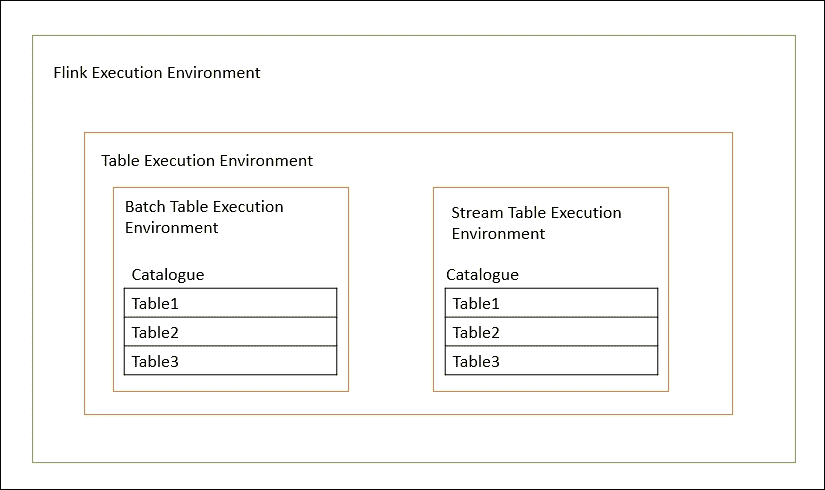

# 第四章：使用表 API 进行数据处理

在前几章中，我们谈到了 Apache Flink 提供的批处理和流处理数据处理 API。在本章中，我们将讨论 Table API，它是 Flink 中用于数据处理的 SQL 接口。Table API 操作的是可以从数据集和数据流中创建的表接口。一旦数据集/数据流被注册为表，我们就可以自由地应用关系操作，如聚合、连接和选择。

表也可以像常规 SQL 查询一样进行查询。一旦操作完成，我们需要将表转换回数据集或数据流。Apache Flink 在内部使用另一个名为 Apache Calcite 的开源项目来优化这些查询转换。

在本章中，我们将涵盖以下主题：

+   注册表

+   访问已注册的表

+   操作员

+   数据类型

+   SQL

现在让我们开始吧。

为了使用 Table API，我们需要做的第一件事是创建一个 Java Maven 项目，并在其中添加以下依赖项：

```java
  <dependency> 
      <groupId>org.apache.flink</groupId> 
      <artifactId>flink-table_2.11</artifactId> 
      <version>1.1.4</version> 
    </dependency> 

```

这个依赖项将在你的类路径中下载所有必需的 JAR 包。下载完成后，我们就可以使用 Table API 了。

# 注册表

为了对数据集/数据流进行操作，首先我们需要在`TableEnvironment`中注册一个表。一旦表以唯一名称注册，就可以轻松地从`TableEnvironment`中访问。

`TableEnvironment`维护一个内部表目录用于表注册。以下图表显示了细节：



拥有唯一的表名非常重要，否则你会得到一个异常。

## 注册数据集

为了在数据集上执行 SQL 操作，我们需要在`BatchTableEnvironment`中将其注册为表。在注册表时，我们需要定义一个 Java POJO 类。

例如，假设我们需要注册一个名为 Word Count 的数据集。这个表中的每条记录都有单词和频率属性。相同的 Java POJO 如下所示：

```java
public static class WC { 
    public String word; 
    public long frequency; 
    public WC(){ 
    } 

    public WC(String word, long frequency) { 
      this.word = word; 
      this.frequency = frequency; 
    } 

    @Override 
    public String toString() { 
      return "WC " + word + " " + frequency; 
    } 
  } 

```

在 Scala 中，相同的类可以定义如下：

```java
case class WordCount(word: String, frequency: Long) 

```

现在我们可以注册这个表了。

在 Java 中：

```java
ExecutionEnvironment env = ExecutionEnvironment.getExecutionEnvironment(); 

BatchTableEnvironment tEnv = TableEnvironment.getTableEnvironment(env); 

DataSet<WC> input = env.fromElements(new WC("Hello", 1), new WC("World", 1), new WC("Hello", 1)); 

// register the DataSet as table "WordCount" 
tEnv.registerDataSet("WordCount", input, "word, frequency"); 

```

在 Scala 中：

```java
val env = ExecutionEnvironment.getExecutionEnvironment 

val tEnv = TableEnvironment.getTableEnvironment(env) 

val input = env.fromElements(WordCount("hello", 1), WordCount("hello", 1), WordCount("world", 1), WordCount("hello", 1)) 

//register the dataset  
tEnv.registerDataSet("WordCount", input, 'word, 'frequency) 

```

### 注意

请注意，数据集表的名称不能匹配`^_DataSetTable_[0-9]+`模式，因为它保留用于内部内存使用。

## 注册数据流

与数据集类似，我们也可以在`StreamTableEnvironment`中注册数据流。在注册表时，我们需要定义一个 Java POJO 类。

例如，假设我们需要注册一个名为 Word Count 的数据流。这个表中的每条记录都有一个单词和频率属性。相同的 Java POJO 如下所示：

```java
public static class WC { 
    public String word; 
    public long frequency; 

    public WC() { 
    }s 
    public WC(String word, long frequency) { 
      this.word = word; 
      this.frequency = frequency; 
    } 

    @Override 
    public String toString() { 
      return "WC " + word + " " + frequency; 
    } 
  } 

```

在 Scala 中，相同的类可以定义如下：

```java
case class WordCount(word: String, frequency: Long) 

```

现在我们可以注册这个表了。

在 Java 中：

```java
StreamExecutionEnvironment env = StreamExecutionEnvironment.getExecutionEnvironment(); 
    StreamTableEnvironment tEnv = TableEnvironment.getTableEnvironment(env); 

    DataStream<WC> input = env.fromElements(new WC("Hello", 1), new WC("World", 1), new WC("Hello", 1)); 

    // register the DataStream as table "WordCount" 
    tEnv.registerDataStream("WordCount", input, "word, frequency"); 

```

在 Scala 中：

```java
val env = StreamExecutionEnvironment.getExecutionEnvironment 

val tEnv = TableEnvironment.getTableEnvironment(env) 

val input = env.fromElements(WordCount("hello", 1), WordCount("hello", 1), WordCount("world", 1), WordCount("hello", 1)) 

//register the dataset  
tEnv.registerDataStream("WordCount", input, 'word, 'frequency) 

```

### 注意

请注意，数据流表的名称不能匹配`^_DataStreamTable_[0-9]+`模式，因为它保留用于内部内存使用。

## 注册表

与数据集和数据流类似，我们也可以注册来自 Table API 的表。

在 Java 中：

```java
ExecutionEnvironment env = ExecutionEnvironment.getExecutionEnvironment(); 
BatchTableEnvironment tEnv = TableEnvironment.getTableEnvironment(env); 

DataSet<WC> input = env.fromElements(new WC("Hello", 1), new WC("World", 1), new WC("Hello", 1)); 

tEnv.registerDataSet("WordCount", input, "word, frequency"); 

Table selectedTable = tEnv 
        .sql("SELECT word, SUM(frequency) as frequency FROM WordCount GROUP BY word having word = 'Hello'"); 

tEnv.registerTable("selected", selectedTable); 

```

在 Scala 中：

```java
val env = ExecutionEnvironment.getExecutionEnvironment 

val tEnv = TableEnvironment.getTableEnvironment(env) 

val input = env.fromElements(WordCount("hello", 1), WordCount("hello", 1), WordCount("world", 1), WordCount("hello", 1)) 

tEnv.registerDataSet("WordCount", input, 'word, 'frequency) 

val table = tEnv.sql("SELECT word, SUM(frequency) FROM WordCount GROUP BY word") 

val selected = tEnv.sql("SELECT word, SUM(frequency) FROM WordCount GROUP BY word where word = 'hello'") 
    tEnv.registerTable("selected", selected) 

```

## 注册外部表源

Flink 允许我们使用`TableSource`从源中注册外部表。表源可以让我们访问存储在数据库中的数据，如 MySQL 和 Hbase，在文件系统中的数据，如 CSV、Parquet 和 ORC，或者还可以读取消息系统，如 RabbitMQ 和 Kafka。

目前，Flink 允许使用 CSV 源从 CSV 文件中读取数据，并使用 Kafka 源从 Kafka 主题中读取 JSON 数据。

### CSV 表源

现在让我们看看如何直接使用 CSV 源读取数据，然后在表环境中注册源。

CSV 源默认在`flink-table`API JAR 中可用，因此不需要添加任何其他额外的 Maven 依赖项。以下依赖项就足够了：

```java
    <dependency> 
      <groupId>org.apache.flink</groupId> 
      <artifactId>flink-table_2.11</artifactId> 
      <version>1.1.4</version> 
    </dependency> 

```

以下代码片段显示了如何读取 CSV 文件并注册表源。

在 Java 中：

```java
ExecutionEnvironment env = ExecutionEnvironment.getExecutionEnvironment(); 
BatchTableEnvironment tableEnv = TableEnvironment.getTableEnvironment(env); 

TableSource orders = new CsvTableSource("/path/to/file", ...) 

// register a TableSource as external table "orders" 
tableEnv.registerTableSource("orders", orders) 

```

在 Scala 中：

```java
val env = ExecutionEnvironment.getExecutionEnvironment 
val tableEnv = TableEnvironment.getTableEnvironment(env) 

val orders: TableSource = new CsvTableSource("/path/to/file", ...) 

// register a TableSource as external table "orders" 
tableEnv.registerTableSource("orders", orders) 

```

### Kafka JSON 表源

我们还可以在表环境中注册 Kafka JSON 表源。为了使用此 API，我们需要添加以下两个依赖项：

第一个是 Table API：

```java
<dependency> 
      <groupId>org.apache.flink</groupId> 
      <artifactId>flink-table_2.11</artifactId> 
      <version>1.1.4</version> 
    </dependency> 

```

第二个依赖项将是 Kafka Flink 连接器：

+   如果您使用 Kafka 0.8，请应用：

```java
        <dependency> 
            <groupId>org.apache.flink</groupId> 
            <artifactId>flink-connector-kafka-0.8_2.11</artifactId> 
            <version>1.1.4</version> 
        </dependency> 

```

+   如果您使用 Kafka 0.9，请应用：

```java
        <dependency> 
            <groupId>org.apache.flink</groupId> 
            <artifactId>flink-connector-kafka-0.9_2.11</artifactId> 
            <version>1.1.4</version> 
        </dependency> 

```

现在我们需要按照以下代码片段中所示编写代码：

```java
String[] fields =  new String[] { "id", "name", "price"}; 
Class<?>[] types = new Class<?>[] { Integer.class, String.class, Double.class }; 

KafkaJsonTableSource kafkaTableSource = new Kafka08JsonTableSource( 
    kafkaTopic, 
    kafkaProperties, 
    fields, 
    types); 

tableEnvironment.registerTableSource("kafka-source", kafkaTableSource); 
Table result = tableEnvironment.ingest("kafka-source"); 

```

在前面的代码中，我们为 Kafka 0.8 定义了 Kafka 源，然后在表环境中注册了该源。

# 访问注册的表

一旦表被注册，我们可以从`TableEnvironment`中很容易地访问它，如下所示：

```java
tableEnvironment.scan("tableName") 

```

前面的语句扫描了以名称`"tableName"`注册的表在`BatchTableEnvironment`中：

```java
tableEnvironment.ingest("tableName") 

```

前面的语句摄取了以名称`"tableName"`注册的表在`StreamTableEnvironment`中：

# 操作符

Flink 的 Table API 提供了各种操作符作为其特定领域语言的一部分。大多数操作符都在 Java 和 Scala API 中可用。让我们逐个查看这些操作符。

## select 操作符

`select`操作符类似于 SQL select 操作符，允许您选择表中的各种属性/列。

在 Java 中：

```java
Table result = in.select("id, name"); 
Table result = in.select("*"); 

```

在 Scala 中：

```java
val result = in.select('id, 'name); 
val result = in.select('*); 

```

## where 操作符

`where`操作符用于过滤结果。

在 Java 中：

```java
Table result = in.where("id = '101'"); 

```

在 Scala 中：

```java
val result = in.where('id == "101"); 

```

## 过滤器操作符

`filter`操作符可以用作`where`操作符的替代。

在 Java 中：

```java
Table result = in.filter("id = '101'"); 

```

在 Scala 中：

```java
val result = in.filter('id == "101"); 

```

## as 操作符

`as`操作符用于重命名字段：

在 Java 中：

```java
Table in = tableEnv.fromDataSet(ds, "id, name"); 
Table result = in.as("order_id, order_name"); 

```

在 Scala 中：

```java
val in = ds.toTable(tableEnv).as('order_id, 'order_name ) 

```

## groupBy 操作符

这类似于 SQL `groupBy`操作，根据给定的属性对结果进行聚合。

在 Java 中：

```java
Table result = in.groupBy("company"); 

```

在 Scala 中：

```java
val in = in.groupBy('company) 

```

## join 操作符

`join`操作符用于连接表。我们必须至少指定一个相等的连接条件。

在 Java 中：

```java
Table employee = tableEnv.fromDataSet(emp, "e_id, e_name, deptId"); 

Table dept = tableEnv.fromDataSet(dept, "d_id, d_name"); 

Table result = employee.join(dept).where("deptId = d_id").select("e_id, e_name, d_name"); 

```

在 Scala 中：

```java
val employee = empDS.toTable(tableEnv, 'e_id, 'e_name, 'deptId); 

val dept = deptDS.toTable(tableEnv, 'd_id, 'd_name); 

Table result = employee.join(dept).where('deptId == 'd_id).select('e_id, 'e_name, 'd_name); 

```

## leftOuterJoin 操作符

`leftOuterJoin`操作符通过从左侧指定的表中获取所有值并仅从右侧表中选择匹配的值来连接两个表。我们必须至少指定一个相等的连接条件。

在 Java 中：

```java
Table employee = tableEnv.fromDataSet(emp, "e_id, e_name, deptId"); 

Table dept = tableEnv.fromDataSet(dept, "d_id, d_name"); 

Table result = employee.leftOuterJoin(dept).where("deptId = d_id").select("e_id, e_name, d_name"); 

```

在 Scala 中：

```java
val employee = empDS.toTable(tableEnv, 'e_id, 'e_name, 'deptId); 

val dept = deptDS.toTable(tableEnv, 'd_id, 'd_name); 

Table result = employee.leftOuterJoin(dept).where('deptId == 'd_id).select('e_id, 'e_name, 'd_name); 

```

## rightOuterJoin 操作符

`rightOuterJoin`操作符通过从右侧指定的表中获取所有值并仅从左侧表中选择匹配的值来连接两个表。我们必须至少指定一个相等的连接条件。

在 Java 中：

```java
Table employee = tableEnv.fromDataSet(emp, "e_id, e_name, deptId"); 

Table dept = tableEnv.fromDataSet(dept, "d_id, d_name"); 

Table result = employee.rightOuterJoin(dept).where("deptId = d_id").select("e_id, e_name, d_name"); 

```

在 Scala 中：

```java
val employee = empDS.toTable(tableEnv, 'e_id, 'e_name, 'deptId); 

val dept = deptDS.toTable(tableEnv, 'd_id, 'd_name); 

Table result = employee.rightOuterJoin(dept).where('deptId == 'd_id).select('e_id, 'e_name, 'd_name); 

```

## fullOuterJoin 操作符

`fullOuterJoin`操作符通过从两个表中获取所有值来连接两个表。我们必须至少指定一个相等的连接条件。

在 Java 中：

```java
Table employee = tableEnv.fromDataSet(emp, "e_id, e_name, deptId"); 

Table dept = tableEnv.fromDataSet(dept, "d_id, d_name"); 

Table result = employee.fullOuterJoin(dept).where("deptId = d_id").select("e_id, e_name, d_name"); 

```

在 Scala 中：

```java
val employee = empDS.toTable(tableEnv, 'e_id, 'e_name, 'deptId); 

val dept = deptDS.toTable(tableEnv, 'd_id, 'd_name); 

Table result = employee.fullOuterJoin(dept).where('deptId == 'd_id).select('e_id, 'e_name, 'd_name); 

```

## union 操作符

`union`操作符合并两个相似的表。它删除结果表中的重复值。

在 Java 中：

```java
Table employee1 = tableEnv.fromDataSet(emp, "e_id, e_name, deptId"); 

Table employee2 = tableEnv.fromDataSet(emp, "e_id, e_name, deptId"); 

Table result = employee1.union(employee2); 

```

在 Scala 中：

```java
val employee1 = empDS.toTable(tableEnv, 'e_id, 'e_name, 'deptId) 

val employee2 = empDS.toTable(tableEnv, 'e_id, 'e_name, 'deptId) 

Table result = employee1.union(employee2) 

```

## unionAll 操作符

`unionAll`操作符合并两个相似的表。

在 Java 中：

```java
Table employee1 = tableEnv.fromDataSet(emp, "e_id, e_name, deptId"); 

Table employee2 = tableEnv.fromDataSet(emp, "e_id, e_name, deptId"); 

Table result = employee1.unionAll(employee2); 

```

在 Scala 中：

```java
val employee1 = empDS.toTable(tableEnv, 'e_id, 'e_name, 'deptId) 

val employee2 = empDS.toTable(tableEnv, 'e_id, 'e_name, 'deptId) 

Table result = employee1.unionAll(employee2) 

```

## intersect 操作符

`intersect`操作符返回两个表中匹配的值。它确保结果表没有任何重复项。

在 Java 中：

```java
Table employee1 = tableEnv.fromDataSet(emp, "e_id, e_name, deptId"); 

Table employee2 = tableEnv.fromDataSet(emp, "e_id, e_name, deptId"); 

Table result = employee1.intersect(employee2); 

```

在 Scala 中：

```java
val employee1 = empDS.toTable(tableEnv, 'e_id, 'e_name, 'deptId) 

val employee2 = empDS.toTable(tableEnv, 'e_id, 'e_name, 'deptId) 

Table result = employee1.intersect(employee2) 

```

## intersectAll 操作符

`intersectAll`操作符返回两个表中匹配的值。结果表可能有重复记录。

在 Java 中：

```java
Table employee1 = tableEnv.fromDataSet(emp, "e_id, e_name, deptId"); 

Table employee2 = tableEnv.fromDataSet(emp, "e_id, e_name, deptId"); 

Table result = employee1.intersectAll(employee2); 

```

在 Scala 中：

```java
val employee1 = empDS.toTable(tableEnv, 'e_id, 'e_name, 'deptId) 

val employee2 = empDS.toTable(tableEnv, 'e_id, 'e_name, 'deptId) 

Table result = employee1.intersectAll(employee2) 

```

## minus 操作符

`minus`操作符返回左表中不存在于右表中的记录。它确保结果表没有任何重复项。

在 Java 中：

```java
Table employee1 = tableEnv.fromDataSet(emp, "e_id, e_name, deptId"); 

Table employee2 = tableEnv.fromDataSet(emp, "e_id, e_name, deptId"); 

Table result = employee1.minus(employee2); 

```

在 Scala 中：

```java
val employee1 = empDS.toTable(tableEnv, 'e_id, 'e_name, 'deptId) 

val employee2 = empDS.toTable(tableEnv, 'e_id, 'e_name, 'deptId) 

Table result = employee1.minus(employee2) 

```

## minusAll 操作符

`minusAll`操作符返回左表中不存在于右表中的记录。结果表可能有重复记录。

在 Java 中：

```java
Table employee1 = tableEnv.fromDataSet(emp, "e_id, e_name, deptId"); 

Table employee2 = tableEnv.fromDataSet(emp, "e_id, e_name, deptId"); 

Table result = employee1.minusAll(employee2); 

```

在 Scala 中：

```java
val employee1 = empDS.toTable(tableEnv, 'e_id, 'e_name, 'deptId) 

val employee2 = empDS.toTable(tableEnv, 'e_id, 'e_name, 'deptId) 

Table result = employee1.minusAll(employee2) 

```

## distinct 操作符

`distinct`操作符仅从表中返回唯一值记录。

在 Java 中：

```java
Table employee1 = tableEnv.fromDataSet(emp, "e_id, e_name, deptId"); 

Table result = employee1.distinct(); 

```

在 Scala 中：

```java
val employee1 = empDS.toTable(tableEnv, 'e_id, 'e_name, 'deptId) 

Table result = employee1.distinct() 

```

## orderBy 操作符

`orderBy`操作符返回在全局并行分区中排序的记录。您可以选择升序或降序的顺序。

在 Java 中：

```java
Table employee1 = tableEnv.fromDataSet(emp, "e_id, e_name, deptId"); 

Table result = employee1.orderBy("e_id.asc"); 

```

在 Scala 中：

```java
val employee1 = empDS.toTable(tableEnv, 'e_id, 'e_name, 'deptId) 

Table result = employee1.orderBy('e_id.asc) 

```

## limit 操作符

`limit`操作符限制了从给定偏移量排序的记录在全局并行分区中。

在 Java 中：

```java
Table employee1 = tableEnv.fromDataSet(emp, "e_id, e_name, deptId"); 

//returns records from 6th record 
Table result = employee1.orderBy("e_id.asc").limit(5); 

//returns 5 records from 4th record 
Table result1 = employee1.orderBy("e_id.asc").limit(3,5); 

```

在 Scala 中：

```java
val employee1 = empDS.toTable(tableEnv, 'e_id, 'e_name, 'deptId) 
//returns records from 6th record 
Table result = employee1.orderBy('e_id.asc).limit(5) 
//returns 5 records from 4th record 
Table result = employee1.orderBy('e_id.asc).limit(3,5) 

```

## 数据类型

表 API 支持常见的 SQL 数据类型，可以轻松使用。在内部，它使用`TypeInformation`来识别各种数据类型。目前它不支持所有 Flink 数据类型：

| 表 API | SQL | Java 类型 |
| --- | --- | --- |
| `Types.STRING` | `VARCHAR` | `java.lang.String` |
| `Types.BOOLEAN` | `BOOLEAN` | `java.lang.Boolean` |
| `Types.BYTE` | `TINYINT` | `java.lang.Byte` |
| `Types.SHORT` | `SMALLINT` | `java.lang.Short` |
| `Types.INT` | `INTEGER`，`INT` | `java.lang.Integer` |
| `Types.LONG` | `BIGINT` | `java.lang.Long` |
| `Types.FLOAT` | `REAL`，`FLOAT` | `java.lang.Float` |
| `Types.DOUBLE` | `DOUBLE` | `java.lang.Double` |
| `Types.DECIMAL` | `DECIMAL` | `java.math.BigDecimal` |
| `Types.DATE` | `DATE` | `java.sql.Date` |
| `Types.TIME` | `TIME` | `java.sql.Time` |
| `Types.TIMESTAMP` | `TIMESTAMP(3)` | `java.sql.Timestamp` |
| `Types.INTERVAL_MONTHS` | INTERVAL YEAR TO MONTH | `java.lang.Integer` |
| `Types.INTERVAL_MILLIS` | INTERVAL DAY TO SECOND(3) | `java.lang.Long` |

随着社区的持续发展和支持，将很快支持更多的数据类型。

# SQL

表 API 还允许我们使用`sql()`方法编写自由形式的 SQL 查询。该方法在内部还使用 Apache Calcite 进行 SQL 语法验证和优化。它执行查询并以表格格式返回结果。稍后，表格可以再次转换为数据集或数据流或`TableSink`以进行进一步处理。

这里需要注意的一点是，为了让 SQL 方法访问表，它们必须在`TableEnvironment`中注册。

SQL 方法不断添加更多支持，因此如果不支持任何语法，将出现`TableException`错误。

现在让我们看看如何在数据集和数据流上使用 SQL 方法。

## 数据流上的 SQL

可以使用`SELECT STREAM`关键字在使用`TableEnvironment`注册的数据流上执行 SQL 查询。数据集和数据流之间的大部分 SQL 语法是通用的。要了解更多关于流语法的信息，Apache Calcite 的 Streams 文档会很有帮助。可以在以下网址找到：[`calcite.apache.org/docs/stream.html`](https://calcite.apache.org/docs/stream.html)。

假设我们想要分析定义为（`id`，`name`，`stock`）的产品模式。需要使用`sql()`方法编写以下代码。

在 Java 中：

```java
StreamExecutionEnvironment env = StreamExecutionEnvironment.getExecutionEnvironment(); 
StreamTableEnvironment tableEnv = TableEnvironment.getTableEnvironment(env); 

DataStream<Tuple3<Long, String, Integer>> ds = env.addSource(...); 
// register the DataStream as table "Products" 
tableEnv.registerDataStream("Products", ds, "id, name, stock"); 
// run a SQL query on the Table and retrieve the result as a new Table 
Table result = tableEnv.sql( 
  "SELECT STREAM * FROM Products WHERE name LIKE '%Apple%'"); 

```

在 Scala 中：

```java
val env = StreamExecutionEnvironment.getExecutionEnvironment 
val tEnv = TableEnvironment.getTableEnvironment(env) 

val ds: DataStream[(Long, String, Integer)] = env.addSource(...) 
// register the DataStream under the name "Products" 
tableEnv.registerDataStream("Products", ds, 'id, 'name, 'stock) 
// run a SQL query on the Table and retrieve the result as a new Table 
val result = tableEnv.sql( 
  "SELECT STREAM * FROM Products WHERE name LIKE '%Apple%'") 

```

表 API 使用类似于 Java 的词法策略来正确定义查询。这意味着标识符的大小写保留，并且它们是区分大小写匹配的。如果您的任何标识符包含非字母数字字符，则可以使用反引号引用它们。

例如，如果要定义一个名为`'my col'`的列，则需要使用如下所示的反引号：

```java
"SELECT col as `my col` FROM table " 

```

## 支持的 SQL 语法

正如前面所述，Flink 使用 Apache Calcite 来验证和优化 SQL 查询。在当前版本中，支持以下**巴科斯-瑙尔范式**（**BNF**）：

```java
query: 
  values 
  | { 
      select 
      | selectWithoutFrom 
      | query UNION [ ALL ] query 
      | query EXCEPT query 
      | query INTERSECT query 
    } 
    [ ORDER BY orderItem [, orderItem ]* ] 
    [ LIMIT { count | ALL } ] 
    [ OFFSET start { ROW | ROWS } ] 
    [ FETCH { FIRST | NEXT } [ count ] { ROW | ROWS } ONLY] 

orderItem: 
  expression [ ASC | DESC ] 

select: 
  SELECT [ STREAM ] [ ALL | DISTINCT ] 
  { * | projectItem [, projectItem ]* } 
  FROM tableExpression 
  [ WHERE booleanExpression ] 
  [ GROUP BY { groupItem [, groupItem ]* } ] 
  [ HAVING booleanExpression ] 

selectWithoutFrom: 
  SELECT [ ALL | DISTINCT ] 
  { * | projectItem [, projectItem ]* } 

projectItem: 
  expression [ [ AS ] columnAlias ] 
  | tableAlias . * 

tableExpression: 
  tableReference [, tableReference ]* 
  | tableExpression [ NATURAL ] [ LEFT | RIGHT | FULL ] JOIN tableExpression [ joinCondition ] 

joinCondition: 
  ON booleanExpression 
  | USING '(' column [, column ]* ')' 

tableReference: 
  tablePrimary 
  [ [ AS ] alias [ '(' columnAlias [, columnAlias ]* ')' ] ] 

tablePrimary: 
  [ TABLE ] [ [ catalogName . ] schemaName . ] tableName 

values: 
  VALUES expression [, expression ]* 

groupItem: 
  expression 
  | '(' ')' 
  | '(' expression [, expression ]* ')' 

```

## 标量函数

表 API 和 SQL 支持各种内置的标量函数。让我们逐一了解这些。

### 表 API 中的标量函数

以下是表 API 中支持的标量函数列表：

| **Java 函数** | **Scala 函数** | **描述** |
| --- | --- | --- |
| `ANY.isNull` | `ANY.isNull` | 如果给定的表达式为空，则返回`true`。 |
| `ANY.isNotNull` | `ANY.isNotNull` | 如果给定的表达式不为空，则返回`true`。 |
| `BOOLEAN.isTrue` | `BOOLEAN.isTrue` | 如果给定的布尔表达式为`true`，则返回`true`。否则返回`False`。 |
| `BOOLEAN.isFalse` | `BOOLEAN.isFalse` | 如果给定的布尔表达式为 false，则返回`true`。否则返回`False`。 |
| `NUMERIC.log10()` | `NUMERIC.log10()` | 计算给定值的以 10 为底的对数。 |
| `NUMERIC.ln()` | `NUMERIC.ln()` | 计算给定值的自然对数。 |
| `NUMERIC.power(NUMERIC)` | `NUMERIC.power(NUMERIC)` | 计算给定数字的另一个值的幂。 |
| `NUMERIC.abs()` | `NUMERIC.abs()` | 计算给定值的绝对值。 |
| `NUMERIC.floor()` | `NUMERIC.floor()` | 计算小于或等于给定数字的最大整数。 |
| `NUMERIC.ceil()` | `NUMERIC.ceil()` | 计算大于或等于给定数字的最小整数。 |
| `STRING.substring(INT, INT)` | `STRING.substring(INT, INT)` | 在给定索引处创建给定长度的字符串子串 |
| `STRING.substring(INT)` | `STRING.substring(INT)` | 创建给定字符串的子串，从给定索引开始到末尾。起始索引从 1 开始，包括在内。 |
| `STRING.trim(LEADING, STRING)` `STRING.trim(TRAILING, STRING)` `STRING.trim(BOTH, STRING)` `STRING.trim(BOTH)` `STRING.trim()` | `STRING.trim(leading = true, trailing = true, character = " ")` | 从给定字符串中移除前导和/或尾随字符。默认情况下，两侧的空格将被移除。 |
| `STRING.charLength()` | `STRING.charLength()` | 返回字符串的长度。 |
| `STRING.upperCase()` | `STRING.upperCase()` | 使用默认区域设置的规则将字符串中的所有字符转换为大写。 |
| `STRING.lowerCase()` | `STRING.lowerCase()` | 使用默认区域设置的规则将字符串中的所有字符转换为小写。 |
| `STRING.initCap()` | `STRING.initCap()` | 将字符串中每个单词的初始字母转换为大写。假设字符串只包含`[A-Za-z0-9]`，其他所有内容都视为空格。 |
| `STRING.like(STRING)` | `STRING.like(STRING)` | 如果字符串与指定的 LIKE 模式匹配，则返回 true。例如，`"Jo_n%"`匹配以`"Jo(任意字母)n"`开头的所有字符串。 |
| `STRING.similar(STRING)` | `STRING.similar(STRING)` | 如果字符串与指定的 SQL 正则表达式模式匹配，则返回`true`。例如，`"A+"`匹配至少包含一个`"A"`的所有字符串。 |
| `STRING.toDate()` | `STRING.toDate` | 将形式为`"yy-mm-dd"`的日期字符串解析为 SQL 日期。 |
| `STRING.toTime()` | `STRING.toTime` | 将形式为`"hh:mm:ss"`的时间字符串解析为 SQL 时间。 |
| `STRING.toTimestamp()` | `STRING.toTimestamp` | 将形式为`"yy-mm-dd hh:mm:ss.fff"`的时间戳字符串解析为 SQL 时间戳。 |
| `TEMPORAL.extract(TIMEINTERVALUNIT)` | NA | 提取时间点或时间间隔的部分。将该部分作为长整型值返回。例如，`2006-06-05 .toDate.extract(DAY)` 导致 `5`。 |
| `TIMEPOINT.floor(TIMEINTERVALUNIT)` | `TIMEPOINT.floor(TimeIntervalUnit)` | 将时间点向下舍入到给定的单位。例如，`"12:44:31".toDate.floor(MINUTE)` 导致 `12:44:00`。 |
| `TIMEPOINT.ceil(TIMEINTERVALUNIT)` | `TIMEPOINT.ceil(TimeIntervalUnit)` | 将时间点四舍五入到给定的单位。例如，`"12:44:31".toTime.floor(MINUTE)` 导致 `12:45:00`。 |
| `currentDate()` | `currentDate()` | 返回 UTC 时区的当前 SQL 日期。 |
| `currentTime()` | `currentTime()` | 返回 UTC 时区的当前 SQL 时间。 |
| `currentTimestamp()` | `currentTimestamp()` | 返回 UTC 时区的当前 SQL 时间戳。 |
| `localTime()` | `localTime()` | 返回本地时区的当前 SQL 时间。 |
| `localTimestamp()` | `localTimestamp()` | 返回本地时区的当前 SQL 时间戳。 |

## Scala functions in SQL

以下是`sql()`方法中支持的标量函数列表：

| 函数 | 描述 |
| --- | --- |
| `EXP(NUMERIC)` | 计算给定幂的自然对数。 |
| `LOG10(NUMERIC)` | 计算给定值的以 10 为底的对数。 |
| `LN(NUMERIC)` | 计算给定值的自然对数。 |
| `POWER(NUMERIC, NUMERIC)` | 计算给定数字的另一个值的幂。 |
| `ABS(NUMERIC)` | 计算给定值的绝对值。 |
| `FLOOR(NUMERIC)` | 计算小于或等于给定数字的最大整数。 |
| `CEIL(NUMERIC)` | 计算大于或等于给定数字的最小整数。 |
| `SUBSTRING(VARCHAR, INT, INT) SUBSTRING(VARCHAR FROM INT FOR INT)` | 从给定索引开始创建给定长度的字符串的子字符串。索引从 1 开始，是包含的，即包括索引处的字符。子字符串具有指定的长度或更少。 |
| `SUBSTRING(VARCHAR, INT)``SUBSTRING(VARCHAR FROM INT)` | 从给定索引开始创建给定字符串的子字符串直到末尾。起始索引从 1 开始，是包含的。 |
| `TRIM(LEADING VARCHAR FROM VARCHAR) TRIM(TRAILING VARCHAR FROM VARCHAR) TRIM(BOTH VARCHAR FROM VARCHAR) TRIM(VARCHAR)` | 从给定的字符串中移除前导和/或尾随字符。默认情况下，两侧的空格将被移除。 |
| `CHAR_LENGTH(VARCHAR)` | 返回字符串的长度。 |
| `UPPER(VARCHAR)` | 使用默认区域设置的规则将字符串中的所有字符转换为大写。 |
| `LOWER(VARCHAR)` | 使用默认区域设置的规则将字符串中的所有字符转换为小写。 |
| `INITCAP(VARCHAR)` | 将字符串中每个单词的首字母转换为大写。假定字符串仅包含`[A-Za-z0-9]`，其他所有内容都视为空格。 |
| `VARCHAR LIKE VARCHAR` | 如果字符串与指定的 LIKE 模式匹配，则返回 true。例如，`"Jo_n%"`匹配所有以`"Jo(任意字母)n"`开头的字符串。 |
| `VARCHAR SIMILAR TO VARCHAR` | 如果字符串与指定的 SQL 正则表达式模式匹配，则返回 true。例如，`"A+"`匹配至少包含一个`"A"`的所有字符串。 |
| `DATE VARCHAR` | 将形式为`"yy-mm-dd"`的日期字符串解析为 SQL 日期。 |
| `TIME VARCHAR` | 将形式为`"hh:mm:ss"`的时间字符串解析为 SQL 时间。 |
| `TIMESTAMP VARCHAR` | 将形式为`"yy-mm-dd hh:mm:ss.fff"`的时间戳字符串解析为 SQL 时间戳。 |
| `EXTRACT(TIMEINTERVALUNIT FROM TEMPORAL)` | 提取时间点或时间间隔的部分。将该部分作为长值返回。例如，`EXTRACT(DAY FROM DATE '2006-06-05')`得到`5`。 |
| `FLOOR(TIMEPOINT TO TIMEINTERVALUNIT)` | 将时间点向下舍入到给定的单位。例如，`FLOOR(TIME '12:44:31' TO MINUTE)`得到`12:44:00`。 |
| `CEIL(TIMEPOINT TO TIMEINTERVALUNIT)` | 将时间点向上舍入到给定的单位。例如，`CEIL(TIME '12:44:31' TO MINUTE)`得到`12:45:00`。 |
| `CURRENT_DATE` | 返回 UTC 时区中的当前 SQL 日期。 |
| `CURRENT_TIME` | 返回 UTC 时区中的当前 SQL 时间。 |
| `CURRENT_TIMESTAMP` | 返回 UTC 时区中的当前 SQL 时间戳。 |
| `LOCALTIME` | 返回本地时区中的当前 SQL 时间。 |
| `LOCALTIMESTAMP` | 返回本地时区中的当前 SQL 时间戳。 |

# 使用案例 - 使用 Flink Table API 进行运动员数据洞察

现在我们已经了解了 Table API 的细节，让我们尝试将这些知识应用到一个真实的用例中。假设我们手头有一个数据集，其中包含有关奥运运动员及其在各种比赛中的表现的信息。

样本数据如下表所示：

| **运动员** | **国家** | **年份** | **比赛** | **金牌** | **银牌** | **铜牌** | **总计** |
| --- | --- | --- | --- | --- | --- | --- | --- |
| 杨伊琳 | 中国 | 2008 | 体操 | 1 | 0 | 2 | 3 |
| 利塞尔·琼斯 | 澳大利亚 | 2000 | 游泳 | 0 | 2 | 0 | 2 |
| 高基贤 | 韩国 | 2002 | 短道速滑 | 1 | 1 | 0 | 2 |
| 陈若琳 | 中国 | 2008 | 跳水 | 2 | 0 | 0 | 2 |
| 凯蒂·莱德基 | 美国 | 2012 | 游泳 | 1 | 0 | 0 | 1 |
| 鲁塔·梅卢蒂特 | 立陶宛 | 2012 | 游泳 | 1 | 0 | 0 | 1 |
| 丹尼尔·吉尔塔 | 匈牙利 | 2004 | 游泳 | 0 | 1 | 0 | 1 |
| 阿里安娜·方塔纳 | 意大利 | 2006 | 短道速滑 | 0 | 0 | 1 | 1 |
| 奥尔加·格拉茨基赫 | 俄罗斯 | 2004 | 韵律体操 | 1 | 0 | 0 | 1 |
| Kharikleia Pantazi | 希腊 | 2000 | 韵律体操 | 0 | 0 | 1 | 1 |
| Kim Martin | 瑞典 | 2002 | 冰球 | 0 | 0 | 1 | 1 |
| Kyla Ross | 美国 | 2012 | 体操 | 1 | 0 | 0 | 1 |
| Gabriela Dragoi | 罗马尼亚 | 2008 | 体操 | 0 | 0 | 1 | 1 |
| Tasha Schwikert-Warren | 美国 | 2000 | 体操 | 0 | 0 | 1 | 1 |

现在我们想要得到答案，比如，每个国家或每个比赛赢得了多少枚奖牌。由于我们的数据是结构化数据，我们可以使用 Table API 以 SQL 方式查询数据。所以让我们开始吧。

可用的数据是以 CSV 格式提供的。因此，我们将使用 Flink API 提供的 CSV 阅读器，如下面的代码片段所示：

```java
ExecutionEnvironment env = ExecutionEnvironment.getExecutionEnvironment(); 
BatchTableEnvironment tableEnv = TableEnvironment.getTableEnvironment(env); 
DataSet<Record> csvInput = env 
          .readCsvFile("olympic-athletes.csv") 
          .pojoType(Record.class, "playerName", "country", "year",   
                    "game", "gold", "silver", "bronze", "total"); 

```

接下来，我们需要使用这个数据集创建一个表，并在 Table Environment 中注册它以进行进一步处理：

```java
Table atheltes = tableEnv.fromDataSet(csvInput); 
tableEnv.registerTable("athletes", atheltes); 

```

接下来，我们可以编写常规的 SQL 查询，以从数据中获取更多见解。或者我们可以使用 Table API 操作符来操作数据，如下面的代码片段所示：

```java
Table groupedByCountry = tableEnv.sql("SELECT country, SUM(total) as frequency FROM athletes group by country"); 
DataSet<Result> result = tableEnv.toDataSet(groupedByCountry, Result.class); 
result.print(); 
Table groupedByGame = atheltes.groupBy("game").select("game, total.sum as frequency"); 
DataSet<GameResult> gameResult = tableEnv.toDataSet(groupedByGame, GameResult.class); 
gameResult.print(); 

```

通过 Table API，我们可以以更简单的方式分析这样的数据。这个用例的完整代码可以在 GitHub 上找到：[`github.com/deshpandetanmay/mastering-flink/tree/master/chapter04/flink-table`](https://github.com/deshpandetanmay/mastering-flink/tree/master/chapter04/flink-table)。

# 总结

在本章中，我们了解了 Flink 支持的基于 SQL 的 API，称为 Table API。我们还学习了如何将数据集/流转换为表，使用`TableEnvironment`注册表、数据集和数据流，然后使用注册的表执行各种操作。对于来自 SQL 数据库背景的人来说，这个 API 是一种福音。

在下一章中，我们将讨论一个非常有趣的库，叫做**复杂事件处理**，以及如何将其用于解决各种业务用例。
