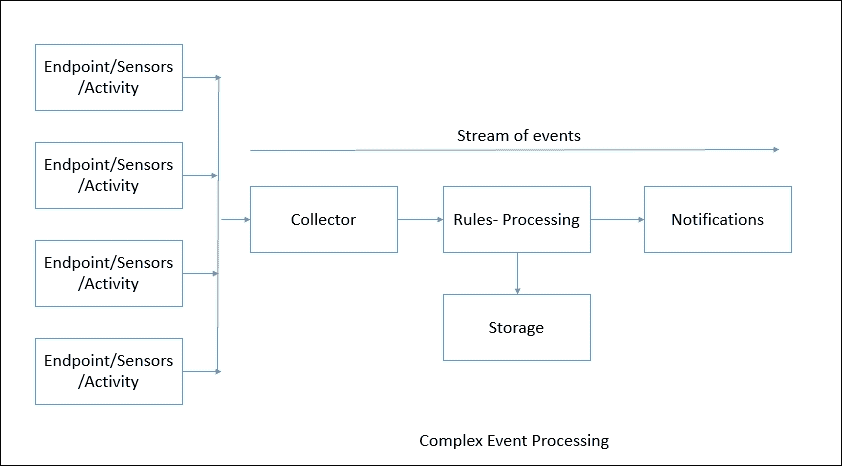
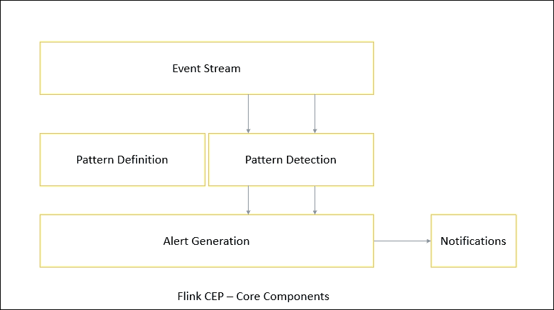
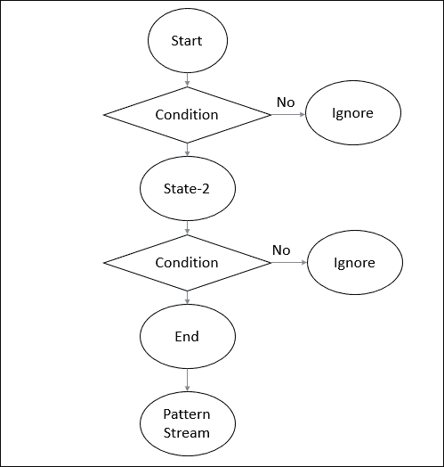
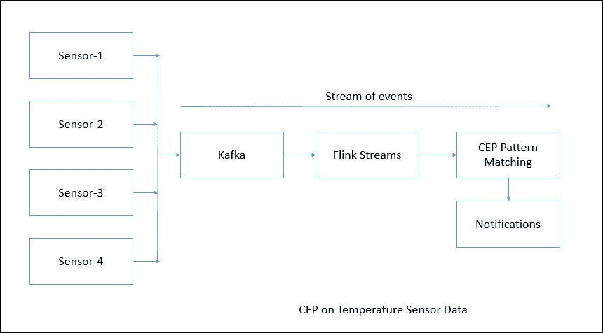

# 第五章：复杂事件处理

在上一章中，我们谈到了 Apache Flink 提供的 Table API 以及我们如何使用它来处理关系数据结构。从本章开始，我们将开始学习有关 Apache Flink 提供的库以及如何将它们用于特定用例的更多信息。首先，让我们尝试了解一个名为**复杂事件处理**（**CEP**）的库。CEP 是一个非常有趣但复杂的主题，在各行业都有其价值。无论在哪里都有预期的事件流，人们自然希望在所有这些用例中执行复杂事件处理。让我们尝试了解 CEP 的全部内容。

# 什么是复杂事件处理？

CEP 分析高频率和低延迟发生的不同事件流。如今，各行业都可以找到流事件，例如：

+   在石油和天然气领域，传感器数据来自各种钻井工具或上游油管设备

+   在安全领域，活动数据、恶意软件信息和使用模式数据来自各种终端

+   在可穿戴设备领域，数据来自各种手腕带，包含有关您的心率、活动等信息

+   在银行领域，数据来自信用卡使用、银行活动等

分析变化模式以实时通知常规装配中的任何变化非常重要。CEP 可以理解事件流、子事件及其序列中的模式。CEP 有助于识别有意义的模式和无关事件之间的复杂关系，并实时或准实时发送通知以防止损害：



上图显示了 CEP 流程的工作原理。尽管流程看起来很简单，但 CEP 具有各种能力，例如：

+   在输入事件流可用时立即生成结果的能力

+   提供诸如时间内聚合和两个感兴趣事件之间的超时等计算能力

+   提供在检测到复杂事件模式时实时/准实时警报和通知的能力

+   能够连接和关联异构源并分析其中的模式

+   实现高吞吐量、低延迟处理的能力

市场上有各种解决方案。随着大数据技术的进步，我们有多个选项，如 Apache Spark、Apache Samza、Apache Beam 等，但没有一个专门的库适用于所有解决方案。现在让我们尝试了解 Flink 的 CEP 库可以实现什么。

# Flink CEP

Apache Flink 提供了 Flink CEP 库，提供了执行复杂事件处理的 API。该库包括以下核心组件：

+   事件流

+   模式定义

+   模式检测

+   警报生成



Flink CEP 使用 Flink 的数据流 API 称为 DataStream。程序员需要定义要从事件流中检测到的模式，然后 Flink 的 CEP 引擎检测到模式并采取适当的操作，例如生成警报。

为了开始，我们需要添加以下 Maven 依赖项：

```java
<!-- https://mvnrepository.com/artifact/org.apache.flink/flink-cep-scala_2.10 --> 
<dependency> 
    <groupId>org.apache.flink</groupId> 
    <artifactId>flink-cep-scala_2.11</artifactId> 
    <version>1.1.4</version> 
</dependency> 

```

## 事件流

CEP 的一个非常重要的组件是其输入事件流。在早期的章节中，我们已经看到了 DataStream API 的详细信息。现在让我们利用这些知识来实现 CEP。我们需要做的第一件事就是为事件定义一个 Java POJO。假设我们需要监视温度传感器事件流。

首先，我们定义一个抽象类，然后扩展这个类。

### 注意

在定义事件 POJO 时，我们需要确保实现`hashCode()`和`equals()`方法，因为在比较事件时，编译将使用它们。

以下代码片段演示了这一点。

首先，我们编写一个抽象类，如下所示：

```java
package com.demo.chapter05; 

public abstract class MonitoringEvent { 

  private String machineName; 

  public String getMachineName() { 
    return machineName; 
  } 

  public void setMachineName(String machineName) { 
    this.machineName = machineName; 
  } 

  @Override 
  public int hashCode() { 
    final int prime = 31; 
    int result = 1; 
    result = prime * result + ((machineName == null) ? 0 : machineName.hashCode()); 
    return result; 
  } 

  @Override 
  public boolean equals(Object obj) { 
    if (this == obj) 
      return true; 
    if (obj == null) 
      return false; 
    if (getClass() != obj.getClass()) 
      return false; 
    MonitoringEvent other = (MonitoringEvent) obj; 
    if (machineName == null) { 
      if (other.machineName != null) 
        return false; 
    } else if (!machineName.equals(other.machineName)) 
      return false; 
    return true; 
  } 

  public MonitoringEvent(String machineName) { 
    super(); 
    this.machineName = machineName; 
  } 

} 

```

然后我们为实际温度事件创建一个 POJO：

```java
package com.demo.chapter05; 

public class TemperatureEvent extends MonitoringEvent { 

  public TemperatureEvent(String machineName) { 
    super(machineName); 
  } 

  private double temperature; 

  public double getTemperature() { 
    return temperature; 
  } 

  public void setTemperature(double temperature) { 
    this.temperature = temperature; 
  } 

  @Override 
  public int hashCode() { 
    final int prime = 31; 
    int result = super.hashCode(); 
    long temp; 
    temp = Double.doubleToLongBits(temperature); 
    result = prime * result + (int) (temp ^ (temp >>> 32)); 
    return result; 
  } 

  @Override 
  public boolean equals(Object obj) { 
    if (this == obj) 
      return true; 
    if (!super.equals(obj)) 
      return false; 
    if (getClass() != obj.getClass()) 
      return false; 
    TemperatureEvent other = (TemperatureEvent) obj; 
    if (Double.doubleToLongBits(temperature) != Double.doubleToLongBits(other.temperature)) 
      return false; 
    return true; 
  } 

  public TemperatureEvent(String machineName, double temperature) { 
    super(machineName); 
    this.temperature = temperature; 
  } 

  @Override 
  public String toString() { 
    return "TemperatureEvent [getTemperature()=" + getTemperature() + ", getMachineName()=" + getMachineName() 
        + "]"; 
  } 

} 

```

现在我们可以定义事件源如下：

在 Java 中：

```java
StreamExecutionEnvironment env = StreamExecutionEnvironment.getExecutionEnvironment(); 
    DataStream<TemperatureEvent> inputEventStream = env.fromElements(new TemperatureEvent("xyz", 22.0), 
        new TemperatureEvent("xyz", 20.1), new TemperatureEvent("xyz", 21.1), new TemperatureEvent("xyz", 22.2), 
        new TemperatureEvent("xyz", 22.1), new TemperatureEvent("xyz", 22.3), new TemperatureEvent("xyz", 22.1), 
        new TemperatureEvent("xyz", 22.4), new TemperatureEvent("xyz", 22.7), 
        new TemperatureEvent("xyz", 27.0)); 

```

在 Scala 中：

```java
val env: StreamExecutionEnvironment = StreamExecutionEnvironment.getExecutionEnvironment 
    val input: DataStream[TemperatureEvent] = env.fromElements(new TemperatureEvent("xyz", 22.0), 
      new TemperatureEvent("xyz", 20.1), new TemperatureEvent("xyz", 21.1), new TemperatureEvent("xyz", 22.2), 
      new TemperatureEvent("xyz", 22.1), new TemperatureEvent("xyz", 22.3), new TemperatureEvent("xyz", 22.1), 
      new TemperatureEvent("xyz", 22.4), new TemperatureEvent("xyz", 22.7), 
      new TemperatureEvent("xyz", 27.0)) 

```

# 模式 API

模式 API 允许您非常轻松地定义复杂的事件模式。每个模式由多个状态组成。要从一个状态转换到另一个状态，通常需要定义条件。条件可以是连续性或过滤掉的事件。



让我们尝试详细了解每个模式操作。

## 开始

初始状态可以定义如下：

在 Java 中：

```java
Pattern<Event, ?> start = Pattern.<Event>begin("start"); 

```

在 Scala 中：

```java
val start : Pattern[Event, _] = Pattern.begin("start") 

```

## 过滤器

我们还可以为初始状态指定过滤条件：

在 Java 中：

```java
start.where(new FilterFunction<Event>() { 
    @Override 
    public boolean filter(Event value) { 
        return ... // condition 
    } 
}); 

```

在 Scala 中：

```java
start.where(event => ... /* condition */) 

```

## 子类型

我们还可以根据它们的子类型过滤事件，使用`subtype()`方法：

在 Java 中：

```java
start.subtype(SubEvent.class).where(new FilterFunction<SubEvent>() { 
    @Override 
    public boolean filter(SubEvent value) { 
        return ... // condition 
    } 
}); 

```

在 Scala 中：

```java
start.subtype(classOf[SubEvent]).where(subEvent => ... /* condition */) 

```

## 或

模式 API 还允许我们一起定义多个条件。我们可以使用`OR`和`AND`运算符。

在 Java 中：

```java
pattern.where(new FilterFunction<Event>() { 
    @Override 
    public boolean filter(Event value) { 
        return ... // condition 
    } 
}).or(new FilterFunction<Event>() { 
    @Override 
    public boolean filter(Event value) { 
        return ... // or condition 
    } 
}); 

```

在 Scala 中：

```java
pattern.where(event => ... /* condition */).or(event => ... /* or condition */) 

```

## 连续性

如前所述，我们并不总是需要过滤事件。总是可能有一些我们需要连续而不是过滤的模式。

连续性可以有两种类型 - 严格连续性和非严格连续性。

### 严格连续性

严格连续性需要直接成功的两个事件，这意味着两者之间不应该有其他事件。这个模式可以通过`next()`定义。

在 Java 中：

```java
Pattern<Event, ?> strictNext = start.next("middle"); 

```

在 Scala 中：

```java
val strictNext: Pattern[Event, _] = start.next("middle") 

```

### 非严格连续

非严格连续性可以被定义为其他事件允许在特定两个事件之间。这个模式可以通过`followedBy()`定义。

在 Java 中：

```java
Pattern<Event, ?> nonStrictNext = start.followedBy("middle"); 

```

在 Scala 中：

```java
val nonStrictNext : Pattern[Event, _] = start.followedBy("middle") 

```

## 内

模式 API 还允许我们根据时间间隔进行模式匹配。我们可以定义基于时间的时间约束如下。

在 Java 中：

```java
next.within(Time.seconds(30)); 

```

在 Scala 中：

```java
next.within(Time.seconds(10)) 

```

## 检测模式

要检测事件流中的模式，我们需要通过模式运行流。`CEP.pattern()`返回`PatternStream`。

以下代码片段显示了我们如何检测模式。首先定义模式，以检查温度值是否在`10`秒内大于`26.0`度。

在 Java 中：

```java
Pattern<TemperatureEvent, ?> warningPattern = Pattern.<TemperatureEvent> begin("first") 
        .subtype(TemperatureEvent.class).where(new FilterFunction<TemperatureEvent>() { 
          public boolean filter(TemperatureEvent value) { 
            if (value.getTemperature() >= 26.0) { 
              return true; 
            } 
            return false; 
          } 
        }).within(Time.seconds(10)); 

    PatternStream<TemperatureEvent> patternStream = CEP.pattern(inputEventStream, warningPattern); 

```

在 Scala 中：

```java
val env: StreamExecutionEnvironment = StreamExecutionEnvironment.getExecutionEnvironment 

val input = // data 

val pattern: Pattern[TempEvent, _] = Pattern.begin("start").where(event => event.temp >= 26.0) 

val patternStream: PatternStream[TempEvent] = CEP.pattern(input, pattern) 

```

## 从模式中选择

一旦模式流可用，我们需要从中选择模式，然后根据需要采取适当的操作。我们可以使用`select`或`flatSelect`方法从模式中选择数据。

### 选择

select 方法需要`PatternSelectionFunction`实现。它有一个 select 方法，该方法将为每个事件序列调用。`select`方法接收匹配事件的字符串/事件对的映射。字符串由状态的名称定义。`select`方法返回确切的一个结果。

要收集结果，我们需要定义输出 POJO。在我们的案例中，假设我们需要生成警报作为输出。然后我们需要定义 POJO 如下：

```java
package com.demo.chapter05; 

public class Alert { 

  private String message; 

  public String getMessage() { 
    return message; 
  } 

  public void setMessage(String message) { 
    this.message = message; 
  } 

  public Alert(String message) { 
    super(); 
    this.message = message; 
  } 

  @Override 
  public String toString() { 
    return "Alert [message=" + message + "]"; 
  } 

  @Override 
  public int hashCode() { 
    final int prime = 31; 
    int result = 1; 
    result = prime * result + ((message == null) ? 0 :  
    message.hashCode()); 
    return result; 
  } 

  @Override 
  public boolean equals(Object obj) { 
    if (this == obj) 
      return true; 
    if (obj == null) 
      return false; 
    if (getClass() != obj.getClass()) 
      return false; 
    Alert other = (Alert) obj; 
    if (message == null) { 
      if (other.message != null) 
        return false; 
    } else if (!message.equals(other.message)) 
      return false; 
    return true; 
  } 

} 

```

接下来我们定义选择函数。

在 Java 中：

```java
class MyPatternSelectFunction<IN, OUT> implements PatternSelectFunction<IN, OUT> { 
    @Override 
    public OUT select(Map<String, IN> pattern) { 
        IN startEvent = pattern.get("start"); 
        IN endEvent = pattern.get("end"); 
        return new OUT(startEvent, endEvent); 
    } 
} 

```

在 Scala 中：

```java
def selectFn(pattern : mutable.Map[String, IN]): OUT = { 
    val startEvent = pattern.get("start").get 
    val endEvent = pattern.get("end").get 
    OUT(startEvent, endEvent) 
} 

```

### flatSelect

`flatSelect`方法类似于`select`方法。两者之间的唯一区别是`flatSelect`可以返回任意数量的结果。`flatSelect`方法有一个额外的`Collector`参数，用于输出元素。

以下示例显示了如何使用`flatSelect`方法。

在 Java 中：

```java
class MyPatternFlatSelectFunction<IN, OUT> implements PatternFlatSelectFunction<IN, OUT> { 
    @Override 
    public void select(Map<String, IN> pattern, Collector<OUT> collector) { 
        IN startEvent = pattern.get("start"); 
        IN endEvent = pattern.get("end"); 

        for (int i = 0; i < startEvent.getValue(); i++ ) { 
            collector.collect(new OUT(startEvent, endEvent)); 
        } 
    } 
} 

```

在 Scala 中：

```java
def flatSelectFn(pattern : mutable.Map[String, IN], collector : Collector[OUT]) = { 
    val startEvent = pattern.get("start").get 
    val endEvent = pattern.get("end").get 
    for (i <- 0 to startEvent.getValue) { 
        collector.collect(OUT(startEvent, endEvent)) 
    } 
} 

```

## 处理超时的部分模式

有时，如果我们将模式限制在时间边界内，可能会错过某些事件。可能会丢弃事件，因为它们超出了长度。为了对超时事件采取行动，`select`和`flatSelect`方法允许超时处理程序。对于每个超时事件模式，都会调用此处理程序。

在这种情况下，select 方法包含两个参数：`PatternSelectFunction`和`PatternTimeoutFunction`。超时函数的返回类型可以与选择模式函数不同。超时事件和选择事件被包装在`Either.Right`和`Either.Left`类中。

以下代码片段显示了我们在实践中如何做事情。

在 Java 中：

```java
PatternStream<Event> patternStream = CEP.pattern(input, pattern); 

DataStream<Either<TimeoutEvent, ComplexEvent>> result = patternStream.select( 
    new PatternTimeoutFunction<Event, TimeoutEvent>() {...}, 
    new PatternSelectFunction<Event, ComplexEvent>() {...} 
); 

DataStream<Either<TimeoutEvent, ComplexEvent>> flatResult = patternStream.flatSelect( 
    new PatternFlatTimeoutFunction<Event, TimeoutEvent>() {...}, 
    new PatternFlatSelectFunction<Event, ComplexEvent>() {...} 
);  

```

在 Scala 中，选择 API：

```java
val patternStream: PatternStream[Event] = CEP.pattern(input, pattern) 

DataStream[Either[TimeoutEvent, ComplexEvent]] result = patternStream.select{ 
    (pattern: mutable.Map[String, Event], timestamp: Long) => TimeoutEvent() 
} { 
    pattern: mutable.Map[String, Event] => ComplexEvent() 
} 

```

`flatSelect` API 与`Collector`一起调用，因为它可以发出任意数量的事件：

```java
val patternStream: PatternStream[Event] = CEP.pattern(input, pattern) 

DataStream[Either[TimeoutEvent, ComplexEvent]] result = patternStream.flatSelect{ 
    (pattern: mutable.Map[String, Event], timestamp: Long, out: Collector[TimeoutEvent]) => 
        out.collect(TimeoutEvent()) 
} { 
    (pattern: mutable.Map[String, Event], out: Collector[ComplexEvent]) => 
        out.collect(ComplexEvent()) 
} 

```

# 用例 - 在温度传感器上进行复杂事件处理

在早期的章节中，我们学习了 Flink CEP 引擎提供的各种功能。现在是时候了解我们如何在现实世界的解决方案中使用它了。为此，让我们假设我们在一个生产某些产品的机械公司工作。在产品工厂中，有必要不断监视某些机器。工厂已经设置了传感器，这些传感器不断发送机器的温度。

现在我们将建立一个系统，不断监视温度值，并在温度超过一定值时生成警报。

我们可以使用以下架构：



在这里，我们将使用 Kafka 从传感器收集事件。为了编写一个 Java 应用程序，我们首先需要创建一个 Maven 项目并添加以下依赖项：

```java
  <!-- https://mvnrepository.com/artifact/org.apache.flink/flink-cep-scala_2.11 --> 
    <dependency> 
      <groupId>org.apache.flink</groupId> 
      <artifactId>flink-cep-scala_2.11</artifactId> 
      <version>1.1.4</version> 
    </dependency> 
    <!-- https://mvnrepository.com/artifact/org.apache.flink/flink- streaming-java_2.11 --> 
    <dependency> 
      <groupId>org.apache.flink</groupId> 
      <artifactId>flink-streaming-java_2.11</artifactId> 
      <version>1.1.4</version> 
    </dependency> 
    <!-- https://mvnrepository.com/artifact/org.apache.flink/flink- streaming-scala_2.11 --> 
    <dependency> 
      <groupId>org.apache.flink</groupId> 
      <artifactId>flink-streaming-scala_2.11</artifactId> 
      <version>1.1.4</version> 
    </dependency> 
    <dependency> 
      <groupId>org.apache.flink</groupId> 
      <artifactId>flink-connector-kafka-0.9_2.11</artifactId> 
      <version>1.1.4</version> 
    </dependency> 

```

接下来，我们需要做以下事情来使用 Kafka。

首先，我们需要定义一个自定义的 Kafka 反序列化器。这将从 Kafka 主题中读取字节并将其转换为`TemperatureEvent`。以下是执行此操作的代码。

`EventDeserializationSchema.java`：

```java
package com.demo.chapter05; 

import java.io.IOException; 
import java.nio.charset.StandardCharsets; 

import org.apache.flink.api.common.typeinfo.TypeInformation; 
import org.apache.flink.api.java.typeutils.TypeExtractor; 
import org.apache.flink.streaming.util.serialization.DeserializationSchema; 

public class EventDeserializationSchema implements DeserializationSchema<TemperatureEvent> { 

  public TypeInformation<TemperatureEvent> getProducedType() { 
    return TypeExtractor.getForClass(TemperatureEvent.class); 
  } 

  public TemperatureEvent deserialize(byte[] arg0) throws IOException { 
    String str = new String(arg0, StandardCharsets.UTF_8); 

    String[] parts = str.split("="); 
    return new TemperatureEvent(parts[0], Double.parseDouble(parts[1])); 
  } 

  public boolean isEndOfStream(TemperatureEvent arg0) { 
    return false; 
  } 

} 

```

接下来，在 Kafka 中创建名为`temperature`的主题：

```java
bin/kafka-topics.sh --create --zookeeper localhost:2181 --replication-factor 1 --partitions 1 --topic temperature 

```

现在我们转到 Java 代码，该代码将监听 Flink 流中的这些事件：

```java
StreamExecutionEnvironment env = StreamExecutionEnvironment.getExecutionEnvironment(); 

    Properties properties = new Properties(); 
    properties.setProperty("bootstrap.servers", "localhost:9092"); 
    properties.setProperty("group.id", "test"); 

DataStream<TemperatureEvent> inputEventStream = env.addSource( 
        new FlinkKafkaConsumer09<TemperatureEvent>("temperature", new EventDeserializationSchema(), properties)); 

```

接下来，我们将定义模式，以检查温度是否在`10`秒内是否大于`26.0`摄氏度：

```java
Pattern<TemperatureEvent, ?> warningPattern = Pattern.<TemperatureEvent> begin("first").subtype(TemperatureEvent.class).where(new FilterFunction<TemperatureEvent>() { 
          private static final long serialVersionUID = 1L; 

          public boolean filter(TemperatureEvent value) { 
            if (value.getTemperature() >= 26.0) { 
              return true; 
            } 
            return false; 
          } 
        }).within(Time.seconds(10)); 

```

接下来将此模式与事件流匹配并选择事件。我们还将将警报消息添加到结果流中，如下所示：

```java
DataStream<Alert> patternStream = CEP.pattern(inputEventStream, warningPattern) 
        .select(new PatternSelectFunction<TemperatureEvent, Alert>() { 
          private static final long serialVersionUID = 1L; 

          public Alert select(Map<String, TemperatureEvent> event) throws Exception { 

            return new Alert("Temperature Rise Detected:" + event.get("first").getTemperature() 
                + " on machine name:" + event.get("first").getMachineName()); 
          } 

}); 

```

为了知道警报是如何生成的，我们将打印结果：

```java
patternStream.print(); 

```

然后我们执行流：

```java
env.execute("CEP on Temperature Sensor"); 

```

现在我们已经准备好执行应用程序了。当我们在 Kafka 主题中收到消息时，CEP 将继续执行。

实际执行将如下所示。以下是我们如何提供样本输入：

```java
xyz=21.0 
xyz=30.0 
LogShaft=29.3 
Boiler=23.1 
Boiler=24.2 
Boiler=27.0 
Boiler=29.0 

```

以下是样本输出的样子：

```java
Connected to JobManager at Actor[akka://flink/user/jobmanager_1#1010488393] 
10/09/2016 18:15:55  Job execution switched to status RUNNING. 
10/09/2016 18:15:55  Source: Custom Source(1/4) switched to SCHEDULED  
10/09/2016 18:15:55  Source: Custom Source(1/4) switched to DEPLOYING  
10/09/2016 18:15:55  Source: Custom Source(2/4) switched to SCHEDULED  
10/09/2016 18:15:55  Source: Custom Source(2/4) switched to DEPLOYING  
10/09/2016 18:15:55  Source: Custom Source(3/4) switched to SCHEDULED  
10/09/2016 18:15:55  Source: Custom Source(3/4) switched to DEPLOYING  
10/09/2016 18:15:55  Source: Custom Source(4/4) switched to SCHEDULED  
10/09/2016 18:15:55  Source: Custom Source(4/4) switched to DEPLOYING  
10/09/2016 18:15:55  CEPPatternOperator(1/1) switched to SCHEDULED  
10/09/2016 18:15:55  CEPPatternOperator(1/1) switched to DEPLOYING  
10/09/2016 18:15:55  Map -> Sink: Unnamed(1/4) switched to SCHEDULED  
10/09/2016 18:15:55  Map -> Sink: Unnamed(1/4) switched to DEPLOYING  
10/09/2016 18:15:55  Map -> Sink: Unnamed(2/4) switched to SCHEDULED  
10/09/2016 18:15:55  Map -> Sink: Unnamed(2/4) switched to DEPLOYING  
10/09/2016 18:15:55  Map -> Sink: Unnamed(3/4) switched to SCHEDULED  
10/09/2016 18:15:55  Map -> Sink: Unnamed(3/4) switched to DEPLOYING  
10/09/2016 18:15:55  Map -> Sink: Unnamed(4/4) switched to SCHEDULED  
10/09/2016 18:15:55  Map -> Sink: Unnamed(4/4) switched to DEPLOYING  
10/09/2016 18:15:55  Source: Custom Source(2/4) switched to RUNNING  
10/09/2016 18:15:55  Source: Custom Source(3/4) switched to RUNNING  
10/09/2016 18:15:55  Map -> Sink: Unnamed(1/4) switched to RUNNING  
10/09/2016 18:15:55  Map -> Sink: Unnamed(2/4) switched to RUNNING  
10/09/2016 18:15:55  Map -> Sink: Unnamed(3/4) switched to RUNNING  
10/09/2016 18:15:55  Source: Custom Source(4/4) switched to RUNNING  
10/09/2016 18:15:55  Source: Custom Source(1/4) switched to RUNNING  
10/09/2016 18:15:55  CEPPatternOperator(1/1) switched to RUNNING  
10/09/2016 18:15:55  Map -> Sink: Unnamed(4/4) switched to RUNNING  
1> Alert [message=Temperature Rise Detected:30.0 on machine name:xyz] 
2> Alert [message=Temperature Rise Detected:29.3 on machine name:LogShaft] 
3> Alert [message=Temperature Rise Detected:27.0 on machine name:Boiler] 
4> Alert [message=Temperature Rise Detected:29.0 on machine name:Boiler] 

```

我们还可以配置邮件客户端并使用一些外部网络钩子来发送电子邮件或即时通讯通知。

### 注意

应用程序的代码可以在 GitHub 上找到：[`github.com/deshpandetanmay/mastering-flink`](https://github.com/deshpandetanmay/mastering-flink)。

# 摘要

在本章中，我们学习了 CEP。我们讨论了涉及的挑战以及我们如何使用 Flink CEP 库来解决 CEP 问题。我们还学习了 Pattern API 以及我们可以使用的各种运算符来定义模式。在最后一节中，我们试图连接各个点，看到一个完整的用例。通过一些改变，这个设置也可以在其他领域中使用。

在下一章中，我们将看到如何使用 Flink 的内置机器学习库来解决复杂的问题。
