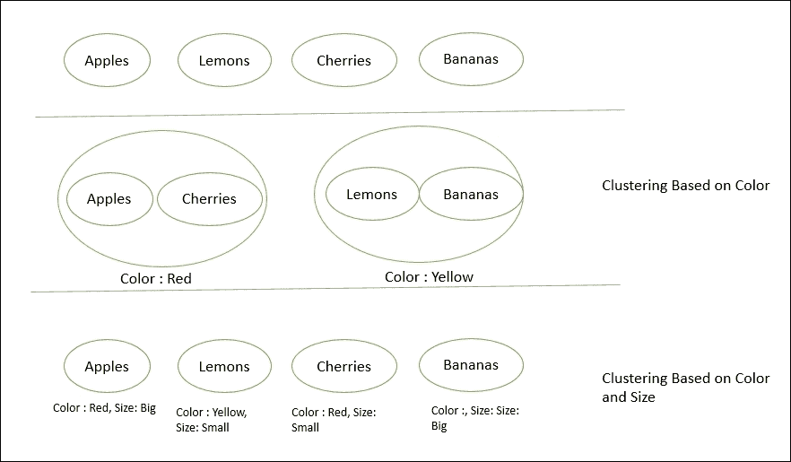
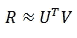
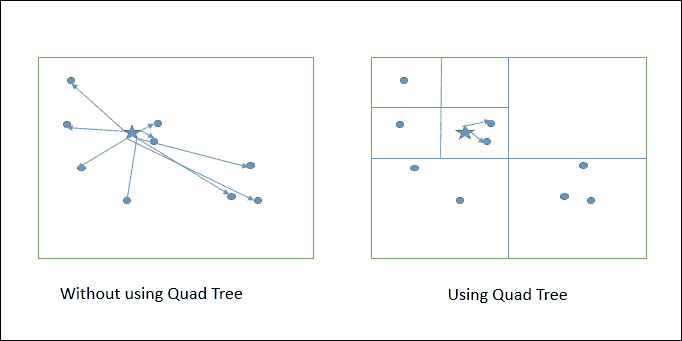

# 第六章：使用 FlinkML 进行机器学习

在上一章中，我们讨论了如何使用 Flink CEP 库解决复杂的事件处理问题。在本章中，我们将看到如何使用 Flink 的机器学习库 FlinkML 进行机器学习。FlinkML 包括一组支持的算法，可用于解决现实生活中的用例。在本章中，我们将看看 FlinkML 中有哪些算法以及如何应用它们。

在深入研究 FlinkML 之前，让我们首先尝试理解基本的机器学习原理。

# 什么是机器学习？

机器学习是一种利用数学让机器根据提供给它们的数据进行分类、预测、推荐等的工程流。这个领域非常广阔，我们可以花费数年来讨论它。但为了保持我们的讨论集中，我们只讨论本书范围内所需的内容。

非常广泛地，机器学习可以分为三大类：

+   监督学习

+   无监督学习

+   半监督学习！什么是机器学习？

前面的图表显示了机器学习算法的广泛分类。现在让我们详细讨论这些。

## 监督学习

在监督学习中，我们通常会得到一个输入数据集，这是实际事件的历史记录。我们还知道预期的输出应该是什么样子。使用历史数据，我们选择了哪些因素导致了结果。这些属性被称为特征。使用历史数据，我们了解了以前的结果是如何计算的，并将相同的理解应用于我们想要进行预测的数据。

监督学习可以再次细分为：

+   回归

+   分类

### 回归

在回归问题中，我们试图使用连续函数的输入来预测结果。回归意味着基于另一个变量的分数来预测一个变量的分数。我们将要预测的变量称为标准变量，我们将进行预测的变量称为预测变量。可能会有多个预测变量；在这种情况下，我们需要找到最佳拟合线，称为回归线。

### 注意

您可以在[`en.wikipedia.org/wiki/Regression_analysis`](https://en.wikipedia.org/wiki/Regression_analysis)上了解更多关于回归的信息。

用于解决回归问题的一些常见算法如下：

+   逻辑回归

+   决策树

+   支持向量机（SVM）

+   朴素贝叶斯

+   随机森林

+   线性回归

+   多项式回归

### 分类

在分类中，我们预测离散结果的输出。分类作为监督学习的一部分，也需要提供输入数据和样本输出。在这里，基于特征，我们试图将结果分类为一组定义好的类别。例如，根据给定的特征，将人员记录分类为男性或女性。或者，根据客户行为，预测他/她是否会购买产品。或者根据电子邮件内容和发件人，预测电子邮件是否是垃圾邮件。参考[`en.wikipedia.org/wiki/Statistical_classification`](https://en.wikipedia.org/wiki/Statistical_classification)。

为了理解回归和分类之间的区别，考虑股票数据的例子。回归算法可以帮助预测未来几天股票的价值，而分类算法可以帮助决定是否购买股票。

## 无监督学习

无监督学习并不给我们任何关于结果应该如何的想法。相反，它允许我们根据属性的特征对数据进行分组。我们根据记录之间的关系推导出聚类。

与监督学习不同，我们无法验证结果，这意味着没有反馈方法来告诉我们是否做对了还是错了。无监督学习主要基于聚类算法。

### 聚类

为了更容易理解聚类，让我们考虑一个例子；假设我们有 2 万篇关于各种主题的新闻文章，我们需要根据它们的内容对它们进行分组。在这种情况下，我们可以使用聚类算法，将一组文章分成小组。

我们还可以考虑水果的基本例子。假设我们有苹果、香蕉、柠檬和樱桃在一个水果篮子里，我们需要将它们分类成组。如果我们看它们的颜色，我们可以将它们分成两组：

+   **红色组**：苹果和樱桃

+   **黄色组**：香蕉和柠檬

现在我们可以根据另一个特征，它的大小，进行更多的分组：

+   **红色和大尺寸**：苹果

+   **红色和小尺寸**：樱桃

+   **黄色和大尺寸**：香蕉

+   **黄色和小尺寸**：柠檬

以下图表显示了聚类的表示：



通过查看更多特征，我们也可以进行更多的聚类。在这里，我们没有任何训练数据和要预测的变量，不像在监督学习中。我们的唯一任务是学习更多关于特征，并根据输入对记录进行聚类。

以下是一些常用于聚类的算法：

+   K 均值聚类

+   层次聚类

+   隐马尔可夫模型

### 关联

关联问题更多是关于学习和通过定义关联规则进行推荐。例如，关联规则可能指的是购买 iPhone 的人更有可能购买 iPhone 手机壳的假设。

如今，许多零售公司使用这些算法进行个性化推荐。例如，在[www.amazon.com](http://www.amazon.com)，如果我倾向于购买产品*X*，然后亚马逊也向我推荐产品*Y*，那么这两者之间一定存在一些关联。

基于这些原则的一些算法如下：

+   Apriori 算法

+   Eclat 算法

+   FDP 增长算法

## 半监督学习

半监督学习是监督学习的一个子类，它考虑了用于训练的未标记数据。通常，在训练过程中，有大量未标记数据，只有很少量的标记数据。许多研究人员和机器学习实践者发现，当标记数据与未标记数据一起使用时，结果很可能更准确。

### 注意

有关半监督学习的更多细节，请参阅[`en.wikipedia.org/wiki/Semi-supervised_learning`](https://en.wikipedia.org/wiki/Semi-supervised_learning)。

# FlinkML

FlinkML 是由 Flink 支持的一组算法库，可用于解决现实生活中的用例。这些算法被构建成可以利用 Flink 的分布式计算能力，并且可以轻松进行预测、聚类等。目前，只支持了少量算法集，但列表正在增长。

FlinkML 的重点是 ML 开发人员需要编写最少的粘合代码。粘合代码是帮助将各种组件绑定在一起的代码。FlinkML 的另一个目标是保持算法的使用简单。

Flink 利用内存数据流和本地执行迭代数据处理。FlinkML 允许数据科学家在本地测试他们的模型，使用数据子集，然后在更大的数据上以集群模式执行它们。

FlinkML 受 scikit-learn 和 Spark 的 MLlib 启发，允许您清晰地定义数据管道，并以分布式方式解决机器学习问题。

Flink 开发团队的路线图如下：

+   转换器和学习者的管道

+   数据预处理：

+   特征缩放

+   多项式特征基映射

+   特征哈希

+   文本特征提取

+   降维

+   模型选择和性能评估：

+   使用各种评分函数进行模型评估

+   用于模型选择和评估的交叉验证

+   超参数优化

+   监督学习：

+   优化框架

+   随机梯度下降

+   L-BFGS

+   广义线性模型

+   多元线性回归

+   LASSO，岭回归

+   多类逻辑回归

+   随机森林

+   支持向量机

+   决策树

+   无监督学习：

+   聚类

+   K 均值聚类

+   主成分分析

+   推荐：

+   ALS

+   文本分析：

+   LDA

+   统计估计工具

+   分布式线性代数

+   流式机器学习

突出显示的算法已经是现有的 Flink 源代码的一部分。在接下来的部分中，我们将看看如何在实践中使用它们。

# 支持的算法

要开始使用 FlinkML，我们首先需要添加以下 Maven 依赖项：

```java
<!-- https://mvnrepository.com/artifact/org.apache.flink/flink-ml_2.11 --> 
<dependency> 
    <groupId>org.apache.flink</groupId> 
    <artifactId>flink-ml_2.11</artifactId> 
    <version>1.1.4</version> 
</dependency> 

```

现在让我们试着了解支持的算法以及如何使用它们。

## 监督学习

Flink 支持监督学习类别中的三种算法。它们如下：

+   支持向量机（SVM）

+   多元线性回归

+   优化框架

让我们一次学习一个开始。

### 支持向量机

**支持向量机**（**SVMs**）是监督学习模型，用于解决分类和回归问题。它有助于将对象分类到一个类别或另一个类别。它是非概率线性分类。SVM 可以用在各种例子中，例如以下情况：

+   常规数据分类问题

+   文本和超文本分类问题

+   图像分类问题

+   生物学和其他科学问题

Flink 支持基于软间隔的 SVM，使用高效的通信分布式双坐标上升算法。

有关该算法的详细信息可在[`ci.apache.org/projects/flink/flink-docs-release-1.2/dev/libs/ml/svm.html#description`](https://ci.apache.org/projects/flink/flink-docs-release-1.2/dev/libs/ml/svm.html#description)找到。

Flink 使用**随机双坐标上升**（**SDCA**）来解决最小化问题。为了使该算法在分布式环境中高效，Flink 使用 CoCoA 算法，该算法在本地数据块上计算 SDCA，然后将其合并到全局状态中。

### 注意

该算法的实现基于以下论文：[`arxiv.org/pdf/1409.1458v2.pdf`](https://arxiv.org/pdf/1409.1458v2.pdf)。

现在让我们看看如何使用该算法解决实际问题。我们将以鸢尾花数据集（[`en.wikipedia.org/wiki/Iris_flower_data_set`](https://en.wikipedia.org/wiki/Iris_flower_data_set)）为例，该数据集由四个属性组成，决定了鸢尾花的种类。以下是一些示例数据：

| **萼片长度** | **萼片宽度** | **花瓣长度** | **花瓣宽度** | **种类** |
| --- | --- | --- | --- | --- |
| 5.1 | 3.5 | 1.4 | 0.2 | 1 |
| 5.6 | 2.9 | 3.6 | 1.3 | 2 |
| 5.8 | 2.7 | 5.1 | 1.9 | 3 |

在这里，使用数字格式的类别作为 SVM 的输入非常重要：

| **种类代码** | **种类名称** |
| --- | --- |
| 1 | 鸢尾花山鸢尾 |
| 2 | 鸢尾花变色鸢尾 |
| 3 | 鸢尾花维吉尼亚 |

在使用 Flink 的 SVM 算法之前，我们需要做的另一件事是将 CSV 数据转换为 LibSVM 数据。

### 注意

LibSVM 数据是一种用于指定 SVM 数据集的特殊格式。有关 LibSVM 的更多信息，请访问[`www.csie.ntu.edu.tw/~cjlin/libsvmtools/datasets/`](https://www.csie.ntu.edu.tw/~cjlin/libsvmtools/datasets/)。

要将 CSV 数据转换为 LibSVM 数据，我们将使用[`github.com/zygmuntz/phraug/blob/master/csv2libsvm.py`](https://github.com/zygmuntz/phraug/blob/master/csv2libsvm.py)上提供的一些开源 Python 代码。

要将 CSV 转换为 LibSVM，我们需要执行以下命令：

```java
    csv2libsvm.py <input file> <output file> [<label index = 0>] [<skip 
    headers = 0>]

```

现在让我们开始编写程序：

```java
package com.demo.chapter06 

import org.apache.flink.api.scala._ 
import org.apache.flink.ml.math.Vector 
import org.apache.flink.ml.common.LabeledVector 
import org.apache.flink.ml.classification.SVM 
import org.apache.flink.ml.RichExecutionEnvironment 

object MySVMApp { 
  def main(args: Array[String]) { 
    // set up the execution environment 
    val pathToTrainingFile: String = "iris-train.txt" 
    val pathToTestingFile: String = "iris-train.txt" 
    val env = ExecutionEnvironment.getExecutionEnvironment 

    // Read the training dataset, from a LibSVM formatted file 
    val trainingDS: DataSet[LabeledVector] = 
    env.readLibSVM(pathToTrainingFile) 

    // Create the SVM learner 
    val svm = SVM() 
      .setBlocks(10) 

    // Learn the SVM model 
    svm.fit(trainingDS) 

    // Read the testing dataset 
    val testingDS: DataSet[Vector] = 
    env.readLibSVM(pathToTestingFile).map(_.vector) 

    // Calculate the predictions for the testing dataset 
    val predictionDS: DataSet[(Vector, Double)] = 
    svm.predict(testingDS) 
    predictionDS.writeAsText("out") 

    env.execute("Flink SVM App") 
  } 
} 

```

所以，现在我们已经准备好运行程序了，您将在输出文件夹中看到预测的输出。

以下是代码：

```java
(SparseVector((0,5.1), (1,3.5), (2,1.4), (3,0.2)),1.0) 
(SparseVector((0,4.9), (1,3.0), (2,1.4), (3,0.2)),1.0) 
(SparseVector((0,4.7), (1,3.2), (2,1.3), (3,0.2)),1.0) 
(SparseVector((0,4.6), (1,3.1), (2,1.5), (3,0.2)),1.0) 
(SparseVector((0,5.0), (1,3.6), (2,1.4), (3,0.2)),1.0) 
(SparseVector((0,5.4), (1,3.9), (2,1.7), (3,0.4)),1.0) 
(SparseVector((0,4.6), (1,3.4), (2,1.4), (3,0.3)),1.0) 
(SparseVector((0,5.0), (1,3.4), (2,1.5), (3,0.2)),1.0) 
(SparseVector((0,4.4), (1,2.9), (2,1.4), (3,0.2)),1.0) 
(SparseVector((0,4.9), (1,3.1), (2,1.5), (3,0.1)),1.0) 
(SparseVector((0,5.4), (1,3.7), (2,1.5), (3,0.2)),1.0) 
(SparseVector((0,4.8), (1,3.4), (2,1.6), (3,0.2)),1.0) 
(SparseVector((0,4.8), (1,3.0), (2,1.4), (3,0.1)),1.0) 

```

我们还可以通过设置各种参数来微调结果：

| **参数** | **描述** |
| --- | --- |
| `Blocks` | 设置输入数据将被分成的块数。最好将这个数字设置为你想要实现的并行度。在每个块上，执行本地随机对偶坐标上升。默认值为`None`。 |
| `Iterations` | 设置外部循环方法的迭代次数，例如，SDCA 方法在分块数据上应用的次数。默认值为`10`。 |
| `LocalIterations` | 定义需要在本地执行的 SDCA 迭代的最大次数。默认值为`10`。 |
| `Regularization` | 设置算法的正则化常数。您设置的值越高，加权向量的 2 范数就越小。默认值为`1`。 |
| `StepSize` | 定义了权重向量更新的初始步长。在算法变得不稳定的情况下，需要设置这个值。默认值为`1.0`。 |
| `ThresholdValue` | 定义决策函数的限制值。默认值为`0.0`。 |
| `OutputDecisionFunction` | 将其设置为 true 将返回每个示例的超平面距离。将其设置为 false 将返回二进制标签。 |
| `Seed` | 设置随机长整数。这将用于初始化随机数生成器。 |

### 多元线性回归

**多元线性回归**（**MLR**）是简单线性回归的扩展，其中使用多个自变量（*X*）来确定单个自变量（*Y*）。预测值是输入变量的线性变换，使得观察值和预测值的平方偏差之和最小。

MLR 试图通过拟合线性方程来建模多个解释变量和响应变量之间的关系。

### 注意

关于 MLR 的更详细的解释可以在此链接找到[`www.stat.yale.edu/Courses/1997-98/101/linmult.htm`](http://www.stat.yale.edu/Courses/1997-98/101/linmult.htm)。

现在让我们尝试使用 MLR 解决鸢尾花数据集的相同分类问题。首先，我们需要训练数据集来训练我们的模型。

在这里，我们将使用在 SVM 上一节中使用的相同的数据文件。现在我们有`iris-train.txt`和`iris-test.txt`，它们已经转换成了 LibSVM 格式。

以下代码片段显示了如何使用 MLR：

```java
package com.demo.flink.ml 

import org.apache.flink.api.scala._ 
import org.apache.flink.ml._ 
import org.apache.flink.ml.common.LabeledVector 
import org.apache.flink.ml.math.DenseVector 
import org.apache.flink.ml.math.Vector 
import org.apache.flink.ml.preprocessing.Splitter 
import org.apache.flink.ml.regression.MultipleLinearRegression 

object MLRJob { 
  def main(args: Array[String]) { 
    // set up the execution environment 
    val env = ExecutionEnvironment.getExecutionEnvironment 
    val trainingDataset = MLUtils.readLibSVM(env, "iris-train.txt") 
    val testingDataset = MLUtils.readLibSVM(env, "iris-test.txt").map { 
    lv => lv.vector } 
    val mlr = MultipleLinearRegression() 
      .setStepsize(1.0) 
      .setIterations(5) 
      .setConvergenceThreshold(0.001) 

    mlr.fit(trainingDataset) 

    // The fitted model can now be used to make predictions 
    val predictions = mlr.predict(testingDataset) 

    predictions.print() 

  } 
} 

```

完整的代码和数据文件可以在[`github.com/deshpandetanmay/mastering-flink/tree/master/chapter06`](https://github.com/deshpandetanmay/mastering-flink/tree/master/chapter06)上下载。我们还可以通过设置各种参数来微调结果：

| **参数** | **描述** |
| --- | --- |
| `Iterations` | 设置最大迭代次数。默认值为`10`。 |
| `Stepsize` | 梯度下降方法的步长。这个值控制了梯度下降方法在相反方向上可以移动多远。调整这个参数非常重要，以获得更好的结果。默认值为`0.1`。 |
| `Convergencethreshold` | 直到迭代停止的平方残差的相对变化的阈值。默认值为`None`。 |
| `Learningratemethod` | `Learningratemethod` 用于计算每次迭代的学习率。 |

### 优化框架

Flink 中的优化框架是一个开发者友好的包，可以用来解决优化问题。这不是一个解决确切问题的特定算法，而是每个机器学习问题的基础。

一般来说，它是关于找到一个模型，带有一组参数，通过最小化函数。FlinkML 支持**随机梯度下降**（**SGD**），并具有以下类型的正则化：

| **正则化函数** | **类名** |
| --- | --- |
| L1 正则化 | `GradientDescentL1` |
| L2 正则化 | `GradientDescentL2` |
| 无正则化 | `SimpleGradient` |

以下代码片段显示了如何使用 FlinkML 使用 SGD：

```java
// Create SGD solver 
val sgd = GradientDescentL1() 
  .setLossFunction(SquaredLoss()) 
  .setRegularizationConstant(0.2) 
  .setIterations(100) 
  .setLearningRate(0.01) 
  .setLearningRateMethod(LearningRateMethod.Xu(-0.75)) 

// Obtain data 
val trainingDS: DataSet[LabeledVector] = ... 

// Optimize the weights, according to the provided data 
val weightDS = sgd.optimize(trainingDS) 

```

我们还可以使用参数来微调算法：

| **参数** | **描述** |
| --- | --- |

| `LossFunction` | Flink 支持以下损失函数：

+   平方损失

+   铰链损失

+   逻辑损失

+   默认值为`None`

|

| `RegularizationConstant` | 要应用的正则化权重。默认值为`0.1`。 |
| --- | --- |
| `Iterations` | 要执行的最大迭代次数。默认值为`10`。 |
| `ConvergenceThreshold` | 直到迭代停止的残差平方和的相对变化阈值。默认值为`None`。 |
| `LearningRateMethod` | 用于计算每次迭代的学习率的方法。 |
| `LearningRate` | 这是梯度下降方法的初始学习率。 |
| `Decay` | 默认值为`0.0`。 |

## 推荐

推荐引擎是最有趣和最常用的机器学习技术之一，用于提供基于用户和基于项目的推荐。亚马逊等电子商务公司使用推荐引擎根据客户的购买模式和评论评分来个性化推荐。

Flink 还支持基于 ALS 的推荐。让我们更详细地了解 ALS。

### 交替最小二乘法

**交替最小二乘法**（**ALS**）算法将给定的矩阵*R*分解为两个因子*U*和*V*，使得 

为了更好地理解该算法的应用，让我们假设我们有一个包含用户*u*对书籍*b*提供的评分*r*的数据集。

这是一个样本数据格式（`user_id`，`book_id`，`rating)`：

```java
1  10 1 
1  11 2 
1  12 5 
1  13 5 
1  14 5 
1  15 4 
1  16 5 
1  17 1 
1  18 5 
2  10 1 
2  11 2 
2  15 5 
2  16 4.5 
2  17 1 
2  18 5 
3  11 2.5 
3  12 4.5 
3  13 4 
3  14 3 
3  15 3.5 
3  16 4.5 
3  17 4 
3  18 5 
4  10 5 
4  11 5 
4  12 5 
4  13 0 
4  14 2 
4  15 3 
4  16 1 
4  17 4 
4  18 1 

```

现在我们可以将这些信息提供给 ALS 算法，并开始从中获得推荐。以下是使用 ALS 的代码片段：

```java
package com.demo.chapter06 

import org.apache.flink.api.scala._ 
import org.apache.flink.ml.recommendation._ 
import org.apache.flink.ml.common.ParameterMap 

object MyALSApp { 
  def main(args: Array[String]): Unit = { 

    val env = ExecutionEnvironment.getExecutionEnvironment 
    val inputDS: DataSet[(Int, Int, Double)] = env.readCsvFile(Int,  
    Int, Double) 

    // Setup the ALS learner 
    val als = ALS() 
      .setIterations(10) 
      .setNumFactors(10) 
      .setBlocks(100) 
      .setTemporaryPath("tmp") 

    // Set the other parameters via a parameter map 
    val parameters = ParameterMap() 
      .add(ALS.Lambda, 0.9) 
      .add(ALS.Seed, 42L) 

    // Calculate the factorization 
    als.fit(inputDS, parameters) 

    // Read the testing dataset from a csv file 
    val testingDS: DataSet[(Int, Int)] = env.readCsvFile[(Int, Int)]   
    ("test-data.csv") 

    // Calculate the ratings according to the matrix factorization 
    val predictedRatings = als.predict(testingDS) 

    predictedRatings.writeAsCsv("output") 

    env.execute("Flink Recommendation App") 
  } 
} 

```

一旦您执行应用程序，您将获得推荐结果。与其他算法一样，您可以微调参数以获得更好的结果：

| **参数** | **描述** |
| --- | --- |
| `NumFactors` | 用于基础模型的潜在因子的数量。默认值为`10`。 |
| `Lambda` | 这是一个正则化因子；我们可以调整此参数以获得更好的结果。默认值为`1`。 |
| `Iterations` | 要执行的最大迭代次数。默认值为`10`。 |
| `Blocks` | 用户和项目矩阵分组的块数。块越少，发送的冗余数据就越少。默认值为`None`。 |
| `Seed` | 用于初始化项目矩阵生成器的种子值。默认值为`0`。 |
| `TemporaryPath` | 这是用于存储中间结果的路径。 |

## 无监督学习

现在让我们试着了解 FinkML 为无监督学习提供了什么。目前，它只支持一种算法，称为 k 最近邻接算法。

### k 最近邻接

**k 最近邻接**（**kNN**）算法旨在为另一个数据集中的每个对象找到 k 个最近邻居。它是许多数据挖掘算法中最常用的解决方案之一。kNN 是一项昂贵的操作，因为它是找到 k 个最近邻居并执行连接的组合。考虑到数据的量，很难在集中的单台机器上执行此操作，因此总是很好地拥有可以在分布式架构上工作的解决方案。FlinkML 算法提供了分布式环境下的 kNN。

### 注意

可以在这里找到一篇描述在分布式环境中实现 kNN 的研究论文：[`arxiv.org/pdf/1207.0141v1.pdf`](https://arxiv.org/pdf/1207.0141v1.pdf)。

在这里，想法是计算每个训练和测试点之间的距离，然后找到给定点的最近点。计算每个点之间的距离是一项耗时的活动，在 Flink 中通过实现四叉树来简化。

使用四叉树通过对数据集进行分区来减少计算。这将计算减少到仅对数据子集进行。以下图表显示了使用四叉树和不使用四叉树的计算：



您可以在这里找到有关使用四叉树计算最近邻居的详细讨论：[`danielblazevski.github.io/assets/player/KeynoteDHTMLPlayer.html`](http://danielblazevski.github.io/assets/player/KeynoteDHTMLPlayer.html)。

四叉树并不总是表现得更好。如果数据是空间的，四叉树可能是最糟糕的选择。但作为开发人员，我们不需要担心这一点，因为 FlinkML 会根据可用的数据来决定是否使用四叉树。

以下代码片段显示了如何在 FlinkML 中使用 kNN 连接：

```java
import org.apache.flink.api.common.operators.base.CrossOperatorBase.CrossHint 
import org.apache.flink.api.scala._ 
import org.apache.flink.ml.nn.KNN 
import org.apache.flink.ml.math.Vector 
import org.apache.flink.ml.metrics.distances.SquaredEuclideanDistanceMetric 

val env = ExecutionEnvironment.getExecutionEnvironment 

// prepare data 
val trainingSet: DataSet[Vector] = ... 
val testingSet: DataSet[Vector] = ... 

val knn = KNN() 
  .setK(3) 
  .setBlocks(10) 
  .setDistanceMetric(SquaredEuclideanDistanceMetric()) 
  .setUseQuadTree(false) 
  .setSizeHint(CrossHint.SECOND_IS_SMALL) 

// run knn join 
knn.fit(trainingSet) 
val result = knn.predict(testingSet).collect() 

```

以下是一些我们可以用来微调结果的参数：

| **参数** | **描述** |
| --- | --- |
| `K` | 要搜索的最近邻居的数量。默认值为`5`。 |
| `DistanceMetric` | 设置用于计算两点之间距离的距离度量。默认情况下，使用欧几里德距离度量。 |
| `Blocks` | 输入数据应该分成的块数。将此数字设置为并行度的理想值。 |
| `UseQuadTree` | 设置是否使用四叉树进行处理。默认值为`None`。如果未指定任何内容，算法会自行决定。 |

## 实用程序

FlinkML 支持各种可扩展的实用程序，在进行数据分析和预测时非常方便。其中一个实用程序是距离度量。Flink 支持一组可以使用的距离度量。以下链接显示了 Flink 支持的距离度量：[`ci.apache.org/projects/flink/flink-docs-release-1.2/dev/libs/ml/distance_metrics.html`](https://ci.apache.org/projects/flink/flink-docs-release-1.2/dev/libs/ml/distance_metrics.html)。

如果前面提到的算法都不能满足您的需求，您可以考虑编写自己的自定义距离算法。以下代码片段显示了如何实现：

```java
class MyDistance extends DistanceMetric { 
  override def distance(a: Vector, b: Vector) = ... // your implementation  
} 

object MyDistance { 
  def apply() = new MyDistance() 
} 

val myMetric = MyDistance() 

```

使用距离度量的一个很好的应用是 kNN 连接算法，您可以设置要使用的距离度量。

另一个重要的实用程序是`Splitter`，它可以用于交叉验证。在某些情况下，我们可能没有测试数据集来验证我们的结果。在这种情况下，我们可以使用`Splitter`来拆分训练数据集。

以下是一个示例：

```java
// A Simple Train-Test-Split 
val dataTrainTest: TrainTestDataSet = Splitter.trainTestSplit(data, 0.6, true) 

```

在前面的示例中，我们将训练数据集分成了实际数据的 60%和 40%的部分。

还有另一种获取更好结果的方法，称为`TrainTestHoldout`拆分。在这里，我们使用一部分数据进行训练，一部分进行测试，另一部分用于最终结果验证。以下代码片段显示了如何实现：

```java
// Create a train test holdout DataSet 
val dataTrainTestHO: trainTestHoldoutDataSet = Splitter.trainTestHoldoutSplit(data, Array(6.0, 3.0, 1.0)) 

```

我们可以使用另一种策略，称为 K 折拆分。在这种方法中，训练集被分成*k*个相等大小的折叠。在这里，为每个折叠创建一个算法，然后针对其测试集进行验证。以下代码显示了如何进行 K 折拆分：

```java
// Create an Array of K TrainTestDataSets 
val dataKFolded: Array[TrainTestDataSet] =  Splitter.kFoldSplit(data, 10) 

```

我们还可以使用**多随机拆分**；在这里，我们可以指定要创建多少个数据集以及原始数据的什么部分：

```java
// create an array of 5 datasets of 1 of 50%, and 5 of 10% each  
val dataMultiRandom: Array[DataSet[T]] = Splitter.multiRandomSplit(data, Array(0.5, 0.1, 0.1, 0.1, 0.1)) 

```

## 数据预处理和管道

Flink 支持 Python scikit-learn 风格的管道。FlinkML 中的管道是将多个转换器和预测器链接在一起的特性。一般来说，许多数据科学家希望轻松地查看和构建机器学习应用的流程。Flink 允许他们使用管道的概念来实现这一点。

一般来说，ML 管道有三个构建块：

+   **估计器：** 估计器使用`fit`方法对模型进行实际训练。例如，在线性回归模型中找到正确的权重。

+   **转换器：** 转换器正如其名称所示，具有一个`transform`方法，可以帮助进行输入缩放。

+   **预测器：** 预测器具有`predict`方法，该方法应用算法生成预测，例如，SVM 或 MLR。

管道是一系列估计器、转换器和预测器。预测器是管道的末端，在此之后不能再链接任何内容。

Flink 支持各种数据预处理工具，这将有助于我们提高结果。让我们开始了解细节。

### 多项式特征

多项式特征是一种将向量映射到* d *次多项式特征空间的转换器。多项式特征有助于通过改变函数的图形来解决分类问题。让我们通过一个例子来理解这一点：

+   考虑一个线性公式：*F(x,y) = 1*x + 2*y;*

+   想象我们有两个观察结果：

+   *x=12* 和 *y=2*

+   *x=5* 和 *y =5.5*

在这两种情况下，我们得到 *f() = 16*。如果这些观察结果属于两个不同的类别，那么我们无法区分这两个类别。现在，如果我们添加一个称为*z*的新特征，该特征是前两个特征的组合*z = x+y*。

现在 *f(x,y,z) = 1*x + 2*y + 3*z*

现在相同的观察结果将是

+   *(1*12)+ (2*2) + (3*24) = 88*

+   *(1*5)+ (2*5.5) + (3*27.5) = 98.5*

通过使用现有特征添加新特征的方式可以帮助我们获得更好的结果。Flink 多项式特征允许我们使用预构建函数做同样的事情。

为了在 Flink 中使用多项式特征，我们有以下代码：

```java
val polyFeatures = PolynomialFeatures() 
      .setDegree(3) 

```

### 标准缩放器

标准缩放器通过使用用户指定的均值和方差来缩放输入数据。如果用户没有指定任何值，则默认均值为`0`，标准差为`1`。标准缩放器是一个具有`fit`和`transform`方法的转换器。

首先，我们需要像下面的代码片段中所示定义均值和标准差的值：

```java
  val scaler = StandardScaler() 
      .setMean(10.0) 
      .setStd(2.0) 

```

接下来，我们需要让它了解训练数据集的均值和标准差，如下面的代码片段所示：

```java
scaler.fit(trainingDataset)
```

最后，我们使用用户定义的均值和标准差来缩放提供的数据，如下面的代码片段所示：

```java
val scaledDS = scaler.transform(trainingDataset)
```

现在我们可以使用这些缩放后的输入数据进行进一步的转换和分析。

### 最小-最大缩放器

最小-最大缩放器类似于标准缩放器，但唯一的区别是它确保每个特征的缩放位于用户定义的`min`和`max`值之间。

以下代码片段显示了如何使用它：

```java
val minMaxscaler = MinMaxScaler()
.setMin(1.0)
.setMax(3.0)
minMaxscaler.fit(trainingDataset)
val scaledDS = minMaxscaler.transform(trainingDataset)
```

因此，我们可以使用这些数据预处理操作来增强结果。这些还可以组合在管道中创建工作流程。

以下代码片段显示了如何在管道中使用这些数据预处理操作：

```java
// Create pipeline PolynomialFeatures -> MultipleLinearRegression
val pipeline = polyFeatures.chainPredictor(mlr)
// train the model
pipeline.fit(scaledDS)
// The fitted model can now be used to make predictions
val predictions = pipeline.predict(testingDataset)
predictions.print()
```

完整的代码可在 GitHub 上找到[`github.com/deshpandetanmay/mastering-flink/tree/master/chapter06`](https://github.com/deshpandetanmay/mastering-flink/tree/master/chapter06)。

# 摘要

在本章中，我们了解了不同类型的机器学习算法。我们看了各种监督和无监督算法，以及它们各自的示例。我们还看了 FlinkML 提供的各种实用工具，在数据分析过程中非常方便。后来我们看了数据预处理操作以及如何在管道中使用它们。

在接下来的章节中，我们将看一下 Flink 的图处理能力。
