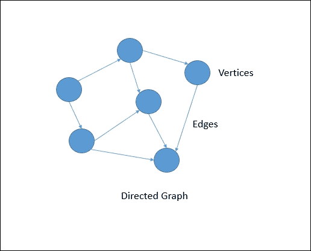
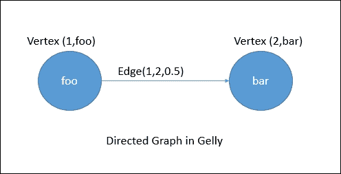
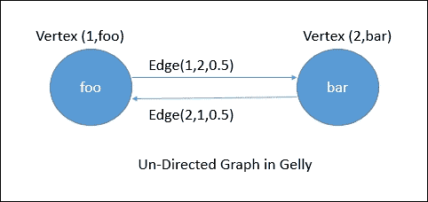
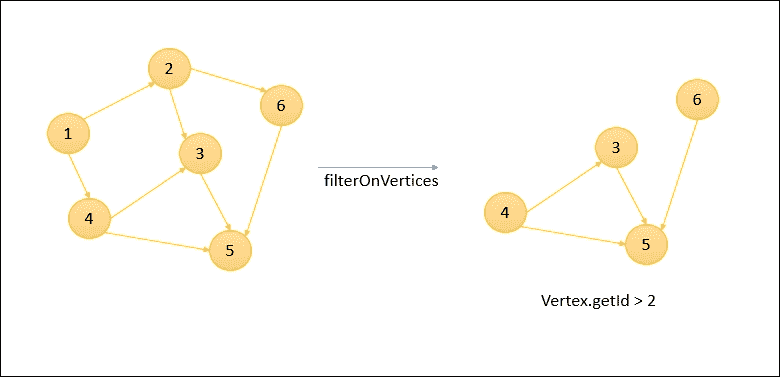
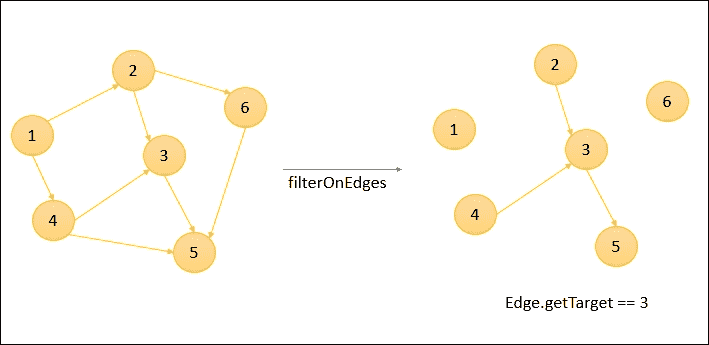
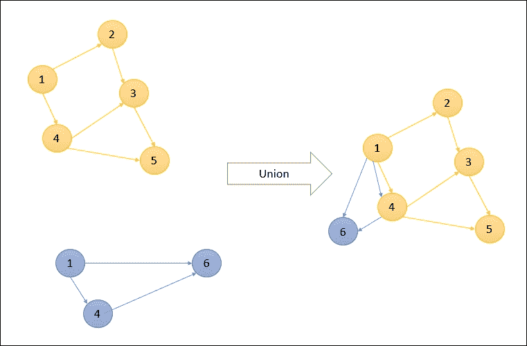
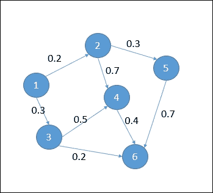
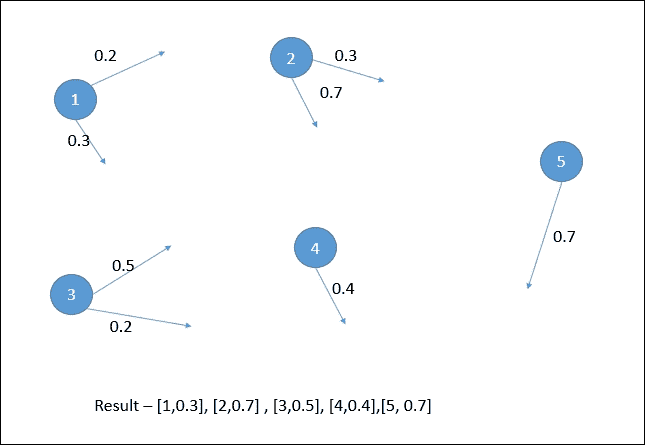

# 第七章： Flink 图 API - Gelly

我们生活在社交媒体时代，每个人都以某种方式与他人联系。每个单独的对象都与另一个对象有关系。Facebook 和 Twitter 是社交图的绝佳例子，其中*x*与*y*是朋友，*p*正在关注*q*，等等。这些图如此庞大，以至于我们需要一个能够高效处理它们的引擎。如果我们被这样的图所包围，分析它们以获取更多关于它们关系和下一级关系的见解非常重要。

市场上有各种技术可以帮助我们分析这样的图，例如 Titan 和 Neo4J 等图数据库，Spark GraphX 和 Flink Gelly 等图处理库等。在本章中，我们将了解图的细节以及如何使用 Flink Gelly 来分析图数据。

那么让我们开始吧。

# 什么是图？

在计算机科学领域，图是表示对象之间关系的一种方式。它由一组通过边连接的顶点组成。**顶点**是平面上的对象，由坐标或某个唯一的 id/name 标识，而**边**是连接顶点的链接，具有一定的权重或关系。图可以是有向的或无向的。在有向图中，边从一个顶点指向另一个顶点，而在无向图中，边没有方向。

以下图表显示了有向图的基本表示：



图结构可以用于各种目的，例如找到到达某个目的地的最短路径，或者用于查找某些顶点之间关系的程度，或者用于查找最近的邻居。

现在让我们深入了解 Flink 的图 API - Gelly。

# Flink 图 API - Gelly

Flink 提供了一个名为 Gelly 的图处理库，以简化图分析的开发。它提供了用于存储和表示图数据的数据结构，并提供了分析图的方法。在 Gelly 中，我们可以使用 Flink 的高级函数将图从一种状态转换为另一种状态。它还提供了一组用于详细图分析的算法。

Gelly 目前作为 Flink 库的一部分可用，因此我们需要在程序中添加 Maven 依赖项才能使用它。

Java 依赖：

```java
<dependency> 
    <groupId>org.apache.flink</groupId> 
    <artifactId>flink-gelly_2.11</artifactId> 
    <version>1.1.4</version> 
</dependency> 

```

Scala 依赖：

```java
<dependency> 
    <groupId>org.apache.flink</groupId> 
    <artifactId>flink-gelly-scala_2.11</artifactId> 
    <version>1.1.4</version> 
</dependency> 

```

现在让我们看看我们有哪些选项可以有效地使用 Gelly。

## 图表示

在 Gelly 中，图被表示为节点数据集和边数据集。

### 图节点

图节点由`Vertex`数据类型表示。`Vertex`数据类型包括唯一 ID 和可选值。唯一 ID 应实现可比较接口，因为在进行图处理时，我们通过它们的 ID 进行比较。一个`Vertex`可以有一个值，也可以有一个空值。空值顶点由类型`NullValue`定义。

以下代码片段显示了如何创建节点：

在 Java 中：

```java
// A vertex with a Long ID and a String value 
Vertex<Long, String> v = new Vertex<Long, String>(1L, "foo"); 

// A vertex with a Long ID and no value 
Vertex<Long, NullValue> v = new Vertex<Long, NullValue>(1L, NullValue.getInstance()); 

```

在 Scala 中：

```java
// A vertex with a Long ID and a String value 
val v = new Vertex(1L, "foo") 

// A vertex with a Long ID and no value 
val v = new Vertex(1L, NullValue.getInstance()) 

```

### 图边

同样，边可以由类型`Edge`定义。`Edge`具有源节点 ID、目标节点 ID 和可选值。该值表示关系的程度或权重。源和目标 ID 需要是相同类型的。没有值的边可以使用`NullValue`定义。

以下代码片段显示了 Java 和 Scala 中的`Edge`定义：

在 Java 中：

```java
// Edge connecting Vertices with Ids 1 and 2 having weight 0.5 

Edge<Long, Double> e = new Edge<Long, Double>(1L, 2L, 0.5); 

Double weight = e.getValue(); // weight = 0.5 

```

在 Scala 中：

```java
// Edge connecting Vertices with Ids 1 and 2 having weight 0.5 

val e = new Edge(1L, 2L, 0.5) 

val weight = e.getValue // weight = 0.5 

```

在 Gelly 中，图始终是从源顶点到目标顶点的有向的。为了显示无向图，我们应该添加另一条边，表示从目标到源的连接和返回。

以下代码片段表示了 Gelly 中的有向图：

在 Java 中：

```java
// A vertex with a Long ID and a String value 
Vertex<Long, String> v1 = new Vertex<Long, String>(1L, "foo"); 

// A vertex with a Long ID and a String value 
Vertex<Long, String> v2 = new Vertex<Long, String>(2L, "bar"); 

// Edge connecting Vertices with Ids 1 and 2 having weight 0.5 

Edge<Long, Double> e = new Edge<Long, Double>(1L, 2L, 0.5); 

```

在 Scala 中：

```java
// A vertex with a Long ID and a String value 
val v1 = new Vertex(1L, "foo") 

// A vertex with a Long ID and a String value 
val v2 = new Vertex(1L, "bar") 

// Edge connecting Vertices with Ids 1 and 2 having weight 0.5 

val e = new Edge(1L, 2L, 0.5) 

```

以下是它的可视化表示：



以下代码片段表示了 Gelly 中无向图的顶点和边的定义：

在 Java 中：

```java
// A vertex with a Long ID and a String value 
Vertex<Long, String> v1 = new Vertex<Long, String>(1L, "foo"); 

// A vertex with a Long ID and a String value 
Vertex<Long, String> v2 = new Vertex<Long, String>(2L, "bar"); 

// Edges connecting Vertices with Ids 1 and 2 having weight 0.5 

Edge<Long, Double> e1 = new Edge<Long, Double>(1L, 2L, 0.5); 

Edge<Long, Double> e2 = new Edge<Long, Double>(2L, 1L, 0.5); 

```

在 Scala 中：

```java
// A vertex with a Long ID and a String value 
val v1 = new Vertex(1L, "foo") 

// A vertex with a Long ID and a String value 
val v2 = new Vertex(1L, "bar") 

// Edges connecting Vertices with Ids 1 and 2 having weight 0.5 

val e1 = new Edge(1L, 2L, 0.5) 

val e2 = new Edge(2L, 1L, 0.5) 

```

以下是其相同的可视表示：



## 图创建

在 Flink Gelly 中，可以以多种方式创建图。以下是一些示例。

### 来自边和顶点数据集

以下代码片段表示我们如何使用边数据集和可选顶点创建图：

在 Java 中：

```java
ExecutionEnvironment env = ExecutionEnvironment.getExecutionEnvironment(); 

DataSet<Vertex<String, Long>> vertices = ... 

DataSet<Edge<String, Double>> edges = ... 

Graph<String, Long, Double> graph = Graph.fromDataSet(vertices, edges, env); 

```

在 Scala 中：

```java
val env = ExecutionEnvironment.getExecutionEnvironment 

val vertices: DataSet[Vertex[String, Long]] = ... 

val edges: DataSet[Edge[String, Double]] = ... 

val graph = Graph.fromDataSet(vertices, edges, env) 

```

### 来自表示边的元组数据集

以下代码片段表示我们如何使用表示边的 Tuple2 数据集创建图。在这里，Gelly 会自动将 Tuple2 转换为具有源和目标顶点 ID 以及空值的边。

在 Java 中：

```java
ExecutionEnvironment env = ExecutionEnvironment.getExecutionEnvironment(); 

DataSet<Tuple2<String, String>> edges = ... 

Graph<String, NullValue, NullValue> graph = Graph.fromTuple2DataSet(edges, env); 

```

在 Scala 中：

```java
val env = ExecutionEnvironment.getExecutionEnvironment 

val edges: DataSet[(String, String)] = ... 

val graph = Graph.fromTuple2DataSet(edges, env) 

```

以下代码片段表示我们如何使用表示边的 Tuple3 数据集创建图。这里，顶点使用 Tuple2 表示，而边使用 Tuple3 表示，包含有关源顶点、目标顶点和权重的信息。我们还可以从 CSV 文件中读取一组值：

在 Java 中：

```java
ExecutionEnvironment env = ExecutionEnvironment.getExecutionEnvironment(); 

DataSet<Tuple2<String, Long>> vertexTuples = env.readCsvFile("path/to/vertex/input.csv").types(String.class, Long.class); 

DataSet<Tuple3<String, String, Double>> edgeTuples = env.readCsvFile("path/to/edge/input.csv").types(String.class, String.class, Double.class); 

Graph<String, Long, Double> graph = Graph.fromTupleDataSet(vertexTuples, edgeTuples, env); 

```

在 Scala 中：

```java
val env = ExecutionEnvironment.getExecutionEnvironment 

val vertexTuples = env.readCsvFileString, Long 

val edgeTuples = env.readCsvFileString, String, Double 

val graph = Graph.fromTupleDataSet(vertexTuples, edgeTuples, env) 

```

### 来自 CSV 文件

以下代码片段表示我们如何使用 CSV 文件读取器创建图。CSV 文件应以顶点和边的形式表示数据。

以下代码片段创建了一个图，该图来自 CSV 文件，格式为边的源、目标、权重，以及顶点的 ID、名称：

```java
val env = ExecutionEnvironment.getExecutionEnvironment 

// create a Graph with String Vertex IDs, Long Vertex values and Double Edge values 
val graph = Graph.fromCsvReaderString, Long, Double 

```

我们还可以通过在创建图时定义`map`函数来使用顶点值初始化程序：

```java
val simpleGraph = Graph.fromCsvReaderLong, Double, NullValue { 
            def map(id: Long): Double = { 
                id.toDouble 
            } 
        }, 
        env = env) 

```

### 来自集合列表

我们还可以从列表集合创建图。以下代码片段显示了我们如何从边和顶点列表创建图：

在 Java 中：

```java
ExecutionEnvironment env = ExecutionEnvironment.getExecutionEnvironment(); 

List<Vertex<Long, Long>> vertexList = new ArrayList... 

List<Edge<Long, String>> edgeList = new ArrayList... 

Graph<Long, Long, String> graph = Graph.fromCollection(vertexList, edgeList, env); 

```

在 Scala 中：

```java
val env = ExecutionEnvironment.getExecutionEnvironment 

val vertexList = List(...) 

val edgeList = List(...) 

val graph = Graph.fromCollection(vertexList, edgeList, env) 

```

如果没有提供顶点输入，则可以考虑提供一个`map`初始化函数，如下所示：

```java
val env = ExecutionEnvironment.getExecutionEnvironment 

// initialize the vertex value to be equal to the vertex ID 
val graph = Graph.fromCollection(edgeList, 
    new MapFunction[Long, Long] { 
       def map(id: Long): Long = id 
    }, env)
```

## 图属性

以下表格显示了用于检索图属性的一组可用方法：

| **属性** | **在 Java 中** | **在 Scala 中** |
| --- | --- | --- |
| `getVertices`数据集 | `DataSet<Vertex<K, VV>> getVertices()` | `getVertices: DataSet[Vertex<K, VV>]` |
| `getEdges`数据集 | `DataSet<Edge<K, EV>> getEdges()` | `getEdges: DataSet[Edge<K, EV>]` |
| `getVertexIds` | `DataSet<K> getVertexIds()` | `getVertexIds: DataSet[K]` |
| `getEdgeIds` | `DataSet<Tuple2<K, K>> getEdgeIds()` | `getEdgeIds: DataSet[(K, K)]` |
| 获取顶点 ID 和所有顶点的`inDegrees`数据集 | `DataSet<Tuple2<K, LongValue>> inDegrees()` | `inDegrees: DataSet[(K, LongValue)]` |
| 获取顶点 ID 和所有顶点的`outDegrees`数据集 | `DataSet<Tuple2<K, LongValue>> outDegrees()` | `outDegrees: DataSet[(K, LongValue)]` |
| 获取顶点 ID 和所有顶点的 in、`getDegree`数据集 | `DataSet<Tuple2<K, LongValue>> getDegrees()` | `getDegrees: DataSet[(K, LongValue)]` |
| 获取`numberOfVertices` | `long numberOfVertices()` | `numberOfVertices: Long` |
| 获取`numberOfEdges` | `long numberOfEdges()` | `numberOfEdges: Long` |
| `getTriplets`提供了由源顶点、目标顶点和边组成的三元组 | `DataSet<Triplet<K, VV, EV>> getTriplets()` | `getTriplets: DataSet[Triplet<K, VV, EV>]` |

## 图转换

Gelly 提供了各种转换操作，可帮助将图从一种形式转换为另一种形式。以下是我们可以使用 Gelly 进行的一些转换。

### 映射

Gelly 提供了保持顶点和边 ID 不变并根据函数中给定的值转换值的映射转换。此操作始终返回一个新图。以下代码片段显示了如何使用它。

在 Java 中：

```java
ExecutionEnvironment env = ExecutionEnvironment.getExecutionEnvironment(); 
Graph<Long, Long, Long> graph = Graph.fromDataSet(vertices, edges, env); 

// increment each vertex value by 5 
Graph<Long, Long, Long> updatedGraph = graph.mapVertices( 
        new MapFunction<Vertex<Long, Long>, Long>() { 
          public Long map(Vertex<Long, Long> value) { 
            return value.getValue() + 5; 
          } 
        }); 

```

在 Scala 中：

```java
val env = ExecutionEnvironment.getExecutionEnvironment 
val graph = Graph.fromDataSet(vertices, edges, env) 

// increment each vertex value by 5 
val updatedGraph = graph.mapVertices(v => v.getValue + 5) 

```

### 翻译

Translate 是一种特殊函数，允许翻译顶点 ID、顶点值、边 ID 等。翻译是使用用户提供的自定义映射函数执行的。以下代码片段显示了我们如何使用 translate 函数。

在 Java 中：

```java
// translate each vertex and edge ID to a String 
Graph<String, Long, Long> updatedGraph = graph.translateGraphIds( 
        new MapFunction<Long, String>() { 
          public String map(Long id) { 
            return id.toString(); 
          } 
        }); 

// translate vertex IDs, edge IDs, vertex values, and edge values to LongValue 
Graph<LongValue, LongValue, LongValue> updatedGraph = graph 
                .translateGraphIds(new LongToLongValue()) 
                .translateVertexValues(new LongToLongValue()) 
                .translateEdgeValues(new LongToLongValue()) 

```

在 Scala 中：

```java
// translate each vertex and edge ID to a String 
val updatedGraph = graph.translateGraphIds(id => id.toString) 

```

### 过滤

`FilterFunction`可用于根据某些条件过滤顶点和边。`filterOnEdges`将创建原始图的子图。在此操作中，顶点数据集保持不变。同样，`filterOnVertices`对顶点值应用过滤器。在这种情况下，找不到目标节点的边将被移除。以下代码片段显示了我们如何在 Gelly 中使用`FilterFunction`。

在 Java 中：

```java
Graph<Long, Long, Long> graph = ... 

graph.subgraph( 
    new FilterFunction<Vertex<Long, Long>>() { 
           public boolean filter(Vertex<Long, Long> vertex) { 
          // keep only vertices with positive values 
          return (vertex.getValue() > 2); 
         } 
       }, 
    new FilterFunction<Edge<Long, Long>>() { 
        public boolean filter(Edge<Long, Long> edge) { 
          // keep only edges with negative values 
          return (edge.getTarget() == 3); 
        } 
    }) 

```

在 Scala 中：

```java
val graph: Graph[Long, Long, Long] = ... 
graph.subgraph((vertex => vertex.getValue > 2), (edge => edge.getTarget == 3)) 

```

以下是前述代码的图形表示：



同样，以下图表显示了`filterOnEdges`：



### 连接

`join`操作有助于将顶点和边数据集与其他数据集进行连接。`joinWithVertices`方法与顶点 ID 和 Tuple2 的第一个字段进行连接。`join`方法返回一个新的图。同样，输入数据集可以与边进行连接。我们可以通过三种方式连接边：

+   `joinWithEdges`：在源和目标顶点 ID 的复合键上与 Tuple3 数据集进行连接

+   `joinWithEdgeOnSource`：与 Tuple2 数据集在源键和 Tuple2 数据集的第一个属性上进行连接

+   `joinWithEdgeOnTarget`：与目标键和 Tuple2 数据集的第一个属性进行连接

以下代码片段显示了如何在 Gelly 中使用连接：

在 Java 中：

```java
Graph<Long, Double, Double> network = ... 

DataSet<Tuple2<Long, LongValue>> vertexOutDegrees = network.outDegrees(); 

// assign the transition probabilities as the edge weights 
Graph<Long, Double, Double> networkWithWeights = network.joinWithEdgesOnSource(vertexOutDegrees, 
        new VertexJoinFunction<Double, LongValue>() { 
          public Double vertexJoin(Double vertexValue, LongValue inputValue) { 
            return vertexValue / inputValue.getValue(); 
          } 
        }); 

```

在 Scala 中：

```java
val network: Graph[Long, Double, Double] = ... 

val vertexOutDegrees: DataSet[(Long, LongValue)] = network.outDegrees 
// assign the transition probabilities as the edge weights 

val networkWithWeights = network.joinWithEdgesOnSource(vertexOutDegrees, (v1: Double, v2: LongValue) => v1 / v2.getValue) 

```

### 反向

`reverse`方法返回一个边方向被颠倒的图。

以下代码片段显示了如何使用相同的方法：

在 Java 中：

```java
Graph<Long, Double, Double> network = ...; 
Graph<Long, Double, Double> networkReverse  = network.reverse(); 

```

在 Scala 中：

```java
val network: Graph[Long, Double, Double] = ... 
val networkReversed: Graph[Long, Double, Double] = network.reverse  

```

### 无向的

`undirected`方法返回一个具有与原始边相反的额外边的新图。

以下代码片段显示了如何使用相同的方法：

在 Java 中：

```java
Graph<Long, Double, Double> network = ...; 
Graph<Long, Double, Double> networkUD  = network.undirected(); 

```

在 Scala 中：

```java
val network: Graph[Long, Double, Double] = ... 
val networkUD: Graph[Long, Double, Double] = network.undirected 

```

### 联合

`union`操作返回一个组合了两个图的顶点和边的图。它在顶点 ID 上进行连接。重复的顶点将被移除，而边将被保留。

以下是`union`操作的图形表示：



### 相交

`intersect`方法执行给定图数据集的边的交集。如果两条边具有相同的源和目标顶点，则它们被视为相等。该方法还包含 distinct 参数；如果设置为`true`，它只返回不同的图。以下是一些代码片段，展示了`intersect`方法的用法。

在 Java 中：

```java
ExecutionEnvironment env = ExecutionEnvironment.getExecutionEnvironment(); 

// create first graph from edges {(1, 2, 10) (1, 2, 11), (1, 2, 10)} 
List<Edge<Long, Long>> edges1 = ... 
Graph<Long, NullValue, Long> graph1 = Graph.fromCollection(edges1, env); 

// create second graph from edges {(1, 2, 10)} 
List<Edge<Long, Long>> edges2 = ... 
Graph<Long, NullValue, Long> graph2 = Graph.fromCollection(edges2, env); 

// Using distinct = true results in {(1,2,10)} 
Graph<Long, NullValue, Long> intersect1 = graph1.intersect(graph2, true); 

// Using distinct = false results in {(1,2,10),(1,2,10)} as there is one edge pair 
Graph<Long, NullValue, Long> intersect2 = graph1.intersect(graph2, false); 

```

在 Scala 中：

```java
val env = ExecutionEnvironment.getExecutionEnvironment 

// create first graph from edges {(1, 2, 10) (1, 2, 11), (1, 2, 10)} 
val edges1: List[Edge[Long, Long]] = ... 
val graph1 = Graph.fromCollection(edges1, env) 

// create second graph from edges {(1, 2, 10)} 
val edges2: List[Edge[Long, Long]] = ... 
val graph2 = Graph.fromCollection(edges2, env) 

// Using distinct = true results in {(1,2,10)} 
val intersect1 = graph1.intersect(graph2, true) 

// Using distinct = false results in {(1,2,10),(1,2,10)} as there is one edge pair 
val intersect2 = graph1.intersect(graph2, false) 

```

## 图变异

Gelly 提供了向现有图添加/移除边和顶点的方法。让我们逐一了解这些变异。

| **变异** | **在 Java 中** | **在 Scala 中** |
| --- | --- | --- |
| 添加顶点。`Graph<K, VV, EV> addVertex(final Vertex<K, VV> vertex)` `addVertex(vertex: Vertex[K, VV])` |
| 添加顶点列表。`Graph<K, VV, EV> addVertices(List<Vertex<K, VV>> verticesToAdd)` `addVertices(verticesToAdd: List[Vertex[K, VV]])` |
| 向图中添加边。如果边和顶点不存在，则添加新的边和顶点。`Graph<K, VV, EV> addEdge(Vertex<K, VV> source, Vertex<K, VV> target, EV edgeValue)` `addEdge(source: Vertex[K, VV], target: Vertex[K, VV], edgeValue: EV)` |
| 添加边，如果顶点不存在，则该边被视为无效。`Graph<K, VV, EV> addEdges(List<Edge<K, EV>> newEdges)` `addEdges(edges: List[Edge[K, EV]])` |
| 从给定的图中移除顶点，移除边和顶点。`Graph<K, VV, EV> removeVertex(Vertex<K, VV> vertex)` `removeVertex(vertex: Vertex[K, VV])` |
| 从给定的图中移除多个顶点。`Graph<K, VV, EV> removeVertices(List<Vertex<K, VV>> verticesToBeRemoved)` `removeVertices(verticesToBeRemoved: List[Vertex[K, VV]])` |
| 移除与给定边匹配的所有边。`Graph<K, VV, EV> removeEdge(Edge<K, EV> edge)` `removeEdge(edge: Edge[K, EV])` |
| 移除与给定边列表匹配的边。`Graph<K, VV, EV> removeEdges(List<Edge<K, EV>> edgesToBeRemoved)` `removeEdges(edgesToBeRemoved: List[Edge[K, EV]])` |

## 邻域方法

邻域方法有助于执行与其第一跳邻域相关的操作。诸如`reduceOnEdges()`和`reduceOnNeighbours()`之类的方法可用于执行聚合操作。第一个用于计算顶点相邻边的聚合，而后者用于计算相邻顶点的聚合。邻居范围可以通过提供边方向来定义，我们有选项，如`IN`，`OUT`或`ALL`。

考虑一个例子，我们需要获取`OUT`方向边的所有顶点的最大权重：



现在我们想要找出每个顶点的最大加权`OUT`边。Gelly 为我们提供了邻域方法，我们可以用它找到所需的结果。以下是相同的代码片段：

在 Java 中：

```java
Graph<Long, Long, Double> graph = ... 

DataSet<Tuple2<Long, Double>> maxWeights = graph.reduceOnEdges(new SelectMaxWeight(), EdgeDirection.OUT); 

// user-defined function to select the max weight 
static final class SelectMaxWeight implements ReduceEdgesFunction<Double> { 

    @Override 
    public Double reduceEdges(Double firstEdgeValue, Double secondEdgeValue) { 
      return Math.max(firstEdgeValue, secondEdgeValue); 
    } 
} 

```

在 Scala 中：

```java
val graph: Graph[Long, Long, Double] = ... 

val minWeights = graph.reduceOnEdges(new SelectMaxWeight, EdgeDirection.OUT) 

// user-defined function to select the max weight 
final class SelectMaxWeight extends ReduceEdgesFunction[Double] { 
  override def reduceEdges(firstEdgeValue: Double, secondEdgeValue: Double): Double = { 
    Math.max(firstEdgeValue, secondEdgeValue) 
  } 
 } 

```

Gelly 通过首先分离每个顶点并找出每个顶点的最大加权边来解决这个问题。以下是相同的图形表示：



同样，我们也可以编写一个函数来计算所有邻域中传入边的值的总和。

在 Java 中：

```java
Graph<Long, Long, Double> graph = ... 

DataSet<Tuple2<Long, Long>> verticesWithSum = graph.reduceOnNeighbors(new SumValues(), EdgeDirection.IN); 

static final class SumValues implements ReduceNeighborsFunction<Long> { 

        @Override 
        public Long reduceNeighbors(Long firstNeighbor, Long secondNeighbor) { 
          return firstNeighbor + secondNeighbor; 
      } 
} 

```

在 Scala 中：

```java
val graph: Graph[Long, Long, Double] = ... 

val verticesWithSum = graph.reduceOnNeighbors(new SumValues, EdgeDirection.IN) 

final class SumValues extends ReduceNeighborsFunction[Long] { 
     override def reduceNeighbors(firstNeighbor: Long, secondNeighbor: Long): Long = { 
      firstNeighbor + secondNeighbor 
    } 
} 

```

## 图验证

Gelly 为我们提供了一个实用程序，在将其发送进行处理之前验证输入图。在各种情况下，我们首先需要验证图是否符合某些条件，然后才能将其发送进行进一步处理。验证可能是检查图是否包含重复边或检查图结构是否为二部图。

### 注意

二部图或双图是一个图，其顶点可以分为两个不同的集合，以便每个集合中的每个顶点都与另一个集合中的顶点相连。二部图的一个简单例子是篮球运动员和他们所效力的球队的图。在这里，我们将有两个集合，分别是球员和球队，每个球员集合中的顶点都将与球队集合中的顶点相连。有关二部图的更多细节，请阅读这里[`en.wikipedia.org/wiki/Bipartite_graph`](https://en.wikipedia.org/wiki/Bipartite_graph)。

我们也可以定义自定义验证方法来获得所需的输出。Gelly 还提供了一个名为`InvalidVertexValidator`的内置验证器。这将检查边集是否包含验证顶点 ID。以下是一些展示其用法的代码片段。

在 Java 中：

```java
Graph<Long, Long, Long> graph = Graph.fromCollection(vertices, edges, env); 

// Returns false for invalid vertex id.  
graph.validate(new InvalidVertexIdsValidator<Long, Long, Long>()); 

```

在 Scala 中：

```java
val graph = Graph.fromCollection(vertices, edges, env) 

// Returns false for invalid vertex id.  
graph.validate(new InvalidVertexIdsValidator[Long, Long, Long]) 

```

# 迭代图处理

Gelly 增强了 Flink 的迭代处理能力，以支持大规模图处理。目前它支持以下模型的实现：

+   顶点中心

+   分散-聚集

+   聚集-求和-应用

让我们首先在 Gelly 的背景下理解这些模型。

## 顶点中心迭代

正如名称所示，这些迭代是建立在顶点处于中心的思想上。在这里，每个顶点并行处理相同的用户定义函数。执行的每一步被称为**超集**。只要顶点知道其唯一 ID，它就可以向另一个顶点发送消息。这个消息将被用作下一个超集的输入。

要使用顶点中心迭代，用户需要提供一个`ComputeFunction`。我们还可以定义一个可选的`MessageCombiner`来减少通信成本。我们可以解决问题，比如单源最短路径，在这种情况下，我们需要找到从源顶点到所有其他顶点的最短路径。

### 注意

单源最短路径是我们试图最小化连接两个不同顶点的权重之和。一个非常简单的例子可能是城市和航班路线的图。在这种情况下，SSSP 算法将尝试找到连接两个城市的最短距离，考虑到可用的航班路线。有关 SSSP 的更多细节，请参阅[`en.wikipedia.org/wiki/Shortest_path_problem`](https://en.wikipedia.org/wiki/Shortest_path_problem)。

以下代码片段展示了我们如何使用 Gelly 解决单源最短路径问题。

在 Java 中：

```java
// maximum number of iterations 
int maxIterations = 5; 

// Run vertex-centric iteration 
Graph<Long, Double, Double> result = graph.runVertexCentricIteration( 
            new SSSPComputeFunction(), new SSSPCombiner(), maxIterations); 

// Extract the vertices as the result 
DataSet<Vertex<Long, Double>> singleSourceShortestPaths = result.getVertices(); 

//User defined compute function to minimize the distance between //the vertices 

public static final class SSSPComputeFunction extends ComputeFunction<Long, Double, Double, Double> { 

public void compute(Vertex<Long, Double> vertex, MessageIterator<Double> messages) { 

    double minDistance = (vertex.getId().equals(srcId)) ? 0d : Double.POSITIVE_INFINITY; 

    for (Double msg : messages) { 
        minDistance = Math.min(minDistance, msg); 
    } 

    if (minDistance < vertex.getValue()) { 
        setNewVertexValue(minDistance); 
        for (Edge<Long, Double> e: getEdges()) { 
            sendMessageTo(e.getTarget(), minDistance + e.getValue()); 
        } 
    } 
} 

// message combiner helps in optimizing the communications 
public static final class SSSPCombiner extends MessageCombiner<Long, Double> { 

    public void combineMessages(MessageIterator<Double> messages) { 

        double minMessage = Double.POSITIVE_INFINITY; 
        for (Double msg: messages) { 
           minMessage = Math.min(minMessage, msg); 
        } 
        sendCombinedMessage(minMessage); 
    } 
} 

```

在 Scala 中：

```java
// maximum number of iterations 
val maxIterations = 5 

// Run the vertex-centric iteration 
val result = graph.runVertexCentricIteration(new SSSPComputeFunction, new SSSPCombiner, maxIterations) 

// Extract the vertices as the result 
val singleSourceShortestPaths = result.getVertices 

//User defined compute function to minimize the distance between //the vertices 

final class SSSPComputeFunction extends ComputeFunction[Long, Double, Double, Double] { 

    override def compute(vertex: Vertex[Long, Double], messages:   
    MessageIterator[Double]) = { 

    var minDistance = if (vertex.getId.equals(srcId)) 0 else  
    Double.MaxValue 

    while (messages.hasNext) { 
        val msg = messages.next 
        if (msg < minDistance) { 
            minDistance = msg 
        } 
    } 

    if (vertex.getValue > minDistance) { 
        setNewVertexValue(minDistance) 
        for (edge: Edge[Long, Double] <- getEdges) { 
            sendMessageTo(edge.getTarget, vertex.getValue +  
            edge.getValue) 
        } 
    } 
} 

// message combiner helps in optimizing the communications 
final class SSSPCombiner extends MessageCombiner[Long, Double] { 

    override def combineMessages(messages: MessageIterator[Double]) { 

        var minDistance = Double.MaxValue 

        while (messages.hasNext) { 
          val msg = inMessages.next 
          if (msg < minDistance) { 
            minDistance = msg 
          } 
        } 
        sendCombinedMessage(minMessage) 
    } 
} 

```

我们可以在顶点中心迭代中使用以下配置。

| **参数** | **描述** |
| --- | --- |
| 名称：`setName()` | 设置顶点中心迭代的名称。可以在日志中看到。 |
| 并行度：`setParallelism()` | 设置并行执行的并行度。 |
| 广播变量：`addBroadcastSet()` | 将广播变量添加到计算函数中。 |
| 聚合器：`registerAggregator()` | 注册自定义定义的聚合器函数，供计算函数使用。 |
| 未管理内存中的解集：`setSolutionSetUnmanagedMemory()` | 定义解集是否保存在受控内存中。 |

## Scatter-Gather 迭代

Scatter-Gather 迭代也适用于超集迭代，并且在其中心也有一个顶点，我们还定义了一个并行执行的函数。在这里，每个顶点有两件重要的事情要做：

+   **Scatter**：Scatter 生成需要发送到其他顶点的消息

+   **Gather**：Gather 从收到的消息中更新顶点值

Gelly 提供了 scatter 和 gather 的方法。用户只需实现这两个函数即可利用这些迭代。`ScatterFunction`为其余顶点生成消息，而`GatherFunction`根据收到的消息计算顶点的更新值。

以下代码片段显示了如何使用 Gelly-Scatter-Gather 迭代解决单源最短路径问题：

在 Java 中：

```java
// maximum number of iterations 
int maxIterations = 5; 

// Run the scatter-gather iteration 
Graph<Long, Double, Double> result = graph.runScatterGatherIteration( 
      new MinDistanceMessenger(), new VertexDistanceUpdater(), maxIterations); 

// Extract the vertices as the result 
DataSet<Vertex<Long, Double>> singleSourceShortestPaths = result.getVertices(); 

// Scatter Gather function definition  

// Through scatter function, we send distances from each vertex 
public static final class MinDistanceMessenger extends ScatterFunction<Long, Double, Double, Double> { 

  public void sendMessages(Vertex<Long, Double> vertex) { 
    for (Edge<Long, Double> edge : getEdges()) { 
      sendMessageTo(edge.getTarget(), vertex.getValue() + edge.getValue()); 
    } 
  } 
} 

// In gather function, we gather messages sent in previous //superstep to find out the minimum distance.  
public static final class VertexDistanceUpdater extends GatherFunction<Long, Double, Double> { 

  public void updateVertex(Vertex<Long, Double> vertex, MessageIterator<Double> inMessages) { 
    Double minDistance = Double.MAX_VALUE; 

    for (double msg : inMessages) { 
      if (msg < minDistance) { 
        minDistance = msg; 
      } 
    } 

    if (vertex.getValue() > minDistance) { 
      setNewVertexValue(minDistance); 
    } 
  } 
} 

```

在 Scala 中：

```java
// maximum number of iterations 
val maxIterations = 5 

// Run the scatter-gather iteration 
val result = graph.runScatterGatherIteration(new MinDistanceMessenger, new VertexDistanceUpdater, maxIterations) 

// Extract the vertices as the result 
val singleSourceShortestPaths = result.getVertices 

// Scatter Gather definitions 

// Through scatter function, we send distances from each vertex 
final class MinDistanceMessenger extends ScatterFunction[Long, Double, Double, Double] { 

  override def sendMessages(vertex: Vertex[Long, Double]) = { 
    for (edge: Edge[Long, Double] <- getEdges) { 
      sendMessageTo(edge.getTarget, vertex.getValue + edge.getValue) 
    } 
  } 
} 

// In gather function, we gather messages sent in previous //superstep to find out the minimum distance.  
final class VertexDistanceUpdater extends GatherFunction[Long, Double, Double] { 

  override def updateVertex(vertex: Vertex[Long, Double], inMessages: MessageIterator[Double]) = { 
    var minDistance = Double.MaxValue 

    while (inMessages.hasNext) { 
      val msg = inMessages.next 
      if (msg < minDistance) { 
      minDistance = msg 
      } 
    } 

    if (vertex.getValue > minDistance) { 
      setNewVertexValue(minDistance) 
    } 
  } 
} 

```

我们可以使用以下参数配置 Scatter-Gather 迭代：

| 参数 | 描述 |
| --- | --- |
| 名称：`setName()` | 设置 scatter-gather 迭代的名称。可以在日志中看到。 |
| 并行度：`setParallelism()` | 设置并行执行的并行度。 |
| 广播变量：`addBroadcastSet()` | 将广播变量添加到计算函数中。 |
| 聚合器：`registerAggregator()` | 注册自定义定义的聚合器函数，供计算函数使用。 |
| 未管理内存中的解集：`setSolutionSetUnmanagedMemory()` | 定义解集是否保存在受控内存中。 |
| 顶点数量：`setOptNumVertices()` | 访问迭代中顶点的总数。 |
| 度数：`setOptDegrees()` | 设置在迭代中要达到的入/出度数。 |
| 消息方向：`setDirection()` | 默认情况下，我们只考虑出度进行处理，但我们可以通过设置此属性来更改。选项有`in`、`out`和`all`。 |

## Gather-Sum-Apply 迭代

与前两个模型一样，**Gather-Sum-Apply**（**GSA**）迭代也在迭代步骤中同步。每个超集包括以下步骤：

1.  **Gather**：在边和每个邻居上执行用户定义的函数，生成部分值。

1.  **Sum**：在早期步骤中计算的部分值将在此步骤中聚合。

1.  **Apply**：通过将上一步的聚合值和当前值应用于顶点值来更新每个顶点值。

我们将尝试使用 GSA 迭代来解决单源最短路径问题。要使用此功能，我们需要为 gather、sum 和 apply 定义自定义函数。

在 Java 中：

```java
// maximum number of iterations 
int maxIterations = 5; 

// Run the GSA iteration 
Graph<Long, Double, Double> result = graph.runGatherSumApplyIteration( 
        new CalculateDistances(), new ChooseMinDistance(), new UpdateDistance(), maxIterations); 

// Extract the vertices as the result 
DataSet<Vertex<Long, Double>> singleSourceShortestPaths = result.getVertices(); 

// Functions for GSA 

// Gather 
private static final class CalculateDistances extends GatherFunction<Double, Double, Double> { 

  public Double gather(Neighbor<Double, Double> neighbor) { 
    return neighbor.getNeighborValue() + neighbor.getEdgeValue(); 
  } 
} 

// Sum 
private static final class ChooseMinDistance extends SumFunction<Double, Double, Double> { 

  public Double sum(Double newValue, Double currentValue) { 
    return Math.min(newValue, currentValue); 
  } 
} 

// Apply 
private static final class UpdateDistance extends ApplyFunction<Long, Double, Double> { 

  public void apply(Double newDistance, Double oldDistance) { 
    if (newDistance < oldDistance) { 
      setResult(newDistance); 
    } 
  } 
} 

```

在 Scala 中：

```java
// maximum number of iterations 
val maxIterations = 10 

// Run the GSA iteration 
val result = graph.runGatherSumApplyIteration(new CalculateDistances, new ChooseMinDistance, new UpdateDistance, maxIterations) 

// Extract the vertices as the result 
val singleSourceShortestPaths = result.getVertices 

// Custom function for GSA 

// Gather 
final class CalculateDistances extends GatherFunction[Double, Double, Double] { 

  override def gather(neighbor: Neighbor[Double, Double]): Double = { 
    neighbor.getNeighborValue + neighbor.getEdgeValue 
  } 
} 

// Sum 
final class ChooseMinDistance extends SumFunction[Double, Double, Double] { 

  override def sum(newValue: Double, currentValue: Double): Double = { 
    Math.min(newValue, currentValue) 
  } 
} 

// Apply 
final class UpdateDistance extends ApplyFunction[Long, Double, Double] { 

  override def apply(newDistance: Double, oldDistance: Double) = { 
    if (newDistance < oldDistance) { 
      setResult(newDistance) 
    } 
  } 
} 

```

我们可以使用以下参数配置 GSA 迭代：

| **参数** | **描述** |
| --- | --- |
| 名称：`setName()` | 设置 GSA 迭代的名称。可以在日志中看到。 |
| 并行度：`setParallelism()` | 设置并行执行的并行度。 |
| 广播变量：`addBroadcastSet()` | 将广播变量添加到计算函数中。 |
| 聚合器：`registerAggregator()` | 注册自定义定义的聚合器函数，供计算函数使用。 |
| 未管理内存中的解集：`setSolutionSetUnmanagedMemory()` | 定义解集是否保存在受控内存中。 |
| 顶点数量：`setOptNumVertices()` | 访问迭代中顶点的总数。 |
| 邻居方向：`setDirection()` | 默认情况下，我们只考虑处理的`OUT`度，但我们可以通过设置此属性来更改。选项有`IN`、`OUT`和`ALL`。 |

# 用例 - 机场旅行优化

让我们考虑一个使用案例，其中我们有关于机场和它们之间距离的数据。为了从特定机场前往某个目的地，我们必须找到两者之间的最短路径。我们的机场数据如下表所示：

| Id | 机场名称 |
| --- | --- |
| s01 | A |
| s02 | B |
| s03 | C |
| s04 | D |
| s05 | E |

机场之间的距离信息如下表所示：

| From | To | Distance |
| --- | --- | --- |
| s01 | s02 | 10 |
| s01 | s02 | 12 |
| s01 | s03 | 22 |
| s01 | s04 | 21 |
| s04 | s11 | 22 |
| s05 | s15 | 21 |
| s06 | s17 | 21 |
| s08 | s09 | 11 |
| s08 | s09 | 12 |

现在让我们使用 Gelly 来找到单源最短路径。

在这里，我们可以在前一节学到的三种算法中选择其中一种。在这个例子中，我们将使用顶点中心迭代方法。

为了解决单源最短路径问题，我们必须首先从 CSV 文件中加载数据，如下面的代码所示：

```java
// set up the batch execution environment 
final ExecutionEnvironment env = ExecutionEnvironment.getExecutionEnvironment(); 

// Create graph by reading from CSV files 
DataSet<Tuple2<String, Double>> airportVertices = env 
            .readCsvFile("nodes.csv").types(String.class, Double.class); 

DataSet<Tuple3<String, String, Double>> airportEdges = env 
            .readCsvFile("edges.csv") 
            .types(String.class, String.class, Double.class); 

Graph<String, Double, Double> graph = Graph.fromTupleDataSet(airportVertices, airportEdges, env); 

```

接下来，我们在创建的图上运行前一节中讨论的顶点中心迭代：

```java
// define the maximum number of iterations
int maxIterations = 10;

// Execute the vertex-centric iteration
Graph<String, Double, Double> result = graph.runVertexCentricIteration(new SSSPComputeFunction(), new SSSPCombiner(), maxIterations);

// Extract the vertices as the result
DataSet<Vertex<String, Double>> singleSourceShortestPaths = result.getVertices();
singleSourceShortestPaths.print();
```

计算函数和组合器的实现与我们在前一节中所看到的类似。当我们运行这段代码时，我们将得到从给定源顶点到 SSSP 的答案。

此用例的完整代码和样本数据可在 [`github.com/deshpandetanmay/mastering-flink/tree/master/chapter07/flink-gelly`](https://github.com/deshpandetanmay/mastering-flink/tree/master/chapter07/flink-gelly) 上找到

总的来说，所有三种迭代方式看起来都很相似，但它们有微小的差异。根据用例，人们需要真正思考使用哪种算法。这里有一些关于这个想法的好文章 [`ci.apache.org/projects/flink/flink-docs-release-1.1/apis/batch/libs/gelly.html#iteration-abstractions-comparison`](https://ci.apache.org/projects/flink/flink-docs-release-1.1/apis/batch/libs/gelly.html#iteration-abstractions-comparison)。

# 总结

在本章中，我们探讨了 Flink Gelly 库提供的图处理 API 的各个方面。我们学习了如何定义图，加载数据并对其进行处理。我们还研究了可以对图进行的各种转换。最后，我们学习了 Gelly 提供的迭代图处理选项的详细信息。

在下一章中，我们将看到如何在 Hadoop 和 YARN 上执行 Flink 应用程序。
