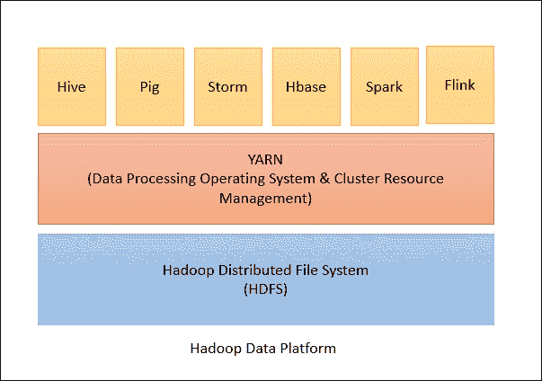
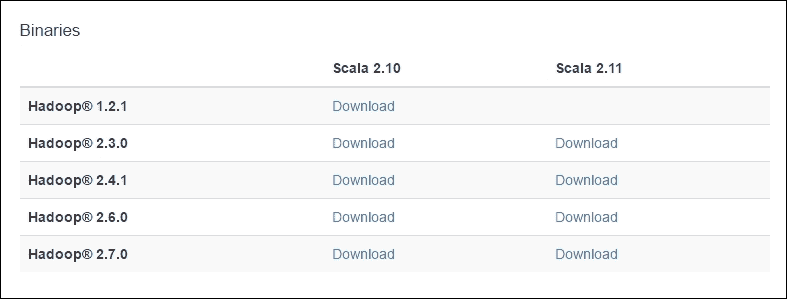
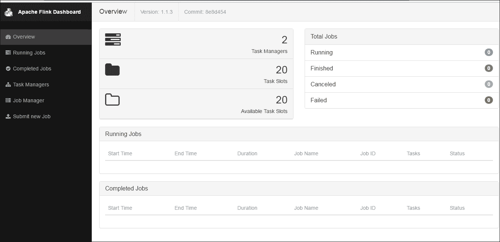
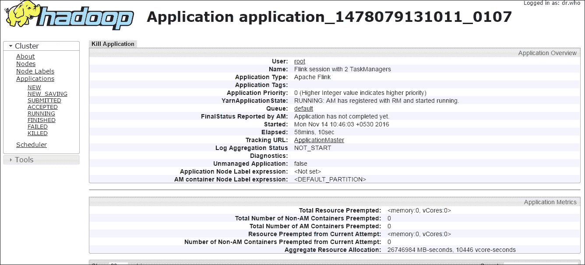
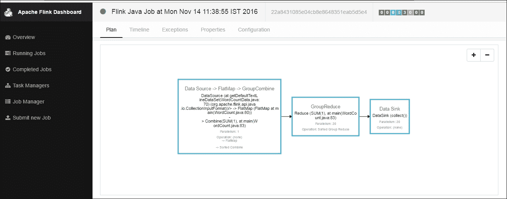
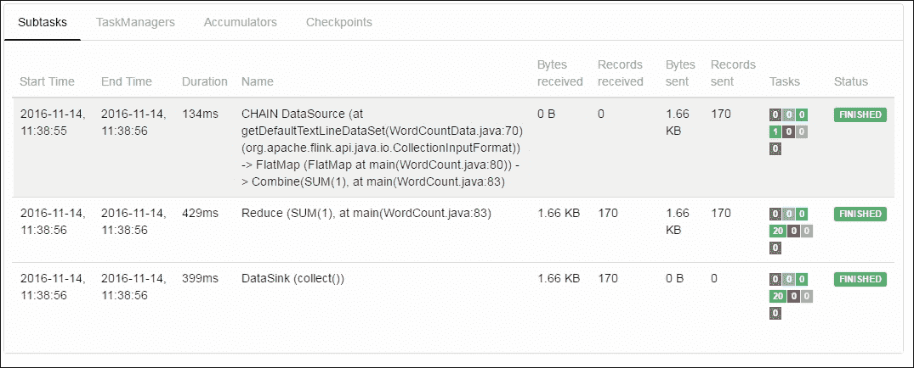
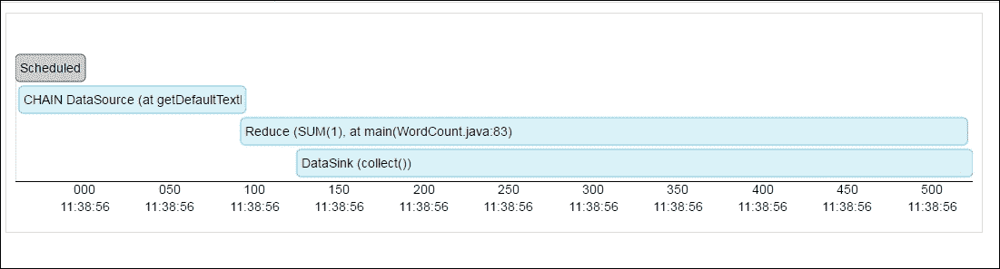
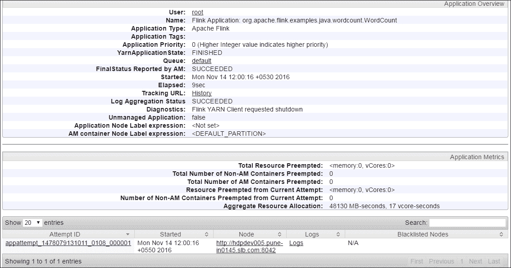
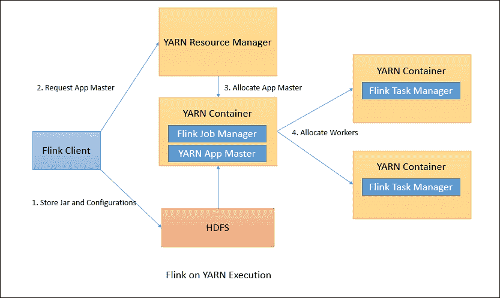

# 第八章：使用 Flink 和 Hadoop 进行分布式数据处理

在过去的几年中，Apache Hadoop 已成为数据处理和分析基础设施的核心和必要部分。通过 Hadoop 1.X，社区学习了使用 MapReduce 框架进行分布式数据处理，而 Hadoop 的下一个版本，2.X 则教会了我们使用 YARN 框架进行资源的高效利用和调度。YARN 框架是 Hadoop 数据处理的核心部分，它处理诸如作业执行、分发、资源分配、调度等复杂任务。它允许多租户、可伸缩性和高可用性。

YARN 最好的部分在于它不仅仅是一个框架，更像是一个完整的操作系统，开发人员可以自由开发和执行他们选择的应用程序。它通过让开发人员只专注于应用程序开发，忘记并行数据和执行分发的痛苦来提供抽象。YARN 位于 Hadoop 分布式文件系统之上，还可以从 AWS S3 等文件系统中读取数据。

YARN 应用程序框架建得非常好，可以托管任何分布式处理引擎。最近，新的分布式数据处理引擎如 Spark、Flink 等出现了显著增长。由于它们是为在 YARN 集群上执行而构建的，因此人们可以很容易地在同一个 YARN 集群上并行尝试新的东西。这意味着我们可以在同一个集群上使用 YARN 运行 Spark 和 Flink 作业。在本章中，我们将看到如何利用现有的 Hadoop/YARN 集群并行执行我们的 Flink 作业。

所以让我们开始吧。

# Hadoop 的快速概述

你们大多数人可能已经了解 Hadoop 及其功能，但对于那些对分布式计算世界还不熟悉的人，让我试着简要介绍一下 Hadoop。

Hadoop 是一个分布式的开源数据处理框架。它由两个重要部分组成：一个数据存储单元，Hadoop 分布式文件系统（HDFS）和资源管理单元，另一个资源协商器（YARN）。以下图表显示了 Hadoop 生态系统的高级概述：



## HDFS

HDFS，顾名思义，是一个用于数据存储的高可用性分布式文件系统。如今，这是大多数公司的核心框架之一。HDFS 由主从架构组成，具有 NameNode、辅助 NameNode 和 DataNode 等守护程序。

在 HDFS 中，NameNode 存储有关要存储的文件的元数据，而 DataNode 存储组成文件的实际块。数据块默认情况下是三倍复制的，以实现高可用性。辅助 NameNode 用于备份存储在 NameNode 上的文件系统元数据。

### 注意

这是一个链接，您可以在[`hadoop.apache.org/docs/current/hadoop-project-dist/hadoop-hdfs/HdfsDesign.html`](http://hadoop.apache.org/docs/current/hadoop-project-dist/hadoop-hdfs/HdfsDesign.html)上阅读有关 HDFS 的更多信息。

## YARN

在 YARN 之前，MapReduce 是运行在 HDFS 之上的数据处理框架。但人们开始意识到它在处理作业跟踪器数量方面的限制。这催生了 YARN。YARN 背后的基本思想是分离资源管理和调度任务。YARN 具有全局资源管理器和每个应用程序的应用程序主管。资源管理器在主节点上工作，而它有一个每个工作节点代理——节点管理器，负责管理容器，监视它们的使用情况（CPU、磁盘、内存）并向资源管理器报告。

资源管理器有两个重要组件--**调度程序**和**应用程序管理器**。调度程序负责在队列中调度应用程序，而应用程序管理器负责接受作业提交，协商应用程序特定应用程序主节点的第一个容器。它还负责在应用程序主节点发生故障时重新启动**应用程序主节点**。

由于像 YARN 这样的操作系统提供了可以扩展构建应用程序的 API。**Spark**和**Flink**就是很好的例子。

### 注意

您可以在[`hadoop.apache.org/docs/current/hadoop-yarn/hadoop-yarn-site/YARN.html`](http://hadoop.apache.org/docs/current/hadoop-yarn/hadoop-yarn-site/YARN.html)阅读更多关于 YARN 的信息。

现在让我们看看如何在 YARN 上使用 Flink。

# Flink 在 YARN 上

Flink 已经内置支持在 YARN 上准备执行。使用 Flink API 构建的任何应用程序都可以在 YARN 上执行，而无需太多努力。如果用户已经有一个 YARN 集群，则无需设置或安装任何内容。Flink 希望满足以下要求：

+   Hadoop 版本应该是 2.2 或更高

+   HDFS 应该已经启动

## 配置

为了在 YARN 上运行 Flink，需要进行以下配置。首先，我们需要下载与 Hadoop 兼容的 Flink 发行版。

### 注意

二进制文件可在[`flink.apache.org/downloads.html`](http://flink.apache.org/downloads.html)下载。您必须从以下选项中进行选择。



假设我们正在运行 Hadoop 2.7 和 Scala 2.11。我们将下载特定的二进制文件并将其存储在安装和运行 Hadoop 的节点上。

下载后，我们需要按照这里所示的方式提取`tar`文件：

```java
$tar -xzf flink-1.1.4-bin-hadoop27-scala_2.11.tgz
$cd flink-1.1.4

```

## 启动 Flink YARN 会话

一旦二进制文件被提取，我们就可以启动 Flink 会话。Flink 会话是一个会话，它在各自的节点上启动所有所需的 Flink 服务（作业管理器和任务管理器），以便我们可以开始执行 Flink 作业。要启动 Flink 会话，我们有以下可执行文件和给定选项：

```java
# bin/yarn-session.sh
Usage:
 Required
 -n,--container <arg>            Number of YARN container to     
                                         allocate (=Number of Task  
                                         Managers)
 Optional
 -D <arg>                        Dynamic properties
 -d,--detached                   Start detached
 -id,--applicationId <arg>       Attach to running YARN session
 -j,--jar <arg>                  Path to Flink jar file
 -jm,--jobManagerMemory <arg>    Memory for JobManager 
                                         Container [in MB]
 -n,--container <arg>            Number of YARN container to 
                                         allocate (=Number of Task 
                                         Managers)
 -nm,--name <arg>                Set a custom name for the 
                                         application on YARN
 -q,--query                      Display available YARN 
                                         resources (memory, cores)
 -qu,--queue <arg>               Specify YARN queue.
 -s,--slots <arg>                Number of slots per 
                                         TaskManager
 -st,--streaming                 Start Flink in streaming mode
 -t,--ship <arg>                 Ship files in the specified 
                                         directory (t for transfer)
 -tm,--taskManagerMemory <arg>   Memory per TaskManager  
                                         Container [in MB]
 -z,--zookeeperNamespace <arg>   Namespace to create the 
                                         Zookeeper sub-paths for high 
                                         availability mode

```

我们必须确保`YARN_CONF_DIR`和`HADOOP_CONF_DIR`环境变量已设置，以便 Flink 可以找到所需的配置。现在让我们通过提供信息来启动 Flink 会话。

以下是我们如何通过提供有关任务管理器数量、每个任务管理器的内存和要使用的插槽的详细信息来启动 Flink 会话：

```java
# bin/yarn-session.sh -n 2 -tm 1024 -s 10
2016-11-14 10:46:00,126 WARN    
    org.apache.hadoop.util.NativeCodeLoader                                   
    - Unable to load native-hadoop library for your platform... using 
    builtin-java classes where applicable
2016-11-14 10:46:00,184 INFO  
    org.apache.flink.yarn.YarnClusterDescriptor                            
    - The configuration directory ('/usr/local/flink/flink-1.1.3/conf') 
    contains both LOG4J and Logback configuration files. Please delete 
    or rename one of them.
2016-11-14 10:46:01,263 INFO  org.apache.flink.yarn.Utils                                   
    - Copying from file:/usr/local/flink/flink-
    1.1.3/conf/log4j.properties to 
    hdfs://hdpcluster/user/root/.flink/application_1478079131011_0107/
    log4j.properties
2016-11-14 10:46:01,463 INFO  org.apache.flink.yarn.Utils                                      
    - Copying from file:/usr/local/flink/flink-1.1.3/lib to   
    hdfs://hdp/user/root/.flink/application_1478079131011_0107/lib
2016-11-14 10:46:02,337 INFO  org.apache.flink.yarn.Utils                                     
    - Copying from file:/usr/local/flink/flink-1.1.3/conf/logback.xml    
    to hdfs://hdpcluster/user/root/.flink/
    application_1478079131011_0107/logback.xml
2016-11-14 10:46:02,350 INFO  org.apache.flink.yarn.Utils                                      
    - Copying from file:/usr/local/flink/flink-1.1.3/lib/flink-  
    dist_2.11-1.1.3.jar to hdfs://hdpcluster/user/root/.flink/
    application_1478079131011_0107/flink-dist_2.11-1.1.3.jar
2016-11-14 10:46:03,157 INFO  org.apache.flink.yarn.Utils                                      
    - Copying from /usr/local/flink/flink-1.1.3/conf/flink-conf.yaml to    
    hdfs://hdpcluster/user/root/.flink/application_1478079131011_0107/
    flink-conf.yaml
org.apache.flink.yarn.YarnClusterDescriptor                           
    - Deploying cluster, current state ACCEPTED
2016-11-14 10:46:11,976 INFO  
    org.apache.flink.yarn.YarnClusterDescriptor                               
    - YARN application has been deployed successfully.
Flink JobManager is now running on 10.22.3.44:43810
JobManager Web Interface: 
    http://myhost.com:8088/proxy/application_1478079131011_0107/
2016-11-14 10:46:12,387 INFO  Remoting                                                      
    - Starting remoting
2016-11-14 10:46:12,483 INFO  Remoting                                                      
    - Remoting started; listening on addresses :
    [akka.tcp://flink@10.22.3.44:58538]
2016-11-14 10:46:12,627 INFO     
    org.apache.flink.yarn.YarnClusterClient                                
    - Start application client.
2016-11-14 10:46:12,634 INFO  
    org.apache.flink.yarn.ApplicationClient                                
    - Notification about new leader address 
    akka.tcp://flink@10.22.3.44:43810/user/jobmanager with session ID 
    null.
2016-11-14 10:46:12,637 INFO    
    org.apache.flink.yarn.ApplicationClient                                
    - Received address of new leader   
    akka.tcp://flink@10.22.3.44:43810/user/jobmanager 
    with session ID null.
2016-11-14 10:46:12,638 INFO  
    org.apache.flink.yarn.ApplicationClient                                
    - Disconnect from JobManager null.
2016-11-14 10:46:12,640 INFO  
    org.apache.flink.yarn.ApplicationClient                                
    - Trying to register at JobManager 
    akka.tcp://flink@10.22.3.44:43810/user/jobmanager.
2016-11-14 10:46:12,649 INFO  
    org.apache.flink.yarn.ApplicationClient                                
    - Successfully registered at the ResourceManager using JobManager 
    Actor[akka.tcp://flink@10.22.3.44:43810/user/jobmanager#-862361447]

```

如果配置目录未正确设置，您将收到错误消息。在这种情况下，首先可以设置配置目录，然后启动 Flink YARN 会话。

以下命令设置了配置目录：

```java
export HADOOP_CONF_DIR=/etc/hadoop/conf
export YARN_CONF_DIR=/etc/hadoop/conf

```

### 注意

我们还可以通过访问以下 URL 来检查 Flink Web UI：`http://host:8088/proxy/application_<id>/#/overview.`

这是同样的屏幕截图：



同样，我们也可以在`http://myhost:8088/cluster/app/application_1478079131011_0107`上检查 YARN 应用程序 UI。



## 将作业提交到 Flink

现在我们已经连接到 YARN 的 Flink 会话，我们已经准备好将 Flink 作业提交到 YARN。

我们可以使用以下命令和选项提交 Flink 作业：

```java
#./bin/flink
./flink <ACTION> [OPTIONS] [ARGUMENTS]

```

我们可以使用运行操作来执行 Flink 作业。在运行中，我们有以下选项：

| **选项** | **描述** |
| --- | --- |
| `-c`, `--class <classname>` | 具有程序入口点（`main()`方法或`getPlan()`方法）的类。只有在 JAR 文件没有在其清单中指定类时才需要。 |
| -C，--classpath <url> | 在集群中的所有节点的每个用户代码类加载器中添加 URL。路径必须指定协议（例如`file://`）并且在所有节点上都可以访问（例如通过 NFS 共享）。您可以多次使用此选项来指定多个 URL。协议必须受到{@link java.net.URLClassLoader}支持。如果您希望在 Flink YARN 会话中使用某些第三方库，可以使用此选项。 |
| -d，--detached | 如果存在，以分离模式运行作业。分离模式在您不想一直运行 Flink YARN 会话时很有用。在这种情况下，Flink 客户端只会提交作业并分离自己。我们无法使用 Flink 命令停止分离的 Flink YARN 会话。为此，我们必须使用 YARN 命令杀死应用程序 yarn application -kill <appId> |
| -m，--jobmanager <host:port> | 要连接的作业管理器（主节点）的地址。使用此标志连接到与配置中指定的不同作业管理器。 |
| -p，--parallelism <parallelism> | 运行程序的并行度。可选标志，用于覆盖配置中指定的默认值。 |
| -q，--sysoutLogging | 如果存在，抑制标准`OUT`的日志输出。 |
| -s，--fromSavepoint <savepointPath> | 重置作业的保存点路径，例如 file:///flink/savepoint-1537。保存点是 Flink 程序的外部存储状态。它们是存储在某个位置的快照。如果 Flink 程序失败，我们可以从其上次存储的保存点恢复它。有关保存点的更多详细信息 [`ci.apache.org/projects/flink/flink-docs-release-1.2/setup/savepoints.html`](https://ci.apache.org/projects/flink/flink-docs-release-1.2/setup/savepoints.html) |
| -z，--zookeeperNamespace <zookeeperNamespace> | 用于创建高可用模式的 Zookeeper 子路径的命名空间 |

`yarn-cluster`模式提供以下选项：

| **选项** | **描述** |
| --- | --- |
| -yD <arg> | 动态属性 |
| yd，--yarndetached | 启动分离 |
| -yid，--yarnapplicationId <arg> | 连接到正在运行的 YARN 会话 |
| -yj，--yarnjar <arg> | Flink jar 文件的路径 |
| -yjm，--yarnjobManagerMemory <arg> | 作业管理器容器的内存（以 MB 为单位） |
| -yn，--yarncontainer <arg> | 分配的 YARN 容器数（=任务管理器数） |
| -ynm，--yarnname <arg> | 为 YARN 上的应用设置自定义名称 |
| -yq，--yarnquery | 显示可用的 YARN 资源（内存，核心） |
| -yqu，--yarnqueue <arg> | 指定 YARN 队列 |
| -ys，--yarnslots <arg> | 每个任务管理器的插槽数 |
| -yst，--yarnstreaming | 以流模式启动 Flink |
| -yt，--yarnship <arg> | 在指定目录中传输文件（t 表示传输） |
| -ytm，--yarntaskManagerMemory <arg> | 每个 TaskManager 容器的内存（以 MB 为单位） |
| -yz，--yarnzookeeperNamespace <arg> | 用于创建高可用模式的 Zookeeper 子路径的命名空间 |

现在让我们尝试在 YARN 上运行一个示例单词计数示例。以下是如何执行的步骤。

首先，让我们将输入文件存储在 HDFS 上，作为单词计数程序的输入。在这里，我们将在 Apache 许可证文本上运行单词计数。以下是我们下载并将其存储在 HDFS 上的方式：

```java
wget -O LICENSE-2.0.txt http://www.apache.org/licenses/LICENSE-
    2.0.txt
hadoop fs -mkdir in
hadoop fs -put LICENSE-2.0.txt in

```

现在我们将提交示例单词计数作业：

```java
./bin/flink run ./examples/batch/WordCount.jar 
    hdfs://myhost/user/root/in  hdfs://myhost/user/root/out

```

这将调用在 YARN 集群上执行的 Flink 作业。您应该在控制台上看到：

```java
 **# ./bin/flink run ./examples/batch/WordCount.jar** 
2016-11-14 11:26:32,603 INFO  
    org.apache.flink.yarn.cli.FlinkYarnSessionCli               
    - YARN properties set default parallelism to 20
2016-11-14 11:26:32,603 INFO   
    org.apache.flink.yarn.cli.FlinkYarnSessionCli                 
    - YARN properties set default parallelism to 20
YARN properties set default parallelism to 20
2016-11-14 11:26:32,603 INFO    
    org.apache.flink.yarn.cli.FlinkYarnSessionCli               
    - Found YARN properties file /tmp/.yarn-properties-root
2016-11-14 11:26:32,603 INFO  
    org.apache.flink.yarn.cli.FlinkYarnSessionCli              
    - Found YARN properties file /tmp/.yarn-properties-root
Found YARN properties file /tmp/.yarn-properties-root
2016-11-14 11:26:32,603 INFO  
    org.apache.flink.yarn.cli.FlinkYarnSessionCli             
    - Using Yarn application id from YARN properties  
    application_1478079131011_0107
2016-11-14 11:26:32,603 INFO  
    org.apache.flink.yarn.cli.FlinkYarnSessionCli                        
    - Using Yarn application id from YARN properties  
    application_1478079131011_0107
Using Yarn application id from YARN properties   
    application_1478079131011_0107
2016-11-14 11:26:32,604 INFO  
    org.apache.flink.yarn.cli.FlinkYarnSessionCli               
    - YARN properties set default parallelism to 20
2016-11-14 11:26:32,604 INFO  
    org.apache.flink.yarn.cli.FlinkYarnSessionCli                
    - YARN properties set default parallelism to 20
YARN properties set default parallelism to 20
2016-11-14 11:26:32,823 INFO  
    org.apache.hadoop.yarn.client.api.impl.TimelineClientImpl     
    - Timeline service address: http://hdpdev002.pune-
    in0145.slb.com:8188/ws/v1/timeline/
2016-11-14 11:26:33,089 INFO  
    org.apache.flink.yarn.YarnClusterDescriptor               
    - Found application JobManager host name myhost.com' and port  
    '43810' from supplied application id 
    'application_1478079131011_0107'
Cluster configuration: Yarn cluster with application id 
    application_1478079131011_0107
Using address 163.183.206.249:43810 to connect to JobManager.
Starting execution of program
2016-11-14 11:26:33,711 INFO  
    org.apache.flink.yarn.YarnClusterClient                  
    - TaskManager status (2/1)
TaskManager status (2/1)
2016-11-14 11:26:33,712 INFO  
    org.apache.flink.yarn.YarnClusterClient                
    - All TaskManagers are connected
All TaskManagers are connected
2016-11-14 11:26:33,712 INFO  
    org.apache.flink.yarn.YarnClusterClient                       
    - Submitting job with JobID: b57d682dd09f570ea336b0d56da16c73\. 
    Waiting for job completion.
Submitting job with JobID: b57d682dd09f570ea336b0d56da16c73\. 
    Waiting for job completion.
Connected to JobManager at 
    Actor[akka.tcp://flink@163.183.206.249:43810/user/
    jobmanager#-862361447]
11/14/2016 11:26:33     Job execution switched to status RUNNING.
11/14/2016 11:26:33     CHAIN DataSource (at   
    getDefaultTextLineDataSet(WordCountData.java:70) 
    (org.apache.flink.api.java.io.CollectionInputFormat)) -> FlatMap 
    (FlatMap at main(WordCount.java:80)) -> Combine(SUM(1), at 
    main(WordCount.java:83)(1/1) switched to RUNNING
11/14/2016 11:26:34     DataSink (collect())(20/20) switched to 
    FINISHED
...
11/14/2016 11:26:34     Job execution switched to status FINISHED.
(after,1)
(coil,1)
(country,1)
(great,1)
(long,1)
(merit,1)
(oppressor,1)
(pangs,1)
(scorns,1)
(what,1)
(a,5)
(death,2)
(die,2)
(rather,1)
(be,4)
(bourn,1)
(d,4)
(say,1)
(takes,1)
(thy,1)
(himself,1)
(sins,1)
(there,2)
(whips,1)
(would,2)
(wrong,1)
...
 **Program execution finished** 
 **Job with JobID b57d682dd09f570ea336b0d56da16c73 has finished.** 
 **Job Runtime: 575 ms** 
Accumulator Results:
- 4950e35c195be901e0ad6a8ed25790de (java.util.ArrayList) [170 
      elements]
2016-11-14 11:26:34,378 INFO    
      org.apache.flink.yarn.YarnClusterClient             
      - Disconnecting YarnClusterClient from ApplicationMaster

```

以下是来自 Flink 应用程序主 UI 的作业执行的屏幕截图。这是 Flink 执行计划的屏幕截图：



接下来我们可以看到执行此作业的步骤的屏幕截图：



最后，我们有 Flink 作业执行时间轴的截图。时间轴显示了所有可以并行执行的步骤以及需要按顺序执行的步骤：



## 停止 Flink YARN 会话

处理完成后，您可以以两种方式停止 Flink YARN 会话。首先，您可以在启动 YARN 会话的控制台上简单地执行*Cltr*+*C*。这将发送终止信号并停止 YARN 会话。

第二种方法是执行以下命令来停止会话：

```java
./bin/yarn-session.sh -id application_1478079131011_0107 stop

```

我们可以立即看到 Flink YARN 应用程序被终止：

```java
2016-11-14 11:56:59,455 INFO  
    org.apache.flink.yarn.YarnClusterClient  
    Sending shutdown request to the Application Master
2016-11-14 11:56:59,456 INFO    
    org.apache.flink.yarn.ApplicationClient  
    Sending StopCluster request to JobManager.
2016-11-14 11:56:59,464 INFO  
    org.apache.flink.yarn.YarnClusterClient  
    - Deleted Yarn properties file at /tmp/.yarn-properties-root
2016-11-14 11:56:59,464 WARN  
    org.apache.flink.yarn.YarnClusterClient  
    Session file directory not set. Not deleting session files
2016-11-14 11:56:59,565 INFO  
    org.apache.flink.yarn.YarnClusterClient  
    - Application application_1478079131011_0107 finished with state   
    FINISHED and final state SUCCEEDED at 1479104819469
 **2016-11-14 11:56:59,565 INFO  
    org.apache.flink.yarn.YarnClusterClient  
    - YARN Client is shutting down** 

```

## 在 YARN 上运行单个 Flink 作业

我们还可以在 YARN 上运行单个 Flink 作业，而不会阻塞 YARN 会话的资源。如果您只希望在 YARN 上运行单个 Flink 作业，这是一个很好的选择。在之前的情况下，当我们在 YARN 上启动 Flink 会话时，它会阻塞资源和核心，直到我们停止会话，而在这种情况下，资源会在作业执行时被阻塞，并且一旦作业完成，它们就会被释放。以下命令显示了如何在 YARN 上执行单个 Flink 作业而不需要会话：

```java
./bin/flink run -m yarn-cluster -yn 2  
    ./examples/batch/WordCount.jar

```

我们可以看到与之前情况下相似的结果。我们还可以使用 YARN 应用程序 UI 跟踪其进度和调试。以下是同一样本的截图：



## Flink 在 YARN 上的恢复行为

Flink 在 YARN 上提供以下配置参数来调整恢复行为：

| **参数** | **描述** |
| --- | --- |
| `yarn.reallocate-failed` | 设置 Flink 是否应重新分配失败的任务管理器容器。默认值为`true`。 |
| `yarn.maximum-failed-containers` | 设置应用程序主在 YARN 会话失败之前接受的最大失败容器数。默认值为启动时请求的任务管理器数量。 |
| `yarn.application-attempts` | 设置应用程序主尝试的次数。默认值为`1`，这意味着如果应用程序主失败，YARN 会话将失败。 |

这些配置需要在`conf/flink-conf.yaml`中，或者可以在会话启动时使用`-D`参数进行设置。

## 工作细节

在前面的章节中，我们看到了如何在 YARN 上使用 Flink。现在让我们试着了解它的内部工作原理：



上图显示了 Flink 在 YARN 上的内部工作原理。它经历了以下步骤：

1.  检查 Hadoop 和 YARN 配置目录是否已设置。

1.  如果是，则联系 HDFS 并将 JAR 和配置存储在 HDFS 上。

1.  联系节点管理器以分配应用程序主。

1.  一旦分配了应用程序主，就会启动 Flink 作业管理器。

1.  稍后，根据给定的配置参数启动 Flink 任务管理器。

现在我们已经准备好在 YARN 上提交 Flink 作业了。

# 摘要

在本章中，我们讨论了如何使用现有的 YARN 集群以分布式模式执行 Flink 作业。我们详细了解了一些实际示例。

在下一章中，我们将看到如何在云环境中执行 Flink 作业。
