# 第九章：在云上部署 Flink

近年来，越来越多的公司投资于基于云的解决方案，这是有道理的，考虑到我们通过云实现的成本和效率。**亚马逊网络服务**（**AWS**）、**Google Cloud 平台**（**GCP**）和微软 Azure 目前在这一业务中是明显的领导者。几乎所有这些公司都提供了相当方便使用的大数据解决方案。云提供了及时高效的解决方案，人们不需要担心硬件购买、网络等问题。

在本章中，我们将看到如何在云上部署 Flink。我们将详细介绍在 AWS 和 Google Cloud 上安装和部署应用程序的方法。所以让我们开始吧。

# 在 Google Cloud 上的 Flink

Flink 可以使用一个名为 BDUtil 的实用程序在 Google Cloud 上部署。这是一个开源实用程序，供所有人使用 [`cloud.google.com/hadoop/bdutil`](https://cloud.google.com/hadoop/bdutil)。我们需要做的第一步是安装**Google Cloud SDK**。

## 安装 Google Cloud SDK

Google Cloud SDK 是一个可执行实用程序，可以安装在 Windows、Mac 或 UNIX 操作系统上。您可以根据您的操作系统选择安装模式。以下是一个链接，指导用户了解详细的安装过程 [`cloud.google.com/sdk/downloads`](https://cloud.google.com/sdk/downloads)。

在这里，我假设您已经熟悉 Google Cloud 的概念和术语；如果没有，我建议阅读 [`cloud.google.com/docs/`](https://cloud.google.com/docs/)。

在我的情况下，我将使用 UNIX 机器启动一个 Flink-Hadoop 集群。所以让我们开始安装。

首先，我们需要下载 Cloud SDK 的安装程序。

```java
wget 
    https://dl.google.com/dl/cloudsdk/channels/rapid/downloads/google-
    cloud-sdk-135.0.0-linux-x86_64.tar.gz

```

接下来，我们通过以下命令解压文件：

```java
tar -xzf google-cloud-sdk-135.0.0-linux-x86_64.tar.gz

```

完成后，我们需要初始化 SDK：

```java
cd google-cloud-sdk
bin/gcloud init

```

这将启动一个交互式安装过程，并需要您根据需要提供输入。下面的截图显示了这个过程：

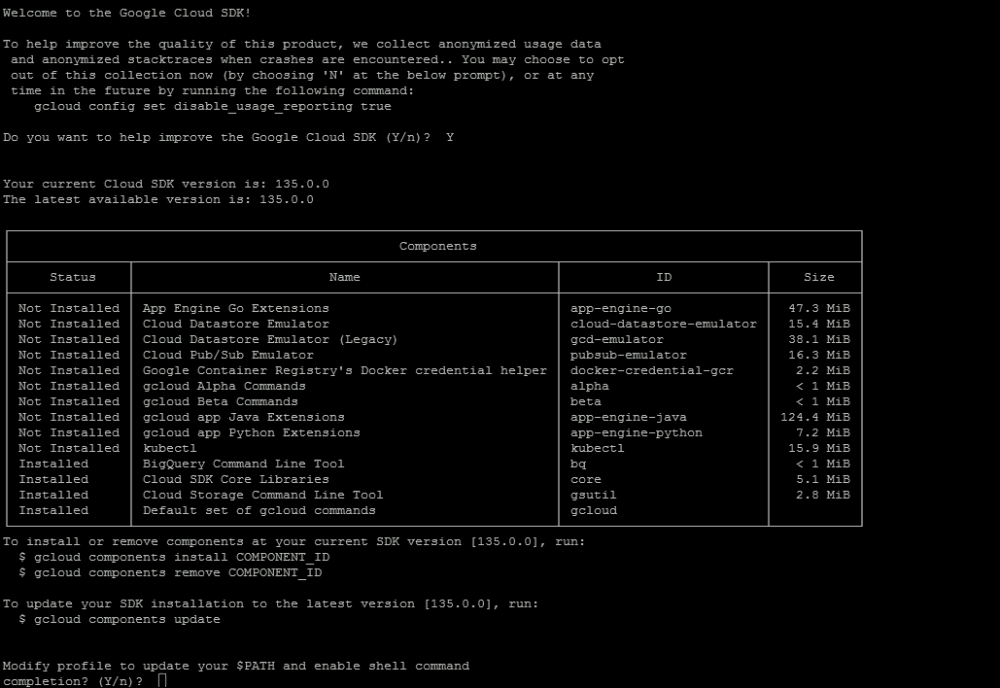

还建议通过执行以下命令进行身份验证：

```java
gcloud auth login

```

这将为您提供一个 URL，可以在您的机器浏览器中打开。点击该 URL，您将获得一个用于身份验证的代码。

身份验证完成后，我们就可以开始 BDUtil 安装了。

## 安装 BDUtil

正如我们之前所说，BDUtil 是 Google 开发的一个实用程序，旨在在 Google Cloud 上实现无故障的大数据安装。您可以安装以下服务：

+   Hadoop - HDP 和 CDH

+   Flink

+   Hama

+   Hbase

+   Spark

+   Storm

+   Tajo

安装 BDUtil 需要以下步骤。首先，我们需要下载源代码：

```java
wget 
    https://github.com/GoogleCloudPlatform/bdutil/archive/master.zip

```

通过以下命令解压代码：

```java
unzip master.zip
cd bdutil-master

```

### 注意

如果您在 Google Compute 机器上使用 BDUtil 操作，建议使用**非 root 帐户**。通常情况下，所有计算引擎机器默认禁用 root 登录。

现在我们已经完成了 BDUtil 的安装，并准备好部署了。

## 启动 Flink 集群

BDUtil 至少需要一个项目，我们将在其中进行安装，并且需要一个存放临时文件的存储桶。要创建一个存储桶，您可以转到**Cloud Storage**部分，并选择创建一个存储桶，如下截图所示：


我们已经将这个存储桶命名为**bdutil-flink-bucket**。接下来，我们需要编辑`bdutil_env.sh`文件，配置有关项目名称、存储桶名称和要使用的 Google Cloud 区域的信息。我们还可以设置其他内容，如机器类型和操作系统。`bdutil_env.sh`如下所示：

```java
 # A GCS bucket used for sharing generated SSH keys and GHFS configuration. 
CONFIGBUCKET="bdutil-flink-bucket" 

# The Google Cloud Platform text-based project-id which owns the GCE resources. 
PROJECT="bdutil-flink-project" 

###################### Cluster/Hardware Configuration ######### 
# These settings describe the name, location, shape and size of your cluster, 
# though these settings may also be used in deployment-configuration--for 
# example, to whitelist intra-cluster SSH using the cluster prefix. 

# GCE settings. 
GCE_IMAGE='https://www.googleapis.com/compute/v1/projects/debian-cloud/global/images/backports-debian-7-wheezy-v20160531' 
GCE_MACHINE_TYPE='n1-standard-4' 
GCE_ZONE="europe-west1-d" 
# When setting a network it's important for all nodes be able to communicate 
# with eachother and for SSH connections to be allowed inbound to complete 
# cluster setup and configuration. 

```

默认情况下，配置启动三个节点，Hadoop/Flink 集群，一个主节点和两个工作节点。

### 注意

如果您正在使用 GCP 的试用版，则建议使用机器类型为**n1-standard-2**。这将限制节点类型的 CPU 和存储。

现在我们已经准备好启动集群，使用以下命令：

```java
./bdutil -e extensions/flink/flink_env.sh deploy

```

这将开始创建机器并在其上部署所需的软件。如果一切顺利，通常需要 10-20 分钟的时间来启动和运行集群。在开始执行之前，您应该查看屏幕截图告诉我们什么。

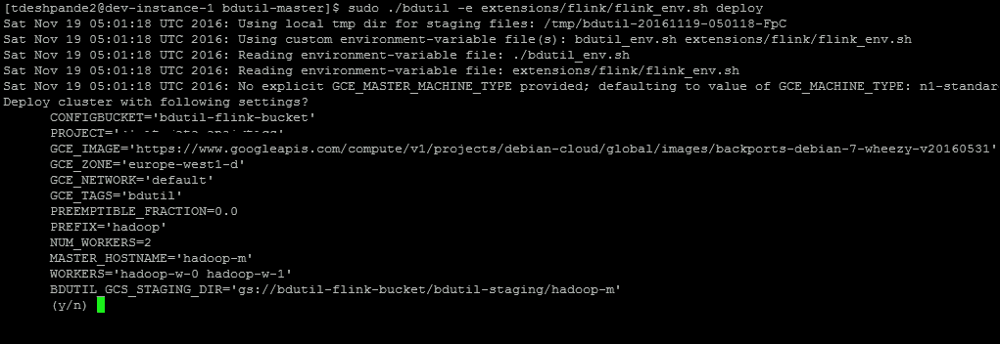

完成后，您将看到以下消息：

```java
gcloud --project=bdutil ssh --zone=europe-west1-c hadoop-m 
Sat Nov 19 06:12:27 UTC 2016: Staging files successfully deleted. 
Sat Nov 19 06:12:27 UTC 2016: Invoking on master: ./deploy-ssh-master-setup.sh 
.Sat Nov 19 06:12:27 UTC 2016: Waiting on async 'ssh' jobs to finish. Might take a while... 
. 
Sat Nov 19 06:12:29 UTC 2016: Step 'deploy-ssh-master-setup,*' done... 
Sat Nov 19 06:12:29 UTC 2016: Invoking on workers: ./deploy-core-setup.sh 
..Sat Nov 19 06:12:29 UTC 2016: Invoking on master: ./deploy-core-setup.sh 
.Sat Nov 19 06:12:30 UTC 2016: Waiting on async 'ssh' jobs to finish. Might take a while... 
... 
Sat Nov 19 06:13:14 UTC 2016: Step 'deploy-core-setup,deploy-core-setup' done... 
Sat Nov 19 06:13:14 UTC 2016: Invoking on workers: ./deploy-ssh-worker-setup.sh 
..Sat Nov 19 06:13:15 UTC 2016: Waiting on async 'ssh' jobs to finish. Might take a while... 
.. 
Sat Nov 19 06:13:17 UTC 2016: Step '*,deploy-ssh-worker-setup' done... 
Sat Nov 19 06:13:17 UTC 2016: Invoking on master: ./deploy-master-nfs-setup.sh 
.Sat Nov 19 06:13:17 UTC 2016: Waiting on async 'ssh' jobs to finish. Might take a while... 
. 
Sat Nov 19 06:13:23 UTC 2016: Step 'deploy-master-nfs-setup,*' done... 
Sat Nov 19 06:13:23 UTC 2016: Invoking on workers: ./deploy-client-nfs-setup.sh 
..Sat Nov 19 06:13:23 UTC 2016: Invoking on master: ./deploy-client-nfs-setup.sh 
.Sat Nov 19 06:13:24 UTC 2016: Waiting on async 'ssh' jobs to finish. Might take a while... 
... 
Sat Nov 19 06:13:33 UTC 2016: Step 'deploy-client-nfs-setup,deploy-client-nfs-setup' done... 
Sat Nov 19 06:13:33 UTC 2016: Invoking on master: ./deploy-start.sh 
.Sat Nov 19 06:13:34 UTC 2016: Waiting on async 'ssh' jobs to finish. Might take a while... 
. 
Sat Nov 19 06:13:49 UTC 2016: Step 'deploy-start,*' done... 
Sat Nov 19 06:13:49 UTC 2016: Invoking on workers: ./install_flink.sh 
..Sat Nov 19 06:13:49 UTC 2016: Invoking on master: ./install_flink.sh 
.Sat Nov 19 06:13:49 UTC 2016: Waiting on async 'ssh' jobs to finish. Might take a while... 
... 
Sat Nov 19 06:13:53 UTC 2016: Step 'install_flink,install_flink' done... 
Sat Nov 19 06:13:53 UTC 2016: Invoking on master: ./start_flink.sh 
.Sat Nov 19 06:13:54 UTC 2016: Waiting on async 'ssh' jobs to finish. Might take a while... 
. 
Sat Nov 19 06:13:55 UTC 2016: Step 'start_flink,*' done... 
Sat Nov 19 06:13:55 UTC 2016: Command steps complete. 
Sat Nov 19 06:13:55 UTC 2016: Execution complete. Cleaning up temporary files... 
Sat Nov 19 06:13:55 UTC 2016: Cleanup complete. 

```

如果中途出现任何故障，请查看日志。您可以访问 Google 云计算引擎控制台以获取主机和从机的确切 IP 地址。

现在，如果您检查作业管理器 UI，您应该有两个任务管理器和四个任务插槽可供使用。您可以访问 URL `http://<master-node-ip>:8081`。以下是相同的示例屏幕截图：

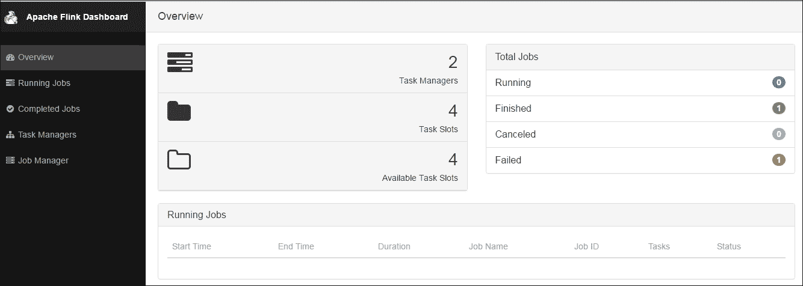

## 执行示例作业

您可以通过启动一个示例词频统计程序来检查一切是否正常运行。为此，我们首先需要登录到 Flink 主节点。以下命令启动了 Flink 安装提供的一个示例词频统计程序。

```java
/home/hadoop/flink-install/bin$ ./flink run   
    ../examples/WordCount.jar

11/19/2016 06:56:05     Job execution switched to status RUNNING. 
11/19/2016 06:56:05     CHAIN DataSource (at getDefaultTextLineDataSet(WordCountData.java:70) (org.apache.flink.api.java.io.CollectionInputFormat)) -> FlatMap (FlatMap at main(WordCount.java:69)) -> Combine(SUM(1), at main(WordCount.java:72)(1/1) switched to SCHEDULED 
11/19/2016 06:56:05     CHAIN DataSource (at getDefaultTextLineDataSet(WordCountData.java:70) (org.apache.flink.api.java.io.CollectionInputFormat)) -> FlatMap (FlatMap at main(WordCount.java:69)) -> Combine(SUM(1), at main(WordCount.java:72)(1/1) switched to DEPLOYING 
11/19/2016 06:56:05     CHAIN DataSource (at getDefaultTextLineDataSet(WordCountData.java:70) (org.apache.flink.api.java.io.CollectionInputFormat)) -> FlatMap (FlatMap at main(WordCount.java:69)) -> Combine(SUM(1), at main(WordCount.java:72)(1/1) switched to RUNNING 
11/19/2016 06:56:05     CHAIN Reduce (SUM(1), at main(WordCount.java:72) -> FlatMap (collect())(1/4) switched to SCHEDULED 
11/19/2016 06:56:05     CHAIN DataSource (at getDefaultTextLineDataSet(WordCountData.java:70) (org.apache.flink.api.java.io.CollectionInputFormat)) -> FlatMap (FlatMap at main(WordCount.java:69)) -> Combine(SUM(1), at main(WordCount.java:72)(1/1) switched to FINISHED 
... 
RUNNING 
11/19/2016 06:56:06     DataSink (collect() sink)(3/4) switched to SCHEDULED 
11/19/2016 06:56:06     DataSink (collect() sink)(3/4) switched to DEPLOYING 
11/19/2016 06:56:06     DataSink (collect() sink)(1/4) switched to SCHEDULED 
11/19/2016 06:56:06     DataSink (collect() sink)(1/4) switched to DEPLOYING 
11/19/2016 06:56:06     CHAIN Reduce (SUM(1), at main(WordCount.java:72) -> FlatMap (collect())(1/4) switched to FINISHED 
11/19/2016 06:56:06     CHAIN Reduce (SUM(1), at main(WordCount.java:72) -> FlatMap (collect())(3/4) switched to FINISHED 
11/19/2016 06:56:06     DataSink (collect() sink)(3/4) switched to  
11/19/2016 06:56:06     CHAIN Reduce (SUM(1), at  
11/19/2016 06:56:06     DataSink (collect() sink)(2/4) switched to FINISHED 
11/19/2016 06:56:06     Job execution switched to status FINISHED. 
(after,1) 
(arms,1) 
(arrows,1) 
(awry,1) 
(bare,1) 
(be,4) 
(coil,1) 
(consummation,1) 
(contumely,1) 
(d,4) 
(delay,1) 
(despis,1) 
... 

```

以下屏幕截图显示了作业的执行地图：

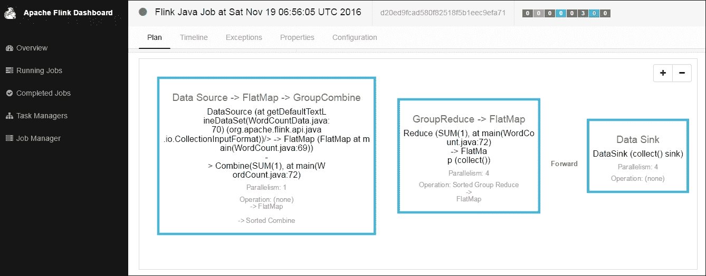

以下是一个时间轴的屏幕截图，显示了所有任务的执行情况：

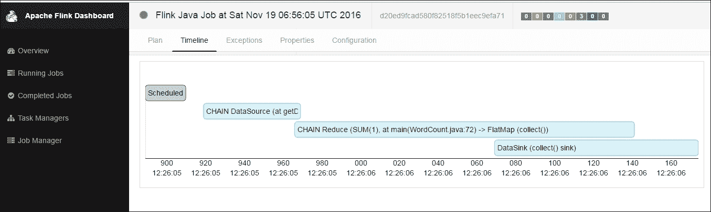

## 关闭集群

一旦我们完成了所有的执行，如果我们不再希望进一步使用集群，最好关闭它。

以下是一个命令，我们需要执行以关闭我们启动的集群：

```java
./bdutil -e extensions/flink/flink_env.sh delete

```

在删除集群之前，请务必确认配置。以下是一个屏幕截图，显示了将要删除的内容和完整的过程：

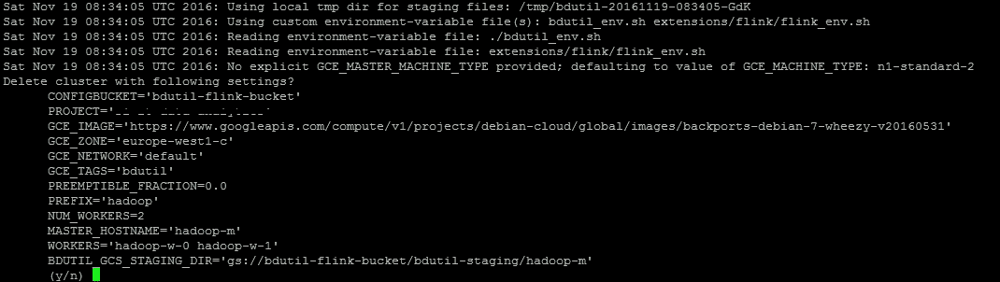

# 在 AWS 上使用 Flink

现在让我们看看如何在亚马逊网络服务（AWS）上使用 Flink。亚马逊提供了一个托管的 Hadoop 服务，称为弹性 Map Reduce（EMR）。我们可以结合使用 Flink。我们可以在 EMR 上进行阅读[`aws.amazon.com/documentation/elastic-mapreduce/`](https://aws.amazon.com/documentation/elastic-mapreduce/)。

在这里，我假设您已经有 AWS 帐户并了解 AWS 的基础知识。

## 启动 EMR 集群

我们需要做的第一件事就是启动 EMR 集群。我们首先需要登录到 AWS 帐户，并从控制台中选择 EMR 服务，如下图所示：

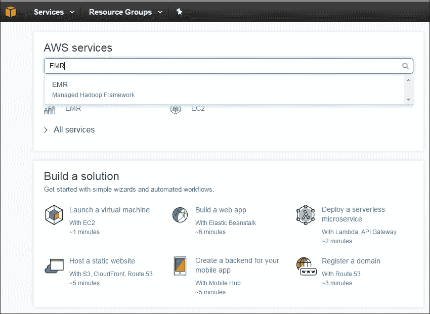

接下来，我们转到 EMR 控制台，并启动一个包含一个主节点和两个从节点的三节点集群。在这里，我们选择最小的集群大小以避免意外计费。以下屏幕截图显示了 EMR 集群创建屏幕：

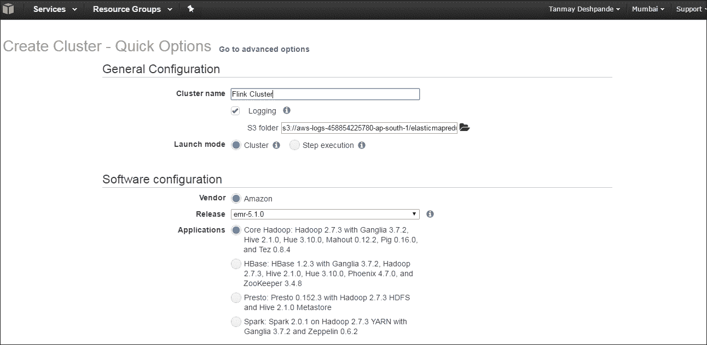

通常需要 10-15 分钟才能启动和运行集群。一旦集群准备就绪，我们可以通过 SSH 连接到集群。为此，我们首先需要单击“创建安全组”部分，并添加规则以添加 SSH 端口 22 规则。以下屏幕显示了安全组部分，在其中我们需要编辑 SSH 的“入站”流量规则：

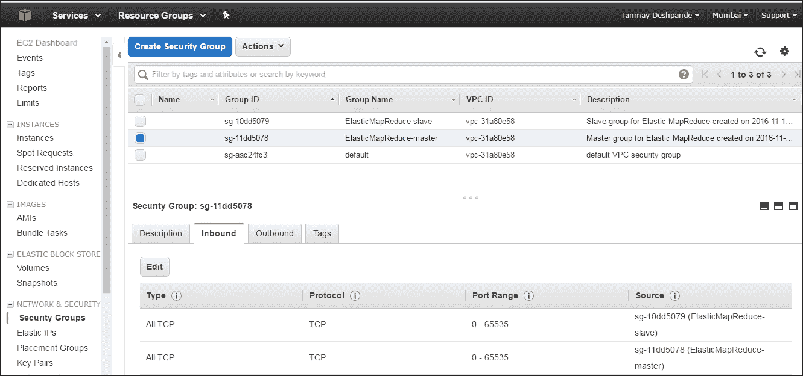

现在我们已经准备好使用 SSH 和私钥登录到主节点。一旦使用 Hadoop 用户名登录，您将看到以下屏幕：

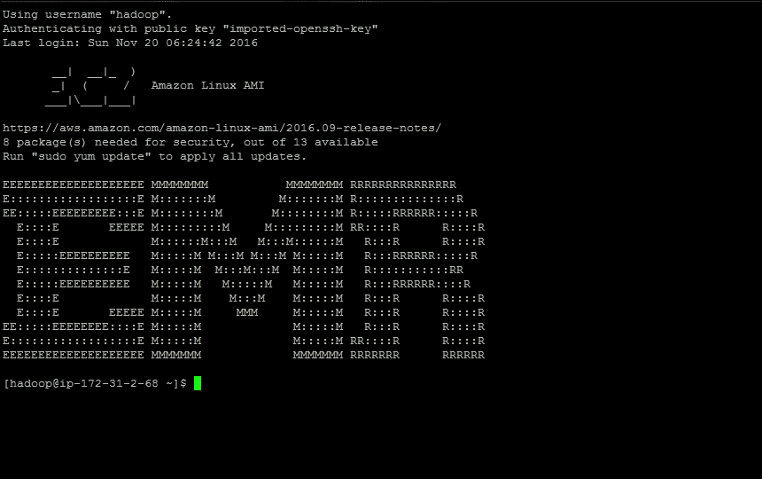

## 在 EMR 上安装 Flink

一旦我们的 EMR 集群准备就绪，安装 Flink 就非常容易。我们需要执行以下步骤：

1.  从链接[`flink.apache.org/downloads.html`](http://flink.apache.org/downloads.html)下载与正确的 Hadoop 版本兼容的 Flink。我正在下载与 Hadoop 2.7 版本兼容的 Flink：

```java
wget http://www-eu.apache.org/dist/flink/flink-1.1.4/flink-
        1.1.4-bin-hadoop27-scala_2.11.tgz

```

1.  接下来，我们需要解压安装程序：

```java
tar -xzf flink-1.1.4-bin-hadoop27-scala_2.11.tgz

```

1.  就是这样，只需进入解压后的文件夹并设置以下环境变量，我们就准备好了：

```java
cd flink-1.1.4
export HADOOP_CONF_DIR=/etc/hadoop/conf
export YARN_CONF_DIR=/etc/hadoop/conf

```

## 在 EMR-YARN 上执行 Flink

在 YARN 上执行 Flink 非常容易。我们已经在上一章中学习了有关 YARN 上的 Flink 的详细信息。以下步骤显示了一个示例作业执行。这将向 YARN 提交一个单个的 Flink 作业：

```java
./bin/flink run -m yarn-cluster -yn 2 
    ./examples/batch/WordCount.jar

```

您将立即看到 Flink 的执行开始，并在完成后，您将看到词频统计结果：

```java
2016-11-20 06:41:45,760 INFO  org.apache.flink.yarn.YarnClusterClient                       - Submitting job with JobID: 0004040e04879e432365825f50acc80c. Waiting for job completion. 
Submitting job with JobID: 0004040e04879e432365825f50acc80c. Waiting for job completion. 
Connected to JobManager at Actor[akka.tcp://flink@172.31.0.221:46603/user/jobmanager#478604577] 
11/20/2016 06:41:45     Job execution switched to status RUNNING. 
11/20/2016 06:41:46     CHAIN DataSource (at getDefaultTextLineDataSet(WordCountData.java:70) (org.apache.flink.api.java.io.CollectionInputFormat)) -> FlatMap (FlatMap at main(WordCount.java:80)) -> Combine(SUM(1), at main(WordCount.java:83)(1/1) switched to RUNNING 
11/20/2016 06:41:46     Reduce (SUM(1), at  
getDefaultTextLineDataSet(WordCountData.java:70) (org.apache.flink.api.java.io.CollectionInputFormat)) -> FlatMap (FlatMap at main(WordCount.java:80)) -> Combine(SUM(1), at main(WordCount.java:83)(1/1) switched to FINISHED 
11/20/2016 06:41:46     Reduce (SUM(1), at main(WordCount.java:83)(1/2) switched to DEPLOYING 
11/20/2016 06:41:46     Reduce (SUM(1), at main(WordCount.java:83)(1/2) switched to RUNNING 
11/20/2016 06:41:46     Reduce (SUM(1), at main(WordCount.java:83)(2/2) switched to RUNNING 
1/20/2016 06:41:46     Reduce (SUM(1), at main(WordCount.java:83)(1/2) switched to FINISHED 
11/20/2016 06:41:46     DataSink (collect())(2/2) switched to DEPLOYING 
11/20/2016 06:41:46     Reduce (SUM(1), at main(WordCount.java:83)(2/2) switched to FINISHED 
11/20/2016 06:41:46     DataSink (collect())(2/2) switched to RUNNING 
11/20/2016 06:41:46     DataSink (collect())(2/2) switched to FINISHED 
11/20/2016 06:41:46     Job execution switched to status FINISHED. 
(action,1) 
(after,1) 
(against,1) 
(and,12) 
(arms,1) 
(arrows,1) 
(awry,1) 
(ay,1) 
(bare,1) 
(be,4) 
(bodkin,1) 
(bourn,1) 
(calamity,1) 
(cast,1) 
(coil,1) 
(come,1) 

```

我们还可以查看 YARN 集群 UI，如下面的屏幕截图所示：

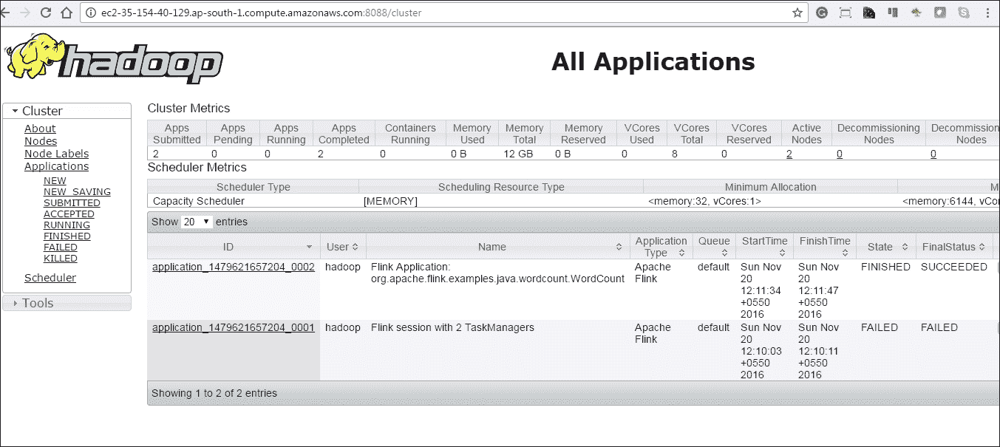

## 启动 Flink YARN 会话

或者，我们也可以通过阻止我们在上一章中已经看到的资源来启动 YARN 会话。Flink YARN 会话将创建一个持续运行的 YARN 会话，可用于执行多个 Flink 作业。此会话将持续运行，直到我们停止它。

要启动 Flink YARN 会话，我们需要执行以下命令：

```java
$ bin/yarn-session.sh -n 2 -tm 768 -s 4

```

在这里，我们启动了两个具有每个 768 MB 内存和 4 个插槽的任务管理器。您将在控制台日志中看到 YARN 会话已准备就绪的情况：

```java
2016-11-20 06:49:09,021 INFO  org.apache.flink.yarn.YarnClusterDescriptor                 
- Using values: 
2016-11-20 06:49:09,023 INFO  org.apache.flink.yarn.YarnClusterDescriptor                   
-   TaskManager count = 2
2016-11-20 06:49:09,023 INFO  org.apache.flink.yarn.YarnClusterDescriptor                   
-   JobManager memory = 1024
2016-11-20 06:49:09,023 INFO  org.apache.flink.yarn.YarnClusterDescriptor                   
-   TaskManager memory = 768 
2016-11-20 06:49:09,488 INFO  org.apache.hadoop.yarn.client.api.impl.TimelineClientImpl     
- Timeline service address: http://ip-172-31-2-68.ap-south-1.compute.internal:8188/ws/v1/timeline/ 
2016-11-20 06:49:09,613 INFO  org.apache.hadoop.yarn.client.RMProxy                         - Connecting to ResourceManager at ip-172-31-2-68.ap-south-1.compute.internal/172.31.2.68:8032 
2016-11-20 06:49:10,309 WARN  org.apache.flink.yarn.YarnClusterDescriptor                   
- The configuration directory ('/home/hadoop/flink-1.1.3/conf') contains both LOG4J and Logback configuration files. Please delete or rename one of them. 
2016-11-20 06:49:10,325 INFO  org.apache.flink.yarn.Utils                                   - Copying from file:/home/hadoop/flink-1.1.3/conf/log4j.properties to hdfs://ip-172-31-2-68.ap-south-1.compute.internal:8020/user/hadoop/.flink/application_1479621657204_0004/log4j.properties 
2016-11-20 06:49:10,558 INFO  org.apache.flink.yarn.Utils                                   - Copying from file:/home/hadoop/flink-1.1.3/lib to hdfs://ip-172-31-2-68.ap-south-1.compute.internal:8020/user/hadoop/.flink/application_1479621657204_0004/lib 
2016-11-20 06:49:12,392 INFO  org.apache.flink.yarn.Utils                                   - Copying from /home/hadoop/flink-1.1.3/conf/flink-conf.yaml to hdfs://ip-172-31-2-68.ap-south-1.compute.internal:8020/user/hadoop/.flink/application_1479621657204_0004/flink-conf.yaml 
2016-11-20 06:49:12,825 INFO  org.apache.flink.yarn.YarnClusterDescriptor                   
- Submitting application master application_1479621657204_0004 
2016-11-20 06:49:12,893 INFO  org.apache.hadoop.yarn.client.api.impl.YarnClientImpl         
- Submitted application application_1479621657204_0004 
2016-11-20 06:49:12,893 INFO  org.apache.flink.yarn.YarnClusterDescriptor                   
- Waiting for the cluster to be allocated 
2016-11-20 06:49:17,929 INFO  org.apache.flink.yarn.YarnClusterDescriptor                   
- YARN application has been deployed successfully. 
Flink JobManager is now running on 172.31.0.220:45056 
JobManager Web Interface: http://ip-172-31-2-68.ap-south-1.compute.internal:20888/proxy/application_1479621657204_0004/ 
2016-11-20 06:49:18,117 INFO  org.apache.flink.yarn.YarnClusterClient                       - Starting client actor system. 
2016-11-20 06:49:18,591 INFO  akka.event.slf4j.Slf4jLogger                                  - Slf4jLogger started 
2016-11-20 06:49:18,671 INFO  Remoting                                                       
akka.tcp://flink@172.31.0.220:45056/user/jobmanager. 
2016-11-20 06:49:19,343 INFO  org.apache.flink.yarn.ApplicationClient                       - Successfully registered at the ResourceManager using JobManager Actor[akka.tcp://flink@172.31.0.220:45056/user/jobmanager#1383364724] 
Number of connected TaskManagers changed to 2\. Slots available: 8 

```

这是 Flink 作业管理器 UI 的屏幕截图，我们可以看到两个任务管理器和八个任务插槽：

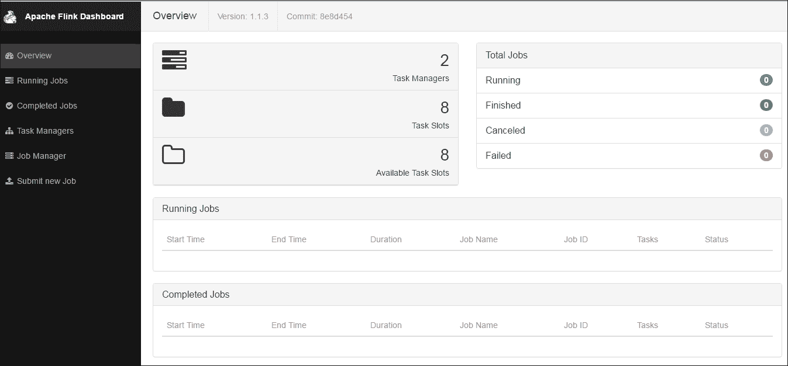

## 在 YARN 会话上执行 Flink 作业

现在我们可以使用这个 YARN 会话来提交 Flink 作业，执行以下命令：

```java
$./bin/flink run ./examples/batch/WordCount.jar

```

您将看到如下代码所示的词频统计作业的执行：

```java
2016-11-20 06:53:06,439 INFO  org.apache.flink.yarn.cli.FlinkYarnSessionCli                 
- Found YARN properties file /tmp/.yarn-properties-hadoop 
2016-11-20 06:53:06,439 INFO  org.apache.flink.yarn.cli.FlinkYarnSessionCli                 
- Found YARN properties file /tmp/.yarn-properties-hadoop 
Found YARN properties file /tmp/.yarn-properties-hadoop 
2016-11-20 06:53:06,508 INFO  org.apache.flink.yarn.cli.FlinkYarnSessionCli                 
-  
org.apache.flink.yarn.cli.FlinkYarnSessionCli                 
- YARN properties set default parallelism to 8 
YARN properties set default parallelism to 8 
2016-11-20 06:53:06,510 INFO  org.apache.flink.yarn.cli.FlinkYarnSessionCli                 
- Found YARN properties file /tmp/.yarn-properties-hadoop 
2016-11-20 06:53:07,069 INFO  org.apache.hadoop.yarn.client.api.impl.TimelineClientImpl     
- Timeline service address: http://ip-172-31-2-68.ap-south-1.compute.internal:8188/ws/v1/timeline/ 
Executing WordCount example with default input data set. 
Use --input to specify file input. 
Printing result to stdout. Use --output to specify output path. 
2016-11-20 06:53:07,728 INFO  org.apache.flink.yarn.YarnClusterClient                       - Waiting until all TaskManagers have connected 
Waiting until all TaskManagers have connected 
2016-11-20 06:53:07,729 INFO  org.apache.flink.yarn.YarnClusterClient                        
Submitting job with JobID: a0557f5751fa599b3eec30eb50d0a9ed. Waiting for job completion. 
Connected to JobManager at Actor[akka.tcp://flink@172.31.0.220:45056/user/jobmanager#1383364724] 
11/20/2016 06:53:09     Job execution switched to status RUNNING. 
11/20/2016 06:53:09     CHAIN DataSource (at getDefaultTextLineDataSet(WordCountData.java:70) (org.apache.flink.api.java.io.CollectionInputFormat)) -> FlatMap (FlatMap at main(WordCount.java:80)) -> Combine(SUM(1), at main(WordCount.java:83)(1/1) switched to SCHEDULED 
11/20/2016 06:53:09     CHAIN DataSource (at getDefaultTextLineDataSet(WordCountData.java:70) (org.apache.flink.api.java.io.CollectionInputFormat)) -> FlatMap (FlatMap at main(WordCount.java:80)) -> Combine(SUM(1), at main(WordCount.java:83)(1/1) switched to DEPLOYING 
11/20/2016 06:53:09     CHAIN DataSource (at getDefaultTextLineDataSet(WordCountData.java:70) (org.apache.flink.api.java.io.CollectionInputFormat)) -> FlatMap (FlatMap at main(WordCount.java:80)) -> Combine(SUM(1), at  
11/20/2016 06:53:10     DataSink (collect())(7/8) switched to FINISHED 
11/20/2016 06:53:10     DataSink (collect())(8/8) switched to FINISHED 
11/20/2016 06:53:10     Job execution switched to status FINISHED. 
(bourn,1) 
(coil,1) 
(come,1) 
(d,4) 
(dread,1) 
(is,3) 
(long,1) 
(make,2) 
(more,1) 
(must,1) 
(no,2) 
(oppressor,1) 
(pangs,1) 
(perchance,1) 
(sicklied,1) 
(something,1) 
(takes,1) 
(these,1) 
(us,3) 
(what,1) 
Program execution finished 
Job with JobID a0557f5751fa599b3eec30eb50d0a9ed has finished. 
Job Runtime: 903 ms 
Accumulator Results: 
- f895985ab9d76c97aba23bc6689c7936 (java.util.ArrayList) [170 elements] 

```

这是作业执行详细信息和任务分解的屏幕截图：

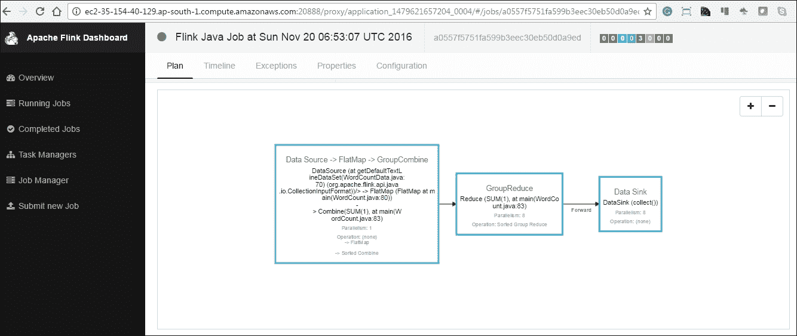

我们还可以看到时间轴详细信息，显示了所有并行执行的任务以及按顺序执行的任务。以下是同样的屏幕截图：

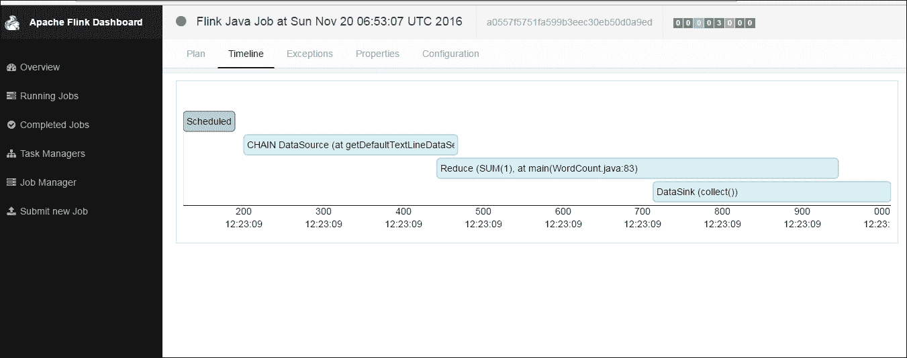

## 关闭集群

完成所有工作后，关闭集群非常重要。为此，我们需要再次转到 AWS 控制台，然后点击**终止**按钮。

## EMR 5.3+上的 Flink

AWS 现在默认支持其 EMR 集群中的 Flink。为了获得这一点，我们必须遵循这些说明。

首先，我们必须转到 AWS EMR 创建集群屏幕，然后点击**转到高级选项链接**，如下面的屏幕截图中所示：

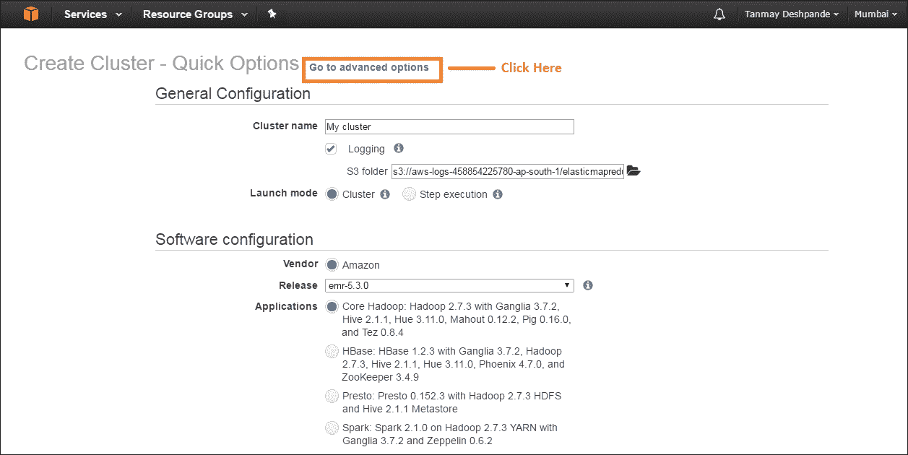

接下来，您将看到一个屏幕，让您选择您希望拥有的其他服务。在那里，您需要勾选 Flink 1.1.4：

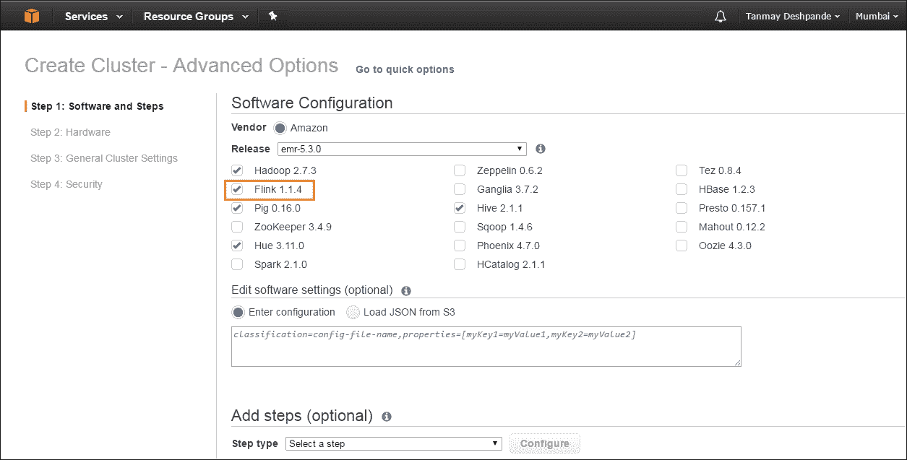

然后点击**下一步**按钮，继续进行其余的设置。其余步骤与我们在前几节中看到的相同。一旦集群启动并运行，您就可以直接使用 Flink。

## 在 Flink 应用程序中使用 S3

**亚马逊简单存储服务**（**S3**）是 AWS 提供的一种软件即服务，用于在 AWS 云中存储数据。许多公司使用 S3 进行廉价的数据存储。它是作为服务的托管文件系统。S3 可以用作 HDFS 的替代方案。如果某人不想投资于完整的 Hadoop 集群，可以考虑使用 S3 而不是 HDFS。Flink 为您提供 API，允许读取存储在 S3 上的数据。

我们可以像简单文件一样使用 S3 对象。以下代码片段显示了如何在 Flink 中使用 S3 对象：

```java
// Read data from S3 bucket 
env.readTextFile("s3://<bucket>/<endpoint>"); 

// Write data to S3 bucket 
stream.writeAsText("s3://<bucket>/<endpoint>"); 

// Use S3 as FsStatebackend 
env.setStateBackend(new FsStateBackend("s3://<your-bucket>/<endpoint>"));

```

Flink 将 S3 视为任何其他文件系统。它使用 Hadoop 的 S3 客户端。

要访问 S3 对象，Flink 需要进行身份验证。这可以通过使用 AWS IAM 服务来提供。这种方法有助于保持安全性，因为我们不需要分发访问密钥和秘密密钥。

# 总结

在本章中，我们学习了如何在 AWS 和 GCP 上部署 Flink。这对于更快的部署和安装非常方便。我们可以用最少的工作量生成和删除 Flink 集群。

在下一章中，我们将学习如何有效地使用 Flink 的最佳实践。
