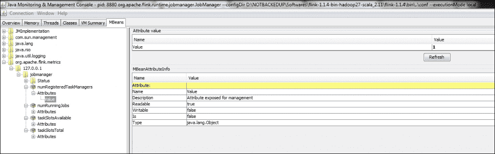

# 第十章：最佳实践

到目前为止，在本书中，我们已经学习了关于 Flink 的各种知识。我们从 Flink 的架构和它支持的各种 API 开始。我们还学习了如何使用 Flink 提供的图形和机器学习 API。现在在这个总结性的章节中，我们将讨论一些最佳实践，您应该遵循以创建高质量可维护的 Flink 应用程序。

我们将讨论以下主题：

+   日志最佳实践

+   使用自定义序列化器

+   使用和监控 REST API

+   背压监控

所以让我们开始吧。

# 日志最佳实践

在任何软件应用程序中配置日志非常重要。日志有助于调试问题。如果我们不遵循这些日志记录实践，将很难理解作业的进度或是否存在任何问题。我们可以使用一些库来获得更好的日志记录体验。

## 配置 Log4j

正如我们所知，Log4j 是最广泛使用的日志记录库之一。我们可以在任何 Flink 应用程序中配置它，只需很少的工作。我们只需要包含一个`log4j.properties`文件。我们可以通过将其作为`Dlog4j.configuration=/path/to/log4j.properties`参数传递来传递`log4j.properties`文件。

Flink 支持以下默认属性文件：

+   `log4j-cli.properties`：此文件由 Flink 命令行工具使用。以下是该文件的确切文件：[`github.com/apache/flink/blob/master/flink-dist/src/main/flink-bin/conf/log4j-cli.properties`](https://github.com/apache/flink/blob/master/flink-dist/src/main/flink-bin/conf/log4j-cli.properties)。

+   `log4j-yarn-session.properties`：此文件由 Flink YARN 会话使用。以下是该文件的确切文件：[`github.com/apache/flink/blob/master/flink-dist/src/main/flink-bin/conf/log4j-yarn-session.properties`](https://github.com/apache/flink/blob/master/flink-dist/src/main/flink-bin/conf/log4j-yarn-session.properties)。

+   `log4j.properties`：此文件由 Flink 作业管理器和任务管理器使用。以下是该文件的确切文件：[`github.com/apache/flink/blob/master/flink-dist/src/main/flink-bin/conf/log4j.properties`](https://github.com/apache/flink/blob/master/flink-dist/src/main/flink-bin/conf/log4j.properties)。

## 配置 Logback

如今，很多人更喜欢 Logback 而不是 Log4j，因为它具有更多的功能。Logback 提供更快的 I/O、经过彻底测试的库、广泛的文档等。Flink 也支持为应用程序配置 Logback。

我们需要使用相同的属性来配置`logback.xml`。`Dlogback.configurationFile=<file>`，或者我们也可以将`logback.xml`文件放在类路径中。示例`logback.xml`如下所示：

```java
<configuration> 
    <appender name="file" class="ch.qos.logback.core.FileAppender"> 
        <file>${log.file}</file> 
        <append>false</append> 
        <encoder> 
            <pattern>%d{yyyy-MM-dd HH:mm:ss.SSS} [%thread] %-5level   
            %logger{60} %X{sourceThread} - %msg%n</pattern> 
        </encoder> 
    </appender> 

    <!-- This affects logging for both user code and Flink --> 
    <root level="INFO"> 
        <appender-ref ref="file"/> 
    </root> 

    <!-- Uncomment this if you want to only change Flink's logging --> 
    <!--<logger name="org.apache.flink" level="INFO">--> 
        <!--<appender-ref ref="file"/>--> 
    <!--</logger>--> 

    <!-- The following lines keep the log level of common  
    libraries/connectors on 
         log level INFO. The root logger does not override this. You 
         have to manually 
         change the log levels here. --> 
    <logger name="akka" level="INFO"> 
        <appender-ref ref="file"/> 
    </logger> 
    <logger name="org.apache.kafka" level="INFO"> 
        <appender-ref ref="file"/> 
    </logger> 
    <logger name="org.apache.hadoop" level="INFO"> 
        <appender-ref ref="file"/> 
    </logger> 
    <logger name="org.apache.zookeeper" level="INFO"> 
        <appender-ref ref="file"/> 
    </logger> 

    <!-- Suppress the irrelevant (wrong) warnings from the Netty 
     channel handler --> 
    <logger name="org.jboss.netty.channel.DefaultChannelPipeline" 
    level="ERROR"> 
        <appender-ref ref="file"/> 
    </logger> 
</configuration> 

```

我们可以随时更改`logback.xml`文件，并根据我们的偏好设置日志级别。

## 应用程序中的日志记录

在任何 Flink 应用程序中使用 SLF4J 时，我们需要导入以下包和类，并使用类名初始化记录器：

```java
import org.slf4j.LoggerFactory 
import org.slf4j.Logger 

Logger LOG = LoggerFactory.getLogger(MyClass.class) 

```

使用占位符机制而不是使用字符串格式化也是最佳实践。占位符机制有助于避免不必要的字符串形成，而只进行字符串连接。以下代码片段显示了如何使用占位符：

```java
LOG.info("Value of a = {}, value of b= {}", myobject.a, myobject.b); 

```

我们还可以在异常处理中使用占位符日志记录：

```java
catch(Exception e){ 
  LOG.error("Error occurred {}",  e); 
} 

```

# 使用 ParameterTool

自 Flink 0.9 以来，我们在 Flink 中有一个内置的`ParameterTool`，它有助于从外部源（如参数、系统属性或属性文件）获取参数。在内部，它是一个字符串映射，它将键保留为参数名称，将值保留为参数值。

例如，我们可以考虑在我们的 DataStream API 示例中使用 ParameterTool，其中我们需要设置 Kafka 属性：

```java
String kafkaproperties = "/path/to/kafka.properties";
ParameterTool parameter = ParameterTool.fromPropertiesFile(propertiesFile);
```

## 从系统属性

我们可以读取系统变量中定义的属性。我们需要在初始化之前通过设置`Dinput=hdfs://myfile`来传递系统属性文件。

现在我们可以按以下方式在`ParameterTool`中读取所有这些属性：

```java
ParameterTool parameters = ParameterTool.fromSystemProperties(); 

```

## 从命令行参数

我们还可以从命令行参数中读取参数。在调用应用程序之前，我们必须设置`--elements`。

以下代码显示了如何从命令行参数中读取参数：

```java
ParameterTool parameters = ParameterTool.fromArgs(args); 

```

## 来自.properties 文件

我们还可以从`.properties`文件中读取参数。以下是此代码：

```java
String propertiesFile = /my.properties"; 
ParameterTool parameters = ParameterTool.fromPropertiesFile(propertiesFile); 

```

我们可以在 Flink 程序中读取参数。以下显示了我们如何获取参数：

```java
parameter.getRequired("key"); 
parameter.get("paramterName", "myDefaultValue"); 
parameter.getLong("expectedCount", -1L); 
parameter.getNumberOfParameters() 

```

# 命名大型 TupleX 类型

正如我们所知，元组是用于表示复杂数据结构的复杂数据类型。它是各种原始数据类型的组合。通常建议不要使用大型元组；而是建议使用 Java POJOs。如果要使用元组，建议使用一些自定义 POJO 类型来命名它。

为大型元组创建自定义类型非常容易。例如，如果我们想要使用`Tuple8`，则可以定义如下：

```java
//Initiate Record Tuple
RecordTuple rc = new RecordTuple(value0, value1, value2, value3, value4, value5, value6, value7);

// Define RecordTuple instead of using Tuple8
public static class RecordTuple extends Tuple8<String, String, Integer, String, Integer, Integer, Integer, Integer> {

         public RecordTuple() {
               super();
         }

         public RecordTuple(String value0, String value1, Integer value2, String value3, Integer value4, Integer value5,
                     Integer value6, Integer value7) {
               super(value0, value1, value2, value3, value4, value5, value6, value7);
         }
      } 
```

# 注册自定义序列化程序

在分布式计算世界中，非常重要的是要注意每一个小细节。序列化就是其中之一。默认情况下，Flink 使用 Kryo 序列化程序。Flink 还允许我们编写自定义序列化程序，以防您认为默认的序列化程序不够好。我们需要注册自定义序列化程序，以便 Flink 能够理解它。注册自定义序列化程序非常简单；我们只需要在 Flink 执行环境中注册其类类型。以下代码片段显示了我们如何做到这一点：

```java
final ExecutionEnvironment env = ExecutionEnvironment.getExecutionEnvironment(); 

// register the class of the serializer as serializer for a type 
env.getConfig().registerTypeWithKryoSerializer(MyCustomType.class, MyCustomSerializer.class); 

// register an instance as serializer for a type 
MySerializer mySerializer = new MySerializer(); 
env.getConfig().registerTypeWithKryoSerializer(MyCustomType.class, mySerializer); 

```

这是一个完整的自定义序列化程序示例类，网址为[`github.com/deshpandetanmay/mastering-flink/blob/master/chapter10/flink-batch-adv/src/main/java/com/demo/flink/batch/RecordSerializer.java`](https://github.com/deshpandetanmay/mastering-flink/blob/master/chapter10/flink-batch-adv/src/main/java/com/demo/flink/batch/RecordSerializer.java)。

以及自定义类型在[`github.com/deshpandetanmay/mastering-flink/blob/master/chapter10/flink-batch-adv/src/main/java/com/demo/flink/batch/Record.java`](https://github.com/deshpandetanmay/mastering-flink/blob/master/chapter10/flink-batch-adv/src/main/java/com/demo/flink/batch/Record.java)。

我们需要确保自定义序列化程序必须扩展 Kryo 的序列化程序类。使用 Google Protobuf 和 Apache Thrift，这已经完成了。

### 注意

您可以在[`github.com/google/protobuf`](https://github.com/google/protobuf)了解更多关于 Google Protobuf 的信息。有关 Apache Thrift 的详细信息，请访问[`thrift.apache.org/`](https://thrift.apache.org/)。

为了使用 Google Protobuf，您可以添加以下 Maven 依赖项：

```java
<dependency> 
  <groupId>com.twitter</groupId> 
  <artifactId>chill-protobuf</artifactId> 
  <version>0.5.2</version> 
</dependency> 
<dependency> 
  <groupId>com.google.protobuf</groupId> 
  <artifactId>protobuf-java</artifactId> 
  <version>2.5.0</version> 
</dependency> 

```

# 度量

Flink 支持一个度量系统，允许用户了解有关 Flink 设置和在其上运行的应用程序的更多信息。如果您在一个非常庞大的生产系统中使用 Flink，那将非常有用，其中运行了大量作业，我们需要获取每个作业的详细信息。我们还可以使用这些来提供给外部监控系统。因此，让我们尝试了解可用的内容以及如何使用它们。

## 注册度量

度量函数可以从任何扩展`RichFunction`的用户函数中使用，方法是调用`getRuntimeContext().getMetricGroup()`。这些方法返回一个`MetricGroup`对象，可用于创建和注册新的度量。

Flink 支持各种度量类型，例如：

+   计数器

+   计量表

+   直方图

+   米

### 计数器

计数器可以用于在处理过程中计算某些事物。计数器的一个简单用途可以是计算数据中的无效记录。您可以选择根据条件增加或减少计数器。以下代码片段显示了这一点：

```java
public class TestMapper extends RichMapFunction<String, Integer> { 
  private Counter errorCounter; 

  @Override 
  public void open(Configuration config) { 
    this.errorCounter = getRuntimeContext() 
      .getMetricGroup() 
      .counter("errorCounter"); 
  } 

  @public Integer map(String value) throws Exception { 
    this.errorCounter.inc(); 
  } 
} 

```

### 计量表

计量表可以在需要时提供任何值。为了使用计量表，首先我们需要创建一个实现`org.apache.flink.metrics.Gauge`的类。稍后，您可以将其注册到`MetricGroup`中。

以下代码片段显示了在 Flink 应用程序中使用计量表：

```java
public class TestMapper extends RichMapFunction<String, Integer> { 
  private int valueToExpose; 

  @Override 
  public void open(Configuration config) { 
    getRuntimeContext() 
      .getMetricGroup() 
      .gauge("MyGauge", new Gauge<Integer>() { 
        @Override 
        public Integer getValue() { 
          return valueToReturn; 
        } 
      }); 
  } 
} 

```

### 直方图

直方图提供了长值在度量上的分布。这可用于随时间监视某些度量。以下代码片段显示了如何使用它：

```java
public class TestMapper extends RichMapFunction<Long, Integer> { 
  private Histogram histogram; 

  @Override 
  public void open(Configuration config) { 
    this.histogram = getRuntimeContext() 
      .getMetricGroup() 
      .histogram("myHistogram", new MyHistogram()); 
  } 

  @public Integer map(Long value) throws Exception { 
    this.histogram.update(value); 
  } 
} 

```

### 米

米用于监视特定参数的平均吞吐量。使用`markEvent()`方法注册事件的发生。我们可以使用`MeterGroup`上的`meter(String name, Meter meter)`方法注册米：

```java
public class MyMapper extends RichMapFunction<Long, Integer> { 
  private Meter meter; 

  @Override 
  public void open(Configuration config) { 
    this.meter = getRuntimeContext() 
      .getMetricGroup() 
      .meter("myMeter", new MyMeter()); 
  } 

  @public Integer map(Long value) throws Exception { 
    this.meter.markEvent(); 
  } 
} 

```

## 报告者

通过在`conf/flink-conf.yaml`文件中配置一个或多个报告者，可以将指标显示到外部系统中。大多数人可能知道诸如 JMX 之类的系统，这些系统有助于监视许多系统。我们可以考虑在 Flink 中配置 JMX 报告。报告者应具有以下表中列出的某些属性：

| **配置** | **描述** |
| --- | --- |
| `metrics.reporters` | 命名报告者的列表 |
| `metrics.reporter.<name>.<config>` | 用于名为`<name>`的报告者的配置 |
| `metrics.reporter.<name>.class` | 用于名为`<name>`的报告者的报告者类 |
| `metrics.reporter.<name>.interval` | 名为`<name>`的报告者的间隔时间 |
| `metrics.reporter.<name>.scope.delimiter` | 名为`<name>`的报告者的范围 |

以下是 JMX 报告者的报告配置示例：

```java
metrics.reporters: my_jmx_reporter 

metrics.reporter.my_jmx_reporter.class: org.apache.flink.metrics.jmx.JMXReporter 
metrics.reporter.my_jmx_reporter.port: 9020-9040 

```

一旦我们在`config/flink-conf.yaml`中添加了上述给定的配置，我们需要启动 Flink 作业管理器进程。现在，Flink 将开始将这些变量暴露给 JMX 端口`8789`。我们可以使用 JConsole 来监视 Flink 发布的报告。JConsole 默认随 JDK 安装。我们只需要转到 JDK 安装目录并启动`JConsole.exe`。一旦 JConsole 运行，我们需要选择 Flink 作业管理器进程进行监视，我们可以看到可以监视的各种值。以下是监视 Flink 的 JConsole 屏幕的示例截图。



### 注意

除了 JMX，Flink 还支持 Ganglia、Graphite 和 StasD 等报告者。有关这些报告者的更多信息，请访问[`ci.apache.org/projects/flink/flink-docs-release-1.2/monitoring/metrics.html#reporter`](https://ci.apache.org/projects/flink/flink-docs-release-1.2/monitoring/metrics.html#reporter)。

# 监控 REST API

Flink 支持监视正在运行和已完成应用程序的状态。这些 API 也被 Flink 自己的作业仪表板使用。状态 API 支持`get`方法，该方法返回给定作业的信息的 JSON 对象。目前，默认情况下在 Flink 作业管理器仪表板中启动监控 API。这些信息也可以通过作业管理器仪表板访问。

Flink 中有许多可用的 API。让我们开始了解其中一些。

## 配置 API

这提供了 API 的配置详细信息：`http://localhost:8081/config`

以下是响应：

```java
{ 
    "refresh-interval": 3000, 
    "timezone-offset": 19800000, 
    "timezone-name": "India Standard Time", 
    "flink-version": "1.0.3", 
    "flink-revision": "f3a6b5f @ 06.05.2016 @ 12:58:02 UTC" 
} 

```

## 概述 API

这提供了 Flink 集群的概述：`http://localhost:8081/overview`

以下是响应：

```java
{ 
    "taskmanagers": 1, 
    "slots-total": 1, 
    "slots-available": 1, 
    "jobs-running": 0, 
    "jobs-finished": 1, 
    "jobs-cancelled": 0, 
    "jobs-failed": 0, 
    "flink-version": "1.0.3", 
    "flink-commit": "f3a6b5f" 
} 

```

## 作业概述

这提供了最近运行并当前正在运行的作业的概述：`http://localhost:8081/jobs`

以下是响应：

```java
{ 
    "jobs-running": [], 
    "jobs-finished": [ 
        "cd978489f5e76e5988fa0e5a7c76c09b" 
    ], 
    "jobs-cancelled": [], 
    "jobs-failed": [] 
} 

```

`http://localhost:8081/joboverview` API 提供了 Flink 作业的完整概述。它包含作业 ID、开始和结束时间、运行持续时间、任务数量及其状态。状态可以是已启动、运行中、已终止或已完成。

以下是响应：

```java
{ 
    "running": [], 
    "finished": [ 
        { 
            "jid": "cd978489f5e76e5988fa0e5a7c76c09b", 
            "name": "Flink Java Job at Sun Dec 04 16:13:16 IST 2016", 
            "state": "FINISHED", 
            "start-time": 1480848197679, 
            "end-time": 1480848198310, 
            "duration": 631, 
            "last-modification": 1480848198310, 
            "tasks": { 
                "total": 3, 
                "pending": 0, 
                "running": 0, 
                "finished": 3, 
                "canceling": 0, 
                "canceled": 0, 
                "failed": 0 
            } 
        } 
    ] 
} 

```

## 特定作业的详细信息

这提供了特定作业的详细信息。我们需要提供上一个 API 返回的作业 ID。当提交作业时，Flink 为该作业创建一个有向无环作业（DAG）。该图包含作业的任务和执行计划的顶点。以下输出显示了相同的细节。 `http://localhost:8081/jobs/<jobid>`

以下是响应：

```java
{ 
    "jid": "cd978489f5e76e5988fa0e5a7c76c09b", 
    "name": "Flink Java Job at Sun Dec 04 16:13:16 IST 2016", 
    "isStoppable": false, 
    "state": "FINISHED", 
    "start-time": 1480848197679, 
    "end-time": 1480848198310, 
    "duration": 631, 
    "now": 1480849319207, 
    "timestamps": { 
        "CREATED": 1480848197679, 
        "RUNNING": 1480848197733, 
        "FAILING": 0, 
        "FAILED": 0, 
        "CANCELLING": 0, 
        "CANCELED": 0, 
        "FINISHED": 1480848198310, 
        "RESTARTING": 0 
    }, 
    "vertices": [ 
        { 
            "id": "f590afd023018e19e30ce3cd7a16f4b1", 
            "name": "CHAIN DataSource (at  
             getDefaultTextLineDataSet(WordCountData.java:70) 
             (org.apache.flink.api.java.io.CollectionInputFormat)) -> 
             FlatMap (FlatMap at main(WordCount.java:81)) ->   
             Combine(SUM(1), at main(WordCount.java:84)", 
            "parallelism": 1, 
            "status": "FINISHED", 
            "start-time": 1480848197744, 
            "end-time": 1480848198061, 
            "duration": 317, 
            "tasks": { 
                "CREATED": 0, 
                "SCHEDULED": 0, 
                "DEPLOYING": 0, 
                "RUNNING": 0, 
                "FINISHED": 1, 
                "CANCELING": 0, 
                "CANCELED": 0, 
                "FAILED": 0 
            }, 
            "metrics": { 
                "read-bytes": 0, 
                "write-bytes": 1696, 
                "read-records": 0, 
                "write-records": 170 
            } 
        }, 
        { 
            "id": "c48c21be9c7bf6b5701cfa4534346f2f", 
            "name": "Reduce (SUM(1), at main(WordCount.java:84)", 
            "parallelism": 1, 
            "status": "FINISHED", 
            "start-time": 1480848198034, 
            "end-time": 1480848198190, 
            "duration": 156, 
            "tasks": { 
                "CREATED": 0, 
                "SCHEDULED": 0, 
                "DEPLOYING": 0, 
                "RUNNING": 0, 
                "FINISHED": 1, 
                "CANCELING": 0, 
                "CANCELED": 0, 
                "FAILED": 0 
            }, 
            "metrics": { 
                "read-bytes": 1696, 
                "write-bytes": 1696, 
                "read-records": 170, 
                "write-records": 170 
            } 
        }, 
        { 
            "id": "ff4625cfad1f2540bd08b99fb447e6c2", 
            "name": "DataSink (collect())", 
            "parallelism": 1, 
            "status": "FINISHED", 
            "start-time": 1480848198184, 
            "end-time": 1480848198269, 
            "duration": 85, 
            "tasks": { 
                "CREATED": 0, 
                "SCHEDULED": 0, 
                "DEPLOYING": 0, 
                "RUNNING": 0, 
                "FINISHED": 1, 
                "CANCELING": 0, 
                "CANCELED": 0, 
                "FAILED": 0 
            }, 
            "metrics": { 
                "read-bytes": 1696, 
                "write-bytes": 0, 
                "read-records": 170, 
                "write-records": 0 
            } 
        } 
    ], 
    "status-counts": { 
        "CREATED": 0, 
        "SCHEDULED": 0, 
        "DEPLOYING": 0, 
        "RUNNING": 0, 
        "FINISHED": 3, 
        "CANCELING": 0, 
        "CANCELED": 0, 
        "FAILED": 0 
    }, 
    "plan": { 
//plan details 

    } 
} 

```

## 用户定义的作业配置

这提供了特定作业使用的用户定义作业配置的概述：

`http://localhost:8081/jobs/<jobid>/config`

以下是响应：

```java
{ 
    "jid": "cd978489f5e76e5988fa0e5a7c76c09b", 
    "name": "Flink Java Job at Sun Dec 04 16:13:16 IST 2016", 
    "execution-config": { 
        "execution-mode": "PIPELINED", 
        "restart-strategy": "default", 
        "job-parallelism": -1, 
        "object-reuse-mode": false, 
        "user-config": {} 
    } 
} 

```

同样，您可以在自己的设置中探索以下列出的所有 API：

```java
/config 
/overview 
/jobs 
/joboverview/running 
/joboverview/completed 
/jobs/<jobid> 
/jobs/<jobid>/vertices 
/jobs/<jobid>/config 
/jobs/<jobid>/exceptions 
/jobs/<jobid>/accumulators 
/jobs/<jobid>/vertices/<vertexid> 
/jobs/<jobid>/vertices/<vertexid>/subtasktimes 
/jobs/<jobid>/vertices/<vertexid>/taskmanagers 
/jobs/<jobid>/vertices/<vertexid>/accumulators 
/jobs/<jobid>/vertices/<vertexid>/subtasks/accumulators 
/jobs/<jobid>/vertices/<vertexid>/subtasks/<subtasknum> 
/jobs/<jobid>/vertices/<vertexid>/subtasks/<subtasknum>/attempts/<attempt> 
/jobs/<jobid>/vertices/<vertexid>/subtasks/<subtasknum>/attempts/<attempt>/accumulators 
/jobs/<jobid>/plan 

```

# 背压监控

背压是 Flink 应用程序中的一种特殊情况，其中下游运算符无法以与推送数据的上游运算符相同的速度消耗数据。这开始在管道上施加压力，并且数据流开始朝相反方向流动。一般来说，如果发生这种情况，Flink 会在日志中警告我们。

在源汇场景中，如果我们看到对源的警告，那么这意味着汇正在以比源产生数据更慢的速度消耗数据。

监控所有流作业的背压非常重要，因为高背压的作业可能会失败或产生错误的结果。可以从 Flink 仪表板监控背压。

Flink 不断处理背压监控，对运行任务进行采样堆栈跟踪。如果采样显示任务卡在内部方法中，这表明存在背压。

平均而言，作业管理器每 50 毫秒触发 100 个堆栈跟踪。根据卡在内部过程中的任务数量，决定背压警告级别，如下表所示：

| **比率** | **背压级别** |
| --- | --- |
| 0 到 0.10 | 正常 |
| 0.10 到 0.5 | 低 |
| 0.5 到 1 | 高 |

您还可以通过设置以下参数来配置样本的数量和间隔：

| **参数** | **描述** |
| --- | --- |
| `jobmanager.web.backpressure.refresh-interval` | 重置可用统计信息的刷新间隔。默认为 `60,000`，1 分钟。 |
| `jobmanager.web.backpressure.delay-between-samples` | 样本之间的延迟间隔。默认为 `50` 毫秒。 |
| `jobmanager.web.backpressure.num-samples` | 用于确定背压的样本数量。默认为 `100`。 |

# 总结

在这最后一章中，我们看了一些应该遵循的最佳实践，以实现 Flink 的最佳性能。我们还研究了各种监控 API 和指标，这些可以用于详细监控 Flink 应用程序。

对于 Flink，我想说旅程刚刚开始，我相信多年来，社区和支持会变得更加强大和更好。毕竟，Flink 被称为大数据的**第四代**（**4G**）！
