# 第一章：使用 Python 学习地理空间分析

地理空间技术目前正在影响我们的世界，因为它正在改变我们对人类历史的认识。在这本书中，我们将回顾地理空间分析的历史，这一历史早于计算机甚至纸质地图。然后，我们将探讨为什么你可能想要学习并使用编程语言作为地理空间分析师，而不是仅仅使用**地理信息系统**（**GIS**）应用。这将帮助我们理解将地理空间分析尽可能广泛地提供给尽可能多的人的重要性。

在本章中，我们将涵盖以下主题：

+   地理空间分析与我们的世界

+   Sarah Parcak 博士与考古学

+   地理信息系统

+   遥感概念

+   高程数据

+   计算机辅助绘图

+   地理空间分析与计算机编程

+   地理空间分析的重要性

+   地理信息系统概念

+   常见 GIS 流程

+   常见遥感流程

+   常见栅格数据概念

+   创建最简单的 Python GIS

是的，你没有听错！我们将从头开始使用 Python 构建最简单的 GIS。

# 技术要求

本书假设您对 Python 编程语言有一些基本知识，基本的计算机素养，以及至少对地理空间分析有所了解。本章为地理空间分析提供了一个基础，这对于攻击遥感和 GIS 领域的任何主题都是必要的，包括本书所有其他章节中的材料。

本书中的示例基于 Python 3.4.3，您可以从这里下载：[`www.python.org/downloads/release/python-343/`](https://www.python.org/downloads/release/python-343/).

# 地理空间分析与我们的世界

在 1880 年代，英国探险家开始将科学严谨性应用于挖掘古代文化遗址。考古学是一个令人沮丧、低效、昂贵且常常危险的行业，需要耐心和相当一部分运气。地球在保守秘密和抹去人类努力的故事方面做得非常出色。河流改道、洪水、火山、沙尘暴、飓风、地震、火灾和其他事件将整个城市吞噬进周围景观，而我们则随着时间流逝而失去它们。

我们对人类历史的了解基于通过考古挖掘和对通过有意识的猜测或试错而幸运地发现的遗址的研究，对古代文化的瞥见。过去，除非一个团队挖掘了一个遗址，找到了一些东西，并且正确地识别了它，否则在考古学上就不会有任何成功。对寻找地点的预测基于一些主要因素，如靠近支持农业所需的水源、先前发现的遗址、早期探险者的描述以及其他广泛的线索。

2007 年，阿拉巴马大学伯明翰分校的考古学家**帕卡克博士**开始诱导我们固执的地球揭示关于人类在哪里以及他们做了什么的一些秘密。从那时起，她的方法彻底改变了考古学领域。

在短短几年内，帕卡克博士及其团队在埃及发现了 17 座金字塔、1000 多座坟墓以及 3000 个古代定居点的足迹，包括著名失落城市塔尼斯的城市网格。她在罗马尼亚、纳巴泰王国和突尼斯确定了重要的考古遗址。她在经过充分挖掘的古代罗马港口波图斯找到了一个竞技场，以及通往台伯河附近的罗马的灯塔和运河。

她是如何发现那些几乎逃避了两个世纪检测的隐藏宝藏的呢？她着眼于更大的图景。帕卡克博士精通利用卫星图像从地球上方约 400 英里处定位古代遗址的艺术。她的职业生涯恰好与高分辨率卫星图像的出现相吻合，这些图像具有 10 英寸像素分辨率或更低，从而提供了检测景观微妙变化所需的细节，从而指示古代遗址。

尽管她的发现数量和重要性很大，但要从太空中定位文化遗产遗址需要做大量的工作。太空考古学家首先研究旧地图和历史记载。然后，他们查看现有遗址的现代数字地图。他们还查看数字地形模型，以定位古代人为了避免洪水而建造的微妙地面隆起。然后，他们使用多光谱图像，包括红外线，这些图像在处理过程中可以揭示植被或土壤的变化，这是由于地下埋藏的石头和其他材料引起的，这些材料在地表冒出。这种变色，通过伪彩色表示，使我们能够区分从地面上或甚至从空中肉眼几乎看不见的遗址反射的阳光频带，这些遗址突然以鲜明的对比脱颖而出，在卫星图像上显示出精确的位置。

古代文化遗产通常从地面上肉眼难以看到。例如，以下照片显示了美国伊利诺伊州利文斯顿附近一个保存完好的美洲原住民墓地，由于它的位置，它已经存在了数千年，并且很容易看到：


然而，在恶劣天气条件下，遗址可能会部分被破坏，因此它们很难找到。以下照片显示了路易斯安那州的一个沼泽地区，这里充满了几个世纪以来侵蚀的古代美洲原住民墓地，现在没有卫星图像几乎无法检测到：

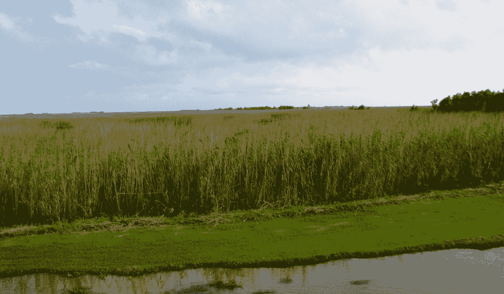

以下由 NASA 科学家 Dr. Marco Giardino 处理过的卫星图像，与之前的照片在同一片湿地区域，显示了四个不同的墓葬堆的遗迹，这些遗迹从地面上是看不到的。尽管这个遗址已有数百年历史，但植被种类及其健康状况与周围湿地相比有所不同。尽管考古学家在该地区研究了数十个类似遗址，但该项目是第一个确定墓葬建造者通常使用将墓葬堆放置在四个主要方向（北、南、西、东）的模式的，这在太空中非常明显，但在地面上却难以实现：

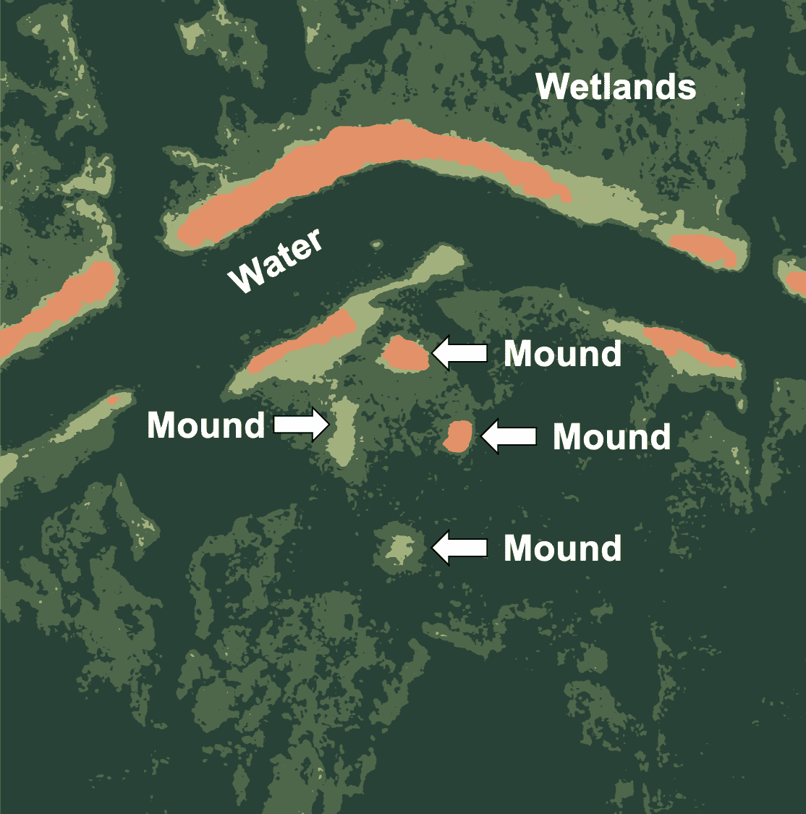

空间考古学家在定位古代遗址方面速度很快，但他们现在发现自己不仅要与地质和气象因素作斗争。盗掘一直是考古学的威胁，但由于战争和黑市文物，这个问题变得更加严重。现代建设也可能破坏有价值的地标。然而，坚定的考古学家正在使用他们用来寻找上述遗址的相同技术来检测盗掘或建设威胁。一旦他们发现威胁的证据，他们就会通知政府，以便他们可以介入。以下图像显示了叙利亚东部杜拉欧罗普斯罗马遗址的盗掘证据。圆形区域包含盗掘者挖掘的洞：

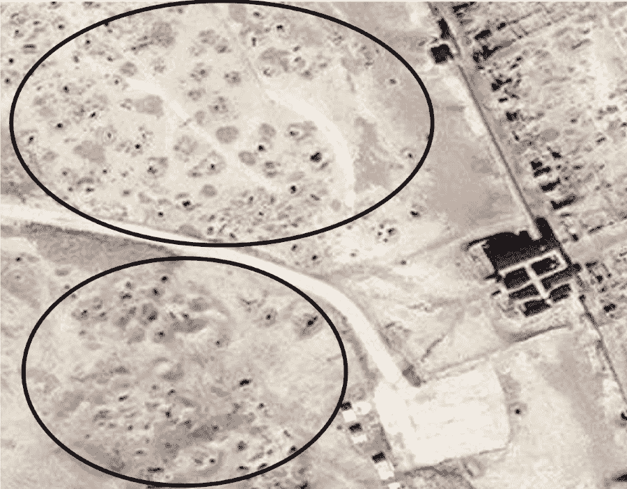

除了卫星图像处理和视觉解释之外，空间考古学家还使用地理信息系统制图技术来标记或数字化遗址，叠加现代道路和城市足迹，创建标注地图等。令人兴奋的新兴领域空间考古学是我们将在本书中涵盖的许多地理空间分析应用中最新的一个。

**超越考古学：**地理空间分析几乎可以在每个行业中找到，包括房地产、石油和天然气、农业、国防、灾害管理、健康、交通和海洋学等。要了解地理空间分析在数十个不同行业中的应用概述，请访问 [`www.esri.com/what-is-gis/who-uses-gis`](https://www.esri.com/what-is-gis/who-uses-gis)。

# 地理空间分析的历史

地理空间分析可以追溯到 15000 年前，法国西南部的拉斯科洞穴。在这个洞穴中，旧石器时代的艺术家画了常见的猎物和许多专家认为的用于宗教仪式或甚至猎物迁移模式的星图。虽然这些绘画很粗糙，但它们展示了人类创造周围世界抽象模型并将时空特征相关联以寻找关系的古老例子。以下照片显示了其中一幅绘画，上面覆盖着星图：

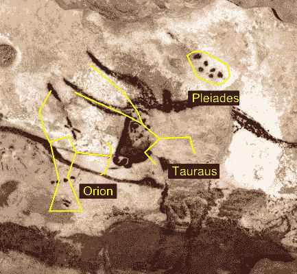

几个世纪以来，制图艺术和土地测量科学得到了发展，但直到 19 世纪，地理分析的重大进展才出现。在 1830 年至 1860 年之间，欧洲爆发的致命霍乱疫情促使巴黎和伦敦的地理学家开始使用地理分析进行流行病学研究。

1832 年，查尔斯·皮凯特使用不同的半色调灰色阴影来表示巴黎 48 个区每千名公民的死亡人数，作为关于霍乱疫情报告的一部分。1854 年，约翰·斯诺博士通过追踪伦敦发生的霍乱疫情来扩展这种方法。通过在每次诊断出死亡病例时在城市的地图上放置一个点，他能够分析霍乱病例的聚集情况。斯诺追踪疾病到单一的水泵，并防止了进一步的病例。以下地图有三个层次，包括街道、每个水泵的**X**标记和每个霍乱死亡病例的点：

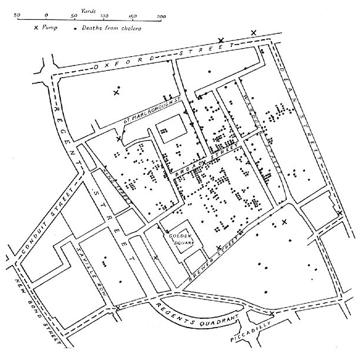

地理空间分析不仅仅用于疾病战争。几个世纪以来，将军和历史学家一直使用地图来理解人类战争。一位名叫查尔斯·米纳德的退休法国工程师在 1850 年至 1870 年期间制作了一些最复杂的信息图表。术语**信息图表**过于笼统，无法描述这些绘图，因为它们具有强烈的地理成分。这些地图的质量和细节使它们成为地理信息分析的绝佳例子，即使按照今天的标准也是如此。米纳德在 1869 年发布了他的杰作：

“La carte figurative des pertes successives en hommes de l'Armée Française dans la campagne de Russie 1812-1813,”翻译为“法国军队在 1812-13 年俄国战役中人员连续损失的图示地图。”

这描绘了 1812 年拿破仑军队在俄国战役中的毁灭。地图显示了军队随时间的变化规模和位置，以及当时的天气条件。以下图形包含关于单一主题的四个不同信息系列。这是使用笔和纸进行地理分析的绝佳例子。军队的大小由棕色和黑色条纹的宽度表示，比例为每毫米代表 10,000 人。数字也沿着条纹书写。棕色路径显示进入俄国的士兵，而黑色路径代表成功返回的士兵。地图比例尺显示在中心右侧，为一个法国里（2.75 英里或 4.4 公里）。底部的图表从右向左运行，描绘了士兵在从俄国返回的行军途中经历的残酷寒冷温度：

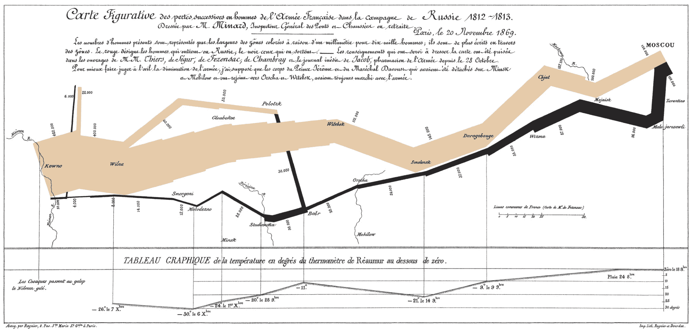

虽然远不如战争战役那样引人注目，但米纳德还发布了一份引人入胜的地图，记录了从法国各地运往巴黎的牲畜数量。米纳德在法国的不同地区使用了不同大小的饼图来展示每个地区的牲畜种类和数量：

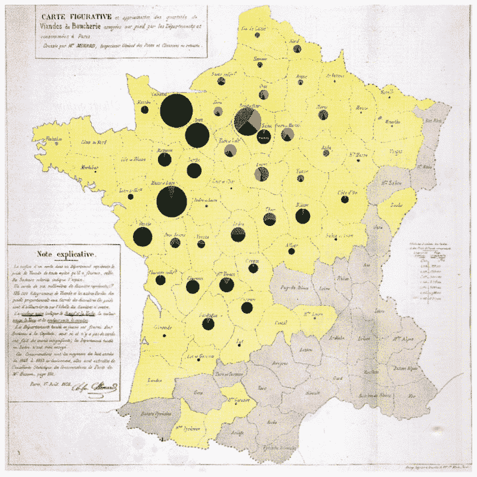

在 20 世纪初，大规模印刷推动了地图层概念的发展——这是地理空间分析的一个关键特性。制图员在玻璃板上绘制不同的地图元素（植被、道路和等高线），然后可以将这些玻璃板堆叠并拍照，以打印成单一图像。如果制图员犯了错误，只需更换一块玻璃板，而不是整个地图。后来，塑料板的开发使得以这种方式创建、编辑和存储地图变得更加容易。然而，地图分层概念作为分析的有益特性，直到现代计算机时代才发挥作用。

# GIS

计算机制图在 20 世纪 60 年代随着计算机本身的发展而演变。然而，GIS 这一术语的起源始于加拿大林业和农村发展部。罗杰·汤姆林森博士领导了一个由 40 名开发者组成的团队，与 IBM 签订协议，建立**加拿大地理信息系统**（**CGIS**）。CGIS 追踪加拿大的自然资源，并允许对这些特征进行详细分析，以便进一步研究。CGIS 将每种土地覆盖存储为不同的图层。

它还存储了适合整个国家的加拿大特定坐标系中的数据，该坐标系是为最佳面积计算而设计的。虽然按照今天的标准，所使用的技术是原始的，但当时该系统具有非凡的能力。CGIS 包括了在当时看起来相当现代的软件功能：

+   地图投影切换

+   扫描图像的橡皮膜处理

+   地图比例尺变更

+   线条平滑和泛化以减少特征中的点数

+   多边形的自动缝隙闭合

+   面积测量

+   多边形的溶解和合并

+   几何缓冲

+   创建新的多边形

+   扫描

+   从参考数据中数字化新特征

加拿大国家电影局在 1967 年制作了一部关于 CGIS 的纪录片，您可以通过以下网址观看：[`youtu.be/3VLGvWEuZxI`](https://youtu.be/3VLGvWEuZxI)。

汤姆林森常被称为 GIS 之父。在启动 CGIS 之后，他于 1974 年从伦敦大学获得博士学位，其论文题目为《电子计算方法和技术在存储、编制和评估地图数据中的应用》，该论文描述了 GIS 和地理空间分析。汤姆林森现在经营着自己的全球咨询公司——汤姆林森联合有限公司，并且他仍然是行业中的活跃参与者。他经常在地理空间会议上发表主题演讲。

CGIS 是地理空间分析的开端，如本书所定义。然而，如果没有 Howard Fisher 和哈佛大学设计研究生院计算机图形和空间分析实验室的工作，这本书就不会被写出来。他对 SYMAP GIS 软件的工作，该软件将地图输出到行式打印机，在实验室开启了一个发展时代，产生了另外两个重要的软件包，整体上永久性地定义了地理空间行业。SYMAP 导致了其他软件包的产生，包括 GRID 和 Odyssey 项目，这些项目都来自同一个实验室：

+   GRID 是一个基于栅格的 GIS 系统，它使用单元格来表示地理特征而不是几何形状。GRID 是由 Carl Steinitz 和 David Sinton 编写的。该系统后来成为 IMGRID。

+   Odyssey 是一个由 Nick Chrisman 和 Denis White 领导的团队项目。它是一个包含许多现代地理数据库系统典型地理空间数据管理功能的程序系统。哈佛试图将这些软件包商业化，但成功有限。然而，它们的影响至今仍可见。

几乎所有现有的商业和开源软件包都从这些代码库中汲取了某些东西。

Howard Fisher 制作了一部 1967 年的电影，使用 SYMAP 的输出结果展示了密歇根州兰辛市从 1850 年到 1965 年的城市扩张，通过手动将数十年的财产信息编码到系统中。这项分析耗时数月，但现在由于现代工具和数据，只需几分钟就能重新创建它们。

您可以在[`www.youtube.com/watch?v=xj8DQ7IQ8_o`](https://www.youtube.com/watch?v=xj8DQ7IQ8_o)上观看这部电影。

现在已有来自 Esri、ERDAS、Intergraph、ENVI 等公司的数十种**图形用户界面**（**GUI**）地理空间桌面应用程序。Esri 是最早且持续运营的 GIS 软件公司，其始于 20 世纪 60 年代末。在开源领域，包括**Quantum GIS**（**QGIS**）和**地理资源分析支持系统**（**GRASS**）在内的软件包被广泛使用。除了全面的桌面软件包外，用于构建新软件的软件库有成千上万。

GIS 可以提供有关地球的详细信息，但它仍然只是一个模型。有时，我们需要直接的表现形式来了解我们星球上当前或最近的变化。在这种情况下，我们需要遥感。

# 遥感

**遥感**是指在不与该物体进行物理接触的情况下收集有关该物体的信息。在地理空间分析的情况下，该物体通常是地球。遥感还包括处理收集到的信息。地理信息系统（GIS）的潜力仅限于可用的地理数据。即使使用现代 GPS 来填充 GIS，土地测量的成本也一直是资源密集型的。

遥感技术的出现不仅极大地降低了地理空间分析的成本，而且将这一领域引向了全新的方向。除了为 GIS 系统提供强大的参考数据外，遥感还通过从图像和地理数据中提取特征，使得 GIS 数据的自动和半自动生成成为可能。这位古怪的法国摄影师加斯帕德-费利克斯·图尔纳尚，也被称为纳达尔，于 1858 年从巴黎的热气球上拍摄了第一张航空照片：


真正的全景视角对世界的价值立即显现出来。早在 1920 年，关于航空照片解读的书籍就开始出现。

二战后，当美国与苏联进入冷战时，为了监控军事能力，航空摄影随着美国 U-2 侦察机的发明而变得非常普遍。U-2 侦察机可以飞行至 75,000 英尺的高度，超出了仅能到达 50,000 英尺的现有防空武器范围。当苏联最终击落一架 U-2 并捕获飞行员时，美国 U-2 在俄罗斯上空的飞行结束了。

然而，航空摄影对现代地理空间分析的影响很小。飞机只能捕捉到区域的小面积。照片被钉在墙上或在灯箱上查看，而不是与其他信息结合。尽管非常实用，但航空照片解读仅仅是另一种视觉视角。

重大变革发生在 1957 年 10 月 4 日，当时苏联发射了 Sputnik 1 卫星。苏联因为制造困难而放弃了更复杂、更先进的卫星原型，这个原型后来成为 Sputnik 3。相反，他们选择了一个简单的金属球体，带有四个天线和一个简单的无线电发射器。包括美国在内的其他国家也在研制卫星。这些卫星计划并非完全保密。它们是作为**国际地球物理年**（**IGY**）科学动机的一部分而推动的。

火箭技术的进步使得人造卫星成为地球科学的一个自然演变。然而，在几乎所有情况下，每个国家的国防机构都深度参与其中。与苏联类似，其他国家也在努力应对复杂的卫星设计，这些卫星装备了大量的科学仪器。苏联决定转向最简单的设备，仅仅是为了在美国人有效之前发射卫星。当它经过天空时，Sputnik 是可见的，业余无线电操作员可以听到它的无线电脉冲。尽管 Sputnik 很简单，但它提供了从其轨道力学和无线电频率物理学中可以得出的宝贵科学信息。

斯普特尼克计划对美国太空计划的影响最大。美国的主要对手在太空竞赛中获得了巨大的优势。美国最终以阿波罗登月计划做出了回应。然而，在此之前，美国启动了一个直到 1995 年才公开的国家机密计划。保密的 CORONA 计划产生了第一张太空照片。美国和苏联签署了一项结束间谍飞机飞行的协议，但卫星在谈判中却明显缺席。

下面的地图显示了 CORONA 流程。虚线是卫星飞行路径，长长的白色管子是卫星，较小的白色圆锥体是胶卷盒，黑色块状物是触发胶卷弹射的控制站，以便飞机可以在空中接住：

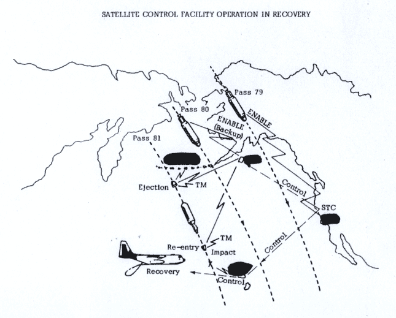

第一颗 CORONA 卫星是一个历时 4 年的项目，遇到了许多挫折。然而，该计划最终取得了成功。即使在今天，卫星成像的困难之处在于从太空中获取图像。CORONA 卫星使用了黑白胶卷的罐子，一旦曝光就会从车辆中弹出。当胶卷盒从空中降落时，美国军用飞机会在空中接住包裹。如果飞机错过了罐子，它会在水中漂浮一段时间，然后沉入海底，以保护敏感信息。

美国继续发展 CORONA 卫星，直到它们的分辨率和摄影质量与 U-2 间谍飞机照片相当。CORONA 仪器的缺点主要是可重复使用性和及时性。一旦用完胶片，卫星就不再提供服务。此外，胶片的回收有一个固定的日程安排，这使得该系统不适合监控实时情况。然而，CORONA 计划的整体成功为下一波卫星的发展铺平了道路，迎来了遥感技术的现代时代。

由于 CORONA 计划的保密状态，其对遥感的影响是间接的。在载人美国太空任务中拍摄的地球照片启发了民用遥感卫星的想法。这种卫星的好处是显而易见的，但这个想法仍然存在争议。政府官员质疑卫星是否像航空摄影那样具有成本效益。军方担心公众卫星可能会危及 CORONA 计划的保密性。其他官员担心未经许可对其他国家进行成像的政治后果。然而，**内政部**（**DOI**）最终获得了 NASA 创建用于监测地球表面资源的卫星的许可。

1972 年 7 月 23 日，NASA 发射了**地球资源技术卫星**（**ERTS**）。ERTS 很快被更名为**Landsat 1**。该平台包含两个传感器。第一个是**回波束显像管**（**RBV**）传感器，本质上是一个视频摄像机。它由无线电和电视巨头**美国无线电公司**（**RCA**）建造。RBV 立即出现了问题，包括使卫星的 altitude guidance system 失效。第二次卫星尝试是高度实验性的**多光谱扫描仪**（**MSS**）。MSS 表现完美，并产生了比 RBV 更优越的结果。MSS 捕捉了地球表面反射光线的四个不同波长的四个单独图像。

这个传感器具有几个革命性的功能。第一个也是最重要的功能是首次对地球进行全球成像，每 16 天扫描地球上的每一个地点。以下由 NASA 提供的图像展示了这次飞行和收集模式，即传感器围绕地球轨道运行时的一系列重叠带，每次传感器对地球上的某个地点进行成像时，都会捕获数据块：

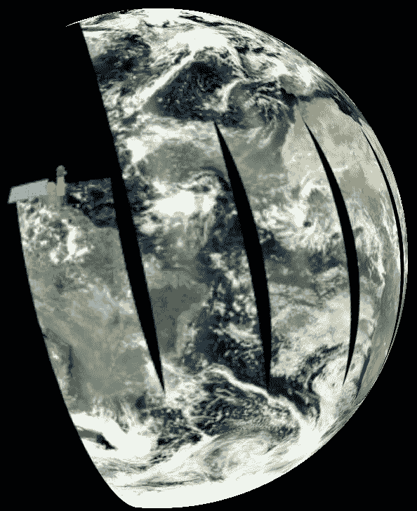

它还记录了可见光谱之外的光线。虽然它捕捉到了人眼可见的绿色和红色光线，但它还扫描了人眼看不见的两种不同波长的近红外光。图像被存储并数字化传输到马里兰州、加利福尼亚州和阿拉斯加的三个不同的地面站。其多光谱能力和数字格式意味着 Landsat 提供的天空视角不仅仅是另一张天空照片。它是在向下传输数据。这些数据可以通过计算机处理，以输出关于地球的派生信息，就像 GIS 通过分析另一个地理特征中的另一个地理特征来提供关于地球的派生信息一样。NASA 推广了 Landsat 在全球的使用，并将数据以非常低廉的价格提供给任何请求的人。

这种全球成像能力导致了许多科学突破，包括直到 1976 年才发现的未知地理发现。例如，利用 Landsat 图像，加拿大政府找到了一个由北极熊居住的微小未绘制的岛屿。他们把新的陆地命名为 Landsat 岛。

Landsat 1 之后，还有六个其他任务，这些任务被转交给**国家海洋和大气管理局**（**NOAA**）作为责任机构。Landsat 6 由于破裂的歧管而未能进入轨道，这使其机动引擎失效。在这些任务中，卫星由**地球观测卫星公司**（**EOSAT**）管理，现在称为**Space Imaging**，但在 Landsat 7 任务中又回归政府管理。以下由 NASA 提供的图像是 Landsat 7 产品的样本：

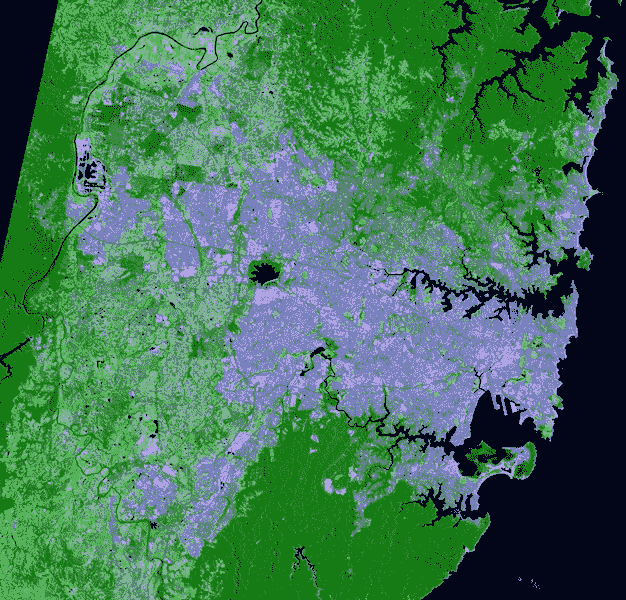

**陆地卫星数据连续性任务**（**LDCM**）于 2013 年 2 月 13 日发射，并于 2013 年 4 月 27 日开始收集图像，作为其成为陆地卫星 8 的校准周期的一部分。LDCM 是 NASA 和**美国地质调查局**（**USGS**）之间的联合任务。

# 高程数据

遥感数据可以从两个维度测量地球。但我们可以利用数字高程数据，将其包含在数字高程模型中，从而使用遥感技术从三个维度测量地球。**数字高程模型**（**DEM**）是行星地形的立体表示。在本书中，这个行星指的是地球。数字高程模型的历史比遥感影像要简单得多，但同样重要。在计算机出现之前，高程数据的表示仅限于通过传统地面测量创建的地形图。虽然存在从立体图像或如粘土或木材等材料制作三维模型的技术，但这些方法在地理学中并未得到广泛应用。

数字高程模型的概念于 1986 年出现，当时法国空间机构**国家空间研究局**（**CNES**）或**国家空间研究中心**，发射了其 SPOT-1 卫星，该卫星包含一个立体雷达。这个系统创建了第一个可用的 DEM。随后，几个美国和欧洲的卫星也采用了类似的模式，执行了类似的任务。

2000 年 2 月，航天飞机奋进号执行了**航天飞机雷达地形测量任务**（**SRTM**），使用特殊的雷达天线配置，单次飞行就收集了地球表面超过 80%的高程数据。这个模型在 2009 年被美国和日本联合任务超越，该任务使用搭载在 NASA 的 Terra 卫星上的**高级机载热辐射和反射辐射计**（**ASTER**）传感器。这个系统捕捉了地球表面的 99%，但已经证明存在一些数据问题。由于航天飞机的轨道没有穿越地球的极地，因此没有捕捉到整个表面。SRTM 仍然是黄金标准。以下来自美国地质调查局（USGS）的图片（[`www.usgs.gov/media/images/national-elevation-dataset`](https://www.usgs.gov/media/images/national-elevation-dataset)）显示了一个被称为阴影图的彩色 DEM。绿色区域代表低海拔，而黄色和棕色区域代表中等到高海拔：

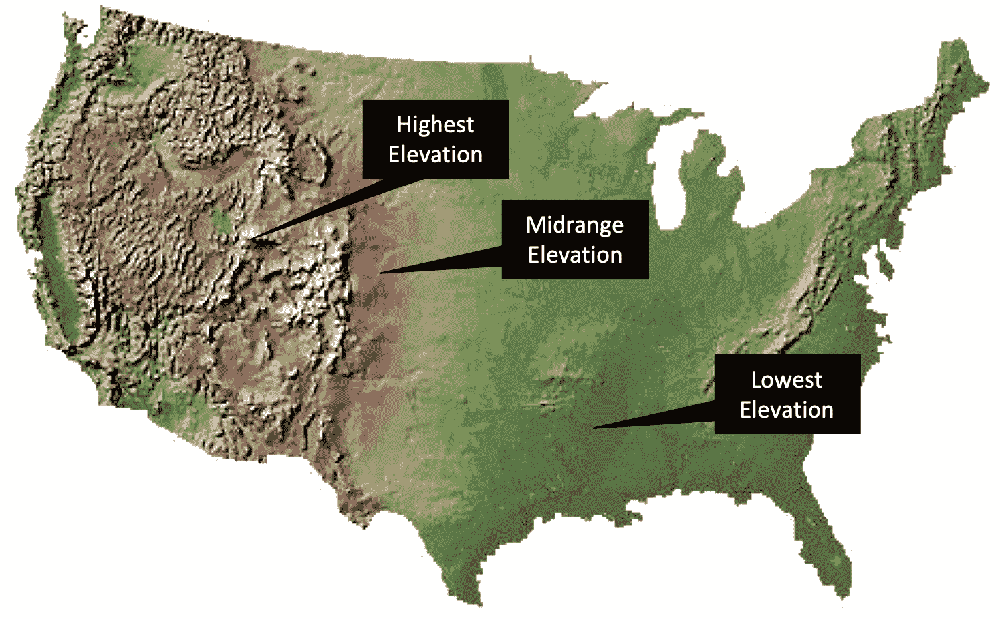

最近，全球高程数据集的更宏伟尝试正在进行中，形式为德国于 2007 年和 2010 年分别发射的 TerraSAR-X 和 TanDEM-X 卫星。这两颗雷达高程卫星共同工作，于 2014 年 4 月 15 日发布了名为 WorldDEM 的全局 DEM。这个数据集的相对精度为 2 米，绝对精度为 4 米。

# 计算机辅助绘图

**计算机辅助设计**（**CAD**）值得提及，尽管它与地理空间分析没有直接关系。CAD 系统的发展历史与地理空间分析的历史平行且交织在一起。CAD 是一种工程工具，用于建模二维和三维对象，通常用于工程和制造。地理空间模型与 CAD 模型的主要区别在于，地理空间模型以地球为参考，而 CAD 模型可能存在于抽象空间中。

例如，在 CAD 系统中，一个建筑的三个维度的蓝图不会有纬度或经度，但在 GIS 中，同一个建筑模型将在地球上有一个位置。然而，多年来，CAD 系统已经采用了许多 GIS 系统的功能，并且通常用于较小的 GIS 项目。同样，许多 GIS 程序可以导入已经地理参考的 CAD 数据。传统上，CAD 工具主要是为了设计非地理空间的数据。

然而，参与城市公用事业电力系统设计等地理空间工程项目的工程师会使用他们熟悉的 CAD 工具来创建地图。随着时间的推移，GIS 软件演变为导入工程师生产的面向地理空间的 CAD 数据，CAD 工具也演变为支持地理空间数据创建并与 GIS 软件更好地兼容。Autodesk 的 AutoCAD 和 Esri 的 ArcGIS 是开发这种功能的领先商业软件包，**地理空间数据抽象库**（**GDAL**）OGR 库的开发者也增加了 CAD 支持。

# 地理空间分析和计算机编程

现代地理空间分析可以通过在任何易于使用的商业或开源地理空间软件包中点击按钮来完成。那么，为什么你想要使用编程语言来学习这个领域呢？最重要的原因如下：

+   你希望完全控制底层算法、数据和执行

+   你希望用最小的开销从大型多用途地理空间框架中自动化特定的重复分析任务

+   你希望创建一个易于分享的程序

+   你希望学习地理空间分析，而不仅仅是软件中的按钮操作

地理空间行业正逐渐摆脱传统的流程，即分析团队使用昂贵的桌面软件来制作地理空间产品。地理空间分析正在被推向居住在云中的自动化流程。终端用户软件正朝着特定任务的工具发展，其中许多工具可以通过移动设备访问。了解地理空间概念和数据，以及构建自定义地理空间流程的能力，是未来地理空间工作的关键所在。

# 面向对象编程用于地理空间分析

面向对象编程是一种软件开发范式，其中概念被建模为具有属性的对象，这些属性以属性和方法的形式表示行为。这种范式的目标是创建更模块化的软件，其中一个对象可以继承自一个或多个其他对象，以鼓励软件重用。

Python 编程语言以其作为设计良好的面向对象语言、过程式脚本语言，甚至函数式编程语言的多重角色而闻名。然而，你永远不会完全放弃面向对象编程，因为即使是 Python 的本地数据类型也是对象，所有 Python 库，称为模块，都遵循基本的对象结构和行为。

地理空间分析是面向对象编程的完美活动。在大多数面向对象编程项目中，对象是抽象概念，例如没有现实世界对应物的数据库连接。然而，在地理空间分析中，所建模的概念实际上是现实世界中的对象！地理空间分析的应用领域是地球及其上的所有事物。树木、建筑物、河流和人类都是地理空间系统中的对象示例。

在面向对象编程的新手文献中，常见的例子是具体的猫类比。面向对象编程的书籍经常使用以下形式的例子。

想象一下你正在看一只猫。我们了解一些关于这只猫的信息，比如它的名字、年龄、颜色和大小。这些特征是猫的属性。猫还表现出诸如进食、睡觉、跳跃和咕噜咕噜叫等行为。在面向对象编程中，对象也有属性和行为。你可以模拟现实世界中的对象，例如我们例子中的猫，或者更抽象的对象，如银行账户。

面向对象编程中的大多数概念比简单的猫范式或甚至银行账户都要抽象得多。然而，在地理空间分析中，所建模的对象保持具体，例如简单的猫类比，在许多情况下就是猫。地理空间分析允许你继续使用简单的猫类比，甚至可视化它。以下地图展示了由**澳大利亚生活地图集**（**ALA**）提供的数据所表示的澳大利亚野猫种群：

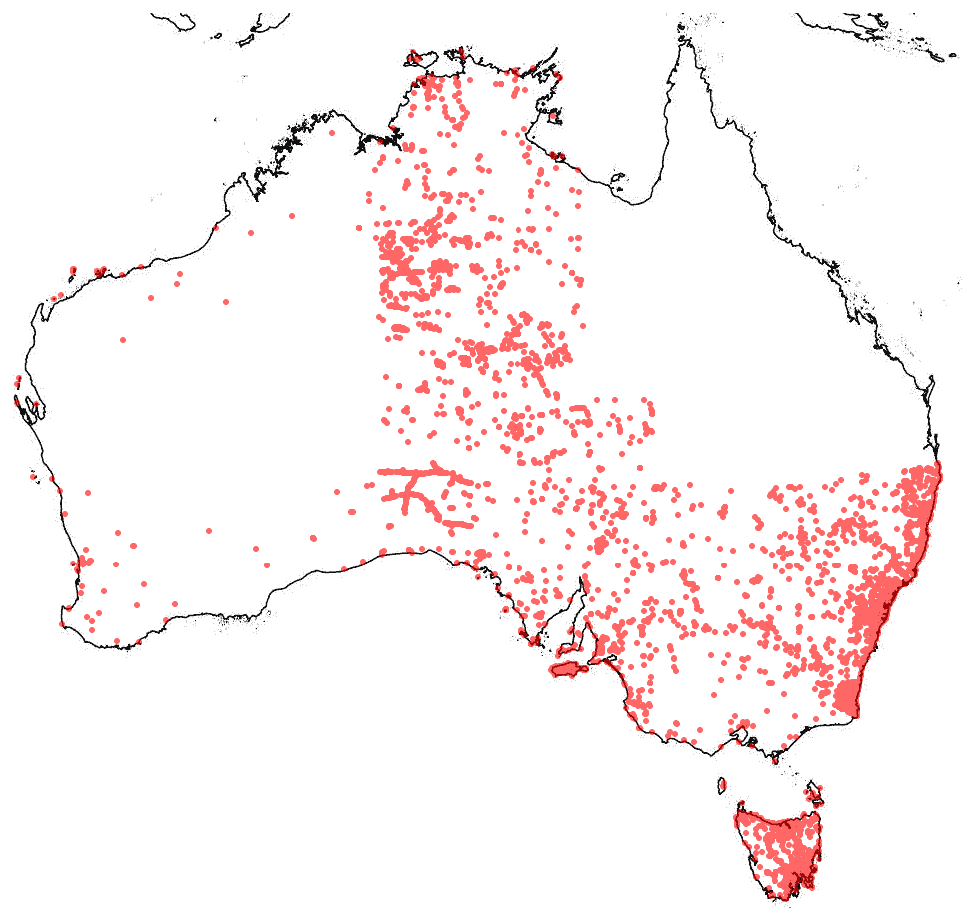

因此，我们可以使用计算机来分析地球上特征之间的关系，但我们为什么要这样做呢？在下一节中，我们将探讨为什么地理空间分析是一项值得努力的事业。

# 地理空间分析的重要性

地理空间分析帮助人们做出更好的决策。它不会为你做决定，但它可以回答那些决定核心的、通常无法以其他方式回答的关键问题。直到最近，地理空间技术和数据只是政府和资金充足的研究人员可用的工具。然而，在过去十年中，数据变得更加广泛可用，软件也变得更加容易获得。

除了免费提供的政府卫星图像外，许多地方政府现在进行航空摄影调查，并将数据在线提供。无处不在的谷歌地球提供了一个跨平台的旋转地球视图，包含卫星和航空数据、街道、兴趣点、照片等等。谷歌地球用户可以创建定制的**Keyhole Markup Language**（**KML**）文件，这些是用于将数据和样式加载到地球上的 XML 文件。这个程序和类似工具通常被称为地理探索工具，因为它们是优秀的数据查看器，但提供的数据分析能力非常有限。

野心勃勃的 OpenStreetMap 项目（[`www.openstreetmap.org/#map=5/51.500/-0.100`](https://www.openstreetmap.org/#map=5/51.500/-0.100)）是一个众包的、全球性的地理基础地图，包含大多数在 GIS 中常见的层。现在几乎每部手机都内置了 GPS，以及用于收集 GPS 轨迹作为点、线或多边形的移动应用程序。大多数手机还会将用手机相机拍摄的照片标记上 GPS 坐标。简而言之，任何人都可以成为地理空间分析师。

全球人口已达到 70 亿人。世界的变化比以往任何时候都要快。地球正在经历着历史上从未见过的环境变化。更快的通讯和交通增加了我们与生活环境之间的互动。安全、负责任地管理人和资源比以往任何时候都更具挑战性。地理空间分析是更高效、更深入地理解我们世界的最佳方法。越多地利用地理空间分析能力的政治家、活动家、救援工作者、父母、教师、第一响应者、医疗专业人士和小型企业，我们就有更多潜力创造一个更美好、更健康、更安全、更公平的世界。

# GIS 概念

为了开始地理空间分析，我们需要了解一些独特的核心概念。这个列表并不长，但分析的几乎每个方面都可以追溯到这些想法之一。

# 主题地图

如其名称所示，主题地图描绘了一个特定的主题。一般参考地图以与导航或规划相关的地理位置来直观地表示特征。主题地图超越了位置，为围绕中心思想的信息提供地理背景。通常，主题地图是为特定受众设计的，以回答具体问题。主题地图的价值在于它们没有展示的内容。主题地图将使用最少的地理特征来避免分散读者的注意力。大多数主题地图包括政治边界，如国家或州边界，但省略了导航特征，如街道名称或位于主要地标之外的景点，这些地标有助于读者定位。

本章前面提到的约翰·斯诺博士的霍乱地图是主题地图的一个完美例子。主题地图的常见用途是可视化健康问题，如疾病、选举结果以及环境现象，如降雨。这些地图也是地理空间分析的最常见输出。以下是美国人口普查局的地图，显示了各州的癌症死亡率：

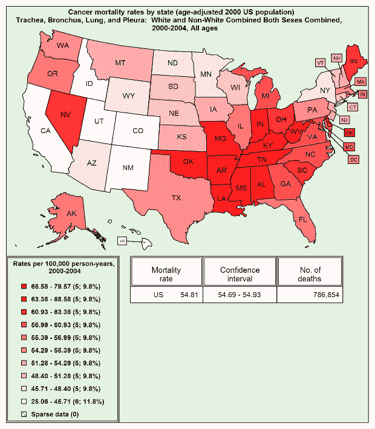

主题地图讲述故事并且非常有用。然而，重要的是要记住，尽管主题地图和其他地图一样，是现实的模型，但它们也是信息的概括。两位不同的分析师使用相同的信息来源，通常会得出非常不同的主题地图，这取决于他们如何分析和总结数据。他们也可能选择关注数据集的不同方面。主题地图的技术性质往往导致人们将它们视为科学证据。然而，地理空间分析往往没有结论。虽然分析可能基于科学数据，但分析师并不总是遵循科学方法的严谨性。

在他的经典著作《如何用地图说谎》中，马克·莫蒙尼尔（Mark Monmonier），芝加哥大学出版社，详细展示了地图是如何轻易地被操纵成现实的模型，这些模型通常被滥用。这一事实并不降低这些工具的价值。传奇统计学家乔治·博克斯（George Box）在他的 1987 年著作《经验模型构建和响应面》中写道：

“本质上，所有模型都是错误的，但有些是有用的。”

主题地图已被用作指导开始（和结束）战争、阻止致命疾病、赢得选举、养活国家、对抗贫困、保护濒危物种以及救助受灾害影响的人的指南。主题地图可能是创建的最有用的模型。

在其最纯粹的形式中，数据库只是一个组织的信息集合。**数据库管理系统**（**DBMS**）是一个可以与数据库交互的交互式软件套件。人们经常使用“数据库”这个词作为一个总称，指代 DBMS 和底层数据结构。数据库通常包含字母数字数据，在某些情况下，还包含可以存储二进制数据（如图像）的二元大对象或 BLOB。大多数数据库还允许使用关系数据库结构，其中规范化表中的条目可以相互引用，以在数据之间创建多对一和一对多关系。

空间数据库，也称为地理数据库，使用专用软件将传统的**关系数据库管理系统**（**RDBMS**）扩展到存储和查询在二维或三维空间中定义的数据。一些系统还考虑了一系列随时间变化的数据。在空间数据库中，关于地理特征的属性以传统的数据库结构存储和查询。这些空间扩展允许您使用**结构化查询语言**（**SQL**）以类似于传统数据库查询的方式查询几何形状。空间查询和属性查询也可以结合使用，以基于位置和属性选择结果。

# 空间索引

空间索引是一个组织地理空间矢量数据以实现更快检索的过程。它是一种预先过滤数据以用于常见查询或渲染的方法。索引通常在大型数据库中用于加速查询的返回。空间数据也不例外。即使是中等规模的地理数据库也可能包含数百万个点或对象。如果你执行空间查询，数据库中的每个点都必须由系统考虑，以便将其包含在结果中或从结果中排除。空间索引以允许在详细且较慢的分析剩余项目之前，通过进行计算上更简单的检查来消除数据集的大部分内容。

# 元数据

元数据被定义为关于数据的数据。因此，地理空间元数据是关于地理空间数据集的数据，它提供了数据集来源和历史追踪，以及技术细节的摘要。元数据还通过随着时间的推移记录资产来提供数据的长期保存。

地理空间元数据可以用几种可能的标准来表示。最突出的标准之一是国际标准**ISO 19115-1**，它包括数百个潜在字段来描述单个地理空间数据集。此外，**ISO 19115-2**标准还包括地理空间影像和栅格数据的扩展。一些示例字段包括空间表示、时间范围和来源。ISO 19115-3 是描述从 ISO 地理元数据生成 XML 模式的程序的规范。Dublin Core 是另一个国际标准，它最初是为数字数据开发的，后来扩展到地理空间数据，以及相关的 DCAT 词汇表，用于构建单一来源的数据目录。

元数据的主要用途是编目数据集。现代元数据可以被地理搜索引擎摄取，使其可能被其他系统自动发现。它还列出了数据集的联系方式，如果你有问题的话。元数据是地理空间分析师的重要支持工具，为你的工作增加了可信度和可访问性。创建**网络目录服务**（**CSW**）的**开放地理空间联盟**（**OGC**）用于管理元数据。`pycsw` Python 库实现了 CSW 标准。

元数据是用于管理地理空间数据的重要文档工具，而`pycsw`是一个符合 OGC 标准的 CSW 实现。你可以在[`pycsw.org`](http://pycsw.org)了解更多关于`pycsw`的信息。

# 地图投影

地图投影有整本书专门介绍，对于新分析师来说可能是一个挑战。如果你将任何三维物体平铺在一个平面上，比如你的屏幕或一张纸，这个物体就会变形。许多小学地理课通过让学生剥橙子并尝试将皮平铺在桌子上来展示这个概念，以便理解产生的变形。当你将地球的圆形投影到计算机屏幕上时，也会产生相同的效果。

在地理空间分析中，你可以操纵这种变形以保留常见的属性，如面积、比例、方位、距离或形状。地图投影没有一种适合所有情况的解决方案。投影的选择总是为了在某一维度上获得精度而牺牲另一维度的误差。投影通常表示为一组超过 40 个参数，可以是 XML 格式，也可以是称为**已知文本**（**WKT**）的文本格式，用于定义转换算法。

**国际油气生产商协会**（**IOGP**）维护着一个最知名投影的注册表。该组织以前被称为**欧洲石油调查组**（**EPSG**）。注册表中的条目仍被称为 EPSG 代码。EPSG 维护这个注册表是为了石油和天然气行业的一个共同利益，该行业是能源勘探中地理空间分析的大用户。据最后一次统计，这个注册表包含超过 5,000 个条目。

10 年前，地图投影对地理空间分析师来说至关重要。数据存储成本高昂，高速互联网很少见，云计算尚未真正存在。地理空间数据通常在各自感兴趣的不同领域的小组之间交换。当时的技术限制意味着地理空间分析高度本地化。分析师会使用最适合他们兴趣领域的投影。

由于不同的投影代表地球的两种不同模型，因此不同投影的数据不能显示在同一张地图上。每当分析师从第三方接收数据时，他们必须在使用现有数据之前重新投影，这个过程既繁琐又耗时。

大多数地理空间数据格式都没有提供存储投影信息的方法。这些信息通常存储在一个辅助文件中，通常是文本或 XML 格式。由于分析师不经常交换数据，许多人不会费心定义投影信息。每个分析师的噩梦就是遇到一个极其宝贵的缺失投影信息的数据集。这使得数据集变得无用。文件中的坐标只是数字，并不能提供关于投影的线索。在超过 5,000 种选择中，几乎不可能猜对。

现在，多亏了现代软件和互联网使数据交换变得更加容易和普遍，几乎每种数据格式都增加了一种元数据格式，用于定义投影或将它放在文件头中（如果支持的话）。技术的进步也允许全球基础地图的存在，这允许更普遍地使用投影，例如 Google Maps 使用的通用墨卡托投影。这个投影也被称为 Web Mercator，使用代码 EPSG:3857（或已弃用的 EPSG:900913）。

地理空间门户网站项目，如 OpenStreetMap（[`www.openstreetmap.org/#map=5/51.500/-0.100`](https://www.openstreetmap.org/#map=5/51.500/-0.100)）和 NationalAtlas.gov，已经将世界大部分地区的数据集在共同投影下进行了整合。现代地理空间软件还可以即时重新投影数据，从而省去了分析师在使用数据之前预处理数据的麻烦。与地图投影密切相关的是大地基准。**基准**是一个用于将地球表面上的特征与坐标系统匹配的地球表面模型。一个常见的基准是 WGS 84，它被 GPS 使用。

# 渲染

地理空间分析令人兴奋的部分是可视化。由于地理空间分析是一个基于计算机的过程，了解地理数据在计算机屏幕上的显示方式是很好的。

地理数据，包括点、线和多边形，以数值形式存储为一个或多个点，这些点以(*x,y*)对或(*x,y,z*)元组的形式出现。*x*代表图表上的水平轴，而*y*代表垂直轴。*z*代表地形高程。在计算机图形学中，计算机屏幕由*x*轴和*y*轴表示。*z*轴不使用，因为大多数图形软件 API 将计算机屏幕视为二维平面。然而，由于桌面计算能力持续提升，三维地图开始变得更加常见。

另一个重要因素是屏幕坐标与世界坐标。地理数据存储在一个代表地球网格的坐标系中，该地球是三维和圆形的。屏幕坐标，也称为像素坐标，代表二维计算机屏幕上的像素网格。将*x*和*y*世界坐标映射到像素坐标相对简单，涉及一个简单的缩放算法。然而，如果存在*z*坐标，则必须执行更复杂的转换，将坐标从三维空间映射到二维平面。这些转换可能计算成本高昂，因此如果不正确处理，可能会减慢速度。

在遥感数据的情况下，挑战通常是文件大小。即使是中等大小的压缩卫星图像也可能达到数十甚至数百兆字节。可以使用两种方法来压缩图像：

+   **无损方法**：它们使用技巧来减少文件大小，而不丢弃任何数据

+   **有损压缩算法**：它们通过减少图像中的数据量来减小文件大小，同时避免图像外观发生重大变化

在屏幕上渲染图像可能计算密集。大多数遥感文件格式允许存储多个较低分辨率的图像版本，称为**概览**或**金字塔**，仅为了在不同比例下更快地渲染。当从图像缩放到可以看到全分辨率图像细节的比例时，会快速且无缝地显示预先处理过的、较低分辨率的图像版本。

# 遥感概念

我们所描述的大多数 GIS 概念也适用于栅格数据。然而，栅格数据也有一些独特的属性。在本章早期，当我们回顾遥感的历史时，重点是地球从空中平台成像。需要注意的是，栅格数据可以以多种形式出现，包括地面雷达、激光测距仪以及其他用于在地理环境中检测气体、辐射和其他形式能量的专用设备。

为了本书的目的，我们将重点关注捕获大量地球数据的遥感平台。这些来源包括地球成像系统、某些类型的高程数据，以及在某些情况下的一些天气系统。

# 图像作为数据

栅格数据以方形瓦片的形式数字化捕获。这意味着数据以行和列的数值数组形式存储在计算机上。如果数据是多光谱的，数据集通常将包含多个相同大小的数组，这些数组在地理空间上相互参照，以表示地球上的单个区域。这些不同的数组被称为**波段**。任何数值数组都可以在计算机上表示为图像。实际上，所有计算机数据最终都是数字。在地理空间分析中，将图像视为数值数组非常重要，因为数学公式被用来处理它们。

在遥感图像中，每个像素代表空间（地球上一定大小的位置）和从该位置反射到空间的光的反射率。因此，每个像素都有一个地面大小，并包含一个表示强度的数字。由于每个像素都是一个数字，我们可以对这份数据执行数学方程，以结合来自不同波段的 数据，并突出图像中特定的物体类别。如果波长值超出可见光谱，我们可以突出人眼看不到的特征。例如，使用称为**归一化植被指数**（**NDVI**）的特定公式，植物中的叶绿素可以产生很大的对比度。

通过处理遥感图像，我们可以将这些数据转化为视觉信息。使用 NDVI 公式，我们可以回答问题，*这张图像中植物的健康状况如何？* 你还可以创建新的数字信息类型，这些信息可以用作计算机程序的输入，以输出其他类型的信息。

# 遥感与颜色

计算机屏幕将图像显示为红、绿、蓝（**RGB**）的组合，以匹配人眼的感知能力。卫星和其他遥感成像设备可以捕捉到超出可见光谱的光线。在计算机上，超出可见光谱的波长被表示在可见光谱中，以便我们可以看到它们。这些图像被称为**假彩色**图像。在遥感中，例如，红外光使水分变得非常明显。

这种现象有各种用途，例如在洪水期间监测地面饱和度或寻找屋顶或堤坝中的隐藏泄漏。

# 常见的矢量 GIS 概念

在本节中，我们将讨论在地理空间分析中常用的一些不同类型的 GIS 处理过程。这个列表并不详尽；然而，它为你提供了所有其他操作的基础操作。如果你理解了这些操作，你将很快理解更复杂的过程，因为它们要么是这些过程的衍生物，要么是这些过程的组合。

# 数据结构

GIS 向量数据使用由至少一个*x*水平值和一个*y*垂直值组成的坐标来表示地球上的位置。在许多情况下，一个点也可能包含一个*z*值。其他辅助值也是可能的，包括测量值或时间戳。

这些坐标用于形成点、线和多边形，以模拟现实世界中的对象。点可以是自身就是几何特征的几何要素，或者它们可以连接线段。由线段创建的封闭区域被认为是多边形。多边形可以模拟诸如建筑、地形或政治边界等对象。

一个 GIS 要素可以由一个点、线或多边形组成，或者可以由多个形状组成。例如，在一个包含世界国家边界的 GIS 多边形数据集中，由 7,107 个岛屿组成的菲律宾将被表示为一个由数千个多边形组成的单一国家。

向量数据通常比栅格数据更好地表示地形特征。向量数据具有更高的精度潜力，并且更加精确。然而，在大规模收集向量数据方面，传统上比栅格数据成本更高。

与向量数据结构相关的另外两个重要术语是边界框和凸包。边界框，或最小边界框，是包含数据集中所有点的可能最小的正方形。以下图示演示了点集合的边界框：

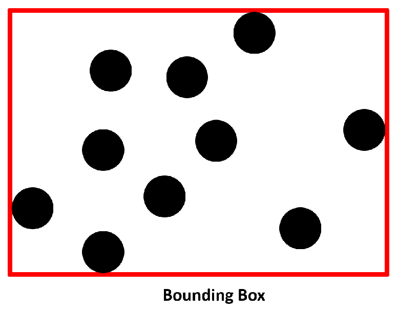

数据集的凸包与边界框类似，但不同之处在于，它是一个可以包含数据集的最小多边形。以下图示显示了与上一个示例相同的点数据，其中凸包多边形用红色表示：

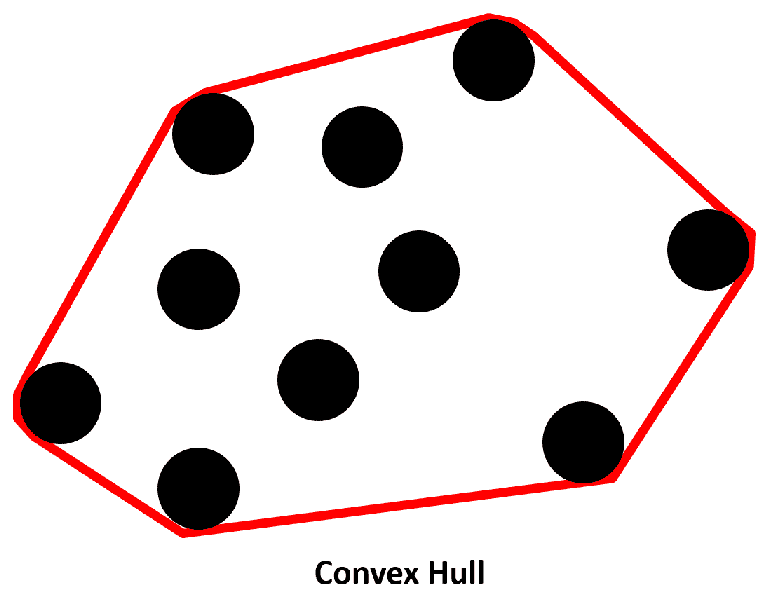

如你所见，数据集的边界框总是包含凸包。

# 多边形的地理空间规则

在地理空间分析中，关于多边形有一些一般性的经验法则，这些法则与多边形的数学描述不同：

+   多边形至少必须有四个点——第一个和最后一个点必须相同

+   多边形的边界不应该重叠自身

+   层中的多边形不应该重叠

+   在另一个多边形内部的层中的多边形被认为是下层数据的多边形中的空洞

不同的地理空间软件包和库对这些规则的例外情况处理不同，这可能导致令人困惑的错误或软件行为。最安全的做法是确保您的多边形遵守这些规则。关于多边形，我们还需要讨论的一个重要信息。

根据定义，多边形是一个封闭的形状，这意味着多边形的第一个和最后一个顶点是相同的。一些地理空间软件如果未明确地将第一个点作为多边形数据集中的最后一个点进行复制，将会抛出一个错误。其他软件会自动关闭多边形而不会抱怨。您用于存储地理空间数据的数据格式也可能决定了多边形的定义。这个问题是一个灰色地带，因此它没有成为多边形规则的一部分，但了解这个特性在遇到难以解释的错误时可能会很有帮助。

# 缓冲

缓冲操作可以应用于空间对象，包括点、线和多边形。这个操作在指定距离处创建一个围绕对象的 polygon。缓冲操作用于邻近分析：例如，在危险区域周围建立安全区。让我们回顾一下这个图：


黑色形状代表原始几何形状，而红色轮廓代表从原始形状生成的更大的缓冲 polygon。

# 溶解

溶解操作可以将相邻的多边形合并成一个单一的多边形。溶解操作也用于简化从遥感中提取的数据，如下所示：


溶解操作的一个常见用途是将单一所有者购买的土地数据库中相邻的两个属性合并。

# 概括

对于地理空间模型来说，具有比必要点数更多的对象可以通过概括来减少表示形状所使用的点数。这个操作通常需要尝试几次才能得到最优的点数，同时不损害整体形状。这是一种数据优化技术，用于简化数据以提高计算效率或更好的可视化。这项技术在网络地图应用中非常有用。

这里是一个多边形概括的例子：

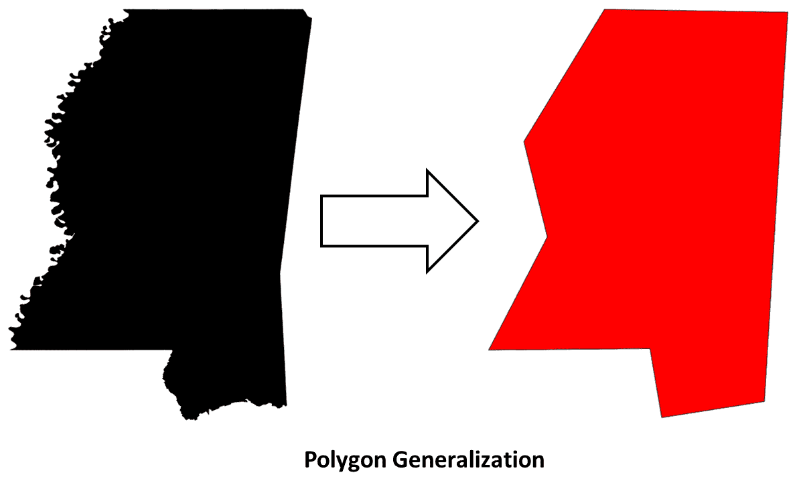

由于计算机屏幕的分辨率为每英寸 72 个点（dpi），高度详细的数据点，这些点在视觉上不可见，可以被减少，以便使用更少的带宽向用户发送视觉上等效的地图。

# 交集

交集操作用于检查一个特征的一部分是否与一个或多个特征相交。这个操作用于邻近分析中的空间查询，通常是缓冲分析的后继操作：

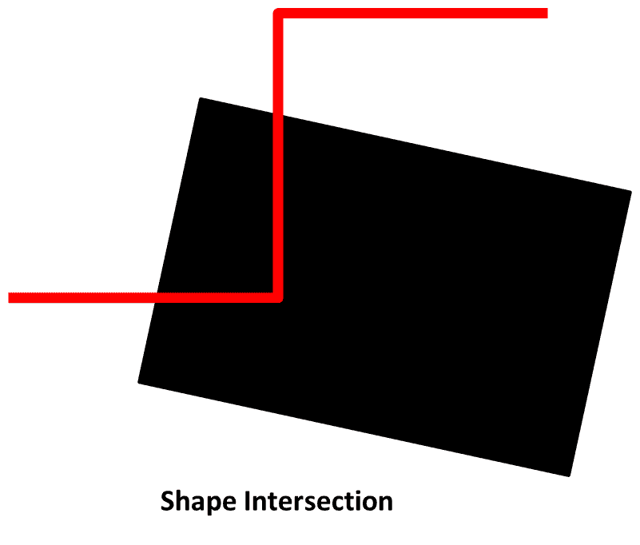

合并操作将两个或更多非重叠形状合并为一个单一的多形状对象。多形状对象是那些保持独立几何形状但被 GIS 视为具有单一属性集的单个特征的形状：

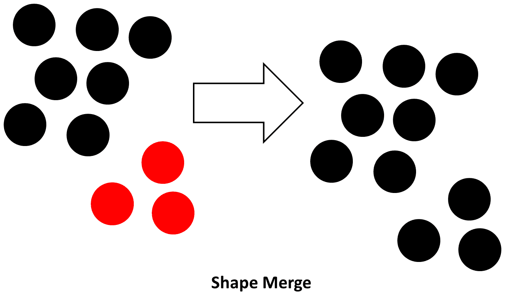

一个基本的地理空间操作是检查一个点是否在多边形内部。这个操作是许多不同类型空间查询的原子构建块。如果点在多边形的边界上，则被认为是内部的。存在非常少的空间查询不依赖于这种计算。然而，在大量点的情况下，它可能非常慢。

检测一个点是否在多边形内部最常见且高效的算法称为**射线投射算法**。首先，进行一个测试以查看该点是否在多边形边界上。接下来，算法从问题点沿单一方向绘制一条线。程序计算该线与多边形边界的交叉次数，直到达到多边形的边界框，如图所示：

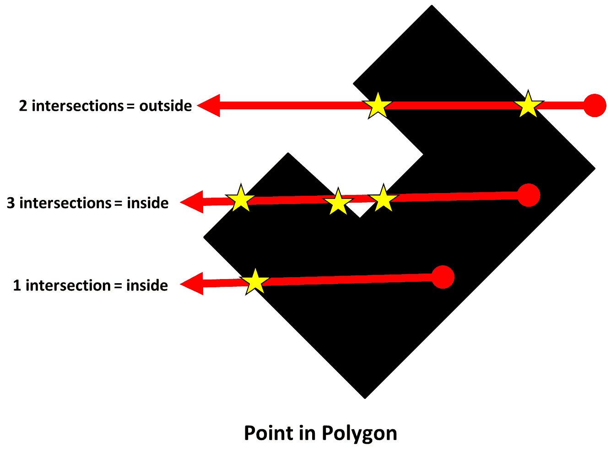

边界框是围绕整个多边形可以绘制的最小框。如果数字是奇数，则点在内部。如果边界交叉次数是偶数，则点在外部。

# 并集

并集操作不如合并操作常见，但在需要将两个或多个重叠多边形合并为一个单一形状时非常有用。它与溶解操作类似，但在此情况下，多边形是重叠的，而不是相邻的：

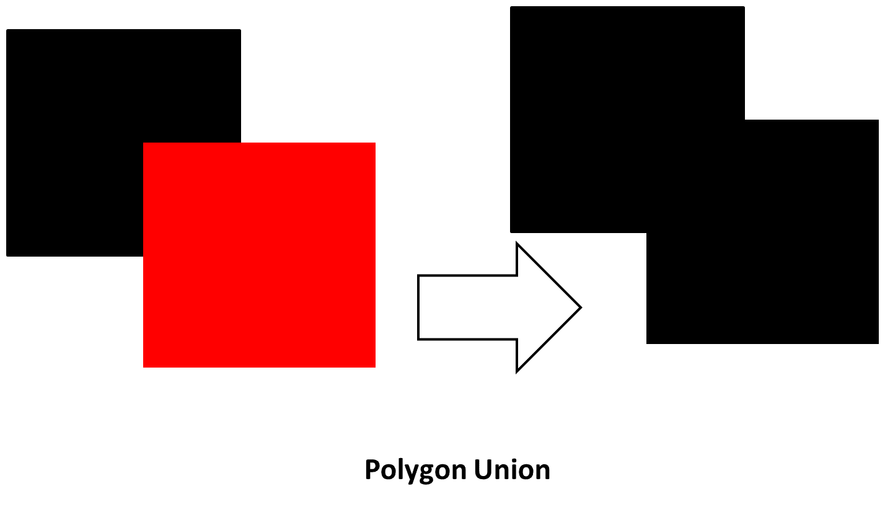

通常，此操作用于清理来自遥感操作自动生成的要素数据集。

# 连接

连接或 SQL 连接是一种数据库操作，用于合并两个或多个信息表。关系型数据库旨在避免为多对一关系存储冗余信息。例如，一个美国州可能包含许多城市。而不是为每个州创建包含其所有城市的表，可以创建一个包含州数字 ID 的州表，同时为每个州的所有城市创建一个包含州数字 ID 的表。

在 GIS 中，还可以有空间连接，这是数据库空间扩展软件的一部分。在空间连接中，您以与 SQL 连接相同的方式组合属性。然而，这种关系基于两个特征的地理邻近性。

为了遵循前面的城市示例，我们可以使用空间连接添加每个城市所在的县名。城市层可以在包含县名的县多边形层上加载。空间连接将确定哪个城市位于哪个县，并执行 SQL 连接以将县名添加到每个城市的属性行中。

# 常见的栅格数据概念

如我们之前提到的，遥感栅格数据是一个数字矩阵。遥感包含数千种可以在数据上执行的操作。随着新卫星的发射和计算机能力的提升，这个领域几乎每天都在变化。

尽管这个领域已有十年的历史，但我们甚至还没有触及到这个领域可以为人类提供的知识的表面。再次强调，与常见的 GIS 过程类似，这个最小操作列表允许你评估遥感中使用的任何技术。

# 波段数学

波段数学是多维数组数学。在数组数学中，数组被视为单一单位，可以进行加、减、乘、除运算。然而，在数组中，多个数组中每一行和每一列对应的数字是同时计算的。这些数组被称为矩阵，涉及矩阵的计算是线性代数的研究重点。

# 变化检测

变化检测是将同一地点在不同时间的两张图像进行对比，并突出显示这些变化的过程。变化可能是由于地面上的新建筑物的增加，或者特征的损失，如海岸侵蚀。有许多算法可以检测图像之间的变化，并确定定性因素，如变化发生的时间。

以下来自美国橡树岭国家实验室（**ORNL**）的研究项目的图像显示了 1984 年至 2000 年间巴西朗多尼亚州的热带雨林砍伐情况：

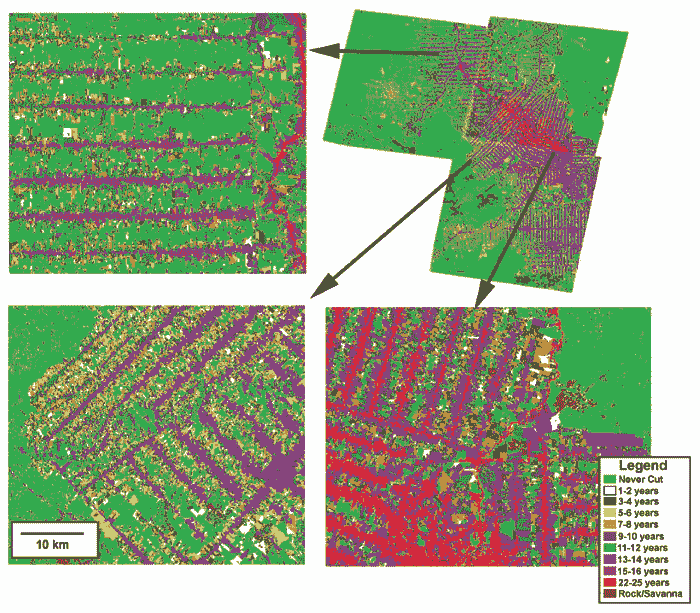

颜色用于显示森林被砍伐的时间。绿色代表原始雨林，白色代表在日期范围结束后的两年内被砍伐的森林，红色代表在 22 年内，其他颜色介于描述的图例之间。

# 直方图

直方图是数据集中值的统计分布。横轴代表数据集中唯一的值，而纵轴代表在栅格中该唯一值的频率。以下来自 NASA 的例子展示了一个被分类为不同类别的卫星图像的直方图，代表了地表特征：

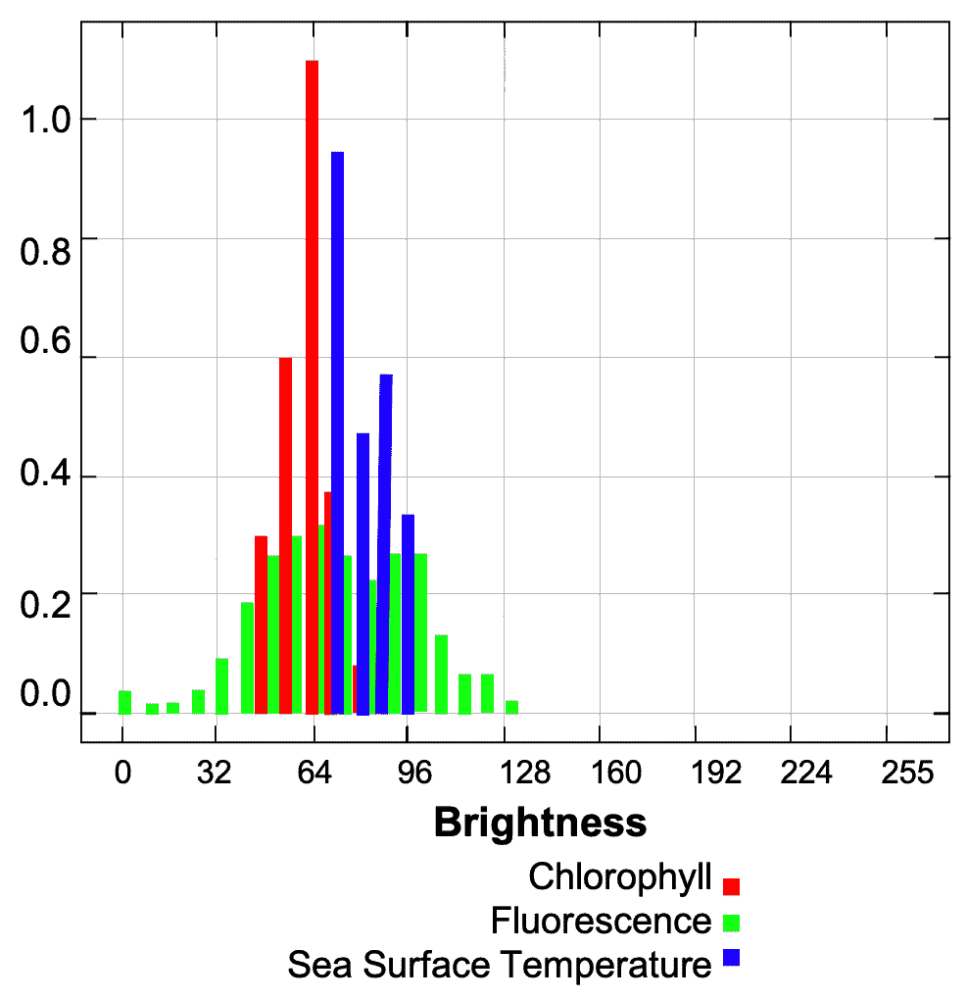

直方图是大多数栅格处理中的关键操作。它可以用于从增强图像对比度到作为对象分类和图像比较的基础等一切用途。

# 特征提取

特征提取是将图像中的特征手动或自动数字化为点、线或多边形的过程。这个过程是图像矢量化（将栅格转换为矢量数据集）的基础。特征提取的一个例子是从卫星图像中提取海岸线并将其保存为矢量数据集。

如果这种提取在几年内进行，您可以监控这一海岸线的侵蚀或其他变化。

# 监督和非监督分类

地球上的物体根据其材料反射不同波长的光。在遥感中，分析师收集特定类型土地覆盖（例如，混凝土）的波长特征，并为特定区域建立一个库。然后，计算机可以使用这个库在相同区域的新图像中自动定位库中的类别。

在非监督分类中，计算机在没有任何其他参考信息（除了图像的直方图）的情况下，将具有相似反射值的光像素分组。

# 创建最简单的 Python GIS

现在我们对地理空间分析有了更好的理解，下一步是使用 Python 构建一个简单的 GIS，称为`SimpleGIS`。这个小程序将是一个技术完整的 GIS，具有地理数据模型和将数据渲染为显示不同城市人口的视觉主题地图的能力。

数据模型也将被构建，以便您可以进行基本查询。我们的`SimpleGIS`将包含科罗拉多州、三个城市以及每个城市的人口统计。

最重要的是，我们将通过在纯 Python 中构建这个小型系统来展示 Python 编程的强大和简单。我们将只使用标准 Python 发行版中可用的模块，而不会下载任何第三方库。

# Python 入门

如我们之前所述，本书假设您对 Python 有一些基本知识。以下示例中使用的唯一模块是`turtle`模块，它基于 Python 中包含的 Tkinter 库提供了一个非常简单的图形引擎。如果您使用了 Windows 或 macOS 的安装程序，Tkinter 库应该已经包含在内。如果您自己编译了 Python 或者使用的是来自 Python.org 以外的发行版([`www.python.org`](https://www.python.org))，那么请确保您可以在命令提示符中输入以下内容来导入`turtle`模块。这将运行`turtle`演示脚本：

```py
python –m turtle
```

以下命令将启动一个实时绘图程序，它将展示 turtle 模块的功能，类似于以下截图：

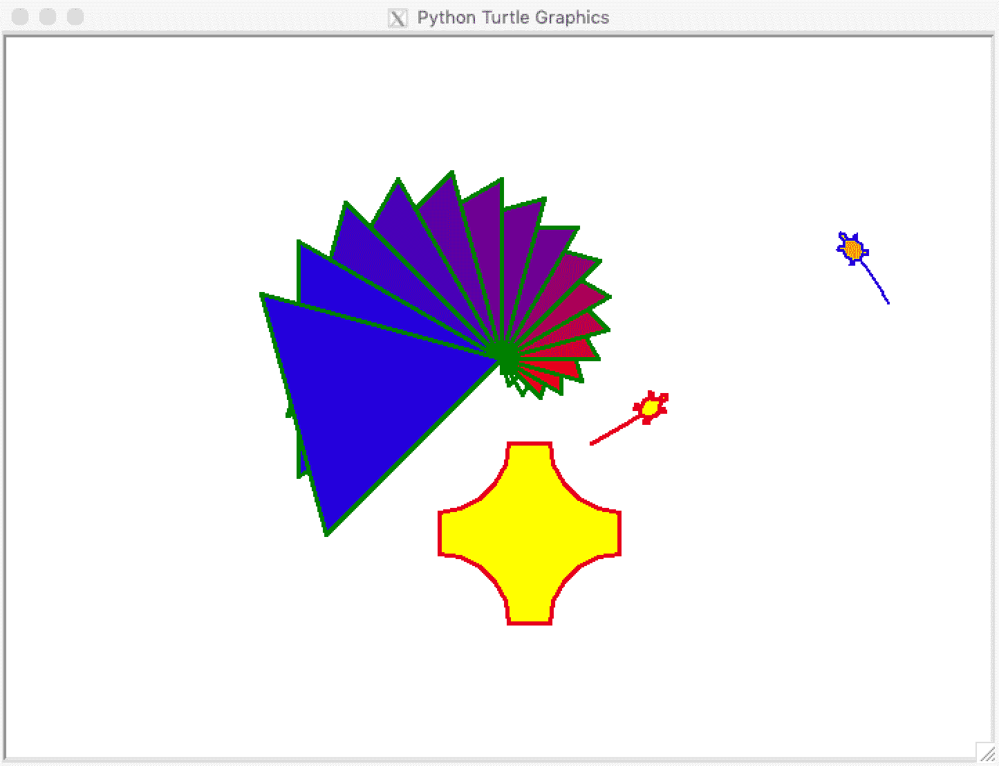

现在我们已经看到了 turtle 图形模块能做什么，让我们用它来构建一个实际的 GIS！

# 构建简单的 SimpleGIS

代码分为两个不同的部分：

+   数据模型部分

+   绘制数据的地图渲染器

对于数据模型，我们将使用简单的 Python 列表。Python 列表是一种原生数据类型，它作为其他 Python 对象的容器，并按照指定顺序排列。Python 列表可以包含其他列表，非常适合简单的数据结构。如果决定进一步开发脚本，它们也很好地映射到更复杂的结构或甚至数据库。

代码的第二部分将使用 Python turtle 图形引擎来渲染地图。在 GIS 中，我们将只有一个函数，它将世界坐标——在本例中，经度和纬度——转换为像素坐标。所有图形引擎都有一个原点 **(0,0)**，通常位于画布的右上角或左下角。

Turtle 图形设计用于通过视觉方式教授编程。turtle 图形画布使用中心的原点 **(0,0)**，类似于图形计算器。以下图表说明了 `turtle` 模块使用的类型为笛卡尔图的类型。一些点在正负空间中都被绘制：

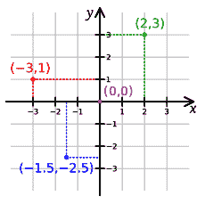

这也意味着 turtle 图形引擎可以具有负像素坐标，这在图形画布中是不常见的。然而，对于这个例子，`turtle` 模块是渲染我们地图最快、最简单的方法。

# 设置数据模型

您可以在 Python 解释器中交互式地运行此程序，或者将完整的程序保存为脚本并运行。Python 解释器是一种非常强大的学习新概念的方法，因为它会实时提供错误或意外程序行为的反馈。您可以轻松地从这些问题中恢复，并尝试其他方法，直到得到您想要的结果：

1.  在 Python 中，您通常在脚本的开头导入模块，因此我们将首先导入 `turtle` 模块。我们将使用 Python 的 `import` 功能将模块命名为 `t`，以节省在输入 `turtle` 命令时的空间和时间：

```py
import turtle as t
```

1.  接下来，我们将设置数据模型，从一些简单的变量开始，这些变量允许我们通过名称而不是数字来访问列表索引，从而使代码更容易理解。Python 列表从数字 `0` 开始索引包含的对象。因此，如果我们想访问名为 `myList` 的列表中的第一个项目，我们将如下引用它：

```py
myList[0]
```

1.  为了使我们的代码更容易阅读，我们还可以使用分配给常用索引的变量名：

```py
firstItem = 0
myList[firstItem]
```

在计算机科学中，将常用数字分配给易于记忆的变量是一种常见做法。这些变量被称为常量。因此，对于我们的例子，我们将为所有城市使用的某些常用元素分配常量。所有城市都将有一个名称、一个或多个点和人口计数：

```py
NAME = 0
POINTS = 1
POP = 2
```

1.  现在，我们将设置科罗拉多州的数据，作为一个包含名称、多边形点和人口列表。请注意，坐标是一个列表内的列表：

```py
state = ["COLORADO", [[-109, 37],[-109, 41],[-102, 41],[-102, 37]], 5187582]
```

1.  城市将被存储为嵌套列表。每个城市的地理位置由一个经纬度对的单一点组成。这些条目将完成我们的 GIS 数据模型。我们将从一个名为 `cities` 的空列表开始，然后为每个城市将数据追加到这个列表中：

```py
cities = []
cities.append(["DENVER",[-104.98, 39.74], 634265])
cities.append(["BOULDER",[-105.27, 40.02], 98889])
cities.append(["DURANGO",[-107.88,37.28], 17069])
```

1.  现在，我们将通过首先定义地图大小来将我们的 GIS 数据渲染为地图。宽度和高度可以是您想要的任何值，取决于您的屏幕分辨率：

```py
map_width = 400
map_height = 300
```

1.  为了将地图缩放到图形画布，我们首先必须确定最大层（即状态）的边界框。我们将地图的边界框设置为全局比例，并将其缩小到状态的大小。为此，我们将遍历每个点的经度和纬度，并将其与当前的当前最小和最大*x*和*y*值进行比较。如果它大于当前最大值或小于当前最小值，我们将此值分别设置为新的最大值或最小值：

```py
minx = 180
maxx = -180
miny = 90
maxy = -90
forx,y in state[POINTS]:
if x < minx: 
    minx = x
elif x > maxx: 
    maxx = x
if y < miny: 
    miny = y
elif y > maxy: 
    maxy = y
```

1.  在缩放方面，第二步是计算实际状态和我们将要渲染的微小画布之间的比例。这个比例用于坐标到像素的转换。我们得到状态沿*x*和*y*轴的大小，然后我们将地图的宽度和高度除以这些数字以获得缩放比例：

```py
dist_x = maxx - minx
dist_y = maxy - miny
x_ratio = map_width / dist_x
y_ratio = map_height / dist_y
```

1.  以下名为`convert()`的函数是`SimpleGIS`中的唯一函数。它使用之前的计算将地图坐标中的一个点从我们的数据层转换成像素坐标。你会注意到，最后，我们将地图的宽度和高度各除以一半，并从最终的转换中减去，以考虑到海龟图形画布不寻常的中心原点。每个地理空间程序都有这种函数的形式：

```py
def convert(point):
 lon = point[0]
 lat = point[1]
 x = map_width - ((maxx - lon) * x_ratio)
 y = map_height - ((maxy - lat) * y_ratio)
 # Python turtle graphics start in the
 # middle of the screen
 # so we must offset the points so they are centered
 x = x - (map_width/2)
 y = y - (map_height/2)
 return [x,y]
```

现在到了最激动人心的部分！我们准备好将我们的 GIS 渲染成专题地图。

# 渲染地图

`turtle`模块使用称为**笔**的光标概念。在画布上移动光标就像在一张纸上移动笔一样。当你移动光标时，光标会画线。你会注意到，在整个代码中，我们使用`t.up()`和`t.down()`命令在想要移动到新位置时抬起笔，在准备好绘图时放下笔。在这一节中，我们有几个重要的步骤要遵循，所以让我们开始吧：

1.  由于科罗拉多州的边界是一个多边形，我们必须在最后一个点和第一个点之间画线以闭合多边形。我们也可以省略闭合步骤，只需将一个重复的点添加到科罗拉多州数据集中。一旦我们画出了州，我们将使用`write()`方法来标注多边形：

```py
t.up()
first_pixel = None
for point in state[POINTS]:
 pixel = convert(point)
 if not first_pixel:
 first_pixel = pixel
 t.goto(pixel)
 t.down()
t.goto(first_pixel)
t.up()
t.goto([0,0])
t.write(state[NAME], align="center", font=("Arial",16,"bold"))
```

1.  如果我们现在运行代码，我们会看到一个简化的科罗拉多州地图，如下面的截图所示：

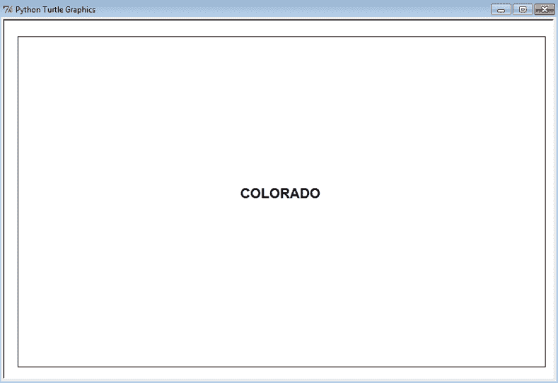

如果你尝试运行代码，你需要在最后临时添加以下行，否则 Tkinter 窗口将在绘图完成后立即关闭：`t.done()`。

1.  现在，我们将城市渲染为点位置，并用它们的名称和人口数进行标注。由于城市是一系列列表中的特征，我们将遍历它们以进行渲染。我们不会通过移动笔来绘制线条，而是使用海龟的 `dot()` 方法在由我们的 `SimpleGISconvert()` 函数返回的像素坐标处绘制一个小圆圈。然后，我们将用城市的名称标注这个点，并添加人口数。你会注意到，我们必须将人口数转换为字符串才能在海龟的 `write()` 方法中使用它。为此，我们将使用 Python 的内置 `str()` 函数：

```py
 for city in cities:
 pixel = convert(city[POINTS])
 t.up()
 t.goto(pixel)
 # Place a point for the city
 t.dot(10)
 # Label the city
 t.write(city[NAME] + ", Pop.: " + str(city[POP]), 
      align="left")
 t.up()
```

1.  现在，我们将执行最后一个操作来证明我们已经创建了一个真正的 GIS。我们将对我们的数据进行属性查询，以确定哪个城市的人口最多。然后，我们将执行空间查询，看看哪个城市位于最西边。最后，我们将安全地将我们的问题的答案打印在我们的专题地图页面上，超出地图的范围。

1.  对于我们的查询引擎，我们将使用 Python 的内置 `min()` 和 `max()` 函数。这些函数接受一个列表作为参数，并返回该列表的最小和最大值。这些函数有一个特殊功能，称为键参数，允许你排序复杂对象。由于我们在数据模型中处理嵌套列表，我们将利用这些函数中的键参数。键参数接受一个函数，该函数在返回最终值之前暂时改变列表的评估。在这种情况下，我们想要隔离用于比较的人口值，然后是点。我们可以编写一个全新的函数来返回指定的值，但我们可以使用 Python 的 lambda 关键字。lambda 关键字定义了一个匿名函数，它用于内联。其他 Python 函数也可以内联使用，例如字符串函数 `str()`，但它们不是匿名的。这个临时函数将隔离我们感兴趣的价值。

1.  因此，我们的第一个问题是，*哪个城市的人口最多？*

```py
biggest_city = max(cities, key=lambda city:city[POP])
t.goto(0,-200)
t.write("The biggest city is: " + biggest_city[NAME])
```

1.  下一个问题，*哪个城市位于最西边？*

```py
western_city = min(cities, key=lambda city:city[POINTS])
t.goto(0,-220)
t.write("The western-most city is: " + western_city[NAME])
```

1.  在前面的查询中，我们使用 Python 的内置 `min()` 函数来选择最小的经度值。这是因为我们用经度和纬度对表示了我们的城市位置。使用不同的点表示方法是可能的，包括可能需要修改此代码才能正确工作的表示方法。然而，对于我们的 `SimpleGIS`，我们使用了一种常见的点表示方法，使其尽可能直观。

1.  这最后两个命令只是为了清理。首先，我们隐藏光标。然后，我们调用海龟的 `done()` 方法，这将保持带有我们地图的海龟图形窗口打开，直到我们选择使用窗口顶部的关闭句柄来关闭它：

```py
t.pen(shown=False)
t.done()
```

1.  无论你是使用 Python 解释器跟随操作，还是作为脚本运行整个程序，你应该看到以下地图被实时渲染：

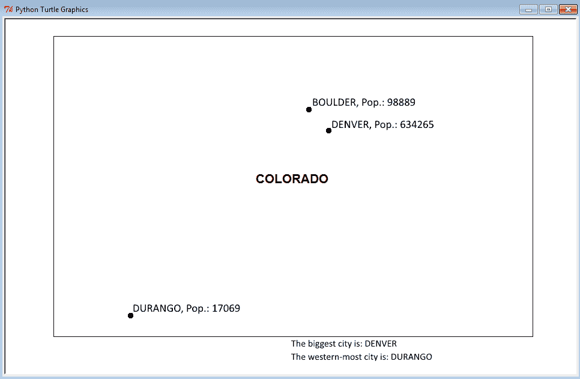

恭喜！你已经追随了史前猎人的脚步，GIS 之父罗杰·汤姆林森博士，地理空间先驱霍华德·费舍尔，以及改变游戏规则的程序员，共同创建了一个功能强大、可扩展且技术完善的地理信息系统。

不到 60 行纯 Python 代码就能实现！你很难找到一种编程语言，仅使用其核心库就能在如此有限的可读代码量中创建一个完整的 GIS，就像 Python 一样。即使你能做到，这种语言在接下来的这本书中你将经历的地理空间 Python 之旅中存活下来的可能性也非常低。

正如你所见，在`SimpleGIS`方面有大量的扩展空间。以下是一些你可能使用本节开头链接的 Tkinter 和 Python 参考材料来扩展这个简单工具的其他方法：

+   在右上角创建一个包含美国边界轮廓和科罗拉多州在美国位置的概览地图

+   添加颜色以增强视觉效果和清晰度

+   为不同的特征创建地图图例

+   列出州和城市，并添加更多州和城市

+   为地图添加标题

+   创建一个条形图来直观比较人口数量

可能性是无限的。`SimpleGIS`也可以用作快速测试和可视化你所遇到的地理空间算法的方式。如果你想添加更多数据层，你可以创建更多列表，但这些列表将变得难以管理。在这种情况下，你可以使用另一个包含在标准分布中的 Python 模块。SQLite 模块在 Python 中提供了一个类似 SQL 的数据库，可以保存到磁盘或运行在内存中。

# 摘要

干得好！你现在是一名地理空间分析师。在本章中，你了解了地理空间分析的历史及其支持的技术。你看到了莎拉·帕卡克博士的研究如何对历史产生了重大影响。你还熟悉了本书余下部分将为你服务的 GIS 和遥感基础概念。最后，你运用所有这些知识构建了一个可以扩展以实现你所能想象的一切的工作 GIS！

在下一章中，我们将探讨作为地理空间分析师你将遇到的数据格式。地理空间分析师在处理数据上花费的时间远多于实际的分析。理解你所处理的数据对于高效工作和享受乐趣至关重要。

# 进一步阅读

这里是一份你可能需要参考的参考文献列表：

+   如果你的 Python 发行版没有 Tkinter，你可以从以下页面找到安装信息：[`tkdocs.com/tutorial/install.html`](https://tkdocs.com/tutorial/install.html)

+   可以在这里找到 Tkinter 的官方 Python 维基页面：[`wiki.python.org/moin/TkInter`](https://wiki.python.org/moin/TkInter)。

+   Tkinter 的文档位于 Python 标准库文档中，可以在 [`docs.python.org/2/library/tkinter.html`](https://docs.python.org/2/library/tkinter.html) 找到。

+   如果你刚接触 Python，由 Mark Pilgrim 编写、由 Apress 出版的《*Dive into Python*》是一本免费的在线书籍，涵盖了 Python 的所有基础知识，并能帮助你快速入门。更多信息，请参阅 [`www.diveintopy`](http://www.diveintopython.net)[thon.net](http://www.diveintopython.net)[.](http://www.diveintopython.net)
