# 第三章：地理空间技术景观

地理空间技术生态系统由数百个软件库和包组成。对于地理空间分析的新手来说，如此众多的选择可能会令人感到不知所措。快速学习地理空间分析的秘诀在于理解那些真正重要的少数库和包。大多数软件，无论是商业的还是开源的，都是从这些关键包派生出来的。了解地理空间软件生态系统及其使用方法，可以帮助你快速理解和评估任何地理空间工具。

地理空间库可以被分配到以下一个或多个高级核心能力中，它们以某种程度实现这些能力。在本章中，我们将学习这些能力：

+   数据访问

+   计算几何（包括数据重投影）

+   图像处理

+   可视化工具

+   元数据工具

在本章中，我们将探讨对地理空间分析影响最大的软件包，以及你可能会经常遇到的软件包。然而，与任何信息过滤一样，我们鼓励你进行自己的研究并得出自己的结论。

以下网站提供了本章未包含的软件的更多信息：

+   维基百科 GIS 软件列表：[`en.wikipedia.org/wiki/List_of_geographic_information_systems_software`](https://en.wikipedia.org/wiki/List_of_geographic_information_systems_software)

+   OSGeo 项目列表和孵化器项目：[`www.osgeo.org`](http://www.osgeo.org/)

图像处理软件能力用于遥感。然而，这类软件非常碎片化，包含数十个软件包，很少被集成到派生软件中。大多数遥感图像处理软件基于相同的数据访问库，并在其之上实现了定制的图像处理算法。

查看以下这些类型软件的示例，包括开源和商业软件包：

+   **开源软件图像地图**（**OSSIM**）

+   **地理资源分析支持系统**（**GRASS**）

+   **Orfeo 工具箱**（**OTB**）

+   **ERDAS IMAGINE**

+   **ENVI**

# 技术要求

以下是该章节的技术要求列表：

+   Python 3.6 或更高版本

+   RAM：最低 6 GB（Windows），8 GB（macOS）；推荐 8 GB

+   存储：最低 7200 RPM SATA，可用空间 20 GB；推荐 SSD，可用空间 40 GB

+   处理器：最低要求 Intel Core i3 2.5 GHz；推荐 Intel Core i5

# 理解数据访问

如第二章中所述，*学习地理空间数据*，地理空间数据集通常是大型、复杂且多样化的。这一挑战使得能够高效读取（在某些情况下写入）这些数据的库变得对地理空间分析至关重要。没有数据访问，地理空间分析无法开始。

此外，准确性和精度是地理空间分析中的关键因素。未经许可重新采样数据的图像库，或者四舍五入坐标甚至只有几个小数的计算几何库，都可能对分析质量产生不利影响。此外，这些库必须高效地管理内存。复杂的地理空间过程可能持续数小时，甚至数天。

如果数据访问库存在内存故障，它可能会延迟整个项目，甚至整个工作流程，涉及数十人，他们依赖于该分析的结果。

数据访问库，如**地理空间数据抽象库**（**GDAL**），主要是为了速度和跨平台兼容性而用 C 或 C++编写的。由于地理空间数据集通常很大，速度很重要。然而，你也会看到许多用 Java 编写的包。当编写得很好时，纯 Java 可以接近处理大型矢量或栅格数据集的可接受速度，这对于大多数应用通常是可接受的。

下面的概念图显示了主要的地理空间软件库和包以及它们之间的关系。粗体的库代表积极维护的根库，并且没有显著地源自其他库。这些根库代表地理空间操作，这些操作相当难以实现，绝大多数人选择使用这些库之一，而不是创建一个竞争者。正如你所看到的，少数库构成了不成比例的地理空间分析软件。下面的图表远非详尽无遗。在这本书中，我们将只讨论最常用的包：

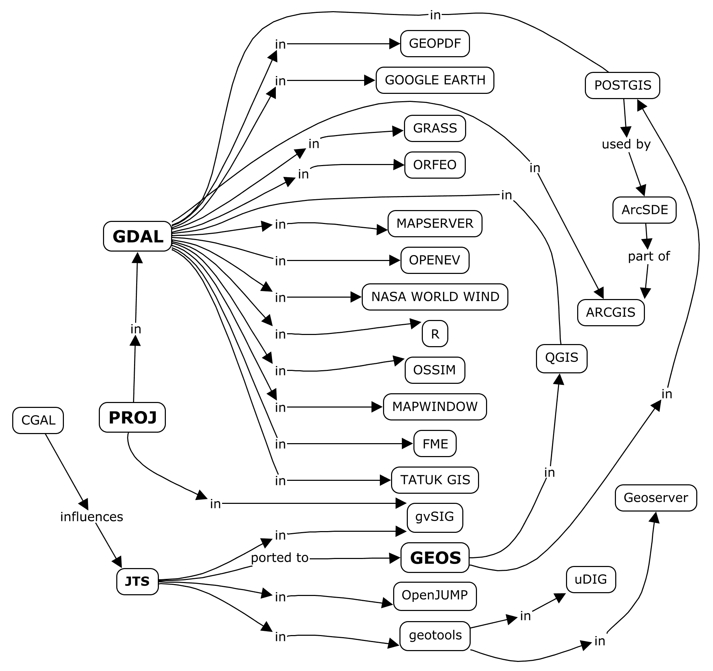

**GDAL**、**GEOS**（代表**Geometry Engine - Open Source**）和**PROJ**库是商业和开源两方面的地理空间分析社区的灵魂。重要的是要注意，这些库都是用 C 或 C++编写的。还有大量的工作是用 Java 完成的，形式是**GeoTools**和**Java Topology Suite**（**JTS**）核心库，这些库被广泛应用于桌面、服务器和移动软件。鉴于有数百个地理空间包可用，几乎所有这些包都依赖于这些库来完成任何有意义的工作，你将开始了解地理空间数据访问和计算几何的复杂性。将这个软件领域与文本编辑器进行比较，在开源项目网站上搜索时，会返回超过 5,000 个选项（[`sourceforge.net/`](http://sourceforge.net/))。

地理空间分析是一个真正的全球社区，该领域的重要贡献来自全球的每一个角落。但是，当你更多地了解软件景观中心的重量级包时，你会发现这些程序往往来自加拿大，或者是由加拿大开发者大量贡献的。

被誉为现代 GIS 的摇篮，地理空间分析是国家自豪的事情。此外，加拿大政府和公私合营的 GeoConnections 项目在研究和公司方面投入了大量资金，既是为了经济原因推动行业发展，也是出于必要性——更好地管理国家丰富的自然资源和满足人口需求。

# GDAL

GDAL 在地理空间行业中承担了最繁重的任务。GDAL 网站列出了超过 80 个使用该库的软件，而这个列表远非完整。其中许多包是行业领先的开源和商业工具。这个列表不包括数百个较小的项目和独立分析师，他们正在使用该库进行地理空间分析。GDAL 还包括一组命令行工具，可以在不进行任何编程的情况下执行各种操作。

可以在以下 URL 找到使用 GDAL 的项目列表：[`trac.osgeo.org/gdal/wiki/SoftwareUsingGdal`](http://trac.osgeo.org/gdal/wiki/SoftwareUsingGdal)。

# GDAL 和栅格数据

GDAL 为地理空间行业中发现的众多栅格数据类型提供了一个单一、抽象的数据模型。它整合了不同格式的独特数据访问库，并为读取和写入数据提供了一个共同的 API。在开发者 Frank Warmerdam 在 20 世纪 90 年代末创建 GDAL 之前，每种数据格式都需要一个不同的数据访问库和 API 来读取数据，或者在最坏的情况下，开发者经常编写自定义数据访问例程。

以下图表提供了 GDAL 如何抽象栅格数据的视觉描述：

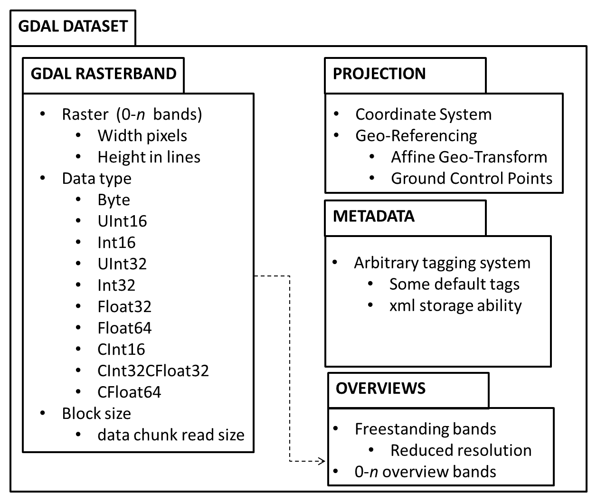

在先前的软件概念图中，你可以看到 GDAL 对任何单一地理空间软件的影响最大。将 GDAL 与其姐妹库 OGR 结合，用于矢量数据，其影响几乎翻倍。PROJ 库也产生了巨大的影响，但它通常是通过 OGR 或 GDAL 访问的。

GDAL 的主页可以在[`www.gdal.org/`](http://www.gdal.org/)找到。

# GDAL 和矢量数据

除了栅格数据外，GDAL 列出了至少对 70 多种矢量数据格式的部分支持。GDAL 包成功的一部分是其 X11/MIT 开源许可证。这个许可证既适合商业也适合开源友好。GDAL 库可以包含在专有软件中，而无需向用户透露专有源代码。

GDAL 具有以下矢量功能：

+   统一的矢量数据和建模抽象

+   矢量数据重投影

+   矢量数据格式转换

+   属性数据过滤

+   基本几何过滤，包括裁剪和点在多边形内测试

GDAL 有几个命令行实用程序，展示了其在向量化数据方面的能力。这种能力也可以通过其编程 API 访问。以下图概述了 GDAL 向量化架构：

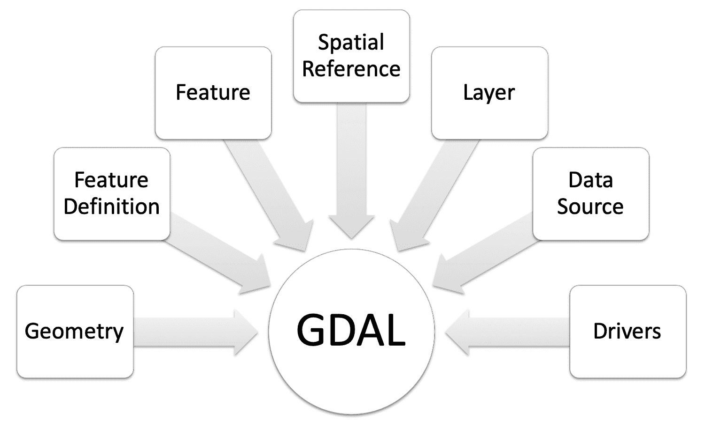

考虑到该模型能够表示 70 多种不同的数据格式，GDAL 的向量化架构相当简洁：

+   **几何形状**: 此对象代表**开放地理空间联盟**（**OGC**）简单特征规范的数据模型，包括点、线字符串、多边形、几何集合、多边形、多点和多线字符串。

+   **要素定义**: 此对象包含一组相关要素的属性定义。

+   **要素**: 此对象将**几何形状**和**要素定义**信息联系起来。

+   **空间参考**: 此对象包含 OGC 空间参考定义。

+   **图层**: 此对象代表在数据源中按图层分组的功能。

+   **数据源**: 此对象是 GDAL 访问的文件或数据库对象。

+   **驱动器**: 此对象包含 GDAL 可用的 70 多种数据格式的转换器。

这种架构运行顺畅，只有一个小的瑕疵——即使对于只包含单个图层的格式，也使用了图层概念。例如，Shapefiles 只能表示单个图层。但是，当你使用 GDAL 访问 Shapefile 时，你仍然必须使用不带文件扩展名的 Shapefile 的基本名称调用一个新的图层对象。这个设计特性只是一个小的不便，但 GDAL 提供的强大功能远远超过了这一点。

现在，让我们超越访问数据，转向使用它进行分析。

# 理解计算几何

计算几何包括执行向量化数据操作所需的算法。该领域在计算机科学中非常古老；然而，由于地理空间坐标系，用于地理空间操作的库大多与计算机图形库分开。如第一章结尾所述，*使用 Python 学习地理空间分析*，计算机屏幕坐标几乎总是用正数表示，而地理空间坐标系在向西和向南移动时通常使用负数。

几种不同的地理空间库属于这一类别，但它们也服务于广泛的用途，从空间选择到渲染。需要注意的是，GDAL 之前描述的一些功能使其超越了数据访问的范畴，进入了计算几何领域。但是，它被包含在前者类别中，因为那是其主要目的。

计算几何是一个迷人的主题。当编写一个简单的脚本来自动化地理空间操作时，你不可避免地需要空间算法。那么问题就来了，*你是尝试自己实现这个算法，还是通过使用第三方库来承担额外的开销？* 这个选择总是具有欺骗性，因为有些任务看起来容易理解和实现，有些看起来复杂但实际上很容易，还有些是容易理解的，但实现起来却异常困难。一个这样的例子就是地理空间缓冲区操作。

概念本身足够简单，但算法实际上相当困难。本节中以下库是用于计算几何算法的主要软件包。

# PROJ 投影库

**美国地质调查局**（**USGS**）分析师 Jerry Evenden 在 1990 年代中期在美国地质调查局工作时创建了现在所知的 PROJ 投影库。从那时起，它已成为 **开源地理空间基金会**（**OSGeo**）的项目，许多其他开发者也做出了贡献。PROJ 完成了在数千个坐标系之间转换数据的艰巨任务。在这么多坐标系之间转换点所需的数学非常复杂。没有其他库能接近 PROJ 的能力。这一事实以及应用程序需要执行的将来自不同来源的数据集转换为通用投影的常规操作，使 PROJ 在这个领域成为无可争议的领导者。

下面的图表是 PROJ 支持的投影可以多么具体的例子。此图表来自 [`calcofi.org`](https://calcofi.org)，代表 **加利福尼亚合作海洋渔业调查**（**CalCOFI**）项目的伪投影，该投影仅由 **NOAA**（即 **国家海洋和大气管理局**）、加州大学圣克鲁兹分校海洋学研究所和加利福尼亚州鱼类和野生动物部门在过去 60 年中沿加利福尼亚海岸收集海洋学和渔业数据时使用：

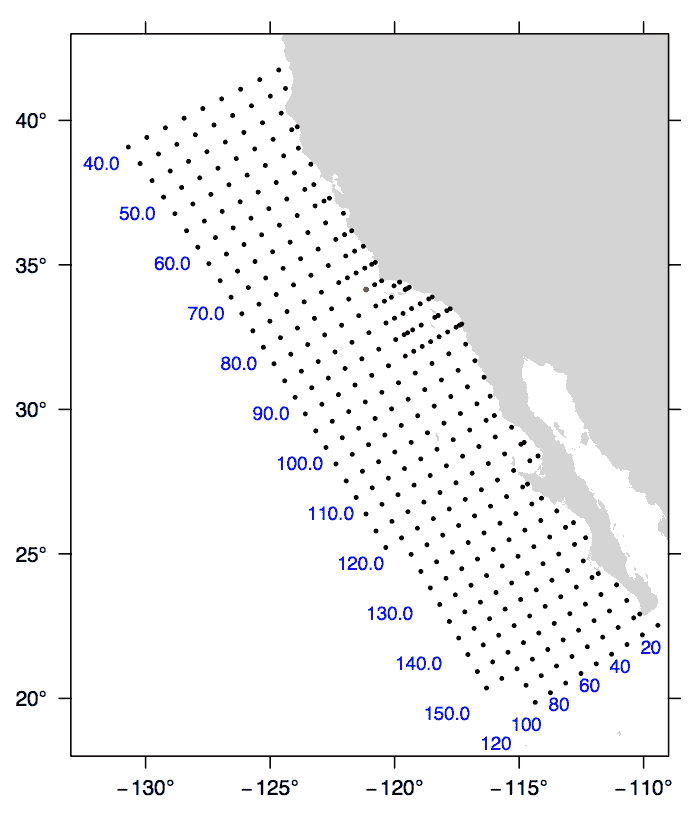

PROJ 使用一种简单的语法，能够描述任何投影，包括自定义的本地化投影，如前一个图表所示。PROJ 几乎可以在每个主要的 GIS 软件包中找到，提供重投影支持，并且它还有自己的命令行工具。

它可以通过 GDAL 提供矢量数据和栅格数据。然而，直接访问库通常很有用，因为它让您能够重新投影单个点。大多数包含 PROJ 的库只允许您重新投影整个数据集。

想了解更多关于 PROJ 的信息，请访问 [`proj4.org`](https://proj4.org).

# CGAL

**计算几何算法库**（**CGAL**）最初于 20 世纪 90 年代末发布，是一个强大且成熟的开源计算几何库。它并非专门为地理空间分析设计，但在该领域被广泛使用。

CGAL 经常被引用为可靠几何处理算法的来源。以下来自*CGAL 用户和参考手册*的图示，提供了一种 CGAL 中经常引用的算法的可视化，称为多边形直线骨架，这是准确放大或缩小多边形所需的：

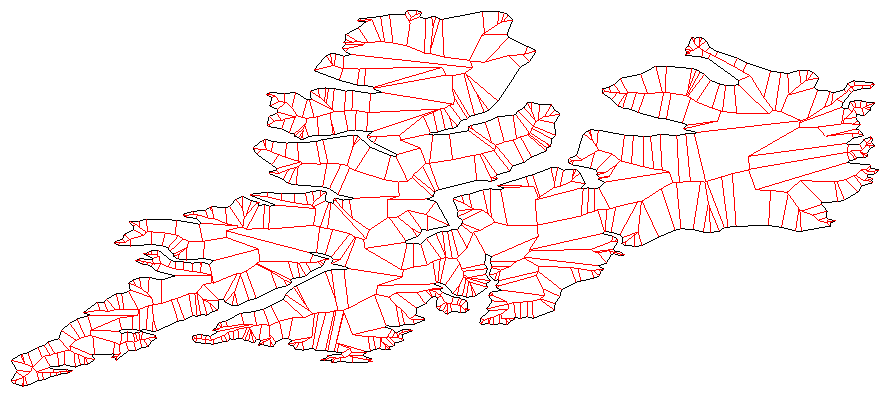

直线骨架算法复杂且重要，因为缩放或放大多边形不仅仅是使其变大或变小的问题。多边形实际上会改变形状。当多边形缩小时，非相邻边会碰撞并消除连接边。当多边形放大时，相邻边会分离，并形成新边来连接它们。这个过程是地理空间多边形缓冲的关键。以下来自*CGAL 用户和参考手册*的图示，通过在先前多边形上的内嵌展示了这一效果：

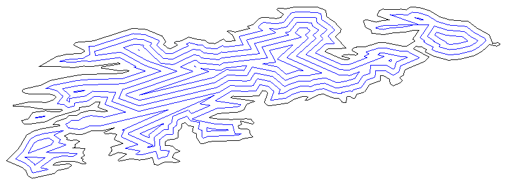

CGAL 可在[`www.cgal.org/`](http://www.cgal.org/)在线找到。

# JTS

JTS 是一个 100%纯 Java 编写的地理空间计算几何库。JTS 通过实现 OGC 简单特征规范为 SQL 来将自己与其他计算几何库区分开来。有趣的是，其他开发人员已经将 JTS 移植到其他语言，包括 C++、Microsoft .NET，甚至 JavaScript。

JTS 包含一个名为 JTS TestBuilder 的出色测试程序，它提供了一个 GUI 来测试功能，而无需设置整个程序。地理空间分析中最令人沮丧的方面之一是奇怪的几何形状，这些形状会破坏大多数情况下都能正常工作的算法。另一个常见问题是由于数据中的微小错误（如多边形在非常小的、不易察觉的区域相交）而导致的意外结果。JTS TestBuilder 允许您交互式地测试 JTS 算法以验证数据，或者只是直观地理解一个过程，如下所示：

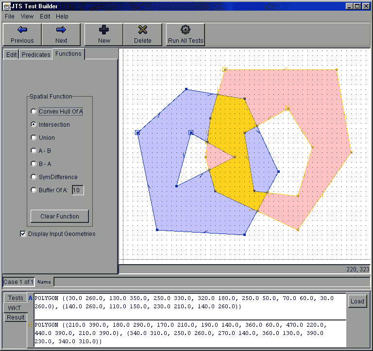

这个工具即使不使用 JTS，也可以在其他几种语言端口中使用，非常方便。需要注意的是，JTS 的维护者 Vivid Solutions 自 2006 年 12 月 JTS 版本 1.8 以来就没有发布过新版本。这个包非常稳定，仍在积极使用中。

JTS 的主页可在[`locationtech.github.io/jts.`](https://locationtech.github.io/jts/)找到。

# GEOS

GEOS 是之前解释过的 JTS 库的 C++ 版本。这里提到它是因为这个版本对地理空间分析的影响比原始的 JTS 大得多。C++ 版本可以在许多平台上编译，因为它避免了任何平台特定的依赖。GEOS 流行的一个因素是，存在大量基础设施来创建到各种脚本语言的自动化或半自动化绑定，包括 Python。另一个因素是，大多数地理空间分析软件是用 C 或 C++ 编写的。GEOS 最常见的用途是通过包含 GEOS 作为库的其他 API。

GEOS 提供以下功能：

+   OGC 简单特征

+   地理空间谓词函数

+   相交

+   相触

+   不相交

+   相交

+   在内

+   包含

+   拥有

+   等于

+   覆盖

+   地理空间操作

+   并集

+   距离

+   交集

+   对称差

+   凸包

+   边界

+   缓冲区

+   简化

+   多边形组装

+   多边形验证

+   面积

+   长度

+   空间索引

+   OGC **已知文本**（**WKT**）和**已知二进制**（**WKB**）输入/输出

+   C 和 C++ API

+   线程安全

GEOS 可以与 GDAL 一起编译以使用其所有功能。

GEOS 可以在 [`trac.osgeo.org/geos`](https://trac.osgeo.org/geos) 上找到。

# PostGIS

在开源地理空间数据库中，PostGIS 是最常用的空间数据库。PostGIS 实际上是在知名的 PostgreSQL 关系数据库之上的一个模块。PostGIS 的许多功能都来自于之前提到的 GEOS 库。像 JTS 一样，它也实现了 OGC 简单特征规范。这种在地理空间环境中的计算几何能力使 PostGIS 处于一个独特的类别。

PostGIS 允许你对数据集执行属性和空间查询。回想一下第二章中的内容，“学习地理空间数据”，一个典型的空间数据集由多种数据类型组成，包括几何、属性（一行中的一列或多列数据）以及在大多数情况下，索引数据。在 PostGIS 中，你可以像查询任何数据库表一样使用 SQL 查询属性数据。

这种能力并不令人惊讶，因为属性数据存储在传统的数据库结构中。然而，你也可以使用 SQL 语法查询几何数据。空间操作通过 SQL 函数提供，这些函数是你查询的一部分。以下示例 PostGIS SQL 语句在佛罗里达州周围创建了一个 14.5 公里的缓冲区：

```py
SELECT ST_Buffer(the_geom, 14500) 
FROM usa_states 
WHERE state = 'Florida' 
```

`FROM`子句指定`usa_states`图层为查询的位置。我们在`WHERE`子句中隔离`Florida`，以过滤该图层。`Florida`是`usa_states`图层`state`列中的一个值。`SELECT`子句通过使用 PostGIS 的`ST_Buffer()`函数对`Florida`的几何形状进行实际的空间选择，该几何形状通常包含在`the_geom`列中。`the_geom`列是本例中 PostGIS 图层的几何列。函数名称中的`ST`缩写代表**空间类型**。`ST_Buffer()`函数接受包含空间几何形状的列和底层图层的地图单位距离。

`usa_states`图层中的地图单位以米为单位，因此在先前的例子中，14.5 公里将是 14,500 米。回想一下第一章 1，“使用 Python 学习地理空间分析”，其中像这样的缓冲区查询用于邻近度分析。碰巧的是，佛罗里达州的水域边界从州的西部和西北海岸线向外扩展了 9 海里，或大约 14.5 公里进入墨西哥湾。

下图显示了佛罗里达州官方水域边界作为虚线，并在地图上标注：

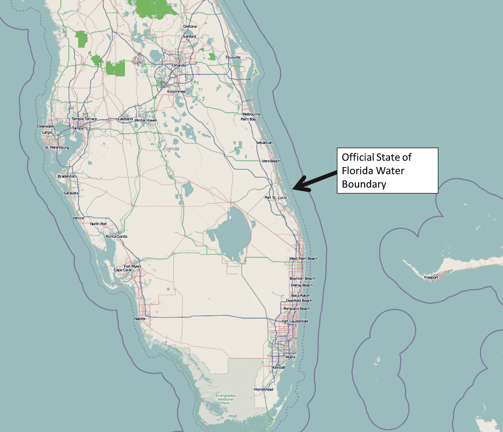

应用 9 海里缓冲区后，您可以在下图中看到，橙色突出显示的结果与官方法律边界非常接近，该边界基于详细的地面调查：

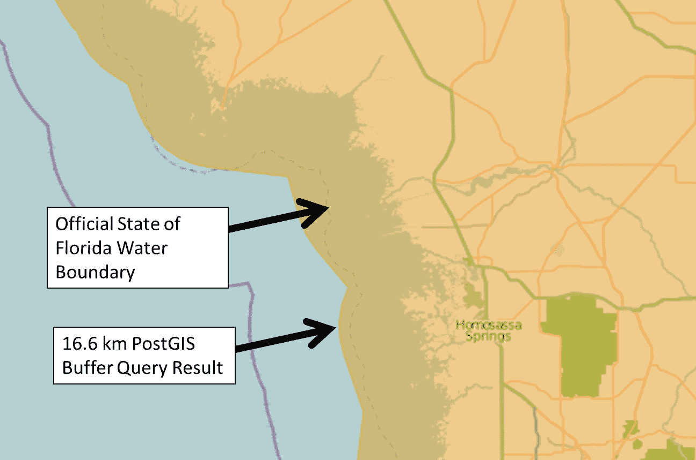

目前，PostGIS 维护以下功能集：

+   地理空间几何类型，包括点、线字符串、多边形、多点、多线字符串、多边形集合和几何集合，可以存储不同类型的几何形状，包括用于测试几何关系的其他空间函数集合（例如，点在多边形内或并集）

+   用于派生新几何形状的空间函数（例如，缓冲区和交集）

+   包括周长、长度和面积在内的空间测量

+   使用 R 树算法的空间索引

+   基本地理空间栅格数据类型

+   拓扑数据类型

+   基于**TIGER**（即**拓扑集成地理编码和参照**）人口普查数据的美国地理编码器（**TIGER**是**Topologically Integrated Geographic Encoding and Referencing**的缩写）

+   一种新的 JSONB 数据类型，允许对 JSON 和 GeoJSON 进行索引和查询

PostGIS 功能集在所有地理数据库中都具有竞争力，在开源或免费地理数据库中是最广泛的。PostGIS 开发社区的活跃动力也是这个系统成为最佳选择的原因之一。PostGIS 维护在[`postgis.net`](http://postgis.net)。

# 其他支持空间功能的数据库

PostGIS 是免费和开源地理空间数据库中的黄金标准。然而，作为地理空间分析师，您应该了解几个其他系统。此列表包括商业和开源系统，每个系统都有不同程度的地理空间支持。

地理数据库与地理空间软件、标准和互联网的发展是平行的。互联网推动了需要大型、多用户地理空间数据库服务器，这些服务器能够服务大量数据。以下由 [www.OSGeo.org](https://www.osgeo.org/) 提供的图表显示了地理空间架构是如何演变的，其中这一演变的大部分发生在数据库层面：

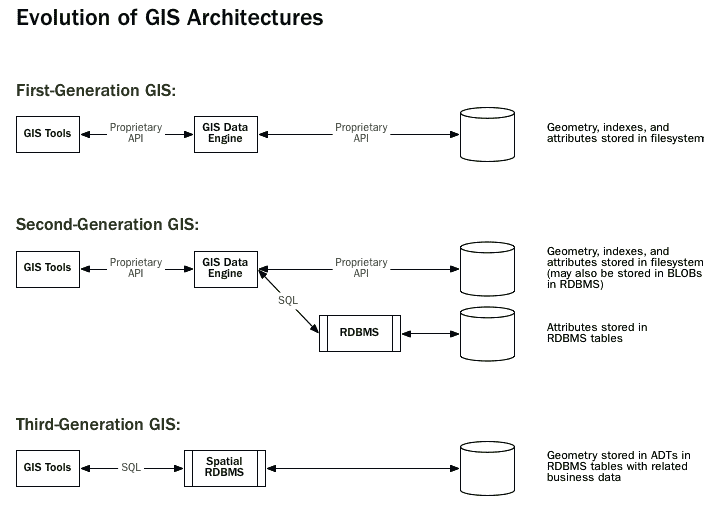

# Oracle Spatial and Graph

Oracle 关系数据库是一个广泛使用的数据库系统，通常由大型组织使用，因为其成本和大规模可扩展性。它也非常稳定和快速。它运行世界上一些最大和最复杂的数据库，通常在医院、银行和政府机构中找到，这些机构管理着数百万条关键记录。

地理空间数据功能首次出现在 Oracle 第 4 版中，这是加拿大水文服务（**CHS**）的一项修改。CHS 还实现了 Oracle 的第一个空间索引，形式为一种不寻常但高效的立体螺旋。Oracle 随后采用了这项修改，并在主数据库的第 7 版中发布了 Oracle **Spatial Database Option**（**SDO**）。SDO 系统在 Oracle 第 8 版中成为 Oracle Spatial。Oracle Spatial 的数据库模式在部分列和表名上仍然保留了 SDO 前缀，类似于 PostGIS 使用 OGC 规范，ST，在模式级别将空间信息与传统的关系数据库表和函数分开。

截至 2012 年，Oracle 开始将此软件包称为 Oracle Spatial and Graph，以强调网络数据模块。此模块用于分析网络化数据集，例如交通或公用事业。然而，该模块也可以用于抽象网络，例如社交网络。社交网络数据分析是大数据分析的一个常见目标，现在正成为一种增长趋势。大数据社交网络分析可能是 Oracle 更改产品名称的原因。

Oracle Spatial 具有以下功能：

+   一个地理空间数据模式

+   一个基于 R-tree 索引的空间索引系统

+   用于执行几何操作的 SQL API

+   一个用于优化特定数据集的空间数据调优 API

+   一个拓扑数据模型

+   一个网络数据模型

+   一个用于存储、索引、查询和检索栅格数据的 GeoRaster 数据类型

+   三维数据类型，包括**不规则三角网络**（**TINs**）和**激光雷达**（**LIDAR**，即**光探测与测距**）点云

+   一个用于搜索位置名称并返回坐标的地理编码器

+   一个用于驾驶方向查询的路由引擎

+   OGC 兼容性

Oracle Spatial 和 PostGIS 可以合理地比较，并且两者都普遍使用。您在执行地理空间分析时迟早会看到这两个系统作为数据源。

Oracle Spatial and Graph 是与 Oracle 本身分开销售的。一个鲜为人知的事实是，SDO 数据类型是 Oracle 主数据库的本地数据类型。如果您有一个简单的应用程序，只需输入点并检索它们，您可以使用主 Oracle API 来添加、更新和检索 SDO，而无需 Oracle Spatial and Graph。

美国能源、管理和监管局（**BOEMRE**）使用 Oracle 来管理数十亿美元的石油、天然气和矿产资源的环境、商业和地理空间数据，这是世界上最大的地理空间系统之一。以下地图由 BOEMRE 提供：

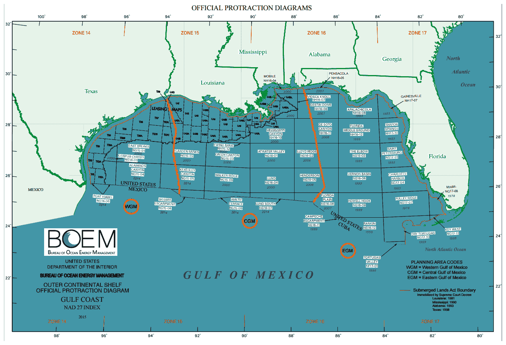

Oracle Spatial and Graph 可以在以下网址找到：[`www.oracle.com/us/products/database/options/spatial/overview`](http://www.oracle.com/us/products/database/options/spatial/overview).

# ArcSDE

ArcSDE 是 Esri 的 **空间数据引擎**（**SDE**）。在作为独立产品超过十年后，它现在已被整合到 Esri 的 ArcGIS Server 产品中。ArcSDE 的有趣之处在于，该引擎主要是数据库无关的，支持多个数据库后端。ArcSDE 支持 IBM DB2、Informix、Microsoft SQL Server、Oracle 和 PostgreSQL 作为数据存储系统。虽然 ArcSDE 有能力在 Microsoft SQL Server 和 Oracle 等系统上从头创建和管理空间模式，但如果可用，它将使用本机空间引擎。这种情况适用于 IBM DB2、Oracle 和 PostgreSQL。对于 Oracle，ArcSDE 管理表结构，但可以依赖 Oracle SDO 数据类型进行要素存储。

与之前提到的地理数据库一样，ArcSDE 也拥有丰富的空间选择 API，并且可以处理栅格数据。然而，ArcSDE 的 SQL 空间 API 没有 Oracle 和 PostGIS 那么丰富。Esri 技术上支持与 ArcSDE 相关的基本 SQL 功能，但它鼓励用户和开发人员使用 Esri 软件或编程 API 来操作通过 ArcSDE 存储的数据，因为它是为 Esri 软件作为数据源而设计的。

Esri 提供了软件库，允许开发者在使用 ArcSDE 或 Esri 的基于文件的地理数据库（称为个人地理数据库）的情况下，构建 Esri 软件之外的应用程序。但是，这些库是黑盒，ArcSDE 使用的通信协议从未被逆向工程。通常，ArcSDE 和第三方应用程序在 Web 服务级别通过 ArcGIS Server API（在一定程度上支持 OGC 服务）以及一个相当直接的 REST API 服务进行交互，该服务返回 GeoJSON。

以下截图来自美国联邦网站，[`catalog.data.gov`](http://catalog.data.gov)，这是一个基于 ArcSDE 的非常大的地理空间数据目录，它反过来又连接了美国联邦数据，包括来自其他联邦机构的其他 ArcSDE 安装。

ArcSDE 集成到 ArcGIS Server 中；然而，有关它的信息可以在 [`www.esri.com/software/arcgis/arcsde`](http://www.esri.com/software/arcgis/arcsde) 找到。

# Microsoft SQL Server

微软在 Microsoft SQL Server 2008 中为其旗舰数据库产品添加了空间数据支持。自那个版本以来，它已经逐渐改进，但仍然远远不如 Oracle Spatial 或 PostGIS 复杂。微软支持与 PostGIS 相同的数据类型，但使用略有不同的命名约定，除了栅格数据类型，它不支持直接支持。它还支持输出到 WKT 和 WKB 格式。

它提供了一些非常基本的地理空间选择支持，但显然目前对微软来说并不是优先事项。这种有限的支持可能是因为它仅适用于微软软件地图组件，并且有几个第三方引擎可以在 SQL Server 上提供空间支持。

微软对 SQL Server 中空间数据的支持在以下链接中有记录：[`msdn.microsoft.com/en-us/library/bb933790.aspx`](http://msdn.microsoft.com/en-us/library/bb933790.aspx)[.](http://msdn.microsoft.com/en-us/library/bb933790.aspx)

# MySQL

MySQL 是另一个非常流行的免费数据库，它提供的支持几乎与 Microsoft SQL Server 相同。OGC 几何类型由基本空间关系函数支持。通过一系列的收购，MySQL 已经成为 Oracle 的财产。

虽然 Oracle 目前仍然致力于将 MySQL 作为开源数据库，但这次收购引发了世界上最受欢迎的开源数据库最终未来的疑问。然而，就地理空间分析而言，MySQL 几乎没有竞争力，不太可能成为任何项目的首选。

有关 MySQL 空间支持的更多信息，请访问以下链接：[`dev.mysql.com/doc/refman/8.0/en/spatial-types.html`](https://dev.mysql.com/doc/refman/8.0/en/spatial-types.html)

# SpatiaLite

SpatiaLite 是开源 SQLite 数据库引擎的扩展。SQLite 使用文件数据库，旨在集成到应用程序中，而不是集成到大多数关系型数据库服务器使用的典型客户端-服务器模型中。SQLite 已经具有空间数据类型和空间索引，但 SpatiaLite 添加了对 OGC 简单特征规范的支持，以及地图投影。

应该注意的是，极其流行的 SQLite 与 Oracle、PostgreSQL 或 MySQL 不在同一类别中，因为它是一个基于文件的数据库，旨在为单用户应用程序设计。

SpatiaLite 可以在 [`www.gaia-gis.it/gaia-sins/`](http://www.gaia-gis.it/gaia-sins/) 找到。

# GeoPackage

GeoPackage 是一种基于文件的地理数据库格式。官方 GeoPackage 网站 [`geopackage.org`](http://geopackage.org) 将其描述为：

“一种开放、基于标准的、平台无关的、便携的、自我描述的、紧凑的格式，用于传输地理空间信息。”

它也是对 Esri 文件地理数据库格式的直接回应，也是对开放地理空间社区指定的**形状文件杀手**的回应，以取代过时的、部分封闭的形状文件格式。这两种格式实际上都是文件规范，依赖于其他软件来读取和写入数据。

GeoPackage 是一个 OGC 规范，这意味着它作为行业数据格式的未来是安全的。它也是一个**通用的**格式，可以处理矢量数据、栅格数据、属性信息以及用于满足新要求的扩展。而且，像任何好的数据库一样，它可以处理多个图层。您可以将整个 GIS 项目存储在一个单独的包中，因此使数据管理变得更加简单。

您可以在此处了解更多关于 Esri 文件地理数据库格式的信息：[`desktop.arcgis.com/en/arcmap/10.3/manage-data/administer-file-gdbs/file-geodatabases.htm`](http://desktop.arcgis.com/en/arcmap/10.3/manage-data/administer-file-gdbs/file-geodatabases.htm)。

# 路由

路由是计算几何的一个非常专业化的领域。它也是一个非常丰富的研究领域，远远超出了熟悉的驾驶方向用例。路由算法的要求仅仅是网络数据集和影响该网络旅行速度的阻抗值。通常，数据集是矢量基础的，但栅格数据也可以用于某些应用。

该领域的两大主要竞争者是 Esri 的网络分析师和针对 PostGIS 的开源 pgRouting 引擎。最常见的路由问题是访问多个点位置的最有效方式。这个问题被称为**旅行商问题**（**TSP**）。TSP 是计算几何中最受深入研究的问题之一。它通常被认为是任何路由算法的基准。

关于 TSP 的更多信息可以在 [`en.wikipedia.org/wiki/Travelling_salesman_problem`](http://en.wikipedia.org/wiki/Travelling_salesman_problem) 找到。

# Esri 网络分析师和空间分析师

Esri 进入路由领域的举措，网络分析师，是一个真正通用的路由引擎，可以处理大多数路由应用，无论其上下文如何。空间分析师是 Esri 的另一个扩展，它专注于栅格数据，并且可以在栅格地形数据上执行**最低成本路径**分析。

ArcGIS 网络分析师产品页面位于 Esri 网站上：[`www.esri.com/software/arcgis/extensions/networkanalyst`](http://www.esri.com/software/arcgis/extensions/networkanalyst)。

# pgRouting

PostGIS 的 **pgRouting** 扩展为地理数据库添加了路由功能。它面向道路网络，但可以适应与其他类型的网络数据一起工作。

下图显示了 pgRouting 计算出的驾驶距离半径输出，该输出在 QGIS 中显示。点根据其与起始位置的距离从绿色到红色进行着色。如下所示，这些点是网络数据集中的节点，由 QGIS.org（[`qgis.org/en/site/`](https://qgis.org/en/site/））提供，在这种情况下是道路：

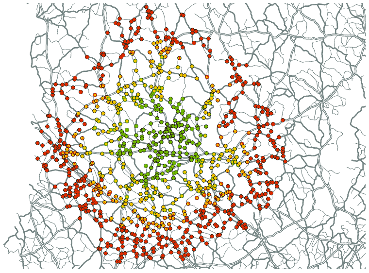

pgRouting PostGIS 扩展由[`pgrouting.org/`](http://pgrouting.org/)维护。

接下来，我们将探讨可视化像之前那样的图表所需的工具。

# 理解桌面工具（包括可视化）

地理空间分析需要能够可视化输出的能力。这一事实使得能够可视化数据的工具对该领域至关重要。地理空间可视化工具分为两大类。

第一类是地理空间查看器，第二类是地理空间分析软件。第一类——地理空间查看器——允许你访问、查询和可视化数据，但不能以任何方式编辑它。第二类允许你执行这些任务，并编辑数据。查看器的主要优势是它们通常是轻量级的软件，启动和加载数据快速。

地理空间分析软件需要更多的资源来编辑复杂的地理空间数据，因此它加载得较慢，并且通常渲染数据也较慢，以便提供动态编辑功能。

# Quantum GIS

**量子地理信息系统**，更常被称为**QGIS**，是一个完整的开源地理信息系统。QGIS 在可视化软件的两个类别中的地理空间分析类别中表现良好。该系统的开发始于 2002 年，并于 2009 年发布了 1.0 版本。

这是本章之前提到的大多数库的最佳展示。QGIS 是用 C++编写的，使用 Qt 库进行 GUI 开发。GUI 设计良好，易于使用。事实上，在专有软件包（如 Esri 的 ArcGIS 或 Manifold 系统）上受过培训的地理空间分析师在使用 QGIS 时会感到非常自在。工具和菜单系统逻辑性强，符合 GIS 系统的典型特征。QGIS 的整体速度与任何其他可用的系统相当，甚至更好。

QGIS 的一个优点是，其底层库和实用程序隐藏在表面之下。模块可以由任何第三方使用 Python 编写并添加到系统中。QGIS 还拥有一个强大的在线包管理系统，用于搜索、安装和更新这些扩展。Python 集成包括一个控制台，允许你在控制台中发出命令并看到 GUI 中的结果。提供这种功能的软件不止 QGIS 一种。

与大多数地理空间软件包一样，如果你使用自动安装程序，它会安装 Python 的完整版本。如果你已经安装了 Python，无需担心。在单台机器上拥有多个 Python 版本相当普遍且得到良好支持。许多人出于测试软件或因为它是许多不同软件包的常见脚本环境的目的，在他们的计算机上安装多个 Python 版本。

当 Python 控制台在 QGIS 中运行时，整个程序 API 通过一个自动加载的对象`qgis.utils.iface`可用。以下截图显示了运行 Python 控制台的 QGIS：

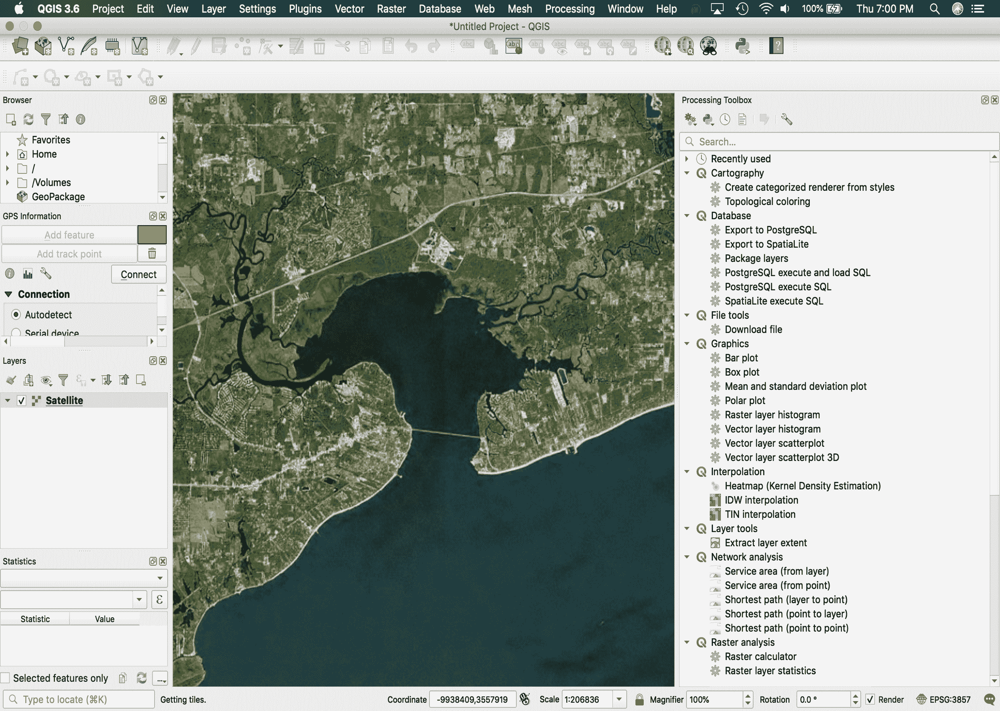

由于 QGIS 基于 GDAL/OGR 和 GEOS，并且可以使用 PostGIS，因此它支持那些包提供的所有数据源。它还具有很好的栅格处理功能。QGIS 非常适合使用可用的扩展生成纸质地图或整个地图集。

QGIS 在以下链接的 QGIS 网站上得到了很好的文档说明：[`www.qgis.org/en/documentation.html`](https://www.qgis.org/en/docs/index.html)。你也可以通过搜索 QGIS 或特定操作找到许多在线和视频教程。

# OpenEV

OpenEV 是一个开源的地理空间查看器，最初由 Atlantis Scientific 于 2002 年左右开发，后来成为 Vexcel，在微软收购之前。Vexcel 将 OpenEV 开发为一个免费下载的卫星图像查看器，用于**加拿大地理空间数据基础设施**（**CGDI**）。它是使用 GDAL 和 Python 构建的，并由 GDAL 的创建者 Frank Warmerdam 部分维护。

OpenEV 是可用的最快的栅格查看器之一。尽管最初设计为查看器，但 OpenEV 提供了 GDAL 和 PROJ 的所有实用功能。虽然它被创建为一个栅格工具，但它可以叠加矢量数据，如 shapefiles，甚至支持基本的编辑。使用内置的栅格计算器也可以修改栅格图像，并且可以转换、重新投影和裁剪数据格式。

以下截图显示了 OpenEV 查看器窗口中的一个 25MB、16 位整数的 GeoTIFF 高程文件：

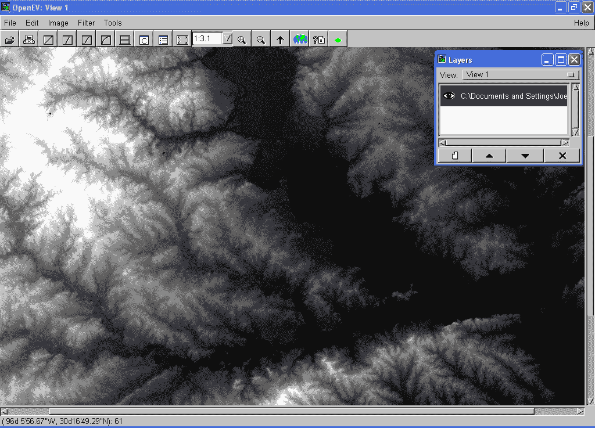

OpenEV 主要使用 Python 构建，并提供了一个 Python 控制台，可以访问程序的全部功能。OpenEV 的 GUI 不如其他工具，如 QGIS 复杂。例如，你不能像在 QGIS 中那样将地理空间数据集拖放到查看器中。但是，OpenEV 的原始速度使其对于简单的栅格查看或基本处理和数据转换非常吸引人。

OpenEV 的主页可在以下链接找到：[`openev.sourceforge.net`](http://openev.sourceforge.net)。

# GRASS GIS

GRASS 是现存的最古老的持续开发地理空间系统之一。美国陆军工程兵团于 1982 年开始开发 GRASS。它最初是为 Unix 系统设计的。1995 年，军队发布了最后一个补丁，软件被转移到社区开发，并一直如此。

尽管用户界面经过了重新设计，GRASS 对于现代 GIS 用户来说仍然有些神秘。然而，由于其数十年的传统和不存在价格标签，多年来许多地理空间工作流程和高度专业化的模块已在 GRASS 中实现，使其对许多组织和个人，尤其是在研究社区中，高度相关。出于这些原因，GRASS 仍在积极开发。

GRASS 也已与 QGIS 集成，因此可以使用更现代且熟悉的 QGIS GUI 来运行 GRASS 功能。GRASS 也与 Python 深度集成，可以作为库或命令行工具使用。以下截图显示了在原生 GRASS GUI 中进行的某些地形分析，该 GUI 是使用`wxPython`库构建的：

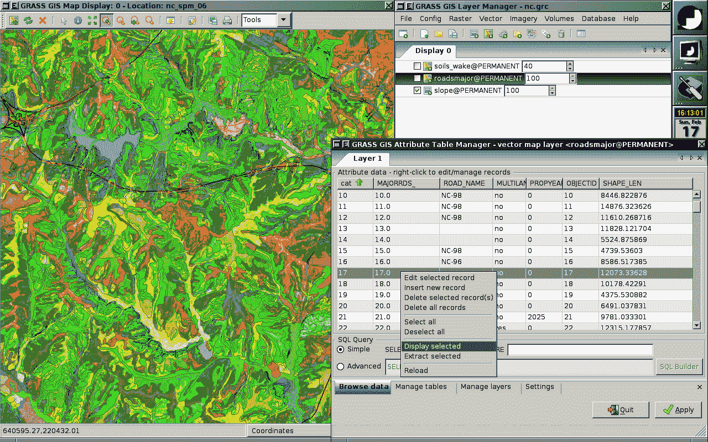

GRASS 可在[`grass.osgeo.org/`](http://grass.osgeo.org/)在线找到[.]。

# gvSIG

另一个基于 Java 的桌面 GIS 是**gvSIG**。gvSIG 项目始于 2004 年，作为将西班牙瓦伦西亚地区基础设施和交通部 IT 系统迁移到开源软件的更大项目的一部分。结果是产生了 gvSIG，它一直在不断成熟。其功能集主要与 QGIS 相当，也有一些独特的能力。

官方的 gvSIG 项目有一个非常活跃的分支，称为**gvSIG 社区版**（**gvSIG CE**）。还有一个名为 gvSIG mobile 的移动版本。gvSIG 代码库是开源的。

gvSIG 的官方主页可在[`www.gvsig.org/web/`](http://www.gvsig.org/web/)找到。

# OpenJUMP

OpenJUMP 是另一个开源的基于 Java 的桌面 GIS。**JUMP**代表**Java Unified Mapping Platform**，最初由 Vivid Solutions 为不列颠哥伦比亚省政府创建。在 Vivid Solutions 交付 JUMP 后，开发停止。Vivid Solutions 最终将 JUMP 发布到开源社区，在那里它被重命名为 OpenJUMP。

OpenJUMP 能够读取和写入 shapefiles 和 OGC **GML**（地理标记语言的简称），并支持 PostGIS 数据库。它还可以显示某些图像格式和来自 OGC **WMS**（Web 地图服务器的简称）和**WFS**（Web 特征服务的简称）服务的数据。它具有插件架构，也可以作为定制应用程序的开发平台。

你可以在官方网页[`www.openjump.org/`](http://www.openjump.org/)上了解更多关于 OpenJUMP 的信息。

# Google Earth

Google Earth 如此普遍，几乎不值得一提。2001 年 EarthViewer 3D 的第一个版本（由一家名为 Keyhole Inc.的公司创建）和 EarthViewer 3D 项目由非营利风险投资公司 In-Q-Tel 资助，而 In-Q-Tel 反过来又由美国中央情报局资助。这个间谍机构的血统以及 Google 收购 Keyhole 以创建和分发 Google Earth，使全球关注地理空间分析领域。

自从 2005 年首次以 Google Earth 软件形式发布以来，Google 一直在不断改进它。其中一些引人注目的新增功能包括创建 Google 月球、Google 火星、Google 天空和 Google 海洋。这些是虚拟地球应用，它们具有月球和火星的数据，除了 Google 海洋，它还为 Google Earth 添加了海底地形图，称为测深。

Google Earth 引入了旋转虚拟地球概念，用于地理数据的探索。在几个世纪以来查看二维地图或低分辨率的物理地球仪之后，虚拟地飞越地球并在世界任何角落的街角降落都是令人震惊的——尤其是对于地理空间分析师和其他地理爱好者来说，如下面的 Google Earth 截图所示，俯瞰路易斯安那州新奥尔良的商业区：

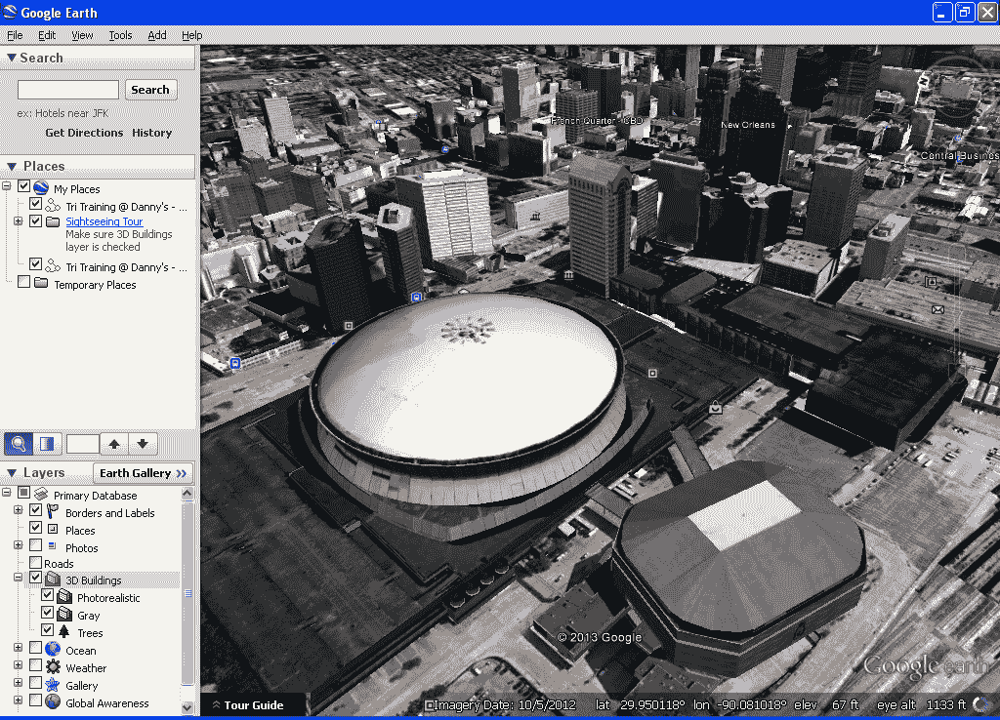

正如 Google 通过基于瓦片的*滑动*映射方法革命性地改变了网络地图一样，虚拟地球概念极大地促进了地理空间可视化。

在最初的兴奋过后，许多地理空间分析师意识到 Google Earth 是一个非常生动有趣的地理探索工具，但它对于任何类型的有意义地理空间分析的实际用途非常有限。Google Earth 完全属于地理空间查看软件领域。

它仅消耗其原生**钥匙孔标记语言**（**KML**），这是一个集数据和管理风格于一体的格式，在第二章“学习地理空间数据”中有详细讨论。由于该格式现在是 OGC 标准，仅消耗一种数据格式立即限制了任何工具的实用性。任何涉及 Google Earth 的项目都必须首先开始于在 KML 中进行完整的数据转换和样式设计，这让人联想到大约 10-20 年前的地理空间分析。支持 KML 的工具，包括 Google Maps，只支持 KML 的有限子集。

谷歌地球的本地数据集具有全球覆盖范围，但它是由跨越几年和来源的数据集混合而成的。谷歌大大改进了工具中的内联元数据，这些元数据确定了当前视图的来源和近似日期。但是，这种方法在普通人中造成了混淆。许多人认为谷歌地球中的数据更新频率远高于实际情况。谷歌街景系统，展示了世界许多地区的街景，360 度全景视图，在一定程度上有助于纠正这种误解。

人们能够轻易地识别出熟悉地点的图片是几年前拍摄的。谷歌地球创造的另一种常见误解是，整个世界已经被详细地绘制在地图上，因此为地理空间分析创建基础地图应该是微不足道的。正如第二章中讨论的，*学习地理空间数据*，使用现代数据和软件绘制感兴趣的区域比几年前要容易得多，但这仍然是一项复杂且劳动密集型的任务。这种误解是地理空间分析师在开始项目时必须管理的第一个客户期望之一。

尽管存在这些误解，谷歌对地理空间分析产生的影响几乎完全是积极的。几十年来，地理空间行业增长的一个最困难的挑战是说服潜在的股东，在关于人、资源和环境的决策中，地理空间分析几乎总是最佳方法。这个障碍与汽车经销商形成鲜明对比。当潜在客户来到汽车销售场地时，销售员不需要说服买家他们需要一辆车，只需要说服他们需要什么类型的汽车。

地理空间分析师首先必须教育项目赞助商了解这项技术，然后说服他们地理空间方法是解决挑战的最佳方式。谷歌在很大程度上消除了分析师需要采取的这些步骤。

谷歌地球可以在网上找到，[点击这里访问](http://www.google.com/earth/index.html)。

# NASA WorldWind

NASA WorldWind 是一个开源的虚拟地球和地理空间查看器，最初由美国国家航空航天局（NASA）于 2004 年发布。它最初基于微软的.NET 框架，使其成为一个以 Windows 为中心的应用程序。

以下是美国国家航空航天局（NASA）世界风（WorldWind）的截图看起来与谷歌地球相似：


2007 年，发布了一个基于 Java 的**软件开发工具包**（SDK），称为**WorldWind Java**，这使得 WorldWind 更加跨平台。转向 Java 还导致了为 WorldWind 创建浏览器插件。

WorldWind Java SDK 被视为一个 SDK，而不是像.NET 版本那样的桌面应用程序。然而，SDK 中包含的示例提供了一个无需额外开发的查看器。虽然 NASA WorldWind 最初是受 Google Earth 的启发，但其作为开源项目的地位使其走向了完全不同的方向。

Google Earth 是一个通用工具，受 KML 规范的限制。NASA WorldWind 现在是一个任何人都可以无限制开发的平台。随着新类型的数据变得可用，计算资源增长，虚拟地球范式在地理空间可视化方面的潜力显然还有更多未被探索的。

NASA WorldWind 可在[`worldwind.arc.nasa.gov/java/`](http://worldwind.arc.nasa.gov/java/)在线获取。

# ArcGIS

Esri 在成为理解我们世界的地理空间分析方法的最大推广者之一的同时，也是一个私有控股、盈利性企业，它必须在一定程度上关注自己的利益。ArcGIS 软件套件代表了已知的所有类型的地理空间可视化，包括矢量、栅格、地球仪和 3D。它也是许多国家的市场领导者。正如本章前面所示的地理空间软件地图所示，Esri 越来越多地将开源软件纳入其工具套件中，包括 GDAL 用于栅格显示，以及 Python 作为 ArcGIS 的脚本语言。

以下截图显示了核心 ArcGIS 应用程序 ArcMap，以及海洋跟踪密度数据分析。界面与 QGIS 有很多共同之处，如本截图所示，由[`marinecadastre.gov/`](https://marinecadastre.gov/)提供：

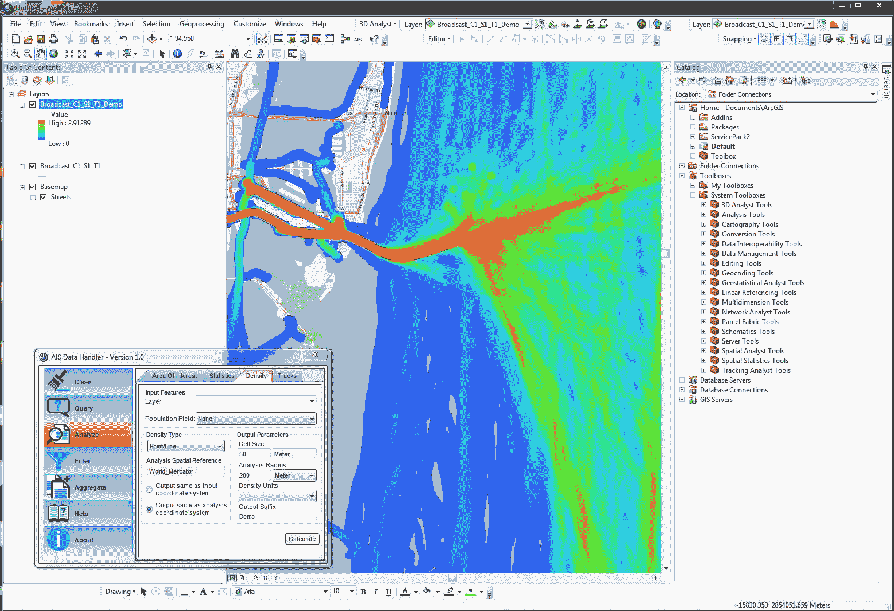

ArcGIS 产品页面可在[`www.esri.com/software/arcgis`](http://www.esri.com/software/arcgis)在线获取。

现在我们已经了解了可视化和分析数据的工具，让我们来看看如何管理数据。

# 理解元数据管理

互联网上数据的分发增加了元数据的重要性。数据管理员能够将数据集发布给全世界下载，而无需任何个人互动。地理空间数据集的元数据记录可以遵循这一原则，以确保数据的完整性和问责制得到维护。

正确格式的元数据还允许自动编目、搜索索引和数据集的集成。元数据变得如此重要，以至于地理空间社区中有一个常见的格言是*没有元数据的数据不是数据*，这意味着没有元数据，地理空间数据集就无法被充分利用和理解。

以下部分列出了一些可用的常见元数据工具。OGC 的元数据管理标准是**网络目录服务**（**CSW**），它创建了一个基于元数据的目录系统和用于分发和发现数据集的 API。

# Python 的 pycsw 库

`pycsw` 是一个符合 OGC 标准的 CSW，用于地理空间元数据的发布和发现。它支持多个 API，包括 CSW 2/CSW 3、OpenSearch、OAI-PMH 和 SRU。它非常轻量级，且完全由 Python 实现。以下是一个使用 `pycsw` 构建的 CSW 和客户端的优秀示例，即太平洋岛屿海洋观测系统（**PacIOOS**）目录，可在以下链接找到：[`pacioos.org/search/`](http://pacioos.org/search/)。`pycsw` 库也被用于一个名为 **GeoNode** 的更大软件包中。

# GeoNode

GeoNode 是一个基于 Python 的地理空间内容管理系统。它将地理空间数据创建、元数据和可视化集成在一个服务器软件包中。它还包括社交功能，如评论和评分系统。它是开源的，可在 [`geonode.org/`](http://geonode.org/) 找到。以下截图来自 GeoNode 在线演示：

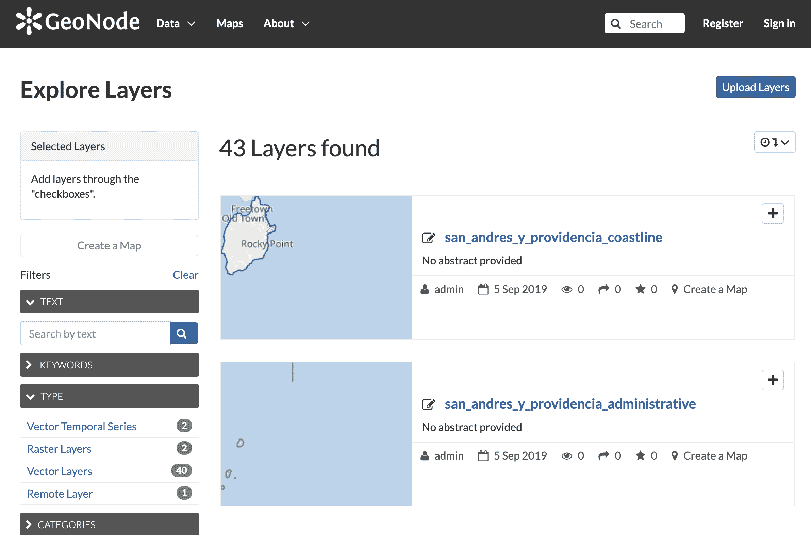

GeoNode 和 `pycsw` 是 Python 的两个主要元数据工具。接下来，我们将探讨一些用其他语言编写的工具。

# GeoNetwork

GeoNetwork 是一个开源的、基于 Java 的目录服务器，用于管理地理空间数据。它包括元数据编辑器和搜索引擎，以及一个交互式网络地图查看器。该系统旨在全球范围内连接空间数据基础设施。它可以通过元数据编辑工具通过网页发布元数据。它还可以通过内置的 GeoServer 地图服务器发布空间数据。它具有用户和组安全权限，以及网页和桌面配置工具。

GeoNetwork 还可以配置为定期从其他目录中收集元数据。以下截图展示了联合国粮食及农业组织的 GeoNetwork 实现：

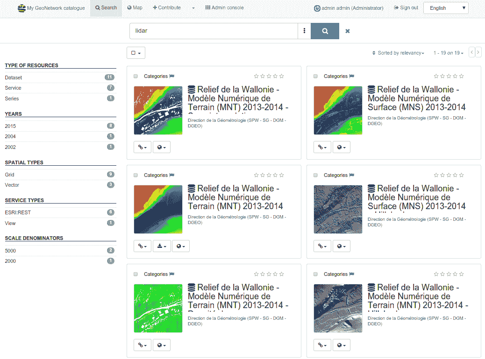

你可以在 [`geonetwork-opensource.org/`](http://geonetwork-opensource.org/) 了解更多关于 GeoNetwork 的信息[.]。

# 摘要

在本章中，你了解了地理空间分析软件的层次结构。你还学习了一个框架，通过将现有的数百个地理空间软件包和库分类到一到多个主要功能中，包括数据访问、计算几何、栅格处理、可视化和元数据管理，来接近这些软件包和库。

我们还检查了常用的基础库，包括 GDAL、OGR、PROJ 和 GEOS，这些库在地理空间软件中反复出现。你可以通过追踪任何新的地理空间软件，回溯到这些核心库，然后问自己，“*这些开发者为什么要逆流而上？*”以更好地理解这个软件包。如果软件没有使用这些库之一，你需要问，“*为什么这些开发者要逆流而上？*”以了解该系统带来了什么。

在本章中，Python 只被提及了几次，目的是为了避免在理解地理空间软件景观时产生任何干扰。但是，正如我们将看到的，Python 与本章中的每一款软件都紧密相连，并且它本身就是一个完全有能力的地理空间工具。Python 是 ArcGIS、QGIS、GRASS 以及许多其他软件包的官方脚本语言，这并非巧合。同样，GDAL、OGR、PROJ、CGAL、JTS、GEOS 和 PostGIS 都有 Python 绑定，这也不是偶然的。

至于这里没有提到的软件包，它们都可以通过 Jython Java 发行版、IronPython .NET 发行版、Python 的各种数据库和 Web API 以及内置的 `ctypes` 模块在 Python 的掌握之中。作为一名地理空间分析师，如果您有一种技术不能放弃，那就是 Python。

在下一章中，我们将看到 Python 如何在地理空间行业中发挥作用。我们还将了解 GIS 脚本语言、混合粘合语言以及完整的编程语言。

# 进一步阅读

这里有一份您可以参考的网页列表：

+   [`github.com/sacridini/Awesome-Geospatial`](https://github.com/sacridini/Awesome-Geospatial)

+   [`github.com/jerr0328/awesome-geospatial-list`](https://github.com/jerr0328/awesome-geospatial-list)
