# 第五章：Python 和地理信息系统

本章将专注于将 Python 应用于通常由地理信息系统（GIS）如 QGIS 或 ArcGIS 执行的功能。这些功能是地理空间分析的核心和灵魂。我们将尽可能减少 Python 本身之外的外部依赖，以便你拥有尽可能可重用的工具，在不同的环境中使用。在本书中，我们从编程的角度将 GIS 分析和遥感分离，这意味着在本章中，我们将主要关注矢量数据。

与本书中的其他章节一样，这里展示的项目是核心功能，它们作为构建块，你可以重新组合来解决本书之外遇到的挑战。本章的主题包括以下内容：

+   测量距离

+   坐标转换

+   重投影矢量数据

+   测量面积

+   编辑 shapefile

+   从更大的数据集中选择数据

+   创建专题地图

+   使用电子表格

+   非 GIS 数据类型的转换

+   地理编码

+   多进程

本章包含许多代码示例。除了文本外，代码注释还包括在示例中的指南。本章覆盖的范围比本书中的任何其他章节都要广。它涵盖了从测量地球到编辑数据、创建地图，到使用扩展的多进程以加快分析速度的各个方面。到本章结束时，你将是一名准备学习本书其余部分更高级技术的地理空间分析师。

# 技术要求

对于本章，你需要以下内容：

+   Python 3.7

+   Python UTM 库

+   Python OGR 库

+   Python Shapefile 库

+   Python Fiona 库

+   Python PNGCanvas 库

+   Python Pillow 库（Python 图像库）

+   Python Folium 库

+   Python Pymea 库

+   Python Geocoder 库

+   Python GeoPy 库

# 测量距离

地理空间分析的本质是发现地球上物体的关系。彼此更近的物体往往比彼此更远的物体有更强的关系。这个概念被称为**托布勒地理第一定律**。因此，测量距离是地理空间分析的一个关键功能。

正如我们所学的，每张地图都是地球的一个模型，它们在某种程度上都是错误的。因此，坐在电脑前测量地球上两点之间的准确距离是不可能的。即使是专业的土地测量员（他们带着传统的观测设备和非常精确的 GPS 设备到野外）也无法考虑到 A 点和 B 点之间地球表面的每一个异常。因此，为了测量距离，我们必须考虑以下问题：

+   我们在测量什么？

+   我们在测量多少？

+   我们需要多少精度？

现在，要计算距离，我们可以使用以下三种地球模型：

+   平面

+   球形

+   椭球体

在平面模型中，使用的是标准的欧几里得几何。地球被视为一个没有曲率的平面，如下面的图所示：

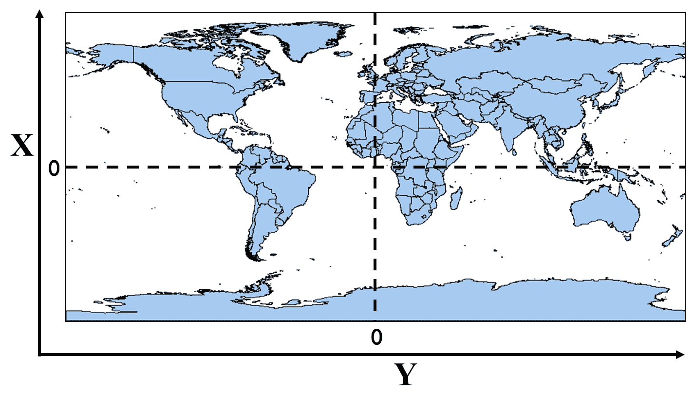

由于在这个模型中你工作的是直线，所以数学变得相当简单。地理坐标最常用的格式是十进制度数。然而，十进制度数坐标是在球体上作为角度的参考测量——经度和本初子午线之间，以及纬度和赤道之间。此外，经线在两极会聚于零。纬线的周长在两极也会变得更小。这些事实意味着十进制度数对于使用无限平面的欧几里得几何来说不是一个有效的坐标系。

地图投影试图简化在二维平面上处理三维椭球体的问题，无论是在纸张上还是在计算机屏幕上。正如我们在第一章中讨论的，《使用 Python 学习地理空间分析》，地图投影将地球的圆形模型展平到平面上，并为了地图的便利性而引入了扭曲。一旦这个投影到位，十进制度数被交换为具有*x*和*y*坐标的笛卡尔坐标系，我们就可以使用最简单的欧几里得几何形式——即勾股定理。

在足够大的尺度上，像地球这样的球体或椭球体看起来更像是一个平面而不是一个球体。事实上，几个世纪以来，人们都认为地球是平的！如果经度度的差异足够小，你通常可以使用欧几里得几何，然后将测量值转换为米、千米或英里。这种方法通常不推荐，但最终的决定取决于你作为分析师对精度的要求。

球形模型方法试图通过避免将地球压扁到平面上所产生的问题来更好地逼近现实。正如其名所示，该模型使用一个完美的球体来表示地球（类似于物理地球仪），这使得我们可以直接使用度数。这个模型忽略了地球实际上更像是具有不同厚度地壳的椭圆形，而不是一个完美的球体。但是，通过在球体表面工作距离，我们可以开始以更高的精度测量更长的距离。以下截图说明了这个概念：

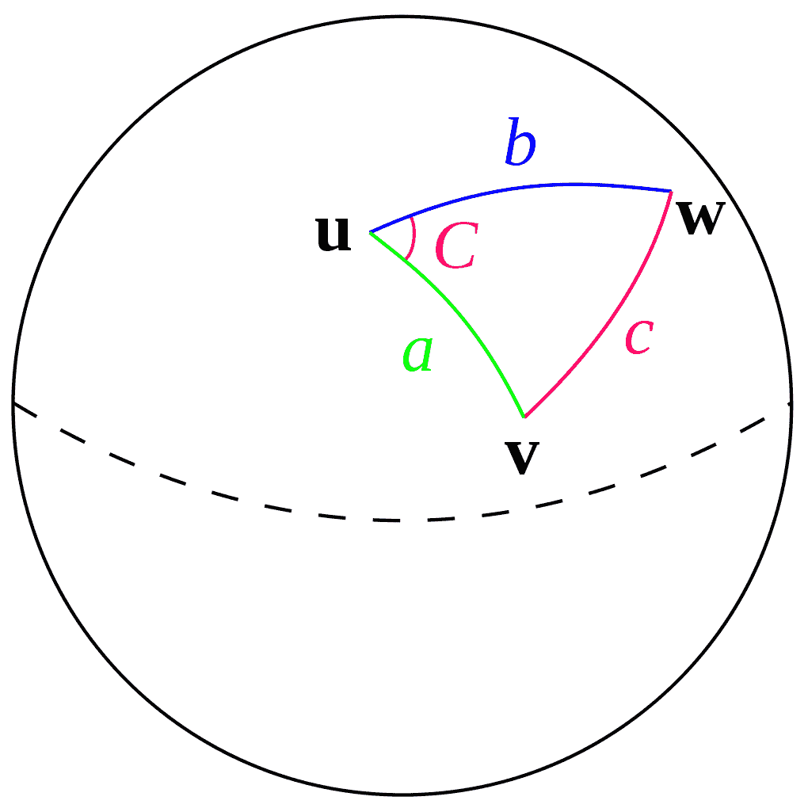

使用地球椭球体模型，分析师们努力寻找地球表面的最佳模型。有几个椭球体模型，被称为基准。**基准**是一组定义地球估计形状的值，也称为**大地测量系统**。像任何其他地理参考系统一样，基准可以针对局部区域进行优化。最常用的基准是称为 **WGS84** 的基准，它设计用于全球使用。你应该知道，随着评估技术和技术的改进，WGS84 有时会更新。最近的修订发生在 2004 年。

在北美，NAD83 基准用于优化大陆上的参考。在东半球，更频繁地使用 **欧洲大地测量参考系统 1989** (**ETRS89**)。ETRS89 被固定在 **欧亚板块** 的稳定部分。基于 ETRS89 的欧洲地图不受大陆漂移的影响，大陆漂移每年变化可达 2.5 厘米，因为地球的地壳在移动。

椭球体从中心到边缘没有恒定的半径。这个事实意味着在地球的球体模型中使用的公式在椭球体模型中开始出现问题。虽然这不是一个完美的近似，但它比球体模型更接近现实。

以下截图显示了一个用黑色线条表示的通用椭球模型，与用红色线条表示的地球不均匀地壳进行了对比。虽然我们不会在这些例子中使用它，但另一个模型是大地水准面模型。大地水准面是地球上最精确和最准确的模型，它基于地球表面，除了重力和旋转外，没有其他影响因素。以下图示展示了大地水准面、椭球体和球体模型，以说明它们之间的差异：

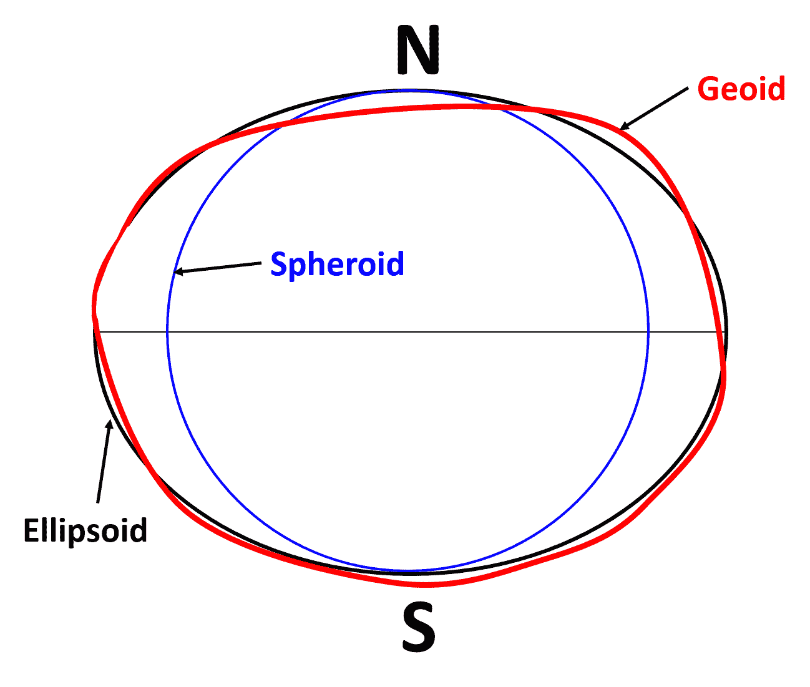

理解这些地球模型对于本书中的其他内容至关重要，因为毕竟我们是在模拟地球。

现在我们已经讨论了这些不同的地球模型以及测量它们的问题，让我们看看一些使用 Python 的解决方案。

# 使用勾股定理

我们将从最简单的方法开始测量，即勾股定理，也称为欧几里得距离。如果你还记得你从学校学到的几何课程，勾股定理断言以下内容：

```py
a2 + b2 = c2
```

在这个断言中，变量 *a*、*b* 和 *c* 都是三角形的边。如果你知道另外两边，你可以解出任意一边。

在这个例子中，我们将从**密西西比横轴墨卡托**（**MSTM**）投影中的两个投影点开始。这个投影的单位是米。*x*轴的位置是从该州最西端定义的中央子午线测量的。*y*轴是从 NAD83 水平基准定义的。第一个点定义为(*x*1,*y*1)，代表密西西比州的首府杰克逊。第二个点定义为(*x*2,*y*2)，代表沿海城市比洛克西，如下面的插图所示：

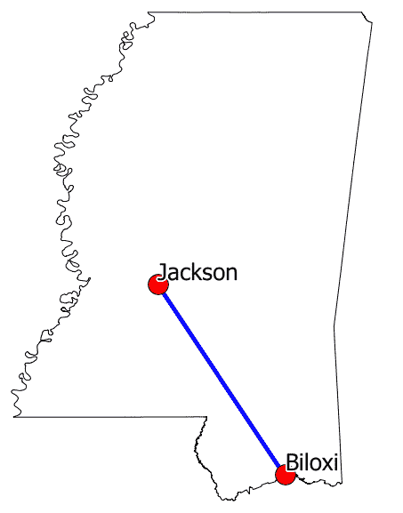

在下面的例子中，Python 中的双星号（**）是指数的语法，我们将用它来平方距离。

我们将导入 Python 的 math 模块，以使用其名为`sqrt()`的平方根函数。然后，我们将计算*x*轴和*y*轴的距离。最后，我们将使用这些变量来执行欧几里得距离公式，以从*x*，*y*原点得到边界框的米距离，这将在 MSTM 投影中使用：

```py
import math
# First point
x1 = 456456.23
y1 = 1279721.064
# Second point
x2 = 576628.34
y2 = 1071740.33
# X distance
x_dist = x1 - x2
# Y distance
y_dist = y1 - y2
# Pythagorean theorem
dist_sq = x_dist**2 + y_dist**2
distance = math.sqrt(dist_sq)
print(distance)
# 240202.66
```

因此，距离大约是 240,202 米，约合 240.2 公里或 150 英里。这个计算相当准确，因为这种投影是为了在密西西比州使用笛卡尔坐标来测量距离和面积而优化的。

我们还可以使用十进制度量距离，但我们必须执行一些额外的步骤。要使用度来测量，我们必须将角度转换为弧度，这考虑了坐标之间的曲面积距。我们还将以弧度为单位乘以地球半径（以米为单位），以将结果转换回弧度。

你可以在[`en.wikipedia.org/wiki/Radian`](http://en.wikipedia.org/wiki/Radian)上了解更多关于弧度的信息。

在以下代码中，我们将使用 Python 的`math.radians()`方法执行此转换，当我们计算*x*和*y*距离时：

```py
import math
x1 = -90.21
y1 = 32.31
x2 = -88.95
y2 = 30.43
x_dist = math.radians(x1 - x2)
y_dist = math.radians(y1 - y2)
dist_sq = x_dist**2 + y_dist**2
dist_rad = math.sqrt(dist_sq)
dist_rad * 6371251.46
# 251664.46
```

好的，这次我们得到了大约 251 公里，比我们的第一次测量多了 11 公里。所以，正如你所看到的，你选择的测量算法和地球模型可以产生重大影响。使用相同的方程，我们得到了截然不同的答案，这取决于我们选择的坐标系和地球模型。

你可以在[`mathworld.wolfram.com/Distance.html`](http://mathworld.wolfram.com/Distance.html)上了解更多关于欧几里得距离的信息。

让我们来了解一下**哈弗辛公式**。

# 使用哈弗辛公式

使用勾股定理在地球（一个球体）上测量距离的问题之一是**大圆距离**的概念。大圆是球面上两点之间的最短距离。定义大圆的另一个重要特征是，如果沿着圆周完全绕球体一周，该圆将球体平分为两个相等的半球，如下面的维基百科插图所示：


那么，如何正确地测量曲面上的一条线呢？最流行的方法是使用**哈弗辛公式**，它使用三角学来计算以十进制度数定义的坐标的大圆距离。哈弗辛公式是*haversine(θ) = sin²(θ/2)*，其中θ是球面上两点之间的中心角。再次提醒，在我们应用公式之前，我们将轴距离从度数转换为弧度，就像上一个例子一样。但这次，我们还将纬度(*y*-轴)坐标单独转换为弧度：

```py
import math
x1 = -90.212452861859035
y1 = 32.316272202663704
x2 = -88.952170968942525
y2 = 30.438559624660321
x_dist = math.radians(x1 - x2)
y_dist = math.radians(y1 - y2)
y1_rad = math.radians(y1)
y2_rad = math.radians(y2)
a = math.sin(y_dist/2)**2 + math.sin(x_dist/2)**2 \
 * math.cos(y1_rad) * math.cos(y2_rad)
c = 2 * math.asin(math.sqrt(a))
distance = c * 6371  # kilometers
print(distance)
# 240.63
```

哇！我们使用哈弗辛公式得到了 240.6 公里，而使用优化且更精确的投影方法得到了 240.2 公里。这个差异不到半公里，对于一个相距 150 英里的两个城市的距离计算来说已经很不错了。哈弗辛公式是最常用的距离测量公式，因为它在编码方面相对简单，并且在大多数情况下相当准确。它被认为精确到大约一米的范围内。

总结到目前为止我们所学的，作为分析师，你遇到的点坐标大多数都是未投影的十进制度数。因此，你的测量选项如下：

+   将其重新投影到距离精确的笛卡尔投影中并测量。

+   只需使用哈弗辛公式，看看它如何帮助你的分析。

+   使用更加精确的文森蒂公式。

对了！还有一个公式试图提供比哈弗辛公式更好的测量结果。

# 使用文森蒂公式

因此，我们已经检查了使用勾股定理（平坦地球模型）和哈弗辛公式（球形地球模型）进行距离测量的方法。文森蒂公式考虑了地球的椭球体模型。如果你使用的是局部椭球体，它可以精确到小于一米的程度。

在以下公式的实现中，你可以更改半长轴值和扁平率，以适应任何椭球体的定义。让我们看看在以下示例中使用文森蒂公式在 NAD83 椭球体上测量时的距离是多少：

1.  首先，我们将导入`math`模块，这允许我们在弧度下工作，以及我们需要的其他`math`函数：

```py
import math
```

1.  现在，我们需要设置我们的变量，包括包含距离值的变量、我们正在测量的两个点、描述地球的常数以及我们需要的一阶导数公式：

```py
distance = None
x1 = -90.212452861859035
y1 = 32.316272202663704
x2 = -88.952170968942525
y2 = 30.438559624660321
# Ellipsoid Parameters
# Example is NAD83
a = 6378137  # semi-major axis
f = 1/298.257222101  # inverse flattening
b = abs((f*a)-a)  # semi-minor axis
L = math.radians(x2-x1)
U1 = math.atan((1-f) * math.tan(math.radians(y1)))
U2 = math.atan((1-f) * math.tan(math.radians(y2)))
sinU1 = math.sin(U1)
cosU1 = math.cos(U1)
sinU2 = math.sin(U2)
cosU2 = math.cos(U2)
lam = L
```

1.  现在开始文森蒂公式。没有简单的方法来做这件事，数学有点复杂，但它有效：

```py
for i in range(100):
    sinLam = math.sin(lam)
    cosLam = math.cos(lam)
    sinSigma = math.sqrt((cosU2*sinLam)**2 +
                         (cosU1*sinU2-sinU1*cosU2*cosLam)**2)
    if (sinSigma == 0):
        distance = 0  # coincident points
        break
    cosSigma = sinU1*sinU2 + cosU1*cosU2*cosLam
    sigma = math.atan2(sinSigma, cosSigma)
    sinAlpha = cosU1 * cosU2 * sinLam / sinSigma
    cosSqAlpha = 1 - sinAlpha**2
    cos2SigmaM = cosSigma - 2*sinU1*sinU2/cosSqAlpha
    if math.isnan(cos2SigmaM):
        cos2SigmaM = 0  # equatorial line
    C = f/16*cosSqAlpha*(4+f*(4-3*cosSqAlpha))
    LP = lam
    lam = L + (1-C) * f * sinAlpha *
        (sigma + C*sinSigma*(cos2SigmaM+C*cosSigma *
                             (-1+2*cos2SigmaM*cos2SigmaM)))
    if not abs(lam-LP)  1e-12:
        break
uSq = cosSqAlpha * (a**2 - b**2) / b**2
A = 1 + uSq/16384*(4096+uSq*(-768+uSq*(320-175*uSq)))
B = uSq/1024 * (256+uSq*(-128+uSq*(74-47*uSq)))
deltaSigma = B*sinSigma*(cos2SigmaM+B/4 *
(cosSigma*(-1+2*cos2SigmaM*cos2SigmaM) - B/6*cos2SigmaM*(-3+4*sinSigma*sinSigma) * (-3+4*cos2SigmaM*cos2SigmaM)))
s = b*A*(sigma-deltaSigma)
```

最后，在完成所有这些之后，我们得到了我们的距离：

```py
distance = s
print(distance)
# 240237.66693880095
```

使用文森蒂公式，我们的测量结果是 240.1 公里，这比我们使用欧几里得距离预测的测量结果只差 100 米。令人印象深刻！虽然它比哈弗辛公式在数学上复杂得多，但你也可以看到它更加精确。

纯 Python 的 geopy 模块实现了 Vincenty 公式，并且能够通过将地点名称转换为经纬度坐标来进行地点的地理编码：[`geopy.readthedocs.org/en/latest/`](http://geopy.readthedocs.org/en/latest/)。

在这些示例中使用到的点距离赤道相对较近。当你向两极移动或处理更大的距离或极小的距离时，你所做的选择变得越来越重要。如果你只是尝试围绕一个城市画一个半径来选择营销活动推广音乐会的地点，那么几公里的误差可能是可以接受的。然而，如果你试图估计飞机在两个机场之间飞行所需的燃油量，那么你需要非常精确！

如果你想要了解更多关于测量距离和方向的问题，以及如何通过编程来解决这个问题，请访问以下网站： [`www.movable-type.co.uk/scripts/latlong.html`](http://www.movable-type.co.uk/scripts/latlong.html)。

在这个网站上，Chris Veness 对这个主题进行了详细的介绍，并提供了在线计算器，以及用 JavaScript 编写的示例，这些示例可以轻松地移植到 Python 中。我们刚刚看到的 Vincenty 公式实现就是从这个网站上的 JavaScript 移植过来的。

你可以在这里看到 Vincenty 公式的完整纯数学符号： [`en.wikipedia.org/wiki/Vincenty%27s_formulae`](https://en.wikipedia.org/wiki/Vincenty%27s_formulae)。

现在我们已经知道了如何计算距离，我们需要了解如何计算线的方向，以便通过距离和位置将地球上的物体联系起来进行地理空间分析。

# 计算线方向

除了距离之外，你通常还想知道线段的端点之间的方位角。我们可以使用 Python 的 `math` 模块仅从其中一个点计算出这条线的方向：

1.  首先，我们导入所需的 `math` 函数：

```py
from math import atan2, cos, sin, degrees
```

1.  接下来，我们为我们的两个点设置一些变量：

```py
lon1 = -90.21
lat1 = 32.31
lon2 = -88.95
lat2 = 30.43
```

1.  接下来，我们将计算两点之间的角度：

```py
angle = atan2(cos(lat1)*sin(lat2)-sin(lat1) * \
  cos(lat2)*cos(lon2-lon1), sin(lon2-lon1)*cos(lat2))
```

1.  最后，我们将计算线的方位角（以度为单位）：

```py
bearing = (degrees(angle) + 360) % 360
print(bearing)
309.3672990606595
```

有时，你可能会得到一个负的方位角值。为了避免这个问题，我们将 `360` 添加到结果中，以避免出现负数，并使用 Python 的取模运算符来防止值超过 `360`。

在角度计算中的 `math` 是逆向工程一个直角三角形，然后找出三角形的锐角。以下 URL 提供了这个公式的元素解释，以及最后的交互式示例： [`www.mathsisfun.com/sine-cosine-tangent.html`](https://www.mathsisfun.com/sine-cosine-tangent.html)。

我们现在已经知道了如何计算地球上特征的位置。接下来，我们将学习如何整合来自不同来源的数据，从坐标转换开始。

# 理解坐标转换

坐标转换允许你在不同的坐标系之间转换点坐标。当你开始处理多个数据集时，你不可避免地会得到不同坐标系和投影的数据。你可以使用一个名为`utm`的纯 Python 模块在两个最常用的坐标系之间进行转换，即 UTM 和地理坐标（纬度和经度）。你可以使用`easy_install`或从 PyPI 的`pip`安装它：[`pypi.python.org/pypi/utm`](https://pypi.python.org/pypi/utm)。

`utm`模块的使用非常简单。要将 UTM 坐标转换为纬度和经度，可以使用以下代码：

```py
import utm
y = 479747.0453210057
x = 5377685.825323031
zone = 32
band = 'U'
print(utm.to_latlon(y, x, zone, band))
# (48.55199390882121, 8.725555729071763)
```

UTM 区域是水平编号的。然而，垂直方向上，纬度带按英文字母顺序排列，有一些例外。例如，字母*A*、*B*、*Y*和*Z*用于标记地球的极点。字母*I*和*O*被省略，因为它们看起来太像*1*和*0*。字母*N*到*X*位于北半球，而字母*C*到*M*位于南半球。以下截图来自网站*Atlas Florae Europaeae*，展示了欧洲的 UTM 区域：

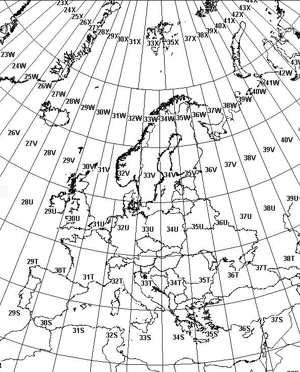

从纬度和经度转换甚至更简单。我们只需将纬度和经度传递给`from_latlon()`方法，该方法返回一个元组，包含与`to_latlon()`方法接受的相同参数：

```py
import utm
utm.from_latlon(48.55199390882121, 8.725555729071763)
# (479747.04524576373, 5377691.373080335, 32, 'U')
```

在此 Python 实现中使用的算法在[`www.uwgb.edu/dutchs/UsefulData/UTMFormulas.HTM`](http://www.uwgb.edu/dutchs/UsefulData/UTMFormulas.HTM)上进行了详细描述。

在 UTM 和纬度/经度之间转换只是将来自不同来源的数据集转换以便在地图上很好地叠加的表面工作。要超越基础，我们需要执行地图投影。

现在我们已经知道了如何计算线方向，让我们看看重投影是如何进行的。

# 理解重投影

在 GIS 中，重投影就是将数据集中的坐标从一个坐标系转换到另一个坐标系。尽管由于数据分布的更先进方法，重投影现在不太常见，但有时你需要重投影一个 shapefile。纯 Python 的`utm`模块适用于参考系统转换，但对于完整的重投影，我们需要 OGR Python API 的帮助。包含在`osgeo`模块中的 OGR API 还提供了开放空间参考模块，也称为`osr`，我们将使用它来进行重投影。

例如，我们将使用一个包含纽约市博物馆和画廊位置的 Lambert 正形投影点 shapefile。我们将将其重投影到 WGS84 地理（或更确切地说，取消投影）。你可以在此处下载此 zip 文件：[`git.io/vLbT4`](https://git.io/vLbT4)。

以下是最简化的脚本，用于重新投影 shapefile。几何形状被转换后写入新文件，但`.dbf`文件只是简单地复制到新名称，因为我们没有改变它。我们使用了标准的 Python `shutil`模块，简称 shell 工具，用于复制`.dbf`。源 shapefile 名称和目标 shapefile 名称在脚本的开头作为变量。目标投影也接近顶部，它使用 EPSG 代码设置。该脚本假设存在一个`.prj`投影文件，它定义了源投影。如果没有，你可以使用与目标投影相同的语法手动定义它。我们将逐步讲解投影数据集的过程。每个部分都有注释：

1.  首先，我们导入我们的库：

```py
from osgeo import ogr
from osgeo import osr
import os
import shutil
```

1.  接下来，我们将 shapefile 名称定义为变量：

```py
srcName = 'NYC_MUSEUMS_LAMBERT.shp'
tgtName = 'NYC_MUSEUMS_GEO.shp'
```

1.  现在，我们使用`osr`模块和 EPSG 代码`4326`创建我们的目标空间参考，它是 WGS84 地理坐标：

```py
tgt_spatRef = osr.SpatialReference()
tgt_spatRef.ImportFromEPSG(4326)
```

1.  然后，我们使用`ogr`设置我们的 shapefile `Reader`对象并获取空间参考：

```py
driver = ogr.GetDriverByName('ESRI Shapefile')
src = driver.Open(srcName, 0)
srcLyr = src.GetLayer()
src_spatRef = srcLyr.GetSpatialRef()
```

1.  接下来，我们检查目标 shapefile 是否已从之前的测试运行中存在，如果存在则删除它：

```py
if os.path.exists(tgtName):
    driver.DeleteDataSource(tgtName)
```

1.  现在，我们可以开始构建我们的目标图层：

```py
tgt = driver.CreateDataSource(tgtName)
lyrName = os.path.splitext(tgtName)[0]
# Use well-known binary format (WKB) to specify geometry
tgtLyr = tgt.CreateLayer(lyrName, geom_type=ogr.wkbPoint)
featDef = srcLyr.GetLayerDefn()
trans = osr.CoordinateTransformation(src_spatRef, tgt_spatRef)
```

1.  接下来，我们可以遍历源 shapefile 中的要素，使用`Transform()`方法重新投影它们，并将它们添加到新 shapefile 中：

```py
srcFeat = srcLyr.GetNextFeature()
while srcFeat:
    geom = srcFeat.GetGeometryRef()
    geom.Transform(trans)
    feature = ogr.Feature(featDef)
    feature.SetGeometry(geom)
    tgtLyr.CreateFeature(feature)
    feature.Destroy()
    srcFeat.Destroy()
    srcFeat = srcLyr.GetNextFeature()
src.Destroy()
tgt.Destroy()
```

1.  然后，我们需要创建一个包含投影信息的 shapefile `.prj`文件，因为 shapefile 没有固有的方式来存储它：

```py
# Convert geometry to Esri flavor of Well-Known Text (WKT) format
# for export to the projection (prj) file.
tgt_spatRef.MorphToESRI()
prj = open(lyrName + '.prj', 'w')
prj.write(tgt_spatRef.ExportToWkt())
prj.close()
```

1.  最后，我们只需将`.dbf`源复制到新文件名，因为属性是重投影过程的一部分：

```py
srcDbf = os.path.splitext(srcName)[0] + '.dbf'
tgtDbf = lyrName + '.dbf'
shutil.copyfile(srcDbf, tgtDbf)
```

以下截图显示了 QGIS 中重新投影的点，背景为卫星影像：

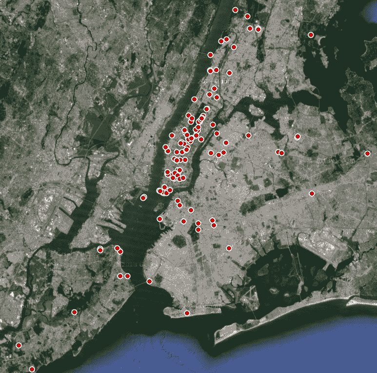

如果你正在处理一组点，你可以通过编程方式重新投影它们，而不是使用 PyProj 重新投影 shapefile：[`jswhit.github.io/pyproj/`](https://jswhit.github.io/pyproj/)。

除了将坐标转换为不同的投影外，你通常还需要在不同格式之间进行转换，我们将在下一部分进行探讨。

# 理解坐标格式转换

地图坐标传统上以度、分、秒（DMS）的形式表示，用于海上导航。然而，在 GIS（基于计算机的）中，纬度和经度以称为十进制度数的十进制数表示。度、分、秒格式仍然在使用。有时，你必须在这两种格式之间进行转换，以执行计算和输出报告。

在这个例子中，我们将创建两个函数，可以将一种格式转换为另一种格式：

1.  首先，我们导入`math`模块进行转换和`re`正则表达式模块解析坐标字符串：

```py
import math
import re
```

1.  我们有一个函数可以将十进制度数转换为`度`、`分`和`秒`字符串：

```py
def dd2dms(lat, lon):
    """Convert decimal degrees to degrees, minutes, seconds"""
    latf, latn = math.modf(lat)
    lonf, lonn = math.modf(lon)
    latd = int(latn)
    latm = int(latf * 60)
    lats = (lat - latd - latm / 60) * 3600.00
    lond = int(lonn)
    lonm = int(lonf * 60)
    lons = (lon - lond - lonm / 60) * 3600.00
    compass = {
        'lat': ('N','S'),
        'lon': ('E','W')
    }
    lat_compass = compass['lat'][0 if latd >= 0 else 1]
    lon_compass = compass['lon'][0 if lond >= 0 else 1]
    return '{}º {}\' {:.2f}" {}, {}º {}\' {:.2f}" 
    {}'.format(abs(latd),
    abs(latm), abs(lats), lat_compass, abs(lond),
    abs(lonm), abs(lons), lon_compass)
```

1.  接下来，我们有一个函数用于反向转换度数：

```py
def dms2dd(lat, lon):
    lat_deg, lat_min, \
    lat_sec, lat_dir = re.split('[^\d\.A-Z]+', lat)
    lon_deg, lon_min, \
    lon_sec, lon_dir = re.split('[^\d\.A-Z]+', lon)
    lat_dd = float(lat_deg) +\
    float(lat_min)/60 + float(lat_sec)/(60*60);
    lon_dd = float(lon_deg) +\
    float(lon_min)/60 + float(lon_sec)/(60*60);
    if lat_dir == 'S':
        lat_dd *= -1
    if lon_dir == 'W':
        lon_dd *= -1
    return (lat_dd, lon_dd);
```

1.  现在，如果我们想将十进制度数转换为 DMS，就像使用以下代码一样简单：

```py
print(dd2dms(35.14953, -90.04898))
 # 35º 8' 58.31" N, 90º 2' 56.33" W
```

1.  要进行相反的操作，你只需输入以下函数：

```py
dms2dd("""29º 56' 0.00" N""", """90º 4' 12.36" W""")
 (29.933333333333334, -90.0701)
```

注意，由于 DMS 坐标包含单引号和双引号来表示分钟和秒，我们必须使用 Python 字符串约定，在每个纬度和经度坐标上使用三引号来包含这两种引号，以便它们被正确解析。

坐标是 GIS 数据集的基本单位。它们用于构建点、线和多边形。

# 计算多边形的面积

在我们继续编辑 GIS 数据之前，我们还有一个计算要做。GIS 的最基本单位是一个点。两个点可以形成一条线。共享端点的多条线可以形成多段线，多段线可以形成多边形。多边形用于在地理空间操作中表示从一栋房子到整个国家的一切。

计算多边形的面积是 GIS 中最有用的操作之一，如果我们想了解特征的相对大小。但在 GIS 中，面积计算不仅限于基本几何。多边形位于地球表面，这是一个曲面的表面。多边形必须进行投影以考虑这种曲率。

幸运的是，有一个纯 Python 模块，简单地称为`area`，为我们处理这些复杂问题。由于它是纯 Python，你可以查看源代码来了解它是如何工作的。`area`模块的`area()`函数接受一个 GeoJSON 字符串，其中包含构成多边形的点列表，然后返回面积。以下步骤将展示如何计算多边形的面积：

1.  你可以使用`pip`安装`area`模块：

```py
pip install area
```

1.  首先，我们将从`area`模块导入`area`函数：

```py
from area import area
```

1.  接下来，我们将创建一个名为`polygon`的变量，它包含在 GeoJSON 几何形状中，用于我们的多边形：

```py
# Our points making up a polygon
polygon = {"type":"Polygon","coordinates":[[[-89.324,30.312],[-89.326,30.31],[-89.322,30.31],[-89.321,30.311],[-89.321,30.312],[-89.324,30.312]]]}
```

1.  现在，我们可以将多边形点字符串传递给面积函数来计算面积：

```py
a = area(polygon)
```

1.  返回的面积是`80235.13927976067`平方米。然后我们可以使用 Python 的内置`round()`函数将长浮点值四舍五入到两位小数，得到**80235.14**：

```py
round(a, 2)
```

你现在有了进行地理空间数据距离和尺寸计算的数学工具。

在下一节中，我们将查看编辑最流行的 GIS 数据格式之一——shapefiles 中的数据集。

# 编辑 shapefiles

Shapefiles 是 GIS 中最常见的数据格式之一，无论是用于数据交换还是进行 GIS 分析。在本节中，我们将学习如何广泛地处理这些文件。在第二章《学习地理空间数据》中，我们讨论了 shapefiles 作为一种可以与其关联许多不同文件类型的格式。对于编辑 shapefiles 以及大多数其他操作，我们只关心两种文件类型：

+   `.shp`文件

+   `.dbf`文件

`.shp`文件包含几何信息，而`.dbf`文件包含相应几何体的属性。在 shapefile 中的每个几何记录都有一个`.dbf`记录。记录没有编号或以任何方式标识。这意味着，当从 shapefile 中添加和删除信息时，你必须小心地删除或添加每个文件类型的记录以匹配。

如我们在第四章中讨论的，*地理空间 Python 工具箱*，我们可以使用以下两个库在 Python 中编辑 shapefile：

+   一个是 OGR 库的 Python 绑定。

+   另一个是 PyShp 库，它完全是用 Python 编写的。

我们将使用 PyShp 来保持本书*尽可能使用纯 Python*的主题。要安装 PyShp，请使用`easy_install`或`pip`。

要开始编辑 shapefile，我们将从一个包含密西西比州城市的点 shapefile 开始，你可以将其作为 ZIP 文件下载。将以下文件下载到你的工作目录并解压它：[`git.io/vLbU4`](http://git.io/vLbU4)。

我们正在处理的点可以在以下插图看到：

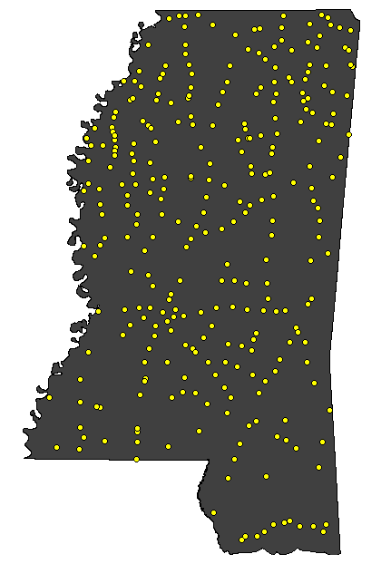

# 访问 shapefile

要对 shapefile 进行任何操作，我们需要将其作为数据源访问。要访问 shapefile，我们将使用 PyShp 打开它。在 PyShp 中，我们将添加以下代码：

```py
import shapefile
 r = shapefile.Reader('MSCities_Geo_Pts')
 r
<shapefile.Reader instance at 0x00BCB760>
```

我们创建了一个 shapefile `Reader`对象实例并将其设置为`r`变量。请注意，当我们向`Reader`类传递文件名时，我们没有使用任何文件扩展名。记住，我们至少在处理两个以`.shp`和`.dbf`结尾的不同文件。因此，这些两个文件共有的基本文件名是我们真正需要的所有。

然而，你可以使用文件扩展名。PyShp 将忽略它并使用基本文件名。那么，为什么你要添加扩展名呢？大多数操作系统允许文件名中有任意数量的点号。例如，你可能有一个以下基本名称的 shapefile：`myShapefile.version.1.2`。

在这种情况下，PyShp 将尝试解释最后一个点号之后的字符作为文件扩展名，这将导致`.2`。这个问题将阻止你打开 shapefile。所以，如果你的 shapefile 在基本名称中有点，你需要在文件名中添加文件扩展名，如`.shp`或`.dbf`。

一旦你打开了 shapefile 并创建了一个`Reader`对象，你可以从`Reader`对象获取一些关于地理数据的信息。在以下示例中，我们将从我们的`Reader`对象获取 shapefile 的边界框、形状类型和记录数：

```py
r.bbox
 [-91.38804855553174, 30.29314882296931, -88.18631833931401, 
 34.96091138678437]
 r.shapeType
 # 1
 r.numRecords
 # 298
```

包含最小 *x* 值、最小 *y* 值、最大 *x* 值和最大 *y* 值的边界框存储在 `r.bbox` 属性中，并以列表形式返回。形状类型作为 `shapeType` 属性可用，是由官方形状文件规范定义的数字代码。在这种情况下，`1` 代表点形状文件，`3` 代表线，`5` 代表多边形。最后，`numRecords` 属性告诉我们这个形状文件中有 `298` 条记录。因为它是一个简单的点形状文件，我们知道有 `298` 个点，每个点都有自己的 `.dbf` 记录。

下表显示了形状文件的不同几何类型及其对应的数字代码：

| **几何类型** | **数字代码** |
| --- | --- |
| `NULL` | 0 |
| `POINT` | 1 |
| `POLYLINE` | 3 |
| `POLYGON` | 5 |
| `MULTIPOINT` | 8 |
| `POINTZ` | 11 |
| `POLYLINEZ` | 13 |
| `POLYGONZ` | 15 |
| `MULTIPOINTZ` | 18 |
| `POINTM` | 21 |
| `POLYLINEM` | 23 |
| `POLYGONM` | 25 |
| `MULTIPOINTM` | 28 |
| `MULTIPATCH` | 31 |

现在我们知道了如何访问它，让我们看看我们如何读取这些文件。

# 读取形状文件属性

`.dbf` 文件是一种简单的数据库格式，其结构类似于具有行和列的电子表格，其中每一列都有一个标签，定义了它包含的信息。我们可以通过检查 `Reader` 对象的 `fields` 属性来查看这些信息：

```py
r.fields
 # [('DeletionFlag', 'C', 1, 0), ['STATEFP10', 'C', 2, 0], 
 ['PLACEFP10', 'C', 5, 0],
 # ['PLACENS10', 'C', 8, 0], ['GEOID10', 'C', 7, 0], ['NAME10', 'C', 
 100, 0],
 # ['NAMELSAD10', 'C', 100, 0], ['LSAD10', 'C', 2, 0], ['CLASSFP10', 
 'C', 2, 0],
 # ['PCICBSA10', 'C', 1, 0], ['PCINECTA10', 'C', 1, 0], ['MTFCC10', 
 'C', 5, 0],
 # ['FUNCSTAT10', 'C', 1, 0], ['ALAND10', 'N', 14, 0], ['AWATER10', 
 'N', 14,0],
 # ['INTPTLAT10', 'C', 11, 0], ['INTPTLON10', 'C', 12, 0]]
```

`fields` 属性返回了相当多的信息。字段包含有关每个字段的信息列表，称为 **字段描述符**。对于每个字段，以下信息被展示：

+   **字段名称**：这是字段作为文本的名称，对于形状文件而言，其长度不能超过 10 个字符。

+   **字段类型**：这是字段的类型，可以是文本、数字、日期、浮点数或布尔值，分别表示为 C、N、D、F 和 L。形状文件规范说明它使用 dBASE III 规范的 `.dbf` 格式，但大多数 GIS 软件似乎支持 dBASE IV。在版本 IV（4）中，数字和浮点数类型是等效的。

+   **字段长度**：这是数据中的字符或数字长度。

+   **十进制长度**：这是数字或浮点字段中的小数位数。

第一个字段描述符概述了一个隐藏的字段，它是 `.dbf` 文件格式规范的一部分。`DeletionFlag` 允许软件标记要删除的记录，而实际上并不删除它们。这样，信息仍然在文件中，但可以从显示的记录列表或搜索查询中删除。

如果我们只想获取字段名称而不是其他元数据，我们可以使用 Python 列推导式来仅返回描述符中的第一个项目（字段名称），并忽略 `DeletionFlag` 字段。以下示例创建了一个列推导式，它返回每个描述符中的第一个项目（字段名称），从第二个描述符开始忽略删除标志：

```py
[item[0] for item in r.fields[1:]]
# ['STATEFP10', 'PLACEFP10', 'PLACENS10', 'GEOID10', 'NAME10', 'NAMELSAD10', 'LSAD10',
# 'CLASSFP10', 'PCICBSA10', 'PCINECTA10', 'MTFCC10', 'FUNCSTAT10', 'ALAND10',
# 'AWATER10', 'INTPTLAT10', 'INTPTLON10']
```

现在，我们只有字段名，这要容易阅读得多。为了清晰起见，字段名都包含数字 `10`，因为这是该 shapefile 的 2010 年版本，它是每个普查的一部分。这类缩写由于字段名长度限制为 `10` 个字符而在 shapefile `.dbf` 文件中很常见。

接下来，让我们检查这些字段描述的一些记录。我们可以使用 `r.record()` 方法查看单个记录。我们知道从第一个例子中，有 `298` 条记录。所以，让我们以第三条记录为例。记录是通过列表索引访问的。在 Python 中，索引从 `0` 开始，所以我们必须从所需的记录号中减去 `1` 以获得索引。对于记录 3，索引将是 `2`。您只需将索引传递给 `record()` 方法，如下面的代码所示：

```py
r.record(2)
#['28', '16620', '02406337', '2816620', 'Crosby', 'Crosby town', '43', 'C1', 'N','N', # 'G4110', 'A', 5489412, 21336, '+31.2742552', '-091.0614840']
```

如您所见，字段名是独立于实际记录存储的。如果您想选择一个记录值，您需要它的索引。每个记录中城市名称的索引是 `4`：

```py
r.record(2)[4]
# 'Crosby'
```

但是计数索引是枯燥的。通过字段名引用值要容易得多。我们可以用几种方法将字段名与特定记录的值关联起来。第一种方法是使用 Python 列表的 `index()` 方法，通过字段名来程序化地获取索引：

```py
fieldNames = [item[0] for item in r.fields[1:]]
name10 = fieldNames.index('NAME10')
name10
# 4
r.record(2)[name10]
# 'Crosby'
```

我们还可以通过使用 Python 的内置 `zip()` 方法将字段名与值关联起来，该方法将两个或多个列表中的对应项匹配并合并到一个元组列表中。然后，我们可以遍历该列表，检查名称，然后获取相关的值，如下面的代码所示：

```py
fieldNames = [item[0] for item in r.fields[1:]]
fieldNames
# ['STATEFP10', 'PLACEFP10', 'PLACENS10', 'GEOID10', 'NAME10', 'NAMELSAD10',
# 'LSAD10', 'CLASSFP10', 'PCICBSA10', 'PCINECTA10', 'MTFCC10','FUNCSTAT10',
# 'ALAND10','AWATER10', 'INTPTLAT10', 'INTPTLON10']
 rec = r.record(2)
 rec
# ['28', '16620', '02406337', '2816620', 'Crosby', 'Crosby town',
# '43', 'C1', 'N','N', 'G4110', 'A', 5489412, 21336, '+31.2742552', '-091.0614840']
 zipRec = zip(fieldNames, rec)
 list(zipRec)
# [('STATEFP10', '28'), ('PLACEFP10', '16620'), ('PLACENS10', '02406337'),
# ('GEOID10', '2816620'), ('NAME10', 'Crosby'), ('NAMELSAD10', 'Crosby town'),
# ('LSAD10', '43'), ('CLASSFP10', 'C1'), ('PCICBSA10','N'),('PCINECTA10','N'),
# ('MTFCC10', 'G4110'), ('FUNCSTAT10', 'A'), ('ALAND10', 5489412),('AWATER10', 21336),
# ('INTPTLAT10', '+31.2742552'), ('INTPTLON10', '-091.0614840')]
for z in zipRec:
    if z[0] == 'NAME10': print(z[1])
# Crosby
```

我们还可以使用 `r.records()` 方法遍历 `.dbf` 记录。在这个例子中，我们将通过 Python 数组切片限制 `records()` 方法返回的列表的结果，只遍历前三个记录。正如我们之前提到的，shapefiles 不包含记录号，因此我们还将枚举记录列表，并动态创建记录号，以便输出更易于阅读。在这个例子中，我们将使用 `enumerate()` 方法，它将返回包含索引和记录的元组，如下面的代码所示：

```py
for rec in enumerate(r.records()[:3]):
    print(rec[0]+1, ': ', rec[1])
# 1 :  ['28', '59560', '02404554', '2859560', 'Port Gibson', 'Port Gibson city', '
# 25', 'C1', 'N', 'N', 'G4110', 'A', 4550230, 0, '+31.9558031', '-090.9834329']
# 2 :  ['28', '50440', '02404351', '2850440', 'Natchez', 'Natchez city', '25', 'C1',
#      'Y', 'N', 'G4110', 'A', 34175943, 1691489, '+31.5495016', '-091.3887298']
# 3 :  ['28', '16620', '02406337', '2816620', 'Crosby', 'Crosby town', '43', 'C1','N',
#       'N', 'G4110', 'A', 5489412, 21336, '+31.2742552', '-091.0614840']
```

这种枚举技巧是大多数 GIS 软件包在表格中显示记录时使用的。许多 GIS 分析师认为 shapefiles 存储记录号，因为每个 GIS 程序都会显示一个。但是，如果您删除了一个记录，例如在 ArcGIS 或 QGIS 中删除记录号 5，并保存文件，当您再次打开它时，您会发现之前记录号 6 的现在变成了记录 5。一些空间数据库可能为记录分配一个唯一的标识符。通常，唯一的标识符很有帮助。您始终可以在 `.dbf` 中创建另一个字段和列，并分配您自己的数字，即使记录被删除，这个数字也会保持不变。

如果你正在处理非常大的 shapefile，PyShp 有迭代方法可以更有效地访问数据。默认的`records()`方法一次将所有记录读入 RAM，这对于小的`.dbf`文件来说是可行的，但即使只有几千条记录，管理起来也变得困难。每次你使用`records()`方法时，你也可以同样使用`r.iterRecords()`方法。这种方法只保留提供当前记录所需的最小信息量，而不是整个数据集。在这个快速示例中，我们使用`iterRecords()`方法来计算记录数，以验证文件头部中的计数：

```py
counter = 0
for rec in r.iterRecords():
    counter += 1
counter
# 298
```

现在我们已经可以读取 shapefile 的一半，即属性，我们准备查看另一半，即几何形状。

# 读取 shapefile 几何形状

现在，让我们看看几何形状。之前，我们查看了一些头部信息，并确定这个 shapefile 是一个点 shapefile。所以，我们知道每个记录包含一个单独的点。让我们检查第一个几何形状记录：

```py
geom = r.shape(0)
geom.points
# [[-90.98343326763826, 31.9558035947602]]
```

在每个几何形状记录中，也称为`shape`，即使只有一个点，如本例所示，点也存储在名为`points`的列表中。点以*x*，*y*对的形式存储，因此如果使用该坐标系，经度在纬度之前。

shapefile 规范还允许 3D 形状。高程值沿着*z*-轴，通常称为*z*值。所以，一个 3D 点通常描述为*x*，*y*，*z*。在 shapefile 格式中，如果形状类型允许，*z*值存储在单独的*z*属性中。如果形状类型不允许*z*值，那么在 PyShp 读取记录时，该属性永远不会设置。带有*z*值的 shapefile 还包含度量值或*m*值，这些值很少使用，且在本示例中未使用。

一个度量是一个用户分配的值，可能与一个形状相关联。一个例子就是在特定位置记录的温度。还有另一类形状类型，允许为每个形状添加*m*值，但不能添加*z*值。这类形状类型被称为**M 形状类型**。就像*z*值一样，如果数据存在，则创建*m*属性；否则，则不会创建。你通常不会遇到带有*z*值的 shapefile，也很少会遇到带有*m*值设置的 shapefile。但有时你会遇到，所以了解它们是好的。就像我们的字段和记录`.dbf`示例一样，如果你不喜欢将*z*和*m*值存储在单独的列表中，你可以从点列表中使用`zip()`方法将它们合并。`zip`方法可以接受多个列表作为参数，这些参数由逗号分隔，正如我们在之前循环记录时演示的那样，将字段名称和属性连接起来。

当您使用 PyShp 创建`Reader`对象时，它是只读的。您可以在`Reader`对象中更改任何值，但它们不会被写入原始 shapefile。在下一个子节中，我们将看到我们如何在原始 shapefile 中进行更改。

# 修改 shapefile

要创建一个 shapefile，您还需要创建一个`Writer`对象。您可以在`Reader`或`Writer`对象中更改值；它们只是动态的 Python 数据类型。但您必须在某个时候，将`Reader`中的值复制到`Writer`中。PyShp 自动处理所有标题信息，例如边界框和记录计数。您只需关注几何和属性。您会发现这种方法比我们之前使用的 OGR 示例要简单得多。然而，它也仅限于 UTM 投影。

为了演示这个概念，我们将读取一个包含以度为单位单位的点的 shapefile，并将其转换为`Writer`对象中的 UTM 参考系统，然后保存它。我们将使用 PyShp 和本章之前讨论的 UTM 模块。我们将使用的 shapefile 是纽约市博物馆的 shapefile，我们将其重投影到 WGS84 地理坐标系。您也可以直接下载 ZIP 文件，该文件可在[`git.io/vLd8Y`](https://git.io/vLd8Y)找到。

在以下示例中，我们将读取 shapefile，为转换后的 shapefile 创建一个 writer，复制字段，然后是记录，最后在保存转换后的 shapefile 之前将每个点转换为几何记录。以下是代码：

```py
import shapefile
import utm
r = shapefile.Reader('NYC_MUSEUMS_GEO')
w = shapefile.Writer(r.shapeType)
w.fields = list(r.fields)
w.records.extend(r.records())
for s in r.iterShapes():
    lon,lat = s.points[0]
    y,x,zone,band = utm.from_latlon(lat,lon)
    w.point(x,y)
w.save('NYC_MUSEUMS_UTM')
```

如果您要打印第一个 shape 的第一个点，您将看到以下内容：

```py
print(w.shapes()[0].points[0])
# [4506346.393408813, 583315.4566450359, 0, 0]
```

点以包含四个数字的列表形式返回。前两个是*x*和*y*值，而最后两个是占位符，在这种情况下分别用于高程和测量值，这些值在写入这些类型的 shapefile 时使用。此外，我们没有编写 PRJ 投影文件，就像我们在先前的重投影示例中所做的那样。以下是一个使用[`spatialreference.org/`](https://spatialreference.org/)中的 EPSG 代码创建 PRJ 文件的方法。先前的示例中的`zone`变量告诉我们我们正在使用 UTM Zone 18，即 EPSG 代码 26918。以下代码将创建一个`prj`文件：

```py
from urllib.request import urlopen
prj = urlopen('http://spatialreference.org/ref/epsg/26918/esriwkt/')
with open('NYC\_MUSEUMS\_UTM', 'w') as f:
    f.write(str(prj.read()))
```

作为另一个示例，我们可以在 shapefile 中添加一个新功能。在这个例子中，我们将向表示热带风暴的 shapefile 中添加第二个多边形。您可以在此处下载此示例的压缩 shapefile：[`git.io/vLdlA`](https://git.io/vLdlA)。

我们将读取 shapefile，将其复制到`Writer`对象中，添加新的多边形，并使用以下代码以相同的文件名将其写回：

```py
import shapefile
file_name = "ep202009.026_5day_pgn.shp"
r = shapefile.Reader(file_name)
with shapefile.Writer("test", r.shapeType) as w: 
    w.fields = list(r.fields) 
    for rec in r.records():
        w.record(*list(rec)) 
    for s in r.shapes():
        w._shapeparts(parts=[s.points], shapeType=s.shapeType) 
    w.poly([[[-104, 24], [-104, 25], [-103, 25], [-103, 24], [-104, 
    24]]]) 
    w.record("STANLEY", "TD", "091022/1500", "27", "21", "48", "ep")
```

这就是我们如何在原始 shapefile 中进行更改的方法。现在，让我们看看我们如何在 shapefile 中添加新字段。

# 添加字段

在形状文件上执行的一个非常常见的操作是向它们添加额外的字段。这个操作很简单，但有一个重要的元素需要记住。当你添加一个字段时，你也必须遍历记录并为该列创建一个空单元格或添加一个值。作为一个例子，让我们向纽约市博物馆的 UTM 版本形状文件添加一个参考纬度和经度列：

1.  首先，我们将打开形状文件并创建一个新的`Writer`对象：

```py
import shapefile
r = shapefile.Reader('NYC_MUSEUMS_UTM')
with shapefile.Writer("test", r.shapeType) as w:
```

1.  接下来，我们将字段作为长度为`8`的浮点类型添加，整个字段的精度最高为`5`位小数：

```py
   w.fields = list(r.fields)
   w.field('LAT','F',8,5)
   w.field('LON','F',8,5)
```

1.  接下来，我们将打开地理版本的形状文件并从每个记录中获取坐标。我们将这些坐标添加到 UTM 版本`.dbf`中的相应属性记录中：

```py
    for i in range(len(r.shapes())):
        lon, lat = r.shape(i).points[0]
        w.point(lon, lat)
        w.record(*list(r.record(i)), lat, lon)
```

在下一个子节中，我们将看到如何合并多个形状文件。

# 合并形状文件

将多个相同类型的相关形状文件聚合到一个更大的形状文件中是另一种非常有用的技术。你可能是在一个团队中工作，该团队将感兴趣的区域划分成几个部分，然后在一天结束时组装数据。或者，你可能从一系列现场传感器（如气象站）中聚合数据。

对于这个示例，我们将使用一套县建筑足迹，该县分别维护在四个不同的象限（西北、东北、西南和东南）。你可以将这些形状文件作为一个单独的 ZIP 文件下载，链接为[`git.io/vLbUE`](http://git.io/vLbUE)。

当你解压这些文件时，你会看到它们按象限命名。以下脚本使用 PyShp 将它们合并成一个形状文件：

```py
import glob
import shapefile
files = glob.glob('footprints_*shp')
with shapefile.Writer("Merged") as w:
    r = None
    for f in files:
        r = shapefile.Reader(f)
        if not w.fields:
            w.fields = list(r.fields)
        for rec in r.records():
            w.record(*list(rec))
        for s in r.shapes():
            w._shapeparts(parts=[s.points], shapeType=s.shapeType)
```

如你所见，合并一系列形状文件非常直接。然而，我们没有进行任何合理性检查以确保所有形状文件都是同一类型，如果你打算将此脚本用于重复的自动化过程，而不是仅仅是一次性过程，你可能需要这样做。

关于这个示例的另一个注意事项是我们如何调用`Writer`对象。在其他示例中，我们使用一个数字代码来定义形状类型。你可以直接定义那个数字（例如，对于点形状文件为 1）或调用 PyShp 的一个常量。常量是大写字母表示的形状文件类型。例如，多边形如下所示：

```py
shapefile.POLYGON
```

在这个情况下，该常数的值是 5。当从`Reader`对象复制数据到`Writer`对象时，你会注意到形状类型定义只是简单地引用，如下面的示例所示：

```py
r = shapefile.Reader('myShape')
w = shapefile.Writer("myShape", r.shapeType)
```

这种方法使你的脚本更加健壮，因为如果以后更改脚本或数据集，脚本中有一个更少的变量需要更改。在合并示例中，当我们调用`Writer`时，我们没有`Reader`对象可用的好处。

我们可以打开列表中的第一个 shapefile 并检查其类型，但这会增加几行代码。更简单的方法是省略形状类型。如果`Writer`的形状类型没有保存，PyShp 将忽略它，直到你保存 shapefile。那时，它将检查单个几何记录的标题并据此确定。

虽然你可以在特殊情况下使用这种方法，但当你能明确定义形状类型时，为了清晰和确保安全，防止任何异常情况错误，最好明确定义形状类型。以下插图是此数据集的样本，以便你更好地了解数据的外观，因为我们将在接下来的使用中更多地使用它：

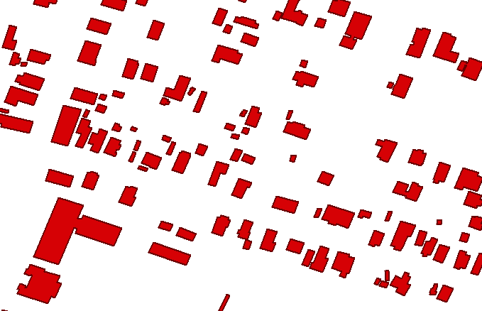

现在，让我们看看如何使用`.dbfpy`文件来完成这个操作。

# 使用 dbfpy 合并 shapefiles

PyShp 的`.dbf`部分有时会遇到与某些软件生成的`.dbf`文件相关的问题。幸运的是，PyShp 允许你分别操作不同的 shapefile 类型。有一个更健壮的`.dbf`库，名为`dbfpy3`，我们在第四章“地理空间 Python 工具箱”中讨论过。你可以使用 PyShp 来处理`.shp`和`.shx`文件，而`.dbfpy`处理更复杂的`.dbf`文件。你可以从这里下载模块：[`github.com/GeospatialPython/dbfpy3/archive/master.zip`](https://github.com/GeospatialPython/dbfpy3/archive/master.zip)。

这种方法需要更多的代码，但它通常会在 PyShp 单独处理`.dbf`问题时失败的地方成功。本例使用与上一个示例相同的 shapefiles。在下面的示例中，我们将仅使用其属性合并一个 shapefile：

1.  首先，我们导入所需的库，使用 glob 模块获取 shapefiles 列表，并使用 PyShp 创建一个 shapefile `Writer`对象：

```py
import glob
import shapefile
from dbfpy3 import dbf
shp_files = glob.glob('footprints_*.shp')
w = shapefile.Writer(shp="merged.shp", shx="merged.shx")
```

1.  现在，我们将只打开`.shp`文件并复制几何数据到 writer。稍后我们将使用`dbfpy3`模块来获取属性，以演示分别处理 shapefile 组件：

```py
# Loop through ONLY the shp files and copy their shapes
# to a Writer object. We avoid opening the dbf files
# to prevent any field-parsing errors.
for f in shp_files:
    print("Shp: {}".format(f))
    r = shapefile.Reader(f)
    r = shapefile.Reader(shp=shpf)
    for s in r.shapes():
        w.poly([s.points])
    print("Num. shapes: {}".format(len(w.shapes())))
```

1.  一旦所有几何数据都复制到 writer 中，我们就可以保存`.shp`文件，并让 PyShp 为几何创建索引文件：

```py
# Save only the shp and shx index file to the new
# merged shapefile.
w.close()
```

1.  接下来，我们可以使用`glob`模块获取`.dbf`文件列表：

```py
# Now we come back with dbfpy and merge the dbf files
dbf\_files = glob.glob('\*.dbf')
```

1.  接下来，我们将使用列表中的第一个`.dbf`文件作为模板来获取字段数据，并使用它来设置 shapefile writer 的属性：

```py
# Use the first dbf file as a template
template = dbf\_files.pop(0)
merged\_dbf\_name = 'merged.dbf'
# Copy the entire template dbf file to the merged file
merged\_dbf = open(merged\_dbf\_name, 'wb')
temp = open(template, 'rb')
merged\_dbf.write(temp.read())
merged\_dbf.close()
temp.close()
```

1.  然后，我们简单地遍历`.dbf`文件并将记录复制到`Writer:`中

```py
# Now read each record from the remaining dbf files
# and use the contents to create a new record in
# the merged dbf file.
db = dbf.Dbf(merged\_dbf\_name)
for f in dbf\_files:
    print('Dbf: {}'.format(f))
    dba = dbf.Dbf(f)
    for rec in dba:
        db\_rec = db.newRecord()
        for k, v in list(rec.asDict().items()):
            db\_rec[k] = v
        db\_rec.store()
db.close()
```

现在我们知道了如何合并 shapefiles，让我们来看看如何分割它们。

# 分割 shapefiles

有时，你可能还需要分割较大的 shapefiles，以便更容易地关注感兴趣的子集。这种分割，或子集化，可以是空间上的，也可以是按属性进行的，具体取决于对数据的哪个方面感兴趣。

# 空间子集化

提取数据集的一部分的一种方法是通过使用空间属性，如大小。在以下示例中，我们将子集我们合并的东南象限文件。我们将通过面积过滤建筑足迹多边形，并将面积不超过 100 平方米（约 1,000 平方英尺）的任何建筑导出到新的 shapefile。我们将使用`footpints_se` shapefile 进行此操作。

PyShp 有一个接受坐标列表并返回正或负面积的签名面积方法。我们将使用`utm`模块将坐标转换为米。通常，正或负面积表示多边形点的顺序是顺时针还是逆时针，分别。但在这里，点的顺序并不重要，所以我们将使用`abs()`函数的绝对值，如下所示，当我们获取面积值时：

```py
import shapefile
import utm
r = shapefile.Reader('footprints\_se')
w = shapefile.Writer(r.shapeType)
w.fields = list(r.fields)
for sr in r.shapeRecords():
    utmPoints = []
    for p in sr.shape.points:
        x,y,band,zone = utm.from_latlon(p[1],p[0])
        utmPoints.append([x,y])
    area = abs(shapefile.signed_area(utmPoints))
    if area <= 100:
        w._shapes.append(sr.shape)
        w.records.append(sr.record)
w.save('footprints\_185')
```

让我们看看原始 shapefile 和子集 shapefile 之间记录数量的差异：

```py
r = shapefile.Reader('footprints\_se')
subset = shapefile.Reader('footprints\_185')
print(r.numRecords)
# 26447
print(subset.numRecords)
# 13331
```

现在我们有一些实质性的构建块，用于使用矢量数据和属性进行地理空间分析。

# 执行选择

之前的子集示例是选择数据的一种方法。还有许多其他方法可以用于进一步分析的数据子集。在本节中，我们将检查选择对高效数据处理至关重要的数据子集，以将大型数据集的大小减少到给定数据集的兴趣区域。

# 点在多边形中的公式

我们在第一章中简要讨论了点在多边形中的公式，*使用 Python 学习地理空间分析*，作为常见类型的地理空间操作。你会发现它是最有用的公式之一。该公式相对简单。

以下函数使用**光线投射**方法执行此检查。该方法从测试点绘制一条线穿过多边形，并计算它穿过多边形边界的次数。如果计数为偶数，则点位于多边形外部。如果为奇数，则它在内部。这种特定的实现还检查该点是否位于多边形的边缘：

```py
def point_in_poly(x,y,poly):
    # check if point is a vertex
    if (x,y) in poly: return True
    # check if point is on a boundary
    for i in range(len(poly)):
       p1 = None
       p2 = None
       if i==0:
          p1 = poly[0]
          p2 = poly[1]
       else:
          p1 = poly[i-1]
          p2 = poly[i]
       if p1[1] == p2[1] and p1[1] == y and x min(p1[0], \
          p2[0]) and x < max(p1[0], p2[0]):
          return True
    n = len(poly)
    inside = False
    p1x,p1y = poly[0]
    for i in range(n+1):
       p2x,p2y = poly[i % n]
       if y min(p1y,p2y):
          if y <= max(p1y,p2y):
             if x <= max(p1x,p2x):
                if p1y != p2y:
                   xints = (y-p1y)*(p2x-p1x)/(p2y-p1y)+p1x
                if p1x == p2x or x <= xints:
                   inside = not inside
       p1x,p1y = p2x,p2y
    if inside: return True
    return False
```

现在，让我们使用`point_in_poly()`函数测试智利的点：

```py
# Test a point for inclusion
myPolygon = [(-70.593016,-33.416032), (-70.589604,-33.415370),
(-70.589046,-33.417340), (-70.592351,-33.417949),
(-70.593016,-33.416032)]
# Point to test
lon = -70.592000
lat = -33.416000
print(point_in_poly(lon, lat, myPolygon))
# True
```

这表明点位于内部。让我们也验证边缘点将被检测到：

```py
# test an edge point
lon = -70.593016
lat = -33.416032
print(point_in_poly(lon, lat, myPolygon))
# True
```

你会发现这个函数有新的用途。它绝对是你工具箱中应该保留的一个。

# 包围盒选择

包围盒是能够完全包含一个特征的最小矩形。我们可以将其用作从更大的数据集中高效地子集一个或多个单个特征的有效方法。我们将通过一个示例来查看如何使用简单的包围盒来隔离一组复杂的特征并将其保存为新的 shapefile。在这个例子中，我们将从美国大陆的主要道路 shapefile 中提取波多黎各岛上的道路。您可以从这里下载 shapefile： [`github.com/GeospatialPython/Learn/raw/master/roads.zip`](https://github.com/GeospatialPython/Learn/raw/master/roads.zip)。

浮点坐标比较可能很昂贵，但由于我们使用的是矩形而不是不规则多边形，这段代码对于大多数操作来说已经足够高效：

```py
import shapefile
r = shapefile.Reader('roadtrl020')
w = shapefile.Writer(r.shapeType)
w.fields = list(r.fields)
xmin = -67.5
xmax = -65.0
ymin = 17.8
ymax = 18.6
for road in r.iterShapeRecords():
    geom = road.shape
    rec = road.record
    sxmin, symin, sxmax, symax = geom.bbox
    if sxmin < xmin: continue
    elif sxmax xmax: continue
    elif symin < ymin: continue
    elif symax ymax: continue
    w._shapes.append(geom)
    w.records.append(rec)
w.save('Puerto_Rico_Roads')
```

现在我们已经使用几何形状选择了要素，让我们换一种方式，通过使用属性来操作。

# 属性选择

我们现在已经看到了两种不同的方法来子集化更大的数据集，基于空间关系得到一个更小的数据集。但我们也可以使用属性字段来选择数据。因此，让我们快速检查一下使用属性表来子集化矢量数据的方法。在这个例子中，我们将使用一个多边形形状文件，它包含密密麻麻的城市地区在密西西比州内。你可以从这个链接下载这个压缩的形状文件 [`git.io/vLbU9`](http://git.io/vLbU9)。

这个脚本实际上非常简单。它创建了 `Reader` 和 `Writer` 对象，复制 `.dbf` 字段，遍历记录以匹配属性，然后将它们添加到 `Writer`。我们将选择人口少于 `5000` 的城市地区：

```py
import shapefile
# Create a reader instance
r = shapefile.Reader('MS_UrbanAnC10')
# Create a writer instance
w = shapefile.Writer(r.shapeType)
# Copy the fields to the writer
w.fields = list(r.fields)
# Grab the geometry and records from all features
# with the correct population
selection = []
for rec in enumerate(r.records()):
    if rec[1][14] < 5000:
        selection.append(rec)
# Add the geometry and records to the writer
for rec in selection:
    w._shapes.append(r.shape(rec[0]))
    w.records.append(rec[1])
# Save the new shapefile
w.save('MS_Urban_Subset')
```

属性选择通常很快。空间选择由于浮点计算而计算成本高昂。尽可能确保你首先无法使用属性选择来子集化。以下插图显示了包含所有城市区域的起始形状文件，左侧有一个州边界，以及之前的属性选择后，右侧人口少于 5,000 的人的城市区域：


让我们看看使用 `fiona` 的相同示例，它利用了 OGR 库。我们将使用嵌套的 `with` 语句来减少正确打开和关闭文件所需的代码量：

```py
import fiona
with fiona.open('MS_UrbanAnC10.shp') as sf:
    filtered = filter(lambda f: f['properties']['POP'] < 5000, sf)
    # Shapefile file format driver
    drv = sf.driver
    # Coordinate Reference System
    crs = sf.crs
    # Dbf schema
    schm = sf.schema
    subset = 'MS_Urban_Fiona_Subset.shp'
    with fiona.open(subset, 'w',
        driver=drv,
        crs=crs,
        schema=schm) as w:
            for rec in filtered:
                w.write(rec)
```

现在，我们已经知道如何组合离散数据集以及将更大的数据集拆分。我们还能做什么？我们可以在数据集内部聚合要素。

# 聚合几何

GIS 矢量数据集通常由点、线或多边形要素组成。GIS 的一个原则是，地理位置上更接近的事物比地理位置上更远的事物关系更密切。当你有一组相关要素时，通常，对于你试图完成的分析来说，细节太多。将它们概括以加快处理速度或简化地图是有用的。这种操作称为**聚合**。聚合的一个常见例子是将一组地方政治边界合并成更大的政治边界，例如将县合并成州，或将州合并成国家，或国家合并成洲。

在这个例子中，我们将做的是将包括美国密西西比州所有县的数据集转换成一个代表整个州的单个多边形。Python 的 Shapely 库非常适合这种操作；然而，它只能操作几何形状，不能读取或写入数据文件。为了读取和写入数据文件，我们将使用 Fiona 库。如果您还没有安装 Shapely 或 Fiona，请使用`pip`安装它们。您可以从这里下载县数据集：[`git.io/fjt3b`](https://git.io/fjt3b)。

以下插图显示了县数据集的外观：

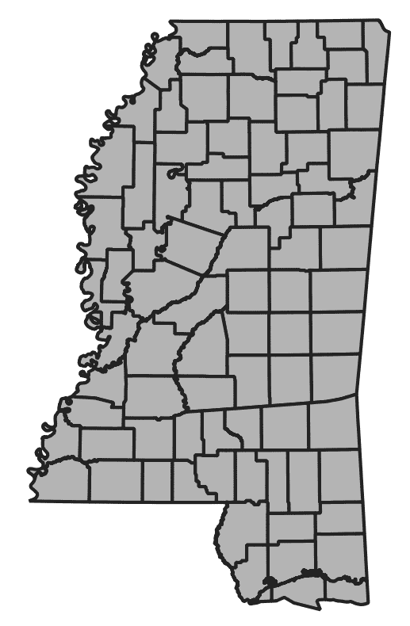

以下步骤将向您展示如何将单个县多边形合并成一个多边形：

1.  在以下代码中，我们导入所需的库，包括`shapely`库的不同部分。

1.  然后，我们将打开县 GeoJSON 文件。

1.  接下来，我们将复制源文件的架构，它定义了数据集的所有元数据。

1.  然后，我们需要修改元数据副本以更改属性，以便定义一个用于州名的单个属性。我们还需要将几何类型从*MultiPolygon*更改为*Polygon*。

1.  然后，我们将打开我们的输出数据集 GeoJSON 文件，命名为`combined.geojson`。

1.  接下来，我们将提取所有多边形和属性，并将所有多边形合并成一个。

1.  最后，我们将使用新属性将合并的多边形写出来。

1.  我们将导入我们的库，包括`OrderDict`，以便我们可以控制 shapefile 属性：

```py
# Used OrderedDict to control the order
# of data attributes
from collections import OrderedDict
# Import the shapely geometry classes and methods.
# The "mapping" method returns a GeoJSON representation
# of a geometry.
from shapely.geometry import shape, mapping, Polygon
# Import the shapely union function which combines
# geometries
from shapely.ops import unary_union
# Import Fiona to read and write datasets
import fiona
```

1.  我们打开我们的 GeoJSON 文件并复制元数据：

```py
# Open the counties dataset
with fiona.open('ms_counties.geojson') as src:
    # copy the metadata
    schema = src.meta.copy()
    # Create a new field type for our
    # state dataset
    fields = {"State": "str:80"}
```

1.  然后，我们创建我们的新字段：

```py
    # Create a new property for our dataset
    # using the new field
    prop = OrderedDict([("State", "Mississippi")])
    # Change the metadata geometry type to Polygon
    schema['geometry'] = 'Polygon'
    schema['schema']['geometry'] = 'Polygon'
```

1.  现在，我们可以将新字段添加到元数据中：

```py
    # Add the new field
    schema['properties'] = fields
    schema['schema']['properties'] = fields
```

1.  接下来，我们可以打开合并的 GeoJSON 文件并写出我们的结果：

```py
# Open the output GeoJSON dataset
with fiona.open('combined.geojson', 'w', **schema) as dst:
    # Extract the properties and geometry 
    # from the counties dataset
    props, geom = zip(*[(f['properties'],shape(f['geometry'])) for
    f in src])
    # Write the new state dataset out while 
    # combining the polygons into a
    # single polygon and add the new property
    dst.write({'geometry': mapping(\
    Polygon(unary_union(geom).exterior)),
    'properties': prop})
```

输出数据集将类似于以下插图：


现在我们已经了解了关于读取、编辑和写入 GIS 数据的一切，我们可以在接下来的章节中开始可视化它。

# 创建用于可视化的图像

现在，我们正从计算和数据编辑转向我们可以看到的东西！我们将从创建不同类型的地图开始。在第一章，*使用 Python 学习地理空间分析*，我们使用 Python 附带的自带 Tkinter 模块可视化了我们的 SimpleGIS 程序。在第四章，*地理空间 Python 工具箱*，我们检查了创建图像的几种其他方法。现在，我们将通过创建两种特定的主题地图来更深入地研究这些工具。第一种是点密度图，第二种是面状图。

首先，让我们从点密度图开始。

# 点密度计算

点密度图显示了给定区域内主题的集中情况。如果一个区域被划分为包含统计信息的多边形，你可以使用在该区域内使用固定比例随机分布的点来模拟该信息。这种类型的地图通常用于人口密度图。

在第一章，“使用 Python 学习地理空间分析”，中的猫图是一个点密度图。让我们从头开始使用纯 Python 创建一个点密度图。纯 Python 允许你使用更轻量级的库，这些库通常更容易安装，并且更便携。在这个例子中，我们将使用美国人口普查局沿美国墨西哥湾沿岸的普查区形状文件，其中包含人口数据。我们还将使用点在多边形内算法来确保随机分布的点位于适当的人口普查区内。最后，我们将使用`PNGCanvas`模块来输出我们的图像。

`PNGCanvas`模块非常出色且速度快。然而，它没有填充简单矩形以外的多边形的能力。你可以实现一个填充算法，但在纯 Python 中它非常慢。然而，对于快速轮廓和点绘图，它做得很好。

你还会看到`world2screen()`方法，这与我们在第一章，“使用 Python 学习地理空间分析”中的 SimpleGIS 中使用的坐标到映射算法类似。在这个例子中，我们将读取形状文件并将其作为图像写回：

1.  首先，我们导入我们需要的库，包括`pngcanvas`，以绘制地图图像：

```py
import shapefile
import random
import pngcanvas
```

1.  接下来，我们定义我们的点在多边形内函数，我们之前已经使用过。在这个例子中，我们将使用它来在位置内随机分布人口值：

```py
def point_in_poly(x,y,poly):
    '''Boolean: is a point inside a polygon?'''
    # check if point is a vertex
    if (x,y) in poly: return True
    # check if point is on a boundary
    for i in range(len(poly)):
        p1 = None
        p2 = None
        if i==0:
            p1 = poly[0]
            p2 = poly[1]
        else:
            p1 = poly[i-1]
            p2 = poly[i]
        if p1[1] == p2[1] and p1[1] == y and \
        x min(p1[0], p2[0]) and x < max(p1[0], p2[0]):
            return True
    n = len(poly)
    inside = False
    p1x,p1y = poly[0]
    for i in range(n+1):
        p2x,p2y = poly[i % n]
        if y min(p1y,p2y):
            if y <= max(p1y,p2y):
                if x <= max(p1x,p2x):
                    if p1y != p2y:
                        xints = (y-p1y)*(p2x-p1x)/(p2y-p1y)+p1x
                    if p1x == p2x or x <= xints:
                    inside = not inside
        p1x,p1y = p2x,p2y
    if inside: return True
    else: return False
```

1.  现在，我们需要一个函数来将我们的地理空间坐标缩放到地图图像：

```py
def world2screen(bbox, w, h, x, y):
    '''convert geospatial coordinates to pixels'''
    minx,miny,maxx,maxy = bbox
    xdist = maxx - minx
    ydist = maxy - miny
    xratio = w/xdist
    yratio = h/ydist
    px = int(w - ((maxx - x) * xratio))
    py = int((maxy - y) * yratio)
    return (px,py)
```

1.  接下来，我们读取形状文件并设置输出地图图像的大小：

```py
# Open the census shapefile
inShp = shapefile.Reader('GIS_CensusTract_poly')
# Set the output image size
iwidth = 600
iheight = 400
```

1.  接下来，我们需要确定人口字段的索引，以便我们可以获取每个区域的人口计数：

```py
# Get the index of the population field
pop_index = None
dots = []
for i,f in enumerate(inShp.fields):
    if f[0] == 'POPULAT11':
        # Account for deletion flag
        pop_index = i-1
```

1.  然后，我们计算人口密度值。我们希望在地图上为每 100 人创建一个点：

```py
# Calculate the density and plot points
for sr in inShp.shapeRecords():
    population = sr.record[pop_index]
    # Density ratio - 1 dot per 100 people
    density = population / 100
    found = 0
```

1.  我们将遍历每个多边形，随机分布点以创建密度图：

```py
# Randomly distribute points until we
# have the correct density
while found < density:
    minx, miny, maxx, maxy = sr.shape.bbox
    x = random.uniform(minx,maxx)
    y = random.uniform(miny,maxy)
    if point_in_poly(x,y,sr.shape.points):
        dots.append((x,y))
        found += 1
```

1.  现在我们已经准备好创建我们的输出图像：

```py
# Set up the PNG output image
c = pngcanvas.PNGCanvas(iwidth,iheight)
# Draw the red dots
c.color = (255,0,0,0xff)
for d in dots:
    # We use the *d notation to exand the (x,y) tuple
    x,y = world2screen(inShp.bbox, iwidth, iheight, *d)
    c.filled_rectangle(x-1,y-1,x+1,y+1)
```

1.  我们已经创建了点。现在，我们需要创建人口普查区的轮廓：

```py
# Draw the census tracts
c.color = (0,0,0,0xff)
for s in inShp.iterShapes():
    pixels = []
    for p in s.points:
        pixel = world2screen(inShp.bbox, iwidth, iheight, *p)
        pixels.append(pixel)
    c.polyline(pixels)
```

1.  最后，我们将保存输出图像：

```py
# Save the image
with open('DotDensity.png','wb') as img:
    img.write(c.dump())
```

此脚本输出人口普查区的轮廓，以及密度点，以非常有效地展示人口集中情况：

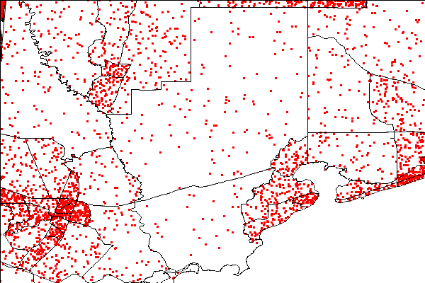

现在，让我们看看地图的第二种类型：渐变图。

# 渐变图

水色图使用阴影、着色或符号来显示一个区域内平均的值或数量。它们使我们能够将大量数据作为总结来可视化。如果相关数据跨越多个多边形，这种方法很有用。例如，在按国家划分的全球人口密度地图中，许多国家有断开的多边形（例如，夏威夷是美国的一个岛国）。

在本例中，我们将使用我们在第三章中讨论的**Python Imaging Library**（**PIL**），*地理空间技术景观*。PIL 不是纯 Python 编写的，但它是专门为 Python 设计的。我们将重新创建我们之前的点密度示例，作为水色图。我们将根据每平方公里的人数（人口）计算每个普查区的密度比率，并使用该值调整颜色。深色表示人口密集，浅色表示人口稀疏。按照以下步骤操作：

1.  首先，我们将导入我们的库：

```py
import math
import shapefile
try:
   import Image
   import ImageDraw
except:
   from PIL import Image, ImageDraw
```

1.  然后，我们需要我们的地理坐标到图像坐标转换函数：

```py
def world2screen(bbox, w, h, x, y):
    '''convert geospatial coordinates to pixels'''
    minx,miny,maxx,maxy = bbox
    xdist = maxx - minx
    ydist = maxy - miny
    xratio = w/xdist
    yratio = h/ydist
    px = int(w - ((maxx - x) * xratio))
    py = int((maxy - y) * yratio)
    return (px,py)
```

1.  现在，我们打开我们的形状文件并设置输出图像大小：

```py
# Open our shapefile
inShp = shapefile.Reader('GIS_CensusTract_poly')
iwidth = 600
iheight = 400
```

1.  然后，我们设置 PIL 来绘制我们的地图图像：

```py
# PIL Image
img = Image.new('RGB', (iwidth,iheight), (255,255,255))
# PIL Draw module for polygon fills
draw = ImageDraw.Draw(img)
```

1.  就像我们之前的例子一样，我们需要获取人口字段的索引：

```py
# Get the population AND area index
pop_index = None
area_index = None
# Shade the census tracts
for i,f in enumerate(inShp.fields):
    if f[0] == 'POPULAT11':
        # Account for deletion flag
        pop_index = i-1
    elif f[0] == 'AREASQKM':
        area_index = i-1
```

1.  现在，我们可以绘制多边形，根据人口密度着色，并保存图像：

```py
# Draw the polygons
for sr in inShp.shapeRecords():
    density = sr.record[pop_index]/sr.record[area_index]
    # The 'weight' is a scaled value to adjust the color
    # intensity based on population
    weight = min(math.sqrt(density/80.0), 1.0) * 50
    R = int(205 - weight)
    G = int(215 - weight)
    B = int(245 - weight)
    pixels = []
    for x,y in sr.shape.points:
        (px,py) = world2screen(inShp.bbox, iwidth, iheight, x, y)
        pixels.append((px,py))
        draw.polygon(pixels, outline=(255,255,255), fill=(R,G,B))
    img.save('choropleth.png')
```

此脚本使用相对密度绘制以下图表。您可以使用 R、G 和 B 变量调整颜色：

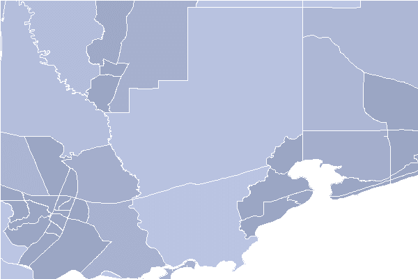

现在我们能够从形状文件中展示统计数据，我们可以看看比形状文件更常见的统计数据源：电子表格。

# 使用电子表格

如 Microsoft Office Excel 和 Open Office Calc 之类的电子表格便宜（甚至免费）、无处不在、易于使用，非常适合记录结构化数据。出于这些原因，电子表格被广泛用于收集数据以输入 GIS 格式。作为一名分析师，您会发现您经常需要与电子表格打交道。

在前面的章节中，我们讨论了 CSV 格式，它是一种与电子表格具有相同基本行和列数据结构的文本文件。对于 CSV 文件，您使用 Python 的内置`csv`模块。但大多数时候，人们不会费心将真正的电子表格导出为通用的 CSV 文件。这就是纯 Python 的`xlrd`模块发挥作用的地方。`xlrd`这个名字是**Excel Reader**的缩写，可以从 PyPI 获取。还有一个配套的模块，即`xlwt`（Excel Writer）模块，用于编写电子表格。这两个模块使得读写 Excel 电子表格变得轻而易举。结合 PyShp，您可以轻松地在电子表格和形状文件之间转换。本例演示了将电子表格转换为形状文件的过程。我们将使用纽约市博物馆点数据的电子表格版本，该版本可在[`git.io/Jemi9`](https://git.io/Jemi9)找到。

电子表格包含属性数据，后面跟着一个*x*列（经度）和一个*y*列（纬度）。要将其导出为形状文件，我们将执行以下步骤：

1.  打开电子表格。

1.  创建一个形状文件`Writer`对象。

1.  将电子表格的第一行作为`dbf`列。

1.  遍历电子表格的每一行，并将属性复制到`dbf`。

1.  从电子表格的*x*和*y*列创建一个点。

脚本如下：

```py
import xlrd
import shapefile
# Open the spreadsheet reader
xls = xlrd.open_workbook('NYC_MUSEUMS_GEO.xls')
sheet = xls.sheet_by_index(0)
# Open the shapefile writer
w = shapefile.Writer(shapefile.POINT)
# Move data from spreadsheet to shapefile
for i in range(sheet.ncols):
    # Read the first header row
    w.field(str(sheet.cell(0,i).value), 'C', 40)
for i in range(1, sheet.nrows):
    values = []
    for j in range(sheet.ncols):
        values.append(sheet.cell(i,j).value)
    w.record(*values)
    # Pull latitude/longitude from the last two columns
    w.point(float(values[-2]),float(values[-1]))
w.save('NYC_MUSEUMS_XLS2SHP')
```

将形状文件转换为电子表格是一个不太常见的操作，尽管并不困难。要将形状文件转换为电子表格，您需要确保使用*添加字段*示例，该示例来自本章*编辑形状文件*部分，您有一个*x*和*y*列。您将遍历形状，并将*x*、*y*值添加到这些列中。然后，您将读取字段名称和`dbf`中的列值到一个`xlwt`电子表格对象或 CSV 文件中，使用`csv`模块。坐标列在以下屏幕截图中有标签：

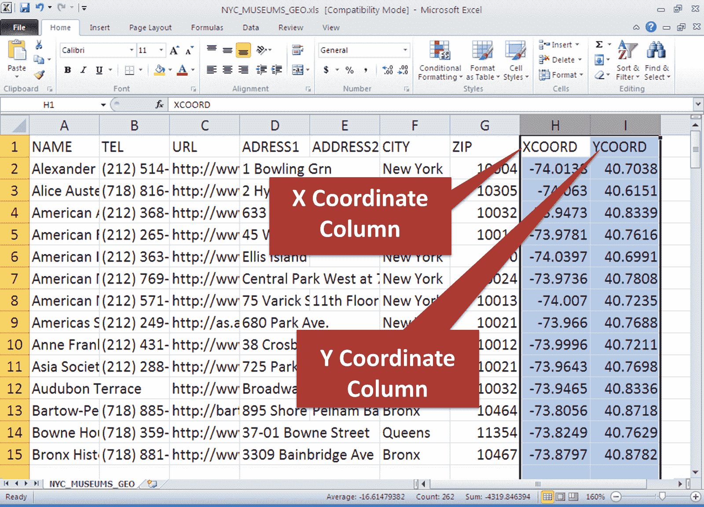

在下一节中，我们将使用电子表格作为输入数据源。

# 创建热图

热图用于使用显示密度的栅格图像来显示数据的地理聚类。聚类还可以通过使用数据中的一个字段来权衡，不仅显示地理密度，还显示强度因子。在这个例子中，我们将使用包含在 CSV 数据集中的熊目击数据来创建密西西比州不同地区的熊目击频率热图。这个数据集非常简单，我们将把 CSV 文件当作文本文件处理，这是 CSV 文件的一个很好的特性。

您可以在此处下载数据集：[`git.io/fjtGL`](https://git.io/fjtGL)。

输出将是一个简单的 HTML 网络地图，您可以在任何网络浏览器中打开。该网络地图将基于优秀的 Leaflet JavaScript 库。在此基础上，我们将使用 Python Folium 库，这使得我们能够轻松创建 Leaflet 网络地图，以生成 HTML 页面：

```py
import os
import folium
from folium.plugins import HeatMap
f = open('bear_sightings.csv', 'r')
lines = f.readlines()
lines.pop(0)
data = []
bears = [list(map(float, l.strip().split(','))) for l in lines]
m = folium.Map([32.75, -89.52], tiles='stamentonerbackground', zoom_start=7, max_zoom=7, min_zoom=7)
HeatMap(bears, max_zoom=16, radius=22, min_opacity=1, blur=30).add_to(m)
m.save('heatmap.html')
```

此脚本将创建一个名为`heatmap.html`的文件。在任何网络浏览器中打开它，您将看到类似的图像：

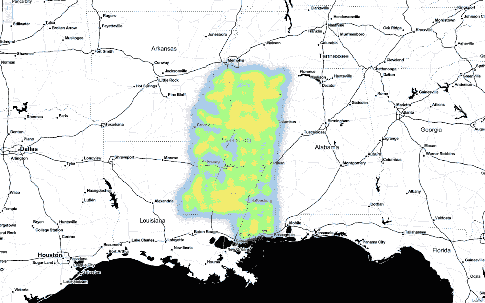

接下来，我们将学习如何使用 GPS 生成数据来收集如前述热图中的现场数据。

# 使用 GPS 数据

目前最常见的 GPS 数据类型是 Garmin GPX 格式。我们在第四章，*地理空间 Python 工具箱*中介绍了这种 XML 格式，它已成为非官方的行业标准。因为它是一种 XML 格式，所以所有 XML 的良好文档规则都适用于它。然而，还有一种比 XML 和 GPX 更早的 GPS 数据类型，称为**国家海洋电子协会**（**NMEA**）。这些数据是设计为流式传输的 ASCII 文本句子。

你偶尔会遇到这种格式，尽管它较老且较为晦涩，但它仍然非常活跃，尤其是在通过**自动识别系统**（**AIS**）通信船舶位置时，AIS 跟踪全球的船舶。但通常，你有一个纯 Python 的好选择。`pynmea`模块可在 PyPI 上找到。以下代码是 NMEA 语句的一个小样本：

```py
$GPRMC,012417.859,V,1856.599,N,15145.602,W,12.0,7.27,020713,,E\*4F
$GPGGA,012418.859,1856.599,N,15145.602,W,0,00,,,M,,M,,\*54
$GPGLL,1856.599,N,15145.602,W,012419.859,V\*35
$GPVTG,7.27,T,,M,12.0,N,22.3,K\*52
$GPRMC,012421.859,V,6337.596,N,12330.817,W,66.2,23.41,020713,,E\*74
```

要从 PyPI 安装`pynmea`模块并下载完整的样本文件，你可以查看以下 URL：[`git.io/vLbTv`](http://git.io/vLbTv)。然后，你可以运行以下样本，它将解析 NMEA 语句到对象。NMEA 语句包含大量信息：

```py
from pynmea.streamer import NMEAStream
nmeaFile = open('nmea.txt')
nmea_stream = NMEAStream(stream_obj=nmeaFile)
next_data = nmea_stream.get_objects()
nmea_objects = []
while next_data:
    nmea_objects += next_data
    next_data = nmea_stream.get_objects()
# The NMEA stream is parsed!
# Let's loop through the
# Python object types:
for nmea_ob in nmea_objects:
    if hasattr(nmea_ob, 'lat'):
        print('Lat/Lon: (%s, %s)' % (nmea_ob.lat, nmea_ob.lon))
```

纬度和经度以称为**度分十分之一度**的格式存储。例如，这个随机的坐标 4533.35，是 45 度和 33.35 分。一分之一的 0.35 是 21 秒。在另一个例子中，16708.033 是 167 度和 8.033 分。一分之一的 0.033 大约是 2 秒。你可以在[`aprs.gids.nl/nmea/`](http://aprs.gids.nl/nmea/)找到更多关于 NMEA 格式的信息。

GPS 数据是一个重要的位置数据源，但我们可以使用街道地址来描述地球上的一个点。在地球上定位街道地址的方法称为地理编码。

# 地理编码

地理编码是将街道地址转换为纬度和经度的过程。这个操作对于车载导航系统和在线驾驶方向网站至关重要。Python 有两个优秀的地理编码库，名为`geocoder`和`geopy`。这两个库都利用在线地理编码服务，允许你以编程方式地理编码地址。geopy 库甚至允许你进行反向地理编码，将纬度和经度匹配到最近的地址：

1.  首先，让我们用一个简单的例子来演示`geocoder`库，它默认使用谷歌地图作为其引擎：

```py
import geocoder
g = geocoder.google('1403 Washington Ave, New Orleans, LA 70130')
print(g.geojson)
# {'type': 'Feature', 'geometry': {'type': 'Point', 'coordinates': [-90.08421849999999, 29.9287839]},
'bbox': {'northeast': [29.9301328802915, -90.0828695197085], 'southwest': [29.9274349197085, -90.0855674802915]},
'properties': {'quality': 'street_address', 'lat': 29.9287839, 'city': 'New Orleans',
'provider': 'google', 'geometry': {'type': 'Point', 'coordinates': [-90.08421849999999, 29.9287839]},
'lng': -90.08421849999999, 'method': 'geocode', 'encoding': 'utf-8', 'confidence': 9, 'address': '1403 Washington Ave,
New Orleans, LA 70130, USA', 'ok': True, 'neighborhood': 'Garden District', 'county': 'Orleans Parish',
'accuracy': 'ROOFTOP', 'street': 'Washington Ave', 'location': '1403 Washington Ave, New Orleans, LA 70130',
'bbox': {'northeast': [29.9301328802915, -90.0828695197085], 'southwest': [29.9274349197085, -90.0855674802915]},
'status': 'OK', 'country': 'US', 'state': 'LA', 'housenumber': '1403', 'postal': '70130'}}
print(g.wkt)
# 'POINT(-90.08421849999999 29.9287839)'
```

在这里，我们打印出该地址的 GeoJSON 记录，其中包含谷歌数据库中所有已知信息。然后，我们以 WKT 字符串的形式打印出返回的纬度和经度，这可以用作其他操作的输入，例如检查地址是否位于洪水平原多边形内。该库的文档还展示了如何切换到其他在线地理编码服务，如 Bing 或 Yahoo。其中一些服务需要 API 密钥，并且可能有请求限制。

1.  现在，让我们看看`geopy`库。在这个例子中，我们将使用`OpenStreetMap`数据库进行地理编码。一旦我们将地址匹配到位置，我们将反过来进行反向地理编码：

```py
from geopy.geocoders import Nominatim
g = Nominatim()
location = g.geocode('88360 Diamondhead Dr E, Diamondhead, MS 39525')
rev = g.reverse('{},{}'.format(location.latitude, location.longitude))
print(rev)
# NVision Solutions Inc., 88360, Diamondhead Drive East, Diamondhead, Hancock County, Mississippi, 39520,
# United States of America
print(location.raw)
# {'class': 'office', 'type': 'yes', 'lat': '30.3961962', 'licence': 'Data © OpenStreetMap contributors,
# ODbL 1.0\. http://www.openstreetmap.org/copyright', 'display\_name': 'NVision Solutions Inc.,
# 88360, Diamondhead Drive East, Diamondhead, Hancock County, Mississippi, 39520, United States of America',
# 'lon': '-89.3462139', 'boundingbox': ['30.3961462', '30.3962462', '-89.3462639', '-89.3461639'],
# 'osm\_id': '2470309304', 'osm\_type': 'node', 'place\_id': '25470846', 'importance': 0.421}
```

既然我们已经知道了多种不同的地理编码方法，让我们看看如何加快这个过程。如果你有数千个地址需要地理编码，这可能需要一段时间。使用多进程，你可以将可能需要几天的时间缩短到几个小时。

# 多进程

地理空间数据集非常大。处理它们可能需要时间，这可能需要数小时，有时甚至需要数天。但有一种方法可以加快某些操作的处理速度。Python 内置的 multiprocessing 模块可以在您的计算机上生成多个进程，以利用所有可用的处理器。

与 multiprocessing 模块配合得非常好的操作之一是地理编码。在这个例子中，我们将对城市列表进行地理编码，并将该处理分散到您机器上的所有处理器。我们将使用之前相同的地理编码技术，但这次，我们将添加 multiprocessing 模块以增加速度和可扩展性的潜力。以下代码将在多个处理器上同时地理编码城市列表：

1.  首先，我们导入所需的模块：

```py
# Import our geocoding module
from geopy.geocoders import Nominatim
# Import the multiprocessing module
import multiprocessing as mp
```

1.  接下来，我们创建我们的地理编码器对象：

```py
# Create our geocoder
g = Nominatim()
```

1.  现在，我们需要一个函数来地理编码单个地址：

```py
# Create a function to geocode an individual address
def gcode(address):
    location = g.geocode(address)
    print("Geocoding: {}".format(address))
    return location
```

1.  接下来，我们创建要处理的城市的列表：

```py
# Our list of cities to process
cities = ["New Orleans, LA", "Biloxi, MS", "Memphis, TN",
"Atlanta, GA", "Little Rock, AR", "Destin, FL"]
```

1.  然后，我们根据可用的处理器数量设置处理器池：

```py
# Create our processor pool counting all of the processors
# on the machine.
pool = mp.Pool(processes=mp.cpu_count())
```

1.  接下来，我们将城市列表映射到地理编码函数，通过处理器池进行：

```py
# Map our cities list to the geocoding function
# and allow the processor pool to split it
# across processors
results = pool.map(gcode, cities)
```

1.  然后，我们可以打印结果：

```py
# Now print the results
print(results)

# [Location(New Orleans, Orleans Parish, Louisiana, USA, (29.9499323, -90.0701156, 0.0)),
# Location(Biloxi, Harrison County, Mississippi, USA, (30.374673, -88.8459433348286, 0.0)),
# Location(Memphis, Shelby County, Tennessee, USA, (35.1490215, -90.0516285, 0.0)),
# Location(Atlanta, Fulton County, Georgia, USA, (33.7490987, -84.3901849, 0.0)),
# Location(Little Rock, Arkansas, USA, (34.7464809, -92.2895948, 0.0)),
# Location(Destin, Okaloosa County, Florida, USA, (30.3935337, -86.4957834, 0.0))]
```

这种技术可能非常强大，但并非所有类型的处理都可以以这种方式执行。您使用的处理类型必须支持可以分解为离散计算的运算。但当您可以将问题分解，就像我们在本例中所做的那样，结果将快得多。

# 摘要

本章涵盖了 GIS 分析的关键组件。我们探讨了使用不同方法在地球曲面上测量的挑战。我们研究了坐标转换的基本原理和全重投影，使用了 OGR、PyShp 的 `utm` 模块和 Fiona，后者简化了 OGR。我们编辑了 shapefile 并执行了空间和属性选择。我们仅使用 Python 从头创建主题地图。我们还从电子表格中导入数据。然后，我们从 NMEA 流中解析 GPS 数据。最后，我们使用地理编码将街道地址转换为位置，反之亦然。

作为地理空间分析师，您可能熟悉 GIS 和遥感，但大多数分析师专注于一个领域或另一个领域。这就是为什么本书将这两个领域分开成单独的章节——这样我们就可以专注于它们之间的差异。正如我们在引言中提到的，本章的技术是所有地理空间分析的基础，并将为您提供学习该领域任何方面的工具。

在 第六章 *Python 和遥感* 中，我们将探讨遥感。在 GIS 中，我们已经能够使用纯 Python 模块来探索这个领域。在遥感中，由于数据的大小和复杂性，我们将更多地依赖于用 C 编写的编译模块的绑定。
