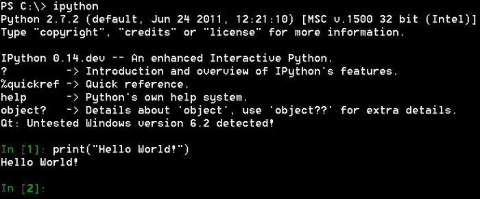
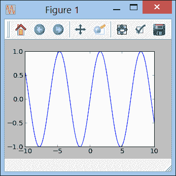

# 第一章：开始使用 IPython

在本章中，我们将首先介绍 IPython 的安装过程，并概述 IPython 所提供的各种功能。IPython 带来了经过高度改进的 Python 控制台和 Notebook。此外，当与第三方专业包（如 NumPy 和 Matplotlib）结合使用时，它是进行交互式计算的一个重要工具。这些包为 Python 生态系统带来了高性能计算和交互式可视化功能，而 IPython 则是其基石。在本章结束时，您将能够在计算机上安装 IPython 及其所需的包，并且您将通过一个简短的实践概述，了解我们将在后续章节中详细介绍的 IPython 最重要的功能，具体包括：

+   运行 IPython 控制台

+   将 IPython 作为系统 Shell 使用

+   使用历史记录

+   Tab 补全

+   使用`%run`命令执行脚本

+   使用`%timeit`命令进行快速基准测试

+   使用`%pdb`命令进行快速调试

+   使用 Pylab 进行交互式计算

+   使用 IPython Notebook

+   自定义 IPython

# 安装 IPython 及推荐的包

在本节中，我们将介绍如何安装 IPython 以及我们将在本书中使用的其他包。有关 IPython 安装的最新信息，您应查看 IPython 的官方网站([`ipython.org`](http://ipython.org))。

## IPython 的先决条件

首先，在安装 IPython 之前，您的计算机需要具备哪些条件？好消息是，IPython，以及更一般的所有 Python 包，原则上可以在大多数平台上运行（即 Linux、Apple OS X 和 Microsoft Windows）。在安装和运行 IPython 之前，您还需要在系统上安装一个有效的 Python 发行版。目前撰写本书时，IPython 的最新稳定版本是 0.13.1，并且官方要求安装 Python 2.6、2.7、3.1 或 3.2 版本。

### 提示

**Python 2.x 和 3.x**

Python 3.x 分支与 Python 2.x 分支不兼容，这也是为什么 2.7 版本仍然在维护的原因。尽管本书中使用的大多数外部 Python 包与 Python 3.x 兼容，但仍有一些包不兼容该分支。此时，对于一个新项目来说，选择 Python 2.x 还是 Python 3.x 通常取决于所需的外部 Python 包对 Python 3 的支持情况。目标用户的系统配置也是一个重要的考虑因素。在本书中，我们将使用 Python 2.7，并尽量减少与 Python 3.x 的兼容性问题。此问题超出了本书的范围，我们鼓励您查找有关如何编写尽可能兼容 Python 3.x 的 Python 2.x 代码的信息。以下官方网站页面是一个很好的起点：

[`wiki.python.org/moin/Python2orPython3`](http://wiki.python.org/moin/Python2orPython3)

本书将使用 Python 2.7 版本。2.6 版本不再维护，如果您决定继续使用 2.x 分支，尽可能选择使用 Python 2.7。

本书中还将使用其他与 IPython 一起使用的 Python 包。这些包主要是 NumPy、SciPy 和 Matplotlib，但在一些示例中我们还将使用其他包。有关如何安装这些包的详细信息，请参见下一节*安装一体化分发版*。

有几种安装 IPython 和推荐包的方法。从最简单到最复杂，您可以选择以下任一方法：

+   安装一个独立的一体化 Python 发行版，带有各种内置 Python 包

+   只安装您需要的包

在后一种情况下，您可以使用二进制安装程序，或者直接从源代码安装这些包。

## 安装一体化分发版

这是目前最简单的解决方案。您可以下载一个单一的二进制安装程序，它包含完整的 Python 发行版和许多广泛使用的外部包，包括 IPython。流行的发行版包括：

+   Enthought Python Distribution (EPD)和 Enthought 的新 Canopy：

    [`www.enthought.com/`](http://www.enthought.com/)

+   Anaconda，由 Continuum Analytics 开发：

    [`www.continuum.io/`](http://www.continuum.io/)

+   Python(x,y)，一个开源项目：

    [`code.google.com/p/pythonxy/`](http://code.google.com/p/pythonxy/)

+   ActivePython，由 ActiveState 提供：

    [`www.activestate.com/activepython`](http://www.activestate.com/activepython)

所有这些发行版都支持 Linux、OS X 和 Windows，除了 Python(x,y)仅支持 Windows。它们都提供免费版本（并可能提供商业版本），并且都包含 IPython。ActivePython 和 EPD 也附带自己的打包系统；这使得安装额外包变得容易。这些发行版包含了我们在本书中将使用的大多数外部包。

## 一个一个地安装这些包

有时，您可能更愿意只安装所需的包，而不是安装一个庞大的所有功能包。幸运的是，这在大多数最新的系统上应该是直接的。Windows、OS X 和大多数常见的 Linux 发行版都可以使用二进制安装程序。否则，您始终可以从源代码安装这些包，通常这比看起来要容易。

### 包网站

下面是我们在本书中提到的 Python 包的列表，以及它们各自的网站，您可以在这些网站上找到最新的相关信息：

+   IPython：

    [`ipython.org`](http://ipython.org)

+   NumPy，用于多维数组的高性能和向量化计算：

    [`www.numpy.org`](http://www.numpy.org)

+   SciPy，用于高级数值算法：

    [`www.scipy.org`](http://www.scipy.org)

+   Matplotlib，用于绘图和交互式可视化：

    [`matplotlib.org`](http://matplotlib.org)

+   Matplotlib-basemap，一个用于 Matplotlib 的地图工具箱：

    [`matplotlib.org/basemap/`](http://matplotlib.org/basemap/)

+   NetworkX，用于处理图形：

    [`networkx.lanl.gov`](http://networkx.lanl.gov)

+   Pandas，用于处理各种表格数据：

    [`pandas.pydata.org`](http://pandas.pydata.org)

+   Python Imaging Library（PIL），用于图像处理算法：

    [`www.pythonware.com/products/pil`](http://www.pythonware.com/products/pil)

+   PySide，Qt 的图形用户界面（GUI）封装：

    [`qt-project.org/wiki/PySide`](http://qt-project.org/wiki/PySide)

+   PyQt，类似于 PySide，但许可证不同：

    [`www.riverbankcomputing.co.uk/software/pyqt/intro`](http://www.riverbankcomputing.co.uk/software/pyqt/intro)

+   Cython，用于在 Python 中使用 C 代码：

    [`cython.org`](http://cython.org)

### 小贴士

**PyQt 还是 PySide？**

Qt 是一个跨平台的应用框架，广泛用于带有 GUI 的软件。它有着复杂的历史；最初由 Trolltech 开发，后来被诺基亚收购，现在由 Digia 所拥有。既有商业许可证，也有开源许可证。PyQt 是一个由 Riverbank Computing 开发的 Qt 的 Python 封装。PyQt 的开源版本是 GPL 许可证，这限制了它在商业产品中的使用。因此，诺基亚决定创建一个自己拥有 LGPL 许可证的包，名为 PySide。现在，由 Qt 项目进行维护。今天，两个包共存，并且它们具有极其相似的 API，因此可以用 Python 编写支持这两个库的 Qt 图形应用程序。

这些网站提供了各种系统的二进制安装程序下载，并且还提供了源代码供手动编译和安装。

还有一个名为 Python Package Index（PyPI）的 Python 包在线仓库，网址是 [`pypi.python.org`](http://pypi.python.org)。它包含大多数现有 Python 包的 tarballs 和有时的 Windows 安装程序。

### 获取二进制安装程序

你可以在你感兴趣的包的官方网站上找到适合你系统的二进制安装程序。如果没有官方的二进制安装程序，社区可能已经创建了非官方的安装程序。我们将在这里提供一些关于在不同操作系统上找到二进制安装程序的建议。

#### Windows

官方 Windows 安装程序可以在相关包的官方网站或 PyPI 上找到某些包的安装程序。数百个 Python 包（包括 IPython 和本书中使用的所有包）的非官方 Windows 安装程序可以在 Christoph Gohlke 的个人网页上找到，网址为 [`www.lfd.uci.edu/~gohlke/pythonlibs/`](http://www.lfd.uci.edu/~gohlke/pythonlibs/)。这些文件不提供任何形式的保证，但通常都非常稳定，这使得在 Windows 上安装几乎所有 Python 包变得极为简便。所有包都有适用于 Python 2.x 和 3.x 的版本，以及适用于 32 位和 64 位 Python 发行版的版本。

#### OS X

官方的 OS X 安装包可以在一些软件包的官方网站上找到，非官方安装包可以在 MacPorts 项目（[`www.macports.org`](http://www.macports.org)）和 Homebrew（[`mxcl.github.com/homebrew/`](http://mxcl.github.com/homebrew/)）中找到。

#### Linux

大多数 Linux 发行版（包括 Ubuntu）都配备了可能包含你所需的 Python 版本和我们将在此使用的大多数 Python 软件包的打包系统。例如，要在 Ubuntu 上安装 IPython，请在终端中输入以下命令：

```py
$ sudo apt-get install ipython-notebook

```

在 Fedora 18 及更高版本的相关发行版中，输入以下命令：

```py
$ sudo yum install python-ipython-notebook

```

相关的二进制软件包名称有时会以 `python-` 为前缀（例如，`python-numpy` 或 `python-matplotlib`）。此外，PyQt4 的软件包名称是 `python-qt4`，PyOpenGL 的软件包名称是 `python-opengl`，PIL 的软件包名称是 `python-imaging`，等等。

#### 二进制软件包表

这里展示了一张表格，列出了在不同的 Python 发行版和操作系统中，本书将使用的各个软件包的二进制安装包的可用性（截至写作时）。所有这些安装包都可以用于 Python 2.7。下表中，"(W)" 表示 Windows，“CG:” 表示 Christoph Gohlke 的网页：

| Package | EPD 7.3 | Anaconda 1.2.1 | Python(x,y) 2.7.3 | ActivePython 2.7.2 | Windows 安装包 | Ubuntu 安装包 | OSX 安装包（MacPorts） |
| --- | --- | --- | --- | --- | --- | --- | --- |
| NetworkX | 1.6 | 1.7 | 1.7 | 1.6 | CG: 1.7 | 1.7 | 1.7 |
| Pandas | 0.9.1 | 0.9.0 | 0.9.1 | 0.7.3 | CG: 0.10.0, PyPI: 0.10.0 | 0.8.0 | 0.10.0 |
| NumPy | 1.6.1 | 1.6.2 (W) | 1.6.2 | 1.6.2 | CG: 1.6.2, PyPI: 1.6.2（32 位） | 1.6.2 | 1.6.2 |
| SciPy | 0.10.1 | 0.11.0 | 0.11.0 | 0.10.1 | CG: 0.11.0 | 0.10.1 | 0.11.0 |
| PIL | 1.1.7 | 1.1.7 | 1.1.7 | 1.1.7 | CG: 1.1.7 | 1.1.7 | N/A |
| Matplotlib | 1.1.0 | 1.2.0 | 1.1.1 | 1.1.0 | CG: 1.2.0 | 1.1.1 | 1.2.0 |
| Basemap | 1.0.2 | N/A | 1.0.2（可选） | 1.0 beta | 1.0.5 | 1.0.5 | 1.0.5 |
| PyOpenGL | 3.0.1 | N/A | 3.0.2 | 3.0.2 | CG: 3.0.2, PyPI: 3.0.2 | 3.0.1 | 3.0.2 |
| PySide | 1.1.1 | 1.1.2 | N/A（PyQt 4.9.5） | N/A（PyQt 4.8.3） | CG: 1.1.2 | 1.1.1 | 1.1.2 |
| Cython | 0.16 | 0.17.1 | 0.17.2 | 0.16 | CG: 0.17.3 | 0.16 | 0.17.3 |
| Numba | N/A | 0.3.2 | N/A | N/A | CG: 0.3.2 | N/A | N/A |

### 使用 Python 打包系统

当没有可用的二进制软件包时，安装 Python 软件包的通用方式是直接从源代码安装。Python 打包系统旨在简化此步骤，以处理依赖关系管理、卸载和软件包发现。然而，打包系统多年来一直处于混乱状态。

Distutils，Python 的原生打包系统，一直因效率低下和带来过多问题而受到批评。其继任者 Distutils2 在写作时尚未完成。Setuptools 是一种替代系统，提供了 `easy_install` 命令行工具，允许通过命令行搜索（在 PyPI 上）并安装新的 Python 包。安装新包就像在命令行中输入以下命令一样简单：

```py
$ easy_install ipython

```

Setuptools 也一直受到批评，现已被 Distribute 取代。`easy_install` 工具也正在被 pip 取代，pip 是一个更强大的工具，用于搜索、安装和卸载 Python 包。

目前，我们建议你使用 Distribute 和 pip。两者都可以通过源代码 tarball 或使用 easy_install 安装（这需要提前安装 Setuptools）。有关如何安装这些工具的更多细节，可以参考《打包指南》([`guide.python-distribute.org/`](http://guide.python-distribute.org/))。要使用 pip 安装新包，请在命令行中输入以下命令：

```py
$ pip install ipython

```

#### IPython 的可选依赖项

IPython 有几个依赖项：

+   **pyreadline**：此依赖项提供行编辑功能

+   **pyzmq**：此依赖项是 IPython 并行计算功能所需的，例如 Qt 控制台和 Notebook

+   **pygments**：此依赖项在 Qt 控制台中高亮显示语法

+   **tornado**：此依赖项是 Web-based Notebook 所必需的

当你从二进制包安装 IPython 时，这些依赖项会自动安装，但从源代码安装 IPython 时则不会。在 Windows 上，pyreadline 必须通过 PyPI 上提供的二进制安装程序，或 Christoph Gohlke 的网页，或者使用 easy_install 或 pip 安装。

在 OS X 上，你也应该使用 easy_install 或 pip 安装 readline。

其他依赖项可以通过以下命令自动安装：

```py
$ easy_install ipython[zmq,qtconsole,notebook]

```

## 安装开发版本

最有经验的用户可能希望使用一些库的最新开发版本。详细信息可以在各自库的网站上找到。例如，要安装 IPython 的开发版本，我们可以输入以下命令（需要安装版本控制系统 Git）：

```py
$ git clone https://github.com/ipython/ipython.git
$ cd ipython
$ python setup.py install

```

为了能够轻松更新 IPython（通过使用 `git pull`，以便它随开发分支的变化而变化），我们只需将最后一行替换为以下命令（需要安装 Distribute 库）：

```py
$ python setupegg.py develop

```

### 提示

**获取 IPython 帮助**

官方的 IPython 文档网页[`ipython.org/documentation.html`](http://ipython.org/documentation.html)是获取帮助的好地方。它包含了指向在线手册、社区创建的非官方教程和文章的链接。StackOverflow 网站[`stackoverflow.com/questions/tagged/ipython`](http://stackoverflow.com/questions/tagged/ipython)也是请求 IPython 帮助的好地方。最后，任何人都可以订阅 IPython 用户邮件列表[`mail.scipy.org/mailman/listinfo/ipython-user`](http://mail.scipy.org/mailman/listinfo/ipython-user)。

# 十个 IPython 必备命令

在本节中，我们将快速浏览 IPython，介绍这个强大工具的 10 个必备功能。尽管时间简短，但这次实践将涵盖广泛的 IPython 功能，之后的章节将对其进行更详细的探讨。

## 运行 IPython 控制台

如果 IPython 已经正确安装，你应该能够通过系统 Shell 使用`ipython`命令运行它。你可以像使用常规的 Python 解释器一样使用这个提示符，如下面的截图所示：



IPython 控制台

### 提示

**Windows 上的命令行 Shell**

如果你在 Windows 上使用旧版的`cmd.exe` shell，你应该知道这个工具非常有限。你可以选择使用更强大的解释器，比如微软的 PowerShell，它在 Windows 7 和 8 中默认集成。大多数常见的与文件系统相关的命令（如`pwd`、`cd`、`ls`、`cp`、`ps`等）与 Unix 中的命令名称相同，这一点就足以成为切换的理由。

当然，IPython 远不止这些。例如，IPython 附带了许多小命令，可以大大提高生产力。我们将在本书中看到其中的许多命令，从这一部分开始。

其中一些命令帮助你获取有关任何 Python 函数或对象的信息。例如，你是否曾经对如何使用`super`函数来访问派生类中的父类方法感到困惑？只需输入`super?`（这是命令`%pinfo super`的快捷方式），你就可以找到关于`super`函数的所有信息。将`?`或`??`附加到任何命令或变量后，你将获得关于它的所有信息，如下所示：

```py
In [1]: super?
Typical use to call a cooperative superclass method:
class C(B):
 def meth(self, arg):
 super(C, self).meth(arg)

```

## 将 IPython 用作系统 Shell

你可以将 IPython 命令行界面作为一个扩展的系统 Shell 使用。你可以浏览整个文件系统并执行任何系统命令。例如，标准的 Unix 命令`pwd`、`ls`和`cd`在 IPython 中也可以使用，并且在 Windows 上同样有效，如下面的示例所示：

```py
In [1]: pwd
Out[1]: u'C:\\'
In [2]: cd windows
C:\windows

```

这些命令是 IPython Shell 中的特殊魔法命令。魔法命令有很多，我们将在本书中使用其中的许多。你可以使用`%lsmagic`命令查看所有魔法命令的列表。

### 提示

**使用 IPython 魔法命令**

魔法命令实际上以`%`为前缀，但默认启用的自动魔法系统使你可以方便地省略该前缀。使用前缀始终是可能的，特别是在没有前缀的命令被与之同名的 Python 变量遮盖时。`%automagic`命令切换自动魔法系统。在本书中，我们通常会使用`%`前缀来表示魔法命令，但请记住，如果你愿意，大多数时候可以省略它。

## 使用历史记录

像标准的 Python 控制台一样，IPython 提供了命令历史记录。然而，与 Python 控制台不同，IPython 的历史记录跨越了你之前的交互式会话。此外，一些键击和命令可以帮助你减少重复输入。

在 IPython 控制台提示符下，使用上下箭头键可以浏览整个输入历史记录。如果在按下箭头键之前开始输入，只会显示与已输入内容匹配的命令。

在任何交互式会话中，你的输入和输出历史保存在`In`和`Out`变量中，并按提示号进行索引。`_`、`__`、`___`以及`_i`、`_ii`、`_iii`变量分别包含最后三个输出和输入对象。`_n`和`_in`变量返回第*n*个输出和输入历史记录。例如，我们输入以下命令：

```py
In [4]: a = 12
In [5]: a ** 2
Out[5]: 144
In [6]: print("The result is {0:d}.".format(_))
The result is 144.

```

在这个示例中，我们在第 6 行显示了提示符`5`的输出，即`144`。

## Tab 自动补全

Tab 自动补全非常有用，你会发现自己一直在使用它。每当你开始输入命令、变量名或函数时，按下*Tab*键，IPython 会自动完成你输入的内容（如果没有歧义），或者显示与已输入内容匹配的命令或名称列表。它也适用于目录和文件路径，就像在系统 shell 中一样。

它对动态对象反射特别有用。输入任何 Python 对象名称后跟一个点，然后按下*Tab*键；IPython 会显示现有的属性和方法列表，如以下示例所示：

```py
In [1]: import os
In [2]: os.path.split<TAB>
os.path.split os.path.splitdrive os.path.splitext os.path.splitunc

```

在第二行，如前面的代码所示，我们在输入完`os.path.split`后按下*Tab*键。IPython 会显示所有可能的命令。

### 提示

**Tab 自动补全与私有变量**

Tab 自动补全会显示对象的所有属性和方法，除了那些以下划线（`_`）开头的属性和方法。原因是，在 Python 编程中，使用下划线前缀表示私有变量。这是一个标准的惯例。如果你希望 IPython 显示所有私有属性和方法，可以在按下*Tab*键之前输入`myobject._`。在 Python 中，没有什么是真正私有或隐藏的。这是 Python 的一种哲学，正如著名的说法所表达的那样：“我们都是成年人，在这里自愿参与。”

## 使用`%run`命令执行脚本

尽管交互式控制台很重要，但在运行多个命令时，它会显得有些局限。在 Python 脚本中编写多个命令并使用`.py`扩展名（按惯例）是非常常见的。可以通过`%run`魔法命令在 IPython 控制台内执行 Python 脚本，后面跟上脚本的文件名。除非使用了`-i`选项，否则脚本将在一个新的 Python 命名空间中执行；如果使用了该选项，则会使用当前的交互式 Python 命名空间进行执行。在所有情况下，脚本中定义的所有变量会在脚本执行完毕后可在控制台中使用。

让我们将以下 Python 脚本写入一个名为`script.py`的文件中：

```py
print("Running script.")
x = 12
print("'x' is now equal to {0:d}.".format(x))
```

现在，假设我们已经进入了包含该文件的目录，可以通过输入以下命令在 IPython 中执行它：

```py
In [1]: %run script.py
Running script.
'x' is now equal to 12.
In [2]: x
Out[2]: 12

```

在运行脚本时，控制台的标准输出会显示任何 print 语句。执行结束后，脚本中定义的`x`变量将被包含在交互式命名空间中，这非常方便。

## 使用%timeit 命令进行快速基准测试

你可以在交互式会话中使用`%timeit`魔法命令进行快速基准测试。它可以估算单个命令执行所需的时间。该命令会在循环中多次执行，且该循环本身默认会重复多次。然后，命令的单次执行时间会通过平均值自动估算。`-n`选项控制循环中执行的次数，`-r`选项控制循环执行的次数。例如，输入以下命令：

```py
In[1]: %timeit [x*x for x in range(100000)]
10 loops, best of 3: 26.1 ms per loop

```

在这里，计算从`1`到`100000`的所有整数的平方大约用了 26 毫秒。

## 使用%debug 命令进行快速调试

IPython 自带了一个强大的命令行调试器。每当控制台中抛出异常时，可以使用`%debug`魔法命令在异常点启动调试器。然后，你可以访问所有局部变量并查看完整的栈追踪信息，在事后调试模式下进行分析。通过`u`和`d`命令可以在栈中向上和向下导航，使用`q`命令退出调试器。通过输入`?`命令查看调试器中所有可用命令的列表。

你可以使用`%pdb`魔法命令来激活 IPython 调试器的自动执行，一旦抛出异常，调试器就会启动。

## 使用 Pylab 进行交互式计算

`%pylab`魔法命令启用了 NumPy 和 matplotlib 包的科学计算功能，即对向量和矩阵的高效操作、绘图和交互式可视化功能。通过它，可以在控制台中执行交互式计算并动态绘制图形。例如，输入以下命令：

```py
In [1]: %pylab
Welcome to pylab, a matplotlib-based Python environment [backend: TkAgg].
For more information, type 'help(pylab)'.
In [2]: x = linspace(-10., 10., 1000)
In [3]: plot(x, sin(x))

```

在此示例中，我们首先定义一个包含`1000`个值的向量，这些值在`-10`和`10`之间线性分布。然后我们绘制图形`(x, sin(x))`。一个带有图形的窗口会出现，如下截图所示，而控制台在该窗口打开时不会被阻塞。这使得我们能够在窗口打开时交互式地修改图形。



一个 Matplotlib 图形

## 使用 IPython Notebook

Notebook 将 IPython 的功能带入浏览器，提供多行文本编辑功能、交互式会话的可重复性等。这是一种使用 Python 进行交互式和可重复性操作的现代且强大的方式。

要使用 Notebook，请在终端中调用`ipython notebook`命令（确保已安装安装部分中描述的所需依赖项）。这将启动一个本地 Web 服务器，默认端口为 8888。然后在浏览器中访问`http://127.0.0.1:8888/`并创建一个新的 Notebook。

你可以在输入单元格中编写一行或多行代码。以下是一些最有用的键盘快捷键：

+   按*Enter*键在单元格中创建新的一行，而不执行单元格

+   按*Shift* + *Enter*执行单元格并跳转到下一个单元格

+   按下*Alt* + *Enter*执行单元格，并在其后添加一个新的空单元格

+   按*Ctrl* + *Enter*，快速进行实验而不保存输出

+   按*Ctrl* + *M*，然后按*H*键显示所有键盘快捷键的列表

我们将在下一章中更详细地探讨 Notebook 的功能。

## 自定义 IPython

你可以将用户偏好设置保存在一个 Python 文件中；该文件称为 IPython 配置文件。要创建默认配置文件，在终端中输入`ipython profile create`。这将创建一个名为`profile_default`的文件夹，位于`~/.ipython`或`~/.config/ipython`目录下。该文件夹中的`ipython_config.py`文件包含有关 IPython 的偏好设置。你可以使用`ipython profile create profilename`创建具有不同名称的配置文件，然后通过`ipython --profile=profilename`启动 IPython 并使用该配置文件。

`~`目录是你的主目录，例如，在 Unix 系统中是类似`/home/yourname`的路径，在 Windows 系统中是`C:\Users\yourname`或`C:\Documents and Settings\yourname`。

# 总结

在本章中，我们详细介绍了安装 IPython 的各种方式以及推荐的外部 Python 包。最直接的方式是安装一个独立的 Python 发行版，内置所有包，例如 Enthought Python Distribution、Canopy、Anaconda、Python(x,y)或 ActivePython 等。另一种解决方案是手动安装不同的包，可以通过适用于大多数最新平台的二进制安装程序，或者使用 Python 的打包系统，在大多数情况下应当非常简单。

我们还介绍了 IPython 提供的 10 个最有趣的功能。这些功能主要涉及 Python 和 shell 的交互特性，包括集成的调试器和分析器，以及 NumPy 和 Matplotlib 包所带来的交互式计算和可视化功能。在接下来的章节中，我们将详细介绍交互式 shell 和 Python 控制台以及 Notebook。
