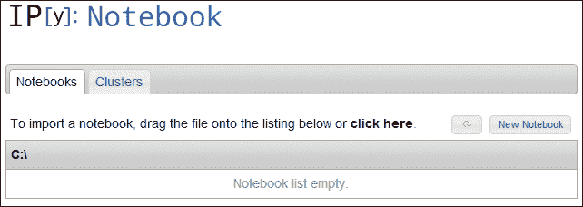
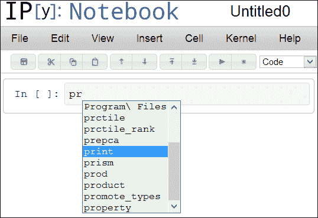
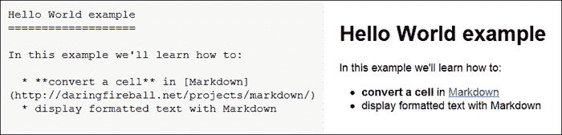
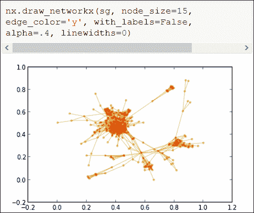

# 第二章：与 IPython 进行交互工作

在本章中，我们将详细介绍 IPython 为标准 Python 控制台带来的各种改进。特别是，我们将执行以下任务：

+   从 IPython 访问系统 shell，实现强大的 shell 和 Python 之间的交互

+   使用动态内省来探索 Python 对象，甚至是一个新的 Python 包，甚至无需查看文档

+   从 IPython 轻松调试和基准测试您的代码

+   学习如何使用 IPython 笔记本显著改善与 Python 的交互方式

# 扩展的 shell

IPython 不仅是一个扩展的 Python 控制台，还提供了几种在 Python 交互会话期间与操作系统交互的方式，而无需退出控制台。IPython 的 shell 功能并不意味着取代 Unix shell，并且 IPython 提供的功能远不及 Unix shell。然而，在 Python 会话期间浏览文件系统并偶尔从 IPython 调用系统命令仍然非常方便。此外，IPython 提供了有用的魔术命令，可以显著提高生产力，并在交互会话期间减少重复输入。

## 浏览文件系统

在这里，我们将展示如何从互联网下载并提取压缩文件，在文件系统层次结构中导航，并从 IPython 打开文本文件。为此，我们将使用一个关于数百名匿名 Facebook 用户社交网络的真实数据示例（他们自愿匿名分享数据以供计算机科学家进行研究）。这些受 BSD 许可的数据由斯坦福大学的 SNAP 项目免费提供（[`snap.stanford.edu/data/`](http://snap.stanford.edu/dat)）。

### 提示

**下载示例代码**

您可以从您在[`www.packtpub.com`](http://www.packtpub.com)购买的所有 Packt 图书的帐户中下载示例代码文件。如果您在其他地方购买了本书，您可以访问[`www.packtpub.com/support`](http://www.packtpub.com/support)并注册，以便直接通过电子邮件接收文件。此外，所有示例都可以从作者的网站下载：[`ipython.rossant.net`](http://ipython.rossant.net)。

首先，我们需要从作者的网页下载包含数据的 ZIP 文件。我们使用原生 Python 模块`urllib2`下载文件，并使用`zipfile`模块进行解压。让我们输入以下命令：

```py
In [1]: import urllib2, zipfile
In [2]: url = 'http://ipython.rossant.net/'
In [3]: filename = 'facebook.zip'
In [4]: downloaded = urllib2.urlopen(url + filename)

```

在这里，我们在内存中下载了文件`http://ipython.rossant.net/facebook.zip`，并将其保存在硬盘上。

现在，我们在当前目录中创建一个名为`data`的新文件夹，并进入其中。美元符号（`$`）允许我们在系统或魔术命令中使用 Python 变量。让我们输入以下命令：

```py
In [5]: folder = 'data'
In [6]: mkdir $folder
In [7]: cd $folder

```

在这里，`mkdir` 是一个特定的 IPython *别名*，它将一个魔法命令重定向为一个 shell 命令。可以通过魔法命令 `%alias` 获取别名列表。在这个文件夹中，我们将保存刚刚下载的文件（在第八行，我们将 ZIP 文件 `facebook.zip` 本地保存到当前目录 `data` 中），并在当前文件夹中解压它（如第九行所示，使用 `zip` 的 `extractall` 方法和 `ZipFile` 对象）。让我们输入以下命令：

```py
In [8]: with open(filename, 'wb') as f:
 f.write(downloaded.read())
In [9]: with zipfile.ZipFile(filename) as zip:
 zip.extractall('.')

```

让我们使用以下命令来探索刚刚下载的内容：

```py
In [10]: ls
facebook  facebook.zip
In [11]: cd facebook
In [12]: ls
0.circles  0.edges  [...]

```

在此示例中，每个数字表示一个 Facebook 用户（称为 `ego` 用户）。`.edges` 文件包含其 *社交图*，即每个节点是一个朋友，如果 `ego` 用户的两个朋友互为朋友，则它们之间有连接。该图以 `edges` 列表的形式存储，这是一个文本文件，每行包含两个用空格分隔的连接节点标识符。`.circles` 文件包含手动创建的朋友列表，即从 `ego` 用户的视角出发，拥有共同属性的朋友组。

最后，我们使用以下命令将当前 `facebook` 目录保存为书签，以便以后可以轻松进入该目录：

```py
In [13]: %bookmark fbdata

```

现在，在任何未来使用相同 IPython 配置文件的会话中，我们都可以键入 `cd fbdata` 进入此目录，无论我们从哪个目录调用此命令。`-l` 和 `-d` 选项分别允许列出所有定义的书签和删除指定书签。输入 `%bookmark?` 会显示所有选项的列表。当在多个文件夹之间来回导航时，这个魔法命令非常有用。

IPython 中另一个方便的与导航相关的功能是 *Tab* 补全。只要按下 *Tab* 键，IPython 就能自动完成我们正在输入的文件或文件夹名称。如果有多个选项，IPython 会显示所有可能选项的列表。它也适用于文件名，例如在 `open` 内置函数中，如下例所示：

```py
In [1]: pwd
/home/me/data/
In [2]: cd fa<TAB>
/home/me/data/facebook/
In [2]: cd facebook
In [3]: with open('0<TAB>
0.circles  0.edges
In [3]: with open('0.edges', 'r') as f:
 print(f.readline())
236 186

```

## 从 IPython 访问系统 shell

我们还可以直接从 IPython 启动命令，使用系统 shell 并将结果作为字符串列表保存在 Python 变量中。为此，我们需要在 shell 命令前加上 `!`。例如，假设我们使用的是 Unix 系统，我们可以输入以下命令：

```py
In [1]: cd fbdata
/home/me/data/facebook
In [2]: files = !ls -1 -S | grep edges

```

Unix 命令 `ls -1 -S` 列出当前目录中的所有文件，按大小降序排序，并且每行列出一个文件。管道 `| grep edges` 仅筛选包含 `edges` 的文件（这些是包含不同网络社交图的文件）。然后，Python 变量 `files` 包含所有文件名的列表，如下例所示：

```py
In [3]: files
Out[3]: ['1912.edges',
 '107.edges',
 [...]
 '3980.edges']

```

我们还可以在系统命令中使用 Python 变量，使用 `$` 语法表示单个变量，或使用 `{}` 来表示任何 Python 表达式，如下所示：

```py
In [4]: !head -n5 {files[0]}
2290 2363
2346 2025
2140 2428
2201 2506
2425 2557

```

`head -n5 {files[0]}` 命令显示 `files` 列表中第一个文件的前五行，即数据集中最大 `.edges` 文件的前五行。

如果我们发现自己一遍又一遍地使用相同的命令，我们可以创建一个 **别名** 来减少重复输入，使用魔法命令 `%alias`。例如，在以下示例中，我们创建了一个名为 `largest` 的别名，用于显示所有文件及其大小（`-hs`），并按其大小降序排序（`-S`），同时使用指定的字符串（`grep`）进行过滤，显示在单列中（`-1`）：

```py
In [5]: %alias largest ls -1sSh | grep %s
in [6]: largest circles
6.0K 1912.circles
4.0K 1684.circles
[...]

```

在第五行中，注意 `%s` 是 `largest` 别名的定位符，它会被传递给别名的任何参数所替代（如第六行所示）。

请注意，默认情况下，这个别名不会保存到下次交互式会话中（关闭 IPython 后）。我们需要使用 `%store` 魔法命令显式地保存它，如下所示：

```py
In [7]: %store largest
Alias stored: largest (ls -1sSh | grep %s)

```

此外，要在以后的会话中恢复存储的别名和变量，我们需要输入 `%store -r`。

# 扩展的 Python 控制台

我们现在将探索 **IPython** 控制台与 Python 相关的功能。

## 浏览历史记录

IPython 会跟踪我们所有会话中的输入历史记录。由于在使用 IPython 数月或数年后，这些历史记录可能会变得相当庞大，因此提供了方便的方式来浏览历史记录。

首先，我们可以随时按下上下键，在 IPython 提示符下线性地浏览我们最近的历史记录。如果我们在按上下键之前输入了内容，系统只会在匹配我们已输入的内容的命令中浏览历史记录。按下 *Ctrl* + *R* 会打开一个提示符，让我们搜索包含我们输入的任何内容的行。

`%history` 魔法命令（以及它的别名 `%hist`）接受多个方便的选项，来显示我们感兴趣的输入历史记录部分。默认情况下，`%history` 会显示当前会话中的所有输入历史记录。我们可以使用简单的语法指定特定的行范围，例如，`hist 4-6 8` 表示第四到第六行和第八行。我们还可以选择使用语法 `hist 243/4-8` 来显示第 243 号会话中的第四到第八行历史记录。最后，我们可以使用语法 `%hist ~1/7` 来相对于当前会话编号历史记录行，它会显示前一个会话的第七行。

`%history` 还有其他有用的选项，包括 `-o`，它会显示输入历史记录的输出；`-n`，它会显示行号；`-f`，它会将历史记录保存到文件；`-p`，它会显示经典的 `>>>` 提示符。例如，这对于自动从历史记录中创建 `doctest` 文件可能会非常有用。另外，`-g` 选项允许使用指定的字符串（如 `grep`）过滤历史记录。考虑以下示例：

```py
In [1]: 2 + 3
Out[1]: 5
In [2]: _ * 2
Out[2]: 10
In [3]: %hist -nop 1-2
 1: >>> 2 + 3
5
 2: >>> _ * 2
10

```

在这个例子中，我们显示了前两行的历史记录，包括行号、输出和默认的 Python 提示符。

最后，一个相关的命令是`%store`，用于保存任何 Python 变量的内容，以便在任何未来的交互式会话中使用。`%store name`命令保存变量`name`，`%store -d name`删除它。要恢复存储的变量，我们需要使用`%store -r`。

## 导入/导出 Python 代码

在接下来的部分中，我们将首先看到如何从 Python 脚本中的交互式控制台导入代码，然后看看如何将历史记录中的代码导出到外部文件。

### 在 IPython 中导入代码

在 IPython 中导入代码的第一种可能性是将代码从文件复制粘贴到 IPython 中。当使用**IPython**控制台时，`%paste`魔术命令可用于导入并执行剪贴板中包含的代码。IPython 会自动去除代码的缩进，并删除行首的`>`和`+`字符，从而可以直接从电子邮件中粘贴`diff`和`doctest`文件。

此外，`%run`魔术命令在控制台中执行 Python 脚本，默认情况下在一个空的命名空间中。这意味着在交互式命名空间中定义的任何变量在执行的脚本中不可用。然而，在执行结束时，控制返回到 IPython 提示符，并且在交互式命名空间中导入了脚本中定义的变量。这对于探索脚本执行结束时所有变量的状态非常方便。可以使用`-i`选项更改此行为，该选项在执行时使用交互式命名空间。在执行脚本之前在交互式命名空间中定义的变量然后在脚本中可用。

例如，让我们编写一个脚本`/home/me/data/egos.py`，列出 Facebook 的`data`文件夹中的所有自我标识符。由于每个文件名的格式为`<egoid>.<extension>`，我们列出所有文件，删除扩展名，并获取所有唯一标识符的排序列表。脚本应包含以下代码：

```py
import sys
import os
# we retrieve the folder as the first positional argument
# to the command-line call
if len(sys.argv) > 1:
    folder = sys.argv[1]
# we list all files in the specified folder
files = os.listdir(folder)
# ids contains the sorted list of all unique idenfitiers
ids = sorted(set(map(lambda file: int(file.split('.')[0]), files)))
```

这里解释了最后一行的作用。`lambda`函数以`<egoid>.<extension>`的模板作为参数，返回`egoid` ID 作为整数。它使用任何字符串的`split`方法，该方法使用给定字符拆分字符串，并返回由此字符分隔的子字符串列表。在这里，列表的第一个元素是`<egoid>`部分。内置的 Python `map`函数将此`lambda`函数应用于所有文件名。`set`函数将此列表转换为`set`对象，从而删除所有重复项，仅保留唯一标识符的列表（因为任何标识符都会以两种不同的扩展出现两次）。最后，`sorted`函数将`set`对象转换为列表，并按升序排序。

假设 IPython 中的当前目录是 `/home/me/data`，以下是执行此脚本的命令：

```py
In [1]: %run egos.py facebook
In [2]: ids
Out[2]: [0, 107, ..., 3980]

```

在 `egos.py` 脚本中，文件夹名称 `facebook` 是从命令行参数中检索的，就像在标准命令行 Python 脚本中一样，使用 `sys.argv[1]`。脚本执行后，在交互式命名空间中可用的 `ids` 变量包含了唯一 `ego` 标识符的列表。

现在，如果我们不将文件夹名称作为脚本的参数提供，将会发生以下情况：

```py
In [3]: folder = 'facebook'
In [4]: %run egos.py
NameError: name 'folder' is not defined
In [5]: %run -i egos.py
In [6]: ids
Out[6]: [0, 107, ..., 3980]

```

在第四行引发了一个异常，因为未定义 `folder`。如果希望脚本使用交互式命名空间中定义的 `folder` 变量，需要使用 `-i` 选项。

### 提示

**探索性研究中的交互式工作流**

在探索性研究或数据分析中的标准工作流程是在一个或多个 Python 模块中实现算法，并编写一个执行完整流程的脚本。然后可以使用 `%run` 执行此脚本，并允许进一步交互式探索脚本变量。这个迭代过程涉及在文本编辑器和**IPython**控制台之间切换。一个更现代和实用的方法是使用 IPython 笔记本，我们将在 *使用 IPython 笔记本* 部分看到。

### 将代码导出到文件

虽然 `%run` 魔术命令允许从文件导入代码到交互式控制台，但 `%edit` 命令则相反。默认情况下，`%edit` 打开系统的文本编辑器，并在关闭编辑器时执行代码。如果向 `%edit` 提供参数，此命令将尝试使用我们提供的代码打开文本编辑器。参数可以是以下内容：

+   Python 脚本文件名

+   包含 Python 代码的字符串变量

+   一系列行号，与之前使用的 `%history` 语法相同

+   任何 Python 对象，此时 IPython 将尝试使用包含定义此对象的文件打开编辑器

使用 IPython 与多行文本编辑器的更现代和强大的方式是使用笔记本，我们将在 *使用 IPython 笔记本* 部分看到。

## 动态内省

IPython 提供了几个功能，用于动态检查命名空间中的 Python 对象。

### 制表完成

随时可以在控制台中键入 `TAB`，让 IPython 完成或提供与我们迄今为止键入的内容匹配的可能名称或命令列表。这允许特别动态地检查任何 Python 对象的所有属性和方法。

制表完成也适用于交互式命名空间中的全局变量、模块和当前目录中的文件路径。默认情况下，以 `_`（下划线）开头的变量不会显示，因为 Python 习惯于使用下划线前缀私有变量。但是，在按下 *Tab* 之前键入 `_` 强制 IPython 显示所有私有变量。

#### 在 NetworkX 中使用制表完成的示例

在这里，我们将使用制表符补全来找出如何使用 *NetworkX* 包加载和操作图形。在处理图形时，这个包通常被使用。让我们执行以下命令来导入这个包：

```py
In [1]: import networkx as nx

```

要找出打开图形的可用选项，我们可以查找以 `read` 为前缀的可能方法，如下所示：

```py
In [2]: nx.read<TAB>
nx.read_adjlist  nx.read_dot  nx.read_edgelist  [...]

```

由于 `.edges` 文件包含一系列边，我们尝试以下命令（假设我们在 `fbdata` 文件夹中）：

```py
In [3]: g = nx.read_edgelist('0.edges')

```

现在图形 `g` 看起来已经加载，我们可以探索这个新对象提供的方法，如下所示：

```py
In [4]: g.<TAB>
g.add_cycle  [...]  g.edges  [...]  g.nodes
In [5]: len(g.nodes()), len(g.edges())
Out[5]: (333, 2519)

```

第 0 个 ego 用户似乎有 333 个朋友，这些朋友之间有 2519 个连接。

让我们更深入地探索这个图形的结构。在这个图形中，任意两个用户之间有多好的连接？小世界图的理论预测，在社交图中，任意两个人之间大约相隔六个链接。在这里，我们可以计算图形的*半径*和*直径*，即任意两个节点之间的最小和最大路径长度。制表符补全显示 NetworkX 包中有一个 `radius` 方法。因此，我们尝试以下命令：

```py
In [6]: nx.radius(g)
[...]
NetworkXError: Graph not connected: infinite path length

```

我们的图形似乎是不连通的，因为半径和直径没有明确定义。为了解决这个问题，我们可以取图形的一个连通分量，如下所示：

```py
In [7]: nx.connected<TAB>
nx.connected  nx.connected_component_subgraphs  [...]

```

第二个命题看起来是一个不错的选择（因此，在创建包时选择好的名称的重要性就显现出来了！），如下所示：

```py
In [8]: sg = nx.connected_component_subgraphs(g)
In [9]: [len(s) for s in sg]
Out[9]: [324, 3, 2, 2, 2]
In [10]: sg = sg[0]
In [11]: nx.radius(sg), nx.diameter(sg)
Out[11]: (6, 11)

```

有五个连通分量；我们取最大的一个并计算它的半径和直径。因此，任意两个朋友之间通过不到 11 个级别连接，而且有一个朋友距离任何其他朋友不到六个链接。

#### 使用自定义类的制表符补全

如果我们定义自己的类，我们可以定制它们的实例在 IPython 制表符补全中的工作方式。我们所要做的就是重写 `__dir__` 方法，返回属性列表，如下所示：

```py
In [12]: class MyClass(object):
 def __dir__(self):
 return ['attr1', 'attr2']
In [13]: obj = MyClass()
In [14]: obj.<TAB>
obj.attr1  obj.attr2

```

这个特性在某些情况下可能很有用，其中实例的有趣属性列表是动态定义的。

### 源代码内省

IPython 还可以显示有关变量内部的信息，特别是当它在文件中定义时的源代码信息。首先，在变量名之前或之后键入 `?` 会打印有用的信息。键入 `??` 会给出更详细的信息，特别是对象的源代码，如果它是在文件中定义的函数。

此外，几个魔术命令显示有关变量的特定信息，例如函数的源代码（`%psource`）或定义它的文件的源代码（`%pfile`），文档字符串（`%pdoc`），或定义头部（`%pdef`）。

`%pfile` 魔术命令还接受一个 Python 文件名，此时它会打印带有语法高亮的文件内容。有了这个功能，IPython 就可以作为带有语法高亮的代码查看器。

## 使用交互式调试器

对我们大多数人来说，调试是编程工作中一个重要的部分。IPython 使得调试脚本或整个应用程序变得极其方便。它提供了交互式访问增强版的 Python 调试器。

首先，当我们遇到异常时，可以使用 `%debug` 魔法命令在异常抛出的位置启动 IPython 调试器。如果我们激活 `%pdb` 魔法命令，调试器将在下一个异常发生时自动启动。我们还可以通过 `ipython --pdb` 启动 IPython，以获得相同的行为。最后，我们可以使用 `%run -d` 命令在调试器的控制下运行整个脚本。此命令会在第一行设置断点执行指定的脚本，以便我们可以精确控制脚本的执行流程。我们还可以显式指定第一断点的位置；输入 `%run -d -b29 script.py` 会在 `script.py` 的第 29 行暂停程序执行。我们需要先输入 `c` 来开始执行脚本。

当调试器启动时，提示符变为 `ipdb>`。程序执行将在代码中的某个特定位置暂停。我们可以使用 `w` 命令来显示调试器暂停时的代码行及堆栈跟踪位置。在这个时候，我们可以访问所有本地变量，并可以精确控制如何继续执行。在调试器中，提供了若干命令用于在堆栈跟踪中导航：

+   `u`/`d` 用于在调用堆栈中向 *上/下* 移动

+   `s` 用于 *进入* 下一条语句

+   `n` 用于继续执行，直到当前函数中的 *下一行*

+   `r` 用于继续执行，直到当前函数 *返回*

+   `c` 用于 *继续* 执行，直到下一个断点或异常

其他有用的命令包括：

+   `p` 用于评估并 *打印* 任何表达式

+   `a` 用于获取当前函数的 *参数*

+   `!` 前缀用于在调试器中执行任何 Python 命令

完整的命令列表可以在 Python 中的 `pdb` 模块文档中找到。

## 交互式基准测试和性能分析

唐纳德·克努斯（Donald Knuth）曾说：

> “过早的优化是万恶之源。”

这意味着优化只应在绝对必要的情况下进行，并且在代码经过充分分析后，您需要明确知道哪些部分的代码需要优化。IPython 使得这一基准测试和性能分析过程变得简便。

### 控制命令的执行时间

首先，`%timeit` 魔法函数使用 Python 的 `timeit` 模块来估算任何 Python 语句的执行时间。如果我们定义了一个函数 `fun(x)`，`%timeit fun(x)` 将多次执行该命令并返回执行时间的平均值。调用次数会自动确定；每个循环有 `r` 次执行，每次执行 `n` 次。这些数字可以通过 `%timeit` 的 `-r` 和 `-n` 选项进行指定。此外，我们还可以使用 `%run -t` 命令轻松估算脚本的执行时间。

在以下示例中，我们计算`sg`的*中心*，即偏心率等于半径的节点集合（即在`ego`圈子中与所有其他朋友最为连接的朋友），并估算其所需时间：

```py
In [19]: %timeit nx.center(sg)
1 loops, best of 3: 377 ms per loop
In [20]: nx.center(sg)
Out[20]: [u'51', u'190', u'83', u'307', u'175', u'237', u'277', u'124']

```

我们可以在前面的示例中看到，Python 和 NetworkX 计算`sg`的中心花费了 377 毫秒。`center`函数被调用了三次（输出中的`best of 3`为`19`），并且自动选择了最短的执行时间（因为第一次执行可能会更长，举例来说，可能因为一些 Python 导入的原因）。

### 脚本分析

为了获取有关程序执行时间的更详细信息，我们可以在*分析器*的控制下执行它，像 Python 的`profile`模块原生提供的那样。分析是一个复杂的话题，我们这里只展示一个基本的使用示例。有关`profile`模块的更多细节，可以参考官方的 Python 文档。

要在分析器的控制下运行脚本，我们可以通过 IPython 执行`%run -p`或等效的`%prun`魔术命令。

在这里，我们将编写一个小的 Python 脚本，计算图的中心，而不使用内置的 NetworkX `center`函数。让我们创建一个名为`center.py`的脚本，代码如下：

```py
import networkx as nx
g = nx.read_edgelist('0.edges')
sg = nx.connected_component_subgraphs(g)[0]
center = [node for node in sg.nodes() if nx.eccentricity(sg, node) == nx.radius(sg)]
print(center)
```

现在，让我们运行它并使用以下命令估算所需的时间：

```py
In [21]: %run -t center.py
[u'51', u'190', u'83', u'307', u'175', u'237', u'277', u'124']
IPython CPU timings (estimated):
 User   :     128.36 s.
```

这个脚本执行了超过两分钟；这看起来特别糟糕！我们可以使用命令`%run –p center.py`运行分析器，找出到底是什么导致了这么长的时间。

分析器输出了关于每个直接或间接使用的 Python 函数的调用详情。例如，`cumtime`列打印了每个函数内累计的时间。从前面的示例来看，`eccentricity`和`radius`是主要的瓶颈，因为它们分别被调用了 648 次和 324 次！仔细查看代码后发现，我们确实做了一些愚蠢的事情；也就是说，我们在循环内重复调用这两个函数。通过*缓存*这些函数的输出，我们可以显著提高这个脚本的性能。让我们修改`center2.py`中的脚本：

```py
import networkx as nx
g = nx.read_edgelist('data/facebook/0.edges')
sg = nx.connected_component_subgraphs(g)[0]
# we compute the eccentricity once, for all nodes
ecc = nx.eccentricity(sg)
# we compute the radius once
r = nx.radius(sg)
center = [node for node in sg.nodes() if ecc[node] == r]
print(center)
```

在这里，我们在循环之前通过一次调用`eccentricity`计算所有节点的偏心率，并且只计算一次图的半径。让我们通过执行以下命令来检查改进后脚本的性能：

```py
In [23]: %run -t center2.py
[u'51', u'190', u'83', u'307', u'175', u'237', u'277', u'124']
IPython CPU timings (estimated):
 User   :       0.88 s.

```

通过这个修改，我们的计算时间缩短到不到一秒，而不是两分钟！当然，即使这个示例特别简单，这种错误也可能是任何程序员在编写长程序时犯的。然后，仅通过阅读代码，可能不容易发现这个瓶颈。找到这些热点的最佳方式是使用分析器，而 IPython 使这个任务变得特别简单。

### 提示

**逐行分析器的使用**

为了更精细的性能分析，我们可以使用逐行分析器。该工具分析程序员选择的一组函数中每一行所花费的时间。在 Python 中，`line_profiler` 包正是完成这项工作的工具。要分析的函数通过 `@profile` 装饰器标注。其使用方法比 IPython 分析器稍微复杂一些，我们邀请有兴趣的读者访问该包的官方网站 [`packages.python.org/line_profiler/`](http://packages.python.org/line_profiler/)。我们将在 第六章，*定制 IPython* 中进一步提及它。

# 使用 IPython 笔记本

IPython 笔记本在 Python 社区中越来越常用，尤其是在科学研究和教育领域。它为 IPython 提供了一个强大的 HTML 用户界面，并且能够将整个交互式会话保存在 JSON 格式的笔记本文件中。后者的功能为交互式计算带来了可重现性，这在科学研究中尤其重要。笔记本可以在浏览器中运行，除了 Python 代码外，还可以包含文本（如 Markdown 等标记语言），以及图像、视频或富媒体内容。笔记本可以转换为其他格式，如 Python 脚本、HTML 或 PDF。许多课程、博客文章和书籍都是使用笔记本编写的。

### 提示

**IPython Qt 控制台**

还有另一个类似于笔记本的丰富的 IPython 前端，它基于 Qt 而非 HTML。你可以在 [`ipython.org/ipython-doc/stable/interactive/qtconsole.html`](http://ipython.org/ipython-doc/stable/interactive/qtconsole.html) 查找更多信息。

## 安装

IPython 笔记本服务器需要一些依赖项。如果你使用完整的发行版，或者从二进制包安装了 IPython，那么应该无需额外操作。如果你是手动安装的 IPython，你需要安装 PyZMQ 和 Tornado。PyZMQ 是 ZMQ 套接字库的 Python 封装，而 Tornado 是一个 Python 库，用于实现笔记本使用的 HTTP 服务器。你可以通过 `easy_install`、`pip` 或源代码安装这些包。

## 笔记本仪表盘

要检查一切是否正确安装，在终端中输入 `ipython notebook`。这将在 8888 端口（默认）启动一个本地 web 服务器。然后在浏览器中访问 `http://127.0.0.1:8888/`，检查是否可以看到以下页面：



笔记本仪表盘

### 提示

**笔记本的浏览器兼容性**

IPython 笔记本与以下浏览器兼容：Chrome、Safari、Firefox 6 及更高版本，以及 Internet Explorer 10 及更高版本。这些浏览器支持笔记本使用的 **WebSocket** 协议。

前面截图中的页面是**笔记本仪表板**；它列出了我们从中启动`ipython notebook`的目录中的所有笔记本。IPython 笔记本文件的扩展名为`.ipynb`，它是一个包含 JSON 结构化数据的文本文件。

本文件包含一个交互会话的输入和输出，以及 IPython 内部使用的一些元数据。

### 小贴士

**在线查看笔记本**

IPython 笔记本可以在 IPython 笔记本查看器上在线查看和共享，网址为[`nbviewer.ipython.org/`](http://nbviewer.ipython.org/)。

让我们开始创建一个新的笔记本。点击页面右上角的**New Notebook**按钮。

## 处理单元格

我们现在处于一个笔记本中。用户界面简洁，专注于基本功能。顶部的菜单和工具栏提供了所有命令的访问。它们下方的主要区域默认显示一个空的输入单元格。Python 代码可以输入到这个输入单元格中。输入单元格的一个重要特性是按下*Enter*键不会执行该单元格，而是插入一个新行。因此，将代码写入单元格更接近于标准文本编辑器提供的功能，而不是经典的**IPython**控制台。

开始输入如下截图中显示的命令，并注意 Tab 补全的实现方式：



笔记本中的 Tab 补全

可以通过两种方式执行输入单元格。按下*Shift* + *Enter*，将执行单元格内的所有代码在当前 IPython 交互命名空间中。然后，输出会显示在输入单元格正下方的输出区域，并在其下创建一个新的输入单元格。按下*Ctrl* + *Enter*，不会创建新的输入单元格，只显示输出。通常，当我们只需评估一些 Python 表达式并且不想在笔记本中保存单元格的输出时，会使用后者进行快速原地实验（尽管我们随时可以稍后删除单元格）。

最后，一个笔记本包含一系列线性的输入和输出单元格，代表一个连贯且可重现的交互式会话。通常，单个单元格包含一组指令，执行一些需要几个连续命令的高级操作。

该界面提供了编辑、删除、拆分和合并单元格的命令。可以通过菜单、工具栏或键盘快捷键访问这些命令。我们可以通过按下*Ctrl* + *M*，然后*H*来显示所有键盘快捷键的列表。大多数笔记本命令通过以*Ctrl* + *M*开头的一系列按键操作来执行，后面跟着单个按键。

## 单元格魔法

**Cell magics** 是应用于整个单元格的特殊魔法命令，而不是单独的一行。它们以 `%%` 而不是 `%` 为前缀，可以在 **IPython** 控制台或 IPython 笔记本中使用。通过命令 `%lsmagic` 可以获得所有 cell magics 的列表。两个有用的 cell magics 包括 `%%!`，用于从 IPython 执行多个系统 shell 命令，以及 `%%file`，用于创建文本文件，下面的示例展示了这一点：

```py
In [1]: %%file test.txt
 Hello World!
Writing test.txt
In [2]: %%!
 more test.txt
Out[2]: ['Hello World!']

```

## 管理笔记本

我们可以随时通过点击 **Save** 按钮或按 *Ctrl* + *S* 或 *Ctrl* + *M*，然后 *S* 来保存正在工作的笔记本。默认情况下，笔记本文件名为 `Untitled0`，但我们可以通过 **File** 菜单中的 `Rename` 命令重命名它。

我们可以通过将 Python 文件从系统资源管理器拖到 IPython 控制台，来根据现有的 Python 脚本创建一个新的笔记本。这将创建一个与我们的脚本同名但扩展名为 `.ipynb` 的新笔记本。笔记本可以作为 Python 脚本或 `.ipynb` 文件进行下载。

## 多媒体和富文本编辑

一个非常有用的功能是可以通过流行的标记文本格式 **Markdown** 在单元格中插入富文本（详细描述见[`daringfireball.net/projects/markdown/syntax`](http://daringfireball.net/projects/markdown/syntax)）。编辑功能如粗体、斜体、标题和项目符号可以通过简单的语法插入。为了做到这一点，我们需要使用 `Cell >` Markdown 命令将单元格转换为 **Markdown** 单元格。

然后，我们可以使用 Markdown 语法输入文本。如果按下 *Shift* + *Enter*，文本将自动格式化，且可以通过双击进行编辑。以下截图展示了 Markdown 代码和相应的格式化文本：



笔记本中的 Markdown 输入和输出

## 图表绘制

让我们通过社交网络示例来说明笔记本的绘图功能。我们将绘制图表 `sg`。首先，我们需要通过命令 `ipython notebook --pylab inline` 启动笔记本。这个选项将在第四章中详细介绍，*图形和图形界面*。它允许在笔记本中插入图形，得益于 Matplotlib 库。NetworkX 提供了几个基于 Matplotlib 的命令来绘制图表。在以下示例中，我们使用 `draw_networkx` 函数绘制图表 `sg`，并通过多个参数来提高图表的可读性（完整的选项列表可以在 NetworkX 文档网站上找到）：



在笔记本中绘制图表

# 总结

我们现在对 IPython 提供的功能有了一个全面的了解，这些功能简化并扩展了我们在日常编程工作中与 IPython 的交互方式。从强大的 Python 历史记录到必不可少的动态 introspection 特性，决定是使用 IPython 还是标准的 Python 控制台进行交互式编程，简直是显而易见的选择。而且，notebook 提供了一种现代化的方式来使用 IPython，适用于多种用途，比如简单地记录交互式会话，创建编程课程、演示文稿，甚至是一本书！

然而，IPython 提供的功能远不止这些。它真正发挥作用的时刻是与外部包结合使用时，这些包提供了数值计算和可视化功能：NumPy、SciPy、Matplotlib 等。这些包完全可以在没有 IPython 的情况下使用。然而，完全使用 IPython 是有意义的，因为它可以让你在 Python 编程语言中进行*交互式*的数值计算和可视化。综合来看，这些工具正逐渐成为开源科学计算的首选平台，甚至与广泛使用的商业解决方案进行竞争。在下一章，我们将介绍该平台的数值计算能力。
