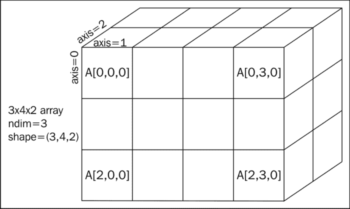
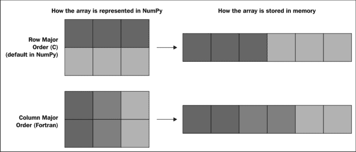
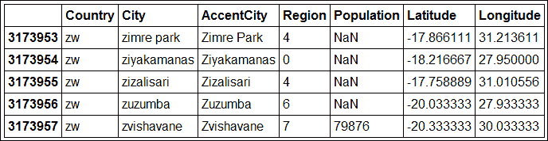

# 第三章：使用 IPython 进行数值计算

虽然 IPython 强大的 shell 和扩展控制台可以被任何 Python 程序员充分利用，但这个软件包最初是为 *科学家设计的工具*。它的确旨在为科学计算提供一种方便的方式，进行 *互动式科学计算*。

IPython 本身并不提供科学计算功能 *本身*，而是提供了一个与强大外部库（如 NumPy、SciPy、Pandas、Matplotlib 等）互动的接口。这些工具共同提供了一个科学计算框架，能够与科学界广泛使用的商业工具如 Matlab 或 Mathematica 竞争。

NumPy 提供了一个支持优化向量操作的多维数组对象。SciPy 提供了多种科学算法（如信号处理、优化等），这些算法基于 NumPy。Pandas 提供了便于处理来自现实数据集的表格数据的结构。Matplotlib 允许轻松绘制图形，从而交互式地可视化各种数据，并生成出版质量的图表。IPython 提供了一个合适的交互框架，使得使用这些工具更加高效。

在本节中，我们将：

+   探索 NumPy 和 Pandas 提供的互动计算可能性

+   理解为什么多维数组适合进行高性能计算

+   了解数组如何在实际应用中使用

+   查找一些包含更高级示例和应用的参考资料

# 向量计算简介

在本节中，我们将介绍**向量化计算**的概念。这是一个至关重要的概念，因为它是使用像 Python 这样的高级语言实现高性能的最简便方法。

## 一个使用 Python 循环进行计算的示例

当今的科学和工程都围绕数字展开。大多数数据处理和数值模拟不过是对大量数值数据进行一系列基本操作，计算机在这方面非常擅长。然而，数据必须以某种合理的方式进行结构化。数值数据的一般结构是 *向量* 和 *矩阵*，更一般地说是 *多维数组*。

在我们更详细地解释什么是数值数组之前，让我们先看一个激励引入这些对象的示例。假设我们已经获取了大量位置的地理数据，包括它们的坐标（纬度和经度），并且我们需要找出最靠近给定兴趣点的位置。例如，我们可能想找出离智能手机用户 GPS 位置最近的餐馆。

如果这些位置存储在 Python 的元组列表中，我们可以写出如下代码：

```py
def closest(position, positions):
    x0, y0 = position
    dbest, ibest = None, None
    for i, (x, y) in enumerate(positions):
        # squared Euclidean distance from every position to the position of interest
        d = (x - x0) ** 2 + (y - y0) ** 2
        if dbest is None or d < dbest:
            dbest, ibest = d, i
    return ibest
```

在这里，我们遍历所有位置。变量`i`保持当前位置信息的索引，而`(x, y)`则包含该位置的坐标。我们关注的位置是`position=(x0, y0)`。在第一次迭代中，当前的位置被记录为最优位置，在接下来的迭代中，只有当前的位置比最优位置更接近时，才会更新最优位置。循环结束时，最接近位置的索引是`ibest`，对应的位置是`positions[ibest]`，而从目标位置到最接近位置的平方距离存储在`dbest`中。为了计算距离，我们使用的是平方欧几里得距离公式，*D = (x - x0)² + (y - y0)²*。

这是一个标准且基础的算法。让我们在一个大型数据集上评估它的性能。我们首先生成一个包含 1000 万个随机位置的列表，如下所示：

```py
In [1]: import random
In [2]: positions = [(random.random(), random.random()) for _ in xrange(10000000)]

```

我们定义了一个名为`positions`的列表，其中包含坐标对，每个数字都是 0 和 1 之间的随机数。现在，使用以下命令设置一些基准：

```py
In [3]: %timeit closest((.5, .5), positions)
1 loops, best of 3: 16.4 s per loop.

```

这个算法处理 1000 万个位置用了 16.4 秒。我们来看看这是否接近 CPU 的理论最大性能。该代码是在一颗 2 GHz 单核处理器上执行的。理论上，它每个周期可以处理四个浮点操作，相当于每秒 80 亿次操作。在我们的算法中，每次迭代涉及五个数学操作和一次比较，总共 50 百万次浮点操作（仅计算数学操作）。理论最大性能应该是 6.25 毫秒。这意味着我们的算法表现比理论最大性能差了大约 2600 倍！

当然，这只是一个非常粗略的估算，理论上的最大性能通常是远未达到的，但 2600 倍的差异显得特别严重。我们能做得更好吗？我们将在下一节中找出答案。

## 数组是什么

在前面的例子中，同样的计算（计算与一个固定点的距离）在大量数字上进行。NumPy 提供了一种新的类型，完美适应这种情况：**多维数组**。那么，数组是什么？

数组是一个组织成多个维度的数据块。一维数组是一个向量，它是一个元素（通常是数字）有序的序列，使用一个整数进行索引。二维数组是一个矩阵，包含通过一对整数索引的元素，即行索引和列索引。更一般地说，*n*维数组是一个由相同数据类型的元素组成的集合，通过一个*n*个整数的元组进行索引。



多维 NumPy 数组的示意图

数组中的所有元素必须具有相同的类型：这称为**数据类型**（`dtype`）。NumPy 中有多种可能的类型：布尔值、带符号/无符号整数、单精度/双精度浮点数、复数、字符串等。还可以定义自定义数据类型。

数组中的元素在内存中是连续存储的。例如，一个大小为 10 的向量中的元素占有 10 个连续的内存地址。当数组的维度为两维或更多时，元素的排序方式有不止一种选择。对于矩阵，元素可以按照**行主序**（也称为**C-顺序**）或**列主序**（也称为**Fortran-顺序**）存储，具体取决于在遍历数组中的所有元素时，横向或纵向索引中哪个索引的变化最快。这个概念在三维或更多维度中得以推广。NumPy 中的默认顺序是 C-顺序，但在创建数组时可以通过 `order` 关键字参数更改这一顺序。



多维数组中行主序和列主序的区别

这个概念可以扩展到任意维度。**步幅**定义了在每个维度中随着遍历所有元素所需的步数。NumPy 自动处理所有这些底层细节，并提供了方便的方式来创建、操作和计算这些数组。大多数时候，我们不需要关心这些细节，可以把我们的变量当作多维数组来思考。然而，了解内部工作原理可以帮助我们修复某些错误，并优化涉及非常大数组的代码部分。

数组相比于原生 Python 类型的优势在于，可以对数组执行非常高效的计算，而不是依赖于 Python 循环。区别在于，循环是在 NumPy 中以 C 语言实现的，而不是用 Python，这样就没有了在循环中解释的开销。实际上，由于 Python 是一种解释型、动态类型语言，每次迭代都会涉及 Python 执行的多种低级操作（如类型检查等）。这些操作通常消耗的时间很小，但当它们重复执行数百万次时，它们会对性能产生不良影响。

此外，现代 CPU 实现了矢量化指令（SSE、AVX、XOP 等），这些指令使用大寄存器（128 位或 256 位），可以包含多个单精度或双精度浮点数。如果 NumPy 使用适当的选项进行编译，数组计算可以利用这些矢量化 CPU 指令，从而比原来快两倍或四倍以上。

这些是使用 NumPy 进行向量化计算可能比 Python 循环更高效的主要原因之一。这与**单指令，多数据**（**SIMD**）计算范式有关，因为在 NumPy 的数组操作中，多个元素会同时执行相同的计算。我们将通过之前的示例来演示这一点。

## 使用数组重新实现示例

让我们使用数组重新编写我们的示例。首先，我们需要导入 NumPy。在 IPython 中，我们可以使用`%pylab`魔法命令（或者通过`ipython --pylab`启动 IPython），该命令会在交互式命名空间中加载 NumPy 和 Matplotlib（NumPy 为`np`，Matplotlib.pyplot 为`plt`）。这是在 IPython 交互式会话中使用 NumPy 的最便捷方法。另一种方法是通过`import numpy`导入 NumPy（或者对于懒人来说使用`import numpy as np`）或使用`from numpy import *`。前者语法更适合脚本使用，而后者可以在交互式会话中使用。在此，以及所有后续章节中，我们将始终假定已激活`pylab`模式，如下所示：

```py
In [1]: %pylab

```

首先，我们需要生成一些随机数据。NumPy 提供了一种高效的方法来完成这一点，具体命令如下：

```py
In [2]: positions = rand(10000000,2)

```

`positions`数组是一个二维数组，包含 1000 万行和两列，列中是介于零和一之间的独立均匀随机数。我们注意到，在数组创建过程中，我们没有使用`for`循环。每当可以使用 NumPy 操作时，都应该避免使用循环。让我们看看这个对象的一些属性：

```py
In [3]: type(positions)
Out[3]: numpy.ndarray
In [4]: positions.ndim, positions.shape
Out[4]: 2, (10000000, 2)

```

`shape` 属性包含数组形状，以整数元组的形式表示。数组的其他重要属性包括：

+   `ndim`：维度的数量，也就是`len(positions.shape)`

+   `size`：元素的总数（即`positions.shape`中所有值的乘积）

+   `itemsize`：每个元素的字节大小（`int32`数据类型为四字节，`float64`为八字节，以此类推）

现在，我们将分两步计算每个位置到我们感兴趣位置的平方距离。我们首先输入以下命令：

```py
In [5]: x, y = positions[:,0], positions[:,1]

```

在这里，`x`和`y`包含所有位置的* x *和* y *坐标。实际上，变量`positions[:,0]`指的是`positions`的第一列（在 Python 中，索引是从零开始的）。这是 Python/NumPy 中特殊的索引语法。方括号`[]`用于访问 Python 容器对象中的元素。方括号内的`:,0`表示所有索引对，其中第一个元素可以是任何值（冒号`:`），第二个元素等于零。由于在 NumPy 中，第一维始终指的是行，第二维指的是列，因此我们这里准确地指的是第一列。同理，`positions[:,1]`指的是第二列，其中包含所有位置的* y *坐标。变量`x`和`y`是二维向量。我们可以通过以下命令计算`distances`变量：

```py
In [6]: distances = (x - .5) ** 2 + (y - .5) ** 2

```

在这里，我们计算了从感兴趣位置（0.5, 0.5）到所有位置的距离向量。事实上，`x - .5`表达式将 0.5 从所有位置的第一列元素中减去。原因是`x`是一个包含 1000 万元素的一维向量，而`0.5`只是一个浮点数。NumPy 的约定遵循向量微积分中的数学约定，也就是说，减法会对数组中的所有元素进行操作。

同样，`(x - .5) ** 2`计算了括号内向量中所有元素的平方。最后，`+`运算符对两个 1000 万长的向量执行逐点操作。

我们看到，NumPy 允许通过非常简单的语法执行向量运算。使用数组进行计算是一种非常特定的编程方式，需要一些时间才能掌握。它与大多数语言中标准的顺序编程方式有很大的不同，但在 Python 中，它效率更高，正如我们在以下命令中所看到的：

```py
In [7]: %timeit exec(In[6])
1 loops, best of 3: 508 ms per loop

```

当我们再次使用`%timeit`魔法函数计算`distances`变量时，我们发现计算速度比纯 Python 版本快得多。即使我们添加了最小元素的计算，这在 NumPy 中也很容易实现，我们仍然发现总时间是*比纯 Python 版本快 30 倍*，如以下命令所示：

```py
In [8]: %timeit ibest = distances.argmin()
1 loops, best of 3: 20 ms per loop

```

总结来说，多维数组的*raison d'être*是尽可能避免在大数据量的数值计算中使用 Python 循环。将计算向量化有时可能比较困难，但从性能提升的角度来看，始终是值得的。

# 创建和加载数组

在本节中，我们将看到如何从头开始或从现有数据中创建和加载数组。这是用 Python 分析数据的第一步。

## 创建数组

有多种方法可以创建数组。在本节中，我们将回顾它们。

### 从头开始，逐个元素

首先，我们可以通过手动指定其系数来创建一个数组。这是创建数组的最直接方式，但在实际中并不常用。NumPy 的`array`函数接受一个元素列表并返回一个对应的 NumPy 数组，如下所示（需要激活 IPython 的`pylab`模式）：

```py
In [1]: x = array([1, 2, 3])
In [2]: x.shape
Out[2]: (3,)
In [3]: x.dtype
Out[3]: dtype('int32')

```

在这里，我们创建了一个一维数组（即向量），包含三个 32 位整数（在 32 位系统中，整数的默认类型）。创建的数组的数据类型是根据`array`中提供的元素自动推断的。我们可以通过`dtype`关键字参数强制指定数据类型，如下所示：

```py
In [4]: x = array([1, 2, 3], dtype=float64)
In [5]: x.dtype
Out[5]: dtype('float64')

```

要创建二维数组（矩阵），我们需要提供一个嵌套的列表，每个内层列表包含一行，如下所示：

```py
In [6]: array([[1, 2, 3], [4, 5, 6]])
Out[6]:
array([[1, 2, 3],
 [4, 5, 6]])

```

要创建一个 *n* 维数组，我们需要提供一个具有 *n* 层递归的嵌套列表。举例来说，我们可以使用两个嵌套的 Python 列表推导式来创建一个乘法表：

```py
def mul1(n):
    return array([[(i + 1) * (j + 1) for i in xrange(n)] for j in xrange(n)])
```

该函数将表格大小作为参数，并从行列表中创建乘法表数组，如以下示例所示：

```py
In [7]: mul1(4)
Out[7]:
array([[ 1,  2,  3,  4],
 [ 2,  4,  6,  8],
 [ 3,  6,  9, 12],
 [ 4,  8, 12, 16]])
In [8]: %timeit mul1(100)
100 loops, best of 3: 5.14 ms per loop

```

稍后我们将看到更高效的创建此乘法表的方法。

### 从头开始，使用预定义模板

手动指定每个系数来创建数组通常不太实用。可以使用 NumPy 中定义的多种便捷函数来创建具有所需形状的典型数组。例如，要创建一个填充 100 个零的向量，可以使用以下命令：

```py
In [1]: x = zeros(100)

```

要创建一个 2D 矩阵，我们需要提供一个包含所需形状的元组作为参数，因此以下命令中使用了双括号：

```py
In [2]: x = zeros((10, 10))

```

默认的数据类型是 `float64`。类似地，`ones` 函数创建一个填充了 `1` 的数组。函数 `identity`、`eye` 和 `diag` 用于创建对角矩阵。

还有一些便捷的函数可以创建具有规律间隔数字的向量，如以下示例所示：

```py
In [5]: arange(2, 10, 2)
Out[5]:
array([2, 4, 6, 8])

```

在这里，我们创建一个从 `2` 到 `10` 之间按步长为 2 线性间隔的数字向量。请注意，第一个数字是 *包括* 在内的（第一个 `2`），但序列中的最后一个数字（`10`）是 *排除* 在外的。这是 Python 中的一个通用约定，实际上比它看起来的更直观。另一个相关的函数是 `linspace`，它与 `arange` 类似，只不过输出向量的 *大小*，而不是步长，是作为第三个参数提供的。这一次，序列的第一个和最后一个元素都会被包括在内。

### 提示

**函数签名**

在 IPython 中，可以通过 `?` 或 `help()` 获取函数签名，包括参数顺序和关键字参数列表。此外，在 Qt 控制台和笔记本中，输入 `linspace(` 会自动弹出 `linspace(` 函数的签名提示框。然后，可以通过按 *Tab* 键展开该提示框。

### 从随机值生成

NumPy 提供了多种随机采样方法，用于生成具有不同概率分布的独立随机值数组。例如，要创建一个 2 x 5 的数组，里面的随机浮点数均匀分布在 `0` 和 `1` 之间，可以使用 `rand` 函数，如下所示：

```py
In [1]: rand(2, 5)
Out[1]:
array([[ 0.925,  0.849,  0.858,  0.269,  0.644],
 [ 0.796,  0.001,  0.183,  0.397,  0.788]])

```

注意在 `rand` 中指定数组形状时没有使用双括号（NumPy 的一个特性）。

### 提示

**IPython 中的数字格式化**

可以使用 `%precision` 魔法命令指定在 IPython 中显示数字的方式。例如，要将浮点数显示为精确到三位小数，可以在 IPython 中输入 `%precision 3`。实际上，可以提供任何格式化字符串，具体请参见文档 %`precision?`。

其他函数包括`randn`（从高斯分布中采样的随机值）、`randint`（随机整数）、`exponential`（指数分布）等。相关函数包括`shuffle`和`permutation`，它们随机排列现有的数组。

## 加载数组

数组结构的主要兴趣在于能够从 Python 或外部源加载现有数据。NumPy 提供了高效便捷的方式来从文本（Python 字符串或文本/CSV 文件）或二进制缓冲区或文件中加载多维数组。此外，Pandas 包在加载表格数据时尤为有用，即包含异构数据类型的表格，而不仅仅是数字。

### 从原生 Python 对象

数据常常以某种原生 Python 对象的形式存在，我们希望将其转换为 NumPy 数组。标准方法是使用`array`函数。当我们通过直接指定值来创建数组时，我们实际上是将 Python 数字列表转换为了数组。

### 从缓冲区或外部文件

创建数组的另一种常见方式是从内存缓冲区或文件中加载数据，无论是二进制数据还是字符串元素。从一个 Python 缓冲区对象（我们知道它的确切数据类型）中，我们可以使用`frombuffer`函数获得一个 NumPy 数组。同样，`fromstring`函数接受 ASCII 文本，值由任意分隔符分隔，或者接受任何数据类型的二进制数据，如下例所示：

```py
In [1]: np.fromstring('1 2 5 10', dtype=int, sep=' ')
Out[1]: array([ 1,  2,  5, 10])

```

`fromfile`、`loadtxt`和`genfromtxt`函数允许从文本文件或二进制文件加载数据，并将其转换为 NumPy 数组。`loadtxt`函数是`genfromtxt`的简化版本，适用于文件格式简单的情况。`fromfile`函数在处理二进制数据时效率很高。例如，要导入 Facebook 数据集的文本文件中的数据，我们可以输入以下命令：

```py
In [1]: cd fbdata
In [2]: loadtxt('0.edges')
Out[2]:
array([[ 236.,  186.],
 ...,
 [ 291.,  339.]])

```

最后，将数组保存到文件中和加载 NumPy 数组一样简单。基本上有两个函数，`save`和`savetxt`，分别将数组保存为二进制文件和文本文件。相关的，`loadz`和`savez`函数也非常方便，用于保存*字典*类型的变量（包括 NumPy 数组）。所有这些函数使用平台无关的文件格式。

### 使用 Pandas

Pandas 是另一个较新的 Python 包，提供了便捷高效的方式来加载和操作来自异构源的数据集。它特别适用于处理表格数据集，而不是纯粹的数值数据（矩阵或数字数组）。它能够处理缺失值和数据对齐问题（例如，时间序列）。加载的数据集可以与 NumPy 一起用于高效的数值计算。简而言之，Pandas 提供了对表格数据的高层次访问，而 NumPy 则提供了对原始同质多维数组的低层次访问。

### 提示

**NumPy 的未来**

NumPy 的创始人 Travis Oliphant 目前正在开发它的继任者 Blaze。这个项目将把 NumPy、Pandas、SciPy、Numba、Theano 等当前提供的许多功能统一到一个框架中。

这里是如何使用 Pandas 加载数据集的一个示例。我们将下载并分析一个关于世界各地大量城市及其人口的数据集。这个数据集由**MaxMind**创建，并可以免费从[`www.maxmind.com`](http://www.maxmind.com)获得。

### 提示

**在线公共数据集**

随着开放数据运动的推进，越来越多的数据变得公开可用。分析有趣的数据是使用本书中描述的工具的好方法，这些工具特别适合执行此类任务。然而，在线找到好的数据集并不总是那么显而易见。以下是一些链接，其中包含指向高质量数据集的指示，这些数据集通常由政府机构、国际组织、大学或研究机构等维护：

+   由 Hilary Mason 维护的研究质量数据集可以在[`bitly.com/bundles/hmason/1`](https://bitly.com/bundles/hmason/1)找到。

+   由 Google 维护的公共数据可在[`www.google.com/publicdata/`](http://www.google.com/publicdata/)上获取。

+   数据目录可以在[`datacatalogs.org/dataset`](http://datacatalogs.org/dataset)上找到。

我们首先下载 ZIP 文件并将其解压到一个文件夹中，如以下命令所示（ZIP 文件约为 40 MB，因此下载可能需要一些时间）：

```py
In [1]: import urllib2, zipfile
In [2]: url = 'http://ipython.rossant.net/'
In [3]: filename = 'cities.zip'
In [4]: downloaded = urllib2.urlopen(url + filename)
In [5]: folder = 'data'
In [6]: mkdir $folder
In [7]: with open(filename, 'wb') as f:
 f.write(downloaded.read())
In [8]: with zipfile.ZipFile(filename) as zip:
 zip.extractall(folder)

```

为了方便起见，我们可以使用命令`%bookmark citiesdata data`创建对新建文件夹的别名。现在，我们将加载已提取的 CSV 文件，使用 Pandas 的`read_csv`函数可以打开任何 CSV 文件，如以下命令所示：

```py
In [9]: import pandas as pd
In [10]: filename = 'data/worldcitiespop.txt'
In [11]: data = pd.read_csv(filename)

```

现在，让我们来探索新创建的`dat`对象：

```py
In [12]: type(data)
Out[12]: pandas.core.frame.DataFrame

```

`data`对象是一个`DataFrame`对象，这是 Pandas 的一种类型，包含一个二维的标签化数据结构，其列可能具有不同的数据类型（如 Excel 电子表格）。像 NumPy 数组一样，`shape`属性返回表格的形状。但与 NumPy 不同，`DataFrame`对象具有更丰富的结构，特别是`keys`方法返回不同列的名称，如以下命令所示：

```py
In [13]: data.shape, data.keys()
Out[13]: ((3173958, 7),
 Index([Country, City, AccentCity, Region, Population, Latitude, Longitude], dtype=object))

```

我们可以看到`data`有超过三百万行，并且包括国家、城市、人口和每个城市的地理坐标在内的七个列。`head`和`tail`方法分别允许我们快速查看表格的开头和结尾。请注意，当在 IPython 笔记本中使用 Pandas 时，显示的数据可以格式化为 HTML 表格，方便阅读，如以下示例所示：

```py
In [14]: data.tail()

```

以下是示例表格：



在 IPython 笔记本中显示 Pandas 表格

我们可以看到一些城市的**NaN**（**不是数字**）值表示人口数据。原因是数据集中并不是所有城市都有可用的人口信息，Pandas 会透明地处理这些缺失值。

我们将在接下来的章节中看到，如何使用这些数据进行操作和计算，从而获取有用的信息。

# 操作数组

一旦 NumPy 数组创建或加载完成，我们基本上可以做三件事：

+   选择

+   操作

+   计算

## 选择

选择指的是在数组中访问一个或多个元素。可以使用 NumPy 或 Pandas 来完成。

### 使用 Pandas

让我们继续使用之前用 Pandas 打开的示例数据。`DataFrame` 的 `data` 对象的每一列都可以通过其名称进行访问。在 IPython 中，按下 Tab 键可以自动补全数据的不同列。以下示例中，我们获取所有城市的名称（`AccentCity` 是城市的完整名称，包含大写字母和重音符号）：

```py
In [15]: data.AccentCity
Out[15]:
0                  Aixas
1             Aixirivali
...
3173956              Zuzumba
3173957           Zvishavane
Name: AccentCity, Length: 3173958

```

这一列是 `Series` 类的一个实例。我们可以使用索引访问某些行。以下示例中，我们获取第 30,001 个城市的名称（记住索引是从零开始的）：

```py
In [16]: data.AccentCity[30000]
Out[16]: 'Howasiyan'

```

因此，我们可以通过索引访问一个元素。但我们如何通过城市名称来获取城市数据呢？例如，我们想获取纽约的人口和 GPS 坐标。一个方法是循环遍历所有城市并检查它们的名称，但由于 Python 对于百万级元素的循环效率很低，这种方法非常慢。Pandas 和 NumPy 提供了更优雅和高效的方式——**布尔索引**。

通常在同一行代码上会执行两个步骤。首先，我们创建一个包含布尔值的数组，表示每个元素是否满足某个条件（此处为城市名称是否为 `New York`）。然后，我们将这个布尔数组作为索引传递给原始数组。结果是原数组的一个子部分，其中仅包含对应 `True` 的元素，如以下示例所示：

```py
In [17]: data[data.AccentCity=='New York']
Out[17]:
 Country      City AccentCity Region  Population   Latitude   Longitude
998166       gb  new york   New York     H7         NaN  53.083333   -0.150000
...
2990572      us  new york   New York     NY     8107916  40.714167  -74.006389

```

相同的语法在 NumPy 和 Pandas 中都适用。在这里，我们找到了十几个名为 `New York` 的城市，但只有一个位于纽约州。要使用 Pandas 访问单个元素，我们可以使用 `.ix` 属性（`ix` 代表索引），如下所示的命令：

```py
In [18]: ny = 2990572
In [19]: data.ix[ny]
Out[19]:
Country             us
City          new york
AccentCity    New York
Region              NY
Population     8107916
Latitude      40.71417
Longitude    -74.00639
Name: 2990572

```

### 使用 NumPy

现在，让我们把这个系列对象转化为一个纯粹的 NumPy 数组。我们从 Pandas 世界转向 NumPy（记住，Pandas 是基于 NumPy 构建的）。我们主要处理所有城市的人口数，如以下命令所示：

```py
In [20]: population = array(data.Population)
In [21]: population.shape
Out[21]: (3173958,)

```

`population` 数组是一个一维向量，包含所有城市的人口数据（如果人口数据不可用，则为 `NaN`）。可以使用基本索引在 NumPy 中访问纽约的人口数据，如下所示：

```py
In [22]: population[ny]
Out[22]: 8107916.0

```

让我们找出哪些城市有实际的人口统计数据。为此，我们将选择人口数组中值不为 NaN 的所有元素。我们可以使用 NumPy 的`isnan`函数，如下所示：

```py
In [23]: isnan(population)
Out[23]: array([ True,  True,  True, ...,  True,  True, False], dtype=bool)
In [24]: x = population[~_]
In [25]: len(x), len(x) / float(len(population))
Out[25]: (47980, 0.015)

```

请注意，`~_`包含`isnan(population)`的负值。我们发现大约有 48,000 个城市，占数据集中所有城市的 1.5%，这些城市有实际的人口统计数据。

### 更多的索引可能性

更一般地说，索引允许我们获取数组的任何部分。我们在上一节中看到过如何使用布尔条件过滤数组。我们也可以直接指定要保留的索引列表。例如，如果`x`是一个一维的 NumPy 数组，`x[i:j:k]`表示一个`x`的视图，只包含那些索引在`i`（包含）和`j`（不包含）之间，并且步长为`k`的元素。如果省略`i`，默认从 0 开始。如果省略`j`，默认到该维度数组的长度。负值表示从末尾开始计数。最后，`k`的默认值为 1。这种符号在多维情况下也有效；例如，`M[i:j,k:l]`创建一个二维数组`M`的子矩阵视图。此外，我们还可以使用`x[::-1]`来反转`x`的顺序。

这些约定中，包含`i`而排除`j`，在处理数组的连续部分时非常方便。例如，假设`x`的大小为`2n`，`x`的前半部分和后半部分分别为`x[:n]`和`x[n:]`。此外，`x[i:j]`的长度就是`j - i`。最后，通常不应在索引中留有`+1`或`-1`的值。

使用数组视图时需要考虑的一个重要点是，它们指向内存中的同一位置。因此，对一个大数组的视图并不意味着内存分配，并且在视图中更改元素的值也会更改原始数组中相应元素的值，如下例所示：

```py
In [1]: x = rand(5)
In [2]: x
Out[2]: array([ 0.5  ,  0.633,  0.158,  0.862,  0.35 ])
In [3]: y = x[::2]
In [4]: y
Out[4]: array([ 0.5  ,  0.158,  0.35 ])
In [5]: y[0] = 1
In [6]: x
Out[6]: array([ 1\.   ,  0.633,  0.158,  0.862,  0.35 ])

```

在这个例子中，`y`包含`x`中所有偶数索引的元素（这里是索引 0、2 和 4）。更改`y[0]`的值会同时更改`y[0]`和`x[0]`，因为`y[0]`指向的是`x`的第一个元素。如果不希望这种行为，可以通过`y = x.copy()`或`y = array(x)`强制创建一个新数组。在后者的情况下，还可以使用`dtype`关键字参数更改`x`的数据类型。

最后，选择数组的一部分的另一种方法是传递一个包含显式整数索引值的数组。这种方式称为**花式索引**。如果`x`是一个一维向量，而`indices`是另一个包含正整数的一维向量（或列表），那么`x[indices]`会返回一个包含`x[indices[0]]`、`x[indices[1]]`等元素的向量。因此，`x[indices]`的长度等于`indices`的长度，而不是`x`的长度，如下所示：

```py
In [7]: ind = [0, 1, 0, 2]
In [8]: x[ind]
Out[8]: array([ 1\.   ,  0.633,  1\.   ,  0.158])

```

请注意，给定的索引在索引数组中可以重复多次。

## 操作

数组可以被操作和重塑，这在执行矢量化计算时有时很有用。还可以通过原始数组的相同副本来构造一个新数组。所有函数的完整列表可以在 NumPy 参考指南中找到：[`docs.scipy.org/doc/numpy/reference/routines.html`](http://docs.scipy.org/doc/numpy/reference/routines.html)。

### 重塑

首先，`reshape`方法允许在保持总元素个数不变的情况下改变数组的形状，如以下示例所示：

```py
In [1]: rand(6)
Out[1]: array([ 0.872,  0.257,  0.083,  0.788,  0.931,  0.232])
In [2]: x.reshape((2, 3))
array([[ 0.872,  0.257,  0.083],
 [ 0.788,  0.931,  0.232]])

```

在`reshape`的参数中，最多可以在一个维度上使用`-1`，以指定其值必须自动推断；例如，使用`x.reshape((2, -1))`，而不是`x.reshape((2, 3))`。

维度的数量也可以通过`ravel`（移除数组中的所有多维结构并返回一个扁平化的向量）、`squeeze`（移除数组形状中的所有单维条目）和`expand_dims`（在数组中插入一个新轴）来改变。

### 重复和拼接

`til`和`repeat`函数允许通过在指定轴上连接相同的数组副本，或按任何次数复制每个元素，来创建数组副本，如以下示例所示：

```py
In [1]: x = arange(3)
In [2]: tile(x, (2, 1))
Out[2]:
array([[0, 1, 2],
 [0, 1, 2]])
In [3]: repeat(x, 2)
Out[3]:
array([0, 0, 1, 1, 2, 2])

```

在这里，我们首先创建一个包含两个相同`x`副本的垂直堆叠数组，然后创建一个新数组，其中`x`的每个元素重复三次。`repeat`的第二个参数也可以是一个列表`reps`，此时系数`x[i]`会重复`reps[i]`次。

例如，让我们使用`reshape`和`tile`创建一个乘法表。其思路是先定义一个包含从`1`到`n`之间所有整数的行向量和列向量，将它们拼接在一起并进行乘法运算，注意乘法是逐元素进行的，如以下代码片段所示：

```py
def mul2(n):
    M = arange(1, n + 1).reshape((-1, 1))
    M = tile(M, (1, n))
    N = arange(1, n + 1).reshape((1, -1))
    N = tile(N, (n, 1))
    return M * N
```

让我们使用以下命令来计时执行此函数：

```py
In [1]: %timeit mul2(100)
10000 loops, best of 3: 188 us per loop

```

这个函数比之前的版本`mul1`快约 27 倍，后者使用了嵌套的 Python 循环。

同样，我们可以使用`hstack`、`vstack`、`dstack`或`concatenate`，分别沿第一个、第二个、第三个或任意维度将多个数组连接成一个数组。

类似地，`hsplit`、`vsplit`、`dsplit`或`split`函数允许沿任意维度将数组拆分为多个连续的子数组，如以下示例所示：

```py
In [1]: x = arange(6)
In [2]: split(x, 2)
Out[2]:
[array([0, 1, 2]), array([3, 4, 5])]
In [3]: split(x, [2,5])
Out[3]:
[array([0, 1]), array([2, 3, 4]), array([5])]

```

`split`的第二个参数是一个整数`n`，此时数组被拆分成*n*个相等的数组，或者是一个包含拆分点索引的列表（即每个子数组第一个元素的索引，除了第一个）。

### 广播

在之前的乘法表示例中，我们不得不重复行和列的相同副本，以便能够乘以形状相同的两个数组`(n, n)`。实际上，`repeat`步骤是不必要的，因为形状不同的数组在特定条件下仍然可以兼容；这就是所谓的**广播**。一般规则是：*当两个维度相等，或其中一个维度为 1 时，它们是兼容的*。例如，两个形状为`(1, n)`和`(n, 1)`的数组`M`和`N`可以相乘，因为在第一维度中，`M`数组的形状为`1`，而在第二维度中，`N`数组的形状为`1`。维度等于 1 的数组会透明且默默地被扩展，以匹配另一个维度，这个操作不涉及内存复制。

因此，我们可以像下面这样去掉乘法表示例中的`tile`操作：

```py
def mul3(n):
    M = arange(1, n + 1).reshape((-1, 1))
    N = arange(1, n + 1).reshape((1, -1))
    return M * N
```

以下命令被使用：

```py
In [1]: timeit mul3(100)
10000 loops, best of 3: 71.8 us per loop

```

最后，`mul3`比`mul2`快大约 2.6 倍，比`mul1`快大约 70 倍！原因在于`tile`涉及数组复制和内存分配，而`mul3`中仅仅进行乘法运算。

### 排列

有几个函数可以用于排列数组的轴。例如，`transpose`函数可以排列数组的维度。描述排列的索引可以通过`axes`关键字参数提供。

其他可能有用的转置函数包括`fliplr`和`flipud`，它们分别用于在左右或上下方向翻转数组，`roll`用于沿给定轴执行元素的循环排列，以及`rot90`用于逆时针旋转数组 90 度。

## 计算

创建和操作数组的关键在于对它们进行高效的矢量化计算。四个基本操作在数组之间进行，前提是它们具有兼容的形状。此外，许多数学函数也可以以矢量化形式应用于 NumPy 数组。

如果`A`和`B`是两个形状兼容的 NumPy 数组，`A + B`、`A - B`、`A x B`和`A / B`都是逐元素操作。特别地，当`A`和`B`是二维矩阵时，`A x B`*不是*矩阵乘积。矩阵乘积是通过`dot`函数来提供的，该函数更一般地计算两个数组的点积。

常见的单目运算包括`-A`、`A ** x`（系数的`x`次幂）、`abs(A)`（绝对值）、`sign(A)`（返回数组中每个元素的符号，值为`-1`、`0`或`1`）、`floor(A)`（向下取整）、`sqrt(A)`（平方根）、`log(A)`（自然对数）、`exp(A)`（指数函数）以及其他许多数学函数（例如三角函数、双曲函数、算术函数等）。

NumPy 还提供了计算数组中所有元素或指定维度元素和（`sum`）或乘积（`prod`）的函数。`axis`关键字参数指定进行求和的维度。此函数返回一个比原数组少一个维度的数组。

`max`和`min`函数返回数组或给定维度中的最大值和最小值。`argmin`和`argmax`函数返回数组中最小或最大元素的索引。例如，继续使用我们的`cities`示例，我们可以对`locate`函数执行以下命令：

```py
In [26]: def locate(x, y):
 # locations is a Ncities x 2 array with the cities positions
 locations = data[['Latitude','Longitude']].as_matrix()
 d = locations - array([x, y])
 # squared distances from every city to the position (x,y)
 distances = d[:,0] ** 2 + d[:,1] ** 2
 # closest in the index of the city achieving the minimum distance to the position (x,y)
 closest = distances.argmin()
 # we return the name of that city
 return data.AccentCity[closest]
In [27]: print(locate(48.861, 2.3358))
Paris

```

`locate`函数接受两个坐标，分别是位置的纬度和经度，并返回离该位置最近的城市名称。`argmin`函数返回离指定位置最近城市的索引。

最后，统计函数如`mean`、`median`、`std`和`var`计算给定维度或整个数组中元素的均值、中位数、标准差和方差。此外，Pandas 对象的`describe`方法提供了几个有用的统计量（包括均值、标准差、50 百分位数或中位数、25 百分位数和 75 百分位数），如下所示：

```py
In [28]: population.describe()
count       47980.000000
mean        47719.570634
std        302888.715626
min             7.000000
25%          3732.000000
50%         10779.000000
75%         27990.500000
max      31480498.000000

```

在模拟数学模型时，一些相关函数可能很有用，包括`diff`（离散差分）、`cumsum`（累积和）和`cumprod`（累积积）。`diff`函数允许计算信号的离散*导数*（最多为标量系数），而`cumsum`计算信号的离散*不定积分*。

# 高级数学处理

NumPy 提供了进行高效数值计算所需的所有类型和例程。SciPy 建立在 NumPy 之上，并实现了大量更高级的数学处理算法。这些算法涵盖了数值计算的多个领域，如优化、线性代数、信号处理、统计等。此外，各种**SciKits**包（如`scikit-learn`、`scikit-image`等）是更先进的包，实施了特定领域（如机器学习、图像处理等）中的高度专业化算法。

我们在这里简要概述了 SciPy 和其他几个包提供的科学计算功能。功能的完整列表可以在官方参考指南中找到：[`docs.scipy.org/doc/scipy/reference/`](http://docs.scipy.org/doc/scipy/reference/)。提供实际的例子和应用超出了本书的范围，感兴趣的读者可以在*NumPy Cookbook*、*Ivan Idris*、*Packt Publishing*和*Learning SciPy for Numerical and Scientific Computing*、*Francisco Blanco-Silva*、*Packt Publishing*中找到各种各样的例子，均由 Packt Publishing 出版。

+   **线性代数**例程由`scipy.linalg`子包提供：线性方程求解器、矩阵例程、特征值问题、矩阵分解等。

+   **优化例程**由`scipy.optimize`子包提供：实值函数的无约束或有约束最小化、全局优化、曲线拟合等。

+   **数值积分器**由`scipy.integrate`子包提供。它可以用来解决微分方程，例如，在物理仿真引擎中使用。

+   **信号处理**算法由`scipy.signal`子包实现：卷积、线性滤波器、小波变换等。`scipy.fftpack`子包实现了傅里叶变换例程，`scipy.ndimage`子包实现了若干图像处理算法。最后，其他感兴趣的图像处理包包括`scikit-image`、`PIL`和`OpenCV`（计算机视觉）。

+   **统计例程**由`scipy.stats`子包提供：概率分布、描述性统计和统计检验等。`SciPy.cluster`实现了聚类算法，可用于在非结构化数据中找到类别。其他相关的统计包包括`Pandas`和`scikit-learn`（机器学习）。

# 总结

本章中，我们介绍了 NumPy 提供的多维数组对象，并展示了它如何用于对数值数据集进行高效计算。特别是，它非常适合加载任何类型的数据，Pandas 包使得这项任务变得简单，即使是复杂的数据文件。使用高级算法也是可能的，借助于强大的外部包，如 NumPy、SciPy 和 SciKit 库，在 IPython 中进行计算。然而，这一主题超出了本书的范围，感兴趣的读者可以在*《NumPy Cookbook, Ivan Idris, Packt Publishing》*和*《Learning SciPy for Numerical and Scientific Computing, Francisco Blanco-Silva, Packt Publishing》*中找到各种实例。

在下一章中，我们将介绍 IPython 和 Matplotlib 提供的可视化相关功能，它们通常与 NumPy 结合使用，用于数据的交互式可视化。
